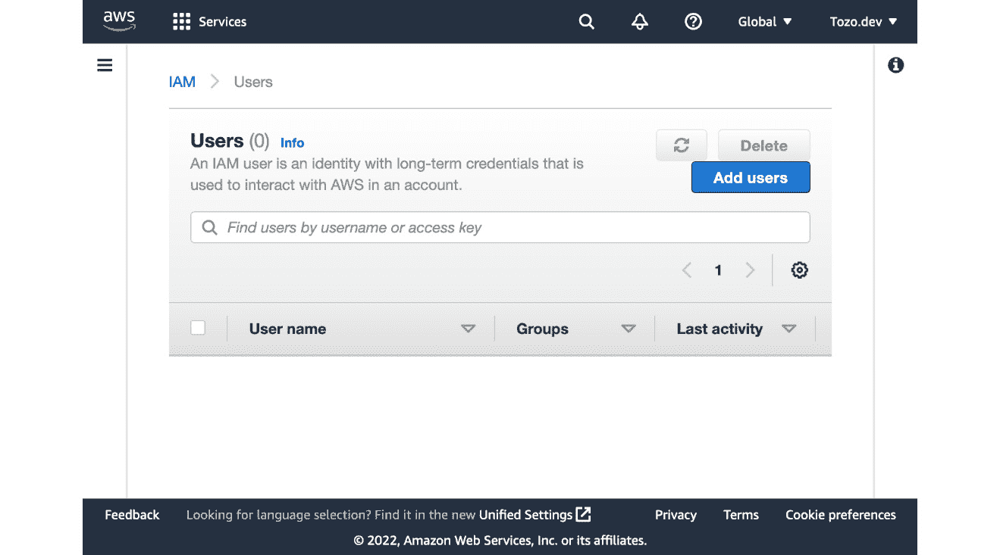
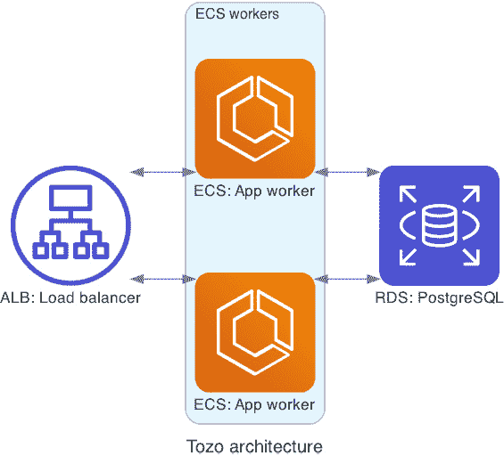
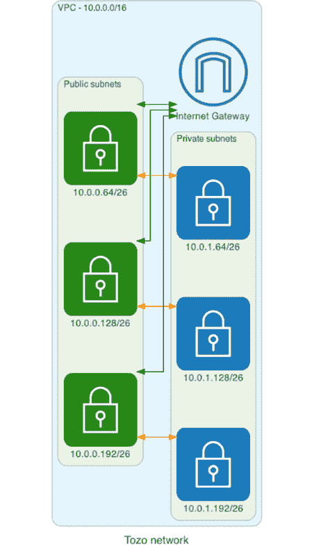
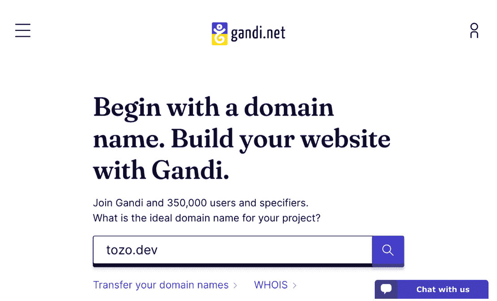
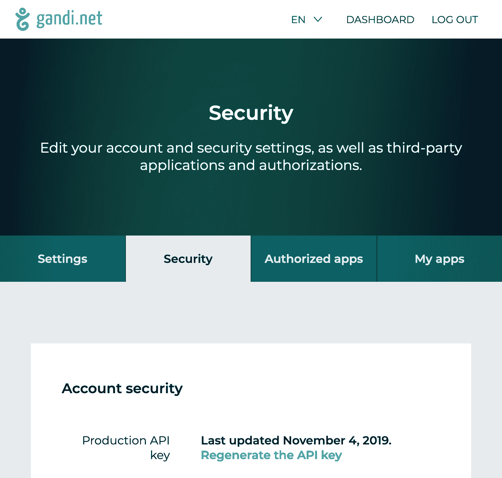
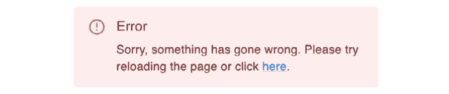

# 第六章：部署和监控您的应用程序

在上一章中，我们构建了应用程序的前端，从而使其成为一个可用的工具。然而，尽管我们可以在本地使用它，但其他用户将无法使用。因此，在本章中，我们将部署我们的应用程序，并通过一个公开的域名[tozo.dev](http://tozo.dev)使其可用。我们还将确保我们正在监控应用程序，以便我们可以快速修复任何问题。

因此，在本章中，你将学习如何为任何需要数据库的 Docker 容器化应用程序在 AWS 中构建基础设施；该基础设施将能够扩展到非常高的负载而无需进行重大更改。你还将学习如何为你的域名设置**域名系统**（**DNS**）和 HTTPS，这两者都适用于任何网站或应用程序。最后，你将了解监控的重要性以及如何轻松地进行监控。

为了使我们的应用程序可以通过公开域名访问，它需要在始终可以通过互联网访问的系统上运行。这可能可以是任何系统，包括我们的本地计算机。然而，该系统需要持续运行并通过稳定的 IP 地址访问。因此，支付由 AWS 管理的专用系统费用会更好。

AWS 费用

本章构建的 AWS 基础设施在无免费层的情况下运行成本约为每月 20 美元。如果你能够使用免费层，这将更便宜（但不是免费的）。另外，AWS 有几个创业信用计划，你可能符合资格。

如果你想停止付费，你需要移除基础设施，这可以通过删除`resource`定义并运行`terraform apply`来完成。

一旦我们为远程系统付费，我们可以将其配置为直接运行我们的应用程序，就像我们的本地系统一样。然而，我们将使用容器化基础设施，因为配置容器以运行我们的应用程序比配置远程系统更容易。

因此，在本章中，我们将涵盖以下主题：

+   使应用程序准备就绪以投入生产

+   部署到 AWS

+   在域名上提供服务

+   发送生产电子邮件

+   监控生产

# 技术要求

要使用配套仓库跟踪本章的发展，请访问[`github.com/pgjones/tozo`](https://github.com/pgjones/tozo)，查看`r1-ch6-start`和`r1-ch6-end`标签之间的提交。

# 使应用程序准备就绪以投入生产

由于我们的生产基础设施将运行容器，我们需要将我们的应用程序容器化。为此，我们需要决定如何提供前端和后端服务，以及如何构建容器镜像。

## 前端服务

到目前为止，在开发过程中，我们使用 `npm run start` 来运行一个提供前端代码的服务器。这被称为 **服务器端渲染**（**SSR**），我们可以在生产环境中继续这样做。然而，利用 **客户端渲染**（**CSR**）要容易得多，因为它不需要一个专门的前端服务器。CSR 通过构建一个可以由任何服务器（而不是专门的前端服务器）提供的文件包来实现，我们将使用后端服务器。

要构建前端包，我们可以使用 `npm run build` 命令。此命令创建一个单独的 HTML 文件 (*frontend/build/index.xhtml*) 和多个静态文件（`css`、`js` 和 `media`）在以下结构中：

```py
tozo
└── frontend
    └── build
        └── static
            ├── css
            ├── js
            └── media
```

静态文件，包括 *frontend/build/static* 文件夹内的文件，可以通过将文件和结构移动到 *backend/src/backend/static* 文件夹来提供服务。然后，我们的后端将自动使用与文件夹结构匹配的路径提供这些文件。

包的剩余部分（即 HTML 文件）需要为任何匹配应用中页面的请求提供服务。为此，我们首先需要一个服务蓝图，通过在 *backend/src/backend/blueprints/serving.py* 中添加以下内容来创建它：

```py
from quart import Blueprint
blueprint = Blueprint("serving", __name__)
```

随后需要将蓝图注册到应用中，通过在 *backend/src/backend/run.py* 中添加以下内容：

```py
from backend.blueprints.serving import blueprint as serving_blueprint
app.register_blueprint(serving_blueprint)
```

由于后端没有关于哪些路径匹配前端页面的知识，它将为任何不匹配后端 API 路径的路径提供前端服务。这是通过 Quart 使用 `<path:path>` URL 变量完成的；因此，将以下内容添加到 *backend/src/backend/blueprints/serving.py* 中：

```py
from quart import render_template, ResponseReturnValue
from quart_rate_limiter import rate_exempt

@blueprint.get("/")
@blueprint.get("/<path:path>")
@rate_exempt
async def index(path: str | None = None) -> ResponseReturnValue:
    return await render_template("index.xhtml")
```

最后，需要将 *frontend/build/index.xhtml* 复制到 *backend/src/backend/templates/index.xhtml* 以用于生产应用，就像我们在容器化应用时做的那样。

由于现在可以从后端服务器提供前端服务，我们现在可以专注于使用一个生产就绪的后端服务器。

## 后端服务

到目前为止，在开发过程中，我们使用 `pdm run start` 来运行和提供后端服务。然而，这不适合生产环境，因为它启动了一个为开发配置的 Hypercorn 服务器（例如，它配置服务器输出调试信息）。

Hypercorn

Quart 是一个需要服务器才能工作的框架。到目前为止，在开发过程中，我们一直使用为开发配置的 Hypercorn。Hypercorn 是一个支持 HTTP/1、HTTP/2 和 HTTP/3 的 Python 服务器，以高效的方式运行，并由 Quart 推荐使用。

我们将使用以下配置来为生产环境配置 Hypercorn，放置在 *hypercorn.toml* 中：

```py
accesslog = "-"
access_log_format = "%(t)s %(h)s %(f)s - %(S)s '%(r)s' %(s)s %(b)s %(D)s"
bind = "0.0.0.0:8080"
errorlog = "-"
```

`accesslog` 和 `errorlog` 配置确保 Hypercorn 在运行时记录每个请求和错误，这将帮助我们了解服务器正在做什么。`bind` 配置 Hypercorn 监听 `8080` 端口，当我们设置下一节的生产基础设施时，我们将网络流量导向此端口。

然后，可以通过以下命令在生产环境中启动服务器：

```py
pdm run hypercorn --config hypercorn.toml backend.run:app
```

现在我们知道了如何在生产环境中提供后端，我们需要关注如何安装我们为此所需的一切。

## 容器化应用程序

要在生产环境中运行应用程序，我们需要在容器中安装应用程序的所有依赖项和代码。我们将通过构建一个包含已安装依赖项和包含代码的容器镜像来实现这一点。

要构建镜像，我们将使用 Dockerfile，因为这是构建镜像最清晰的方式。具体来说，我们将使用多阶段 Dockerfile，第一阶段构建前端，最终阶段安装和运行后端服务器。

Docker 术语

**Dockerfile** 与 Docker 一起用于构建容器镜像。Dockerfile 是一个有序的命令列表，每个命令生成最终镜像的一层，每一层都是基于前一层构建的。最终的镜像需要包含运行其中代码所需的一切。运行实例的镜像被称为**容器**。

### 构建前端阶段

要构建前端，我们需要一个已安装 NodeJS 的系统。由于这是一个常见的要求，我们可以使用 NodeJS 基础镜像。因此，我们可以在**Dockerfile**中添加以下内容，以创建一个名为`frontend`的基于 NodeJS 的阶段：

```py
FROM node:18-bullseye-slim as frontend 
```

接下来，我们需要创建一个工作目录并在其中安装前端依赖项：

```py
WORKDIR /frontend/
COPY frontend/package.json frontend/package-lock.json /frontend/
RUN npm install
```

这最好在将代码复制到镜像之前完成，因为依赖项的变化频率低于代码。

Dockerfile 缓存

Dockerfile 是一系列命令，每个命令在最终镜像中形成一个层。这些层按照 Dockerfile 中给出的顺序构建，对任何层的更改都需要重建所有后续层，并且早期层将被缓存。因此，最好将很少改变的层放在经常改变的层之前。

最后，我们可以将为我们应用程序编写的客户端代码复制到镜像中，并使用以下代码构建它：

```py
COPY frontend /frontend/
RUN npm run build
```

现在我们有一个包含构建好的前端的完整前端阶段。我们将在生产镜像中使用它。

### 构建生产镜像

生产镜像将在**Dockerfile**的第二个阶段构建。此阶段也可以从一个现有的基础镜像开始，因为安装了 Python 的系统也是一个常见的要求。为此，以下内容应添加到**Dockerfile**中：

```py
FROM python:3.10.1-slim-bullseye
```

接下来，我们需要添加一个`init`系统，以确保在 Docker 容器中运行时，正确地向我们的后端服务器发送信号。`dumb-init`是一个流行的解决方案，我之前多次使用过。`dumb-init`通过以下添加进行安装和配置：

```py
RUN apt-get update && apt install dumb-init 
ENTRYPOINT ["/usr/bin/dumb-init", "--"]
```

然后，我们可以配置 Hypercorn 在镜像运行时启动：

```py
EXPOSE 8080
RUN mkdir -p /app
WORKDIR /app
COPY hypercorn.toml /app/
CMD ["pdm", "run", "hypercorn", "--config", "hypercorn.toml", "backend.run:app"]
```

接下来，我们需要安装后端依赖项，这首先需要我们安装`pdm`并配置 Python 以与之协同工作：

```py
RUN python -m venv /ve
ENV PATH=/ve/bin:${PATH}
RUN pip install --no-cache-dir pdm
```

这允许我们使用`pdm`安装后端依赖项：

```py
COPY backend/pdm.lock backend/pyproject.toml /app/
RUN pdm install --prod --no-lock --no-editable 
```

现在，我们可以从前端阶段包含构建好的前端：

```py
COPY --from=frontend /frontend/build/index.xhtml \
    /app/backend/templates/ 
COPY --from=frontend /frontend/build/static/. /app/backend/static/
```

最后，我们可以将后端代码复制到镜像中：

```py
COPY backend/src/ /app/
```

这为我们提供了一个完整的镜像，可用于生产环境。

为了使镜像更安全，我们可以更改将运行服务器的用户。默认情况下，这是带有管理权限和访问权限的`root`用户，而将用户更改为`nobody`则移除了这些权限。我们可以通过添加以下内容来完成此操作：

```py
USER nobody
```

既然我们已经定义了如何构建 Docker 镜像，我们现在可以专注于构建和部署它。

# 部署到 AWS

要部署我们的应用程序，我们需要构建一个运行容器和数据库的基础设施。容器必须可以从公共互联网访问，数据库必须可以从容器访问。这个基础设施很容易用**AWS**构建，我们将使用它。然而，在这本书中，我们将使用 AWS 服务，这些服务在其他云提供商上也有等效服务，如果您希望使用不同的提供商。

首先，我们需要使用电子邮件、密码和您的卡详情创建一个 AWS 账户（通过此链接：[aws.amazon.com](http://aws.amazon.com)）。这个账户将是根账户或超级用户账户；因此，我们将为 Terraform 创建一个额外的**身份和访问管理**（**IAM**）子账户。IAM 用户是通过 IAM **用户**仪表板上的**添加用户**按钮创建的，如图 6.1 所示：



图 6.1：IAM 仪表板（带有添加用户按钮）

我将把这个用户命名为`terraform`，以表明它的用途。它应该只有程序性访问权限，并附加`AdministratorAccess`策略。一旦创建，将显示访问密钥 ID 和秘密访问密钥；两者都需要按照以下方式添加到`*infrastructure/secrets.auto.tfvars*`中：

```py
aws_access_key = "abcd"
aws_secret_key = "abcd"
```

我正在使用`abcd`作为示例，您需要将其替换为您自己的值。

在设置好凭证后，我们可以开始配置 Terraform 以与 AWS 协同工作。首先，通过在`*infrastructure/main.tf*`中现有的 Terraform `required_providers`部分添加以下内容，将 AWS 提供者添加到 Terraform 中：

```py
terraform {
  required_providers {
    aws = {
      source  = "hashicorp/aws"
      version = ">=3.35.0"
    }
  }
}
```

进行此更改后，需要运行`terraform init`以使更改生效。

然后，我们可以配置提供者，这需要选择一个要使用的区域。由于我位于英国伦敦，我将使用`eu-west-2`，然而，我建议您使用离您的客户最近的区域。这可以通过在`*infrastructure/aws.tf*`中添加以下内容来完成：

```py
variable "aws_access_key" {
  sensitive = true
}

variable "aws_secret_key" {
  sensitive = true
}

provider "aws" {
  access_key = var.aws_access_key
  secret_key = var.aws_secret_key
  region     = "eu-west-2"
}
```

现在，我们可以使用 Terraform 来管理 AWS 基础设施，这意味着我们可以专注于我们希望该基础设施成为什么样子。

## 设计生产系统

在*第二章*，“使用 Quart 创建可重用后端”，我们决定构建一个三层架构，其中有一个后端 API 与前端和数据库通信。这意味着在 AWS 中，我们需要运行数据库、后端在容器中，以及一个负载均衡器来监听来自前端的外部请求。为此，我们可以使用*图 6.2*中显示的服务和设置：



图 6.2：预期的 AWS 架构

此架构使用以下 AWS 服务：

+   **关系数据库服务**（**RDS**）运行 PostgreSQL 数据库

+   **弹性容器服务**（**ECS**）运行应用容器

+   **应用程序负载均衡器**（**ALB**）接受来自互联网（前端）的连接

此外，我们将使用 ECS 的**Fargate**变体，这意味着我们不需要管理运行容器的系统。

通过使用这些托管服务，我们可以支付 AWS 来管理服务器的大部分工作，使我们能够专注于我们的应用。现在我们可以设置网络以支持这种架构。

## 设置网络

要构建我们的架构，我们必须从基础开始，即网络。我们需要定义系统之间如何相互通信。在*图 6.3*中，你可以看到我们正在努力实现一个单一**虚拟私有云**（**VPC**），包含公共和私有子网。



图 6.3：预期的网络设置

关键的是，私有子网只能与公共子网通信，但不能直接与互联网通信。这意味着我们可以将数据库放在私有子网中，将应用和 ALB 放在公共子网中，从而增加一个额外的安全层，防止未经授权的数据库访问。

VPC

VPC 是一个包含资源的虚拟网络。我们将为所有资源使用单个 VPC。

要构建网络，我们首先需要在*infrastructure/aws_network.tf*中添加以下内容来为我们的系统创建一个 AWS VPC：

```py
resource "aws_vpc" "vpc" {
  cidr_block         = "10.0.0.0/16"
  enable_dns_support = true
}
```

CIDR 表示法

AWS 使用`/`). IPv4 地址由 4 个字节组成（每个字节是 8 位），每个字节以数字形式书写，并用点（`.`）分隔。子网掩码数字表示试地址的前导位数必须与给定地址匹配才能被认为是给定范围内的地址。以下是一些 CIDR 范围的示例：

- `10.0.0.0/16` 表示在此范围内前 16 位（或前两个字节）必须匹配（即，任何以`10.0`开头的地址都在此范围内）

- `10.0.0.64/26` 表示前 26 位或前 3 个字节以及最终字节的第一个 2 位必须匹配（即，任何在`10.0.0.64`和`10.0.0.128`（不包括`10.0.0.128`）之间的地址）

- `0.0.0.0/0` 表示任何 IP 地址都匹配

使用这种 VPC 设置，我们将使用的所有 IP 地址都将位于 `10.0.0.0/16` CIDR 块中，因此将以 `10.0` 开头。这个块是 AWS VPC 的传统选择。

我们现在可以将 VPC 划分为子网或子网络，因为这允许我们限制哪些子网可以相互通信以及与公共互联网通信。首先，我们将 VPC 划分为 CIDR 块 `10.0.0.0/24` 中的公共子网和 `10.0.1.0/24` 中的私有子网。我选择这些块，因为它们非常清楚地表明以 `10.0.0` 开头的任何 IP 地址将是公共的，而 `10.0.1` 将是私有的。

由于 AWS 区域被划分为可用区，我们将为每个区域创建一个公共子网和一个私有子网，总共可达四个子网。四个是最佳选择，因为它由 2 位表示，因此使得 CIDR 范围更容易表达。因此，这些子网的子网掩码为 26，因为它等于 24 加上所需的 2 位。这是通过在 *infrastructure/aws_network.tf* 中添加以下内容来完成的：

```py
data "aws_availability_zones" "available" {}

resource "aws_subnet" "public" {
  availability_zone = data.aws_availability_zones.available.names[count.index]
  cidr_block        = "10.0.0.${64 * count.index}/26"
  count             = min(4, length(data.aws_availability_zones.available.names))
  vpc_id            = aws_vpc.vpc.id
}

resource "aws_subnet" "private" {
  availability_zone = data.aws_availability_zones.available.names[count.index]
  cidr_block        = "10.0.1.${64 * count.index}/26"
  count             = min(4, length(data.aws_availability_zones.available.names))
  vpc_id            = aws_vpc.vpc.id
}
```

可用区

AWS 区域被划分为多个（通常为三个）**可用区**（通常称为 **AZs**）。每个区域都是一个与其他区域物理隔离的数据中心，这样如果某个区域发生故障（例如，火灾），就不会影响到其他区域。因此，将我们的系统放置在多个区域中，可以提供更强的容错能力。

如其 **公共** 名称所暗示的，我们希望公共子网中的系统能够与互联网进行通信。这意味着我们需要向 VPC 添加一个互联网网关，并允许网络流量在它和公共子网之间路由。这通过在 *infrastructure/aws_network.tf* 中添加以下内容来完成：

```py
resource "aws_internet_gateway" "internet_gateway" {
  vpc_id = aws_vpc.vpc.id
}
resource "aws_route_table" "public" {
  vpc_id = aws_vpc.vpc.id

  route {
    cidr_block = "0.0.0.0/0"
    gateway_id = aws_internet_gateway.internet_gateway.id
  }
}

resource "aws_route_table_association" "public_gateway" {
  count          = length(aws_subnet.public)
  subnet_id      = aws_subnet.public[count.index].id
  route_table_id = aws_route_table.public.id
}
```

最后，在网络的方面，我们需要一个负载均衡器来接受来自互联网的连接并将它们路由到应用容器。首先，让我们为负载均衡器添加一个安全组，允许在端口 `80` 和 `443` 上进行入站（入站）连接以及任何出站（出站）连接；我们在 *infrastructure/aws_network.tf* 中这样做：

```py
resource "aws_security_group" "lb" {
  vpc_id = aws_vpc.vpc.id

  ingress {
    protocol    = "tcp"
    from_port   = 80
    to_port     = 80
    cidr_blocks = ["0.0.0.0/0"]
  }

  ingress {
    protocol    = "tcp"
    from_port   = 443
    to_port     = 443
    cidr_blocks = ["0.0.0.0/0"]
  }

  egress {
    protocol    = "-1"
    from_port   = 0
    to_port     = 0
    cidr_blocks = ["0.0.0.0/0"]
  }
}
```

协议和端口

默认情况下，网站使用 TCP（协议）在端口 `80` 上为 HTTP 请求提供服务，在端口 `443` 上为 HTTPS 请求提供服务。端口可以更改，但这样做并不推荐，因为大多数用户不会理解如何在他们的浏览器中进行匹配更改。

HTTP 的下一个版本，HTTP/3，将使用 UDP 作为协议，服务器定义的任何端口都可能被使用。然而，这项技术目前还处于起步阶段，因此不会在这本书中使用。

现在可以通过在 *infrastructure/aws_network.tf* 中添加以下内容来添加负载均衡器本身：

```py
resource "aws_lb" "tozo" {
  name               = "alb"
  subnets            = aws_subnet.public.*.id
  load_balancer_type = "application"
  security_groups    = [aws_security_group.lb.id]
}

resource "aws_lb_target_group" "tozo" {
  port        = 8080
  protocol    = "HTTP"
  vpc_id      = aws_vpc.vpc.id
  target_type = "ip"

  health_check {
    path = "/control/ping/"
  }
  lifecycle {
    create_before_destroy = true
  }

  stickiness {
    enabled = true
    type    = "lb_cookie"
  }
}
```

负载均衡

负载均衡器将尝试在目标组中分配请求，以平衡目标组中每个目标所承受的负载。因此，可以使用多台机器来服务单个负载均衡器后面的请求。

在负载均衡器就位并准备就绪后，我们现在可以开始向网络中添加系统，从数据库开始。

## 添加数据库

现在我们可以将 PostgreSQL 数据库添加到私有子网中，然后通过安全组，我们可以确保数据库只能与公共子网中的系统通信。这使得攻击者更难直接访问数据库。因此，为了做到这一点，以下内容应添加到 *infrastructure/aws_network.tf*：

```py
resource "aws_db_subnet_group" "default" {
  subnet_ids = aws_subnet.private.*.id
}

resource "aws_security_group" "database" {
  vpc_id = aws_vpc.vpc.id

  ingress {
    from_port   = 5432
    to_port     = 5432
    protocol    = "TCP"
    cidr_blocks = aws_subnet.public.*.cidr_block
  }

  egress {
    from_port   = 0
    to_port     = 0
    protocol    = "-1"
    cidr_blocks = aws_subnet.public.*.cidr_block
  }
}
```

数据库本身是通过 `aws_db_instance` Terraform 资源创建的，这需要定义相当多的配置变量。以下代码给出的是一组安全的变量，用于在 AWS 免费层上运行数据库。以下内容应添加到 *infrastructure/aws.tf*：

```py
variable "db_password" {
  sensitive = true
} 
resource "aws_db_instance" "tozo" {
  apply_immediately       = true
  allocated_storage       = 20
  backup_retention_period = 5
  db_subnet_group_name    = aws_db_subnet_group.default.name
  deletion_protection     = true
  engine                  = "postgres"
  engine_version          = "14"
  instance_class          = "db.t3.micro"
  db_name                 = "tozo"
  username                = "tozo"
  password                = var.db_password
  vpc_security_group_ids  = [aws_security_group.database.id]
}
```

`db_password` 应该添加到 *infrastructure/secrets.auto.tfvars* 中，其值最好由密码生成器在非常强的设置下创建（这个密码永远不需要记住或输入）。

随着你的应用程序使用量的增长，我建议你将 `instance_class` 的值更改为更大的机器，启用 `multi_az` 以确保在可用区故障情况下的鲁棒性，并启用 `storage_encrypted`。

AWS 网络界面

在这本书中，我们故意将所有基础设施定义为代码，并忽略 AWS 网络界面。这样做最好，因为它确保我们可以始终通过运行 `terraform apply` 来恢复基础设施到已知的工作状态，并且这意味着我们有一个可审计的变更历史。然而，使用网络界面检查基础设施并检查一切是否如预期仍然非常有用。

在运行 `terraform apply` 之后，你应该看到 RDS 中正在运行数据库，这意味着我们可以创建一个集群来运行应用程序。

## 运行集群

我们将使用 ECS 集群来运行我们的 Docker 镜像，并且我们还将使用 Fargate 运行 ECS 集群，这意味着我们不需要管理服务器或集群本身。虽然 Fargate 不属于 AWS 免费层并且会花费更多，但避免自己管理这些事情是值得的。

在我们可以设置 ECS 之前，我们首先需要一个存储 Docker 镜像的仓库，以及 ECS 从中拉取和运行镜像的地方。我们可以通过在 *infrastructure/aws_cluster.tf* 中添加以下内容来使用 **弹性容器注册**（**ECR**）：

```py
resource "aws_ecr_repository" "tozo" {
  name = "tozo"
}

resource "aws_ecr_lifecycle_policy" "tozo" {
  repository = aws_ecr_repository.tozo.name

  policy = jsonencode({
    rules = [
      {
        rulePriority = 1
        description  = "Keep prod and latest tagged images"
        selection = {
          tagStatus     = "tagged"
          tagPrefixList = ["prod", "latest"]
          countType     = "imageCountMoreThan"
          countNumber   = 9999
        }
        action = {
          type = "expire"
        }
      },
      {
        rulePriority = 2
        description  = "Expire images older than 7 days"
        selection = {
          tagStatus   = "any"
          countType   = "sinceImagePushed"
          countUnit   = "days"
          countNumber = 7
        }
        action = {
          type = "expire"
        }
      }
    ]
  })
}
```

除了创建仓库本身，这还确保了旧镜像被删除，这对于随着时间的推移降低存储成本至关重要。标记为 `prod` 的镜像被保留，因为这些镜像应用于应该运行的镜像（Docker 会将 `latest` 添加到最近构建的镜像）。

Docker 镜像标记

当构建 Docker 镜像时，可以给它添加标签以识别它。默认情况下，它将被标记为 `latest`，直到构建了新的镜像并取走该标签。因此，最好以有用的方式标记镜像，以便知道它们代表什么。

我们现在可以创建 ECS 集群，这需要一个任务定义，然后是一个在集群中运行任务的服务。从任务开始，我们需要一个 IAM 角色来执行，我们将称之为 `ecs_task_execution`，以及一个 IAM 角色让任务存在，我们将称之为 `ecs_task`。这些是通过在 *infrastructure/aws_cluster.tf* 中添加以下内容来创建的：

```py
resource "aws_iam_role" "ecs_task_execution" {
  assume_role_policy = jsonencode({
    Version = "2012-10-17"
    Statement = [
      {
        Action = "sts:AssumeRole"
        Principal = {
          Service = "ecs-tasks.amazonaws.com"
        }
        Effect = "Allow"
        Sid    = ""
      }
    ]
  })
}
resource "aws_iam_role_policy_attachment" "ecs-task" { 
  role       = aws_iam_role.ecs_task_execution.name 
  policy_arn = "arn:aws:iam::aws:policy/service-role/AmazonECSTaskExecutionRolePolicy" 
}
resource "aws_iam_role" "ecs_task" {
  assume_role_policy = jsonencode({ 
    Version = "2012-10-17"
    Statement = [
      {
        Action = "sts:AssumeRole"
        Principal = {
          Service = "ecs-tasks.amazonaws.com"
        }
        Effect = "Allow"
        Sid    = ""
      }
    ]
  })
} 
```

策略附加用于将现有的执行策略附加到 IAM 角色上。

在创建了角色之后，我们现在可以定义 ECS 任务本身。这需要包括所有在生产环境中正确运行代码所需的环境变量。因此，应该以与 `db_password` 相同的方式创建一个 `app_secret_key` 变量，并将其首先添加到 *infrastructure/secrets.auto.tfvars* 文件中。然后，以下内容可以添加到 *infrastructure/aws_cluster.tf*：

```py
variable "app_secret_key" { 
  sensitive = true 
} 
resource "aws_ecs_task_definition" "tozo" {
  family                   = "app"
  network_mode             = "awsvpc"
  requires_compatibilities = ["FARGATE"]
  cpu                      = 256
  memory                   = 512
  execution_role_arn       = aws_iam_role.ecs_task_execution.arn
  task_role_arn            = aws_iam_role.ecs_task.arn
  container_definitions = jsonencode([{
    name      = "tozo"
    image     = "${aws_ecr_repository.tozo.repository_      url}:latest"
    essential = true
    environment = [
      {
        name  = "TOZO_BASE_URL"
        value = "https://tozo.dev"
      },
      {
        name  = "TOZO_SECRET_KEY"
        value = var.app_secret_key
      },
      {
        name  = "TOZO_QUART_DB_DATABASE_URL"
        value = "postgresql://tozo:${var.db_password}@${aws_db_          instance.tozo.endpoint}/tozo"
      },
      {
        name  = "TOZO_QUART_AUTH_COOKIE_SECURE"
        value = "true"
      },
      {
        name  = "TOZO_QUART_AUTH_COOKIE_SAMESITE"
        value = "Strict"
      }
    ]
    portMappings = [{
      protocol      = "tcp"
      containerPort = 8080
      hostPort      = 8080
    }]
  }])
}
```

就像数据库一样，随着客户数量的增加和应用的扩展，`cpu` 和 `memory` 的值可以增加以满足需求。

我们现在已经创建了服务将运行的任务；然而，在我们可以创建服务之前，我们需要通过在 *infrastructure/aws_network.tf* 中添加以下内容来允许负载均衡器和运行中的容器（这些容器正在暴露端口 `8080`）之间的连接：

```py
resource "aws_security_group" "ecs_task" {
  vpc_id = aws_vpc.vpc.id

  ingress {
    protocol        = "tcp"
    from_port       = 8080
    to_port         = 8080
    security_groups = [aws_security_group.lb.id]
  }

  egress {
    protocol    = "-1"
    from_port   = 0
    to_port     = 0
    cidr_blocks = ["0.0.0.0/0"]
  }
}
```

这最终允许通过在 *infrastructure/aws_cluster.tf* 中使用以下代码来定义服务和集群：

```py
resource "aws_ecs_cluster" "production" {
  name = "production"
}
resource "aws_ecs_service" "tozo" {
  name            = "tozo"
  cluster         = aws_ecs_cluster.production.id
  task_definition = aws_ecs_task_definition.tozo.arn
  desired_count   = 1
  launch_type     = "FARGATE"

  network_configuration {
    security_groups  = [aws_security_group.ecs_task.id]
    subnets          = aws_subnet.public.*.id
    assign_public_ip = true
  } 
  load_balancer {
    target_group_arn = aws_lb_target_group.tozo.arn
    container_name   = "tozo"
    container_port   = 8080
  } 
  lifecycle {
    ignore_changes = [task_definition, desired_count]
  }
}
```

`desired_count` 指的是运行中的容器数量，应该随着你的应用处理更多请求而增加；至少三个意味着有容器在不同的可用区运行，因此更健壮。

自动扩展

随着你的应用流量增长，你可以通过分配更大的机器和增加 `desired_count` 来扩展基础设施。你应该能够通过这种方式扩展到非常高的流量（并且当你这样做的时候，恭喜你）。然而，如果你的流量是周期性的（例如，白天比晚上有更多的流量），那么使用自动扩展可以节省成本。自动扩展是指随着流量的增加自动分配更多资源。

现在我们有了准备就绪的集群；我们现在需要的只是将 Docker 镜像构建并放置到仓库中。

## 添加持续部署

一切准备就绪后，我们现在可以通过构建容器镜像，将其上传到 ECR 仓库，并通知 ECS 部署新镜像来部署更改。这是在 GitHub 仓库的主要分支发生更改时最好执行的操作。我们可以使用 GitHub action 来完成这项工作，就像在 *第一章* 的 *使用 GitHub 采纳协作开发流程* 部分中一样，设置我们的开发系统。

首先，我们需要创建一个 IAM 用户，该用户有权将 Docker 镜像推送到 ECR 仓库，并通知 ECS 部署新镜像。此用户还需要一个访问密钥，因为我们将会使用它来验证 `push` 和 `deploy` 命令。以下代码创建此用户，并应放置在 *infrastructure/aws.tf* 文件中：

```py
resource "aws_iam_user" "cd_bot" {
  name = "cd-bot"
  path = "/"
}

resource "aws_iam_user_policy" "cd_bot" {
  name = "cd-bot-policy"
  user = aws_iam_user.cd_bot.name

  policy = jsonencode({
    Version = "2012-10-17"
    Statement = [
      {
        Action   = "ecr:*"
        Effect   = "Allow"
        Resource = aws_ecr_repository.tozo.arn
      },
      {
        Action   = "ecr:GetAuthorizationToken"
        Effect   = "Allow"
        Resource = "*"
      },
      {
        Action   = "ecs:UpdateService"
        Effect   = "Allow"
        Resource = aws_ecs_service.tozo.id
      }
    ]
  })
}

resource "aws_iam_access_key" "cd_bot" {
  user = aws_iam_user.cd_bot.name
}
```

由于持续部署将以 GitHub 动作的形式运行，我们需要将此访问密钥和仓库 URL 作为 `github_actions_secret` 可用；这通过在 *infrastructure/github.tf* 文件中添加以下内容来完成：

```py
resource "github_actions_secret" "debt_aws_access_key" {
  repository      = github_repository.tozo.name
  secret_name     = "AWS_ACCESS_KEY_ID"
  plaintext_value = aws_iam_access_key.cd_bot.id
}

resource "github_actions_secret" "debt_aws_secret_key" {
  repository      = github_repository.tozo.name
  secret_name     = "AWS_SECRET_ACCESS_KEY"
  plaintext_value = aws_iam_access_key.cd_bot.secret
}

resource "github_actions_secret" "debt_aws_repository_url" {
  repository      = github_repository.tozo.name
  secret_name     = "AWS_REPOSITORY_URL"
  plaintext_value = aws_ecr_repository.tozo.repository_url
}
```

这些秘密现在可以在持续部署操作中使用。此操作由两个作业组成：

+   第一个作业构建 Docker 镜像并将其推送到 ECR 仓库

+   第二个作业指示 ECS 部署它（通过替换当前运行的镜像）

从第一个作业开始，以下内容应添加到 *.github/workflows/cd.yml* 文件中：

```py
name: CD

on:
  push:
    branches: [ main ]
  workflow_dispatch:

jobs:
  push:
    runs-on: ubuntu-latest
    env:
      AWS_REPOSITORY_URL: ${{ secrets.AWS_REPOSITORY_URL }}

    steps:
      - uses: actions/checkout@v3

      - name: Configure AWS credentials
        uses: aws-actions/configure-aws-credentials@v1
        with:
          aws-access-key-id: ${{ secrets.AWS_ACCESS_KEY_ID }}
          aws-secret-access-key: ${{secrets.AWS_SECRET_ACCESS_            KEY}}
          aws-region: eu-west-2

      - name: Login to Amazon ECR
        uses: aws-actions/amazon-ecr-login@v1

      - name: Fetch a cached image
        continue-on-error: true
        run: docker pull $AWS_REPOSITORY_URL:latest
      - name: Build the image
        run: | 
          docker build \
            --cache-from $AWS_REPOSITORY_URL:latest \ 
            -t $AWS_REPOSITORY_URL:latest \
            -t $AWS_REPOSITORY_URL:$GITHUB_SHA .
      - name: Push the images
        run: docker push --all-tags $AWS_REPOSITORY_URL
```

为了节省构建时间，最后构建的镜像，标记为 `latest`，会被拉取并用作缓存。构建的镜像随后通过标记提交哈希来识别。

现在，我们可以添加一个 `deploy` 作业，该作业应指示 ECS 部署为此提交构建的镜像。这是通过向已标记提交哈希的镜像添加 `prod` 标签，然后通知 ECS 运行它来完成的。这通过在 *.github/workflows/cd.yml* 文件中添加以下内容来实现：

```py
  deploy:
    needs: push
    runs-on: ubuntu-latest
    env:
      AWS_REPOSITORY_URL: ${{ secrets.AWS_REPOSITORY_URL }} 
    steps:
      - name: Configure AWS credentials
        uses: aws-actions/configure-aws-credentials@v1
        with:
          aws-access-key-id: ${{ secrets.AWS_ACCESS_KEY_ID }}
          aws-secret-access-key: ${{secrets.AWS_SECRET_ACCESS_KEY}}
          aws-region: eu-west-2

      - name: Inform ECS to deploy a new image
        run: |
          MANIFEST=$(aws ecr batch-get-image --region eu-west-2 --repository-name tozo --image-ids imageTag=$GITHUB_SHA --query 'images[].imageManifest' --output text)
          aws ecr put-image --region eu-west-2 --repository-name tozo --image-tag prod --image-manifest "$MANIFEST" || true
          aws ecs update-service --cluster production --service tozo --region eu-west-2 --force-new-deployment
```

此作业是幂等的，重新运行它将部署与之关联的特定提交。这意味着可以根据需要重新运行它来**回滚**部署。

部署问题和回滚

并非每次部署都会顺利，部署失败可能发生在部署过程中或部署之后。如果部署本身失败，ECS 将自动保持之前部署的运行。如果失败发生在部署之后，你可以通过重新运行旧的 `deploy` 作业回滚到安全的前一个版本。

现在，每当主分支发生更改时，你应该看到该更改会自动在生产环境中生效。此外，如果正在运行的作业存在错误或问题，你可以重新运行旧的 `deploy` 作业。这是一种非常高效的应用程序开发方式。

尽管我们可以通过 ALB URL 访问应用程序，但我们的用户期望使用一个漂亮的域名，这是我们接下来要关注的。

# 在域名上提供服务

我们希望有一个易于记忆的域名，以便用户可以找到并识别我们的应用程序，这意味着我们需要从域名注册商那里购买一个。我喜欢使用 Gandi ([gandi.net](http://gandi.net)) 或 AWS，因为它们值得信赖，然而，我喜欢将域名与托管提供商分开，以防万一出现问题；因此，我将在这本书中使用 Gandi，并已用它注册了 [tozo.dev](http://tozo.dev) 在接下来的几年里，如图 6.4 所示：



图 6.4：注册域名的 Gandi 主页

域名注册商将允许指定域名相关的 DNS 记录；要在 Gandi 中这样做，我们需要通过在*infrastructure/main.tf*中添加以下高亮代码将`gandi`提供程序添加到`terraform`：

```py
terraform {
  required_providers {
    gandi = {
      source = "go-gandi/gandi"
      version = "~> 2.0.0"
    }
  }
}
```

DNS

虽然域名对人类来说容易记忆，但浏览器需要相应的 IP 地址才能发出请求。这就是 DNS 的目的，它将域名解析为正确的 IP 地址。这是浏览器自动完成的，但如果你想手动尝试，可以使用`dig`工具（例如，`dig tozo.dev`）。单个域名将具有多个 DNS 记录。到目前为止，我们已经讨论了包含域名 IPv4 地址的`A`记录，还有一个用于 IPv6 地址的`AAA`记录，一个指向另一个域名的`A`或`AAA`记录的`ALIAS`记录，一个用于邮件服务器信息的`MX`记录（我们将在本章的*发送生产电子邮件*部分使用），一个将子域名别名为另一个域名的`CNAME`记录，以及其他一些记录。

通过`terraform init`初始化后，我们可以开始使用`terraform apply`来执行这些更改。首先，我们需要从 Gandi 获取一个生产 API 密钥，它位于**安全**部分，如图 6.5 所示：



图 6.5：Gandi 安全部分；注意生产 API 密钥部分

API 密钥需要按照以下方式添加到*infrastructure/secrets.auto.tfvars*（你的密钥将不同于我的`abcd`示例）：

```py
gandi_api_key = "abcd"
```

然后，使用以下内容在*infrastructure/dns.tf*中配置`gandi`提供程序：

```py
variable "gandi_api_key" {
  sensitive = true
}

provider "gandi" {
  key = var.gandi_api_key
}
```

`gandi`提供程序现在已设置好，可以用来设置 DNS 记录。我们需要两个记录：一个用于域名的`ALIAS`记录，一个用于[www.tozo.dev](http://www.tozo.dev)子域名的`CNAME`记录。以下内容应添加到*infrastructure/dns.tf*：

```py
data "gandi_domain" "tozo_dev" {
  name = "tozo.dev"
}

resource "gandi_livedns_record" "tozo_dev_ALIAS" {
  zone   = data.gandi_domain.tozo_dev.id
  name   = "@"
  type   = "ALIAS"
  ttl    = 3600
  values = ["${aws_lb.tozo.dns_name}."]
}
resource "gandi_livedns_record" "tozo_dev_www" {
  zone   = data.gandi_domain.tozo_dev.id
  name   = "www"
  type   = "CNAME"
  ttl    = 3600
  values = ["tozo.dev."]
}
```

在 DNS 记录就绪后，我们现在可以专注于添加 HTTPS（SSL）。

## 保护连接

确保用户与应用之间的通信加密是最佳实践；然而，当通信包含敏感信息，如用户的密码时，这变得至关重要。因此，我们将只为我们的应用使用加密通信。

为了保护这个连接，我们可以利用 HTTPS 通过 SSL（或 TLS）来保护，这是广泛支持的并且易于使用。为此，我们需要获得浏览器将识别的加密证书。幸运的是，Let’s Encrypt 将免费为我们颁发证书。Let’s Encrypt 可以通过`acme`提供程序与 Terraform 一起使用，通过在*infrastructure/main.tf*中添加以下高亮代码并运行`terraform init`来激活：

```py
terraform {
  required_providers {
    acme = {
      source  = "vancluever/acme"
      version = "~> 2.0"
    }
  }
}
```

证书颁发机构

要启用 HTTPS，我们可以创建自己的自签名证书；这会起作用，但浏览器会显示警告。此警告将表明浏览器不信任所提供的证书属于该域名。为了避免此警告，我们需要一个公认的证书授权机构来签署我们的证书。为此，证书授权机构必须确认域名的所有者就是请求证书的人。有许多其他证书授权机构会为此服务收费，但 Let’s Encrypt 是免费的！

要为域名获取证书，我们需要向 Let’s Encrypt 证明我们控制该域名。我们可以通过添加以下内容到*infrastructure/certs.tf*中的`acme`提供程序来完成此操作：

```py
provider "acme" {
  server_url = "https://acme-v02.api.letsencrypt.org/directory"
}

resource "tls_private_key" "private_key" {
  algorithm = "RSA"
}

resource "acme_registration" "me" {
  account_key_pem = tls_private_key.private_key.private_key_pem
  email_address   = "pgjones@tozo.dev"
}

resource "acme_certificate" "tozo_dev" {
  account_key_pem = acme_registration.me.account_key_pem
  common_name     = "tozo.dev"

  dns_challenge {
    provider = "gandiv5"

    config = {
      GANDIV5_API_KEY = var.gandi_api_key
    }
  }
}
resource "aws_acm_certificate" "tozo_dev" {
  private_key       = acme_certificate.tozo_dev.private_key_pem
  certificate_body  = acme_certificate.tozo_dev.certificate_pem
  certificate_chain = "${acme_certificate.tozo_dev.certificate_pem}${acme_certificate.tozo_dev.issuer_pem}"

  lifecycle {
    create_before_destroy = true
  }
}
```

记得更改电子邮件地址，以便来自 Let’s Encrypt 的提醒和更新发送到您而不是我的电子邮件！

我们刚刚创建的证书现在可以添加到 ALB，这样做将使用户能够通过 HTTPS 连接到 ALB，从而访问我们的应用。为确保仅使用 HTTPS，让我们通过添加以下内容到*infrastructure/aws_network.tf*来将任何通过 HTTP（端口`80`）连接的访客重定向到 HTTPS（端口`443`）：

```py
resource "aws_lb_listener" "http" {
  load_balancer_arn = aws_lb.tozo.arn
  port              = "80"
  protocol          = "HTTP"

  default_action {
    type = "redirect"

    redirect {
      port        = "443"
      protocol    = "HTTPS"
      status_code = "HTTP_301"
    }
  }
}
```

然后，我们可以通过在*infrastruture/aws_network.tf*中添加以下代码来接受 HTTPS 连接并将它们转发到包含我们运行中的应用程序的目标组：

```py
resource "aws_lb_listener" "https" {
  load_balancer_arn = aws_lb.tozo.arn
  port              = 443
  protocol          = "HTTPS"
  ssl_policy        = "ELBSecurityPolicy-2016-08"
  certificate_arn   = aws_acm_certificate.tozo_dev.arn

  default_action {
    type             = "forward"
    target_group_arn = aws_lb_target_group.tozo.arn
  }
}
```

这些更改完成后，您可以运行以下命令：

```py
terraform init
terraform apply
```

这应该会创建所有基础设施。然后，您需要将本地代码推送到 GitHub 仓库，以便 CD 作业运行并部署应用。一旦完成，您应该能够访问[tozo.dev](http://tozo.dev)（或您的域名）并看到运行中的应用程序。现在，我们可以专注于如何向应用的用户发送邮件，例如欢迎邮件。

# 发送生产邮件

在*第二章**“使用 Quart 创建可重用后端”*的*发送邮件*部分中，我们配置了我们的应用，如果存在`POSTMARK_TOKEN`配置值，则通过 Postmark 发送邮件。现在我们可以设置生产环境，以便在应用的配置中存在`POSTMARK_TOKEN`。

要这样做，我们首先需要 Postmark 的批准；这是为了确保我们无意滥用他们的服务。由于我们使用 Postmark 进行事务性邮件（例如，密码重置令牌），我们应该获得许可。这是通过请求批准按钮或直接与他们支持团队交谈来获得的。

在获得许可后，我们可以添加相关的 DNS 记录以证明我们控制[tozo.dev](http://tozo.dev)域名。这些记录可以从您的 Postmark 账户获取，并应按照以下方式添加到*infrastructure/dns.tf*：

```py
resource "gandi_livedns_record" "tozo_dev_DKIM" {
  zone   = data.gandi_domain.tozo_dev.id
  name   = "20210807103031pm._domainkey"
  type   = "TXT"
  ttl    = 10800
  values = ["k=rsa;p=abcd"]
}

resource "gandi_livedns_record" "tozo_dev_CNAME" {
  zone   = data.gandi_domain.tozo_dev.id
  name   = "pm-bounces"
  type   = "CNAME"
  ttl    = 10800
  values = ["pm.mtasv.net."]
}
```

注意突出显示的`abcd` DKIM 值是一个占位符，应替换为您自己的值。

我们需要的 Postmark 令牌也存在于您的账户中，并应添加到*infrastructure/secrets.auto.tfvars*（您的密钥将不同于我的`abcd`示例）：

```py
postmark_token = "abcd"
```

为了使此令牌可用于我们的应用程序，我们需要将其作为运行容器中的环境变量。这是通过在现有的 *infrastructure/aws_cluster.tf* 中的 `aws_ecs_task_definition` 部分添加以下内容来实现的：

```py
variable "postmark_token" {
  sensitive = true
}
resource "aws_ecs_task_definition" "tozo" {
  container_definitions = jsonencode([{
    environment = [
      {
        name  = "TOZO_POSTMARK_TOKEN"
        value = var.postmark_token
      }
    ]
  }])
}
```

应该将突出显示的行添加到文件中。请注意，环境变量名称是 `TOZO_POSTMARK_TOKEN`，因为只有以 `TOZO_` 前缀的环境变量被加载到应用程序的配置中。请参阅 *第二章**，使用 Quart 创建可重用的后端*。

我们的应用程序现在应该使用 Postmark 发送欢迎、重置密码和其他电子邮件。我们可以通过登录 Postmark 并检查活动来监控这一点。接下来，我们可以专注于监控应用程序本身。

# 监控生产环境

现在我们的应用程序正在生产环境中运行，我们需要确保它正常运行。这意味着我们需要监控问题，特别是错误和缓慢的性能，因为它们都会导致糟糕的用户体验。为了做到这一点，我发现使用 Sentry ([sentry.io](http://sentry.io)) 最容易，它可以监控前端和后端代码中的错误和性能。

## 监控后端

为了监控后端，我们应该在 Sentry 中创建一个新的项目并命名为 `backend`。在这里，我们将看到任何错误并可以监控性能。该项目将有自己的 **数据源名称**（**DSN**）值，我们需要在生产环境中将其提供给应用程序。DSN 可以在项目的配置页面上找到，网址为 [sentry.io](http://sentry.io)。

为了使 DSN 可用于我们的应用程序，我们需要将其作为运行容器中的环境变量。这是通过在现有的 *infrastructure/aws_cluster.tf* 中的 `aws_ecs_task_definition` 部分添加以下内容来实现的：

```py
resource "aws_ecs_task_definition" "tozo" {
  container_definitions = jsonencode([{
    environment = [
      {
        name  = "SENTRY_DSN"
        value = "https://examplePublicKey@o0.ingest.sentry.io/0"
      }
    ]
  }])
}
```

突出的值将因您的设置而异，因为这里使用的值是 Sentry 的示例 DSN。

我们接下来需要在 *backend* 文件夹中运行以下命令来安装 `sentry-sdk`：

```py
pdm add sentry-sdk
```

这允许我们通过 Sentry 的 `QuartIntegration` 激活 Sentry 对 Quart 的监控；我们可以通过将以下内容添加到 *backend/src/backend/run.py* 来实现这一点：

```py
import sentry_sdk
from sentry_sdk.integrations.quart import QuartIntegration
if "SENTRY_DSN" in os.environ:
    sentry_sdk.init(
        dsn=os.environ["SENTRY_DSN"],
        integrations=[QuartIntegration()],
        traces_sample_rate=0.2,
    )
app = Quart(__name__)
```

如前代码所示，`sentry_sdk.init` 应该在 `app = Quart(__name__)` 之前。

预期性能

按照惯例，如果一个动作需要超过 100 毫秒来返回响应，用户会注意到速度变慢，并有一个糟糕的体验。因此，我的目标是让路由在 40 毫秒内完成，因为这为网络传输和任何 UI 更新提供了时间，以确保在 100 毫秒的目标内完成。不过，有一个例外，那就是任何对密码进行散列的路由应该超过 100 毫秒——否则，散列太弱，容易破解。

这就是我们监控后端所需的所有内容，因此现在我们可以对前端进行相同的操作。

## 监控前端

要监控前端，我们首先需要在 Sentry 中创建一个 `frontend` 项目。接下来，我们需要在 *frontend* 文件夹中运行以下命令来安装 Sentry SDK：

```py
npm install @sentry/react @sentry/tracing
```

这允许我们通过在 *frontend/src/index.tsx* 中添加以下代码来激活 Sentry 的浏览器集成：

```py
import * as Sentry from "@sentry/react";
import { BrowserTracing } from "@sentry/tracing";
if (process.env.NODE_ENV === "production") {
  Sentry.init({
    dsn: "https://examplePublicKey@o0.ingest.sentry.io/0",
    integrations: [new BrowserTracing()],
    tracesSampleRate: 0.2,
  });
}
```

提供的突出显示的 DSN 值是一个示例，您的 DSN 值可在 [sentry.io](http://sentry.io) 的项目设置中找到。由于此值不敏感，我们可以将其直接放置在前端代码中。

为了正确工作，`Sentry.init` 必须在以下内容之前：

```py
const root = ReactDOM.createRoot(
  document.getElementById("root") as HTMLElement,
);
```

这样，我们就可以监控前端了。接下来，当发生错误时，我们可以向用户展示一个友好的错误页面。

## 显示错误页面

尽管我们尽了最大努力，但用户在使用应用时很可能会遇到错误和 bug。当这种情况发生时，我们应该向用户展示一个有用的错误页面，承认问题并鼓励用户再次尝试，如图 *图 6.6* 所示：



图 6.6：错误页面

此页面是通过在 *frontend/src/pages/Error.tsx* 中添加以下代码实现的：

```py
import Alert from "@mui/material/Alert";
import AlertTitle from "@mui/material/AlertTitle";
import Container from "@mui/material/Container";
import Link from "@mui/material/Link";

const Error = () => (
  <Container maxWidth="sm">
    <Alert severity="error" sx={{ marginTop: 2 }}>
      <AlertTitle>Error</AlertTitle>
        Sorry, something has gone wrong. 
        Please try reloading the page or click{" "}      
        <Link href="/">here</Link>.
    </Alert>
  </Container>
);
export default Error;
```

错误容忍

根据我的经验，用户对被承认并迅速修复的 bug 非常宽容，不便之处很快就会被忘记。然而，那些未被承认或多次影响用户的 bug 则不会被原谅，并导致用户使用其他应用。这就是为什么监控应用以查找错误并在添加任何新功能之前先修复它们至关重要。

要在发生错误时显示此错误页面，我们可以使用 Sentry 的 `ErrorBoundary`，通过在 *frontend/src/index.tsx* 中进行以下更改：

```py
import Error from "src/pages/Error";
root.render(
  <React.StrictMode>
    <Sentry.ErrorBoundary fallback={<Error />}>
      <App />
    </Sentry.ErrorBoundary>
  </React.StrictMode>,
);
```

为了检查一切设置是否正确并正常工作，我们可以在 *frontend/src/Router.tsx* 中添加以下代码来创建一个在访问时发生错误的路由：

```py
const ThrowError = () => {throw new Error("Test Error")};

const Router = () => (
  <BrowserRouter>
    ...
    <Routes>
      ...
      <Route
        element={<ThrowError />}
        path="/test-error/"
      />
    </Routes>
  </BrowserRouter>
);
```

在代码块中，`...` 代表为了简洁而省略的代码。

现在，任何访问 `/test-error/` 的请求都将导致错误并显示错误页面。

在安装了友好的错误页面和 Sentry 之后，我们能够监控错误和性能问题。

# 摘要

在本章中，我们已经将我们的应用部署到云端，并使用我们自己的易于记忆的域名提供服务，从而允许任何用户使用我们的应用。我们还学习了如何监控它以发现任何问题，因此我们准备好尽快修复 bug。

本章中构建的基础设施可以用于任何需要数据库的容器化应用，并且可以扩展到非常高的负载。

在下一章中，我们将向我们的应用添加一些高级功能，并将其转变为一个渐进式 Web 应用。
