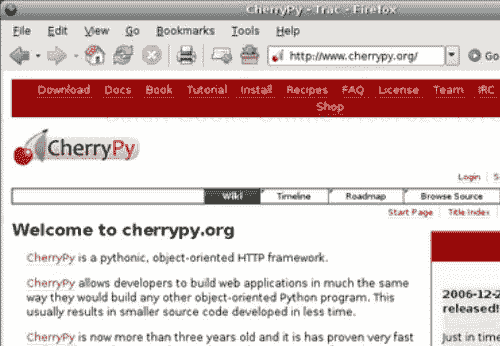
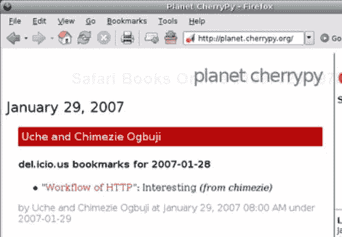

# 第一章. CherryPy 简介

互联网的使用呈指数级增长，已成为我们今天生活方式的关键组成部分。从开发者的角度来看，网络提供了巨大的机会和乐趣。然而，面向网络的技术的数量越来越多，令人难以抉择。本书的目标是介绍其中之一，CherryPy，一个 Python 网络应用库。

本章将介绍 CherryPy 的功能和优势，从 CherryPy 的历史概述开始，然后探讨其友好的社区，这个社区长期以来一直是项目成功的重要部分，最后回顾 CherryPy 发展背后的关键原则。

# 概述

CherryPy 是一个为 Python 开发者提供友好 HTTP 协议接口的 Python 库。HTTP 是万维网的骨架。在过去的几年里，网络应用呈指数级增长。这种爆炸性增长随后是各种编程语言中发布的大量工具包、库和框架，以帮助网络开发者完成任务。最终，所有这些目标都是为了使网络开发者的生活更加轻松。在这种情况下，CherryPy 开始利用 Python 作为动态语言的优势，将 HTTP 协议建模并绑定到一个遵循 Python 习惯的 API 中。

几年来，Python 社区已经积累了大量的网络库和框架，以至于这已经成为一种既令人担忧又有些好笑的现象。尽管只有少数几个吸引了大多数社区的关注（如 TurboGears、Django 或 Zope），但每个现有的库或框架都通过提供自己对如何将 Python 与 HTTP 和网络接口的看法，保持了其特定的市场影响力。CherryPy 的诞生是因为当时它的创造者 Remi Delon 找不到他想要的东西。多年来，CherryPy 的设计由喜欢其优势并加入的新开发者进行了调整。如今，该项目拥有一个强大的社区基础，它在许多不同的环境中每天都会使用它。

# CherryPy 的历史

Remi Delon 在 2002 年 6 月晚些时候发布了 CherryPy 的第一个版本。这是成功 Python 网络库的起点。Remi 是一位法国黑客，他信任 Python，认为它是开发网络应用的最佳替代品之一。

该项目吸引了一些对 Remi 所采取的方法感兴趣的开发者：

+   CherryPy 类是对 Python 的扩展，以支持数据与展示之间的关注点分离。它接近模型-视图-控制器模式。

+   CherryPy 类必须由 CherryPy 引擎处理和编译，以生成一个包含完整应用程序以及其内置网络服务器的自包含 Python 模块。

CherryPy 会将 URL 和其查询字符串映射到一个 Python 方法调用，例如：[`somehost.net/echo?message=hello`](http://somehost.net/echo?message=hello) 会映射到 `echo(message='hello')`。

在接下来的两年里，项目得到了社区的支持，Remi 发布了几个改进版本。

2004 年 6 月，关于项目未来的讨论开始了，讨论的主题是是否应该继续使用相同的架构。主要担忧之一是编译步骤，这对于 Python 开发者来说并不自然。随后，几个项目常客的头脑风暴和讨论导致了对象发布引擎和过滤器的概念，这很快成为了 CherryPy 2 的核心组成部分。

最终，在 2004 年 10 月，CherryPy 2 的第一个 alpha 版本作为这些核心思想的证明被发布。随后是六个月的紧张工作，以发布一个稳定版本（2005 年 4 月晚些时候）。很快，其他开发者加入了项目，以改进它。CherryPy 2.0 是一个真正的成功；然而，人们认识到其设计仍有改进的空间，需要进行重构。

在进一步的社区反馈/讨论之后，CherryPy 的 API 被进一步修改，以提高其优雅性，导致 CherryPy 2.1.0 版本于 2005 年 10 月发布。这个版本由流行的 TurboGears 项目提供支持——它本身是一个项目堆栈，旨在生产一个网络超级框架。该团队于 2006 年 4 月发布了 CherryPy 2.2.0 版本。

CherryPy 作为 TurboGears 堆栈中越来越广泛采用的核心理念之一，自然意味着越来越多的关于 CherryPy 一些方面的讨论和问题被提出。例如，其 WSGI 支持、缺乏最新的文档，或者其仅平均的性能。很明显，为了满足这些真实且重要的需求，在不破坏向后兼容性约束的情况下，扩展 CherryPy 2 将会非常困难。因此，最终决定转向 CherryPy 3，该版本于 2006 年底发布。

# 社区

如果没有过去几年建立起来的社区，CherryPy 不可能达到现在的地位。Remi 总是明确表示，他并不希望 CherryPy 成为他的个人项目，而更希望它成为一个社区项目。

CherryPy 一直有其追随者，但 CherryPy 社区实际上是从产品的 2.0 版本开始的。2004 年 11 月，在 **Open** 和 **Free Technology Community** （**OFTC**）网络上注册了一个 IRC 频道，以便开发者和用户可以快速交换想法或报告缺陷。频道逐渐吸引了越来越多的常客，并被普遍认为是一个非常友好的地方。除了 IRC 频道外，还创建了针对开发者和用户的邮件列表。最终，一个常规 CherryPy 用户博客条目的聚合源被发布，并从那时起在 [`planet.cherrypy.org`](http://planet.cherrypy.org) 上提供。

# CherryPy 项目优势

+   简单性：主要目标之一始终是尽可能保持 CherryPy 的简单性，目的是避免库过度工程化项目。由于库覆盖的范围较窄，开发者能够专注于 API 和社区反馈。

+   自包含：从一开始，Remi 就决定 CherryPy 的核心不需要任何第三方 Python 包即可工作，并且将完全依赖于 Python 标准库。

+   不侵入性：开发团队长期关注的另一个关键方面是确保 CherryPy 尽可能不干扰其用户。想法是为任何开发者提供一套工具，不对他们选择使用它们的方式做出任何假设。

+   开放讨论：开发团队始终倾听社区给出的反馈。这并不意味着每个请求都被采纳，但几乎所有的请求都经过了讨论和审查。

+   有趣：在参与开源项目时，贡献者不应感到这仅仅是他们的日常工作；相反，真正享受他们所做的事情具有很大的价值。同样，对于 CherryPy 用户来说，乐趣元素也是一个重要的部分，我们观察到这使我们都成为了更好的、更有创造力的开发者。

# CherryPy 之外

在其早期，CherryPy 吸引了一小群用户，但其设计阻止了它成长为更大的项目或被更广泛地使用。此外，当时 Python 网络开发领域主要被 Zope 平台占据。当 CherryPy 2 发布时，其概念受到了社区的广泛欢迎，并最终吸引了更多用户开始将其用于应用程序，以及基于其构建自己的包。

事实上，在 2005 年 9 月晚些时候，Kevin Dangoor 发布了 TurboGears——一个作为现有开源产品堆栈构建的 Web 开发框架。Kevin 选择了 CherryPy 来处理其框架的 HTTP 层，SQLObject 将对象映射到数据库，Kid 用于 XHTML 模板，MochiKit 用于客户端处理。这次发布发生在另一个 Python Web 框架 Django 向社区开放后的几个月。这两个项目很快在 Python 社区中获得了巨大的流行度，并且由于它们之间的一点点竞争，它们以非常快的速度增长。TurboGears 的繁荣提升了 CherryPy 的知名度，并吸引了一大批新用户。

这些新开发者的浪潮增加了 CherryPy 的功能请求以及修复的缺陷数量，最终导致了 CherryPy 3 的诞生，这是库最稳定的版本，也是本书的写作。

CherryPy 的未来清晰且光明；罗伯特·布鲁尔所做的出色工作使得这个库达到了巡航速度。TurboGears 的未来版本肯定会迁移到 CherryPy 3，这将引发一系列新问题，需要开发团队提出，并将推动 CherryPy 迈出下一个重大步伐。

# 通过本书

本书旨在以一个能够让你对自己在个人 Web 应用中使用 CherryPy 充满信心的水平介绍 CherryPy 库。此外，我们还将尝试在撰写本书时对 Web 应用设计和领域视角进行讨论。简而言之，本书将解释如何在 Python 社区中通过多种常见方式获取和安装 CherryPy，例如使用 setup 工具和 easy_install。它还将概述 CherryPy 的主要和最常见方面。这将让你逐渐了解这个库能做什么。然后，它将深入探讨库的功能，如其 HTTP 能力、替代 URI 分发器、扩展库以及其 WSGI 支持。

这将帮助你牢固地理解 CherryPy、其设计和如何在你的应用中最好地利用它。本书随后通过介绍对象关系映射器、Web 服务和 Ajax 等技术工具，通过开发一个简单的博客应用来分解 Web 开发的层次。

它介绍了博客应用的目标和边界，回顾了 Python 中数据库处理的状态，然后解释了对象关系映射。它广泛介绍了 Python 中的一个 ORM，称为 Dejavu。它还讨论了 REST 和 Atom 发布协议，它们都提供了一种设计可以扩展 Web 应用超 HTML 页面简单服务能力的服务的方式。然后，它介绍了博客应用的表示层，包括对名为 Kid 的模板引擎和名为 MochiKit 的 JavaScript 库的回顾。本书讨论了 Ajax 以及你的应用如何从中受益。然后，我们将看到你的应用如何调用 Web 服务。接着，本书广泛检查了 Web 应用测试的领域。这从单元测试到通过其功能测试方面的负载测试。本书最后通过展示将 Web 应用作为独立应用或通过 Apache 和 lighttpd 等知名 Web 服务器部署的不同方式来结束。

虽然有些章节没有广泛讨论 CherryPy 本身，但它们都将汇聚到对 Web 应用开发某些方面的理解。希望这本书能让你了解 CherryPy，并也会给你提供知识和欲望去了解更多它所涵盖的主题。

# 摘要

阅读这一介绍后，你应该对这本书将引导你走向何方有必要的背景理解。CherryPy 是一个简单而强大的 Python 库，它将成为那些希望找到一个能够隐藏 HTTP 协议的困难同时保持其优势的包的网页开发者的绝佳伴侣。CherryPy 社区在过去几年里一直在努力工作，以使这样的产品成为可能；希望这本书能为你提供正确的方向，让你充分利用它。
