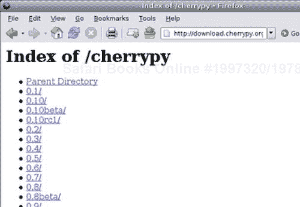
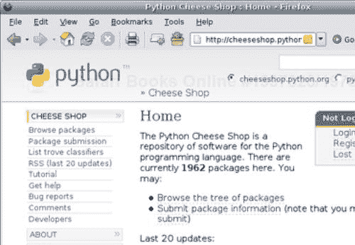
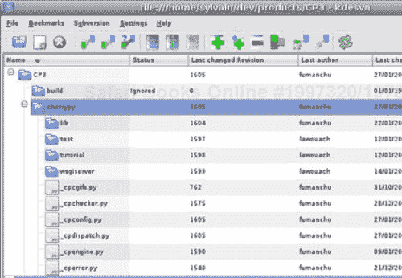

# 第二章：下载和安装 CherryPy

与大多数开源项目一样，CherryPy 可以通过多种方式下载和安装。在这里，我们将讨论以下三种方法：

+   使用 tarball

+   使用 easy_install

+   使用 Subversion 获取最新版本的源代码

每一种方法都为项目的用户提供不同的价值，了解每个的贡献是很重要的。

一旦你阅读了这一章，你应该能够检索和部署 CherryPy，以及了解如何为你的软件使用每种技术。

# 要求

在本书的整个过程中，我们将假设你已经安装并可以使用以下包。

+   Python 2.4 或更高版本

+   CherryPy 3.0

我们还将假设你对 Python 本身有所了解，因为我们不会涵盖该语言。

# 概述

安装 Python 模块或包通常是一个简单的过程。首先，让我们讨论最常见的方法来构建和安装一个新的包，这得益于 Python 2.0 伴随出现的标准模块，distutils。

此模块提供了一个干净的接口来指定包的结构，所需的依赖项，以及包的构建规则。对于用户来说，通常意味着输入以下命令：

```py
python setup.py build
python setup.py install

```

第一个命令将简单地根据开发者定义的规则构建包，报告错误，以便最终用户知道缺少依赖项等。第二个命令将把包安装到 Python 用来存储第三方包或模块的默认目录。请注意，后一个命令将默认调用前一个命令，以快速检查自上次运行以来是否有任何变化。

存储包和模块的默认目录是：

+   在 UNIX 或 Linux 上 `/usr/local/lib/python2.4/site-packages` 或 `/usr/lib/python2.4/site-packages`

+   在 Microsoft Windows 上 `C:\Python 或 C:\Python2x`

+   在 MacOS 上 `Python:Lib:site-packages`

在 UNIX 或 Linux 上，这取决于你的 Python 安装方式，但上述目录是最常见的。当导入一个模块时，Python 会查找一系列目录，包括一些默认目录和用户提供的目录，直到找到匹配的模块，否则会引发异常。搜索列表可以通过定义 `PYTHONPATH` 环境变量或从代码本身进行修改，如下所示：

```py
import sys
sys.path.append(path)

```

### 注意

`PYTHONPATH` 环境变量是 Python 引擎启动时读取的变量之一。它包含附加到第三方模块和包搜索列表的路径。

另一种方法是设置一个以包命名的文件，并带有 `.pth` 扩展名。此文件应包含包的完整路径。

尽管这个算法很简单，但它有其局限性。由于 `sys.path` 列表是有序的，您必须确保如果两个路径包含具有不同版本的相同模块，则您的应用程序导入的是第一个到达的模块。这导致我们面临以下软件包版本问题。

假设您在全局安装的 Python 中安装了 CherryPy 2.2.1；它将在 `/usr/local/lib/site-packages/cherrypy` 目录下可用。然而，路径中不包含软件包的版本信息。因此，如果您必须安装 CherryPy 3.0.0，您必须覆盖现有的安装。

幸运的是，Python 社区已经找到了这个问题的解决方案——egg。一个 **egg** 是一个包含软件包所有文件和子目录的压缩文件夹，其名称中包含软件包的版本详细信息。

### 注意

一个 egg 是一个可分发捆绑包，默认情况下是压缩的，包含一个 Python 软件包或模块，包括作者和软件包版本等信息。

例如，由 Python 2.4 构建的 CherryPy 2.2.1 将看起来像以下这样：`Cherrypy-2.2.1-py2.4.egg`。egg 本身并不是非常有用；它的部署需要 easy_install，这是一个包含处理 egg 逻辑的 Python 模块。这意味着您可以在同一目录下部署多个版本，并让 easy_install 决定加载哪一个。

在接下来的章节中，我们将详细说明如何使用最常见的情况安装 CherryPy。

# 从 Tarball 安装

一个 **tarball** 是文件或目录的压缩存档。这个名字来源于 UNIX 和相关操作系统上发现的 tar 工具的使用。

### 注意

历史上使用的压缩格式通常是 `gzip`，而 *tarball* 的扩展名可以是 `.tar.gz` 或 `.tgz`。

CherryPy 为每个发布版本提供 tarball，无论是 alpha、beta、候选发布还是稳定版本。它们都可以从 [`download.cherrypy.org/`](http://download.cherrypy.org/) 获取。

CherryPy tarballs 包含库的完整源代码。



要从 tarball 安装 CherryPy，您需要经过以下步骤：

1.  1. 从 [`download.cherrypy.org/`](http://download.cherrypy.org/) 下载您感兴趣版本。

1.  2. 前往已下载 tarball 的目录，并解压缩它：

    +   如果您正在使用 Linux，请输入以下命令：

        ```py
        tar zxvf cherrypy-x.y.z.tgz 

        ```

    在给定的命令中，`x.y.z` 是您获取的版本。

    +   如果您正在运行 Microsoft Windows，您可以使用 7-Zip 等实用程序通过图形界面解压缩存档。

1.  3. 移动到新创建的目录，并输入以下命令，这将构建 CherryPy：

    ```py
    python setup.py build 

    ```

1.  4. 最后，为了进行全局安装，您必须发出以下命令（您很可能需要管理员权限）：

```py
python setup.py install 

```

### 注意

注意，这些命令必须从命令行发出。在 Microsoft Windows 下，你将从一个 DOS 命令提示符运行这些命令。

以上步骤将在你的系统上为默认 Python 环境全局安装 CherryPy。有些情况下这可能不适合或不可行。例如，你可能只想为 Python 的特定版本安装 CherryPy；在这种情况下，你将不得不指定正确的 Python 二进制文件，例如在前面提到的第 3 和第 4 步中指定`python2.4`。

也可能发生的情况是你不想进行全局安装，在这种情况下，在 UNIX 和 Linux 下最快的方法是将前面提到的第 4 步替换为：

```py
python setup.py install --home=~ 

```

这将把文件放在`$HOME/lib/python`中，其中`$HOME`代表你的家目录。

在没有了解`HOME`的 Microsoft Windows 下，你会这样做：

```py
python setup.py install --prefix=c:\some\path 

```

你选择的路径本身并不重要，你可以使用适合你环境的任何路径。

然后你必须确保当你需要导入模块时 Python 会通过那个目录。最简单的方法是将`PYTHONPATH`环境变量设置为以下内容：

+   在 Linux 中使用 bash shell

    ```py
    export PYTHONPATH=~/lib/python

    ```

+   在 Microsoft Windows 中使用命令提示符

    ```py
    set PYTHONPATH=/some/path/

    ```

    ### 注意

    注意，这只会持续到命令窗口打开时，一旦你关闭它，这些更改就会被丢弃。为了使更改永久生效，你应该通过**系统属性 | 高级 | 环境变量**设置全局`PYTHONPATH`变量。

+   在 MacOS 中使用`csh` shell

    ```py
    setenv PYTHONPATH "/some/path/" 

    ```

`PYTHONPATH`环境变量将在启动时被 Python 解释器读取，并将其追加到其内部系统路径。

# 通过 Easy Install 安装

`Easy_install`是一个可以在**Python Enterprise Application Kit**（**PEAK**）网站上找到的 Python 模块，用于简化 Python 包和模块的部署。从开发者的角度来看，它提供了一个简单的 API 来导入 Python 模块，无论是特定版本还是一系列版本。例如，以下是你如何加载在环境中找到的第一个大于 2.2 的 CherryPy 版本的操作：

```py
>>> from pkg_resources import require
>>> require("cherrypy>=2.2")
[CherryPy 2.2.1 (/home/sylvain/lib/python/
CherryPy-2.2.1-py2.4.egg)]

```

从用户的角度来看，它简化了下载、构建和部署 Python 产品的过程。

在安装 CherryPy 之前，我们必须安装`easy_install`本身。从[`peak.telecommunity.com/dist/ez_setup.py`](http://peak.telecommunity.com/dist/ez_setup.py)下载`ez_setup.py`模块，并以具有计算机管理员权限的用户身份运行，如下所示：

```py
python ez_setup.py 

```

如果你没有管理员权限，你可以使用`-install-dir (-d)`选项，如下所示：

```py
python ez_setup.py -install-dir=/some/path 

```

确保`/some/path`是 Python 系统路径的一部分。例如，你可以将`PYTHONPATH`设置为那个目录。

这将设置你的环境以支持 easy_install。然后，为了安装支持 easy_install 的 Python 产品，你应该发出以下命令：

```py
easy_install product_name 

```

easy_install 将会搜索**Python 包索引**（**PyPI**）以找到给定产品。PyPI 是关于 Python 产品的信息集中存储库。



为了部署 CherryPy 的最新可用版本，你应该发出以下命令：

```py
easy_install cherrypy 

```

然后，easy_install 将会下载 CherryPy，构建并全局安装到你的 Python 环境中。如果你希望将其安装到特定位置，你需要输入以下命令：

```py
easy_install --install-dir=~ cherrypy 

```

安装完成后，你将有一个名为`cherrypy.x.y.z-py2.4.egg`的文件，这取决于 CherryPy 的最新版本。

# 从 Subversion 安装

Subversion 是一个优秀的开源版本控制系统，允许开发者以受控和并发的方式执行项目。

这种系统的基本原理是注册一个资源，并跟踪对其所做的每个更改，以便任何开发者都可以检索任何以前的版本，比较两个版本，甚至跟踪该资源的演变过程。资源可以是源代码文件、二进制文件、图像、文档或任何可以用机器可读形式表达的东西。

Subversion 是集中的，因此项目由 Subversion 服务器管理，每个客户端都有一个副本。开发者在这个副本上工作，并将所做的任何更改提交回去。当出现冲突时，例如，如果另一个开发者已经修改了相同的文件并提交了它，服务器会通知你，并禁止你提交，直到你解决问题。

Subversion 是原子的，这意味着如果一个提交在某个文件上失败，整个提交都会失败。另一方面，如果它成功了，整个项目的修订版本将会增加，而不仅仅是涉及的文件。

### 注意

Subversion 通常被视为 CVS 的后继者，并且被认为更加友好。然而，也存在其他版本控制系统，如 Monotone 或 Darcs。

在 Linux 下，你可以从源代码安装 Subversion，或者使用包管理器。让我们描述一下源代码的安装过程。

1.  1. 从[`subversion.tigris.org/`](http://subversion.tigris.org/)获取最新的 tarball。

1.  2. 然后在命令控制台中输入以下命令：

```py
tar zxvf subversion-x.y.z.tar.gz 

```

1.  3. 进入新创建的目录，并输入：`./configure`

1.  4. 然后为了构建软件包本身，输入：`make`

1.  5. 你可能还需要 Subversion 的 Python 绑定：

    ```py
     make swig-py

    ```

1.  6. 要全局安装 Subversion，你需要是管理员，然后输入：`make install; make install-swig-py`

在 Linux 或 UNIX 下，大多数时候，通过命令行使用 Subversion 更容易。然而，如果你更喜欢使用图形界面，我建议你安装一个肥客户端应用程序，如 eSvn 或 kdesvn。



在 Microsoft Windows 下，直接使用图形应用程序（如 TortoiseSVN）会更容易，它将安装 Subversion 客户端。

在以下情况下建议使用 Subversion 获取 CherryPy：

+   存在了一个功能或修复了一个错误，并且这些功能或错误仅在开发中的代码中可用。

+   你决定专注于 CherryPy 本身的工作。

+   你需要从主 trunk 分支出来，以便 *尝试并查看* 一个功能、一个新的设计，或者简单地回滚到之前版本中的错误修复。

为了使用项目的最新版本，你首先需要从 Subversion 仓库中找到的 trunk 文件夹检出。从 shell 中输入以下命令：

```py
svn co http://svn.cherrypy.org/trunk cherrypy 

```

### 注意

在 Microsoft Windows 下，你可以从命令行操作，或者简单地使用 TortoiseSVN。请参阅其文档以获取更多信息。

这将创建一个 `cherrypy` 目录并将完整的源代码下载到其中。由于通常不建议部署开发中的版本，因此你会输入以下命令将 CherryPy 安装到本地目录：

+   在 Linux 和相关系统使用控制台的情况下：

```py
python setup.py install --home=~ 

```

+   在 Microsoft Windows 使用命令提示符：

```py
python setup.py install --prefix=c:\some\path 

```

然后将 `PYTHONPATH` 环境变量指向所选目录。

注意，只要这个目录可以通过 PYTHONPATH 或标准 sys 模块被 Python 进程访问，它就无关紧要。

# 测试你的安装

无论你决定以何种方式在你的环境中安装和部署 CherryPy，你都必须能够从 Python shell 中导入它，如下所示：

```py
>>> import cherrypy
>>> cherrypy.__version__
'3.0.0'

```

如果你没有将 CherryPy 全局安装到 Python 环境中，不要忘记设置 `PYTHONPATH` 环境变量，否则你将得到以下错误：

```py
>>> import cherrypy
Traceback (most recent call last):
File "<stdin>", line 1, in ?
ImportError: No module named cherrypy

```

# 保持 CherryPy 更新

更新或升级 CherryPy 将取决于你安装它所采取的方法。

+   使用 tarball 安装

    通常，确保更新顺利进行的最佳方式是首先从 `sys.path` 中的位置删除包含包的目录，然后遵循之前描述的步骤安装库。

+   使用 easy_install 安装

    更新是 easy_install 提供的关键功能之一。

```py
easy_install -U cherrypy

```

+   由于包含库的 eggs 以其服务的版本命名，你可以简单地遵循上一节中定义的步骤，而无需删除现有的 egg。但请注意，这仅在应用程序运行时明确指定所需版本的情况下才成立。

+   使用 Subversion 安装

    这种方法的有趣之处在于你可以几乎连续地更新库。要更新你的安装，你需要从包含源代码的顶级目录中输入 `svn update` 命令，然后发出 `python setup.py install` 命令。

### 注意

像往常一样，在更新之前请务必备份你的文件。

# 摘要

在本章中，我们讨论了通过三种技术将 CherryPy 安装到您环境中的不同方法。传统的方法是使用包含 Python 包所有文件的存档来安装和使用该存档内的 `setup.py` 模块。一种较新且更常见的方式是使用 `easy_install` 命令来安装 eggs。最后，如果您希望与 CherryPy 的最新开发同步，您可以从其 Subversion 仓库获取该包。无论您采用哪种方法，它们都将使 CherryPy 可用您的系统上。
