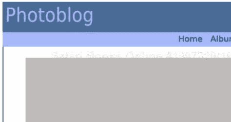
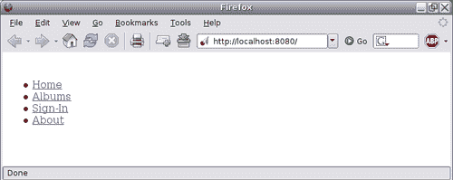
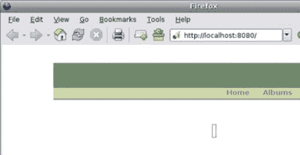

# 第七章。表示层

到目前为止，我们已从服务器端的角度开发我们的应用程序。在本章中，我们将开始关注照片博客的客户端。最初，我们将通过 `Kid` Python 引擎介绍 HTML 模板，并通过 Mochikit 库介绍 JavaScript。我们将简要介绍 Web 成功的一些重要组件，如 HTML、XHTML 和 CSS。然而，这些部分并不旨在深入解释每个部分，因为这超出了本书的范围。

# HTML

尽管在我们上一章中，我们介绍了应用程序中各层之间的关注点分离，但我们需要记住，我们的主要目标是互联网浏览器，因此我们将专注于 HTML 渲染。

**HTML**（**超文本标记语言**），由蒂姆·伯纳斯-李在 20 世纪 90 年代初定义，是 **SGML**（**标准通用标记语言**）的轻量级版本，仅保留了 Web 有用的简单元素。由于 Web 的快速增长，HTML 进一步发展以改进它。最终，W3C 在 1997 年正式指定了 HTML 4.0，1999 年的更新导致了 HTML 4.01，至今仍然是官方版本。

HTML 4.01 文档的示例：

```py
<!DOCTYPE html PUBLIC "-//W3C//DTD HTML 4.01//EN" "http://www.w3.org/TR/html4/strict.dtd">
<html>
<head>
<title>Hello World!</title>
</head>
<body>
<p>Not much to say really.</p>
</body>
</html>

```

文档的第一行声明了 DOCTYPE 声明，指定了文档遵循的格式变体。DOCTYPEs 在 DTDs（文档类型定义）中指定。

# XML

在 1996 年，W3C 开始着手于 **XML**（**可扩展标记语言**），这是一种从 SGML 派生出来的通用简单标记语言，它保留了 SGML 的强大功能，同时避免了其复杂性。在 Web 的背景下，XML 的目标是解决 HTML 的几个限制，例如缺乏：

+   **可扩展性**：HTML 不允许向语言中添加新元素。

+   **验证**：HTML 没有提供一种语言来验证文档的结构或语义。

+   **结构**：HTML 不允许复杂的结构。

# XHTML

由于 XML，W3C 承担了表达性和灵活性的工作，通过 XML 重新定义 HTML 4，从而在 2000 年制定了 XHTML 1.0 规范。

XHTML 1.0 具有以下特点：

+   仅理解 HTML 4 的用户代理可以渲染文档，使其具有向后兼容性。

+   出版商可以进入 XML 世界及其丰富性。

XHTML 1.0 文档的示例：

```py
<?xml version="1.0" encoding="utf-8"?>
<!DOCTYPE html PUBLIC "-//W3C//DTD XHTML 1.0 Strict//EN"
"http://www.w3.org/TR/xhtml1/DTD/xhtml1-strict.dtd">
<html >
<head>
<title>Hello World!</title>
</head>
<body>
<p>Not much to say really.</p>
</body>
</html>

```

在此示例中，我们还指定了一个 DOCTYPE 声明，告知消费者我们的文档遵循 XHTML 1.0 Strict DTD。由于 XHTML 是 XML 的应用：

+   我们在第一行提供了 XML 声明，以便给 XML 消费者处理器一些关于文档内容的提示，例如它使用 UTF-8 编码的事实。请注意，这不是强制性的。

+   我们还明确地将该文档的匿名命名空间标记为 XHTML 命名空间。

虽然这两个文档的语法非常相似，但它们具有不同的语义，并且会被用户代理以不同的方式处理。因此，这两个文档都有不同的 MIME 格式。HTML 文档应该使用`text/html` MIME 内容类型提供服务，而 XHTML 文档应该通过`application/xhtml+xml`提供服务。然而，由于 XHTML 1.0 旨在与不理解其 MIME 内容类型的用户代理向后兼容，因此允许按照特定指南将 XHTML 1.0 文档作为`text/html`提供服务。然而，这并不推荐，可能会导致意外的渲染，这取决于用户代理如何处理文档的结构；这通常被称为*标签汤*。

由于这些原因，在互联网上提供 XHTML 可能会变得繁琐，并且是极其激烈讨论的根源。因此，我们的照片博客应用将保持简单，使用 HTML。

# CSS

无论您使用 HTML 还是 XHTML，这两种格式都只指定了您页面的结构和语义；它们不告诉用户代理应该如何渲染这些页面。这是通过 CSS（层叠样式表）实现的，这是一种描述应用于标记文档（如 HTML 或 XHTML）中元素的规则的编程语言。规则的结构如下：

+   一个 *选择器* 指定了要应用规则的元素。选择器可以是精确的，仅针对文档上下文中的一个特定元素，也可以是通用的，适用于所有元素。

+   一个或多个 *属性* 指示了元素的哪个属性被涉及。

+   每个属性都与一个或多个 *值* 或值集相关联。

以下是一个应用于之前 HTML 示例的例子：

```py
<!DOCTYPE html PUBLIC "-//W3C//DTD HTML 4.01//EN" "http://www.w3.org/TR/html4/strict.dtd">
<html>
<head>
<title>Hello World!</title>
<style type="text/css">
body
{
background-color: #666633;
color: #fff;
}
p
{
text-align: center;
}
</style>
</head>
<body>
<p>Not much to say really.</p>
</body>
</html>

```

在这个例子中：

+   `body`是选择器。

+   `background-color`是属性，其值为`#666633`。

在上一个例子中，我们将 CSS 嵌入到 HTML 文档本身中。建议将其外部化到自己的文档中，并从 HTML 页面链接它，如下所示：

```py
<!DOCTYPE html PUBLIC "-//W3C//DTD HTML 4.01//EN"
"http://www.w3.org/TR/html4/strict.dtd">
<html>
<head>
<title>Hello World!</title>
<link rel="stylesheet" href="style.css">
</head>
<body>
<p>Not much to say really.</p>
</body>
</html>

```

CSS 文件，`style.css`，如下所示：

```py
body
{
background-color: #663;
color: #fff;
}
p
{
text-align: center;
}

```

# DHTML

当蒂姆·伯纳斯-李想象网络时，他是为了使研究人员之间交换文档成为可能。这些文档是静态的，不是由网络应用生成的。实际上，当时还没有网络应用，只有接受请求并返回内容的网络服务器。从那时起，网络的价值增长了很多，网络应用已经成为现实。尽管如此，长期以来，完成这项工作的组件一直是服务器本身，客户端只需要显示渲染的内容。然而，很快，提供更花哨的界面将使网络向前迈出一大步，以吸引更广泛的公众。网络应该、能够、并且会不仅仅是在屏幕上展示书籍或论文。

术语 DHTML（动态 HTML）是为了将一组技术组合在一起，以改善客户端内容处理。DHTML 包括：

+   定义文档结构的 HTML

+   CSS 来样式化网页

+   JavaScript 动态修改文档对象模型（DOM）

DOM 是浏览器构建的(X)HTML 文档结构的内存表示。通过使用 JavaScript 函数，可以动态修改 DOM 树，从而从最终用户的角度改变其渲染。

然而，尽管 DHTML 背后的想法多么有趣，由于浏览器供应商之间的互操作性问题和 JavaScript 与 CSS 在导航器中的不平等实现，它从未真正起飞。这使得网络开发者很难确保他们的页面在大多数情况下能按预期工作。如今，DHTML 在领域内不是一个常见的术语，但其思想已被保留并在新技术中得到改进。这也得益于浏览器之间更好的互操作性、更好的调试工具以及专用 JavaScript 工具包或框架的出现，这些工具包或框架通过公共 API 封装浏览器差异，正如我们稍后将要看到的。

# 模板化

在前面的章节中，我们介绍了构成网页的基本组件——HTML 或 XHTML 用于结构，CSS 用于样式。生成网页可能就像使用你喜欢的文本编辑器并将其放置下来一样简单。然而，在动态应用程序的上下文中，内容基于给定的上下文并即时生成，你需要工具来简化这种创建。这是通过使用模板引擎来实现的。模板引擎接受页面的模型以及输入数据，然后处理两者以渲染最终的页面。

当寻找模板引擎时，你应该寻找至少提供以下一些功能的引擎：

+   变量替换：在你的模板中，一个变量可以作为输入的占位符。

+   条件语句：通常情况下，模板需要根据输入数据的上下文进行轻微的渲染差异。

+   循环机制：当你的模板需要将一组数据渲染到表格中时，这显然是必须的。

+   可扩展性：模板通常可以共享某些方面，并在某些特定上下文中有所不同，例如常见的页眉和页脚模板。

Python 世界在模板引擎方面绝不短，选择一个满足你需求的模板引擎将肯定是一个基于其功能和语法口味的个人选择。为了本书的目的，我们将使用由 Ryan Tomayko 开发的名为`Kid`的模板引擎。

# Kid—模板引擎

现在，我们将对`Kid`引擎进行一些描述。

## 概述

让我们通过创建我们之前示例的模板来开始对`Kid`引擎的介绍：

```py
<!DOCTYPE html PUBLIC "-//W3C//DTD HTML 4.01//EN" "http://www.w3.org/TR/html4/strict.dtd">
<html >
<head>
<title>${title}</title>
<link rel="stylesheet" href="style.css" />
</head>
<body> <p>${message}</p>
</body>
</html>

```

正如你所见，模板看起来与最终期望渲染的页面非常相似。当你将这个模板保存为名为`helloworld.kid`的文件时，下一步就是通过以下方式通过`Kid`引擎处理模板：

```py
import kid
params = {'title': 'Hello world', 'message': 'Not much to say.'}
t = kid.Template('helloworld.kid', **params)
print t.serialize(output='html')

```

`Kid`提供了一个`Template`函数，该函数需要处理模板的名称以及在渲染模板时传递的输入数据。当模板第一次被处理时，`Kid`创建一个 Python 模块，作为模板的缓存版本供以后使用。`kid.Template`函数返回一个`Template`类的实例，然后你可以使用该实例来渲染输出内容。为此，`Template`类提供了以下方法：

+   `serialize:` 这返回输出内容作为一个 Python 字符串。

+   `generate:` 这返回输出内容作为一个 Python 迭代器。

+   `write:` 这将输出内容写入文件对象。

这三个方法接受以下参数：

+   `encoding:` 这告诉`Kid`如何编码输出内容；默认为 UTF-8。

+   `fragment:` 这是一个布尔值，询问`Kid`是否在最终结果中包含或排除 XML 序言或 Doctype。

+   `output:` 这指定了`Kid`在渲染内容时应使用哪种类型的序列化。

## `Kid`的属性

`Kid`的属性如下：

### 基于 XML 的模板语言

`Kid`是一种基于 XML 的语言，这意味着：

+   一个`Kid`模板必须是一个有效的 XML 文档。

+   `Kid`使用 XML 元素内的属性来通知底层引擎在到达元素时应该执行什么操作。为了避免与 XML 文档中其他现有属性冲突，`Kid`自带一个命名空间([`purl.org/kid/ns#`](http://purl.org/kid/ns#))，通常与`py`前缀相关联，例如：

```py
<p py:if="...">...</p>

```

### 变量替换

`Kid`提供了一个非常简单的变量替换方案：`${variable-name}`。

这可以用于元素的属性或作为元素的文本内容。`Kid`将在模板中每次遇到变量时评估该变量。

如果你需要输出一个字面字符串，例如`${something}`，你可以通过将美元符号加倍来转义变量替换，例如`$${something}`，这样它将被渲染为`${something}`。

### 条件语句

当你在模板中需要在不同的案例之间切换时，你需要使用以下语法：

```py
<tag py:if="expression">...</tag>

```

位置：

+   `tag`是元素的名字，例如`DIV`或`SPAN`。

+   `expression`是一个 Python 表达式。如果作为一个布尔值评估为`True`，则该元素将被包含在输出内容中。否则，该元素将不包含在内。

### 循环机制

要告诉`Kid`在元素上循环，你必须使用以下语法：

```py
<tag py:for="*expression*">...</tag>

```

位置：

+   `tag`是元素的名字。

+   `expression`是一个 Python 表达式，例如`for value in [...]`。

循环机制如下：

```py
<!DOCTYPE html PUBLIC "-//W3C//DTD HTML 4.01//EN" "http://www.w3.org/TR/html4/strict.dtd">
<html >
<head>
<title>${title}</title>
<link rel="stylesheet" href="style.css" />
</head>
<body>
<table>
<caption>A few songs</caption>
<tr>
<th>Artist</th>
<th>Album</th>
<th>Title</th>
</tr>
<tr py:for="info in infos">
<td>${info['artist']}</td>
<td>${info['album']}</td>
<td>${info['song']}</td>
</tr>
</table>
</body>
</html>
import kid
# Fake object and method which suggests that we pull the data to be
# rendered from a database in the form of a Python dictionary.
params = discography.retrieve_songs()
t = kid.Template('songs.kid', **params)
print t.serialize(output='html')

```

### 可扩展性

使用以下语法扩展模板：

```py
<tag py:extends="templates">...</tag>

```

位置：

+   `tag`是元素的名字。然而，在这个特定情况下，元素只能是当前模板的根元素。

+   `templates`是一个以逗号分隔的`Kid`模板文件名或实例列表。

首先，定义一个名为`common.kid:`的`Kid`模板。

```py
<html >
<head py:match="item.tag == 'this-is-ed'">
<title>${title}</title>
<link rel="stylesheet" href="style.css" />
</head>
</html>

```

然后，修改前一个示例的模板：

```py
<!DOCTYPE html PUBLIC "-//W3C//DTD HTML 4.01//EN" "http://www.w3.org/TR/html4/strict.dtd">
<html py:extends="'common.kid'" >
...
...
<body>
<table>
<caption>A few songs</caption>
<tr>
<th>Artist</th>
<th>Album</th>
<th>Title</th>
</tr>
<tr py:for="info in infos">
<td>${info['artist']}</td>
<td>${info['album']}</td>
<td>${info['song']}</td>
</tr>
</table>
</body>
</html>

```

当 `Kid` 处理该模板时，它将首先编译 `common.kid` 模板。当 `Kid` 遇到 `<this-is-ed />` 元素时，它将理解这匹配 `common.kid` 模板的头部元素，并将替换其内容。

### 其他属性

`Kid` 除了我们之前审查的基本属性外，还提供了更多属性：

+   `py:content="expression":` 使用此属性的元素的子代将被替换为表达式的输出内容。

+   `py:strip="expression":` 如果表达式评估为 `True`，则包含的元素将不会出现在结果中，但其后代将存在。如果表达式评估为 `False`，则处理过程正常进行。

+   `py:replace="expression":` 这是 `py:content="expression" py:strip="True"` 的快捷方式。

+   `py:attrs="expression":` 这允许动态向元素中插入新属性。

+   `py:def="template_name(args)":` 这允许创建一个可以在主模板的其他地方引用的临时模板。

您可以通过访问官方的 `Kid` 文档来获取更多信息，文档地址为 [`kid-templating.org/`](http://kid-templating.org/).

# 照片博客设计准备

在前面的章节中，我们介绍了我们将用于创建应用程序界面的工具。在接下来的章节中，我们将创建该界面的基础。

## 定位用户代理

考虑到照片博客应用程序以要显示的图像为中心，我们将忽略不支持该特性的用户代理。应用程序还将大量使用客户端代码，通过 JavaScript 实现。因此，我们将仅关注支持它的现代浏览器引擎。

这里是一个我们主要目标的简要列表：

| 引擎 | 目标浏览器 |
| --- | --- |
| Gecko | Mozilla Firefox 1.5 及以上版本，Netscape 8 |
| MSHTML | Internet Explorer 6 SP1 及以上版本 |
| KHTML（及 WebKit） | Konqueror，Safari |
| Presto | Opera 9 及以上版本 |

## 工具

对于此应用程序，您需要：

+   文本编辑器；您喜欢的文本编辑器即可。

+   提供开发工具的浏览器；使用以下扩展的 Mozilla Firefox 将是一个不错的选择：

    +   网页开发者或 Firebug

    +   LiveHTTPHeader 或 Tamper Data。或者，CherryPy 提供了 `log_headers` 工具，当在 CherryPy 的全局设置中启用时，它将在服务器上记录请求头，从而允许按请求轻松调试。

    +   DOM 检查器

    +   JavaScript 调试器

此外，尽管我们将使用一个特定的浏览器进行大部分开发，但建议您尽可能多地使用各种浏览器定期进行测试。

## 全球设计目标

正如我们所说，照片博客应用程序专注于图像。考虑到这一点，我们将绘制一个全局设计的界面，如下所示：



如您所见，我们的默认设计可能看起来并不华丽，但它为我们提供了一个我们寻找的博客的基本结构，以便探索网页设计。

最顶部区域将是我们的页眉。这是您放置博客吸引人的名称的地方。在其下方，我们将有一个导航菜单，包含一些链接，用于浏览博客的基本区域。然后我们将有内容区域，其中默认只显示摄影作品。这意味着默认情况下不会显示任何文本，并且需要用户交互来揭示它。这确保了焦点始终在摄影上。然而，当需要显示文本内容时，内容区域将根据请求进行扩展。最后，有一个包含有关本博客内容版权信息的页脚区域。

## 设计目录布局

我们将为照片博客应用程序使用的布局将位于以下目录结构中：

```py
default\
commond.kid
index.kid
css\
style.css
images\
js\

```

我们将把这个设计命名为*default*，因为它将是与应用程序一起提供的，并在第一次访问应用程序时默认使用。

您会注意到，尽管大量使用了 JavaScript，但`js`目录却是空的。原因是我们将定义一个全局静态文件目录，这些文件可能被不同的模板共享，例如我们创建的所有 JavaScript 文件。

## CherryPy—封装模板渲染过程

CherryPy 处理器完全可以自己调用`Kid`并返回模板的序列化输出，但我们不会这样做。相反，我们将把`Kid`封装成一个 CherryPy 工具，我们的处理器将调用它。做出这个决定有两个原因：

+   为了让您能够从`Kid`切换到不同的模板引擎。想象一下，您更喜欢`Cheetah`模板引擎而不是`Kid`。您可以使用`Cheetah`编写模板，只需修改工具，而无需对整个应用程序进行修改。

+   为了便于维护。如果`Kid`发展并改变其语法，只需更新工具而不是整个应用程序，这将更容易。

命名为`Design`的工具附加到默认的 CherryPy 工具箱中：

```py
import os.path
import cherrypy
from cherrypy import Tool, tools
import kid
def transform(path=None, template=None):
params = cherrypy.response.body
if path and template and isinstance(params, dict):
path = os.path.normpath(os.path.join(path, template + '.kid'))
template = kid.Template(file=path, **params)
cherrypy.response.body = template.generate(output='html')
# Attach our Design tool to the CherryPy default toolbox
tools.design = Tool("before_finalize", transform)

```

然后，我们将像这样使用该工具：

```py
@cherrypy.expose
@cherrypy.tools.design(template='index')
def index(self):
return {...}

```

使用该工具的页面处理器需要返回一个 Python 字典，其中包含传递给模板引擎并期望由模板接收的值。

注意，该工具期望一个`path`参数，该参数本身不会传递给装饰器调用。这个`path`代表包含设计目录的文件夹的绝对基本路径，在我们的例子中`path`将是已经定义的`default`目录。我们将在配置文件中设置这个值一次，该配置文件将附加到 CherryPy 应用程序中。我们将在第十章中看到更多关于这个的细节 Chapter 10。

### 注意

克里斯蒂安·维格伦多夫斯基是名为 Buffet 的项目维护者，该项目旨在提供在提到的工具中展示的核心功能。它支持许多模板语言，并提供扩展的 API。然而，它目前仅支持 CherryPy 2，因此在本章中未使用。CherryPy 3 支持计划中，并将很快可用。

# 照片博客设计细节

现在，我们将看看我们照片博客设计的基本结构。

## 基本结构

我们的第一步是定义页面的 HTML 结构：

```py
<!DOCTYPE HTML PUBLIC "-//W3C//DTD HTML 4.01//EN"
"http://www.w3.org/TR/html4/strict.dtd">
<html py:extends="'common.kid'" >
<head />
<body>
<!-- main container of our content -->
<div id="page">
<div id="header">
<br />
</div>
<div id="nav">
<ul>
<li><a href="/">Home</a></li>
<li><a href="/">Albums</a></li>
<li><a href="/">Sign-In</a></li>
<li><a href="/">About</a></li>
</ul>
</div>
<!-- content area where we will display the picture
and other content such as forms -->
<div id="content-pane">
<div id="photo-pane">
<br />
</div>
</div>
<div id="footer">
<br />
</div>
</div>
</body>
</html>

```

这个模板，我们将命名为`index.kid`，扩展了`common.kid`模板。它看起来如下：

```py
<html >
<head py:match="item.tag == 'head'">
<title></title>
<meta http-equiv="content-type" content="text/html;
charset=iso-8859-1"> </meta>
</head>
</html>

```

`index.kid`模板的`head`元素将被名为`common.kid`的`Kid`模板的`head`元素替换。

我们将按以下方式处理该模板：

```py
import cherrypy
import kid
class Root:
@cherrypy.expose
def index(self):
t = kid.Template('index.kid')
return t.generate(output='html')
if __name__ == '__main__':
import os.path
cur_dir = os.getcwd()
conf = {'/style.css': {'tools.staticfile.on': \
True,'tools.staticfile.filename': os.path.join(cur_dir, \
'style.css')}}
cherrypy.quickstart(Root(), config=conf)

```

现在，如果你导航到[`localhost:8080/`](http://localhost:8080/)，它应该看起来如下：



下一步是添加 CSS 样式表，通过修改`common.kid`模板来实现：

```py
<html >
<head py:match="item.tag == 'head'">
<title></title>
<meta http-equiv="content-type" content="text/html;
charset=iso-8859-1">
</meta>
<link rel="stylesheet" type="text/css" href="/style.css"> </link>
</head>
</html>

```

然后，我们定义 CSS 如下：

```py
body
{
background-color: #ffffff;
font-family: sans-serif;
font-size: small;
line-height: 1.3em;
text-align: center;
}
#page
{
position:relative;
Photoblog designbasic structuretop: 25px;
margin: 0px auto;
text-align:left;
width: 600px;
position: left;
border: 1px #ffffff solid;
}
#header
{
height: 45px;
background-color: #71896D;
border-bottom: 2px #858A6E solid;
}
#nav
{
height: 20px;
background-color: #CED6AB;
border-bottom: 2px #858A6E solid;
font-weight: bold;
text-align: right;
}
#nav ul
{
margin: 0 0 0 20px;
padding: 0;
list-style-type: none;
}
#nav li
{
display: inline;
padding: 0 10px;
}
#nav li a
{
text-decoration: none;
color: #858A6E;
}
#nav li a:hover
{
text-decoration: none;
color: #999966;
}
#content-pane
{
background-color: #ffffff;
Photoblog designbasic structureborder-bottom: 1px #858A6E solid;
text-align: center;
padding: 50px 50px 50px 50px;
}
#photo-pane img
{
border: 1px #858A6E solid;
padding: 3px 3px 3px 3px;
}
#footer
{
height: 20px;
background-color: #CED6AB;
}

```

现在，如果你重新加载页面，你应该看到如下内容：



我们现在有了我们照片博客应用的主页。以下配置将使我们了解我们将如何处理我们应用的其他页面：

+   每个页面一个`Kid`模板：在这种配置中，每次跟随链接或向应用提交表单时，服务器将从其模板构建一个新的页面，并将其发送回浏览器。

    +   优点：对于网页设计师来说很容易，现在可以编辑每个页面。

    +   缺点：从最终用户的角度来看，它感觉不太动态。感觉导航是按“页面”进行的。

+   一到两个模板和一些 JavaScript 文件：在这种情况下，只会向浏览器发送一个页面，但它将包含足够的信息，让浏览器根据上下文和最终用户的交互生成和插入内容块。

    +   优点：对于最终用户来说感觉更加动态。服务器处理的工作更少，它发送数据给用户代理进行处理。

    +   缺点：对于网页设计师来说不太直观。它不适用于不支持 JavaScript 的用户代理。

+   每个要显示的内容块一个`Kid`模板：这是前两种解决方案的结合。将向用户代理发送一个页面，并在用户交互时，浏览器将去服务器从`Kid`模板中获取额外的内容块，这些内容块将直接插入到网页中。这种技术被称为 AHAH（异步 HTML 和 HTTP），我们将在下一章中看到。

    +   优点：对于在 HTML 代码上工作的网页开发者来说很容易，就像第一种解决方案一样。

    +   缺点：渲染工作由服务器完成，因此服务器需要做更多的工作。它不适用于不支持 JavaScript 的浏览器。

为了这个应用的目的，我们将主要使用第二种解决方案。我们将在接下来的章节中看到应用。

# Mochikit

Mochikit，由 Bob Ippolito 创建和维护，是一个 JavaScript 工具包，提供了一套简化客户端网络应用开发的函数。Mochikit 提供了以下组件：

+   **异步操作**：这允许浏览器进行同步或异步处理的 HTTP 请求。我们将在下一章中详细解释。

+   **基础**：这是一组用于常见编程任务的函数。

+   **DOM**：这是一个 API，用于简化 DOM 树的操纵，并执行如插入或删除树中节点等操作。

+   **拖放**：这是为了在 Web 应用中启用拖放处理。

+   **颜色**：这提供了对 CSS3 颜色的抽象，这些颜色当前浏览器不支持。

+   **日期时间**：这些是用于日期和时间管理的辅助工具。

+   **格式**：这些是用于字符串操作的辅助工具。

+   **迭代**：这为 JavaScript 在数据集合上的迭代模式提供了良好的支持。

+   **日志记录**和**日志面板**：这些是扩展的日志工具。

+   **信号**：这是一个用于处理网络应用中事件及其分发的 API。

+   **样式**：这是对 CSS 更好的支持。

+   **可排序**：这简化了数据集合排序的方式。

+   **视觉**：这些是使网络应用更具吸引力的效果。

Mochikit 不是 JavaScript 工具包领域的唯一主要参与者；还有其他如 Dojo、script.aculo.us、Rico、Yahoo UI Library、JQuery、mooh.fx 等。所有这些都允许你编写丰富的客户端网络应用，选择其中之一既取决于口味也取决于功能。

我们将广泛使用 Mochikit 库来为最终用户提供更动态的体验。

例如，我们可以添加一个显示与当前显示的照片相关联的电影信息的框。默认情况下，这个框是隐藏的，当用户点击链接时才会显示。

# 开发照片博客设计

我们现在已经拥有了开发网络应用界面的所有工具，现在我们将逐步展示我们的照片博客应用如何通过具体的示例使用这些工具，反映应用的用户界面案例。

## HTML 代码

首先，让我们插入一个 HTML 框来显示电影信息。

要插入到`index.kid`模板中的 HTML 代码：

```py
<div id="film-pane">
<div id="film-infos-pane">
<label class="infos-label">Title:</label>
<span class="infos-content">My last holiday</span>
<label class="infos-label">Created on:</label>
<span class="infos-content">18th August, 2006</span>
<label class="infos-label">Updated on:</label>
<span class="infos-content">27th August, 2006</span>
<label class="infos-label">Description:</label>
<span class="infos-content">Some text here...</span>
</div>
</div>

```

如您所见，我们定义了一个内框和一个外框，因为我们可能需要添加更多与内框共享相同过程的内容。请注意，我们也从模板本身提供了一些随机数据用于测试目的，在开发界面时。实际上，尽管本书中应用程序是逐步构建的，但在现实生活中的项目中，任务通常是并行完成的，因此通常相互依赖的区域必须在它们的侧面对模拟对象或数据进行工作。这些是硬编码的，但提供了实际的内容来工作。

## 添加链接

由于此框默认将隐藏，我们需要为最终用户提供一个切换其可见性的链接。为此，我们在`index.kid`模板中添加以下 HTML 代码：

```py
<span id="toggle-film-infos">Film information</span>

```

注意，尽管我们称之为链接，但这不是一个 HTML`<a />`元素，而是一个将作为链接从最终用户角度起作用的文本标签。

## 处理最终用户操作

假设我们有一个名为`utils.js`的 JavaScript 文件，我们将会定义：

```py
function toggleFilmVisibility(e)
{
toggle($('film-pane'), 'slide');
}
function initialize(e)
{
hideElement($('film-pane'));
connect('toggle-film-infos', 'onclick', toggleFilmVisibility);
};
connect(window, 'onload', initialize);

```

首先，我们创建一个简单的 JavaScript 函数，它只接受一个参数，即包含当前事件详细信息、调用者和被调用者的 DOM 事件对象。此函数仅执行两个操作：

+   它隐藏了具有`film-pane`作为`id`的 DOM 元素。Mochikit 提供了`$(name)`作为获取 DOM 树中 DOM 节点的快捷方式。

+   它将具有`id`名为`toggle-film-infos`的元素的`onclick`信号连接到名为`toggleFilmVisibility`的函数。该函数仅切换电影框的可见状态。

然后，我们将`window` DOM 对象的`onload`信号连接到`initialize`函数。这意味着一旦`window`对象被加载，`initialize`将被调用。

## 修改模板

在`common.kid`模板中，我们只需在`<head />`元素中添加以下行：

```py
<script type="application/javascript" src="img/MochiKit.js" />
<script type="application/javascript" src="img/New.js" />
<script type="application/javascript" src="img/utils.js" />

```

## 修改 CSS

正如我们在示例中所见，我们的不同 HTML 元素要么有`id`属性和/或`class`属性。两者都将允许我们为这些元素应用特定的样式，正如我们现在将要看到的：

```py
/* will inform the end-user the text is clickable as link */
span#toggle-film-infos
{
cursor: pointer;
text-align: left;
}
span#toggle-film-infos:hover
{
text-decoration: underline;
}
#film-pane
{
border: 1px #663 solid;
padding: 3px 3px 3px 3px;
background-color: #fff;
}
#film-infos-pane
{
text-align: left;
}
/* the following rules allow the information to be
organized and displayed as in table */
infos-content, .infos-label
{
display: block;
width: 170px;
float: left;
margin-bottom: 2px;
}
infos-label
{
text-align: left;
width: 95px;
padding-right: 20px;
font-weight: bold;
}

```

## 让我们更加灵活...

在我们刚才的示例中，我们从 HTML 框将直接包含在主模板中的事实开始。Mochikit 附带了一个方便的 DOM 工具箱，其中包含以常见 HTML 元素（如`DIV, SPAN, INPUT, FORM`等）命名的函数。它提供了一种在浏览器持有的 DOM 树中动态生成 HTML 元素并插入的极其简单的方法。

我们应用程序的一个典型用例将是现有专辑的展示。由于它们的数量会随着时间的推移而变化，因此需要动态生成相关的 HTML 代码，如下面的示例所示：

```py
var albumInfoBlock = DIV({'class': 'albums-infos-pane', 'id':
'album-' + album['id']},
LABEL({'class': 'infos-label'}, 'Title:'),
SPAN({'class': 'infos-content'}, album['title']),
LABEL({'class': 'infos-label'}, 'Created on:'),
SPAN({'class': 'infos-content'}, album['created']),
LABEL({'class': 'infos-label'}, 'Updated on:'),
SPAN({'class': 'infos-content'}, album['updated']),
LABEL({'class': 'infos-label'}, 'Description:'),
SPAN({'class': 'infos-content'}, album['description']));

```

我们首先创建包含信息的主体块，然后使用模式`album-#id#`关联一个唯一的标识符，其中`#id#`是要显示的专辑的`id`。这样做，我们在 DOM 树中的每个块都提供了一个唯一的标识符。这是必需的，因为我们将在块本身上附加鼠标事件以进行进一步处理。然后，我们通过`SPAN`元素附加一系列内联元素，并插入专辑链接属性的文本内容。

一旦创建块，我们按照以下方式连接鼠标事件：

```py
connect(albumInfoBlock, 'onclick', selectAlbum);

```

当用户点击专辑块时，将调用`selectAlbum`，并执行操作以显示所选专辑，正如我们将在下一章中看到的。

接下来，我们将新创建的元素附加到外部专辑框区域，并显示它：

```py
appendChildNodes(albumsPane, albumInfoBlock);
toggle(albumsPane, 'blind');

```

包含专辑信息的块的创建将通过遍历从服务器检索到的专辑进行循环，正如我们将在下一章中看到的。

# 摘要

通过本章，我们介绍了一些今天可用于创建具有动态和吸引设计模式的网络应用程序界面的技术和工具。

这些包括从仍然广泛用于结构化内容的经典 HTML 变体，到 CSS，这是网页设计师的得力助手，用于设计界面，以及资源丰富的 Mochikit，它让我们进入丰富网络应用程序的世界。

仍然缺少一个连接服务器和客户端以整合一切的链接。这个链接现在通常被称为 Ajax。这就是我们将在下一章中解释的内容。
