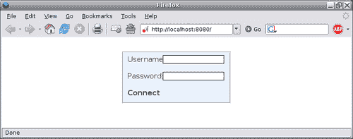
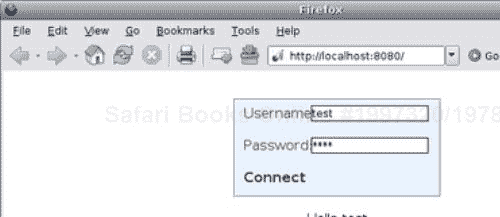
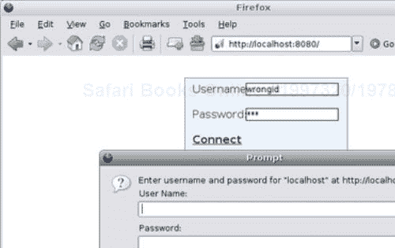
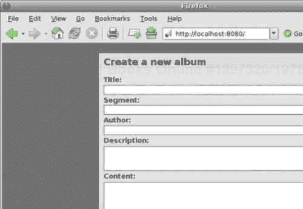
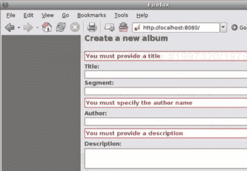
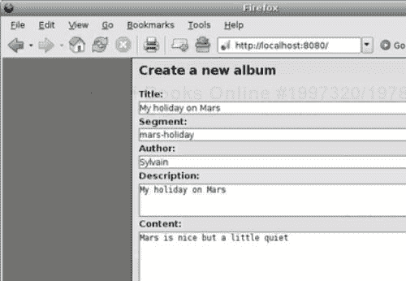

# 第八章。Ajax

在上一章中，我们通过使用 HTML、DOM 和 JavaScript 构建了照片博客的 Web 界面。我们展示了如何从浏览器本身动态修改网页。然而，我们没有详细说明这种动态的本质，也没有解释如何在不刷新整个网页的情况下从 Web 应用服务器检索数据。能够为我们做到这一点的是 Ajax。因此，本章的目标是介绍 Ajax 的概念。

# 富客户端应用的兴起

直到 2005 年，在 Web 应用中最常见的模式是每页一个 HTTP 请求。换句话说，通过触发 HTTP 请求来检索链接资源，通过链接在网站上导航。这种模式现在仍然被广泛使用，但与每页多个 HTTP 请求的模式竞争。这种区别可能看起来微不足道，但通过允许浏览器向一个给定的 URI 发出多个 HTTP 请求以获取更多数据，它为希望创建更互动应用的 Web 开发者提供了一条不同但强大的路径。

例如，让我们想象一个通过分页显示结果而不是一次性显示所有结果的 Web 应用。在传统的 Web 应用中，每次最终用户向前或向后移动时，都会向服务器发送一个新的 HTTP 请求来重建整个页面。在这种情况下，浏览器地址栏中显示的 URL 也会根据当前查看的页面而改变。另一方面，想象一下，如果不是获取整个网页，而是只获取要显示的新数据集。我们仍然会在客户从当前位置移动时发出一个请求，但不会替换整个网页。最终用户会有较少的感觉是被网页所控制，这可能会改善通过数据集导航的整体体验，同时减少带宽消耗。

这个简单的例子实际上是一切现代 Web 应用增强的种子，这些增强导致了富客户端应用的兴起。

# Ajax

在 2005 年，杰西·詹姆斯·加雷特（[`www.adaptivepath.com/publications/essays/archives/000385.php`](http://www.adaptivepath.com/publications/essays/archives/000385.php)）创造了 Ajax 这个术语，用来指代他即将向一位客户展示的一套技术。从那时起，它已经脱离了原作者的手笔，如今成为了我们在上一节中介绍的内容——使网络应用看起来更加动态和交互的术语。

**Ajax**代表**异步 JavaScript 和 XML**，它涵盖了一组应用于网络环境的技术。让我们回顾一下这个缩写的每个部分：

+   **异步：** 在客户端-服务器环境中，有两个基本原则；要么你的操作与整个程序同步运行，要么不同步。如果是，则程序暂停直到操作终止；如果不是，则操作立即返回并让程序继续。一旦操作完成，它通过回调函数通知其主要程序。

    在 Web 应用程序的背景下，Ajax 的整个目的就是为最终用户提供更多的交互性，这就是为什么它广泛依赖于异步操作。现在，没有任何东西阻止开发者将特定操作同步到应用程序的其余部分。然而，如果操作不是几乎瞬时的，这可能会导致整个浏览器的冻结。

+   **JavaScript：** 在传统方法中，每个来自最终用户的行为都会导致一个新的 HTTP 请求，这个请求由浏览器本身生成，同时也消耗了 HTTP 响应。在 Ajax 中，HTTP 请求由对底层 HTTP API 的 JavaScript 调用处理，我们将在稍后进行回顾。因此，Web 开发者负责创建一个有效的请求，能够处理其响应，并最终更新最终用户的网页视图。

+   **XML：** Ajax 的主要目的是在文档对象模型上执行操作，以向最终用户视图插入新内容或从网页中删除部分内容。Ajax 基于通过 HTTP 交换 XML 文档。这些文档包含执行请求操作所需的所有信息和数据。因此，可以使用其他信息格式，XML 不是必需的。最广泛使用的格式是 JSON，我们将在稍后介绍。

## Ajax—优点和缺点

初看起来，Ajax 所承载的概念似乎非常有前途，它们确实如此。然而，所需的技术可能导致意外的问题。首先，让我们回顾一下 Ajax 的一些优点：

+   服务器和带宽使用减少：在传统的 Web 应用程序中，每个页面都是从服务器完整请求的，这既浪费了服务器资源，也浪费了网络资源。这是因为服务器可能需要重新计算页面，并且更多的数据通过电线传输。然而，在两种情况下，合理地使用缓存都会减少这种影响。

    当使用 Ajax 原则时，只需从服务器获取所需的数据。在这种情况下，服务器和中间件可以缓存它。在任何情况下，Ajax 都可以减少服务器上的负载，因为部分处理被移动到客户端本身。

+   用户体验的总体提升：由于网页视图是在客户端根据用户的行为本地更新的，因此用户可能会感觉到 Web 应用程序更加交互和响应。

+   强制关注点分离：由于 Web 开发者负责构建要发送的 HTTP 请求，他或她可以根据应用程序的当前上下文决定实际调用不同的 Web 服务。

    例如，在一个传统的 Web 应用中，一个 HTML 表单会被提交到 Web 服务器，服务器会返回一个 HTML 页面。Ajax 让开发者决定哪个服务将处理用户输入。因此，开发者可以调用一个 Atom 发布协议服务，该服务会返回一个 Atom 文档，开发者随后会手动处理。Ajax Web 应用可以在不同的特定服务之间分配其任务。

现在我们来回顾一下与 Ajax 相关的一些缺点：

+   基于 Ajax 原则的 Web 应用最大的问题之一是它们绕过了浏览器机制，因此，后退和前进按钮的标准行为不再得到保证。从更广泛的角度来看，Ajax 打破了用户已经习惯成为标准 Web 导航方式的习惯。例如，页面到页面的模式是用户操作触发操作并导致网页当前状态发生修改的明显标志，而只修改查看页面一部分的 Web 应用可能会让一些用户感到困惑。

+   Ajax 有时会阻止用户收藏页面。

+   一些人对 Ajax 和 JavaScript 可能带来的安全漏洞表示担忧。然而，这些说法通常是对那些有弱点但并非由于 JavaScript 而是由于设计功能的方式的应用程序提出的。无论如何，在使用 Ajax 时，你应该始终权衡你自己的需求可能带来的潜在安全风险。例如，永远不要仅信任客户端表单验证；确保在服务器端验证任何传入的数据，并将客户端验证保持在最低限度以减少往返 HTTP 交换。

通常，Web 应用中使用 Ajax 的陷阱是其过度使用。尽管这是一个相当主观的话题，但当 Ajax 的使用没有比更传统的方法改善最终用户体验时，滥用 Ajax 是不被看好的。我们的相册应用将相当多地使用 Ajax。

## 背后场景：`XMLHttpRequest`

正如我们所见，Ajax 基于使用 JavaScript 发送 HTTP 请求的理念；更具体地说，Ajax 依赖于`XMLHttpRequest`对象及其 API 来执行这些操作。这个对象最初是由微软工程师设计和实现的，作为一个 ActiveX 控件，可供 Outlook Express 和 Internet Explorer 使用，但在 Ajax 和丰富 Web 应用兴起之前，它并没有被广泛使用。现在，`XMLHttpRequest`是每个现代浏览器的一部分，其使用如此广泛，以至于 W3C 特别成立了一个工作组来指定这个对象的范围，以提供跨实现的最小互操作性要求。

让我们回顾一下 W3C 指定的 XMLHttpRequest 接口，因为它提供了浏览器厂商实现的最常见的属性和函数：

| 属性 | 描述 |
| --- | --- |
| `readyState` | 只读属性，表示对象当前的状态：`0:` 未初始化`1:` 打开`2:` 已发送`3:` 接收`4:` 已加载 |
| `onreadystatechange` | 当 `readyState` 属性改变时，会调用一个 EventListener。 |
| `responseText` | 包含从服务器接收到的字节，以字符串形式表示 |
| `responseXML` | 如果响应的 `content-type` 是与 XML 相关联的类型（`text/xml, application/xml` 或 `+xml`），则包含接收到的文档的实例。 |
| `status` | HTTP 响应代码 |
| `statusText` | HTTP 响应文本 |
| 方法 | 描述 |
| --- | --- |
| `abort()` | 取消与服务器的基本网络连接。 |
| `getAllReponseHeaders()` | 返回一个由换行符分隔的所有 HTTP 响应头的字符串。 |
| `getResponseHeader(header)` | 如果响应中存在该头，则返回其值。否则返回空字符串。 |
| `setRequestHeader(header, value)` | 为基本请求设置 HTTP 头。 |
| `open(method, uri, async, user, password)` | 初始化对象：`method:` 请求要使用的 HTTP 方法`uri:` 请求应用的 URI`async:` 一个布尔值，指示此请求是否必须与程序的其余部分同步`username` 和 `password:` 提供访问资源的凭据 |
| `send(data)` | 实现 HTTP 连接，如果提供了数据，则设置请求体。 |

API 相当直接和简单。让我们通过使用 MochiKit Async 模块的各个示例来了解。

### 执行 GET 请求

`GET`请求如下所示：

```py
var xmlHttpReq = getXMLHttpRequest();
xmlHttpReq.open("GET", "/", true);
var d = sendXMLHttpRequest(xmlHttpReq);
d.addCallback(function (data)
{
alert("Success!");
});
d.addErrback(function (data)
{
alert("An error occurred");
};

```

现在，我们将看到我们实际上做了什么：

1.  1\. 由于每个浏览器都有自己的 API 供开发者实例化 XMLHttpRequest，Mochikit 提供了`getXMLHttpRequest()`函数，该函数将根据检查最终用户使用的浏览器返回正确的对象。

1.  2\. 然后我们使用所需值初始化对象。在这种情况下，我们想要以异步方式对当前主机的"/" URI 执行`GET`请求。

1.  3\. 然后我们通知服务器，它必须在完成我们的请求并发送我们的响应后关闭连接。

1.  4\. 然后我们使用 Mochikit 的`sendXMLHttpRequest()`函数，该函数返回一个延迟对象。此对象为开发者提供了一个干净的 API 来处理`XMLHttpRequest`对象在处理过程中可能采取的不同状态。

1.  a. 如果响应状态码指示成功（通常在 HTTP 的 2xx 和 3xx 范围内），则添加一个回调。

1.  b. 我们还关联了一个错误回调，当响应指示错误时（通常在 HTTP 的 4xx 和 5xx 范围内）将应用此回调。

1.  5. 每个回调必须接受的 `data` 参数是响应中包含的实体主体，然后可以由回调处理。

### 执行内容协商 GET 请求

这个 `GET` 请求如下所示：

```py
var xmlHttpReq = getXMLHttpRequest();
xmlHttpReq.open("GET", "/", true);
xmlHttpReq.setRequestHeader('Accept', 'application/atom+xml');
xmlHttpReq.setRequestHeader('Accept-Language', 'fr');
var d = sendXMLHttpRequest(xmlHttpReq);
d.addCallback(function (data)
{
alert("Success!");
});
d.addErrback(function (data)
{
alert("An error occured");
});

```

在这个请求中，我们通知服务器我们愿意接受使用 Atom 格式表示并使用法语表示的内容。无法处理此请求的服务器可能会以 `406 Not Acceptable` 响应，因此将应用错误回调。

### 执行 POST 请求

这个 `POST` 请求如下所示：

```py
var qs = queryString(data);
var xmlHttpReq = getXMLHttpRequest();
xmlHttpReq.open("POST", "/album", true);
xmlHttpReq.setRequestHeader('Content-Type', 'application/x-www-form-urlencoded');
var d = sendXMLHttpRequest(xmlHttpReq, qs);
d.addCallback(function (data)
{
// do something
});
d.addErrback(function (data)
{
// do something else
});

```

现在，我们将看到我们实际上做了什么：

1.  1. 我们以编码查询字符串的形式发布一些数据。`queryString(data)` 函数接受一个键值对的关联数组，并返回一个形式为 `key1=value1?key2=value2` 的编码字符串。

1.  2. 我们初始化 `XMLHttpRequest` 对象。

1.  3. 我们指定请求实体主体的内容类型：`application/x-www-form-urlencoded`

1.  4. 然后，我们从 `sendXMLHttpRequest` 请求一个延迟对象，但如您所见，我们还传递了我们希望发送的数据。

#### 让我们发布一个 XML 文档

这就是我们将如何做的：

```py
var entry = '<?xml version="1.0" encoding="utf-8"?>
<entry>
<title>This is my family album</title>
<id>urn:uuid:25cd2014-2ab3-11db-902d-000ae4ea7d46</id>
<updated>2006-08-13T11:18:01Z</updated>
<content type="text">Some content</content>
</entry>';
var xmlHttpReq = getXMLHttpRequest();
xmlHttpReq.open("POST", "/album", true);
xmlHttpReq.setRequestHeader('Content-Type', 'application/atom+xml');
var d = sendXMLHttpRequest(xmlHttpReq, entry);
d.addCallback(function (data)
{
// do something
});
d.addErrback(function (data)
{
// do something else
});

```

### 执行 PUT、HEAD 或 DELETE 请求

与 HTML 表单不同，XMLHttpRequest 在支持的 HTTP 方法方面没有限制。实际上，XMLHttpRequest 不关注您使用的方法，也不对其进行解释。您使用的方法会原样发送到服务器。这在基于 REST 或 Atom 发布协议的 Web 服务中非常重要，正如我们在前面的章节中看到的。

### Cookies

Cookies 会自动与请求一起发送，由托管 XMLHttpRequest 的用户代理完成；因此，开发者无需采取任何特定操作。

### 使用摘要或基本方案进行身份验证

XMLHttpRequest 的 `open()` 方法可以接受 `username` 和 `password` 参数，这些参数将与请求一起发送。XMLHttpRequest 支持的身份验证方案由 RFC 2617 定义，即 *基本* 和 *摘要*。这两个方案如下：

+   基本方案：基本方案只是使用 base64 算法对用户名和密码进行编码的传输。问题是，如果第三方获取了编码值，就无法阻止它被解码。这就是为什么基本方案通常被称为明文发送密码，因为应用的编码可以非常容易地被解码。因此，除非在 HTTPS 等安全协议上使用，否则这不是一个安全的身份验证方案。

+   摘要方案：另一方面，摘要方案不会将密码作为明文发送。相反，双方使用密码和其他种子应用相同的算法来计算这些值的摘要。服务器也会在第一次请求时发送种子值来 *标记* 该请求。客户端将摘要算法的计算结果发送回服务器，服务器将其与自己的计算结果进行比较。如果两者匹配，则允许请求。这个方案比基本方案更安全，因为密码实际上从未以可以被合理时间内解密的形式发送到线上。

默认情况下，当使用这些方案时，浏览器会弹出一个窗口请求用户名和密码。在由 JavaScript 调用 XMLHttpRequest 发出的请求的上下文中，可以通过直接将用户凭据提供给 `open()` 方法来避免该弹出窗口。显然，将它们硬编码到 JavaScript 代码中是不合适的。相反，将 HTML 表单集成到网络应用程序中并将输入值动态传递给 JavaScript 调用相当简单，以下示例将演示这一点：

```py
<html>
<head>
<script type="application/javascript" src="img/MochiKit.js">
</script>
<script type="application/javascript" src="img/New.js">
</script>
<script type="application/javascript">
doLogin = function()
{
// create the XMLHttpRequest object
var xmlHttpReq = getXMLHttpRequest();
// initialize the object
// the "/hello/" + username URI is protected by a password
// the magic happens here as we pass dynamically the values
// of the username and password entered by the user
xmlHttpReq.open("GET", "/hello/" + $("username").value, true,
$("username").value, $("password").value);
// start the request
var d = sendXMLHttpRequest(xmlHttpReq);
// let's remove any previous displayed message from the DOM
replaceChildNodes($("message"));
// insert a welcome message if the authentication succeeded
d.addCallback(function (data)
{
appendChildNodes($("message"), SPAN({},
data.responseText));
});
// insert a message if the authentication failed
d.addErrback(function (data)
{
appendChildNodes($("message"), SPAN({}, "You're not
welcome here."));
});
};
</script>
<style type="text/css">
Body
{
text-align: center;
font-family: sans-serif;
}
#loginBox
{
“XMLHttpRequestauthenticating, digest scheme used"position:relative;
margin: 0px auto;
text-align:left;
width: 250px;
color: #2F2F2F;
padding-top: 25px;
}
Fieldset
{
background-color: #E9F3FF;
}
input, label
{
display: block;
float: left;
margin-bottom: 2px;
}
Label
{
text-align: left;
width: 70px;
padding-right: 10px;
}
Input
{
border: 1px #000 solid;
}
#loginButton
{
cursor: pointer;
font-weight: bold;
text-decoration: none;
color: #2F2F2F;
}
#loginButton:hover
{
text-decoration: underline;
}
“XMLHttpRequestauthenticating, digest scheme used"</style>
</head>
“XMLHttpRequestauthenticating, basic scheme used"<body>
<div id="loginBox">
<form name="login" id="login">
<fieldset>
<label>Username:</label>
<input type="text" name="username" id="username" />
<br /><br />
<label>Password:</label>
<input type="password" name="password" id="password" />
<br /><br />
<span onclick="doLogin();" id="loginButton">Connect</span>
</fieldset>
</form>
</div>
<div id="message" />
</body>
</html>

```

以下是一个 CherryPy 脚本示例，它将提供前面的页面：

```py
import os.path
import cherrypy
class Root:
@cherrypy.expose
def index(self):
return file('ajaxdigest.html').read()
class Hello:
@cherrypy.expose
def default(self, username):
return "Hello %s" % username
if __name__ == '__main__':
r = Root()
r.hello = Hello()
current_dir = os.path.abspath(os.path.dirname(__file__))
def get_credentials():
return {'test': 'test'}
conf = {'/hello': {'tools.digest_auth.on': True,
'tools.digest_auth.realm': 'localhost',
'tools.digest_auth.users': get_credentials},
'/MochiKit': {'tools.staticdir.on': True, 'tools.staticdir.dir':
os.path.join(current_dir, 'MochiKit')}}
cherrypy.quickstart(r, config=conf)

```

当你访问 [`localhost:8080/`](http://localhost:8080/) 时，你应该看到以下页面：



如果你输入用户名 `test` 和密码 `test`，你将在屏幕上看到以下视图：



另一方面，如果你提供错误值，你将看到如下屏幕：



不幸的是，浏览器从服务器接收关于身份验证失败的 `401 HTTP 错误代码` 的消息，并自行处理。截至目前，没有跨浏览器的解决方案可以避免这个问题，使得弹出窗口不会出现。如果你点击弹出窗口的 **取消** 按钮，浏览器随后将返回到你的 JavaScript 代码，并应用错误回调。

此外，由于你不能通过 `XMLHttpRequest` 对象访问底层会话（因为它由浏览器处理），你不能通过抑制会话凭据来强制注销。用户必须关闭浏览器才能与应用程序断开连接。

因此，尽管 XMLHttpRequest 允许你在网络应用程序中提供一种更花哨的方式来启用基本和摘要身份验证，但仍然有一些陷阱需要承认。

# JSON

正如我们在本章中已经看到的，尽管 Ajax 的名字中带有 XML，但它并不阻止传输其他格式。例如，你将看到的一个极其常见的格式是 **JSON**（**JavaScript 对象表示法**）。

简而言之，JSON 是一种携带序列化 JavaScript 对象的方式，以便 JavaScript 应用程序可以评估它们并将它们转换为应用程序可以操作的对象。

例如，当用户请求以 JSON 格式格式化的 `album` 对象时，服务器将返回以下内容：

```py
{'description': 'This is a simple demo album for you to test',
'author': 'Sylvain'}

```

我们随后使用 Mochikit 中的 `evalJSONRequest()` 函数，如下所示：

```py
var data = evalJSONRequest(incoming);

```

现在数据是一个 JavaScript 关联数组，描述字段可以通过以下方式访问：

```py
data['description'];

```

JSON 得到广泛应用，因为它简单、易用且构建或评估效率高。它支持所有常见的基类型，如数字、布尔值、数组、字符串或空对象。更复杂的对象被转换为关联数组，其中对象属性名作为键来访问其关联的值。

photoblog 应用程序在其操作中主要使用 JSON 格式。

当你的 CherryPy 应用程序大量依赖 JSON 时，编写一个自动执行 JSON 序列化和反序列化的工具可能很有趣。

```py
import cherrypy
import simplejson
def dejsonify(encoding='utf-8'):
if cherrypy.request.method in ['POST', 'PUT']:
if 'content-type' in cherrypy.request.headers:
if cherrypy.request.headers['content-type'] ==
'application/json':
body_as_dict = simplejson.loads(
cherrypy.request.body.read())
for key in body_as_dict:
cherrypy.request.params[key.encode(encoding)] =
body_as_dict[key]
def jsonify():
if isinstance(cherrypy.response.body, dict):
cherrypy.response.headers['Content-Type'] = 'application/json'
cherrypy.response.body = simplejson.dumps(
cherrypy.response.body)
cherrypy.tools.dejsonifier = cherrypy.Tool('before_handler',
dejsonify)
cherrypy.tools.jsonifier = cherrypy.Tool('before_finalize', jsonify)
class Root:
def index(self):
return {'message': 'Hello'}
index.exposed = True
def process(self, name):
# do something here
return "Processed %s" % name
process.exposed = True
if __name__ == '__main__':
conf = {'/': {'tools.dejsonifier.on': True,
'tools.jsonifier.on': True}}
cherrypy.quickstart(Root(), config=conf)

```

我们使用简单的 JSON 模块创建了两个工具来执行转换。第一个工具仅在设置了 `application/json` 内容类型的 POST 和 PUT 请求上从 JSON 反序列化请求体。该工具加载请求体并将其转换为字典，然后将其注入到 `cherrypy.request` 对象的 `params` 属性中，使得 CherryPy 页面处理程序可以期望 JSON 字典的键作为常规参数，正如你在过程页面处理程序中看到的那样。请注意，我们必须将这些键从 Unicode 编码为 Python 字符串，因为 CherryPy 页面处理程序期望字符串。

第二个工具将页面处理程序返回的字典序列化为 JSON。

# 将 Ajax 应用于我们的应用程序

我们的 photoblog 应用程序将广泛使用 Ajax，为了解释这一点，我们将回顾如何处理 photoblog 的相册。

## 定义所需的命名空间

我们的第一步将是定义 JavaScript 命名空间，这将允许我们在不同的上下文中重用常见的函数名，同时避免命名冲突。使用“命名空间”这个术语稍微有些出乎意料，因为 JavaScript 本身并没有这个概念，但可以通过多种方式来模拟这个功能。在本应用的情况下，我们将使用足够简单的 JavaScript 继承来实现我们的需求。

photoblog 应用程序将使用的两个命名空间是：`ui` 和 `services`。

`ui` 命名空间将涵盖与最终用户的各种交互，而 `services` 命名空间将负责与服务器交换数据。因此，`ui` 命名空间中的类和函数将调用 `services` 中的函数来执行最终用户请求的操作。

要实现这两个命名空间，我们只需定义两个空 JavaScript 函数，如下所示：

```py
function service()
{
};
function ui()
{
};

```

## 实现命名空间

现在我们有了我们的函数，我们可以给它们添加属性。这里我们有专辑类的声明，它将处理从客户端视角的专辑实体的所有方面：

```py
function albums()
{
this.visibility = false;
this.current = null;
this.position = 0;
this.step = 3;
};
ui.prototype.albums = new albums();
var ui = new ui();

```

在这里，我们首先创建一个常规 JavaScript 函数，用作`album`类的构造函数。我们还通过 JavaScript 关键字`this`声明了一些附加到该对象上的属性。

然后我们将`albums`实例作为`ui`函数对象原型的属性，并最终在用户会话中创建我们将在整个应用程序生命周期中使用的`ui`类的唯一实例。

从现在起，我们可以使用`albums`实例来调用它的`edit`方法：

```py
ui.albums.edit(...)

```

然后，我们在`services`命名空间内类似地定义`album`类。

```py
function album()
{
};
service.prototype.albums = new album();
var services = new service();

```

## 向类中添加方法

我们将要添加到我们的类中的第一个方法将是切换我们专辑容器可见状态的方法。这个容器将显示现有专辑的信息，并在用户点击相关链接时淡入或淡出。让我们看看如何添加方法：

```py
albums.prototype.toggle = function(event)
{
toggle($('content-pane'), 'blind');
if(this.visibility == false)
{
this.visibility = true;
this.forward(e);
}
Else
{
this.visibility = false;
replaceChildNodes(albumsPane);
}
toggle($('albums-pane'), 'blind');
};

```

此方法首先切换包含当前照片的内容面板的可见性。然后如果切换意味着打开`albums`面板，我们将它的可见性设置为`true`并调用`forward`方法。否则，我们将可见性设置为`false`并删除附加到该容器的任何元素，这样它们就不会浪费内存。最后，我们请求 Mochikit 更改`albums`面板的可见状态。然后我们将该方法连接到相关链接的`onclick`信号，如下所示：

```py
connect($('albums'), 'onclick', ui.albums, 'toggle');

```

`forward`方法定义如下：

```py
albums.prototype.forward = function(event)
{
var start = this.position;
var end = start + this.step;
services.albums.fetch_range(start, end, this);
this.position = end;
};

```

该方法首先定义了我们将从服务器获取的专辑范围。然后我们调用`services.albums`对象的`fetch_range()`方法，并最终设置下一次调用该方法的起始位置。

现在我们来回顾一下`services.albums`对象本身：

```py
album.prototype.fetch_range = function(start, end, src)
{
var xmlHttpReq = getXMLHttpRequest();
xmlHttpReq.open("GET", albumsBaseUri.concat(start, "-", end), true);
xmlHttpReq.setRequestHeader('Accept', 'application/json');
var d = sendXMLHttpRequest(xmlHttpReq);
d.addCallback(function (data)
{
var data = evalJSONRequest(data);
src.populate(data);
});
};

```

你可能会注意到这个方法接受一个额外的参数，名为`src`，它是调用对象，这样我们的回调就可以在从服务器收到响应时在该对象上应用方法。

请求的 URI `albumsBaseUri.concat(start, "-", end). albumsBaseUri`是一个全局字符串变量，包含执行针对专辑集合的请求的基本 URI。

我们指定我们希望服务器发送给我们 JSON 内容，因为这是我们用来填充检索到的专辑的内容。

发出的请求看起来像这样：

```py
http://localhost:8080/services/rest/albums/0-3
GET /services/rest/albums/0-3 HTTP/1.1
Host: localhost:8080
Accept: application/json
Connection: close

```

其响应将是：

```py
HTTP/1.x 200 OK
Connection: close
Date: Tue, 19 Sep 2006 20:29:07 GMT
Content-Length: 763
Content-Type: application/json
Allow: GET, HEAD
Server: CherryPy/3.0.0beta

```

返回的内容将由 MochiKit 函数`evalJSONRequest()`评估，以返回一个 JavaScript 对象实例；在这种情况下是一个关联数组的数组。一旦我们收到并评估了内容，我们就调用`ui.album`类的`populate()`方法来显示检索到的专辑。该方法定义如下：

```py
albums.prototype.populate = function(albums)
{
// get the albums container
var albumsPane = $('albums-pane');
// we remove any already displayed albums form the DOM tree
replaceChildNodes($('albums-pane'));
// define a set of links that we will use to move through the
// set of albums
var previous = SPAN({'id': 'previous-albums', 'class':
'infos-action'}, 'Previous');
connect(previous, 'onclick', this, 'rewind');
var next = SPAN({'id': 'next-albums', 'class': 'infos-action'},
'Next');
connect(next, 'onclick', this, 'forward');
// we also add a link that when triggered will display the
// form to create a new Album
var create = SPAN({'class': 'infos-action'}, 'Create');
connect(create, 'onclick',this, 'blank');
// in case no albums were retrieved we simply display a default
// message
if(albums.length == 0)
{
appendChildNodes(albumsPane, SPAN({'id': 'info-msg', 'class':
'info-msg'}, 'No more album to view.'));
appendChildNodes(albumsPane, previous);
return;
}
// now we traverse the array of retrieved albums to construct
// a tree structure of each that we will then insert into the
// main DOM tree
for(var album in albums)
{
album = albums[album];
var albumInfoBlock = DIV({'class': 'albums-infos-pane', 'id':
'album-' + album['id']},
LABEL({'class': 'infos-label'}, 'Title:'),
SPAN({'class': 'infos-content'}, album['title']), BR(),
LABEL({'class': 'infos-label'}, 'Created on:'),
SPAN({'class': 'infos-content'}, album['created']), BR(),
LABEL({'class': 'infos-label'}, 'Updated on:'),
SPAN({'class': 'infos-content'}, album['modified']), BR(),
LABEL({'class': 'infos-label'}, 'Description:'),
SPAN({'class': 'infos-content'}, album['description']), BR());
// we provide a link Edit and Delete to each album displayed
var editAlbumElement = SPAN({'class': 'infos-action'}, 'Edit');
connect(editAlbumElement, 'onclick', this, 'fetch_for_edit');
var deleteAlbumElement = SPAN({'class': 'infos-action'},
'Delete');
connect(deleteAlbumElement, 'onclick', this, 'ditch');
appendChildNodes(albumInfoBlock, editAlbumElement);
appendChildNodes(albumInfoBlock, deleteAlbumElement);
// we finally connect the onclick signal of the block
// carrying the album information. When a user clicks
// it will toggle the albums panel visibility and
// display the selected album.
connect(albumInfoBlock, 'onclick', this, 'select');
appendChildNodes(albumsPane, albumInfoBlock);
}
// we eventually insert all those new elements into the
// main DOM tree to be displayed.
appendChildNodes(albumsPane, previous);
appendChildNodes(albumsPane, next);
appendChildNodes(albumsPane, create);
};

```

## 创建新专辑的方法

现在我们能够显示相册了，我们将回顾如何创建一个新的相册。要做到这一点，我们首先需要一个表单来收集用户输入。让我们解释一下负责通过动态将其插入 DOM 树来显示表单的`ui.albums.blank()`方法。

```py
albums.prototype.blank = function(e)
{
// those two elements will be links to either submit the form
// or canceling the process by closing the form
var submitLink = SPAN({'id': 'form-submit', 'class': 'form-link'},
'Submit');
var cancelLink = SPAN({'id': 'form-cancel', 'class': 'form-link'},
'Cancel');
// we will insert error messages when specific fields are
// not filled
var successMessage = SPAN({'id': 'form-success', 'class':
'form-success'}, 'Album created');
var errorMessage = SPAN({'id': 'form-error', 'class':
'form-error'}, 'An unexpected error occured');
var titleErrMsg = SPAN({'id': 'form-title-error', 'class':
'form-error'}, 'You must provide a title');
var authorErrMsg = SPAN({'id': 'form-author-error', 'class':
'form-error'}, 'You must specify the author name');
var descErrMsg = SPAN({'id': 'form-desc-error', 'class':
'form-error'}, 'You must provide a description');
// the main form
var albumForm = DIV({'id': 'pageoverlay'},
DIV({'id': 'outerbox'},
DIV({'id': 'formoverlay'},
SPAN({'class': 'form-caption'}, 'Create a new album'),
BR(),BR(),
FORM({'id': 'create-album', 'name':"albumForm"}, titleErrMsg,
LABEL({'class': 'form-label'}, 'Title:'),
INPUT({'class': 'form-input', 'name': 'title', 'id':
'album-title', 'value': ''}),
BR(),
LABEL({'class': 'form-label'}, 'Segment:'),
INPUT({'class': 'form-input', 'name': 'segment', 'id':
'album-segment', 'value': ''}), BR(), authorErrMsg,
LABEL({'class': 'form-label'}, 'Author:'),
INPUT({'class': 'form-input', 'name': 'author', 'id':
'album-author', 'value': ''}), BR(), descErrMsg,
LABEL({'class': 'form-label'}, 'Description:'),
TEXTAREA({'class': 'form-textarea', 'name': 'description',
'id': 'album-desc', 'rows': '2', 'value': ''}), BR(),
LABEL({'class': 'form-label'}, 'Content:'),
TEXTAREA({'class': 'form-textarea', 'name': 'content', 'id':
'album-content', 'rows': '7', 'value': ''}), BR()),
successMessage, errorMessage,
DIV({'id': 'form-links'},
submitLink,
cancelLink))));
hideElement(titleErrMsg);
hideElement(authorErrMsg);
hideElement(descErrMsg);
hideElement(errorMessage);
hideElement(successMessage);
connect(submitLink, 'onclick', this, 'create');
connect(cancelLink, 'onclick', closeOverlayBox);
appendChildNodes($('photoblog'), albumForm);
};

```

表单块的创建需要进一步解释。为了提供一个带有表单的更华丽的面板，我们使用了在*Lightbox*或*Thickbox*等脚本中部署的技术。两者都依赖于 CSS 应用于 DOM 的覆盖能力来显示在其它元素之上的元素。覆盖允许以非顺序方式显示元素，而不是堆叠。这个功能结合了合理使用 HTML 块作为`DIV`和适当的颜色，可以提供一种吸引人的内容展示方式，如下面的截图所示：



如果您不填写必填字段并提交表单，您将看到以下截图所示的屏幕：



如果您填写了必填字段并提交了表单，您将看到以下截图所示的屏幕：



为了避免用户尝试重新提交表单的情况，我们移除了**提交**链接，现在用户可以安全地关闭这个屏幕。

HTTP 交换将看起来像这样：

```py
POST /services/rest/album/ HTTP/1.1
Host: localhost:8080
Accept: application/json
Accept-Language: en-us,en;q=0.5
Accept-Encoding: gzip,deflate
Accept-Charset: ISO-8859-1,utf-8;q=0.7,*;q=0.7
Content-Type: application/x-www-form-urlencoded
Content-Length: 167
Pragma: no-cache
blog_id=1&title=My%20holiday%20on%20Mars&author=Sylvain&description= My%20holiday%20on%20Mars.&content=Mars%20is%20nice%20but%20a%20little%20quiet.
HTTP/1.x 201 Created
Connection: close
Content-Length: 289
Server: CherryPy/3.0.0beta
Location: http://localhost:8080/album/19
Allow: DELETE, GET, HEAD, POST, PUT
Date: Wed, 20 Sep 2006 19:59:59 GMT

```

注意，响应给出了直接访问新创建相册的 URI。

处理之前 HTTP 交换的方法是`services.album.create()`，如下所示：

```py
album.prototype.create = function(data, src)
{
var qs = queryString(data);
var xmlHttpReq = getXMLHttpRequest();
xmlHttpReq.open("POST", albumBaseUri, true);
xmlHttpReq.setRequestHeader('Content-Type',
'application/x-www-form-urlencoded');
xmlHttpReq.setRequestHeader('Accept', 'application/json');
var d = sendXMLHttpRequest(xmlHttpReq, qs);
d.addCallback(function (data)
{
src.showSuccessMessage();
});
d.addErrback(function (data)
{
src.showErrorMessage();
});
};

```

`data`参数是表单字段的 JavaScript 关联数组。`src`参数是`ui.albums`实例，它扩展了以下方法：

```py
albums.prototype.create = function(event)
{
if(this.validate())
{
// blogId is a global variable containing the current photoblog
// identifier
var data = {'blog_id': blogId, 'title': $('album-title').value,
'author': album-author').value,
'description': $('album-desc').value,
'content': $('album-content').value};
services.albums.create(data, this);
}
};
albums.prototype.validate = function()
{
var ready = true;
hideElement($('form-title-error'));
hideElement($('form-author-error'));
hideElement($('form-desc-error'));
if($('album-title').value == '')
{
appear($('form-title-error'));
ready = false;
}
if($('album-author').value == '')
{
appear($('form-author-error'));
ready = false;
}
if($('album-desc').value == '')
{
appear($('form-desc-error'));
ready = false;
}
return ready;
};
albums.prototype.showSuccessMessage = function()
{
hideElement($('form-title-error'));
hideElement($('form-author-error'));
hideElement($('form-desc-error'));
appear($('form-success'));
fade($('form-submit'));
};
albums.prototype.showErrorMessage = function()
{
hideElement($('form-title-error'));
hideElement($('form-author-error'));
hideElement($('form-desc-error'));
appear($('form-error'));
};

```

## 更新现有相册的方法

这遵循了我们之前章节中看到的相同原则，只不过我们提供了一个`album`对象来自动填充表单的值。

## 删除现有相册的方法

最后，我们需要一个方法来删除一个相册：

```py
// method part of the ui namespace
albums.prototype.ditch = function(event)
{
// stop the propagation of the click event so that
// the select method is not applied
event.stop();
// shows a modal dialogbox asking the confirmation of the deletion
var doit = confirm("Are you sure you want to delete this album?");
if(doit)
{
// we retrieve the id of the album to delete from
// the block carrying the album <div id="album-19">...</div>
var currentAlbumId = (e.src().parentNode.id).substr(6);
services.albums.remove(currentAlbumId);
switchOff(e.src().parentNode);
}
};
// method part of the services namespace
album.prototype.remove = function(id)
{
if(id != null)
{
var xmlHttpReq = getXMLHttpRequest();
xmlHttpReq.open("DELETE", albumBaseUri + id, true);
var d = sendXMLHttpRequest(xmlHttpReq);
}
};

```

HTTP 交换看起来将是这样：

```py
DELETE /services/rest/album/19 HTTP/1.1
Host: localhost:8080
Connection: close
Content-Length: 0
HTTP/1.x 200 OK
Connection: close
Date: Wed, 20 Sep 2006 20:39:49 GMT
Content-Length: 0
Allow: DELETE, GET, HEAD, POST, PUT
Server: CherryPy/3.0.0beta

```

我们已经解释了如何操作照片博客应用中的相册的基本方法。相同的原理将应用于应用的其他实体：电影和照片。

# 摘要

本章向您介绍了 Ajax，以及更广泛地介绍了使用 JavaScript 进行客户端编程的基础。可能性几乎是无限的，并且不久的将来应该会看到非常有趣和强大的网络应用，它们将逐渐取代它们的富客户端对应物。
