# 第一章：介绍云原生架构和微服务

我们开始吧！在我们开始构建应用程序之前，我们需要找到以下一些问题的答案：

+   什么是云计算？它有哪些不同类型？

+   什么是微服务及其概念？

+   什么是好去做的基本要求？

在本章中，我们将专注于开发人员或应用程序员在开始编写应用程序之前应该了解的不同概念。

让我们先了解一下系统构建及其演变。

长期以来，我们一直在寻找构建系统的新方法。随着新技术的进步和更好方法的采用，IT 基础设施变得更加可靠和有效，为客户提供更好的体验，也让工程师感到满意。

持续交付帮助我们将软件开发周期转移到生产环境，并让我们识别软件中不同易出错的方面，坚持认为每次代码提交都是适合发布到生产环境的候选项。

我们对互联网运作方式的理解已经推动我们发展出更好的让机器与其他机器交流的方法。虚拟化平台使我们能够独立创建解决方案并调整我们的机器大小，基础设施自动化使我们能够以规模管理这些机器。一些大型、成功的云平台，如亚马逊、Azure 和谷歌，已经采纳了小团队拥有其服务的全生命周期的观点。领域驱动设计（DDD）、持续交付（CD）、按需虚拟化、基础设施自动化、小型自治团队和规模化系统等概念是不同特征，它们有效地将我们的软件投入生产。现在，微服务已经从这个世界中崛起。它并不是在现实之前开发或描述的；它是作为一种趋势或者说是从真实使用中崛起的。在本书中，我将从这些先前的工作中提取出一些内容，以帮助说明如何构建、管理和优化微服务。

许多组织发现，通过采用细粒度的微服务结构，他们可以快速交付软件，并掌握更新的技术。微服务基本上给了我们更多的灵活性来做出反应和做出各种决策，允许我们迅速应对不可避免的影响我们所有人的变化。

# 云计算简介

在我们开始微服务和云原生概念之前，让我们先了解一下云计算的基本概念。

云计算是一个描述广泛的服务的广泛术语。与技术中的其他重大发展一样，许多供应商都抓住了“云”这个词，并将其用于超出基本定义范围的产品。由于云是一个广泛的服务集合，组织可以选择何时、何地以及如何使用云计算。

云计算服务可以分为以下几类：

+   SaaS：这些是准备好被最终用户接受的成熟应用程序

+   PaaS：这些是一组对于想要构建他们的应用程序或快速将其直接托管到生产环境而不必关心底层硬件的用户/开发人员有用的工具和服务

+   IaaS：这是为想要构建自己的业务模型并自定义它的客户提供的服务

云计算作为一个堆栈，可以解释如下：

+   云计算通常被称为堆栈，基本上是一系列服务，其中每个服务都建立在另一个服务的基础上，统称为“云”。

+   云计算模型被认为是一组不同的可配置计算资源（如服务器、数据库和存储），它们彼此通信，并且可以在最少监督下进行配置。

以下图表展示了云计算堆栈组件：

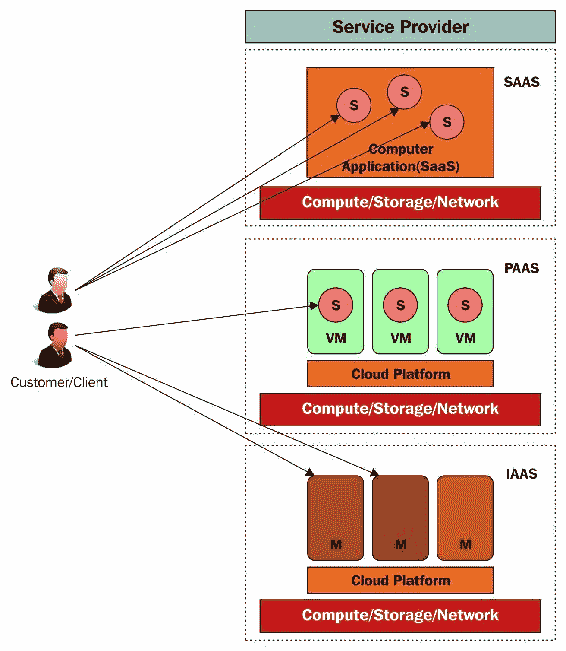

让我们详细了解云计算组件及其用例。

# 软件即服务

以下是描述 SaaS 的关键要点：

+   软件即服务（SaaS）为用户提供了访问托管在服务提供商场所的软件的能力，通过提供商通过互联网提供的服务作为服务通过 Web 浏览器。这些服务基于订阅，并且也被称为按需软件。

+   SaaS 提供公司包括谷歌文档生产套件、甲骨文 CRM（客户关系管理）、微软及其 Office 365 提供和 Salesforce CRM 和 QuickBooks。

+   SaaS 还可以进一步分类为专业 SaaS，专注于特定行业的需求，如医疗保健和农业，或横向 SaaS，专注于软件行业，如人力资源和销售。

+   SaaS 提供基本上是为那些迅速想要掌握现有应用程序的组织而设计的，这些应用程序易于使用和理解，即使对于非技术人员也是如此。根据组织的使用和预算，企业可以选择支持计划。此外，您可以从全球任何地方的任何设备上访问这些 SaaS 应用程序，并且具有互联网功能。

# 平台即服务

以下是描述 PaaS 的关键要点：

+   在 PaaS 提供中，组织/企业无需担心其内部应用程序的硬件和软件基础设施管理

+   PaaS 的最大好处是为开发团队（本地或远程），他们可以在一个共同的框架上高效地构建、测试和部署他们的应用程序，其中底层硬件和软件由 PaaS 服务提供商管理。

+   PaaS 服务提供商提供平台，并在平台周围提供不同的服务

+   PaaS 提供商的示例包括亚马逊网络服务（AWS Elastic Beanstalk）、微软 Azure（Azure 网站）、谷歌应用引擎和甲骨文（大数据云服务）

# 基础设施即服务

以下是描述 IaaS 的关键要点：

+   与 SaaS 不同，在 IaaS 中，客户提供 IT 资源，例如裸金属机器来运行应用程序，硬盘用于存储，以及网络电缆用于网络功能，他们可以根据其业务模型进行定制。

+   在 IaaS 提供中，由于客户可以完全访问其基础设施，他们可以根据其应用程序的要求扩展其 IT 资源。此外，在 IaaS 提供中，客户必须管理应用程序/资源的安全性，并需要在突发故障/崩溃时建立灾难恢复模型。

+   在 IaaS 中，服务是按需提供的，客户根据使用情况收费。因此，客户有责任对其资源进行成本分析，这将有助于限制他们超出预算。

+   它允许客户/消费者根据应用程序的要求定制其基础设施，然后快速高效地拆除基础设施并重新创建。

+   基于 IaaS 的定价模型基本上是按需提供的，这意味着您按需付费。您根据资源的使用和使用时间收费。

+   亚马逊网络服务（提供 Amazon Elastic Compute Cloud（Amazon EC2）和 Amazon Simple Storage Service（Amazon S3））是云服务中的第一个，然而，微软 Azure（虚拟机）、Rackspace（虚拟云服务器）和甲骨文（裸金属云服务）等公司也声名显赫。

# 云原生概念

云原生是构建团队、文化和技术，利用自动化和架构来管理复杂性并释放速度。

云原生概念超越了与其相关的技术。我们需要了解公司、团队和个人是如何取得成功的，才能了解我们的行业将走向何方。

目前，像 Facebook 和 Netflix 这样的公司已经投入了大量资源来研究云原生技术。即使是小型和更灵活的公司现在也意识到了这些技术的价值。

通过云原生的成熟实践的反馈，以下是一些显而易见的优势：

+   以结果为导向和团队满意度：云原生方法展示了将一个大问题分解成小问题的方式，这样每个团队可以专注于个别部分。

+   繁重的工作：自动化减少了引起运营痛苦的重复手动任务，并减少了停机时间。这使得您的系统更加高效，并且产生更加高效的结果。

+   可靠高效的应用程序基础设施：自动化使得在不同环境中部署更加可控——无论是开发、阶段还是生产环境——并且还可以处理意外事件或故障。构建自动化不仅有助于正常部署，而且在灾难恢复情况下也使部署变得更加容易。

+   对应用程序的洞察：围绕云原生应用程序构建的工具提供了更多对应用程序的洞察，使它们易于调试、故障排除和审计。

+   高效可靠的安全性：在每个应用程序中，主要关注点是其安全性，并确保它可以通过所需的渠道进行身份验证。云原生方法为开发人员提供了确保应用程序安全性的不同方式。

+   成本效益的系统：云方法管理和部署您的应用程序使资源的使用更加高效，这也包括应用程序发布，因此通过减少资源的浪费使系统更加具有成本效益。

# 云原生——它的含义和重要性是什么？

云原生是一个广义术语，利用不同的技术，如基础设施自动化、开发中间件和支持服务，这些基本上是您的应用程序交付周期的一部分。云原生方法包括频繁的无故障和稳定的软件发布，并且可以根据业务需求扩展应用程序。

使用云原生方法，您将能够以系统化的方式实现应用程序构建的目标。

云原生方法远比传统的虚拟化导向编排更好，后者需要大量工作来构建适合开发的环境，然后为软件交付过程构建一个完全不同的环境。理想的云原生架构应该具有自动化和组合功能，可以代表您工作。这些自动化技术还应该能够管理和部署您的应用程序到不同的平台，并为您提供结果。

您的云原生架构还应该能够识别一些其他运营因素，如稳定的日志记录、监控应用程序和基础设施，以确保应用程序正常运行。

云原生方法确实帮助开发人员使用诸如 Docker 之类的工具在不同平台上构建其应用程序，Docker 是轻量级且易于创建和销毁的。

# 云原生运行时

容器是如何在从一个计算环境移动到另一个计算环境时可靠运行软件的最佳解决方案。这可能是从一个开发者机器到阶段环境，再到生产环境，也可能是从物理机器到私有或公共云中的虚拟机。Kubernetes 已经成为容器服务的代名词，并且正在变得越来越流行。

随着云原生框架的兴起和围绕其构建的应用程序数量的增加，容器编排的属性受到了更多的关注和使用。以下是您从容器运行时需要的内容：

+   **管理容器状态和高可用性**：务必在生产环境中维护容器的状态（如创建和销毁），因为这对于业务至关重要，并且应能够根据业务需求进行扩展

+   **成本分析和实现**：容器可以根据您的业务预算控制资源管理，并且可以大大降低成本

+   **隔离环境**：在容器内运行的每个进程应保持在该容器内部隔离

+   **跨集群负载平衡**：应用程序流量基本上由一组容器集群处理，应在容器内平衡重定向，这将增加应用程序的响应并保持高可用性

+   **调试和灾难恢复**：由于我们在处理生产系统，因此需要确保我们拥有正确的工具来监视应用程序的健康状况，并采取必要的措施以避免停机并提供高可用性

# 云原生架构

云原生架构与我们为传统系统创建的任何应用程序架构类似，但在云原生应用程序架构中，我们应该考虑一些特征，例如十二要素应用程序（应用程序开发的模式集合）、微服务（将单块业务系统分解为独立的可部署服务）、自助式敏捷基础设施（自助式平台）、基于 API 的协作（通过 API 进行服务之间的交互）和反脆弱性（自我实现和加强应用程序）。

首先，让我们讨论一下*什么是微服务？*

微服务是一个更广泛的术语，将大型应用程序分解为较小的模块进行开发，并使其足够成熟以发布。这种方法不仅有助于有效管理每个模块，还可以在较低级别识别问题。以下是微服务的一些关键方面：

+   **用户友好的界面**：微服务使微服务之间能够清晰分离。微服务的版本控制使 API 更易于控制，并且还为这些服务的消费者和生产者提供了更多自由。

+   **在平台上部署和管理 API**：由于每个微服务都是一个独立的实体，因此可以更新单个微服务而无需更改其他微服务。此外，对于微服务来说，回滚更容易。这意味着部署的微服务的构件在 API 和数据模式方面应兼容。这些 API 必须在不同平台上进行测试，并且测试结果应该在不同团队之间共享，即运营、开发人员等，以维护一个集中的控制系统。

+   **应用程序的灵活性**：开发的微服务应能够处理请求并必须做出响应，无论请求的类型如何，可能是错误的输入或无效的请求。此外，您的微服务应能够处理意外的负载请求并做出适当的响应。所有这些微服务都应该独立测试，以及进行集成测试。

+   **微服务的分发**：最好将服务分割成小块服务，以便可以单独跟踪和开发，并组合成一个微服务。这种技术使微服务的开发更加高效和稳定。

以下图表显示了云原生应用程序的高级架构：

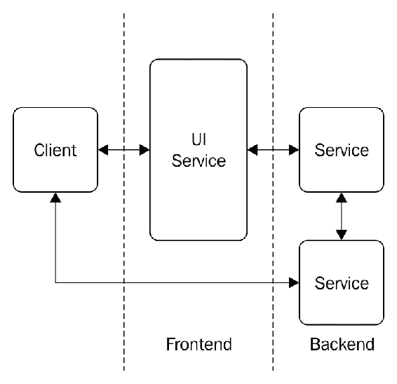

应用程序架构理想上应该从两个或三个服务开始，尝试通过进一步的版本扩展。了解应用程序架构非常重要，因为它可能需要与系统的不同组件集成，并且在大型组织中，可能有一个单独的团队管理这些组件。在微服务中进行版本控制非常重要，因为它标识了在开发的指定阶段支持的方法。

# 微服务是一个新概念吗？

微服务在行业中已经存在很长时间了。这是创建大型系统的不同组件之间的区别的另一种方式。微服务以类似的方式工作，它们作为不同服务之间的链接，并根据请求类型处理特定交易的数据流。

以下图表描述了微服务的架构：

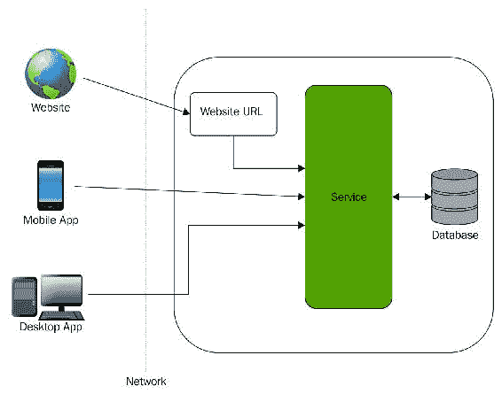

# 为什么 Python 是云原生微服务开发的最佳选择？

为什么我选择 Python，并推荐尽可能多的人使用它？嗯，这归结于下面部分中解释的原因。

# 可读性

Python 是一种高度表达性和易于学习的编程语言。即使是业余爱好者也可以轻松发现 Python 的不同功能和范围。与其他编程语言（如 Java）不同，它更注重括号、括号、逗号和冒号，Python 让你花更多时间在编程上，而不是在调试语法上。

# 库和社区

Python 的广泛库范围在不同平台（如 Unix、Windows 或 OS X）上非常便携。这些库可以根据您的应用程序/程序要求轻松扩展。有一个庞大的社区致力于构建这些库，这使得它成为商业用例的最佳选择。

就 Python 社区而言，**Python 用户组**（**PUG**）是一个致力于通过基于社区的开发模型增加 Python 在全球范围内的知名度的社区。这些团体成员就基于 Python 的框架发表演讲，这有助于我们构建大型系统。

# 交互模式

Python 交互模式可帮助您调试和测试代码片段，稍后可以将其作为主程序的一部分添加。

# 可扩展性

Python 提供了更好的结构和概念，例如模块，以比任何其他脚本语言（如 shell 脚本）更系统地维护大型程序。

# 了解十二要素应用程序

云原生应用程序符合旨在通过可预测的实践增强灵活性的协议。这个应用程序保持了一种名为**十二要素**应用程序的宣言。它概述了开发人员在构建现代基于 Web 的应用程序时应遵循的方法论。开发人员必须改变他们的编码方式，为他们的应用程序运行的基础设施之间创建一个新的合同。

在开发云原生应用程序时，有几点需要考虑：

+   使用信息化设计，通过自动化增加应用程序的使用率，减少客户的时间和成本

+   在不同环境（如阶段和生产）和不同平台（如 Unix 或 Windows）之间使用应用程序可移植性

+   使用云平台上的应用程序适用性，并了解资源分配和管理

+   使用相同的环境来减少 bug，并通过持续交付/部署实现软件发布的最大灵活性

+   通过最小的监督扩展应用程序并设计灾难恢复架构，实现高可用性

许多十二要素相互作用。它们通过强调声明性配置，专注于速度、安全性和规模。十二要素应用程序可以描述如下：

+   **集中式代码库**：每个部署的代码都在修订控制中进行跟踪，并且应该在多个平台上部署多个实例。

+   **依赖管理**：应用程序应能够声明依赖关系，并使用诸如 Bundler、pip 和 Maven 等工具对其进行隔离。

+   **定义配置**：在操作系统级别定义可能在不同部署环境（如开发、阶段和生产）中不同的配置（即环境变量）。

+   **后备服务**：每个资源都被视为应用程序本身的一部分。后备服务，如数据库和消息队列，应被视为附加资源，并在所有环境中平等消耗。

+   **在构建、发布和运行周期中的隔离**：这涉及在构建工件之间进行严格分离，然后与配置结合，然后从工件和配置组合中启动一个或多个实例。

+   **无状态进程**：应用程序应执行一个或多个实例/进程（例如，主/工作者），它们之间没有共享。

+   **服务端口绑定**：应用程序应是自包含的，如果需要暴露任何/所有服务，则应通过端口绑定（最好是 HTTP）来实现。

+   **扩展无状态进程**：架构应强调在底层平台中管理无状态进程，而不是向应用程序实现更多复杂性。

+   **进程状态管理**：进程应该能够快速扩展并在短时间内优雅地关闭。这些方面可以实现快速扩展性、部署更改和灾难恢复。

+   **持续交付/部署到生产环境**：始终尝试保持不同环境的相似性，无论是开发、阶段还是生产。这将确保您在多个环境中获得类似的结果，并实现从开发到生产的持续交付。

+   **日志作为事件流**：日志记录非常重要，无论是平台级还是应用程序级，因为这有助于了解应用程序的活动。启用不同的可部署环境（最好是生产环境）通过集中服务收集、聚合、索引和分析事件。

+   **临时任务作为一次性进程**：在云原生方法中，作为发布的一部分运行的管理任务（例如数据库迁移）应作为一次性进程运行到环境中，而不是作为具有长时间运行进程的常规应用程序。

云应用平台，如 Cloud Foundry、Heroku 和 Amazon Beanstalk，都经过优化，用于部署十二要素应用。

考虑所有这些标准，并将应用程序与稳定的工程接口集成，即处理无状态概要设计，使得分布式应用程序具备云准备能力。Python 通过其固执、传统而非设置的方式，彻底改变了应用程序系统的发展。

# 设置 Python 环境

正如我们将在本书中展示的那样，拥有正确的环境（本地或用于自动化构建）对于任何开发项目的成功至关重要。如果工作站具有正确的工具，并且设置正确，那么在该工作站上进行开发会感觉像是一股清新的空气。相反，一个设置不良的环境会让任何开发人员使用起来感到窒息。

以下是我们在本书后期需要的先决条件账户：

+   需要创建 GitHub 账户进行源代码管理。使用以下链接中的文章来创建：

[`medium.com/appliedcode/setup-github-account-9a5ec918bcc1`](https://medium.com/appliedcode/setup-github-account-9a5ec918bcc1)

+   应用程序部署需要 AWS 和 Azure 账户。使用以下链接中提供的文章来创建这些账户：

+   AWS: [`medium.com/appliedcode/setup-aws-account-1727ce89353e`](https://medium.com/appliedcode/setup-aws-account-1727ce89353e.)

+   Azure: [`medium.com/appliedcode/setup-microsoft-azure-account-cbd635ebf14b`](https://medium.com/appliedcode/setup-microsoft-azure-account-cbd635ebf14b)

现在，让我们设置一些在开发项目中需要的工具。

# 安装 Git

Git ([`git-scm.com`](https://git-scm.com)) 是一个免费的开源分布式版本控制系统，旨在处理从小型到非常大型的项目，速度和效率都很高。

# 在基于 Debian 的发行版 Linux（如 Ubuntu）上安装 Git

您可以通过几种方式在 Debian 系统上安装 Git：

1.  使用**高级软件包工具**（**APT**）软件包管理工具：

您可以使用 APT 软件包管理工具更新本地软件包索引。然后，您可以以 root 用户身份使用以下命令下载并安装最新的 Git：

```py
      $ apt-get update -y
      $ apt-get install git -y  

```

上述命令将在您的系统上下载并安装 Git。

1.  使用源代码，您可以执行以下操作：

1.  从 GitHub 存储库下载源代码，并从源代码编译软件。

在开始之前，让我们首先安装 Git 的依赖项；以 root 用户身份执行以下命令：

```py
      $ apt-get update -y 
      $ apt-get install build-essential libssl-dev
      libcurl4-gnutls-dev libexpat1-dev gettext unzip -y   

```

2. 安装必要的依赖项后，让我们转到 Git 项目存储库（[`github.com/git/git`](https://github.com/git/git)）下载源代码，如下所示：

```py
      $ wget https://github.com/git/git/archive/v1.9.1.zip -Ogit.zip  

```

3. 现在，使用以下命令解压下载的 ZIP 文件：

```py
      $ unzip git.zip
      $ cd git-*  

```

4. 现在，您必须制作软件包并以 sudo 用户身份安装它。为此，请使用接下来给出的命令：

```py
      $ make prefix=/usr/local all
      $ make prefix=/usr/local install

```

上述命令将在您的系统上安装 Git 到`/usr/local`。

# 在基于 Debian 的发行版上设置 Git

现在我们已经在系统上安装了 Git，我们需要设置一些配置，以便为您生成的提交消息包含您的正确信息。

基本上，我们需要在配置中提供名称和电子邮件。让我们使用以下命令添加这些值：

```py
$ git config --global user.name "Manish Sethi"
$ git config --global user.email manish@sethis.in  

```

# 在 Windows 上安装 Git

让我们在 Windows 上安装 Git；您可以从官方网站（[`git-scm.com/download/win`](https://git-scm.com/download/win)）下载最新版本的 Git。按照下面列出的步骤在 Windows 系统上安装 Git：

1.  下载`.exe`文件后，双击运行。首先，您将看到 GNU 许可证，如此截图所示：

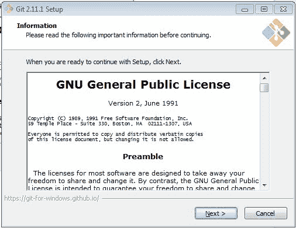

点击下一步：

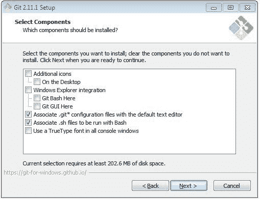

在前面截图中显示的部分中，您可以根据需要自定义设置，或者保持默认设置，这对于本书来说是可以的。

1.  另外，您可以安装 Git Bash 和 Git；点击下一步：

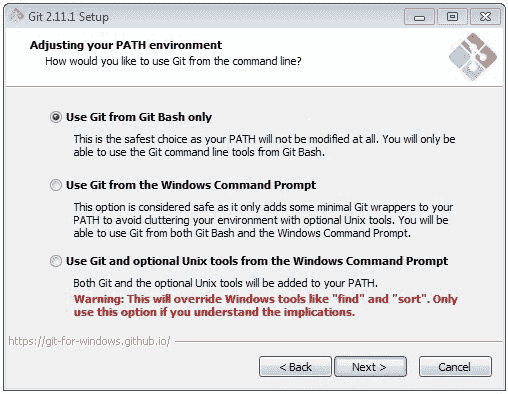

1.  在下一个截图中看到的部分中，您可以启用与 Git 软件包一起提供的其他功能。然后，点击下一步：

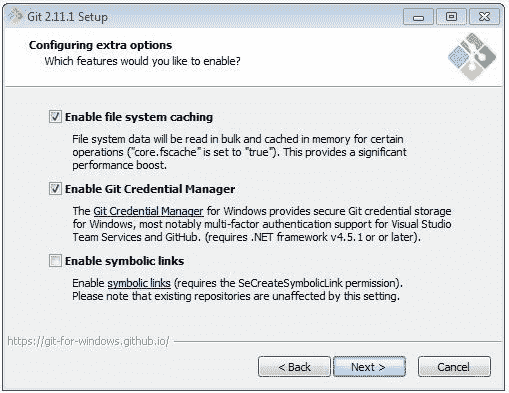

1.  您可以通过点击下一步跳过其余步骤，然后进行安装部分。

安装完成后，您将能够看到如下屏幕：

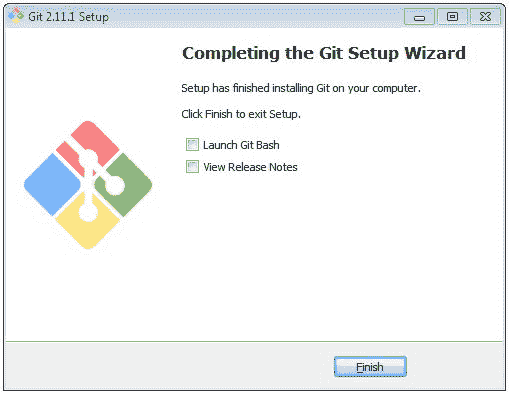

太好了！我们已经成功在 Windows 上安装了 Git！

# 使用 Chocolatey

这是我在 Windows 10 上安装 Git 的首选方式。它以一行安装与之前相同的软件包。如果您还没有听说过 Chocolatey，请停下一切，去多了解一些。它可以用单个命令安装软件；您不再需要使用点击安装程序！

Chocolatey 非常强大，我将其与**Boxstarter**结合使用来设置我的开发机器。如果您负责在 Windows 上为开发人员设置机器，这绝对值得一试。

让我们看看您如何使用 Chocolatey 安装 Git。我假设您已经安装了 Chocolatey（[`chocolatey.org/install`](https://chocolatey.org/install)）（在命令提示符中是一行）。然后，简单地打开`管理员命令`窗口，并输入此命令：

```py
$ choco install git -params '"/GitAndUnixToolsOnPath"'  

```

这将安装 Git 和`BASH`工具，并将它们添加到您的路径中。

# 在 Mac 上安装 Git

在开始 Git 安装之前，我们需要为 OS X 安装命令行工具。

# 为 OS X 安装命令行工具

为了安装任何开发者，您需要安装 Xcode（[`developer.apple.com/xcode/`](https://developer.apple.com/xcode/)），这是一个将近 4GB 的开发者套件。苹果公司在 Mac App Store 上免费提供。为了安装 Git 和 GitHub 设置，您需要安装一些命令行工具，这些工具是 Xcode 开发工具的一部分。

如果您有足够的空间，下载并安装 Xcode，这基本上是一个完整的开发工具包。

您需要在[developer.apple.com](http://developer.apple.com)上创建一个苹果开发者帐户，以便下载命令行工具。设置好您的帐户后，您可以根据版本选择命令行工具或 Xcode，如下所示：

+   如果您使用的是 OS X 10.7.x，下载 10.7 命令行工具。如果您使用的是 OS X 10.8.x，下载 10.8 命令行工具。

+   下载完成后，打开`DMG`文件，并按照说明进行安装。

# 在 OS X 上安装 Git

在 Mac 上安装 Git 与在 Windows 上安装 Git 基本相似。不同之处在于，我们有`dmg`文件而不是`.exe`文件，您可以从 Git 网站（`https://git-scm.com/download/mac`）下载进行安装：

1.  双击下载的`dmg`文件。它将打开一个包含以下文件的查找器：

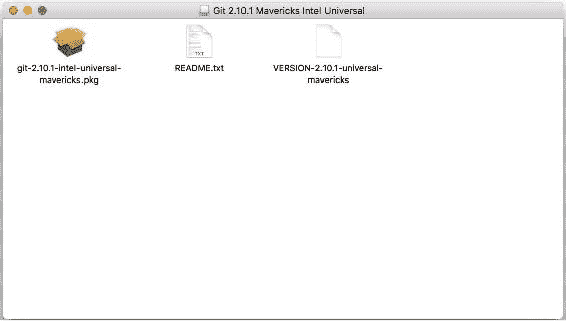

1.  双击`git-2.10.1-intel-universal-mavericks.dmg`文件；它将打开安装向导进行安装，如下截图所示：

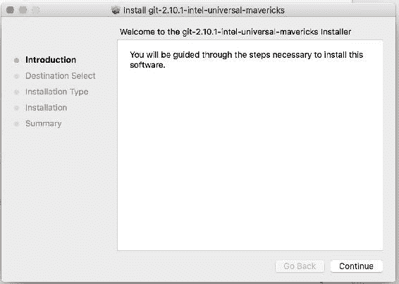

1.  点击安装开始安装：

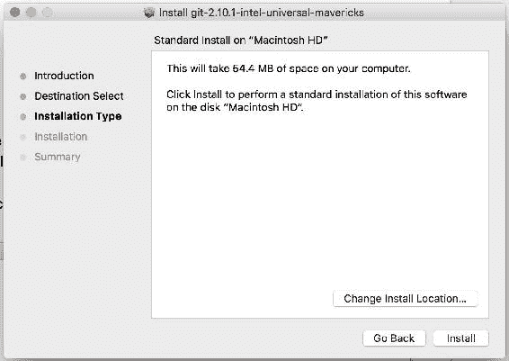

1.  安装完成后，您将看到类似以下的内容：

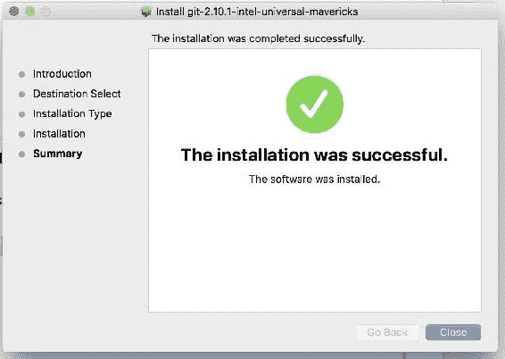

如果您使用的是 OS X 10.8，并且尚未修改安全设置以允许安装第三方应用程序，则需要在 OS X 允许您安装这些工具之前进行调整。

# 安装和配置 Python

现在，让我们安装 Python，我们将使用它来构建我们的微服务。我们将在整本书中使用 Python 3.x 版本。

# 在基于 Debian 的发行版（如 Ubuntu）上安装 Python

在基于 Debian 的发行版上安装 Python 有不同的方法。

# 使用 APT 软件包管理工具

您可以使用 APT 软件包管理工具更新本地软件包索引。然后，您可以以 root 用户身份使用以下命令下载并安装最新的 Python：

```py
$ apt-get update -y
$ apt-get install python3 -y  

```

以下软件包将自动下载并安装，因为这些是 Python 3 安装的先决条件：

`libpython3-dev libpython3.4 libpython3.4-dev python3-chardet`

`python3-colorama python3-dev python3-distlib python3-html5lib`

`python3-requests python3-six python3-urllib3 python3-wheel python3.4-de`

一旦安装了先决条件，它将在您的系统上下载并安装 Python。

# 使用源代码

您可以从 GitHub 存储库下载源代码并从源代码编译软件，如下所示：

1.  在开始之前，让我们首先安装 Git 的依赖项；以 root 用户身份执行以下命令来完成：

```py
      $ apt-get update -y 
      $ apt-get install build-essential checkinstall libreadline-gplv2-
         dev libncursesw5-dev libssl-dev libsqlite3-dev tk-dev libgdbm-
         dev libc6-dev libbz2-dev -y   

```

1.  现在，让我们使用以下命令从 Python 的官方网站下载 Python（[`www.python.org`](https://www.python.org)）。您也可以根据需要下载最新版本：

```py
      $ cd /usr/local
      $ wget https://www.python.org/ftp/python/3.4.6/Python-3.4.6.tgz  

```

1.  现在，让我们使用以下命令提取已下载的软件包：

```py
      $ tar xzf Python-3.4.6.tgz  

```

1.  现在我们必须编译源代码。使用以下一组命令来完成：

```py
      $ cd python-3.4.6
      $ sudo ./configure
      $ sudo make altinstall  

```

1.  上述命令将在`/usr/local`上安装 Python。使用以下命令检查 Python 版本：

```py
      $ python3 -V 
        Python 3.4.6

```

# 在 Windows 上安装 Python

现在，让我们看看如何在 Windows 7 或更高版本系统上安装 Python。在 Windows 上安装 Python 非常简单快捷；我们将使用 Python 3 及以上版本，您可以从 Python 的下载页面([`www.python.org/downloads/windows/`](https://www.python.org/downloads/windows/))下载。现在执行以下步骤：

1.  根据您的系统配置下载 Windows x86-64 可执行安装程序，并打开它开始安装，如下截图所示：

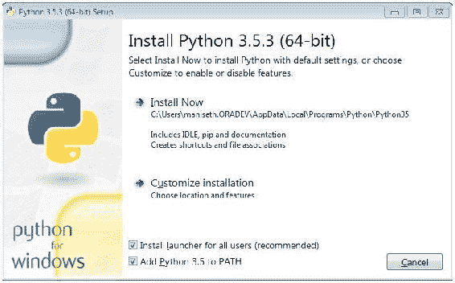

1.  接下来，选择要进行的安装类型。我们将点击“立即安装”以进行默认安装，如此截图所示：

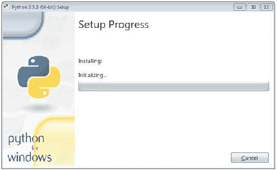

1.  安装完成后，将看到以下屏幕：

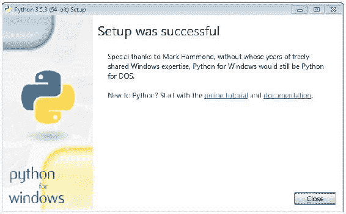

太棒了！我们已成功在 Windows 上安装了 Python。

# 在 Mac 上安装 Python

在开始 Python 安装之前，我们需要安装 OS X 的命令行工具。如果您在安装 Git 时已经安装了命令行工具，可以忽略此步骤。

# 在 OS X 上安装命令行工具

为了安装任何开发人员，您需要安装 Xcode ([`developer.apple.com/xcode/`](https://developer.apple.com/xcode/))；您需要在`connect.apple.com`上设置一个帐户以下载相应的 Xcode 版本工具。

然而，还有另一种方法可以使用一个实用程序安装命令行工具，该实用程序随 Xcode 一起提供，名为`xcode-select`，如下所示：

```py
% xcode-select --install  

```

上述命令应触发命令行工具的安装向导。按照安装向导的指示，您将能够成功安装它。

# 在 OS X 上安装 Python

在 Mac 上安装 Python 与在 Windows 上安装 Git 非常相似。您可以从官方网站([`www.python.org/downloads/`](https://www.python.org/downloads/))下载 Python 包。按照以下步骤进行：

1.  Python 包下载完成后，双击开始安装；将显示以下弹出窗口：

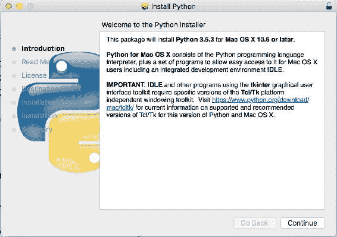

1.  接下来的步骤将涉及发布说明和相应的 Python 版本信息：

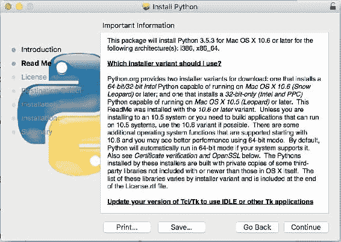

1.  接下来，您需要同意许可协议，这是安装的必要步骤：

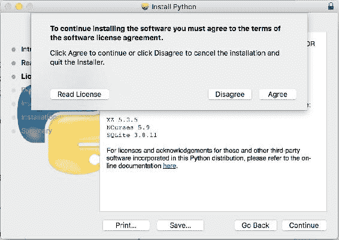

1.  接下来，它将显示安装相关信息，如磁盘占用和路径。点击“安装”开始：

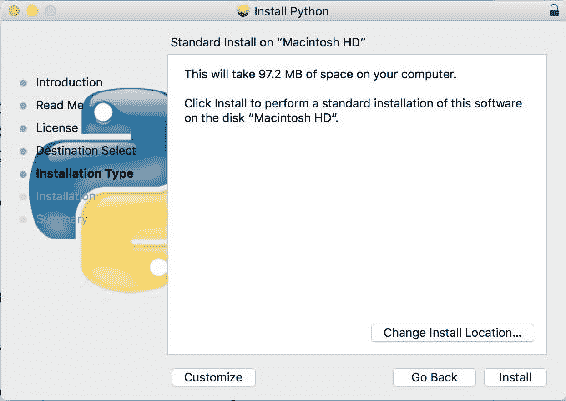

1.  安装完成后，您将看到以下屏幕：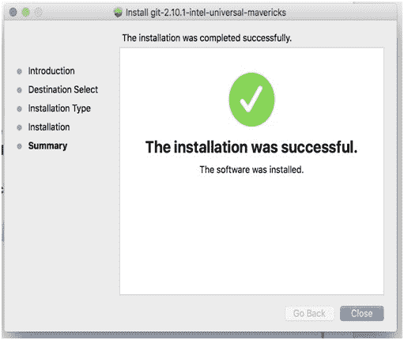

1.  使用以下命令查看 Python 版本是否已安装：

```py
      % python3 -V  
        Python 3.5.3 

```

太棒了！Python 已成功安装。

# 熟悉 GitHub 和 Git 命令

在本节中，我们将介绍一系列我们将在整本书中经常使用的 Git 命令：

+   **git init**：此命令在首次设置本地存储库时初始化您的本地存储库

+   **git remote add origin <server>**：此命令将您的本地目录链接到远程服务器存储库，以便所有推送的更改都保存在远程存储库中

+   **git status**：此命令列出尚未添加或已修改并需要提交的文件/目录

+   **git add *或 git add <filename>**：此命令添加文件/目录，以便可以跟踪它们，并使它们准备好提交

+   **git commit -m "Commit message"**：此命令可帮助您在本地机器上提交跟踪更改，并生成提交 ID，通过该 ID 可以识别更新的代码

+   **git commit -am "Commit message"**：与上一个命令的唯一区别是，此命令在将所有文件添加到暂存区后，会打开默认编辑器，以根据 Ubuntu（Vim）或 Windows（Notepad++）等操作系统添加提交消息。

+   **git push origin master**：此命令将最后提交的代码从本地目录推送到远程存储库

测试一切，确保我们的环境正常工作。

我们已经在上一节中安装了 Git 和 Python，这些是构建微服务所需的。在本节中，我们将专注于测试已安装的软件包，并尝试熟悉它们。

我们可以做的第一件事是运行 Git 命令，该命令从存储库（通常是 GitHub）上的 HTTPs 获取外部 Python 代码，并将其复制到当前工作空间的适当目录中：

```py
$ git clone https://github.com/PacktPublishing/Cloud-Native-
 Python.git

```

上述命令将在本地机器上创建一个名为`Cloud-Native-Python`的目录；从当前位置切换到`Cloud-Native-Python/chapter1`路径**。**

我们需要安装应用程序的要求，以便运行它。在这种情况下，我们只需要 Flask 模块可用：

```py
$ cd hello.py
$ pip install requirements.txt

```

在这里，Flask 充当 Web 服务器；我们将在下一章中详细了解它。

安装成功后，您可以使用以下命令运行应用程序：

```py
$ python hello.py
* Running on http://0.0.0.0:5000/ (Press CTRL+C to quit)  

```

我认为我们可以看到输出，如下所示：

```py
$ curl http://0.0.0.0:5000/
Hello World!  

```

如果您看到此输出，则我们的 Python 开发环境已正确设置。

现在是时候编写一些 Python 代码了！

# 摘要

在本章中，我们开始探索云平台和云计算堆栈。在本章中，您了解了不同的十二要素应用程序方法论，以及它们如何帮助开发微服务。最后，您了解了开发人员应该具备怎样的理想设置环境，以便创建或开始应用程序的创建。

在下一章中，我们将通过创建后端 REST API 并使用 API 调用或 Python 框架进行测试来开始构建我们的微服务。
