# 第二章：使用 Python 构建微服务

现在，既然您了解了微服务是什么，并且希望您对它们的关键优势有所了解，我相信您迫不及待地想要开始构建它们。在本章中，我们将立即开始编写 REST API，这些 API 共同作为微服务工作。

本章我们将涵盖以下主题：

+   构建 REST API

+   测试 API

# Python 概念

让我们首先了解一些 Python 的概念，这些概念将在本书中使用。

# 模块

模块基本上允许您逻辑地组织您的编程代码。它类似于任何其他 Python 程序。在需要仅导入少量代码而不是整个程序的情况下，我们需要它们。**模块**可以是一个或多个函数类的组合，以及其他许多内容。我们将使用一些内置函数，它们是 Python 库的一部分。此外，我们将根据需要创建自己的模块。

以下示例代码展示了模块的结构：

```py
    #myprogram.py 
    ### EXAMPLE PYTHON MODULE
    # Define some variables:
    numberone = 1
    age = 78

    # define some functions
    def printhello():
     print "hello"

    def timesfour(input):
     print input * 4

    # define a class
    class house:
     def __init__(self):
         self.type = raw_input("What type of house? ")
         self.height = raw_input("What height (in feet)? ")
         self.price = raw_input("How much did it cost? ")
         self.age = raw_input("How old is it (in years)? ")

     def print_details(self):
         print "This house is a/an " + self.height + " foot",
         print self.type, "house, " + self.age, "years old and costing\
         " + self.price + " dollars." 

```

您可以使用以下命令导入前面的模块：

```py
# import myprogram

```

# 函数

函数是一块组织良好的、自包含的程序块，执行特定任务，您可以将其合并到自己的更大的程序中。它们的定义如下：

```py
    # function 
    def  functionname(): 
      do something 
      return 

```

以下是需要记住的几点：

+   缩进在 Python 程序中非常重要

+   默认情况下，参数具有位置行为，您需要按照它们在定义时的顺序进行通知

请参阅以下代码片段示例，其中展示了函数：

```py
    def display ( name ): 
    #This prints a passed string into this function 
      print ("Hello" + name) 
      return;

```

您可以按以下方式调用前面的函数：

```py
    display("Manish") 
    display("Mohit") 

```

以下截图显示了前面的 `display` 函数的执行情况：

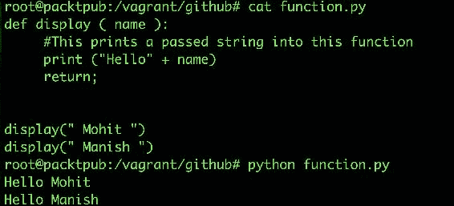

请注意，如果您的系统上安装了多个 Python 版本，您需要使用 Python 3 而不是 Python，后者使用 Python 的默认版本（通常是 2.7.x）。

# 建模微服务

在本书中，我们将开发一个完整的独立工作的 Web 应用程序。

现在，既然我们对 Python 有了基本的了解，让我们开始对我们的微服务进行建模，并了解应用程序的工作流程。

以下图显示了微服务架构和应用程序工作流程：

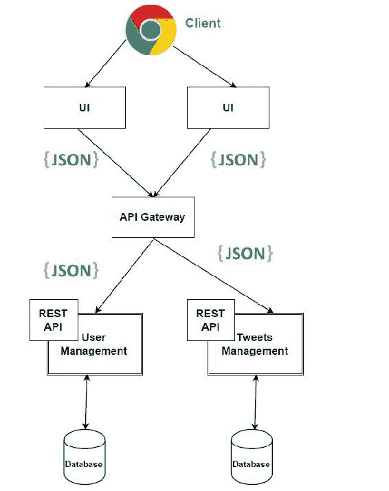

# 构建微服务

在本书中，我们将使用 Flask 作为构建微服务的 Web 框架。**Flask** 是一个强大的 Web 框架，易于学习和简单易用。此外，在 Flask 中，我们需要一些样板代码来启动一个简单的应用程序。

由于我们将使用十二要素应用程序概念创建我们的应用程序，因此我们将首先确保我们有一个集中的代码库。到目前为止，您应该知道如何创建 GitHub 存储库。如果不知道，请确保按照第一章中提供的博客文章链接创建它，*介绍云原生架构和微服务*。我们将定期将代码推送到存储库。

假设您在本书的过程中已创建了存储库，我们将使用 GitHub 存储库 ([`github.com/PacktPublishing/Cloud-Native-Python.git`](https://github.com/PacktPublishing/Cloud-Native-Python.git))。

因此，让我们将本地目录与远程存储库同步。确保我们在 app 目录中，使用以下命令：

```py
$ mkdir Cloud-Native-Python  # Creating the directory
$ cd Cloud-Native-Python  # Changing the path to working directory
$ git init . # Initialising the local directory
$ echo "Cloud-Native-Python" > README.md  # Adding description of repository
$ git add README.md  # Adding README.md
$ git commit -am "Initial commit"  # Committing the changes
$ git remote add origin https://github.com/PacktPublishing/Cloud-Native-Python.git  # Adding to local repository
$ git push -u origin master  # Pushing changes to remote repository.

```

您将看到以下输出：

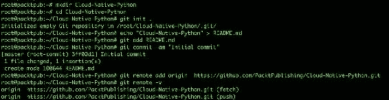

我们已成功将第一个提交推送到远程存储库；我们将以类似的方式继续这样做，直到我们在构建微服务和应用程序方面达到一定的里程碑。

现在，我们需要安装一个基于文件的数据库，例如 SQLite 版本 3，它将作为我们微服务的数据存储。

要安装 SQLite 3，请使用以下命令：

```py
$ apt-get install sqlite3 libsqlite3-dev -y

```

现在，我们可以创建并使用（源）`virtualenv` 环境，它将使本地应用程序的环境与全局 `site-packages` 安装隔离开来。如果未安装 `virtualenv`，可以使用以下命令进行安装：

```py
$ pip install virtualenv

```

现在按如下方式创建`virtualenv`：

```py
$ virtualenv env --no-site-packages --python=python3
$ source env/bin/activate

```

我们应该看到上述命令的输出，如下面的截图所示：

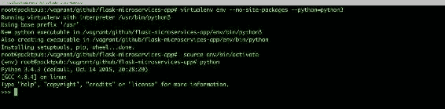

在`virtualenv`设置之后，当前，我们的`virtualenv`环境中需要安装一个依赖项。使用以下命令将一个包依赖项添加到`requirements.txt`中：

```py
$ echo "Flask==0.10.1" >>  requirements.txt

```

将来，如果应用程序需要更多依赖项，它们将放在`requirements.txt`文件中。

让我们使用要求文件将依赖项安装到`virtualenv`环境中，如下所示：

```py
$ pip install -r requirements.txt

```

现在我们已经安装了依赖项，让我们创建一个名为`app.py`的文件，其中包含以下内容：

```py
    from flask import Flask 

    app = Flask(__name__) 

    if __name__ == "__main__": 
     app.run(host='0.0.0.0', port=5000, debug=True) 

```

上述代码是使用 Flask 运行应用程序的基本结构。它基本上初始化了`Flask`变量，并在端口`5000`上运行，可以从任何地方（`0.0.0.0`）访问。

现在，让我们测试上述代码，并查看一切是否正常工作。

执行以下命令来运行应用程序：

```py
$ python app.py

```

我们应该看到上述命令的输出，如下面的截图所示：

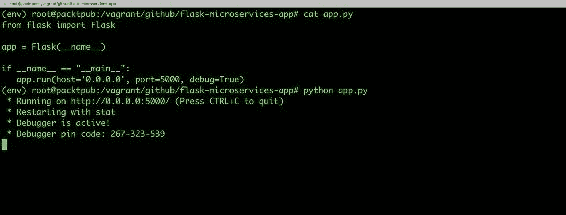

此时，在我们开始构建 RESTful API 之前，我们需要决定我们的根 URL 是什么，以访问服务，这将进一步决定不同方法的子 URI。考虑以下示例：

`http://[hostname]/api/v1/`。

由于在我们的情况下，我们将使用本地机器，`hostname`可以是带有端口的`localhost`，默认情况下，对于 Flask 应用程序，端口为`5000`。因此，我们的根 URL 将如下所示：

`http://localhost:5000/api/v1/`。

现在，让我们决定对哪些资源执行不同的操作，并且这些资源将由此服务公开。在这种情况下，我们将创建两个资源：用户和推文。

我们的用户和信息资源将使用以下 HTTP 方法：

| **HTTP 方法** | **URI** | **操作** |
| --- | --- | --- |
| `GET` | `http://localhost:5000/api/v1/info` | 这将返回版本信息 |
| `GET` | `http://localhost:5000/api/v1/users` | 这将返回用户列表 |
| `GET` | `http://localhost:5000/api/v1/users/[user_id]` | 响应将是指定`user_id`的用户详细信息 |
| `POST` | `http://localhost:5000/api/v1/users` | 此资源将在后端服务器中创建新用户，并使用传递的对象的值 |
| `DELETE` | `http://localhost:5000/api/v1/users` | 此资源将删除以 JSON 格式传递的指定用户名的用户 |
| `PUT` | `http://localhost:5000/api/v1/users/[user_id]` | 此资源将根据 API 调用的一部分传递的 JSON 对象更新特定`user_id`的用户信息。 |

使用客户端，我们将对资源执行操作，如`add`，`remove`，`modify`等等。

在本章的范围内，我们将采用基于文件的数据库，如 SQLite 3，我们之前已经安装过。

让我们去创建我们的第一个资源，即`/api/v1/info`，并显示可用版本及其发布详细信息。

在此之前，我们需要创建一个`apirelease`表模式，如 SQLite 3 中定义的，其中将包含有关 API 版本发布的信息。可以按如下方式完成：

```py
CREATE TABLE apirelease(
buildtime date,
version varchar(30) primary key,
links varchar2(30), methods varchar2(30));

```

创建后，您可以使用以下命令将记录添加到 SQLite 3 中的第一个版本（`v1`）：

```py
Insert into apirelease values ('2017-01-01 10:00:00', "v1", "/api/v1/users", "get, post, put, delete");

```

让我们在`app.py`中定义路由`/api/v1/info`和函数，它将基本上处理`/api/v1/info`路由上的 RESTful 调用。这样做如下：

```py
    from flask import jsonify 
    import json 
    import sqlite3 
    @app.route("/api/v1/info") 
    def home_index(): 
      conn = sqlite3.connect('mydb.db') 
      print ("Opened database successfully"); 
      api_list=[] 
      cursor = conn.execute("SELECT buildtime, version,
      methods, links   from apirelease") 
    for row in cursor: 
        a_dict = {} 
        a_dict['version'] = row[0] 
        a_dict['buildtime'] = row[1] 
        a_dict['methods'] = row[2] 
        a_dict['links'] = row[3] 
        api_list.append(a_dict) 
    conn.close() 
    return jsonify({'api_version': api_list}), 200 

```

现在我们已经添加了一个路由和其处理程序，让我们在`http://localhost:5000/api/v1/info`上进行 RESTful 调用，如此截图所示：

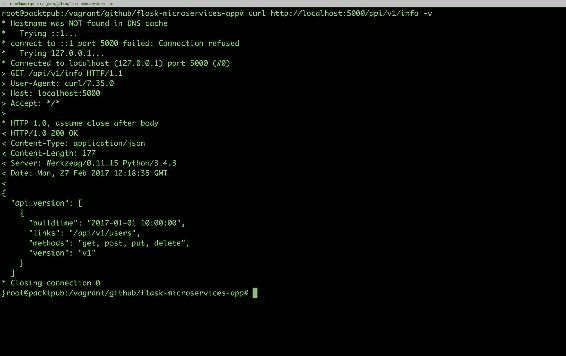

太棒了！它有效了！

让我们继续讨论`/api/v1/users`资源，它将帮助我们对用户记录执行各种操作。

我们可以将用户定义为具有以下字段：

+   `id`：这是用户的唯一标识符（数字类型）

+   `username`：这是用户的唯一标识符或`handler`，用于身份验证（字符串类型）

+   `emailid`：这是用户的电子邮件（字符串类型）

+   `password`：这是用户的密码（字符串类型）

+   `full_name`：这是用户的全名（字符串类型）

为了在 SQLite 中创建用户表模式，请使用以下命令：

```py
CREATE TABLE users( 
username varchar2(30), 
emailid varchar2(30), 
password varchar2(30), full_name varchar(30), 
id integer primary key autoincrement); 

```

# 构建资源用户方法

让我们为用户资源定义我们的`GET`方法。

# GET /api/v1/users

`GET/api/v1/users`方法显示所有用户的列表。

```py
app.py:
```

```py
    @app.route('/api/v1/users', methods=['GET']) 
    def get_users(): 
      return list_users() 

```

现在我们已经添加了路由，我们需要定义`list_users()`函数，它将连接数据库以获取完整的用户列表。将以下代码添加到`app.py`中：

```py
    def list_users():
    conn = sqlite3.connect('mydb.db')
    print ("Opened database successfully");
    api_list=[]
    cursor = conn.execute("SELECT username, full_name,
    email, password, id from users")
    for row in cursor:
    a_dict = {}
    a_dict['username'] = row[0]
    a_dict['name'] = row[1]
    a_dict['email'] = row[2]
    a_dict['password'] = row[3]
    a_dict['id'] = row[4]
    api_list.append(a_dict)
    conn.close()
      return jsonify({'user_list': api_list}) 

```

现在我们已经添加了路由和处理程序，让我们测试`http://localhost:5000/api/v1/users` URL，如下所示：

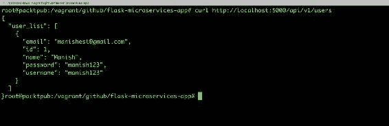

# GET /api/v1/users/[user_id]

`GET/api/v1/users/[user_id]`方法显示由`user_id`定义的用户详细信息。

让我们创建一个将`GET`请求前置到`app.py`文件中的路由，如下所示：

```py
   @app.route('/api/v1/users/<int:user_id>', methods=['GET']) 
   def get_user(user_id): 
     return list_user(user_id) 

```

如您在上面的代码中所看到的，我们将`list_user(user_id)`路由调用到`list_user(user)`函数中，但`app.py`中尚未定义。让我们定义它以获取指定用户的详细信息，如下所示，在`app.py`文件中：

```py
    def list_user(user_id): 
      conn = sqlite3.connect('mydb.db') 
      print ("Opened database successfully"); 
      api_list=[] 
      cursor=conn.cursor() 
      cursor.execute("SELECT * from users where id=?",(user_id,)) 
      data = cursor.fetchall() 
      if len(data) != 0: 
         user = {} 
               user['username'] = data[0][0] 
         user['name'] = data[0][1] 
         user['email'] = data[0][2] 
         user['password'] = data[0][3] 
         user['id'] = data[0][4] 
            conn.close() 
            return jsonify(a_dict) 

```

现在我们已经添加了`list_user(user_id)`函数，让我们测试一下，看看是否一切正常：

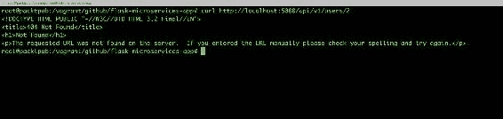

糟糕！看来 ID 不存在；通常，如果 ID 不存在，Flask 应用程序会以`404`错误的 HTML 消息作出响应。由于这是一个 Web 服务应用程序，并且我们正在为其他 API 获取 JSON 响应，因此我们需要为`404`错误编写`handler`，以便即使对于错误，它也应该以 JSON 形式而不是 HTML 响应进行响应。例如，查看以下代码以处理`404`错误。现在，服务器将以代码的一部分作出适当的响应消息，如下所示：

```py
    from flask import make_response 

    @app.errorhandler(404) 
    def resource_not_found(error): 
      return make_response(jsonify({'error':
      'Resource not found!'}),  404) 

```

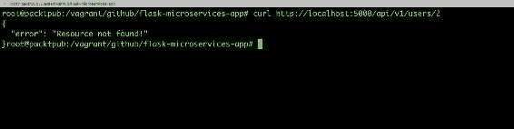

此外，您可以从 Flask 中添加`abort`库，这基本上是用于调用异常。同样，您可以为不同的 HTTP 错误代码创建多个错误处理程序。

现在我们的`GET`方法运行良好，我们将继续编写`POST`方法，这类似于将新用户添加到用户列表中。

有两种方法可以将数据传递到`POST`方法中，如下所示：

+   **JSON**：在这种方法中，我们将 JSON 记录作为请求的一部分以对象的形式传递。RESTful API 调用将如下所示：

```py
curl -i -H "Content-Type: application/json" -X POST -d {"field1":"value"} resource_url 

```

+   **参数化**：在这种方法中，我们将记录的值作为参数传递，如下所示：

```py
curl -i -H "Content-Type: application/json" -X POST resource_url?field1=val1&field2=val2 

```

在 JSON 方法中，我们以`json`的形式提供输入数据，并以相同的方式读取它。另一方面，在参数化方法中，我们以 URL 参数的形式提供输入数据（即`username`等），并以相同的方式读取数据。

还要注意，后端的 API 创建将根据所进行的 API 调用类型而有所不同。

# POST /api/v1/users

在本书中，我们采用了`POST`方法的第一种方法。因此，让我们在`app.py`中定义`post`方法的路由，并调用函数将用户记录更新到数据库文件，如下所示：

```py
    @app.route('/api/v1/users', methods=['POST']) 
    def create_user(): 
      if not request.json or not 'username' in request.json or not
      'email' in request.json or not 'password' in request.json: 
        abort(400) 
     user = { 
        'username': request.json['username'], 
        'email': request.json['email'], 
        'name': request.json.get('name',""), 
        'password': request.json['password'] 
     } 
      return jsonify({'status': add_user(user)}), 201 

```

在上面的方法中，我们使用错误代码`400`调用了异常；现在让我们编写它的处理程序：

```py
    @app.errorhandler(400) 
    def invalid_request(error): 
       return make_response(jsonify({'error': 'Bad Request'}), 400) 

```

我们仍然需要定义`add_user(user)`函数，它将更新新的用户记录。让我们在`app.py`中定义它，如下所示：

```py
    def add_user(new_user): 
     conn = sqlite3.connect('mydb.db') 
     print ("Opened database successfully"); 
     api_list=[] 
     cursor=conn.cursor() 
     cursor.execute("SELECT * from users where username=? or
      emailid=?",(new_user['username'],new_user['email'])) 
    data = cursor.fetchall() 
    if len(data) != 0: 
        abort(409) 
    else: 
       cursor.execute("insert into users (username, emailid, password,
   full_name) values(?,?,?,?)",(new_user['username'],new_user['email'],
    new_user['password'], new_user['name'])) 
       conn.commit() 
       return "Success" 
    conn.close() 
    return jsonify(a_dict) 

```

现在我们已经添加了`handler`，以及用户的`POST`方法的路由，让我们通过以下 API 调用来测试添加新用户：

```py
curl -i -H "Content-Type: application/json" -X POST -d '{
"username":"mahesh@rocks", "email": "mahesh99@gmail.com",
"password": "mahesh123", "name":"Mahesh" }' 
http://localhost:5000/api/v1/users

```

然后，验证用户列表的 curl，`http://localhost:5000/api/v1/users`，如下截图所示：

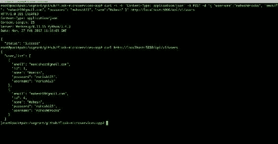

# DELETE /api/v1/users

`delete`方法帮助删除特定记录，该记录由用户名定义。我们将以 JSON 对象形式传递需要从数据库中删除的`username`。

```py
app.py for the DELETE method for users:
```

```py
    @app.route('/api/v1/users', methods=['DELETE']) 
    def delete_user(): 
     if not request.json or not 'username' in request.json: 
        abort(400) 
     user=request.json['username'] 
      return jsonify({'status': del_user(user)}), 200 

del_user, which deletes the user record specified by username after validating whether it exists or not:
```

```py
    def del_user(del_user): 
      conn = sqlite3.connect('mydb.db') 
      print ("Opened database successfully"); 
      cursor=conn.cursor() 
      cursor.execute("SELECT * from users where username=? ",
      (del_user,)) 
      data = cursor.fetchall() 
      print ("Data" ,data) 
      if len(data) == 0: 
        abort(404) 
      else: 
       cursor.execute("delete from users where username==?",
       (del_user,)) 
       conn.commit() 
         return "Success" 

```

太棒了！我们已经为用户资源的`DELETE`方法添加了路由`/handler`；让我们使用以下`test`API 调用来测试它：

```py
    curl -i -H "Content-Type: application/json" -X delete -d '{ 
"username":"manish123" }' http://localhost:5000/api/v1/users

```

然后，访问用户列表 API（`curl http://localhost:5000/api/v1/users`）以查看是否已进行更改：

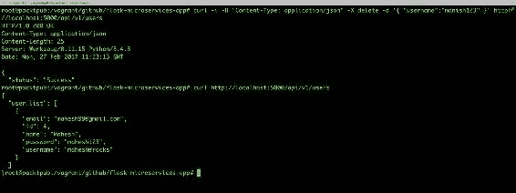

太棒了！用户删除成功。

# PUT /api/v1/users

PUT API 基本上帮助我们更新由`user_id`指定的用户记录。

继续并创建一个使用`PUT`方法更新`app.py`文件中定义的`user`记录的路由，如下所示：

```py
    @app.route('/api/v1/users/<int:user_id>', methods=['PUT']) 
    def update_user(user_id): 
     user = {} 
     if not request.json: 
         abort(400) 
     user['id']=user_id 
     key_list = request.json.keys() 
     for i in key_list: 
        user[i] = request.json[i] 
     print (user) 
     return jsonify({'status': upd_user(user)}), 200 

```

让我们指定`upd_user(user)`函数的定义，它基本上会更新数据库中的信息，并检查用户`id`是否存在：

```py
    def upd_user(user): 
      conn = sqlite3.connect('mydb.db') 
      print ("Opened database successfully"); 
      cursor=conn.cursor() 
      cursor.execute("SELECT * from users where id=? ",(user['id'],)) 
      data = cursor.fetchall() 
      print (data) 
      if len(data) == 0: 
        abort(404) 
      else: 
        key_list=user.keys() 
        for i in key_list: 
            if i != "id": 
                print (user, i) 
                # cursor.execute("UPDATE users set {0}=? where id=? ",
                 (i, user[i], user['id'])) 
                cursor.execute("""UPDATE users SET {0} = ? WHERE id =
                ?""".format(i), (user[i], user['id'])) 
                conn.commit() 
        return "Success" 

```

现在我们已经为用户资源添加了`PUT`方法的 API 句柄，让我们按照以下方式进行测试：

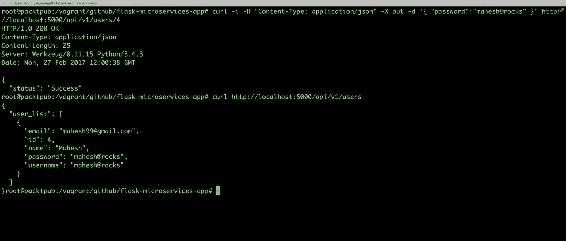

我们已经定义了我们的资源，这是版本`v1`的一部分。 现在，让我们定义我们的下一个版本发布，`v2`，它将向我们的微服务添加一个推文资源。 在用户资源中定义的用户被允许对其推文执行操作。 现在，`/api/info`将显示如下：

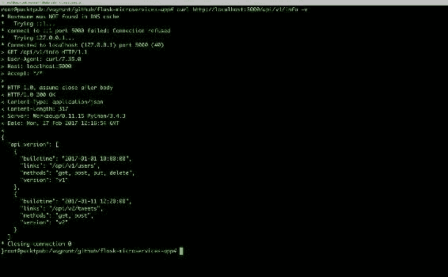

我们的推文资源将使用以下`HTTP`方法：

| **HTTP 方法** | **URI** | **操作** |
| --- | --- | --- |
| `GET` | `http://localhost:5000/api/v2/tweets` | 这将检索推文列表 |
| `GET` | `http://localhost:5000/api/v2/users/[user_id]` | 这将检索给定特定 ID 的推文 |
| `POST` | `http://localhost:5000/api/v2/tweets` | 此资源将使用作为 API 调用的一部分传递的 JSON 数据在后端数据库中注册新推文 |

我们可以将推文定义为具有以下字段：

+   `id`：这是每条推文的唯一标识符（数字类型）

+   `username`：这应该作为用户存在于用户资源中（字符串类型）

+   `body`：这是推文的内容（字符串类型）

+   `Tweet_time`：（指定类型）

您可以在 SQLite 3 中定义前面的推文资源模式如下：

```py
CREATE TABLE tweets( 
id integer primary key autoincrement, 
username varchar2(30), 
body varchar2(30), 
tweet_time date); 

```

太棒了！推文资源模式已准备就绪； 让我们为推文资源创建我们的`GET`方法。

# 构建资源推文方法

在本节中，我们将使用不同的方法为推文资源创建 API，这将帮助我们在后端数据库上执行不同的操作。

# GET /api/v2/tweets

此方法列出所有用户的所有推文。

将以下代码添加到`app.py`中以添加`GET`方法的路由：

```py
    @app.route('/api/v2/tweets', methods=['GET']) 
    def get_tweets(): 
      return list_tweets() 
    Let's define list_tweets() function which connects to database and
    get us all the tweets and respond back with tweets list 

   def list_tweets(): 
     conn = sqlite3.connect('mydb.db') 
     print ("Opened database successfully"); 
     api_list=[] 
     cursor = conn.execute("SELECT username, body, tweet_time, id from 
     tweets") 
    data = cursor.fetchall() 
    if data != 0: 
        for row in cursor: 
            tweets = {} 
            tweets['Tweet By'] = row[0] 
            tweets['Body'] = row[1] 
            tweets['Timestamp'] = row[2] 
    tweets['id'] = row[3] 
            api_list.append(tweets) 
    else: 
        return api_list 
    conn.close() 
    return jsonify({'tweets_list': api_list}) 

```

因此，现在我们已经添加了获取完整推文列表的功能，让我们通过以下 RESTful API 调用测试前面的代码：

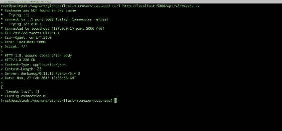

目前，我们还没有添加任何推文，这就是为什么它返回了空集。 让我们添加一些推文。

# POST /api/v2/tweets

POST 方法通过指定的用户添加新推文。

将以下代码添加到`app.py`中，以添加`POST`方法的路由到推文资源：

```py
    @app.route('/api/v2/tweets', methods=['POST']) 
    def add_tweets(): 
      user_tweet = {} 
      if not request.json or not 'username' in request.json or not 
     'body' in request.json: 
        abort(400) 
    user_tweet['username'] = request.json['username'] 
    user_tweet['body'] = request.json['body'] 
    user_tweet['created_at']=strftime("%Y-%m-%dT%H:%M:%SZ", gmtime()) 
    print (user_tweet) 
    return  jsonify({'status': add_tweet(user_tweet)}), 200 

```

让我们添加`add_tweet(user_tweet)`的定义，以通过指定的用户添加推文，如下所示：

```py
    def add_tweet(new_tweets): 
      conn = sqlite3.connect('mydb.db') 
      print ("Opened database successfully"); 
      cursor=conn.cursor() 
      cursor.execute("SELECT * from users where username=? ",
   (new_tweets['username'],)) 
    data = cursor.fetchall() 

    if len(data) == 0: 
        abort(404) 
    else: 
       cursor.execute("INSERT into tweets (username, body, tweet_time)
    values(?,?,?)",(new_tweets['username'],new_tweets['body'], 
    new_tweets['created_at'])) 
       conn.commit() 
       return "Success" 

```

因此，现在我们已经添加了将推文列表添加到数据库的功能，让我们通过以下 RESTful API 调用测试前面的代码：

```py
curl -i -H "Content-Type: application/json" -X POST -d '{
"username":"mahesh@rocks","body": "It works" }' 
http://localhost:5000/api/v2/tweets  

```

我们应该看到前面的 API 调用的输出与以下截图类似：

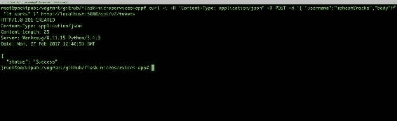

让我们通过检查推文的状态来检查推文是否成功添加：

```py
curl http://localhost:5000/api/v2/tweets -v

```

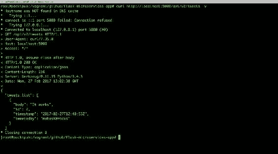

现在我们已经添加了我们的第一条推文，如果我们需要只看到特定 ID 的推文怎么办？在这种情况下，我们使用`GET`方法和`user_id`。

# GET /api/v2/tweets/[id]

`GET`方法列出由指定 ID 制作的推文。

将以下代码添加到`app.py`中，以添加具有指定 ID 的`GET`方法的路由：

```py
    @app.route('/api/v2/tweets/<int:id>', methods=['GET']) 
    def get_tweet(id): 
      return list_tweet(id) 

```

让我们定义`list_tweet()`函数，它连接到数据库，获取具有指定 ID 的推文，并以 JSON 数据响应。 这样做如下：

```py
     def list_tweet(user_id): 
       print (user_id) 
       conn = sqlite3.connect('mydb.db') 
       print ("Opened database successfully"); 
       api_list=[] 
      cursor=conn.cursor() 
      cursor.execute("SELECT * from tweets  where id=?",(user_id,)) 
      data = cursor.fetchall() 
      print (data) 
      if len(data) == 0: 
        abort(404) 
     else: 

        user = {} 
        user['id'] = data[0][0] 
        user['username'] = data[0][1] 
        user['body'] = data[0][2] 
        user['tweet_time'] = data[0][3] 

    conn.close() 
    return jsonify(user) 

```

现在我们已经添加了获取具有指定 ID 的推文的功能，让我们通过在以下位置进行 RESTful API 调用来测试前面的代码：

```py
curl http://localhost:5000/api/v2/tweets/2

```

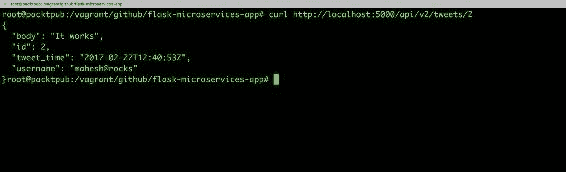

通过这些推文的添加，我们成功地构建了 RESTful API，它作为访问数据和执行各种操作所需的微服务共同工作。

# 测试 RESTful API

到目前为止，我们一直在构建 RESTful API 并访问根 URL 以查看响应，并了解不同的方法是否在后端正常工作。由于这是新代码，应该对所有内容进行 100%的测试，以确保它在生产环境中正常工作。在本节中，我们将编写测试用例，这些测试用例应该单独工作，也应该作为一个系统工作，以确保完整的后端服务可以投入生产。

有不同类型的测试，定义如下：

+   **功能测试**：基本上用于测试组件或系统的功能。我们根据组件的功能规范进行此测试。

+   **非功能测试**：这种测试针对组件的质量特征进行，包括效率测试、可靠性测试等。

+   **结构测试**：这种类型的测试用于测试系统的结构。为了编写测试用例，测试人员需要了解代码的内部实现。

在本节中，我们将编写测试用例，特别是单元测试用例，针对我们的应用程序。我们将编写 Python 代码，它将自动运行，测试所有 API 调用，并以测试结果做出响应。

# 单元测试

单元测试是测试工作单元或被测试系统中的逻辑单元的代码片段。以下是单元测试用例的特点：

+   **自动化**：它们应该自动执行

+   **独立**：它们不应该有任何依赖关系

+   一致和可重复：它们应该保持幂等性

+   **可维护**：它们应该足够容易理解和更新

我们将使用一个名为**nose**的单元测试框架。作为替代，我们可以使用 docstest（`https://docs.python.org/2/library/doctest.html`）进行测试。

因此，让我们使用以下命令使用`pip`安装 nose：

```py
$ pip install nose 

```

或者，您可以将其放在`requirement.txt`中，并使用以下命令进行安装：

```py
$ pip install -r requirements.txt

```

现在我们已经安装了 nose 测试框架，让我们开始在一个单独的文件上编写初始测试用例，比如`flask_test.py`，如下所示：

```py
    from app import app 
    import unittest 

   class FlaskappTests(unittest.TestCase): 
     def setUp(self): 
        # creates a test client 
        self.app = app.test_client() 
        # propagate the exceptions to the test client 
        self.app.testing = True 

```

上述代码将测试应用程序并使用我们的应用程序初始化`self.app`。

让我们编写我们的测试用例，以获取`GET` `/api/v1/users`的响应代码，并将其添加到我们的 FlaskappTest 类中，如下所示：

```py
    def test_users_status_code(self): 
        # sends HTTP GET request to the application 
        result = self.app.get('/api/v1/users') 
        # assert the status code of the response 
        self.assertEqual(result.status_code, 200) 

```

上述代码将测试我们是否在`/api/v1/users`上获得`200`的响应；如果没有，它将抛出错误，我们的测试将失败。正如你所看到的，由于这段代码没有任何来自其他代码的依赖，我们将其称为单元测试用例。

现在，如何运行这段代码？由于我们已经安装了 nose 测试框架，只需从测试用例文件的当前工作目录（在本例中为`flask_test.py`）中执行以下命令：

```py
$ nosetests

```

太棒了！同样，让我们为本章前面创建的资源的不同方法的 RESTful API 编写更多的测试用例。

+   GET `/api/v2/tweets`测试用例如下：

```py
    def test_tweets_status_code(self): 
        # sends HTTP GET request to the application 
        result = self.app.get('/api/v2/tweets') 
        # assert the status code of the response 
        self.assertEqual(result.status_code, 200) 

```

+   GET `/api/v1/info`测试用例如下：

```py
    def test_tweets_status_code(self): 
        # sends HTTP GET request to the application 
        result = self.app.get('/api/v1/info') 
        # assert the status code of the response 
        self.assertEqual(result.status_code, 200) 

```

+   POST `/api/v1/users`测试用例写成这样：

```py
    def test_addusers_status_code(self): 
        # sends HTTP POST request to the application 
        result = self.app.post('/api/v1/users', data='{"username":
   "manish21", "email":"manishtest@gmail.com", "password": "test123"}',
   content_type='application/json') 
        print (result) 
        # assert the status code of the response 
        self.assertEquals(result.status_code, 201) 

```

+   PUT `/api/v1/users`测试用例如下：

```py
    def test_updusers_status_code(self): 
        # sends HTTP PUT request to the application 
        # on the specified path 
        result = self.app.put('/api/v1/users/4', data='{"password": 
   "testing123"}', content_type='application/json') 
        # assert the status code of the response 
        self.assertEquals(result.status_code, 200) 

```

+   POST `/api/v1/tweets`测试用例如下：

```py
    def test_addtweets_status_code(self): 
        # sends HTTP GET request to the application 
        # on the specified path 
        result = self.app.post('/api/v2/tweets', data='{"username": 
   "mahesh@rocks", "body":"Wow! Is it working #testing"}', 
   content_type='application/json') 

        # assert the status code of the response 
        self.assertEqual(result.status_code, 201) 

```

+   DELETE `/api/v1/users`测试用例如下：

```py
    def test_delusers_status_code(self): 
        # sends HTTP Delete request to the application 
        result = self.app.delete('/api/v1/users', data='{"username": 
   "manish21"}', content_type='application/json') 
        # assert the status code of the response 
        self.assertEquals(result.status_code, 200) 

```

同样，您可以根据自己的想法编写更多的测试用例，使这些 RESTful API 更加可靠和无错。

让我们一起执行所有这些测试，并检查是否所有测试都已通过。以下屏幕截图显示了对`flask_test.py`脚本的测试结果：

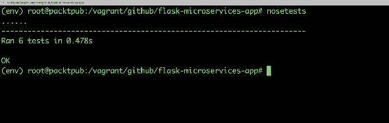

太棒了！现在我们所有的测试都已通过，我们可以继续创建围绕这些 RESTful API 的网页的下一个级别。

# 总结

在这一章中，我们专注于编写大量的代码来构建我们的微服务。我们基本上了解了 RESTful API 的工作原理。我们还看到了如何扩展这些 API，并确保我们理解这些 API 给出的`HTTP`响应。此外，您还学会了如何编写测试用例，这对于确保我们的代码能够正常运行并且适用于生产环境非常重要。
