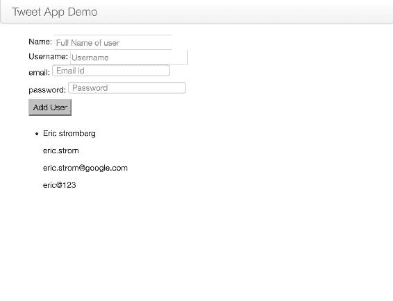
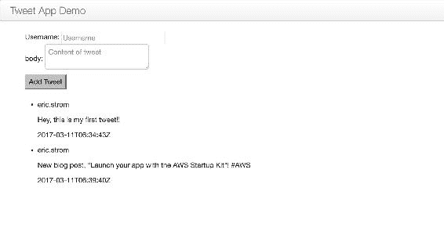
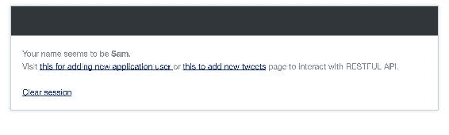

# 第三章：在 Python 中构建 Web 应用程序

在上一章中，我们专注于构建我们的微服务，即基本上是后端 RESTful API，并对其进行测试，以确保响应符合预期。到目前为止，我们一直在使用 curl 测试这些 RESTful API，或者使用测试框架，如 nose、unittest2 等。在本章中，我们将创建一些 HTML 页面，并编写一个 JavaScript REST 客户端，该客户端将与微服务进行交互。

本章中我们将涵盖的主题如下：

+   构建 HTML 页面和数据绑定

+   使用 knockout.js 的 JavaScript REST 客户端

在本章中，我们将创建一个客户端应用程序，该应用程序需要创建从 HTML 网页收集的动态内容，并根据用户的操作，将其作为对后端服务的响应进行更新。

作为开发人员，你一定遇到过许多采用 MVC 模式的应用程序框架。它是一个大类别，是**MVC**（**Model View Controller**）、**MVP**（**Model View Presenter**）和**MVVM**（**Model View ViewModel**）的组合。

在我们的案例中，我们将使用**knockout.js**，这是一个基于 MVVM 模式的 JavaScript 库，它帮助开发人员构建丰富和响应式的网站。它可以作为独立使用，也可以与其他 JavaScript 库一起使用，如 jQuery。Knockout.js 将 UI 与底层 JavaScript 模型绑定在一起。模型根据 UI 的更改而更新，反之亦然，这基本上是双向数据绑定。

在 knockout.js 中，我们将处理两个重要的概念：绑定和 Observables。

Knockout.js 是一个通常用于开发类似桌面的 Web 应用程序的 JavaScript 库。它非常有用，因为它提供了一种与数据源同步的响应机制。它在数据模型和用户界面之间提供了双向绑定机制。在[`knockoutjs.com/documentation/introduction.html`](http://knockoutjs.com/documentation/introduction.html)上阅读更多关于 knockout.js 的信息。

在本章中，我们将创建 Web 应用程序，以向数据库添加用户和推文，并对其进行验证。

# 开始使用应用程序

让我们开始创建一个基本的 HTML 模板。在应用程序根目录中创建一个名为`template`的目录；我们将在此目录中创建所有未来的模板。

现在，让我们按照以下方式为`adduser.html`文件创建基本骨架：

```py
    <!DOCTYPE html> 
    <html> 
      <head> 
        <title>Tweet Application</title> 
      </head> 
      <body> 
        <div class="navbar"> 
         <div class="navbar-inner"> 
           <a class="brand" href="#">Tweet App Demo</a> 
         </div> 
        </div> 
       <div id="main" class="container"> 

         Main content here! 

       </div> 
      <meta name="viewport" content="width=device-width, initial-
       scale=1.0"> 
      <link href="http://netdna.bootstrapcdn.com/twitter-
       bootstrap/2.3.2/css/bootstrap-combined.min.css"
       rel="stylesheet"> 
      <script src="img/jquery- 
       1.9.0.js"></script> 
      <script src="img/twitter-
        bootstrap/2.3.2/js/bootstrap.min.js"></script> 
      <script src="img/knockout-
        2.2.1.js"></script> 
      </body> 
    </html> 

```

如你所见，在前面的代码中，我们指定了一些`.js`脚本，这些脚本是需要的，以使我们的 HTML 具有响应性。这类似于 twitter-bootstrap，它有一个`<meta name="viewport">`属性，可以根据浏览器尺寸来缩放页面。

# 创建应用程序用户

在我们开始编写网页之前，我们需要创建一个用于创建用户的路由，如下所示：

```py
    from flask import render_template 

    @app.route('/adduser') 
    def adduser(): 
     return render_template('adduser.html') 

```

现在我们已经创建了路由，让我们在`adduser.html`中创建一个表单，该表单将要求用户提供与用户相关的必要信息，并帮助他们提交信息：

```py
    <html> 
      <head> 
        <title>Twitter Application</title> 
      </head> 
      <body> 
       <form > 
         <div class="navbar"> 
          <div class="navbar-inner"> 
            <a class="brand" href="#">Tweet App Demo</a> 
          </div> 
        </div> 
        <div id="main" class="container"> 

         <table class="table table-striped"> 
           Name: <input placeholder="Full Name of user" type "text"/> 
           </div> 
           <div> 
             Username: <input placeholder="Username" type="username">
             </input> 
           </div> 
           <div> 
             email: <input placeholder="Email id" type="email"></input> 
           </div> 
           <div> 
             password: <input type="password" placeholder="Password">  
             </input> 
           </div> 
            <button type="submit">Add User</button> 
          </table> 
        </form> 
       <script src="img/
        jquery/1.8.3/jquery.min.js"></script> 
      <script src="img/knockout
        /2.2.0/knockout-min.js"></script> 
      <link href="http://netdna.bootstrapcdn.com/twitter-
       bootstrap/2.3.2/css/bootstrap-combined.min.css"
       rel="stylesheet"> 
      <!-- <script src="img/jquery-
       1.9.0.js"></script> --> 
     <script src="img/twitter- 
       bootstrap/2.3.2/js/bootstrap.min.js"></script> 
    </body> 
   </html> 

```

目前，前面的 HTML 页面只显示空字段，如果尝试提交带有数据的表单，它将无法工作，因为尚未与后端服务进行数据绑定。

现在我们准备创建 JavaScript，它将向后端服务发出 REST 调用，并添加来自 HTML 页面提供的用户内容。

# 使用 Observables 和 AJAX

为了从 RESTful API 获取数据，我们将使用 AJAX。Observables 跟踪数据的更改，并自动在所有使用和由`ViewModel`定义的位置上反映这些更改。

通过使用 Observables，使 UI 和`ViewModel`动态通信变得非常容易。

让我们创建一个名为`app.js`的文件，在静态目录中声明了 Observables，代码如下——如果目录不存在，请创建它：

```py
    function User(data) { 
      this.id = ko.observable(data.id); 
      this.name = ko.observable(data.name); 
      this.username = ko.observable(data.username); 
      this.email = ko.observable(data.email); 
      this.password = ko.observable(data.password); 
    } 

    function UserListViewModel() { 
     var self = this; 
     self.user_list = ko.observableArray([]); 
     self.name = ko.observable(); 
     self.username= ko.observable(); 
     self.email= ko.observable(); 
     self.password= ko.observable(); 

     self.addUser = function() { 
      self.save(); 
      self.name(""); 
      self.username(""); 
      self.email(""); 
      self.password(""); 
     }; 
    self.save = function() { 
      return $.ajax({ 
      url: '/api/v1/users', 
      contentType: 'application/json', 
      type: 'POST', 
      data: JSON.stringify({ 
         'name': self.name(), 
         'username': self.username(), 
         'email': self.email(), 
         'password': self.password() 
      }), 
      success: function(data) { 
         alert("success") 
              console.log("Pushing to users array"); 
              self.push(new User({ name: data.name, username: 
              data.username,email: data.email ,password: 
               data.password})); 
              return; 
      }, 
      error: function() { 
         return console.log("Failed"); 
       } 
     }); 
    }; 
    } 

   ko.applyBindings(new UserListViewModel()); 

```

我知道这是很多代码；让我们了解前面代码的每个部分的用法。

当您在 HTML 页面上提交内容时，请求将在`app.js`接收，并且以下代码将处理请求：

```py
    ko.applyBindings(new UserListViewModel()); 

```

它创建模型并将内容发送到以下函数：

```py
    self.addUser = function() { 
      self.save(); 
      self.name(""); 
      self.username(""); 
      self.email(""); 
      self.password(""); 
   }; 

```

前面的`addUser`函数调用`self.save`函数，并传递数据对象。`save`函数通过 AJAX RESTful 调用后端服务，并执行从 HTML 页面收集的数据的`POST`操作。然后清除 HTML 页面的内容。

我们的工作还没有完成。正如我们之前提到的，这是双向数据绑定，因此我们需要从 HTML 端发送数据，以便在数据库中进一步处理。

在脚本部分中，添加以下行，它将识别`.js`文件路径：

```py
    <script src="img/{{ url_for('static', filename='app.js') }}"></script> 

```

# 为 adduser 模板绑定数据

数据绑定对将数据与 UI 绑定很有用。如果我们不使用 Observables，UI 中的属性只会在第一次处理时被处理。在这种情况下，它无法根据底层数据更新自动更新。为了实现这一点，绑定必须引用 Observable 属性。

现在我们需要将我们的数据与表单及其字段绑定，如下面的代码所示：

```py
    <form data-bind="submit: addUser"> 
     <div class="navbar"> 
       <div class="navbar-inner"> 
           <a class="brand" href="#">Tweet App Demo</a> 
       </div> 
     </div> 
     <div id="main" class="container"> 
      <table class="table table-striped"> 
       Name: <input data-bind="value: name" placeholder="Full Name of
       user" type "text"/> 
     </div> 
     <div> 
       Username: <input data-bind="value: username" 
       placeholder="Username" type="username"></input> 
     </div> 
    <div> 
      email: <input data-bind="value: email" placeholder="Email id" 
      type="email"></input> 
    </div> 
    <div> 
       password: <input data-bind="value: password" type="password" 
       placeholder="Password"></input> 
    </div> 
       <button type="submit">Add User</button> 
     </table> 
    </form> 

```

现在我们准备通过模板添加我们的用户。但是，我们如何验证用户是否成功添加到我们的数据库呢？一种方法是手动登录到数据库。但是，由于我们正在开发 Web 应用程序，让我们在网页上显示我们的数据（存在于数据库中）--甚至是新添加的条目。

为了读取数据库并获取用户列表，将以下代码添加到`app.js`中：

```py
    $.getJSON('/api/v1/users', function(userModels) { 
      var t = $.map(userModels.user_list, function(item) { 
        return new User(item); 
      }); 
     self.user_list(t); 
    }); 

```

现在我们需要在`adduser.html`中进行更改，以显示我们的用户列表。为此，让我们添加以下代码：

```py
    <ul data-bind="foreach: user_list, visible: user_list().length > 
    0"> 
      <li> 
        <p data-bind="text: name"></p> 
        <p data-bind="text: username"></p> 
        <p data-bind="text: email"></p> 
       <p data-bind="text: password"></p> 
     </li> 
    </ul> 

```

太棒了！我们已经完成了添加网页，它将为我们的应用程序创建新用户。它看起来会像这样：



# 从用户创建推文

在开始编写网页之前，我们需要创建一个用于创建推文的路由。可以按以下方式完成：

```py
    from flask import render_template 

    @app.route('/addtweets') 
    def addtweetjs(): 
     return render_template('addtweets.html') 

```

现在，我们已经创建了路由，让我们在`addtweets.html`中创建另一个表单，该表单将要求用户提供与推文相关的必需信息，并帮助他们提交信息：

```py
    <html> 
     <head> 
      <title>Twitter Application</title> 
     </head> 
    <body> 
    <form > 
     <div class="navbar"> 
       <div class="navbar-inner"> 
           <a class="brand" href="#">Tweet App Demo</a> 
       </div> 
      </div> 

      <div id="main" class="container"> 
       <table class="table table-striped"> 
         Username: <input placeholder="Username" type="username">
          </input> 
      </div> 
      <div> 
        body: <textarea placeholder="Content of tweet" type="text"> 
        </textarea> 
      </div> 
      <div> 
      </div> 
       <button type="submit">Add Tweet</button> 
      </table> 

     </form> 
      <script src="img/
       jquery/1.8.3/jquery.min.js"></script> 
      <script src="img/
        knockout/2.2.0/knockout-min.js"></script> 
       <link href="http://netdna.bootstrapcdn.com/twitter-
         bootstrap/2.3.2/css/bootstrap-combined.min.css" 
        rel="stylesheet"> 
      <!-- <script src="img/jquery-
        1.9.0.js"></script> --> 
      <script src="img/twitter-
        bootstrap/2.3.2/js/bootstrap.min.js"></script> 
     </body> 
    </html> 

```

请注意，当前此表单没有数据绑定以与 RESTful 服务通信。

# 使用 AJAX 处理 addtweet 模板的 Observables

让我们开发一个 JavaScript，它将对后端服务进行 REST 调用，并添加来自 HTML 页面的推文内容。

让我们在之前创建的静态目录中创建一个名为`tweet.js`的文件，并使用以下代码：

```py
    function Tweet(data) { 
      this.id = ko.observable(data.id); 
      this.username = ko.observable(data.tweetedby); 
      this.body = ko.observable(data.body); 
      this.timestamp = ko.observable(data.timestamp); 
    } 

    function TweetListViewModel() { 
      var self = this; 
      self.tweets_list = ko.observableArray([]); 
      self.username= ko.observable(); 
      self.body= ko.observable(); 

      self.addTweet = function() { 
      self.save(); 
      self.username(""); 
      self.body(""); 
       }; 

      $.getJSON('/api/v2/tweets', function(tweetModels) { 
      var t = $.map(tweetModels.tweets_list, function(item) { 
        return new Tweet(item); 
      }); 
      self.tweets_list(t); 
      }); 

     self.save = function() { 
      return $.ajax({ 
      url: '/api/v2/tweets', 
      contentType: 'application/json', 
      type: 'POST', 
      data: JSON.stringify({ 
         'username': self.username(), 
         'body': self.body(), 
      }), 
      success: function(data) { 
         alert("success") 
              console.log("Pushing to users array"); 
              self.push(new Tweet({ username: data.username,body: 
              data.body})); 
              return; 
      }, 
      error: function() { 
         return console.log("Failed"); 
      } 
     }); 
      }; 
    } 

   ko.applyBindings(new TweetListViewModel()); 

```

让我们了解最后一段代码的每个部分的用法。

当您在 HTML 页面上提交内容时，请求将发送到`tweet.js`，代码的以下部分将处理请求：

```py
    ko.applyBindings(new TweetListViewModel()); 

```

前面的代码片段创建模型并将内容发送到以下函数：

```py
    self.addTweet = function() { 
      self.save(); 
      self.username(""); 
      self.body(""); 
      }; 

```

前面的`addTweet`函数调用`self.save`函数，并传递数据对象。保存函数通过 AJAX RESTful 调用后端服务，并执行从 HTML 页面收集的数据的`POST`操作。然后清除 HTML 页面的内容。

为了在网页上显示数据，并使其与后端服务中的数据保持同步，需要以下代码：

```py
   function Tweet(data) { 
     this.id = ko.observable(data.id); 
     this.username = ko.observable(data.tweetedby); 
     this.body = ko.observable(data.body); 
     this.timestamp = ko.observable(data.timestamp); 
   } 

```

我们的工作还没有完成。正如我们之前提到的，这是双向数据绑定，因此我们还需要从 HTML 端发送数据，以便在数据库中进一步处理。

在脚本部分中，添加以下行，它将使用路径标识`.js`文件：

```py
   <script src="img/{{ url_for('static', filename='tweet.js') }}"></script> 

```

# 为 addtweet 模板绑定数据

完成后，我们现在需要将我们的数据与表单及其字段绑定，如下面的代码所示：

```py
    <form data-bind="submit: addTweet"> 
      <div class="navbar"> 
        <div class="navbar-inner"> 
           <a class="brand" href="#">Tweet App Demo</a> 
        </div> 
       </div> 
       <div id="main" class="container"> 

        <table class="table table-striped"> 
          Username: <input data-bind="value: username"
          placeholder="Username" type="username"></input> 
       </div> 
       <div> 
         body: <textarea data-bind="value: body" placeholder="Content
         of tweet" type="text"></textarea> 
       </div> 
       <div> 
       </div> 
       <button type="submit">Add Tweet</button> 
       </table> 
    </form> 

```

现在我们准备通过模板添加我们的推文。我们对推文进行验证，就像我们对用户进行验证一样。

为了读取数据库并获取推文列表，请将以下代码添加到`tweet.js`中：

```py
    $.getJSON('/api/v2/tweets', function(tweetModels) { 
      var t = $.map(tweetModels.tweets_list, function(item) { 
      return new Tweet(item); 
     }); 
      self.tweets_list(t); 
     }); 

```

现在，我们需要在`addtweets.html`中进行更改，以显示我们的推文列表。为此，让我们添加以下代码：

```py
    <ul data-bind="foreach: tweets_list, visible: tweets_list().length 
    > 0"> 
     <li> 
       <p data-bind="text: username"></p> 
       <p data-bind="text: body"></p> 
       <p data-bind="text: timestamp"></p> 

     </li> 
   </ul> 

```

太棒了！让我们来测试一下。它看起来会像这样：



以类似的方式，您可以通过从网页应用程序中删除用户或在后端服务中更新用户信息来扩展此用例。

此外，要了解更多关于 knockout.js 库的信息，请查看[`knockoutjs.com/examples/helloWorld.html`](http://knockoutjs.com/examples/helloWorld.html)上的实时示例，这将帮助您更好地理解，并帮助您在应用程序中实施它。

我们创建了这些网页，以确保我们的微服务工作，并让您了解通常如何开发 Web 应用程序；作为开发人员，我们也可以根据自己的用例创建这些 Web 应用程序。

# CORS - 跨源资源共享

CORS 有助于在 API 请求的 API 服务器和客户端之间维护数据完整性。

使用 CORS 的想法是，服务器和客户端应该彼此具有足够的信息，以便它们可以相互验证，并使用 HTTP 标头在安全通道上传输数据。

当客户端发出 API 调用时，它要么是 GET 请求，要么是 POST 请求，其中 body 通常是 text/plain，带有名为**Origin**的标头--这包括与请求页面相关的协议、域名和端口。当服务器确认请求并发送响应以及`Access-Control-Allow-Origin`标头到相同的 Origin 时，它确保响应被正确接收到相应的 Origin。

通过这种方式，在不同来源之间进行资源共享。

几乎所有浏览器现在都支持 CORS，包括 IE 8+、Firefox 3.5+和 Chrome。

现在，既然我们已经准备好了 Web 应用程序，但它还没有启用 CORS，让我们启用它。

首先，您需要使用以下命令在 Flask 中安装 CORS 模块：

```py
$pip install flask-cors

```

前面的包公开了一个 Flask 扩展，该扩展默认情况下在所有路由上为所有来源和方法启用 CORS 支持。安装了该包后，让我们在`app.py`中包含它，如下所示：

```py
    from flask_cors import CORS, cross_origin 

```

要启用 CORS，您需要添加以下行：

```py
   CORS(app) 

```

就是这样。现在，您的 Flask 应用程序中的所有资源都已启用 CORS。

如果您想在特定资源上启用 CORS，则添加以下代码与您的特定资源：

```py
   cors = CORS(app, resources={r"/api/*": {"origins": "*"}}) 

```

目前，我们还没有设置域，但我们正在本地主机级别工作。您可以通过在域名服务器中添加自定义域来测试 CORS，如下所示：

```py
   127.0.0.1    <your-domain-name> 

```

现在，如果您尝试访问此`<your-domain-name>`，它应该能够正常使用此域名，并且您将能够访问资源。

# 会话管理

会话是与单个用户关联的一系列请求和响应事务。会话通常是通过对用户进行身份验证并跟踪他/她在网页上的活动来在服务器级别上维护的。

每个客户端的会话都分配了一个会话 ID。会话通常存储在 cookie 之上，并且服务器使用秘钥对它们进行加密--Flask 应用程序使用临时持续时间的秘钥对其进行解密。

目前，我们还没有设置身份验证--我们将在第八章中定义它，*保护 Web 应用程序*。因此，在这个时间点上，我们将通过询问访问网页的用户名并确保用户使用会话标识来创建会话。

现在让我们创建一个名为`main.html`的网页，其中将包含一个 URL 来创建会话（如果需要设置），以及用于在后端服务上执行操作的路由。如果会话已经存在，您可以清除会话。请参阅以下代码：

```py
    <html> 
      <head> 
        <title>Twitter App Demo</title> 
        <link rel=stylesheet type=text/css href="{{ url_for('static', 
        filename='style.css') }}"> 
    </head> 
    <body> 
        <div id="container"> 
          <div class="title"> 
            <h1></h1> 
          </div> 
          <div id="content"> 
             
            Your name seems to be <strong>{{session['name']}}</strong>.
           <br/> 
             
            Please set username by clicking it <a href="{{ 
            url_for('addname') }}">here</a>.<br/> 
             
           Visit <a href="{{ url_for('adduser') }}">this for adding new 
           application user </a> or <a href="{{ url_for('addtweetjs') 
           }}">this to add new tweets</a> page to interact with RESTFUL
           API. 

           <br /><br /> 
           <strong><a href="{{ url_for('clearsession') }}">Clear 
           session</a></strong> 
            </div> 
            </div> 
        </div> 
       </body> 
    </html> 

```

当前在这个网页中，一些 URL，如`clearsession`和`addname`不会工作，因为我们还没有为它们设置网页和路由。

另外，我们还没有为`main.html`网页设置路由；让我们首先在`app.py`中添加它，如下所示：

```py
    @app.route('/') 

    def main(): 
      return render_template('main.html') 

```

由于我们已经为`main.html`设置了路由，让我们在`app.py`中为`addname`添加路由，如下所示：

```py
   @app.route('/addname') 

   def addname(): 
   if request.args.get('yourname'): 
    session['name'] = request.args.get('yourname') 
    # And then redirect the user to the main page 
      return redirect(url_for('main')) 

    else: 
      return render_template('addname.html', session=session) 

```

正如您在前面的路由中所看到的，它调用了`addname.html`，而我们还没有创建它。让我们使用以下代码创建`addname`模板：

```py
    <html> 
     <head> 
       <title>Twitter App Demo</title> 
       <link rel=stylesheet type=text/css href="{{ url_for('static', 
        filename='style.css') }}"> 
     </head> 
   <body> 
       <div id="container"> 
           <div class="title"> 
               <h1>Enter your name</h1> 
           </div> 
        <div id="content"> 
          <form method="get" action="{{ url_for('addname') }}"> 
            <label for="yourname">Please enter your name:</label> 
            <input type="text" name="yourname" /><br /> 
            <input type="submit" /> 
          </form> 
        </div> 
        <div class="title"> 
               <h1></h1> 
        </div> 
        <code><pre> 
        </pre></code> 
        </div> 
       </div> 
      </body> 
     </html> 

```

太棒了！现在我们可以使用前面的代码设置会话；您将看到一个类似于这样的网页：



现在，如果我们需要清除会话怎么办？由于我们已经从主网页调用了`clearsession`函数，我们需要在`app.py`中创建一个路由，进一步调用会话的`Clear`内置函数，如下所示：

```py
    @app.route('/clear') 

     def clearsession(): 
      # Clear the session 
      session.clear() 
      # Redirect the user to the main page 
      return redirect(url_for('main')) 

```

这就是我们如何设置会话，为用户保持会话，并根据需要清除会话。

# Cookies

Cookies 类似于会话，除了它们以文本文件的形式保存在客户端计算机上；而会话则保存在服务器端。

它们的主要目的是跟踪客户端的使用情况，并根据他们的活动通过了解 cookies 来改善体验。

cookies 属性存储在响应对象中，它是一个键值对的集合，其中包含 cookies、变量及其相应的值。

我们可以使用响应对象的`set_cookie()`函数设置 cookies，以存储 cookie，如下所示：

```py
    @app.route('/set_cookie') 
    def cookie_insertion(): 
      redirect_to_main = redirect('/') 
      response = current_app.make_response(redirect_to_main )   
      response.set_cookie('cookie_name',value='values') 
      return response 

```

同样，读取 cookies 非常容易；`get()`函数将帮助您获取 cookies，如下所示：

```py
    import flask 
    cookie = flask.request.cookies.get('my_cookie') 

```

如果 cookie 存在，它将被分配给 cookie，如果不存在，则 cookie 将返回`None`。

# 摘要

在本章中，您学习了如何使用 JavaScript 库（如 knockout.js）将您的微服务与 Web 应用程序集成。您了解了 MVVM 模式，以及如何利用它们来创建完全开发的 Web 应用程序。您还学习了用户管理概念，如 cookies 和会话，以及如何利用它们。

在下一章中，我们将尝试通过将数据库从 SQLite 移动到其他 NoSQL 数据库服务（如 MongoDB）来加强和保护我们的数据库端。
