# 第四章：交互数据服务

在上一章中，我们使用 JavaScript/HTML 构建了我们的应用程序，并将其与 RESTful API 和 AJAX 集成。您还学习了如何在客户端设置 cookie 和在服务器端设置会话，以提供更好的用户体验。在本章中，我们将专注于通过使用 NoSQL 数据库（如 MongoDB）而不是我们目前使用的 SQLite 数据库或 MySQL 数据库来改进我们的后端数据库，并将我们的应用程序与之集成。

本章将涵盖的主题如下：

+   设置 MongoDB 服务

+   将应用程序与 MongoDB 集成

# MongoDB - 它的优势和我们为什么使用它？

在开始 MongoDB 安装之前，让我们了解为什么选择了 MongoDB 数据库以及它的需求。

让我们看看 MongoDB 相对于 RDBMS 的优势：

+   灵活的模式：MongoDB 是一个文档数据库，一个集合可以包含多个文档。我们不需要在插入数据之前定义文档的模式，这意味着 MongoDB 根据插入文档的数据来定义文档的模式；而在关系型数据库中，我们需要在插入数据之前定义表的模式。

+   **较少的复杂性**：在 MongoDB 中没有复杂的连接，就像在关系数据库管理系统中（例如：MySQL）数据库中一样。

+   **更容易扩展**：与关系数据库管理系统相比，MongoDB 的扩展非常容易。

+   **快速访问**：与 MySQL 数据库相比，MongoDB 中的数据检索速度更快。

+   **动态查询**：MongoDB 支持对文档进行动态查询，它是一种基于文档的查询语言，这使其比其他关系型数据库（如 MySQL）更具优势。

以下是我们应该使用 MongoDB 的原因：

+   MongoDB 以 JSON 样式文档存储数据，这使得它很容易与应用程序集成。

+   我们可以在任何文件和属性上设置索引

+   MongoDB 自动分片，这使得它易于管理并使其更快

+   MongoDB 在集群中使用时提供复制和高可用性

有不同的用例可以使用 MongoDB。让我们在这里检查它们：

+   大数据

+   用户数据管理

+   内容交付和管理

以下图片显示了 MongoDB 与您的 Web 应用程序集成的架构图：

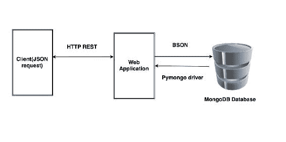

# MongoDB 术语

让我们看看 MongoDB 的不同术语，接下来列出了它们：

+   **数据库**：这类似于我们在**关系数据库管理系统（RDBMS）**中拥有的数据库，但是在 MongoDB 中，数据库是集合的物理容器，而不是表。MongoDB 可以有多个数据库。

+   **集合**：这基本上是具有自己模式的文档的组合。集合不对文档的模式做出贡献。这与关系型数据库中的表相当。

+   **文档**：这类似于关系数据库管理系统中的元组/行。它是一组键值对。它们具有动态模式，其中每个文档在单个集合中可能具有相同或不同的模式。它们也可能具有不同的字段。

以下代码是您理解的一个示例集合：

```py
    {  
       _id : ObjectId(58ccdd1a19b08311417b14ee),  
       body : 'New blog post,Launch your app with the AWS Startup Kit!  
       #AWS', 
       timestamp : "2017-03-11T06:39:40Z", 
       id : 18, 
       tweetedby : "eric.strom" 
   } 

```

MongoDB 以一种名为**BSON**的二进制编码格式表示 JSON 文档。

# 设置 MongoDB

在当前情况下，我们正在使用 Ubuntu 工作站，因此让我们按照以下步骤在 Ubuntu 上安装 MongoDB。

我们将使用 Ubuntu 软件包管理工具，如`apt`，通过使用 GPG 密钥对经过分发者签名的软件包进行身份验证来安装 MongoDB 软件包。

要导入 GPG 密钥，请使用以下命令：

```py
$ sudo apt-key adv --keyserver hkp://keyserver.ubuntu.com:80 --recv EA312927

```

接下来，我们需要将 MongoDB 存储库路径设置为我们的操作系统，如下所示：

```py
$ echo "deb http://repo.mongodb.org/apt/ubuntu trusty/mongodb-org/3.2 multiverse" | sudo tee /etc/apt/sources.list.d/mongodb-org-3.2.list

```

添加了这个之后，我们需要按照以下步骤更新我们的 Ubuntu 存储库：

```py
$ sudo apt-get update  

```

现在存储库已更新，让我们使用以下命令安装最新的稳定 MongoDB 版本：

```py
$ sudo apt-get install -y mongodb-org

```

安装后，MongoDB 服务应在端口`27017`上运行。我们可以使用以下命令检查服务状态：

```py
$ sudo service mongodb status

```

如果它没有运行，您可以通过执行以下命令来启动服务：

```py
$ sudo service mongodb start

```

太棒了！现在我们已经在本地机器上安装了 MongoDB。此时，我们只需要一个独立的 MongoDB 实例，但如果您想创建一个共享的 MongoDB 集群，那么可以按照以下链接中定义的步骤进行操作：

[`docs.mongodb.com/manual/tutorial/deploy-shard-cluster/`](https://docs.mongodb.com/manual/tutorial/deploy-shard-cluster/)

因此，现在我们已经在我们的机器上启用了 MongoDB 服务，我们可以开始在其上创建数据库。

# 初始化 MongoDB 数据库

以前，在 SQLite3 中创建数据库时，我们需要手动创建数据库并定义表的架构。由于 MongoDB 是无模式的，我们将直接添加新文档，并且集合将自动创建。在这种情况下，我们将仅使用 Python 初始化数据库。

在我们向 MongoDB 添加新文档之前，我们需要为其安装 Python 驱动程序，即`pymongo`。

将`pymongo`驱动程序添加到`requirements.txt`，然后使用`pip`软件包管理器进行安装，如下所示：

```py
$echo "pymongo==3.4.0" >> requirements.txt
$ pip install -r requirements.txt

```

安装后，我们将通过在`app.py`中添加以下行来导入它：

```py
from pymongo import MongoClient

```

现在我们已经为 Python 导入了 MongoDB 驱动程序，我们将在`app.py`中创建一个连接到 MongoDB 的连接，并定义一个函数，该函数将使用初始**数据文档**初始化数据库，如下所示：

```py
    connection = MongoClient("mongodb://localhost:27017/") 
    def create_mongodatabase(): 
    try: 
       dbnames = connection.database_names() 
       if 'cloud_native' not in dbnames: 
           db = connection.cloud_native.users 
           db_tweets = connection.cloud_native.tweets 
           db_api = connection.cloud_native.apirelease 

           db.insert({ 
           "email": "eric.strom@google.com", 
           "id": 33, 
           "name": "Eric stromberg", 
           "password": "eric@123", 
           "username": "eric.strom" 
           }) 

           db_tweets.insert({ 
           "body": "New blog post,Launch your app with the AWS Startup
           Kit! #AWS", 
           "id": 18, 
           "timestamp": "2017-03-11T06:39:40Z", 
           "tweetedby": "eric.strom" 
           }) 

           db_api.insert( { 
             "buildtime": "2017-01-01 10:00:00", 
             "links": "/api/v1/users", 
             "methods": "get, post, put, delete", 
             "version": "v1" 
           }) 
           db_api.insert( { 
             "buildtime": "2017-02-11 10:00:00", 
             "links": "api/v2/tweets", 
             "methods": "get, post", 
             "version": "2017-01-10 10:00:00" 
           }) 
           print ("Database Initialize completed!") 
       else: 
           print ("Database already Initialized!")
       except: 
           print ("Database creation failed!!") 

```

建议您使用一些文档初始化资源集合，以便在开始测试 API 时获得一些响应数据，否则，您可以在不初始化集合的情况下继续。

在启动应用程序之前应调用上述函数；我们的主要函数将如下所示：

```py
   if __name__ == '__main__': 
     create_mongodatabase() 
     app.run(host='0.0.0.0', port=5000, debug=True) 

```

# 将微服务与 MongoDB 集成

由于我们已经初始化了 MongoDB 数据库，现在是时候重写我们的微服务函数，以便从 MongoDB 而不是 SQLite 3 中存储和检索数据。

以前，我们使用`curl`命令从 API 获取响应；而现在，我们将使用一个名为**POSTMAN**（[`www.getpostman.com`](https://www.getpostman.com)）的新工具，该工具是一个可以帮助您更快地构建、测试和记录 API 的应用程序。

有关 POSTMAN 工作原理的更多信息，请阅读以下链接的文档：[`www.getpostman.com/docs/`](https://www.getpostman.com/docs/)

POSTMAN 支持 Chrome 和 Firefox，因为它可以很容易地集成为一个附加组件。

首先，我们将修改`api_version`信息 API，以从 MongoDB 中收集信息，而不是从 SQLite3 中收集，如下所示：

```py
    @app.route("/api/v1/info") 
    def home_index(): 
     api_list=[] 
     db = connection.cloud_native.apirelease 
     for row in db.find(): 
       api_list.append(str(row)) 
     return jsonify({'api_version': api_list}), 200 

```

现在，如果您使用 POSTMAN 进行测试，它应该会给出类似于以下内容的输出：

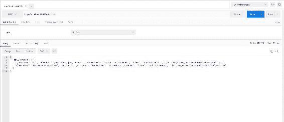

太棒了！它有效。现在，让我们更新微服务的其他资源。

# 处理用户资源

我们将按以下方式修改`app.py`中不同方法的用户资源 API 函数。

# GET api/v1/users

GET API 函数获取完整的用户列表。

为了从 MongoDB 数据库中获取完整的用户列表，我们将按以下方式重写`list_users()`函数：

```py
    def list_users(): 
     api_list=[] 
     db = connection.cloud_native.users 
     for row in db.find(): 
       api_list.append(str(row)) 
     return jsonify({'user_list': api_list}) 

```

让我们在 POSTMAN 上进行测试，看看 API 是否按预期响应：

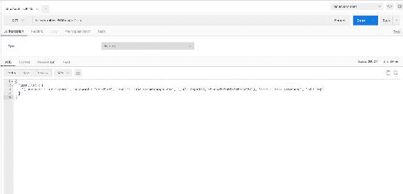

由于我们目前在 MongoDB 数据库的用户集合中只有一个文档，因此在上述屏幕截图中只能看到一个用户。

# GET api/v1/users/[user_id]

此 API 函数获取特定用户的详细信息。

为了从 MongoDB 数据库中列出特定用户的详细信息，请使用以下方式调用`modify list_user(user_id)`函数：

```py
    def list_user(user_id): 
     api_list=[] 
     db = connection.cloud_native.users 
     for i in db.find({'id':user_id}): 
       api_list.append(str(i)) 

     if api_list == []: 
       abort(404) 
     return jsonify({'user_details':api_list} 

```

让我们在 POSTMAN 上测试一下，看看它是否按预期工作：

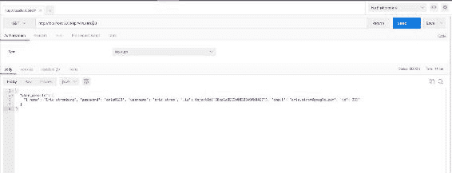

此外，我们需要测试用户条目不存在的情况；请尝试以下代码：

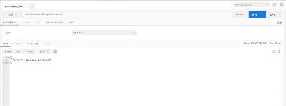

# POST api/v1/users

该 API 函数用于将新用户添加到用户列表中。

在这段代码中，我们将重写`add_user(new_user)`函数与 MongoDB 进行交互，将用户添加到用户集合中：

```py
    def add_user(new_user): 
     api_list=[] 
     print (new_user) 
     db = connection.cloud_native.users 
     user = db.find({'$or':[{"username":new_user['username']}     ,  
    {"email":new_user['email']}]}) 
     for i in user: 
       print (str(i)) 
       api_list.append(str(i)) 

     if api_list == []: 
       db.insert(new_user) 
       return "Success" 
     else : 
       abort(409) 

```

现在我们已经修改了我们的函数，还有一件事需要做——之前，ID 是由 SQLite 3 生成的，但现在，我们需要通过将其添加到其路由函数中使用随机模块来生成它们，如下所示：

```py
    def create_user(): 
     if not request.json or not 'username' in request.json or not 
    'email' in request.json or not 'password' in request.json: 
       abort(400) 
     user = { 
       'username': request.json['username'], 
       'email': request.json['email'], 
       'name': request.json.get('name',""), 
       'password': request.json['password'], 
       'id': random.randint(1,1000) 
     } 

```

让我们向用户列表添加一条记录，以测试它是否按预期工作。

以下截图显示了在 MongoDB 中使用 POSTMAN 添加新记录的输出状态：

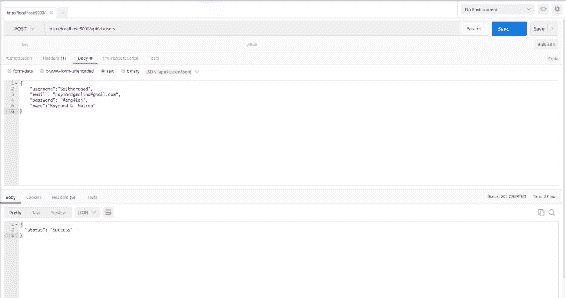

让我们验证是否已在 MongoDB 集合中更新了属性。

以下截图验证了我们的新记录已成功添加：

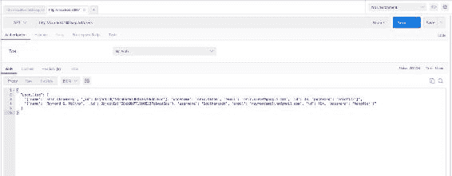

# PUT api/v1/users/[user_id]

该 API 函数用于更新 MongoDB 用户集合中用户的属性。

为了更新 MongoDB 用户集合中特定用户的文档，我们需要将`upd_user(user)`方法重写如下：

```py
    def upd_user(user): 
     api_list=[] 
     print (user) 
     db_user = connection.cloud_native.users 
     users = db_user.find_one({"id":user['id']}) 
     for i in users: 
       api_list.append(str(i)) 
      if api_list == []: 
       abort(409) 
      else: 
       db_user.update({'id':user['id']},{'$set': user}, upsert=False ) 
       return "Success" 

```

现在我们已经更新了方法，让我们在 POSTMAN 上测试一下，并检查响应。

以下截图显示了使用 POSTMAN 进行更新 API 请求的响应：

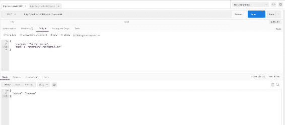

让我们验证用户文档，检查字段是否已修改：

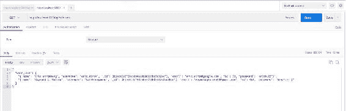

# DELETE api/v1/users

该 API 从用户列表中删除特定用户。

在这种情况下，我们将修改`del_user(del_user)`方法，以从 MongoDB 用户集合中删除用户，如下所示：

```py
    def del_user(del_user): 
     db = connection.cloud_native.users 
    api_list = [] 
    for i in db.find({'username':del_user}): 
       api_list.append(str(i)) 

     if api_list == []: 
       abort(404) 
    else: 
      db.remove({"username":del_user}) 
      return "Success" 

```

让我们在 POSTMAN 上测试一下，看看响应是否符合预期：

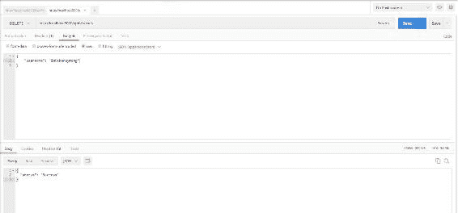

现在我们已经删除了一个用户，让我们看看是否对整体用户列表造成了任何更改：

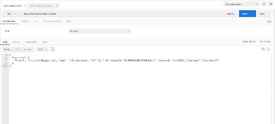

太棒了！我们已经对用户资源的所有 RESTful API URL 进行了更改，并进行了验证。

# 处理推文资源

现在我们的用户资源 API 在 MongoDB 作为数据库服务上运行良好，我们将对推文资源做同样的操作。

# GET api/v2/tweets

此函数从所有用户获取所有推文的完整列表。

让我们更新我们的`list_tweets()`方法，开始使用以下代码片段从 MongoDB 的推文集合中获取推文列表：

```py
def list_tweets(): 
   api_list=[] 
   db = connection.cloud_native.tweet 
   for row in db.find(): 
       api_list.append(str(row)) 
   return jsonify({'tweets_list': api_list}) 

```

现在我们已经更新了代码，让我们在 POSTMAN 上测试一下。以下截图列出了通过 POSTMAN 使用 API 请求的所有推文：

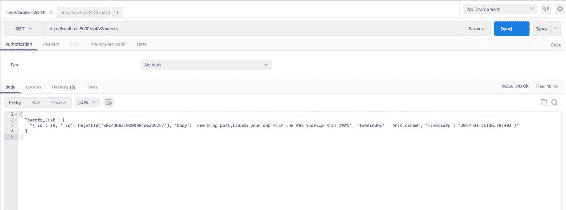

# GET api/v2/tweets/[user_id]

此函数从特定用户获取推文。

为了从推文集合中获取特定用户的推文，我们需要修改我们当前的`list_tweet(user_id)`函数如下：

```py
    def list_tweet(user_id): 
     db = connection.cloud_native.tweets 
     api_list=[] 
     tweet = db.find({'id':user_id}) 
     for i in tweet: 
       api_list.append(str(i)) 
    if api_list == []: 
       abort(404) 
    return jsonify({'tweet': api_list}) 

```

让我们测试一下我们的 API，并验证它是否按预期工作：


# POST api/v2/tweets

此函数从现有用户添加新推文。

在这种情况下，我们需要修改我们的`add_tweet(new_tweet)`方法与用户进行交互，并在 MongoDB 中的推文集合中添加新推文，如下所示：

```py
    def add_tweet(new_tweet): 
     api_list=[] 
     print (new_tweet) 
     db_user = connection.cloud_native.users 
     db_tweet = connection.cloud_native.tweets 
     user = db_user.find({"username":new_tweet['tweetedby']}) 
     for i in user: 
       api_list.append(str(i)) 
     if api_list == []: 
      abort(404) 
     else: 
       db_tweet.insert(new_tweet) 
       return "Success" 

```

现在我们已经修改了记录，让我们测试一下。以下截图显示了使用 POSTMAN 添加新推文的`POST`请求的成功状态：

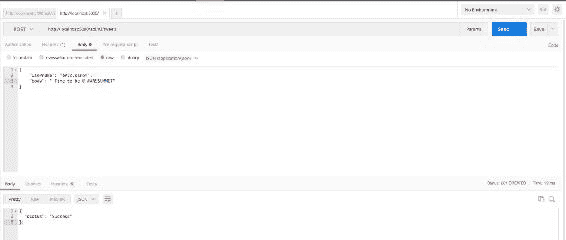

现在让我们验证新添加的推文是否在推文列表中更新，如下截图所示：

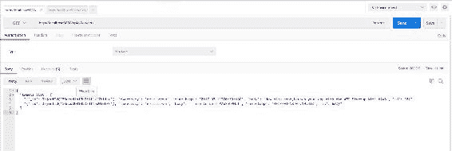

# 总结

在本章中，我们将基于文件的数据库服务（SQLite）迁移到 NoSQL 文档型数据库服务（MongoDB）。您将学习如何将 MongoDB 与您的 RESTful API 集成，以响应客户端的请求并保存数据。下一章将更有趣，因为我们将使用 React 构建我们的前端 Web 视图。
