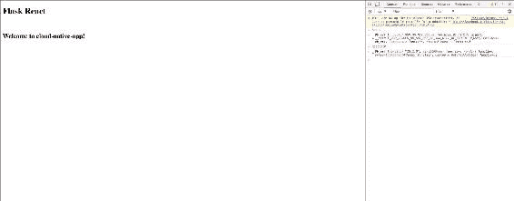
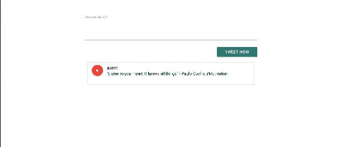
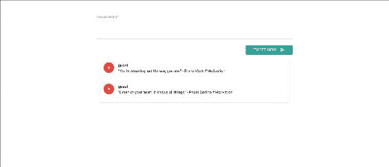
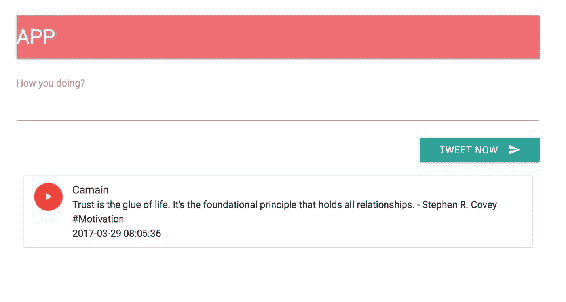
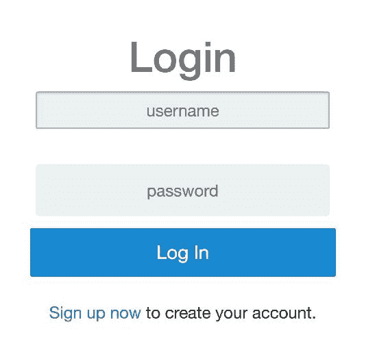
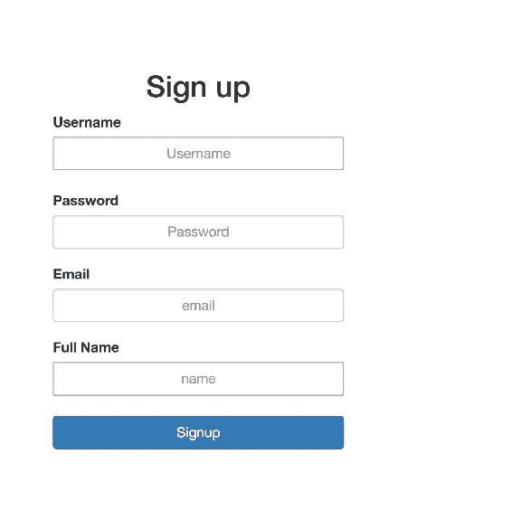
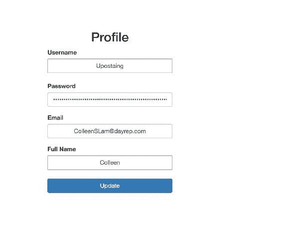
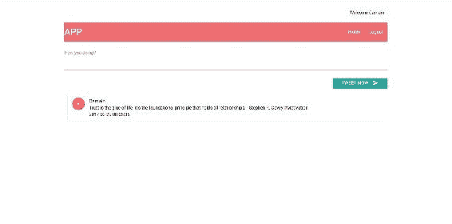

# 第五章：使用 React 构建 WebViews

到目前为止，我们一直在构建我们的微服务，并使我们的后端服务更加响应和高效。此外，我们一直在尝试不同的数据库服务，这些服务可以保护并提高数据的存储和检索性能，这在这里是至关重要的。

在本章中，我们将专注于使用 React 构建我们的前端页面，并将这些页面与后端集成以形成一个完整的应用程序。

本章将涵盖的主题如下：

+   设置 React 环境

+   创建用户认证面板

+   将 React 与后端 API 集成

# 理解 React

简单来说，React 是你的应用程序的 UI 层。它是一个用于构建快速和快速用户界面的 JavaScript 库。React 基本上帮助你为你的应用程序的每个状态创建令人惊叹的 web 视图。因此，我们将使用 React 来实现这个目的。但在我们这样做之前，让我们了解 React 的一些概念/关键点，下面列出了这些概念/关键点：

+   **组件**：你的 HTML 和 JavaScript 的所有集合都被称为**组件**。React 基本上提供了渲染启用 JavaScript 的 HTML 页面的钩子。这里的重要一点是，React 作为控制器，用于渲染应用程序的不同状态的不同网页。

+   **React 中静态版本的 Props**：通常，在 HTML 中，你需要大量的代码来在前端显示所有数据，而且这是重复的。React 的 props 帮助你解决了这个问题。props 基本上保持数据的状态，并从父级传递值给子级。

+   **识别最小状态**：为了正确构建你的应用程序，你首先需要考虑你的应用程序需要的最小可变状态集。比如，在我们的情况下，我们需要在应用程序的不同状态下始终保持用户状态可用。

+   **识别活动状态**：React 的核心是组件层次结构中的单向数据流。我们需要了解每个基于该状态渲染内容的组件。此外，我们需要了解组件层次结构中状态如何改变。

+   **React-DOM**：react-dom 是 React 和 DOM 的组合。React 包含在 Web 和移动应用程序中使用的功能。react-dom 功能仅在 Web 应用程序中使用。

# 设置 React 环境

为了运行 React，我们需要设置一个初始环境，其中包括安装一些`node.js`的库。

# 安装 node

在开始安装 React 和包列表之前，我们需要在系统上安装`node.js`。

在 Linux（基于 Debian 的系统）中，安装过程非常简单。

首先，我们需要使用以下命令从`node.js`官方网站添加 PPA：

```py
$ sudo apt-get install python-software-properties
$ curl -sL https://deb.nodesource.com/setup_7.x | sudo -E bash -

```

一旦设置好，我们可以使用以下命令安装`node.js`：

```py
$ apt-get install nodejs 

```

现在让我们检查`node`和`npm`的版本，如下所示：

```py
$ npm -v
 4.1.2 
$ node -v
  V7.7.4 

```

在我们的设置中，我们使用了上述版本，但是 v7.x 左右的 node 版本应该可以，对于 npm，v4.x 应该可以。

# 创建 package.json

这个文件基本上是你的应用程序的元数据，其中包含需要为你的应用程序安装的完整库/依赖项。另一个现实世界的优势是，它使你的构建可复制，这意味着与其他开发人员分享变得更容易。有不同的方式可以创建你定制的`package.json`。

以下是在`packages.json`中需要提供的最少信息：

```py
    "Name" - lowercase.
    "version"  - in the form of x.x.x

    For example:

    {
      "name": "my-twitter-package",
      "version": "1.0.0"
    } 

```

为了创建`package.json`模板，你可以使用以下命令：

```py
$ npm init              # in your workspace  

```

它会要求填写诸如名称、版本、描述、作者、许可证等值；填写这些值，它将生成`package.json`。

如果你现在不想填写信息，你可以使用`--yes`或`-y`属性使用默认值，如下所示：

```py
$npm init --yes

```

对于我们的应用程序，我已经生成了类似以下内容的`package.json`：

```py
    { 
      "name": "twitter", 
      "version": "1.0.0", 
      "description": "Twitter App", 
      "main": "index.js", 
      "dependencies": { 
        "babel-loader": "⁶.4.1", 
        "fbjs": "⁰.8.11", 
        "object-assign": "⁴.1.1", 
        "react": "¹⁵.4.2", 
        "react-dev": "0.0.1", 
        "react-dom": "⁰.14.7", 
        "requirejs": "².3.3" 
      }, 
     "devDependencies": { 
       "babel-core": "⁶.4.5", 
       "babel-loader": "⁶.2.1", 
       "babel-preset-es2015": "⁶.3.13", 
       "babel-preset-react": "⁶.3.13", 
       "webpack": "¹.12.12" 
      }, 
    "scripts": { 
      "test": "echo \"Error: no test specified\" && exit 1" 
     }, 
    "author": "Manish Sethi", 
    "license": "ISC" 
   } 

```

现在，我们已经生成了`package.json`，我们需要使用以下命令在我们的工作站上安装这些依赖项：

```py
$ npm install 

```

请确保在执行上述命令时，`package.json`应该在当前工作目录中。

# 使用 React 构建 webViews

首先，我们将创建一个主页视图，从中将调用 React。所以，让我们创建`index.html`，它在模板目录中有以下内容：

```py
    <!DOCTYPE html> 
    <html> 
     <head lang="en"> 
      <meta charset="UTF-8"> 
      <title>Flask react</title> 
    </head> 
   <body> 
     <div class="container"> 
       <h1></h1> 
       <br> 
       <div id="react"></div> 

    </div> 

   <!-- scripts --> 
    <script src="img/jquery-2.1.1.min.js"></script> 
    <script src="img/
      react/15.1.0/react.min.js"></script> 
    <script src="img/react-
      router@2.8.1/umd/ReactRouter.min.js"></script> 
    <script src="img/
      libs/react/15.1.0/react-dom.min.js"></script> 
    <script src="img/
      react/0.13.3/JSXTransformer.js"></script> 

    </body> 
   </html> 

```

正如你在前面的 HTML 页面中所看到的，我们已经定义了`id="react"`，我们将使用它来根据 ID 调用 React 的主要函数，并执行某些操作。

所以，让我们创建我们的`main.js`，它将发送一个响应，代码如下：

```py
    import Tweet from "./components/Tweet"; 
    class Main extends React.Component{ 
    render(){ 
      return ( 
      <div> 
        <h1>Welcome to cloud-native-app!</h1> 
      </div> 
      ); 
    } 
   } 

   let documentReady =() =>{ 
    ReactDOM.render( 
    <Main />, 
     document.getElementById('react') 
    ); 
  }; 

  $(documentReady); 

```

现在我们已经定义了 React 响应的基本结构。由于我们正在构建具有多个视图的应用程序，我们需要一个构建工具，它将帮助我们将所有资产，包括 JavaScript、图像、字体和 CSS，放在一个包中，并将其生成为一个单一的文件。

**Webpack**是将帮助我们解决这个问题的工具。

Webpack 应该已经可用，因为我们在`package.json`中定义了 Webpack 包，我们之前安装过了。

Webpack 基本上读取一个入口文件，它可以是`.js`文件，读取它的子组件，然后将它们转换成一个单一的`.js`文件。

由于我们已经在`package.json`中定义了它，它已经安装好了。

在 Webpack 中，我们需要定义一个配置，它将帮助它识别入口文件和要用于生成单一`.js`文件的加载器。此外，你需要定义生成代码的文件名。

我们的 Webpack 配置应该是这样的：

```py
    module.exports = { 
      entry: "./static/main.js", 
      output: { 
        path: __dirname + "/static/build/", 
        filename: "bundle.js" 
      }, 
     resolve: { 
       extensions: ['', '.js', '.jsx'] 
     }, 
     module: { 
        loaders: [ 
            { test: /\.js$/, exclude: /node_modules/, loader: "babel-
        loader", query:{presets:['react','es2015']} } 
        ] 
     } 
   }; 

```

你可以根据你的用例扩展前面的配置。有时，开发人员尝试使用*.html 作为入口点。在这种情况下，你需要做出适当的更改。

让我们继续使用以下命令构建我们的第一个 webView：

```py
$ webpack -d  

```

最后一个命令中的`-d`属性用于调试；它生成另一个文件`bundle.js.map`，显示 Webpack 的活动。

由于我们将重复构建应用程序，我们可以使用另一个标志`--watch`或`-w`，它将跟踪`main.js`文件的更改。

所以，现在我们的 Webpack 命令应该是这样的：

```py
$ webpack -d -w

```

现在我们已经构建了我们的应用程序。记得在`app.py`中更改你的路由，这样主页应该被导航如下：

```py
    @app.route('/index') 
    def index(): 
     return render_template('index.html') 

```

让我们检查一下我们的主页现在是什么样子的。



你也可以检查一下我们是否在检查模式下后台运行着 React 和 react-dom。

这是一个非常基本的结构，用于理解 React 的工作原理。让我们继续我们的用例，我们已经创建了 tweet webViews，用户也可以查看旧的 tweets。

所以，让我们创建`Tweet.js`，它将有 tweets 的基本结构，比如一个用于内容的文本框，和一个用于发布 tweets 的按钮。将以下代码添加到`Tweet.js`：

```py
    export default class Tweet extends React.Component { 

    render(){ 
     return( 
        <div className="row"> 
                </nav> 
        <form > 
          <div > 
            <textarea ref="tweetTextArea" /> 
            <label>How you doing?</label> 
              <button >Tweet now</button> 
          </div> 
         </form> 
        </div> 
        ); 
      } 
   } 

```

让我们从`main.js`中调用这个函数，这样它就会在主页上加载，通过更新`render`函数如下：

```py
    import Tweet from "./components/Tweet"; 
    render(){ 
      return ( 
      <div> 
        <Tweet /> 
      </div> 
     ); 
    } 

```

如果你现在加载页面，它将会非常简单。由于我们想要创建一个吸引人的 web 应用程序，我们将在这里使用一些 CSS 来实现。在我们的情况下，我们使用 Materialize CSS ([`materializecss.com/getting-started.html`](http://materializecss.com/getting-started.html))。

在`index.html`中添加以下代码块：

```py
    <link rel="stylesheet"  
      href="https://cdnjs.cloudflare.com/ajax/libs/
      materialize/0.98.1/css/materialize.min.css"> 
   <script src="img/
     materialize/0.98.1/js/materialize.min.js"></script> 

   Also, we need to update Tweet.js as follows 

   render(){ 
    return( 
        <div className="row"> 
         <form > 
          <div className="input-field"> 
            <textarea ref="tweetTextArea" className="materialize-
             textarea" /> 
            <label>How you doing?</label> 
              <button className="btn waves-effect waves-light
               right">Tweet now <i className="material-icons 
               right">send</i></button> 
          </div> 
         </form> 
       </div> 
      ); 
    } 

```

让我们尝试添加 tweets，并通过状态发送它们，以便显示一些 tweets。

在`main.js`的`Main`类中，添加以下构造函数来初始化状态：

```py
    constructor(props){ 
     super(props); 
     this.state =  { userId: cookie.load('session') }; 
     this.state={tweets:[{'id': 1, 'name': 'guest', 'body': '"Listen to 
     your heart. It knows all things." - Paulo Coelho #Motivation' }]} 
    } 

```

现在按照以下方式更新`render`函数：

```py
    render(){ 
      return ( 
      <div> 
         <TweetList tweets={this.state.tweets}/> 
      </div> 
      ); 
     } 
    } 

```

让我们创建另一个文件`TweetList.js`，它将显示 tweets，代码如下：

```py
    export default class TweetList extends React.Component { 
     render(){ 
        return( 
        <div> 
          <ul className="collection"> 
           <li className="collection-item avatar"> 
           <i className="material-icons circle red">play_arrow</i> 
           <span className="title">{this.props.tweetedby}</span> 
          <p>{this.props.body}</p> 
          <p>{this.props.timestamp}</p> 
          </li> 
         </ul> 
        </div> 
       ); 
      } 
     } 

```

太棒了！现在我们已经添加了这个模板。让我们检查一下我们的主页，看看 CSS 是如何工作的。但在此之前，由于我们正在使用 Webpack 进行构建，请确保每次都添加以下行以加载`bundle.js`-这将在`index.html`文件中运行 webView。

```py
    <script type="text/javascript" src="img/bundle.js">
     </script> 

```

太棒了！主页应该是这样的：



让我们继续发布推文-我们应该能够添加新的推文，并且它们也应该在`TweetList.js`中更新。

让我们更新我们的`Tweet.js`代码，以便将推文发送到`main.js`进行处理。现在，我们需要将我们的推文发送到`main.js`，为此，我们需要使用以下代码更新我们的`Tweet.js`文件：

```py
    sendTweet(event){ 
      event.preventDefault(); 
      this.props.sendTweet(this.refs.tweetTextArea.value); 
      this.refs.tweetTextArea.value = ''; 
     } 

```

还要确保使用以下`form onSubmit`属性更新`render`函数：

```py
    <form onSubmit={this.sendTweet.bind(this)}> 

```

因此，在向文本区域添加内容后，它还应该提交推文。

现在，让我们更新`main.js`的`render`函数以添加新的推文，如下所示：

```py
    <Tweet sendTweet={this.addTweet.bind(this)}/> 

```

我们还需要在以下定义的`Main`类中添加`addTweet`函数：

```py
    addTweet(tweet): 
     let newTweet = this.state.tweets; 
     newTweet.unshift({{'id': Date.now(), 'name': 'guest','body':
      tweet}) 
     this.setState({tweets: newTweet}) 

```

在添加新推文后，您的页面应该看起来像这样：



目前，我们正在使用 React 来保存数组中的数据。由于我们已经构建了我们的微服务来保存这种数据，我们应该将我们的 webView 与后端服务集成。

# 将 webView 与微服务集成

为了将我们的微服务与 webView 集成，我们将使用 AJAX 进行 API 调用。

```py
main.js to pull our entire tweet list:
```

```py
    componentDidMount() { 
      var self=this; 
      $.ajax({url: `/api/v2/tweets/`, 
      success: function(data) { 
        self.setState({tweets: data['tweets_list']}); 
        alert(self.state.tweets); 
        return console.log("success"); 
       }, 
     error: function() { 
      return console.log("Failed"); 
      } 
    }); 

```

同样，我们需要修改我们`main.js`中的`addTweet`函数，如下所示：

```py
   addTweet(tweet){ 
     var self = this; 
     $.ajax({ 
       url: '/api/v2/tweets/', 
       contentType: 'application/json', 
       type: 'POST', 
       data: JSON.stringify({ 
         'username': "Agnsur", 
      'body': tweet, 
       }), 
       success: function(data) { 
            return console.log("success"); 
       }, 
       error: function() { 
         return console.log("Failed"); 
       } 
     }); 
    } 

```

由于将有多条推文需要使用相似的推文模板进行迭代，让我们创建另一个名为`templatetweet.js`的组件，并使用以下代码：

```py
    export default class Tweettemplate extends React.Component { 
     render(props){ 
      return( 
      <li className="collection-item avatar"> 
        <i className="material-icons circle red">play_arrow</i> 
        <span className="title">{this.props.tweetedby}</span> 
        <p>{this.props.body}</p> 
        <p>{this.props.timestamp}</p> 
      </li> 

      ); 
     } 
    } 

```

请记住，我们已根据我们的数据库集合键更改了 props 字段。

此外，我们需要更新我们的`TweetList.js`，以使用前面的模板，通过以下方式添加它：

```py
    import Tweettemplate from './templatetweet' 

    export default class TweetList extends React.Component { 
    render(){ 
     let tweetlist = this.props.tweets.map(tweet => <Tweettemplate key=
     {tweet.id} {...tweet} />); 
    return( 
        <div> 
          <ul className="collection"> 
            {tweetlist} 
          </ul> 
        </div> 
      ); 
     } 
    } 

```

太棒了！您的主页现在应该是这样的：



# 用户身份验证

我们所有的推文都是受保护的，应该只对我们想展示给他们的观众做出反应。此外，匿名用户不应被允许发推文。为此，我们将创建一个数据库和网页，以使新用户能够登录并在推文 webView 中登录。请记住，我们将使用 Flask 来验证用户，并将数据发布到后端用户。

# 登录用户

让我们创建我们的登录页面模板，现有用户需要填写他们的用户名和密码进行身份验证。以下是代码片段：

```py
    <form action="/login" method="POST"> 
     <div class="login"> 
     <div class="login-screen"> 
     <div class="app-title"> 
      <h1>Login</h1> 
     </div> 

     <div class="login-form"> 
     <div class="control-group"> 

      <input type="text" class="login-field" value="" 
       placeholder="username" name="username"> 
      <label class="login-field-icon fui-user" for="login-name">
      </label> 
     </div> 

    <div class="control-group"> 
      <input type="password" class="login-field" value=""
       placeholder="password" name="password"> 
      <label class="login-field-icon fui-lock" for="login-pass">
      </label> 
    </div> 
     <input type="submit" value="Log in" class="btn btn-primary btn-
     large btn-block" ><br> 
     Don't have an account? <a href="{{ url_for('signup') }}">Sign up
     here</a>. 
   </div> 

```

我们将向登录页面发布数据，我们将在`app.py`文件中定义。

但首先，检查会话是否存在。如果没有，那么您将被重定向到登录页面。将以下代码添加到`app.py`中，它将验证用户的会话详细信息：

```py
   @app.route('/') 
   def home(): 
     if not session.get('logged_in'): 
        return render_template('login.html') 
     else: 
        return render_template('index.html', session =   
     session['username']) 

```

让我们为登录创建路由，并验证凭据以对用户进行身份验证。

以下是代码片段：

```py
    @app.route('/login', methods=['POST']) 
    def do_admin_login(): 
      users = mongo.db.users 
      api_list=[] 
      login_user = users.find({'username': request.form['username']}) 
      for i in login_user: 
        api_list.append(i) 
      print (api_list) 
      if api_list != []: 
         if api_list[0]['password'].decode('utf-8') == 
         bcrypt.hashpw(request.form['password'].encode('utf-8'), 
         api_list[0]['password']).decode('utf-8'): 
            session['logged_in'] = api_list[0]['username'] 
            return redirect(url_for('index')) 
        return 'Invalid username/password!' 
      else: 
        flash("Invalid Authentication") 

    return 'Invalid User!' 

```

完成后，您的登录页面将显示在根 URL，并且应该是这样的：



正如您所看到的，我们提供了一个链接“立即注册”，以为新用户创建帐户。

请记住，我们正在使用 API 来从我们的数据库中的用户集合对用户进行身份验证。

# 注册用户

让我们继续创建我们的注册页面，以帮助注册新用户，以便他们也可以发推文。

让我们创建`signup.html`，它将要求用户提供详细信息。检查以下代码片段：

```py
     <div class="container"> 
      <div class="row"> 
        <center><h2>Sign up</h2></center> 
          <div class="col-md-4 col-md-offset-4"> 
              <form method=POST action="{{ url_for('signup') }}"> 
                  <div class="form-group"> 
                      <label >Username</label> 
                      <input type="text" class="form-control"
                        name="username" placeholder="Username"> 
                  </div> 
                  <div class="form-group"> 
                      <label >Password</label> 
                      <input type="password" class="form-control" 
                      name="pass" placeholder="Password"> 
                  </div> 
                  <div class="form-group"> 
                      <label >Email</label> 
                      <input type="email" class="form-control" 
                     name="email" placeholder="email"> 
                  </div> 
                  <div class="form-group"> 
                      <label >Full Name</label> 
                      <input type="text" class="form-control" 
                      name="name" placeholder="name"> 
                  </div> 
                  <button type="submit" class="btn btn-primary btn-
                     block">Signup</button> 
               </form> 
               <br> 
            </div> 
          </div> 
      </div> 

```

上述代码基本上是需要后端 API 将数据提交给用户的模板。

```py
app.py:
```

```py
    @app.route('/signup', methods=['GET', 'POST']) 
    def signup(): 
      if request.method=='POST': 
        users = mongo.db.users 
        api_list=[] 
        existing_user = users.find({'$or':  
        [{"username":request.form['username']} ,
         {"email":request.form['email']}]}) 
            for i in existing_user: 
              api_list.append(str(i)) 
            if api_list == []: 
              users.insert({ 
              "email": request.form['email'], 
              "id": random.randint(1,1000), 
              "name": request.form['name'], 
              "password": bcrypt.hashpw(request.form['pass'].
                encode('utf-8'), bcrypt.gensalt()), 
              "username": request.form['username'] 
            }) 
            session['username'] = request.form['username'] 
            return redirect(url_for('home')) 

          return 'That user already exists' 
      else : 
        return render_template('signup.html') 

```

用户注册后，它将设置会话，并将其重定向到您的主页。

您的注册页面应该看起来像这样：



我们已经验证了用户，但如果他想要更新个人信息怎么办？让我们创建一个个人资料页面，以帮助他们这样做。

# 用户资料

让我们创建一个个人资料页面（`profile.html`），用户在主页登录后可以在导航面板中访问。

将以下代码添加到`profile.html`：

```py
     <div class="container"> 
      <div class="row"> 
        <center><h2>Profile</h2></center> 
          <div class="col-md-4 col-md-offset-4"> 
              <form method=POST action="{{ url_for('profile') }}"> 
                  <div class="form-group"> 
                      <label >Username</label> 
                      <input type="text" class="form-control"
                       name="username" value='{{username}}'> 
                  </div> 
                  <div class="form-group"> 
                      <label >Password</label> 
                      <input type="password" class="form-control"
                      name="pass" value='{{password}}'> 
                  </div> 
                  <div class="form-group"> 
                      <label >Email</label> 
                      <input type="email" class="form-control" 
                      name="email" value={{email}}> 
                  </div> 
                  <div class="form-group"> 
                      <label >Full Name</label> 
                      <input type="text" class="form-control" 
                      name="name" value={{name}}> 
                  </div> 
                  <button type="submit" class="btn btn-primary btn-
                   block">Update</button> 
                </form> 
              <br> 
           </div> 
       </div> 
     </div> 

```

由于我们已经创建了个人资料，我们需要为个人资料创建一个路由，它将读取数据库以获取用户详细信息，并将 POST 回数据库。

```py
app.py:
```

```py
    def profile(): 
       if request.method=='POST': 
         users = mongo.db.users 
         api_list=[] 
         existing_users = users.find({"username":session['username']}) 
         for i in existing_users: 
            api_list.append(str(i)) 
         user = {} 
         print (api_list) 
         if api_list != []: 
            print (request.form['email']) 
            user['email']=request.form['email'] 
            user['name']= request.form['name'] 
            user['password']=request.form['pass'] 
            users.update({'username':session['username']},{'$set':
          user} ) 
        else: 
            return 'User not found!' 
        return redirect(url_for('index')) 
      if request.method=='GET': 
        users = mongo.db.users 
        user=[] 
        print (session['username']) 
        existing_user = users.find({"username":session['username']}) 
        for i in existing_user: 
            user.append(i) 
        return render_template('profile.html', name=user[0]['name'], 
        username=user[0]['username'], password=user[0]['password'], 
        email=user[0]['email']) 

```

一旦添加了这最后一部分代码，您的个人资料页面应该看起来像这样：



此外，我们应该在导航模板的`Tweet.js`中添加个人资料链接，添加以下几行：

```py
      <li><a href="/profile">Profile</a></li> 
      <li><a href="/logout">Logout</a></li> 

```

现在您的主页应该看起来像这样：



# 登出用户

```py
app.py:
```

```py
    @app.route("/logout") 
    def logout(): 
      session['logged_in'] = False 
      return redirect(url_for('home')) 

```

现在我们的应用程序已经完全构建起来，从用户登录，到提交他们的推文，然后退出登录。

# 测试 React webViews

由于我们正在构建 webViews，我们需要测试它们以在发生之前捕捉一些错误。此外，测试将帮助您构建更好的代码。

有许多 UI 测试框架可以帮助您测试 Web 应用程序。以下部分讨论了其中两个。

# Jest

Jest 是一个单元测试框架，由 Facebook 提供用于测试 JavaScript。它用于测试单个组件。它简单、标准且独立。

它基于虚拟 DOM 实现测试组件，并运行不同的测试来检查功能。它会自动解决依赖关系。此外，您可以并行运行所有测试。

您可以参考以下链接，这可以帮助您为 React 应用编写测试用例：

[`facebook.github.io/jest/docs/tutorial-react.html`](https://facebook.github.io/jest/docs/tutorial-react.html)

# Selenium

Selenium 是一个开源的、可移植的自动化软件测试工具，用于测试 Web 应用程序。它提供端到端测试，这意味着它是针对真实浏览器执行测试场景来测试多层应用程序堆栈的过程。

它具有以下不同的组件：

+   **IDE**：这可以帮助您描述测试工作流程。

+   **Selenium WebDriver**：这可以自动化浏览器测试。它直接发送命令到浏览器并接收结果。

+   **Selenium RC**：这个远程控制器可以帮助您创建测试用例。

+   **网格**：这在不同浏览器和并行运行测试用例。

这是您可以用来测试我们的 Web 应用程序的最佳工具之一，我强烈推荐使用。

您可以在[`www.seleniumhq.org/docs/`](http://www.seleniumhq.org/docs/)了解更多关于 Selenium 的信息。

# 摘要

在本章中，我们的重点是创建前端用户 webViews 以及如何改进它们以吸引消费者。您还学会了 React 如何帮助我们构建这些 webViews 并实现与后端服务的交互。在接下来的章节中，事情将变得更有趣，因为我们将玩转我们的前端应用程序，并解释如何使用 Flux 来处理来自互联网的大量请求。
