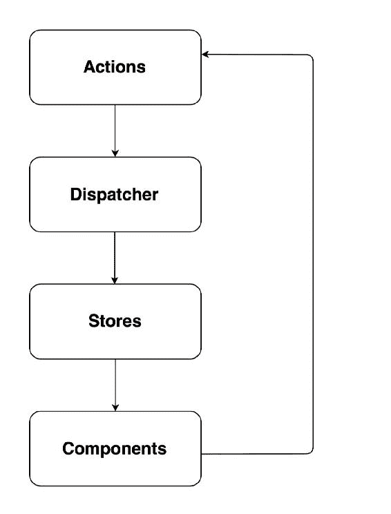
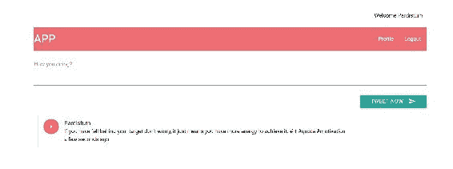
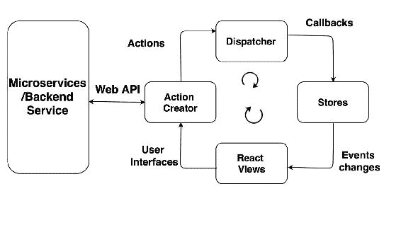
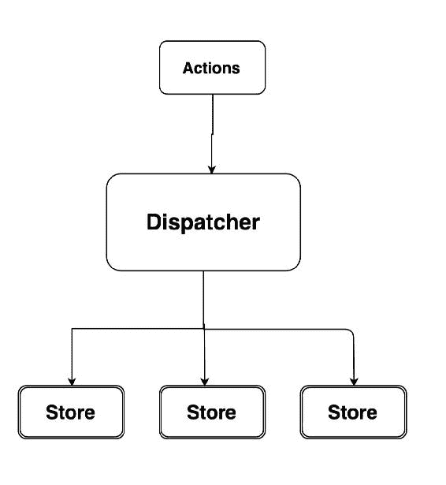
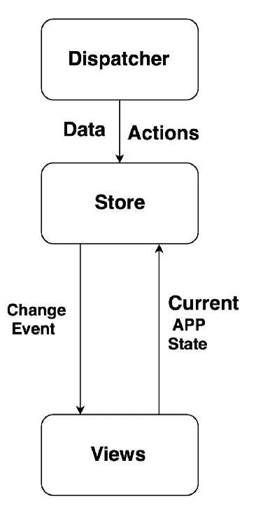
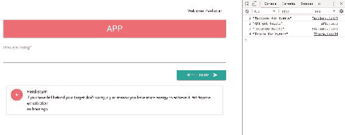
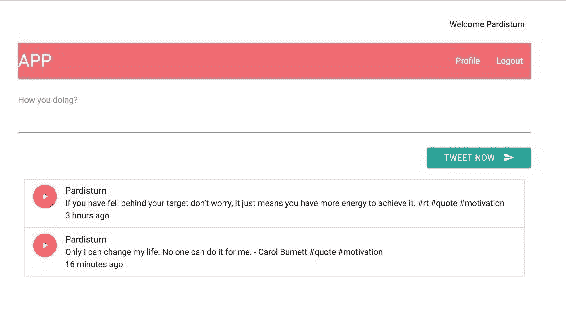

# 第六章：使用 Flux 创建可扩展的 UI

在上一章中，我们为我们的应用程序创建了 Web 视图，还看到了前端和后端应用程序之间的集成，这对理解是非常重要的。

在本章中，我们将专注于构建我们的前端。理想情况下，每个模块应该负责一件事。就像我们的主要组件一样，我们在单个模块中运行了太多操作。除了渲染不同的视图之外，我们还有代码来向端点发出 API 请求并接收、处理和格式化响应。

在本章中，我们将涵盖以下主题：

+   理解 Flux

+   在 React 上实现 Flux

# 理解 Flux

**Flux**是 Facebook 创建的一种模式，用于使用 React 构建一致和稳定的 Web 应用程序。React 并不给你管理数据的能力；相反，它只是通过 props 和组件接受数据，而组件进一步处理数据。

React 库并不真正告诉你如何获取组件，或者在哪里存储数据，这就是为什么它被称为**视图层**。在 React 中，我们没有像 Angular 或 Backbone 那样的框架。这就是 Flux 的用武之地。Flux 并不是一个真正的框架，而是一种模式，它将让你构建自己的视图。

什么是 Flux 模式？我们有你的 React 组件，比如 Tweet 组件等等，在 Flux 模式中，这些组件会做两件事--它们要么执行动作，要么监听存储器。在我们的用例中，如果用户想要发布推文，组件需要执行动作，然后动作与存储器交互，更新模式到 API，并将响应给组件。以下图表将让你更清楚地了解 Flux：



# Flux 概念

在继续之前，以下是你需要了解的 Flux 概念：

+   **动作**：这是组件与 API 端点交互并更新它们的方式。在我们的情况下，我们使用它发布新推文。动作将动作传输到调度器。它可能创建多个动作。

+   **调度器**：这会分发每一个事件，并将其发送给每一个订阅者，基本上就是存储器。

+   **存储器**：这是 Flux 的一个重要部分。组件总是监听存储器的任何更改。比如，如果你写了一条新推文，那就是一个动作，无论推文在存储器中更新到哪里，都会触发一个事件，并且组件会意识到它必须使用最新的数据进行更新。如果你来自 AngularJS 世界，存储器就是一个服务，或者如果你是 Backbone.js 的话，存储器只是一个集合。

+   **组件**：这用于存储动作名称。

我们将使用`JSX`文件而不是`JS`，因为它们之间没有太大的区别--`JS`是标准的 Javascript，而`JSX`是一种类似 HTML 的语法，你可以在 React 中使用它来轻松而直观地创建 React 组件。

# 向 UI 添加日期

在我们深入研究 Flux 之前，我们需要向我们的视图添加一个小功能，即日期功能。之前，你看到的是存储在数据库中的推文的时间，格式为**TZ**；然而，理想情况下，它应该与当前时间进行比较，并应该以此为参考显示。

为了做到这一点，我们需要更新我们的`main.jsx`文件，以便它可以格式化我们的推文。将以下代码添加到`main.jsx`中：

```py
    updatetweets(tweets){ 
        let updatelist = tweets.map(tweet => { 
         tweet.updatedate = moment(tweet.timestamp).fromNow(); 
         return tweet; 
       }); 
   }

```

我们的工作到此为止。现在，我们的推文应该看起来像这样：



# 使用 Flux 构建用户界面

在 Flux 中，我们将定义每个模块的责任，并且它也应该是单一的。React 的责任是在数据发生变化时重新渲染视图，这对我们来说是很好的。我们所需要做的就是使用类似 Flux 这样的东西来监听这些数据事件，它将管理我们的数据。

使用 Flux，你不仅分离了模块的责任，还可以在应用程序中实现单向流动，这就是为什么 Flux 如此受欢迎。

在 Flux 循环中，对于每个模块，总是有一个方向要遵循。这种对流程的有意约束是使 Flux 应用程序易于设计、易于增长、易于管理和维护的原因。

以下图表将让您更清楚地了解 Flux 架构：



对于图表，我参考了 Flux 存储库（[`github.com/facebook/flux`](https://github.com/facebook/flux)）。

# Actions 和 dispatcher

要开始使用 Flux，我们必须选择一个起点。可以是任何东西。我发现从 actions 开始是个不错的选择。您还必须选择一个流向。您可以顺时针或逆时针。顺时针对您来说可能是一个不错的起点，所以我们将这样做。

不要忘记使用以下命令直接安装 Flux 库：

```py
$ npm install flux --save

```

请注意，上述命令应该从我们的应用程序目录中执行，或者您可以将其添加到`package.json`中，并执行`npm install`来安装包。

现在，让我们从 action 作为起点开始，我们将遵循单一职责原则。我们将创建一个 actions 库来与 API 通信，并创建另一个 action 来与 dispatcher 通信。

让我们从静态目录中创建`actions`文件夹开始。我们将在这个目录中保存所有的 actions。

由于我们有两个需要执行的 actions--可能是列出 tweets 或添加新 tweets--我们将从列出 tweets 开始。创建一个`Tactions`文件，其中包含`getAllTweets`函数，该函数应该调用 REST API 来获取所有的 tweets，如下所示：

```py
   export default{ 
    getAllTweets(){ 
    //API calls to get tweets. 
    } 
   } 

```

我提到过基于 Flux 的应用程序易于设计，对吧？这就是原因。因为我们知道这个 actions 模块具有单一职责和单一流程--要么我们在这里提供 API 调用，要么最好调用一个模块来为应用程序进行所有 API 调用。

更新`Tactions.jsx`文件如下：

```py
    import API from "../API" 
     export default{ 
      getAllTweets(){ 
       console.log(1, "Tactions for tweets"); 
        API.getAllTweets(); 
      }, 
    } 

```

如您所见，我们导入了 API 模块，它将调用 API 来获取 tweets。

因此，让我们在静态目录中创建`API.jsx`，其中包含以下代码片段来从后端服务器获取 tweets：

```py
    export default{ 
      getAllTweets(){ 
       console.log(2, "API get tweets"); 
       $.getJSON('/api/v2/tweets', function(tweetModels) { 
          var t = tweetModels 
        // We need to push the tweets to Server actions to dispatch 
        further to stores. 
       }); 
      } 

```

在 actions 目录中创建`Sactions`文件，它将调用 dispatcher 并定义`actionType`：

```py
    export default{ 
      receivedTweets(rawTweets){ 
       console.log(3, "received tweets"); 
      //define dispatcher.     
     } 
   } 

```

如您所见，我们仍然需要定义 dispatcher。幸运的是，Facebook 创建了一个随 Flux 包一起提供的 dispatcher。

如前所述，**Dispatcher**是您的应用程序的中央枢纽，它分发**Actions**和注册回调的数据。您可以参考以下图表更好地理解数据流：



创建一个名为`dispatcher.jsx`的新文件，其中将使用以下代码创建一个 dispatcher 的实例：

```py
    import Flux from 'flux'; 

    export default new Flux.Dispatcher();   

```

就是这样。现在您可以在应用程序的任何地方导入这个 dispatcher。

因此，让我们更新我们的`Sactions.jsx`文件，其中您将找到`receivedTweets`函数，如下所示的代码片段：

```py
    import AppDispatcher from '../dispatcher'; 
    receivedTweets(rawTweets){ 
      console.log(3, "received tweets"); 
      AppDispatcher.dispatch({ 
        actionType: "RECEIVED_TWEETS", 
         rawTweets 
      }) 
     } 

```

在`receivedTweets`函数中，有三件事需要描述。首先，`rawTweets`将从`API.jsx`中的`getAllTweets`函数接收，我们需要按照以下方式进行更新：

```py
   import SActions from './actions/SActions'; 

   getAllTweets(){ 
     console.log(2, "API get tweets"); 
     $.getJSON('/api/v2/tweets', function(tweetModels) { 
        var t = tweetModels 
        SActions.receivedTweets(t) 
    }); 

```

# Stores

Stores 通过控制应用程序内的数据来管理应用程序状态，这意味着 stores 管理数据、数据检索方法、dispatcher 回调等。

为了更好地理解，请参考以下图表：



现在我们已经定义了我们的 dispatcher，接下来，我们需要确定订阅者对 dispatcher 提供的更改。

在静态目录中的 stores 中创建一个单独的目录，其中将包含所有的 store 定义。

让我们创建一个`TStore`文件，它将订阅 dispatcher 发出的任何更改。将以下代码添加到`TStore`文件中：

```py
    import AppDispatcher from "../dispatcher"; 

    AppDispatcher.register(action =>{ 
     switch (action.actionType) { 
     Case "RECEIVED_TWEETS" : 
    console.log(4, "Tstore for tweets"); 
     break; 
      default: 
    } 
  }); 

```

在这一点上，我们已经开始了推文操作，向 API 模块发送消息以获取所有推文。API 执行了这一操作，然后调用服务器操作将数据传递给调度程序。然后，调度程序标记了数据并将其分发。我们还创建了基本上管理数据并从调度程序请求数据的存储。

目前，您的存储尚未与我们的应用程序连接。存储应该在发生更改时发出更改，并且基于此，视图也将发生更改。

因此，我们的主要组件对存储发出的更改事件感兴趣。现在，让我们导入我们的存储。

在我们继续之前，让我们看看我们的应用程序的完整流程是否正常工作。应该是这样的：



在达到应用程序创建的一定稳定状态后，继续检查用户界面是一个很好的做法。

让我们继续。目前，我们只是分发推文，接下来，我们需要决定如何处理这些推文。因此，让我们首先接收推文，然后相应地向视图发出更改。我们将使用发射器来做到这一点。

**Emitter**是我们之前使用`npm`安装的事件库的一部分。因此，我们可以从那里导入它。请注意，它不是默认导出，而是它的解构属性。然后，我们的存储将是此推文`EventEmitter`类的实例。

让我们按照以下方式更新我们的`TStore.jsx`文件：

```py
    import { EventEmitter } from "events"; 

    let _tweets = [] 
     const CHANGE_EVENT = "CHANGE"; 

     class TweetEventEmitter extends EventEmitter{ 
     getAll(){ 
       let updatelist = _tweets.map(tweet => { 
          tweet.updatedate = moment(tweet.timestamp).fromNow(); 
         return tweet; 
        }); 
     return _tweets; 
     } 
     emitChange(){ 
       this.emit(CHANGE_EVENT); 
     } 

     addChangeListener(callback){ 
      this.on(CHANGE_EVENT, callback); 
     } 
     removeChangeListener(callback){ 
       this.removeListener(CHANGE_EVENT, callback); 
    } 
   } 
   let TStore = new TweetEventEmitter(); 

   AppDispatcher.register(action =>{ 
    switch (action.actionType) { 
      case ActionTypes.RECEIVED_TWEETS: 
        console.log(4, "Tstore for tweets"); 
        _tweets = action.rawTweets; 
        TStore.emitChange(); 
      break; 
     } 
     }); 
    export default TStore; 

```

哇，一次理解这么多代码！让我们一部分一部分地理解它，以及代码的流程。

首先，我们将使用以下导入实用程序从事件包中导入`EventEmitter`库：

```py
   import { EventEmitter } from "events"; 

```

接下来，我们将在`_tweets`中存储接收到的推文，并更新`getAll()`函数中的推文，以便在视图中显示推文的时间与当前系统时间的参考：

```py
   getAll(){ 
     let updatelist = _tweets.map(tweet => { 
         tweet.updatedate = moment(tweet.timestamp).fromNow(); 
         return tweet; 
       }); 
     return _tweets; 
   }

```

我们还为视图创建了添加和删除更改事件侦听器的函数。这两个函数也只是围绕`EventEmitter`语法的包装。

这些函数接受由视图发送的`callback`参数。这些函数基本上是为了向视图添加或删除侦听器，以便开始或停止监听存储中的这些更改。将以下代码添加到`TStore.jsx`中以执行此操作：

```py

    addChangeListener(callback){ 
      this.on(CHANGE_EVENT, callback); 
    } 
    removeChangeListener(callback){ 
     this.removeListener(CHANGE_EVENT, callback); 
    } 

```

确保在控制台中没有任何更新后的代码错误。

让我们继续前进，即在主要组件中创建一个函数，从存储中提取数据并为组件的状态准备一个对象。

让我们在`main.jsx`中编写`getAppState()`函数，该函数维护应用程序的状态，如下所示：

```py
    let getAppState = () =>{ 
      return { tweetslist: TStore.getAll()}; 
    } 

```

如前所述，文件扩展名实际上并不重要，无论是`.js`还是`.jsx`。

现在，我们将从`Main`类中调用此函数，并且还将调用我们在`main.jsx`中创建的添加和删除侦听器函数，使用以下代码块：

```py
   import TStore from "./stores/TStore"; 

   class Main extends React.Component{ 
     constructor(props){ 
      super(props); 
      this.state= getAppState(); 
      this._onChange = this._onChange.bind(this); 
      //defining the state of component. 
     } 
   // function to pull tweets 
     componentDidMount() { 
     TStore.addChangeListener(this._onChange); 
    } 
   componentWillUnMount() { 
     TStore.removeChangeListener(this._onChange); 
    } 

   _onChange(){ 
    this.setState(getAppState()); 
    } 

```

此外，我们必须更新`render`函数以获取`Tweetslist`状态以在视图中显示，可以使用以下代码片段完成：

```py
    render(){ 
      return ( 
       <div> 
       <Tweet sendTweet={this.addTweet.bind(this)}/> 
          <TweetList tweet={this.state.tweetslist}/> 
       </div> 
       ); 
      } 

```

很棒，我们现在已经做了几乎所有的事情；我们的推文应该可以正常显示，如下所示：



太棒了！我们的应用程序运行正常。

如果您查看 Flux 的架构图，我们已经完成了 Flux 的流程一次，但我们仍然需要通过创建 API 来完成循环，以添加新推文。

让我们通过使用 Flux 发送新推文功能来实现它。我们将在`main.jsx`中进行一些更改。在`render`函数中，将`Tweetcall`更改为以下行的`addTweet`函数：

```py
    <Tweet sendTweet={this.addTweet.bind(this)}/> 

```

而不是使用参数调用`Tweet`组件，如下所示：

```py
    <Tweet /> 

```

此外，在`Tweet`组件中，我们将调用`TActions`模块来添加新推文。更新`Tweet`组件中的代码如下：

```py
    import TActions from "../actions/Tactions" 
    export default class Tweet extends React.Component { 
     sendTweet(event){ 
      event.preventDefault(); 
      // this.props.sendTweet(this.refs.tweetTextArea.value); 
      TActions.sendTweet(this.refs.tweetTextArea.value); 
      this.refs.tweetTextArea.value = ''; 
     } 

    } 

```

`Tweet`组件中的`Render`函数保持不变。

让我们添加一个新的 `sendTweet` 函数，它将调用后端应用程序的端点 URL 进行 API 调用，并将其添加到后端数据库。

现在，我们的 `Taction.jsx` 文件应该是这样的：

```py
   import API from "../API" 

  export default{ 
    getAllTweets(){ 
     console.log(1, "Tactions for tweets"); 
     API.getAllTweets(); 
    }, 
    sendTweet(body){ 
      API.addTweet(body); 
     } 
   } 

```

现在，在 `API.jsx` 中添加 `API.addTweet` 函数，它将进行 API 调用，并且还会更新推文列表的状态。将以下 `addTweet` 函数添加到 `API.jsx` 文件中：

```py
   addTweet(body){ 
      $.ajax({ 
          url: '/api/v2/tweets', 
          contentType: 'application/json', 
          type: 'POST', 
          data: JSON.stringify({ 
         'username': "Pardisturn", 
         'body': body, 
          }), 
       success: function() { 
            rawTweet => SActions.receivedTweet({ tweetedby:
            "Pardisturn",body: tweet, timestamp: Date.now}) 
        }, 
        error: function() { 
               return console.log("Failed"); 
         } 
      }); 
     } 

```

此外，我们正在将新添加的推文传递给服务器操作，以便将它们分派并可用于存储。

让我们添加一个新的函数 `receivedTweet`，它将分派它们。使用以下代码片段来实现：

```py
    receivedTweet(rawTweet){ 
      AppDispatcher.dispatch({ 
        actionType: ActionTypes.RECEIVED_TWEET, 
        rawTweet 
       }) 
     } 

```

`ActionTypes` 经常在静态目录的 `constants.jsx` 中定义。

现在，让我们在推文存储中定义 `RECEIVED_TWEET` 的 `actiontype` case，以便发出更改，以便视图进一步采取行动。以下是在 `TStore.jsx` 中定义的更新的 `Appdispatcher.register` 函数：

```py
   AppDispatcher.register(action =>{ 
    switch (action.actionType) { 
         case ActionTypes.RECEIVED_TWEETS: 
         console.log(4, "Tstore for tweets"); 
         _tweets = action.rawTweets; 
         TStore.emitChange(); 
          break; 
        case ActionTypes.RECEIVED_TWEET: 
          _tweets.unshift(action.rawTweet); 
          TStore.emitChange(); 
          break; 
       default: 

      } 
    }); 

```

现在，我们基本上已经完成了使用 Flux 添加新的推文模块，它应该完全正常工作，如下面的截图所示：

！[](img/00076.jpeg)

现在，如果我们点击“立即推文”按钮，推文应该被添加，并且应该在下面的面板中显示，如下所示：

！[](img/00077.jpeg)

# 摘要

在本章中，您学习了如何使用 Flux 模式来构建我们的应用程序，并且我们也了解了 Flux 的不同概念，比如分发器、存储等。Flux 为您提供了良好的模式来在模块之间分配责任，这确实需要被理解，因为我们正在为云平台开发应用程序，比如 AWS、Azure 等，所以我们的应用程序应该具有高度的响应性。这就是我们从构建用户界面方面所拥有的一切，但在接下来的章节中，我们将了解一些重要的概念，比如事件溯源，以及如何通过使用不同的身份验证方法使应用程序更加安全。
