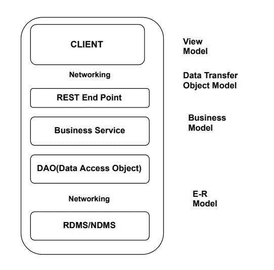
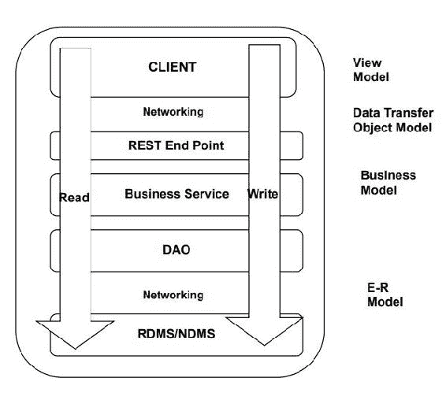
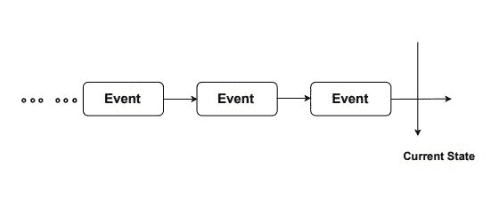
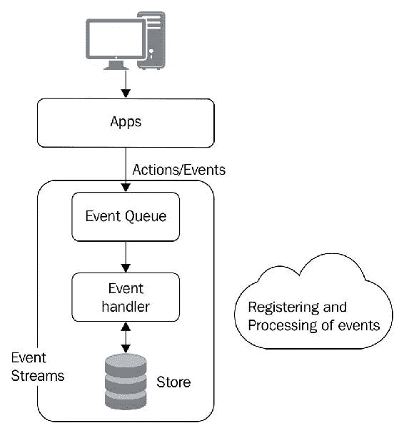
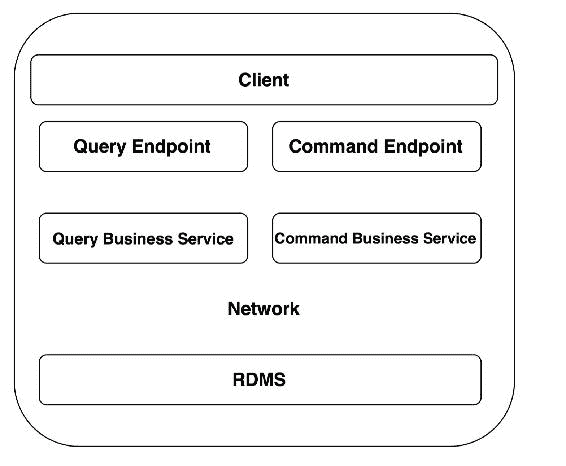
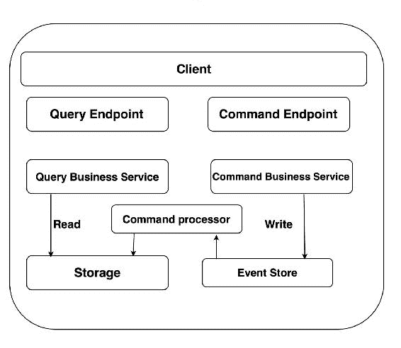
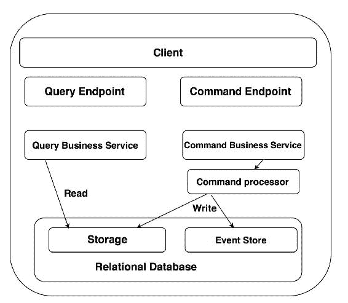
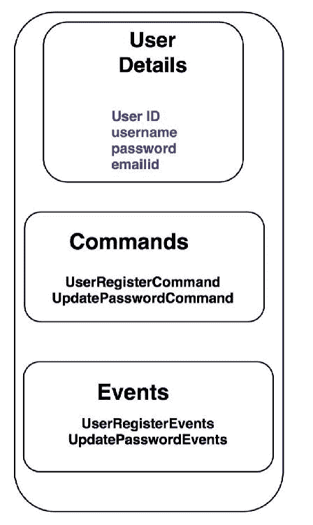
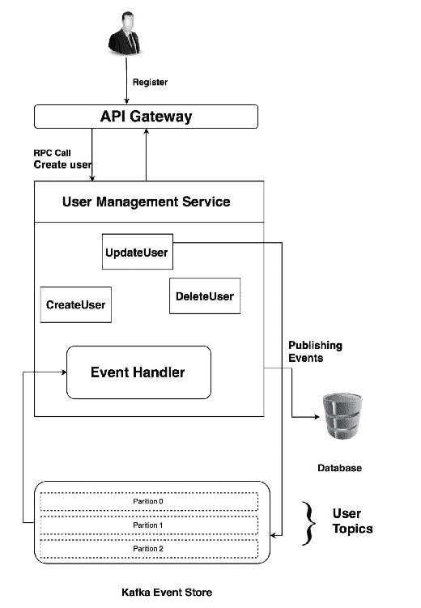

# 第七章：学习事件溯源和 CQRS

在上一章中，我们看了看当前业务模型的缺点，现在，在本章中，我们将看看事件溯源（ES）和命令查询责任分离（CQRS）如何有助于克服这些问题。

在本章中，我们将讨论一些处理大规模可扩展性的架构设计。我们还将研究事件溯源和 CQRS 这两种模式，这些模式都是为了解决如此大量请求的问题响应行为。

我们许多人认为遵守十二要素应用程序将使我们的应用程序成为具有更高可扩展性的云原生应用程序，但是还有其他策略，比如 ES 和 CQRS，可以使我们的应用程序更可靠。

由于云原生应用程序面向互联网，我们期望来自不同来源的成千上万甚至数百万的请求。实施基础架构架构来处理请求的扩展或缩小是不够的。您需要使您的应用程序支持如此巨大的扩展。这就是这些模式出现的时候。

本章将涵盖的主题如下：

+   事件溯源介绍

+   介绍命令查询责任分离

+   实现 ES 和 CQRS 的示例代码

+   使用 Apache Kafka 进行事件溯源

# 介绍

让我们从审查*n*层架构开始，其中我们有一些客户端、网络、业务模型、一些业务逻辑、一些数据存储等等。这是一个基本模型，您会发现它作为任何架构设计的一部分。它看起来像下面的图表：



正如您在这个架构中所看到的，我们有这些不同的模型在起作用：

+   视图模型：这基本上是为客户端交互而设计的

+   DTO 模型：这是客户端和 REST 端点之间的通信

+   业务模型：这是 DAO（数据访问对象）和业务服务的组合，解释用户请求，并与存储服务通信

+   E-R 模型：这定义了实体之间的关系（即 DTO 和 RDMS/NDMS）

现在您对架构有了一些了解，让我们了解其特点，如下所示：

+   应用程序的相同堆栈：在这个模型中，我们对所有读写操作使用相同的元素堆栈，从 REST API 到业务服务，然后访问存储服务等等，因为所有不同的组件代码都作为单个实体一起部署。

以下图表显示了通过不同模型的读/写操作流程：



+   相同的数据模型：在这种情况下，您会发现大多数情况下，我们用于业务逻辑处理或读写数据的数据模型相同或类似。

+   部署单元：我们使用粗粒度的部署单元，包括以下内容：

+   一个构建（一组可执行的组件）

+   文档（最终用户支持材料和发布说明）

+   安装工件，将读取和写入代码结合在一起

+   直接访问数据：如果我们想要更改数据，通常我们会继续。特别是在关系型数据库的情况下，我们直接更改数据，如下例--如果我们想要使用另一个数据集更新**用户 ID** **1**的行，我们通常会直接这样做。而且，一旦我们更新了这个值，旧值将从应用程序以及存储端无效，并且无法检索！[](img/00080.jpeg)

到目前为止，我们一直在使用前面的方法，并且我会说，就用户请求的响应而言，它在很大程度上是经过验证和成功的。然而，与之相比，还有其他替代方法可以表现得更好。

让我们讨论上述业务架构方法的缺点，如下所示：

+   **无法独立扩展**：由于我们的读写操作代码驻留在同一位置，我们无法独立扩展应用程序的读取或写入。假设在特定时间点，应用程序的读取占 90%，写入占 10%，我们无法独立扩展读取。为了扩展读取，我们需要扩展整个架构，这是没有用的，还会增加资源的浪费。

+   **没有数据历史**：由于我们处理的是直接更新数据的情况，一旦数据更新，应用程序将在一段时间后开始显示最新的数据集。此外，一旦数据集更新，旧的数据值就不会被跟踪，因此会丢失。即使我们想要实现这种功能，我们也需要编写大量的代码来启用它。

+   **单片式方法**：这种方法往往是一种单片式方法，因为我们试图将事物合并在一起。此外，我们有粗粒度的部署单元，并且我们试图将不同组件的代码放在一起。因此，这种方法最终会导致一团糟，很难解决。

解决这些挑战的一种方法是事件溯源。

# 理解事件溯源

简单来说，事件溯源是一种架构模式，它通过一系列事件来确定应用程序的状态。

理解事件溯源的最佳方法是使用类比。其中一个最好的例子就是**在线购物**，这是一个事件处理系统。有人下订单，订单被注册到供应商订购系统的订单队列中。然后，订单在不同阶段被通知给客户。

所有这些事件一个接一个地发生，形成了一个称为事件流的事件序列，应该看起来像以下图表所示：



因此，事件溯源考虑了过去发生的事件，并记录了基于某些交易进行处理。

理想的事件溯源系统是基于以下图表中显示的构建模块的：



前面的图表描述了一个理想的事件处理系统，从应用程序开始到创建与某个事件相关的**事件**，然后将它们放入**事件队列**进行进一步处理，由**事件处理程序**执行。根据**事件**的描述，**事件处理程序**相应地处理它们，并将它们注册到**存储**中。

事件溯源遵循某些法则/原则，这使得应用程序开发成为一个有结构和纪律的过程。大多数人通常觉得事件溯源很难，或者他们认为它是绝对的，因为这些原则不能被打破，否则会在应用程序中造成巨大的混乱。

# 事件溯源的法则

以下是一些事件溯源法则，需要在任何系统（即应用程序设计）中实施时保持：

+   **幂等性**：理想的事件溯源业务逻辑必须是幂等的。这意味着当您针对一系列数据执行业务逻辑时，应用程序的结果状态将始终保持不变。是的，无论您执行业务逻辑的次数如何，它的结果状态都将保持不变。

+   **隔离**：事件溯源不应依赖外部事件流。这是事件溯源的最重要原则之一。通常，业务逻辑很少在真空中执行。应用程序通常与外部实体进行交互以进行参考。此外，应用程序使用来自外部来源的缓存信息，即使开发人员没有考虑到这一点。现在，出现的问题是，如果您的业务逻辑使用外部输入来计算结果会发生什么？让我们以股票交易为例，股票价格不断变化，这意味着在状态计算时的股价在多次评估中不会相同，这违反了幂等规则。

根据开发人员的理解，这是一个非常难以满足的条件。然而，处理这个问题的解决方案是从外部事件向主事件流中注入通知。由于这些通知现在是主事件流的一部分，您将每次都得到预期的结果。

+   **质量保证**：一个经过完全开发的事件溯源应用程序应该是一个经过充分测试的应用程序。为事件溯源应用程序编写测试用例很容易--通常需要一系列输入并返回一些状态，考虑到您是按照先前定义的原则编写测试用例。

+   **可恢复性**：事件溯源应用程序应支持恢复和重放。如果您有一个符合十二要素应用程序所有指南的云原生应用程序，以创建适合云平台的应用程序，事件溯源在灾难恢复中发挥着重要作用。

假设事件流是持久的，事件溯源应用程序的初始优势是计算应用程序的状态。通常，在云环境中，由于多种原因可能导致应用程序崩溃；事件溯源可以帮助我们识别应用程序的最后状态，并快速恢复以减少停机时间。此外，事件溯源的重放功能使您能够在审计和故障排除时查看过去的状态。

+   **大数据**：事件溯源应用程序通常会生成大量数据。由于事件溯源应用程序跟踪每个事件，可能会生成大量数据。这取决于您有多少事件，它们多频繁到达，以及事件的数据负载有多大。

+   **一致性**：事件溯源应用程序通常会保持事件注册的一致性。想想银行交易--银行交易期间发生的每个事件都非常重要。应该注意，在记录时应保持一致性。

非常重要的是要理解这些事件是过去发生的事情，因为当我们命名这些事件时，它们应该是可以理解的。一些有效的事件名称示例可能如下：

+   `PackageDeliveredEvent`

+   `UserVerifiedEvent`

+   `PaymentVerifiedEvent`

无效的事件将被命名如下：

+   `CreateUserEvent`

+   `AddtoCartEvent`

以下是一个事件的示例代码：

```py
    class ExampleApplication(ApplicationWithPersistencePolicies): 
      def __init__(self, **kwargs): 
        super(ExampleApplication, self).__init__(**kwargs) 
       self.snapshot_strategy = None 
       if self.snapshot_event_store: 
           self.snapshot_strategy = EventSourcedStrategy( 
               event_store=self.snapshot_event_store, 
           ) 
       assert self.integer_sequenced_event_store is not None 
       self.example_repository = ExampleRepository( 
           event_store=self.integer_sequenced_event_store, 
           snapshot_strategy=self.snapshot_strategy, 
       ) 

```

有一些要注意的要点：

+   每个事件都是不可变的，这意味着一旦触发了事件，就无法撤销。

+   您永远不会删除事件。即使我们试图删除事件，我们也将删除视为一个事件。

+   事件流由消息代理架构驱动。一些消息代理包括 RabbitMQ、ActiveMQ 等。

现在，让我们讨论事件溯源的一些优点，如下所示：

+   事件溯源能够快速重建系统

+   事件溯源使您对数据具有控制权，这意味着我们需要的处理数据可以通过查看事件流轻松获取，比如审计、分析等

+   通过查看事件，很容易理解在一段时间内发生了什么错误，考虑到一组数据

+   事件重放在故障排除或错误修复期间会有优势

现在，问题出现了，由于我们生成了如此大量的事件，这是否会影响应用程序的性能？我会说，是的！

由于我们的应用程序为每个需要由事件处理程序处理的事务生成事件，因此应用程序的响应时间得到了缩短。解决这个问题的方法是 CQRS。

# CQRS 简介

命令查询职责分离是一个花哨的模式名称，意味着解耦系统的输入和输出。在 CQRS 中，我们主要讨论应用程序的读和写特性；因此，在 CQRS 的上下文中，命令主要是写操作，而查询是读操作，责任意味着我们分离了读和写操作。

如果我们看一下第一部分介绍中描述的架构，并应用 CQRS，那么架构将被分成两半，看起来会是这样的：



现在我们将看一些代码示例。

传统的接口模块会是这样的：

```py
    Class managementservice(interface): 
     Saveuser(userdata); 
    Updateuser(userid); 
    listuserbyusername(username); 
    listuserbyid(userid); 

```

分离，或者我更喜欢称之为 CQRS-化的接口，会是这样的：

```py
    Class managementcommandservice(interface): 
      Saveuser(userdata); 
    Updateuser(userid); 
    Class managementqueryservice(interface): 
    listuserbyusername(username); 
    listuserbyid(userid); 

```

因此，在实施 CQRS 和事件溯源后，整体架构会像下图所示的那样：



这是在实施事件溯源和 CQRS 后的完整架构。

在经典的单体应用中，您有写入数据库的端点和从中读取的端点。相同的数据库用于读取和写入操作，并且在从数据库接收到确认或提交之前，不会回复端点。

在大规模情况下，具有高入站事件吞吐量和复杂事件处理要求，您不能承受读取慢查询，也不能每次获得新的入站事件时等待处理。

读和写操作的流程如下：

+   **写模型**：在这种情况下，当从端点触发命令并在**命令业务服务**接收到时，首先为每个事件发出事件到**事件存储**。在**事件存储**中，您还有一个**命令处理器**，或者换句话说，事件处理程序，这个**命令处理器**能够将应用程序状态派生到一个单独的**存储**中，这可能是一个关系型存储。

+   **读模型**：在**读**模型的情况下，我们只需使用**查询端点**来查询客户端想要**读取**或检索的数据，以供应用程序使用。

最大的优势是我们不需要通过**写**模型（在前图的右侧）进行。在查询数据库时，这个过程使我们的查询执行更快，并减少了响应时间，从而提高了应用程序的性能。

# CQRS-化架构的优势

这种架构有以下优点：

+   **独立的可伸缩性和部署**：现在我们可以根据其使用情况扩展和部署单个组件。就像微服务的情况一样，我们现在可以为每个任务拥有单独的微服务，比如一个读微服务和一个写微服务，在这个架构堆栈中。

+   **技术选择**：在业务模型的不同部分选择技术的自由。例如，对于命令功能，我们可以选择 Scala 或类似的语言（假设我们有一个复杂的业务模型，并且有大量数据要写入）。在查询的情况下，我们可以选择，例如，ROR（Ruby on Rails）或 Python（我们已经在使用）。

这种类型的架构最适合于**DDD**（领域驱动设计）的有界上下文，因为我们可以为微服务定义业务上下文。

# 与 ES 和 CQRS 相关的挑战

每种架构设计模型在实施时都有自己的挑战。让我们讨论 ES 和 CQRS 的挑战：

+   **不一致性**：使用 ES 和 CQRS 开发的系统大多是一致的。然而，由于我们在**事件存储**中存储**命令业务服务**发出的事件，并且在主**存储**中也存储应用程序的状态，我会说这种系统并不完全一致。如果我们真的想使用 ES 和 CQRS 使我们的系统完全一致，我们需要将我们的**事件存储**和主**存储**放在一个单一的**关系数据库**上，我们的**命令处理器**应该处理所有我们的传入事件，并同时将它们存储在两个存储中，如下图所示：



我认为一致性水平应该由对业务领域的理解来定义。需要了解事件中需要多少一致性，以及这些一致性会带来多大的成本。在检查业务领域之后，您将能够考虑上述因素做出这些决定。

+   **验证**：当我们谈论验证客户注册表单时，这非常容易，我们需要验证各个字段等等。但实际的验证是在我们需要基于唯一性进行验证时--比如说我们有一个具有特定用户凭据（用户名/密码）的客户。因此，确保用户名是唯一的是一个关键的验证，当我们有超过 200 万需要注册的客户时。在验证方面需要问一些问题，如下所示：

+   验证的数据需求是什么？

+   从哪里检索验证数据？

+   验证的概率是多少？

+   验证失败对业务的影响是什么？

+   **并行数据更新**：这在数据一致性方面非常重要。比如说，您有一个用户想要在同一时间或在纳秒的差距内更新某些记录。在这种情况下，一致性和验证检查的可能性是具有挑战性的，因为有可能一个用户可能会覆盖另一个用户的信息，这可能会造成混乱。

# 克服挑战

在事件源中解决这样的问题的一种方法是在事件中添加版本，这将作为对数据进行更改的处理，并确保它得到充分验证的处理。

# 问题解决

让我们以以下图表中显示的用例为例，以了解在编写代码时如何理解事件源和 CQRS：



# 解释问题

在这种情况下，我们提供了**用户详细信息**，如**用户 ID**（应该是唯一的），**用户名**，**密码**，**电子邮件 ID**等等，我们需要创建两个要触发的写**命令**--**UserRegistrationCommand**和**UpdatePasswordCommand**，触发两个**事件**：**UserRegisterEvents**和**UpdatePasswordEvents**。这个想法是，一旦注册用户，就应该能够根据他们的需求重置密码。

# 解决方案

为了解决这个问题，我们需要编写与写命令相关的函数来接收输入并更新事件存储。

现在，让我们将以下代码添加到`commands.py`文件中，其中将包含需要执行的写命令相关的代码：

```py
   class userregister(object): 
     def __init__(self, user_id, user_name, password, emailid): 
       self.user_id = user_id 
       self.user_name = user_name 
       self.password = password 
       self.emailid = emaild 

   class updatepassword(object): 
     def __init__(self, user_id, new_password, original_version): 
       self.item_id = item_id 
       self.new_password = new__password 
       self.original_version = original_version 

```

因此，我们已经添加了与命令相关的函数，但它应该从某个地方调用用户详细信息。

让我们添加一个名为`main.py`的新文件，从这里将调用前面命令的函数。

在下面的代码中，我们通过触发事件来调用前面的代码：

```py
    from aggregate import Aggregate 
    from errors import InvalidOperationError 
    from events import * 

   class userdetails(Aggregate): 
     def __init__(self, id = None, name = '"", password = "", emailid =
     "" ): 
       Aggregate.__init__(self) 
       self._apply_changes(Userdetails(id, name, password, emailid)) 

   def userRegister(self, userdetails): 
       userdetails = {1, "robin99", "xxxxxx", "robinatkevin@gmail.com" 
   } 
       self._apply_changes(UserRegisterevent(userdetails)) 

   def updatePassword(self, count):        
      password = "" 
       self._apply_changes(UserPasswordEvent(password)) 

```

让我们逐个理解前面的代码：

```py
    def __init__(self, id = None, name = '"", password = "", emailid =
     "" ): 
       Aggregate.__init__(self) 
       self._apply_changes(Userdetails(id, name, password, emailid)) 

```

最后的代码初始化了`self`对象的一些默认值；这类似于任何编程语言中的初始化函数。

接下来，我们定义了`userRegister`函数，基本上收集`userdetails`，然后创建事件（`UserRegisterevent(userdetails))`）如下：

```py
    def userRegister(self, userdetails): 
       userdetails = {1, "robin99", "xxxxxx", "robinatkevin@gmail.com"
    } 
       self._apply_changes(UserRegisterevent(userdetails)) 

```

因此，一旦用户注册，他/她就有权更新配置文件详细信息，这可能是电子邮件 ID、密码、用户名等--在我们的情况下，是密码。请参考以下代码：

```py
     def updatePassword(self, count):        
      password = "" 
     self._apply_changes(UserPasswordEvent(password))

```

您可以编写类似的代码来更新电子邮件 ID、用户名或其他信息。

接下来，我们需要添加错误处理，因为在我们的`main.py`文件中，我们调用一个自定义模块`errors`来处理与操作相关的错误。让我们将以下代码添加到`errors.py`中以传递捕获的错误：

```py
    class InvalidOperationError(RuntimeError): 
     pass 

```

正如您在`main.py`中所看到的，我们调用`Aggregate`模块，您一定想知道为什么要使用它。`Aggregate`模块非常重要，因为它跟踪需要应用的更改。换句话说，它强制事件将其所有未注释的更改提交到事件存储。

为了做到这一点，让我们将以下代码添加到一个名为`aggregate.py`的新文件中：

```py
   class Aggregate(object): 
     def __init__(self): 
       self.uncommitted_changes = [] 

     @classmethod 
     def from_events(cls, events): 
       aggregate = cls() 
       for event in events: event.apply_changes(aggregate) 
       aggregate.uncommitted_changes = [] 
       return aggregate 

    def changes_committed(self): 
       self.uncommitted_changes = [] 

    def _apply_changes(self, event): 
       self.uncommitted_changes.append(event) 
       event.apply_changes(self) 

```

在`aggregate.py`中，我们初始化了`self`对象，该对象在`main.py`中被调用，然后跟踪被触发的事件。一段时间后，我们将调用`main.py`中的更改来更新`eventstore`的更新值和事件。

```py
events.py:
```

```py
   class UserRegisterEvent(object): 
    def apply_changes(self, userdetails): 
       id = userdetails.id 
       name = userdetails.name 
       password = userdetails.password 
       emailid = userdetails.emailid 

   class UserPasswordEvent(object): 
    def __init__(self, password): 
       self.password = password 

    def apply_changes(password): 
       user.password = password 

```

现在我们还剩下命令处理程序，这非常重要，因为它决定了需要执行的操作以及需要触发的相应事件。让我们添加名为`command_handler.py`的文件，并添加以下代码：

```py
    from commands import * 

    class UserCommandsHandler(object): 
     def __init__(self, user_repository): 
       self.user_repository = user_repository 

     def handle(self, command): 
       if command.__class__ == UserRegisterEvent: 
           self.user_repository.save(commands.userRegister(command.id, 
     command.name, command.password, command.emailid)) 
       if command.__class__ == UpdatePasswordEvent: 
           with self._user_(command.password, command.original_version)
      as item: 
               user.update(command.password) 
   @contextmanager 
     def _user(self, id, user_version): 
       user = self.user_repository.find_by_id(id) 
       yield user 
       self.user.save(password, user_version) 

```

在`command_handler.py`中，我们编写了一个处理函数，它将决定事件执行流程。

正如您所看到的，我们调用了`@contextmanager`模块，在这里非常重要。

让我们来看一个场景：假设有两个人，Bob 和 Alice，两者都使用相同的用户凭据。假设他们都试图同时更新配置文件详细信息字段，例如密码。现在，我们需要了解这些命令是如何请求的。简而言之，谁的请求会先到达事件存储。此外，如果两个用户都更新密码，那么很可能一个用户的更新密码将被另一个用户覆盖。

解决问题的一种方法是在用户模式中使用版本，就像我们在上下文管理器中使用的那样。我们将`user_version`作为参数，它将确定用户数据的状态，一旦修改，我们可以增加版本以使数据一致。

因此，在我们的情况下，如果 Bob 的修改值首先更新（当然，使用新版本），如果 Alice 的请求版本字段与数据库中的版本不匹配，则 Alice 的更新请求将被拒绝。

一旦更新完成，我们应该能够注册和更新密码。虽然这只是一个示例，展示了如何实现 CQRS，但您可以扩展它以在其上创建微服务。

# Kafka 作为事件存储

尽管我们已经看到了 CQRS 的实现，但我仍然觉得您可能对`eventstore`及其工作方式有一些疑问。这就是为什么我将采用 Kafka 的用例，它可以用作应用程序的`eventstore`。

Kafka 通常是一个消息代理或消息队列（类似于 RabbitMQ、JMS 等）。

根据 Kafka 文档，事件溯源是一种应用设计风格，其中状态更改被记录为时间顺序的记录序列。Kafka 对非常大的存储日志数据的支持使其成为构建此风格的应用程序的优秀后端。

有关实施 Kafka 的更多信息，请阅读此链接上的文档：[`kafka.apache.org/documentation/`](https://kafka.apache.org/documentation/)。

Kafka 具有以下基本组件：

+   **生产者**：将消息发送到 Kafka

+   **消费者**：这些订阅 Kafka 中的消息流

Kafka 的工作方式如下：

+   生产者在 Kafka 主题中写入消息，这些消息可能是用户

+   在 Kafka 主题中的每条消息都会被追加到分区的末尾

Kafka 只支持**写**操作。

+   分区代表事件流，主题可以被分类为多个主题

+   主题中的分区彼此独立。

+   为了避免灾难，Kafka 分区会被复制到多台机器上

+   为了消费 Kafka 消息，客户端按顺序读取消息，从在 Kafka 中由消费者设置的偏移开始

# 使用 Kafka 应用事件溯源

让我们来看一个使用案例，客户端尝试执行某个操作，我们使用 Kafka 作为事件存储来捕获所有传递的消息。在这种情况下，我们有用户管理服务，它可能是负责管理所有用户请求的微服务。我们将从基于用户事件的 Kafka 主题开始识别主题，可能是以下之一：

+   `UserCreatedEvent`

+   `UserUpdatedEvent`

+   `UserDeletionEvent`

+   `UserLoggedinEvent`

+   `UserRoleUpdatedEvent`

这些事件理想情况下将由**用户管理服务**发布，并且所有微服务都将消费这些事件。以下图表显示了用户请求流程：



# 工作原理

用户向 API 网关发出`POST`请求，这是用户管理服务注册用户的入口点。API 网关反过来调用管理服务中的`createUser`方法。`createUser`端点对用户输入进行一系列验证。如果输入无效，它将抛出异常，并将错误返回给 API 网关。一旦用户输入被验证，用户将被注册，并且将触发`UserCreatedEvent`以在 Kafka 中发布。在 Kafka 中，分区捕获事件。在我们的示例中，用户主题有三个分区，因此事件将根据一些定义的逻辑发布到三个分区中的一个；这个逻辑由我们定义，根据用例的不同而变化。

所有读取操作，比如列出用户等，都可以直接从 readStore（如 PostgreSQL 等数据库）中检索出来。

# 总结

这是一个复杂的章节，但如果你完全理解了它，它将使你的应用程序高效且性能卓越。

我们首先了解了经典架构的缺点，然后讨论了 ES 和 CQRS 的概念和实现。我们还看了一个示例问题的实现。我们谈到了为什么这些模式有用，以及它们如何与大规模、云原生应用程序特别协调。

在接下来的章节中，我们将深入探讨应用程序的安全性。敬请关注！
