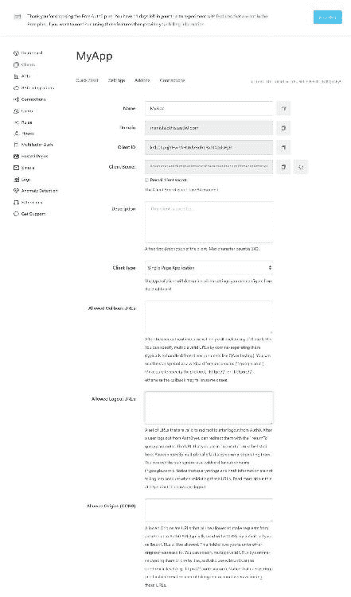

# 第八章：保护网络应用程序

在本章中，我们将主要讨论如何保护您的应用程序免受可能导致数据丢失的外部威胁，从而影响整体业务。

网络应用程序安全始终是任何业务单位关注的问题。因此，我们不仅关注传统的应用程序逻辑和与数据相关的安全问题，还关注协议和平台方面的问题。开发人员变得更加负责，确保遵守有关网络应用程序安全的最佳实践。

记住这一点，本书旨在面向应用程序开发人员、系统管理员以及希望保持其应用程序安全的 DevOps 专业人员，无论是在应用程序级别还是平台上。

本章将涵盖以下主题：

+   网络安全与应用程序安全

+   使用不同方法实施应用程序授权，如 OAuth、客户端认证等

+   开发安全启用的网络应用程序的要点

# 网络安全与应用程序安全

在当今的情况下，网络应用程序安全取决于两个主要方面--网络应用程序本身和其部署的平台。您可以将这两个方面分开，因为任何网络应用程序都无法在没有平台的情况下部署。

# 网络应用程序堆栈

理解平台和应用程序之间的区别非常重要，因为它对安全性有影响。典型的网络应用程序的架构类似于以下图表所示：


大多数网络应用程序依赖于诸如 Apache/HTTP 服务器、Rails、nginx 等的网络服务器，这些服务器实际上根据应用程序的类型处理传入的请求。这些网络服务器跟踪传入的流量；它们还验证请求并相应地做出响应，考虑到所有用户认证都经过验证。在我们的情况下，Flask 充当我们应用程序的网络服务器。

# 应用程序 - 平台中的安全替代方案

如前所述，每个网络应用程序在暴露给外部世界之前都需要部署在某种平台上。应用程序平台提供了应用程序所需的协议支持，用于在网络上进行通信。TCP 和在很大程度上 HTTP 都是在应用程序级别处理的。

在软件架构的网络堆栈中，有两个不同的层，包括容易受到网络应用程序攻击的协议，即应用程序平台。这些层如下：

+   传输

+   应用程序

让我们详细了解这些层。

# 传输协议

在**开放系统互连**模型（**OSI**模型）中，传输层通常被称为第 4 层。网络应用程序使用 TCP 协议作为其传输协议，因为它们具有可靠性。

在**TCP**（传输控制协议）中，每个数据包都受到严密监控，并且具有内置的错误恢复机制，这在通信失败的情况下非常有用。这些机制被利用来攻击网络应用程序。

最常见的攻击是**SYN 洪水**攻击，这是一种 TCP 请求确认攻击。SYN 洪水攻击通过使用空闲会话与应用程序服务器建立连接，并不断请求直到服务器耗尽资源，无法再处理更多请求。

为了避免此类攻击，系统管理员（开发人员在这里没有控制权）应设置与超时和空闲行为相关的配置，考虑对客户的影响。这类攻击的另一个例子是**Smurf 攻击**（请参考此链接了解更多详情：[`en.wikipedia.org/wiki/Smurf_attack`](https://en.wikipedia.org/wiki/Smurf_attack)）。

**安全传输协议**

在 OSI 网络模型中，我们还有一些第 5 层的协议，可以使您的网络更安全可靠--SSL/TLS。然而，这一层也存在一些漏洞（例如，SSL 中的 Heartbleed，2014 年，以及 TLS 中的中间人重协议攻击，2009 年）。

# 应用程序协议

在 OSI 网络模型的第 7 层（最顶层），实际的应用程序驻留并使用 HTTP 协议进行通信，这也是大多数应用程序攻击发生的地方。

**HTTP**（超文本传输协议）主要有这两个组件：

+   **元数据**：HTTP 头包含元数据，对于应用程序和平台都很重要。一些头的例子包括 cookies、content-type、status、connection 等。

+   **行为**：这定义了客户端和服务器之间的行为。有一个明确定义的消息如何在 HTTP 客户端（如浏览器）和服务器之间交换的流程。

这里的主要问题是，一个应用程序通常没有内置的能力来识别可疑行为。

例如，客户端通过网络访问 Web 应用程序，可能会受到基于消耗的拒绝服务（DoS）攻击。在这种攻击中，客户端故意以比正常速度慢的速率接收数据，以尝试保持连接时间更长。由于这个原因，Web 服务器的队列开始填充，并消耗更多资源。如果所有资源都用于足够的开放连接，服务器可能会变得无响应。

# 应用程序-应用程序逻辑中的安全威胁

在本节中，我们将研究不同的方法来验证用户，并确保我们的应用程序只能被真实实体访问。

# Web 应用程序安全替代方案

为了保护我们的应用程序免受外部威胁，这里描述了一些替代方法。通常，我们的应用程序没有任何智能来识别可疑活动。因此，以下是一些重要的安全措施描述：

+   基于 HTTP 的身份验证

+   OAuth/OpenID

+   Windows 身份验证

**基于 HTTP 的身份验证**

客户端对用户名和密码进行哈希处理，并发送到 Web 服务器，就像我们为我们的 Web 应用程序设置的那样，如下面的屏幕截图所示：


上述的屏幕截图是我们在第六章中创建的 UI，*使用 Flux 创建可扩展的 UI*。它由后端服务（微服务）和用户数据库进行身份验证，用户数据库存储在 MongoDB 数据库服务器中。此外，在验证用户登录到主页时，用户数据从 MongoDB 集合中读取，然后对用户进行身份验证以进一步进入应用程序。以下是调用的 API 的代码片段：

```py
    @app.route('/login', methods=['POST']) 
    def do_admin_login(): 
     users = mongo.db.users 
     api_list=[] 
     login_user = users.find({'username': request.form['username']}) 
     for i in login_user: 
       api_list.append(i) 
      print (api_list) 
      if api_list != []: 
        #print (api_list[0]['password'].decode('utf-8'),
         bcrypt.hashpw(request.form['password'].encode('utf-8'),
         api_list[0]['password']).decode('utf-8')) 
       if api_list[0]['password'].decode('utf-8') == 
         bcrypt.hashpw(request.form['password'].encode('utf-8'),
         api_list[0]['password']).decode('utf-8'): 
           session['logged_in'] = api_list[0]['username'] 
           return redirect(url_for('index')) 
           return 'Invalide username/password!' 
       else: 
         flash("Invalid Authentication") 

      return 'Invalid User!' 

```

这是在应用程序级别设置安全性的一种方式，以便应用程序数据可以得到保护。

**OAuth/OpenID**

OAuth 是授权的开放标准，在允许用户使用第三方凭据进行身份验证的网站中非常常见，通常是电子邮件 ID。

以下是使 OAuth 比其他安全措施更好的一些关键特性：

+   它与任何操作系统或安装无关

+   它简单易用

+   它更可靠并提供高性能

+   它专门为需要集中身份验证方法的分布式系统设计

+   这是一个免费使用的基于开源的身份提供者服务器软件

+   它支持基于云的身份提供者，如 Google、Auth0、LinkedIn 等

+   它也被称为 SSO（单一登录或基于令牌的身份验证）

**设置管理员帐户**

OAuth 没有服务来授予**JWT**（**JSON Web Token**，一种用于在各方之间传输声明的 URL 安全 JSON 格式）。您可以在[`jwt.io/introduction/`](https://jwt.io/introduction/)了解更多关于 JWT 的信息。

身份提供者负责为依赖第三方授权的 Web 应用程序对用户进行身份验证。

您可以根据自己的喜好选择任何身份提供者，因为它们之间的功能是相似的，但在功能方面会有所不同。在本章中，我将向您展示如何使用 Google Web 应用程序（这是来自 Google 的开发者 API）和 Auth0 第三方应用程序进行身份验证。

**使用 Auth0 帐户设置**

在这个部分，我们将在 Google 开发者工具中设置一个用于身份验证的帐户，并在一个名为**Auth0**（[auth0.com](http://auth0.com)）的第三方免费应用程序中设置。

让我们在 Auth0（[auth0.com](http://auth0.com)）中启动帐户设置，唯一的要求是需要一个电子邮件 ID 进行注册或注册。请参考以下截图：


一旦您注册/注册了 Auth0 帐户，您将看到以下屏幕：


前面的屏幕是仪表板，我们可以在其中看到用户登录到应用程序的登录活动。它还展示了用户的登录尝试，并记录了用户的活动。简而言之，仪表板可以让您了解应用程序的用户活动。

现在我们需要为我们的应用程序添加一个新的客户端，所以点击“+NEW CLIENT”按钮进行创建。一旦您点击“+NEW CLIENT”按钮，将会出现以下屏幕：


前面的截图是自解释的--您需要为客户端提供一个用户定义的名称（通常名称应与应用程序相关）。此外，您需要选择应用程序的类别。回到我们的案例，我已经给出了名称`My App`，并选择了第二个选项，即单页 Web 应用程序，因为我们正在使用其中提到的技术。或者，您也可以选择常规 Web 应用程序--它也可以正常工作。这些类别用于区分我们正在编写的应用程序的种类，因为很可能我们可能在一个帐户下开发数百个应用程序。

单击“CREATE”按钮以继续创建客户端。创建完成后，您将看到以下屏幕：



在前面截图中看到的部分中，有许多自动生成的设置，我们需要将它们与我们的 Web 应用程序集成。以下是其中一些部分的定义：

+   **客户端 ID**：这是分配给特定应用程序的唯一 ID

+   **域**：这类似于身份验证服务器，在应用程序登录时将被调用

+   **客户端密钥**：这是一个秘密密钥，应该保密，不要与任何人分享，因为这可能会导致安全漏洞

+   **客户端类型**：这定义了应用程序的类型

+   **允许的回调 URL**：这指定了用户身份验证后允许的回调 URL，例如`http://localhost:5000/callback`

+   **允许的注销 URL**：这定义了在用户注销时允许访问的 URL，例如`http://localhost:5000/logout`

+   **令牌端点身份验证方法**：这定义了身份验证的方法，可以是无、或者 post、或者基本

Auth0 帐户的其他功能可能对管理您的应用程序有用，如下所示：

+   **SSO 集成**：在这个部分，你可以设置与 Slack、Salesforce、Zoom 等其他第三方应用程序的 SSO 登录！[](img/00094.jpeg)

+   **连接**：这定义了你想为你的应用定义的认证类型，比如数据库（用户名-密码数据库）、社交（与社交媒体网站如谷歌、LinkedIn 等现有账户集成）、企业（用于企业应用如 AD、谷歌应用等）、或者无密码（通过短信、电子邮件等）。默认情况下，用户名-密码认证是启用的。

+   **APIs**：在这个部分，你可以管理你的应用的**Auth0 管理 API**，并进行测试，如下截图所示：

+   **日志**：这个部分跟踪你在 Auth0 账户上的活动，对于调试和在威胁时识别可疑活动非常有用。参考以下截图以了解更多关于日志的信息：

这些是 Auth0 账户的最重要功能，可以帮助你以高效的方式管理你的 Web 应用程序安全。

现在，我们的 Auth0 管理员账户已经设置好，准备与我们的 Web 应用集成。

**设置谷歌 API 账户**

谷歌 API 使用 OAuth 2.0 协议进行认证和授权。谷歌支持常见的 OAuth 2.0 场景，比如用于 Web 服务器、安装和客户端应用程序的场景。

首先，使用你的谷歌账户登录到谷歌 API 控制台（[`console.developers.google.com`](https://console.developers.google.com)）以获取 OAuth 客户端凭据，比如客户端 ID、客户端密钥等。你将需要这些凭据来与你的应用集成。一旦你登录，你将看到以下屏幕：


前面的屏幕展示了谷歌库 API 为其不同的谷歌产品提供的服务。现在，点击左侧面板中的凭据，导航到下一个屏幕，如下截图所示：


现在，点击创建凭据，然后点击 OAuth 客户端 ID 选项，以启动从 API 管理器生成客户端凭据。


现在我们需要提供一些关于我们应用的信息；你必须记住这些细节，这些是我们在 OAuth 账户创建时提供的。一旦准备好，并填写了必填字段，点击创建以生成凭据。

一旦客户端 ID 创建完成，你将看到以下屏幕，其中包含与客户端 ID 相关的信息（凭据）：


记住，绝对不要与任何人分享客户端 ID 的详细信息。如果你这样做了，立即重置。现在我们的谷歌 API 账户已经准备好与我们的 Web 应用集成了。

**将 Web 应用与 Auth0 账户集成**

为了将 Auth0 账户与我们的应用集成，我们需要为我们的回调创建一个新的路由。这个路由将在用户从 Auth0 账户进行认证后设置会话。因此，让我们将以下代码添加到`app.py`文件中：

```py
    @app.route('/callback') 
    def callback_handling(): 
      code = request.args.get('code') 
      get_token = GetToken('manishsethis.auth0.com') 
      auth0_users = Users('manishsethis.auth0.com') 
      token = get_token.authorization_code(os.environ['CLIENT_ID'], 
                                        os.environ['CLIENT_SECRET'],
      code, 'http://localhost:5000/callback') 
      user_info = auth0_users.userinfo(token['access_token']) 
      session['profile'] = json.loads(user_info) 
    return redirect('/dashboard') 

```

正如你在前面的代码中看到的，我使用了我们从 Auth0 账户控制台获取的客户端凭据。这些是我们在客户端创建时生成的凭据。

现在让我们添加路由/仪表板，用户在认证后被重定向到该路由：

```py
    @app.route("/dashboard") 
    def dashboard(): 
      return render_template('index.html', user=session['profile']) 

```

前面的路由简单地调用`index.html`，并将会话详细信息作为参数传递给`index.html`。

现在我们需要修改我们的`index.html`来通过 Auth0 触发身份验证。有两种触发方式。第一种是将 Auth0 域作为登陆页面，这意味着一旦他们访问 URL（[`http://localhost:5000`](http://localhost:5000)），用户将被重定向到 Auth0 账户的登陆页面。另一种方式是通过提供一个按钮来手动触发。

在本章的范围内，我们将使用手动触发，其中 Auth0 账户可以作为登录应用程序的替代方式。

让我们在`login.html`中添加以下代码。此代码将在登录页面上显示一个按钮，如果您点击该按钮，它将触发 Auth0 用户注册页面：

```py
   <center><button onclick="lock.show();">Login using Auth0</button>
     </center> 
   <script src="img/lock.min.js"> 
     </script> 
   <script> 
    var lock = new Auth0Lock(os.environ['CLIENT_ID'],
     'manishsethis.auth0.com', { 
      auth: { 
       redirectUrl: 'http://localhost:5000/callback', 
       responseType: 'code', 
       params: { 
         scope: 'openid email' // Learn about scopes:
         https://auth0.com/docs/scopes 
        } 
       } 
     }); 
   </script> 

```

在我们测试应用程序之前，我们还需要处理一件事情--如何使我们的应用程序了解会话详细信息。

由于我们的`index.html`获取会话值并在我们的主页上展示它们，因此它用于管理用户的推文。

因此，请按照以下方式更新`index.html`的 body 标签：

```py
     <h1></h1> 
     <div align="right"> Welcome {{ user['given_name'] }}</div> 
     <br> 
     <div id="react"></div> 

```

之前的代码需要在用户界面上显示用户的全名。接下来，您需要按照以下方式更新`localStorage`会话详细信息：

```py
    <script> 
      // Check browser support 
      if (typeof(Storage) !== "undefined") { 
     // Store 
      localStorage.setItem("sessionid","{{ user['emailid'] }}" ); 
     // Retrieve 
      document.getElementById("react").innerHTML =  
      localStorage.getItem("sessionid"); 
      } else { 
        document.getElementById("react").innerHTML = "Sorry, your 
        browser does not support Web Storage..."; 
      } 
    </script> 

```

我们现在几乎完成了。我希望您记得，当您在我们的微服务 API 中为特定用户发布推文时，我们已经设置了身份验证检查。我们需要删除这些检查，因为在这种情况下，我们使用 Auth0 进行身份验证。

太棒了！运行您的应用程序，并查看是否可以在[`http://localhost:5000/`](http://localhost:5000/)看到以下屏幕：


接下来，点击“使用 Auth0 登录”按钮，以获取 Auth0 登录/注册面板，如下图所示。

提供所需的详细信息，然后点击立即注册，它将在 Auth0 帐户中注册。请记住，在这种情况下，您不会看到任何通过电子邮件直接登录的方式，因为我们使用用户名密码进行身份验证。如果您想直接通过电子邮件注册，那么您需要在社交连接部分启用 google-OAuth2 方式扩展。一旦您启用它，您将能够看到您的注册页面如下：


一旦您成功注册，您将被重定向到主页，在那里您可以发布推文。如果您看到以下屏幕，那就意味着它起作用了：


在这里需要注意的一件重要的事情是，对于每个注册，都会在您的 Auth0 帐户中创建一个用户详细信息，如下图所示：


太棒了！现在您的应用程序已与 Auth0 帐户集成，您可以跟踪使用您的应用程序的用户。

**将您的 Google API 与 Web 应用程序集成**

将您的 Google API 与您的 Web 应用程序集成与我们在 Auth0 集成中看到的非常相似。您需要按照接下来列出的步骤进行 Google API 的集成：

1.  **收集 OAuth 凭据**：如在 Google API 客户端设置中讨论的那样，我们已经生成了客户端凭据。我们需要捕获诸如客户端 ID、客户端密钥等详细信息。

1.  **从 Google 授权服务器获取访问令牌**：在您的应用程序用户可以登录并访问私人数据之前，它需要生成由 Google 提供的身份验证令牌，该令牌充当用户的验证器。单个访问令牌可以授予对多个 API 的不同程度的访问权限。范围参数包含有关用户将具有访问权限的程度的信息，即用户可以从哪些 API 中查看数据。令牌的请求取决于您的应用程序的开发方式。

1.  **将令牌保存到 API**：一旦应用程序接收到令牌，它会将该令牌发送到 Google API HTTP 授权标头。如前所述，该令牌被授权执行基于范围参数定义的一定范围 API 上的操作。

1.  **刷新令牌**：定期刷新令牌是最佳实践，以避免任何安全漏洞。

1.  **令牌过期**：定期检查令牌过期是一个好习惯，这使得应用程序更加安全；这是强烈推荐的。

由于我们正在开发基于 Python 的应用程序，您可以按照以下链接的文档 URL，了解有关在以下链接实现 Google-API 令牌身份验证的信息：

[`developers.google.com/api-client-library/python/guide/aaa_oauth`](https://developers.google.com/api-client-library/python/guide/aaa_oauth)。

一旦用户经过身份验证并开始使用应用程序，您可以在 API 管理器（[`console.developers.google.com/apis/`](https://console.developers.google.com/apis/)）上监视用户登录活动，如下所示：


使用谷歌进行身份验证设置略微困难，并需要监督。这就是为什么开发人员选择使用像 Auth0 这样的工具，它可以直接与谷歌集成。

**Windows 身份验证**

历史上，即使应用程序部署在内部或私有云上，也更倾向于用于局域网和企业网站。然而，出于许多原因，这并不适合云原生安全选项。

有关 Windows 身份验证的更多信息，请访问链接[`en.wikipedia.org/wiki/Integrated_Windows_Authentication`](https://en.wikipedia.org/wiki/Integrated_Windows_Authentication)。我们已展示了这些安全方法供您了解，但我们的身份验证方法保持不变。

# 开发安全启用的 Web 应用程序

随着**万维网**（**WWW**）上 Web 应用程序的增加，对应用程序安全性的担忧也在增加。现在，我们心中首先出现的问题是为什么我们需要安全启用的应用程序--这个问题的答案是相当明显的。但它的基本原则是什么？以下是我们应该牢记的原则：

+   如果黑客熟悉应用程序创建时使用的语言，他可以轻易利用您的应用程序。这就是为什么我们启用诸如 CORS 之类的技术来保护我们的代码。

+   应该只授予组织中非常有限的人员对应用程序及其数据的访问权限。

+   身份验证和授权是一种保护您的应用程序免受互联网和私人网络威胁的方式。

所有这些因素，或者我应该说，原则，都驱使我们创建安全启用的应用程序。

# 摘要

在本章中，我们首先定义了不同应用程序堆栈上的安全性，以及根据您的偏好和应用程序要求如何实施或集成不同的应用程序安全措施。

到目前为止，我们已经讨论了应用程序构建。但是从现在开始，我们将完全专注于使用 DevOps 工具将我们的应用程序从开发阶段移至生产阶段的平台构建。因此，事情将变得更加有趣。敬请关注后续章节。
