# 第九章：持续交付

在之前的章节中，我们努力构建我们的应用程序，并为云环境做好准备。由于我们的应用程序现在稳定了，准备好进行首次发布，我们需要开始考虑平台（即云平台）以及可以帮助我们将应用程序移至生产环境的工具。

本章讨论以下主题：

+   介绍持续集成和持续交付

+   了解 Jenkins 的持续集成

# 持续集成和持续交付的演变

现在，很多人都在谈论**CI**（持续集成）和**CD**（持续交付），经过审查不同技术人员的观点，我相信每个人对 CI 和 CD 都有不同的理解，对它们仍然存在一些困惑。让我们深入了解并理解它们。

为了理解持续集成，你需要先了解**SDLC**（系统开发生命周期）和**敏捷软件开发**过程的背景，这可以帮助你在构建和发布过程中。

# 了解 SDLC

SDLC 是规划、开发、测试和部署软件的过程。这个过程包括一系列阶段，每个阶段都需要前一个阶段的结果来继续。以下图表描述了 SDLC：

！[](img/00106.jpeg)

让我们详细了解每个阶段：

+   **需求分析**：这是问题分析的初始阶段，业务分析师进行需求分析，并了解业务需求。需求可以是组织内部的，也可以是来自客户的外部的。需求包括问题的范围，可以是改进系统或构建新系统，成本分析和项目目标。

+   **设计**：在这个阶段，准备和批准软件解决方案特性的设计。这包括流程图、文档、布局等。

+   **实施**：在这个阶段，根据设计进行实际实施。通常，开发人员根据设计阶段定义的目标开发代码。

+   **测试**：在这个阶段，开发的代码由**QA**（质量保证）团队在不同的场景下进行测试。每个模块都使用单元测试和集成测试进行测试。如果测试失败，开发人员会被告知 bug，然后需要修复。

+   **部署**/**发布**：在这个阶段，经过测试的功能被移至生产环境供客户审查。

+   **演进**：这个阶段得到客户对开发、测试和发布的升级的审查。

# 敏捷软件开发过程

敏捷软件开发过程是传统软件开发的替代方案。它更像是一个帮助频繁和高效地发布生产版本的过程，而且 bug 很少。

敏捷过程基于以下原则：

+   软件升级和客户反馈的持续交付每个阶段

+   在开发周期的任何阶段都欢迎额外的改进

+   稳定版本应该频繁发布（每周）

+   业务团队和开发人员之间的持续沟通

+   持续改进朝着技术卓越和良好设计

+   工作软件是进展的主要衡量标准

+   持续适应不断变化的情况

# 敏捷软件开发过程是如何工作的？

在敏捷软件开发过程中，完整系统被划分为不同阶段，所有模块或功能都在迭代中交付，来自不同领域的跨职能团队（如规划、单元测试、设计、需求分析、编码等）同时工作。因此，每个团队成员都参与了这个过程，没有一个人闲着，而在传统的 SDLC 中，当软件处于开发阶段时，其余团队要么闲置，要么被低效利用。所有这些使得敏捷过程比传统模式更有优势。以下图表显示了敏捷开发过程的工作流程信息：

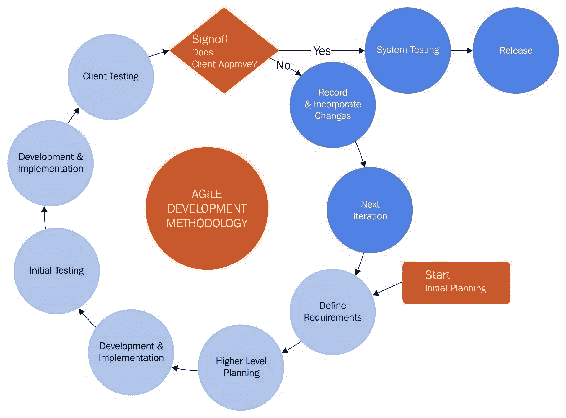

在上图中，您不会找到需求分析或设计阶段，因为这些都在高级规划中累积。

以下是敏捷过程中的事件顺序：

1.  我们从初始规划开始，这为我们提供了关于软件功能的详细信息，然后在高级规划中定义了目标。

1.  一旦目标确定，开发人员就开始为所需功能编写代码。一旦软件升级准备就绪，测试团队（QA）就开始执行单元测试和集成测试。

1.  如果发现任何错误，立即修复，然后将代码交付给客户测试（即在阶段或预生产环境）。在这个阶段，代码尚未发布。

1.  如果代码通过了所有基于客户的测试，这可能是基于 UI 的测试，那么代码就会推送到生产环境；否则，它会再次迭代相同的周期。

现在我们已经了解了敏捷工作流程，让我们了解其优势，这些优势如下所列：

+   在敏捷开发中，每个功能都可以频繁快速地开发和演示。这里的想法是在部署之前一周左右开发没有错误的功能。这确保了客户对额外功能的满意。

+   没有专门的开发、测试或其他团队。有一个团队，由 8-10 名成员组成（根据需求），每个成员都能够做任何事情。

+   敏捷推动团队合作。

+   它需要最少的文档。

+   敏捷最适合并行功能开发。

看到了前面的优势，现在公司已经开始在他们的软件开发中采用敏捷 SDLC。

到目前为止，我们一直在研究作为软件开发一部分采用的方法。现在让我们来看看敏捷过程的一个非常关键的方面，即持续集成，这使得我们的开发工作更加轻松。

# 持续集成

持续集成是将代码合并到主干代码库的过程。简而言之，持续集成帮助开发人员在开发和生成测试结果时通过创建频繁的构建来测试他们的新代码，并且如果一切正常，然后将代码合并到主干代码。

通过以下图表可以理解这一点，它描述了 SDLC 期间出现的问题：

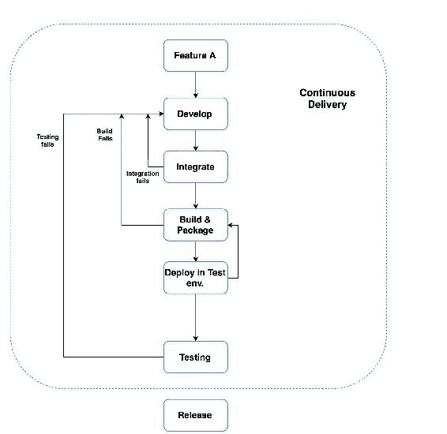

基本上，持续集成期间会出现以下类型的问题：

+   集成前构建失败

+   集成失败

+   构建失败（集成后）

为了解决这些问题，开发人员需要修改代码以修复它，并且整个集成过程会重复，直到功能成功部署。

# Jenkins - 一个持续集成工具

Jenkins 是一个开源工具，用于执行持续集成和构建自动化。它与其他任何持续集成工具（如 Bamboo（CirclCI））具有相同的目的，即在开发阶段尽早测试代码。

在 Jenkins 中，您定义了一组指令，用于在不同的应用环境（开发、预生产阶段等）部署您的应用程序。

在继续设置 Jenkins 作业（基本上是项目）并了解 Jenkins 插件之前，让我们首先根据我们的要求设置 Jenkins 并进行配置。

# 安装 Jenkins

在任何环境中，无论是 Linux（Debian，Red Hat 等），Windows 还是 macOS，Jenkins 的安装都很简单。

# 先决条件

确保您的 Ubuntu 系统上已安装 Java 8。如果尚未安装，可以按照以下链接中给出的说明进行操作：

[`medium.com/appliedcode/how-to-install-java-8-jdk-8u45-on-ubuntu-linuxmint-via-ppa-1115d64ae325`](https://medium.com/appliedcode/how-to-install-java-8-jdk-8u45-on-ubuntu-linuxmint-via-ppa-1115d64ae325).

# 在基于 Debian（Ubuntu）的系统上安装

按照下面列出的步骤在基于 Debian 的系统上安装 Jenkins：

1.  我们通过执行以下命令将 Jenkins 密钥添加到 APT 软件包列表来开始 Jenkins 安装：

```py
 $ wget -q -O - https://pkg.jenkins.io/debian/jenkins-ci.org.key | sudo apt-key add -

```

1.  接下来，更新源文件，需要与之通信以验证密钥的服务器，如下所示：

```py
      $ sudo sh -c 'echo deb http://pkg.jenkins.io/debian-stable binary/ > /etc/apt/sources.list.d/jenkins.list'

```

1.  更新源列表文件后，通过在终端执行以下命令来更新 APT 存储库：

```py
      $ sudo apt-get update -y

```

1.  现在我们准备在 Ubuntu 上安装 Jenkins；使用以下命令来执行：

```py
      $ sudo apt-get install jenkins  -y 

```

1.  现在安装完成后，请记住 Jenkins 默认运行在端口`8080`上。但是，如果您想在不同的端口上运行它，那么您需要更新 Jenkins 配置文件（`/etc/default/jenkins`）中的以下行：

```py
      HTTP_PORT=8080

```

1.  接下来，使用此 URL 检查 Jenkins GUI：

+   如果安装在本地，则转到[`http://localhost:8080/`](http://localhost:8080/)

+   如果安装在远程机器上，请转到[`http://ip-address:8080`](http://ip-address:8080)

请记住，在这种情况下，我们安装了 Jenkins 版本（2.61）；之前和即将到来的步骤对于 Jenkins 版本 2.x.x 也是有效的。

如果您看到以下屏幕，这意味着您的安装成功了：

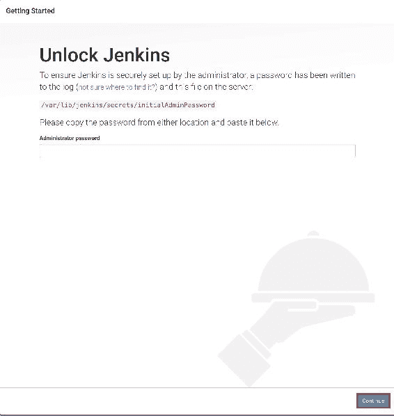

如前面的图像所示，在安装 Jenkins 的系统内有一个存储默认密码的路径。

这证明 Jenkins 已成功安装。

**在 Windows 上安装** Jenkins 在 Windows 上的安装非常简单。通常，在 Windows 机器上，Jenkins 不作为服务运行。但是，如果您想将其作为服务启用（这是可选的），您可以按照以下 URL 完整安装 Windows 的 Jenkins 文档：

[`wiki.Jenkins-ci.org/display/JENKINS/Installing+Jenkins+as+a+Windows+service#InstallingJenkinsasaWindowsservice-InstallJenkinsasaWindowsservice`](https://wiki.Jenkins-ci.org/display/JENKINS/Installing+Jenkins+as+a+Windows+service#InstallingJenkinsasaWindowsservice-InstallJenkinsasaWindowsservice).

# 配置 Jenkins

现在是时候配置 Jenkins 了，因此，让我们从指定路径（即`/var/lib/Jenkins/secrets/initialAdminPassword`）中获取密码，将其粘贴到安装向导中提供的空格中，然后单击“继续”。单击“继续”后，您应该看到类似以下屏幕：

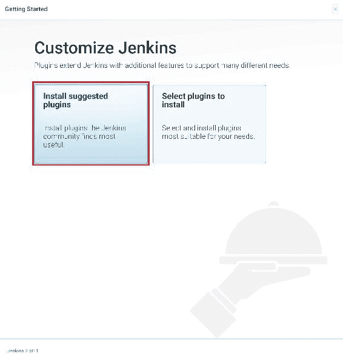

在下一个屏幕上，您将看到可以安装我们需要的集成插件的屏幕。现在我们将选择“安装建议的插件”选项。请注意，我们也可以在初始配置后安装其他插件。所以，不用担心！

一旦单击“安装建议的插件”，您将看到以下屏幕，显示插件安装的进度：

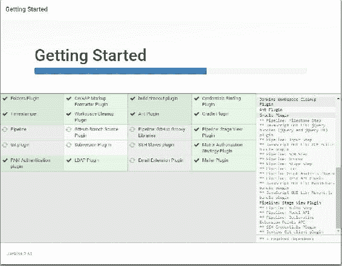

插件安装可能需要一段时间。所有这些插件都是 Jenkins 建议的，因为您可能在项目相关工作中需要它们。

插件安装完成后，它会要求您创建一个管理员用户来访问 Jenkins 控制台。请注意，为了设置 Jenkins，我们使用了临时凭据。

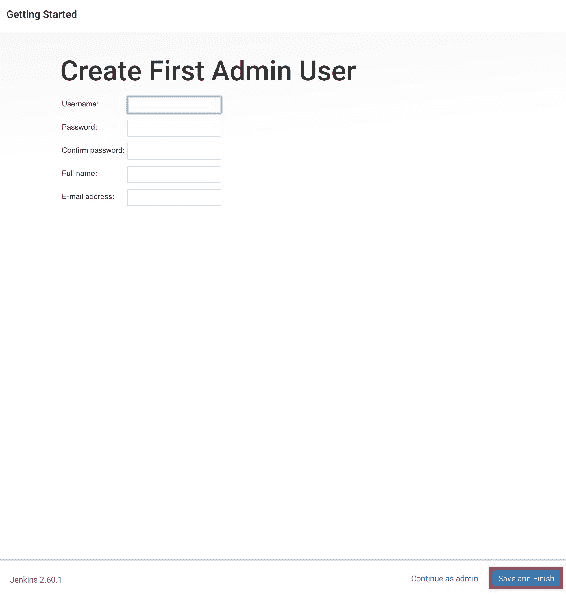

输入用户详细信息后，单击“保存并完成”以完成设置。

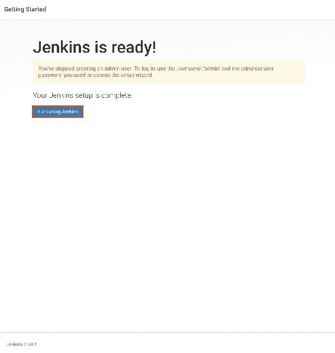

您的 Jenkins 设置已成功完成。

# 自动化 Jenkins

在本节中，我们将介绍 Jenkins 配置的不同部分，并将看看如何成功创建我们的第一个作业并构建我们的应用程序。

理想情况下，成功登录后，我们的 Jenkins 主页应该看起来像这样：


# 保护 Jenkins

强烈建议设置 Jenkins 安全性，使您的控制台安全，因为我们正在将我们的应用程序暴露给 Jenkins。

从 Jenkins 主页，单击“管理 Jenkins”以导航到 Jenkins 的设置部分，然后单击右侧窗格中的“配置全局安全性”以打开安全面板。

在配置全局安全性部分，我们可以管理用户授权，如下面的屏幕截图所示：

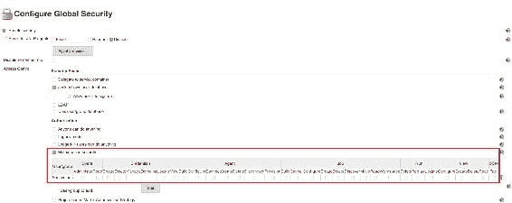

如前面的屏幕截图所示，您可以根据其角色为用户定义访问列表。通常，在大型组织中，根据使用情况为不同的人提供用户访问权限，以便维护 Jenkins 安全性。通常，我们要么使用基于 Unix 的用户/组数据库，要么使用 Jenkins 自己的用户数据库。

# 插件管理

插件管理非常重要，因为这些插件使我们能够将不同的环境（可能是云平台）或本地资源与 Jenkins 集成，并且使我们能够管理资源上的数据，如应用服务器、数据库服务器等。

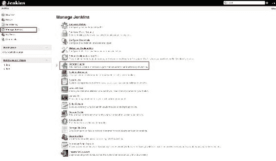

从管理 Jenkins 面板中，选择管理插件选项以打开管理插件面板，它应该看起来像这样：

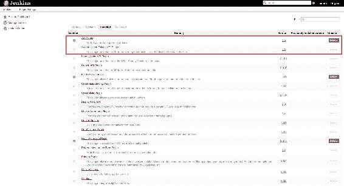

在此面板中，您可以安装、卸载和升级系统中的任何特定插件。从同一面板，您还可以升级 Jenkins。

# 版本控制系统

Jenkins 主要用于构建特定应用程序代码，或在任何基础设施平台上部署代码（即用于持续部署）。

如今，组织将其应用程序代码存储在任何版本控制系统中，例如 Git，管理员具有集中控制，并可以根据用户角色提供所需的访问权限。此外，由于我们正在谈论持续集成，因此建议将应用程序代码存储在具有版本控制的集中位置，以维护代码的完整性。

为了保持版本代码，请确保您从管理插件面板安装 Git 插件。

要通过 Jenkins 克隆 Git 存储库，您需要为 Jenkins 系统输入电子邮件和用户名。为此，请切换到作业目录，并运行以下 Git 配置命令：

```py
# Need to configure the Git email and user for the Jenkins job 

# switch to the job directory 
cd /var/lib/Jenkins/jobs/myjob/workspace 

# setup name and email 
sudo git config user.name "Jenkins" 
sudo git config user.email "test@gmail.com" 

```

这需要设置以便从存储库下载代码，或在 Git 中合并分支时，以及其他情况下。

# 设置 Jenkins 作业

现在我们准备设置我们的第一个 Jenkins 作业。如前所述，每个作业都是为执行特定任务而创建的，可以是个别的，也可以是流水线的。

根据 Andrew Phillips 的说法，理想情况下，流水线将软件交付过程分解为各个阶段。每个阶段旨在从不同角度验证新功能的质量，以验证新功能，并防止错误影响用户。如果遇到任何错误，将以报告的形式返回反馈，并确保达到所需的软件质量。

为了启动作业创建，在 Jenkins 主页上，单击左侧的“新项目”，或单击右侧窗格中的“创建新作业”链接：

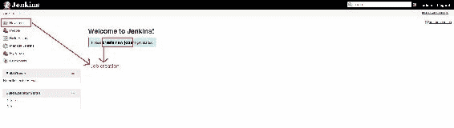

单击后，它将打开一个向导，询问您的项目/作业名称以及要创建的作业类型，如下面的屏幕截图所示：

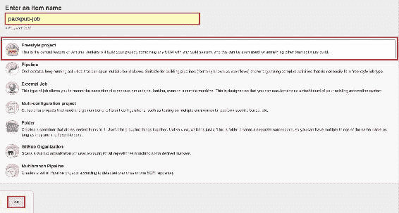

描述已经提供，以及项目类型，以便给我们一个 Jenkins 中可用不同选项的概述。这些类型需要被选择，因为它们基于类型有不同的配置。

请注意，由于我们正在使用最新的 Jenkins 版本，可能一些项目类型在旧版本中可能不存在，因此请确保您安装了最新的 Jenkins。

现在，我们将选择自由风格项目，指定一个唯一的作业名称，然后单击“确定”以继续配置我们的作业。单击“确定”后，您将看到以下页面：

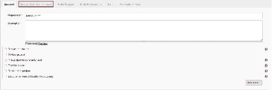

在前面的页面中，您可以定义作业的详细信息，例如项目名称、描述、GitHub 项目等。

接下来，单击“源代码管理”选项卡；您将看到以下屏幕：

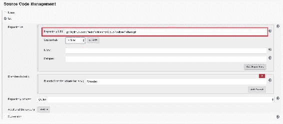

在前面的部分中，您将定义您的源代码详细信息。如果您之前在配置部分中还没有设置 Jenkins 用户凭据，那么您也需要设置 Jenkins 用户凭据。如果尚未设置，请单击凭据旁边的“添加”按钮。它将打开一个弹出窗口，看起来像这样：

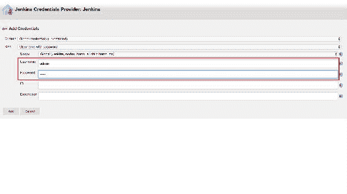

您在此处定义的用户（即管理员）需要在代码存储库中具有访问权限。

有多种方式可以为存储库上的所述用户设置身份验证，这些方式在“种类”（下拉菜单）中定义：

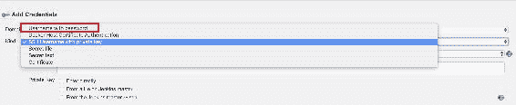

重要的是要注意，Jenkins 将立即测试与所提到的存储库 URL 的凭据。如果失败，它将显示您在此截图中看到的错误：

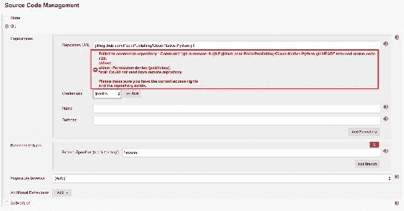

假设凭据与存储库 URL 匹配，让我们继续单击“构建触发器”选项卡以滚动它。以下屏幕显示了可以对作业进行连续部署的构建触发器选项：

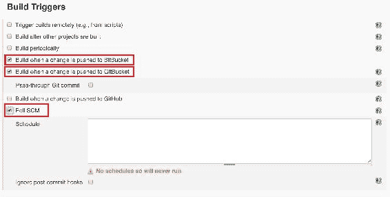

这个构建触发器部分非常重要，因为它决定了您的构建应该运行多频繁，以及触发构建的参数。例如，如果您希望在每次 Git 提交后构建您的应用程序，您可以选择“当更改被推送到 GitBucket 时构建”的选项。

因此，一旦开发人员在存储库的某个分支（通常是主分支）中提交任何更改，那么此作业将自动触发。这就像是在存储库顶部的一个钩子，它会跟踪其中的活动。或者，如果您想要定期构建您的应用程序或运行此作业，那么您可以指定类似于这样的条件-- `H/15 * * * *`--在轮询 SCM 以安排中，这意味着此作业将每 15 分钟运行一次。这类似于我们通常在基于 Linux 的系统中设置的 cron 作业。

接下来的两个部分，**构建环境**和**构建**，是为与工作区相关的任务定义的。由于我们正在处理一个基于 Python 的应用程序，并且我们已经构建了我们的应用程序，所以我们现在可以跳过这些部分。但是，如果您有一个用 Java 编写的应用程序或.NET 应用程序，您可以使用 ANT 和 Maven 构建工具，并分支构建。或者，如果您想构建一个基于 Python 的应用程序，那么可以使用诸如 pyBuilder ([`pybuilder.github.io/`](http://pybuilder.github.io/))之类的工具。以下屏幕显示了构建选项：

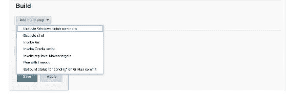

完成后，您可以单击下一个选项卡，即后构建操作。这用于定义构建成功后需要执行的操作。由于这一部分，Jenkins 也可以用作持续部署工具。因此，在此后构建操作中，您可以指定应用程序需要部署的平台，例如 AWS EC2 机器、Code deploy、Azure VM 或其他平台。

在持续集成的后构建部分中，我们还可以执行诸如成功构建后的 Git 合并、在 Git 上发布结果等操作。此外，您还可以为利益相关者设置电子邮件通知，以便通过电子邮件向他们提供有关构建结果的更新。有关更多详细信息，请参见以下截图：

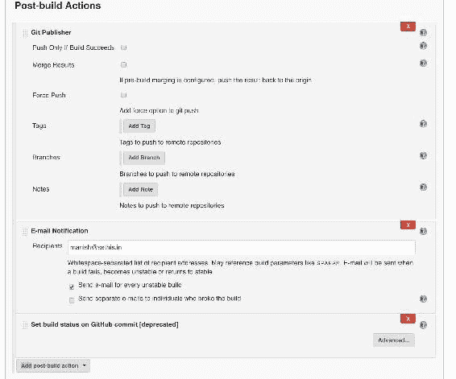

就这样。一旦填写了必要的细节，点击保存以保存配置。现在您已经准备好构建您的应用程序了--点击左侧面板中的立即构建链接，如下面的截图所示：

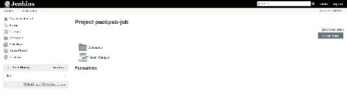

注意：对于第一次构建执行，如果您尚未设置轮询 SCM 或构建触发器部分，则需要手动触发它。

这是我们目前从 Jenkins 那里得到的有关作业创建的所有信息。然而，在接下来的章节中，我们将使用 Jenkins 作为持续交付和持续集成工具，部署我们在之前章节中创建的 React 应用程序到 AWS、Azure 或 Docker 等不同平台上。我们还将看到 AWS 服务与 Jenkins 的集成，通过单次提交自动化将应用程序交付到 GitHub 存储库。

# 理解持续交付

持续交付是一种软件工程实践，其中生产就绪的功能被生产并部署到生产环境。

持续交付的主要目标是在不考虑平台的情况下执行成功的应用程序部署，无论是大规模分布式系统还是复杂的生产环境。

在跨国公司中，我们始终确保应用程序代码处于稳定且可部署状态，即使有许多开发人员同时在不同的应用程序组件上工作。在持续交付中，我们还确保单元测试和集成测试成功进行，使其达到生产就绪状态。

# 持续交付的需求

人们普遍认为，如果我们尝试更频繁地部署软件，我们应该预期系统的稳定性和可靠性水平会降低，但这并不完全正确。持续交付提供了一些实践，为愿意在竞争激烈的市场中发布稳定可靠软件的组织提供了令人难以置信的竞争优势。

持续交付的实践给我们带来了以下重要的好处：

+   **无风险发布**：软件发布中的主要要求是最小或零停机时间。毕竟，这始终与业务有关，用户不应因频繁发布而受到影响。通过使用 BlueGreenDeployment（[`martinfowler.com/bliki/BlueGreenDeployment.html`](https://martinfowler.com/bliki/BlueGreenDeployment.html)）等模式，我们可以在部署过程中实现零停机时间。

+   **竞争市场**：在持续交付中，所有团队，如构建和部署团队、测试团队、开发人员等，都共同合作，使不同的活动如测试、集成等每天都发生。这使得功能发布过程更快（一周或两周），我们将频繁地将功能发布到生产环境供客户使用。

+   **质量改进**：在持续交付中，开发人员无需担心测试过程，因为流水线会处理这一过程，并向 QA 团队展示结果。这使得 QA 团队和开发人员能够更仔细地进行探索性测试、可用性测试以及性能和安全性测试，从而改善客户体验。

+   **更好的产品**：通过在构建、测试、部署和环境设置中使用持续交付，我们减少了软件增量变更的成本和交付成本，从而使产品在一段时间内变得更好。

# 持续交付与持续部署

持续交付和持续部署在构建、测试和软件发布周期方面相似，但在*流程*方面略有不同，您可以从以下图表中了解到：

在下一章中，我们将讨论基于容器技术的 Docker。我相信你们大多数人之前都听说过 Docker，所以请继续关注对 Docker 的深入了解。我们下一章见！

在持续部署中，经过所有测试检查的生产就绪代码直接部署到生产环境，这使得软件发布频繁。但在持续交付的情况下，除非由相关部门手动触发或批准，否则不会部署生产就绪的应用程序代码。

# 总结

在整个章节中，我们讨论了像 Jenkins 这样的 CI 和 CD 工具，并且也看了它们的不同功能。在这个阶段理解这些工具非常重要，因为大多数处理云平台的公司都使用这些流程进行软件开发和部署。所以，现在您已经了解了部署流水线，您可以开始了解我们将部署应用程序的平台了。

（图片已省略）
