# 第十章：将您的服务 Docker 化

既然我们已经从上一章了解了持续集成和持续交付/部署，现在是深入研究基于容器的技术，比如 Docker，我们将在其中部署我们的应用程序的正确时机。在本章中，我们将看一下 Docker 及其特性，并在 Docker 上部署我们的云原生应用。

本章将涵盖以下主题：

+   了解 Docker 及其与虚拟化的区别

+   在不同操作系统上安装 Docker 和 Docker Swarm

+   在 Docker 上部署云原生应用

+   使用 Docker Compose

# 了解 Docker

Docker 是一个**容器管理系统**（**CMS**），它使您能够将应用程序与基础架构分离，这样更容易开发、部署和运行应用程序。它对管理**Linux 容器**（**LXC**）很有用。这让您可以创建镜像，并对容器执行操作，以及对容器运行命令或操作。

简而言之，Docker 提供了一个在被称为**容器**的隔离环境中打包和运行应用程序的平台，然后在不同的软件发布环境中进行部署，如阶段、预生产、生产等。

**Docker**与任何**传统 VM**相比都更轻量，如下图所示：

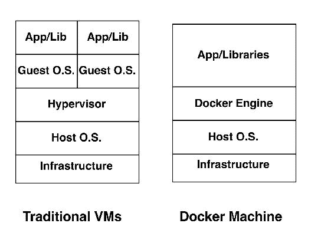

# 关于 Docker 与虚拟化的一些事实

仍然成功地在传统 VM 上工作的组织有很多。话虽如此，有些组织已经将他们的应用程序迁移到了 Docker 上，或者准备这样做。以下是 Docker 比虚拟机具有更多潜力的几个原因：

+   在比较 Docker 和虚拟机时，Docker 的系统开销比虚拟机低。

+   其次，在 Docker 环境中的应用程序通常比虚拟机性能更高。

+   而 VM 软件技术名为**Hypervisor**，它充当 VM 环境和底层硬件之间的代理，提供必要的抽象层；在 Docker 中，我们有 Docker 引擎，它比 Docker 机器给我们更多的控制。

+   此外，正如您在上图中所看到的，Docker 在 Docker 环境中共享**主机操作系统**，而虚拟机需要自己的操作系统进行应用程序部署。这使得 Docker 更轻量化，可以更快地启动和销毁，与虚拟机相比。Docker 类似于在主机操作系统上运行的任何其他进程。

+   在云原生应用的情况下，我们需要在每个开发阶段之后快速测试我们的微服务，Docker 将是一个很好的平台选项来测试我们的应用程序，这是强烈推荐的。

# Docker Engine - Docker 的支柱

Docker Engine 是一个客户端服务器应用程序，具有以下组件：

+   **Dockerd**：这是一个守护进程，以在主机操作系统的后台持续运行，以跟踪 Docker 容器属性，如状态（启动/运行/停止）

+   **Rest API**：这提供了与守护程序交互并在容器上执行操作的接口

+   **Docker 命令行**：这提供了命令行界面来创建和管理 Docker 对象，如镜像、容器、网络和卷

# 设置 Docker 环境

在本节中，我们将看一下在不同操作系统上安装 Docker 的过程，比如 Debian 和 Windows 等。

# 在 Ubuntu 上安装 Docker

设置 Docker 非常简单。市场上主要有两个版本的 Docker。

Docker Inc.拥有**容器化**Docker 产品，将 Docker **商业支持**（**CS**）版更名为 Docker **企业版**（**EE**），并将 Docker Engine 转换为 Docker **社区版**（**CE**）。

EE 和 CE 有一些变化；显然，商业支持是其中之一。但是，在 Docker 企业版中，他们围绕容器内容、平台插件等构建了一些认证。

在本书中，我们将使用 Docker 社区版，因此我们将从更新 APT 存储库开始：

```py
$ apt-get update -y 

```

现在，让我们按照以下步骤从 Docker 官方系统添加 GPG 密钥：

```py
$ sudo apt-key adv --keyserver hkp://p80.pool.sks-keyservers.net:80 --recv-keys 58118E89F3A912897C070ADBF76221572C52609D 

```

然后让我们将 Docker 存储库添加到 Ubuntu 的 APT 源列表中：

```py
$ sudo apt-add-repository 'deb https://apt.dockerproject.org/repo ubuntu-xenial main' 

```

有时，在 Ubuntu 14.04/16.04 中找不到`apt-add-repository`实用程序。为了安装所述的实用程序，请使用以下命令安装`software-properties-common`软件包：**$ sudo apt-get install software-properties-common -y**。

接下来，更新 APT 软件包管理器以下载最新的 Docker 列表，如下所示：

```py
$ apt-get update -y

```

如果您想从 Docker 存储库而不是默认的 14.04 存储库下载并安装 Docker Engine，请使用以下命令：

**$ apt-cache policy docker-engine**。

您将在终端上看到以下输出：

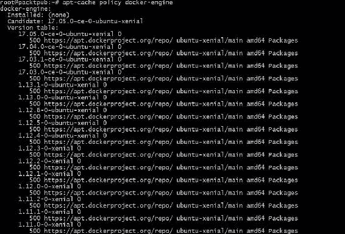

现在，我们准备安装我们的 Docker Engine，所以让我们执行以下命令来安装它：

```py
$ sudo apt-get install -y docker-engine -y 

```

由于 Docker 依赖于一些系统库，可能会遇到类似于以下截图显示的错误：

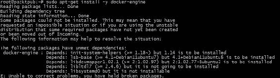

如果遇到此类错误，请确保已安装这些库并且版本已定义。

Docker Engine 安装成功后，现在是时候通过执行以下命令来验证它了：

```py
$ docker -v   
Docker version 17.05.0-ce, build 89658be 

```

如果您看到类似于前面终端显示的版本，则我们可以开始了。

要获取有关 Docker 的帮助，可以执行以下命令：

```py
$ docker help 

```

如果您真的想使用 Docker 企业版，可以按照官方 Docker 网站上显示的安装步骤进行操作（[`docs.docker.com/engine/installation/linux/ubuntu/`](https://docs.docker.com/engine/installation/linux/ubuntu/)）。

# 在 Windows 上安装

理想情况下，Windows 不适合 Docker，这就是为什么您在 Windows 系统上看不到容器技术的原因。话虽如此，我们有一些解决方法。其中之一是使用 Chocolatey。

为了使用 Chocolatey 在 Windows 系统上安装 Docker，请按照以下步骤进行操作：

1.  从官方网站安装 Chocolatey（[`chocolatey.org/install`](https://chocolatey.org/install)）。

在前面的链接中显示了安装 Chocolatey 的几种方法。

1.  安装了 Chocolatey 后，您只需在 cmd 或 PowerShell 中执行以下命令：

```py
 $ choco install docker

```

这将在 Windows 7 和 8 操作系统上安装 Docker。

同样，如果您想使用 Docker 企业版，可以按照此链接中显示的步骤进行操作：

[`docs.docker.com/docker-ee-for-windows/install/#install-docker-ee`](https://docs.docker.com/docker-ee-for-windows/install/#install-docker-ee)。

# 设置 Docker Swarm

Docker Swarm 是 Docker 机器池的常用术语。 Docker Swarm 非常有用，因为它可以快速扩展或缩小基础架构，用于托管您的网站。

在 Docker Swarm 中，我们可以将几台 Docker 机器组合在一起，作为一个单元共享其资源，例如 CPU、内存等，其中一台机器成为我们称之为领导者的主机，其余节点作为工作节点。

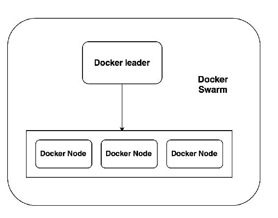

# 设置 Docker 环境

在本节中，我们将通过从 Docker 机器中选择领导者并将其余机器连接到领导者来设置 Docker Swarm。

# 假设

以下是 Docker 环境的一些假设：

+   我们将使用两台机器，可以是虚拟机或来自云平台的实例，以演示为目的命名为 master 和 node1。此外，我们已经按照 Docker 安装部分中描述的过程在这两台机器上安装了 Docker。

+   端口`2377`必须打开以便主节点和节点 1 之间进行通信。

+   确保应用程序访问所需的端口应该是打开的；我们将需要端口`80`来使用 nginx，就像我们的示例中一样。

+   主 Docker 机器可以基于任何类型的操作系统，例如 Ubuntu、Windows 等。

现在，让我们开始我们的 Docker Swarm 设置。

# 初始化 Docker 管理器

此时，我们需要决定哪个节点应该成为领导者。让我们选择主节点作为我们的 Docker 管理器。因此，请登录到主机并执行以下命令，以初始化此机器为 Docker Swarm 的领导者：

```py
$ docker swarm init --advertise-addr master_ip_address 

```

此命令将设置提供的主机为主（领导者），并为节点生成一个连接的令牌。请参考以下输出：

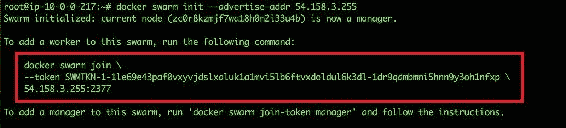

需要记住的一些重要点：

+   不要与任何人分享您的令牌和 IP 地址

+   其次，在故障转移的情况下可能会有多个主节点

# 将节点 1 添加到主节点

现在我们已经选择了领导者，我们需要添加一个新节点到集群中以完成设置。登录到节点 1 并执行前面命令输出中指定的以下命令：

```py
$ docker swarm join     --token SWMTKN-1-
1le69e43paf0vxyvjdslxaluk1a1mvi5lb6ftvxdoldul6k3dl-
1dr9qdmbmni5hnn9y3oh1nfxp    master-ip-address:2377 

```

您可以参考以下截图输出：

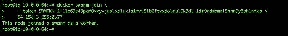

这意味着我们的设置是成功的。让我们检查它是否已添加到主 Docker 机器中。

执行以下命令进行验证：

```py
$ docker node ls 

```

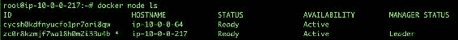

# 测试 Docker Swarm

既然我们已经设置了 Docker Swarm，现在是时候在其上运行一些服务了，比如 nginx 服务。在主 Docker 机器上执行以下命令，以在端口`80`上启动您的 nginx 服务：

```py
$ docker service create  --detach=false -p 80:80 --name webserver
nginx 

```

前面命令的输出应该类似于以下截图：

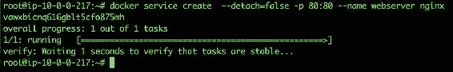

让我们使用以下 Docker 命令来查看我们的服务是否正在运行：

```py
$ docker service ps webserver 

```

前面命令的输出应该类似于以下截图：

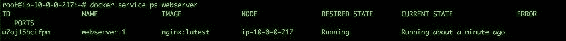

其他一些验证命令如下：

要验证哪些服务正在运行以及在哪个端口上，请使用以下命令：

```py
$ docker service ls 

```

如果您看到类似以下截图的输出，那么一切正常：

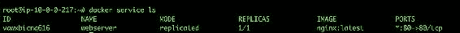

要扩展服务的 Docker 实例，请使用以下命令：

```py
$ docker service scale webserver=3 

```

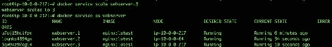

通过访问其默认页面来检查我们的 nginx 是否已经启动。尝试在浏览器中输入`http://master-ip-address:80/`。如果您看到以下输出，则您的服务已成功部署：

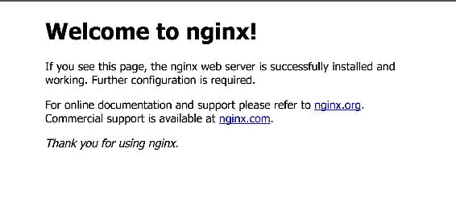

太棒了！在接下来的部分，我们将在 Docker 机器上部署我们的云原生应用程序。

# 在 Docker 上部署应用程序

在本节中，我们将部署我们的云原生应用程序，这是我们在前几章中开发的。然而，在我们开始创建应用程序架构之前，有一些 Docker 的概念是应该了解的，其中一些如下：

+   **Docker 镜像**：这些基本上是库和部署在其上的应用程序的组合。这些图像可以从 Docker Hub 公共存储库下载，或者您也可以创建自定义图像。

+   **Dockerfile**：这是一个配置文件，用于构建可以在以后运行 Docker 机器的图像。

+   **Docker Hub**：这是一个集中的存储库，您可以在其中保存图像，并可以在团队之间共享。

我们将在应用部署过程中使用所有这些概念。此外，我们将继续使用我们的 Docker Swarm 设置来部署我们的应用程序，因为我们不想耗尽资源。

我们将遵循这个架构来部署我们的应用程序，我们将我们的应用程序和 MongoDB（基本上是应用程序数据）部署在单独的 Docker 实例中，因为建议始终将应用程序和数据分开：

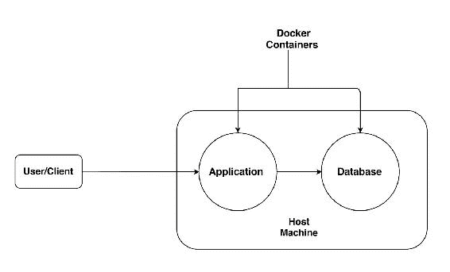

# 构建和运行我们的 MongoDB Docker 服务

在本节中，我们将创建 Dockerfile 来构建`MongoDB`，其中将包含所有信息，例如基本图像、要公开的端口、如何安装`MongoDB`服务等。

现在，让我们登录到您的 Docker 主（领导）帐户，并使用以下内容创建名为`Dockerfile`的 Docker 文件：

```py
    # MongoDB Dockerfile 
    # Pull base image. 
    FROM ubuntu 
    MAINTAINER Manish Sethi<manish@sethis.in> 
    # Install MongoDB. 
    RUN \ 
    apt-key adv --keyserver hkp://keyserver.ubuntu.com:80 --recv 
    7F0CEB10 && \ 
    echo 'deb http://downloads-distro.mongodb.org/repo/ubuntu-upstart
    dist 10gen' > /etc/apt/sources.list.d/mongodb.list && \ 
    apt-get update && \ 
    apt-get install -y mongodb-org && \ 
    rm -rf /var/lib/apt/lists/* 

    # Define mountable directories. 
    VOLUME ["/data/db"] 

    # Define working directory. 
    WORKDIR /data 

    # Define default command. 
    CMD ["mongod"] 

    # Expose ports. 
    EXPOSE 27017 
    EXPOSE 28017 

```

保存它，在我们继续之前，让我们了解其不同的部分，如下所示：

```py
    # Pull base image. 
    FROM ubuntu 

```

上面的代码将告诉您从 Docker Hub 拉取 Ubuntu 公共图像，并将其作为基础图像运行以下命令：

```py
    # Install MongoDB 
    RUN \ 
    apt-key adv --keyserver hkp://keyserver.ubuntu.com:80 --recv 
    7F0CEB10 && \ 
    echo 'deb http://downloads-distro.mongodb.org/repo/ubuntu-upstart 
    dist 10gen' > /etc/apt/sources.list.d/mongodb.list && \ 
    apt-get update && \ 
    apt-get install -y mongodb-org && \ 
    rm -rf /var/lib/apt/lists/*

```

上面的代码部分类似于我们手动执行这些命令为`MongoDB`；但是，在这种情况下，Docker 会自动处理。

接下来是卷部分，这在某种程度上是可选的。它正在创建可挂载的目录，我们可以在其中存储数据以在外部卷中保持安全。

```py
    # Define mountable directories. 
    VOLUME ["/data/db"] 

```

接下来的部分是通过这些端口公开的，用户/客户端将能够与 MongoDB 服务器进行通信：

```py
    EXPOSE 27017 
    EXPOSE 28017 

```

保存文件后，执行以下命令构建图像：

```py
$ docker build --tag mongodb:ms-packtpub-mongodb

```

构建图像可能需要大约 4-5 分钟，这取决于互联网带宽和系统性能。

以下屏幕显示了 Docker 构建命令的输出：

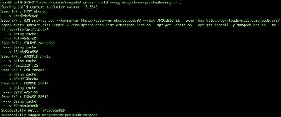

在前面的截图中，由于显示了成功构建，现在您可以查看图像列表以验证是否存在具有所述标记名称（**ms-packtpub-mongodb**）的图像。

使用以下命令列出图像：

```py
$ docker images

```

以下屏幕列出了可用的 Docker 图像：

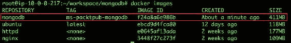

太棒了！我们的图像已经存在。现在让我们使用以下命令在主 Docker 机器上运行`mongodb`服务：

```py
$ docker run -d -p 27017:27017 -p 28017:28017 --name mongodb mongodb:ms-packtpub-mongodb mongod --rest --httpinterface

```

在输出中，您将获得一个随机的 Docker ID，如下面的截图所示：

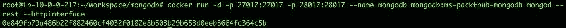

通过执行`docker ps`命令来检查 Docker 容器的状态。它的输出应该类似于以下截图：

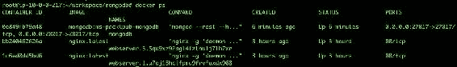

很少有开发人员和系统管理员知道`mongoDB`服务有一个 HTTP 接口，我们使用端口`28017`进行了暴露。

因此，如果我们尝试在浏览器中访问`http://your-master-ip-address:28017/`，我们将看到类似于以下截图的屏幕：

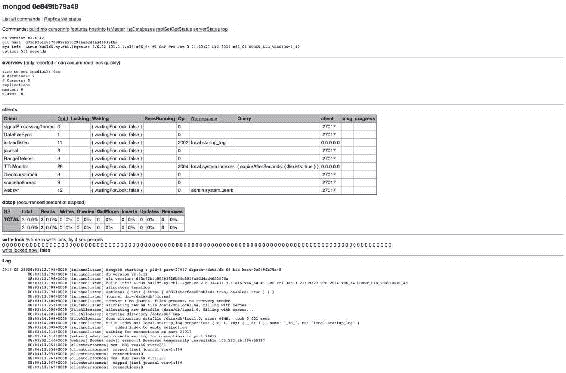

太棒了！我们的 MongoDB 现在已经运行起来了！

在我们继续为应用程序启动容器之前，让我们了解一下 Docker Hub 对我们有何用处。

# Docker Hub - 它是关于什么的？

根据 Docker Hub 官方文档，Docker Hub 是一个基于云的注册表服务，允许您链接到代码存储库，构建图像并对其进行测试，并存储手动推送的图像，并链接到 Docker Cloud，以便您可以将图像部署到您的主机。

简而言之，Docker Hub 是一个集中存储图像的地方，全球任何人都可以访问，只要他们具有所需的权限，并且可以执行围绕图像的操作，以在其主机上部署和运行其应用程序。

Docker Hub 的优点如下：

+   Docker Hub 提供了自动创建构建的功能，如果源代码存储库中报告了任何更改

+   它提供了 WebHook，用于在成功推送到存储库后触发应用程序部署

+   它提供了创建私有工作空间以存储图像的功能，并且只能在您的组织或团队内部访问

+   Docker Hub 与您的版本控制系统（如 GitHub、BitBucket 等）集成，这对持续集成和交付非常有用

现在，让我们看看如何将我们的自定义`MongoDB`图像推送到我们最近创建的私有存储库。

首先，您需要在[`hub.docker.com`](https://hub.docker.com)创建一个帐户并激活它。一旦登录，您需要根据自己的喜好创建私有/公共存储库，如下所示：

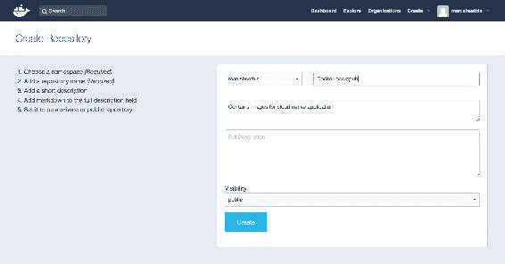

单击“创建”按钮设置仓库，您将被重定向到以下屏幕：

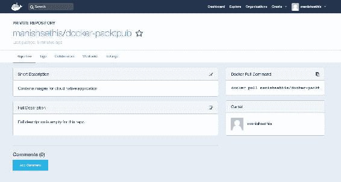

Docker Hub 在免费帐户上只提供一个私有仓库。

现在我们已经创建了仓库，让我们回到我们的主 Docker 机器并执行以下命令：

```py
$ docker login

```

这将要求您输入 Docker Hub 帐户的凭据，如下截图所示：

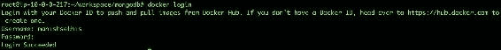

登录成功后，是时候使用以下命令为要推送到仓库的镜像打标签了：

```py
$ docker tag mongodb:ms-packtpub-mongodb manishsethis/docker-packtpub

```

如果我们不指定标签，那么它将默认使用最新的标签。

标签创建完成后，是时候将标签推送到仓库了。使用以下命令来执行：

```py
$ docker push manishsethis/docker-packtpub

```

以下屏幕显示了 Docker `push`命令的输出：

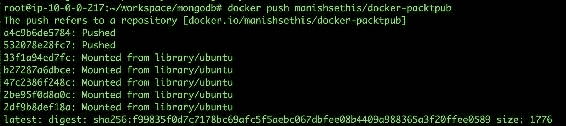

推送完成后，您将在 Docker Hub 的“标签”选项卡中看到镜像，如此处所示：

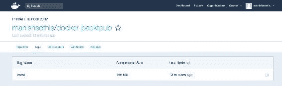

这意味着您的镜像已成功推送。

要拉取此镜像，您只需使用以下命令：

```py
$ docker pull manishsethis/docker-packtpub

```

哦，哇！这太简单了，只要您有凭据，就可以从任何地方访问它。

还有其他 Docker 注册表提供者，如 AWS（EC2 容器注册表）、Azure（Azure 容器注册表）等。

目前，这就是我们从 Docker Hub 那边得到的全部内容。在本章中，我们将继续使用 Docker Hub 来推送镜像。

现在继续，我们准备将我们的云原生应用部署到另一个容器中，但在此之前，我们需要使用 Dockerfile 为其构建一个镜像。因此，让我们创建一个名为`app`的目录，并创建一个空的 Dockerfile，其中包含以下内容：

```py
 FROM ubuntu:14.04 
    MAINTAINER Manish Sethi<manish@sethis.in> 

    # no tty 
    ENV DEBIAN_FRONTEND noninteractive 

    # get up to date 
    RUN apt-get -qq update --fix-missing 

    # Bootstrap the image so that it includes all of our dependencies 
    RUN apt-get -qq install python3  python-dev python-virtualenv
 python3-pip --assume-yes 
    RUN sudo apt-get install build-essential autoconf libtool libssl-
 dev libffi-dev --assume-yes 
 # Setup locale 
    RUN export LC_ALL=en_US.UTF-8 
    RUN export LANG=en_US.UTF-8 
    RUN export LANGUAGE=en_US.UTF-8 

    # copy the contents of the cloud-native-app(i.e. complete
 application) folder into the container at build time 
 COPY cloud-native-app/ /app/ 

    # Create Virtual environment 
    RUN mkdir -p /venv/ 
    RUN virtualenv /venv/ --python=python3 

    # Python dependencies inside the virtualenv 
    RUN /venv/bin/pip3 install -r /app/requirements.txt 

    # expose a port for the flask development server 
    EXPOSE 5000 

    # Running our flask application  
    CMD cd /app/ && /venv/bin/python app.py 

```

我相信我之前已经解释了 Dockerfile 中大部分部分，尽管还有一些部分需要解释。

```py
  COPY cloud-native-app/ /app/ 

```

在 Dockerfile 的前面部分，我们将应用程序的内容，即代码，从本地机器复制到 Docker 容器中。或者，我们也可以使用 ADD 来执行相同的操作。

`CMD`是我们想要在 Docker 容器内执行的命令的缩写，它在 Dockerfile 中定义如下：

```py
# Running our flask application  
CMD cd /app/ && /venv/bin/python app.py 

```

现在保存文件并运行以下命令来构建镜像：

```py
$ docker build --tag cloud-native-app:latest .

```

这可能需要一些时间，因为需要安装和编译许多库。每次更改后构建镜像是一个好习惯，以确保镜像与当前配置更新。输出将类似于此处显示的输出：

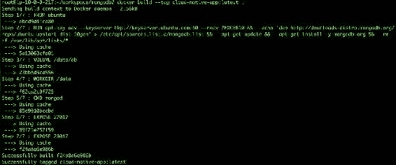

确保构建过程的每个部分都成功。

现在我们已经准备好了我们的镜像，是时候使用最新的镜像启动我们的容器了。

执行以下命令来启动容器，并始终记住要暴露端口`5000`以访问我们的应用程序：

```py
$ docker run -d -p 5000:5000  --name=myapp  cloud-native-app:latest

```

现在运行`docker ps`命令来检查容器状态：

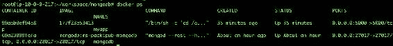

正如你所看到的，`myapp`容器中有两个容器在运行：我们的应用程序在运行，而`mongodb`容器中将运行您的`mongodb`服务。

接下来，检查应用程序的 URL（`http://your-master-ip-address:5000/`）。如果看到以下屏幕，这意味着我们的应用程序已成功部署，并且我们在 Docker 上已经上线了：


现在我们可以通过创建新用户并登录，然后发布推文来测试我们的应用程序。我不会再次执行，因为我们在创建应用程序时已经执行过了。

根据经验，我知道应用程序和数据库（即 MongoDB）之间的通信可能会存在一些挑战，因为应用程序和数据库都在单独的容器中，可能在单独的网络中。为了解决这种问题，您可以创建一个网络，并将两个容器连接到该网络。

举例来说，如果我们需要为我们的容器（`myapp`和`mongodb`）这样做，我们将按照以下步骤进行：

1.  使用以下命令创建一个单独的网络：

```py
      $ docker network create -d bridge --subnet 172.25.0.0/16
      mynetwork

```

1.  现在我们已经创建了网络，可以使用以下命令将两个容器添加到这个网络中：

```py
      $ docker network connect mynetwork  myapp
      $ docker network connect mynetwork  mongodb

```

1.  为了找到分配给这些容器的 IP，我们可以使用以下命令：

```py
      $ docker inspect --format '{{ .NetworkSettings.IPAddress }}'
      $(docker ps -q)

```

这个网络的创建是一种设置应用程序和数据库之间通信的替代方式。

好了，我们已经在 Docker 上部署了我们的应用程序，并了解了它的不同概念。唯一剩下的概念是 Docker Compose。让我们了解一下它是什么，以及它与其他工具有何不同。

# Docker Compose

根据官方 Docker Compose 网站（[`docs.docker.com/compose/overview/`](https://docs.docker.com/compose/overview/)），Compose 是一个用于定义和运行多容器 Docker 应用程序的工具。使用 Compose，您可以使用 Compose 文件来配置应用程序的服务。

简单来说，它帮助我们以更简单和更快的方式构建和运行我们的应用程序。

在前一节中，我们部署应用程序并构建镜像时，首先创建了一个 Dockerfile，然后执行了`Docker build`命令来构建它。一旦构建完成，我们通常使用`docker run`命令来启动容器，但是，在 Docker Compose 中，我们将定义一个包含配置细节的`.yml`文件，例如端口、执行命令等。

首先，Docker Compose 是一个独立于 Docker Engine 的实用程序，可以根据您所使用的操作系统类型使用以下链接进行安装：

`https://docs.docker.com/compose/install/`。

安装完成后，让我们看看如何使用 Docker Compose 来运行我们的容器。假设我们需要使用 Docker Compose 运行云原生应用程序容器。我们已经为其生成了 Dockerfile，并且应用程序也在相同的位置（路径）上。

接下来，使用以下内容，我们需要在与 Dockerfile 相同的位置创建一个`Docker-compose.yml`文件：

```py
    #Compose.yml 
    version: '2' 
    services: 
    web: 
     build: . 
      ports: 
      - "5000:5000" 
      volumes: 
       - /app/ 
     flask: 
      image: "cloud-native-app:latest" 

```

在`docker-compose.yml`中添加配置后，保存并执行`docker-compose up`命令。构建镜像后，我们将看到以下输出：

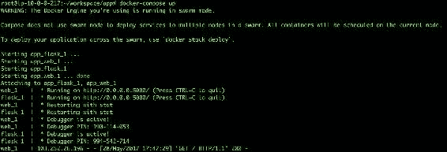

此外，如果查看容器的状态，您会发现多个容器（在我们的情况下，`app_web-1`和`app_flask_1`）由 compose 启动，这就是为什么它对于需要大规模基础设施的多容器应用程序非常有用，因为它创建了类似 Docker Swarm 的 Docker 机器集群。以下屏幕显示了 Docker 机器的状态：

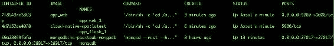

太棒了！我们还通过 Docker-compose 部署了我们的应用程序。现在您可以尝试访问应用程序的公共 URL（[`your-ip-address:5000`](http://your-ip-address:5000)）来确认成功部署应用程序。

最后，确保将您的镜像推送到 Docker Hub 以将其保存在集中式存储库中。由于我们已经推送了 MongoDB 镜像，请使用以下命令来推送`cloud-native-app`镜像：

```py
$ docker tag cloud-native-app:latest manishsethis/docker-packtpub:cloud-native-app
$ docker push manishsethis/docker-packtpub:cloud-native-app

```

我们应该看到类似的输出，用于 Docker `push`命令如下：

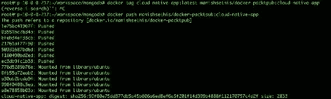

# 总结

在本章中，我们首先看了一个最有趣的技术--Docker--，它是基于容器的。我们研究了 Docker 周围的不同概念，已经部署了我们的应用程序，并研究了我们如何通过 Docker 来管理它。我们还探索了使用 Docker Compose 和 Dockerfile 部署应用程序的多种方式。

在接下来的章节中，情况将变得更加有趣，因为我们最终将接触到云平台，根据我们的应用程序在平台上构建基础设施，并尝试部署它。所以，请继续关注下一章！到时见。
