# 第十一章：在 AWS 平台上部署

在上一章中，我们看到了我们应用程序的一个平台，名为 Docker。它可以隔离您的应用程序，并可用于响应来自客户的应用程序请求。在本章中，我们将向您介绍云平台，特别是 AWS（亚马逊云服务），主要涉及 IaaS（基础设施）和 PaaS（平台即服务）服务。我们还将看看如何构建基础设施并部署我们的应用程序。

本章包括以下主题：

+   介绍 AWS 及其服务

+   使用 Terraform/CloudFormation 构建应用程序基础设施

+   使用 Jenkins 进行持续部署

# 开始使用亚马逊云服务（AWS）

亚马逊云服务（AWS）是一个安全的云平台。它在 IaaS 和 PaaS 方面提供各种服务，包括计算能力、数据库存储和内容传递，有助于扩展应用程序，并在全球范围内发展我们的业务。AWS 是一个公共云，根据云计算概念，它以按需交付和按使用量付费的方式提供所有资源。

您可以在[`aws.amazon.com/`](https://aws.amazon.com/)了解更多关于 AWS 及其服务的信息。

如在第一章中指定的，*介绍云原生架构和微服务*，您需要创建一个 AWS 账户才能开始使用这些服务。您可以使用以下链接创建一个账户：

[`medium.com/appliedcode/setup-aws-account-1727ce89353e`](https://medium.com/appliedcode/setup-aws-account-1727ce89353e)

登录后，您将看到以下屏幕，其中展示了 AWS 及其类别。一些服务处于测试阶段。我们将使用与计算和网络相关的一些服务来构建我们应用程序的基础设施：

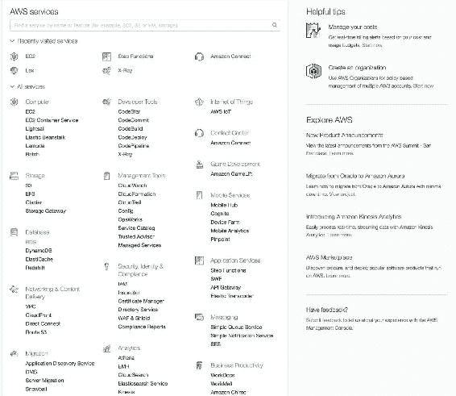

一些常用的 AWS 应用服务如下：

+   EC2（弹性计算云）：这是 AWS 提供的计算服务，简单来说，它提供了一个服务器。

+   ECS（弹性容器服务）：这类似于位于公共云（即亚马逊）上的 Docker 服务。它仅在 EC2 机器上管理 Docker。您可以在亚马逊云中轻松设置 Docker 集群，而不是在本地创建 Docker 集群，而且开销更小。

+   EBS（弹性 Beanstalk）：这是一个 PaaS 服务，您只需上传代码，并指定需要多少基础设施（基本上是应用服务器（EC2））。EBS 将负责创建机器，并在其上部署代码。

+   S3（简单存储服务）：这是 AWS 提供的存储服务，我们通常将应用程序数据或静态内容存储在其中，可用于静态网站托管。我们将用它进行持续部署。

+   Glacier：这是另一个存储服务，主要用于备份，因为成本较低，因此数据存储和检索能力较慢，与 S3 相比。

+   VPC（虚拟专用网络）：这是一个网络服务，可以让您控制资源的可访问性。我们将使用此服务来保护我们的基础设施。此服务非常有用，可用于保护我们的应用程序服务和数据库服务，并仅向外部世界公开所需的选择性资源。

+   CloudFront：这是一个内容传递服务，可以在全球范围内分发您在 S3 中的内容，并确保无论请求源的位置如何，都可以快速检索到。

+   CloudFormation：这为开发人员和系统管理员提供了一种简单的方式来创建和管理一组相关的 AWS 资源，例如以代码形式进行配置和更新。我们将使用此服务来构建我们的基础设施。

+   **CloudWatch**：此服务跟踪您的资源活动。它还以日志的形式跟踪 AWS 账户上的任何活动，这对于识别任何可疑活动或账户被盗非常有用。

+   **IAM（身份和访问管理）**：这项服务正如其名，非常有用于管理 AWS 账户上的用户，并根据他们的使用和需求提供角色/权限。

+   **Route 53**：这是一个高可用和可扩展的云 DNS 云服务。我们可以将我们的域名从其他注册商（如 GoDaddy 等）迁移到 Route 53，或者购买 AWS 的域名。

AWS 提供了许多其他服务，本章无法涵盖。如果您有兴趣并希望探索其他服务，可以查看 AWS 产品列表（[`aws.amazon.com/products/`](https://aws.amazon.com/products/)）。

我们将使用大部分前述的 AWS 服务。让我们开始按照我们的应用程序在 AWS 上构建基础设施。

# 在 AWS 上构建应用程序基础设施

在我们的应用程序的这个阶段，系统架构师或 DevOps 人员进入画面，并提出不同的基础设施计划，这些计划既安全又高效，足以处理应用程序请求，并且成本效益高。

就我们的应用程序而言，我们将按照以下图像构建其基础设施：

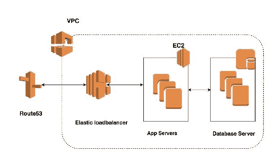

我们将按照前述的应用程序架构图为我们的应用程序构建基础设施，其中包括一些 AWS 服务，如 EC2、VPC、Route 53 等。

有三种不同的方式可以在 AWS 云上配置您的资源，分别是：

+   **管理控制台**：这是我们已经登录的用户界面，可以用于在云上启动资源。（查看此链接以供参考：[`console.aws.amazon.com/console/`](https://console.aws.amazon.com/console/home?region=us-east-1)）

+   **编程方式**：我们可以使用一些编程语言，如 Python、Ruby 等来创建资源，为此 AWS 创建了不同的开发工具，如 Codecom。此外，您可以使用 SDK 根据您喜欢的语言创建资源。您可以查看[`aws.amazon.com/tools/`](https://aws.amazon.com/tools/) 了解更多信息。

+   AWS CLI（命令行界面）：它是建立在 Python SDK 之上的开源工具，提供与 AWS 资源交互的命令。您可以查看链接：[`docs.aws.amazon.com/cli/latest/userguide/cli-chap-welcome.html`](http://docs.aws.amazon.com/cli/latest/userguide/cli-chap-welcome.html) 了解其工作原理，并了解在您的系统上设置此工具的步骤。

创建资源非常简单直接，所以我们不会涵盖这一点，但您可以查看 AWS 文档（[`aws.amazon.com/documentation/`](https://aws.amazon.com/documentation/)）来了解如何操作。

我将向您展示如何使用 Terraform 和名为 CloudFormation 的基于 AWS 的服务构建基础设施。

# 生成身份验证密钥

身份验证是任何产品或平台的重要功能，用于检查试图访问产品并执行操作的用户的真实性，同时保持系统安全。由于我们将使用 API 访问 AWS 账户，我们需要授权密钥来验证我们的请求。现在，一个重要的 AWS 服务进入了叫做**IAM**（身份和访问管理）的画面。

在 IAM 中，我们定义用户并生成访问/密钥，并根据我们想要使用它访问的资源分配角色。

强烈建议永远不要以根用户身份生成访问/密钥，因为默认情况下它将对您的账户拥有完全访问权限。

以下是创建用户和生成访问/密钥的步骤：

1.  转到[`console.aws.amazon.com/iam/home?region=us-east-1#/home`](https://console.aws.amazon.com/iam/home?region=us-east-1#/home)；您应该看到以下屏幕：

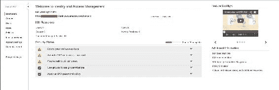

1.  现在，点击左窗格中的第三个选项，名为用户。如果您的帐户是新的，您将看不到用户。现在，让我们创建一个新用户--为此，请点击右窗格中的“添加用户”按钮：


1.  一旦您点击“添加用户”按钮，将加载一个新页面，并要求输入用户名以及您希望用户访问帐户的方式。例如，如果您打算仅将此用户`manish`用于编程目的，那么建议您取消选中 AWS 管理控制台访问框，以便用户无需使用 AWS 管理控制台登录。参考以下截图：

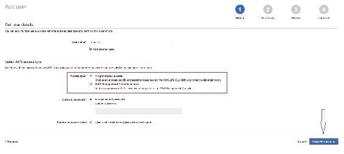

1.  完成后，点击屏幕右下方的“下一步：权限”按钮。接下来，您需要选择要授予此用户的权限，我们称之为 IAM 策略。这意味着现在用户应该能够根据定义的策略访问资源，以及用户在资源上允许的操作类型。现在，我们向此用户添加“Power User Access”策略。

1.  在内部，Power User Access 将具有 JSON 格式的策略，类似于这样：

```py
     { 
       "Version": "2012-10-17", 
       "Statement": [ 
            { 
              "Effect": "Allow", 
              "NotAction": [ 
                "iam:*", 
                "organizations:*" 
              ], 
              "Resource": "*" 
            }, 
            { 
              "Effect": "Allow", 
                "Action": "organizations:DescribeOrganization", 
                "Resource": "*" 
            } 
          ] 
      } 

```

有关 IAM 策略的更多信息，请阅读以下链接中的文档：[`docs.aws.amazon.com/IAM/latest/UserGuide/access_policies.html`](http://docs.aws.amazon.com/IAM/latest/UserGuide/access_policies.html)

使用 Microsoft Active Directory 的读者可以使用 AD 连接器轻松地将 AD 与 IAM 集成。有关更多信息，请阅读以下链接中提供的文章：[`aws.amazon.com/blogs/security/how-to-connect-your-on-premises-active-directory-to-aws-using-ad-connector/`](https://aws.amazon.com/blogs/security/how-to-connect-your-on-premises-active-directory-to-aws-using-ad-connector/)

考虑以下截图：

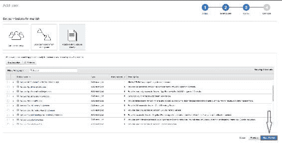

1.  一旦您为用户添加了策略，请点击屏幕右下方的“下一步：审查”按钮以继续。

1.  下一个屏幕将要求您进行审查，一旦确定，您可以点击“创建用户”按钮来创建用户：

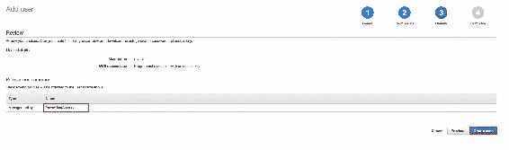

1.  一旦您点击“创建用户”按钮，用户将被创建，并且策略将附加到用户上。您现在将看到以下屏幕，其中自动生成了访问密钥和秘密密钥，您需要保密，并且绝对不与任何人分享：

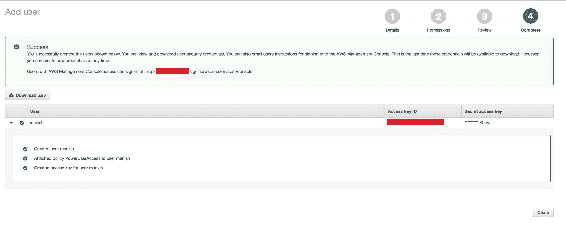

1.  现在我们的访问/秘密密钥已生成，是时候在 AWS 上构建我们的应用程序基础架构了。我们将使用以下工具来实现：

+   Terraform：这是一个用于在不同云平台上构建基础架构的开源工具

+   **CloudFormation**：这些是使用 AWS 资源构建应用程序基础架构的 AWS 服务

# Terraform - 一个构建基础架构的工具

Terraform 是一个用于在不同云平台（如 AWS、Azure 等）上构建、管理和版本化基础架构的工具。它可以管理基础架构的低级组件，如计算、存储、网络等。

在 Terraform 中，我们指定描述应用程序基础架构的资源规范的配置文件。Terraform 描述执行计划和要实现的期望状态。然后，它根据规范开始构建资源，并在构建后跟踪基础架构的当前状态，始终执行增量执行，如果配置发生更改。

以下是 Terraform 的一些特点：

+   Terraform 将您的数据中心描述为蓝图，可以进行版本控制，并可以管理为代码。

+   Terraform 在实际实施之前为您提供执行计划，这有助于您将执行计划与期望结果进行匹配。

+   Terraform 可以帮助您设计所有资源并并行创建资源。它可以让您了解资源之间的依赖关系，并确保在创建资源之前满足这些依赖关系。

+   凭借其洞察力，它可以让开发人员更好地控制基础架构的修改，减少人为错误。

在 Terraform 中，我们将 AWS 中的每项服务都视为需要创建的资源，因此我们需要为其创建提供其创建所需的强制属性。现在，让我们开始创建资源：

1.  首先，我们需要创建**VPC**（虚拟私有云），在其中启动所有其他资源。

注意：根据约定，我们需要按照`.tf`文件扩展名创建所有文件。

1.  所以，让我们创建一个空的`main.tf`文件。添加以下代码，用于设置服务提供商的访问和秘钥以进行身份验证：

```py
    # Specify the provider and access details 
        provider "aws" { 
          region = "${var.aws_region}" 
          access_key = "${var.aws_access_key}" 
          secret_key = "${var.aws_secret_key}" 
     } 

```

1.  正如您在前面的代码中所看到的，有一个值`${var.aws_region}`。实际上，这是一个约定，将所有值保存在一个名为`variables.tf`的单独文件中，所以我们在这里这样做。让我们用以下内容更改`variables.tf`文件：

```py
     variable "aws_access_key" { 
          description = "AWS access key" 
          default = ""                    # Access key 
      } 

     variable "aws_secret_key" { 
         description = "AWS secret access key" 
         default = ""                          # Secret key 
      } 

      variable "aws_region" { 
          description = "AWS region to launch servers." 
          default = "us-east-1" 
      } 

```

1.  接下来，我们需要创建 VPC 资源，所以让我们将以下代码添加到`main.tf`中：

```py
      # Create a VPC to launch our instances into 
        resource "aws_vpc" "default" { 
          cidr_block = "${var.vpc_cidr}" 
          enable_dns_hostnames = true 
          tags { 
            Name = "ms-cloud-native-app" 
          } 
      } 

```

1.  我们使用了一个变量，需要在`variables.tf`中定义如下：

```py
       variable "vpc_cidr"{ 
          default = "10.127.0.0/16"             # user defined 
       } 

```

1.  一旦定义了 VPC 资源，我们需要创建一个子网，该子网将与 EC2 机器、弹性负载均衡器或其他资源关联。因此，将以下代码添加到`main.tf`中：

```py
        # Create a subnet to launch our instances into 
        resource "aws_subnet" "default" { 
          vpc_id                  = "${aws_vpc.default.id}" 
          cidr_block              = "${var.subnet_cidr}" 
          map_public_ip_on_launch = true 
        } 

      Now, define the variable we have used in above code in 
      variables.tf 
      variable "subnet_cidr"{ 
       default = "10.127.0.0/24" 
      } 

```

1.  由于我们希望我们的资源可以从互联网访问，因此我们需要创建一个互联网网关，并将其与我们的子网关联，以便其中创建的资源可以通过互联网访问。

注意：我们可以创建多个子网来保护我们资源的网络。

1.  将以下代码添加到`main.tf`中：

```py
     # Create an internet gateway to give our subnet access to the
     outside world 
     resource "aws_internet_gateway" "default" { 
     vpc_id = "${aws_vpc.default.id}" 
      } 

     # Grant the VPC internet access on its main route table 
     resource "aws_route" "internet_access" { 
     route_table_id         = "${aws_vpc.default.main_route_table_id}" 
     destination_cidr_block = "0.0.0.0/0" 
     gateway_id             = "${aws_internet_gateway.default.id}" 

```

1.  接下来，我们需要确保您将启动 EC2 机器的子网为机器提供公共地址。这可以通过将下面给出的代码添加到您的`main.tf`中来实现：

```py
     # Create a subnet to launch our instances into 
     resource "aws_subnet" "default" { 
       vpc_id                  = "${aws_vpc.default.id}" 
       cidr_block              = "${var.subnet_cidr}" 
       map_public_ip_on_launch = true 
     } 

```

1.  一旦配置完成，就该开始创建应用服务器和 MongoDB 服务器了。

1.  最初，我们需要创建依赖资源，例如安全组，否则无法启动 EC2。

1.  将以下代码添加到`main.tf`中以创建安全组资源：

```py
    # the instances over SSH and HTTP 
    resource "aws_security_group" "default" { 
    name        = "cna-sg-ec2" 
    description = "Security group of app servers" 
    vpc_id      = "${aws_vpc.default.id}" 

    # SSH access from anywhere 
    ingress { 
     from_port   = 22 
     to_port     = 22 
     protocol    = "tcp" 
     cidr_blocks = ["0.0.0.0/0"] 
    } 

    # HTTP access from the VPC 
    ingress { 
      from_port   = 5000 
      to_port     = 5000 
      protocol    = "tcp" 
      cidr_blocks = ["${var.vpc_cidr}"] 
     } 

     # outbound internet access 
     egress { 
      from_port   = 0 
      to_port     = 0 
      protocol    = "-1" 
      cidr_blocks = ["0.0.0.0/0"] 
    } 
   } 

```

1.  在这个安全组中，我们只打开`22`和`5000`端口，以便进行 ssh 和访问我们的应用程序。

1.  接下来，我们需要添加/创建 ssh 密钥对，您可以在本地机器上生成并上传到 AWS，也可以从 AWS 控制台生成。在我们的情况下，我使用`ssh-keygen`命令在本地机器上生成了一个 ssh 密钥。现在，为了在 AWS 中创建 ssh 密钥对资源，将以下代码添加到`main.tf`中：

```py
   resource "aws_key_pair" "auth" { 
     key_name   = "${var.key_name}" 
      public_key = "${file(var.public_key_path)}" 
   }   

```

1.  添加以下代码片段到`variables.tf`文件中以为变量提供参数：

```py
    variable "public_key_path" { 
      default = "ms-cna.pub" 
    } 

```

1.  现在我们已经创建了依赖资源，是时候创建应用服务器（即 EC2 机器）了。因此，将以下代码片段添加到`main.tf`中：

```py
    resource "aws_instance" "web" { 
     # The connection block tells our provisioner how to 
     # communicate with the resource (instance) 
      connection { 
       # The default username for our AMI 
        user = "ubuntu" 
        key_file = "${var.key_file_path}" 
        timeout = "5m" 
      } 
     # Tags for machine 
     tags {Name = "cna-web"} 
     instance_type = "t2.micro" 
     # Number of EC2 to spin up 
      count = "1" 
      ami = "${lookup(var.aws_amis, var.aws_region)}" 
      iam_instance_profile = "CodeDeploy-Instance-Role" 
      # The name of our SSH keypair we created above. 
      key_name = "${aws_key_pair.auth.id}" 

     # Our Security group to allow HTTP and SSH access 
     vpc_security_group_ids = ["${aws_security_group.default.id}"] 
     subnet_id = "${aws_subnet.default.id}" 
    } 

```

1.  我们在 EC2 配置中使用了一些变量，因此需要在`variables.tf`文件中添加变量值：

```py
    variable "key_name" { 
      description = "Desired name of AWS key pair" 
      default = "ms-cna" 
    } 

   variable "key_file_path" { 
      description = "Private Key Location" 
      default = "~/.ssh/ms-cna" 
   } 

    # Ubuntu Precise 12.04 LTS (x64) 
     variable "aws_amis" { 
       default = { 
        eu-west-1 = "ami-b1cf19c6" 
        us-east-1 = "ami-0a92db1d" 
        #us-east-1 = "ami-e881c6ff" 
        us-west-1 = "ami-3f75767a" 
        us-west-2 = "ami-21f78e11" 
     } 
   } 

```

太好了！现在我们的应用服务器资源配置已经准备好了。现在，我们已经添加了应用服务器配置，接下来，我们需要为 MongoDB 服务器添加类似的设置，这对于保存我们的数据是必要的。一旦两者都准备好了，我们将创建 ELB（这将是用户应用访问的入口点），然后将应用服务器附加到 ELB。

让我们继续添加 MongoDB 服务器的配置。

# 配置 MongoDB 服务器

为 MongoDB 服务器的创建添加以下代码到`main.tf`：

```py
    resource "aws_security_group" "mongodb" { 
     name        = "cna-sg-mongodb" 
     description = "Security group of mongodb server" 
     vpc_id      = "${aws_vpc.default.id}" 

    # SSH access from anywhere 
    ingress { 
      from_port   = 22 
      to_port     = 22 
      protocol    = "tcp" 
      cidr_blocks = ["0.0.0.0/0"] 
     } 

    # HTTP access from the VPC 
    ingress { 
      from_port   = 27017 
      to_port     = 27017 
      protocol    = "tcp" 
      cidr_blocks = ["${var.vpc_cidr}"] 
     } 
    # HTTP access from the VPC 
     ingress { 
      from_port   = 28017 
      to_port     = 28017 
      protocol    = "tcp" 
      cidr_blocks = ["${var.vpc_cidr}"] 
      } 

    # outbound internet access 
    egress { 
      from_port   = 0 
      to_port     = 0 
      protocol    = "-1" 
      cidr_blocks = ["0.0.0.0/0"] 
     } 
   } 

```

接下来，我们需要为 MongoDB 服务器添加配置。还要注意，在以下配置中，我们在创建 EC2 机器时提供了 MongoDB 安装的服务器：

```py
    resource "aws_instance" "mongodb" { 
    # The connection block tells our provisioner how to 
    # communicate with the resource (instance) 
    connection { 
     # The default username for our AMI 
     user = "ubuntu" 
     private_key = "${file(var.key_file_path)}" 
     timeout = "5m" 
     # The connection will use the local SSH agent for authentication. 
     } 
    # Tags for machine 
    tags {Name = "cna-web-mongodb"} 
    instance_type = "t2.micro" 
    # Number of EC2 to spin up 
    count = "1" 
    # Lookup the correct AMI based on the region 
    # we specified 
    ami = "${lookup(var.aws_amis, var.aws_region)}" 
    iam_instance_profile = "CodeDeploy-Instance-Role" 
    # The name of our SSH keypair we created above. 
     key_name = "${aws_key_pair.auth.id}" 

     # Our Security group to allow HTTP and SSH access 
     vpc_security_group_ids = ["${aws_security_group.mongodb.id}"] 

     subnet_id = "${aws_subnet.default.id}" 
     provisioner "remote-exec" { 
      inline = [ 
        "sudo echo -ne '\n' | apt-key adv --keyserver 
         hkp://keyserver.ubuntu.com:80 --recv 7F0CEB10", 
       "echo 'deb http://repo.mongodb.org/apt/ubuntu trusty/mongodb- 
        org/3.2 multiverse' | sudo tee /etc/apt/sources.list.d/mongodb-
         org-3.2.list", 
       "sudo apt-get update -y && sudo apt-get install mongodb-org --
       force-yes -y", 
       ] 
     } 
   } 

```

仍然需要配置的最后一个资源是弹性负载均衡器，它将平衡客户请求以提供高可用性。

# 配置弹性负载均衡器

首先，我们需要通过将以下代码添加到`main.tf`来为我们的 ELB 创建安全组资源：

```py
    # A security group for the ELB so it is accessible via the web 
     resource "aws_security_group" "elb" { 
     name        = "cna_sg_elb" 
     description = "Security_group_elb" 
     vpc_id      = "${aws_vpc.default.id}" 

    # HTTP access from anywhere 
    ingress { 
      from_port   = 5000 
      to_port     = 5000 
      protocol    = "tcp" 
      cidr_blocks = ["0.0.0.0/0"] 
     } 

    # outbound internet access 
    egress { 
      from_port   = 0 
      to_port     = 0 
      protocol    = "-1" 
      cidr_blocks = ["0.0.0.0/0"] 
     } 

```

现在，我们需要添加以下配置来创建 ELB 资源，并将应用服务器添加到其中：

```py
    resource "aws_elb" "web" { 
    name = "cna-elb" 

     subnets         = ["${aws_subnet.default.id}"] 
     security_groups = ["${aws_security_group.elb.id}"] 
     instances       = ["${aws_instance.web.*.id}"] 
     listener { 
       instance_port = 5000 
       instance_protocol = "http" 
       lb_port = 80 
       lb_protocol = "http" 
      } 
     } 

```

现在，我们已经准备好运行 Terraform 配置了。

我们的基础设施配置已准备就绪，可以部署了。使用以下命令来了解执行计划是一个很好的做法：

```py
$ terraform plan

```

最后一个命令的输出应该类似于以下截图：

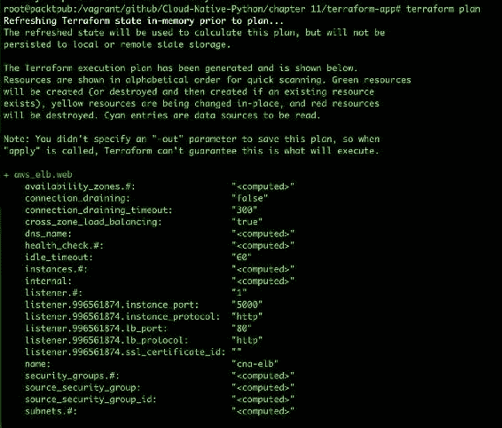

如果您没有看到任何错误，您可以执行以下命令来实际创建资源：

```py
$ terraform apply

```

输出应该看起来像这样：

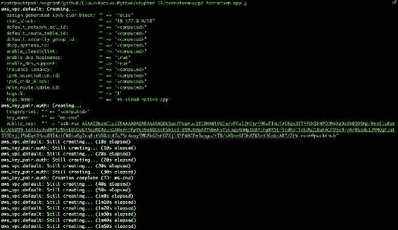

目前，我们还没有与我们注册的域，但如果我们已经在 Route 53 中注册并配置了域名，我们需要在`main.tf`中创建一个额外的资源，为我们的应用添加一个条目。我们可以使用以下代码来实现：

```py
    resource "aws_route53_record" "www" { 
      zone_id = "${var.zone_id}" 
      name = "www.domain.com" 
      type = "A" 
      alias { 
       name = "${aws_elb.web.dns_name}" 
       zone_id = "${aws_elb.web.zone_id}" 
       evaluate_target_health = true 
      } 
    } 

```

这就是我们需要做的一切。另外，使您的基础设施高度可用的另一种快速且最关键的方法是创建一个基于服务器指标使用（CPU 或内存）的自动扩展服务。我们提供条件来决定是否需要扩展我们的基础设施，以便我们的应用性能应该看到更少的延迟。

为了做到这一点，您可以在[`www.terraform.io/docs/providers/aws/r/autoscaling_group.html`](https://www.terraform.io/docs/providers/aws/r/autoscaling_group.html)查看 Terraform 文档。

目前，我们的应用尚未部署，我们将使用 Code Deploy 服务使用持续交付来部署我们的应用，我们将在本章的后面部分讨论。

在此之前，让我们看看如何使用 AWS 提供的名为**CloudFormation**的云平台服务创建相同的设置。

# CloudFormation - 使用代码构建基础设施的 AWS 工具

CloudFormation 是 AWS 的一个服务，它的工作方式类似于 Terraform。但是，在 CloudFormation 中，我们不需要访问/秘钥。相反，我们需要创建一个 IAM 角色，该角色将具有启动所需的所有资源的访问权限，以构建我们的应用。

您可以使用 YAML 或 JSON 格式编写您的 CloudFormation 配置。

让我们通过使用 CloudFormation 开始我们的基础设施设置，构建 VPC，在那里我们将创建一个 VPC，一个公共子网和一个私有子网。

让我们创建一个新文件`vpc.template`，其中 VPC 和子网（公共和私有）的配置如下：

```py
"Resources" : { 

   "VPC" : { 
     "Type" : "AWS::EC2::VPC", 
     "Properties" : { 
       "CidrBlock" : "172.31.0.0/16", 
       "Tags" : [ 
         {"Key" : "Application", "Value" : { "Ref" : "AWS::StackName"} }, 
         {"Key" : "Network", "Value" : "Public" } 
       ] 
     } 
   }, 
"PublicSubnet" : { 
     "Type" : "AWS::EC2::Subnet", 
     "Properties" : { 
       "VpcId" : { "Ref" : "VPC" }, 
       "CidrBlock" : "172.31.16.0/20", 
       "AvailabilityZone" : { "Fn::Select": [ "0", {"Fn::GetAZs": {"Ref": "AWS::Region"}} ]}, 
       "Tags" : [ 
         {"Key" : "Application", "Value" : { "Ref" : "AWS::StackName"} }, 
         {"Key" : "Network", "Value" : "Public" } 
       ] 
     } 
   }, 
   "PrivateSubnet" : { 
     "Type" : "AWS::EC2::Subnet", 
     "Properties" : { 
       "VpcId" : { "Ref" : "VPC" }, 
       "CidrBlock" : "172.31.0.0/20", 
       "AvailabilityZone" : { "Fn::Select": [ "0", {"Fn::GetAZs": {"Ref": "AWS::Region"}} ]}, 
       "Tags" : [ 
         {"Key" : "Application", "Value" : { "Ref" : "AWS::StackName"} }, 
         {"Key" : "Network", "Value" : "Public" } 
       ] 
     } 
   }, 

```

上述配置是以 JSON 格式编写的，以便让您了解 JSON 配置。此外，我们还需要指定路由表和互联网网关的配置如下：

```py
"PublicRouteTable" : { 
     "Type" : "AWS::EC2::RouteTable", 
     "Properties" : { 
       "VpcId" : {"Ref" : "VPC"}, 
       "Tags" : [ 
         {"Key" : "Application", "Value" : { "Ref" : "AWS::StackName"} }, 
         {"Key" : "Network", "Value" : "Public" } 
       ] 
     } 
   }, 

   "PublicRoute" : { 
     "Type" : "AWS::EC2::Route", 
     "Properties" : { 
       "RouteTableId" : { "Ref" : "PublicRouteTable" }, 
       "DestinationCidrBlock" : "0.0.0.0/0", 
       "GatewayId" : { "Ref" : "InternetGateway" } 
     } 
   }, 

   "PublicSubnetRouteTableAssociation" : { 
     "Type" : "AWS::EC2::SubnetRouteTableAssociation", 
     "Properties" : { 
       "SubnetId" : { "Ref" : "PublicSubnet" }, 
       "RouteTableId" : { "Ref" : "PublicRouteTable" } 
     } 
   } 
 }, 

```

现在我们已经有了可用的配置，是时候从 AWS 控制台为 VPC 创建一个堆栈了。

# AWS 上的 VPC 堆栈

执行以下步骤，从 AWS 控制台为 VPC 创建一个堆栈：

1.  转到[`console.aws.amazon.com/cloudformation/home?region=us-east-1#/stacks/new`](https://console.aws.amazon.com/cloudformation/home?region=us-east-1#/stacks/new)使用 CloudFormation 创建一个新的堆栈。您应该看到一个如此截图所示的屏幕：

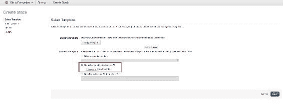

提供模板文件的路径，然后点击“下一步”按钮。

1.  在下一个窗口中，我们需要指定堆栈名称，这是我们堆栈的唯一标识符，如下所示：


提供堆栈名称，然后点击“下一步”。

1.  下一个屏幕是可选的；如果我们想设置**SNS**（**通知服务**）或为其添加 IAM 角色，我们需要在这里添加它：

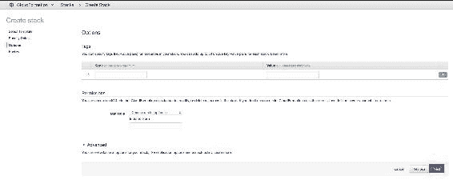

如果要启用通知和 IAM 角色，请添加详细信息，然后点击“下一步”。

1.  下一个屏幕是用于审查细节，并确保它们正确以创建堆栈：

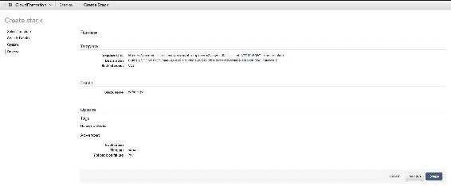

准备好后，点击“创建”来启动堆栈创建。在创建时，您可以检查事件以了解资源创建的状态。

您应该会看到一个类似于这样的屏幕：

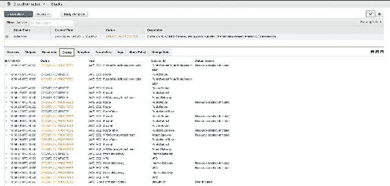

在前面的屏幕上，您将能够看到堆栈的进度，如果出现错误，您可以使用这些事件来识别它们。

一旦我们的 VPC 堆栈准备好，我们需要在我们的 VPC 中创建 EC2、ELB 和自动缩放资源。我们将使用 YAML 格式来为您提供如何以 YAML 格式编写配置的概述。

您可以在`<repository 路径>`找到完整的代码。我们将使用`main.yml`文件，其中包含有关您需要启动实例的 VPC 和子网的详细信息。

1.  为了启动堆栈，请转到以下链接：

[`console.aws.amazon.com/cloudformation/home?region=us-east-1#/stacks/new`](https://console.aws.amazon.com/cloudformation/home?region=us-east-1#/stacks/new)

在启动配置中将会有一个变化--不再在文件中指定值，而是在提供细节的时候在 AWS 控制台中指定，如下所示：

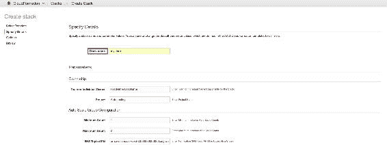

1.  请参考以下截图，提供您想要部署应用程序的实例细节：

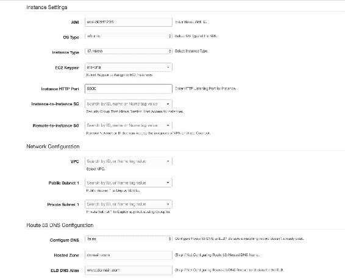

1.  一旦您在上一个屏幕中提供了所有的细节，向下滚动到下一部分，在那里它将要求 ELB 的细节，如下一张截图所示：

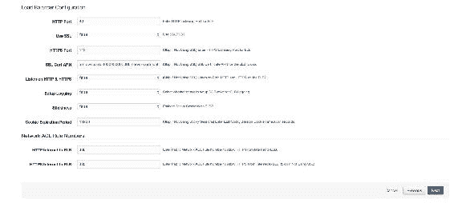

剩下的步骤对于创建 AWS CloudFormation 堆栈来说是一样的。为了添加 MongoDB 服务器，我们需要在`main.yml`中添加 EC2 机器的配置。

在 AWS CloudFormation 中创建配置是很简单的，因为 AWS 提供了一些模板，我们可以用作创建我们的模板的参考。以下是模板的链接：

[`aws.amazon.com/cloudformation/aws-cloudformation-templates/`](https://aws.amazon.com/cloudformation/aws-cloudformation-templates/)

这就是我们为构建基础设施所做的一切；现在是我们的应用程序在应用服务器上部署的时候了。

# 云原生应用程序的持续部署

在前面的部分，我们成功地设置了基础设施，但我们还没有部署应用程序。此外，我们需要确保进一步的部署应该使用持续部署来处理。由于我们的开发环境在本地机器上，我们不需要设置持续集成周期。然而，对于许多开发人员协作工作的大型公司，我们需要使用 Jenkins 设置一个单独的持续集成管道。在我们的情况下，我们只需要持续部署。我们的持续部署管道将是这样的：

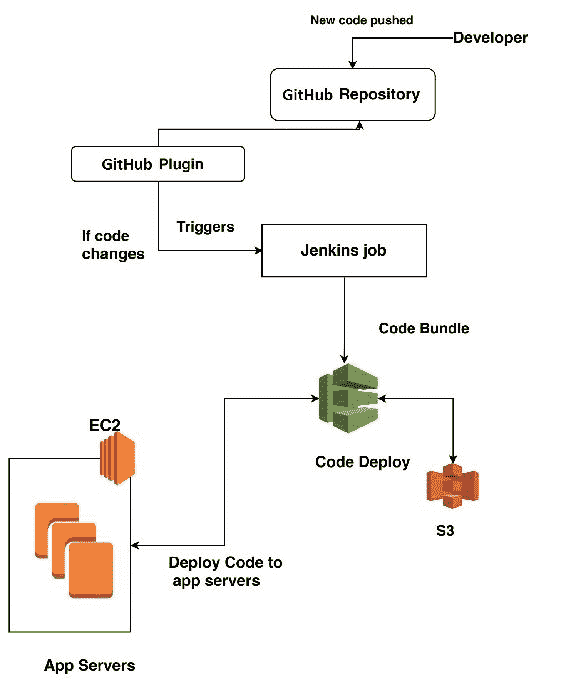

# 它是如何工作的

它从开发人员将新代码推送到其版本控制系统的主分支开始（在我们的情况下，它是 GitHub）。一旦新代码被推送，Jenkins 的 GitHub 插件根据其定义的工作检测到更改，并触发 Jenkins 作业将新代码部署到其基础设施。然后 Jenkins 与 Code Deploy 通信，触发代码到 Amazon EC2 机器。由于我们需要确保我们的部署是成功的，我们可以设置一个通知部分，它将通知我们部署的状态，以便在需要时可以回滚。

# 持续部署管道的实施

让我们首先从配置 AWS 服务开始，从 Code Deploy 开始，这将帮助我们在可用的应用服务器上部署应用程序。

1.  最初，当您切换到代码部署服务时（[`us-west-1.console.aws.amazon.com/codedeploy/`](https://us-west-1.console.aws.amazon.com/codedeploy/)），您应该会看到以下屏幕：

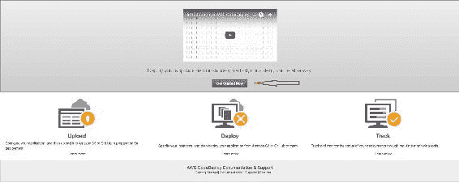

前面的屏幕截图是 Code Deploy 的介绍页面，展示了其功能。

1.  点击页面中间的“立即开始”按钮以继续前进。

1.  接下来，您应该看到以下屏幕，该屏幕将建议您部署一个示例应用程序，这对于初始阶段来说是可以的。但是由于我们已经建立了基础设施，在这种情况下，我们需要选择自定义部署--这将跳过演练。因此，选择该选项，然后单击“下一步”。

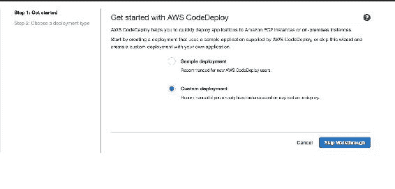

1.  点击“跳过演练”以继续前进。

1.  在下一个向导屏幕中，有几个需要审查的部分。

第一部分将要求您创建应用程序--您需要提供用户定义的应用程序名称和部署组名称，这是强制性的，因为它成为您的应用程序的标识符：

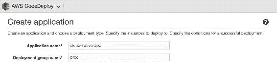

1.  向下滚动到下一部分，该部分讨论您希望为应用程序选择的部署类型。有两种方法，定义如下：

+   **蓝/绿部署**：在这种类型中，在部署过程中，会启动新实例并向其部署新代码，如果其健康检查正常，则会替换为旧实例，然后旧实例将被终止。这适用于生产环境，客户无法承受停机时间。

+   **原地部署**：在这种部署类型中，新代码直接部署到现有实例中。在此部署中，每个实例都会脱机进行更新。

我们将选择**原地部署**，但选择会随着用例和产品所有者的决定而改变。例如，像 Uber 或 Facebook 这样的应用程序，在部署时无法承受停机时间，将选择蓝/绿部署，这将为它们提供高可用性。

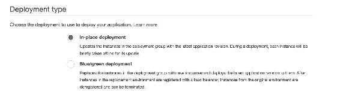

1.  让我们继续下一节，讨论应用程序将要部署的基础设施。我们将指定实例和 ELB 的详细信息，如此屏幕截图所示：

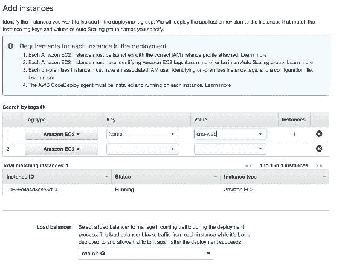

1.  在下一部分中，我们将定义部署应用程序的方式。例如，假设您有 10 个实例。您可能希望一次在所有这些实例上部署应用程序，或者一次一个，或者一次一半。我们将使用默认选项，即`CodeDeployDefault.OneAtATime`：

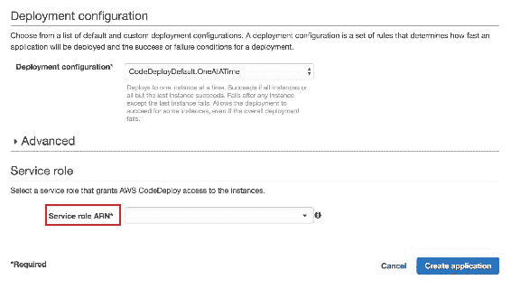

在本节中，我们还需要指定一个服务角色，Code Deploy 需要该角色来在您的 AWS 资源上执行操作，更具体地说是在 EC2 和 ELB 上。

要了解更多有关服务角色创建的信息，请转到此链接的 AWS 文档：[`docs.aws.amazon.com/IAM/latest/UserGuide/id_roles_create.html`](http://docs.aws.amazon.com/IAM/latest/UserGuide/id_roles_create.html)

1.  提供所需信息后，点击“创建应用程序”。

一旦您的应用程序准备就绪，您将看到以下屏幕：

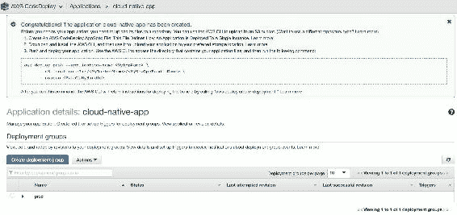

现在我们已经准备好部署。我们只需要在 Jenkins 中创建一个作业，并添加一个带有 CodeDeploy 详细信息的后置构建部分。

作业的创建类似于我们在上一章中解释的内容。但是需要进行以下几个更改：

1.  首先，我们需要确保已安装了一些 Jenkins 插件，即 AWS CodeDeploy Plugin for Jenkins，Git 插件，GitHub 插件等。

1.  安装了插件后，您应该在后置构建操作列表中看到新的操作，如下面的屏幕截图所示：

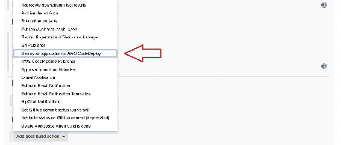

1.  接下来，您需要选择“部署应用程序到 AWS CodeDeploy”操作。将添加一个新部分，我们需要提供在 AWS 控制台中创建的 CodeDeploy 应用程序的详细信息，如此屏幕截图所示：

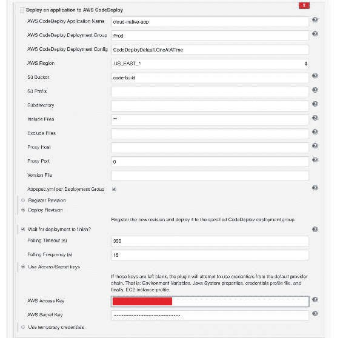

1.  我们还需要提供在本章开头部分创建的访问/秘钥，即*生成认证密钥*。这是必要的，因为 Jenkins 在打包应用程序后需要将其上传到 S3，并指示 CodeDeploy 从指定的存储桶部署最新构建。

我们需要做的就是这些。现在我们的 Jenkins 作业已经准备好部署应用程序了。试一下，应该会像黄油一样顺利。

# 总结

这一章在各个方面都非常有趣。首先，你对 AWS 服务有了基本的了解，以及如何充分利用它们。接下来，我们探讨了我们在 AWS 云上应用程序的架构，这将塑造你对未来可能计划创建的不同应用程序/产品的架构设计的看法。我们还使用了 Terraform，这是一个第三方工具，用于将基础架构构建为 AWS 代码。最后，我们部署了我们的应用程序，并使用 Jenkins 创建了一个持续的部署流水线。在下一章中，我们将探索微软拥有的另一个云平台--Microsoft Azure。保持活力，准备好在接下来的章节中探索 Azure。到时见！
