# 第十二章：在 Azure 平台上实施

在上一章中，我们看到了一个用于托管我们的应用程序的云计算平台--AWS--其中包含了所有功能，以使应用程序具有高可用性，并且没有停机时间。在本章中，我们将讨论另一个名为**Microsoft Azure**的云平台。

本章包括以下主题：

+   介绍 Microsoft Azure

+   构建应用程序基础设施 Azure 服务

+   使用 Jenkins 与 Azure 进行 CI/CD

# 开始使用 Microsoft Azure

正如其名称所示，Microsoft Azure 是由微软拥有的公共云平台，为其客户提供不同的 PaaS 和 IaaS 服务。一些流行的服务包括虚拟机、应用服务、SQL 数据库、资源管理器等。

Azure 服务主要分为这两个类别：

+   **平台服务**：这些是为客户提供环境来构建、管理和执行他们的应用程序，同时自行处理基础架构的服务。以下是一些 Azure 服务按其各种类别：

+   **管理服务**：这些提供了管理门户和市场服务，提供了 Azure 中的图库和自动化工具。

+   **计算**：这些是诸如 fabric、函数等服务，帮助开发人员开发和部署高度可扩展的应用程序。

+   **CDN 和媒体**：这些分别提供全球范围内安全可靠的内容传递和实时流媒体。

+   **Web +移动**：这些是与应用程序相关的服务，如 Web 应用程序和 API 应用程序，主要用于 Web 和移动应用程序。

+   **分析**：这些是与大数据相关的服务，可以帮助机器学习开发人员进行实时数据处理，并为您提供有关数据的见解，如 HDInsight、机器学习、流分析、Bot 服务等。

+   **开发工具**：这些服务用于版本控制、协作等。它包括 SDK 等。

+   **AI 和认知服务**：这些是基于人工智能的服务，例如语音、视觉等。一些提供此类服务的服务包括文本分析 API、认知等。

+   **基础设施服务**：这些是服务提供商负责硬件故障的服务。服务器的定制是客户的责任。客户还管理其规格：

+   **服务器计算和容器**：这些是虚拟机和容器等服务，为客户应用程序提供计算能力。

+   **存储**：这些分为两种类型--BLOB 和文件存储。根据延迟和速度提供不同的存储能力。

+   **网络**：这些提供了一些与网络相关的服务，如负载均衡器和虚拟网络，可以帮助您保护网络，并使其对客户响应更加高效。

以下图表将更好地理解 Azure 平台：

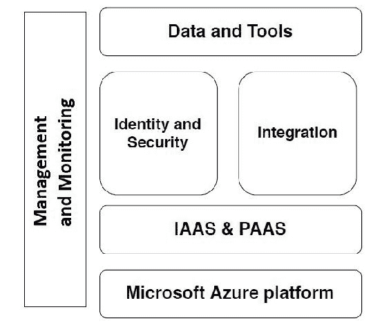

您可以在以下链接详细查看所有 Microsoft Azure 产品提供：

[`azure.microsoft.com/en-in/services/`](https://azure.microsoft.com/en-in/services/)

要开始使用 Microsoft Azure，您需要拥有一个账户。由于本章涉及在 Azure 上实施我们的应用程序，我们不会介绍如何创建账户。如果您需要帮助，可以阅读以下链接中的文章，这将确实帮助您：

[`medium.com/appliedcode/setup-microsoft-azure-account-cbd635ebf14b`](https://medium.com/appliedcode/setup-microsoft-azure-account-cbd635ebf14b)

Azure 提供了一些基于 SaaS 的服务，您可以在[`azuremarketplace.microsoft.com/en-us`](https://azuremarketplace.microsoft.com/en-us)上查看。

# 关于 Microsoft Azure 基础知识的几点

一旦您准备好并登录到您的 Azure 账户，您将被重定向到 Azure 门户([`portal.azure.com`](https://portal.azure.com))，它将展示 Azure 服务。最初，Azure 提供了一个免费账户，并为您的使用提供了价值为 200 美元的信用额，有效期为 30 天。微软 Azure 也支持按需付费模式，当您用完所有免费信用后，可以切换到付费账户。

以下是您在继续之前应该了解的一些 Azure 基本概念：

+   **Azure 资源管理器**: 最初，Azure 基于一种称为**ASM**(**Azure 服务管理器**)的部署模型。在最新版本的 Azure 中，采用了**ARM**(**Azure 资源管理器**)，它提供了高可用性和更灵活性。

+   **Azure 区域**: 全球分布约 34 个区域。

+   Azure 区域列表可在[`azure.microsoft.com/en-us/regions/`](https://azure.microsoft.com/en-us/regions/)上找到。

+   特定区域所有服务的列表可在[`azure.microsoft.com/en-us/regions/services/`](https://azure.microsoft.com/en-us/regions/services/)上找到。

+   **Azure 自动化**: Azure 提供了许多模板在不同的基于 Windows 的工具中，如 Azure-PowerShell，Azure-CLI 等。您可以在[`github.com/Azure`](https://github.com/Azure)找到这些模板。

由于 Azure 是由微软拥有的，我们将主要在 Azure 控制台(UI)上工作，并通过它创建资源。Azure 环境非常适合喜欢在 Windows 系统上部署他们的应用程序的开发人员或 DevOps 专业人员，他们的应用程序是用.NET 或 VB 编写的。它还支持最新的编程语言，如 Python，ROR 等。

对于喜欢在 Microsoft 产品上工作的人来说，Microsoft Azure 是理想的选择，比如 Visual Studio。

# 使用 Azure 架构我们的应用基础设施

一旦您进入 Azure 门户，您应该在屏幕上看到以下默认仪表板：

现在是时候在 MS Azure 上架构我们的应用基础设施了。我们将按照下面给出的架构图创建我们在 Azure 上的生产环境：

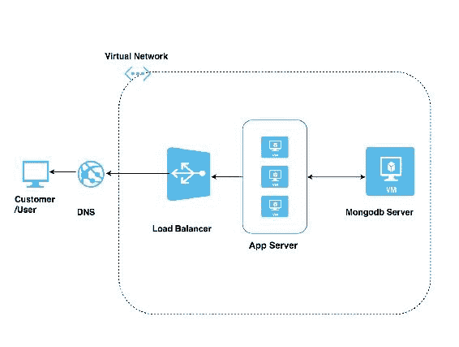

在这个架构中，我们将使用一些 Azure 服务，它们如下：

+   **虚拟机**: 这类似于我们在 AWS 中的 EC2 机器。我们将在虚拟机中部署我们的应用程序和 MongoDB 服务器。

+   **虚拟网络**: 虚拟网络在 AWS 中等同于 VPC，需要创建以保持我们的通信网络安全。

+   **存储**: 每个虚拟机都由一个存储账户支持，我们不需要显式创建，因为它会随着虚拟机一起创建来存储您的数据。

+   **负载均衡器**: 这个负载均衡器的使用与 AWS 中的负载均衡器相同，但它们在算法上有轻微的变化，因为 Azure 主要遵循基于哈希的平衡或源 IP 算法，而 AWS 遵循轮询算法或粘性会话算法。

+   **DNS**: 当我们有域名注册时，DNS 很有用，我们需要从 Azure 管理我们的 DNS。在云平台中，我们称之为**区域**。

+   **子网**: 我们将在虚拟网络中创建一个子网，以区分我们的资源，这些资源需要面向互联网或不需要。

+   **自动扩展**: 我们在图中没有提到这一点，因为它取决于您的应用需求和客户响应。

因此，让我们开始创建我们的应用服务器(即虚拟机)，我们的应用程序将驻留在其中。

正如我之前提到的，Azure 有一个非常用户友好的 UI，它会根据您定义的资源在后台创建程序代码，并使用资源管理器将其提供给您，这使得 DevOps 工程师的工作更加轻松。

# 在 Azure 中创建虚拟机

按照下面列出的步骤在 Microsoft Azure 中创建一个虚拟机：

1.  转到 Azure 仪表板，并在左侧面板中选择 新建 以启动 VM 向导，如下截图所示：

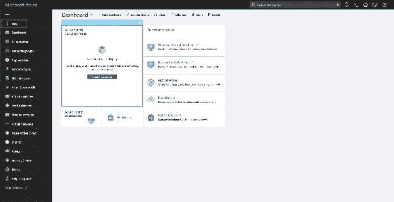

1.  现在我们需要选择要启动的操作系统。我们将在列表中选择 **Ubuntu Server 16.04 LTS** 服务器选项（我们选择此选项，因为我们的应用程序是在 Ubuntu 操作系统上开发的）。

在接下来的屏幕中，我们需要选择部署模型。有两种部署模型可用。它们是经典型（标准 VM）和资源管理器（高可用性 VM）。选择资源管理器模型，如下截图所示，然后点击 创建 按钮继续：

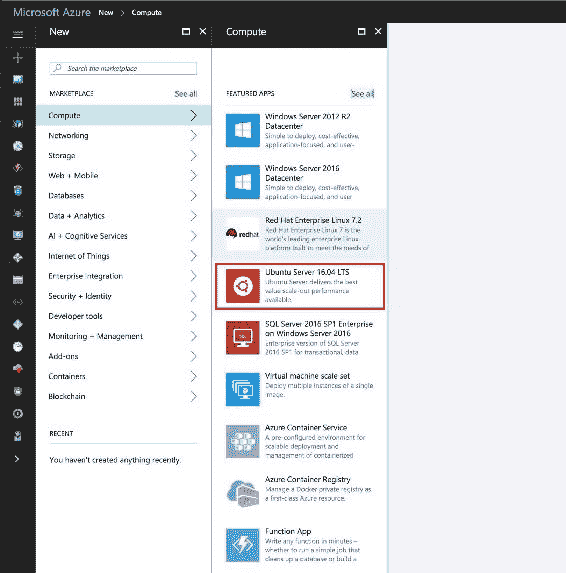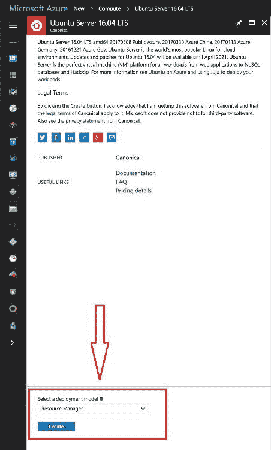

1.  在下一个屏幕上，我们需要提供 VM 的用户名和身份验证方法，如下截图所示；点击 确定 继续：

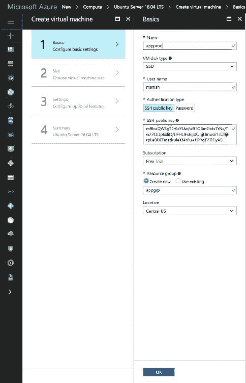

1.  接下来，我们需要根据需求选择虚拟机的大小。我们将选择标准型的 DS1_V2。选择它，然后点击页面底部的 选择 按钮，如下所示：

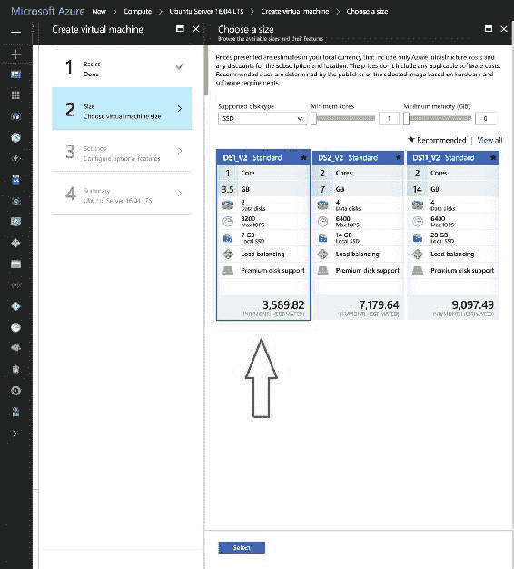

1.  在下一个屏幕中，我们将定义一些可选细节，如网络、子网、公共 IP 地址、安全组、监视等：

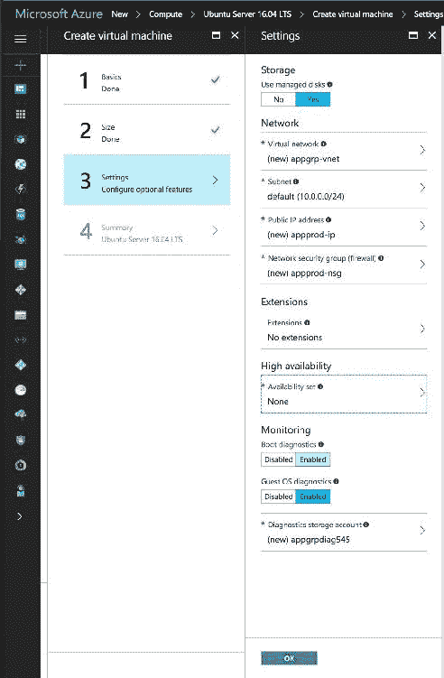

每次创建虚拟网络时，都建议创建一个虚拟网络，并通过单击虚拟网络进行选择。在管理和非管理磁盘方面，我更喜欢管理磁盘。这是因为在非管理磁盘中，我们选择创建存储帐户，而且由于我们为多个应用服务器创建它，每个应用服务器将有其单独的存储帐户。所有存储帐户可能都会落入单个存储单元，这可能导致单点故障。另一方面，在管理磁盘的情况下，Azure 通过将我们的磁盘存储在单独的存储单元中来管理我们的磁盘，这使其高度可用。

如果您不提供这些细节，系统将自动设置。

1.  在下一个屏幕中，我们需要审查向导中定义的所有细节，如下截图所示：

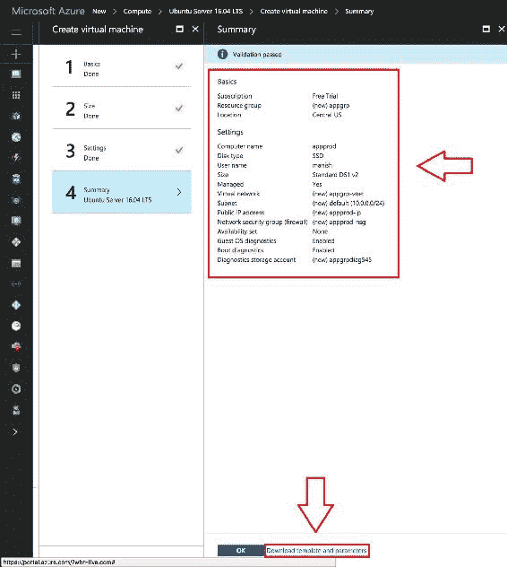

1.  在页面底部，您将找到一个链接，该链接将使您能够以模板形式或以不同语言的代码形式下载完整的配置。请参阅以下截图，显示了我们提供的配置生成的代码：

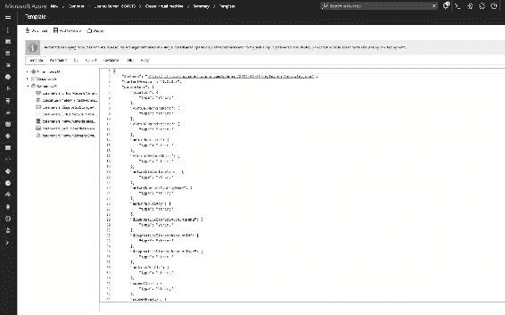

1.  点击 确定 开始部署虚拟机。

现在，我们的仪表板应该在一段时间后运行一个 VM，如下截图所示：

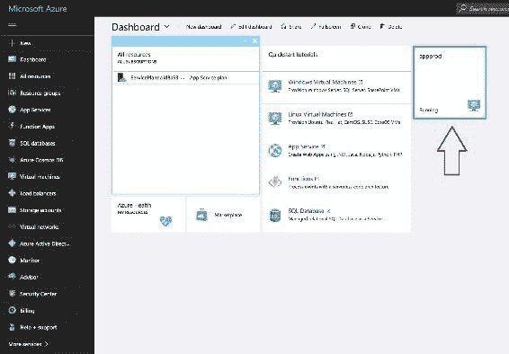

现在您可以访问虚拟机，下载您的应用程序，并像在本地机器上一样部署它。

同样，我们可以为您的应用程序创建多个 VM 实例，作为应用服务器。

此外，我们可以创建一个带有 MongoDB 服务器安装的 VM。您需要遵循的安装步骤与我们在第四章中定义的步骤类似，*交互式数据服务*。

我们可以通过单击仪表板上的 VM（即 appprod）图标来查看 VM 的性能，应该如下截图所示：

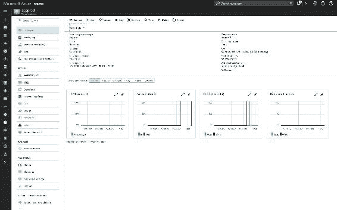

接下来，我们需要将之前创建的应用服务器添加到负载均衡器中。因此，我们需要按以下步骤创建负载均衡器：

+   转到 [`portal.azure.com/?whr=live.com#blade/HubsExtension/Resources/resourceType/Microsoft.Network%2FLoadBalancers`](https://portal.azure.com/?whr=live.com#blade/HubsExtension/Resources/resourceType/Microsoft.Network%2FLoadBalancers)，并点击屏幕中央的创建负载均衡器按钮，如下截图所示：

+   在下一个屏幕中，我们需要指定 LB 名称，并提供 LB 用途的类型。我们可以在此处启动 ELB，与您的应用服务器在同一组中，如下所示：

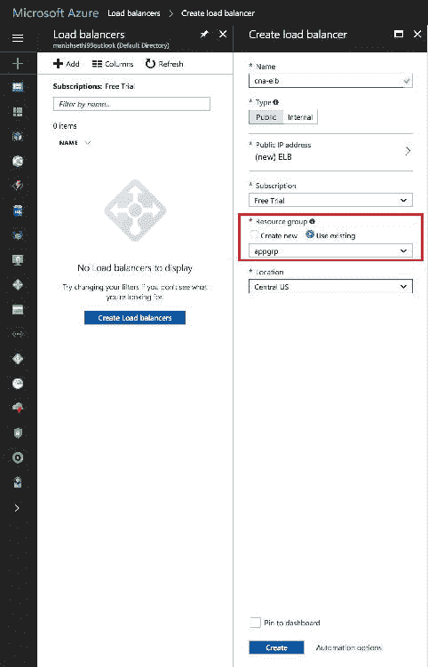

单击“创建”按钮以启动 LB 创建。

1.  一旦负载均衡器准备好供我们使用，我们应该能够看到以下屏幕，显示其详细信息：

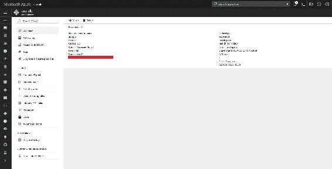

1.  接下来，我们需要添加后端池，即我们的应用服务器，如下截图所示：

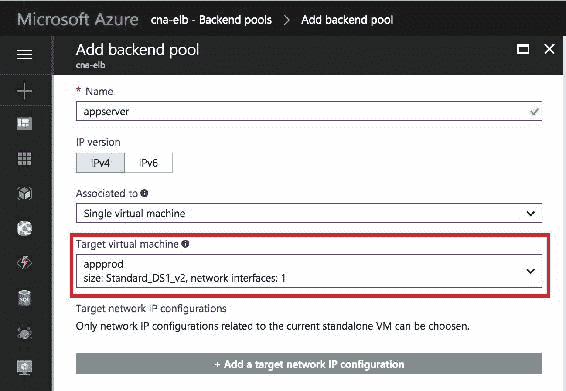

1.  现在我们需要添加健康探测，即您的应用程序的健康状态，如下所示：

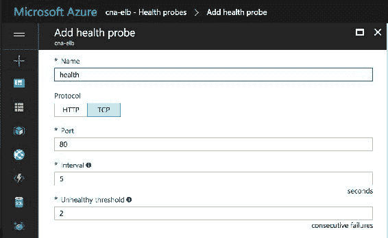

接下来，我们将按照这里所示的方式为我们的应用程序添加前端池。

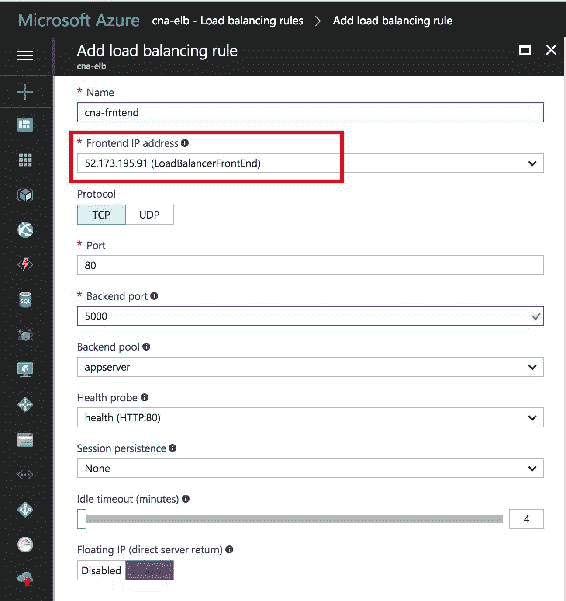

现在我们已经为我们的应用程序设置好了负载均衡器。

您可以在 Azure 文档的此链接中阅读有关负载均衡器的更多信息：[`docs.microsoft.com/en-us/azure/load-balancer/load-balancer-overview`](https://docs.microsoft.com/en-us/azure/load-balancer/load-balancer-overview)

现在，我们已经根据我们的架构图创建了基础设施。是时候为我们在 Azure 基础设施上部署应用程序配置 Jenkins 了。

# 使用 Jenkins 和 Azure 进行 CI/CD 流水线

首先，我们需要转到活动目录服务，您可以在下一个截图中看到：

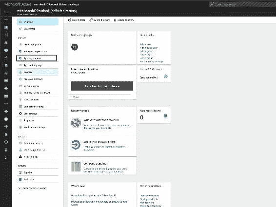

现在我们需要注册我们的应用程序，因此，请在左窗格中选择“应用程序注册”。您将看到一个类似于下一个屏幕的屏幕，在那里您需要提供您的应用程序详细信息：

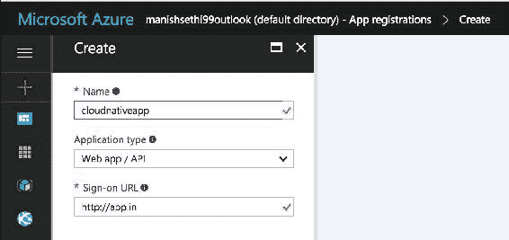

1.  之后，您将能够生成访问 Jenkins 作业所需的密钥。

1.  您将看到下一个屏幕，其中包含秘密密钥的详细信息，您还将在同一页上找到其他详细信息，例如“对象 ID”和“应用程序 ID”：

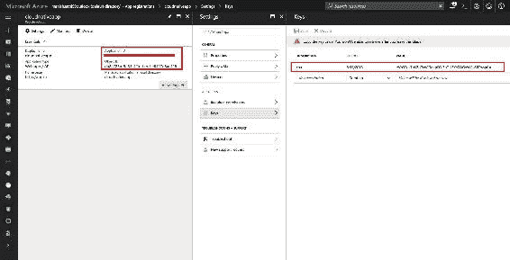

现在我们有了配置 Jenkins 作业所需的信息。因此，请转到 Jenkins 控制台，在“管理 Jenkins”部分中的“管理插件”中安装插件“Azure VM 代理”。

安装插件后，转到“管理 Jenkins”，单击“配置系统”，如下一个截图所示：

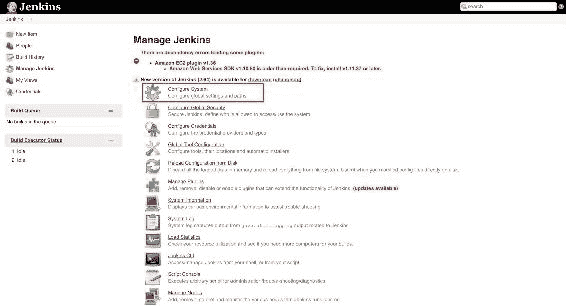

在下一个屏幕中，滚动到名为 Cloud 的底部部分，单击“添加云”按钮，并选择新的 Microsoft Azure VM 代理选项。这将在同一页上生成一个部分。

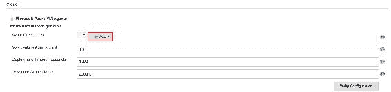

您可以在其文档中阅读有关 MS Azure VM 代理插件的更多信息（[`wiki.jenkins.io/display/JENKINS/Azure+VM+Agents+plugin`](https://wiki.jenkins.io/display/JENKINS/Azure+VM+Agents+plugin)）。

在最后一个屏幕中，您需要添加之前生成的 Azure 凭据。如果您单击下一个屏幕中可以看到的“添加”按钮，您可以添加诸如“订阅 ID”等值：

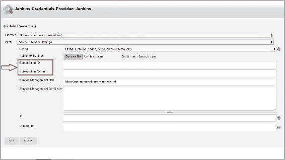

在同一部分的下一部分，您需要提供 VM 的详细配置，例如模板、VM 类型等：

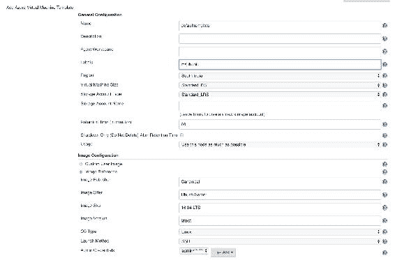

在上面的截图中，标签是最重要的属性，我们将在 Jenkins 作业中使用它来识别该组。

现在，您需要提供您想要执行的操作，也就是说，如果您想要部署您的应用程序，您可以提供下载代码并运行应用程序的命令。

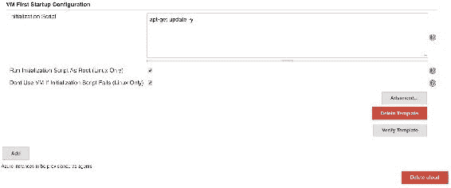

单击“保存”以应用设置。

现在，在 Jenkins 中创建一个新的作业。此外，在 GitBucket 部分，您通常提供存储库详细信息的地方，您将找到一个新的复选框，称为“限制此项目可以运行的位置”，并要求您提供标签表达式名称。在我们的情况下，它是`msubuntu`。就是这样！

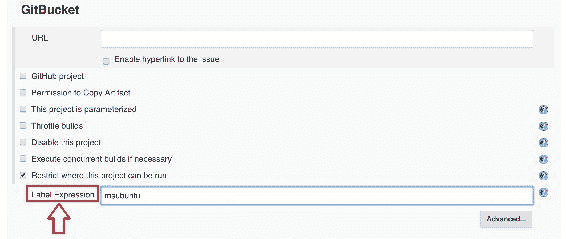

现在我们已经准备好运行我们的 Jenkins 作业，将我们的应用程序部署到 VM（即应用服务器）上。

最后，我们能够在 Azure 平台上部署我们的应用程序。

# 总结

在本章中，您已经了解了由微软提供的 Azure 平台，并在其上部署了您的云原生应用程序。我们看了一种在 Azure 平台上构建相同基础设施的不同方法。您还看到了 Jenkins 与 Azure 平台的集成，用于 CI/CD。在下一章中，我们将看看一些非常有用的工具，用于管理和解决与应用程序相关的问题，并以更快的方式解决这些问题，以便我们的应用程序可以保持零停机时间。敬请关注下一章关于监控的内容！
