# 第十三章：监控云应用程序

在前几章中，我们讨论了云原生应用程序开发，并将其部署到云平台供客户使用，以提高可用性。我们的工作还没有结束。基础设施和应用程序管理是一个完全独立的领域或流，它监控基础设施以及应用程序的性能，使用工具实现最小或零停机。在本章中，我们将讨论一些可以帮助您做到这一点的工具。

本章将涵盖以下主题：

+   AWS 服务，如 CloudWatch，Config 等

+   Azure 服务，如应用程序洞察、日志分析等

+   ELK 堆栈的日志分析简介

+   开源监控工具，如 Prometheus 等

# 在云平台上进行监控

到目前为止，我们已经讨论了如何开发应用程序并在不同平台上部署它，以使其对客户业务模型有用。然而，即使在开发应用程序之后，您仍需要具有专业知识的人员，他们将利用工具在平台上管理您的应用程序，这可能是公共云或本地部署。

在本节中，我们将主要讨论公共云提供商提供的工具或服务，使用这些工具我们可以管理基础设施，并关注应用程序洞察，即性能。

在继续讨论工具之前，让我们在为任何应用程序分配基础设施时考虑一些要点：

+   定期对一定的请求集合进行负载测试是一个好的做法。这将帮助您判断应用程序的初始资源需求。我们可以提到的一些工具是 Locust ([`locust.io/`](http://locust.io/))和 JMeter ([`jmeter.apache.org/`](https://jmeter.apache.org/))。

+   建议以最少的配置分配资源，并使用与应用程序使用情况相关的自动扩展工具。

+   在资源分配方面应该尽量减少手动干预。

考虑所有前述要点。确保建立监控机制以跟踪资源分配和应用程序性能是必要的。让我们讨论云平台提供的服务。

# 基于 AWS 的服务

以下是**AWS**（**亚马逊云服务**）提供的服务及其在应用程序和基础设施监控方面的使用。

# 云监控

这项 AWS 服务跟踪您的 AWS 资源使用情况，并根据定义的警报配置向您发送通知。可以跟踪 AWS 计费、Route 53、ELB 等资源。以下屏幕截图显示了一个触发的警报：

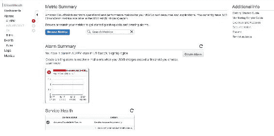

最初，我们必须在[`console.aws.amazon.com/cloudwatch/home?region=us-east-1#alarm:alarmFilter=ANY`](https://console.aws.amazon.com/cloudwatch/home?region=us-east-1#alarm:alarmFilter=ANY)设置 CloudWatch 警报。

您应该看到以下屏幕，在那里您需要单击“创建警报”按钮，根据一些指标创建自己的警报：

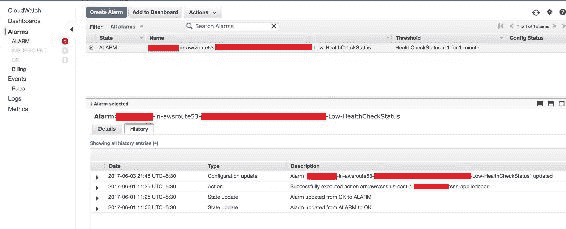

现在，单击“创建警报”按钮。将弹出一个向导，询问需要监控的指标：

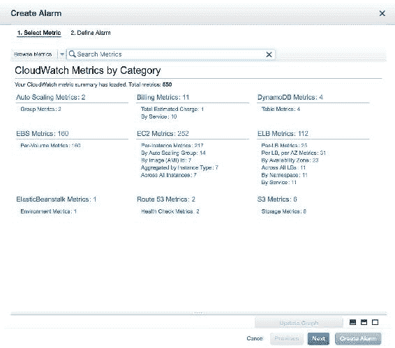

上述屏幕截图列出了所有可监控的指标，以及可以设置警报的指标。

在下一个屏幕中，我们需要检查 EC2 指标。根据您的要求，您可以选择任何指标，例如，我们将选择 NetworkIn 指标并单击“下一步”：

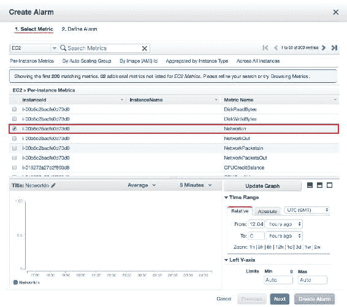

在下一个屏幕上，我们需要提供警报名称和描述，以及警报预览。此外，我们需要根据触发警报的条件提供条件。

此外，我们需要设置服务通知服务，通知需要以电子邮件形式发送：

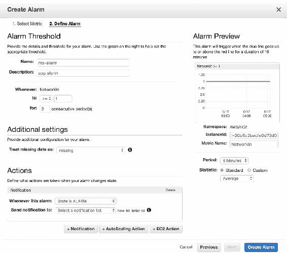

添加完详细信息后，单击“创建警报”按钮设置警报。

现在，每当“NetworkIn”指标达到其阈值时，它将通过电子邮件发送通知。

同样，我们可以设置不同的指标来监视资源利用率。

另一种创建警报的方法是在资源的监视部分选择“创建警报”按钮，如下截图所示：

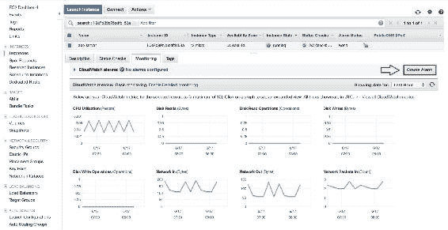

您可以查看 AWS 文档（[`aws.amazon.com/documentation/cloudwatch/`](https://aws.amazon.com/documentation/cloudwatch/)）获取更多信息。

# CloudTrail

这是 AWS 云服务中最重要的之一，默认情况下会跟踪 AWS 账户上的任何活动，无论是通过控制台还是编程方式。在这项服务中，我们不需要配置任何内容。如果您的账户受到威胁，或者我们需要检查资源操作等情况，这项服务就是必需的。

以下截图将显示与账户相关的一些活动：

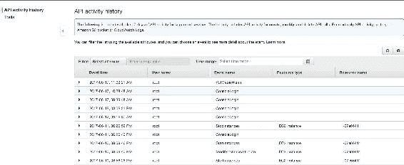

有关更多信息，您可以查看 AWS 文档（[`aws.amazon.com/documentation/cloudtrail/`](https://aws.amazon.com/documentation/cloudtrail/)）。

# AWS Config 服务

这是另一个 AWS 服务，我们可以根据定义的模板规则检查 AWS 资源的配置。

请注意，此服务将需要创建服务角色以访问 AWS 资源。

在这项服务中，我们只需要根据提供的模板设置规则。AWS 或客户模板用于对我们作为应用程序部署的一部分创建的资源进行检查。要向服务配置添加新规则，请转到[`console.aws.amazon.com/config/home?region=us-east-1#/rules/view`](https://console.aws.amazon.com/config/home?region=us-east-1#/rules/view)：

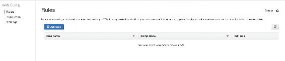

在上述屏幕中，我们需要添加一个新规则，该规则将评估所有资源或您指定的资源。单击“添加规则”以添加新规则，如下所示：

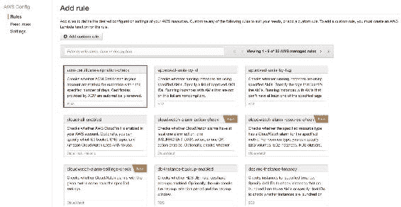

在上述截图中，选择规则以打开基于需要跟踪的资源的资源监视配置。

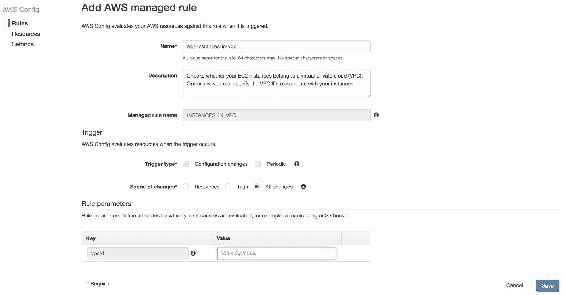

上述截图是 AWS ec2-instance-in-vpc 模板配置，它将帮助您验证 EC2 是否在具有正确配置的 VPC 中。在这里，您可以指定需要评估的 VPC。

单击“保存”以添加新规则。一旦评估完成，我们将看到以下屏幕：

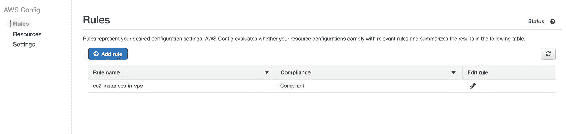

以下资源报告显示如下：

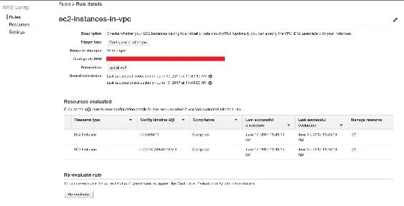

您可以查看 AWS 文档（[`aws.amazon.com/documentation/config/`](https://aws.amazon.com/documentation/config/)）获取更多信息。

# Microsoft Azure 服务

以下是 Microsoft Azure 提供的服务，可以帮助您管理应用程序性能。

# 应用程序洞察

这项由 Azure 提供的服务可帮助您管理应用程序性能，对于 Web 开发人员非常有用，可以帮助他们检测、诊断和诊断应用程序问题。

要设置应用程序洞察，您只需要知道应用程序和组名称，这些名称是您基础架构所在的。现在，如果您在左侧窗格上单击“+”号，您应该会看到类似以下截图的屏幕：

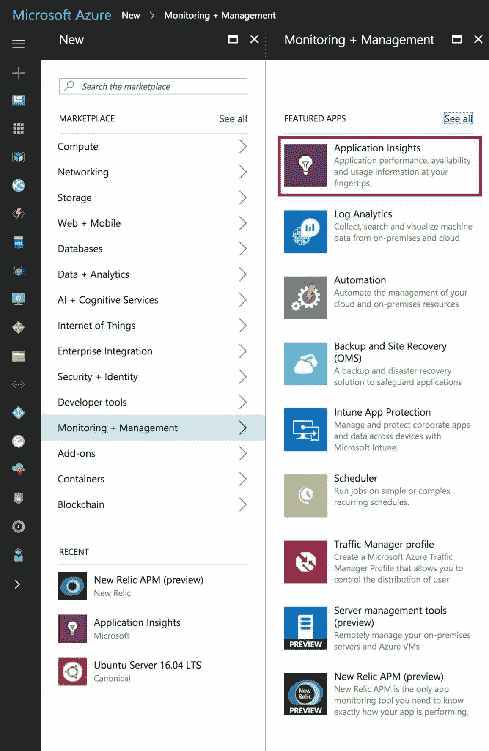

在这里，我们可以选择应用程序洞察服务，需要提供应用程序洞察名称、需要监视的组名称以及需要启动的区域。

一旦启动，您将看到以下屏幕，其中将向您展示如何使用应用程序洞察配置资源。以下是一些描述的指标：

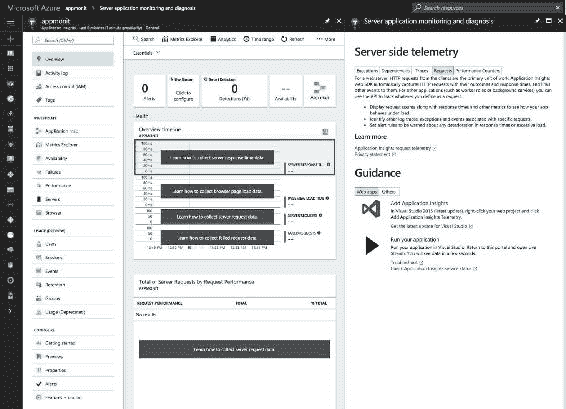

查看完整的参考文档，访问[`docs.microsoft.com/en-us/azure/application-insights/app-insights-profiler`](https://docs.microsoft.com/en-us/azure/application-insights/app-insights-profiler)，其中将提供有关如何配置应用程序洞察与资源的完整信息。

现在出现的问题是应用程序洞察监视哪些指标。以下是一些描述的指标：

+   **请求速率**、**响应时间**和**失败率**：这可以让您了解请求的类型及其响应时间，有助于资源管理

+   **Ajax 调用**：这将跟踪网页的速率、响应时间和失败率。

+   **用户和会话详情**：这跟踪用户和会话信息，如用户名、登录、注销详情等

+   **性能管理**：这跟踪 CPU、网络和 RAM 的详细信息

+   **主机诊断**：这是为了计算 Azure 的资源

+   **异常**：这可以让您了解服务器和浏览器报告的异常

您可以为系统配置许多指标。有关更多信息，请查看[`docs.microsoft.com/en-us/azure/application-insights/app-insights-metrics-explorer`](https://docs.microsoft.com/en-us/azure/application-insights/app-insights-metrics-explorer)。

您可以查看 Azure 文档([`docs.microsoft.com/en-us/azure/application-insights/`](https://docs.microsoft.com/en-us/azure/application-insights/))，了解更多与应用程序洞察相关的信息。

到目前为止，我们一直在云平台上验证和监视应用程序及其基础设施。然而，一个非常重要的问题是：如果出现应用程序问题，我们该如何进行故障排除？下一部分关于 ELK 堆栈将帮助您确定问题，这可能是系统级或应用程序级的问题。

# ELK 堆栈介绍

ELK 堆栈由 Elasticsearch、Logstash 和 Kibana 组成。所有这些组件一起工作，收集各种类型的日志，可以是系统级日志（即 Syslog、RSYSLOG 等）或应用程序级日志（即访问日志、错误日志等）。

有关 ELK 堆栈的设置，您可以参考这篇文章，其中除了 ELK 堆栈外，还使用 Filebeat 配置将日志发送到 Elasticsearch：

[`www.digitalocean.com/community/tutorials/how-to-install-elasticsearch-logstash-and-kibana-elk-stack-on-ubuntu-14-04`](https://www.digitalocean.com/community/tutorials/how-to-install-elasticsearch-logstash-and-kibana-elk-stack-on-ubuntu-14-04)。

# Logstash

Logstash 需要安装在需要收集日志并将其传送到 Elasticsearch 以创建索引的服务器上。

安装 Logstash 后，建议配置位于`/etc/logstash`的`logstash.conf`文件，包括 Logstash 日志文件的旋转（即`/var/log/logstash/*.stdout`、`*.err`或`*.log`）或后缀格式，如数据格式。以下代码块是供您参考的模板：

```py
    # see "man logrotate" for details 

    # number of backlogs to keep 
    rotate 7 

    # create new (empty) log files after rotating old ones 
    create 

    # Define suffix format 
    dateformat -%Y%m%d-%s 

    # use date as a suffix of the rotated file 
    dateext 

   # uncomment this if you want your log files compressed 
   compress 

   # rotate if bigger that size 
   size 100M 

   # rotate logstash logs 
   /var/log/logstash/*.stdout 
   /var/log/logstash/*.err 
   /var/log/logstash/*.log { 
       rotate 7 
       size 100M 
       copytruncate 
       compress 
       delaycompress 
       missingok 
       notifempty 
    } 

```

为了将日志传送到 Elasticsearch，您需要在配置中有三个部分，名为输入、输出和过滤，这有助于创建索引。这些部分可以在单个文件中，也可以在单独的文件中。

Logstash 事件处理管道按照输入-过滤-输出的方式工作，每个部分都有自己的优势和用途，其中一些如下：

+   **输入**：这个事件需要从日志文件中获取数据。一些常见的输入包括文件，它使用`tailf`读取文件；Syslog，它从监听端口`514`的 Syslogs 服务中读取；beats，它从 Filebeat 收集事件，等等。

+   **过滤器**：Logstash 中的这些中间层设备根据定义的过滤器对数据执行某些操作，并分离符合条件的数据。其中一些是 GROK（根据定义的模式结构化和解析文本）、clone（通过添加或删除字段复制事件）等。

+   **输出**：这是最终阶段，我们将经过过滤的数据传递到定义的输出。可以有多个输出位置，我们可以将数据传递到进一步索引。一些常用的输出包括 Elasticsearch（非常可靠；一个更容易、更方便的平台来保存您的数据，并且更容易在其上查询）和 graphite（用于以图表形式存储和显示数据的开源工具）。

以下是 Syslog 日志配置的示例：

+   Syslog 的输入部分写成如下形式：

```py
   input { 
     file { 
     type => "syslog" 
    path => [ "/var/log/messages" ] 
    } 
   }

```

+   Syslog 的过滤器部分写成如下形式：

```py
   filter { 
     grok { 
      match => { "message" => "%{COMBINEDAPACHELOG}" } 
     } 
    date { 
     match => [ "timestamp" , "dd/MMM/yyyy:HH:mm:ss Z" ] 
    } 
  } 

```

+   Syslog 的输出部分写成如下形式：

```py
   output { 
     elasticsearch { 
       protocol => "http" 
       host => "es.appliedcode.in" 
       port => "443" 
       ssl => "true" 
       ssl_certificate_verification => "false" 
       index => "syslog-%{+YYYY.MM.dd}" 
       flush_size => 100 
      } 
   } 

```

用于传输日志的配置文件通常存储在`/etc/logstash/confd/`中。

如果为每个部分创建单独的文件，则需要遵循命名文件的约定；例如，输入文件应命名为`10-syslog-input.conf`，过滤器文件应命名为`20-syslog-filter.conf`。同样，对于输出，它将是`30-syslog-output.conf`。

如果要验证配置是否正确，可以执行以下命令：

```py
 $ sudo service logstash configtest

```

有关 Logstash 配置的更多信息，请参阅文档示例[`www.elastic.co/guide/en/logstash/current/config-examples.html`](https://www.elastic.co/guide/en/logstash/current/config-examples.html)。

# Elasticsearch

Elasticsearch ([`www.elastic.co/products/elasticsearch`](https://www.elastic.co/products/elasticsearch))是一个日志分析工具，它帮助存储并根据配置和时间戳创建索引，解决了开发人员试图识别与其问题相关的日志的问题。Elasticsearch 是基于 Lucene 搜索引擎的 NoSQL 数据库。

安装完 Elasticsearch 后，您可以通过点击以下 URL 验证版本和集群详细信息：[](http://ip-address) `http://ip-address:9200/`。

输出将如下所示：

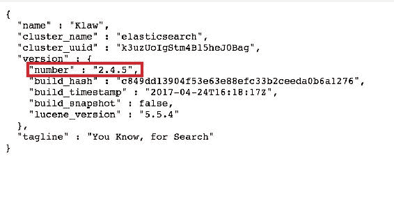

这证明了 Elasticsearch 正在运行。现在，如果要查看日志是否已创建，可以使用以下 URL 查询 Elasticsearch：

`http://ip-address:9200/_search?pretty`。

输出将如下屏幕截图所示：

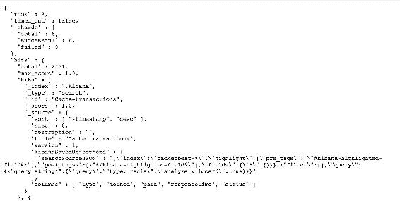

要查看已创建的索引，可以点击以下 URL：

`http://ip-address:9200/_cat/indices?v`。

输出将类似于以下屏幕截图：

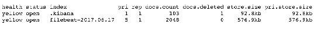

如果您想了解更多关于 Elasticsearch 查询、索引操作等内容，请阅读本文：

[`www.elastic.co/guide/en/elasticsearch/reference/current/indices.html`](https://www.elastic.co/guide/en/elasticsearch/reference/current/indices.html)。

# Kibana

Kibana 工作在 Elasticsearch 的顶层，可视化提供环境接收的数据的洞察，并帮助做出必要的决策。简而言之，Kibana 是一个用于从 Elasticsearch 搜索日志的 GUI。

安装 Kibana 后，应出现在`http://ip-address:5601/`，它将要求您创建索引并配置 Kibana 仪表板：

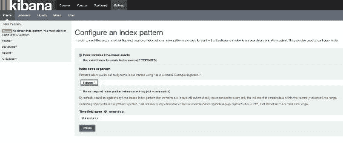

配置完成后，应出现以下屏幕，其中显示了带有时间戳的日志格式：

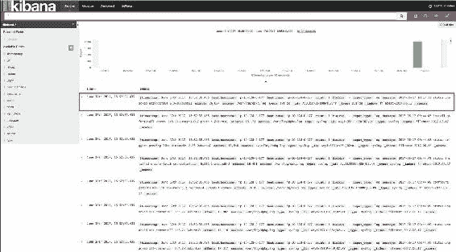

现在，我们需要创建仪表板，以便以图表、饼图等形式查看日志。

有关创建 Kibana 仪表板的更多信息，请参阅 Kibana 文档([`www.elastic.co/guide/en/kibana/current/dashboard-getting-started.html`](https://www.elastic.co/guide/en/kibana/current/dashboard-getting-started.html))。

作为 Kibana 的替代方案，您可能对 Grafana([`grafana.com/`](https://grafana.com/))感兴趣，这也是一种分析和监控工具。

现在，问题是：Grafana 与 Kibana 有何不同？以下是答案：

| **Grafana** | **Kibana** |
| --- | --- |
| Grafana 仪表板专注于基于系统指标 CPU 或 RAM 的时间序列图表。Kibana 专用于日志分析。 |
| Grafana 的内置 RBA（基于角色的访问）决定用户对仪表板的访问权限。 | Kibana 无法控制仪表板访问权限。 |
| Grafana 支持除 Elasticsearch 之外的不同数据源，如 Graphite、InfluxDB 等。 | Kibana 与 ELK 堆栈集成，使其用户友好。 |

这是关于 ELK 堆栈的，它为我们提供了有关应用程序的见解，并帮助我们解决应用程序和服务器问题。在下一节中，我们将讨论一个名为**Prometheus**的本地开源工具，它对监视不同服务器的活动非常有用。

# 开源监控工具

在本节中，我们将主要讨论由第三方拥有并收集服务器指标以排除应用程序问题的工具。

# Prometheus

Prometheus([`prometheus.io`](https://prometheus.io))是一个开源监控解决方案，可跟踪系统活动指标，并在需要您采取任何操作时立即向您发出警报。这个工具是用**Golang**编写的。

这个工具类似于 Nagios 等工具正在变得越来越受欢迎。它收集服务器的指标，但也根据您的需求为您提供模板指标，例如`http_request_duration_microseconds`，以便您可以使用 UI 生成图表以更好地理解它并以高效的方式监视它。

请注意，默认情况下，Prometheus 在`9090`端口上运行。

要安装 Prometheus，请按照官方网站上提供的说明进行操作([`prometheus.io/docs/introduction/getting_started/`](https://prometheus.io/docs/introduction/getting_started/))。安装完成并且服务启动后，尝试打开`http://ip-address:9090/status`以了解状态。以下屏幕显示了 Prometheus 的构建信息，即版本、修订版本等。

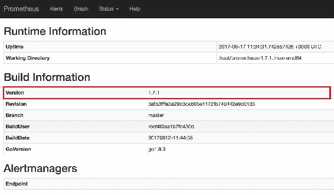

要了解配置了哪些目标，请使用`http://ip-address:9090/targets`。输出将类似于这样：

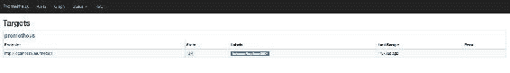

为了生成图表，请使用`http://ip-address:9090/graph`并选择需要实现图表的指标。输出应类似于以下屏幕截图：

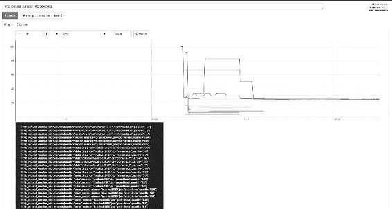

同样，我们可以请求由 Prometheus 识别的其他一些指标，例如主机上线状态。以下屏幕截图显示了一段时间内的主机状态：

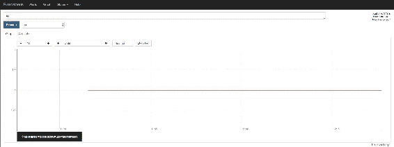

Prometheus 有一些不同用途的组件，如下所示：

+   **AlertManager**：此组件将帮助您基于指标设置服务器的警报，并定义其阈值。我们需要在服务器中添加配置来设置警报。查看[`prometheus.io/docs/alerting/alertmanager/`](https://prometheus.io/docs/alerting/alertmanager/)上的 AlertManager 文档。

+   **Node exporter**：此导出器对硬件和操作系统指标非常有用。在[`prometheus.io/docs/instrumenting/exporters/`](https://prometheus.io/docs/instrumenting/exporters/)上阅读有关不同类型导出器的更多信息。

+   **Pushgateway**：此 Pushgateway 允许您运行批处理作业以公开您的指标。

+   Grafana：Prometheus 与 Grafana 集成，帮助仪表板查询 Prometheus 上的指标。

# 总结

这一章以不同的方式非常有趣。从基于云平台的工具，如 Cloudwatch 和 Application Insights 开始，这些工具帮助您在云平台上管理应用程序。然后，它转向开源工具，开发人员一直以来都将其作为首选，因为他们可以根据自己的需求进行定制。我们看了 ELK 堆栈，它一直很受欢迎，并且在许多组织中以某种方式经常被使用。

现在，我们已经到达了本书的结尾，但希望会有另一版，届时我们将讨论高级应用开发，并提供更多对 QA 受众有用的测试案例。尽情编码吧！
