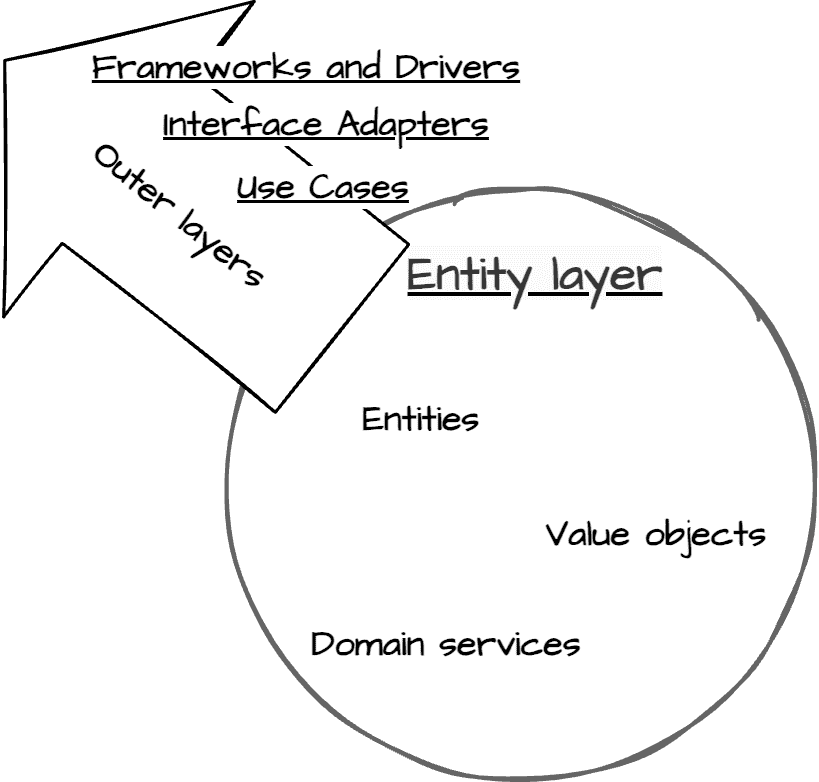
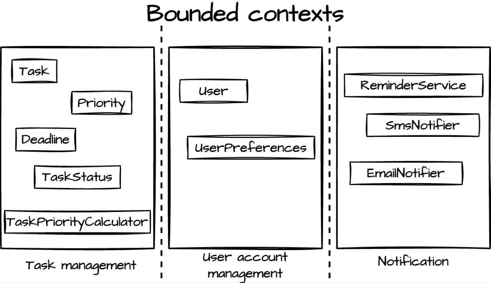
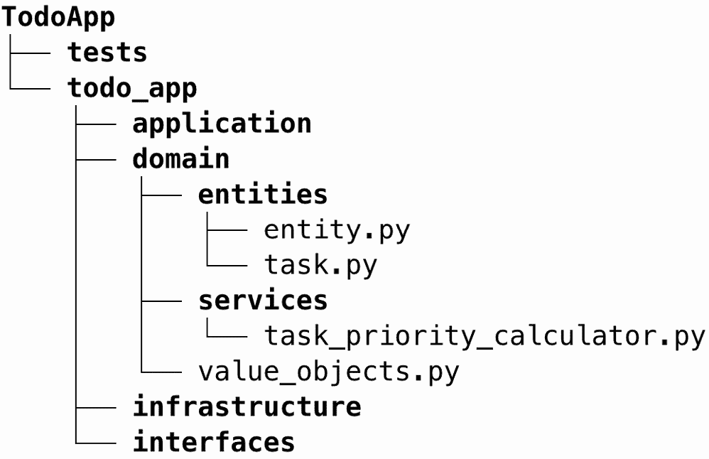

# 第四章：领域驱动设计：构建核心业务逻辑

在前面的章节中，我们为理解清洁架构及其原则奠定了基础。我们探讨了指导稳健软件设计的 SOLID 原则，并学习了如何利用 Python 的类型系统创建更易于维护的代码。现在，我们将注意力转向清洁架构的最内层：**实体层**，也常被称为**领域层**。

实体层代表了我们的应用程序的核心，封装了基本业务概念和规则。这一层独立于外部关注点，并构成了我们其余清洁架构的基础。通过关注这个核心，我们确保我们的应用程序无论使用的外部技术或框架如何，都始终忠于其基本目的。

在本章中，我们将深入探讨实体层的实现，使用**领域驱动设计（DDD）原则**。我们将使用一个个人任务管理应用程序作为我们的持续示例，展示如何在 Python 中建模和实现核心业务概念。您将学习如何识别和建模领域实体，保持关注点的清晰分离，并为我们的清洁架构实现创建一个坚实的基础。到本章结束时，您将了解如何创建体现核心概念和业务规则的实体，为构建在此坚实基础之上的层奠定舞台。

在本章中，我们将涵盖以下主要内容：

+   使用 DDD 原则识别和建模核心实体

+   在 Python 中实现实体

+   高级领域概念

+   确保实体层的独立性

# 技术要求

本章及本书其余部分提供的代码示例均使用 Python 3.13 进行测试。所有示例均可在本书配套的 GitHub 仓库中找到，网址为 [`github.com/PacktPublishing/Clean-Architecture-with-Python`](https://github.com/PacktPublishing/Clean-Architecture-with-Python)。

# 使用 DDD 识别和建模领域层

在*第一章*中，我们强调了实体层在清洁架构中的关键重要性。这一层构成了您软件的核心，封装了核心业务逻辑和规则。DDD 提供了一种系统化的方法来有效地建模这个关键组件。

领域驱动设计（DDD）提供了工具和技术来识别、建模和实现我们实体层的基本组件，弥合业务现实与软件设计之间的差距。通过在我们的清洁架构框架内应用 DDD 原则，我们创建了一个领域模型，它不仅准确反映了业务需求，而且为灵活、可维护的软件系统提供了一个坚实的基础。

将 DDD 与清洁架构集成的主要好处包括以下内容：

+   与业务需求的一致性

+   开发者与领域专家之间的沟通改进

+   提高灵活性和可维护性

+   通过清晰的边界和接口实现自然可扩展性

在本章中，我们将使用个人任务管理系统作为我们的示例来阐述这些概念。这个实际例子将帮助我们使 DDD 的抽象概念在可联系的现实场景中得到具体化。

## 理解 DDD

在确立了领域层在 Clean Architecture 中的重要性之后，我们现在转向 DDD 实现这一层具体的技术。由埃里克·埃文斯于 2003 年提出([`en.wikipedia.org/wiki/Domain-driven_design`](https://en.wikipedia.org/wiki/Domain-driven_design))，DDD 提供了具体的实践，帮助我们将业务需求转化为健壮的领域模型。

虽然 Clean Architecture 告诉我们领域实体应该是我们系统核心，但 DDD 提供了如何做：在本章中我们将探讨的特定建模技术，如**实体**、**值对象**和**领域服务**。这些实践帮助我们创建领域模型，不仅执行业务规则，而且通过代码清晰地传达其意图。当 Clean Architecture 提供了组织代码层的结构蓝图时，DDD 提供了实现核心业务逻辑的有效战术模式。

在其核心，DDD 强调技术专家和领域专家之间的紧密合作。这种合作旨在：

1.  建立对领域的共同理解

1.  创建一个准确反映领域复杂性的模型

1.  在代码中实现此模型，保持其完整性和表达性

通过在我们的 Clean Architecture 方法中采用 DDD 原则，我们获得几个关键的好处：

+   **与业务需求对齐**：我们的软件成为业务领域的真实反映，使其更具价值，并随着业务需求的变化更容易适应

+   **改进沟通**：DDD 在开发人员和领域专家之间建立了一种共同语言，减少了误解并提高了整体项目的凝聚力

+   **灵活性和可维护性**：一个设计良好的领域模型本质上更加灵活且易于维护，因为它围绕核心业务概念构建，而不是技术约束

+   **可扩展性**：DDD 对边界上下文（在*领域建模的核心概念*部分有所涉及）和系统不同部分之间清晰接口的关注，自然地导致更可扩展的架构

通过将 DDD 原则与 Clean Architecture 相结合，我们锻造了一种强大的软件开发方法论，这种方法论与业务需求紧密一致，同时保持技术灵活性。DDD 提供了工具和技术来有效地建模我们系统的核心——实体层，这在 Clean Architecture 中是核心的，并且独立于外部关注点。这种协同作用确保我们的领域层真正封装了关键的业务概念和规则，支持创建灵活、可维护且对技术变化具有弹性的系统。当我们深入研究 DDD 概念并将它们应用于我们的任务管理系统时，我们将从分析业务需求这一关键步骤开始。

## 分析业务需求

应用 DDD 原则的第一步是彻底分析业务需求。这个过程不仅涉及列出功能，还需要深入核心概念、工作流程和规则，这些规则支配着领域。

对于我们的任务管理系统，我们需要考虑以下问题：

+   什么是定义任务独特性的因素？

+   任务优先级如何影响其在系统中的行为？

+   哪些规则支配着任务在不同状态之间的转换？

+   任务列表或项目如何与单个任务相关联？

+   当任务的截止日期过去后，任务会发生什么？

这些类型的问题帮助我们理解我们领域的根本方面。例如，我们可能会确定一个任务可以通过一个全局唯一 ID 来唯一标识，并且其优先级可以影响其在任务列表中的位置。我们可能会定义规则，例如“一个完成的任务在没有首先重新打开的情况下不能被移回*进行中*状态。”

重要的是要注意，在这个 DDD 阶段，我们并没有编写任何代码。作为一个开发者，你可能会感到立即开始实施这些概念的冲动。然而，要抵制这种诱惑。DDD 的力量在于在编写任何代码之前彻底理解和建模领域。这种对领域分析的前期投资将在未来带来更稳健、灵活和准确的软件模型。

## 领域建模的核心概念

DDD 为有效地建模我们的领域提供了几个关键概念。其中最重要的是**通用语言**的概念，这是一种由开发者和领域专家共同拥有的、严谨的共同词汇。这种语言在代码、测试和对话中始终如一地使用，有助于防止误解并确保模型与业务领域保持一致。

在我们的任务管理系统中，这种语言包括以下术语：

+   **任务**：需要完成的单元工作

+   **项目**：一系列相关的任务

+   **截止日期**：任务完成的最后期限

+   **优先级**：任务的重要性级别（例如 *低*，*中* 或 *高*）

+   **状态**：任务当前的状态（例如 *待办*，*进行中* 或 *完成*）

在建立了这种普遍语言之后，让我们探索 DDD 的基本结构概念，这将帮助我们实现我们的领域模型：



图 4.1：Clean Architecture 层和 DDD 概念

如*图 4.1*所示，Clean Architecture 将实体层置于我们系统的核心，而 DDD 提供了填充这一层的具体组件（实体、值对象和域服务）。现在让我们来回顾一下：

+   **实体**：这些是由其身份定义的对象，即使其属性发生变化，其身份也会持续存在。一个`Order`即使其状态从待处理变为已发货，也仍然是同一个`Order`。在 Clean Architecture 中，这些核心业务对象体现了系统中心的最高稳定规则。

+   **值对象**：这些是由其属性定义而不是身份的不可变对象。具有相同货币和金额的两个`Money`对象被认为是相等的。它们封装了连贯的行为，无需唯一标识，增加了领域表达性，同时减少了复杂性。

+   **域服务**：这些代表无状态的运算，它们不属于单个实体或值对象。它们处理跨越多个对象的领域逻辑，例如根据订单的项目和客户的地理位置计算运费。

这些建模组件构成了我们在 Clean Architecture 中实体层的基石。虽然 DDD 为我们提供了词汇和技巧，以基于业务现实来识别和建模这些组件，但 Clean Architecture 为我们提供了在代码库中组织它们的框架，确保它们独立于外部关注点。随着我们在 Python 中实现这些概念，这种互补关系将变得更加清晰。

## 建模任务管理领域

让我们将 DDD 的核心概念应用于我们的任务管理系统，将理论概念转化为我们领域模型的实际组件。

### 任务管理应用程序实体和值对象

我们的系统有两个主要实体：

+   **任务**：代表一个工作单元的核心实体，尽管属性发生变化（例如，状态转换），但其身份持续存在

+   **用户**：代表管理任务的系统用户，也具有持久性身份

我们还有几个重要的值对象：

+   **任务状态**：一个枚举（例如，*待办*、*进行中*或*完成*），表示任务的状态

+   **优先级**：表示任务的重要性（例如，*低*、*中*或*高*）

+   **截止日期**：表示到期日期和时间，封装了相关的行为，如逾期检查

这些值对象增强了我们模型的表达能力。例如，一个任务有一个任务状态，而不是一个简单的字符串，它携带更多的语义意义和潜在的行为。

### 任务管理应用程序域服务

不属于单个实体或值对象的复杂操作作为域服务实现：

+   **任务优先级计算器**：根据各种因素计算任务的优先级

+   **提醒服务**：管理任务提醒的创建和发送

这些服务使我们的实体和价值对象保持专注和一致。

### 利用边界上下文

**边界上下文**是定义特定领域模型适用的概念边界。它们封装领域细节，确保模型一致性，并通过定义良好的接口进行交互。这与 Clean Architecture 对清晰组件边界的强调相一致，有助于模块化和可维护的系统设计。

我们可以在系统中识别出三个不同的边界上下文：

+   **任务管理**：核心上下文，处理与任务相关的操作

+   **用户账户管理**：处理与用户相关的操作

+   **通知**：管理生成和向用户发送通知

这些上下文在我们的系统中创建了清晰的边界，允许独立开发同时实现必要的交互。



图 4.2：我们的任务管理应用的三种潜在边界上下文

此模型构成了我们 Clean Architecture 设计的核心，实体和价值对象位于我们的实体层中心。我们的通用语言确保代码准确反映领域概念；领域服务包含复杂的多对象逻辑，边界上下文在更高层次上管理系统复杂性。

在下一节中，我们将使用 Python 实现这个概念模型，创建封装基本业务规则的丰富领域实体。

# 在 Python 中实现实体

使用基于 DDD 原理的概念化领域模型，我们现在转向这些概念在 Python 中的实际实现。本节将专注于创建封装基本业务规则的丰富领域实体，为我们的 Clean Architecture 实现奠定基础。

## Python 实体介绍

在建立了我们对 DDD 中实体的理解之后，让我们探讨如何在 Python 中有效地实现它们。我们的实现将侧重于创建具有唯一标识符和封装业务逻辑的方法的类，将 DDD 概念转化为实际的 Python 代码。

关键实现考虑因素包括以下内容：

+   **标识符**：使用 Python 的通用唯一标识符（UUID）系统实现唯一标识符

+   **可变性**：利用 Python 的面向对象特性来管理状态变化

+   **生命周期**：通过 Python 类方法管理对象的创建、修改和删除

+   **业务规则**：使用 Python 的类型系统和类方法来强制执行业务规则

    **Python 数据类的介绍**

    在我们的实现中，我们将使用 Python 3.7 中引入的数据类。**数据类**是一种简洁的方式来创建主要存储数据但也可以具有行为的类。它们自动生成几个特殊方法，如`__init__()`、`__repr__()`和`__eq__()`，减少了样板代码。

    数据类的关键优势包括以下内容：

    +   **减少样板代码**：自动生成常见方法

    +   **清晰性**：清楚地表达了数据结构

    +   **不可变性选项**：可以创建不可变对象，与 DDD 原则中的值对象保持一致

    +   **默认值**：轻松指定属性的默认值

    数据类与 Clean Architecture 原则相吻合，通过促进清晰、专注的实体来封装数据和行为。它们帮助我们创建易于理解、维护和测试的实体。

    有关数据类的更多信息，请参阅官方 Python 文档：[`docs.python.org/3/library/dataclasses.html`](https://docs.python.org/3/library/dataclasses.html)。

现在，让我们看看我们如何使用数据类来实现我们的`Entity`基类：

```py
from dataclasses import dataclass, field
from uuid import UUID, uuid4
@dataclass
class Entity:
    # Automatically generates a unique UUID for the 'id' field;
    # excluded from the __init__ method
    id: UUID = field(default_factory=uuid4, init=False)
    def __eq__(self, other: object) -> bool:
        if not isinstance(other, type(self)):
            return NotImplemented
        return self.id == other.id
    def __hash__(self) -> int:
        return hash(self.id) 
```

这个`Entity`基类为所有我们的实体提供了一个基础，确保它们有一个唯一的标识符和适当的相等性和散列行为。

**确保 Python 中类的正确相等性**

正如我们在`Entity`基类中看到的，我们已经实现了`__eq__`和`__hash__`方法，以确保适当的身份和相等性检查。这对于实体至关重要，因为具有相同属性但不同 ID 的两个任务应被视为不同的实体。

## 创建领域实体

现在，让我们实现我们的核心领域实体：`Task`实体。这个实体将封装与我们的任务管理系统相关的任务的基本概念和规则。

### 实现 Task 实体

首先，让我们看看我们的`Task`实体的基本结构：

```py
from dataclasses import dataclass, field
from typing import Optional
@dataclass
class Task(Entity):
    title: str
    description: str
    due_date: Optional[Deadline] = None
    priority: Priority = Priority.MEDIUM
    status: TaskStatus = field(default=TaskStatus.TODO, init=False) 
```

这个`Task`实体封装了我们系统中任务的核心理念。让我们逐一分析每个属性：

+   `title`：一个字符串，表示任务的名称或简要描述

+   `description`：对任务所包含内容的更详细说明

+   `due_date`：一个可选的`Deadline`对象，表示任务应完成的日期

+   `priority`：表示任务的优先级，默认为`MEDIUM`

+   `status`：表示任务的当前状态，默认为`TODO`

现在，让我们实现我们的值对象：

```py
from enum import Enum
from dataclasses import dataclass
from datetime import datetime, timedelta
class TaskStatus(Enum):
    TODO = "TODO"
    IN_PROGRESS = "IN_PROGRESS"
    DONE = "DONE"
class Priority(Enum):
    LOW = 1
    MEDIUM = 2
    HIGH = 3
# frozen=True makes this immutable as it should be for a Value Object
@dataclass(frozen=True)
class Deadline:
    due_date: datetime
    def __post_init__(self):
        if self.due_date < datetime.now(timezone.utc):
            raise ValueError("Deadline cannot be in the past")
    def is_overdue(self) -> bool:
        return datetime.now(timezone.utc) > self.due_date
    def time_remaining(self) -> timedelta:
        return max(
            timedelta(0),
            self.due_date - datetime.now(timezone.utc)
        )
    def is_approaching(
        self, warning_threshold: timedelta = timedelta(days=1)
    ) -> bool:
        return timedelta(0) < self.time_remaining() <= warning_threshold 
```

这些值对象有助于约束任务状态、优先级和截止日期的可能值，确保数据完整性并提供这些属性的语义意义。

这里有一些使用这些值对象的`Task`实体的示例：

```py
# Create a new task
task = Task(
    title="Complete project proposal",
    description="Draft and review the proposal for the 
                 new client project",
    priority=Priority.HIGH
)
# Check task properties
print(task.title)     # "Complete project proposal"
print(task.priority)  # Priority.HIGH
print(task.status)    # TaskStatus.TODO 
```

在建立我们的核心`Task`实体结构和其支持值对象之后，让我们探索如何通过纳入管理任务行为和保持数据一致性的业务规则来增强这些基础。

## 在实体中封装业务规则

在实现领域实体时，强制执行业务规则至关重要，以确保实体始终保持在有效状态。**业务规则**，通常称为**不变性**，是领域中对实体定义的基本要素。实体应封装直接适用于它们的业务规则。

让我们在`Task`实体中添加一些基本业务规则：

```py
@dataclass
class Task(Entity):
    # ... previous attributes ...
    def start(self) -> None:
        if self.status != TaskStatus.TODO:
            raise ValueError(
                "Only tasks with 'TODO' status can be started")
        self.status = TaskStatus.IN_PROGRESS
    def complete(self) -> None:
        if self.status == TaskStatus.DONE:
            raise ValueError("Task is already completed")
        self.status = TaskStatus.DONE
    def is_overdue(self) -> bool:
        return self.due_date is not None and self.due_date.is_overdue() 
```

现在，让我们探索这些业务规则在实际中的工作方式。以下示例演示了`Task`实体如何强制执行其不变性并保持其内部一致性：

```py
from datetime import datetime, timedelta
# Create a task
task = Task(
    title="Complete project proposal",
    description="Draft and review the proposal for the 
                 new client project",
    due_date=Deadline(datetime.now(timezone.utc) + timedelta(days=7)),
    priority=Priority.HIGH
)
# Start the task
task.start()
print(task.status)  # TaskStatus.IN_PROGRESS
# Complete the task
task.complete()
print(task.status)  # TaskStatus.DONE
# Try to start a completed task
try:
    task.start()  # This will raise a ValueError
except ValueError as e:
    print(str(e))  # "Only tasks with 'TODO' status can be started"
# Check if the task is overdue
print(task.is_overdue())  # False 
```

这些方法强制执行以下业务规则：

+   只有在任务处于`TODO`状态时，才能开始任务

+   完成的任务不能再次完成

+   任务根据其截止日期知道是否已过期

通过将这些规则封装在实体中，我们确保`Task`实体始终遵循我们领域的核心业务规则，无论它在应用程序中的使用方式如何。

### 区分实体级规则和领域级规则

虽然我们实现的规则适用于`Task`实体，但并非所有业务规则都属于实体级别。例如，考虑以下规则：“*用户一次不能有超过五个高优先级任务*。”这个规则涉及多个任务和可能的用户设置，因此它不属于`Task`实体。

这些规则更适合在领域服务或应用层用例中实现。我们将在本章后面的*实现领域服务*部分探讨如何实现这些高级规则。

通过以这种方式构建我们的实体，我们保持了实体特定规则和更广泛领域规则之间的清晰分离，遵循 Clean Architecture 原则，并保持我们的实体专注且易于维护。

## Clean Architecture 中的值对象

在概念上介绍了值对象之后，让我们来检查它们在我们任务管理系统中的具体实现。我们已经创建了几个关键值对象：

+   `TaskStatus`：表示任务的当前状态（例如，*待办*、*进行中*或*完成*）

+   `Priority`：表示任务的优先级（例如，*低*、*中*或*高*）

+   `Deadline`：表示任务的截止日期和时间，具有额外的行为，例如检查是否已过期

除了已经讨论的概念性好处之外，我们的实现展示了在 Clean Architecture 中的具体优势：

+   **不可变性**：一旦创建，其状态不能更改。这有助于防止错误并使我们的代码更容易推理。

+   **基于属性的相等性**：具有相同属性的值对象被认为是相等的，而具有唯一身份的实体则不同。

+   **封装领域概念**：它们将领域思想作为我们代码中的第一类公民，提高了表达性。

+   **防止原始依赖**：它们用具有语义意义和类型安全性的方式替换了用于表示领域概念的原始类型。

+   **简化测试**：值对象易于创建和使用于测试中，提高了我们系统的可测试性。

考虑使用字符串表示任务状态与使用 `TaskStatus` 枚举之间的区别：

```py
# Using string (problematic)
task = Task("Complete project", "The important project")
task.status = "Finished"  # Allowed, but invalid
print(task.status == "done")  # False, case-sensitive
# Using TaskStatus enum (robust)
task = Task("Complete project", "The important project")
task.status = TaskStatus.DONE  # Type-safe
print(task.status == TaskStatus.DONE)  # True, no case issues 
```

Python 对轻量级值对象（如枚举）的支持以及现代 IDE 功能增强了开发者的体验，使得实现真正反映领域模型的 Clean Architecture 更加容易。

## 实现领域服务

虽然许多业务规则可以封装在实体和值对象中，但有些规则或操作涉及多个实体或复杂的逻辑，这些逻辑并不自然地适合于单个实体。对于这些情况，我们可以将所需的逻辑封装到领域服务中。让我们实现一个简单的 `TaskPriorityCalculator` 服务：

```py
class TaskPriorityCalculator:
    @staticmethod
    def calculate_priority(task: Task) -> Priority:
        if task.is_overdue():
            return Priority.HIGH
        elif (
            task.due_date and task.due_date.time_remaining() <=
            timedelta(days=2)
        ):
            return Priority.MEDIUM
        else:
            return Priority.LOW 
```

这个领域服务封装了根据任务截止日期计算任务优先级的逻辑。这是一个无状态的运算，不属于任何特定实体，但仍然是我们的领域逻辑的重要组成部分。

通过以这种方式实现我们的领域模型，我们创建了一个丰富、表达性强的 Python 类集合，准确地代表了我们的任务管理领域。这些类封装了基本业务规则，确保我们的核心领域逻辑保持一致性和良好的组织结构。

在当前状态下，我们的应用程序可能组织如下（完整代码可在 GitHub 上找到：[`github.com/PacktPublishing/Clean-Architecture-with-Python`](https://github.com/PacktPublishing/Clean-Architecture-with-Python))：



图 4.3：实现领域组件的待办事项应用结构

在下一节中，我们将探索更多高级领域概念，在此基础上构建一个全面的领域模型，充分利用 DDD 在我们的 Clean Architecture 实现中的力量。

# 使用聚合和工厂增强领域模型

在确立了我们的核心实体、值对象和领域服务之后，我们现在将注意力转向更高级的领域概念。这些概念将帮助我们创建一个更健壮和灵活的领域模型，进一步增强我们的 Clean Architecture 实现。

## DDD 模式

DDD 提供了几个高级模式，可以帮助我们管理领域模型的复杂性并保持一致性。让我们探索一些这些模式以及它们如何应用于我们的任务管理系统。

### 聚合

**聚合**是 DDD 中一个关键的模型，用于维护一致性并在领域内定义事务边界。聚合是一组被视为单一数据变更单元的领域对象。每个聚合都有一个根和一个边界。根是聚合中包含的单一、特定实体，边界定义了聚合内部的内容。

在我们的任务管理系统中，一个自然的聚合将是一个包含多个任务的工程。让我们来实现这个：

```py
# TodoApp/todo_app/domain/entities/project.py
from dataclasses import dataclass, field
from typing import Optional
from uuid import UUID
@dataclass
class Project(Entity):
    name: str
    description: str = ""
    _tasks: dict[UUID, Task] = field(default_factory=dict, init=False)
    def add_task(self, task: Task) -> None:
        self._tasks[task.id] = task
    def remove_task(self, task_id: UUID) -> None:
        self._tasks.pop(task_id, None)
    def get_task(self, task_id: UUID) -> Optional[Task]:
        return self._tasks.get(task_id)
    @property
    def tasks(self) -> list[Task]:
        return list(self._tasks.values()) 
```

在这个实现中，`Project`作为聚合根。它封装了维护聚合一致性的操作，例如添加、删除或获取任务。

`Project`的使用方式如下：

```py
from datetime import datetime
# Project usage
project = Project("Website Redesign")
task1 = Task(
    title="Design homepage",
    description="Create new homepage layout",
    due_date=Deadline(datetime(2023, 12, 31)),
    priority=Priority.HIGH,
)
task2 = Task(
    title="Implement login",
    description="Add user authentication",
    due_date=Deadline(datetime(2023, 11, 30)),
    priority=Priority.MEDIUM,
)
project.add_task(task1)
project.add_task(task2)
print(f"Project: {project.name}")
print(f"Number of tasks: {len(project.tasks)}")
print(f"First task: {project.tasks[0].title}") 
```

关于这个聚合的关键点如下：

+   **封装**：`Project`控制对其任务的访问。外部代码不能直接修改任务集合。

+   **一致性**：`add_task`和`remove_task`等方法确保聚合保持一致状态。

+   **身份**：虽然单个`Task`实体有其自己的全局身份（UUIDs），但在`Project`的上下文中，它们也通过其与项目的关联来识别。这意味着`Project`除了使用全局 ID 外，还可以使用项目特定的概念（如顺序或位置）来管理任务。

+   **事务边界**：任何影响列表中多个任务的操作（如标记所有任务为完成）都应该通过`Project`来完成，以确保一致性。

+   **不变性**：`Project`可以强制执行适用于整个集合的不变性。例如，我们可以添加一个方法来确保列表中的两个任务没有相同的标题。

使用这样的聚合可以帮助我们通过将相关的实体和值对象分组到统一的单元中来管理复杂的领域。这不仅简化了我们的领域模型，还有助于保持数据完整性和一致性。

在设计聚合时，考虑性能影响是很重要的。聚合应该设计得尽可能小，同时保持一致性。在我们的例子中，如果项目变得过大，我们可能需要考虑分页或懒加载策略来访问任务。

通过将项目实现为一个聚合，我们创建了一个强大的抽象，它封装了管理多个任务的复杂性。这与 Clean Architecture 原则完美契合，因为它允许我们以清晰、封装的方式表达复杂的领域规则和关系。

### 工厂模式

在传统的面向对象编程中，**工厂模式**常用于封装对象创建逻辑。然而，现代 Python 特性在很多情况下减少了独立工厂的需求。让我们探讨 Python 的语言特性如何处理对象创建，以及何时工厂可能仍然有用。

#### 数据类和对象创建

我们的`Task`实体，作为`dataclass`类型实现，已经提供了一种干净且高效的方式来创建对象：

```py
@dataclass
class Task(Entity):
    title: str
    description: str
    due_date: Optional[Deadline] = None
    priority: Priority = Priority.MEDIUM
    status: TaskStatus = field(default=TaskStatus.TODO, init=False) 
```

这个`dataclass`定义自动生成一个`__init__`方法，处理传统工厂可能做的大部分工作。它设置默认值，管理可选参数，并确保类型一致性（当使用类型检查器时）。

#### 使用 Python 特性扩展对象创建

对于更复杂的初始化场景，Python 提供了一些惯用的方法：

+   **类方法作为替代构造函数**：

```py
@dataclass
class Task(Entity):
    # ... existing attributes ...
    @classmethod
    def create_urgent_task(cls, title: str, description: str,
                           due_date: Deadline):
        return cls(title, description, due_date, Priority.HIGH) 
```

+   **使用`dataclass`的`__post_init__`特性进行复杂初始化**：

```py
@dataclass
class Task(Entity):
    # ... existing attributes ...

    def __post_init__(self):
        if not self.title.strip():
            raise ValueError("Task title cannot be empty")
        if len(self.description) > 500:
            raise ValueError(
                "Task description cannot exceed 500 characters") 
```

这些方法允许进行更复杂的对象创建逻辑，同时保持数据类的优势。

#### 当传统工厂可能仍然适用时

尽管有这些 Python 特性，但在某些场景下，独立的工厂可能仍然是有益的：

+   **复杂对象图**：当创建一个对象需要与其他对象建立关系或执行复杂计算时

+   **依赖注入**：当创建过程需要外部依赖项，而这些依赖项您希望与实体本身保持分离时

+   **多态创建**：当您需要根据运行时条件创建不同的子类时

这里有一个可能适合使用工厂的例子：

```py
class TaskFactory:
    def __init__(self, user_service, project_repository):
        self.user_service = user_service
        self.project_repository = project_repository
    def create_task_in_project(self, title: str, description: str,
                               project_id: UUID, assignee_id: UUID):
        project = self.project_repository.get_by_id(project_id)
        assignee = self.user_service.get_user(assignee_id)
        task = Task(title, description)
        task.project = project
        task.assignee = assignee

        if project.is_high_priority() and assignee.is_manager():
            task.priority = Priority.HIGH
        project.add_task(task)
        return task 
```

在这种情况下，工厂封装了在项目上下文中创建任务的复杂逻辑，包括依赖于项目和用户状态的业务规则。

通过理解这些模式及其应用时机，我们可以创建一个更具表达性和可维护性的域模型，同时利用 Python 的优势，并符合整洁架构原则。

# 确保域独立性

域层独立性是整洁架构的基石，直接关联到我们在*第一章*中首次介绍的依赖规则。这个规则指出，依赖项应仅指向域层内部，这对于保持我们核心业务逻辑的纯净性和灵活性至关重要。在本节中，我们将探讨此规则的实践应用以及确保域独立性的策略。

## 实践中的依赖规则

让我们通过一些示例来考察依赖规则如何应用于我们的任务管理系统，这些示例突出了常见的违规行为及其纠正方法。

### 示例 1

带有数据库依赖的任务实体：

```py
@dataclass
class TaskWithDatabase:
    title: str
    description: str
    db: DbConnection  # This violates the Dependency Rule
    due_date: Optional[Deadline] = None
    priority: Priority = Priority.MEDIUM
    status: TaskStatus = field(default=TaskStatus.TODO, init=False)
    def mark_as_complete(self):
        self.status = TaskStatus.DONE
        self.db.update(self) # This violates the Dependency Rule 
```

在这个例子中，`TaskWithDatabase`类通过直接依赖于数据库连接违反了依赖规则。`db`属性和`mark_as_complete`中的`update`调用将外部关注点引入我们的域实体。

### 示例 2

带有 UI 依赖的项目聚合：

```py
@dataclass
class ProjectWithUI(Entity):
    name: str
    ui: UiComponent  # Violates the Dependency Rule
    description: str = ""
    _tasks: dict[UUID, Task] = field(default_factory=dict, init=False)
    def add_task(self, task: Task):
        self._tasks[task.id] = task
        self.ui.refresh()  # Violates the Dependency Rule 
```

在这里，`ProjectWithUI`错误地依赖于 UI 组件，将展示关注点与域逻辑混合在一起。

这些示例不仅违反了依赖规则，还违反了 SOLID 原则中的**单一职责原则**（**SRP**）。`TaskWithDatabase`类负责任务管理和数据库操作，而`ProjectWithUI`则处理项目管理和 UI 更新。这些违规行为损害了我们的域层的独立性和专注性，使其更难以灵活、测试和维护。

通过消除这些外部依赖并遵循 SRP（单一职责原则），我们创建了专注于核心业务概念和规则的纯领域实体。这种方法确保了我们的领域层成为应用程序的稳定核心，不受外部系统、数据库或用户界面变化的影响。

在下一节中，我们将探讨避免外部依赖并保持领域层纯洁性的策略。

## 避免外部依赖

为了保持我们领域层的纯洁性和独立性，我们需要警惕避免对外部框架、数据库或 UI 组件的依赖。一个关键策略是使用外部关注点的抽象。让我们看看这在我们的任务管理系统中的实际应用。

首先，让我们在领域层定义一个抽象的 `TaskRepository`：

```py
# In the Domain layer :
# (e.g., todo_app/domain/repositories/task_repository.py)
from abc import ABC, abstractmethod
from todo_app.domain.entities.task import Task
class TaskRepository(ABC):
    @abstractmethod
    def save(self, task: Task):
        pass
    @abstractmethod
    def get(self, task_id: str) -> Task:
        pass 
```

这个抽象类定义了任务持久化的契约，而不指定任何实现细节。它属于领域层，代表任何任务存储机制必须实现的接口。

现在，让我们看看领域服务如何使用这个存储库：

```py
# In the Domain layer (e.g., todo_app/domain/services/task_service.py)
from todo_app.domain.entities.task import Task
from todo_app.domain.repositories.task_repository import TaskRepository
class TaskService:
    def __init__(self, task_repository: TaskRepository):
        self.task_repository = task_repository
    def create_task(self, title: str, description: str) -> Task:
        task = Task(title, description)
        self.task_repository.save(task)
        return task
    def mark_task_as_complete(self, task_id: str) -> Task:
        task = self.task_repository.get(task_id)
        task.complete()
        self.task_repository.save(task)
        return task 
```

这个 `TaskService` 展示了领域逻辑如何与持久化抽象交互，而不了解实际的存储机制。

`TaskRepository` 的具体实现将位于外层，例如基础设施层：

```py
# In an outer layer
# .../infrastructure/persistence/sqlite_task_repository.py
from todo_app.domain.entities.task import Task
from todo_app.domain.repositories.task_repository import TaskRepository
class SQLiteTaskRepository(TaskRepository):
    def __init__(self, db_connection):
        self.db = db_connection
    def save(self, task: Task):
        # Implementation details...
        pass
    def get(self, task_id: str) -> Task:
        # Implementation details...
        pass 
```

这种结构展示了依赖规则的实际应用：

+   领域层（`TaskRepository` 和 `TaskService`）定义和使用抽象，而不了解具体的实现

+   基础设施层（`SQLiteTaskRepository`）实现了领域层定义的抽象

+   依赖关系的流向是向内的；基础设施层依赖于领域层的抽象，反之则不然

+   我们的领域层保持独立于特定的数据库技术或其他外部关注点

+   我们可以轻松地将 SQLite 替换为另一个数据库或存储机制，而无需修改领域层

通过遵循依赖规则，我们确保我们的领域层成为应用程序的稳定核心，不受外部系统或技术变化的影响。这种分离使我们能够独立地发展系统的不同部分，从而简化测试、维护和对变化需求的适应。

例如，如果我们决定从 SQLite 切换到 PostgreSQL，我们只需在基础设施层创建一个新的 `PostgreSQLTaskRepository`，实现 `TaskRepository` 接口。领域层，包括我们的 `TaskService`，将保持不变。

这种构建代码的方法不仅保持了领域层的纯洁性，还提供了对未来更改的灵活性和测试的便利性，这些都是清洁架构的关键优势。

## 领域层独立性和可测试性

领域层的独立性显著增强了可测试性。通过将领域逻辑与基础设施关注点分离，我们可以轻松地对核心业务规则进行单元测试，而无需复杂的设置或外部依赖。

当我们的领域层独立时，我们可以做以下事情：

+   编写快速运行的单元测试，无需数据库设置或网络连接

+   在隔离状态下测试我们的业务逻辑，无需担心 UI 或持久化层的复杂性

+   对于任何外部依赖，使用简单的存根或模拟，将我们的测试重点放在业务逻辑本身

这种独立性使得我们的测试更加可靠，运行速度更快，且更容易维护。我们将在*第八章*中更深入地探讨测试。

## 向更纯净的领域模型重构

维护一个纯净的领域模型是一个持续的过程，需要警觉和定期的重构。随着我们对领域理解的不断深入以及我们在开发中面临实际约束，我们的初始实现可能会偏离理想状态。这是软件开发过程中的一个自然部分。关键是我们必须保持勤奋，审查和改进我们的领域模型，认识到它们对我们应用程序的基础重要性。

两个关键因素推动了重构的需求：

+   **演进领域理解**：随着我们与利益相关者合作并深入了解业务领域，我们经常发现我们的初始模型需要调整以更好地反映现实。

+   **实际妥协**：有时，为了满足截止日期或在工作现有约束下，我们可能需要做出妥协，将非领域关注点引入我们的模型。虽然这些妥协在短期内可能是必要的，但重要的是要重新审视并解决它们，以保持我们应用程序的长期健康。

让我们探讨一些维护和重构以实现更纯净领域模型的战略：

+   **定期进行代码审查**：重点关注识别任何违反依赖规则或引入非领域关注点的情况。

+   **持续重构**：随着你对领域理解的不断演进，持续重构你的领域模型以更好地反映这种理解。

+   **警惕框架**：抵制在领域层使用方便的框架功能的诱惑。短期内的开发速度提升往往会导致长期的可维护性和灵活性方面的痛苦。

+   **使用领域驱动设计（DDD）模式**：如实体、值对象和聚合等模式有助于保持你的领域模型专注且纯净。

+   **优先考虑显式性而非隐式性**：避免隐含调用外部服务的*魔法*行为。使依赖和行为显式化。

以下是一个维护领域纯净性的重构示例：

```py
from dataclasses import dataclass, field
from typing import Optional
# Before refactoring
@dataclass
class Task(Entity):
    title: str
    description: str
    due_date: Optional[Deadline] = None
    priority: Priority = Priority.MEDIUM
    status: TaskStatus = field(default=TaskStatus.TODO, init=False)
    def mark_as_complete(self):
        self.status = TaskStatus.DONE
        # Sending an email notification - this violates domain purity
        self.send_completion_email()
    def send_completion_email(self):
        # Code to send an email notification
        print(f"Sending email: Task '{self.title}' has been completed.") 
```

在先前的版本中，有迹象表明`Task`实体可能实现了过多的行为，违反了 SOLID 原则中的 SRP（单一职责原则）。

这是重构后的版本：

```py
# After refactoring
from abc import ABC, abstractmethod
from dataclasses import dataclass, field
from typing import Optional
@dataclass
class Task(Entity):
    title: str
    description: str
    due_date: Optional[Deadline] = None
    priority: Priority = Priority.MEDIUM
    status: TaskStatus = field(default=TaskStatus.TODO, init=False)
    def mark_as_complete(self):
        self.status = TaskStatus.DONE
        # No email sending here;
        # this is now the responsibility of an outer layer
class TaskCompleteNotifier(ABC):
    @abstractmethod
    def notify_completion(self, task):
        pass
# This would be implemented in an outer layer
class EmailTaskCompleteNotifier(TaskCompleteNotifier):
    def notify_completion(self, task):
        print(f"Sending email: Task '{task.title}' has been completed.") 
```

在重构版本中，我们做了以下几件事情：

+   我们已经从`Task`实体中移除了`send_completion_email`方法。发送通知不是任务的核心职责，而应该在更外层处理。

+   我们引入了一个抽象的`TaskCompleteNotifier`类。这个类的实际实现（例如，发送电子邮件）将在外层完成。这允许我们在领域模型中保持关于任务完成的`通知`概念，而不包括通知如何发生的细节。

这些更改保持了我们的领域模型纯净，并专注于核心业务概念和规则。现在`Task`实体只关注任务是什么以及其基本行为，而不是如何发送电子邮件或与系统时钟交互。

这个例子演示了我们可以如何重构我们的领域模型，以去除非领域关注点，并使其更易于测试和维护。它还展示了我们可以如何使用抽象（如`TaskCompleteNotifier`）来表示领域概念，而不在我们的领域层中包含实现细节。

通过定期审查和重构我们的领域模型，我们确保它始终是我们业务领域的真实反映，不受外部因素的干扰。这个持续的过程对于维护我们整洁架构的实施完整性和应用程序的长期可维护性至关重要。

记住，目标不是一开始就追求完美，而是持续改进。每次重构步骤都让我们更接近一个更干净、更易于表达的领域模型，它为我们的整个应用程序提供了一个坚实的基础。

总之，保持领域概念与外部框架和系统的独立性对于有效的整洁架构至关重要。通过使用如`TaskRepository`接口这样的抽象，并遵守依赖规则，我们确保我们的领域层专注于核心业务逻辑。这种方法在领域和外部关注之间创造了清晰的边界，允许在不影响核心业务规则的情况下进行基础设施更改。通过依赖倒置和仔细的接口设计，我们创建了一个强大、灵活的基础，它可以适应不断变化的需求，同时保持我们核心领域模型的完整性。

# 摘要

在这一章中，我们深入探讨了整洁架构的核心：实体层，也称为领域层。我们探讨了如何使用 DDD 原则来识别、建模和实现核心业务概念。

我们从分析业务需求和为我们的任务管理系统定义一个通用语言开始。然后我们检查了关键领域驱动设计（DDD）概念，如实体、值对象和边界上下文，并看到它们如何与整洁架构原则相一致。

接下来，我们在 Python 中实现了这些概念，创建了丰富的领域实体，如 `Task`，以及值对象，如 `Priority` 和 `Deadline`。我们在这些实体中封装业务规则，确保它们在更广泛的应用中使用时保持其完整性。

最后，我们专注于确保实体层的独立性，探索避免外部依赖并保持核心领域逻辑与基础设施关注点之间清晰边界的策略。

通过应用这些原则，我们为我们的清洁架构实现创建了一个稳健的基础。这个实体层（专注于业务逻辑且不受外部关注）将作为我们应用构建的稳定核心。

在下一章中，我们将探讨应用层，我们将看到如何编排我们的领域对象以实现特定的用例，同时保持我们在实体层中建立的关注点分离。

# 进一步阅读

+   *《领域驱动设计：软件核心的复杂性处理》*（Eric Evans 著）([`www.informit.com/store/domain-driven-design-tackling-complexity-in-the-heart-9780321125217`](https://www.informit.com/store/domain-driven-design-tackling-complexity-in-the-heart-9780321125217))。这本书提供了系统化的领域驱动设计方法，提供了最佳实践和技术，以开发面临复杂领域的软件项目。

+   *《实现领域驱动设计》*（Vaughn Vernon 著）([`www.oreilly.com/library/view/implementing-domain-driven-design/9780133039900/`](https://www.oreilly.com/library/view/implementing-domain-driven-design/9780133039900/))。这本书介绍了理解领域驱动设计的自上而下方法，将战略模式与基本战术编程工具联系起来。

+   *《构建进化式架构：支持持续变化》*（Rebecca Parsons, Neal Ford 和 Patrick Kua 著）([`www.thoughtworks.com/en-us/insights/books/building-evolutionary-architectures`](https://www.thoughtworks.com/en-us/insights/books/building-evolutionary-architectures))。这本书提供了指导，如何在软件开发中支持增量架构变化，以支持持续进化。
