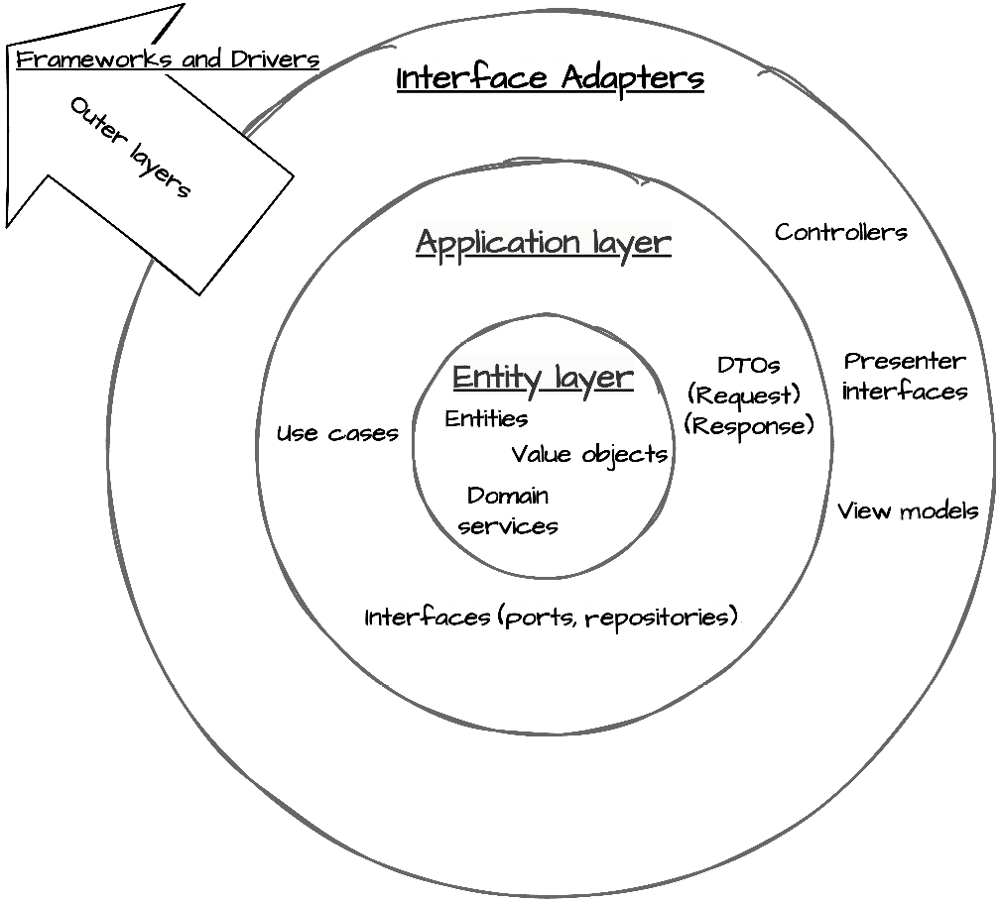
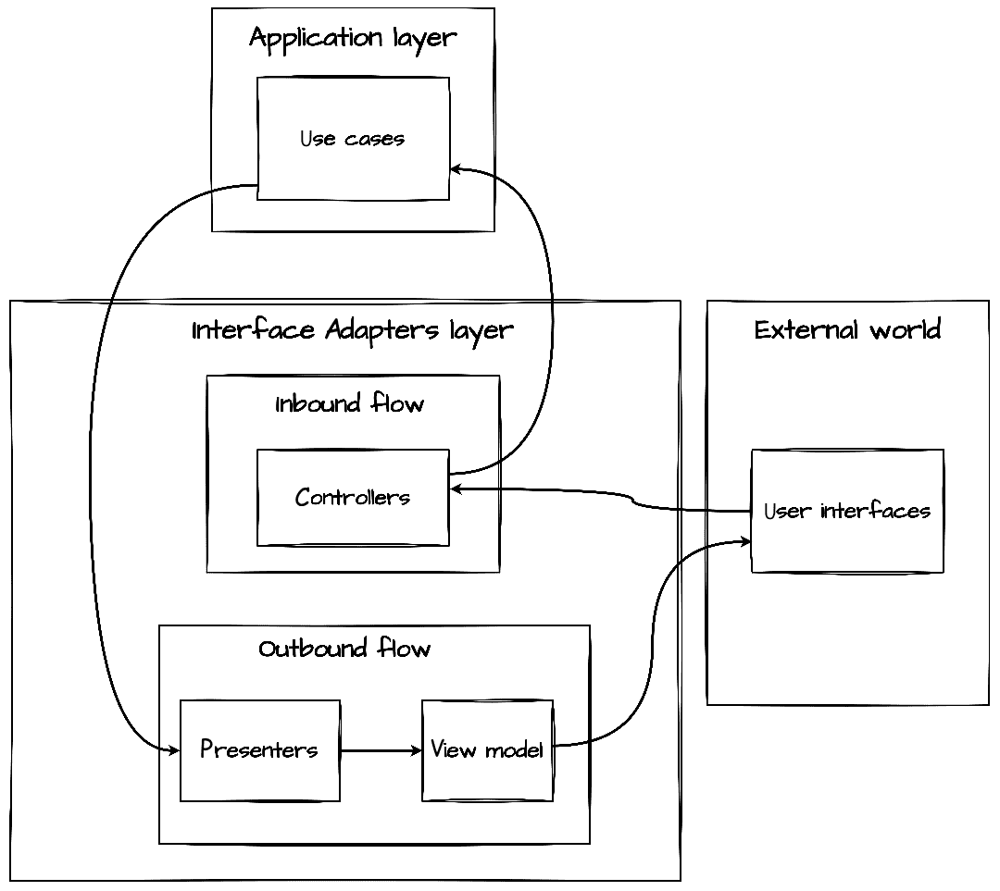
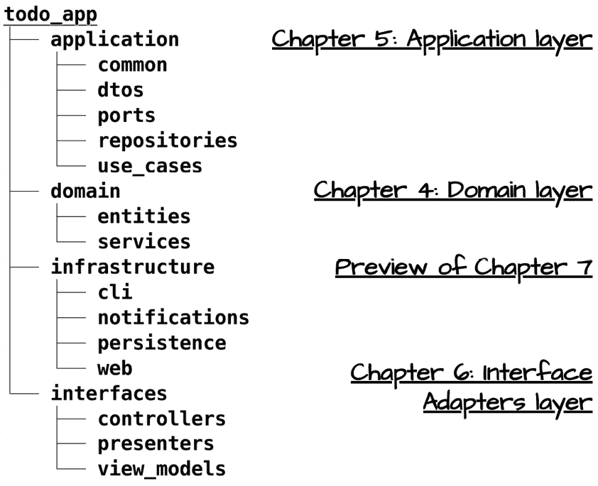

# 第六章：接口适配器层：控制器和展示者

在第四章和第五章中，我们构建了任务管理系统的基础——代表我们业务概念的领域实体以及编排它们的用例。应用层的请求/响应模型处理用例和领域对象之间的转换，确保我们的核心业务规则保持纯净和专注。然而，这些用例与外部世界（如 Web 界面或命令行工具）之间仍然存在差距。这就是接口适配器层的作用所在。

接口适配器层作为我们应用程序核心和外部关注点之间的翻译者。它转换外部机构方便的数据格式和我们的用例期望的数据格式。通过精心设计的控制器和展示者，这一层维护了保持我们的核心业务规则隔离和可维护性的架构边界。

在本章中，我们将探讨如何在 Python 中实现接口适配器层，了解它是如何维护清洁架构的依赖规则的。我们将学习控制器如何协调外部输入与我们的用例，以及展示者如何将领域数据转换为各种输出需求。

到本章结束时，你将了解如何创建一个灵活的接口适配器层，它既能保护你的核心业务逻辑，又能支持多个接口。你将实现清洁架构的边界，使你的系统更易于维护和适应变化。

在本章中，我们将涵盖以下主要主题：

+   设计接口适配器层

+   在 Python 中实现控制器

+   通过接口适配器强制边界

+   构建用于数据格式化的展示者

# 技术要求

本章和本书其余部分提供的代码示例均使用 Python 3.13 进行测试。为了简洁，章节中的代码示例可能只部分实现。所有示例的完整版本可以在本书配套的 GitHub 仓库[`github.com/PacktPublishing/Clean-Architecture-with-Python`](https://github.com/PacktPublishing/Clean-Architecture-with-Python)中找到。

# 设计接口适配器层

在清洁架构中，每一层都在维护关注点分离方面发挥着特定的作用。正如我们在前面的章节中看到的，领域层封装了我们的核心业务规则，而应用层则编排用例。但我们如何将这些纯业务导向的层与用户界面、数据库和外部服务的实际需求相连接呢？这就是接口适配器层的作用。



图 6.1：接口适配器层的主要组件

在下一节中，我们将深入探讨接口适配器层的作用，并展示该层在我们任务管理应用程序中的示例。

## 接口适配器层在整洁架构中的作用

接口适配器层充当了我们应用核心与外部细节（如 Web 框架或命令行界面）之间的一组翻译器。这一层至关重要，因为它允许我们在保持整洁架构边界的同时，使外部关注点能够进行实际交互。通过位于应用层和外部接口之间，它确保：

+   我们的核心业务逻辑保持纯净和专注

+   外部关注点不能渗透到内部层

+   外部接口的更改不会影响我们的核心逻辑

+   多个接口可以一致地与我们的系统交互

该层的主导原则是依赖规则：依赖关系必须指向核心业务规则。接口适配器层通过确保所有翻译保持适当的架构边界来严格执行此规则。

## 接口适配器层的职责

当我们深入研究整洁架构的接口适配器层时，理解其核心职责至关重要。正如翻译者必须精通他们所使用的两种语言一样，这一层必须理解我们应用核心的精确语言和外部接口的多种方言。这些职责形成了通过我们系统传递的两个截然不同但互补的数据流，每个都需要仔细处理以保持我们的架构边界。



图 6.2：通过接口适配器层的双向数据流

在*图 6.2*中，我们看到接口适配器层管理着我们的应用核心与外部关注点之间的双向数据流：

+   **入站数据流**:

    +   将外部请求转换为应用特定格式

    +   确保数据满足应用要求

    +   与用例协调以执行操作

+   **出站数据流**:

    +   将应用结果转换为外部消费格式

    +   提供适合接口的数据格式

    +   在核心逻辑和外部接口之间保持分离

这些责任构成了我们接下来要检查的具体组件的基础。

## 接口适配器层与应用层边界

当首次与整洁架构合作时，人们常常会想知道接口适配器层与应用层之间的数据转换区别。毕竟，这两个层似乎都处理数据转换。然而，在我们的架构中，这两个层起着根本不同的作用，理解这些差异对于保持我们系统中的整洁边界至关重要。

尽管接口适配器层和应用层都处理数据转换，但它们服务于不同的目的，并保持不同的边界：

+   **应用层**:

    +   在领域实体和用例特定格式之间进行转换

    +   专注于业务规则协调

    +   与特定领域的类型和结构一起工作

+   **接口适配器层**：

    +   在用例格式和外部接口需求之间进行转换

    +   专注于外部接口协调

    +   与特定接口的格式和原始类型一起工作

这种清晰的分离确保了我们的系统在核心业务逻辑和外部接口之间保持了强大的边界。

## 关键组件及其关系

在理解接口适配器层的责任和边界之后，我们现在可以检查实现这些概念的具体组件。这些组件像一个精心编排的团队一样协同工作，每个组件都在维护我们的架构边界的同时，使系统交互变得实用。虽然我们将在本章后面探索详细的实现，但了解这些组件如何协作为我们清洁架构设计提供了基本背景。

接口适配器层通过三个关键组件实现其责任：

+   **控制器**处理输入流，作为外部请求进入我们系统的入口点。它们确保进入我们应用程序核心的数据符合我们系统的要求，同时保护用例免受外部关注。

+   **演示者**管理输出流，将用例结果转换为适合外部消费的格式。接口适配器层定义了演示者接口，确立了用例和具体演示者实现都必须遵循的合同。

+   **视图模型**作为演示者和视图之间的数据载体，仅包含原始类型和简单的数据结构。这种简单性确保了视图可以轻松消费格式化数据，同时保持清晰的架构边界。

这些组件在一个精心编排的流程中相互作用，始终遵守依赖规则：

1.  外部请求通过控制器流动

1.  控制器与用例协调

1.  用例通过定义的接口返回结果

1.  演示者将结果格式化为视图模型

1.  视图消费格式化数据

这场精心策划的交互确保了我们的系统在保持实用性和可维护性的同时，维持了清晰的边界。

## 接口设计原则

在设计接口适配器层的接口时，我们必须在清晰的架构边界和实用的实现关注之间取得平衡。正如我们在*第五章*中看到的请求/响应模型，仔细的接口设计能够实现流畅的数据流，同时保持层之间的适当分离。本层指导接口设计的原则帮助我们实现这种平衡，同时遵守清洁架构的核心原则。

三个关键原则塑造了我们的接口设计：

+   **依赖规则**在所有设计决策中占优先地位。所有依赖都必须指向用例和实体。这意味着我们的接口适配器依赖于应用程序接口（如我们在*第五章*中看到的`CreateTaskUseCase`），但应用程序永远不会依赖于我们的适配器。这一规则确保外部接口的变化不会影响我们的核心业务逻辑。

+   **单一职责原则**指导组件边界。每个适配器处理一种特定的转换类型：控制器处理输入验证和转换，而展示者管理输出格式。这种分离使得我们的系统更容易维护和修改。例如，`TaskController`专注于验证和转换与任务相关的输入，而`TaskPresenter`仅处理任务数据的显示格式。

+   **接口分离原则**确保我们的接口保持专注和一致。我们不是创建大型、单一接口，而是设计小型、目的特定的接口，以满足不同的客户端需求。例如，我们可能不会有一个单一的`TaskOperations`接口，而是为任务创建、完成和查询分别设计接口。这种粒度提供了灵活性，并使我们的系统更能适应变化。

通过遵循这些原则，我们创建了有效地连接我们干净、专注的核心业务逻辑和外部接口实际需求的接口。在我们接下来的具体实现探讨中，我们将看到这些原则如何指导我们的设计决策，并导致代码更加易于维护。

# 在 Python 中实现控制器

在建立了接口适配器层的理论基础之后，我们现在转向使用 Python 的实际实现。Python 的语言特性为实施 Clean Architecture 的控制器模式提供了几个优雅的机制。通过数据类、抽象基类（ABCs）和类型提示，我们可以在保持 Python 风格的同时创建清晰且易于维护的接口边界。

虽然 Clean Architecture 提供了一套原则和模式，但它并没有规定一个严格的实现方法。在我们继续前进的过程中，请记住，这代表了对 Clean Architecture 原则的一种可能实现；关键是保持清晰的边界和关注点的分离，无论具体的实现细节如何。

## 控制器职责和模式

正如我们在检查接口适配器层组件时所见，Clean Architecture 中的控制器有一组专注的职责：它们接受来自外部来源的输入，验证和转换该输入为用例期望的格式，协调用例执行，并适当地处理结果。

让我们考察一个具体实现，以展示这些原则：

```py
@dataclass
class TaskController:
    create_use_case: CreateTaskUseCase
    # ... additional use cases as needed
    presenter: TaskPresenter
    def handle_create(
        self,
        title: str,
        description: str
    ) -> OperationResult[TaskViewModel]:
        try:
            request = CreateTaskRequest(
                title=title,
                description=description
            )
            result = self.create_use_case.execute(request)
            if result.is_success:
                view_model = self.presenter.present_task(result.value)
                return OperationResult.succeed(view_model)
            error_vm = self.presenter.present_error(
                result.error.message,
                str(result.error.code.name)
            )
            return OperationResult.fail(error_vm.message, error_vm.code)
        except ValueError as e:
            error_vm = self.presenter.present_error(
                str(e), "VALIDATION_ERROR")
            return OperationResult.fail(error_vm.message, error_vm.code) 
```

这个控制器演示了几个关键的清洁架构原则。首先，注意它只依赖于注入的依赖项：用例和展示者都是在其他地方构建的，并通过构造函数注入引入控制器。

为了理解为什么这种**依赖注入模式**如此重要，考虑以下反例：

```py
# Anti-example: Tightly coupled controller
class TightlyCoupledTaskController:
    def __init__(self):
        # Direct instantiation creates tight coupling
        self.use_case = TaskUseCase(SqliteTaskRepository())
        self.presenter = CliTaskPresenter()

    def handle_create(self, title: str, description: str):
        # Implementation details...
        pass 
```

这个反例或反例演示了几个问题：

+   直接实例化具体类会导致紧密耦合

+   控制器对实现细节了解过多

+   由于依赖关系无法替换，测试变得困难

+   实现的变化迫使控制器发生变化

回到我们的清洁实现，`handle_create`方法展示了控制器核心职责的实际操作。它首先从外部世界接受原始类型（`title`和`description`字符串）——保持接口简单且与框架无关。然后，这些输入被转换成一个合适的请求对象，在它到达我们的用例之前进行验证和格式化。

为了简洁起见，我们只展示了`handle_create`的实现，但在实践中，这个控制器会有额外的用例注入（如`complete_use_case`、`set_priority_use_case`等）和相应的处理方法实现。这种依赖注入和处理实现的模式在所有控制器操作中保持一致。

控制器的错误处理策略特别值得注意。它在验证错误到达用例之前捕获它们，并处理用例执行的成功和失败结果。在所有情况下，它都使用展示者适当地格式化响应，以便外部消费，并将它们包装在`OperationResult`中，使成功和失败情况明确。这种模式建立在我们在*第五章*中引入的结果类型之上，增加了对特定接口格式化的视图模型支持。我们将在*构建用于数据格式化的展示者*中更详细地讨论`OperationResult`的使用。

这种关注点的清晰分离确保我们的业务逻辑不知道它是如何被调用的，同时为外部客户端提供了一个强大且易于维护的接口。

## 在控制器中与请求模型协同工作

在我们之前对`TaskController`的审查中，我们看到了`CreateTaskRequest`，在*第五章*对应用层的覆盖中也有所提及。现在让我们更仔细地研究控制器如何与这些请求模型协同工作，以保持外部输入和我们的用例之间的清晰边界：

```py
@dataclass(frozen=True)
class CreateTaskRequest:
    """Request data for creating a new task."""
    title: str
    description: str
    due_date: Optional[str] = None
    priority: Optional[str] = None
    def to_execution_params(self) -> dict:
        """Convert request data to use case parameters."""
        params = {
            "title": self.title.strip(),
            "description": self.description.strip(),
        }
        if self.priority:
            params["priority"] = Priority[self.priority.upper()]
        return params 
```

虽然应用层定义了这些请求模型，但控制器负责它们的正确实例化和使用。控制器确保在使用用例执行之前进行输入验证：

```py
# In TaskController
try:
    request = CreateTaskRequest(title=title, description=description)
    # Request is now validated and properly formatted
    result = self.create_use_case.execute(request)
except ValueError as e:
    # Handle validation errors before they reach use cases
    return OperationResult.fail(str(e), "VALIDATION_ERROR") 
```

这种分离确保我们的用例始终只接收经过适当验证和格式化的数据，在保持清洁的架构边界的同时提供强大的输入处理。

## 维护控制器独立性

我们接口适配器层的有效性在很大程度上取决于在控制器与外部和内部关注点之间保持适当的隔离。

让我们更仔细地看看我们的`TaskController`是如何实现这种独立性的：

```py
@dataclass
class TaskController:
    create_use_case: CreateTaskUseCase  # Application layer interface
    presenter: TaskPresenter            # Interface layer abstraction 
```

这种简单的依赖结构展示了几个关键原则。首先，控制器只依赖于抽象；它对用例或展示者的具体实现一无所知。

让我们花点时间澄清一下我们所说的 Python 中的*抽象*。正如我们很快就会看到的，`TaskPresenter`遵循经典的接口模式，使用 Python 的 ABC 建立正式的接口契约。对于像`CreateTaskUseCase`这样的用例，我们利用 Python 的鸭子类型，因为每个用例只需要一个具有定义参数和返回类型的`execute`方法，任何提供此方法的类都满足了接口契约，无需 ABC 的正式性。

在定义接口方面的这种灵活性是 Python 的强项之一。当我们需要强制执行复杂的契约或依赖于鸭子类型来简化接口时，我们可以选择正式的 ABC 接口。这是开发者选择他们偏好的风格。两种方法都维护了 Clean Architecture 的依赖原则，同时保持 Python 的惯用性。

进行心理盘点，注意我们的控制器中缺少了什么：

+   没有 Web 框架导入或装饰器

+   没有数据库或存储问题

+   没有直接实例化依赖项

+   对具体视图实现没有了解

这种谨慎的隔离意味着我们的控制器可以被任何交付机制使用——无论是 Web API、命令行界面（CLI）还是消息队列消费者。考虑一下当我们违反这种隔离会发生什么：

```py
# Anti-example: Controller with framework coupling
class WebTaskController:
    def __init__(self, app: FastAPI):
        self.app = app
        self.use_case = CreateTaskUseCase()  # Direct instantiation too!

    async def handle_create(self, request: Request):
        try:
            data = await request.json()
            # Controller now tightly coupled to FastAPI
            return JSONResponse(status_code=201, content={"task": result})
        except ValidationError as e:
            raise HTTPException(status_code=400, detail=str(e)) 
```

这个反例通过以下方式违反了我们的隔离原则：

+   导入并依赖于特定的 Web 框架

+   处理 HTTP 特定问题

+   将框架错误处理与业务逻辑混合

关于如何公开我们的控制器功能的决定属于框架层。在第*7 章*中，我们将看到如何创建适当的框架特定适配器，这些适配器封装了我们的清洁控制器实现。这允许我们在利用 FastAPI、Click（用于命令行）或消息队列库等框架的完整功能的同时，保持清洁的架构边界。

我们控制器所依赖的接口展示了清洁架构对边界的细致关注：由应用层定义的使用案例接口建立了我们的内向依赖，而我们在接口适配器层中定义的表示器接口则让我们能够控制外向数据流。这种仔细的接口安排确保我们在保持系统灵活性和适应性的同时，维护了依赖规则。

# 通过接口适配器强制执行边界

虽然我们对控制器的审查展示了如何处理传入的请求，但清洁架构的接口边界要求我们仔细关注双向的数据流。在本节中，我们将探讨在整个系统中保持清洁边界的模式，特别是关注对成功和失败情况的明确处理。这些模式补充了我们的控制器和表示器，同时确保所有跨边界通信都保持清晰和可维护。

## 边界处的显式成功/失败模式

在我们的架构边界处，我们需要清晰、一致的方式来处理成功操作和失败情况。操作可能因多种原因而失败——无效输入、业务规则违规或系统错误——每种类型的失败可能需要通过外部接口进行不同的处理。同样，成功的操作需要以适合请求它们的接口的格式提供其结果。我们已经在前面展示的控制器示例中看到了这种机制的应用。

```py
class TaskController:

    def handle_create(
        self,
        title: str,
        description: str
    ) -> OperationResult[TaskViewModel]: 
```

`OperationResult` 模式通过提供一种标准化的方式来处理成功和失败情况，来满足这些需求。此模式确保我们的接口适配器始终明确地传达结果，使得错误情况不可能被忽略，并为成功场景提供清晰的架构：

```py
@dataclass
class OperationResult(Generic[T]):
    """Represents the outcome of controller operations."""
    _success: Optional[T] = None
    _error: Optional[ErrorViewModel] = None
    @classmethod
    def succeed(cls, value: T) -> 'OperationResult[T]':
        """Create a successful result with the given view model."""
        return cls(_success=value)
    @classmethod
    def fail(cls, message: str,
             code: Optional[str] = None) -> 'OperationResult[T]':
        """Create a failed result with error details."""
        return cls(_error=ErrorViewModel(message, code)) 
```

注意类是如何定义为 `OperationResult(Generic[T])` 的。这意味着我们的类可以与任何类型 `T` 一起工作。当我们实例化类时，我们将 `T` 替换为特定的类型——例如，当我们编写 `OperationResult[TaskViewModel]` 时，我们是在说：*这个操作要么成功返回一个* `TaskViewModel` *，要么失败返回一个错误 (*`ErrorViewModel`*)*。这种类型安全性有助于早期捕获潜在的错误，同时使我们的代码意图更加清晰。

这种对结果的明确处理为我们将在接口适配器中看到的清洁边界跨越提供了一个基础。当我们进入查看数据转换模式时，我们将看到这种对成功和失败处理的清晰度如何帮助保持清洁的架构边界，同时实现实用的功能。

如果我们查看一些应用程序代码（位于框架层），我们会看到如何利用这个 `OperationResult` 来驱动应用程序流程：

```py
# pseudo-code example of a CLI app working with a OperationResult
result = app.task_controller.handle_create(title, description) 
if result.is_success:
    task = result.success
    print(f"{task.status_display} [{task.priority_display}] {task.title}")
    return 0
print(result.error.message, fg='red', err=True)
    return 1 
```

## 清洁的数据转换流程

当数据穿过我们的架构边界时，它经历了几个转换。理解这些转换流程有助于我们在确保系统可维护的同时保持清晰的边界：

```py
# Example transformation flow in TaskController
def handle_create(
    self, title: str, description: str
) -> OperationResult[TaskViewModel]:
    try:
        # 1\. External input to request model
        request = CreateTaskRequest(title=title, description=description)

        # 2\. Request model to domain operations
        result = self.use_case.execute(request)

        if result.is_success:
            # 3\. Domain result to view model
            view_model = self.presenter.present_task(result.value)
            return OperationResult.succeed(view_model)

        # 4\. Error handling and formatting
        error_vm = self.presenter.present_error(
            result.error.message,
            str(result.error.code.name)
        )
        return OperationResult.fail(error_vm.message, error_vm.code)

    except ValueError as e:
        # 5\. Validation error handling
        error_vm = self.presenter.present_error(
            str(e), "VALIDATION_ERROR")
        return OperationResult.fail(error_vm.message, error_vm.code) 
```

此示例显示了一个完整的转换链：

1.  外部输入验证和转换

1.  使用域类型执行用例

1.  成功案例转换为视图模型

1.  错误情况处理和格式化

1.  验证错误处理

此链中的每一步都保持清晰的边界，同时确保数据在层之间正确移动。

## 接口适配器和架构边界

虽然我们一直关注控制器和展示者作为关键接口适配器，但并非每一层之间的交互都需要适配器。理解何时需要适配器有助于在不引入不必要复杂性的情况下维护清晰的架构。

```py
# Defined in Application layer
class TaskRepository(ABC):
    @abstractmethod
    def get(self, task_id: UUID) -> Task:
        """Retrieve a task by its ID."""
        pass
# Implemented directly in Infrastructure layer
class SqliteTaskRepository(TaskRepository):
    def get(self, task_id: UUID) -> Task:
        # Direct implementation of interface
        pass 
```

这里不需要适配器，因为：

+   应用层定义了所需的精确接口

+   实现可以直接满足此接口

+   不需要数据格式转换

+   依赖规则无需适配

这与必须处理不同外部格式和协议的控制器和展示者不同。在决定是否需要适配器时，关键问题是：*这种交互需要在层之间进行格式转换吗*？如果外层可以直接与内层定义的接口工作，那么在接口层可能不需要适配器。

这种区分有助于我们在避免不必要抽象的同时维护清晰架构的原则。通过理解何时需要适配器，我们可以创建更可维护的系统，尊重架构边界而不使我们的设计过于复杂。

# 为数据格式化构建展示者

在本章中，我们一直将展示者作为接口适配器层的关键组件进行引用。现在我们将详细检查它们，看看它们是如何在准备域数据以供外部消费的同时保持清晰的架构边界。

展示者补充了我们的控制器，处理数据的输出流，就像控制器管理输入请求一样。通过实现谦逊对象模式，展示者帮助我们创建更可测试和可维护的系统，同时保持视图简单和专注。

## 理解谦逊对象模式

**谦逊对象模式**解决了清晰架构中一个常见的挑战：如何在保持清晰架构边界的同时处理展示逻辑，展示逻辑通常难以进行单元测试。

“谦逊对象”这个术语来自使组件尽可能简单且逻辑尽可能简单的策略。在展示环境中，这意味着创建一个极其基本的视图，它除了显示预格式化数据之外不做任何事情。视图通过设计变得“谦逊”，包含最少的智能。

例如，一个谦逊的视图可能是：

+   简单的 HTML 模板渲染预格式化数据

+   一个仅显示传递的 props 的 React 组件

+   一个打印格式化字符串的 CLI 显示函数

这种模式在两个组件之间分割责任：

+   一个*谦逊的视图*，包含最少且难以测试的逻辑

+   包含所有演示逻辑的演示者，以易于测试的形式

考虑我们的任务管理系统如何在 CLI 中显示任务信息：

```py
# The "humble" view - simple, minimal logic, hard to test
def display_task(task_vm: TaskViewModel):
    print(f"{task_vm.status_display} [{task_vm.priority_display}]
          {task_vm.title}")
    if task_vm.due_date_display:
        print(f"Due: {task_vm.due_date_display}") 
```

所有格式化决策——如何显示状态、优先级级别、日期——都存在于我们的演示者中，而不是视图模型（`TaskViewModel`）本身。这种分离带来了几个好处：

+   视图保持简单，专注于显示

+   演示逻辑保持可测试

+   业务规则保持与显示关注点的隔离

+   多个接口可以共享格式化逻辑

值得注意的是，对演示者的强调可以根据您的具体需求而变化。如果您正在构建一个将数据提供给 JavaScript 前端 Python API，您可能需要最少的演示逻辑。然而，在像 Django 或 Flask 这样的全栈 Python 应用程序中，强大的演示者有助于保持业务逻辑和显示关注点之间的清晰分离。了解这个模式可以让您根据您的具体情况做出明智的决定。

## 定义演示者接口

清洁架构的成功在很大程度上依赖于在架构边界上定义良好的接口。对于演示者，这些接口为将领域数据转换为演示准备格式建立了清晰的合同：

```py
class TaskPresenter(ABC):
    """Abstract base presenter for task-related output."""

    @abstractmethod
    def present_task(self, task_response: TaskResponse) -> TaskViewModel:
        """Convert task response to view model."""
        pass

    @abstractmethod
    def present_error(self, error_msg: str,
                      code: Optional[str] = None) -> ErrorViewModel:
        """Format error message for display."""
        pass 
```

这个接口定义在我们的接口适配器层中，它服务于几个关键目的：

+   为任务演示建立清晰的合同

+   启用多个接口实现

+   通过保持领域逻辑对演示细节的无知来维护依赖规则

+   通过清晰的抽象使测试更容易

注意到接口如何使用领域特定类型（`TaskResponse`）作为输入，但返回视图特定类型（`TaskViewModel`）。这种边界跨越是我们将领域概念转换为演示友好格式的位置。

## 与视图模型一起工作

视图模型作为演示者和视图之间的数据载体，确保演示逻辑和显示关注点之间的清晰分离。它们以任何视图实现都可以轻松消费的方式封装格式化数据：

```py
@dataclass(frozen=True)
class TaskViewModel:
    """View-specific representation of a task."""
    id: str
    title: str
    description: str
    status_display: str      # Pre-formatted for display
    priority_display: str    # Pre-formatted for display
    due_date_display: Optional[str]  # Pre-formatted for display
    project_display: Optional[str]   # Pre-formatted project context
    completion_info: Optional[str]   # Pre-formatted completion details 
```

几个关键原则指导我们的视图模型设计：

+   只使用原始类型（字符串、数字、布尔值）

+   预格式化所有显示文本

+   不要对显示机制做任何假设

+   注意到`frozen=True`如何保持不可变

+   只包含显示所需的数据

这种简单性确保我们的视图真正地*谦逊*——它们只需要读取和显示这些预格式化的值，无需了解领域概念或格式化规则。

## 实现具体的演示者

在定义了我们的演示者接口和视图模型之后，我们可以为特定的接口需求实现具体的演示者。这些具体的演示者是在框架和驱动层实现的，但我们在这里提前展示一下以供参考。让我们检查一个针对 CLI 的特定演示者实现：

```py
class CliTaskPresenter(TaskPresenter):
    """CLI-specific task presenter."""
    def present_task(self, task_response: TaskResponse) -> TaskViewModel:
        """Format task for CLI display."""
        return TaskViewModel(
            id=str(task_response.id),
            title=task_response.title,
            description=task_response.description,
            status_display=self._format_status(task_response.status),
            priority_display=self._format_priority(
                task_response.priority),
            due_date_display=self._format_due_date(
                task_response.due_date),
            project_display=self._format_project(
                task_response.project_id),
            completion_info=self._format_completion_info(
                task_response.completion_date,
                task_response.completion_notes
            )
        ) 
```

`present_task`方法将我们的领域特定`TaskResponse`转换为视图友好的`TaskViewModel`。为了支持这种转换，展示器实现了几个私有格式化方法，这些方法处理数据的特定方面：

```py
class CliTaskPresenter(TaskPresenter):  # continuing from above
    def _format_due_date(self, due_date: Optional[datetime]) -> str:
        """Format due date, indicating if task is overdue."""
        if not due_date:
            return "No due date"
        is_overdue = due_date < datetime.now(timezone.utc)
        date_str = due_date.strftime("%Y-%m-%d")
        return (
            f"OVERDUE - Due: {date_str}"
            if is_overdue else f"Due: {date_str}"
        )
    def present_error(self, error_msg: str,
                      code: Optional[str] = None) -> ErrorViewModel:
        """Format error message for CLI display."""
        return ErrorViewModel(message=error_msg, code=code) 
```

这种实现展示了几个关键的清洁架构原则：

+   所有格式化逻辑都存在于展示器中，而不是视图中

+   领域概念（如`TaskStatus`）被转换为显示字符串

+   错误处理与成功案例保持一致

+   接口特定的格式化（在本例中为命令行界面）保持隔离

展示器的格式化方法保持高度可测试性：我们可以验证逾期任务是否被正确标记，日期是否正确格式化，以及错误消息是否保持一致性。这种可测试性与直接测试 UI 组件形成鲜明对比，展示了谦逊对象模式的关键优势。

**实现灵活性**

如果你正在构建一个主要服务于 JavaScript 前端 JSON 的 API，你可能需要最少的展示逻辑。当需要复杂的格式化或支持多种接口类型时，展示器模式变得最有价值。

在*第七章*中，我们将看到不同的接口（命令行界面、Web 或 API）如何在共享这一共同架构的同时实现它们自己的展示器。这种灵活性展示了清洁架构对边界的细致关注如何使系统进化而不会损害核心业务逻辑。

通过我们对控制器和展示器的探索，我们现在已经为我们的任务管理系统实现了完整的接口适配器层。让我们花点时间回顾我们的架构进展，通过检查我们在*第四章到第六章*中构建的结构：



图 6.3：所有层都就位时的文件夹结构

这种结构反映了清洁架构的同心层。我们建立的领域层，在*第四章*中，保持纯粹和专注于业务规则。应用层，在*第五章*中添加，协调这些领域对象以完成特定用例。现在，随着我们的接口适配器层的实现，我们已经实现了控制器和展示器，它们在核心业务逻辑和外部关注点之间进行转换，同时保持清晰的边界，并使与我们的系统进行实际交互成为可能。请参阅随附的 GitHub 仓库([`github.com/PacktPublishing/Clean-Architecture-with-Python`](https://github.com/PacktPublishing/Clean-Architecture-with-Python))，以获取本书中使用的任务管理应用程序示例的更广泛的代码示例。

# 摘要

在本章中，我们探讨了清洁架构的接口适配器层，实现了控制器和展示者，它们在保持清洁边界的同时，允许与外部系统进行实用交互。我们学习了控制器如何处理传入的请求，将外部输入转换为我们的用例可以处理的格式，同时展示者将领域数据转换为视图友好的格式。

以我们的任务管理系统为例，我们看到了如何实现控制器，使其独立于特定的输入源，以及展示者如何将格式化逻辑与视图实现细节分离。我们基于第*5 章*中的结果模式，引入了`OperationResult`，以便在架构边界处进行显式的成功和失败处理。谦逊的对象模式向我们展示了如何保持展示逻辑和视图之间的清洁分离，从而提高可测试性和可维护性。

在*第七章*中，我们将探讨如何实现特定接口，这些接口消费我们的控制器和展示者。你将学习如何创建命令行和 Web 界面，这些界面与我们的系统交互，同时保持我们已建立的清洁边界。

# 进一步阅读

+   *清洁 DDD 课程：展示者* ([`medium.com/unil-ci-software-engineering/clean-ddd-lessons-presenters-6f092308b75e`](https://medium.com/unil-ci-software-engineering/clean-ddd-lessons-presenters-6f092308b75e))。关于清洁架构中展示者方法的讨论。

+   *实现清洁架构——Asp.Net 控制器“清洁”吗？* ([`www.plainionist.net/Implementing-Clean-Architecture-AspNet/`](https://www.plainionist.net/Implementing-Clean-Architecture-AspNet/))。一篇深入讨论在清洁架构中实现视图的多种方法优缺点的文章。
