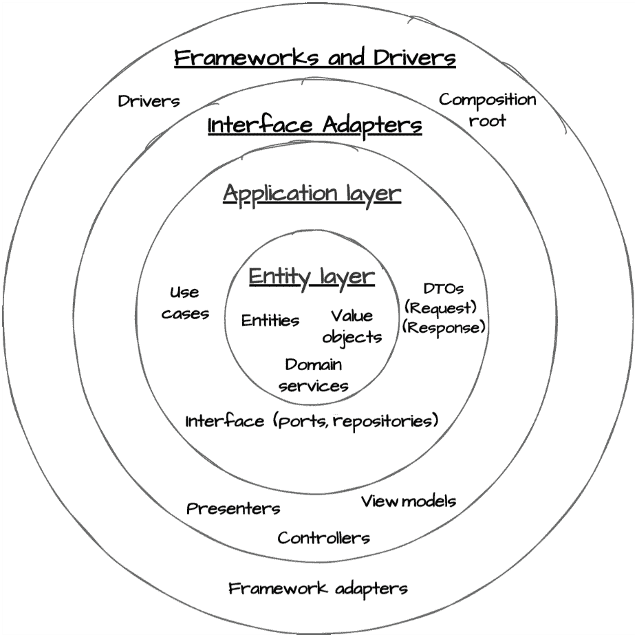
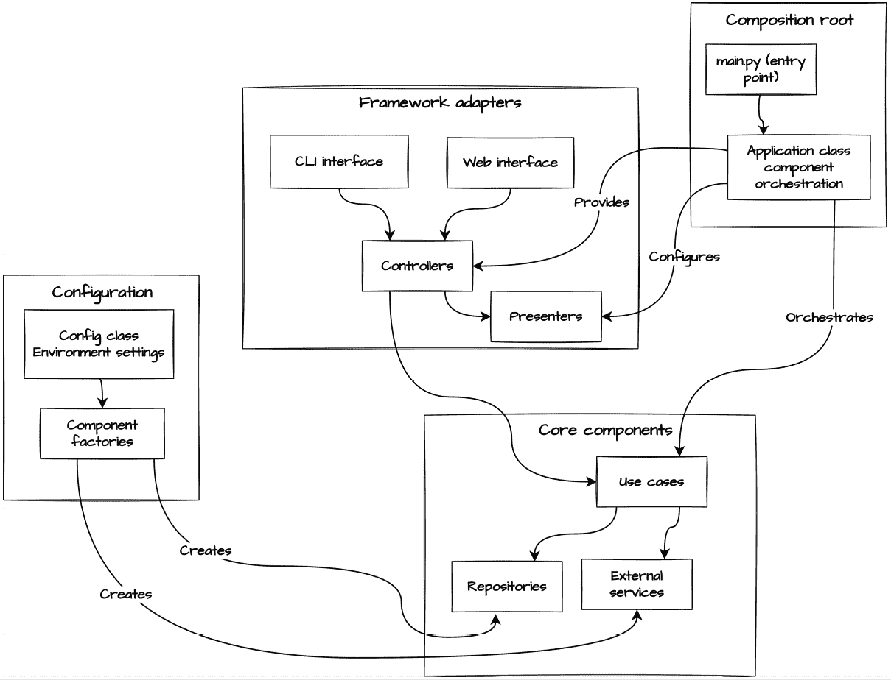
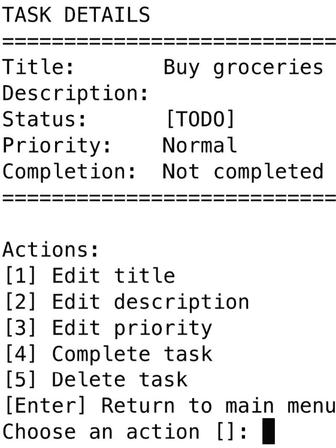
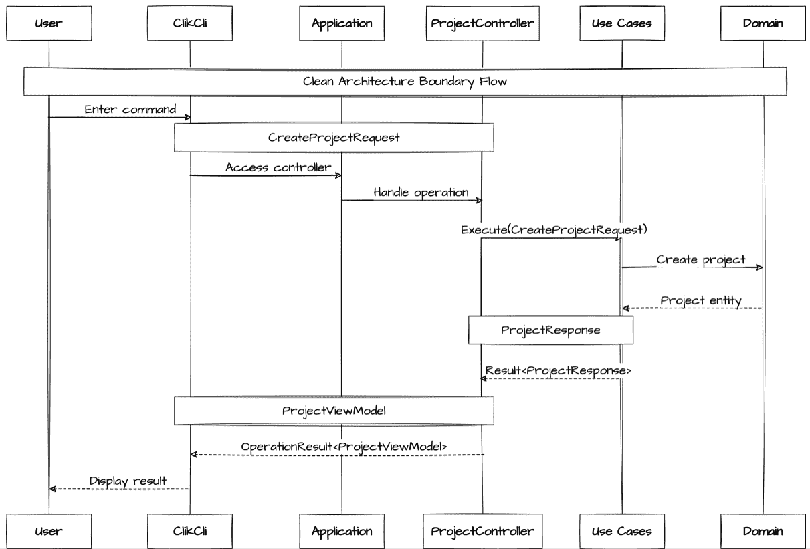
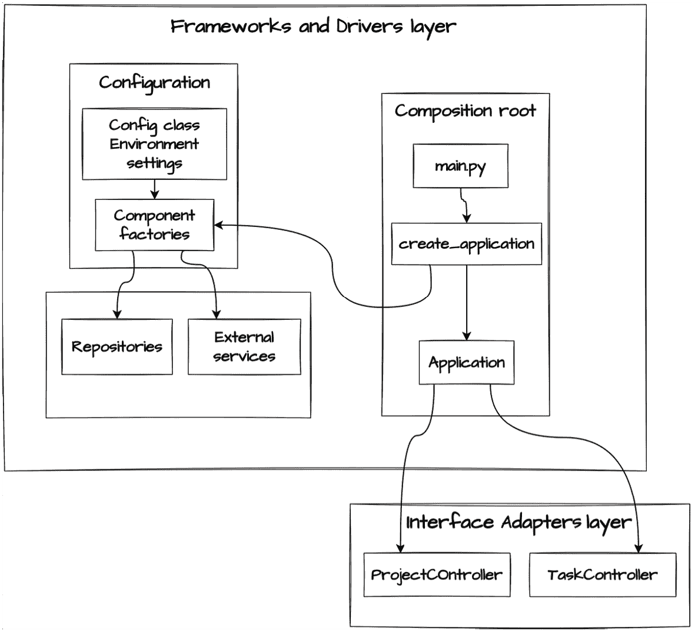
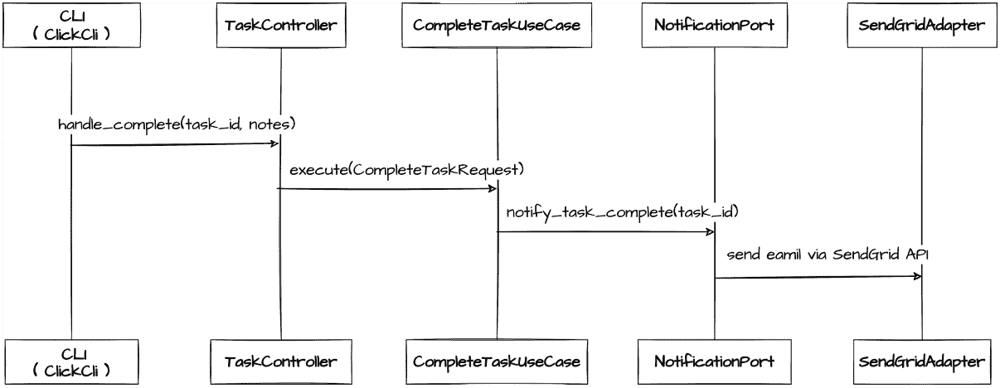
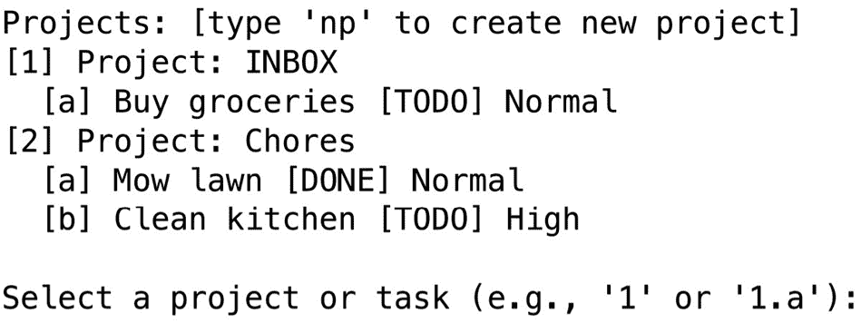

# 第七章：框架和驱动层：外部接口

**框架和驱动层**代表了清洁架构的最外层环，在这里我们的应用程序与真实世界相遇。在前面的章节中，我们从领域实体到用例，再到协调它们之间的接口适配器，构建了我们任务管理系统的核心。现在我们将看到清洁架构如何帮助我们与外部框架、数据库和服务集成，同时保持我们的核心业务逻辑纯净和安全。

通过实际实施，我们将探讨清洁架构对边界的细致关注如何使我们的应用程序能够与各种框架和外部服务协同工作，而不会对其产生依赖。我们将看到我们的任务管理系统如何利用外部能力——从用户界面到数据存储和通知。本章展示了清洁架构的原则如何转化为现实世界的实施。通过实际示例，您将看到清洁架构如何帮助管理外部集成的复杂性，同时保持您的核心业务逻辑集中和可维护。

到本章结束时，您将了解如何有效地实现框架和驱动层，在集成外部依赖的同时保持架构的完整性。您将能够将这些模式应用到自己的项目中，确保随着外部需求的变化，您的应用程序保持灵活和可维护。

在本章中，我们将涵盖以下主要主题：

+   理解框架和驱动层

+   创建 UI 框架适配器

+   组件组织和边界

+   实现数据库适配器

+   集成外部服务

# 技术要求

本章及本书其余部分展示的代码示例均使用 Python 3.13 进行测试。为了简洁，章节中的代码示例可能只部分实现。所有示例的完整版本可以在本书配套的 GitHub 仓库[`github.com/PacktPublishing/Clean-Architecture-with-Python`](https://github.com/PacktPublishing/Clean-Architecture-with-Python)中找到。如果你选择在集成外部服务部分运行电子邮件驱动程序示例，你需要在[`app.sendgrid.com`](https://app.sendgrid.com)注册一个免费的 SendGrid 开发者账户。

# 理解框架和驱动层

每个重要的软件应用程序最终都必须与真实世界交互。数据库需要查询，文件需要读取，用户需要接口。在清洁架构中，这些基本但易变的交互通过框架和驱动层进行管理。这一层的独特位置和责任使其既强大又可能对我们的架构目标构成潜在危险。

## 在清洁架构中的位置



图 7.1：框架和驱动层的主要组件

框架和驱动层在架构边缘的位置并非偶然；它代表了 Clean Architecture 所说的我们系统的细节。这些细节虽然对于应用程序的正常运行至关重要，但应该与我们的核心业务逻辑保持分离。这种分离创建了一个保护边界，通常只包含对最外层的更改。然而，当新的需求确实需要修改核心业务规则时，Clean Architecture 提供了明确的路径，通过每一层系统地实施这些更改，确保我们的系统优雅地进化，而不损害其架构完整性。

让我们考察关于框架和驱动层在 Clean Architecture 中位置的几个关键原则：

**外部边界**：作为最外层，它处理与外部世界的所有交互：

+   用户界面（命令行界面（CLI）、网页、API 端点）

+   数据库系统（如 SQLite 的驱动程序或如 SQLAlchemy 的框架）

+   外部服务和 API

+   文件系统和设备交互

**依赖方向**：遵循 Clean Architecture 的基本规则，所有依赖都指向内部。我们的框架和驱动依赖于内部层接口，但从不反过来：

+   数据库适配器实现了由应用层定义的存储库接口

+   网页控制器使用接口适配器层的接口

+   外部服务客户端适应来自应用层的内部抽象

**实现细节**：此层包含 Clean Architecture 认为的细节，即特定技术选择，这些选择应该是可互换的：

+   SQLite 或 PostgreSQL 之间的选择

+   使用 Click 与 Typer 进行 CLI 实现

+   选择 SendGrid 或 AWS SES 进行电子邮件通知

这种战略定位提供了几个关键好处：

+   **框架独立性**：核心业务逻辑对特定的框架选择一无所知

+   **易于测试**：外部依赖可以被测试替身替换

+   **灵活的进化**：实现细节可以更改，而不会影响内部层

+   **清晰的边界**：显式接口定义了外部关注点如何与我们的系统交互

对于我们的任务管理系统，这意味着无论我们是在实现命令行界面、将任务存储在文件中，还是通过电子邮件服务发送通知，所有这些实现细节都生活在这个最外层，同时尊重内部层定义的接口。

接下来，我们将探讨框架和驱动之间的区别，帮助我们理解如何有效地实现每种类型的外部依赖。

## 框架与驱动：理解区别

虽然 framework 和 drivers 都位于 Clean Architecture 的最外层，但它们在集成复杂性方面存在显著差异。这种区别源于它们与我们探索的 *第五章和第六章* 中的层如何交互。

**框架**是全面的软件平台，它们强加自己的架构和控制流程：

+   类似 Flask 或 FastAPI 的 Web 框架

+   类似 Click 或 Typer 的 CLI 框架

+   对象关系建模（ORM）框架，如 SQLAlchemy

类似 Click（我们将为我们的 CLI 实现它）这样的框架需要完整的接口适配器层组件，以保持清晰的架构边界：

+   将框架特定的请求转换为用例输入的控制器

+   为框架消费格式化领域数据的演示者

+   为框架显示结构数据的视图模型

相比之下，**驱动程序**是更简单的组件，它们提供低级服务而不强加自己的结构或流程。例如，包括数据库驱动程序、文件系统访问组件和外部 API 客户端。与框架不同，驱动程序不规定你的应用程序如何工作，它们只是提供你根据需要适应的能力。

这些驱动程序通过端口与我们的应用程序交互——这是我们首次在第*第五章*中介绍的抽象接口。我们在那一章中看到了两个关键端口示例：

+   用于持久化操作的存储库接口，如`TaskRepository`

+   用于外部通知的服务接口，如`NotificationPort`

根据*第五章*中建立的模式，驱动程序通常只需要两个组件：

+   在应用层定义的端口（如`TaskRepository`）

+   在框架和驱动程序层的一个具体实现

在以下示例中，我们可以看到代码中的区别。首先，我们来看一个框架示例：

```py
# Framework example - requires multiple adapter components
@app.route("/tasks", methods=["POST"])
def create_task():
    """Framework requires full Interface Adapters stack"""
    result = task_controller.handle_create(  # Controller from Ch.6
        title=request.json["title"],
        description=request.json["description"]
    )
    return task_presenter.present(result)    # Presenter from Ch.6 
```

注意框架示例需要控制器来转换请求和演示者来格式化响应。

接下来，我们来看一个驱动程序的示例：

```py
# Driver example - only needs interface and implementation
class SQLiteTaskRepository(TaskRepository):  # Interface from Ch.5
    """Driver needs only basic interface implementation"""
    def save(self, task: Task) -> None:
        self.connection.execute(
            "INSERT INTO tasks (id, title) VALUES (?, ?)",
            (str(task.id), task.title)
        ) 
```

在这里，我们看到 SQLite 驱动程序直接通过基本的保存操作实现了存储库接口。

这种架构区分帮助我们为每种外部依赖实现适当的集成策略，同时保持 Clean Architecture 的依赖规则。这些分离提供了即时的实际好处：当你的数据库驱动程序出现安全漏洞时，修复只需要更新外层实现。当业务需求改变任务优先级时，这些变化仍然被隔离在你的领域逻辑中。这些不是理论上的好处，而是随着系统增长而累积的日常优势。

## 应用程序组合

在探讨了框架和驱动程序之间的区别之后，我们现在转向一个关键问题：这些组件是如何组合成一个统一的应用程序，同时保持清晰的架构边界的？这引出了**应用程序组合**的概念，即我们系统组件的系统组装。

在 Clean Architecture 中，应用程序组合作为协调点，我们的精心分离的组件联合起来形成一个工作系统。想想看，就像组装一个复杂的机器。每个部分都必须精确地配合在一起，但组装过程本身不应改变单个组件的工作方式。

Clean Architecture 应用程序的组合涉及三个关键方面共同工作：

**配置管理：**

+   管理特定环境的设置

+   控制框架和驱动程序选择

+   保持设置和业务逻辑之间的分离

+   允许开发、测试和生产使用不同的配置

**组件工厂：**

+   创建正确配置的接口实现

+   管理依赖生命周期

+   处理初始化序列

+   在对象创建过程中保持 Clean Architecture 的依赖规则

**主应用程序入口点：**

+   协调启动序列

+   处理顶级错误条件

+   保持启动和业务操作之间的清晰分离

+   作为依赖组装的组合根

让我们看看这些方面在实际中是如何协同工作的：



图 7.2：Clean Architecture 组合流程图，显示配置、组合根和框架适配器

我们的任务管理系统以特定方式实现了这些组合模式，以展示其实际价值：

+   配置机制提供环境感知设置，驱动实现选择，例如在内存存储或基于文件的存储之间进行选择

+   **组合根**通过 `main.py` 和 `Application` 类协调组件的组装，同时保持清晰的架构边界

+   **框架适配器**通过以下方式将我们的用户界面连接到核心应用程序：

    +   将 UI 请求转换为用例输入的控制器

    +   将领域数据格式化为显示的演示者

    +   清晰的分离，允许多个接口共享核心组件

这种架构方法提供了几个关键好处：

+   通过基于工厂的组件创建实现实施灵活性

+   通过明确定义的边界实现关注点的清晰分离

+   通过组件隔离实现易于测试

+   简单添加新功能，而不会破坏现有代码

这些优势贯穿于我们的实现之中。在接下来的章节中，我们将详细检查从*图 7.2*中的每个基础设施组件。我们将从配置管理到框架适配器进行覆盖，展示它们如何通过具体的模式和代码示例在实际中协同工作。

## 外层 Clean Architecture 模式

我们所探讨的模式为整合外部关注点提供了明确的策略，同时保护我们的核心业务逻辑。当我们开始实现任务管理系统中的特定组件时，这些模式将以独特的方式协同工作，以维持架构边界。

考虑这些模式在实际中的组合：一个网络请求到达我们系统的边缘，触发一系列清晰的架构交互。框架适配器将请求转换为我们的内部格式，而端口允许数据库和通知操作，而不暴露其实现细节。所有这些编排都通过我们的组合根发生，确保每个组件都接收到其正确配置的依赖项。

在本章剩余部分深入探讨这些主题时，我们将实现任务管理系统的部分功能，以看到这些模式在实际中的应用——从 CLI 适配器转换用户命令到存储库实现管理持久性。每个实现不仅展示了单个模式，还展示了它们如何合作以维持 Clean Architecture 的核心原则，同时提供实用的功能。

# 创建 UI 框架适配器

当集成用户界面框架时，Clean Architecture 的关注点分离变得特别有价值。UI 框架往往既易变又有偏见，因此隔离它们对我们核心业务逻辑的影响至关重要。在本节中，我们将探讨如何实现框架适配器，在保持清晰的边界的同时提供实用的用户界面。

## 实际中的框架适配器

让我们先看看我们正在构建的内容。我们的任务管理系统需要一个用户界面，使用户能够有效地管理项目和任务。*图 7.3*展示了我们的命令行界面中的一个典型交互屏幕：



图 7.3：CLI 应用程序中的任务编辑界面

此界面展示了我们系统的一些关键方面：

+   清晰显示任务详情和状态

+   简单的编号菜单用于常见操作

+   领域概念的格式一致（状态、优先级）

+   在不同视图之间直观导航

虽然这个界面对用户来说看起来很简单，但其实现需要在架构边界之间进行仔细的协调。显示的每一项信息和可用的每一个操作都代表着通过我们清洁架构层的数据流。*图 7.4* 展示了单个操作——创建项目——如何穿过这些边界：



图 7.4：创建项目的整个请求/响应流程

这个序列图揭示了几个重要的模式：

+   CLI 适配器将用户输入转换为正确结构的请求

+   这些请求通过我们定义良好的架构边界流过

+   每一层执行其特定的职责（验证、业务逻辑等）

+   响应通过层流回，并适当地转换为显示

通过理解数据如何通过我们的架构边界流动，让我们检查我们如何组织实现此流程的组件。

# 组件组织和边界

正如我们在 *图 7.2* 中看到的，我们的应用程序组合建立了一个清晰的架构，其中每个组件都有特定的职责。在这个系统的边缘，框架适配器必须处理外部框架和我们的清洁架构之间的数据转换，同时协调用户交互。

查看 *图 7.4*，我们可以看到我们的 CLI 适配器位于一个关键架构边界上。我们选择了 **Click**，这是一个流行的 Python 框架，用于构建命令行界面，用于我们的 CLI 实现。适配器必须在 Click 的框架特定模式和我们的应用程序的清洁接口之间进行转换，同时管理用户输入和结果的显示。

让我们检查核心适配器结构：

```py
class ClickCli:
    def __init__(self, app: Application):
        self.app = app
        self.current_projects = []  # Cached list of projects for display
    def run(self) -> int:
        """Entry point for running the Click CLI application"""
        try:
            while True:
                self._display_projects()
                self._handle_selection()
        except KeyboardInterrupt:
            click.echo("\nGoodbye!", err=True)
            return 0
    # ... additional methods 
```

这个高级结构展示了几个关键的清洁架构原则：

**依赖注入：**

+   适配器通过构造函数注入接收其应用实例

+   这通过保持适配器对内部层的依赖来维护依赖规则

+   适配器中不直接实例化应用程序组件

**框架隔离：**

+   Click 特定的代码保留在适配器内

+   应用实例为我们提供了核心业务逻辑的清洁接口

+   框架相关的问题，如用户交互和显示缓存，保持在边缘

让我们检查 `ClickCli` 的一个处理器方法，看看这些组件是如何一起工作以创建 *图 7.3* 中显示的界面：

```py
def _display_task_menu(self, task_id: str) -> None:
    """Display and handle task menu."""
    result = self.app.task_controller.handle_get(task_id)
    if not result.is_success:
        click.secho(result.error.message, fg="red", err=True)
        return
    task = result.success
    click.clear()
    click.echo("\nTASK DETAILS")
    click.echo("=" * 40)
    click.echo(f"Title:       {task.title}")
    click.echo(f"Description: {task.description}")
    click.echo(f"Status:      {task.status_display}")
    click.echo(f"Priority:    {task.priority_display}") 
```

`task` 菜单处理器显示了我们的架构边界在工作：

+   业务操作如图 7.4 所示通过控制器流过

+   应用实例屏蔽了适配器对核心业务逻辑细节的了解

+   框架特定的代码（Click 命令）保持在边缘

+   错误处理保持了层之间的清洁分离

通过这种实现风格，我们在提供实用的用户界面的同时保持清晰的边界。这个基础使我们能够干净地实现处理用户交互和业务操作的具体功能。

现在让我们探索适配器如何处理特定的用户命令和交互。

## 实现用户交互

在构建 CLI 时，我们需要将用户操作转换为业务操作，同时保持干净的架构边界。这包括处理命令输入、显示结果和管理用户在系统中的导航。

让我们考察`ClickCli`适配器类如何处理典型的交互流程：

```py
def _handle_selection(self) -> None:
    """Handle project/task selection."""
    selection = click.prompt(
        "\nSelect a project or task (e.g., '1' or '1.a')",
        type=str,
        show_default=False
    ).strip().lower()
    if selection == "np":
        self._create_new_project()
        return
    try:
        if "." in selection:
            project_num, task_letter = selection.split(".")
            self._handle_task_selection(int(project_num),
                                        task_letter)
        else:  # Project selection
            self._handle_project_selection(int(selection))
    except (ValueError, IndexError):
        click.secho(
            "Invalid selection. Use '1' for project or '1.a' for task.",
            fg="red",
            err=True,
        ) 
```

这个`selection`处理程序展示了在尊重干净架构边界的同时管理用户交互的几个关键模式：

+   **输入解析：**

    +   在处理之前验证和标准化用户输入

    +   为无效选择提供清晰的反馈

    +   将输入处理关注点保持在框架边界

+   **命令路由：**

    +   将用户选择映射到适当的处理方法

    +   在输入处理和业务逻辑之间保持干净的分离

    +   使用一致的模式处理不同类型的选择

如果我们跟随`_create_new_project`处理程序，我们看到与应用层之间的交互：

```py
def _create_new_project(self) -> None:
    """Create a new project."""
    name = click.prompt("Project name", type=str)
    description = click.prompt("Description (optional)",
                               type=str, default="")
    result = self.app.project_controller.handle_create(
        name, description)
    if not result.is_success:
        click.secho(result.error.message,
                    fg="red", err=True) 
```

此实现展示了框架和驱动器、应用层之间的干净转换：

+   使用 Click 的提示进行框架特定的输入收集

+   直接将业务操作委托给应用程序控制器

+   尊重架构边界的干净错误处理

这种对架构边界的细致关注帮助我们保持用户界面和业务逻辑之间的清晰分离，同时仍然提供一致的用户体验。无论是处理输入还是显示输出，每个组件都在 Clean Architecture 的同心层中保持其特定的职责。

## 通过实现获得领域洞察

在实现 CLI 界面时，我们开始通过实际的用户交互模式发现关于我们的领域模型的洞察。最初，我们的领域模型将项目分配视为任务的可选属性，为用户组织工作提供了灵活性。然而，在我们实现了用户界面后，这种灵活性暴露出摩擦的来源。

应该指出的是，干净的架构边界保护我们免受实现细节变化的影响，这些变化会通过我们的系统传播，例如交换数据库或 UI 框架。然而，这个发现代表的是不同的事情。

我们发现的是关于我们的领域模型的基本洞察，需要通过我们的层进行系统性的改变。这展示了 Clean Architecture 如何引导我们适当地处理这两种类型的改变——在边缘隔离技术实现，同时在需要时提供清晰的核心领域模型演变的路径。

UI 实现表明，要求用户在处理项目或独立任务之间进行选择，造成了不必要的复杂性。用户必须为每个任务明确决定项目分配，界面需要为与项目关联的独立任务进行特殊处理。这增加了用户的认知负担和开发者的实现复杂性。

这一认识使我们得出一个重要的领域洞察：在我们的用户心智模型中，任务本质上属于项目。与其将项目分配视为可选的，我们通过确保所有任务都属于一个项目，以一个*邮箱*项目作为默认容器来组织未明确组织的任务，可以简化我们的领域模型和用户界面。

用户界面的开发通常是我们领域模型的关键测试场，揭示了在初始设计期间可能不明显的信息。让我们借此机会展示我们的清洁架构边界如何确保我们能够系统地实施这些发现，同时保持框架关注点与核心业务逻辑之间的分离。

## 实施领域洞察：任务-项目关系

让我们检查反映我们在领域中对任务自然属于项目的理解所需的关键代码更改。我们将从领域层开始实施这一洞察，向外扩展，使用一个*邮箱*项目作为支持这种自然组织的实用机制：

```py
# 1\. Domain Layer: Add ProjectType and update entities
class ProjectType(Enum):
    REGULAR = "REGULAR"
    INBOX = "INBOX"
@dataclass
class Project(Entity):
    name: str
    description: str = ""
    project_type: ProjectType = field(default=ProjectType.REGULAR)
    @classmethod
    def create_inbox(cls) -> "Project":
        return cls(
            name="INBOX",
            description="Default project for unassigned tasks",
            project_type=ProjectType.INBOX
        )
@dataclass
class Task(Entity):
    title: str
    description: str
    project_id: UUID  # No longer optional 
```

这些领域层的变化为我们邮箱模式奠定了基础。通过引入`ProjectType`并更新我们的实体，我们强制执行了业务规则，即所有任务都必须属于一个项目，而`create_inbox`工厂方法确保了邮箱项目的创建一致性。请注意，`Task`实体现在需要一个`project_id`，这反映了我们精炼的领域模型。

然后这些变化会传递到我们的应用层：

```py
# 2\. Application Layer: Update repository interface and use cases
class ProjectRepository(ABC):
    @abstractmethod
    def get_inbox(self) -> Project:
        """Get the INBOX project."""
        pass
@dataclass
class CreateTaskUseCase:
    task_repository: TaskRepository
    project_repository: ProjectRepository

    def execute(self, request: CreateTaskRequest) -> Result:
        try:
            params = request.to_execution_params()
            project_id = params.get("project_id")
            if not project_id:
                project_id = self.project_repository.get_inbox().id
            # ... remainder of implementation 
```

应用层的变化展示了 Clean Architecture 如何处理跨层需求。`ProjectRepository`接口获得了邮箱特定的功能，而`CreateTaskUseCase`通过在未指定明确项目时自动将任务分配给邮箱项目来强制执行我们新的业务规则。这保持了我们的业务规则集中和一致。此外，`ProjectResponse`模型将添加`project_type`字段，而`TaskResponse`模型将使`project_id`字段成为必需。

由于这些变化，我们的框架适配器简化了：

```py
def _create_task(self) -> None:
    """Handle task creation command."""
    title = click.prompt("Task title", type=str)
    description = click.prompt("Description", type=str)

    # Project selection is optional - defaults to Inbox
    if click.confirm("Assign to a specific project?", default=False):
        project_id = self._select_project()

    result = self.app.task_controller.handle_create(
        title=title,
        description=description,
        project_id=project_id  # Inbox handling in use case
    ) 
```

与此同时，适配器专注于用户交互，而不是管理带有或没有项目的任务的复杂条件逻辑。确保任务-项目关联的业务规则由用例处理，展示了 Clean Architecture 如何通过关注点的分离导致更简单、更专注的组件。视图模型同样简化，不再需要处理没有项目的任务的情况。

这种实现展示了 Clean Architecture 对变化的系统化方法：

+   领域变化建立新的不变业务规则

+   应用程序层适应以强制执行这些规则

+   框架适配器简化为反映更清晰的模型

+   每一层保持其特定的责任

通过遵循 Clean Architecture 的边界，我们在保持关注点分离的同时，实现了我们的领域洞察，并提高了用户体验和代码组织。在一个结构较松散的代码库中，业务规则可能散布在 UI 组件和数据访问代码中，这样的基本变化可能需要搜索多个组件以确保行为一致。Clean Architecture 的清晰边界帮助我们避免这些重构挑战。正如我们将在下一节中看到的，这些相同的原理指导我们的数据库适配器实现，这是我们的框架和驱动器层中的另一个关键组件。

# 实现数据库适配器

在 Clean Architecture 中实现数据库适配器提供了一个清晰的例子，说明了驱动器集成与框架集成之间的差异。如前所述，驱动器需要比框架更简单的适配模式，通常只需要在应用程序层中有一个接口，在这个最外层有一个具体实现。

## 存储库接口实现

回想一下*第五章*，我们的应用程序层定义了存储库接口，这些接口为任何具体实现建立了明确的合同。这些接口确保我们的核心业务逻辑保持独立于存储细节：

```py
class TaskRepository(ABC):
    """Repository interface for Task entity persistence."""

    @abstractmethod
    def get(self, task_id: UUID) -> Task:
        """Retrieve a task by its ID."""
        pass
    @abstractmethod
    def save(self, task: Task) -> None:
        """Save a task to the repository."""
        pass
    # ... remaining methods of interface 
```

让我们用一个内存存储库来实现这个接口。虽然将数据存储在内存中对于生产系统来说可能看起来不切实际，但这种实现提供了几个优点。最值得注意的是，它提供了一个轻量级、快速的实现，非常适合测试——我们将在*第八章*中更全面地探讨这一点，当我们讨论 Clean Architecture 的测试模式时。

```py
class InMemoryTaskRepository(TaskRepository):
    """In-memory implementation of TaskRepository."""
    def __init__(self) -> None:
        self._tasks: Dict[UUID, Task] = {}
    def get(self, task_id: UUID) -> Task:
        """Retrieve a task by ID."""
        if task := self._tasks.get(task_id):
            return task
        raise TaskNotFoundError(task_id)
    def save(self, task: Task) -> None:
        """Save a task."""
        self._tasks[task.id] = task
    # additional interface method implementations 
```

这种实现展示了几个关键的 Clean Architecture 原则。注意它：

+   实现由我们的应用程序层定义的接口

+   保持存储和业务逻辑之间的清晰分离

+   处理特定领域的错误（`TaskNotFoundError`）

+   完全隐藏实现细节（字典存储）供客户端使用

虽然简单，但这种模式为我们所有存储库实现提供了基础。无论是在内存中存储数据、文件还是数据库，由于我们清晰的架构边界，核心交互模式始终保持一致。

例如，以下是如何实现基于文件的存储：

```py
class FileTaskRepository(TaskRepository):
    """JSON file-based implementation of TaskRepository."""
    def __init__(self, data_dir: Path):
        self.tasks_file = data_dir / "tasks.json"
        self._ensure_file_exists()
    def get(self, task_id: UUID) -> Task:
        """Retrieve a task by ID."""
        tasks = self._load_tasks()
        for task_data in tasks:
            if UUID(task_data["id"]) == task_id:
                return self._dict_to_task(task_data)
        raise TaskNotFoundError(task_id)
    def save(self, task: Task) -> None:
        """Save a task."""
        # ... remainder of implementation 
```

这种实现展示了 Clean Architecture 基于接口方法的强大之处：

+   相同的接口适应了非常不同的存储策略

+   核心业务逻辑完全不了解存储细节

+   实现复杂性（如 JSON 序列化）保持在最外层隔离

+   错误处理在所有实现中保持一致

我们的领域代码可以透明地与任何实现一起工作：

```py
# Works identically with either repository
task = repository.get(task_id)
task.complete()
repository.save(task) 
```

这种灵活性不仅限于这两种实现。无论我们后来添加 SQLite、PostgreSQL 还是云存储，我们干净的接口都能确保核心业务逻辑不会改变。

## 管理存储库实例化

如*图 7.2*所示，配置管理在我们的应用程序组合中扮演着关键角色。其主要职责之一是指导选择和创建适当的存储库实现。我们的`Config`类提供了一种管理这些决策的干净方式：

```py
class Config:
    @classmethod
    def get_repository_type(cls) -> RepositoryType:
        repo_type_str = os.getenv(
            "TODO_REPOSITORY_TYPE",
            cls.DEFAULT_REPOSITORY_TYPE.value
        )
        try:
            return RepositoryType(repo_type_str.lower())
        except ValueError:
            raise ValueError(f"Invalid repository type: {repo_type_str}") 
```

我们现在在处理实际实例化我们存储库的工厂实现中利用这种配置能力。这种我们在应用程序组合讨论中看到的**工厂模式**，提供了一种创建正确配置的存储库实例的干净方式：

```py
def create_repositories() -> Tuple[TaskRepository, ProjectRepository]:
    repo_type = Config.get_repository_type()
    if repo_type == RepositoryType.FILE:
        data_dir = Config.get_data_directory()
        task_repo = FileTaskRepository(data_dir)
        project_repo = FileProjectRepository(data_dir)
        project_repo.set_task_repository(task_repo)
        return task_repo, project_repo
    elif repo_type == RepositoryType.MEMORY:
        task_repo = InMemoryTaskRepository()
        project_repo = InMemoryProjectRepository()
        project_repo.set_task_repository(task_repo)
        return task_repo, project_repo
    else:
        raise ValueError(f"Invalid repository type: {repo_type}") 
```

这个工厂展示了几个关键的清洁架构模式在实际操作中的运用。配置通过`Config.get_repository_type()`驱动实现选择，而创建复杂性被封装在特定类型的初始化块中。注意`project_repo.set_task_repository(task_repo)`如何一致地处理实现中的依赖注入。工厂返回抽象存储库接口，将实现细节隐藏于客户端。这些模式结合在一起，创建了一个强大的系统来管理存储库的生命周期，同时保持清晰的架构边界。

在我们建立了存储库创建模式之后，让我们来审视这些组件如何在我们架构边界之间进行编排，形成一个完整的系统。

## 组件编排概述

我们已经涵盖了配置类、工厂模式和组合原则——所有这些共同工作来管理存储库的创建。

让我们退后一步，审视整个画面。*图 7.5*关注于我们从*图 7.2*中看到的架构概述，详细展示了配置和组合根组件如何跨越我们的架构边界进行交互：



图 7.5：框架和驱动层与接口适配层之间的组件交互

如*图 7.5*所示，我们的组合流程从`main.py`开始，它启动应用程序创建过程。`create_application`函数作为我们的主要工厂，与配置管理和组件工厂协调，组装一个完全配置的`Application`类实例。每个组件在协同创建一个统一系统的同时，保持清晰的边界：

+   `Config`提供环境感知的设置，驱动实现选择

+   组件工厂方法（`create_repositories`）处理端口实例化和关系的复杂性

+   `create_application` 协调整体组件组装

+   `Application`位于我们的框架和驱动层，与接口适配器层的控制器协调，为框架适配器提供访问核心业务逻辑的权限

这种谨慎的编排展示了 Clean Architecture 在管理复杂系统组成方面的力量。虽然每个组件都有明确、集中的职责，但它们共同工作，创建一个灵活、可维护的系统，同时尊重架构边界。在下一节中，我们将检查外部服务集成，更详细地了解`Application`类和`main.py`如何在运行时将这些组件组合在一起。

# 集成外部服务

虽然数据库存储我们的应用程序状态，但外部服务通过发送通知、处理支付或集成第三方 API，使我们的应用程序能够与更广泛的世界交互。像数据库一样，这些服务代表必要但易变的依赖关系，必须谨慎管理以保持干净的架构边界。

## Clean Architecture 中的外部服务

回想一下*第五章*，我们的应用层定义了端口，这些端口指定了我们的核心应用如何与外部服务交互。`NotificationPort`接口展示了这种方法：

```py
class NotificationPort(ABC):
    """Interface for sending notifications about task events."""

    @abstractmethod
    def notify_task_completed(self, task: Task) -> None:
        """Notify when a task is completed."""
        pass
    @abstractmethod
    def notify_task_high_priority(self, task: Task) -> None:
        """Notify when a task is set to high priority."""
        pass 
```

此接口，定义在我们的应用层，展示了几个关键的 Clean Architecture 原则：

+   核心应用指定了它需要的确切通知能力

+   没有实现细节泄漏到接口中

+   接口纯粹关注业务操作

+   错误处理在此级别保持抽象

让我们看看任务完成通知是如何穿过我们的架构边界的：



图 7.6：通过架构层的通知流程

此序列展示了 Clean Architecture 对依赖关系的谨慎管理：

+   用例只知道抽象的`NotificationPort`

+   具体的 SendGrid 实现位于我们系统的边缘

+   业务逻辑完全不了解电子邮件实现细节

+   特定服务集成（SendGrid）在架构边界处干净利落地发生

## SendGrid 集成

在定义了我们的通知端口接口后，让我们使用**SendGrid**实现电子邮件通知——这是一个基于云的电子邮件服务，提供发送交易性电子邮件的 API。通过使用 SendGrid 实现我们的通知端口，我们将展示 Clean Architecture 如何帮助我们集成第三方服务，同时保持干净的架构边界：

```py
class SendGridNotifier(NotificationPort):
    def __init__(self) -> None:
        self.api_key = Config.get_sendgrid_api_key()
        self.notification_email = Config.get_notification_email()
        self._init_sg_client()
    def notify_task_completed(self, task: Task) -> None:
        """Send email notification for completed task if configured."""
        if not (self.client and self.notification_email):
            return 
        try:
            message = Mail(
                from_email=self.notification_email,
                to_emails=self.notification_email,
                subject=f"Task Completed: {task.title}",
                plain_text_content=f"Task '{task.title}' has been 
                                     completed."
            )
            self.client.send(message)
        except Exception as e:
            # Log error but don't disrupt business operations
            # ... 
```

我们的 SendGrid 实现，就像我们之前的存储库实现一样，依赖于配置管理来处理特定服务的设置。基于我们在存储库配置中建立的模式，我们的`Config`类扩展以支持通知设置：

```py
class Config:
    """Application configuration."""
    # Previous repository settings omitted...

    @classmethod
    def get_sendgrid_api_key(cls) -> str:
        """Get the SendGrid API key."""
        return os.getenv("TODO_SENDGRID_API_KEY", "")
    @classmethod
    def get_notification_email(cls) -> str:
        """Get the notification recipient email."""
        return os.getenv("TODO_NOTIFICATION_EMAIL", "")
    # ... remainder of implementation 
```

让我们看看这如何适应我们的任务完成工作流程。回想一下*第五章*中的`CompleteTaskUseCase`，它协调任务完成与通知：

```py
@dataclass
class CompleteTaskUseCase:
    task_repository: TaskRepository
    notification_service: NotificationPort  
    def execute(self, request: CompleteTaskRequest) -> Result:
        try:
            task = self.task_repository.get(request.task_id)
            task.complete(notes=request.completion_notes)
            self.task_repository.save(task)
            self.notification_service.notify_task_completed(task)
            # ... remainder of implementation 
```

通过使用 SendGrid 实现`NotificationPort`，我们展示了清晰架构边界的关键好处：添加电子邮件通知只需在系统的边缘进行更改。由于我们的应用程序层定义了`NotificationPort`接口，并且我们的用例只依赖于这个抽象，实现 SendGrid 通知不需要更改我们的核心业务逻辑。只需添加`SendGridNotifier`实现及其相关的组合根连接即可。这说明了清晰架构如何使我们能够集成强大的外部服务，同时保持我们的核心应用程序完全不变。

## 应用程序引导

正如我们在组件编排讨论中看到的，组合根汇集了我们所有的框架和驱动层组件，同时保持了清晰的架构边界。让我们进一步检查这种组合的实现，从我们的`Application`容器类开始。

`Application`容器类持有所有必需的应用程序组件作为字段：

```py
@dataclass
class Application:
    """Container which wires together all components."""
    task_repository: TaskRepository
    project_repository: ProjectRepository
    notification_service: NotificationPort
    task_presenter: TaskPresenter
    project_presenter: ProjectPresenter 
```

然后在我们的实现中，我们利用`__post_init__`方法构建这些组件：

```py
def __post_init__(self):
    """Wire up use cases and controllers."""
    # Configure task use cases
    self.create_task_use_case = CreateTaskUseCase(
      self.task_repository, self.project_repository)
    self.complete_task_use_case = CompleteTaskUseCase(
        self.task_repository, self.notification_service
    )
    self.get_task_use_case = GetTaskUseCase(self.task_repository)
    self.delete_task_use_case = DeleteTaskUseCase(self.task_repository)
    self.update_task_use_case = UpdateTaskUseCase(
        self.task_repository, self.notification_service
    )
    # Wire up task controller
    self.task_controller = TaskController(
        create_use_case=self.create_task_use_case,
        complete_use_case=self.complete_task_use_case,
        update_use_case=self.update_task_use_case,
        delete_use_case=self.delete_task_use_case,
        get_use_case=self.get_task_use_case,
        presenter=self.task_presenter,
    )
    # ... construction of Project use cases and controller 
```

`Application`类为我们组件之间的关系提供了结构，但我们仍然需要一个方法来创建正确配置的实例以注入到`Application`容器类中。这由我们的`create_application`工厂方法处理：

```py
def create_application(
    notification_service: NotificationPort,
    task_presenter: TaskPresenter,
    project_presenter: ProjectPresenter,
) -> "Application":
    """ Factory function for the Application container. """
    # Call the factory methods
    task_repository, project_repository = create_repositories()
    notification_service = create_notification_service()
    return Application(
        task_repository=task_repository,
        project_repository=project_repository,
        notification_service=notification_service,
        task_presenter=task_presenter,
        project_presenter=project_presenter,
    ) 
```

这个工厂函数展示了清晰架构的依赖管理在实际中的应用：

+   方法参数（`notification_service`、`task_presenter`、`project_presenter`）接受抽象接口而不是具体实现

+   端口组件是通过工厂方法创建的：`create_repositories`和`create_notification_service`方法

+   所有这些组件都在最终的`Application`类实例化过程中汇集在一起，其中每个依赖项都得到了适当的配置和注入

`create_application`工厂方法和`Application`类之间的分离展示了清晰架构对关注点分离的重视。容器专注于组件关系，而工厂处理创建细节。

最后，我们的`main.py`脚本作为我们的组合根的顶端，这是所有组件在应用程序启动时实例化和连接在一起的唯一位置：

```py
def main() -> int:
    """Main entry point for the CLI application."""
    try:
        # Create application with dependencies
        app = create_application(
            notification_service=NotificationRecorder(),
            task_presenter=CliTaskPresenter(),
            project_presenter=CliProjectPresenter(),
        )
        # Create and run CLI implementation
        cli = ClickCli(app)
        return cli.run()

    except KeyboardInterrupt:
        print("\nGoodbye!")
        return 0
    except Exception as e:
        print(f"Error: {str(e)}", file=sys.stderr)
        return 1
if __name__ == "__main__":
    sys.exit(main()) 
```

这个引导过程展示了如何通过 Clean Architecture 将本章中我们探索的所有组件整合在一起。注意`create_application`调用如何组装我们的核心组件，而`ClickCli(app)`初始化我们的框架适配器。这种分离是重要的：我们可以用使用相同`create_application`工厂但初始化不同框架适配器（如 FastAPI 或 Flask）而不是 Click CLI 的 Web 应用程序入口点来替换这个特定于 CLI 的主程序。

错误处理策略也值得注意。顶级`try`/`except`块管理系统边界的优雅关闭（`KeyboardInterrupt`）和意外错误，通过返回码提供了一种干净的退出策略。在整个创作过程中，清晰的架构边界保持完好：由`create_application`组装的业务逻辑对我们的 CLI 实现一无所知，而`ClickCli`适配器仅与我们的`Application`容器提供的抽象进行交互。

我们与存储库一起建立的组合模式自然扩展到所有我们的框架和驱动器层组件，创建了一个尊重清晰架构边界的统一系统，同时提供实用的功能。

让我们通过承认最终结果来结束本节：一个集成了本章中我们探索的所有组件的功能性 CLI。



图 7.7：任务管理应用程序的起始 CLI

如*图 7.7*所示，我们的 Clean Architecture 实现使用户能够通过直观的界面管理项目和任务，收件箱项目展示了我们的架构选择如何支持自然的工作流程模式。

UI 能够无缝地显示项目、任务、其状态和优先级，同时处理用户交互，这展示了 Clean Architecture 如何使我们能够创建实用、用户友好的应用程序，同时不牺牲架构完整性。从项目名称到任务优先级，每条显示的信息都通过我们精心定义的架构边界流动，证明了 Clean Architecture 的原则可以转化为现实世界的功能。

# 摘要

在本章中，我们探讨了 Clean Architecture 的框架和驱动器层，展示了如何在保持清晰架构边界的同时整合外部关注点。通过我们的任务管理系统实现，我们看到了如何有效地管理框架、数据库和外部服务，同时保持我们的核心业务逻辑纯净和安全。

我们实现了几个关键模式，展示了 Clean Architecture 的实用好处：

+   清晰地将 UI 关注点与业务逻辑分离的框架适配器

+   展示接口灵活性的数据库实现

+   保持核心独立性的外部服务集成

+   随着系统需求演变的配置管理

这些实现展示了清洁架构的双重优势：在边缘隔离实现细节，同时为领域模型演进提供清晰的路径。我们两次看到了这一点。首先，在实现像 SendGrid 这样的外部服务时，我们没有触及我们的核心业务逻辑。其次，在演进我们的领域模型的任务-项目关系时，这需要在各个层级上进行系统性的变更。从存储库到框架适配器，对架构边界的细致关注帮助我们创建了一个可维护的系统，该系统可以适应这两种类型的变更。

在*第八章*中，我们将探讨这些清晰的边界如何使我们的系统所有层级的全面测试策略成为可能。

# 进一步阅读

*依赖注入器——Python 的依赖注入框架* ([`python-dependency-injector.ets-labs.org/`](https://python-dependency-injector.ets-labs.org/))。对于更复杂的项目，你可以考虑使用依赖注入框架来管理我们在`Application`类中完成的工作。
