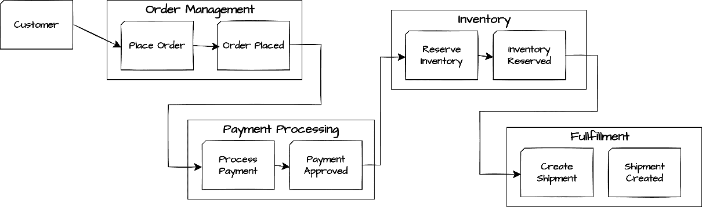
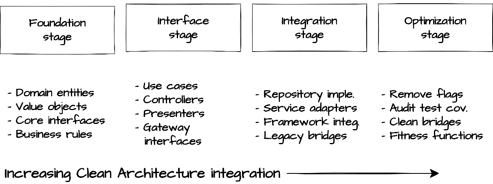
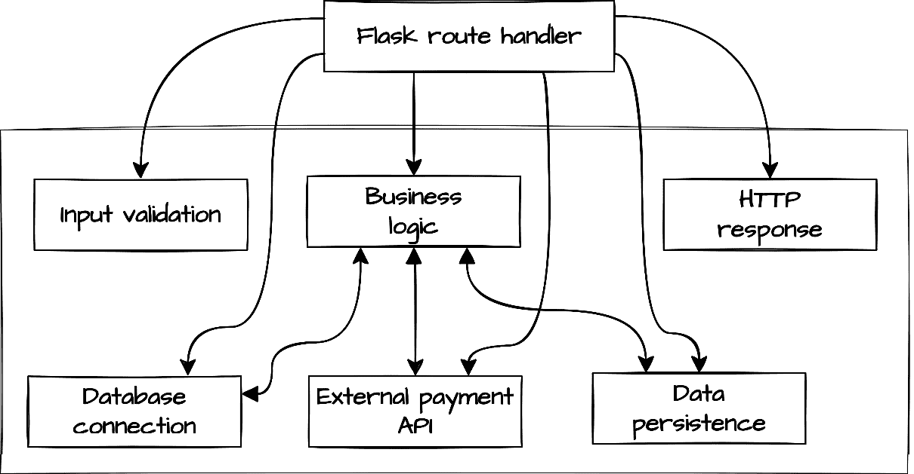
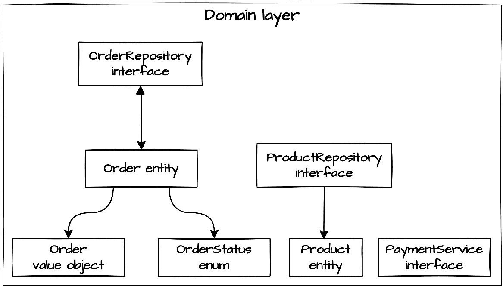
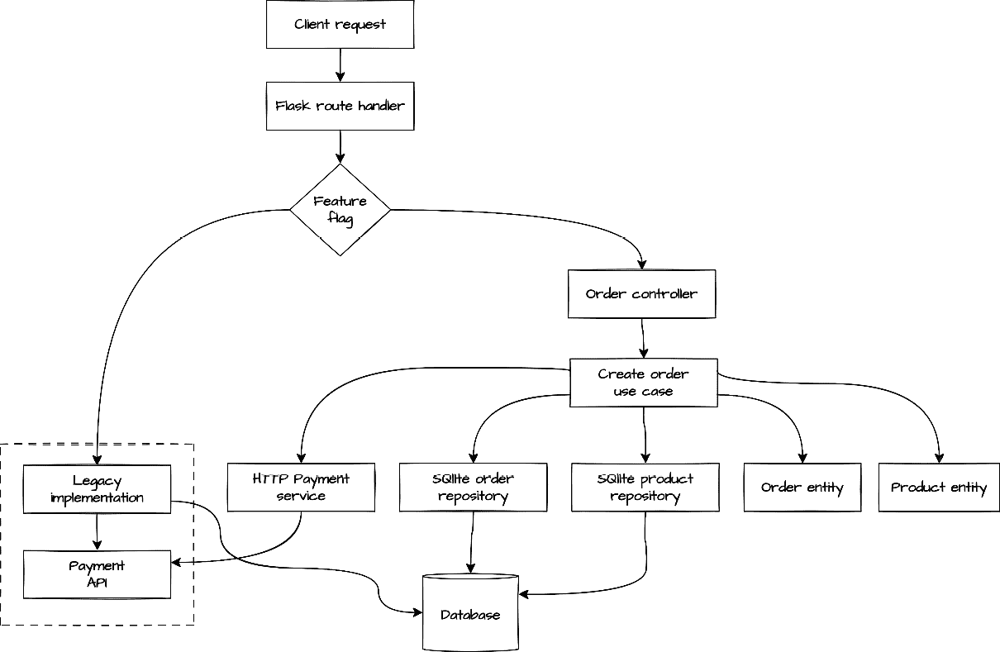

# 第十一章：从遗留系统到清洁：重构 Python 以提高可维护性

虽然前几章通过绿地开发演示了清洁架构原则，但现实世界中的系统往往面临不同的挑战。在时间压力下构建或在架构最佳实践建立之前构建的现有应用程序，通常违反清洁架构的基本原则。它们的领域逻辑与框架纠缠在一起，业务规则与基础设施关注点混合，依赖关系流向四面八方。然而，这些系统通常满足关键业务需求，不能简单地被替换。

通过我们对清洁架构转型的探索，我们将发现如何系统地演变遗留系统，同时保持其商业价值。我们将看到清洁架构的明确边界和依赖规则如何提供清晰的指导，以改善现有系统，即使在现实世界的约束下。您将学习如何识别架构违规，逐步建立清洁边界，并在转型过程中保持系统稳定性。

到本章结束时，您将了解如何通过分阶段实施将清洁架构原则应用于遗留系统。您将能够通过清洁架构的视角评估现有系统，并实施尊重业务约束的同时保持系统稳定性的有界转型。

在本章中，我们将涵盖以下主要主题：

+   评估和规划架构转型

+   渐进式清洁架构实现

# 技术要求

本章和本书其余部分提供的代码示例均使用 Python 3.13 进行测试。为了简洁，本章中的大多数代码示例仅部分实现。所有示例的完整版本可以在本书配套的 GitHub 仓库[`github.com/PacktPublishing/Clean-Architecture-with-Python`](https://github.com/PacktPublishing/Clean-Architecture-with-Python)中找到。

# 评估和规划架构转型

在复杂应用程序中提高可维护性和降低风险需要一种系统性的架构演变方法。具有纠缠依赖关系和模糊责任的应用程序消耗了不成比例的维护工作量。原本只需几天就能完成的特性添加扩展到几周；错误修复触发意外的、持续的故障；开发者入职变得痛苦缓慢。这些症状不仅反映了技术问题；它们还直接影响了业务，需要解决。

在前面的章节中，我们看到了清洁架构如何通过清晰的边界和显式的依赖关系自然地最小化维护负担。现在，我们可以应用相同的架构视角来评估现有系统，确定违规发生的地方以及如何系统地解决它们。这并不意味着一次性将理想的清洁架构强加于遗留系统，而是采取一种平衡的、渐进的方法，在尊重商业约束的同时，逐步改进系统。

通过将遗留代码通过清洁架构原则进行分析，我们可以揭示自然系统边界，等待建立，领域概念准备隔离，接口渴望出现。这种评估构成了我们转型策略的基础，指导关于改变什么、何时改变以及如何在整个过程中最小化风险的决策。随着每次增量改进，我们减少维护负担和与未来变化相关的稳定性，创造了超越技术改进的可衡量商业价值。

## 通过清洁架构视角进行评估

将现有系统转换为符合清洁架构原则的系统，首先需要评估其当前状态。这种评估并非关于记录每个细节，而是旨在识别关键架构违规并评估其商业影响。由于全面转型会引入不可接受的风险，我们需要一种平衡的方法，既提供足够的信息来指导利益相关者的讨论，又能够实现有意义的进展。这种谨慎的评估为在获得初始利益相关者支持后进行更深入的协作分析奠定了基础。

### 进行初步架构分析

在与利益相关者接触之前，我们需要进行一次有针对性的初步架构分析，重点是识别可以有效地传达给非技术受众的关键技术问题。这种初步评估并非详尽无遗，但提供了足够的洞察力，以业务相关的术语说明架构问题。

焦点的初步分析可能包括：

+   **架构清单**：识别主要组件及其交互，创建一个无需记录每个细节的基准理解。

+   **依赖映射**：绘制高级依赖流程图，揭示最成问题的循环依赖和违反清洁架构原则的框架耦合。

+   **框架渗透评估**：聚焦于框架代码显著渗透业务逻辑的例子，重点关注对维护或灵活性有可见影响的区域。

+   **领域逻辑分散**：识别一些清晰的例子，其中业务规则在代码库中分散，特别是那些影响功能频繁变化的部分。

例如，在分析一个 Python 电子商务系统时，我们可能会发现 Django 模型包含关键的业务规则，验证逻辑在多个视图中重复，支付处理代码直接引用了原生数据库查询。这种初步分析提供了非技术利益相关者可以理解的实例：*当我们需要更改定价方式时，我们目前必须修改三个不同模块中的七个不同地方的代码*。

这种分析作为一种沟通工具，被翻译成业务影响术语，如缩短上市时间、提高错误率以及降低应对变化需求的能力。在开始转型之前，用业务术语来界定架构问题，我们为利益相关者的支持以及适当的资源分配奠定了基础。

这种初步的架构评估是转型的起点，而不是详尽的蓝图。专注于识别足够的具体违规行为，以便通过有说服力的例子来吸引利益相关者，这些例子可以说明业务影响。在这一阶段，抵制绘制每个关系的诱惑。在随后的协作领域分析中，你的理解将大大加深。目标是收集足够的证据来支持转型的案例，同时为与利益相关者进行更深入的探索做好准备。

## 建立利益相关者的一致性

在完成初步的架构分析和确定关键问题后，下一步是将这些发现传达给利益相关者，并确保对转型获得初步的支持。这次初步接触不是为了获得对特定变更的最终批准，而是旨在建立对架构问题的共同认识，并建立对更协作的发现过程的支持。从我们的分析中获得的认识现在必须被翻译成与不同利益相关者群体产生共鸣的业务影响术语，为随后的更深入协作分析奠定基础。

第一步是涉及正确的利益相关者：

+   **工程团队**，他们理解技术细节和实施限制

+   **产品负责人**，他们能够阐述业务优先级并验证架构变更的价值

+   **运维人员**，他们管理系统部署和可靠性问题

+   **最终用户**，他们可以分享与系统稳定性和功能交付相关的痛点

利益相关者参与的范围应直接对应于计划转型的规模。较小的重构可能只需要与你的直接团队协调，而系统级的架构改造可能需要从 CTO 或工程副总裁那里获得参与。

一旦利益相关者就共享的转型愿景达成一致，下一步关键步骤是建立基线测量，这将跟踪进度并展示价值。这些指标创造了问责制，并在转型旅程的整个过程中提供了改进的明确证据：

+   **维护指标**：修复错误所花费的时间，功能交付的领先时间

+   **质量指标**：缺陷率，测试覆盖率，静态分析得分

+   **团队效率**：开发者入职时间，部署频率

+   **业务成果**：客户满意度，功能采用率

这些指标在整个转型过程中发挥着多重作用。最初，它们证明了努力的合理性并有助于获得领导层的支持。随着工作的推进，它们验证了有效性并突出了需要调整的领域。它们还帮助定义了转型中“完成”的含义，认识到目标是可持续的改进而不是架构的完美。最重要的是，指标将技术改进转化为业务价值语言，创建了一个反馈循环，使转型与技术和业务优先事项保持一致。

## 深入的领域分析

业务领域自然会随着时间的推移而演变，使架构转型成为重新调整系统以适应当前业务需求的一个理想机会。在获得初始利益相关者支持后，下一步是通过协作领域发现技术深化我们的理解。这一阶段将我们的技术洞察与业务领域知识联系起来，确定有意义的边界，并通过积极参与巩固利益相关者的支持。在我们初步分析侧重于技术问题时，协作发现将这些建议与不断发展的业务需求联系起来，确保转型后的系统不仅具有更好的架构，而且更好地满足当前需求。

几种协作方法可以帮助弥合技术理解与领域专业知识之间的差距：

+   **事件风暴研讨会**用于映射业务流程和领域事件 ([`www.eventstorming.com/`](https://www.eventstorming.com/))

+   **领域故事讲述会**，其中利益相关者讲述关键工作流程 ([`domainstorytelling.org/`](https://domainstorytelling.org/))

+   **上下文映射练习**用于识别系统边界和集成点 ([`contextmapper.org/`](https://contextmapper.org/))

在这些方法中，**事件风暴**在清洁架构转型中特别有价值。它通过促进研讨会将利益相关者聚集在一起，以验证领域理解和识别架构边界。参与者使用共享建模空间上的彩色便签，创建业务流程的可视化时间线。颜色编码有意映射到清洁架构层：橙色领域事件代表架构中心的实体，蓝色命令与应用层中的用例对齐，紫色业务规则反映了独立于外部关注点的领域规则。典型的领域事件包括*订单已放置*，而命令可能包括如*处理支付*等操作。这种视觉方法使架构边界对所有利益相关者都变得具体，有助于在改造遗留系统时识别自然分离点。虽然具体的颜色方案可能在团队之间有所不同，但保持一致的视觉语言最为重要。



图 11.1：电子商务系统的事件风暴可视化，展示了领域事件、命令、演员和潜在的边界上下文

这种协作方法直接基于*第四章*中的领域建模原则，将它们应用于发现现有系统中的边界。现在，实体、值对象和聚合的概念有助于识别遗留系统*应该*分离但未分离的内容。例如，一个事件风暴会议可能会揭示*订单处理*领域包含如*订单已放置*、*支付已批准*、*库存已预留*和*已创建发货*等独特事件。务必将业务关注点分离成独立的用例，而不是由一个庞大的订单控制器处理。

结果生成的视觉工件作为强大的沟通工具，帮助利益相关者看到架构边界如何转化为业务效益，如更快的交付或减少错误。这种共享语言通常揭示出仅通过技术分析无法发现的见解，例如订单和支付处理具有不同的变化模式，这表明了自然的分离点。通过利益相关者的协作确定了这些边界后，我们可以从发现转向行动，将见解转化为优先级路线图，以改进架构。

## 创建分阶段实施路线图

在确定了基于业务价值的架构边界并进行了优先级排序后，现在的重点转向战术执行规划。改造遗留系统不仅仅是知道要改变什么，而是将工作组织成可管理的、低风险的增量，在保持系统稳定性的同时逐步改进架构。

有效的转型规划需要将工作分解为具有明确交付成果的独立阶段。而不是用大量的重构工作压倒团队，分阶段实施创建自然检查点以验证进度、收集反馈并根据需要调整方向。



图 11.2：干净的架构转型阶段，展示了从基础到优化的进展

**基础阶段**建立核心领域概念和抽象，这些抽象是后续工作的基石。这通常从创建与现有实现并行的干净实体模型和定义仓库和服务接口开始。通过从这些核心元素开始，团队在最小化对运行系统初始更改的同时，确立了一个清晰的架构目标。

当基础形成时，**接口阶段**专注于实现适配器，以连接干净的核和外部关注点。这包括构建与现有数据库协同工作的仓库实现，创建第三方集成的服务适配器，以及开发在框架和领域之间进行转换的控制器。这些适配器在新兴的干净架构周围创建了一个保护层。

**集成阶段**逐步将现有功能迁移到新架构。团队用仓库实现替换直接数据库访问，用领域服务替换硬编码的业务规则，并通过适当的适配器将新组件与遗留系统集成。这一阶段通常按功能或领域逐步进行，允许进行可控的增量更改。

最后，**优化阶段**基于实际经验对架构进行精炼和增强。团队在仓库实现中解决性能考虑因素，扩展测试覆盖率，并改进错误处理和弹性模式。这一阶段认识到目标架构不是一蹴而就的，而是通过持续精炼实现的。

在整个分阶段方法中，之前建立的基线指标在验证进度和传达转型影响方面发挥着至关重要的作用。通过在每次转型阶段之前、期间和之后跟踪维护时间、缺陷率和功能交付速度等指标，团队可以展示可衡量的改进，并根据实际结果而不是假设调整他们的方法。这些指标还有助于团队确定何时达到可接受的架构改进水平，使组织能够在架构精炼和持续业务需求之间取得平衡。

## 执行转型工作的方法

架构转型的执行复杂性需要仔细的物流规划，而不仅仅是技术方面。团队必须决定如何将工作组织与持续的特性开发和维护相结合。以下几种方法值得考虑：

+   **专门的转型迭代**将特定的冲刺周期专门用于架构工作。这种方法为复杂的重构提供了专注的时间，但可能会延迟特性交付。它适用于需要重大更改但可以在一两个迭代内完成的组件。

+   **并行转型轨道**创建专注于架构改进的专门团队，同时其他团队继续特性开发。这种方法保持了交付速度，但需要仔细协调以防止冲突。它特别适用于将跨越多个季度的更大系统。

+   **基于机会的转型**将架构改进与相关领域的特性工作相结合。随着新特性触及某个组件，团队将其重构为 Clean Architecture。这种方法最小化了孤立重构的风险，但使进度依赖于特性优先级，可能会导致转型不均衡。

最成功的转型通常根据业务优先级和团队结构结合这些方法。关键组件可能需要专门的努力，而变化较少的区域可以通过基于机会的转型进行演变。关键是明确规划每个组件的转型方式，而不是假设一种一刀切的方法。

### 导航飞行中的转型过程

在转型期间，系统将暂时包含旧的和新的架构方法混合。对这些过渡状态的仔细规划对于保持系统稳定性至关重要。对于每个正在转型的组件，计划应解决：

+   **并行操作策略**：旧实现和新实现将如何共存

+   **验证方法**：确认功能等效性的方法

+   **切换标准**：切换到新实现的明确条件

+   **回滚程序**：出现问题时采取的安全机制

在这些过渡期间，全面的测试策略是必不可少的。回归测试套件验证新实现是否保持了现有功能，而接口兼容性测试确保转型后的组件能够正确地与更广泛系统集成。**特性标志**提供了一个有效的切换机制，允许团队为特定用户或场景选择性地启用新实现，同时保持出现问题时能够立即回滚的能力。

重要的是要认识到，虽然本节概述了转型规划的一般方法，但每个遗留系统都基于其规模、复杂性、技术堆栈和业务约束而具有独特的挑战。系统的工作规模将在不同系统之间有显著差异，团队应将这些指南适应到他们特定的环境中。对特定于你的技术堆栈或领域的技术的进一步研究将帮助你根据你的需求调整这种方法。关键是保持实用心态，将 Clean Architecture 原则作为指南而不是僵化的规定。

在一个全面转型计划中，既解决了技术变化也解决了其实施物流，团队有很好的位置开始实际转型工作。接下来的章节将探讨实施这些计划的具体技术，从建立核心领域边界开始，逐步重构到 Clean Architecture。

# 逐步 Clean Architecture 实施

在完成评估并建立转型策略后，我们现在转向实际实施。本节演示了如何通过精心分阶段改进，逐步将遗留系统转化为具有最大架构价值的系统。我们不会试图全面覆盖转型过程，因为这需要一本自己的书，我们将突出战略重构模式，这些模式在保持系统稳定性的同时，逐步建立 Clean Architecture 的边界。

以下示例，来自一个订单处理系统而非我们之前的任务管理应用，展示了如何以实用方式将 Clean Architecture 原则应用于遗留代码。每个实现阶段都建立在之前的基础上，逐渐从复杂的依赖关系转向清晰的关注点分离，从建立领域边界到创建连接新旧架构的接口。

## 初始系统分析

在这个假设场景中，你发现自己负责一个经过数年演变的订单处理子系统。最初是一个简单的 Flask 应用程序，用于管理客户订单，后来发展到包括支付处理和基本订单履行。虽然功能上完整，但代码库显示出显著的技术债务，包括复杂的依赖关系、模糊的责任和架构不一致，使得即使是简单的更改也变得风险和耗时。

团队面临反复出现的问题，这些问题突出了架构问题：对订单计算逻辑的简单更改需要在三个不同的文件中进行修改；添加新的支付方式需要三周而不是三天；每次部署都伴随着意外副作用的风险。最值得注意的是，新开发人员需要数月时间才能变得高效，在做出更改时，经常在看似无关的领域破坏功能。

在本章第一部分描述的初步架构分析和领域发现阶段的基础上，我们已确定在转型过程中需要解决的关键架构问题。让我们首先通过 Clean Architecture 的视角来审视系统的当前状态，识别需要加强的具体违规和架构边界。

让我们检查一个处理订单创建的文件，这是系统功能的核心部分，也是我们转型努力的理想候选：

```py
# order_system/app.py
from flask import Flask, request, jsonify
import sqlite3
import requests
app = Flask(__name__)
def get_db_connection():
    conn = sqlite3.connect('orders.db')
    conn.row_factory = sqlite3.Row
    return conn
@app.route('/orders', methods=['POST'])
def create_order():
    data = request.get_json()
    # Input validation mixed with business logic
    if not data or not 'customer_id' in data or not 'items' in data:
        return jsonify({'error': 'Missing required fields'}), 400

    # Direct database access in route handler
    conn = get_db_connection() 
```

该文件的开头已经揭示了几个架构问题。路由处理程序直接导入 SQLite 并请求，建立了对这些特定实现的硬依赖。`get_db_connection`函数直接连接到特定数据库，没有抽象层。这些结构选择违反了 Clean Architecture 的依赖规则，允许外层关注点（Web 框架、数据库）渗透到业务逻辑。

继续向下查看`create_order`函数，让我们看看路由处理程序是如何处理订单的：

```py
# def create_order(): <continued>
    # Business logic mixed with data access
    total_price = 0
    for item in data['items']:
        # Inventory check via direct database query
        product = conn.execute('SELECT * FROM products WHERE id = ?',
                              (item['product_id'],)).fetchone()
        if not product or product['stock'] < item['quantity']:
            conn.close()
            return jsonify({
                'error': f'Product {item["product_id"]} out of stock'
            }), 400

        # Price calculation mixed with HTTP response preparation
        price = product['price'] * item['quantity']
        total_price += price

    # External payment service call directly in route handler
    payment_result = requests.post(
        'https://payment-gateway.example.com/process',
        json={
            'customer_id': data['customer_id'],
            'amount': total_price,
            'currency': 'USD'
        }
    ) 
```

这一部分演示了几个 Clean Architecture 的违规。核心业务逻辑，如库存检查和价格计算，直接与数据库访问混合。支付处理逻辑直接对外部服务进行 HTTP 调用，创建了一个难以测试或更改的硬依赖。这些实现细节应该隐藏在接口后面，符合 Clean Architecture 原则，而不是直接暴露在业务逻辑中。

最后，在`create_order`函数中结束，我们完成了订单处理：

```py
# def create_order(): <continued>
    if payment_result.status_code != 200:
        conn.close()
        return jsonify({'error': 'Payment failed'}), 400
    # Order creation directly in route handler
    order_id = conn.execute(
        'INSERT INTO orders (customer_id, total_price, status) '
        'VALUES (?, ?, ?)',
        (
            data['customer_id'],
            total_price, 'PAID'
        )
    ).lastrowid

    # Order items creation and inventory update
    for item in data['items']:
        conn.execute(
            'INSERT INTO order_items (order_id, product_id, '
            'quantity, price) VALUES (?, ?, ?, ?)',
            (order_id, item['product_id'], item['quantity'], price)
        )
        conn.execute( # Update inventory
            'UPDATE products SET stock = stock - ? WHERE id = ?',
            (item['quantity'], item['product_id'])
        )
    conn.commit()
    conn.close()
    return jsonify({'order_id': order_id, 'status': 'success'}), 201 
```

代码分析揭示了整个处理程序中的基本架构问题。直接 SQL 语句与业务逻辑、HTTP 响应和外部服务调用交织在一起，所有这些都挤在一个单一函数中，没有关注点的分离。这种结构违反了我们*第二章*中讨论的单一职责原则，使得更改极具风险，因为一个区域的修改经常会影响看似无关的功能。

系统缺乏我们在*第四章*中建立的丰富领域模型，因为订单和产品仅作为数据库记录和字典存在，而不是具有封装行为和业务规则的正确实体。



图 11.3：当前订单处理程序中的纠缠责任

*图 11.3*展示了单个 Flask 路由处理程序如何包含多个应该根据 Clean Architecture 原则分离的责任。业务逻辑直接连接到基础设施关注点，如数据库连接和外部 API，违反了我们*第一章*中探讨的依赖规则。

根据我们的分析，我们已确定在转型中需要解决的关键架构问题：

+   **边界违规**：路由处理程序跨越多个架构边界，混合了 Web、业务逻辑和基础设施关注点

+   **缺少领域模型**：我们需要建立适当的领域实体，如订单和产品，作为我们系统的核心

+   **依赖反转需求**：应使用来自*第二章*的原则替换直接的基础设施依赖

+   **接口分离要求**：在架构层之间保持清晰的接口将有助于维护适当的边界

在我们的订单创建过程中存在关键架构问题；我们可以看到一个在没有架构指导的情况下演化的系统。业务逻辑、数据访问和外部服务紧密耦合，没有明确的关注点边界。系统可以工作，但其结构使得维护、扩展或测试变得越来越困难。

通过对当前系统的理解，我们现在准备开始我们的转型之旅。我们将在下一节中建立一个干净的领域模型，在逐步重构向 Clean Architecture 过渡的过程中创建适当的层间边界。

## 阶段 1：建立领域边界

在分析了我们的遗留系统之后，我们开始通过建立一个干净的领域模型来启动我们的转型，这个模型将作为我们的架构基础。从领域层开始提供了一个稳定的内核，我们可以围绕它逐步重建系统的外部层。

在我们的订单处理系统中，我们需要从数据库查询和控制器逻辑中提取隐藏的领域概念。我们系统中最重要的实体似乎如下：

+   **订单**：中心业务实体

+   **客户**：下订单的买家

+   **产品**：被购买的项目

+   **订单项**：订单和产品之间的关联

让我们从实现`Order`实体及其相关的值对象开始：

```py
# order_system/domain/entities/order.py
class OrderStatus(Enum):
    CREATED = "CREATED"
    PAID = "PAID"
    FULFILLING = "FULFILLING"
    SHIPPED = "SHIPPED"
    DELIVERED = "DELIVERED"
    CANCELED = "CANCELED"
@dataclass
class OrderItem:
    product_id: UUID
    quantity: int
    price: float

    @property
    def total_price(self) -> float:
        return self.price * self.quantity 
```

在这里，我们定义了一个`OrderStatus`枚举来替换之前在代码中使用的字符串常量。我们还创建了一个`OrderItem`值对象来表示订单和产品之间的关系。这种方法与我们探索的值对象模式一致，创建了代表重要领域概念的不可变对象。

现在让我们来实现`Order`实体本身：

```py
@dataclass
class Order:
    customer_id: UUID
    items: List[OrderItem] = field(default_factory=list)
    id: UUID = field(default_factory=uuid4)
    status: OrderStatus = OrderStatus.CREATED
    created_at: datetime = field(default_factory=lambda: datetime.now())
    updated_at: Optional[datetime] = None

    @property
    def total_price(self) -> float:
        return sum(item.total_price for item in self.items)

    def add_item(self, item: OrderItem) -> None:
        self.items.append(item)
        self.updated_at = datetime.now()

    def mark_as_paid(self) -> None:
        if self.status != OrderStatus.CREATED:
            raise ValueError(
                f"Cannot mark as paid: order is {self.status.value}"
            )
        self.status = OrderStatus.PAID
        self.updated_at = datetime.now() 
```

我们的`Order`实体现在正确地封装了之前在代码库中分散的核心业务概念。我们实现了强制执行业务规则的方法，例如在标记订单为已支付时验证状态转换。这些验证之前被埋藏在控制器逻辑中，但现在位于实体本身的适当位置。

我们需要创建剩余的领域实体以完成我们的核心模型：

```py
# order_system/domain/entities/product.py
@dataclass
class Product:
    name: str
    price: float
    stock: int
    id: UUID = field(default_factory=uuid4)

    def decrease_stock(self, quantity: int) -> None:
        if quantity <= 0:
            raise ValueError("Quantity must be positive")
        if quantity > self.stock:
            raise ValueError(
                f"Insufficient stock: requested {quantity}, "
                f"available {self.stock}")
        self.stock -= quantity 
```

`Product` 实体现在封装了之前分散在控制器方法中的库存管理逻辑。它强制执行诸如防止库存为负或过度提取等业务规则。这是*告诉，不要询问*原则的一个例子，有助于维护领域完整性。

在定义了我们的核心领域实体之后，我们需要为支持服务和存储库创建抽象。遵循依赖倒置原则，我们将定义领域需要的接口，而不与特定实现耦合：

```py
# order_system/domain/repositories/order_repository.py
from order_system.domain.entities.order import Order
class OrderRepository(ABC):
    @abstractmethod
    def save(self, order: Order) -> None:
        """Save an order to the repository"""
        pass

    @abstractmethod
    def get_by_id(self, order_id: UUID) -> Optional[Order]:
        """Retrieve an order by its ID"""
        pass

    @abstractmethod
    def get_by_customer(self, customer_id: UUID) -> List[Order]:
        """Retrieve all orders for a customer"""
        pass 
```

这个抽象的`OrderRepository`定义了我们的领域层需要的操作，而不指定它们是如何实现的。我们将为`ProductRepository`和其他必要的存储库创建类似的接口。这些抽象是 Clean Architecture 的关键元素，因为它们允许我们的领域层保持对特定持久机制的不依赖。

如果你还记得前几章中的任务管理系统，我们建立了类似的存储库接口，如*第五章*中的`TaskRepository`。两者遵循相同的模式：定义领域组件需要的抽象方法，而不指定实现细节。这种一致性展示了 Clean Architecture 的原则如何应用于不同的领域和应用，创建了一个维护适当边界的可靠模式。

接下来，让我们定义外部操作如支付和通知的服务接口：

```py
# order_system/domain/services/payment_service.py
from order_system.domain.entities.order import Order
@dataclass
class PaymentResult:
    success: bool
    error_message: Optional[str] = None
class PaymentService(ABC):
    @abstractmethod
    def process_payment(self, order: Order) -> PaymentResult:
        """Process payment for an order"""
        pass 
```

在定义了这些核心领域组件之后，我们为我们的系统创建了一个干净的基础。之前分散在控制器和实用函数中的业务规则和概念现在有了结构良好的领域模型中的适当归宿。这种转型提供了几个直接的好处：

+   **业务规则集中化**：如*不能将非 CREATED 订单标记为 PAID*之类的规则现在在领域模型中明确定义

+   **提高可测试性**：领域实体和服务可以在不要求数据库连接或 Web 框架的情况下独立测试

+   **更清晰的边界**：核心业务概念和基础设施关注之间的分离现在是明确的

+   **更丰富的领域模型**：我们已经从贫血数据库记录转变为具有行为的丰富领域模型

让我们花点时间来回顾这个新的领域层：



图 11.4：新建立的具有清晰边界的领域模型

此图说明了我们的第一个主要转型步骤：建立一个具有清晰边界的适当领域层。我们创建了实体、值对象和服务接口，它们封装了我们的核心业务概念和规则。与*图 11.2*相比，我们可以看到在解开之前在我们遗留控制器实现中混合的责任方面取得了重大进展。

### 增量集成策略

在现实世界的转型中，一个常见的陷阱是在集成之前孤立地尝试实现整个 Clean Architecture。这种“大爆炸”发布方法引入了重大风险，因为到集成发生时，生产系统可能已经发生了重大变化，创造了复杂的合并冲突和意外的行为变化。

为了减轻这种风险，可以采用几种增量集成策略：

+   **适配器模式**：创建适配器，将旧组件和新领域实体连接起来，允许它们在运行系统中共存。这使渐进式采用成为可能，而不会破坏现有功能。

+   **并行实现**：使用 Clean Architecture 在旧代码旁边实现新功能，使用功能标志控制哪个实现处理请求。如果出现问题，这提供了一个简单的回滚机制。

+   **Strangler Fig 模式**：在保持相同外部接口的同时，逐步替换旧应用程序的部分，逐渐取代旧实现，直到它可以安全地被移除([`martinfowler.com/bliki/StranglerFigApplication.html`](https://martinfowler.com/bliki/StranglerFigApplication.html))。

+   **影子模式**：通过使用代理来复制所有请求，在运行代码旁边运行新的实现。这给新实现提供了处理其请求副本的机会，我们比较输出与旧系统。这验证了行为而不影响用户。

在整个增量转型过程中，全面的**回归测试**绝对至关重要。在做出任何架构更改之前，建立一个彻底的测试套件，以捕获现有系统行为。这些测试具有多重目的：

+   他们验证重构没有破坏现有功能

+   他们记录当前系统行为以供参考

+   他们向利益相关者提供信心，表明转型正在安全进行

正如我们在*第八章*中讨论的那样，测试在架构转型期间提供了关键的安全网。对于我们的订单处理系统，我们将在开始转型之前建立**端到端测试**，以验证完整的订单流程，然后随着我们建立干净的架构边界，补充更多更细粒度的测试。

通过采用这些增量策略并优先考虑回归测试，我们可以在保持稳定性和继续交付业务价值的同时转型我们的系统。在下一节中，我们将开始实施上述的生产集成方法，通过实现接口适配器层来构建我们的领域模型。

## 第二阶段：接口层实现

在建立了领域实体和接口之后，我们现在面临一个关键的过渡挑战：将这个清洁基础与我们的现有代码库集成。与绿色场开发不同，转型需要我们逐步演进我们的系统，同时保持持续运行。**接口层**为我们提供了第一个连接新旧架构的机会。

### 确定转型边界

我们转型的第一步是确定可行的接缝，在这些接缝中我们可以引入清洁接口而不过度破坏现有系统。回顾我们的遗留控制器，订单创建过程作为一个自然的边界脱颖而出：

```py
# order_system/app.py
@app.route('/orders', methods=['POST'])
def create_order():
    data = request.get_json()

    # Input validation mixed with business logic
    if not data or not 'customer_id' in data or not 'items' in data:
        return jsonify({'error': 'Missing required fields'}), 400

    # Direct database access in route handler
    conn = get_db_connection()

    # Business logic implementation
    # ... existing implementation ...

    return jsonify({'order_id': order_id, 'status': 'success'}), 201 
```

这个控制器方法代表了一个自包含的工作流程，具有清晰的输入和输出，使其成为我们初始转型的理想候选。在修改此代码之前，我们需要建立全面的测试覆盖率，以捕捉其当前的行为。这些测试将在重构期间作为我们的安全网，确保我们在改进架构的同时保持功能：

```py
# test_order_creation.py
def test_create_order_success():
    # Setup test data and expected results
    response = client.post('/orders', json={
        'customer_id': '12345',
        'items': [{'product_id': '789', 'quantity': 2}]
    })

    # Verify status code and response structure
    assert response.status_code == 201
    assert 'order_id' in response.json

    # Verify database state - order was created with correct values
    conn = get_db_connection()
    order = conn.execute('SELECT * FROM orders WHERE id = ?',
                        (response.json['order_id'],)).fetchone()
    assert order['status'] == 'PAID'
# Additional order creation test scenarios ... 
```

在测试到位后，我们可以开始实施接口层组件，这些组件将连接我们的清洁领域模型和现有基础设施。

### 实施仓库适配器

我们的第一步是创建满足我们的清洁领域接口同时与现有数据库模式交互的**仓库适配器**。这个关键组件连接了我们的领域实体和遗留基础设施。

```py
# order_system/infrastructure/repositories/sqlite_order_repository.py
class SQLiteOrderRepository(OrderRepository):
    # ... truncated implementation

    def save(self, order: Order) -> None:
        conn = sqlite3.connect(self.db_path)
        try:
            cursor = conn.cursor()
            # Check if order exists and perform insert or update
            if self._order_exists(conn, order.id):
                # ... SQL update operation ...
            else:
                # ... SQL insert operation ...

                # ... SQL operations for order items ...
            conn.commit()
        except Exception as e:
            conn.rollback()
            raise RepositoryError(f"Failed to save order: {str(e)}")
        finally:
            conn.close() 
```

这个仓库适配器在我们的转型策略中扮演着至关重要的角色。您可能还记得，在*第六章*中，我们为我们的任务管理系统引入了类似的仓库实现。与这些示例类似，这个适配器实现了我们的清洁`OrderRepository`接口（来自*阶段 1*），同时处理我们现有数据库模式的细节。适配器在领域实体和数据库记录之间进行转换，管理我们丰富的领域模型和平坦的关系结构之间的阻抗不匹配。

我们还将实现一个类似的`SQLiteProductRepository`，它遵循相同的模式，实现清洁领域接口同时与现有数据库模式交互。这些仓库实现处理所有数据库访问细节、连接管理和错误处理，为我们的其余架构提供干净的接口。

此外，我们还将实现支付处理等外部服务的适配器。这些服务适配器将遵循相同的模式，实现我们的清洁领域接口，同时封装外部服务交互的细节。为了简洁，我们在此不展示这些实现，但完整的代码可在本书的 GitHub 仓库中找到。

在这些基础设施适配器到位后，我们现在在我们的干净领域模型和遗留基础设施之间有一个桥梁。这使得我们能够实现与适当领域实体一起工作的用例，同时通过接口而不是直接与具体实现交互，无缝地与现有的数据库和外部服务进行交互。

### 构建干净的用例

现在我们有了连接到我们现有基础设施的存储库和服务适配器，我们可以实现编排我们业务逻辑的用例。在*第五章*中，我们确立用例作为特定于应用的业务规则，协调领域实体以满足特定的用户需求。遵循这个模式，让我们看看将取代我们混乱的遗留实现的订单创建用例：

```py
# order_system/application/use_cases/create_order.py
@dataclass
class CreateOrderRequest:
    customer_id: UUID
    items: List[Dict[str, Any]]
@dataclass
class CreateOrderUseCase:
    order_repository: OrderRepository
    product_repository: ProductRepository
    payment_service: PaymentService

    def execute(self, request: CreateOrderRequest) -> Order:
        # Create order entity with basic information
        order = Order(customer_id=request.customer_id)

        # Add items to order, checking inventory
        for item_data in request.items:
            product_id = UUID(item_data['product_id'])
            quantity = item_data['quantity']

            # ... inventory validation logic ...

            # Update inventory
            product.decrease_stock(quantity)
            self.product_repository.update(product) 
```

我们用例中的`execute`方法首先创建一个`Order`实体，并向其中添加项目，在此过程中检查库存的可用性。注意它如何与适当的领域实体而不是原始数据库记录一起工作。

现在我们来检查`execute`方法的剩余部分：

```py
# order_system/application/use_cases/create_order.py
    # def execute <continued>

        # Process payment
        payment_result = self.payment_service.process_payment(order)
        if not payment_result.success:
            raise ValueError(
                f"Payment failed: {payment_result.error_message}"
            )
        # Mark order as paid and save
        order.mark_as_paid()
        self.order_repository.save(order)

        return order 
```

`execute`方法的下半部分通过处理支付处理、更新订单状态和保存完成的订单来继续订单创建过程。

这个用例展示了清洁架构在分离关注点方面的实际应用。它通过以下方式编排订单创建过程：

1.  创建一个包含基本信息的`Order`实体

1.  向订单中添加项目，检查库存

1.  处理支付

1.  更新订单状态并保存

每一步都通过定义良好的接口与领域模型进行交互，而不了解底层基础设施。用例依赖于抽象的`OrderRepository`、`ProductRepository`和`PaymentService`接口，而不是具体实现。

注意现在业务规则在这个用例中是如何明确和集中的。库存检查、支付处理和订单状态管理都通过一个干净、有序的过程进行，而不是分散在控制器方法和实用函数中。这种清晰性使得代码更易于维护和适应变化的需求。

### 实现干净的控制器

在我们的存储库和用例到位后，我们现在实现**控制器**，这些控制器连接我们的 Web 框架和应用核心。正如我们在*第六章*中确立的，控制器在架构的边界处充当翻译层，将外部请求格式转换为用例可以处理的输入。这些控制器保持了应用核心和交付机制之间的分离，确保 Web 特定的关注点不会渗透到我们的清洁架构中：

```py
# order_system/interfaces/controllers/order_controller.py
@dataclass
class OrderController:
    create_use_case: CreateOrderUseCase

    def handle_create_order(
        self, request_data: Dict[str, Any]
    ) -> Dict[str, Any]:
        try:
            # Transform web request to domain request format
            customer_id = UUID(request_data['customer_id'])
            items = request_data['items']

            request = CreateOrderRequest(
                customer_id=customer_id,
                items=items
            )

            # Execute use case
            order = self.create_use_case.execute(request)

            # Transform domain response to web response format
            return {
                'order_id': str(order.id),
                'status': order.status.value
            }
        except ValueError as e:
            # ... exception logic 
```

这个控制器展示了清洁架构边界在工作中的情况，作为外部请求和我们的领域操作之间的转换层。这个控制器的核心是一行代码`order = self.create_use_case.execute(request)`，它代表了我们的接口层和应用核心之间的关键边界。注意控制器没有引用 Flask、HTTP 状态码或 JSON 格式化。这些特定于 Web 的关注点在框架边界处处理，保持我们的应用逻辑和交付机制之间的清晰分离。这种框架独立性使得我们的控制器能够专注于其核心责任，将外部请求转换为领域操作，并将结果转换回适合调用者的格式。

## 第 3 阶段：集成策略：连接遗留和清洁实现

现在是关键步骤：将我们的清洁实现与现有系统集成。而不是立即替换整个遗留路由处理程序，我们将修改它，使用适配器模式委托给我们的清洁控制器：

```py
# Modified route in order_system/app.py
@app.route('/orders', methods=['POST'])
def create_order():
    data = request.get_json()

    # Basic input validation remains in the route handler
    if not data or not 'customer_id' in data or not 'items' in data:
        return jsonify({'error': 'Missing required fields'}), 400

    try:
        # Feature flag to control which implementation handles the request
        if app.config.get('USE_CLEAN_ARCHITECTURE', False):
            # Use the clean implementation
            result = order_controller.handle_create_order(data)
            return jsonify(result), 201
        else:
            # ... original implementation remains here ...
    except ValidationError as e:
        return jsonify({'error': str(e)}), 400
    except SystemError:
        return jsonify({'error': 'Internal server error'}), 500 
```

这次修改的关键部分是功能标志条件。当`USE_CLEAN_ARCHITECTURE`被启用时，我们将订单处理委托给我们的新控制器，然后调用清洁用例。这创建了一个受控的路径进入我们的清洁架构实现，而不会干扰现有的代码路径。功能标志为我们提供了一个简单的机制，可以在实现之间切换，无论是全局的还是针对特定请求的。

这个修改后的路由处理程序展示了几个关键转型模式：

+   **功能标志控制**：我们使用配置设置来确定哪个实现过程处理请求，这使我们能够逐步过渡流量。

+   **一致的接口**：两种实现产生相同的响应格式，确保从用户的角度看无缝过渡。

+   **渐进式迁移**：遗留代码保持完全功能，作为清洁实现出现问题时的一种回退。

+   **异常转换**：我们在框架边界将领域特定异常映射到适当的 HTTP 响应。

当与特定框架（如 Flask）集成时，我们必须在系统边界处关注框架特定的细节。在 Flask 的情况下，我们需要配置我们的依赖注入容器，注册我们的清洁架构组件，并建立功能标志机制。我们创建一个中央配置点，实例化所有必要的组件（存储库、服务、用例和控制器），并根据清洁架构的依赖规则将它们连接起来。这个配置发生在应用程序启动时，将所有特定于框架的初始化代码保持在系统的边缘，这是它应该所在的位置。我们在我们的任务管理应用程序中看到了这一点在*第七章*中的实际应用。

### 渐进式转型方法

在这个转型过程中，全面的测试绝对是必不可少的。我们利用我们的回归测试套件来确保重构没有破坏现有的功能。这些测试验证了遗留实现和我们的新 Clean Architecture 组件，提供了信心，即转型保持了功能一致性。

在进行下一步之前，我们会对转型的每一步进行仔细验证。我们不会继续前进，直到我们已经验证我们的更改保持了系统行为和稳定性。这种增量方法最小化了风险，并允许我们在转型过程中持续交付价值。

在高层次上，我们的方法与 Strangler Fig 模式([`martinfowler.com/bliki/StranglerFigApplication.html`](https://martinfowler.com/bliki/StranglerFigApplication.html))相一致，其中我们逐步替换遗留应用程序的部分，同时保持相同的外部接口。这种方法通过允许增量验证并在需要时回滚来最小化风险。



图 11.5：当前系统架构，显示并行实现

*图 11.5*展示了我们当前的架构状态，系统中同时存在遗留和干净实现。遗留组件代表直接将业务逻辑与基础设施关注点混合在一起的混乱、无结构的代码。相比之下，Clean Architecture 实现显示了适当的关注点分离，具有不同的层和定义良好的接口。

通过这种增量实施方法，我们在转型之旅中取得了重大进展：

1.  我们建立了一个干净的领域模型，具有适当的实体和值对象

1.  我们实现了仓库适配器，它们连接我们的领域模型和现有的数据库

1.  我们创建了使用我们的领域模型编排业务逻辑的用例

1.  我们构建了控制器，它们可以在网络请求和我们的领域语言之间进行转换

1.  我们使用适配器模式将我们的干净实现与遗留代码集成

通过这种增量实施方法，我们展示了如何使用 Clean Architecture 原则将遗留系统进行转型，同时在整个过程中保持系统稳定性和功能。

## 第 4 阶段：优化阶段

虽然我们的示例主要关注基础、接口和集成阶段，但完整的转型最终将包括一个优化阶段。这个最终阶段通常涉及性能调整、扩展测试覆盖范围以及基于实际使用情况改进的错误处理模式。

而不是提供这个阶段的详细示例，我们将指出，优化应以相同的增量心态来对待。团队应优先考虑能带来最大商业价值的优化，随着干净实现的稳定证明，逐步移除特性标志，并最终完全退役遗留代码路径。

优化阶段承认，架构转型不是一个一次性努力，而是一个持续精炼的过程，它平衡了技术卓越与业务优先级。团队应定义明确的指标，以确定何时已达到“足够好”，避免陷入无尽完美主义的陷阱。

# 摘要

在本章中，我们探讨了如何通过系统性的转型将 Clean Architecture 原则应用于遗留系统。我们首先通过 Clean Architecture 的视角评估现有系统，识别架构违规，并创建了一个分阶段的转型方法。

我们通过将技术债务转化为业务影响术语，并通过协作技术如事件风暴来收集更深入的领域理解，建立了一个构建利益相关者一致性的框架。这种协作方法直接指导了我们的分阶段实施计划，将我们的架构决策建立在业务优先级的基础上。

通过我们的订单处理示例，我们展示了一种渐进式实施方法，在建立清晰的架构边界的同时保持系统稳定性。我们首先从领域层开始，创建了适当的实体和价值对象，它们封装了代码库中之前分散的业务规则。然后我们实现了仓库接口，保护我们的领域免受基础设施细节的影响，接着是使用案例，它们协调业务操作。

接口适配层在我们干净的实现和遗留代码之间架起了一座桥梁，通过特性标志和适配器模式实现增量采用。这种分阶段的方法允许我们在最小化风险的同时验证我们的转型，展示了如何将 Clean Architecture 实际应用于现实世界系统。

通过遵循这些转型模式，您可以系统地提高现有系统的架构质量，降低维护成本，提高适应性，同时继续提供商业价值。这种方法体现了 Clean Architecture 的核心原则，同时认识到不断发展的生产系统的实际限制。

# 进一步阅读

+   *《与遗留代码有效协作》*（[`www.oreilly.com/library/view/working-effectively-with/0131177052/`](https://www.oreilly.com/library/view/working-effectively-with/0131177052/))，作者：迈克尔·费思。提供了与现有代码库协作的技术，包括安全引入测试和进行增量改进的策略。

+   *事件风暴法* ([`www.eventstorming.com`](https://www.eventstorming.com)). 一个学习更多关于事件风暴会议并规划会议的绝佳资源。
