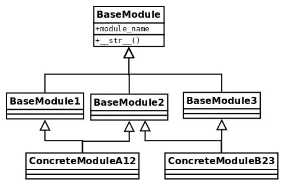

# 第三章：良好代码的一般特征

这是一本关于 Python 软件构建的书。优秀的软件建立在良好的设计基础上。说到干净的代码之类的话，人们可能会认为我们将探讨只与软件的实现细节相关的良好实践，而不是其设计。然而，这种假设是错误的，因为代码并不是与设计不同的东西——代码就是设计。

代码可能是设计最详细的表现。在前两章中，我们讨论了为什么以一致的方式构建代码很重要，并且我们已经看到了编写更紧凑和成语化代码的习惯用法。现在是时候理解干净的代码就是这样，而且更多——最终目标是尽可能使代码健壮，并以最小化缺陷的方式编写代码，或者使它们完全显而易见，如果它们发生了。

本章和下一章侧重于更高层次的抽象设计原则。这些想法不仅与特定的 Python 相关，而且是软件工程的一般原则。

特别是对于本章，我们将回顾构建良好软件设计的不同原则。高质量的软件应该围绕这些想法构建，并且它们将作为设计工具。这并不意味着所有这些原则都应该始终应用；事实上，其中一些代表不同的观点（这就是**按合同设计**（**DbC**）方法与防御性编程相对立的情况）。其中一些取决于上下文，不一定适用于所有情况。

高质量的代码是一个具有多个维度的概念。我们可以将其类比为我们思考软件架构的质量属性。例如，我们希望我们的软件安全并且具有良好的性能、可靠性和可维护性，仅举几例。

本章的目标如下：

+   理解健壮软件背后的概念

+   学习如何在应用程序的工作流程中处理错误数据

+   设计可维护的软件，可以轻松扩展和适应新的需求

+   设计可重用的软件

+   编写有效的代码，保持开发团队的生产力高

# 按合同设计

我们正在处理的软件的某些部分并不是直接由用户调用的，而是由代码的其他部分调用的。当我们将应用程序的责任划分为不同的组件或层时，我们必须考虑它们之间的交互。

我们将不得不将一些功能封装在每个组件后面，并向将使用该功能的客户端公开一个接口，即**应用程序编程接口**（**API**）。我们为该组件编写的函数、类或方法在特定考虑下有一种特定的工作方式，如果不满足这些条件，我们的代码将崩溃。相反，调用该代码的客户端期望特定的响应，我们的函数未能提供这一点将代表一个缺陷。

也就是说，例如，如果我们有一个函数，预期与一系列整数类型的参数一起工作，并且另一个函数调用我们传递字符串，很明显它不应该按预期工作，但实际上，函数根本不应该运行，因为它被错误调用了（客户端犯了一个错误）。这个错误不应该悄无声息地通过。

当设计 API 时，预期的输入、输出和副作用应该有文档记录。但文档无法强制软件在运行时的行为。这些规则，代码的每个部分期望为了正常工作而满足的条件，以及调用者对它们的期望，应该成为设计的一部分，这就是**合同**的概念所在。

DbC 背后的想法是，与其在代码中隐含地放置每个参与方的期望，不如让双方就一个合同达成一致，如果违反了合同，就会引发异常，清楚地说明为什么不能继续。

在我们的上下文中，合同是一种强制执行软件组件通信过程中必须遵守的规则的构造。合同主要包括前置条件和后置条件，但在某些情况下，还描述了不变量和副作用：

+   **前置条件**：我们可以说这些是代码在运行之前进行的所有检查。它将检查函数可以继续进行之前必须满足的所有条件。一般来说，它是通过验证传递的参数中提供的数据集来实现的，但如果我们认为它们的副作用被这样的验证的重要性所掩盖，那么没有什么可以阻止我们运行各种验证（例如，验证数据库中的一个集合，一个文件，之前调用的另一个方法等）。请注意，这对调用者施加了约束。

+   **后置条件**：与前置条件相反，在函数调用返回后进行验证。后置条件验证用于验证调用者对该组件的期望。

+   **不变量**：可选地，在函数的文档字符串中记录不变量是一个好主意，这些不变量在函数运行时保持不变，作为函数逻辑正确性的表达。

+   **副作用**：可选地，我们可以在文档字符串中提及代码的任何副作用。

尽管在概念上，所有这些项目都构成了软件组件的合同的一部分，这也是应该放入这样一块文档的内容，但只有前两个（前置条件和后置条件）需要在低级别（代码）上执行。

我们之所以要通过合同设计，是因为如果出现错误，它们必须很容易被发现（通过注意是前置条件还是后置条件失败，我们将更容易地找到罪魁祸首），以便可以快速纠正。更重要的是，我们希望代码的关键部分避免在错误的假设下执行。这应该有助于清楚地标记责任的界限和错误的发生，而不是说——应用程序的这一部分出现了问题...但是调用者提供了错误的参数，那么我们应该在哪里应用修复？

这个想法是，前置条件约束了客户端（如果他们想要运行代码的某个部分，他们就有义务满足这些条件），而后置条件约束了相关组件对客户端可以验证和执行的某些保证。

通过这种方式，我们可以快速确定责任。如果前置条件失败，我们知道这是客户端的缺陷。另一方面，如果后置条件检查失败，我们知道问题出现在例程或类（供应商）本身。

特别是关于前置条件，重要的是要强调它们可以在运行时进行检查，如果发生，被调用的代码就不应该运行（因为它的条件不成立，而且这样做可能会使情况变得更糟）。

# 前置条件

前置条件是函数或方法期望接收的所有保证，以便正确工作。在一般的编程术语中，这通常意味着提供正确形式的数据，例如初始化的对象，非空值等。对于 Python 来说，特别是由于其动态类型，这也意味着有时我们需要检查所提供的数据的确切类型。这与类型检查并不完全相同，`mypy`会执行此操作，而是验证所需的确切值。

通过使用静态分析工具，例如`mypy`，可以尽早地检测到这些检查中的一部分，但这些检查还不够。函数应该对其要处理的信息进行适当的验证。

现在，这就引出了一个问题，即根据我们是让客户在调用函数之前验证所有数据，还是允许函数在运行自己的逻辑之前验证接收到的所有数据的地方放置验证逻辑。前者对应于宽容的方法（因为函数本身仍然允许任何数据，可能是格式不正确的数据），而后者对应于严格的方法。

为了分析的目的，我们更喜欢在 DbC 方面采取严格的方法，因为这通常是在健壮性方面最安全的选择，也是行业中最常见的做法。

无论我们决定采取哪种方法，我们都应该始终牢记非冗余原则，即函数的每个前置条件的执行应该由合同的两个部分中的一个来完成，而不是两者都完成。这意味着我们将验证逻辑放在客户端上，或者我们将其留给函数本身，但在任何情况下都不应该重复（这也与 DRY 原则有关，我们将在本章后面讨论）。

# 后置条件

后置条件是合同的一部分，负责在方法或函数返回后强制执行状态。

假设函数或方法已经以正确的属性被调用（也就是说，满足了其前置条件），那么后置条件将保证某些属性得到保持。

这个想法是使用后置条件来检查和验证客户可能需要的一切。如果方法执行正确，并且后置条件验证通过，那么调用该代码的任何客户端应该能够无问题地使用返回的对象，因为合同已经履行。

# Python 的合同

在撰写本书时，名为 PEP-316 的 Python 合同编程被推迟。这并不意味着我们不能在 Python 中实现它，因为正如在本章开头介绍的那样，这是一个通用的设计原则。

可能最好的执行方法是通过向我们的方法、函数和类添加控制机制，如果它们失败会引发`RuntimeError`异常或`ValueError`。很难为正确的异常类型制定一般规则，因为这在很大程度上取决于特定的应用。前面提到的这些异常是最常见的异常类型，但如果它们不能准确地解决问题，创建自定义异常将是最佳选择。

我们还希望尽可能地保持代码的隔离。也就是说，前置条件的代码在一个部分，后置条件的代码在另一个部分，函数的核心分开。我们可以通过创建更小的函数来实现这种分离，但在某些情况下，实现装饰器可能是一个有趣的选择。

# 按合同设计-结论

这种设计原则的主要价值在于有效地确定问题所在。通过定义合同，当运行时出现问题时，清楚地知道代码的哪一部分出了问题，以及是什么破坏了合同。

遵循这一原则的结果是代码将更加健壮。每个组件都在强制执行自己的约束并保持一些不变量，只要这些不变量得到保持，程序就可以被证明是正确的。

它还有助于更好地澄清程序的结构。与其试图运行临时验证，或者试图克服所有可能的失败场景，合同明确指定了每个函数或方法期望正常工作的内容，以及对它们的期望。

当然，遵循这些原则也会增加额外的工作，因为我们不仅仅是在编写主要应用程序的核心逻辑，还有合同。此外，我们可能还希望考虑为这些合同添加单元测试。然而，这种方法所获得的质量在长远来看是值得的；因此，对应用程序的关键组件实施这一原则是一个好主意。

然而，为了使这种方法有效，我们应该仔细考虑我们愿意验证什么，这必须是一个有意义的值。例如，定义仅检查传递给函数的参数的正确数据类型的合同并没有太多意义。许多程序员会认为这就像试图使 Python 成为一种静态类型的语言。不管怎样，工具如 Mypy，结合注释的使用，会更好地实现这一目的，而且付出的努力更少。考虑到这一点，设计合同以便它们确实有价值，例如检查传递和返回的对象的属性，它们必须满足的条件等等。

# 防御性编程

防御性编程与 DbC 有些不同的方法；它不是陈述必须在合同中保持的所有条件，如果不满足将引发异常并使程序失败，而是更多地使代码的所有部分（对象、函数或方法）能够保护自己免受无效输入的影响。

防御性编程是一种具有多个方面的技术，如果与其他设计原则结合使用，尤其有用（这意味着它遵循与 DbC 不同的哲学，并不意味着要么是这种情况，要么是那种情况——它可能意味着它们可以互补）。

防御性编程的主要思想是如何处理我们可能预期发生的情况的错误，以及如何处理不应该发生的错误（当发生不可能的情况时）。前者将属于错误处理程序，而后者将是断言的情况，这两个主题我们将在接下来的部分中探讨。

# 错误处理

在我们的程序中，我们会采用错误处理程序来处理我们预期会导致错误的情况。这通常是数据输入的情况。

错误处理的理念是优雅地响应这些预期的错误，试图要么继续我们的程序执行，要么决定失败，如果错误被证明是无法克服的。

我们可以通过不同的方法处理程序中的错误，但并非所有方法都总是适用。以下是其中一些方法：

+   值替换

+   错误日志记录

+   异常处理

# 值替换

在某些情况下，当出现错误并且软件有可能产生不正确的值或完全失败时，我们可能能够用另一个更安全的值替换结果。我们称这种值替换，因为我们实际上是用一个被认为是非破坏性的值（可以是默认值、众所周知的常量、哨兵值，或者简单地是根本不影响结果的东西，比如在结果意图应用于求和的情况下返回零）来替换实际错误的结果。

然而，并非总是可能进行值替换。这种策略必须在替换值实际上是安全选项的情况下谨慎选择。做出这个决定是在健壮性和正确性之间进行权衡。当软件程序在错误场景中甚至不会失败时，它是健壮的。但这也不正确。

对于某些类型的软件来说，这可能是不可接受的。如果应用程序很关键，或者正在处理的数据太敏感，这不是一个选择，因为我们不能提供给用户（或应用程序的其他部分）错误的结果。在这些情况下，我们选择正确性，而不是在产生错误结果时让程序崩溃。

这个决定的一个稍微不同、更安全的版本是对未提供的数据使用默认值。这可能是代码的一部分可以使用默认行为的情况，例如，未设置的环境变量的默认值，配置文件中缺少的条目，或者函数的参数。我们可以在 Python 的 API 的不同方法中找到支持这一点的例子，例如，字典有一个`get`方法，它的（可选的）第二个参数允许您指定一个默认值：

```py
>>> configuration = {"dbport": 5432}
>>> configuration.get("dbhost", "localhost")
'localhost'
>>> configuration.get("dbport")
5432
```

环境变量具有类似的 API：

```py
>>> import os
>>> os.getenv("DBHOST")
'localhost'
>>> os.getenv("DPORT", 5432)
5432
```

在前面的两个例子中，如果未提供第二个参数，将返回`None`，因为这是这些函数定义的默认值。我们也可以为我们自己函数的参数定义默认值：

```py
>>> def connect_database(host="localhost", port=5432):
...     logger.info("connecting to database server at %s:%i", host, port)
```

一般来说，用默认值替换缺失的参数是可以接受的，但用合法的接近值替换错误数据更加危险，可能会掩盖一些错误。在决定采用这种方法时，要考虑这个标准。

# 异常处理

在存在不正确或缺失的输入数据的情况下，有时可以通过一些在前一节中提到的示例来纠正情况。然而，在其他情况下，最好是阻止程序继续以错误的数据运行，而不是让它在错误的假设下进行计算。在这些情况下，失败并通知调用者出现问题是一个很好的方法，这就是我们在 DbC 中看到的违反的前提条件的情况。

然而，错误的输入数据并不是函数出错的唯一可能方式。毕竟，函数不仅仅是传递数据；它们还具有副作用并连接到外部组件。

可能是函数调用中的错误是由于这些外部组件中的一个问题，而不是我们函数本身。如果是这种情况，我们的函数应该适当地进行通信。这将使调试变得更容易。函数应该清楚、明确地通知应用程序的其他部分有关无法忽略的错误，以便可以相应地进行处理。

实现这一点的机制是异常。重要的是要强调异常应该用于清楚地宣布异常情况，而不是根据业务逻辑改变程序的流程。

如果代码尝试使用异常来处理预期的场景或业务逻辑，程序的流程将变得更难阅读。这将导致一种情况，即异常被用作一种`go-to`语句，这可能会跨越调用堆栈的多个级别（直到调用者函数），违反了将逻辑封装到其正确抽象级别的封装。如果这些`except`块混合了业务逻辑和代码试图防御的真正异常情况，情况可能会变得更糟；在这种情况下，将更难区分我们必须维护的核心逻辑和需要处理的错误。

不要将异常用作业务逻辑的`go-to`机制。只有在代码出现实际问题需要调用者知道时才引发异常。

这个最后的概念是一个重要的概念；异常通常是关于通知调用者有什么问题。这意味着异常应该谨慎使用，因为它们削弱了封装性。一个函数有越多的异常，调用函数就必须预期越多，因此了解它正在调用的函数。如果一个函数引发了太多的异常，这意味着它不是那么无上下文的，因为每次我们想要调用它，我们都必须牢记它可能产生的所有副作用。

这可以作为一种启发式方法，用来判断一个函数是否不够内聚，责任太多。如果它引发了太多的异常，这可能意味着它必须被拆分成多个更小的函数。

以下是与 Python 中异常相关的一些建议。

# 在正确的抽象级别处理异常

异常也是主要函数的一部分，只做一件事。函数处理（或引发）的异常必须与其封装的逻辑一致。

在这个例子中，我们可以看到我们所说的混合不同抽象级别是什么意思。想象一个对象，它作为我们应用程序中一些数据的传输器。它连接到一个外部组件，在那里数据将在解码后被发送。在下面的清单中，我们将专注于`deliver_event`方法：

```py
class DataTransport:
    """An example of an object handling exceptions of different levels."""

    retry_threshold: int = 5
    retry_n_times: int = 3

    def __init__(self, connector):
        self._connector = connector
        self.connection = None

    def deliver_event(self, event):
        try:
            self.connect()
            data = event.decode()
            self.send(data)
        except ConnectionError as e:
            logger.info("connection error detected: %s", e)
            raise
        except ValueError as e:
            logger.error("%r contains incorrect data: %s", event, e)
            raise

    def connect(self):
        for _ in range(self.retry_n_times):
            try:
                self.connection = self._connector.connect()
            except ConnectionError as e:
                logger.info(
                    "%s: attempting new connection in %is",
                    e,
                    self.retry_threshold,
                )
                time.sleep(self.retry_threshold)
            else:
                return self.connection
        raise ConnectionError(
            f"Couldn't connect after {self.retry_n_times} times"
        )

    def send(self, data):
        return self.connection.send(data)
```

对于我们的分析，让我们放大并关注`deliver_event()`方法如何处理异常。

`ValueError`与`ConnectionError`有什么关系？不多。通过查看这两种非常不同的错误，我们可以了解责任应该如何划分。`ConnectionError`应该在`connect`方法内处理。这将允许行为的清晰分离。例如，如果这个方法需要支持重试，那将是一种方法。相反，`ValueError`属于事件的`decode`方法。通过这种新的实现，这个方法不需要捕获任何异常——它以前担心的异常要么由内部方法处理，要么故意留待抛出。

我们应该将这些片段分开成不同的方法或函数。对于连接管理，一个小函数就足够了。这个函数将负责尝试建立连接，捕获异常（如果发生），并相应地记录它们：

```py
def connect_with_retry(connector, retry_n_times, retry_threshold=5):
    """Tries to establish the connection of <connector> retrying
    <retry_n_times>.

    If it can connect, returns the connection object.
    If it's not possible after the retries, raises ConnectionError

    :param connector: An object with a `.connect()` method.
    :param retry_n_times int: The number of times to try to call
                                ``connector.connect()``.
    :param retry_threshold int: The time lapse between retry calls.

    """
    for _ in range(retry_n_times):
        try:
            return connector.connect()
        except ConnectionError as e:
            logger.info(
                "%s: attempting new connection in %is", e, retry_threshold
            )
```

```py
            time.sleep(retry_threshold)
    exc = ConnectionError(f"Couldn't connect after {retry_n_times} times")
    logger.exception(exc)
    raise exc
```

然后，我们将在我们的方法中调用这个函数。至于事件中的`ValueError`异常，我们可以用一个新对象分开它，并进行组合，但对于这个有限的情况来说，这将是过度的，所以只需将逻辑移到一个单独的方法中就足够了。有了这两个考虑，方法的新版本看起来更加简洁和易于阅读：

```py
class DataTransport:
    """An example of an object that separates the exception handling by
    abstraction levels.
    """

    retry_threshold: int = 5
    retry_n_times: int = 3

    def __init__(self, connector):    
        self._connector = connector
        self.connection = None

    def deliver_event(self, event):
        self.connection = connect_with_retry(
            self._connector, self.retry_n_times, self.retry_threshold
        )
        self.send(event)

    def send(self, event):
        try:
            return self.connection.send(event.decode())
        except ValueError as e:
            logger.error("%r contains incorrect data: %s", event, e)
            raise
```

# 不要暴露 tracebacks

这是一个安全考虑。在处理异常时，如果错误太重要，甚至让程序失败，如果这是特定情况的决定，并且正确性优先于健壮性。

当有一个表示问题的异常时，重要的是要尽可能详细地记录（包括 traceback 信息、消息和我们能收集到的所有信息），以便能够有效地纠正问题。同时，我们希望为自己包含尽可能多的细节——我们绝对不希望任何这些对用户可见。

在 Python 中，异常的回溯包含非常丰富和有用的调试信息。不幸的是，这些信息对于想要尝试损害应用程序的攻击者或恶意用户也非常有用，更不用说泄漏将代表重要的信息披露，危及您的组织的知识产权（代码的部分将被公开）。

如果选择让异常传播，请确保不要披露任何敏感信息。此外，如果必须通知用户有问题，请选择通用消息（例如出现了一些问题，或找不到页面）。这是 Web 应用程序中常用的技术，当发生 HTTP 错误时显示通用的信息性消息。

# 避免空的 except 块

这甚至被称为最邪恶的 Python 反模式（REAL 01）。虽然预期并保护我们的程序免受一些错误的影响是好的，但过于防御可能会导致更严重的问题。特别是，过于防御的唯一问题是有一个空的`except`块，它会悄悄地通过而不做任何事情。

Python 非常灵活，可以让我们编写可能有错误但不会引发错误的代码，就像这样：

```py
try:
    process_data()
except:
    pass
```

这样做的问题是它永远不会失败。即使应该失败也是如此。如果您还记得 Python 之禅，错误永远不应该悄悄地传递，这也是不符合 Python 风格的。

如果有真正的异常，这段代码将不会失败，这可能是我们最初想要的。但是如果有缺陷呢？我们需要知道我们的逻辑中是否存在错误，以便进行更正。编写这样的代码块将掩盖问题，使维护变得更加困难。

有两种选择：

+   捕获更具体的异常（不要太宽泛，例如`Exception`）。实际上，一些代码检查工具和集成开发环境在代码处理过于宽泛的异常时会在某些情况下发出警告。

+   在`except`块上进行一些实际的错误处理。

最好的做法是同时应用这两个项目。

处理更具体的异常（例如`AttributeError`或`KeyError`）将使程序更易于维护，因为读者将知道可以预期什么，并且可以了解原因。这也将使其他异常可以自由地被引发，如果发生这种情况，这可能意味着一个错误，只是这一次可以被发现。

处理异常本身可能意味着多种情况。在其最简单的形式中，可能只是记录异常（确保使用`logger.exception`或`logger.error`提供发生的完整上下文）。其他替代方案可能是返回默认值（替换，只是在检测到错误后，而不是在引起错误之前），或引发不同的异常。

如果您选择引发不同的异常，以包括导致问题的原始异常，这将引出我们下一个要点。

# 包括原始异常

作为我们的错误处理逻辑的一部分，我们可能决定引发不同的异常，甚至可能更改其消息。如果是这种情况，建议包括导致该异常的原始异常。

在 Python 3（PEP-3134）中，我们现在可以使用`raise <e> from <original_exception>`语法。使用此结构时，原始的回溯将嵌入到新的异常中，并且原始异常将设置在生成的异常的`__cause__`属性中。

例如，如果我们希望在项目内部使用自定义异常包装默认异常，我们仍然可以这样做，同时包含有关根异常的信息：

```py
class InternalDataError(Exception):
    """An exception with the data of our domain problem."""

def process(data_dictionary, record_id):
    try:
        return data_dictionary[record_id]
    except KeyError as e:
        raise InternalDataError("Record not present") from e
```

在更改异常类型时，始终使用`raise <e> from <o>`语法。

# 在 Python 中使用断言

断言用于永远不应该发生的情况，因此`assert`语句中的表达式必须表示一个不可能的条件。如果发生这种情况，这意味着软件中存在缺陷。

与错误处理方法相比，这里没有（或不应该有）继续程序的可能性。如果发生这样的错误，程序必须停止。停止程序是有道理的，因为正如前面所述，我们面临的是一个缺陷，因此无法通过发布修复此缺陷的新软件版本来继续前进。

使用断言的想法是防止程序在出现无效场景时造成进一步的损害。有时，最好是停止并让程序崩溃，而不是让它在错误的假设下继续处理。

因此，断言不应与业务逻辑混合，也不应作为软件的控制流机制使用。以下示例是一个坏主意：

```py
try:
    assert condition.holds(), "Condition is not satisfied"
except AssertionError:
    alternative_procedure()
```

不要捕获`AssertionError`异常。

确保程序在断言失败时终止。

在断言语句中包含描述性错误消息，并记录错误，以确保您可以正确调试和纠正问题。

前面的代码之所以是一个坏主意的另一个重要原因是，除了捕获`AssertionError`之外，断言中的语句是一个函数调用。函数调用可能会产生副作用，并且它们并不总是可重复的（我们不知道再次调用`condition.holds()`是否会产生相同的结果）。此外，如果我们在那一行停止调试器，我们可能无法方便地看到导致错误的结果，而且即使我们再次调用该函数，我们也不知道那是否是有问题的值。

更好的替代方案需要更少的代码行，并提供更多有用的信息：

```py
result = condition.holds()
assert result > 0, "Error with {0}".format(result)
```

# 关注点的分离

这是一个应用在多个层次的设计原则。它不仅仅是关于低级设计（代码），而且在更高的抽象层次上也是相关的，因此当我们谈论架构时，它将在后面出现。

不同的责任应该放在应用程序的不同组件、层或模块中。程序的每个部分应该只负责一部分功能（我们称之为其关注点），并且对其余部分一无所知。

软件中关注点的分离旨在通过最小化连锁效应来增强可维护性。**连锁**效应意味着软件中变化的传播从一个起点开始。这可能是错误或异常触发一系列其他异常的情况，导致失败，从而导致应用程序的远程部分出现缺陷。也可能是我们不得不改变散布在代码库多个部分的大量代码，因为函数定义的简单更改的结果。

显然，我们不希望发生这些情况。软件必须易于更改。如果我们必须修改或重构代码的某个部分，这对应用程序的其余部分的影响应该最小化，实现这一点的方法是通过适当的封装。

同样，我们希望任何潜在错误都能被包含，以免造成重大损害。

这个概念与 DbC 原则相关，因为每个关注点都可以通过合同来执行。当合同被违反，并且由于这种违反而引发异常时，我们知道程序的哪一部分出现了故障，以及未能满足的责任是什么。

尽管有这种相似性，关注点的分离更进一步。我们通常认为函数、方法或类之间存在合同，虽然这也适用于需要分离的责任，但关注点分离的想法也适用于 Python 模块、包，基本上适用于任何软件组件。

# 内聚和耦合

这些是良好软件设计的重要概念。

一方面，内聚意味着对象应该有一个小而明确定义的目的，并且它们应该尽可能少地做事情。它遵循与 Unix 命令相似的哲学，即只做一件事，并且做得很好。我们的对象越内聚，它们就越有用和可重用，使我们的设计变得更好。

另一方面，耦合指的是两个或多个对象彼此依赖的概念。这种依赖性带来了一些不希望的后果：

+   没有代码重用：如果一个函数过于依赖特定对象，或者需要太多参数，它就与这个对象耦合，这意味着在不同的上下文中使用该函数将非常困难（为了这样做，我们必须找到一个适合的参数，符合非常严格的接口）

+   连锁反应：两个部分中的一个发生变化肯定会影响另一个，因为它们太接近了

+   抽象水平低：当两个函数如此紧密相关时，很难将它们视为解决不同抽象水平问题的不同关注点

经验法则：定义良好的软件将实现高内聚和低耦合。

# 生活中的缩写

在这一部分，我们将回顾一些原则，这些原则产生了一些良好的设计思想。重点是通过易于记忆的缩写快速与良好的软件实践联系起来，作为一种记忆规则。如果你记住这些词，你将更容易将它们与良好的实践联系起来，并且更快地找到你正在查看的特定代码行背后的正确思想。

这些绝不是正式或学术定义，而更像是从多年的软件行业工作中产生的经验性想法。其中一些出现在书籍中，因为它们是由重要的作者创造的（请参考参考文献以了解更多细节），其他可能源于博客文章、论文或会议演讲。

# DRY/OAOO

不要重复自己（DRY）和一次且仅一次（OAOO）的想法是密切相关的，因此它们被放在一起。它们是不言自明的，你应该尽量避免重复。

代码中的事物、知识，必须只定义一次，并且在一个地方。当你需要对代码进行更改时，应该只有一个正确的位置进行修改。否则这是一个设计不良的系统的迹象。

代码重复是直接影响可维护性的问题。代码重复是非常不希望的，因为它有许多负面后果：

+   这容易出错：当某个逻辑在代码中多次重复出现，并且需要更改时，这意味着我们依赖于有效地纠正所有具有这种逻辑的实例，而不会忘记其中任何一个，因为在这种情况下将会出现错误。

+   这很昂贵：与前一点相关，对多个位置进行更改需要更多的时间（开发和测试工作），而不是只定义一次。这将拖慢团队的速度。

+   不可靠：也与第一点相关，当一个上下文需要在多个位置进行更改时，你依赖于编写代码的人记住所有需要进行修改的实例。没有一个真正的信息来源。

重复通常是由于忽视（或遗忘）代码代表知识而引起的。通过赋予代码的某些部分意义，我们正在识别和标记这些知识。

让我们通过一个例子来看看这意味着什么。想象一下，在一个学习中心，学生根据以下标准排名：通过考试得 11 分，未通过考试扣 5 分，每在该机构学习一年扣 2 分。以下不是实际代码，而只是对这在真实代码库中可能如何分散的一种表示：

```py
def process_students_list(students):
    # do some processing...

    students_ranking = sorted(
        students, key=lambda s: s.passed * 11 - s.failed * 5 - s.years * 2
    )
    # more processing
    for student in students_ranking:
        print(
            "Name: {0}, Score: {1}".format(
                student.name,
                (student.passed * 11 - student.failed * 5 - student.years * 2),
            )
        )
```

注意排序函数中的 lambda 表示领域问题的一些有效知识，但它并没有反映出来（它没有名称，没有适当和合适的位置，没有赋予代码任何含义）。代码中的这种缺乏含义导致了我们在列出排名时发现的重复。

我们应该在我们的代码中反映我们对领域问题的了解，这样我们的代码就不太可能遭受重复，并且更容易理解。

```py
def score_for_student(student):
    return student.passed * 11 - student.failed * 5 - student.years * 2

def process_students_list(students):
    # do some processing...

    students_ranking = sorted(students, key=score_for_student)
    # more processing
    for student in students_ranking:
        print(
            "Name: {0}, Score: {1}".format(
                student.name, score_for_student(student)
            )
        )
```

公平的免责声明：这只是对代码重复的一个特征进行分析。实际上，代码重复有更多的情况、类型和分类，整个章节都可以专门讨论这个主题，但在这里我们专注于一个特定的方面，以使首字母缩略词背后的思想清晰明了。

在这个例子中，我们采取了可能是消除重复最简单的方法：创建一个函数。根据情况，最好的解决方案可能是不同的。在某些情况下，可能需要创建一个全新的对象（也许整个抽象缺失）。在其他情况下，我们可以使用上下文管理器消除重复。迭代器或生成器（在第七章中描述，*使用生成器*）也可以帮助避免代码中的重复，装饰器（在第五章中解释，*使用装饰器改进我们的代码*）也会有所帮助。

不幸的是，没有一般规则或模式可以告诉你 Python 的哪些特性最适合解决代码重复的问题，但希望在看到本书中的例子以及 Python 元素的使用后，读者将能够发展自己的直觉。

# YAGNI

**YAGNI**（**You Ain't Gonna Need It**的缩写）是一个想法，当你写解决方案时，如果你不想过度设计，你可能经常要记住这个想法。

我们希望能够轻松修改我们的程序，所以我们希望使它们具有未来的可扩展性。与此一致，许多开发人员认为他们必须预测所有未来的需求，并创建非常复杂的解决方案，因此创建了难以阅读、维护和理解的抽象。后来，事实证明那些预期的需求没有出现，或者以不同的方式出现（惊喜！），原来应该精确处理的原始代码也无法工作。问题是，现在更难重构和扩展我们的程序。发生的是，原始解决方案没有正确处理原始需求，当前的需求也没有，只是因为它是错误的抽象。

拥有可维护的软件并不是关于预测未来的需求（不要进行未来学！）。它是关于编写只以一种可能（和容易）后续更改的方式来满足当前需求的软件。换句话说，在设计时，确保你的决定不会束缚你，你将能够继续构建，但不要构建比必要的更多。

# KIS

**KIS**（**Keep It Simple**的缩写）与前面的观点非常相关。当你设计软件组件时，避免过度设计；问问自己你的解决方案是否是最小的，适合问题的解决方案。

实现最小功能，正确解决问题，不要使解决方案变得比必要的更复杂。记住：设计越简单，维护性就越强。

这个设计原则是一个我们在所有抽象层面都要记住的想法，无论是高层设计还是处理特定行代码。

在高层次上，考虑我们正在创建的组件。我们真的需要它们吗？这个模块现在实际上需要完全可扩展吗？强调最后一部分——也许我们想要使该组件可扩展，但现在不是正确的时间，或者现在还不适合这样做，因为我们仍然没有足够的信息来创建适当的抽象，试图在这一点上提出通用接口只会导致更糟糕的问题。

在代码方面，保持简单通常意味着使用最适合问题的最小数据结构。您很可能会在标准库中找到它。

有时，我们可能会过于复杂化代码，创建比必要更多的函数或方法。以下类从一组提供的关键字参数创建一个命名空间，但它的代码接口相当复杂：

```py
class ComplicatedNamespace:
    """An convoluted example of initializing an object with some properties."""

    ACCEPTED_VALUES = ("id_", "user", "location")

    @classmethod
    def init_with_data(cls, **data):
        instance = cls()
        for key, value in data.items():
            if key in cls.ACCEPTED_VALUES:
                setattr(instance, key, value)
        return instance
```

添加额外的类方法来初始化对象似乎并不是真正必要的。然后，迭代和其中的`setattr`调用使事情变得更加奇怪，向用户呈现的接口也不是很清晰：

```py
>>> cn = ComplicatedNamespace.init_with_data(
...     id_=42, user="root", location="127.0.0.1", extra="excluded"
... )
>>> cn.id_, cn.user, cn.location
(42, 'root', '127.0.0.1')

>>> hasattr(cn, "extra")
False
```

用户必须知道存在这种方法，这并不方便。保持简单，就像初始化 Python 中的任何其他对象一样（毕竟，有一个方法可以做到）使用`__init__`方法会更好：

```py
class Namespace:
    """Create an object from keyword arguments."""

    ACCEPTED_VALUES = ("id_", "user", "location")

    def __init__(self, **data):
        accepted_data = {
            k: v for k, v in data.items() if k in self.ACCEPTED_VALUES
        }
        self.__dict__.update(accepted_data)
```

记住 Python 的禅意：简单胜于复杂。

# EAFP/LBYL

**EAFP**（代表**宁愿请求宽恕，而不是事先征得许可**），而**LBYL**（代表**先看后跳**）。

EAFP 的理念是，我们编写代码以便直接执行操作，然后在以后处理后果，以防它不起作用。通常，这意味着尝试运行一些代码，期望它能够工作，但如果它不起作用，则捕获异常，然后在 except 块中处理纠正代码。

这是**LBYL**的相反。正如其名称所示，在先看后跳的方法中，我们首先检查我们将要使用的内容。例如，我们可能希望在尝试操作文件之前检查文件是否可用：

```py
if os.path.exists(filename):
    with open(filename) as f:
        ...
```

这可能对其他编程语言有好处，但这不是编写代码的 Pythonic 方式。Python 是建立在 EAFP 等思想上的，并鼓励您遵循它们（记住，显式胜于隐式）。这段代码将被重写如下：

```py
try:
    with open(filename) as f:
        ...
except FileNotFoundError as e:
    logger.error(e)
```

更喜欢 EAFP 而不是 LBYL。

# 组合和继承

在面向对象的软件设计中，通常会讨论如何使用该范式的主要思想（多态性、继承和封装）来解决一些问题。

这些想法中最常用的可能是继承——开发人员通常首先创建一个类层次结构，其中包含他们将需要的类，并决定每个类应该实现哪些方法。

虽然继承是一个强大的概念，但它也有其危险。主要的危险是，每次我们扩展一个基类，我们都会创建一个与父类紧密耦合的新类。正如我们已经讨论过的，耦合是我们在设计软件时要尽量减少的事情之一。

开发人员将继承与代码重用联系在一起的主要用途之一。虽然我们应该始终支持代码重用，但强制设计使用继承来重用代码并不是一个好主意，只是因为我们可以免费从父类获取方法。重用代码的正确方法是拥有高度内聚的对象，这些对象可以很容易地组合，并且可以在多个上下文中工作。

# 当继承是一个好决定时

在创建派生类时，我们必须小心，因为这是一把双刃剑——一方面，它的优势是我们可以免费获得父类方法的所有代码，但另一方面，我们将所有这些代码都放入一个新的定义中，这意味着我们可能在新定义中放入了太多的功能。

在创建一个新的子类时，我们必须考虑它是否实际上会使用它刚刚继承的所有方法，这是一个判断类是否正确定义的启发法。如果相反，我们发现我们不需要大多数方法，并且必须重写或替换它们，这是一个设计错误，可能由多种原因引起：

+   超类定义模糊，并包含太多责任，而不是一个明确定义的接口

+   子类不是它试图扩展的超类的适当专门化

使用继承的一个很好的情况是，当你有一个类，它定义了某些组件及其行为，这些行为由这个类的接口（公共方法和属性）定义，然后你需要专门化这个类，以创建做同样事情但添加了其他东西，或者改变了一些特定部分行为的对象。

在 Python 标准库中，你可以找到继承的良好用例。例如，在`http.server`包中（[`docs.python.org/3/library/http.server.html#http.server.BaseHTTPRequestHandler`](https://docs.python.org/3/library/http.server.html#http.server.BaseHTTPRequestHandler)），我们可以找到一个名为`BaseHTTPRequestHandler`的基类，以及像`SimpleHTTPRequestHandler`这样的子类，它们通过添加或更改其基本接口来扩展这个基类。

谈到接口定义，这是继承的另一个很好的用途。当我们想要强制一些对象的接口时，我们可以创建一个抽象基类，它本身不实现行为，而是只定义接口——每个扩展这个类的类都必须实现这些接口才能成为一个合适的子类型。

最后，继承的另一个很好的用例是异常。我们可以看到 Python 中的标准异常派生自`Exception`。这就是允许你有一个通用的子句，比如`except Exception:`，它将捕获每一个可能的错误。重要的一点是概念上的，它们是从`Exception`派生的类，因为它们是更具体的异常。这也适用于知名的库，比如`requests`，其中`HTTPError`是`RequestException`，而`RequestException`又是`IOError`。

# 继承的反模式

如果前面的部分必须总结成一个单词，那就是专门化。继承的正确用法是专门化对象，并从基本对象开始创建更详细的抽象。

父类（或基类）是新派生类的公共定义的一部分。这是因为继承的方法将成为这个新类的接口的一部分。因此，当我们阅读一个类的公共方法时，它们必须与父类定义的一致。

例如，如果我们看到一个从`BaseHTTPRequestHandler`派生的类实现了一个名为`handle()`的方法，这是有意义的，因为它是覆盖父类的一个方法。如果它有任何其他方法，其名称与与 HTTP 请求相关的操作有关，那么我们也可以认为它被正确放置（但如果我们在该类中找到名为`process_purchase()`的内容，我们就不会这样认为）。

前面的例子可能看起来很明显，但这种情况经常发生，特别是当开发人员试图使用继承来重用代码时。在下一个例子中，我们将看到一个典型的情况，代表了 Python 中的一个常见反模式——需要表示一个领域问题，并为该问题设计一个合适的数据结构，但是不是创建一个使用这样的数据结构的对象，而是对象本身成为数据结构。

让我们通过一个例子更具体地看看这些问题。假设我们有一个管理保险的系统，其中一个模块负责将策略应用于不同的客户。我们需要在内存中保存一组正在处理的客户，以便在进一步处理或持久化之前应用这些更改。我们需要的基本操作是存储一个新客户及其记录作为卫星数据，对策略进行更改，或编辑一些数据，仅举几例。我们还需要支持批量操作，也就是说，当策略本身发生变化（这个模块当前正在处理的策略），我们必须将这些更改应用到当前交易中的所有客户。

从我们需要的数据结构的角度来思考，我们意识到以恒定时间访问特定客户的记录是一个很好的特性。因此，像`policy_transaction[customer_id]`这样的接口看起来很不错。从这里，我们可能会认为可订阅的对象是一个好主意，进一步地，我们可能会陷入认为我们需要的对象是一个字典：

```py
class TransactionalPolicy(collections.UserDict):
    """Example of an incorrect use of inheritance."""

    def change_in_policy(self, customer_id, **new_policy_data):
        self[customer_id].update(**new_policy_data)
```

有了这段代码，我们可以通过其标识符获取有关客户的策略的信息：

```py
>>> policy = TransactionalPolicy({
...     "client001": { 
...         "fee": 1000.0, 
...         "expiration_date": datetime(2020, 1, 3), 
...     } 
... }) 
>>> policy["client001"]
{'fee': 1000.0, 'expiration_date': datetime.datetime(2020, 1, 3, 0, 0)}
>>> policy.change_in_policy("client001", expiration_date=datetime(2020, 1, 4))
>>> policy["client001"]
{'fee': 1000.0, 'expiration_date': datetime.datetime(2020, 1, 4, 0, 0)}
```

当然，我们在第一次实现中实现了我们想要的接口，但是代价是什么？现在，这个类有了很多额外的行为，执行了不必要的方法：

```py
>>> dir(policy)
[ # all magic and special method have been omitted for brevity...
 'change_in_policy', 'clear', 'copy', 'data', 'fromkeys', 'get', 'items', 'keys', 'pop', 'popitem', 'setdefault', 'update', 'values']
```

这个设计至少存在两个主要问题。一方面，层次结构是错误的。从基类创建一个新类在概念上意味着它是类的更具体的版本（因此得名）。`TransactionalPolicy`怎么会是一个字典呢？这有意义吗？请记住，这是对象的公共接口的一部分，所以用户会看到这个类，它们的层次结构，并且会注意到这样一个奇怪的特化，以及它的公共方法。

这带我们来到第二个问题——耦合。交易策略的接口现在包括了字典的所有方法。交易策略真的需要`pop()`或`items()`这样的方法吗？然而，它们在那里。它们也是公共的，因此任何使用此接口的用户都有权调用它们，无论它们可能带来什么不希望的副作用。更进一步——通过扩展字典，我们并没有真正获得太多好处。它实际上需要更新的唯一方法是当前策略变化对所有受影响的客户进行更新（`change_in_policy()`），而这个方法不在基类中，因此我们无论如何都必须自己定义它。

这是将实现对象与领域对象混合的问题。字典是一个实现对象，一个数据结构，适用于某些操作，并且像所有数据结构一样具有权衡。交易策略应该代表领域问题中的某个实体，这是我们试图解决的问题的一部分。

这样的层次结构是不正确的，仅仅因为我们从基类获得了一些魔术方法（通过扩展字典使对象可订阅）并不足以创建这样的扩展。实现类应该仅在创建其他更具体的实现类时才进行扩展。换句话说，如果要创建另一个（更具体或稍微修改的）字典，才应该扩展字典。相同的规则适用于领域问题的类。

这里的正确解决方案是使用组合。`TransactionalPolicy`不是一个字典——它使用一个字典。它应该在一个私有属性中存储一个字典，并通过代理从该字典实现`__getitem__()`，然后只实现它所需的其余公共方法：

```py
class TransactionalPolicy:
    """Example refactored to use composition."""

    def __init__(self, policy_data, **extra_data):
        self._data = {**policy_data, **extra_data}

    def change_in_policy(self, customer_id, **new_policy_data):
        self._data[customer_id].update(**new_policy_data)

    def __getitem__(self, customer_id):
        return self._data[customer_id]

    def __len__(self):
        return len(self._data)
```

这种方式不仅在概念上是正确的，而且更具扩展性。如果底层数据结构（目前是字典）在将来发生变化，只要保持接口不变，对象的调用者就不会受到影响。这减少了耦合，最小化了涟漪效应，允许更好的重构（单元测试不应该被改变），并使代码更易于维护。

# Python 中的多重继承

Python 支持多重继承。继承，当使用不当时，会导致设计问题，你也可以期望多重继承在实现不正确时也会产生更大的问题。

因此，多重继承是一把双刃剑。在某些情况下，它也可能非常有益。只要清楚，多重继承并没有什么问题——它唯一的问题是，当它没有正确实现时，它会放大问题。

当正确使用时，多重继承是一个完全有效的解决方案，并且这为新模式（例如我们在第九章*，常见设计模式中讨论的适配器模式）和混入打开了新的可能性。

多重继承最强大的应用之一可能是它使混入的创建成为可能。在探索混入之前，我们需要了解多重继承的工作原理，以及如何在复杂的继承结构中解析方法。

# 方法解析顺序（MRO）

有些人不喜欢多重继承，因为它在其他编程语言中有一些限制，例如所谓的菱形问题。当一个类从两个或更多类继承，并且所有这些类也从其他基类继承时，底层类将有多种方法来解析来自顶层类的方法。问题是，哪个实现会被使用？

考虑以下具有多重继承结构的图表。顶层类具有一个类属性并实现`__str__`方法。想象任何具体类，例如`ConcreteModuleA12`——它从`BaseModule1`和`BaseModule2`扩展，并且它们中的每一个都将从`BaseModule`中获取`__str__`的实现。这两种方法中的哪一个将成为`ConcreteModuleA12`的方法？



有了类属性的值，这将变得明显：

```py
class BaseModule:
    module_name = "top"

    def __init__(self, module_name):
        self.name = module_name

    def __str__(self):
        return f"{self.module_name}:{self.name}"

class BaseModule1(BaseModule):
    module_name = "module-1"

class BaseModule2(BaseModule):
    module_name = "module-2"

class BaseModule3(BaseModule):
    module_name = "module-3"

class ConcreteModuleA12(BaseModule1, BaseModule2):
    """Extend 1 & 2"""

```

```py
class ConcreteModuleB23(BaseModule2, BaseModule3):
    """Extend 2 & 3"""
```

现在，让我们测试一下调用了哪个方法：

```py
>>> str(ConcreteModuleA12("test"))
'module-1:test'
```

没有冲突。Python 通过使用称为**C3 线性化**或 MRO 的算法来解决这个问题，该算法定义了方法将被调用的确定性方式。

实际上，我们可以明确地询问类的解析顺序：

```py
>>> [cls.__name__ for cls in ConcreteModuleA12.mro()]
['ConcreteModuleA12', 'BaseModule1', 'BaseModule2', 'BaseModule', 'object']
```

了解在继承结构中方法将如何解析可以在设计类时对我们有利，因为我们可以利用混入。

# 混入

混入是一个封装了一些常见行为的基类，其目标是重用代码。通常，混入类本身并不实用，仅扩展这个类肯定不会起作用，因为大多数情况下它依赖于其他类中定义的方法和属性。想法是通过多重继承将混入类与其他类一起使用，以便混入中使用的方法或属性可用。

想象我们有一个简单的解析器，它接受一个字符串，并通过破折号(-)分隔的值提供迭代：

```py
class BaseTokenizer:

    def __init__(self, str_token):
        self.str_token = str_token

    def __iter__(self):
        yield from self.str_token.split("-")
```

这非常直观：

```py
>>> tk = BaseTokenizer("28a2320b-fd3f-4627-9792-a2b38e3c46b0")
>>> list(tk)
['28a2320b', 'fd3f', '4627', '9792', 'a2b38e3c46b0']
```

但现在我们希望将值发送为大写，而不改变基类。对于这个简单的例子，我们可以创建一个新类，但想象一下，许多类已经从`BaseTokenizer`扩展了，我们不想替换所有这些类。我们可以将一个新类混合到处理这种转换的层次结构中：

```py
class UpperIterableMixin:
    def __iter__(self):
        return map(str.upper, super().__iter__())

class Tokenizer(UpperIterableMixin, BaseTokenizer):
    pass
```

新的`Tokenizer`类非常简单。它不需要任何代码，因为它利用了 mixin。这种混合类型充当一种装饰器。根据我们刚才看到的，`Tokenizer`将从 mixin 中获取`__iter__`，而这个 mixin 又通过调用`super()`委托给了下一行中的类（即`BaseTokenizer`），但它将其值转换为大写，从而产生了期望的效果。

# 函数和方法中的参数

在 Python 中，函数可以以多种不同的方式定义接收参数，并且这些参数也可以由调用者以多种方式提供。

在软件工程中也有一套行业标准的接口定义实践，这与函数中参数的定义密切相关。

在本节中，我们将首先探讨 Python 函数中参数的机制，然后回顾与这些概念相关的软件工程的一般原则，最后将这两个概念联系起来。

# Python 中函数参数的工作原理

首先，我们将探讨 Python 中函数参数传递的特殊性，然后我们将回顾与这些概念相关的良好软件工程实践的一般理论。

通过首先了解 Python 处理参数的可能性，我们将能够更容易地吸收一般规则，而且我们的想法是在这样做之后，我们可以很容易地得出关于处理参数时的良好模式或习惯用法的结论。然后，我们可以确定在哪些情况下 Pythonic 方法是正确的，在哪些情况下我们可能滥用了语言的特性。

# 参数如何被复制到函数中

Python 中的第一条规则是所有参数都是按值传递的。总是。这意味着当将值传递给函数时，它们被分配给函数签名定义中的变量，以便以后在函数中使用。您会注意到函数更改参数可能取决于参数的类型 - 如果我们传递`mutable`对象，并且函数的主体修改了它，那么当函数返回时，它们的值已经被改变了。

在接下来的内容中我们可以看到区别：

```py
>>> def function(argument):
...     argument += " in function"
...     print(argument)
... 
>>> immutable = "hello"
>>> function(immutable)
hello in function
>>> mutable = list("hello")
>>> immutable
'hello'
>>> function(mutable)
['h', 'e', 'l', 'l', 'o', ' ', 'i', 'n', ' ', 'f', 'u', 'n', 'c', 't', 'i', 'o', 'n']
>>> mutable
['h', 'e', 'l', 'l', 'o', ' ', 'i', 'n', ' ', 'f', 'u', 'n', 'c', 't', 'i', 'o', 'n']
>>> 
```

这可能看起来像是一个不一致，但实际上并不是。当我们传递第一个参数，一个字符串，这个参数被分配给函数中的参数。由于字符串对象是不可变的，类似`"argument += <expression>"`这样的语句实际上会创建一个新对象`"argument + <expression>"`，并将其分配回参数。在那一点上，`argument`只是函数范围内的一个局部变量，与调用者原始的变量无关。

另一方面，当我们传递`list`，这是一个`mutable`对象时，那个语句的意义就不同了（实际上等同于在那个`list`上调用`.extend()`）。这个操作符通过在一个保存对原始`list`对象的引用的变量上就地修改`list`，从而修改它。

在处理这些类型的参数时，我们必须小心，因为它可能导致意想不到的副作用。除非你绝对确定以这种方式操纵可变参数是正确的，我们建议避免这样做，并选择没有这些问题的替代方案。

不要`mutate`函数参数。一般来说，尽量避免函数中的副作用。

Python 中的参数可以按位置传递，就像许多其他编程语言一样，但也可以按关键字传递。这意味着我们可以明确告诉函数我们想要哪些参数的值。唯一的注意事项是在通过关键字传递参数之后，其后的参数也必须以这种方式传递，否则将引发`SyntaxError`。

# 可变数量的参数

Python 以及其他语言都有内置函数和结构，可以接受可变数量的参数。例如，考虑字符串插值函数（无论是使用`%`运算符还是字符串的`format`方法），它们遵循与 C 语言中的`printf`函数类似的结构，首先是字符串格式的第一个位置参数，然后是任意数量的参数，这些参数将放置在格式化字符串的标记上。

除了利用 Python 中可用的这些函数之外，我们还可以创建自己的函数，其工作方式类似。在本节中，我们将介绍具有可变数量参数的函数的基本原则，以及一些建议，以便在下一节中，我们可以探索如何在处理函数可能具有太多参数的常见问题、问题和约束时，如何利用这些功能。

对于可变数量的位置参数，使用星号（`*`）作为变量名的前缀，用于打包这些参数。这通过 Python 的打包机制实现。

假设有一个函数需要三个位置参数。在代码的某个部分，我们恰好有一个列表中我们想要传递给函数的参数，顺序与函数期望的顺序相同。我们可以使用打包机制，一次性将它们全部传递给一个指令，而不是一个一个地按位置传递（即`list[0]`到第一个元素，`list[1]`到第二个元素，依此类推），这样做真的不符合 Python 的风格。

```py
>>> def f(first, second, third):
...     print(first)
...     print(second)
...     print(third)
... 
>>> l = [1, 2, 3]
>>> f(*l)
1
2
3
```

打包机制的好处在于它也可以反过来使用。如果我们想要按照它们各自的位置从列表中提取变量的值，我们可以这样赋值：

```py
>>> a, b, c = [1, 2, 3]
>>> a
1
>>> b
2
>>> c
3
```

部分解包也是可能的。假设我们只对序列的第一个值感兴趣（可以是列表、元组或其他内容），并且在某个点之后，我们只想保留其余的部分在一起。我们可以分配我们需要的变量，然后将其余部分放在一个打包的列表下。解包的顺序没有限制。如果没有东西放在其中一个解包的子部分中，结果将是一个空列表。鼓励读者在 Python 终端上尝试以下清单中呈现的示例，并且还要探索解包也适用于生成器：

```py
>>> def show(e, rest):
...     print("Element: {0} - Rest: {1}".format(e, rest))
... 
>>> first, *rest = [1, 2, 3, 4, 5]
>>> show(first, rest)
Element: 1 - Rest: [2, 3, 4, 5]
>>> *rest, last = range(6)
>>> show(last, rest)
Element: 5 - Rest: [0, 1, 2, 3, 4]
>>> first, *middle, last = range(6)
>>> first
0
>>> middle
[1, 2, 3, 4]
>>> last
5
>>> first, last, *empty = (1, 2)
>>> first
1
>>> last
2
>>> empty
[]
```

解包变量的最佳用途之一可以在迭代中找到。当我们必须迭代一系列元素，并且每个元素依次是一个序列时，同时进行解包是一个很好的主意。为了看到这种情况的示例，我们假装有一个函数接收一个数据库行的列表，并且负责从这些数据中创建用户。第一个实现从行中每列的位置获取值来构造用户，这一点根本不符合惯例。第二个实现在迭代时使用了解包：

```py
USERS = [(i, f"first_name_{i}", "last_name_{i}") for i in range(1_000)]

class User:
    def __init__(self, user_id, first_name, last_name):
        self.user_id = user_id
        self.first_name = first_name
        self.last_name = last_name

def bad_users_from_rows(dbrows) -> list:
    """A bad case (non-pythonic) of creating ``User``s from DB rows."""
    return [User(row[0], row[1], row[2]) for row in dbrows]

def users_from_rows(dbrows) -> list:
    """Create ``User``s from DB rows."""
    return [
        User(user_id, first_name, last_name)
        for (user_id, first_name, last_name) in dbrows
    ]
```

注意第二个版本要容易阅读得多。在函数的第一个版本（`bad_users_from_rows`）中，我们的数据以`row[0]`、`row[1]`和`row[2]`的形式表示，这并没有告诉我们它们是什么。另一方面，像`user_id`、`first_name`和`last_name`这样的变量就不言自明了。

我们可以利用这种功能来设计我们自己的函数时获得优势。

这种情况的一个例子可以在标准库中找到，就在`max`函数中，它的定义如下：

```py
max(...)
    max(iterable, *[, default=obj, key=func]) -> value
    max(arg1, arg2, *args, *[, key=func]) -> value

    With a single iterable argument, return its biggest item. The
    default keyword-only argument specifies an object to return if
    the provided iterable is empty.
    With two or more arguments, return the largest argument.
```

还有一种类似的表示法，使用两个星号（`**`）用于关键字参数。如果我们有一个字典，并且将其带有双星号传递给函数，它将使用键作为参数的名称，并将该键的值作为该函数中该参数的值。

例如，看看这个：

```py
function(**{"key": "value"})
```

这与以下内容相同：

```py
function(key="value")
```

相反，如果我们定义一个以两个星号符号开头的参数的函数，将会发生相反的情况——通过关键字提供的参数将被打包成一个字典：

```py
>>> def function(**kwargs):
...     print(kwargs)
... 
>>> function(key="value")
{'key': 'value'}
```

# 函数中的参数数量

在这一部分，我们同意函数或方法接受太多参数是糟糕设计的迹象（代码异味）。然后，我们提出了处理这个问题的方法。

第一个选择是软件设计的一个更一般的原则——**具体化**（为我们传递的所有参数创建一个新对象，这可能是我们缺少的抽象）。将多个参数压缩成一个新对象并不是 Python 特有的解决方案，而是我们可以在任何编程语言中应用的东西。

另一个选择是使用我们在前一节中看到的 Python 特定特性，利用可变位置和关键字参数创建具有动态签名的函数。虽然这可能是一种 Pythonic 的做法，但我们必须小心不要滥用这个特性，因为我们可能会创建一些非常动态的东西，很难维护。在这种情况下，我们应该看一下函数的主体。无论签名如何，以及参数是否正确，如果函数对参数的值做出了太多不同的反应，那么这就是它必须被分解成多个更小的函数的迹象（记住，函数应该只做一件事！）。

# 函数参数和耦合

函数签名的参数越多，这个函数与调用函数的耦合性就越高。

假设我们有两个函数，`f1`和`f2`，后者接受五个参数。`f2`接受的参数越多，任何试图调用该函数并收集所有信息并正确传递的人都会变得更加困难。

现在，`f1`似乎有了所有这些信息，因为它可以正确地调用它。由此，我们可以得出两个结论：首先，`f2`可能是一个泄漏的抽象，这意味着由于`f1`知道`f2`需要的一切，它几乎可以弄清楚它在内部做什么，并且能够自己做到。总而言之，`f2`并没有那么抽象。其次，看起来`f2`只对`f1`有用，很难想象在不同的上下文中使用这个函数，这使得它更难以重用。

当函数具有更一般的接口并且能够使用更高级的抽象时，它们变得更具重用性。

这适用于所有类型的函数和对象方法，包括类的`__init__`方法。这样的方法的存在通常（但并非总是）意味着应该传递一个新的更高级的抽象，或者缺少一个对象。

如果一个函数需要太多参数才能正常工作，那就应该考虑它是代码异味。

事实上，这是一个设计问题，静态分析工具（如`pylint`）（在第一章中讨论，*介绍、代码格式和工具*）会默认发出警告。当发生这种情况时，不要压制警告，而是进行重构。

# 压缩函数签名，接受太多参数

假设我们发现一个函数需要太多参数。我们知道我们不能让代码库保持这样，重构是必不可少的。但是，有哪些选择呢？

根据情况，以下规则可能适用。这绝不是详尽无遗的，但它确实提供了解决一些经常发生的情况的想法。

有时，如果我们发现大部分参数属于一个公共对象，改变参数可能是一种简单的方法。例如，考虑这样一个函数调用：

```py
track_request(request.headers, request.ip_addr, request.request_id)
```

现在，这个函数可能会或可能不会接受额外的参数，但有一点非常明显：所有的参数都依赖于`request`，那么为什么不直接传递`request`对象呢？这是一个简单的改变，但它显著改进了代码。正确的函数调用应该是`track_request(request)`——更不用说，从语义上讲，这也更有意义。

虽然鼓励传递参数，但在所有传递可变对象给函数的情况下，我们必须非常小心副作用。我们调用的函数不应对我们传递的对象进行任何修改，因为那样会改变对象，产生不希望的副作用。除非这实际上是期望的效果（在这种情况下，必须明确说明），否则不鼓励这种行为。即使我们实际上想要改变我们正在处理的对象上的某些东西，更好的选择是复制它并返回（新的）修改后的版本。

使用不可变对象，并尽量避免副作用。

这将我们带到一个类似的话题：参数分组。在前面的例子中，参数已经被分组了，但这个组（在这种情况下是请求对象）并没有被使用。但其他情况并不像那个例子那么明显，我们可能希望将所有数据在参数中分组到一个充当容器的单个对象中。不用说，这种分组必须是有意义的。这里的想法是*实体化*：创建我们设计中缺失的抽象。

如果之前的策略不起作用，作为最后的手段，我们可以改变函数的签名以接受可变数量的参数。如果参数数量太多，使用`*args`或`**kwargs`会使事情变得更难以理解，因此我们必须确保接口被正确记录和正确使用，但在某些情况下这是值得做的。

函数定义为`*args`和`**kwargs`确实非常灵活和适应性强，但缺点是它失去了它的签名，以及部分意义，几乎所有的可读性。我们已经看到了变量（包括函数参数）的命名如何使代码更容易阅读的例子。如果一个函数将接受任意数量的参数（位置或关键字），我们可能会发现，当我们想在将来查看该函数时，我们可能不会完全知道它应该如何处理它的参数，除非它有一个非常好的文档字符串。

# 关于软件设计的最终建议

良好的软件设计涉及遵循软件工程的良好实践和充分利用语言的大部分特性的结合。充分利用 Python 所提供的一切是非常有价值的，但也存在滥用的风险，试图将复杂的特性适应简单的设计。

除了这个一般原则，最好还要添加一些最终建议。

# 软件中的正交性

这个词非常一般，可能有多种含义或解释。在数学中，正交意味着两个元素是独立的。如果两个向量正交，它们的数量积为零。这也意味着它们根本没有关系：其中一个的变化不会对另一个产生任何影响。这就是我们应该思考我们的软件的方式。

更改模块、类或函数不应对正在修改的组件的外部世界产生影响。这当然是非常理想的，但并非总是可能的。但即使在不可能的情况下，良好的设计也会尽量减少影响。我们已经看到了关注点分离、内聚性和组件隔离等概念。

在软件的运行时结构方面，正交性可以被解释为使改变（或副作用）局部化的事实。这意味着，例如，调用对象的方法不应该改变其他（无关的）对象的内部状态。我们已经（并将继续这样做）在本书中强调了在我们的代码中最小化副作用的重要性。

在混合类的示例中，我们创建了一个返回可迭代对象的`tokenizer`对象。`__iter__`方法返回一个新的生成器增加了这三个类（基类、混合类和具体类）都是正交的可能性。如果这返回了一个具体的东西（比如一个列表），这将在一定程度上创建了对其余类的依赖，因为当我们将列表更改为其他东西时，我们可能需要更新代码的其他部分，这表明这些类并不像它们应该的那样独立。

让我们给你一个快速的例子。Python 允许通过参数传递函数，因为它们只是常规对象。我们可以利用这个特性来实现一些正交性。我们有一个计算价格的函数，包括税金和折扣，但之后我们想要格式化获得的最终价格：

```py
def calculate_price(base_price: float, tax: float, discount: float) -> 
    return (base_price * (1 + tax)) * (1 - discount)

def show_price(price: float) -> str:
    return "$ {0:,.2f}".format(price)

def str_final_price(
    base_price: float, tax: float, discount: float, fmt_function=str
) -> str:
    return fmt_function(calculate_price(base_price, tax, discount))
```

请注意，顶层函数正在组合两个正交函数。需要注意的一件事是我们如何计算价格，这也是另一个函数将被表示的方式。改变一个不会改变另一个。如果我们没有特别传递任何内容，它将使用字符串转换作为默认表示函数，如果我们选择传递自定义函数，结果字符串将改变。但是，对`show_price`的更改不会影响`calculate_price`。我们可以对任一函数进行更改，知道另一个函数将保持原样：

```py
>>> str_final_price(10, 0.2, 0.5)
'6.0'

>>> str_final_price(1000, 0.2, 0)
'1200.0'

>>> str_final_price(1000, 0.2, 0.1, fmt_function=show_price)
'$ 1,080.00'
```

正交性与质量有关。如果代码的两部分是正交的，这意味着一个可以更改而不影响另一个。这意味着更改的部分具有单元测试，这些单元测试也与应用程序的其余部分的单元测试正交。在这种假设下，如果这些测试通过，我们可以假设（在一定程度上）应用程序是正确的，而不需要进行完整的回归测试。

更广泛地说，正交性可以从功能的角度来考虑。应用程序的两个功能可以是完全独立的，以至于它们可以在不必担心一个可能破坏另一个（或代码的其余部分）的情况下进行测试和发布。想象一下，项目需要一个新的身份验证机制（比如`oauth2`，只是举例说明），与此同时另一个团队也在开发一个新的报告。除非系统中有根本性的问题，这两个功能都不应该相互影响。无论哪一个先合并，另一个都不应该受到任何影响。

# 组织代码

代码的组织方式也影响团队的性能和可维护性。

特别是，拥有大量定义（类、函数、常量等）的大文件是一种不好的做法，应该予以反对。这并不意味着要极端地将一个定义放在一个文件中，但一个良好的代码库将通过相似性来结构和安排组件。

幸运的是，在 Python 中，大文件转换为小文件通常并不困难。即使代码的多个其他部分依赖于该文件中的定义，也可以将其拆分为一个包，并保持完全兼容。这个想法是创建一个新的目录，并在其中放置一个`__init__.py`文件（这将使它成为一个 Python 包）。除了这个文件，我们还将有多个文件，其中包含每个文件所需的所有特定定义（按某种标准分组的较少函数和类）。然后，`__init__.py`文件将从所有其他文件中导入先前具有的定义（这就是保证其兼容性的内容）。此外，这些定义可以在模块的`__all__`变量中提及，以便导出它们。

这样做有很多好处。除了每个文件更容易浏览，事物更容易找到之外，我们还可以认为它将更有效，因为有以下原因：

+   当模块被导入时，它包含较少的对象需要解析和加载到内存中

+   模块本身可能会导入较少的模块，因为它需要较少的依赖，就像以前一样

项目还有一个约定也是有帮助的。例如，我们可以创建一个特定于项目中要使用的常量值的文件，而不是在所有文件中放置`constants`，然后从那里导入它：

```py
from mypoject.constants import CONNECTION_TIMEOUT
```

像这样集中信息使得代码更容易重用，并有助于避免无意中的重复。

有关分离模块和创建 Python 包的更多细节将在第十章 *清晰架构*中讨论，当我们在软件架构的背景下探讨这个问题时。

# 总结

在本章中，我们探讨了几个实现清晰设计的原则。理解代码是设计的一部分是实现高质量软件的关键。这一章和下一章都专注于这一点。

有了这些想法，我们现在可以构建更健壮的代码。例如，通过应用契约设计，我们可以创建保证在其约束下工作的组件。更重要的是，如果出现错误，这不会突然发生，而是我们将清楚地知道是谁犯了错，以及代码的哪一部分违反了契约。这种分隔清晰有助于有效的调试。

在类似的情况下，如果每个组件都能够防御恶意意图或不正确的输入，那么它们就可以变得更加健壮。虽然这个想法与契约设计有所不同，但它可能会很好地补充它。防御性编程是一个好主意，特别是对于应用程序的关键部分。

对于契约设计和防御性编程，正确处理断言是很重要的。牢记它们在 Python 中应该如何使用，并且不要将断言用作程序的控制流逻辑的一部分。也不要捕获这个异常。

说到异常，重要的是要知道何时以及如何使用它们，这里最重要的概念是避免将异常用作控制流（类似于 go-to）的构造。

我们探讨了面向对象设计中一个经常出现的话题：在继承和组合之间做出决定。这里的主要教训不是要使用其中一个，而是要使用更好的选项；我们还应该避免一些常见的反模式，在 Python 中我们经常会看到这些（特别是考虑到它的高度动态性）。

最后，我们讨论了函数中参数的数量，以及关于清晰设计的启发式方法，始终牢记 Python 的特殊性。

这些概念是奠定下一章内容基础的基本设计理念。我们需要首先理解这些想法，以便能够继续进行更高级的主题，比如 SOLID 原则。

# 参考资料

这里是一些你可以参考的信息清单：

+   *面向对象的软件构造，第二版*，作者 Bertrand Meyer

+   *实用程序员：从熟练工到大师*，作者 Andrew Hunt 和 David Thomas，Addison-Wesley 出版，2000 年。

+   *PEP-316*: Python 的契约式编程 ([`www.python.org/dev/peps/pep-0316/`](https://www.python.org/dev/peps/pep-0316/))

+   *REAL 01*: 最邪恶的 Python 反模式：[`realpython.com/blog/python/the-most-diabolical-python-antipattern/`](https://realpython.com/blog/python/the-most-diabolical-python-antipattern/)

+   *PEP-3134:* 异常链接和嵌入式回溯 ([`www.python.org/dev/peps/pep-3134/`](https://www.python.org/dev/peps/pep-3134/))

+   *Python 的成语风格：EAFP vs. LBYL* ([`blogs.msdn.microsoft.com/pythonengineering/2016/06/29/idiomatic-python-eafp-versus-lbyl/`](https://blogs.msdn.microsoft.com/pythonengineering/2016/06/29/idiomatic-python-eafp-versus-lbyl/))

+   *组合 vs. 继承：如何选择？* ([`www.thoughtworks.com/insights/blog/composition-vs-inheritance-how-choose`](https://www.thoughtworks.com/insights/blog/composition-vs-inheritance-how-choose))

+   Python HTTP ([`docs.python.org/3/library/http.server.html#http.server.BaseHTTPRequestHandler`](https://docs.python.org/3/library/http.server.html#http.server.BaseHTTPRequestHandler))

+   `requests`库中异常的源参考 ([`docs.python-requests.org/en/master/_modules/requests/exceptions/`](http://docs.python-requests.org/en/master/_modules/requests/exceptions/))

+   *Code Complete: 软件构造的实用手册，第二版*，作者 Steve McConnell
