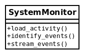
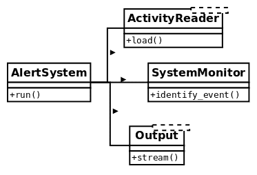
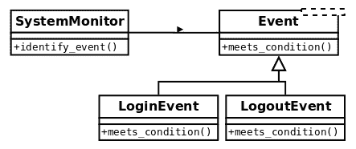
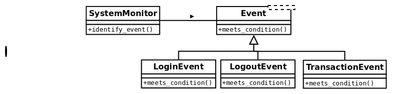
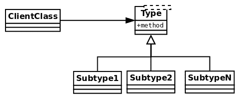
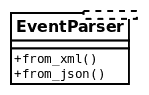
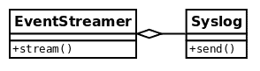
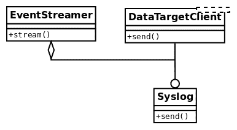

# 第四章：SOLID 原则

在本章中，我们将继续探讨应用于 Python 的清晰设计概念。特别是，我们将回顾所谓的**SOLID**原则，以及如何以 Pythonic 的方式实现它们。这些原则包括一系列实践，以实现更高质量的软件。如果我们中有人不知道 SOLID 代表什么，这里是解释：

+   **S**：单一责任原则

+   **O**：开闭原则

+   **L**：里氏替换原则

+   **I**：接口隔离原则

+   **D**：依赖反转原则

本章的目标如下：

+   熟悉软件设计的 SOLID 原则

+   设计遵循单一责任原则的软件组件

+   通过开闭原则实现更易维护的代码

+   通过遵守里氏替换原则，在面向对象设计中实现适当的类层次结构

+   通过接口隔离和依赖反转进行设计

# 单一责任原则

**单一责任原则**（**SRP**）规定软件组件（通常是一个类）必须只有一个责任。类只有一个责任意味着它只负责做一件具体的事情，因此我们可以得出结论，它只有一个变化的原因。

只有在领域问题上有一件事情改变时，类才需要更新。如果我们不得不因为不同的原因对一个类进行修改，那意味着抽象不正确，类承担了太多责任。

正如在第二章中介绍的*Pythonic Code*，这个设计原则帮助我们构建更具凝聚力的抽象；对象只做一件事情，而且做得很好，遵循 Unix 哲学。我们要避免的情况是拥有承担多个责任的对象（通常称为**god-objects**），因为它们知道得太多，或者比它们应该知道的更多。这些对象组合了不同（大多数是不相关的）行为，因此使它们更难以维护。

再次强调，类越小越好。

SRP 与软件设计中的内聚概念密切相关，我们在第三章中已经探讨过这一点，当时我们讨论了软件中的关注点分离。我们努力实现的目标是，类被设计成大部分时间内它们的属性和方法被使用。当这种情况发生时，我们知道它们是相关的概念，因此将它们分组到同一个抽象下是有意义的。

在某种程度上，这个想法与关系数据库设计中的规范化概念有些相似。当我们发现对象的接口的属性或方法有分区时，它们可能被移动到其他地方——这表明它们是两个或更多不同的抽象混合在一起。

还有另一种看待这个原则的方式。如果在查看一个类时，我们发现方法是相互独立的，彼此之间没有关联，那么它们就是需要分解成更小的类的不同责任。

# 一个类承担太多责任

在这个例子中，我们将创建一个应用程序，负责从源头（可以是日志文件、数据库或其他许多来源）读取有关事件的信息，并识别与每个特定日志对应的动作。

不符合 SRP 的设计如下所示：



不考虑实现，该类的代码可能如下所示：

```py
# srp_1.py
class SystemMonitor:
    def load_activity(self):
        """Get the events from a source, to be processed."""

    def identify_events(self):
        """Parse the source raw data into events (domain objects)."""

    def stream_events(self):
        """Send the parsed events to an external agent."""
```

这个类的问题在于它定义了一个接口，其中包含一组与彼此正交的动作对应的方法：每个动作都可以独立于其他动作完成。

这种设计缺陷使得类变得僵化、不灵活、容易出错，因为很难维护。在这个例子中，每个方法代表了类的一个责任。每个责任都意味着类可能需要被修改的原因。在这种情况下，每个方法代表了类将被修改的各种原因之一。

考虑加载器方法，它从特定来源检索信息。无论这是如何完成的（我们可以在这里抽象实现细节），很明显它将有自己的一系列步骤，例如连接到数据源，加载数据，将其解析为预期格式等。如果其中任何一项发生变化（例如，我们想要更改用于保存数据的数据结构），`SystemMonitor`类将需要更改。问问自己这是否有意义。系统监视器对象是否必须因为我们改变了数据的表示而改变？不。

相同的推理也适用于其他两种方法。如果我们改变了指纹事件的方式，或者我们如何将它们传递到另一个数据源，我们最终会对同一个类进行修改。

现在应该很清楚，这个类相当脆弱，而且不太容易维护。有很多不同的原因会影响这个类的变化。相反，我们希望外部因素对我们的代码的影响尽可能小。解决方案是再次创建更小、更具凝聚力的抽象。

# 分配责任

为了使解决方案更易于维护，我们将每个方法分离到不同的类中。这样，每个类都将有一个单一的责任：



通过使用一个对象来实现相同的行为，该对象将与这些新类的实例进行交互，使用这些对象作为协作者，但是这个想法仍然是每个类封装了一组独立于其他类的特定方法。现在的想法是，对这些类的任何更改都不会影响其他类，它们都有一个明确而具体的含义。如果我们需要改变如何从数据源加载事件，警报系统甚至不知道这些变化，因此我们不需要修改系统监视器上的任何内容（只要合同仍然得到保留），数据目标也没有被修改。

现在变化是局部的，影响是最小的，每个类更容易维护。

新的类定义了接口，不仅更易于维护，而且更可重用。想象一下，现在在应用程序的另一个部分，我们还需要从日志中读取活动，但是为了不同的目的。有了这个设计，我们可以简单地使用`ActivityReader`类型的对象（实际上应该是一个接口，但是在本节的目的上，这个细节并不重要，将在下一个原则中解释）。这是有意义的，而在以前的设计中是没有意义的，因为尝试重用我们定义的唯一类也会带有不需要的额外方法（比如`identify_events()`或`stream_events()`）。

一个重要的澄清是，这个原则并不意味着每个类必须只有一个方法。任何新类都可能有额外的方法，只要它们对应于该类负责处理的相同逻辑。

# 开闭原则

**开闭原则**（OCP）规定一个模块应该是开放的和封闭的（但是针对不同的方面）。

例如，在设计一个类时，我们应该仔细地封装逻辑，使其具有良好的维护性，这意味着我们希望它对扩展是**开放的，但对修改是封闭的。**

简单来说，这意味着当领域问题出现新情况时，我们当然希望我们的代码是可扩展的，能够适应新的要求或领域问题的变化。这意味着当领域问题出现新情况时，我们只想向我们的模型添加新的东西，而不是更改任何已经关闭修改的现有内容。

如果由于某种原因，当需要添加新内容时，我们发现自己修改了代码，那么这个逻辑可能设计得很糟糕。理想情况下，当需求发生变化时，我们只需扩展模块以满足新需求，而无需修改代码。

这个原则适用于多个软件抽象。它可以是一个类，甚至是一个模块。在接下来的两个小节中，我们将分别看到每个示例。

# 不遵循开闭原则的可维护性问题示例

让我们从一个系统的示例开始，该系统设计方式不符合开闭原则，以便看到这种设计的可维护性问题以及这种设计的不灵活性。

我们的想法是，系统的一部分负责在另一个正在被监视的系统中发生事件时识别这些事件。在每个点上，我们希望这个组件根据先前收集的数据的值（为简单起见，我们将假设它被打包到一个字典中，并且先前是通过日志、查询等其他方式检索的）正确地识别事件类型。我们有一个类，根据这些数据，将检索事件，这是另一种具有自己层次结构的类型。

解决这个问题的第一次尝试可能看起来像这样：

```py
# openclosed_1.py
class Event:
    def __init__(self, raw_data):
        self.raw_data = raw_data

class UnknownEvent(Event):
    """A type of event that cannot be identified from its data."""

class LoginEvent(Event):
    """A event representing a user that has just entered the system."""

class LogoutEvent(Event):
    """An event representing a user that has just left the system."""

class SystemMonitor:
    """Identify events that occurred in the system."""

    def __init__(self, event_data):
        self.event_data = event_data

    def identify_event(self):
        if (
            self.event_data["before"]["session"] == 0
            and self.event_data["after"]["session"] == 1
        ):
            return LoginEvent(self.event_data)
        elif (
            self.event_data["before"]["session"] == 1
            and self.event_data["after"]["session"] == 0
        ):
            return LogoutEvent(self.event_data)

        return UnknownEvent(self.event_data)
```

以下是前述代码的预期行为：

```py
>>> l1 = SystemMonitor({"before": {"session": 0}, "after": {"session": 1}})
>>> l1.identify_event().__class__.__name__
'LoginEvent'

>>> l2 = SystemMonitor({"before": {"session": 1}, "after": {"session": 0}})
>>> l2.identify_event().__class__.__name__
'LogoutEvent'

>>> l3 = SystemMonitor({"before": {"session": 1}, "after": {"session": 1}})
>>> l3.identify_event().__class__.__name__
'UnknownEvent'
```

我们可以清楚地注意到事件类型的层次结构，以及一些构造它们的业务逻辑。例如，当会话之前没有标志，但现在有了，我们将该记录标识为登录事件。相反，当相反情况发生时，这意味着它是一个注销事件。如果无法识别事件，则返回类型未知的事件。这是为了通过遵循空对象模式（而不是返回`None`，它检索具有一些默认逻辑的相应类型的对象）来保持多态性。空对象模式在第九章中有描述，*常见设计模式*。

这种设计存在一些问题。第一个问题是确定事件类型的逻辑集中在一个庞大的方法中。随着我们想要支持的事件数量增加，这个方法也会增长，最终可能会变成一个非常长的方法，这是不好的，因为正如我们已经讨论过的，它不会只做一件事情并且做得很好。

在同一行上，我们可以看到这种方法不适合修改。每当我们想要向系统添加新类型的事件时，我们都必须更改这种方法中的某些内容（更不用说`elif`语句的链将是一场噩梦！）。

我们希望能够添加新类型的事件，而无需更改这种方法（关闭修改）。我们还希望能够支持新类型的事件（扩展开放），这样当添加新事件时，我们只需添加代码，而不是更改已经存在的代码。

# 重构事件系统以实现可扩展性

前面示例的问题在于`SystemMonitor`类直接与它将要检索的具体类进行交互。

为了实现符合开闭原则的设计，我们必须朝着抽象设计。

一个可能的替代方案是将这个类视为与事件协作，然后将每种特定类型的事件的逻辑委托给其相应的类：



然后，我们必须为每种类型的事件添加一个新的（多态的）方法，其单一责任是确定它是否与传递的数据相对应，我们还必须改变逻辑以遍历所有事件，找到正确的事件。

新代码应该如下所示：

```py
# openclosed_2.py
class Event:
    def __init__(self, raw_data):
        self.raw_data = raw_data

    @staticmethod
    def meets_condition(event_data: dict):
        return False

class UnknownEvent(Event):
    """A type of event that cannot be identified from its data"""

class LoginEvent(Event):
    @staticmethod
    def meets_condition(event_data: dict):
        return (
            event_data["before"]["session"] == 0
            and event_data["after"]["session"] == 1
        )

class LogoutEvent(Event):
    @staticmethod
    def meets_condition(event_data: dict):
        return (
            event_data["before"]["session"] == 1
            and event_data["after"]["session"] == 0
        )

class SystemMonitor:
    """Identify events that occurred in the system."""

    def __init__(self, event_data):
        self.event_data = event_data

    def identify_event(self):
        for event_cls in Event.__subclasses__():
            try:
                if event_cls.meets_condition(self.event_data):
                    return event_cls(self.event_data)
            except KeyError:
                continue
        return UnknownEvent(self.event_data)
```

请注意，现在交互是针对抽象的（在这种情况下，它将是通用基类`Event`，甚至可能是一个抽象基类或接口，但对于这个例子来说，拥有一个具体的基类就足够了）。该方法不再使用特定类型的事件，而只是使用遵循通用接口的通用事件 - 它们在`meets_condition`方法方面都是多态的。

请注意，事件是通过`__subclasses__()`方法发现的。支持新类型的事件现在只是创建一个新的事件类，该类必须继承自`Event`并根据其特定的业务逻辑实现自己的`meets_condition()`方法。

# 扩展事件系统

现在，让我们证明这个设计实际上是我们想要的那样具有可扩展性。想象一下，出现了一个新的需求，我们还必须支持与用户在监视系统上执行的交易相对应的事件。

设计的类图必须包括这样一种新的事件类型，如下所示：



只需添加到这个新类的代码，逻辑就能按预期工作：

```py
# openclosed_3.py
class Event:
    def __init__(self, raw_data):
        self.raw_data = raw_data

    @staticmethod
    def meets_condition(event_data: dict):
        return False

class UnknownEvent(Event):
    """A type of event that cannot be identified from its data"""

class LoginEvent(Event):
    @staticmethod
    def meets_condition(event_data: dict):
        return (
            event_data["before"]["session"] == 0
            and event_data["after"]["session"] == 1
        )

class LogoutEvent(Event):
    @staticmethod
    def meets_condition(event_data: dict):
        return (
            event_data["before"]["session"] == 1
            and event_data["after"]["session"] == 0
        )

class TransactionEvent(Event):
    """Represents a transaction that has just occurred on the system."""

    @staticmethod
    def meets_condition(event_data: dict):
        return event_data["after"].get("transaction") is not None

class SystemMonitor:
    """Identify events that occurred in the system."""

    def __init__(self, event_data):
        self.event_data = event_data

    def identify_event(self):
        for event_cls in Event.__subclasses__():
            try:
                if event_cls.meets_condition(self.event_data):
                    return event_cls(self.event_data)
            except KeyError:
                continue
        return UnknownEvent(self.event_data)
```

我们可以验证以前的情况仍然像以前一样工作，并且新事件也被正确识别：

```py
>>> l1 = SystemMonitor({"before": {"session": 0}, "after": {"session": 1}})
>>> l1.identify_event().__class__.__name__
'LoginEvent'

>>> l2 = SystemMonitor({"before": {"session": 1}, "after": {"session": 0}})
>>> l2.identify_event().__class__.__name__
'LogoutEvent'

>>> l3 = SystemMonitor({"before": {"session": 1}, "after": {"session": 1}})
>>> l3.identify_event().__class__.__name__
'UnknownEvent'

>>> l4 = SystemMonitor({"after": {"transaction": "Tx001"}})
>>> l4.identify_event().__class__.__name__
'TransactionEvent'
```

请注意，当我们添加新的事件类型时，`SystemMonitor.identify_event()`方法根本没有改变。因此，我们说这个方法对于新类型的事件是封闭的。

相反，`Event`类允许我们在需要时添加新类型的事件。然后我们说，事件对于新类型是开放的。

这就是这个原则的真正本质 - 当领域问题出现新的东西时，我们只想添加新的代码，而不是修改现有的代码。

# 关于 OCP 的最终想法

正如你可能已经注意到的，这个原则与多态的有效使用密切相关。我们希望设计符合客户端可以使用的多态合同的抽象，以及足够通用以便扩展模型是可能的，只要多态关系得到保留。

这个原则解决了软件工程中的一个重要问题：可维护性。不遵循 OCP 的危险是连锁效应和软件中的问题，其中单个更改触发整个代码库的更改，或者有风险破坏代码的其他部分。

一个重要的最终说明是，为了实现这种设计，我们需要能够对我们想要保护的抽象（在这个例子中是新类型的事件）进行适当的封闭。这在所有程序中并不总是可能的，因为一些抽象可能会发生冲突（例如，我们可能有一个适当的抽象，它提供了对一个需求的封闭，但对其他类型的需求却不起作用）。在这些情况下，我们需要有选择地应用一种策略，为需要最具可扩展性的需求提供最佳的封闭。

# Liskov 的替换原则

**Liskov 的替换原则**（**LSP**）规定了对象类型必须具有的一系列属性，以保持其设计的可靠性。

LSP 背后的主要思想是，对于任何类，客户端应该能够无法区分地使用其任何子类型，甚至在运行时也不会影响预期的行为。这意味着客户端完全与类层次结构的变化隔离和不知情。

更正式地说，这是 Liskov 替换原则的原始定义（LISKOV 01）：如果*S*是*T*的子类型，那么类型为*T*的对象可以被类型为*S*的对象替换，而不会破坏程序。

这可以通过一个通用的图表来理解，比如下面的图表。想象一下，有一个客户类需要（包括）另一种类型的对象。一般来说，我们希望这个客户与某种类型的对象进行交互，换句话说，它将通过一个接口来工作。

现在，这种类型可能只是一个通用的接口定义，一个抽象类或一个接口，而不是具有行为本身的类。可能有几个子类扩展了这种类型（在图表中用名称**子类型**描述，最多**N**）。这个原则背后的想法是，如果层次结构被正确实现，客户类必须能够使用任何子类的实例而不会注意到。这些对象应该是可互换的，如下所示：



这与我们已经讨论过的其他设计原则相关，比如按接口设计。一个好的类必须定义一个清晰简洁的接口，只要子类遵守该接口，程序就会保持正确。

作为这一原则的结果，它也与按合同设计的思想相关。给定类型和客户之间有一个合同。通过遵循 LSP 的规则，设计将确保子类遵守由父类定义的合同。

# 使用工具检测 LSP 问题

有一些与 LSP 相关的情景是如此明显错误，以至于我们学会配置的工具（主要是 Mypy 和 Pylint）可以轻松识别。

# 使用 Mypy 检测方法签名中的不正确数据类型

通过在整个代码中使用类型注释（如之前在第一章中推荐的，*介绍、代码格式和工具*），并配置 Mypy，我们可以快速检测到一些基本错误，并免费检查 LSP 的基本合规性。

如果`Event`类的一个子类以不兼容的方式覆盖了一个方法，Mypy 会通过检查注释来注意到这一点：

```py
class Event:
    ...
    def meets_condition(self, event_data: dict) -> bool:
        return False

class LoginEvent(Event):
    def meets_condition(self, event_data: list) -> bool:
        return bool(event_data)
```

当我们在这个文件上运行 Mypy 时，将会得到一个错误消息，内容如下：

```py
error: Argument 1 of "meets_condition" incompatible with supertype "Event"
```

LSP 的违反是明显的——因为派生类使用了与基类定义的类型不同的`event_data`参数类型，我们不能指望它们能够同样工作。请记住，根据这个原则，这个层次结构的任何调用者都必须能够透明地使用`Event`或`LoginEvent`，而不会注意到任何差异。这两种类型的对象可以互换，不应该使应用程序失败。如果不能做到这一点，将会破坏层次结构上的多态性。

如果返回类型被更改为布尔值之外的其他值，同样的错误也会发生。其理由是这段代码的客户端期望使用布尔值。如果派生类中的一个更改了这个返回类型，它将违反合同，再次，我们不能指望程序会继续正常工作。

关于类型不同但共享公共接口的快速说明：尽管这只是一个简单的例子来演示错误，但事实上字典和列表都有一些共同之处；它们都是可迭代的。这意味着在某些情况下，可能会有一个方法期望接收一个字典，另一个方法期望接收一个列表，只要两者都通过可迭代接口处理参数，这可能是有效的。在这种情况下，问题不在于逻辑本身（LSP 可能仍然适用），而在于签名类型的定义，它们既不应该是`list`也不应该是`dict`，而是两者的并集。无论如何，都必须修改一些东西，无论是方法的代码、整个设计，还是类型注释，但在任何情况下，我们都不应该消除警告并忽略 Mypy 给出的错误。

不要通过`# type: ignore`或类似的方式忽略这样的错误。重构或更改代码以解决真正的问题。工具之所以报告实际的设计缺陷是有充分理由的。

# 使用 Pylint 检测不兼容的签名

LSP 的另一个严重违规是，与其在层次结构中变化参数的类型，方法的签名完全不同。这可能看起来像一个大错误，但要检测它并不总是那么容易记住；Python 是解释性语言，所以没有编译器能够及早检测到这种类型的错误，因此它们直到运行时才会被捕获。幸运的是，我们有静态代码分析器，如 Mypy 和 Pylint，可以及早捕获这类错误。

虽然 Mypy 也会捕捉到这种类型的错误，但同时运行 Pylint 以获得更多的见解也不是坏事。

在存在一个违反层次结构定义的类的情况下（例如，通过更改方法的签名，添加额外参数等），如下所示：

```py
# lsp_1.py
class LogoutEvent(Event):
    def meets_condition(self, event_data: dict, override: bool) -> bool:
        if override:
            return True
        ...
```

Pylint 将检测到它，并打印出一个信息性的错误：

```py
Parameters differ from overridden 'meets_condition' method (arguments-differ)
```

再次，就像在先前的情况下一样，不要压制这些错误。注意工具给出的警告和错误，并相应地调整代码。

# 更微妙的 LSP 违规案例

然而，在其他情况下，LSP 被破坏的方式并不那么清晰或明显，工具无法自动识别，我们必须依靠仔细的代码检查进行代码审查。

修改合同的情况特别难以自动检测。鉴于 LSP 的整个理念是子类可以像其父类一样被客户使用，这也意味着合同在层次结构上必须得到正确保留。

请记住第三章中提到的*良好代码的一般特征*，即在按合同设计时，客户和供应商之间的合同设定了一些规则——客户必须提供方法的前置条件，供应商可能会验证，然后以后置条件的形式返回一些结果给客户进行检查。

父类与其客户定义了一个合同。这个类的子类必须尊重这样的合同。这意味着，例如：

+   子类永远不能使前置条件比父类中定义的更严格

+   子类永远不能使后置条件比父类中定义的更弱

考虑前一节中定义的事件层次结构的例子，但现在通过一个变化来说明 LSP 和 DbC 之间的关系。

这一次，我们假设了一个方法的前提条件，根据数据检查标准，提供的参数必须是一个包含`"before"`和`"after"`两个键的字典，并且它们的值也是嵌套字典。这使我们能够进一步封装，因为现在客户端不需要捕获`KeyError`异常，而只需调用前提条件方法（假设如果系统在错误的假设下运行是可以失败的）。顺便说一句，很好的是我们可以从客户端中删除这个，因为现在，`SystemMonitor`不需要知道协作者类的方法可能引发哪些类型的异常（请记住，异常会削弱封装，因为它们要求调用者对其所调用的对象有额外的了解）。

这种设计可以通过代码中的以下更改来表示：

```py
# lsp_2.py

class Event:
    def __init__(self, raw_data):
        self.raw_data = raw_data

    @staticmethod
    def meets_condition(event_data: dict):
        return False

    @staticmethod
    def meets_condition_pre(event_data: dict):
        """Precondition of the contract of this interface.

        Validate that the ``event_data`` parameter is properly formed.
        """
        assert isinstance(event_data, dict), f"{event_data!r} is not a dict"
        for moment in ("before", "after"):
            assert moment in event_data, f"{moment} not in {event_data}"
            assert isinstance(event_data[moment], dict)
```

现在尝试检测正确事件类型的代码只检查前提条件一次，然后继续找到正确类型的事件：

```py
# lsp_2.py
class SystemMonitor:
    """Identify events that occurred in the system."""

    def __init__(self, event_data):
        self.event_data = event_data

    def identify_event(self):
        Event.meets_condition_pre(self.event_data)
        event_cls = next(
            (
                event_cls
                for event_cls in Event.__subclasses__()
                if event_cls.meets_condition(self.event_data)
            ),
            UnknownEvent,
        )
        return event_cls(self.event_data)
```

合同只规定顶层键`"before"`和`"after"`是必须的，它们的值也应该是字典。在子类中试图要求更严格的参数将会失败。

交易事件的类最初设计是正确的。看看代码如何不对内部名为`"transaction"`的键施加限制；它只在那里使用它的值，但这不是强制性的：

```py
# lsp_2.py
class TransactionEvent(Event):
    """Represents a transaction that has just occurred on the system."""

    @staticmethod
    def meets_condition(event_data: dict):
        return event_data["after"].get("transaction") is not None
```

然而，原始的两个方法是不正确的，因为它们要求存在一个名为`"session"`的键，这不是原始合同的一部分。这违反了合同，现在客户端无法像使用其他类一样使用这些类，因为它会引发`KeyError`。

在修复这个问题之后（更改了`.get()`方法的方括号），LSP 的顺序已经恢复，多态性占优势：

```py
>>> l1 = SystemMonitor({"before": {"session": 0}, "after": {"session": 1}})
>>> l1.identify_event().__class__.__name__
'LoginEvent'

>>> l2 = SystemMonitor({"before": {"session": 1}, "after": {"session": 0}})
>>> l2.identify_event().__class__.__name__
'LogoutEvent'

>>> l3 = SystemMonitor({"before": {"session": 1}, "after": {"session": 1}})
>>> l3.identify_event().__class__.__name__
'UnknownEvent'

>>> l4 = SystemMonitor({"before": {}, "after": {"transaction": "Tx001"}})
>>> l4.identify_event().__class__.__name__
'TransactionEvent'
```

期望自动化工具（无论它们有多好和有用）能够检测到这种情况是不合理的。在设计类时，我们必须小心，不要意外地改变方法的输入或输出，以使其与客户端最初期望的不兼容。

# LSP 的备注

LSP 对于良好的面向对象软件设计是至关重要的，因为它强调了其核心特性之一——多态性。它是关于创建正确的层次结构，使得从基类派生的类在其接口的方法方面对父类具有多态性。

有趣的是注意到这个原则如何与前一个原则相关联——如果我们尝试用一个不兼容的新类扩展一个类，它将失败，与客户端的合同将被打破，因此这样的扩展将不可能（或者，为了使其可能，我们将不得不打破原则的另一端，并修改应该对修改封闭的客户端代码，这是完全不可取和不可接受的）。

仔细思考 LSP 建议的新类的方式有助于我们正确地扩展层次结构。然后我们可以说 LSP 有助于 OCP。

# 接口隔离

**接口隔离原则**（ISP）提供了一些关于我们已经反复讨论过的想法的指导：接口应该是小的。

在面向对象的术语中，**接口**由对象公开的方法集表示。这就是说，对象能够接收或解释的所有消息构成了它的接口，这是其他客户端可以请求的内容。接口将类的公开行为的定义与其实现分离开来。

在 Python 中，接口是根据类的方法隐式定义的。这是因为 Python 遵循所谓的**鸭子类型**原则。

传统上，鸭子类型的理念是任何对象实际上是由它所拥有的方法和它能够做什么来表示的。这意味着，无论类的类型、名称、文档字符串、类属性或实例属性如何，最终定义对象本质的是它所拥有的方法。类上定义的方法（它知道如何做）决定了对象实际上是什么。它被称为鸭子类型，是因为“如果它走起来像鸭子，叫起来像鸭子，那它一定是鸭子”。

很长一段时间以来，鸭子类型是 Python 中定义接口的唯一方式。后来，Python 3（PEP-3119）引入了抽象基类的概念，作为一种以不同方式定义接口的方法。抽象基类的基本思想是它定义了一种基本行为或接口，一些派生类负责实现。这在我们想要确保某些关键方法实际上被覆盖时非常有用，它还可以作为覆盖或扩展诸如`isinstance()`之类方法功能的机制。

该模块还包含一种将某些类型注册为层次结构的一部分的方法，称为**虚拟子类**。其想法是通过添加一个新的标准——走起来像鸭子，叫起来像鸭子，或者...它说它是鸭子，将鸭子类型的概念扩展得更远一些。

Python 解释接口的这些概念对于理解这个原则和下一个原则非常重要。

抽象地说，这意味着 ISP 规定，当我们定义一个提供多个方法的接口时，最好将其分解为多个接口，每个接口包含较少的方法（最好只有一个），具有非常具体和准确的范围。通过将接口分离为尽可能小的单元，以促进代码的可重用性，想要实现这些接口之一的每个类很可能会具有高度的内聚性，因为它具有相当明确的行为和一组责任。

# 提供太多方法的接口

现在，我们希望能够从不同格式的多个数据源中解析事件（例如 XML 和 JSON）。遵循良好的实践，我们决定将接口作为我们的依赖目标，而不是具体的类，设计如下：



为了在 Python 中将其创建为接口，我们将使用抽象基类，并将方法（`from_xml()`和`from_json()`）定义为抽象的，以强制派生类实现它们。从这个抽象基类派生并实现这些方法的事件将能够处理它们对应的类型。

但是，如果特定的类不需要 XML 方法，只能从 JSON 构建，它仍然会携带接口的`from_xml()`方法，因为它不需要它，它将不得不通过。这不太灵活，因为它会创建耦合，并迫使接口的客户端使用它们不需要的方法。

# 接口越小，越好。

最好将其分成两个不同的接口，每个接口对应一个方法：


通过这种设计，从`XMLEventParser`派生并实现`from_xml()`方法的对象将知道如何从 XML 构建，从 JSON 文件构建也是一样，但更重要的是，我们保持了两个独立函数的正交性，并保留了系统的灵活性，而不会失去可以通过组合新的较小对象实现的任何功能。

与 SRP 有些相似，但主要区别在于这里我们谈论的是接口，因此它是行为的抽象定义。没有理由改变，因为在接口实际实现之前什么都没有。然而，不遵守这个原则将创建一个与正交功能耦合的接口，这个派生类也将无法遵守 SRP（它将有多个改变的原因）。

# 接口应该有多小？

前一节提出的观点是有效的，但也需要警告——如果被误解或被过分解读，要避免走上危险的道路。

基类（抽象或非抽象）为所有其他类定义了一个接口来扩展它。这应该尽可能小的事实必须以内聚性的方式理解——它应该只做一件事。这并不意味着它一定必须有一个方法。在前面的例子中，巧合的是两种方法完全不同，因此将它们分开成不同的类是有意义的。

但也可能有多个方法合理地属于同一个类。想象一下，您想提供一个混合类，它在上下文管理器中抽象出某些逻辑，以便所有从该混合类派生的类都可以免费获得该上下文管理器逻辑。正如我们已经知道的那样，上下文管理器包括两种方法：`__enter__`和`__exit__`。它们必须一起使用，否则结果将根本不是有效的上下文管理器！

如果不将两种方法放在同一个类中，将导致一个破损的组件，不仅毫无用处，而且具有误导性的危险。希望这个夸张的例子能够对前一节中的例子起到平衡作用，读者可以更准确地了解设计接口。

# 依赖反转

这是一个非常强大的想法，当我们在第九章中探索一些设计模式时，它将再次出现，以及第十章中的*清晰架构*。

**依赖反转原则**（DIP）提出了一个有趣的设计原则，通过它我们可以保护我们的代码，使其不依赖于脆弱、易变或超出我们控制范围的东西。反转依赖的想法是，我们的代码不应该适应细节或具体实现，而是相反的：我们希望通过一种 API 强制任何实现或细节适应我们的代码。

抽象必须以不依赖于细节的方式组织，而是相反的方式——细节（具体实现）应该依赖于抽象。

想象一下，我们设计中的两个对象需要合作，`A`和`B`。`A`与`B`的实例一起工作，但事实证明，我们的模块并不直接控制`B`（它可能是外部库，或者是由另一个团队维护的模块等）。如果我们的代码严重依赖于`B`，当这种情况发生变化时，代码将会崩溃。为了防止这种情况，我们必须反转依赖：使`B`必须适应`A`。这是通过提供一个接口并强制我们的代码不依赖于`B`的具体实现，而是依赖于我们定义的接口来完成的。然后，`B`有责任遵守该接口。

与前几节探讨的概念一致，抽象也以接口的形式出现（或者在 Python 中是抽象基类）。

一般来说，我们可以期望具体实现的变化频率要比抽象组件高得多。正因为如此，我们将抽象（接口）放在我们期望系统发生变化、被修改或扩展的灵活性点上，而不必更改抽象本身。

# 刚性依赖的情况

我们事件监控系统的最后一部分是将识别的事件传递给数据收集器进行进一步分析。这样一个想法的天真实现将包括一个与数据目标交互的事件流类，例如`Syslog`：



然而，这种设计并不是很好，因为我们有一个高级类（`EventStreamer`）依赖于一个低级类（`Syslog`是一个实现细节）。如果我们想要以不同的方式发送数据到`Syslog`，`EventStreamer`将不得不进行修改。如果我们想要在运行时更改数据目标为另一个目标或添加新目标，我们也会遇到麻烦，因为我们将不断修改`stream()`方法以适应这些要求。

# 倒置依赖关系

解决这些问题的方法是使`EventStreamer`使用接口而不是具体类。这样，实现这个接口取决于包含实现细节的低级类：



现在有一个表示通用数据目标的接口，数据将被发送到该接口。请注意，依赖关系已经被倒置，因为`EventStreamer`不依赖于特定数据目标的具体实现，它不必随着此数据目标的更改而更改，而是由每个特定的数据目标来正确实现接口并根据需要进行调整。

换句话说，第一个实现的原始`EventStreamer`只能与类型为`Syslog`的对象一起工作，这并不太灵活。然后我们意识到它可以与任何能够响应`.send()`消息的对象一起工作，并确定这个方法是它需要遵守的接口。现在，在这个版本中，`Syslog`实际上是扩展了名为`DataTargetClient`的抽象基类，该类定义了`send()`方法。从现在开始，每种新类型的数据目标（例如电子邮件）都要扩展这个抽象基类并实现`send()`方法。

我们甚至可以在运行时修改此属性以适用于实现`send()`方法的任何其他对象，它仍然可以工作。这就是为什么它经常被称为**依赖注入**的原因：因为依赖关系可以动态提供。

热心的读者可能会想知道为什么这是必要的。Python 足够灵活（有时太灵活了），并且允许我们向`EventStreamer`提供任何特定数据目标对象，而无需该对象遵守任何接口，因为它是动态类型的。问题是：当我们可以简单地向其传递具有`send()`方法的对象时，为什么我们需要定义抽象基类（接口）呢？

公平地说，这是真的；实际上并不需要这样做，程序仍然可以正常工作。毕竟，多态性并不意味着（或要求）继承才能工作。然而，定义抽象基类是一种良好的实践，带来了一些优势，第一个优势是鸭子类型。除了鸭子类型，我们还可以提到模型变得更易读的事实——请记住，继承遵循**是一个**规则，因此通过声明抽象基类并从中扩展，我们在说，例如，`Syslog`是`DataTargetClient`，这是您的代码用户可以阅读和理解的内容（再次强调，这是鸭子类型）。

总的来说，定义抽象基类并不是强制性的，但为了实现更清晰的设计是值得的。这本书的目的之一就是帮助程序员避免犯易犯的错误，因为 Python 太灵活了，我们可以逃避这些错误。

# 摘要

SOLID 原则是良好的面向对象软件设计的关键指导原则。

构建软件是一项非常艰巨的任务——代码的逻辑是复杂的，它在运行时的行为很难（有时甚至是不可能）预测，要求不断变化，环境也在不断变化，还有很多事情可能会出错。

此外，有多种构建软件的方式，不同的技术、范式和许多不同的设计可以共同解决特定问题。然而，并非所有这些方法随着时间的推移都会被证明是正确的，要求也会变化或演变。然而，到那时，要对不正确的设计做出改变已经为时已晚，因为它是僵化的、不灵活的，因此很难将其重构为正确的解决方案。

这意味着，如果我们设计错误，将会在未来付出很大的代价。那么我们如何才能实现最终会有回报的良好设计呢？答案是我们并不确定。我们正在处理未来，而未来是不确定的——我们无法确定我们的设计是否正确，我们的软件是否在未来几年内灵活和适应。正是因为这个原因，我们必须坚持原则。

这就是 SOLID 原则发挥作用的地方。它们并不是魔法规则（毕竟，在软件工程中没有银弹），但它们提供了良好的指导方针，这些指导方针在过去的项目中已被证明有效，并且会使我们的软件更有可能成功。

在本章中，我们探讨了 SOLID 原则，目的是理解清晰的设计。在接下来的章节中，我们将继续探讨语言的细节，并在某些情况下看到这些工具和特性如何与这些原则一起使用。

# 参考资料

以下是您可以参考的信息列表：

+   *SRP 01*：单一责任原则（[`8thlight.com/blog/uncle-bob/2014/05/08/SingleReponsibilityPrinciple.html`](https://8thlight.com/blog/uncle-bob/2014/05/08/SingleReponsibilityPrinciple.html)）

+   *PEP-3119*：引入抽象基类（[`www.python.org/dev/peps/pep-3119/`](https://www.python.org/dev/peps/pep-3119/)）

+   *LISKOV 01*：由 Barbara Liskov 撰写的一篇名为*数据抽象和层次结构*的论文。
