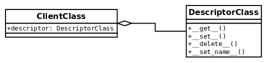

# 第六章：通过描述符更充分地利用我们的对象

本章介绍了一个在 Python 开发中更为高级的新概念，因为它涉及到描述符。此外，描述符并不是其他语言的程序员熟悉的东西，因此没有简单的类比或类似之处。

描述符是 Python 的另一个独特特性，它将面向对象编程提升到另一个水平，其潜力允许用户构建更强大和可重用的抽象。大多数情况下，描述符的全部潜力都体现在库或框架中。

在本章中，我们将实现与描述符相关的以下目标：

+   了解描述符是什么，它们是如何工作的，以及如何有效地实现它们

+   分析两种类型的描述符（数据和非数据描述符），从它们的概念差异和实现细节方面进行分析

+   通过描述符有效地重用代码

+   分析描述符的良好使用示例，以及如何利用它们来构建我们自己的 API 库

# 描述符的初步了解

首先，我们将探索描述符背后的主要思想，以了解它们的机制和内部工作。一旦这一点清楚，就会更容易吸收不同类型的描述符是如何工作的，我们将在下一节中探讨。

一旦我们对描述符背后的思想有了初步了解，我们将看一个示例，其中它们的使用为我们提供了更清晰和更符合 Python 风格的实现。

# 描述符背后的机制

描述符的工作方式并不是很复杂，但它们的问题在于有很多需要考虑的注意事项，因此这里的实现细节至关重要。

为了实现描述符，我们至少需要两个类。对于这个通用示例，我们将称`client`类为将要利用我们想要在`descriptor`中实现的功能的类（这个类通常只是一个领域模型类，是我们解决方案中创建的常规抽象），我们将称`descriptor`类为实现描述符逻辑的类。

因此，描述符只是一个实现描述符协议的类的实例对象。这意味着这个类必须包含至少一个以下魔术方法（作为 Python 3.6+的描述符协议的一部分）的接口：

+   `__get__`

+   **`__set__`**

+   `__delete__`

+   **`__set_name__`**

为了这个最初的高层次介绍，将使用以下命名约定：

| **名称** | **含义** |
| --- | --- |
| `ClientClass` | 将利用要由描述符实现的功能的领域级抽象。这个类被称为描述符的客户端。这个类包含一个类属性（按照惯例命名为`descriptor`），它是`DescriptorClass`的一个实例。 |
| `DescriptorClass` | 实现`descriptor`本身的类。这个类应该实现一些前面提到的涉及描述符协议的魔术方法。 |
| `client` | `ClientClass`的一个实例。`client = ClientClass()` |
| `descriptor` | `DescriptorClass`的一个实例。`descriptor = DescriptorClass()`。这个对象是一个放置在`ClientClass`中的类属性。 |

这种关系在下图中得到了说明：



要牢记的一个非常重要的观察是，为了使这个协议工作，`descriptor`对象必须被定义为一个类属性。将这个对象创建为一个实例属性是行不通的，因此它必须在类的主体中，而不是在`init`方法中。

始终将`descriptor`对象放置为一个类属性！

稍微批评一下，读者还可以注意到，部分实现描述符协议是可能的——并非所有方法总是必须被定义；相反，我们可以只实现我们需要的方法，我们很快将看到。

现在，我们已经有了结构——我们知道设置了哪些元素以及它们如何交互。我们需要一个用于`descriptor`的类，另一个将使用`descriptor`逻辑的类，这个类将作为类属性具有`descriptor`对象（`DescriptorClass`的实例），以及在调用名为`descriptor`的属性时将遵循描述符协议的`ClientClass`的实例。但现在呢？所有这些在运行时如何组合在一起？

通常，当我们有一个常规类并访问其属性时，我们会按预期获得对象，甚至它们的属性，如下例所示：

```py
>>> class Attribute:
...     value = 42
... 
>>> class Client:
...     attribute = Attribute()
... 
>>> Client().attribute
<__main__.Attribute object at 0x7ff37ea90940>
>>> Client().attribute.value
42
```

但是，在描述符的情况下，情况有所不同。当一个对象被定义为类属性（并且这是一个`descriptor`）时，当一个`client`请求此属性时，我们不是得到对象本身（正如我们从前面的例子中所期望的那样），而是得到了调用`__get__`魔术方法的结果。

让我们从一些仅记录有关上下文的信息并返回相同的`client`对象的简单代码开始：

```py
class DescriptorClass:
    def __get__(self, instance, owner):
        if instance is None:
            return self
        logger.info("Call: %s.__get__(%r, %r)", 
        self.__class__.__name__,instance, owner)
        return instance

class ClientClass:
    descriptor = DescriptorClass()
```

当运行此代码并请求`ClientClass`实例的`descriptor`属性时，我们将发现实际上并没有得到`DescriptorClass`的实例，而是得到了其`__get__()`方法返回的内容：

```py
>>> client = ClientClass()
>>> client.descriptor
INFO:Call: DescriptorClass.__get__(<ClientClass object at 0x...>, <class 'ClientClass'>)
<ClientClass object at 0x...>
>>> client.descriptor is client
INFO:Call: DescriptorClass.__get__(ClientClass object at 0x...>, <class 'ClientClass'>)
True
```

请注意，放置在`__get__`方法下面的日志行被调用，而不是只返回我们创建的对象。在这种情况下，我们让该方法返回`client`本身，从而使最后一条语句的比较成立。在我们更详细地探讨每个方法时，将更详细地解释此方法的参数。

从这个简单但有示例性的例子开始，我们可以开始创建更复杂的抽象和更好的装饰器，因为这里的重要说明是我们有了一个新的（强大的）工具来使用。请注意，这如何以完全不同的方式改变了程序的控制流。有了这个工具，我们可以在`__get__`方法背后抽象出各种逻辑，并使`descriptor`在客户端甚至察觉不到的情况下运行各种转换。这将封装提升到一个新的水平。

# 探索描述符协议的每个方法

到目前为止，我们已经看到了很多描述符在实际中的例子，并且了解了它们的工作原理。这些例子让我们初步了解了描述符的强大之处，但您可能想知道一些我们未能解释的实现细节和习惯用法。

由于描述符只是对象，这些方法将`self`作为第一个参数。对于所有这些方法，这只是指`descriptor`对象本身。

在本节中，我们将详细探讨描述符协议的每个方法，解释每个参数的意义，以及它们的预期用法。

# __get__(self, instance, owner)

第一个参数`instance`指的是调用`descriptor`的对象。在我们的第一个例子中，这意味着`client`对象。

`owner`参数是指对象的类，根据我们的例子（来自*描述符背后的机制*部分的上一个类图），将是`ClientClass`。

从前面的段落中我们得出结论，`__get__`签名中名为`instance`的参数是描述符正在操作的对象，而`owner`是`instance`的类。热心的读者可能会想知道为什么签名会这样定义，毕竟类可以直接从`instance`中获取（`owner = instance.__class__`）。这里有一个特殊情况——当从类（`ClientClass`）而不是从实例（`client`）中调用`descriptor`时，`instance`的值是`None`，但在这种情况下我们可能仍然想要进行一些处理。

通过以下简单的代码，我们可以演示当描述符从类或实例中被调用时的区别。在这种情况下，`__get__`方法对每种情况都做了两件不同的事情。

```py
# descriptors_methods_1.py

class DescriptorClass:
    def __get__(self, instance, owner):
        if instance is None:
            return f"{self.__class__.__name__}.{owner.__name__}"
        return f"value for {instance}"

class ClientClass:

    descriptor = DescriptorClass()
```

当我们直接从`ClientClass`中调用它时，它会做一件事，即用类的名称组成一个命名空间：

```py
>>> ClientClass.descriptor
'DescriptorClass.ClientClass'
```

然后，如果我们从创建的对象中调用它，它将返回另一条消息：

```py
>>> ClientClass().descriptor
'value for <descriptors_methods_1.ClientClass object at 0x...>'
```

一般来说，除非我们真的需要使用`owner`参数做一些事情，最常见的习惯是当`instance`为`None`时，只返回描述符本身。

# __set__(self, instance, value)

当我们尝试给`descriptor`赋值时，就会调用这个方法。它会被以下语句激活，其中`descriptor`是一个实现了`__set__()`的对象。在这种情况下，`instance`参数将是`client`，而`value`将是字符串`"value"`：

```py
client.descriptor = "value"
```

如果`client.descriptor`没有实现`__set__()`，那么`"value"`将完全覆盖`descriptor`。

在给描述符属性赋值时要小心。确保它实现了`__set__`方法，并且我们没有引起不希望的副作用。

默认情况下，这个方法最常见的用途就是在对象中存储数据。然而，到目前为止我们已经看到了描述符的强大之处，我们可以利用它们，例如，如果我们要创建可以多次应用的通用验证对象（再次强调，如果我们不进行抽象，可能会在属性的 setter 方法中重复多次）。

以下清单说明了我们如何利用这个方法来为属性创建通用的`validation`对象，可以使用函数动态创建用于在分配给对象之前验证值的对象：

```py
class Validation:

    def __init__(self, validation_function, error_msg: str):
        self.validation_function = validation_function
        self.error_msg = error_msg

    def __call__(self, value):
        if not self.validation_function(value):
            raise ValueError(f"{value!r} {self.error_msg}")

class Field:

    def __init__(self, *validations):
        self._name = None
        self.validations = validations

    def __set_name__(self, owner, name):
        self._name = name

    def __get__(self, instance, owner):
        if instance is None:
            return self
        return instance.__dict__[self._name]

    def validate(self, value):
        for validation in self.validations:
            validation(value)

    def __set__(self, instance, value):
        self.validate(value)
        instance.__dict__[self._name] = value

class ClientClass:
    descriptor = Field(
        Validation(lambda x: isinstance(x, (int, float)), "is not a 
        number"),
        Validation(lambda x: x >= 0, "is not >= 0"),
    )
```

我们可以在以下清单中看到这个对象的作用：

```py
>>> client = ClientClass()
>>> client.descriptor = 42
>>> client.descriptor
42
>>> client.descriptor = -42
Traceback (most recent call last):
 ...
ValueError: -42 is not >= 0
>>> client.descriptor = "invalid value"
...
ValueError: 'invalid value' is not a number
```

这个想法是，我们通常会将属性放在属性中的东西抽象成一个`descriptor`，并且可以多次重用它。在这种情况下，`__set__()`方法将会做`@property.setter`本来会做的事情。

# __delete__(self, instance)

在以下语句中调用这个方法时，`self`将是`descriptor`属性，`instance`将是这个例子中的`client`对象：

```py
>>> del client.descriptor
```

在下面的例子中，我们使用这个方法来创建一个`descriptor`，目的是防止用户在没有必要的管理权限的情况下删除对象的属性。请注意，在这种情况下，`descriptor`具有用于预测使用它的对象的值的逻辑，而不是不同相关对象的逻辑：

```py
# descriptors_methods_3.py

class ProtectedAttribute:
    def __init__(self, requires_role=None) -> None: 
        self.permission_required = requires_role
        self._name = None

    def __set_name__(self, owner, name):
        self._name = name

    def __set__(self, user, value):
        if value is None:
 raise ValueError(f"{self._name} can't be set to None")
        user.__dict__[self._name] = value

    def __delete__(self, user):
        if self.permission_required in user.permissions:
            user.__dict__[self._name] = None
        else:
            raise ValueError(
                f"User {user!s} doesn't have {self.permission_required} "
                "permission"
            )

class User:
    """Only users with "admin" privileges can remove their email address."""

    email = ProtectedAttribute(requires_role="admin")

    def __init__(self, username: str, email: str, permission_list: list = None) -> None:
        self.username = username
        self.email = email
        self.permissions = permission_list or []

    def __str__(self):
        return self.username
```

在看到这个对象如何工作的例子之前，重要的是要注意这个描述符的一些标准。注意`User`类要求`username`和`email`作为强制参数。根据其`**__init__**`方法，如果没有`email`属性，它就不能成为用户。如果我们要删除该属性，并从对象中完全提取它，我们将创建一个不一致的对象，其中包含一些无效的中间状态，这些状态与`User`类定义的接口不符。像这样的细节非常重要，以避免问题。其他对象期望与这个`User`一起工作，并且也期望它有一个`email`属性。

因此，决定“删除”电子邮件只会将其简单地设置为`None`，这是代码清单中加粗部分的一部分。出于同样的原因，我们必须禁止有人尝试将`None`值设置为它，因为那样会绕过我们放置在`**__delete__**`方法中的机制。

在这里，我们可以看到它的作用，假设只有具有`"admin"`权限的用户才能删除他们的电子邮件地址：

```py
>>> admin = User("root", "root@d.com", ["admin"])
>>> user = User("user", "user1@d.com", ["email", "helpdesk"]) 
>>> admin.email
'root@d.com'
>>> del admin.email
>>> admin.email is None
True
>>> user.email
'user1@d.com'
>>> user.email = None
...
ValueError: email can't be set to None
>>> del user.email
...
ValueError: User user doesn't have admin permission
```

在这个简单的`descriptor`中，我们可以看到只有包含`"admin"`权限的用户才能删除用户的电子邮件。至于其他情况，当我们尝试在该属性上调用`del`时，我们将得到一个`ValueError`异常。

一般来说，描述符的这种方法并不像前两种方法那样常用，但是出于完整性的考虑，还是值得展示一下。

# __set_name__(self, owner, name)

当我们在将要使用它的类中创建`descriptor`对象时，通常需要`descriptor`知道它将要处理的属性的名称。

这个属性名称是我们在`__get__`和`__set__`方法中从`__dict__`中读取和写入的名称。

在 Python 3.6 之前，描述符无法自动获取这个名称，因此最常见的方法是在初始化对象时显式传递它。这样做没问题，但有一个问题，就是每次我们想要为新属性使用描述符时，都需要重复名称。

如果没有这个方法，典型的`descriptor`将如下所示：

```py
class DescriptorWithName:
    def __init__(self, name):
        self.name = name

    def __get__(self, instance, value):
        if instance is None:
            return self
        logger.info("getting %r attribute from %r", self.name, instance)
        return instance.__dict__[self.name]

    def __set__(self, instance, value):
        instance.__dict__[self.name] = value

class ClientClass:
    descriptor = DescriptorWithName("descriptor")
```

我们可以看到`descriptor`如何使用这个值：

```py
>>> client = ClientClass()
>>> client.descriptor = "value"
>>> client.descriptor
INFO:getting 'descriptor' attribute from <ClientClass object at 0x...>
'value'
```

现在，如果我们想要避免两次写入属性名称（一次是在类内部分配的变量，一次是作为描述符的第一个参数的名称），我们必须求助于一些技巧，比如使用类装饰器，或者（更糟糕的是）使用元类。

在 Python 3.6 中，添加了新的方法`__set_name__`，它接收正在创建该描述符的类和正在赋予该描述符的名称。最常见的习惯用法是使用这种方法来存储所需的名称。

为了兼容性，通常最好在`__init__`方法中保留默认值，但仍然利用`__set_name__`。

有了这个方法，我们可以将前面的描述符重写如下：

```py
class DescriptorWithName:
    def __init__(self, name=None):
        self.name = name

    def __set_name__(self, owner, name):
        self.name = name
    ...
```

# 描述符的类型

根据我们刚刚探讨的方法，我们可以在描述符的工作方式方面进行重要的区分。了解这种区别在有效地使用描述符方面起着重要作用，并且还有助于避免运行时的注意事项或常见错误。

如果描述符实现了`__set__`或`__delete__`方法，则称为**数据描述符**。否则，仅实现`__get__`的描述符是**非数据描述符**。请注意，`__set_name__`对这一分类没有影响。

在尝试解析对象的属性时，数据描述符将始终优先于对象的字典，而非数据描述符则不会。这意味着在非数据描述符中，如果对象的字典中有与描述符相同名称的键，将始终调用该键，并且描述符本身永远不会运行。相反，在数据描述符中，即使字典中有与描述符相同名称的键，也永远不会使用该键，因为描述符本身总是会被调用。

接下来的两个部分将通过示例更详细地解释这一点，以便更深入地了解每种类型的描述符可以期望得到什么。

# 非数据描述符

我们将从仅实现`__get__`方法的`descriptor`开始，看看它是如何使用的：

```py
class NonDataDescriptor:
    def __get__(self, instance, owner):
        if instance is None:
            return self
        return 42

class ClientClass:
    descriptor = NonDataDescriptor()
```

像往常一样，如果我们请求`descriptor`，我们将得到其`__get__`方法的结果：

```py
>>> client = ClientClass()
>>> client.descriptor
42
```

但是，如果我们将`descriptor`属性更改为其他值，我们将失去对该值的访问，并获得分配给它的值：

```py
>>> client.descriptor = 43
>>> client.descriptor
43
```

现在，如果我们删除`descriptor`，然后再次请求它，让我们看看我们得到什么：

```py
>>> del client.descriptor
>>> client.descriptor
42
```

让我们回顾一下刚刚发生的事情。当我们首次创建`client`对象时，`descriptor`属性位于类中，而不是实例中，因此如果我们要求`client`对象的字典，它将是空的：

```py
>>> vars(client)
{}
```

然后，当我们请求`.descriptor`属性时，在`client.__dict__`中找不到任何名为`"descriptor"`的键，因此它转到类中，在那里找到它……但只是作为描述符，因此返回`__get__`方法的结果。

但是，我们将`.descriptor`属性的值更改为其他值，这样做的效果是将其设置到`instance`的字典中，这意味着这次它不会是空的：

```py
>>> client.descriptor = 99
>>> vars(client)
{'descriptor': 99}
```

因此，当我们在这里请求`.descriptor`属性时，它将在对象中查找它（这次会找到，因为`__dict__`属性中有一个名为`descriptor`的键，正如`vars`结果所显示的），并返回它，而无需在类中查找。因此，从未调用描述符协议，下次我们请求此属性时，它将返回我们已经覆盖的值（`99`）。

之后，我们通过调用`del`删除此属性，这样做的效果是从对象的字典中删除键`"descriptor"，使我们回到第一个场景，它将默认到描述符协议将被激活的类中：

```py
>>> del client.descriptor
>>> vars(client)
{}
>>> client.descriptor
42
```

这意味着如果我们将`descriptor`的属性设置为其他值，我们可能会意外地破坏它。为什么？因为`descriptor`不处理删除操作（有些不需要）。

这被称为非数据描述符，因为它没有实现`__set__`魔术方法，正如我们将在下一个示例中看到的那样。

# 数据描述符

现在，让我们看看使用数据描述符的区别。为此，我们将创建另一个实现`__set__`方法的简单`descriptor`：

```py
class DataDescriptor:

    def __get__(self, instance, owner):
        if instance is None:
            return self
        return 42

    def __set__(self, instance, value):
        logger.debug("setting %s.descriptor to %s", instance, value)
        instance.__dict__["descriptor"] = value

class ClientClass:
    descriptor = DataDescriptor()
```

让我们看看`descriptor`的值返回的是什么：

```py
>>> client = ClientClass()
>>> client.descriptor
42
```

现在，让我们尝试将此值更改为其他值，看看它返回的是什么：

```py
>>> client.descriptor = 99
>>> client.descriptor
42
```

`descriptor`返回的值没有改变。但是当我们为其分配不同的值时，它必须设置为对象的字典（就像以前一样）：

```py
>>> vars(client)
{'descriptor': 99}

>>> client.__dict__["descriptor"]
99
```

因此，`__set__()`方法被调用，确实将值设置到了对象的字典中，但是这次，当我们请求此属性时，不再使用字典的`__dict__`属性，而是使用`descriptor`（因为它是覆盖的`descriptor`）。

还有一件事——删除属性将不再起作用：

```py
>>> del client.descriptor
Traceback (most recent call last):
 ...
AttributeError: __delete__
```

原因如下——现在，`descriptor`总是生效，调用`del`删除对象的属性时，不会尝试从对象的字典（`__dict__`）中删除属性，而是尝试调用`descriptor`的`__delete__()`方法（在这个例子中没有实现，因此会出现属性错误）。

这是数据和非数据描述符之间的区别。如果描述符实现了`__set__()`，那么它将始终优先，无论对象的字典中存在什么属性。如果这个方法没有被实现，那么首先会查找字典，然后再运行描述符。

你可能已经注意到`set`方法中的这行代码是一个有趣的观察：

```py
instance.__dict__["descriptor"] = value
```

关于这行代码有很多问题，但让我们分解成几部分。

首先，为什么只改变`"descriptor"`属性的名称？这只是一个简化的例子，但是，当使用描述符时，它在这一点上并不知道它被分配的参数的名称，所以我们只是使用了例子中的一个，知道它将是`"descriptor"`。

在一个真实的例子中，你可以做两件事中的一件——要么接收名称作为参数并在`init`方法中内部存储它，这样这个方法将只使用内部属性，或者更好的是使用`__set_name__`方法。

为什么直接访问实例的`__dict__`属性？另一个很好的问题，至少有两种解释。首先，你可能会想为什么不直接这样做：

```py
setattr(instance, "descriptor", value)
```

记住，当我们尝试给一个`descriptor`属性赋值时，会调用这个方法（`__set__`）。所以，使用`setattr()`会再次调用这个`descriptor`，然后再次调用，依此类推。这将导致无限递归。

不要在`__set__`方法内部直接使用`setattr()`或赋值表达式来操作描述符，因为这将触发无限递归。

那么，为什么描述符不能记录所有对象的属性值？

`client`类已经引用了描述符。如果我们从描述符到`client`对象创建一个引用，我们就会创建循环依赖关系，这些对象将永远不会被垃圾回收。因为它们相互指向，它们的引用计数永远不会降到移除的阈值以下。

这里的一个可能的替代方案是使用弱引用，使用`weakref`模块，并且如果我们想要这样做，创建一个弱引用键字典。这个实现在本章后面有解释，但对于本书中的实现，我们更倾向于使用这种习惯用法，因为在编写描述符时它是相当常见和被接受的。

# 描述符的运作

现在我们已经看到了描述符是什么，它们是如何工作的，以及它们背后的主要思想是什么，我们可以看到它们在实际中的运作。在这一部分，我们将探讨一些可以通过描述符优雅地解决的情况。

在这里，我们将看一些使用描述符的例子，并且我们也将涵盖它们的实现考虑因素（创建它们的不同方式，以及它们的优缺点），最后我们将讨论描述符最适合的场景是什么。

# 描述符的应用

我们将从一个简单的可以工作的例子开始，但这将导致一些代码重复。不太清楚这个问题将如何解决。之后，我们将想出一种将重复逻辑抽象成描述符的方法，这将解决重复问题，我们将注意到我们的客户类上的代码将大大减少。

# 首次尝试不使用描述符

我们现在要解决的问题是，我们有一个普通的类，有一些属性，但我们希望跟踪特定属性随时间变化的所有不同值，例如，以列表的形式。我们脑海中首先想到的解决方案是使用属性，每当在属性的 setter 方法中更改值时，我们将其添加到一个内部列表中，以便保持所需的痕迹。

假设我们的类代表应用程序中的一个旅行者，他有一个当前城市，我们希望在程序运行期间跟踪用户访问过的所有城市。以下代码是一个可能的实现，满足这些要求：

```py
class Traveller:

    def __init__(self, name, current_city):
        self.name = name
        self._current_city = current_city
        self._cities_visited = [current_city]

    @property
    def current_city(self):
        return self._current_city

    @current_city.setter
    def current_city(self, new_city):
        if new_city != self._current_city:
            self._cities_visited.append(new_city)
        self._current_city = new_city

    @property
    def cities_visited(self):
        return self._cities_visited
```

我们可以轻松地检查这段代码是否符合我们的要求：

```py
>>> alice = Traveller("Alice", "Barcelona")
>>> alice.current_city = "Paris"
>>> alice.current_city = "Brussels"
>>> alice.current_city = "Amsterdam"

>>> alice.cities_visited
['Barcelona', 'Paris', 'Brussels', 'Amsterdam']
```

到目前为止，这就是我们需要的一切，不需要实现其他内容。对于这个问题来说，属性已经足够了。如果我们需要在应用程序的多个地方使用完全相同的逻辑会发生什么？这意味着这实际上是一个更通用问题的实例——在另一个属性中跟踪所有值。如果我们想对其他属性执行相同的操作，比如跟踪爱丽丝购买的所有票或她去过的所有国家，会发生什么？我们将不得不在所有这些地方重复逻辑。

此外，如果我们需要在不同的类中具有相同的行为，会发生什么？我们将不得不重复代码或提出一个通用解决方案（也许是装饰器、属性构建器或描述符）。由于属性构建器是描述符的一个特殊（更加复杂）的情况，它超出了本书的范围，因此建议使用描述符作为更清晰的处理方式。

# 惯用的实现

现在，我们将看看如何通过使用一个通用的描述符来解决上一节的问题。再次强调，这个例子实际上并不需要，因为要求并没有指定这种通用行为（我们甚至没有遵循之前创建抽象的相似模式的三个实例的规则），但它展示了描述符的作用目标。

除非有实际证据表明我们要解决的重复问题，且复杂性已经证明是值得的，否则不要实现描述符。

现在，我们将创建一个通用的描述符，给定一个属性名称来保存另一个属性的痕迹，将会把属性的不同值存储在一个列表中。

正如我们之前提到的，代码超出了问题的需求，但其意图只是展示描述符如何帮助我们解决问题。由于描述符的通用性，读者会注意到它的逻辑（方法的名称和属性）与手头的领域问题（旅行者对象）无关。这是因为描述符的理念是能够在任何类型的类中使用它，可能是在不同的项目中，产生相同的结果。

为了解决这个问题，代码的一些部分被注释，并且对每个部分的相应解释（它的作用以及它如何与原始问题相关）在下面的代码中描述。

```py
class HistoryTracedAttribute:
    def __init__(self, trace_attribute_name) -> None:
        self.trace_attribute_name = trace_attribute_name  # [1]
        self._name = None

    def __set_name__(self, owner, name):
        self._name = name

    def __get__(self, instance, owner):
        if instance is None:
            return self
        return instance.__dict__[self._name]

    def __set__(self, instance, value):
        self._track_change_in_value_for_instance(instance, value)
        instance.__dict__[self._name] = value

    def _track_change_in_value_for_instance(self, instance, value):
        self._set_default(instance)   # [2]
        if self._needs_to_track_change(instance, value):
            instance.__dict__[self.trace_attribute_name].append(value)

    def _needs_to_track_change(self, instance, value) -> bool:
        try:
            current_value = instance.__dict__[self._name]
        except KeyError:   # [3]
            return True
        return value != current_value  # [4]

    def _set_default(self, instance):
        instance.__dict__.setdefault(self.trace_attribute_name, [])  # [6]

class Traveller:

    current_city = HistoryTracedAttribute("cities_visited")  # [1]

    def __init__(self, name, current_city):
        self.name = name
        self.current_city = current_city  # [5]
```

对代码的一些注解和评论如下（列表中的数字对应前面清单中的注解编号）：

1.  属性的名称是分配给`descriptor`的变量之一，在这种情况下是`current_city`。我们将变量的名称传递给`descriptor`，它将存储`descriptor`的变量的痕迹。在这个例子中，我们告诉我们的对象跟踪`current_city`在名为`cities_visited`的属性中的所有值。

1.  第一次调用`descriptor`时，在`init`中，用于跟踪值的属性将不存在，这种情况下，我们将其初始化为空列表，以便稍后向其添加值。

1.  在`init`方法中，属性`current_city`的名称也不存在，所以我们也想跟踪这个变化。这相当于在前面的例子中用第一个值初始化列表。

1.  只有在新值与当前设置的值不同时才跟踪更改。

1.  在`init`方法中，`descriptor`已经存在，这个赋值指令会触发第 2 步(创建空列表以开始跟踪其值)和第 3 步(将值附加到此列表，并将其设置为对象中的键以便以后检索)的操作。

1.  字典中的`setdefault`方法用于避免`KeyError`。在这种情况下，对于尚不可用的属性，将返回一个空列表(参见[`docs.python.org/3.6/library/stdtypes.html#dict.setdefault`](https://docs.python.org/3.6/library/stdtypes.html#dict.setdefault)以供参考)。

`descriptor`中的代码确实相当复杂。另一方面，`client`类中的代码要简单得多。当然，只有在我们要多次使用这个`descriptor`时才能实现这种平衡，这是我们已经讨论过的问题。

在这一点上可能不太清楚的是，描述符确实完全独立于`client`类。它没有任何关于业务逻辑的暗示。这使得它完全适用于任何其他类；即使它执行完全不同的操作，描述符也会产生相同的效果。

这才是描述符真正的 Python 特性。它们更适合于定义库、框架或内部 API，而不太适合业务逻辑。

# 实现描述符的不同形式

在考虑实现描述符的方法之前，我们必须首先了解描述符特有的一个常见问题。首先，我们将讨论全局共享状态的问题，然后我们将继续看看在考虑这一点的情况下可以实现描述符的不同方式。

# 全局共享状态的问题

正如我们已经提到的，描述符需要被设置为类属性才能工作。这在大多数情况下不会成为问题，但它确实需要考虑一些警告。

类属性的问题在于它们在该类的所有实例之间共享。描述符也不例外，因此，如果我们试图在`descriptor`对象中保留数据，请记住所有这些对象都将访问相同的值。

让我们看看当我们不正确地定义一个将数据本身保存在`descriptor`中而不是在每个对象中存储时会发生什么：

```py
class SharedDataDescriptor:
    def __init__(self, initial_value):
        self.value = initial_value

    def __get__(self, instance, owner):
        if instance is None:
            return self
        return self.value

    def __set__(self, instance, value):
        self.value = value

class ClientClass:
    descriptor = SharedDataDescriptor("first value")
```

在这个例子中，`descriptor`对象存储数据本身。这带来的不便之处在于，当我们修改一个`instance`的值时，同一类的所有其他实例也会被修改为相同的值。下面的代码清单将这个理论付诸实践：

```py
>>> client1 = ClientClass()
>>> client1.descriptor
'first value'

>>> client2 = ClientClass()
>>> client2.descriptor
'first value'

>>> client2.descriptor = "value for client 2"
>>> client2.descriptor
'value for client 2'

>>> client1.descriptor
'value for client 2'
```

注意我们如何改变一个对象，突然之间所有这些对象都来自同一个类，我们可以看到这个值是如何反映的。这是因为`ClientClass.descriptor`是唯一的；它对于所有这些对象都是相同的对象。

在某些情况下，这可能是我们实际想要的(例如，如果我们要创建一种共享状态的 Borg 模式实现，我们希望在一个类的所有对象之间共享状态)，但一般情况下并非如此，我们需要区分对象。这种模式在《常见设计模式》中有更详细的讨论。

为了实现这一点，描述符需要知道每个`instance`的值并相应地返回它。这就是我们一直在使用每个`instance`的字典(`__dict__`)并从中设置和检索值的原因。

这是最常见的方法。我们已经讨论过为什么不能在这些方法上使用`getattr()`和`setattr()`，因此修改`__dict__`属性是最后的选择，而在这种情况下是可以接受的。

# 访问对象的字典

我们在本书中实现描述符的方式是让`descriptor`对象将值存储在对象的字典`__dict__`中，并从那里检索参数。

始终从实例的`__dict__`属性中存储和返回数据。

# 使用弱引用

另一种选择（如果我们不想使用`__dict__`）是让`descriptor`对象自己跟踪每个实例的值，在内部映射中返回这些值。

不过，有一个警告。这个映射不能是任何字典。由于`client`类有一个对描述符的引用，现在描述符将保持对使用它的对象的引用，这将创建循环依赖关系，结果这些对象永远不会被垃圾回收，因为它们互相指向。

为了解决这个问题，字典必须是一个弱键字典，如`weakref`（WEAKREF 01）模块中定义的那样。

在这种情况下，`descriptor`的代码可能如下所示：

```py
from weakref import WeakKeyDictionary

class DescriptorClass:
    def __init__(self, initial_value):
        self.value = initial_value
        self.mapping = WeakKeyDictionary()

    def __get__(self, instance, owner):
        if instance is None:
            return self
        return self.mapping.get(instance, self.value)

    def __set__(self, instance, value):
        self.mapping[instance] = value
```

这解决了问题，但也带来了一些考虑：

+   对象不再持有它们的属性，而是由描述符代替。这在概念上可能有争议，并且从概念上来看可能并不完全准确。如果我们忘记了这个细节，我们可能会通过检查它的字典来询问对象，试图找到根本不存在的东西（例如调用`vars(client)`将不会返回完整的数据）。

+   它对对象提出了需要是可散列的要求。如果它们不是，它们就不能成为映射的一部分。这对一些应用来说可能是一个要求过于苛刻的要求。

出于这些原因，我们更喜欢本书中到目前为止所展示的使用每个实例的字典的实现。然而，为了完整起见，我们也展示了这种替代方法。

# 关于描述符的更多考虑

在这里，我们将讨论关于描述符的一般考虑，包括在何时使用它们是一个好主意，以及我们最初可能认为通过另一种方法解决的问题如何通过描述符得到改进。然后我们将分析原始实现与使用描述符后的实现之间的利弊。

# 重用代码

描述符是一种通用工具和强大的抽象，我们可以使用它们来避免代码重复。决定何时使用描述符的最佳方法是识别我们将使用属性的情况（无论是用于`get`逻辑、`set`逻辑还是两者），但重复其结构多次。

属性只是描述符的一个特例（`@property`装饰器是实现完整描述符协议的描述符，用于定义它们的`get`、`set`和`delete`操作），这意味着我们可以将描述符用于更复杂的任务。

我们在重用代码方面看到的另一个强大类型是装饰器，如第五章中所解释的那样，*使用装饰器改进我们的代码*。描述符可以帮助我们创建更好的装饰器，确保它们能够正确地为类方法工作。

在装饰器方面，我们可以说始终在它们上实现`__get__()`方法是安全的，并且也将其作为描述符。在尝试决定是否值得创建装饰器时，考虑我们在第五章中提到的三个问题规则，*使用装饰器改进我们的代码*，但请注意，对描述符没有额外的考虑。

至于通用描述符，除了适用于装饰器的前述三个实例规则之外（通常适用于任何可重用组件），还应该记住，当我们想要定义一个内部 API 时，应该使用描述符，这是一些客户端将使用的代码。这更多地是面向设计库和框架的特性，而不是一次性解决方案。

除非有非常好的理由，或者代码看起来明显更好，否则我们应该避免在描述符中放入业务逻辑。相反，描述符的代码将包含更多的实现代码，而不是业务代码。这更类似于定义另一部分业务逻辑将用作工具的新数据结构或对象。

一般来说，描述符将包含实现逻辑，而不是业务逻辑。

# 避免类装饰器

如果我们回想一下我们在第五章中使用的类装饰器，*使用装饰器改进我们的代码*，来确定如何序列化事件对象，我们最终得到了一个实现（对于 Python 3.7+）依赖于两个类装饰器的实现：

```py
@Serialization(
    username=show_original,
    password=hide_field,
    ip=show_original,
    timestamp=format_time,
)
@dataclass
class LoginEvent:
    username: str
    password: str
    ip: str
    timestamp: datetime
```

第一个从注释中获取属性来声明变量，而第二个定义了如何处理每个文件。让我们看看是否可以将这两个装饰器改为描述符。

这个想法是创建一个描述符，它将对每个属性的值应用转换，根据我们的要求返回修改后的版本（例如，隐藏敏感信息，并正确格式化日期）：

```py
from functools import partial
from typing import Callable

class BaseFieldTransformation:

    def __init__(self, transformation: Callable[[], str]) -> None:
        self._name = None
        self.transformation = transformation

    def __get__(self, instance, owner):
        if instance is None:
            return self
        raw_value = instance.__dict__[self._name]
        return self.transformation(raw_value)

    def __set_name__(self, owner, name):
        self._name = name

    def __set__(self, instance, value):
        instance.__dict__[self._name] = value

ShowOriginal = partial(BaseFieldTransformation, transformation=lambda x: x)
HideField = partial(
    BaseFieldTransformation, transformation=lambda x: "**redacted**"
)
FormatTime = partial(
    BaseFieldTransformation,
    transformation=lambda ft: ft.strftime("%Y-%m-%d %H:%M"),
)
```

这个“描述符”很有趣。它是用一个接受一个参数并返回一个值的函数创建的。这个函数将是我们想要应用于字段的转换。从定义了通用工作方式的基本定义开始，其余的“描述符”类被定义，只需更改每个类需要的特定函数即可。

该示例使用`functools.partial`（[`docs.python.org/3.6/library/functools.html#functools.partial`](https://docs.python.org/3.6/library/functools.html#functools.partial)）来模拟子类的方式，通过对该类的转换函数进行部分应用，留下一个可以直接实例化的新可调用函数。

为了保持示例简单，我们将实现`__init__()`和`serialize()`方法，尽管它们也可以被抽象化。在这些考虑下，事件的类现在将被定义如下：

```py
class LoginEvent:
    username = ShowOriginal()
    password = HideField()
    ip = ShowOriginal()
    timestamp = FormatTime()

    def __init__(self, username, password, ip, timestamp):
        self.username = username
        self.password = password
        self.ip = ip
        self.timestamp = timestamp

    def serialize(self):
        return {
            "username": self.username,
            "password": self.password,
            "ip": self.ip,
            "timestamp": self.timestamp,
        }
```

我们可以看到对象在运行时的行为：

```py
>>> le = LoginEvent("john", "secret password", "1.1.1.1", datetime.utcnow())
>>> vars(le)
{'username': 'john', 'password': 'secret password', 'ip': '1.1.1.1', 'timestamp': ...}
>>> le.serialize()
{'username': 'john', 'password': '**redacted**', 'ip': '1.1.1.1', 'timestamp': '...'}
>>> le.password
'**redacted**'
```

与以前使用装饰器的实现相比，这里有一些不同之处。这个例子添加了`serialize()`方法，并在呈现其结果的字典之前隐藏了字段，但是如果我们在内存中的任何时候向事件实例询问这些属性，它仍然会给我们原始值，而不会对其进行任何转换（我们可以选择在设置值时应用转换，并直接在`__get__()`中返回它）。

根据应用程序的敏感性，这可能是可以接受的，也可能是不可以接受的，但在这种情况下，当我们要求对象提供其`public`属性时，描述符将在呈现结果之前应用转换。仍然可以通过访问对象的字典（通过访问`__dict__`）来访问原始值，但是当我们请求值时，默认情况下会返回转换后的值。

在这个例子中，所有描述符都遵循一个共同的逻辑，这个逻辑是在基类中定义的。描述符应该将值存储在对象中，然后请求它，应用它定义的转换。我们可以创建一个类的层次结构，每个类定义自己的转换函数，以使模板方法设计模式起作用。在这种情况下，由于派生类中的更改相对较小（只有一个函数），我们选择将派生类创建为基类的部分应用。创建任何新的转换字段应该像定义一个新的类那样简单，这个类将是基类，部分应用了我们需要的函数。这甚至可以临时完成，因此可能不需要为其设置名称。

不管这种实现方式，重点是，由于描述符是对象，我们可以创建模型，并将面向对象编程的所有规则应用于它们。设计模式也适用于描述符。我们可以定义我们的层次结构，设置自定义行为等等。这个例子遵循了我们在第四章中介绍的 OCP，*SOLID 原则*，因为添加新的转换方法类型只需要创建一个新的类，从基类派生出它所需的函数，而无需修改基类本身（公平地说，以前使用装饰器的实现也符合 OCP，但没有涉及每种转换机制的类）。

让我们举一个例子，我们创建一个基类，实现`__init__()`和`serialize()`方法，这样我们就可以通过继承它来简单地定义`LoginEvent`类，如下所示：

```py
class LoginEvent(BaseEvent):
    username = ShowOriginal()
    password = HideField()
    ip = ShowOriginal()
    timestamp = FormatTime()
```

一旦我们实现了这段代码，类看起来更清晰。它只定义了它需要的属性，通过查看每个属性的类，可以快速分析其逻辑。基类将仅抽象出共同的方法，每个事件的类看起来更简单、更紧凑。

每个事件的类不仅看起来简单，而且描述符本身也非常紧凑，比类装饰器简单得多。原始的类装饰器实现很好，但描述符使其变得更好。

# 描述符的分析

到目前为止，我们已经看到了描述符是如何工作的，并探索了一些有趣的情况，其中它们通过简化逻辑和利用更紧凑的类来促进清晰的设计。

到目前为止，我们知道通过使用描述符，我们可以实现更清晰的代码，抽象掉重复的逻辑和实现细节。但是我们如何知道我们的描述符实现是干净和正确的呢？什么是一个好的描述符？我们是否正确地使用了这个工具，还是过度设计了它？

在本节中，我们将分析描述符以回答这些问题。

# Python 如何在内部使用描述符

关于什么是好的描述符的问题，一个简单的答案是，一个好的描述符几乎就像任何其他良好的 Python 对象一样。它与 Python 本身一致。遵循这个前提的想法是，分析 Python 如何使用描述符将给我们一个很好的实现想法，这样我们就知道从我们编写的描述符中可以期望什么。

我们将看到 Python 本身使用描述符来解决其内部逻辑的最常见情况，并且我们还将发现优雅的描述符，它们一直就在眼前。

# 函数和方法

可能最引人共鸣的描述符对象案例可能是函数。函数实现了`__get__`方法，因此当在类内定义时，它们可以作为方法工作。

方法只是多了一个额外参数的函数。按照惯例，方法的第一个参数命名为"self"，它代表正在定义方法的类的实例。然后，方法对"self"的任何操作都与任何其他接收对象并对其进行修改的函数相同。

换句话说，当我们定义类似这样的东西时：

```py
class MyClass:
    def method(self, ...):
        self.x = 1
```

实际上，这与我们定义以下内容是一样的：

```py
class MyClass: pass

def method(myclass_instance, ...):
    myclass_instance.x = 1

 method(MyClass())
```

因此，它只是另一个函数，修改对象，只是它是在类内部定义的，并且被认为是绑定到对象上。

当我们以这种形式调用某些东西时：

```py
instance = MyClass()
instance.method(...)
```

实际上，Python 正在做类似于这样的事情：

```py
instance = MyClass()
MyClass.method(instance, ...)
```

请注意，这只是 Python 在内部处理的一种语法转换。这种工作方式是通过描述符实现的。

由于函数在调用方法之前实现了描述符协议（请参见以下清单），因此首先调用`__get__()`方法，然后在运行内部可调用对象的代码之前进行一些转换：

```py
>>> def function(): pass
...
>>> function.__get__
<method-wrapper '__get__' of function object at 0x...>
```

在`instance.method(...)`语句中，在处理括号内可调用对象的所有参数之前，会先评估`"instance.method"`部分。

由于`method`是作为类属性定义的对象，并且具有`__get__`方法，因此会被调用。它的作用是将`function`转换为方法，这意味着将可调用对象绑定到它将要使用的对象的实例上。

让我们通过一个例子来看看这个，以便我们可以对 Python 内部可能正在做的事情有一个概念。

我们将在类内部定义一个可调用对象，它将充当我们想要定义的函数或方法，以便在外部调用。`Method`类的一个实例应该是在不同类内部使用的函数或方法。这个函数将只打印它的三个参数——它接收到的`instance`（它将是在定义它的类中的`self`参数），以及另外两个参数。请注意，在`__call__()`方法中，`self`参数不代表`MyClass`的实例，而是`Method`的一个实例。名为`instance`的参数应该是`MyClass`类型的对象：

```py
class Method:
    def __init__(self, name):
        self.name = name

    def __call__(self, instance, arg1, arg2):
        print(f"{self.name}: {instance} called with {arg1} and {arg2}")

class MyClass:
    method = Method("Internal call")
```

在考虑这些因素并创建对象之后，根据前面的定义，以下两个调用应该是等效的：

```py
instance = MyClass()
Method("External call")(instance, "first", "second")
instance.method("first", "second")
```

然而，只有第一个按预期工作，因为第二个会出错：

```py
Traceback (most recent call last):
File "file", line , in <module>
    instance.method("first", "second")
TypeError: __call__() missing 1 required positional argument: 'arg2'
```

我们看到了与第五章中装饰器面临的相同错误，*使用装饰器改进我们的代码*。参数向左移动了一个位置，`instance`取代了`self`，`arg1`将成为`instance`，而`arg2`没有提供任何内容。

为了解决这个问题，我们需要将`Method`作为描述符。

这样，当我们首先调用`instance.method`时，我们将调用它的`__get__()`，然后将这个可调用对象绑定到对象上（绕过对象作为第一个参数），然后继续：

```py
from types import MethodType

class Method:
    def __init__(self, name):
        self.name = name

    def __call__(self, instance, arg1, arg2):
        print(f"{self.name}: {instance} called with {arg1} and {arg2}")

    def __get__(self, instance, owner):
        if instance is None:
            return self
        return MethodType(self, instance)
```

现在，这两个调用都按预期工作：

```py
External call: <MyClass object at 0x...> called with fist and second
Internal call: <MyClass object at 0x...> called with first and second
```

我们所做的是通过使用`types`模块中的`MethodType`将`function`（实际上是我们定义的可调用对象）转换为方法。这个类的第一个参数应该是一个可调用对象（在这种情况下是`self`，因为它实现了`__call__`），第二个参数是要将这个函数绑定到的对象。

类似的东西是 Python 中函数对象使用的，这样它们在类内定义时可以作为方法工作。

由于这是一个非常优雅的解决方案，值得探索一下，以便在定义自己的对象时将其作为 Pythonic 方法。例如，如果我们要定义自己的可调用对象，也将其作为描述符是一个好主意，这样我们也可以在类中将其用作类属性。

# 方法的内置装饰器

正如你可能从官方文档（PYDESCR-02）中了解到的，所有的`@property`、`@classmethod`和`@staticmethod`装饰器都是描述符。

我们已经多次提到，当从类直接调用时，惯用法使描述符返回自身。由于属性实际上是描述符，这就是为什么当我们从类中获取它时，我们得到的不是计算属性的结果，而是整个`property object`：

```py
>>> class MyClass:
... @property
... def prop(self): pass
...
>>> MyClass.prop
<property object at 0x...>
```

对于类方法，在描述符中的`__get__`函数将确保类是传递给被装饰的函数的第一个参数，无论是直接从类调用还是从实例调用。对于静态方法，它将确保除了函数定义的参数之外不绑定任何参数，即撤消`__get__()`在使`self`成为该函数的第一个参数的函数上所做的绑定。

让我们举个例子；我们创建一个`@classproperty`装饰器，它的工作方式与常规的`@property`装饰器相同，但是用于类。有了这样一个装饰器，以下代码应该能够工作：

```py
class TableEvent:
    schema = "public"
    table = "user"

    @classproperty
    def topic(cls):
        prefix = read_prefix_from_config()
        return f"{prefix}{cls.schema}.{cls.table}"

>>> TableEvent.topic
'public.user'

>>> TableEvent().topic
'public.user'
```

# Slots

当一个类定义了`__slots__`属性时，它可以包含类所期望的所有属性，但不能再多了。

试图动态地向定义了`__slots__`的类添加额外的属性将导致`AttributeError`。通过定义这个属性，类变得静态，因此它将没有`__dict__`属性，你无法动态地添加更多的对象。

那么，如果不是从对象的字典中检索它的属性，它的属性是如何检索的呢？通过使用描述符。在 slot 中定义的每个名称都将有自己的描述符，它将存储值以便以后检索：

```py
class Coordinate2D:
    __slots__ = ("lat", "long")

    def __init__(self, lat, long):
        self.lat = lat
        self.long = long

    def __repr__(self):
        return f"{self.__class__.__name__}({self.lat}, {self.long})"
```

虽然这是一个有趣的特性，但必须谨慎使用，因为它会剥夺 Python 的动态特性。一般来说，这应该只用于我们知道是静态的对象，并且如果我们绝对确定在代码的其他部分动态地添加任何属性到它们。

作为其优势，使用 slots 定义的对象使用的内存更少，因为它们只需要一个固定的字段集来保存值，而不是整个字典。

# 在装饰器中实现描述符

我们现在了解了 Python 如何在函数中使用描述符，使它们在类内部定义时作为方法工作。我们还看到了一些例子，其中我们可以通过使用接口的`__get__()`方法使装饰器遵守描述符协议，从而使装饰器适应被调用的对象。这解决了我们的装饰器的问题，就像 Python 解决了对象中函数作为方法的问题一样。

调整装饰器的一般方法是在其中实现`__get__()`方法，并使用`types.MethodType`将可调用对象（装饰器本身）转换为绑定到接收到的对象（`__get__`接收的`instance`参数）的方法。

为了使其工作，我们将不得不将装饰器实现为一个对象，因为如果我们使用一个函数，它已经有一个`__get__()`方法，除非我们对其进行调整，否则它将执行不同的操作，这将无法工作。更干净的方法是为装饰器定义一个类。

在定义一个我们想要应用于类方法的装饰器时，使用装饰器类，并在其中实现`__get__()`方法。

# 总结

描述符是 Python 中更高级的功能，它们推动了边界，更接近元编程。它们最有趣的一个方面是它们清晰地表明 Python 中的类只是普通对象，因此它们具有属性，我们可以与它们交互。描述符在这个意义上是类可以拥有的最有趣的属性类型，因为它的协议提供了更高级的面向对象的可能性。

我们已经看到了描述符的机制，它们的方法，以及所有这些是如何结合在一起的，从而使面向对象的软件设计更加有趣。通过理解描述符，我们能够创建强大的抽象，产生清晰而紧凑的类。我们已经看到了如何修复我们想要应用于函数和方法的装饰器，我们对 Python 内部的工作原理有了更多的了解，以及描述符在语言实现中起着核心和关键的作用。

这个关于描述符在 Python 内部如何使用的研究应该作为一个参考，以便在我们自己的代码中识别描述符的良好用法，从而实现成熟的解决方案。

尽管描述符代表了我们的优势的强大选项，但我们必须记住何时适当地使用它们而不是过度设计。在这方面，我们建议应该将描述符的功能保留给真正通用的情况，比如内部开发 API、库或框架的设计。沿着这些线路的另一个重要考虑因素是，一般来说，我们不应该在描述符中放置业务逻辑，而是放置实现技术功能的逻辑，供其他包含业务逻辑的组件使用。

谈到高级功能，下一章还涵盖了一个有趣且深入的主题：生成器。乍一看，生成器相当简单（大多数读者可能已经熟悉它们），但它们与描述符的共同之处在于，它们也可以是复杂的，产生更高级和优雅的设计，并使 Python 成为一种独特的工作语言。

# 参考资料

以下是一些可以供您参考的信息：

+   Python 关于描述符的官方文档 ([`docs.python.org/3/reference/datamodel.html#implementing-descriptors`](https://docs.python.org/3/reference/datamodel.html#implementing-descriptors))

+   *WEAKREF 01*: Python `weakref` 模块 ([`docs.python.org/3/library/weakref.html`](https://docs.python.org/3/library/weakref.html))

+   *PYDESCR-02*: 内置装饰器作为描述符 ([`docs.python.org/3/howto/descriptor.html#static-methods-and-class-methods`](https://docs.python.org/3/howto/descriptor.html#static-methods-and-class-methods))
