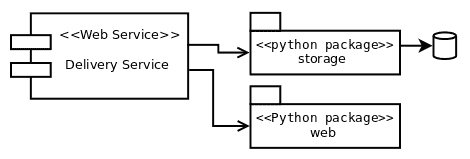

# 第十章：干净的架构

在本章的最后，我们将重点讨论如何在整个系统的设计中将所有内容整合在一起。这是一个更加理论化的章节。鉴于主题的性质，深入到更低级别的细节将会太复杂。此外，重点正是要摆脱这些细节，假设在前几章中探讨的所有原则都被吸收，并专注于大规模系统的设计。

本章的主要关注点和目标如下：

+   设计可以长期维护的软件系统

+   通过保持质量属性有效地在软件项目上工作

+   研究所有概念如何应用于代码与系统的关系

# 从干净的代码到干净的架构

本节讨论了在前几章中强调的概念在考虑大型系统方面以稍微不同的形式重新出现。有趣的是，适用于更详细设计以及代码的概念也适用于大型系统和架构。

在前几章探讨的概念与单个应用程序相关，通常是一个项目，可能是一个或几个源代码控制版本系统（git）的单个存储库。这并不是说这些设计理念只适用于代码，或者在考虑架构时没有用处，有两个原因：代码是架构的基础，如果不小心编写，系统将会失败，无论架构设计得多么周密。

其次，前几章重新讨论的一些原则不适用于代码，而是设计理念。最清晰的例子来自设计模式。它们是高层次的想法。有了这个，我们可以快速了解我们架构中的一个组件可能是什么样子，而不用深入代码的细节。

但是大型企业系统通常由许多这些应用程序组成，现在是时候开始考虑更大规模的设计，以分布式系统的形式。

在接下来的章节中，我们将讨论本书中一直讨论的主要主题，但现在是从系统的角度来看。

# 关注点分离

在一个应用程序中，有多个组件。它们的代码被划分为其他子组件，如模块或包，模块被划分为类或函数，类被划分为方法。在整本书中，重点一直是尽可能保持这些组件尽可能小，特别是在函数的情况下——函数应该只做一件事，并且要小。

提出了几个理由来证明这种推理。小函数更容易理解、遵循和调试。它们也更容易测试。我们代码中的部分越小，编写单元测试就越容易。

对于每个应用程序的组件，我们希望具有不同的特征，主要是高内聚和低耦合。通过将组件划分为更小的单元，每个单元都有一个单一且明确定义的责任，我们实现了更好的结构，使得变更更容易管理。面对新的需求，将会有一个正确的地方来进行更改，而其余的代码可能不受影响。

当我们谈论代码时，我们说“组件”来指代这些内聚单元中的一个（例如可能是一个类）。在架构方面，组件意味着系统中可以作为一个工作单元对待的任何东西。组件本身这个术语相当模糊，因此在软件架构中没有普遍接受的更具体含义的定义。工作单元的概念是可以根据项目的不同而变化的。一个组件应该能够独立于系统的其余部分发布或部署。而它恰恰是系统的一部分，即整个应用程序。

对于 Python 项目，一个组件可以是一个包，但一个服务也可以是一个组件。请注意，两个不同的概念，具有不同级别的粒度，可以被视为同一类别。举个例子，我们在前几章中使用的事件系统可以被视为一个组件。它是一个具有明确定义目的（从日志中识别事件），可以独立部署（无论是作为 Python 包，还是如果我们公开其功能，作为一个服务），它是整个系统的一部分，但不是整个应用程序本身。

在前几章的例子中，我们已经看到了惯用代码，并且也强调了对我们的代码进行良好设计的重要性，具有单一明确定义的责任的对象，被隔离、正交并且更易于维护。这个非常相同的标准，适用于详细设计（函数、类、方法），也适用于软件架构的组件。

一个大型系统只是一个组件可能是不可取的。单体应用程序将作为唯一的真相来源，负责系统中的一切，并将带来许多不希望的后果（更难以隔离和识别变化，更难以有效测试等）。同样，如果我们不小心将所有东西放在一个地方，我们的代码也将更难以维护，如果其组件没有受到同等级别的关注，应用程序也将遭受类似的问题。

在系统中创建具有内聚力的组件的想法可能有多种实现方式，这取决于我们需要的抽象级别。

一个选择是识别可能多次重用的常见逻辑，并将其放在一个 Python 包中（我们将在本章后面讨论细节）。

另一种选择是将应用程序分解为多个较小的服务，采用微服务架构。这个想法是通过使这些服务合作和交换信息，实现具有单一和明确定义责任的组件，并通过这些服务实现与单体应用程序相同的功能。

# 抽象

这就是封装再次出现的地方。从我们的系统（就像我们在与代码相关的情况下一样），我们希望用领域问题的术语来交流，并尽可能隐藏实现细节。

就像代码必须表达（几乎到了自我记录的程度），并具有揭示基本问题解决方案的正确抽象（最小化偶发复杂性）一样，架构应该告诉我们系统的内容。诸如用于将数据持久化到磁盘的解决方案、首选的 Web 框架、用于连接到外部代理的库以及系统之间的交互等细节都不重要。重要的是系统的功能。像尖叫架构（SCREAM）这样的概念反映了这个想法。

**依赖反转原则**（**DIP**），在第四章中解释的* SOLID 原则*，在这方面非常有帮助；我们不想依赖具体的实现，而是依赖抽象。在代码中，我们将抽象（或接口）放在边界上，依赖关系上，即应用程序的那些我们无法控制并且可能在未来发生变化的部分。我们这样做是因为我们想要反转依赖。让它们适应我们的代码（通过必须遵守一个接口），而不是相反。

创建抽象和反转依赖是良好的实践，但这还不够。我们希望整个应用程序独立并与我们无法控制的事物隔离。这甚至比仅仅使用对象进行抽象更重要——我们需要层层抽象。

这与详细设计有一个微妙但重要的区别。在 DIP 中，建议创建一个接口，可以使用标准库中的`abc`模块来实现。因为 Python 使用鸭子类型，虽然使用抽象类可能有所帮助，但并不是强制性的，因为只要它们符合所需的接口，我们可以很容易地用常规对象实现相同的效果。Python 的动态类型特性使我们能够有这些替代方案。在架构方面思考时，没有这样的东西。正如例子中将变得更加清晰的那样，我们需要完全抽象依赖关系，没有 Python 的特性可以为我们做到这一点。

有人可能会争论“ORM 是数据库的一个很好的抽象，不是吗？”这还不够。ORM 本身是一个依赖项，因此超出了我们的控制。最好创建一个中间层，一个适配器，介于 ORM 的 API 和我们的应用程序之间。

这意味着我们不仅仅用 ORM 来抽象数据库；我们使用我们在其上创建的抽象层，来定义属于我们领域的自己的对象。

然后应用程序导入这个组件，并使用这个层提供的实体，但不是反过来。抽象层不应该了解我们应用程序的逻辑；更确切地说，数据库不应该了解应用程序本身。如果是这样的话，数据库将与我们的应用程序耦合。目标是反转依赖关系——这个层提供一个 API，每个想要连接的存储组件都必须符合这个 API。这就是六边形架构的概念（HEX）。

# 软件组件

现在我们有一个庞大的系统，我们需要扩展它。它还必须是可维护的。此时的关注点不仅仅是技术上的，还包括组织上的。这意味着不仅仅是管理软件存储库；每个存储库很可能都属于一个应用程序，并且将由拥有该系统部分的团队维护。

这要求我们牢记一个大型系统是如何划分为不同组件的。这可以有许多阶段，从一个非常简单的方法，比如创建 Python 包，到微服务架构中的更复杂场景。

当涉及到不同的语言时，情况可能会更加复杂，但在本章中，我们将假设它们都是 Python 项目。

这些组件需要互相交互，团队也是如此。这在规模上能够起作用的唯一方式是，所有部分都同意一个接口，一个契约。

# 包

Python 包是一种方便的方式来分发软件并以更一般的方式重用代码。已构建的包可以发布到存储库（例如公司的内部 PyPi 服务器），其他需要它的应用程序将从中下载。

这种方法背后的动机有许多元素——它是关于在大范围内重用代码，并实现概念上的一致性。

在这里，我们讨论了打包 Python 项目的基础知识，这些项目可以发布到存储库中。默认存储库可能是 PyPi（[`pypi.org/`](https://pypi.org/)），但也可以是内部的；或者自定义设置将使用相同的基础知识。

我们将模拟我们创建了一个小型图书馆，并将其用作示例来审查需要考虑的主要要点。

除了所有可用的开源库之外，有时我们可能需要一些额外的功能——也许我们的应用程序重复使用特定习惯用语，或者严重依赖某个函数或机制，团队已经为这些特定需求设计了更好的函数。为了更有效地工作，我们可以将这种抽象放入一个库中，并鼓励所有团队成员使用它提供的习惯用语，因为这样做将有助于避免错误并减少错误。

潜在地，有无数的例子可以适用于这种情况。也许应用程序需要提取许多`.tag.gz`文件（以特定格式）并且在过去面临过恶意文件导致路径遍历攻击的安全问题。作为缓解措施，将安全地抽象自定义文件格式的功能放入一个库中，该库包装了默认库并添加了一些额外的检查。这听起来是个好主意。

或者可能有一个必须以特定格式编写或解析的配置文件，并且这需要按顺序遵循许多步骤；同样，创建一个帮助函数来包装这个，并在所有需要它的项目中使用它，不仅是一个很好的投资，因为它节省了大量的代码重复，而且因为它使错误更难发生。

收益不仅在于遵守 DRY 原则（避免代码重复，鼓励重用），而且抽象的功能代表了如何应该做事情的单一参考点，从而有助于实现概念完整性。

一般来说，库的最小布局如下：

```py
.
├── Makefile
├── README.rst
├── setup.py
├── src
│   └── apptool
│   ├── common.py
│   ├── __init__.py
│   └── parse.py
└── tests
    ├── integration
    └── unit
```

重要的部分是`setup.py`文件，其中包含了项目的定义。在这个文件中，指定了项目的所有重要定义（其要求、依赖关系、名称、描述等）。

`src`目录下的`apptool`目录是我们正在开发的库的名称。这是一个典型的 Python 项目，所以我们在这里放置所有需要的文件。

`setup.py`文件的一个例子可能是：

```py
from setuptools import find_packages, setup

with open("README.rst", "r") as longdesc:
    long_description = longdesc.read()

setup(
    name="apptool",
    description="Description of the intention of the package",
    long_description=long_description,
    author="Dev team",
    version="0.1.0",
    packages=find_packages(where="src/"),
    package_dir={"": "src"},
)
```

这个最小的例子包含了项目的关键元素。`setup`函数中的`name`参数用于给包在存储库中的名称（在这个名称下，我们运行安装命令，这种情况下是`pip install apptool`*）。*它不是严格要求与项目目录的名称匹配（`src/apptool`），但强烈建议这样做，这样对用户来说更容易。

在这种情况下，由于两个名称匹配，更容易看到`pip install apptool`和在我们的代码中运行`from apptool import myutil`之间的关系。但后者对应于`src/`目录下的名称，前者对应于`setup.py`文件中指定的名称。

版本对于保持不同的发布很重要，然后指定包。通过使用`find_packages()`函数，我们自动发现所有的包，这种情况下是在`src/`目录下。在这个目录下搜索有助于避免混淆项目范围之外的文件，例如意外发布测试或项目的破损结构。

通过运行以下命令构建包，假设其在已安装依赖项的虚拟环境中运行：

```py
$VIRTUAL_ENV/bin/pip install -U setuptools wheel
$VIRTUAL_ENV/bin/python setup.py sdist bdist_wheel
```

这将把构件放在`dist/`目录中，从那里它们可以稍后发布到 PyPi 或公司的内部包存储库。

打包 Python 项目的关键点是：

+   测试和验证安装是否与平台无关，并且不依赖于任何本地设置（可以通过将源文件放置在`src/`目录下来实现）

+   确保单元测试不作为构建的一部分进行发布

+   分离依赖——项目严格需要运行的内容与开发人员需要的内容不同

+   为即将需要的命令创建入口点是个好主意

`setup.py`文件支持多个其他参数和配置，并且可以以更复杂的方式生效。如果我们的包需要安装多个操作系统库，最好在`setup.py`文件中编写一些逻辑来编译和构建所需的扩展。这样，如果出现问题，它将在安装过程的早期失败，如果包提供了有用的错误消息，用户将能够更快地修复依赖项并继续。

安装这些依赖项代表着另一个困难的步骤，使得应用程序无处不在，并且可以在任何开发人员选择的平台上轻松运行。克服这一障碍的最佳方法是通过创建一个 Docker 镜像来抽象平台，这将在下一节中讨论。

# 容器

本章专门讨论架构，因此容器这个术语与 Python 容器（具有`__contains__`方法的对象）完全不同，这在第二章“Pythonic Code”中有所探讨。容器是在操作系统中以一组特定限制和隔离考虑运行的进程。具体来说，我们指的是 Docker 容器，它允许将应用程序（服务或进程）作为独立组件进行管理。

容器代表了另一种交付软件的方式。根据上一节中的考虑创建 Python 包更适合于库或框架，其中的目标是重用代码并利用一个特定逻辑被收集到一个地方。

在容器的情况下，目标不是创建库，而是应用程序（大部分情况下）。然而，应用程序或平台并不一定意味着整个服务。构建容器的想法是创建代表具有小而清晰目的的服务的小组件。

在本节中，当我们谈论容器时，我们将提到 Docker，并且将探讨如何为 Python 项目创建 Docker 镜像和容器的基础知识。请记住，这不是将应用程序部署到容器中的唯一技术，而且它完全独立于 Python。

Docker 容器需要一个镜像来运行，这个镜像是从其他基础镜像创建的。但是我们创建的镜像本身可以作为其他容器的基础镜像。在我们的应用程序中存在一个通用基础的情况下，我们将希望这样做，这个通用基础可以在许多容器之间共享。一个潜在的用途是创建一个基础镜像，以我们在上一节中描述的方式安装一个包（或多个包），以及所有的依赖项，包括操作系统级别的依赖项。正如在第九章“Common Design Patterns”中讨论的那样，我们创建的一个包不仅可以依赖于其他 Python 库，还可以依赖于特定平台（特定操作系统）和在该操作系统中预安装的特定库，如果没有这些库，包将无法安装并且会失败。

容器对此是一个很好的可移植性工具。它们可以帮助我们确保我们的应用程序将有一个规范的运行方式，并且也会极大地简化开发过程（在不同环境中复制场景，复制测试，新团队成员入职等）。

由于包是我们重用代码和统一标准的方式，容器代表了我们创建应用程序的不同服务的方式。它们符合架构的**关注点分离**（**SoC**）原则背后的标准。每个服务都是另一种独立封装一组功能的组件，与应用程序的其余部分无关。这些容器应该被设计成有利于可维护性——如果责任被清晰划分，对服务的更改不应该对应用程序的任何其他部分产生影响。

我们将在下一节中介绍如何从 Python 项目创建 Docker 容器的基础知识。

# 用例

作为我们如何组织应用程序组件以及之前的概念如何在实践中工作的示例，我们提供以下简单示例。

用例是有一个用于交付食物的应用程序，这个应用程序有一个特定的服务，用于跟踪每个交付在不同阶段的状态。我们将只关注这个特定的服务，而不管应用程序的其余部分是什么样子。这个服务必须非常简单——一个 REST API，当询问特定订单的状态时，将返回一个带有描述性消息的 JSON 响应。

我们假设每个特定订单的信息都存储在数据库中，但这个细节根本不重要。

我们的服务目前有两个主要关注点：获取特定订单的信息（无论这些信息存储在何处），并以对客户有用的方式呈现这些信息（在这种情况下，以 JSON 格式呈现结果，作为 Web 服务公开）。

由于应用程序必须是可维护和可扩展的，我们希望尽可能隐藏这两个关注点，并专注于主要逻辑。因此，这两个细节被抽象和封装到 Python 包中，主应用程序与核心逻辑将使用这些包，如下图所示：



在接下来的几节中，我们将简要演示代码可能的外观，主要是包方面，以及如何从中创建服务，最终看看我们能得出什么结论。

# 代码

在这个例子中创建 Python 包的想法是为了说明如何有效地制作抽象和隔离的组件。实际上，这些不需要是 Python 包；我们可以将正确的抽象作为“交付服务”项目的一部分创建，而且在保持正确的隔离的同时，它将可以正常工作。

创建包在逻辑需要重复使用并且预计会被许多其他应用程序使用时更有意义（这些应用程序将从这些包中导入），因为我们希望倾向于代码重用。在这种特殊情况下，没有这样的要求，所以这可能超出了设计的范围，但这种区别仍然更清晰地表明了“可插拔架构”或组件的概念，这是一个真正的封装，抽象了我们不想处理的技术细节，更不要依赖于它。

`storage`包负责检索所需的数据，并以方便的格式呈现给下一层（交付服务），这对业务规则是合适的。主应用现在不应该知道这些数据来自哪里，它的格式是什么，等等。这就是为什么我们在应用程序之间有这样一个抽象的原因，这样应用程序就不会直接使用行或 ORM 实体，而是使用一些可操作的东西。

# 领域模型

以下定义适用于业务规则的类。请注意，它们旨在成为纯业务对象，不与任何特定内容绑定。它们不是 ORM 的模型，也不是外部框架的对象等等。应用程序应该使用这些对象（或具有相同标准的对象）。

在每种情况下，文档字符串都记录了每个类的目的，根据业务规则：

```py
from typing import Union

class DispatchedOrder:
    """An order that was just created and notified to start its delivery."""

    status = "dispatched"

    def __init__(self, when):
        self._when = when

    def message(self) -> dict:
        return {
            "status": self.status,
            "msg": "Order was dispatched on {0}".format(
                self._when.isoformat()
            ),
        }

class OrderInTransit:
    """An order that is currently being sent to the customer."""

    status = "in transit"

    def __init__(self, current_location):
        self._current_location = current_location

    def message(self) -> dict:
        return {
            "status": self.status,
            "msg": "The order is in progress (current location: {})".format(
                self._current_location
            ),
        }

class OrderDelivered:
    """An order that was already delivered to the customer."""

    status = "delivered"

    def __init__(self, delivered_at):
        self._delivered_at = delivered_at

    def message(self) -> dict:
        return {
            "status": self.status,
            "msg": "Order delivered on {0}".format(
                self._delivered_at.isoformat()
            ),
        }

class DeliveryOrder:
    def __init__(
        self,
        delivery_id: str,
        status: Union[DispatchedOrder, OrderInTransit, OrderDelivered],
    ) -> None:
        self._delivery_id = delivery_id
        self._status = status

    def message(self) -> dict:
        return {"id": self._delivery_id, **self._status.message()}
```

从这段代码中，我们已经可以想象应用程序的样子了——我们想要有一个`DeliveryOrder`对象，它将有自己的状态（作为内部协作者），一旦我们有了这个对象，我们将调用它的`message()`方法将这些信息返回给用户。

# 从应用程序调用

这些对象将如何在应用程序中使用。请注意，这取决于先前的包（`web`和`storage`），但反之则不然：

```py
from storage import DBClient, DeliveryStatusQuery, OrderNotFoundError
from web import NotFound, View, app, register_route

class DeliveryView(View):
    async def _get(self, request, delivery_id: int):
        dsq = DeliveryStatusQuery(int(delivery_id), await DBClient())
        try
            result = await dsq.get()
        except OrderNotFoundError as e:
             raise NotFound(str(e)) from e

        return result.message()

register_route(DeliveryView, "/status/<delivery_id:int>")
```

在前一节中，展示了`domain`对象，这里显示了应用程序的代码。我们是不是漏掉了什么？当然，但这是我们现在真的需要知道的吗？不一定。

`storage`和`web`包中的代码故意被省略了（尽管鼓励读者查看——本书的存储库包含完整的示例）。同样，这是故意的，这些包的名称被选择为不透露任何技术细节——`storage`和`web`。

再次看一下前面清单中的代码。你能告诉使用了哪些框架吗？它是否说明了数据来自文本文件、数据库（如果是的话，是什么类型的？SQL？NoSQL？）或另一个服务（例如网络）？假设它来自关系数据库。有没有线索表明这些信息是如何检索的（手动 SQL 查询？通过 ORM？）？

网络呢？我们能猜出使用了哪些框架吗？

我们无法回答这些问题可能是一个好迹象。这些都是细节，细节应该被封装。除非我们查看这些包中的内容，否则我们无法回答这些问题。

回答上述问题的另一种方法是以问题的形式提出：我们为什么需要知道这个？从代码中，我们可以看到有一个`DeliveryOrder`，使用交付的标识符创建，它有一个`get()`方法，返回表示交付状态的对象。如果所有这些信息都是正确的，那就是我们应该关心的。它是如何完成的有什么区别呢？

我们创建的抽象使我们的代码具有声明性。在声明性编程中，我们声明要解决的问题，而不是如何解决它。这与命令式相反，在命令式中，我们必须明确地执行所有必需的步骤才能获得某些东西（例如连接到数据库，运行此查询，解析结果，将其加载到此对象中等等）。在这种情况下，我们声明只想知道给定某个标识符的交付状态。

这些包负责处理细节，并以方便的格式呈现应用程序需要的内容，即在上一节中呈现的对象。我们只需要知道`storage`包含一个对象，给定交付 ID 和存储客户端（这个依赖项被注入到这个示例中以简化，但也有其他可能的选择），它将检索`DeliveryOrder`，然后我们可以要求它组成消息。

这种架构提供了便利，并使其更容易适应变化，因为它保护了业务逻辑的核心，使其不受可能发生变化的外部因素的影响。

想象一下，我们想要改变信息的检索方式。这有多难？应用程序依赖于一个 API，就像下面这样：

```py
dsq = DeliveryStatusQuery(int(delivery_id), await DBClient())
```

因此，只需更改`get()`方法的工作方式，将其适应新的实现细节。我们只需要让这个新对象在其`get()`方法上返回`DeliveryOrder`，就可以了。我们可以更改查询、ORM、数据库等等，在所有情况下，应用程序中的代码都不需要更改！

# 适配器

尽管没有查看包中的代码，我们可以得出结论，它们作为应用程序的技术细节的接口。

实际上，由于我们是从高层次的角度来看待应用程序，而不需要查看代码，我们可以想象这些包中必须有适配器设计模式的实现（在第九章中介绍，*常见设计模式*）。其中一个或多个对象正在将外部实现适配到应用程序定义的 API。这样，想要与应用程序一起工作的依赖项必须符合 API，并且必须制作一个适配器。

不过，在应用程序的代码中有一个关于适配器的线索。注意视图是如何构建的。它继承自一个名为`View`的类，该类来自我们的`web`包。我们可以推断，这个`View`又是从可能正在使用的一个 web 框架派生出来的类，通过继承创建了一个适配器。需要注意的是，一旦这样做了，唯一重要的对象就是我们的`View`类，因为在某种程度上，我们正在创建我们自己的框架，这是基于对现有框架进行适配（但再次更改框架只意味着更改适配器，而不是整个应用程序）。

# 服务

为了创建服务，我们将在 Docker 容器中启动 Python 应用程序。从基础镜像开始，容器将安装应用程序运行所需的依赖项，这些依赖项也存在于操作系统级别。

这实际上是一个选择，因为它取决于依赖项的使用方式。如果我们使用的一个软件包在安装时需要在操作系统上编译其他库，我们可以通过为我们的平台构建该库的 wheel 并直接安装它来避免这一点。如果这些库在运行时需要，那么除了将它们作为容器镜像的一部分之外别无选择。

现在，我们讨论准备 Python 应用程序在 Docker 容器中运行的众多方法之一。这是将 Python 项目打包到容器中的众多替代方案之一。首先，让我们看一下目录结构是什么样子的：

```py
.
├── Dockerfile
├── libs
│   ├── README.rst
│   ├── storage
│   └── web
├── Makefile
├── README.rst
├── setup.py
└── statusweb
    ├── __init__.py
    └── service.py
```

`libs`目录可以忽略，因为它只是放置依赖项的地方（这里显示出来是为了在`setup.py`文件中引用它们时记住它们，但它们可以放在不同的存储库中，并通过`pip`远程安装）。

我们有一个`Makefile`，其中包含一些辅助命令，然后是`setup.py`文件，以及`statusweb`目录中的应用程序本身。打包应用程序和库之间的一个常见区别是，后者在`setup.py`文件中指定它们的依赖关系，而前者有一个`requirements.txt`文件，依赖关系通过`pip install -r requirements.txt`安装。通常情况下，我们会在`Dockerfile`中执行这些操作，但是为了在这个特定的例子中保持简单，我们将假设从`setup.py`文件中获取依赖关系就足够了。这是因为除了这一考虑因素之外，在处理依赖关系时还有很多其他考虑因素，比如冻结软件包的版本、跟踪间接依赖关系、使用额外的工具如`pipenv`，以及本章节范围之外的更多主题。此外，为了保持一致，通常也习惯让`setup.py`文件从`requirements.txt`中读取。

现在我们有了`setup.py`文件的内容，其中说明了应用程序的一些细节：

```py
from setuptools import find_packages, setup

with open("README.rst", "r") as longdesc:
    long_description = longdesc.read()

install_requires = ["web", "storage"]

setup(
    name="delistatus",
    description="Check the status of a delivery order",
    long_description=long_description,
    author="Dev team",
    version="0.1.0",
    packages=find_packages(),
    install_requires=install_requires,
    entry_points={
        "console_scripts": [
            "status-service = statusweb.service:main",
        ],
    },
)
```

我们注意到的第一件事是应用程序声明了它的依赖项，这些依赖项是我们在`libs/`下创建并放置的包，即`web`和`storage`，对一些外部组件进行了抽象和适应。这些包反过来又会有依赖项，因此我们必须确保容器在创建镜像时安装所有所需的库，以便它们可以成功安装，然后再安装这个包。

我们注意到的第二件事是传递给`setup`函数的`entry_points`关键字参数的定义。这并不是严格必需的，但创建一个入口点是个好主意。当包安装在虚拟环境中时，它与所有的依赖项共享这个目录。虚拟环境是一个具有给定项目的依赖项的目录结构。它有许多子目录，但最重要的是：

+   `<virtual-env-root>/lib/<python-version>/site-packages`

+   `<virtual-env-root>/bin`

第一个包含了在该虚拟环境中安装的所有库。如果我们要为这个项目创建一个虚拟环境，那么该目录将包含`web`和`storage`包，以及它们的所有依赖项，再加上一些额外的基本依赖项和当前项目本身。

第二个`/bin/`包含了当虚拟环境处于活动状态时可用的二进制文件和命令。默认情况下，它只是 Python 的版本、`pip`和一些其他基本命令。当我们创建一个入口点时，一个具有声明名称的二进制文件将被放置在那里，结果就是当环境处于活动状态时，我们可以运行该命令。当调用此命令时，它将运行指定的函数，并且具有虚拟环境的所有上下文。这意味着它是一个可以直接调用的二进制文件，而无需担心虚拟环境是否处于活动状态，或者当前运行的路径中是否安装了依赖项。

定义如下：

```py
"status-service = statusweb.service:main"
```

等号左边声明了入口点的名称。在这种情况下，我们将有一个名为`status-service`的命令可用。右边声明了该命令应该如何运行。它需要包含函数定义的包，后面跟着`:`和函数名。在这种情况下，它将运行`statusweb/service.py`中声明的`main`函数。

接下来是 Dockerfile 的定义：

```py
FROM python:3.6.6-alpine3.6

RUN apk add --update \
    python-dev \
    gcc \
    musl-dev \
    make

WORKDIR /app
ADD . /app

RUN pip install /app/libs/web /app/libs/storage
RUN pip install /app

EXPOSE 8080
CMD ["/usr/local/bin/status-service"]
```

该镜像是基于轻量级的 Python 镜像构建的，然后安装操作系统依赖项，以便我们可以安装我们的库。根据之前的考虑，这个`Dockerfile`只是简单地复制了库，但这也可以根据`requirements.txt`文件进行安装。在所有`pip install`命令准备好之后，它将应用程序复制到工作目录中，并且 Docker 的入口点（`CMD`命令，不要与 Python 混淆）调用了我们放置了启动进程的函数的包的入口点。

所有的配置都是通过环境变量传递的，因此我们的服务代码必须符合这个规范。

在涉及更多服务和依赖项的更复杂场景中，我们不仅仅会运行创建的容器的镜像，而是会声明一个`docker-compose.yml`文件，其中包含所有服务、基础镜像的定义，以及它们是如何链接和相互连接的。

现在我们已经运行了容器，我们可以启动它并对其进行小型测试，以了解其工作原理：

```py
$ curl http://localhost:8080/status/1
{"id":1,"status":"dispatched","msg":"Order was dispatched on 2018-08-01T22:25:12+00:00"}
```

# 分析

从先前的实现中可以得出许多结论。虽然这可能看起来是一个不错的方法，但好处也伴随着一些缺点；毕竟，没有架构或实现是完美的。这意味着这样的解决方案并不适用于所有情况，因此它在很大程度上取决于项目、团队、组织等的情况。

虽然解决方案的主要思想是尽可能抽象细节，但正如我们将看到的，有些部分无法完全抽象化，而且层之间的合同暗示了一个抽象泄漏。

# 依赖流

请注意，依赖关系只朝一个方向流动，因为它们越接近内核，业务规则就越明显。这可以通过查看`import`语句来追踪。例如，应用程序从存储中导入它所需的一切，在任何地方都没有倒置。

违反这个规则会导致耦合。现在代码的排列方式意味着应用程序和存储之间存在着弱依赖关系。API 的设计要求我们需要一个具有`get()`方法的对象，任何想要连接到应用程序的存储都需要根据这个规范实现这个对象。因此，依赖关系被倒置了——每个存储都需要实现这个接口，以便根据应用程序的期望创建一个对象。

# 限制

并非所有东西都可以被抽象化。在某些情况下，这根本不可能，而在其他情况下，可能也不方便。让我们从方便的角度开始。

在这个例子中，有一个将 Web 框架适配到一个干净的 API 以供应用程序使用的适配器。在更复杂的情况下，这样的变化可能是不可能的。即使有这种抽象，库的部分仍然对应用程序可见。适应整个框架可能不仅困难，而且在某些情况下也是不可能的。完全与 Web 框架隔离并不完全是一个问题，因为迟早我们会需要一些它的功能或技术细节。

这里的重要观点不是适配器，而是尽可能隐藏技术细节的想法。这意味着在应用程序代码的列表中显示的最好的东西不是我们的 Web 框架版本和实际框架之间有一个适配器，而是后者在可见代码的任何部分都没有被提及。服务清楚地表明了`web`只是一个依赖项（一个被导入的细节），并揭示了它应该做什么的意图。目标是揭示意图（如代码中所示）并尽可能推迟细节。

至于不能被隔离的东西，那些最接近代码的元素。在这种情况下，Web 应用程序以异步方式使用其中的对象。这是一个我们无法规避的硬性约束。在`storage`包中的任何东西都可以更改、重构和修改，但无论这些修改是什么，它仍然需要保留接口，包括异步接口。

# 可测试性

与代码类似，架构也可以从将部分分离为更小的组件中受益。现在依赖关系被隔离并由独立的组件控制，这为主应用程序提供了更清晰的设计，现在更容易忽略边界，专注于测试应用程序的核心。

我们可以为依赖关系创建一个补丁，并编写更简单的单元测试（它们不需要数据库），或者启动整个网络服务，例如。使用纯粹的`domain`对象意味着更容易理解代码和单元测试。甚至适配器也不需要太多的测试，因为它们的逻辑应该非常简单。

# 意图揭示

这些细节包括保持函数简短，分离关注点，隔离依赖关系，并在代码的每个部分中为抽象赋予正确的含义。意图的揭示对我们的代码来说是一个关键概念——每个名称都必须明智地选择，清晰地传达它应该做的事情。每个函数都应该讲述一个故事。

一个良好的架构应该揭示系统的意图。它不应该提到它所构建的工具；那些都是细节，正如我们长时间讨论的，细节应该被隐藏，封装起来。

# 摘要

良好软件设计的原则适用于所有层面。就像我们想要编写可读的代码一样，为此我们需要关注代码的意图揭示程度，架构也必须表达它试图解决的问题的意图。

所有这些想法都是相互关联的。相同的意图揭示确保我们的架构是根据领域问题来定义的，同时也导致我们尽可能地抽象细节，创建抽象层，倒置依赖关系，以及分离关注点。

在重用代码方面，Python 包是一个很好且灵活的选择。在决定创建包时，诸如内聚性和**单一责任原则**（**SRP**）之类的标准是最重要的考虑因素。与具有内聚性和少责任的组件一致，微服务的概念也开始发挥作用，为此，我们已经看到了如何从打包的 Python 应用程序开始，在 Docker 容器中部署服务。

与软件工程中的一切一样，都存在局限性和例外。我们并不总是能够像我们希望的那样抽象事物，或者完全隔离依赖关系。有时，遵循本书中解释的原则可能是不可能的（或不切实际的）。但这可能是读者应该从本书中得到的最好建议——它们只是原则，而不是法律。如果从框架中抽象出来是不可能的或不切实际的，那也不应该成为问题。请记住本书中引用的 Python 禅宗本身所说的话——**实用性胜过纯粹*****。***

# 参考资料

以下是您可以参考的信息列表：

+   *SCREAM*: 尖叫架构 ([`8thlight.com/blog/uncle-bob/2011/09/30/Screaming-Architecture.html`](https://8thlight.com/blog/uncle-bob/2011/09/30/Screaming-Architecture.html))

+   *CLEAN-01*: 清洁架构 ([`8thlight.com/blog/uncle-bob/2012/08/13/the-clean-architecture.html`](https://8thlight.com/blog/uncle-bob/2012/08/13/the-clean-architecture.html))

+   *HEX*: 六边形架构 ([`staging.cockburn.us/hexagonal-architecture/`](https://staging.cockburn.us/hexagonal-architecture/))

+   *PEP-508*: Python 软件包的依赖规范 ([`www.python.org/dev/peps/pep-0508/`](https://www.python.org/dev/peps/pep-0508/))

+   在 Python 中打包和分发项目 ([`python-packaging-user-guide.readthedocs.io/guides/distributing-packages-using-setuptools/#distributing-packages`](https://python-packaging-user-guide.readthedocs.io/guides/distributing-packages-using-setuptools/#distributing-packages)

# 总结一切

这本书的内容是一个参考，是通过遵循标准来实现软件解决方案的一种可能方式。这些标准是通过示例来解释的，并且为每个决定提出了理由。读者可能会对示例中采取的方法持不同意见，这实际上是可取的：观点越多，辩论就越丰富。但不管观点如何，重要的是要明确，这里呈现的内容绝不是一种强有力的指令，也不是必须坚决遵循的东西。恰恰相反，它是一种向读者呈现解决方案和一套可能有用的想法的方式。

正如在书的开头介绍的那样，这本书的目标不是给你提供可以直接应用的配方或公式，而是让你发展批判性思维。习语和句法特点会随着时间而改变。但是想法和核心软件概念是不变的。有了这些工具和提供的例子，你应该对清晰的代码意味着什么有更好的理解。

我真诚地希望这本书能帮助你成为比开始阅读之前更好的开发者，祝你在项目中好运。
