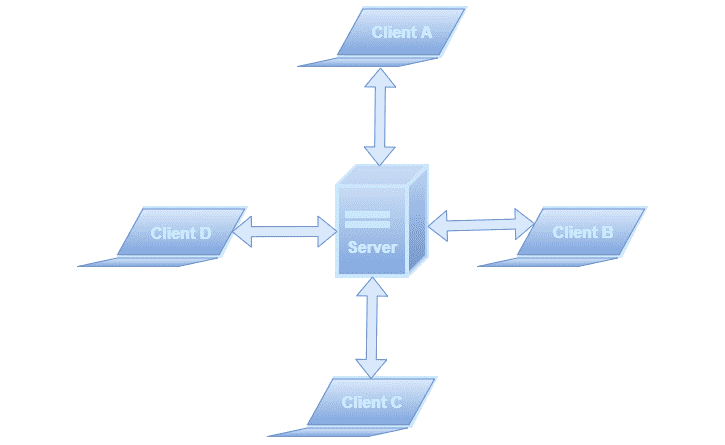
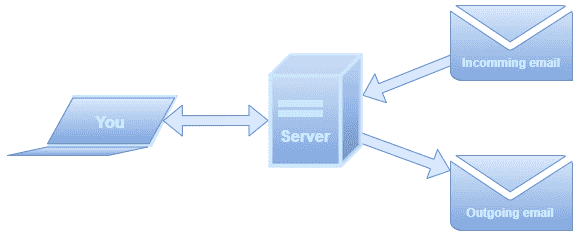
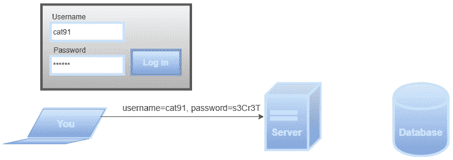
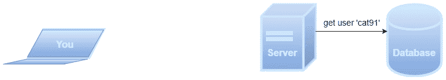
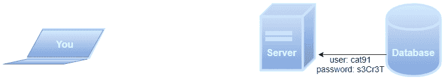
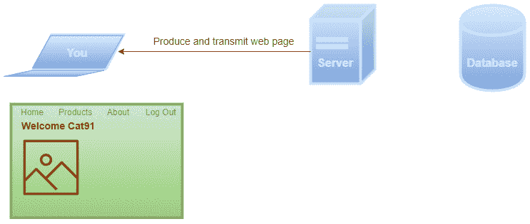
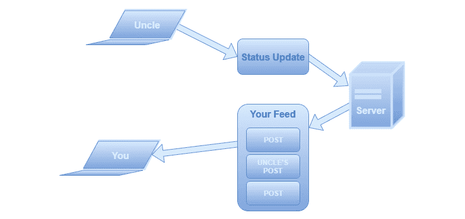
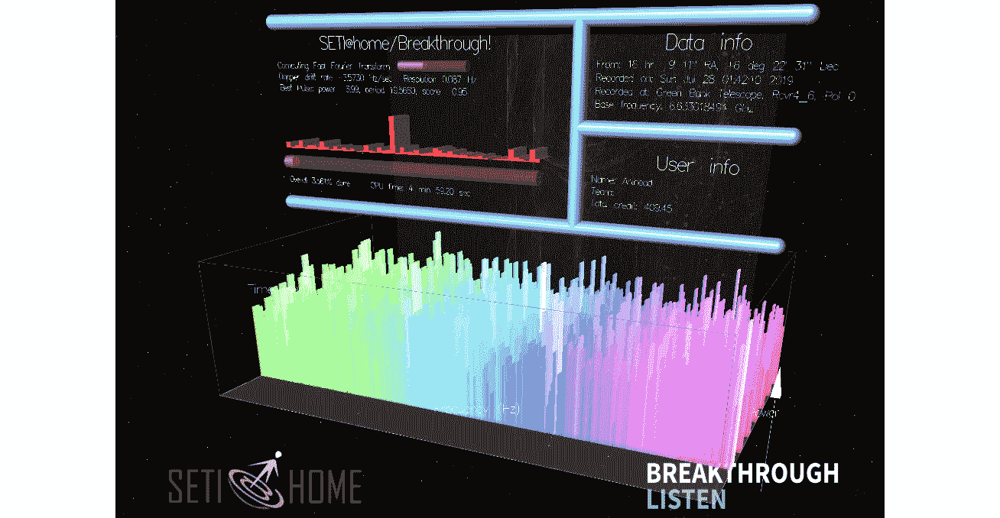
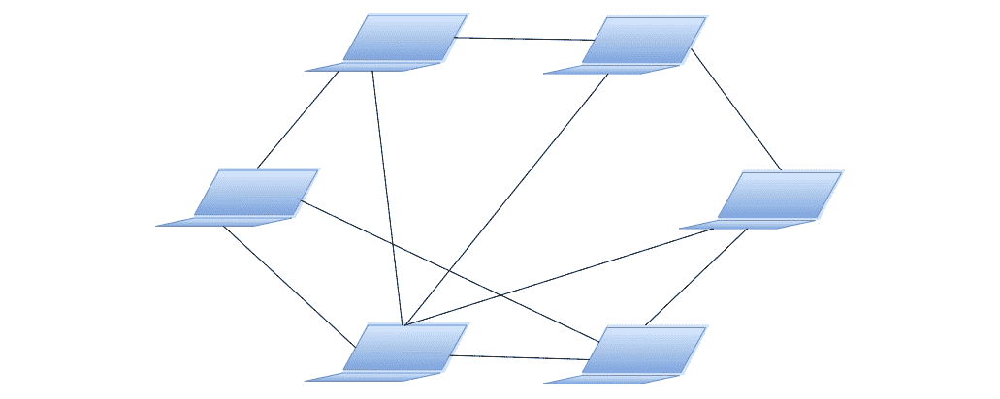
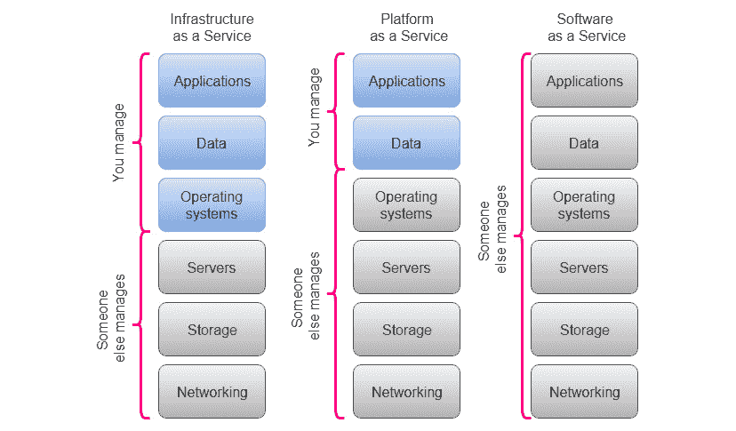

# 第三章：*第三章：应用程序类型*

计算机程序，或者我们有时称之为应用程序，有多种类型。每种类型都解决一种特殊的问题。一些应用程序，如纸牌游戏或文字处理器，仅在本地计算机上运行，而其他应用程序则需要与其他计算机或网络通信才能工作，如网页浏览器或电子邮件客户端。

在本章中，我们将探讨一些特殊类型的应用程序，并讨论在创建它们时我们需要考虑哪些因素。

由于应用程序种类繁多，我们不可能涵盖所有类型。相反，我们将查看一些我们在编写应用程序时可能会遇到的一些常见类型。

我们创建程序是为了解决问题，在设计我们的应用程序并决定它需要做什么的过程中，我们经常会查看他人为类似问题找到的解决方案。本章的目标是使你熟悉这些解决方案中的一些，以便你可以在未来需要创建自己的解决方案时，识别出它们解决的问题。

到本章结束时，你将能够做到以下几点：

+   理解本章涵盖的不同类型应用程序的典型特征

+   理解应用程序类型如何影响我们构建应用程序的方式

+   理解连接型应用程序的重要性

+   理解使用基于云的解决方案的好处

+   理解我们讨论的不同类型的应用程序可以解决的问题

# 独立应用程序

独立应用程序是一种可以离线工作的程序，也就是说，它不一定需要网络连接。因此，在编写此类应用程序时，我们需要提供程序所需的所有资源。这些资源可以是图像，例如应用程序中使用的图标，存储程序配置的文件等等。

在学习编写应用程序时，你的大部分程序可能会落入这个类别。创建这些应用程序通常相当直接，因为我们不需要与其他程序交互。

属于这一类别的程序示例包括 Windows 上的记事本或 Mac 上的 TextEdit 这样的文本编辑器，简单的游戏如纸牌游戏，以及绘图程序。

# 客户端-服务器应用程序

客户端-服务器模型是我们可以使用来创建分布式应用程序的模型，这些应用程序在多台机器上运行。

客户端-服务器模型背后的理念是我们至少有两台计算机参与。一台充当服务器，其余的都扮演客户端的角色。客户端和服务器需要相互通信。总是客户端首先发起通信。有时服务器会同时与多个客户端通信；有时服务器一次只与一个客户端通信。

这意味着我们可以使用不同的电脑来处理应用程序责任的不同部分。我们可以让一台电脑处理问题的一个方面，而另一台电脑处理同一个问题的另一个方面。然后这两台电脑需要将它们的结果进行沟通，通常发送到一台电脑，这台电脑然后将不同的结果组合成一个解决方案。

当我们为应用程序的不同部分有不同的角色时，我们也可以使用这个模型。例如，我们有一个角色是用来向用户显示数据和获取输入（用户交互），另一个角色是用来处理和存储这些数据。我们可以将这些角色分开，让处理和存储的角色由一台电脑完成，而用户交互的角色由另一台电脑完成。

图 3.1 – 连接到多个客户端的服务器

为了说明这一点，让我们考虑几个我们会使用客户端-服务器解决方案的场景，并看看解决方案会是什么。

## 聊天应用的示例

假设你想创建一个应用程序，你和你朋友们可以在其中互相聊天。所有将使用这个聊天应用的人都需要**客户端软件**；这是我们想要聊天时启动的程序。

当我们开始思考如何设计这个应用程序时，我们将面临我们的第一个问题。想象一下，你启动聊天应用是因为你想和你的朋友爱丽丝聊天。我们的应用需要连接到爱丽丝的电脑，运行她的程序版本。你和爱丽丝都将运行相同的程序，但它们如何连接？我们的应用如何在所有连接到互联网的电脑中找到爱丽丝的电脑？这就像你想给爱丽丝打电话，但没有她的电话号码一样。我们的聊天应用将是我们的电话，爱丽丝的客户端将是她的电话。你不能随意输入一个号码，希望联系到爱丽丝。

图 3.2 – 当你想聊天时，如何找到爱丽丝的电脑？

一个 IP 地址（**IP**是**互联网协议**的缩写，是更大协议栈 TCP/IP 的一部分，该协议栈描述了计算机如何在互联网上通信）标识了所有连接到互联网的计算机和其他设备。我们可以把这个地址看作是一个电话号码。这个号码可以唯一地识别世界上任何地方的电话。IP 地址也是一样；它可以唯一地识别任何连接到互联网的设备。

问题在于，我们如何知道爱丽丝的计算机的地址？即使我们知道它是什么，我们也必须理解它可能会改变。如果她连接到她的家庭 Wi-Fi 网络，她将有一个 IP 地址，但如果她带着她的计算机去市中心的一家咖啡馆并连接到他们的 Wi-Fi 网络，她将得到另一个 IP 地址。这是因为当连接到 Wi-Fi 网络时，是网络路由器为您的计算机分配 IP 地址。

一个更好的解决方案是，如果所有客户端都连接到一个始终具有相同地址的计算机。这将是我们`company.com`比 IP 地址更容易记住。

图 3.3 – 使用服务器来处理你与爱丽丝之间的通信

如果有超过两个用户连接到服务器，那么服务器将需要跟踪消息的接收者。当你向爱丽丝发送消息时，你的客户端应用程序需要提供应该接收消息的人的身份，以便服务器可以确保它被发送到正确的客户端。

## 邮件客户端的示例

假设你已经使用了几种不同的应用程序来阅读和编写邮件，但你对他们的工作方式不满意，你决定编写自己的。你将编写的是一个邮件客户端。

让我们再次以我们的朋友爱丽丝为例。如果她给你发邮件会发生什么？你的邮件必须存储在某处，因为你不能一直运行客户端应用程序。爱丽丝发给你的邮件最终会落在**邮件服务器**上。当你启动你编写的邮件客户端时，它将连接到服务器并请求自上次连接以来收到的所有新邮件。这些现在将被传输到你的客户端应用程序。

图 3.4 – 邮件服务器将处理传入和传出的邮件，客户端只连接以接收和发送消息

## 客户端-服务器，一个两部分的解决方案

在这两个例子中，我们看到解决问题的方案分为两部分。我们需要一部分是客户端，另一部分是服务器。这两个的特点是我们有一个服务器，其位置通过 IP 地址为人所知，我们将有一个客户端，它将知道服务器地址，并将是发起通信的部分。IP 地址也可以是域名形式，例如[`some-server.com`](http://some-server.com)。域名是 IP 地址和名称之间的一对一映射。换句话说，域名绑定到一个单一的 IP 地址，并且使用它是因为域名比只有四个数字的 IP 地址（形式为`123.123.123.123`）更容易记住。

这种格式适用于称为`2001:db8:a0b:12f0::1`的 IP 地址版本。这些数字由冒号而不是点分隔。在 IPv4 中，地址被表示为 32 位值，而在 IPv6 中是 128 位。这意味着我们有更多的地址可以分配。

有时这两个角色仅因连接方式的不同而有所区别；客户端连接到服务器，一旦建立连接，它们可以充当两个相同的部分。如果我们以聊天应用为例，如果我们知道爱丽丝的地址，我们就可以直接连接到她的应用。我们的应用最初是客户端，而爱丽丝的应用将充当服务器。但一旦我们建立了连接，两个部分将以相同的方式行动，客户端和服务器的作用将不再重要。

接下来，我们将转向理解网络应用。

# 网络应用

网络应用是一种特殊的客户端-服务器应用，其中我们有一个以网页形式与用户交互的客户端。服务器负责生成用户将看到的结果，并接受和处理用户的输入。

这个过程大致是这样的：

1.  想象一下，你访问一个网站并被提示登录。你输入用户名和密码。当你按下**登录**按钮时，你输入的信息会被发送到服务器：

    图 3.5 – 在登录网络应用时，你的凭证将被发送到服务器

1.  服务器请求存储在数据库中关于此用户的信息：

    图 3.6 – 网络服务器请求存储在数据库中的用户信息

1.  数据库返回它为此用户拥有的信息。请注意，通常密码不会以这里所示的方式以纯文本形式存储，但为了清晰起见，我们在这个场景中忽略这一点：

    图 3.7 – 数据库返回信息

1.  服务器应用现在验证用户名和密码是否正确。如果是，它将生成一个供此用户使用的网页并将其传输到客户端的计算机，以便在该计算机上运行的网页浏览器可以显示此页面：

图 3.8 – 服务器生成网页并将其传输到客户端

如果我们要创建自己的社交网络，让我们看看这代表什么。

## 社交网络的例子

您需要创建这个应用程序的客户端和服务器部分。首先，用户需要登录。为此，客户端会要求用户提供他们的凭证。然后客户端将用户名和密码发送到服务器，服务器将验证信息是否正确。结果将发送回客户端。如果登录失败，用户将被要求重试。如果成功，用户将看到包含所有朋友和亲戚帖子的主窗口。

这里可能感觉有些魔法在起作用，因为我们是怎样得到您叔叔在地球另一端 5 分钟前发布的最新帖子的？

您的叔叔使用他的客户端创建帖子。关于这条帖子的信息被发送到服务器，服务器将其存储在数据库中。当您登录时，服务器会向数据库请求您所有联系的用户，其中就包括您的叔叔。然后服务器检查您的叔叔是否发布了任何最近的帖子，并找到他的帖子。现在这条帖子已经成为结果的一部分，与其他朋友的帖子一起发送给您：

图 3.9 – 您的叔叔发布了一条新的状态更新，该更新被包含在您的动态中

接下来，我们将看到这些应用程序的独特之处。

## 什么使得网络应用程序独特？

正如我们所见，网络应用程序基本上就是一个客户端-服务器解决方案，但有一个转折使得它不仅仅是一个客户端-服务器应用程序，那就是客户端如何与用户交互。

如果我们回顾之前讨论过的客户端-服务器应用程序，聊天和电子邮件程序已经被设计成*独立应用程序*。这意味着我们可以在电脑上启动一个程序。我们的社交网络应用程序并非如此。当用户想要访问它时，他们会启动一个网络浏览器并导航到服务器的地址。我们可以说网络浏览器是一个通用客户端，因为它不是为了服务一个特定的解决方案而制作的，而是可以用来访问网络上的任何页面，我们的社交网络只是其中之一。

我们仍然需要设计这个页面将如何呈现以及将向用户展示哪些信息，但客户端通常包含很少的程序逻辑。我们应用程序的逻辑是在服务器端完成的，是服务器将生成用户看到的页面。这些页面被传输到客户端，即用户的网络浏览器，然后浏览器显示结果。

接下来，我们将探讨移动应用程序。

# 移动应用程序

当我们谈论移动应用程序时，我们通常指的是设计在移动设备上运行的程序，例如智能手机。这些设备有一些特殊特性，我们在编写应用程序时需要考虑。首先，它们的屏幕比计算机显示器小。屏幕还可以在横向或纵向方向旋转。我们还将使用设备的触摸屏进行输入。

移动应用程序可能还会使用设备的其他功能，例如 GPS、发送短信或使用加速度计感应设备的移动。这些是我们通常在应用程序在普通计算机上运行时无法做到的事情。

移动应用程序可以是连接的，但不必是。连接意味着它可以与另一台计算机通信，可能使用我们之前讨论过的客户端-服务器技术。

当编写一个移动应用程序时，应用程序将要运行的平台非常重要。原因是我们所编写的程序需要更直接地与设备交互。这意味着它将决定我们将使用什么编程语言来编写这些应用程序。移动设备的操作系统开发者有一些首选的编程语言。对于 iOS，苹果的移动设备操作系统使用两种语言，旧有的 Objective-C 和新的 Swift。如果你不是为苹果设备创建应用程序，你几乎不会遇到这两种语言。对于 Android 操作系统，首选的语言曾经是 Java，但 Android 背后的公司谷歌在 2019 年改变了这一点，现在使用一种称为 Kotlin 的语言作为首选的开发语言。

对于这些系统有一个首选语言并不意味着我们不能使用其他语言。然而，苹果和谷歌推荐使用这些语言，因此在我们开发移动应用程序时通常更容易使用这些语言。原因是我们在编写程序时使用的工具将更适合它们，而不是任何其他语言。

接下来，我们来看看分布式应用程序。

# 分布式应用程序

分布式应用程序是一种不运行在单一机器上的应用程序，而是让程序的不同部分在通过网络相互通信的多台计算机上运行。这听起来可能像是我们之前讨论过的客户端-服务器解决方案，但在这里我们没有客户端和服务器之间的明确角色。

使用这种解决方案可能有几个原因。其中一个可能是因为我们所做的事情需要如此多的计算能力，以至于一台电脑是不够的。想法是使用多台电脑的计算能力，并将计算分配给所有这些电脑，让每台电脑处理问题的一个小部分，并将结果传达给网络中的其他机器。这将给我们带来某种*超级计算机*的感觉，它将作为一个运行单个应用程序的非常强大的单一机器运行，而实际上它是由成千上万台电脑运行应用程序的小部分。

让我们更详细地探讨分布式应用程序。

## SETI@home

使用这种技术的项目示例是**SETI**（代表**搜寻外星智慧**），这是一个试图在太空中寻找外星智慧的科学项目。为了做到这一点，他们使用射电望远镜收集大量数据。问题是所有这些数据都需要被分析，以寻找可能具有智能起源的信号。他们使用的解决方案是让人们通过在他们的电脑上安装屏幕保护程序或一个特殊程序来帮助他们，该程序将在电脑不用于其他任务时使用该电脑的计算能力。通过这样做，他们将拥有所有这些电脑的力量来进行分析，并将分配给他们的数据部分的分析结果报告回来。

您可以通过访问 [`setiathome.berkeley.edu/`](https://setiathome.berkeley.edu/) 并安装程序来亲自尝试：

图 3.10 – SETI@home 分析数据。版权 2019 UC Regents。经许可使用

## 对等网络

**对等网络**，也称为**P2P**，是一个由计算机组成的网络，这些计算机是网络中的平等参与者。网络中的每台计算机被称为节点或对等节点，它们将部分资源，如处理能力或磁盘存储，直接提供给网络中的其他参与者。这种技术由 90 年代末的文件共享系统如 Napster 普及。网络中的对等节点既是资源的提供者也是消费者。这就是这种解决方案与传统客户端-服务器模型不同的地方，在传统客户端-服务器模型中，资源的供应和消费在服务器和客户端之间划分：

图 3.11 – 没有服务器的计算机或对等节点连接的 P2P 网络

今天，P2P 网络被大多数加密货币使用，占区块链行业很大一部分（简单来说，区块链是一个存储在 P2P 网络中多个节点上的数据库）。P2P 也被用于网络搜索引擎、流媒体平台和在线市场。

接下来，我们来看看云基础应用程序。

# 云基础应用程序

云计算首次在 1996 年被提及，但直到 2006 年亚马逊发布了其弹性计算云服务，它才变得广受欢迎。云基础计算背后的理念是摆脱托管服务器和其他运行项目所需的资源的需要，而是从大型数据中心购买时间来使用他们的计算能力。这有很多优点。你不必确保你的计算机处于运行状态，操作系统已更新，你已经为你的数据实现了备份解决方案等等。你可以设置你的服务器保持在线，然后你可以在该服务器上部署你的软件并从那里运行它。

提供这些服务的企业很快就开始添加其他我们也可以使用的功能。这些是现成的组件，我们可以将其用于我们的应用程序中。这意味着我们的应用程序中将有部分组件我们不需要自己编写。相反，我们可以从提供商那里购买这些现成的组件，并将它们集成到他们提供的将运行在服务器上的应用程序中。

有很多变体：我们可以购买服务器，我们可能只购买存储，或者我们可能购买一个或多个我们将使用的服务，然后我们可以以任何我们想要的方式将它们组合起来。

我们有很多原因希望使用云基础资源来开发我们的应用程序。让我们看看其中的一些。

## 采用云基础应用程序的优势

这里有几个原因说明为什么使用云基础应用程序对我们有益。

### 成本降低

通过在我们的云基础服务器上运行我们的应用程序，我们不需要购买服务器计算机，也不需要维护这台计算机。我们可以支付服务费用，这样云服务提供商就会负责确保我们的服务器的操作系统得到更新，并且安全补丁在发布时得到安装。

如果我们的应用程序正在存储数据，我们可以让提供商负责备份，确保我们不会丢失任何数据。我们还可以让这些备份存储在世界各地的不同位置，这样即使我们的提供商使用的其中一个数据中心被摧毁或因某种原因受到影响，我们的数据仍然会保持安全。

这只是我们如何降低成本的两个例子，因为我们支付给云服务提供商的费用将大大低于我们如果自己完成所有这些工作的情况。

### 可扩展性

可扩展性是指当我们的应用程序所做的工作量发生变化时，我们如何适应。例如，如果我们有一个正在运行的 Web 应用程序，并且突然一夜之间变得非常受欢迎，我们可能会从同时连接到它的几百个用户增加到几千个。如果运行我们应用程序的硬件无法处理这种日益增长的人气，我们的用户很快就会厌倦使用它，因为他们需要花费太多时间等待我们应用程序的响应。如果我们自己管理硬件，我们将需要获取更多更好的服务器计算机，将我们的应用程序安装在上面，并确保一切正常工作。如果对我们应用程序的兴趣下降，我们现在将投资于我们不再需要的硬件。

如果我们使用基于云的解决方案，我们只需点击几下，就可以付费让我们的服务器获得更多动力。如果需求下降，我们还可以降级，只为我们使用的部分付费。这个过程也可以自动化，因此服务器硬件可以适应需求。

## 云服务模型

云计算提供商根据三种不同的模型提供不同的服务。这些模型定义了提供商将处理哪些部分，以及我们，应用程序的创建者，将处理哪些部分。这些不同的模型也可以被视为不同的层，因此当我们决定我们的应用程序需要什么时，我们可以从这三个层中挑选东西。

让我们来看看这些层，以便我们了解它们能帮助我们什么。

### 基础设施即服务（IaaS）

这是处理硬件资源，如服务器、存储、防火墙等的层。在这个层上投资服务意味着您不需要购买硬件，您不需要花费时间在配置上，数据存储空间将由您管理。

当 IaaS 对我们来说是一个好选择时，以下是一些例子：

+   **大数据**：越来越多的应用程序需要大量的数据。例如，这可以是用于训练人工智能（AI）应用程序或依赖于大量所谓非结构化数据（即图像、电子邮件或社交媒体内容等）的应用程序所使用的数据。这些应用程序将需要处理可能随时间变化的大工作量。IaaS 为我们提供了点击即可添加存储和处理能力的工具；实际上，这甚至可以自动化以满足我们的需求。

+   **灾难恢复**：我们在软件中最宝贵的资产是数据，我们应该始终确保我们能够从灾难中恢复。如果我们把我们的数据副本存储在不同的地理位置，我们可以放心，即使最坏的情况发生，我们也能恢复它。IaaS 使得这样做既简单又经济。

+   **测试和开发**：在开发应用程序时，我们经常希望在不同硬件配置和不同操作系统上测试它们。设置不同的 IaaS 解决方案是一种既便宜又简单的方法。

### 平台即服务（PaaS）

在这一层中，您会发现一些将充当服务器的应用程序。一些例子是处理网页资源的 Web 服务器，以及管理数据存储和检索的数据库服务器。这一层还可以包含针对特定编程语言的快速配置环境。

此级别建立在 IaaS 级别之上，因此通常，您将获得该层的优势以及本层包含的内容。

下面是一些使用 PaaS 的一些好处示例：

+   **缩短上市时间**：当开发软件时，从想法到可以开始赚钱的产品是至关重要的。使用 PaaS 将大大减少获取硬件、安装和配置软件的时间。有例子表明，初创公司在周五有了想法，在下周一下午就能使用产品。这可以通过 PaaS 的帮助实现。

+   **降低成本**：无需投资时间和金钱购买硬件、配置它、安装软件以及确保所有软件更新，我们的成本将大幅降低。我们节省的时间可以用来开发我们的产品。

### 软件即服务（SaaS）

这一层将为您提供一切——硬件、服务器软件以及应用程序——您唯一需要做的就是配置它以您想要的方式工作。SaaS 的一个著名例子是谷歌应用系列。这些都是谷歌提供的应用程序，例如文档、表格和日历。

下面是一些您可能想要使用 SaaS 的原因示例：

+   **减少办公软件的维护**：在经营业务时，我们需要为所有员工提供电子邮件地址；我们需要为他们提供办公应用程序，如文字处理器、电子表格应用程序和演示软件。如果我们让其他人处理安装、配置和更新，并减少我们在处理软件许可证上花费的时间，我们将释放资源并节省金钱。

+   **共享信息**：使用云存储等服务将使员工和客户之间共享文件和文档变得更加容易。

这完成了我们对所有相关云服务模型的覆盖。

作为软件开发人员，您最有可能在 PaaS 层工作，因为它提供了我们开发应用程序所需的工具：

图 3.12 – 不同云系统层处理的内容

### 云端解决方案的其他优势

这些只是我们从使用云端解决方案中获得的一些优势示例。在 2017 年的一篇文章中，《商业杂志》列出了他们认为的云端解决方案的五大好处。具体如下：

+   提高成本效益

+   提供灵活的支付选项

+   促进协作

+   增加移动性

+   帮助灾难恢复

如果你在网上搜索迁移到云端的益处，你会找到类似的列表。有些人还会添加环境优势。

我们还应该考虑使用基于云的解决方案的风险。主要的风险是安全和个人隐私问题，当你没有完全控制数据存储的位置和方式时，这些问题可能很难处理。

接下来，让我们看看其他类型的应用程序。

# 其他类型的应用程序

当然，我们还有几个其他软件可能归属的类别。让我们看看其中的一些。

## 系统软件

这类软件帮助用户、应用程序和计算机硬件相互交互并协同工作。这些应用程序创建了一个其他程序可以工作的环境。当计算机开机时，首先加载到计算机内存中的是系统软件应用程序。它们大多数将在后台运行，即使其中一些可以有可视化的用户界面。因为这些程序直接与计算机硬件工作，它们通常被称为**低级软件**。

在这个类别中，我们发现的是操作系统。正如我们在*第一章*，*计算机程序简介*中看到的，它们让其他软件运行并处理与硬件的直接通信。

桌面计算机和笔记本电脑最著名的操作系统如下：

+   微软 Windows

+   macOS 和 macOS X（适用于苹果设备）

+   Linux

对于智能手机和平板电脑，我们有以下操作系统：

+   安卓

+   iOS（适用于苹果设备）

+   微软 Windows Mobile

## 编程软件

在这个类别中，我们找到了程序员在编写和测试软件时使用的工具和应用程序。首先，我们需要的是程序员实际使用的程序。要能够用 C++、Java、Python 或任何其他语言编写程序，我们必须首先安装将负责将源代码翻译成机器码的软件（参见*第二章*，*编程语言简介*)）。

程序员通常会使用专门的文本编辑器，这些编辑器在编写代码时会帮助他们。有些程序甚至更先进，不仅提供编写代码的编辑器，还提供一系列其他内置工具，这些工具在编写程序时非常有用。这些被称为**集成开发环境**（**IDEs**）。内置工具的一个例子是调试器，它是一个帮助程序员找到代码中错误的程序。

## 无服务器应用程序

无服务器应用程序是基于云应用程序的一种特殊变体。它可以以几种不同的形式出现。所有这些变体共同的特点是云服务提供商运行所需的服务器，并动态管理应用程序所需的所有资源。这意味着，例如，我们不需要购买固定大小的存储。提供商将根据我们的需求添加更多存储，我们将为使用的存储付费。我们可以将此与我们的硬盘已满时，它只是不断增加其存储容量以满足我们对更多空间需求的情况进行比较。

如果你想要自动化服务器、存储和其他基础设施方面的维护，这类软件很有趣。这些解决方案是*智能的*，因此它们可以适应变化，例如，在我们需要时提供更多存储，并在需求下降时再次减少。

# 摘要

在本章中，我们讨论了一些典型的应用程序类型以及它们的特点。

我们学习了什么是独立应用程序，以及这是你在学习编程时将编写的第一种类型的应用程序。之后，我们探讨了不同类型的应用程序，这些应用程序以某种方式被划分为在不同的计算机上运行程序的部分，并且我们看到了这些部分是如何相互通信的。

我们了解到，一个网络应用程序运行在服务器上，但通过网页与用户进行通信。我们看到了移动应用程序的特殊之处，它们可以利用现代移动设备（如智能手机和平板电脑）的功能，例如 GPS 和摄像头。

另一类应用程序是需要大量计算能力，并让许多计算机分担工作负载和执行计算部分的应用程序。这些通常被称为分布式应用程序。然后我们看了一个增长迅速的类别，那就是基于云的应用程序。使用这些服务的优点是，通常比我们自行管理要便宜得多，也更安全。

最后，我们讨论了其他几个类别：系统软件、编程软件和无服务器应用程序。

所有软件都需要程序员编写，在本章中，我们看到了应用程序可以以许多形式出现。你有不同的资源可供选择，以满足你的应用程序开发需求。作为一名开发者，你可以专注于一个或几个类别，或者你可以选择在技术之间跳转。无论你选择什么，你所面临的挑战将非常不同，这取决于你目前正在开发的应用程序类型。

在下一章中，我们将更深入地探讨软件项目是什么以及我们如何随着项目规模的扩大来组织我们的代码。我们还将讨论一些与我们在项目增长过程中可能遇到的问题有关的一些细节，以及我们如何解决这些问题。
