# 第六章：*第六章：处理数据 – 变量*

在前面的章节中，我们提到程序是某种接受数据作为输入并在其上执行操作以产生新数据的东西。因此，处理数据在任何应用程序中都是至关重要的，无论它是用于会计还是游戏。

当我们处理数据时，它必须存储在计算机的内存中，这是通过**变量**来实现的。是变量让我们能够存储和检索数据。在本章中，我们将了解变量，了解它们的工作原理，最后看看我们可以对它们执行的一些操作。

在本章中，你将学习以下内容：

+   声明和初始化变量

+   理解数据类型并将它们应用于变量

+   使用复合类型处理多个值

+   使用运算符对变量进行操作

+   对数字进行操作和字符串操作

+   在编程时，我们需要处理数据，这些数据将被存储在计算机的内存中。为了能够使用这些数据，我们需要有一种方式来引用数据在内存中的位置。这是通过使用一个称为变量的美好抽象来实现的。变量隐藏了困难的部分，比如处理内存地址，并允许我们通过给它命名来轻松访问数据。让我们看看它是如何工作的。

# 声明和初始化变量

在编写程序时，我们持续与数据打交道。当我们使用这些数据时，我们需要一种方式来跟踪它们。为此，我们使用变量。让我们在以下部分看看它是如何工作的。

## 理解变量

要理解变量是什么，我们可以从一些代码开始，其中我们将一个值赋给一个变量：

```py
x = 13
```

在这里，我们有一个值`13`，它是一个整数。通常，在编程中，我们把这些称为整数，因为它们可以是正数也可以是负数。不同的编程语言对整数值的处理方式不同。大多数语言都会指定整数将使用多少内存。让我们假设这个大小是 4 字节，这是存储整数值常用的一个大小。记住，一个字节是 8 位，每一位可以是`0`或`1`。有 4 个字节，我们就有 4 乘以 8 位，即 32 个零或一，可供我们使用。

要在计算机内存中存储`13`，编程语言需要预留足够的空间——在我们的例子中是 4 字节。

计算机内存的每个字节都有一个地址。内存地址就像一个街道地址；它被用来帮助我们导航到正确的位置：

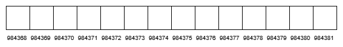

图 6.1 – 计算机内存的一部分。每个方块是一个字节，并且有一个唯一的地址

在我们的例子中，需要找到 4 个没有被其他东西占用的字节。这些字节需要连续排列。

这个序列中第一个字节的地址对我们来说很有意义。编程语言知道我们在该位置存储了一个整数值，并且它知道一个整型数据需要多少字节，所以第一个地址就足够定位这个整型数据。下面的图展示了这一点：

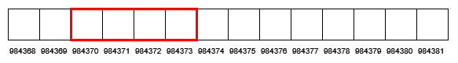

图 6.2 – 编程语言在内存中为整型值存储预留了足够的空间

当编写程序时，我们不想记住数字内存地址，所以我们给这个内存地址起一个名字。作为程序员，这是我们的责任，我们应该选择一个能够描述我们存储的数据的名称。我们很快就会讨论在命名变量时需要考虑的因素：

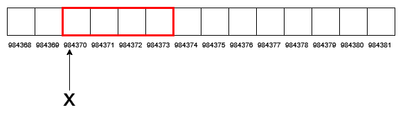

图 6.3 – 保留序列中的第一个地址被赋予了一个名称——在这个例子中，是 x

现在我们有足够的空间来存储保留的整数值和一个可以用来引用这个内存地址的名称，实际的值可以存储在这个内存位置。这个值将以二进制格式存储。我们曾在*第一章*，“计算机程序简介”中讨论过二进制数。在先前的代码片段中，我们想要保存的值是`13`，而`13`的二进制表示是`1101`。这个值之前的所有位都填充了零。正如你在下面的图中可以看到，一个字节就足够了，但许多语言为其整型数据类型设定了固定的大小，所以无论我们是否需要，所有的字节都将被保留：

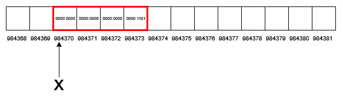

图 6.4 – 我们想要存储的值的二进制表示被插入到这个内存位置

现在，值已经存储在内存中，我们有一个指向这个位置的名称。我们可以使用这个名称来访问这个值。

在我们的例子中，我们称`x`为变量。一个变量由几个部分组成。它有一个名称，在我们的示例中是`x`。它还有一个类型。类型定义了数据需要多少内存。我们想要存储一个整型，我们假设我们使用的语言已经决定为整型使用 4 个字节。这是这个变量的大小。我们还知道，如果一个整型有固定的大小，它能够存储的最大值是有限的。在本章的后面部分，我们将讨论这个限制。

我们还需要探索如何命名我们的变量以及它们可以有哪些类型。让我们从名称开始。

### 变量命名

我们给变量取的名字应该反映它所代表的数据，所以如果我们用一个变量来存储电子邮件地址，一个好的名字会是`email`，而`b45`则不太合适。

每种语言的语法都有关于如何命名变量的规则。以下是一些命名变量的标准规则：

+   它必须以字母表中的字母或下划线（`_`）开头。

+   在第一个字符之后，名称可以包含字母、下划线和数字。

+   你不能使用语言中用作关键字的名字——也就是说，被语言保留的单词，如`for`、`if`和`else`。

+   空格或其他特殊字符，如`+`、`-`和`*`，不允许作为名称的一部分。

一些合法和不合法名称的示例如下：


表 6.1

许多语言在变量名方面也是大小写敏感的。这意味着`name`、`Name`和`nAmE`变量将被视为三个不同的变量。

当涉及到如何构造和格式化变量名时，许多语言也会有什么被称为命名约定。还有关于如何创建由多个单词组成的名称的约定。我们将在下一节研究这些约定。

#### 驼峰命名法

驼峰命名法是指组成名称的单词之间由一个首字母大写的字母分隔。有两种子类型——**大驼峰命名法**（也称为**帕斯卡命名法**）和**小驼峰命名法**（也称为**骆驼命名法**）。以下是一些使用大驼峰命名法的变量名示例：

+   `FirstName`

+   `EmailAddress`

+   `ZipCode`

同样的名字在驼峰命名法中会看起来像这样：

+   `firstName`

+   `emailAddress`

+   `zipCode`

如我们所见，第一个变体将组成名称的单词的第一个字母全部大写，而第二个变体将第一个单词保持小写，并且只使用第二个单词的第一个字母大写。

推荐使用这种命名约定的语言包括 Java、C#和 Pascal。

#### 蛇形命名法

使用下划线分隔单词称为蛇形命名法。当使用这种约定时，我们只使用小写字母，并用下划线字符分隔单词。使用这种格式与前面示例相同的变量名将看起来如下：

+   `first_name`

+   `email_address`

+   `zip_code`

使用这种命名约定为变量命名的语言包括 Python、Ruby、C 和 C++，在某些情况下。

当我们说一种语言有变量命名约定时，这意味着什么？

### 命名约定

通常，命名约定是命名事物（如变量）的推荐方式。这意味着我们可以打破这些规则，程序仍然可以工作。然而，我们有几个很好的理由去遵守这些建议。其中一个可能是，如果许多程序员参与编写一些代码，风格将是一致的，因此对于人类读者来说更容易理解。

一些软件公司有自己的命名约定。这通常是在语言本身没有或存在较弱约定的情况下。

当遇到一种新的语言时，我们应该始终学习其约定。如果你在多个使用不同编程语言的项目上工作，记住使用哪种约定可能会很棘手。

在*第十二章*中了解更多关于命名约定的信息，*代码质量*在*使用代码约定*部分。

现在我们知道了如何命名一个变量，让我们探索变量可以具有的不同类型。

# 原始数据类型

每个变量都有一个名称和一个类型。类型定义了可以在变量中存储的数据类型。通常，一种语言将有一些内置类型，称为原始类型或基本类型，用于处理单个值。

原始类型可以分为两大类——布尔型和数值型，我们将在下一节中探讨。

## 布尔类型

在*第一章*中，我们讨论了乔治·布尔和他的布尔代数。这定义了我们可以如何使用`and`、`or`和`not`将`true`和`false`的值组合起来。为了能够在我们的程序中使用这些值，我们有一个以布尔命名的类型，称为布尔型。使用这种类型的变量只能有两个值之一——`true`或`false`。对于具有这些类型的语言，我们使用实际的`true`和`false`单词。

具有这种类型的语言要么称之为`Boolean`，要么简单地称之为`bool`。

## 数值类型

数值类型可以分为两类——整数类型和浮点类型。我们将在下一节中详细探讨。

### 整数数据类型

你在这里可以问自己的第一个问题是，为什么当我们谈到整数时，我们会用复数来谈论类型？你可以争辩说数据要么是整数，要么不是。实际上，许多语言将会有几种类型来表示整数值，而原因与数据使用的内存量以及如何解释这些数据有关。

如本章前面所述，一种语言将定义在变量中存储数据时使用多少内存。当处理整数时，我们可能只处理预定义范围内的较小值，例如人类的年龄，或者值可能非常大，例如恒星之间的距离。

如果我们考虑我们正在处理的数据的特征，我们会发现它有自然限制。例如，人类的年龄永远不会是负数，如果我们考虑记录的最高人类年龄（写作时为 122 岁）并添加一些年份以确保安全，我们可以声明有效的人类年龄将落在 0 到 150 的范围内。一个字节——记住一个字节是 8 位（8 个零或一）——可以处理 0 到 255 范围内的数字，所以这已经足够存储人类年龄了。

如果我们谈论我们与其他恒星之间的距离，我们会有一个不同的数值范围。除了我们自己的太阳之外，最近的两颗恒星是半人马座阿尔法星系中的两颗恒星。它们距离我们刚好超过 4 光年。我们观测到的最远的恒星，名为 MACS J1149+2223 透镜星 1，距离我们 900 亿光年。因此，如果我们使用这些值，我们仍然不需要任何负数，范围将在 4 到 900,000,000 之间。

有时候，我们需要同时处理正数和负数——例如，如果我们正在编写一些会计软件。

这意味着整数值可以有不同的属性，因此我们有多于一种的整数类型，这样我们就可以找到一个适合我们需求的类型。由于我们不需要任何负数，并且最大值永远不会超过 150（作为人类年龄的值），一个可以处理巨大或负数的类型将是计算机内存的浪费。

基于这些知识，编程语言通常会实现几种不同的整数类型，它们在表示值时使用的内存（以字节为单位）不同。程序员的任务是选择一个与变量将处理的数据属性相匹配的类型。

不同的语言将会有不同的整数类型集，但这里有一些典型的整数类型、它们的尺寸以及它们可以处理的值范围：

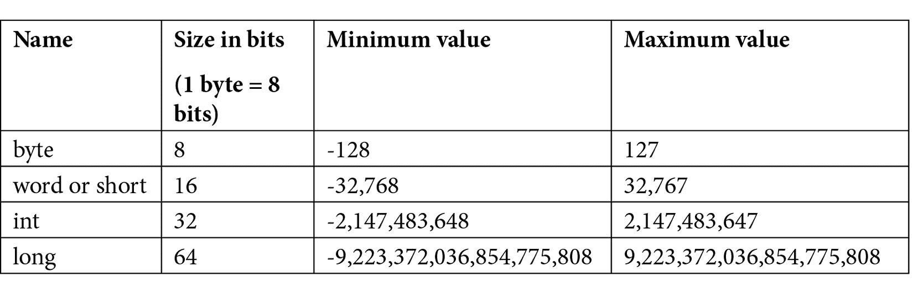

表 6.2

如您所见，所有前面的类型都包括负数和正数。同时表示两者将限制类型服务大数的能力。再次以人类年龄为例，我们会看到字节类型实际上并不适用，尽管它的最大值是 127，但它有 128 个我们永远不会使用的负值。

我们有这种限制的原因与负数的表示方式有关。

#### 有符号和无符号整数

如果我们查看前表中最小的类型——字节——并思考如何表示负数，我们会发现一个问题。在处理二进制数时，我们有几个位可以存储`0`或`1`，但我们没有其他值，所以我们不能简单地插入一个负号来表示这是一个负数。相反，可以使用以下三种方法之一。

让我们看看它们是如何工作的。

#### 有符号位表示法（SMR）

即使名字有点复杂，这是在二进制形式中表示负值的最简单方法。想象一下，我们正在使用一个字节，它给我们 8 位来表示一个值。然而，如果我们将其中一位用于表示这是一个正数还是负数，我们就只剩下 7 位来表示实际值：


图 6.5 – 使用仅 7 位表示值的字节——在这个例子中是 127

如果我们使用前面图中的最左边的位——通常被称为最高位，因为它代表的是最高值——来表示其余部分应该被视为正数还是负数，其余的位可以形成一个最大值为 `127` 的值：


图 6.6 – 使用最高位来表示正值—29，在这种情况下

如果我们指定第一个位置来表示这是一个正数还是负数，我们可以用 `0` 来表示这是一个正数，用 `1` 来表示这是一个负数：


图 6.7 – 使用最高位来表示负值，-29，在这种情况下

使用这种技术，我们可以用一个字节表示从 `-127` 到 `127` 的值范围。我们还将有 0 的两种表示——正的和负的。这是这种方法的一个缺点，也是它不常被使用的原因。

这种技术的一个问题出现在对使用 SMR 的两个值执行数学运算，如加法时。

*图 6.8 至 6.12*展示了如果我们使用 SMR 来表示一个负数，将 `3` 和 `c` 相加会发生什么。为了理解这些图表，想象一下你加两个十进制数。如果你想加 `495` 和 `572`，我们将它们一个放在另一个上面，并开始逐列相加：


然后我们对下一列做同样的处理，但是当我们得到一个大于 `9` 的值时，我们必须进行进位：


当加到最后一个列时，我们将进位数作为我们加的数字的一部分：


我们可以将同样的原则应用于二进制数的加法。唯一的区别是我们现在只处理两个数字。所以，当结果大于 `1` 时，我们只需要一秒钟就可以进位。现在，当我们加两个可以是 `0` 或 `1` 的位时，我们最终只会得到三种不同的结果——0、1 或 2（十进制）。如果我们考虑我们需要加两个值和一个可能的进位值，最大值将是 1 + 1 + 1 = `3`。现在我们知道我们可以得到的最大值（3），我们可以将其转换为二进制。`3` 的二进制是 `11`。这意味着我们的可能结果将是 0、1、10 和 11。0 和 1 可以在一个位内表示，但 `10` 和 `11` 不能，所以在这里，我们需要进位 1。

作为指导，让我们用一个表格来在十进制和二进制值之间进行转换：

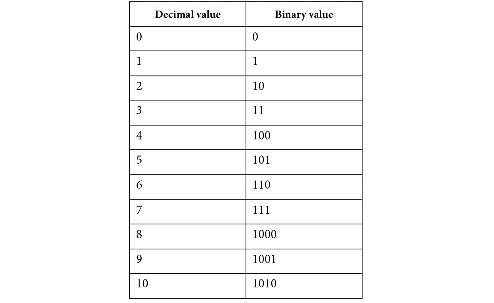

表 6.3

让我们再看看另一个表格，它有助于我们理解二进制加法是如何工作的：

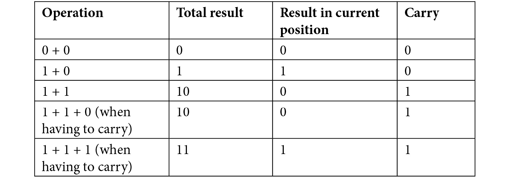

表 6.4

如您所见，最后三个操作的结果是两位数，所以所有这些都会产生进位。

让我们看看我们如何将这个原则应用于二进制数的加法：

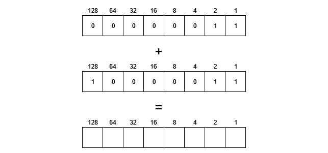

图 6.8 – 加两个值，3 和-3，其中负数使用 SMR 表示

当我们想要加两个二进制数时，我们做的是与十进制数相同的事情。唯一的区别是我们只能处理结果为 0 或 1 的情况。如果结果是 2，我们需要将 1 进位到下一个位置：

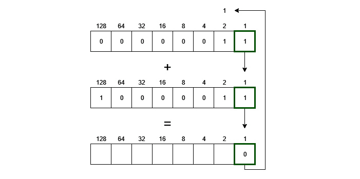

图 6.9 – 第一步是加上两个最右边的位—1 + 1 = 2

从前面的图中，我们可以看到，因为二进制中的 2 是 10，我们在这一位置插入 0 并进位 1。

这意味着在下一步，我们有三个值—1 + 1 + 1。因为结果将是 3，二进制表示为 11，我们在这一位置插入 1 并将 1 进位到下一轮：

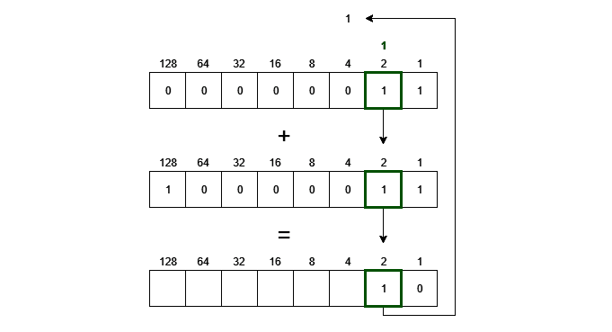

图 6.10 – 对下两个位重复操作

在这个例子中，我们现在有几个位置是加零，但我们必须记住我们第一次已经进位了 1：

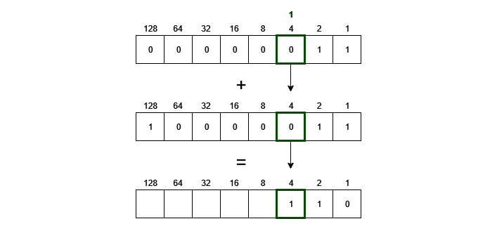

图 6.11 – 对于第三对位，我们在加两个零的同时带有进位

我们现在可以一直重复这个过程到最末位。这是我们符号位：


图 6.12 – 接下来的四个位都是零，没有进位，所以它们都将产生零

由于我们正在加一个正数（3）和一个负数（-3），在这个位置上第一个值是`0`，第二个值是`1`以表示该值是负数。因为 0 + 1 是 1，这表明结果是负数：

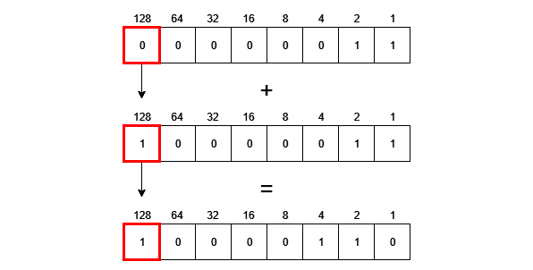

图 6.12 – 当我们加用作符号位的位时，结果将是 1，表示结果是负数

令我们惊讶的是，我们发现 3 和-3 相加的结果不是我们预期的 0，而是-6，因为我们有 4 加上 2 等于 6，第一个位置是 1，表示这是一个负数。

这也是为什么这种方法不常被使用的原因之一。

#### 反码

另一种表示负数的方法是使用所谓的“反码”，它也使用最高有效位（在我们的插图中最左边的位）作为符号位，但与 SMR 不同地存储负数。

如果我们有一个正数，我们可以用 3 作为例子，如果我们将其存储在一个字节中，我们得到 0000 0011，正如我们在这里看到的：


图 6.13 – 在字节中存储正数 3

要存储-3，我们需要翻转所有位，所以 0 变成 1，反之亦然，如下所示：


图 6.14 – 使用补码存储-3。所有值都与存储正 3 时的值相反

如我们所见，所有位与存储正 3 时的位相反。当这个数字被解释时，首先检查符号位。如果是 1，则将所有其他位翻转以形成实际值。这看起来可能有些奇怪，但让我们看看当我们把两个数相加会发生什么：

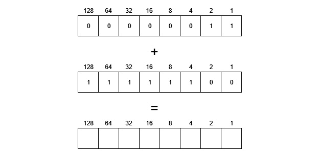

图 6.15 – 使用补码表示的负数相加 3 和-3

如前图所示，我们对每个位置加 1 和 0。因此，结果将在每个位置上都是 1，正如我们在这里看到的：

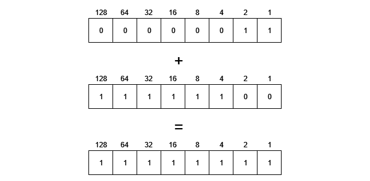

图 6.16 – 将两个字节相加的结果将在所有位置上为 1

由于我们有符号位为 1，这意味着我们有一个负结果，所以所有其他位都需要翻转，结果将是-0。现在，这更好，因为 3 + (-3)等于 0，但负 0 没有意义。这意味着这种方法也和 SMR 一样有相同的问题，即我们有两个表示值 0 的方式——一个正数和一个负数：

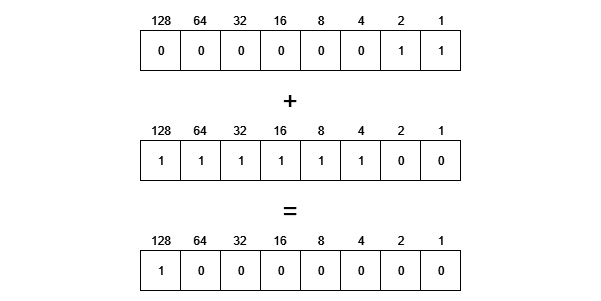

图 6.17 – 由于符号位为 1，所有其他位都需要翻转，形成负 0

让我们看看我们是否可以解决这个问题，并找到一个有效的表示方法。

#### 补码

为了解决补码中的两个零问题，存在一种表示整数值的第三种方法，称为补码。它的工作方式与补码相同，但略有不同。

第一步是使用补码来表示一个负数，这需要取正值的位并翻转所有位。但是，当这样做之后，我们向结果中加 1。现在，这可能会让人觉得我们完全搞砸了结果，但正如我们将看到的，它解决了双零表示的问题。

请参阅*图 6.18 至 6.21*以了解这是如何工作的：


图 6.18 – 在字节中表示值 3

正值的表示与之前相同。然而，当处理负数时，我们采取不同的做法：


图 6.19 – 使用补码形式表示-3

在这里，我们从正表示法中取出所有位并翻转它们，所以 0 变成 1，反之亦然：

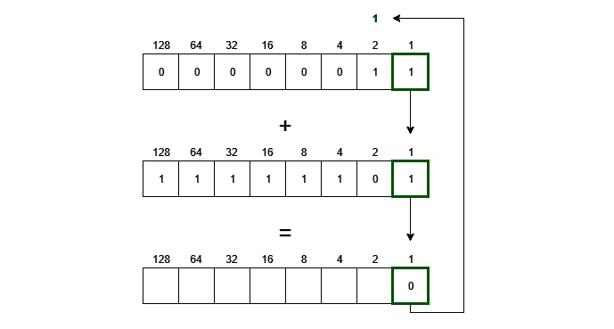

图 6.20 – 当加上 3 和-3 时，我们做的是之前做过的事情。1 + 1 = 10，所以 0 移动到这个位置，1 被进位

添加位的方式与之前相同：

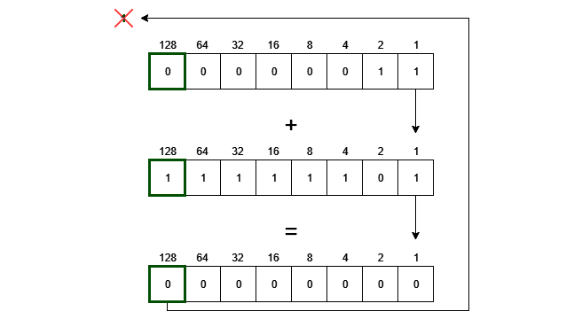

图 6.21 – 对于所有位置，我们都有一个进位，所以我们将 1 + 1 + 0 = 10 相加

当在左边加上符号位时，我们会得到一个进位。二进制补码方法指出，这个进位应该被丢弃。

我们可以看到，这个操作的结果是一个只有零的字节，给我们提供了一个 0 的单个表示。

由于二进制补码解决了零的二进制表示问题和两个值相加的问题，因此这是最常使用的方法。

#### 无符号整数

一些语言允许我们使用所有位作为值的整型。这使我们能够只处理正整数，但另一方面，它们可以大两倍，因为我们使用所有位来存储值。

并非所有数值都是整数，因此现在让我们看看另一组数值数据类型——浮点类型。

### 浮点类型

使用二进制形式表示浮点数是棘手的，作为程序员，我们很快就会发现一些与这个问题相关的奇怪之处。让我们看看以下代码：

```py
result = 0.1 + 0.2
```

我们预计变量 result 中存储的结果应该是`0.3`，但在许多语言中，这将是类似`0.30000000000000004`的东西。

我们得到这种奇怪结果的原因是我们试图将十进制浮点数表示为二进制浮点数。我们不会过多地详细介绍计算机中浮点数的表示方式，因为这会变得有点复杂。如果你想知道这是如何完成的，你可以在网上搜索并看到很多关于它是如何工作的详细解释。

但我们将思考计算机在处理十进制数的二进制表示时面临的问题。

在我们的十进制位制中，每个数位都有一个值，就像我们之前看到的那样。这对于浮点数和整数都是一样的。对于浮点数，位置也有值，如下所示：


图 6.22 – 十进制系统中不同位置在十进制点左边的值

使用这个系统使我们能够轻松地存储一个值——例如，十分之一可以写成 0.1\. 在二进制中，位置如下：


在十进制点左边的值](img/B15554_06_24.jpg)

图 6.23 – 在二进制系统中，不同位置相对于小数点的值

如我们所见，没有任何值代表十分之一，所以需要做些其他事情。计算机的做法是以科学记数法存储浮点数值。将十进制值`300`表示为科学记数法，结果为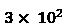。计算机以二进制形式执行此操作，并将值分为三部分。第一部分是符号，就像我们为整数值所看到的那样。第二部分是使用的指数，最后一部分称为尾数。尾数是 10 为底的对数的十进制部分（即十进制数）。如果这对您来说毫无意义，请不要担心。您不需要理解数学就能使用浮点数。然而，我们必须了解为什么数字并不总是以我们期望的方式出现。

为了说明这一点，我们可以考虑如果我们计算 1/3 会发生什么。我们将得到`0.333333333…`，其中我们将有一个无限数量的 3。当我们尝试用二进制数表示`0.1`时，也会发生同样的事情。结果将是一个在二进制形式中无限延续的值。问题是计算机没有无限的内存，所以当分配给此类型的内存用尽时，它就会停止，这意味着我们将无法准确地表示这个数字。这就是为什么在前面的例子中，当我们把`0.1`和`0.2`相加时，我们得到了`0.30000000000000004`而不是`0.3`。

不深入探讨浮点数表示的数学，我们需要了解编程中用于表示它们的两种最常见类型。它们通常被称为**浮点数**和**双精度浮点数**。

它们之间的区别在于，浮点数通常使用 32 位，而双精度浮点数使用 64 位。这意味着双精度浮点数在截断数字之前有更多的内存可以使用。它被称为双精度，因为它与浮点数类型相比具有双精度。

从这个例子中我们可以学到的是，如果精度在我们的应用中很重要，我们应该使用双精度浮点数，如果不是，我们可以使用浮点数。例如，如果我们想存储室外温度，使用浮点数就足够了，因为我们永远不会处理那么多的十进制数。

我们现在可以处理整数和浮点数，但有时我们想要表示其他类型的值，例如复数。

一些编程语言有专门用于处理复数的特殊类型。使用此类型的语言示例包括 Go、C++、Python 和 Ruby。

此外，还有一种数值类型，尽管我们通常认为它是其他东西——字符类型。

一个字母、标点符号或任何我们可以想到的其他字符都可以表示为一个数字。许多编程语言将提供一个特殊类型，旨在处理单个字符，但在底层，它是一个整数字符类型。它以与我们之前看到的其他数值类型不同的方式处理，因为我们不仅可以向它分配数字，还可以分配被某些引号包围的字符——通常是单引号。它可以看起来像这样：

```py
character_a = 'a'
```

在这里，我们将`a`字符分配给一个名为`character_a`的变量。字符被单引号包围，以表示这是一个字符而不是名为`a`的变量。发生的事情是，这个字符的数值被分配给变量。小写`a`的字符值是`97`，所以在这种情况下，这就是将被存储在变量中的内容。

要将变量的内容打印到屏幕上，请输入以下代码：

```py
print character_a
```

我们将看到打印出`a`，而不是`97`，因为编程语言将知道这是一个字符类型而不是普通数值类型，并将数值值转换回字符表示。

有时候，我们需要同时存储多个值。然后，我们可以使用所谓的**复合类型**。

# 复合类型

复合类型是由多个值组成的数据类型。在某些情况下，将几个相关值放在一起是有意义的。在我们的日常生活中，我们经常这样做。购物清单就是一个例子。我们不是用几张纸，每张纸上有我们需要购买的一个物品，而是将所有物品存储在一张纸上，称之为列表。

这就是编程中复合类型的工作方式。我们有几种类型，它们都具有一些特定的特性。第一种类型在我们想要表示一系列或列表时可以使用。这通常被称为数组。

数组——也称为向量、列表或序列——是一种存储多个元素的数据类型。这个数量可以是固定的或灵活的。

#### 固定数组

当我们有一个固定大小的数组时，我们在创建它时说明我们想要它有多少个槽位。这个大小不会改变。如果我们创建一个可以存储 10 个整数的数组，它将预留 10 个整数的空间，即使我们只使用了 3 个或 5 个。

通常，我们会创建一个固定大小的数组，如下所示：

```py
numbers[10]
```

在这里，我们想要一个可以存储 10 个整数的数组，我们称它为`numbers`。我们目前没有在数组中存储任何值，所以我们说这 10 个位置是未分配的，但我们已经为我们在内存中预留了空间，并且我们有一个可以用来访问这个空间的名称。

我们可以将其视为我们有 10 个不同的变量。唯一的区别是我们将所有 10 个变量存储在同一个名称下。

我们现在需要一种方法来单独地引用这些变量。这是通过索引来完成的。

我们可以通过使用其名称和一个索引值来索引数组：

```py
numbers[2] = 44
```

这里，我们在数组的`2`号位置存储了`44`。你可能认为位置`2`是数组中的第二个值，但实际上它是第三个。原因在于索引是从 0 开始的，如下所示：


图 6.24 – 在索引 2 处插入 44 将值放置在数组的第三个位置

索引从 0 开始而不是 1 的原因是，我们可以将这个数组使用的名称视为对数组中第一个位置的引用。当使用索引时，我们说的是我们应该向前移动多少个位置。所以，`numbers[2]`意味着我们从第一个位置开始，在内存中向前移动 2 个整数。这就是你应该存储值的位置。

我们还可以从给定的索引中检索一个值，如下所示：

```py
print numbers[2]
```

之前的代码打印出位于索引`2`的值，这是数组中的第三个值。

拥有一个固定大小的数组可能会出现问题，因为我们并不总是知道我们需要存储多少个值。如果这种情况发生，那么我们可以使用另一种类型的数组，这种数组可以根据我们的使用情况动态增长和缩小。这有时被称为动态数组。

#### 动态数组

动态数组（或列表、向量或序列）是一种可以随着使用情况动态增长和缩小的数组。最初，当我们首次创建这种类型的数组时，它将是空的，但我们可以随后添加和移除其中的内容。创建这些数组的方法会因语言而异，但可能看起来像这样：

```py
numbers = []
```

这里，我们创建了一个空的动态数组。

我们现在可以添加和移除数组中的内容：

```py
numbers.add(10)
numbers.add(11)
numbers.add(12)
numbers.remove(11)
```

这里，我们首先添加了三个值——`10`，`11`和`12`。通常，值会被添加到末尾，所以它们将按照`10`，`11`，`12`的顺序存储。

在最后一行，我们移除了`11`这个值。现在数组中只有`10`和`12`这两个值。

通常，我们会有不同的方法来指定新值应该添加到数组的哪个位置以及应该从哪个位置移除。例如，我们可能能够做如下操作：

```py
numbers.addBack(10)
numbers.addFront(11)
numbers.addBack(12)
numbers.addFront(13)
```

从前面的代码中，我们可以看到以下内容：

1.  我们将`10`这个值添加到空数组的后面。

1.  然后，我们将`11`这个值添加到数组的开头。现在我们有`11`，`10`。

1.  然后，我们在后面添加`12`，得到`11`，`10`，`12`。

1.  在最后一行，我们将`13`添加到数组的开头。现在我们有`13`，`11`，`10`和`12`这些值。

我们通常可以使用索引，就像在固定大小的数组中一样，从动态数组中检索单个值。问题是我们需要跟踪数组中当前有多少个项。这很重要，因为如果你有一个包含五个元素的数组，而你想要获取第 10 个元素，你就是在数组外部查找，你的编程语言很可能会因为执行了非法操作（根据你的语言来说）而停止程序执行。

动态数组也有其代价。当我们创建一个固定大小的数组时，会找到一个足够大的内存块，然后我们可以继续使用它。数组中的所有项目都必须在内存中按顺序排列，因为这是索引工作的基础。正如我们所看到的，数组的名称将告诉我们这个数组的起始位置，然后我们使用索引来表示我们需要在内存中移动多少步才能到达正确的位置。

当使用动态数组时，这可能会成为一个问题。如果我们一个接一个地添加项目，我们最终会到达一个已经存放其他东西的内存位置。现在我们的数组需要移动到另一个足够大的位置，以便存放我们已有的所有值，以及我们想要添加的新值。作为程序员，这不是一个常见的任务。语言会为我们完成这个任务，但将所有旧值从原始位置复制到这个位置将花费时间。这就是我们为拥有一个可以根据我们的需求增长和缩小的结构所付出的代价。

大多数编程语言只允许你在数组中存储相同类型的数据。然而，有一些语言允许你按需混合类型。

有时，我们想要存储以另一种方式相关联的值——比如说关于一个人的信息。然后，我们可以使用所谓的记录。

### 记录类型

如果你正在编写一个应用程序，并且你想表示关于客户的信息，你首先需要决定你想要处理哪些信息。这可能包括客户的首姓和姓氏、街道地址、城市、邮政编码等等。这可能包括不同类型的数据。如果你能够通过名称检索不同的项目，那将非常有用。

记录有时也被称为结构体或 struct。要使用它们，我们首先需要定义它们的形状。这可能看起来像这样：

```py
struct Person 
   firstName,
   lastName,
   streetAddress,
   city,
   zip
end_struct
```

我们在这里所做的定义了一个新的类型叫做`Person`。这种类型的一个变量可以存储一个名字、姓氏、街道地址、城市和邮政编码。

创建这种类型的变量可能看起来像这样：

```py
Person person1
```

现在我们有一个名为`person1`的变量，但我们还没有在其中存储任何数据。这样做可能看起来像这样：

```py
person1.firstName = "Anna"
person1.lastNamme = "Smith"
person1.streetAddress = "34 Main Street"
person1.city = "Home Town"
person1.zip = "123 456"
```

关于这个人的所有信息现在都存储在`person1`变量中。我们现在可以创建其他`person`变量来存储其他人的信息：

```py
Person person2
Person person3
person2.firstName = "Bob"
person3.firstName = "Colette"
```

我们也可以检索存储在这些变量中的数据，如下所示：

```py
print person1.firstName
print person2.firstName
print person3.firstName
```

这个输出的结果如下所示：

```py
Anna
Bob
Colette
```

在这里，我们有一个变量名`firstName`（例如）与一些数据——`Anna`、`Bob`和`Colette`之间的关系。我们事先知道这种关系，因此记录结构对我们来说非常合适。有时，我们可能不知道我们会得到什么，但数据可能仍然以成对的形式出现。然后，我们可以使用另一种称为字典的数据类型。

### 字典类型

字典（也称为映射、哈希表或关联数组）是一种使用键值对的集合类型。键需要是一个唯一的值，我们可以用它来检索与其关联的值。

冒号通常用于分隔键和值。

它们可能看起来像这样：

```py
dictionary books 
    "Pride and Prejudice": "Jane Austen",
    "David Copperfield": "Charles Dickens",
    "Madame Bovary": "Gustave Flaubert"
end_dictionary
```

在这里，我们使用一些著名书籍的名字作为键，与每个键关联的值是那本书的作者。正如我们之前所述，键需要是唯一的。如果我们重复使用键并为其分配另一个值，旧值将被新值覆盖。

我们可以通过使用键作为索引来访问值——在我们的例子中是作者的名字：

```py
print books["David Copperfield"]
```

这将给出以下输出：

```py
Charles Dickens
```

由于只需要键是唯一的，我们可以有多个具有相同值的项。例如，我们可以将一本书添加到字典中如下：

```py
books["Oliver Twist"] = "Charles Dickens"
```

现在我们有两个包含`Charles Dickens`的值，但它们与两个不同且唯一的键相关联。

有时，我们存储唯一值有其他原因。我们可能想表示数学中已知的有限集。为此，我们也有集合类型。

### 集合类型

集合是一种复合类型，它将存储唯一值而不按顺序排列。由于这种类型是无序的，我们不能通过索引从它中检索项目。这通常不是问题，因为这种类型通常用于测试成员资格。例如，你可能有包含一些值的两个集合，并想知道哪些值出现在两个集合中。

让我们看看我们如何创建这两个集合，然后打印出两个集合中出现的值：

```py
firstSet = {2, 5, 7, 9}
secondSet {2, 3, 4, 8, 9}
print firstSet.intersection(secondSet)
```

在集合理论中，两个集合之间的交集是存在于两个集合中的值。

这个输出如下所示：

```py
2, 9
```

这个输出如下所示：


这两个值存在于两个集合中](img/B15554_06_26.jpg)

图 6.25 – 两个集合的表示，这两个集合的交集是 2 和 9，因为这些值存在于两个集合中

有时，我们想要创建一个新的类型，以便我们可以指定可以分配给这种类型的变量的值。为此，我们有枚举。

### 枚举

枚举，通常简称为**枚举**，是一种具有唯一值的枚举类型。我们可以使用它来创建我们的类型并指定可以分配给具有此类型的变量的值。

它可能看起来像这样：

```py
enum TrafficLight
    red,
    yellow,
    green
end_enum
```

`TrafficLight`现在是一个类型，我们可以用它来创建变量：

```py
TrafficLight light1
TrafficLight light2
```

由于`light1`和`light2`都是`TrafficLight`类型，我们只能分配在这个类型内部描述的事物：

```py
light1 = yellow
light2 = green
```

在幕后，每个枚举项都与一个数值相关联。在我们的例子中，`red`将是`0`，`yellow`是`1`，`green`是`2`。

现在，我们已经看到我们可以处理布尔值、数字、字符和不同的复合类型，但你可能会注意到我们缺少一种类型。我们还没有看到一种可以处理文本的类型。是时候看看字符串了。

### 字符串

字符串是一种复合类型，因为它被存储为字符数组。大多数语言将使用双引号来指定某物是一个字符串，并将使用单引号来表示单个字符。有些语言允许你为这两种类型都使用单引号或双引号。在这里，我们将使用双引号来表示字符串，当只有一个字符时使用单引号。

通常，我们不会将字符串视为数组。我们可以创建一个字符串，如下所示：

```py
greeting = "Hello there"
```

在这里，我们创建了一个字符串类型的变量，名为 `greeting`，并将其值设为 `Hello there`。在幕后，将创建一个字符数组，字符串中的每个字符都将分配到这个数组中的一个位置，如下所示：


图 6.26 – 存储为字符数组的 "Hello there" 字符串

由于字符串是字符数组，我们可以使用索引来访问单个字符。例如，让我们打印位置 `7` 的字符，这是第八个字符：

```py
print greeting[7]
```

输出将如下所示：

```py
h
```

现在我们能够以不同的格式处理数据，我们可以继续对这些数据进行操作。是时候看看操作符了。

## 操作符 – 我们可以对变量执行的操作

在 *第五章**，序列 – 计算机程序的基本构建块* 中，我们讨论了语句是由表达式组成的，以及表达式可以由操作或操作数组成。

让我们看看一个例子。在这里，我们将创建两个变量，并给每个变量赋值。然后，我们将这两个值相加，并将结果存储在一个新变量中：

```py
number1 = 10
number2 = 15
result = number1 + number2
```

在第一行，我们创建了一个名为 `number1` 的变量，并将其值设为 `10`。我们现在知道这意味着几件事情：

+   变量名是 `number1`。

+   由于它被分配了一个整数，因此它必须是 `integer` 类型。

+   等号 `=` 是一个操作符，它将右侧的内容赋值给左侧的内容。

+   在计算机内存的某个地方，已经为整数预留了足够的空间。

+   名称 `number1` 将作为这个地址的别名。

然后，我们在第二行做同样的事情，唯一的区别是我们给变量起了一个不同的名字，`number2`，并给它赋了另一个值，`15`。

在第三行，我们使用了加法操作符。这个操作符有两个操作数——`number1` 和 `number2`。现在，它将提取这两个变量中的值，将它们相加，并返回结果。

这个操作将得到一个值为 `25` 的结果，这个值将被分配给变量 result。由于加法操作给我们另一个整数，我们现在还知道变量 result 也将具有 `integer` 类型。

让我们来看看一些基本的算术运算符。

### 算术运算符

大多数编程语言都共享用于基本算术运算的符号。请参考以下表格，以查看最常见的符号：

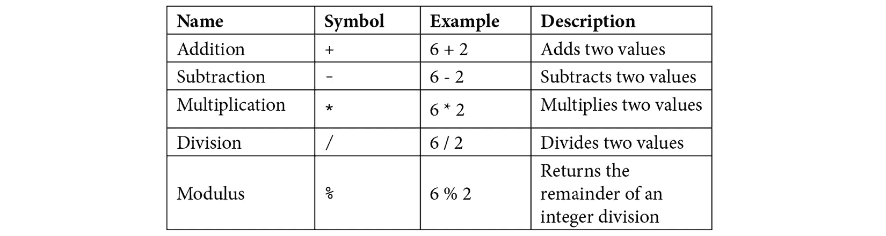

表 6.5

最后一个，取模运算符，可能对你来说并不熟悉。它在编程中经常被使用，因为它在处理数字时有一些很有用的特性。我们可以用一个简单的例子来说明它的工作原理。如果我们计算 `16/13`，我们会得到一个结果为 `1.230769…`。整数部分 `1` 告诉我们 `13` 一次可以进入 `16`。取模运算符所做的就是告诉我们到达 `16` 还剩下多少。所以，如果 `13` 一次可以进入 `16`，我们必须将 `3` 加到 `13` 上才能得到 `16`。

我们可以用 `16 % 13` 来表示，得到的结果是 `3`。如果你以前没有使用过取模运算，我建议你在网上搜索它，以了解它是如何工作的，因为这对于你作为一个程序员来说是非常有用的。

接下来，我们将介绍一些可以用来比较事物的运算符。

### 关系运算符

当我们想要比较两个值时，会使用关系运算符。它们可以是相等的，也可以是不相等的。我们可能想知道一个值是否大于另一个值。以下表格列出了在编程语言中通常可以找到的关系运算符：

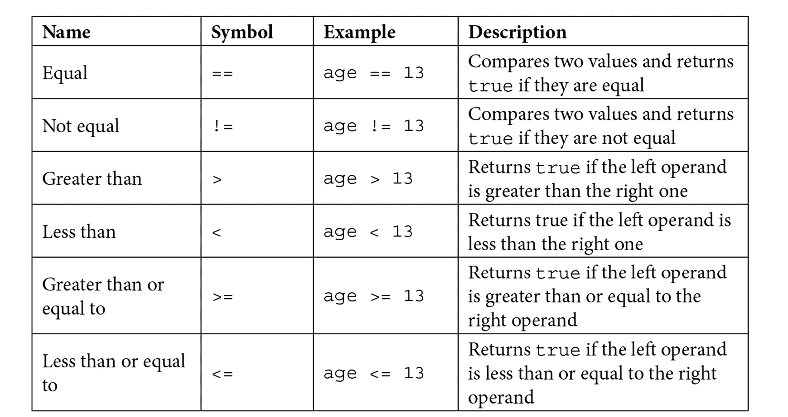

表 6.6

使用这些运算符，我们可以比较两个值，但有时我们还有更多的值要比较。在这种情况下，我们需要逻辑运算符。

### 逻辑运算符

这些运算符用来表示 `and`、`or` 和 `not`。某些语言会使用这些确切的词来表示它们，但其他语言可能会有特殊的符号。它们用于诸如 `if the age is greater than 12` 和 `age is less than 20` 这样的语句中。在代码中，它可能看起来像这样：

```py
if age > 12 && age < 20 then
```

我们可以使用的三个运算符如下：


表 6.7

大多数语言将比我们这里看到的更多运算符。我们不会在这里介绍它们，因为其中一些是组合运算符，它是我们这里看到的两个运算符的组合，而其他一些是为一种或几种语言专门设计的。

接下来，我们将探讨变量在内存中存储的两种不同方式以及为什么这会关系到我们。

## 值和引用变量的概念

变量可以在内存中存储其值有两种方式。我们可以将这些方式视为直接和间接。这听起来可能有些奇怪，但让我们用一个类比来解释。

直接存储数据的变量就像盒子。当我们创建它们时，我们可以把它们想象成贴有变量名字标签的盒子。我们可以在盒子里存储值，以后可以查看盒子以查看里面的值。以这种方式存储值的变量被称为**值变量**：


图 6.27 – 通过值存储数据的变量就像一个盒子

使用间接存储的变量将充当图书馆的索引卡。它不会存储书籍，但会包含书籍存储的位置，因此它只包含实际值在内存中的地址。以这种方式存储值的变量被称为**引用变量**：

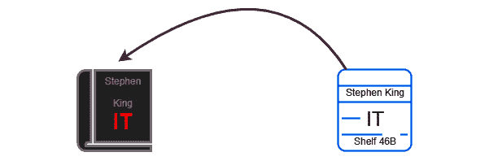

图 6.28 – 通过引用存储数据的变量就像图书馆的索引卡

让我们看看它们是如何工作的。

### 值变量

当我们创建一个变量——或者像我们通常说的那样声明它——时，会发生几件事情，就像我们在本章开头看到的那样。让我们看看当执行以下代码行时会发生什么：

```py
x = 10
```

如我们所知，一个足够大的内存块可以存放一个整数，并且这个位置有一个地址。我们给变量取的名字——在前面的例子中是`x`——只是这个地址的一个别名。对于我们来说，记住一个名为`firstName`的变量存储了一个名字，而不是记住这个名字位于`38892819283`地址上，要容易得多。

当我们的代码被解释或编译时，变量名会被更改为实际的地址，但幸运的是，这并不是我们将会看到的内容。因为这个变量是通过值存储数据的，所以数据存储位置和变量名之间存在直接关系。

### 引用变量

当涉及到引用变量时，变量名和数据存储之间有一个额外的步骤。让我们通过另一个代码示例来看看会发生什么：

`weather = "Sunny"`

在这个例子中，数据仍然需要存储在某处，因此会找到一个内存位置来存储它，并且和之前一样，会记录这个位置的地址。然而，不同之处在于变量名不是这个地址的别名。相反，数据存储位置的地址存储在内存的另一个位置，而变量是这个位置的别名。以下图表说明了这一点：

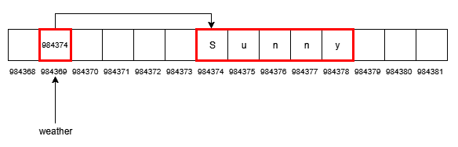

图 6.29 – 命名为 weather 的引用变量

这可能看起来没有意义。为什么我们不能将文本字符串存储在`weather`变量指向的位置？这个额外步骤有什么意义？答案是效率。在程序中，我们需要传递数据。程序中某个部分变量中的数据需要传递到另一个部分。想象一下，存储的数据比前面例子中的短文本字符串大得多；实际传递数据意味着我们需要复制所有数据。这需要一些时间，现在我们将有两个数据副本，这将使用两倍多的内存。如果一个变量是这种引用类型，我们就不需要复制所有数据。在前面例子中，这意味着我们不需要复制`Sunny`。相反，`weather`变量包含指向这些数据的地址，因此它可以只传递地址。

不同的语言如何使用这两种类型会有所不同。在学习一门新语言时，了解它如何处理值和引用变量是至关重要的。

现在我们已经涵盖了与变量相关的大量内容，我们现在可以开始使用它们了。我们将看到如何处理数字，然后我们将查看文本字符串。

## 处理数字

数字在计算机程序中至关重要。我们使用它们来表示现实世界中的概念，例如购物车中的物品数量、包裹的重量和到某个地点的距离。我们还使用它们来表示程序内部的内部事物，例如名字中的字符数，这样我们就可以计算如果打印出来是否适合地址标签。关键是，我们一直在使用数字，所以让我们看看我们能用它们做什么。

首先，我们可以进行基本的算术运算，例如加法、减法、乘法和除法，如下面的代码片段所示：

```py
age1 = 34
age2 = 67
mediumAge = (age1 + age2) / 2
```

在这个例子中，我们有两个年龄，我们正在计算平均年龄。

我们经常使用数字作为事物的计数器。这意味着我们将使用它们来跟踪我们做了多少次某事。这意味着我们需要增加（有时减少）它们 1。我们可以这样做：

```py
count = count + 1
```

要理解这里发生的事情，我们首先需要看`=`符号的右边。这里有一个名为`count`的变量。由于这是一行从其上下文中剥离出来的，我们可以假设它已经存储了一个值。现在这个值被使用，并且我们给它加 1。这个加法的结果然后被存储回变量`count`中，我们将其值增加了 1。

由于在编程中这样做非常常见，因此已经开发了一些简写。由于我们在`=`操作符的两侧使用相同的变量，我们可以省略其中一个，而改用一个看起来像这样的不同操作符：

```py
count += 1
```

这与上一个例子相同，但更短。我们可以将其读作取 `count` 变量存储的值，将其加 `1`，并将结果重新存储在 `count` 中。

一些语言更进一步，甚至缩短了这一过程：

```py
count++
```

再次，结果将与另外两个相同。我们可以将其读作将存储在 `count` 中的值增加 `1`。

当然，我们刚才看到的三个例子也可以用减法来完成，如下所示：

```py
count = count - 1
count -= 1
count--
```

当处理数字时，它们可以存储在变量中，就像 `count` 一样，或者直接在代码中的数字，就像前例中的 `1`。

有时候，我们将处理更复杂的数学公式，并在一行中做几件事情。

我们可能有以下类似的东西：

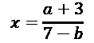

我们如何在程序中写这个？

首先，`x`、`a` 和 `b` 在数学中是变量，在我们的程序中也将是变量。`a + 3` 和 `7 – b` 必须在我们可以除之前完成。我们使用这样的方程作为计算某物的配方。要使用它，我们为 `a` 和 `b` 插入一些值。然后，我们进行数学运算，`x` 将是结果。

因此，在我们的程序中，我们可以假设 `a` 和 `b` 已经在程序的其他地方被赋予了某些值。那么，让我们看看我们如何让计算机为我们做数学运算：

```py
x = (a + 3) / (7 – b)
```

添加括号意味着括号内的内容将首先被计算。所以，如果我们为 `a` 和 `b` 想象一些值——比如说 `a = 3` 和 `b = 4`——那么 `a + 3` 将首先被计算，因此我们得到 `3 + 3 = 6`。然后，`7 – b` 将被计算，所以 `7 – 4 = 3`。在这个时候，我们可以想象 `a + 3` 被替换为 `6`，`7 – b` 被替换为 `3`；我们剩下 `6 / 3`。结果，`2` 将被存储在 `x` 中。

如果基本的代数对我们来说不够用，大多数编程语言都提供了大量的数学函数库，我们可以使用，例如余弦、正切、平方根和绝对值。

另一种程序员大量使用的数据类型是字符串。让我们看看我们可以用它们做什么。

## 字符串操作

字符串是一系列字符的序列，字符不一定是字母，它可以是指点符号、空格、连字符或我们可以使用计算机产生的任何其他字符。字符串也可以包含数字。

我们必须首先理解的是，只包含数字的字符串不会与整数相同。看看以下代码：

```py
numberA = 1234
numberB = "1234"
```

注意到最后一个数字周围的引号。这使其成为一个字符串。第一个，`numberA`，将是 `integer` 类型，因此它可以用于计数和其他数学运算。对于计算机来说，第二个就像单词 `dog` 一样，即根本不是数字。

当处理字符串时，我们可以对它们进行几种典型操作。让我们看看一些常见的字符串操作。

### 字符串连接

当我们将两个字符串相加以形成一个新字符串时，我们称之为连接。这种做法会因语言而异，但通常，我们可以使用`+`运算符，如下例所示：

```py
word = "day" + "break"
```

这里，我们有两个字符串——`day`和`break`。引号告诉我们它们是字符串。它们现在将被连接成一个新的字符串，存储在`word`变量中。这个变量将包含`daybreak`这个词。

### 字符串分割

有时，我们想要将一个字符串分割成多个字符串。为此，我们通常会在字符串内部使用一个分隔符，我们可以用它来指示字符串应该在哪里分割。让我们假设我们有一个包含名字和姓氏的字符串，名字和姓氏之间由逗号分隔，例如`Sue,Smith`。

如果它存储在一个名为`name`的变量中，在某些语言中，我们可以这样做：

```py
firstName, lastName = name.split(",")
```

如同往常，我们将从`=`运算符的右侧开始看。在这里，我们说我们有一个名为`name`的变量中的字符串。我们想要将这个字符串分成两部分，所以我们使用`split`。在括号内，我们看到一个字符串。同样，我们知道它是一个字符串，因为它有引号，并且包含一个逗号。这就是我们将用于分割的字符。变量名中所有在逗号之前的字符将被发送到左侧的第一个变量`firstName`。逗号之后的所有内容将被发送到第二个变量`lastName`。变量名中的逗号本身将被丢弃。

同样重要的是要注意，变量名的内容没有改变，所以如果我们在这行代码执行后查看变量，我们可以看到它们包含以下内容：

```py
firstName = Sue
lastName = Smith
name = Sue,Smith
```

结果也可以是一个包含两个字符串的数组。这看起来可能如下所示：

```py
splitName = name.split(",")
```

`splitName`变量现在将是一个包含两个字符串的数组。记住，数组中的第一个位置是`0`，在那个位置，我们将找到`Sue`字符串，而在位置`1`，我们将找到`Smith`。

### 子字符串

子字符串用于当我们从字符串中取出一部分来形成一个新的字符串时。这种做法会因语言而异。以下是一些示例，如果我们想从`phonocardiogram`字符串中提取`car`子字符串，它可能看起来像这样。

首先，我们将`phonocardiogram`存储在一个变量中，如下所示：

```py
word = "phonocardiogram"
```

在某些语言中，我们接下来可以这样做：

```py
newWord = word[5:8]
```

这将从字符串中的位置`5`开始提取子字符串。就像数组一样，计数将从`0`开始。由于字母`c`是第六个字母，我们使用的索引将是`5`。然后，根据给出的代码，我们在`8`处结束。但看起来我们多了一个字母。通常，我们使用两个值作为起始和结束索引。第一个将说明从哪里开始，第二个将指出第一个超出范围的东西。我们可以将前面的例子读作从位置`5`开始，在位置`8`停止，但不包括它。

在执行此行之后，`newWord`变量将包含`car`字符串，而且和之前一样，`word`变量将保持不变。

其他语言将执行类似以下操作：

```py
newWord = word.substr(5,8)
```

在这里，我们使用`substr`而不是方括号。此外，请注意，这里的`5`和`8`由逗号分隔，而在第一个例子中我们使用了分号。

第三个变体可能看起来像这样：

```py
newWord = word.substr(5, 3)
```

在使用这种格式的语言中，第二个值表示我们想要多少个字符，而不是结束索引。然而，结果将是相同的。

#### 大小写转换

转换字符串的大小写是我们经常想要做的事情。例如，原因可能是为了让我们程序的用户输入一个文本命令，然后我们需要检查用户输入了什么命令。例如，我们可以想象他们输入了以下命令：

+   `Start`

+   `Pause`

+   `Stop`

我们需要将用户输入的内容与这些字符串进行比较，但我们有一个问题。当我们比较字符串时，它们需要具有相同的大小写才能相等。这意味着`start`、`Start`和`START`都将不同。

我们不能比较所有可能的组合，因为它们会相当多。对于`start`这个词，我们有以下变体：

+   `start`

+   `Start`

+   `STart`

+   `StArt`

+   `STArt`

+   `SRArT`

+   `sTART`

+   `starT`

我们可以继续，但相反，让我们将字符串转换成全部大写或全部小写。然后，我们将知道字符串的形式。

我们可以这样做到：

```py
answer = answer.lower()
```

或者，字符串可以按以下方式转换：

```py
answer = answer.upper()
```

`lower`和`upper`不会改变变量`answer`内的原始字符串，而是创建这个字符串的新小写或大写版本。我们将这个新版本存储回变量中，通过这样做，我们将用我们知道其大小写的版本覆盖旧字符串。

我们已经看到了一些我们可以对字符串做的事情的例子。这并不是我们能做的全部，但请将这些视为一些我们可以在字符串上执行的一些常见操作的例子。

# 摘要

在本章中，我们介绍了编程所依赖的两个主要支柱之一——如何使用变量在计算机内存中存储、检索和更改数据。

我们了解到变量有一个名称和数据类型，并且变量的类型决定了可以存储在其中的内容以及它将使用的内存量。我们还了解到我们可以简洁地命名我们的变量，并且有一些命名约定可以作为指导。

在覆盖了这些内容之后，我们接着讨论了基本或原始数据类型，并看到数字要么以整数形式处理，要么以浮点数形式处理，这些进一步分为不同的大小，因此我们可以选择一个适合我们需求的类型，并确保我们不浪费内存空间。

一些数据自然以序列或自然分组的形式出现。对于这类数据，我们使用了复合数据类型，并看到这种类型允许我们处理数据组。

我们接着讨论了操作符是什么以及我们如何使用它们在变量上执行操作，还讨论了常见的操作符以及如何使用它们的例子。

变量可以以值类型或引用类型存储在内存中。我们了解到，当它以值类型存储时，它存储的数据位于变量的内存地址。引用变量并不直接保存其值，而是存储指向数据所在地址的地址。

我们使用数字变量，并使用我们的操作符对它们执行了一些基本操作。最后，我们将注意力转向字符串，并查看我们如何可以操作它们。

在下一章中，我们将通过适当的条件选择将逻辑引入我们的程序，以便我们只能在满足条件的情况下执行某些操作。我们还将看到如何借助循环重复执行相同的事情。
