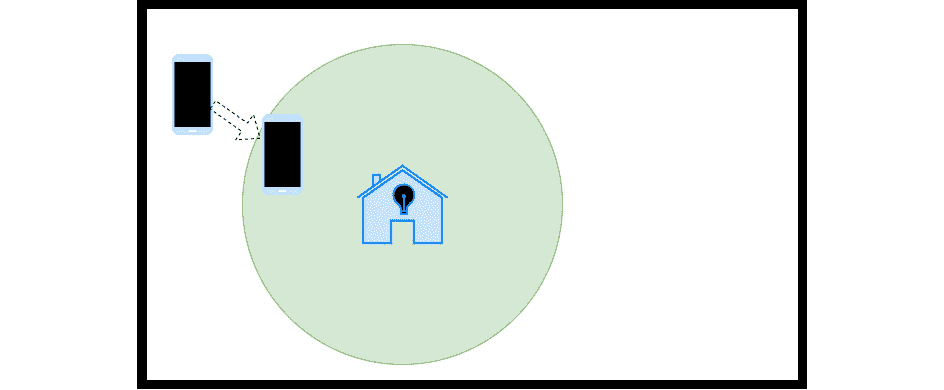
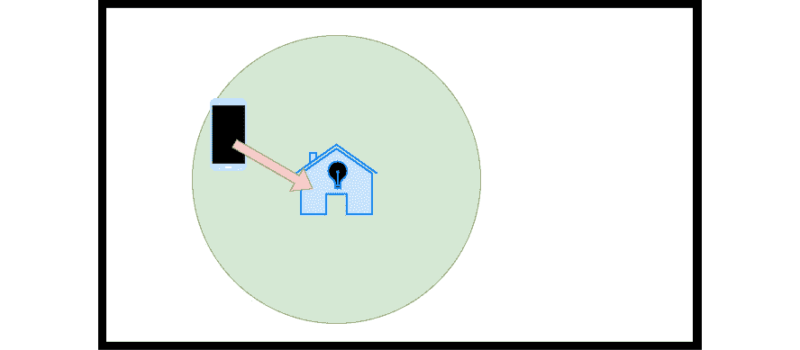
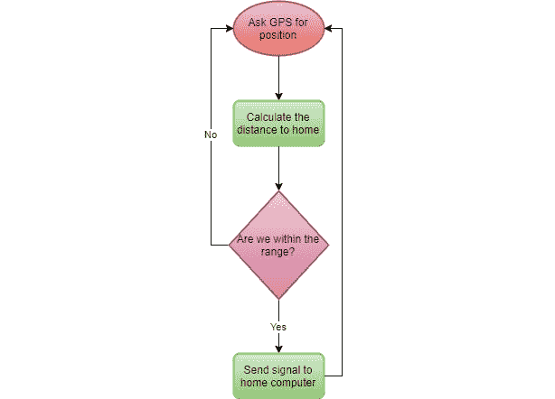
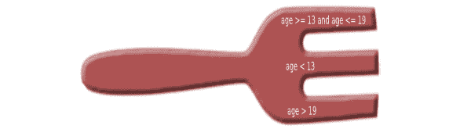

# 第七章：*第七章：程序控制结构*

如果我们的所有代码都简单地按顺序执行，无论我们向它们提供什么数据，我们的程序总是会做同样的事情。我们必须能够控制程序的路径，以便某些代码部分在指定的时间执行，而其他部分在其他时间执行，这取决于数据提供的值。例如，只有当外面很冷时，你才会穿上保暖的衣服，而不是总是这样。同样的事情也适用于我们的代码。当事情以某种方式发生时，我们希望发生某些事情。

从某种意义上说，我们可以这样说，我们将通过这种方式在我们的代码中引入某种智能，或者至少是某种决策能力。如果事情是这样，这样做，如果不是，那样做。

在本章中，你将学习以下主题：

+   控制程序的执行路径

+   使用`if`语句做出决策

+   使用`switch`语句从许多选项中选择一个

+   使用`for`循环重复执行代码

+   使用`while`和`do while`迭代代码直到条件为假

+   使用`for each`逐个遍历数据序列

在本章中，我们将深入一些实际的编程。在我们将要涵盖的主题中，我们将能够控制程序的执行路径。让我们首先探索这意味着什么。

# 控制执行路径

在*第五章*，*序列 – 计算机程序的基本构建块*中，我们学习了程序中的代码是按顺序执行的。

序列是我们编程中拥有的三个基本逻辑结构之一。因此，在本章中，我们将介绍其他两个，*选择*和*迭代*。

## 选择语句

有时候我们只想在满足条件时执行一些代码。例如，如果你还记得我们的应用从*第五章*，*序列 - 计算机程序的基本构建块*，其中打开了户外灯光，我们有一个条件说如果我们的手机检测到我们距离房子在给定范围内，它应该向家庭电脑发送信号。为了刷新你的记忆，让我们看看你之前看到的一些图片。*图 7.1*被用来说明我们进入范围的行动：



图 7.1：手机检测到它距离我们的房子在给定范围内

然后，我们有一个条件。我们使用*图 7.2*中的插图来表示当条件为真时，即我们处于范围内，应该向家庭电脑发送信号：



图 7.2：条件满足，因此可以执行发送消息的代码

让我们更详细地分解一下，考虑实际涉及的步骤。手机上的应用程序需要执行以下操作：

1.  向手机上的 GPS 请求当前位置。

1.  在给定坐标的帮助下，计算到我们家的距离。

1.  如果距离在我们的房子给定范围内，那么向家用电脑发送信号。

正如你所见，在*步骤 3*中，我们有一个条件，表示只有在条件为真时才会发送信号。所以，这里有一些代码不会总是被执行。我们称这为选择。我们可以这样定义选择：*选择是在满足条件时仅执行代码段的能力*。

现在，我们可以问自己另一个问题。如果条件为假，也就是说，我们不在范围内，我们应该做什么？对于这个应用来说，答案是没有任何操作。如果我们不在范围内，那么我们就不需要做任何事情。

手机应用还有一个我们现在感兴趣的功能。当我们完成检查我们是否在范围内后，我们将向家用电脑发送信号或什么都不做。之后，我们将回到开始并重复一切，以便我们可以准备好检查移动后我们是否在给定的范围内。我们称这为*迭代*。我们将在下一节学习这是什么。

## 迭代语句

迭代是我们想要重复多次的事情。它也可以被称为循环。我们想要迭代的次数可以在 2 到无穷大之间。现在，在编程中，无穷大对事物的看法与我们通常的看法有所不同。编程中的无穷大并不意味着永远永远，而更像是在程序运行期间。所以，在编程中，无穷大在程序结束时结束。

在户外光照应用中，我们进行了一次迭代。以下图表展示了我们的手机应用的顺序，并且我们可以清楚地看到迭代过程：



图 7.3：指向顶部项目的两个箭头表示迭代

图表中的菱形形状是一个条件。如果条件为真，也就是说，答案是肯定的，我们会发送信号。我们还可以看到，无论条件是真是假，我们都会回到开始。这个应用将不断地重复这些步骤，无限次，也就是说，直到你关闭应用或关闭手机。

有时候，我们只想迭代固定次数。比如说，如果你正在实施一个电子商务解决方案，并且一个客户想要检查购物车中当前的所有商品。你需要遍历购物车中的所有商品来计算总价。如果购物车中有 5 件商品，那么你需要迭代 5 次。

选择和迭代都使用条件，所以在我们查看不同类型的选择和迭代语句之前，让我们更仔细地看看条件语句是什么以及它是如何工作的。

## 条件语句

我们已经在几个章节中介绍了这个基础。条件语句就是可以导致真或假的语句。以下是一些例子：

+   今天下雨。

+   你的年龄低于 20 岁。

+   你的信用卡已经过期。

+   你的咖啡杯是空的。

所有这些都将导致真或假。没有可能的情况。要么下雨，要么不下雨；要么你低于 20 岁，要么不，等等。

我们还看到，条件语句可以与逻辑 AND 或逻辑 OR 结合，形成一个新的复合条件语句。这里有一些例子：

+   今天下雨，我有一双蓝色的鞋子。

+   你的年龄低于 20 岁，或者高于 60 岁。

+   你的信用卡已经过期，而且你没有现金。

+   你的咖啡杯是空的，你的咖啡机坏了。

这些复合的或完整的语句由两个单独的语句组成。*今天下雨*是其中一部分，*我有一双蓝色的鞋子*是另一部分。现在这两个需要组合成一个完整的语句，这个语句可以是真或假。在上面的例子中，我们使用*和*来组合它们。这意味着两个单独的语句都必须为真，整个语句才为真。必须下雨，*并且*我必须有一双蓝色的鞋子。

如果我们看第二个语句，两个较小的语句是通过*或*组合的。这意味着，为了整个语句为真，至少有一部分必须为真。要么你的卡已经过期，*或者*你没有现金。也可能不幸的是两者都为真，那么整个语句将为真。

现在我们知道了我们有选择和迭代语句，并且它们与条件一起工作，所以让我们看看我们如何编写使用它们的代码。让我们从最常见的选择语句`if`开始。

# 使用 if 语句进行选择

当我们在程序中使用选择时，我们可以认为应用程序使用某种*智能*，因为它现在可以根据各种条件做出决定并做不同的事情。那么，我们如何使我们的应用程序变得智能呢？嗯，最简单的方法是使用`if`语句，有时它们也被称为*条件*。在大多数语言中，它们将有类似的结构。

如果我们编写一个小程序来询问用户的年龄，第一部分可能看起来像这样：

```py
print "Enter your age: "
input age
```

在这里，程序会在屏幕上打印`请输入你的年龄:`。然后用户输入一个年龄并按下*Enter*键确认输入。输入的值将被存储在`age`变量中。

现在我们想根据输入的年龄给出不同的反馈：

```py
if age < 18 then
    print "You are young"
end_if
```

在这里，我们有检查年龄是否低于`18`的条件。如果是这样，我们将打印消息，`You are young`。条件是年龄必须低于`18`。如果是`18`或以上，什么都不会发生，因为程序将跳过它们之间的所有内容并结束`if`语句。

如果我们想检查一个区间，我们可以创建一个复合条件语句，如下所示：

```py
if age >= 13 and age <= 19 then
    print "You are a teenager"
end_if
```

如你所见，我们正在用`and`将构成条件的两部分结合起来。这意味着两个条件都必须为真，整个条件才为真。年龄必须大于或等于`13`，同时它必须小于或等于`19`。这将给我们一个介于 13 和 19 之间的范围，包括这两个值。如果年龄落在这个范围内，我们将进入`if`语句并打印文本。如果它要么小于 13，要么大于 19，什么都不会发生。

`if`语句包含一个可选部分。这个部分被称为`else`，它标记了一个只有在`if`语句中的条件为假时才会执行的代码块。这在上面的代码中有所展示：

```py
if age >= 13 and age <= 19 then
    print "You are a teenager"
else
    print "You are not a teenager"
end_if
```

这里的不同之处在于，现在，我们将在屏幕上始终打印出一些内容。要么条件为真，消息将被打印，要么条件为假，`else`和`end_if`之间的部分将被执行。此外，请注意，当条件为真时将执行的部分现在以`else`关键字结束。

如果我们想在每个部分中有多于一个语句，我们可以：

```py
if age >= 13 and age <= 19 then
    print "You are a teenager"
    print "I hope you are having fun."
else
    print "You are not a teenager"
end_if
```

现在，如果年龄落在青少年范围内，我们将打印两行。如果它是假的，我们仍然只会打印一行。

如果我们想要更复杂的逻辑，我们可以有嵌套的`if`语句。这意味着我们可以在条件为真时执行的代码部分或者仅在条件为假时执行的代码部分中放置新的`if`语句。

例如，如果前面代码中的条件为假，我们知道你要么比青少年时期年轻，要么比青少年时期年长。如果我们想进一步区分，那么就在这个代码部分我们可以进行检查：

```py
if age >= 13 and age <= 19 then
    print "You are a teenager"
    print "I hope you are having fun."
else
    if age < 13 then
        print "You are a child"
    else
        print "You are getting old"
    end_if
end_if
```

现在的逻辑稍微复杂一些。如果我们的程序的用户响应的年龄在 13 到 19 岁之间，那么什么都没有改变。然而，如果年龄是其他任何东西，我们有一个新的`if`语句。因为这个语句位于第一个`if`语句的`else`部分中，我们知道年龄要么低于`13`，要么高于`13`。第二个`if`语句检查它是否小于`13`。如果是这样，就会打印出`You are a child`消息。

现在，考虑一下如果我们进入第二个`else`部分，我们会遇到什么条件。首先，我们知道年龄不在 13 到 19 岁之间，否则我们根本不会在这个程序的这部分。我们还知道年龄不是低于 13 岁，因为如果是的话，我们会执行`You are a child`部分。我们只剩下一个选项了；年龄必须在 19 岁以上。

要在`else`语句后面直接使用`if`语句，就像我们刚才看到的，这在某些语言中非常常见，因此有一个特殊的结构，称为`elif`。在这种语言中，相同的代码看起来可能像这样：

```py
if age >= 13 and age <= 19 then
    print "You are a teenager"
    print "I hope you are having fun. "
elif age < 13 then
    print "You are a child"
else
    print "You are getting old"
end_if
```

程序的逻辑是相同的，但代码更加紧凑。正如你所看到的，我们将在同一行上放置第二个条件，即年龄小于 13 岁，以及旧的`else`语句，而`else`语句现在已变为`elif`语句。`elif`这个词是由`else`和`if`这两个词组成的。

此外，请注意，在第一个例子中，程序以包含`end_if`的两行结束。第二个版本只有一个。

如果你看看第二个程序，你现在可以清楚地看到有三个不同的部分，并且只有一个部分会被执行：

+   如果年龄在 13 到 19 岁之间，我们将进入第一个部分并执行该块内的代码。之后，我们就完成了，其余的代码将被跳过。

+   如果年龄小于 13 岁，我们将首先跳过第一部分，转到`elif`部分。这里的条件是真实的，因此我们将进入这个部分并执行其中的代码。之后，我们就完成了，可以再次跳到末尾。

+   最后，如果年龄大于 19 岁，我们将首先跳过第一个部分，转到`elif`部分。这里找到的条件也将被评估为假，因此我们将跳过前面的部分，直接进入`else`部分。由于这部分不包含任何条件，如果前面的所有条件都不成立，我们最终都会到达这里。

即使我们所使用的语言没有`elif`语句，我们仍然可以创建相同的逻辑。考虑以下代码：

```py
if age >= 13 and age <= 19 then
    print "You are a teenager"
    print "I hope you are having fun. "
else if age < 13 then
    print "You are a child"
else
    print "You are getting old"
end_if
```

你可以看到，这里唯一改变的是将`elif`语句替换为两个词，`else`和`if`。其余部分相同，逻辑也没有改变。

要使用这个想法与嵌套的`if`语句，如这个例子，可以非常高效。首先，我们必须理解我们可以有我们需要的所有这些。结构可以看起来像这样：

```py
if condition1 then
    do option1
elif condition2 then
    do option2
elif condition3 then
   do option3
elif conditon4 then
    do option5
else
    do option6
end_if
```

如果你看看这个结构，你可以看到这看起来像一把叉子，我们只能选择其中的一叉：



图 7.4：嵌套的 if 语句就像一个叉子

当我们面对许多可能正确的事物中的一个时，我们确实有一个选择。这是一个类似分支的结构，其工作方式与刚刚看到的嵌套`if`语句几乎相同。它被称为`switch`语句。我们将在下一节学习这个内容。

# 使用`switch`语句进行选择

当我们面对许多可能正确的事物中的一个选项时，一个替代方案是使用`switch`语句。即使条件不如`if`语句中那么明显，它也可以与条件一起工作。

另一个区别是，`switch` 语句只比较值是否相等。这样做的原因是它不适合我们在探索 `if` 语句时使用的年龄逻辑，因为我们想看看年龄是否在两个值之间。相反，如果我们打算将其与一个固定的值匹配，它就非常完美。我们很快就会看到一个真实例子。然而，首先，让我们探索 `switch` 语句的结构。

`switch` 语句的样子取决于我们使用的语言。在这里我们将看到的是一个相当常见的结构，但在应用它时，你需要查找你语言的正确语法。

`switch` 语句首先声明我们要检查的变量。对于这个，语言通常使用 `switch` 关键字。

结构看起来可能像这样：

```py
switch(variable)
end_switch
```

在这个例子中，名称 `variable` 只是一个占位符，用于我们想要实际操作的变量。在 `switch` 关键字和 `end_switch` 之间，我们需要指定我们想要比较变量的每个值。它可能看起来像这样：

```py
switch(variable)
   case 1:
      …
   case 2:
      …
   case 3:
      …
end_switch
```

每个案例指定了我们比较变量的值。第一个案例比较它为 `1`，第二个为 `2`，依此类推。省略号 (`...`) 标记了我们将插入每个选项代码的位置。第一个省略号表示如果变量是 `1`，将执行哪个代码，第二个表示当值为 `2` 时，依此类推。

在许多语言中，我们有一种称为 *fallthrough* 的东西。这意味着当找到正确的值时，该 `case` 语句内的代码将会执行，但随后所有后续的 `case` 语句中的代码也会执行。所以，如果变量的值是 `2`，`2` 和 `3` 的代码都会执行。这样做的原因是我们可以有一个多个 `case` 实例依次排列，并且只需要一个代码块来处理它们。

要表示我们想要停止 fallthrough，我们必须给出一个完成的指令，然后我们可以跳转到 `switch` 语句的末尾。这个指令通常是 `break`。它将在下面的例子中展示：

```py
switch (variable)
   case 0:
        print "Zero"
        break
    case 1:
    case 3:
    case 4:
    case 7:
    case 8:
        print "Odd value"
        break
    case 2:
    case 4:
    case 6:
    case 8:
        print "Even value"
        break
end_switch
```

通常，每个案例块只有一个值，所以代码将看起来像这样：

```py
switch(variable)
        case 1:
             …
             break
        case 2:
             …
             break
        case 3:
             …
             break
end_switch
```

如果变量的值是 `2`，那么该块内的代码将会执行，并且当遇到 `break` 语句时，整个 `switch` 语句的执行将结束。这是好的，因为只有一个选项可以是正确的。所以，如果其中一个被执行了，我们就知道我们完成了。

你可能会争辩说，对于值为 `3` 的 `case` 块中的 `break` 语句是不必要的，因为我们没有更多的语句可以 fallthrough。然而，这是一个好的做法，因为将来我们可能会添加更多的选项，而且我们不希望承担忘记添加那个 `break` 的风险。

`switch`语句也有类似于`if`语句的`else`部分的东西，即如果评估为真的值没有其他值，将会执行的块。在`switch`语句中，这被称为`default`。它通常位于所有`case`语句之后，非常接近末尾。它可以看起来像这样：

```py
switch(variable)
        case 1:
             …
             break
        case 2:
             …
             break
        case 3:
             …
             break
        default:
             …
             break
end_switch
```

再次强调，最后的`break`语句是可选的，但我们保留它以保持一致性。注意，现在我们可以欣赏到我们在数字`3`内部有一个`break`，因为如果没有它，数字`3`会首先执行`3`块中的代码，然后跳转到默认块。

现在我们已经拥有了`switch`语句的所有部分，所以让我们看看一个例子，看看何时以及如何使用它。

在这里，我们将要求我们的程序用户输入月份的数值，即`1`代表一月，`2`代表二月，依此类推。我们将把用户输入的数字存储在我们称为`month`的变量中。现在我们可以在`switch`语句中使用这个变量，以找出与用户给出的数字匹配的名称。考虑以下代码：

```py
print "Enter a month number: "
input month
switch (month) 
    case 1:  
            month_string = "January"
            break
    case 2:  
            month_string = "February"
            break
    case 3:  
            month_string = "March"
            break
    …
    case 12: 
            month_string = "December"
            break
    default:
            month_string = "Invalid"
            break
end_switch
print "The name of the month you entered is " + month_string
```

在前面的代码中，省略了月份 4 到 11，但它们使用了相同的模式重复。

假设用户输入了`8`。程序将从顶部开始，检查情况`1`。如果这是一个`if`语句而不是`switch`，情况`1`将等同于以下内容：

```py
if month == 1 then
```

由于用户输入了`8`而不是`1`，这是错误的，所以程序将转到下一个情况`case 2`并再次尝试。仍然没有运气，所以它将继续一直到底部到`case 8`，在那里它最终找到了匹配项。现在它将进入这个块，创建一个名为`month_string`的变量，并将`August`的值分配给它。

在下一行，它遇到了一个`break`。这意味着“让我从这里出去”，所以程序现在将跳过所有其他测试，因为它知道它已经完成了。

如果用户输入了一个无效的月份，比如说`14`，所有的情况都会首先被检查，但由于没有一个是真的，`default`块中的代码将会执行，并且`month_string`变量将获得一个`Invalid`值。

在最后一行，将打印文本`The name of the month you entered is`，并且我们`month_string`变量中的值将被附加到末尾。

程序的执行过程可能看起来像这样：

```py
Enter a month number: 8
The name of the month you entered is August
```

通过选择结构`if`和`switch`，我们可以构建复杂的逻辑。

在设计解决方案时，你应该记住以下几点：

+   由于逻辑有时会显得错综复杂，难以理解，因此很容易感到困惑。因此，记住我们在这本书中早些时候说过的话是至关重要的：尝试缩小到一个小的子问题，理解它，并为它设计一个解决方案。当这个解决方案就绪时，你可以稍微放大一些，检查它在更大背景下的工作方式。然后，你可以重复这个过程。这听起来可能非常抽象，但请将其放在心中，并在感觉问题变得过于复杂时尝试使用这种方法。

+   总是记住，你代码的可读性很重要。这意味着，如果你有一个可行的解决方案，但代码非常复杂且难以阅读，你应该回去尝试重写它，确保它仍然可行，同时也要确保其他程序员（或未来的你）能够轻松阅读和理解代码的功能。

现在我们已经涵盖了编程建立在之上的三个基本支柱中的两个，即顺序和选择，现在是时候解决最后一个，迭代。

# 使用`for`循环进行迭代

我们将要探讨的第一种迭代类型是`for`循环。这是一种我们知道要重复多少次的循环。这可能是一个固定次数，比如使用一周中的日子来遍历一个列表。我们知道它总是 7 次。也可能是在一个数组中有值。我们可能不知道在任何给定时间数组中确切有多少项；然而，正如我们将看到的，有方法可以询问数组它当前持有多少对象。

在使用`for`循环时，我们将与一个变量一起工作，该变量跟踪我们迭代了多少次。我们可以决定这个变量应该从哪个值开始。是这个变量帮助我们知道何时停止迭代。让我们看一个例子：

```py
for i = 0 to 10
    …
end_for
```

在这里，我们创建（或者像程序员说的那样声明）一个名为`i`的变量。名字`i`经常被用作这个变量的名字，因为它通常用作索引。然而，我们将在稍后详细讨论这一点。在赋值运算符（`=`）之后，我们说我们想要给`i`一个起始值为`0`。然后我们将重复`for`块内的代码，`i`将在每次迭代时增加一。`10`是停止条件。当`i`达到这个值时，它应该停止重复并继续执行循环之后的代码。

如果我们在循环内部打印`i`当前的值，代码将看起来像这样：

```py
for i = 0 to 10
    print i
end_for
```

大多数语言会打印从 0 到 9 的值，而不是从 0 到 10。这可能会显得有些奇怪，但如果我们看看`for`循环使用的逻辑，我们就可以理解为什么是这样。

当我们第一次遇到`for`循环的行时，变量`i`被创建并初始化为`0`的值，因为我们说这是我们想要的起始值。

然后，它将比较`i`的值与我们给出的第二个值`10`。如果它们相等，循环将停止。由于这是第一次迭代，值是 0，它们不相等；因此，循环内的代码将执行。当我们再次回到带有`for`循环的行时，`i`的值将增加一，即 0 + 1 = 1。这个值现在与我们的结束值`10`进行比较。这仍然不是匹配。它将继续这样进行，直到`i`的值为`9`。当我们再次回到带有`for`循环的行时，它将`i`增加`1`，使其变为`10`。现在，当值进行比较时，它们将相等，`for`循环将结束。所以，当`i`的值为`10`时，我们永远不会进入循环，这就是为什么我们只看到从`0`到`9`的值被打印出来的原因。

如本书之前所述，C 编程语言对许多其他语言的语法产生了巨大影响。`for`循环的编写方式就是一个例子。让我们看看相同的`for`循环在 C 语言中会是什么样子：

```py
int i;
for (i = 0; i < 10; i++)
{
    printf("%d", i);
}
```

在第一行，我们声明变量`i`，并声明它将使用数据类型`int`。在 C 语言中，语句以分号结束。这就是为什么我们在`i`变量后面有一个分号。

然后是`for`循环。在 C 语言中，`for`循环有三个部分，它们用分号分隔。第一个是初始化。这就是我们说`i = 0`的地方。这意味着在第一次迭代中，`i`的值将是`0`。

第二部分是循环持续的条件。在这里，我们说`i < 10`。我们可以这样理解：*只要`i`小于 10，就继续循环*。

最后的部分指示了`i`在每次迭代中如何变化。在这里，我们说`i++`。这是 C 语言表示“取变量`i`当前的值，增加一，然后将新值存储在`i`中”的方式。

循环内的行可能看起来有点奇怪。但不需要深入了解 C 语言处理打印值的所有细节，因为它比大多数语言都要复杂得多。我们唯一需要知道的是，它将打印`i`的当前值。

输出将与我们之前的例子相同，即从`0`到`9`。在这里，我们可以看到为什么 10 的值没有被打印出来，因为条件是`i < 10`。当`i`为`10`时，这个条件不再成立，循环将退出。如果我们改为使用`i <= 10`，则`10`的值将被包含在内。

使用这种风格的编程语言包括 C++、C#、Java、JavaScript、PHP 和 Go。它们都有与 C 循环中我们看到的三部分略有不同的`for`循环。

为了简化，我们在这本书中不会使用 C 风格的循环，而是坚持使用我们最初看到的版本。这将帮助我们集中精力了解`for`循环的工作原理，而不会被编写它们的语法所分散。

如果我们想以除了增加一以外的任何方式更改循环变量，我们可以这样做：

```py
for i = 0 to 10 step 2
    print i
end_for
```

在这里，我们将每次将`i`的值增加`2`。这个程序的输出将类似于以下内容：

```py
2
4
6
8
```

它仍然从 0 开始，但随着我们每次增加`2`，所有奇数都将被跳过。就像之前一样，当`i`达到`10`时，我们将退出循环。

有时候，我们想在另一个`for`循环内部放置一个`for`循环。这被称为嵌套`for`循环。我们需要为这些循环使用两个不同的变量，以便它们不会相互干扰。例如，我们可能想要遍历一周中的所有 7 天。我们将打印像`day 0`、`day 1`这样的天数。我们将从 0 开始以简化，当然，如果我们想的话，我们也可以从 1 开始。

对于每一天，我们想要打印该天的所有小时。如果我们考虑一下，我们需要一个循环来处理天数。当我们在这个循环内部时，我们可以想象我们正在处理一个单独的一天。对于这一天，我们需要打印所有的小时。然后，当我们完成时，我们需要为下一天重复这个过程。我们可以不用变量名`i`，而是为两个循环使用更有意义的名字。我们将使用`day`来处理天数的循环，使用`hour`来控制小时的循环。

这就是这个程序应该看起来像的：

```py
 for day = 0 to 7
    print "day " + day
    for hour = 0 to 24
        print "hour " + hour
    end for
 end for
```

输出将看起来像这样：

```py
day 0
hour 0
hour 1
hour 2
…
hour 23
day 1
hour 0 
hour 1
hour 2
…
day 6
…
hour 21
hour 22
hour 23
```

注意

我们省略了这部分长输出。省略的部分用省略号表示。

如果我们遵循这个程序的逻辑，我们可以看到我们首先从最外层的循环开始，即处理天数的循环。我们有一个名为`day`的变量，并将其赋值为起始值`0`。

然后，我们打印文本`day`，并附加名为`day`的变量的值。注意，引号内的`day`是一个字符串，将按原样打印，而引号外的`day`是一个变量。

然后，我们来到最内层的循环。这个循环将处理小时。它同样从值`0`开始，并使用一个名为`hour`的变量。它将以与我们处理天数相同的方式打印当前小时。

程序将在内层循环中运行，直到变量`hour`中的值达到`24`。然后，它将退出。现在程序将回到外层循环的开始，即处理天数的循环。它将`day`变量增加一，并检查它是否小于`7`。因为它是，我们将进入循环，过程将重复。

在`for`循环中向后移动也是可能的。我们只需要交换起始值和结束值，并减少循环变量而不是增加它。它可以看起来像这样：

```py
for i = 10 to -1 step -1
    print i
end_for
```

在这里，我们将从`10`倒数到`0`。由于我们想要打印的值是`0`，我们将停止值设置为`-1`。我们可以将停止值视为不应该包含在范围中的第一个值。由于我们是递减变量，`0`之后的第一个值是`-1`。我们还改变了步长为`-1`。这将导致变量每次递减 1。

有时候，我们不知道我们想要重复多少次。我们可以使用另一种类型的 `for` 循环，即 `while` 循环。让我们来探索一下这是什么。

# 使用 `while` 循环进行迭代

假设我们想要编写一个小型的掷骰子猜谜游戏。用户需要输入一个介于 1 和 6 之间的猜测。然后电脑将掷骰子并告诉用户他们的猜测是否正确。程序将允许用户再次猜测，再次猜测。然而，如果用户输入 0 作为他们的猜测，我们将允许他们退出游戏。

我们无法知道用户想要玩多少次游戏。他们可能在第一次尝试后就放弃，或者进行数百次尝试（虽然不太可能，因为这是一个相当无聊的游戏，但你应该明白这个意思）。

`for` 循环在这里不太适用，因为我们需要说明用户需要玩多少次才能让他们退出循环。相反，另一种非常适合这种场景的循环类型是 `while` 循环。这种循环基于条件而不是计数。如果条件为真，它将继续循环。

结构看起来像这样：

```py
while condition
    …
end_while
```

如果条件为真，我们将继续循环。这意味着在循环的某个地方，条件必须能够改变，否则它将永远无法退出循环。

我们仍然需要一个变量来在条件中使用。例如，我们可以使用布尔变量。回想一下，布尔变量只能持有 `true` 和 `false` 的值，而条件是会被评估为真或假的某个东西。它可能看起来像这样：

```py
continue = true
while continue
    …
    some code that eventually sets continue to false
end_while
```

在这里，我们声明了一个名为 `continue` 的变量并将其设置为 `true`。

`while` 循环将检查这个变量的内容，由于它是 `true`，它将进入循环。

由于变量具有 `true` 的值，它将继续循环。因此，在循环的某个地方，我们分配一个 `false` 值给变量，以便我们可以退出循环是非常重要的。

现在我们将使用 `while` 循环来构建我们的猜谜游戏：

```py
continue = true
while continue
    print "I will roll a dice. Guess the result(end with 0): "
    input guess
    dice = random(1, 6)
    if guess == 0 then
        continue = false
    else
        if guess == dice then
           print "Yes, you got it!"
        else
           print "Sorry, better luck next time."
        end_if
     end_if
end_while
print "Thank you for playing this exciting game."
```

在深入了解程序及其工作原理之前，先看看以下潜在游戏的输出：

```py
I will roll a dice. Guess the result(end with 0): 4
Sorry, better luck next time
I will roll a dice. Guess the result(end with 0): 2
Sorry, better luck next time
I will roll a dice. Guess the result(end with 0): 6
Yes, you got it!
I will roll a dice. Guess the result(end with 0): 0
Thank you for playing this exciting game.
```

观察代码，我们可以观察到以下内容：

+   我们可以看到，我们首先创建了一个变量，用来跟踪何时停止循环。由于 `while` 循环在某个条件为真时运行，我们将这个变量设置为 `true`。如果它被设置为 `false`，我们就不会进入循环，游戏在我们有机会玩之前就会结束。

+   然后是实际的循环。由于变量最初被设置为 `true`，我们将进入循环。

+   循环中首先发生的事情是显示一些文本，为用户提供指令。这是一个很好的主意，让用户知道如何退出游戏。

+   然后我们获取用户的输入并将其存储在一个名为 `guess` 的变量中。

+   现在是时候掷一个虚拟骰子了。`random(1, 6)`将给我们一个介于 1 到 6 之间的随机数。我们将这个随机数存储在一个名为`dice`的变量中。

在我们检查用户是否做出了正确猜测之前，我们将检查用户是否输入了`0`以表示游戏结束。我们在检查猜测是否正确之前这样做的原因是，如果用户想要结束游戏，我们不希望检查他们的猜测，因为我们知道`0`将表示一个错误的猜测。我们不希望将`0`的输入视为一个猜测。

如果`guess`等于`0`，我们想要退出循环。我们通过将`false`赋值给`continue`变量来实现这一点。

由于循环的其余内容都在一个`else`块中，如果输入是`0`，我们将跳过那个块。当我们移动到带有`while`的行时，`continue`现在将是`false`，我们将退出循环，并在程序末尾打印感谢的行。

如果用户输入的不是`0`，我们将进入第一个`else`块。

这个块内的第一行是我们检查用户是否做出了正确猜测的地方。如果我们存储在`guess`中的值和`dice`变量中的值相等，我们就有了赢家。

如果是这样，我们将打印一条祝贺用户的消息。如果不是，我们将告知用户猜测是错误的。

看看代码，我们可以看到代码的缩进有助于我们看出哪个部分属于哪个块。注意以下行开始的块：

```py
if guess == dice then
```

只有当用户没有输入`0`的值时，才能达到这一点，因为它在一个`else`块中。

正如你所见，`while`循环是一个实用的特性。它有一个兄弟，即`do while`循环，它与`while`循环几乎相同，但有一点不同。让我们接下来看看这一点。

# 使用`do while`循环进行迭代

`do while`循环具有与`while`循环相同的特性。`do while`基于一个条件，可以在我们不知道需要执行多少次迭代时使用。

与`while`循环的不同之处在于，`while`循环可能永远不会执行，因为第一次测试条件时它可能是`false`。相比之下，`do while`循环保证至少运行一次。这是因为条件从循环的开始移动到了循环的末尾。

这有多个原因可能是有益的，并且可以使我们的猜谜游戏稍微简单一些。然而，在我们这样做之前，我们应该看看`do while`循环的样子：

```py
do
    …
    some code that eventually sets the condition to false
while condition
```

`do`关键字标志着循环的开始。正如你所见，这一行没有其他内容，所以程序必须至少运行一次循环内的代码，才能达到最后的条件。

就像`while`循环一样，我们必须有一些代码以某种方式修改条件，这样我们才能从循环中退出。

与`while`循环相比，一个有趣的方面是，我们不需要在循环外部创建一个变量来保存我们可以用于条件的值。原因是，由于我们是在循环的末尾检查条件，我们可能能够使用在循环内部创建的变量来执行条件检查。为了看到这一点是如何工作的，让我们修改我们的猜测游戏以使用`do while`循环。看一下下面的片段：

```py
do
    print "I will roll a dice. Guess the result(end with 0): "
    input guess
    dice = random(1, 6)
    if guess != 0 then
        if guess == dice then
           print "Yes, you got it!"
        else
           print "Sorry, better luck next time."
        end_if
     end_if
while guess != 0
print "Thank you for playing this exciting game."
```

程序变得更短了。这是因为`continue`变量已经消失了。如果你查看倒数第二行的条件，你会看到我们正在直接使用`guess`变量来检查它是否不等于`0`（记住，`!=`运算符表示不等于）。这意味着如果用户没有输入`0`，我们将重复。

我们还改变了循环内的`if`语句。现在它检查`guess`变量是否不等于`0`，只有当它等于`0`时，我们才会将其视为一个正确的猜测。

如果我们有一系列的事物，例如数组，那么逐个处理那个序列可能很有用。我们确实有一个循环来做这件事，那就是`for each`循环。让我们接下来探索它是如何工作的。

# 使用`for each`遍历序列

当我们有一系列的事物时，我们通常希望逐个处理它们。当然，我们可以使用`for`循环来实现这一点，如下所示：

```py
names = ["Anna", "Bob", "Carl", "Danielle"]
for i = 0 to names.length
    print "Hi " + names[i]
end_for
```

在第一行，我们声明了一个包含一些名字的字符串数组。我们使用一个名为`names`的变量来存储这些值。

然后，我们使用一个从`0`开始的`for`循环。为了找出我们将迭代多少次，我们询问数组它目前存储了多少项。我们通过使用`names`变量，并通过使用点号，我们可以从数组中获取一个称为属性的东西。这个属性是一个存储数组当前项数的值。我们可以询问序列有多少项的方式可能因语言而异，但它很可能是我们这样做的方式。

在这里，我们需要记住两件事：

+   当使用索引从数组中检索值时，我们从`0`开始。这意味着我们需要给我们的循环一个起始值为`0`，因为`Anna`将存储在那个索引。

+   我们需要确保结束值是大于`for`循环中最后一个索引的值。我们的数组有四个值，所以当我们询问它的长度时，我们得到的就是这个值。然而，当我们索引数组时，我们需要使用 0、1、2 和 3 的值。这是四个值，计数从 0 开始，而不是从 1 开始。由于我们知道在`for`循环中给出的第二个值是结束值，它是我们想要的范围外的下一个值，那么说我们想要在`names.length`结束确保我们只得到 0、1、2 和 3 的值。

在循环内部，你可以看到我们正在使用`loop`变量来索引数组。第一次，我们将得到`Anna`，下一次，我们将得到`Bob`，依此类推。

做这件事的一个更简单、更安全的方法是使用一种称为`for each`循环的东西。这样做将会遍历一个序列，并一次给我们一个它的项目。如果我们用同样的前一个代码并使用这样的循环，现在将会像以下这样：

```py
names = ["Anna", "Bob", "Carl", "Danielle"]
foreach name in names
    print "Hi " + name
end_foreach
```

现在，这要好看得多。我们可以这样阅读：

+   从序列名称中，给出第一个项目并将它的值存储在`name`变量中。

+   在第一次迭代中，`name`将包含`Anna`。循环会跟踪它在序列中的位置。因此，在下一个迭代中，`name`将被赋予`Bob`的值。

    此外，请注意，我们不需要跟踪序列中有多少个项目，我们也不需要使用任何索引，因为索引是从 0 开始的，而不是从 1 开始。

这种循环给我们提供了更干净、更易读的代码，同时也减少了我们在代码中插入错误的风险。

我们可以使用这个循环遍历任何序列。由于字符串是一系列字符的序列，所以在字符串上使用这个循环将给出字符串由哪些字符组成。考虑以下代码示例：

```py
print "Please enter your name: "
input name
foreach character in name
    print character
end foreach
```

在这里，我们要求用户输入一个名字，并将答案存储在一个名为`name`的变量中。然后我们将遍历这个变量，一次一个字符。当前字符将被存储在一个名为`character`的变量中。在循环内部，我们只需打印这个字符。

运行这个程序将给出如下输出：

```py
Please enter your name: Charlotte
C
h
a
r
l
o
t
t
e
```

我们已经探讨了四种不同的迭代方式，它们都有各自不同的用途。把它们看作是我们可以随时挑选和使用的一套工具。再加上我们在本章前面看到的工具，工具集将不断改进！

# 摘要

序列、选择和迭代是编程建立在之上的三个支柱，在本章中，我们已经涵盖了后两个。

选择是在变量中使用条件测试值，这个条件可以是真或假。如果我们的测试结果是正确的，我们可以让程序执行一段代码。如果结果是错误的，我们可以有一个只在那种情况下运行的另一个代码块。这是通过`if`语句来完成的。

有时候，我们有多个选项可供选择，我们需要从中挑选一个。然后我们可以使用`switch`语句。使用它而不是`if`语句可以使你的代码更简洁、更容易阅读。

重复的常见任务至少可以用四种方式完成，其中最常见的是`for`循环。这个循环将允许我们迭代固定次数。

当我们不知道要迭代多少次时，我们可以使用`while`循环或`do while`循环。它们都会在条件为真时迭代。这将使我们能够编写非常灵活的应用程序，可能需要重复两次。

`while` 循环和 `do while` 循环之间的区别在于条件的放置位置。在 `while` 循环中，条件位于开始处，而在 `do while` 循环中，条件位于末尾。

如果我们有一系列的某个东西，使用 `for each` 循环是最好的选择，因为它会遍历序列，并一次给我们其中一个对象。这是一个安全的结构，因为它确保我们实际上得到了所有的值，不会错过第一个或最后一个。

在下一章中，我们将借助函数来结构化我们的代码。它们是使我们的代码更容易阅读、理解和维护的绝佳方式。它们也非常适合帮助我们重用我们所编写的代码。
