# 第十一章：*第十一章：编程工具和方法论*

现在，是我们更深入地了解开发周期的时候了。生产软件不仅仅是编写代码。我们必须计划将要编写的代码，编写代码，将编写的代码与现有代码集成，与其他开发者共享代码，测试代码，部署代码以便用户可以访问应用程序，向应用程序添加新功能，并修复在已发布代码中出现的错误和漏洞。

为了实现这一点，开发团队通常会使用不同的工具和方法来决定如何进行以及顺序。

在本章中，我们将探讨所有构成开发过程但不是实际编码的组成部分。

在本章中，我们将涵盖以下主题：

+   理解版本控制系统的概念及其用途

+   理解单元测试

+   理解集成测试

+   理解版本的概念

+   理解软件部署

+   理解代码维护

+   理解软件开发过程方法论

我们有很多内容要介绍，所以让我们从软件开发中的一个基本工具：版本控制系统开始。

# 理解版本控制系统

**版本控制系统**（**VCS**）用于管理文档、计算机程序或其他文件集合中的更改。程序员使用它们来管理其代码的不同版本。

如果需要，可以恢复早期版本。这使得编辑文件更加安全，因为我们总有办法在决定需要重置所做的更改时恢复我们之前的状态。

VCS 也被用于让开发者能够共同在一个项目上工作，并且以安全的方式在相同的源代码文件中工作。版本控制系统还跟踪谁在文档中更改了什么，以及何时进行了更改。

受版本控制的文件存储在称为**仓库**的地方。当对文件进行更改时，VCS 用户可以将这些更改提交到仓库，并由此创建一个回滚点。在这些点上，版本控制系统会对所有更改进行快照。

为了说明这是如何工作的，我们可以使用最流行的版本控制系统之一：Git。Git 由 Linux 的创造者林纳斯·托瓦兹（Linus Torvalds）于 2005 年创建。最初是为了让在 Linux 内核代码上工作的程序员使用，但很快在 Linux 项目之外也获得了流行。如今，它是最受欢迎的版本控制系统。

让我们从编写一些代码开始。假设我们在一个名为`calc.code`的文件中有以下代码：

```py
function add(a, b)
    return a + b
```

将此文件保存在一个空文件夹中。现在我们可以使用 GIT 软件创建一个仓库。这意味着我们可以开始对这个文件夹内的文件进行版本控制。在命令行中，我们可以通过编写以下代码来完成：

```py
git init
```

到目前为止，还没有任何内容被版本控制。我们需要告诉 GIT 我们想要添加到版本控制中的文件。我们可以使用以下命令来做到这一点：

```py
git add calc.code
```

我们现在的文件已经准备好。这意味着它的更改将被跟踪，但我们需要做一件事来记录对文件所做的更改。我们将要做的是**提交**。提交将记录我们的更改并将它们存储在我们的仓库中。让我们使用以下命令来执行：

```py
git commit -m "Initial Commit"
```

`-m`告诉`git`我们将提供一个提交信息，信息就是引号内的内容。这些信息将帮助我们查看提交中的更改，因此我们应该花些时间来想出描述性的信息。

我们所做的更改现在存储在被称为*主分支*的地方。以下图表展示了它的样子：

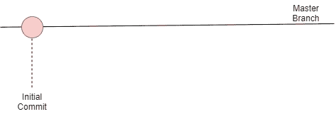

图 11.1 – 初始提交后的主分支

我们现在想继续我们的程序并添加更多代码到这个文件中。为了使生活更加安全，我们可以创建一个新分支并在该分支中进行更改。我们很快就会看到这可能是为什么。

要创建一个名为`subtract`的新分支，我们可以使用以下命令：

```py
git branch subtract
```

创建一个新分支将给我们一个从该分支创建的确切副本，在这个例子中是主分支。这可以如下表示：

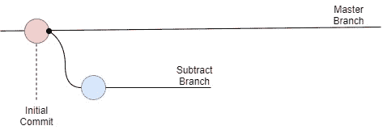

图 11.2 – 从主分支创建名为 subtract 的新分支

我们仍然在主分支上，所以我们将做的任何更改都将在这个分支上。因此，在我们做任何其他事情之前，我们应该切换分支。我们可以使用`checkout`命令来做到这一点：

```py
git checkout subtract
```

现在，我们已经在`subtract`分支上了。现在，我们可以更新我们的源代码文件，所以让我们添加另一个函数，使文件看起来像这样：

```py
function add(a, b)
    return a + b
function subtract(a, b)
    return a - b
```

如果我们保存这些更改，我们可以将文件添加到暂存区，并使用以下命令提交更改：

```py
git add calc.code
git commit -m "Added the subtract function."
```

我们可以用提交分支上的另一个圆圈来表示这个提交，如下面的图表所示：

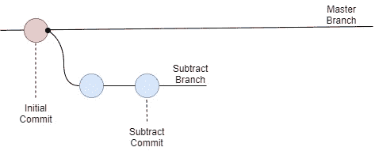

图 11.3 – 向我们的新分支提交

现在我们已经将更改提交到 GIT 中，我们可以切换分支。让我们使用以下命令来执行：

```py
git checkout master
```

如果我们现在打开文件，我们将看到以下内容：

```py
function add(a, b)
    return a + b
```

我们所做的更改不在这里。这是因为这些更改不在主分支上。在编辑器中保持文件打开，我们现在可以通过使用以下命令切换回`subtract`分支：

```py
git checkout subtract
```

就像魔法一样，我们对文件所做的更改又回来了，`subtract`函数就像我们离开时一样：

```py
function add(a, b)
    return a + b
function subtract(a, b)
    return a - b
```

这说明，如果我们出于某种原因决定我们所做的更改不好，我们总是可以回到我们的 master 分支，一切都会像我们开始之前一样。然而，如果我们对所做的更改感到满意，我们现在可以将两个分支合并在一起。在 GIT 中，这被称为**合并**。在合并两个分支之前，我们首先应该确保我们想要合并的分支是活动的。在这种情况下，它是 master 分支，所以我们写下以下内容：

```py
git checkout master
```

现在，我们准备好将我们所做的更改合并回 master 分支。我们可以使用以下命令来完成此操作：

```py
git merge subtract
```

这意味着我们取名为`subtract`的分支所做的更改，并将其与当前分支`master`的内容合并。我们可以用以下图表来表示这一点：

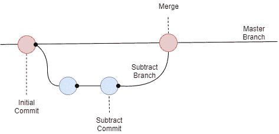

图 11.4 – 将 subtract 分支与 master 分支合并

这就是我们如何在本地机器上使用 GIT 进行版本控制的方法。现在，让我们看看我们如何使用它来与其他程序员协作，他们与我们一样在同一个项目上工作。为此，我们不仅需要我们的本地仓库，还需要一个中央仓库，我们可以用它来更新我们所做的更改。

假设爱丽丝和鲍勃都在同一个项目上工作，并想使用 GIT 来更新他们在项目中任何文件所做的更改。他们不仅会有我们之前看到的本地 GIT 仓库，而且他们还会连接到一个集中式仓库。他们所做的任何更改现在都可以推送到这个仓库，他们也可以从该仓库拉取其他人所做的任何更改。

这看起来可能如下所示：

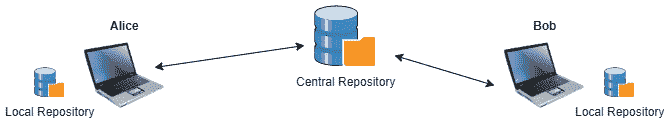

图 11.5 – 两位程序员连接到中央仓库

我们现在可以假设他们都将工作在我们之前看到的同一个文件`calc.code`上，并且它具有我们离开时的相同内容，如下所示：

```py
function add(a, b)
    return a + b
function subtract(a, b)
    return a - b
```

中央仓库通常被称为`multiply`函数：

1.  她首先应该做的是使用以下命令从中央仓库（origin）拉取最新版本：

    ```py
    origin points out the central repository, and master is the branch she wants to pull down. 
    ```

1.  她现在有了最新版本，她可以开始实现她的功能。她决定在一个新的分支上做这件事，因此她执行了以下命令：

    ```py
    git branch multiply
    ```

1.  然后，她将使用以下命令切换到这个分支：

    ```py
    git checkout multiply
    ```

1.  现在，她可以做出必要的更改，因此她将以下代码添加到文件中：

    ```py
    function add(a, b)
        return a + b
    function subtract(a, b)
        return a – b
    function multiply(a, b)
        return a * b
    ```

让我们让爱丽丝留在这里，看看鲍勃在做什么。

当爱丽丝开始她的工作时，鲍勃决定他想创建一个`divide`函数：

1.  就像爱丽丝一样，他将拉取`master`分支的最新版本，创建一个名为`divide`的新分支，切换到它，然后更改`calc.code`文件，使其看起来如下：

    ```py
    function add(a, b)
        return a + b
    function subtract(a, b)
        return a – b
    function divide(a, b)
        return a / b
    ```

    在这个时候，爱丽丝对她的更改感到满意，因此她将它们提交到她的分支，并将她的分支与主分支合并。

1.  现在，她想要将这些更改推送到中央仓库。不过，在她这样做之前，她想要确保中央仓库已经进行了更改。因此，首先，她尝试使用之前运行的相同命令从她的仓库中拉取任何更改：

    ```py
    git pull origin master
    ```

1.  由于自她上次拉取以来中央仓库没有发生任何变化，所以不会有任何变化。现在，她可以使用以下命令推送她的更改：

    ```py
    git push origin master
    ```

现在，她的更改已存储在中央仓库中。在这个时候，她的本地`master`分支版本和存储在中央仓库中的版本是相同的。

让我们回到鲍勃，他已经完成了他的功能。他在自己的分支中将更改提交到本地仓库，并将其合并到主分支中。现在，他准备将更改提交到中央仓库：

1.  就像爱丽丝一样，首先，他想要确保他已经从中央仓库获取了最新的更改，因此他发出一个`pull`命令：

    ```py
    git pull origin master
    ```

1.  这次，事情不会那么顺利。他收到一条消息，表示发生了合并冲突。那是什么？他打开代码文件，现在他看到这个：

    ```py
    function add(a, b)
      return a + b
    function subtract(a, b)
      return a - b
    <<<<<<< HEAD
    function multiply(a, b)
      return a * b  
    =======
    function divide(a, b)
      return a / b
    >>>>>>> div
    ```

    发生的事情是他和爱丽丝在同一行对同一文件进行了更改，在这种情况下是在文件的末尾。

    由于这个原因，GIT 变得困惑，需要帮助来决定文件中将包含什么。

    鲍勃看了看，理解了爱丽丝在文件中添加了一个函数，与他在同一位置添加的函数相同，他理解这两个函数都应该在那里。

    `<<<<<<< HEAD`标记表示冲突的开始。在那一行和`=======`行之间的内容是他拉取的更改。在`=======`和`>>>>>>> div`之间的代码是他的更改。

1.  由于他决定这两个函数都应该在这个文件中，他从文件中删除了三条标记行，所以现在它看起来像这样：

    ```py
    function add(a, b)
      return a + b
    function subtract(a, b)
      return a - b
    function multiply(a, b)
      return a * b  
    function divide(a, b)
      return a / b
    ```

他现在可以将更改提交到本地仓库，然后推送更改，以便爱丽丝稍后能够获取这些更改。

这说明了版本控制系统如何被用来在项目中的多个程序员之间共享工作。当然，版本控制系统还有许多其他方面我们没有在这里涵盖，但现在，你至少对版本控制系统能为你做什么以及如何用来与他人共享工作有一个概念。

此工具在整个开发过程中都被使用。现在，让我们看看代码编写时我们做什么，以及我们如何确保在将其推送到中央仓库之前它能够正常工作。

现在是进行单元测试的时候了！

# 单元测试

测试我们的代码是必要的，这样我们就可以验证它是否按预期工作。我们还将使用测试来确保我们对代码所做的任何更改都没有使之前工作正常的功能停止工作或以不期望的方式表现。

我们可以对我们的代码进行几种测试，我们将首先查看的一种测试类型称为**单元测试**。单元部分表示测试将在我们的代码的单独单元上进行。这通常是在函数级别。这意味着我们将尝试隔离一个单独的函数（或另一个小的代码单元），并仅在这一点上运行我们的测试。

这些测试通常由要测试的代码单元的开发者编写，并且通常是自动化的。这意味着一旦一段代码准备好提交到版本控制系统，它必须首先通过为其编写的单元测试。

由于单元测试只测试单个代码单元，因此它们通常是相当简单的。为了测试我们的`calc`函数，我们首先必须决定我们想要测试什么。首先，我们可以为有效输入设置一些测试用例，并将这些输入与一些预期的结果相匹配。

我们可以用这样的表格来做这件事：

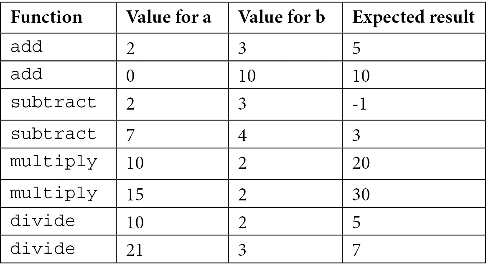

表 11.1

我们可以用这个来编写我们的测试。

单元测试通常是在一个单独的文件中编写的，该文件将调用要测试的代码。它们可能看起来像这样：

```py
function test_add_one()
  result = add(2, 3)
  assert.equal(5, result)
```

第一个参数，`assert.equal`，是我们期望的结果，它被与`result`变量的内容进行比较。如果它们匹配，则此测试将通过；如果不匹配，则测试将失败。我们现在可以继续以相同的方式为其余的测试用例创建测试：

```py
function test_add_two()
  result = add(0, 10)
  assert.equal(10, result)
function test_subtract_one()
  result = subtract(2, 3)
  assert.equal(-1, result)
function test_subtract_two()
  result = subtract(7, 4)
  assert.equal(3, result)
```

这里，我们只是列出了一些，但我们会继续这样做，直到列出所有剩余的。

对于像这样的简单测试，结构将是相同的——调用我们想要测试的函数，将返回的值存储在一个变量中，并将返回的值与预期的值进行比较。我们还应该考虑异常情况以及我们期望得到的结果。例如，如果我们调用`divide`函数会发生什么？以下是代码的显示方式：

```py
result = divide(10, 0)
```

正如我们在*第九章*中讨论的，“当事情出错——错误和异常”，我们不能将一个数除以零。这将导致异常。如果我们期望在这样做时得到一个异常，则函数正常工作，但如果我们期望函数处理这种情况，则需要对其进行修改。这是为了使其返回我们决定它应该返回的任何内容。如果我们决定我们应该得到另一个表示我们不能将 0 作为第二个参数传递的异常，则可能会发生这种情况。所以，无论我们期望什么，都应该进行测试。

这是我们应该在代码上运行的一种测试类型，但这些测试将只测试单个单元；也就是说，应用程序的一个隔离部分。我们还需要执行另一种类型的测试，称为集成测试。我们将在下一节中看到这是什么。

# 集成测试

集成测试是将几个单元组合在一起并测试它们，以确保它们在不再隔离的情况下也能正确工作。

一起工作的单元需要相互通信，它们将通过在它们之间传递数据来进行通信。这意味着集成测试是关于检查数据传输和数据表示方面是否工作。

想象一下，我们正在开发一个被划分为几个模块的项目。为了加快开发时间，我们让几个程序员分别处理不同的模块。这可能会看起来像这样：

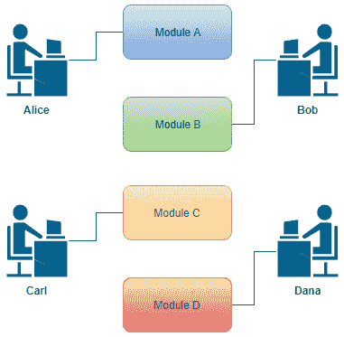

图 11.6 – 四位开发者正在处理四个不同的模块

这四位开发者现在将开始编写他们的模块，并且他们会通过在模块上运行单元测试来确保它们满足要求。但这些测试唯一能显示的是这个模块在独立状态下是工作的。

但在最终的应用中，这些模块将需要相互交互，当它们这样做时，它们将需要来回发送数据。这里的问题是所有四位程序员都是人类，人类倾向于对即使是描述最详细的内容也有不同的解释。所以，如果卡尔需要将一个年份的值传递给爱丽丝正在编写的模块，他可能会将其作为两位数的值传递，例如 23。但编写接收这些数据的代码的爱丽丝可能期望年份以四位数的格式出现，因此她期望是 2023。

如果我们追踪模块组合在一起时的通信，这可能会看起来像这样：

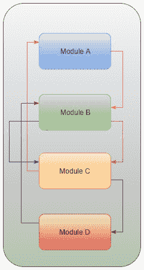

图 11.7 – 模块间的通信

这只是一个小的例子。在实际应用中，将有更多的模块和更多的通信行。但重点是，我们需要验证所有传递来回复的数据都是有效的，并且在所有情况下都能正常工作。

在这种情况下，我们需要进行所谓的**集成测试**。这是当我们测试当不同的应用部分组合在一起时是否正常工作时。

这可以通过几种方式来完成。我们可以采取一种大爆炸的方法，这意味着我们等待所有模块都完成，然后将它们组合在一起并测试它们。这种方法的不利之处在于模块不会同时准备好。如果编写模块 A 的爱丽丝完成了她的工作，她需要鲍勃完成他的工作，然后她才能集成测试她的模块，因为她的工作需要调用鲍勃的工作。对鲍勃来说也是如此：他需要在卡尔完成他的工作之前集成他的模块到应用中。

有其他方法，我们不需要等待所有部分都完成才开始测试。相反，我们创建*模拟*模块，称为**存根**和**驱动器**。存根是一个被另一个模块调用的模块，而驱动器是一个调用另一个模块的模块。我们可以创建这些模块来传递和接受数据，以便我们可以开始测试。它们不是完全功能的模块，但为了测试的目的，它们充当真实模块。随着模块的完成，它们可以替换这些存根和驱动器，然后可以在真实模块上进行测试。

有这些测试是必不可少的，部分原因是因为它验证了模块可以相互交互，但也为了未来。当我们后来添加新功能时，无论是通过更改现有模块还是添加新模块，我们都要确保之前工作的一切仍然有效。将新代码插入现有应用程序可能会产生不希望的结果，我们必须确保这种情况没有发生。

# 其他类型的测试

单元和集成测试并不是我们拥有的唯一类型的测试。根据我们正在创建的应用程序类型以及我们的软件在数据完整性、处理大量工作负载、与其他应用程序兼容性等方面的要求，我们可以选择公开代码以进行几种不同的测试类型。

让我们简要地看看这些测试。

### 系统测试

系统测试在系统完全集成到其执行环境时进行测试。在这里，我们将测试诸如登录是否工作，我们是否可以在应用程序中创建和编辑数据，用户界面是否正确显示数据，以及我们是否可以删除条目等问题。

这些事情通常在开发过程的早期就进行测试，但需要在源代码处于其生产环境时进行验证。

### 验收测试

验收测试通常分为四种不同类型：

+   用户验收测试

+   操作验收测试

+   构建和监管验收测试

+   阿尔法测试和贝塔测试

让我们详细了解一下：

+   **用户验收测试**：这是一种验证我们应用程序创建的解决方案是否适用于最终用户的方式。我们试图通过这些测试回答的问题包括用户是否可以使用软件，它是否是他们所要求的，他们是否在使用过程中遇到任何麻烦，以及应用程序是否按预期运行。

+   **操作验收测试**：这是在将应用程序发布给最终用户之前，验证应用程序操作准备就绪的。

+   **构建和监管验收测试**：这是为了验证所开发的软件是否符合与订购软件的组织签订的协议中规定的条件。监管测试验证软件是否符合当前的规定。

+   **alpha 和 beta 测试**：这是两种测试，用于验证和识别所有可能的问题和错误。alpha 测试在开发过程的早期进行，而 beta 测试则在开发过程的后期进行。它们都是由最终产品的潜在用户或与应用最终用户具有相似技能水平的一组人执行的。

### 回归测试

回归测试专注于在重大代码更改后寻找缺陷，并试图揭示软件回归。软件回归是在更新后使应用中某些功能停止工作的错误。还有软件性能回归，其中软件仍然正确运行，但更新损害了系统的性能。

这些是我们可以在我们的软件上执行的一些其他测试。还有很多，但我们在这里讨论的这些是最典型的测试，你作为软件开发者可能会遇到。

当我们拥有经过测试的代码时，我们可以将其提供给应用的用户。在我们讨论如何将我们编写的代码提供给用户之前，我们应该停下来谈谈什么是发布。

# 软件发布

在创建软件时，我们不希望从一个关于最终项目的想法开始，然后着手完成这个应用需要做的所有事情，几年后最终发布完成的软件。我们不希望这样做的原因是在开发过程中，会发生几件事情；例如，这个应用的需求可能会改变，新的法律可能要求我们以不同的方式做事，竞争的软件解决方案可能已经发布，仅举几个例子。

相反，我们希望实现一些核心功能，将它们发布给用户，然后立即开始开发下一个版本，这个版本将包含更多功能。这可以表示如下：

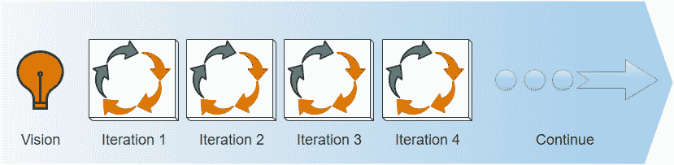

图 11.8 – 通过持续迭代进行开发过程

我们从一个愿景或想法开始。然后，我们取这个想法的一些基本部分，并在所谓的**迭代**中实现它们。在迭代阶段，我们执行几个步骤，我们很快就会更详细地探讨这些步骤。在迭代结束时，我们有可以发布给用户的可工作代码。然后我们开始下一个迭代，实现更多将在迭代完成后发布的特性。

在迭代过程中采取的步骤将因开发方法的不同而有所不同，但通常，它将类似于以下内容：

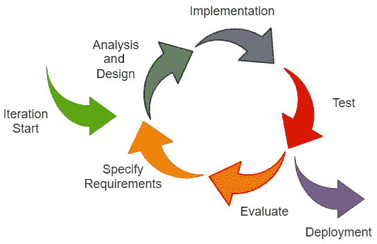

图 11.9 – 单次迭代过程中的典型步骤

在这里，我们可以看到我们将我们的想法和需求纳入开发周期。首先，我们将进行分析和设计步骤。在这里，我们试图回答两个问题：

+   我们将做什么（分析）？

+   我们该如何做（设计）？

当我们知道我们应该做什么以及如何做时，我们就可以开始实施构成这一迭代的各个部分了。

当我们完成一段代码后，它将进行单元测试，然后所有代码将进行集成测试。在代码发布给最终用户之前，也可能进行其他测试。发布代码被称为**部署**，这是我们很快将要更详细地探讨的步骤。

我们现在所完成的是一次发布，这意味着我们的软件现在有一些新功能或错误修复。

我们现在可以开始下一轮迭代。这是通过评估刚刚结束的迭代来完成的。这样做是为了我们可以微调我们的工作流程，看看我们是否在上一轮周期中发现了某些问题，或者任何其他我们需要在下一轮迭代中考虑的问题。

然后，我们可以指定下一轮迭代中要包含的内容，并使用它重复整个过程。

现在，让我们更详细地看看部署阶段，了解它是什么以及如何进行。

# 理解软件部署

当我们有代码要发布时，我们需要将其部署。部署是确保软件安装到正确位置的过程，确保它受到保护以防止任何黑客攻击，并确保软件被赋予必要的权限，以便它可以按需读取和写入文件。

当代码部署后，我们通常想再次测试它，以确保一切仍然按预期工作。

代码部署通常分为几个步骤。开发者通常会有一个在开发过程中使用的服务器。这被称为**开发服务器**，在开发过程中，代码可以在这个服务器上执行和测试。它通常会附带一个开发数据库，如果开发的应用程序使用数据库，则用于模拟应用程序处理的真实数据。尽管如此，它可以按照开发者想要的任何方式修改，因为它与用户看到和工作的真实数据是分离的。

在代码移动到生产服务器之前，即应用程序用户将使用它来运行应用程序的服务器，代码通常会被移动到一个中间服务器，通常被称为**预发布服务器**。这个服务器的角色是尽可能像生产服务器一样，以便新代码可以与已经发布的代码一起测试。目的是确保一切运行顺利，并且当新代码上线到生产服务器时不会出现任何错误。

预发布服务器也有一个数据库。这个数据库中的数据通常是从生产数据库复制过来的，以确保一切都是真实服务器的镜像。

最后，当团队确信一切正常时，代码将被移动到生产服务器。除了移动代码之外，可能还需要进行其他调整，例如向生产数据库添加新软件版本所需的元素，添加新代码使用的新应用程序和代码库等。这在此处展示：

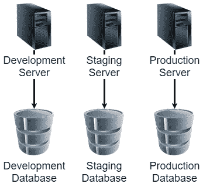

图 11.10 – 服务器及其数据库的示例

我们还必须有一个策略，以便在需要时能够撤销这次部署。无论我们的测试多么彻底，当代码进入生产并开始被用户使用时，我们从未想象到的问题开始浮现。用户可能会以不可预测的方式行事，与我们的预演环境相比，生产环境可能存在我们忽视的差异。

我们总是希望一切顺利，但如果我们遇到问题，我们需要有一个计划。我们希望的是能够尽快撤销所有更改，回到部署之前的状态。这被称为**回滚策略**。

我们可以通过几种方式实现这样的回滚。其中一种方法是在部署发生之前备份生产数据库。这样，我们可以确保在发布新代码之前，我们有应用程序中所有数据的快照。

实际代码通常在版本控制系统的帮助下部署到服务器上，因此将实际代码回滚到之前的版本相对简单。

将代码部署到生产环境涉及的步骤通常都是自动化的，这意味着不同的工具和应用程序负责所有步骤。让我们看看这种自动化是如何工作的。

## 部署自动化

尽可能地自动化尽可能多的部署步骤通常是一个好主意。原因是通常涉及许多步骤，需要按正确的顺序执行，这是一项非常适合自动化的工作。同时，这也是人类经常因为忘记做某事或以错误的顺序做某事而出错的地方。

根据系统的复杂性，我们可以使用多个工具来帮助我们实现自动化部署。

自动化部署将确保我们拥有高质量的代码，因为自动化过程通常会运行测试，并允许通过测试的代码进入生产服务器。

它还将节省时间，因为部署步骤将由部署工具以比人工执行更快的方式完成。

当代码部署后，与代码的工作并未结束。部署的代码必须得到维护。

## 代码维护

典型的软件开发者将花费更多的时间维护现有代码，而不是编写新的令人兴奋的功能。

如果我们仔细思考，这并不奇怪。首先，一个应用程序的寿命通常比开发它所花费的时间要长得多。这意味着越来越多的软件正在运行并执行它们的任务。

被使用的程序将始终需要维护，因为用户会发现我们必须修复的 bug，随着用户需求的变化，应用程序将添加新功能，而旧功能必须更新和改进。

这意味着开发者大部分时间都在处理旧代码，修复和更新它。这可能是由很久以前离开公司的某人编写的几十年前的代码，或者是由你上周编写的代码。

如果你提前思考你作为程序员的未来生活，你很可能会想象自己正在编写使用最新工具和功能的全新、令人兴奋的软件。然而，事实是，你更有可能正在探索很久以前编写的代码，那是在你上幼儿园时发布的语言版本。

有时候，你将有机会编写全新的、酷炫的、闪亮的软件，但记住，如果你做得好，这段代码将延续下去，并将需要由其他人（或你自己）在未来进行维护。

这就是软件开发者的生活。这意味着我们需要确保我们编写的代码尽可能可维护。一个熟练的软件开发者是编写高度可维护代码的人。这意味着代码清晰、易于理解，易于更改，而不会有人在不经意间在应用程序中引入一些不希望出现的副作用。

我们可以遵循一条简单的规则来帮助我们创建可维护的代码：童子军规则。

童子军规则的传说如下：

*离开营地时，让它比你来时更干净。*

我没有证据表明这条规则曾被实际的童子军使用过。更可能的是，这是童子军运动创始人罗伯特·巴登-鲍威尔在他去世前留给运动的信条的一个变体。在那封信中，他说：“尽力让这个世界比你所发现的时候更好。”

在《代码整洁之道》这本书中，作者罗伯特·C·马丁，也被称为 Uncle Bob，将这条规则转化为可以应用于代码的形式。他提出，如果我们在我们维护代码时应用这条规则，我们应该在每次维护时都让我们的代码变得更加整洁和更好，这样它的质量就会随着时间的推移而提高。我们可以将童子军规则与软件开发联系起来重新表述，使其说：“始终让你所编辑的代码比你所发现的时候更好。”

这些变化不必很大。你不必重写代码的大段内容。如果你将变量名改为更好地描述它所持有的值的名称，或者在一个代码片段中添加缺失的文档，这将略微提高代码的质量。

注意

在*第十二章* *代码质量* 和 *附录 A* *如何将伪代码转换为真实代码* 中，我们将深入了解我们如何编写高质量的代码，以及其他方面，同时考虑到可维护性。

现在我们已经了解了如何将软件交付给用户，当我们完成编写和测试后，我们应该更仔细地看看实际的开发过程。

# 软件开发过程方法论

自 1960 年代以来，已经开发出不同的方法论来帮助系统开发者更高效、更精准，并创建更高品质的代码。在这里，我们将探讨一些更基本的方法论——一些今天仍在使用的方法论，以及一些被更新、更灵活的方法论所取代的方法论。

## 瀑布开发

水晶球开发模型是几乎每个人都爱恨交加的一种。无论如何，我们都会看看它，因为许多新的方法论都是作为对其的反应而开发的。

它之所以受到厌恶，是因为它不会考虑需求的变化。

在瀑布模型中，几个定义的步骤被完成，一个接一个。以下图表中可以看到这些步骤的例子：

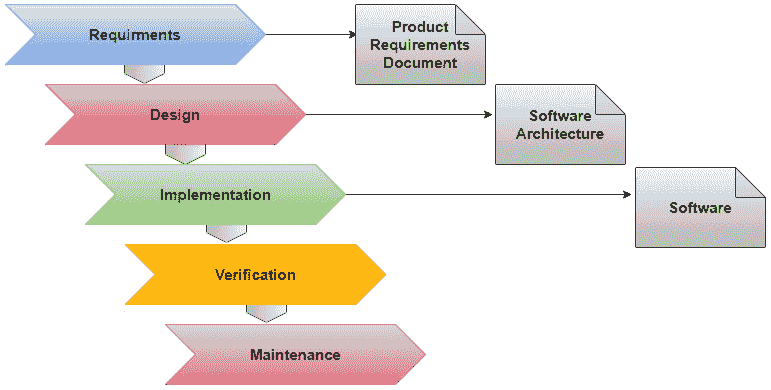

图 11.11 – 瀑布模型中的步骤

这就是这个模型的工作方式：

1.  首先，我们收集这个应用程序所需的所有需求。

1.  之后，我们进行系统设计，其中我们描述了不同的责任将如何在应用程序的不同部分之间分配。

1.  然后，我们编写代码。

1.  在验证阶段，代码被测试。

1.  最后，当软件发布后，它进入维护阶段，在那里它被维护。

这个模型的主要批评是它不会捕捉到在开发阶段可能（并且经常是）出现的新的需求。从最初的想法到最终产品的过程可能相当长，在这段时间里，会有很多事情发生，将对这个应用产生影响。新的法律可能会出台，竞争性的应用程序可能会发布，这个应用程序所依赖的操作系统和其他软件的新版本可能会发布，等等。

如果我们有一个无法捕捉这些变化的发展模型，我们很可能会开发出一个在发布之前就已经过时的产品。

现在我们已经看过了一种不再使用的方法论，或者至少，没有人会说自己在使用它，我们可以看看一些正在使用的方法论，这些方法论是作为对瀑布模型的反应而创建的。

## 螺旋模型

在 1986 年，美国软件工程师巴里·博姆描述并描绘了一个模型，这个模型不是从一个阶段到下一个阶段，而是呈螺旋形。

这个想法随后得到了发展和修改，形成了几种新的方法。然而，自那时以来，通过螺旋推动开发过程的基本思想一直很流行。

螺旋模型中的一个关键概念是在开发软件时将风险作为一个关键概念来考虑。

在下面的图中，我们可以看到螺旋模型的简化版本：

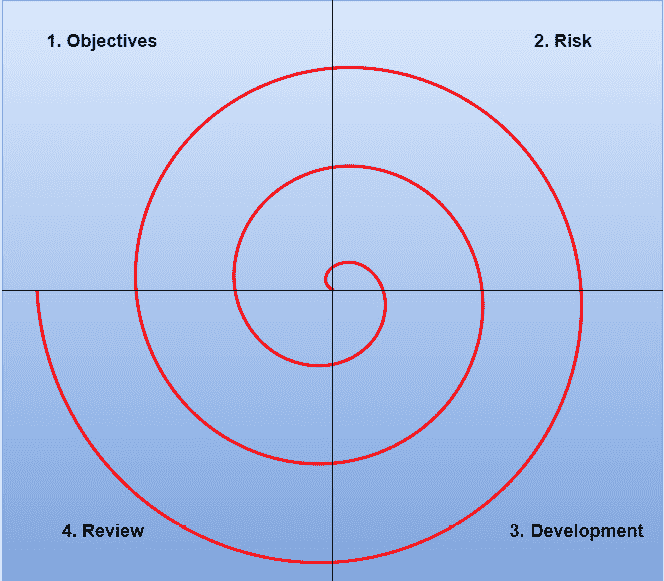

图 11.12 – 螺旋模型的简化版本

在这里，我们有四个不同的阶段。我们不会按顺序一次性完成它们，而是会根据需要反复迭代，直到应用程序开发完成。让我们看看：

1.  在第一阶段，我们查看目标，就像我们在开发过程中的这个阶段看到的那样。

1.  接下来，我们来看风险。什么可能阻碍我们成功实施刚刚确定的目标？通过识别风险，我们更有可能避免它们，或者至少最小化它们对我们软件的影响。

1.  当这一切都完成时，我们将继续开发和测试软件。

1.  最后的阶段是审查阶段。在这里，我们回顾在这个迭代过程中所做的一切，包括哪些做得好，哪些有问题。我们可以从中学习，以便下一个迭代做得更好。

然后，我们将从确定风险、开发和审查目标开始，为下一个迭代重新开始。

不断增长的螺旋图说明了，对于每个迭代，软件的创建量都在增加。

即使螺旋模型是作为对瀑布模型不足的反应而创建的，这个说法表明问题不是瀑布模型本身，而是开发过程变得非常漫长，因此无法对需求的变化做出快速反应。

螺旋模型为几个新的方法提供了灵感，其中开发过程被划分为更小的迭代。下一个就是这样的一个例子，也是目前大多数软件项目运行的基础。

巴里·博姆还说过，这个模型只是一系列小型的瀑布模型。

## 敏捷开发

敏捷软件开发是指一组基于迭代开发的软件方法。

术语**敏捷**来自 2001 年在犹他州 Snowbird 度假村相遇的 17 位软件开发者。会议结束后，他们发布了**敏捷软件开发宣言**。

宣言是对软件开发过程中应该优先考虑的内容的简要描述。

它可以在[`agilemanifesto.org/`](https://agilemanifesto.org/)找到。

这个宣言通过十二条原则进行了更详细的概述，称为**敏捷宣言背后的原则**，并且可以在[`agilemanifesto.org/principles.html`](https://agilemanifesto.org/principles.html)找到。

这些想法对软件行业产生了重大影响，并且根据宣言，开发了几种新的软件开发方法。

让我们来看看其中一些更受欢迎的。

### 敏捷 Scrum 方法

这种方法，更广为人知的是 Scrum，是一个轻量级的项目管理框架，它采用迭代和增量方法。

在 Scrum 中，产品负责人——一个有权决定哪些条目将进入应用程序的人——扮演着核心角色。这个人需要在整个开发过程中发挥积极作用。

产品负责人与开发团队紧密合作，创建一个优先级列表的系统功能，称为**产品待办事项**。产品待办事项包括为了成功交付一个工作软件系统所需完成的任何事情。待办事项中的条目可以是应用程序的功能、需要修复的 bug，以及非功能性需求，如认证、可访问性和数据完整性。

当待办事项中的属性被优先排序后，一个开发团队（如果需要，可能还有其他角色）将开始开发所谓的*可能发货的增量*。

这意味着团队将从待办事项中选取一些最高优先级的项目，并在一个称为**短跑**的短时间内开始实施它们。短跑通常持续 14 到 30 天。

短跑的结果最好是完全功能性的，以便它可以立即投入生产，并且用户可以开始使用这个功能。

然后，团队将重新开始一个新的短跑。这需要重复进行，直到必要。

### 精益软件开发

这种敏捷方法与 Scrum 一样是迭代的，并专注于交付完全功能性的批次。该方法非常灵活，没有任何严格的规定或指南。

它的主要思想是消除所谓的*浪费*。这是通过让系统用户仅选择对系统宝贵的功能来实现的。然后，这些功能被优先排序，并以小批量交付。

它依赖于来自软件用户的快速和可靠的反馈。在精益开发中，工作是由客户请求*拉动*的。

### 极限编程（XP）

这种方法最初由肯特·贝克描述，他是一位美国软件工程师，将软件最佳实践推向了极致。其中一个例子是代码审查。标准做法是，在代码可以与发布版本中的代码合并之前，应由另一位开发者审查所有代码。在 XP 中，这是通过使用*结对编程*的概念来实现的。结对编程是指两位开发者使用一台计算机来编写代码。其中一位被称为*驾驶员*，是负责编写代码的人。另一位开发者被称为*观察者*或*导航者*，将观察并审查驾驶员的行为。两人将频繁地交换角色。

与传统的代码审查过程相比，由于审查是在开发阶段进行的，这可以加快速度。结对编程的其他好处包括，驾驶员将始终从观察者那里获得关于如何解决当前任务的反馈。

XP 的目标是降低需求变更的成本。为此，XP 使用短的开发周期。

在 XP 中，需求变更是软件开发的一个自然、不可避免且可取的方面。

# 摘要

在本章中，我们探讨了软件开发中的一些更基本的概念，这些概念与实际的编码无关。即使我们不在大型、专业项目中工作，我们也应该对代码进行版本控制，编写测试以验证代码是否按预期工作，并迭代工作。

我们首先了解到，版本控制系统是一个伟大的工具，它不仅可以帮助我们回到代码的早期版本，还可以帮助我们与其他团队成员共享代码。

然后，我们看到为了验证我们编写的代码是否按预期工作，我们需要对其进行测试。在这种情况下，我们有一些称为单元测试和集成测试的内容，我们应该执行这些测试以确保应用程序产生正确的结果，并且新代码不会产生任何副作用，这会对在先前版本中成功工作的代码产生不良影响。

之后，我们看到软件发布生命周期定义了要执行哪些步骤才能使代码成熟到可以发布给最终用户。当代码准备好发布时，我们需要将其部署到环境中（例如，作为应用程序服务器），以便最终用户可以访问它。当代码被使用时，我们需要维护它。将发现错误，需要添加或更改功能，等等。

最后，我们了解到，为了处理开发过程，软件开发团队通常会使用一种开发方法。这种方法将描述事情应该按照什么顺序进行，团队如何合作以实现良好的结果，以及如何决定什么内容将包含在软件版本中。

在下一章中，我们将探讨如何编写高质量的代码，以及我们所说的代码质量是什么意思。
