# 第二章：设置环境

在上一章中，我们简要地游览了 Python 编程语言。在这一章中，我们将探讨各种下载和安装正确版本的 Python 的方法，然后我们将看到如何运行 Python 代码。在本章的最后几节中，我们将看到如何开始利用互联网上广泛可用的各种 Python 代码。

本章涵盖的主题如下：

+   下载和安装 Python

+   使用命令行和交互式外壳

+   使用 `pip` 安装包

+   在 Python 包索引中查找包

# 下载和安装 Python

本节的主题是下载和安装 Python 运行时和标准库。为此，让我们首先查看下载页面，[`www.python.org/`](https://www.python.org/)，这是当然的，是找到 Python 的权威地方。你将了解一些关于存在哪些 Python 版本以及我们应该为这本书选择哪个版本的信息。然后，我们将继续了解如何为这本书设置 Python。最后，我们将检查一切是否按预期工作。

在我们真正开始使用 Python 之前，我们需要确保我们已经正确安装了语言解释器和库。为此，第一步是决定要安装哪个版本的 Python。

# 选择合适的版本

目前有两种常见的 Python 版本在使用。其中之一是 Python 2.7，它是 Python 2 系列的最终版本。Python 社区承诺将独立维护 2.7 版本，使其成为开发的一个非常稳定的靶子。另一个常见的版本是 Python 3，在撰写本书时，它是 3.6 版本。

Python 3 是 Python 社区进行创新的地方。发布版本始终与早期 3 版本的版本向后兼容，但会定期添加新的令人兴奋的功能。在版本 3 的转换过程中，库中的语言在细微之处发生了变化，正如你在以下两个代码片段的比较中可以看到：

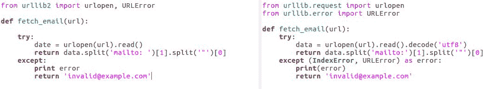

在前面的屏幕截图中，左侧是 Python 2，右侧你看到的是 Python 3 的等效代码。它们几乎相同，但有一些差异，例如括号的放置、几个关键字以及与标准库略有不同的结构。你可以自由选择你自己的项目想要的任何版本或版本，但在这本书中，我们将使用 Python 版本 3。

现在我们已经选择了版本，让我们来安装它。

# 安装 Python

如果你使用 Windows 或 Mac，可以直接从 Python 网站下载安装程序（[`www.python.org/downloads/`](https://www.python.org/downloads/)）。选择适合你电脑的安装程序，下载并运行它。我们还有选择下载源代码、编译它并通过这种方式安装 Python 的选项。

Unix 和 Linux 用户，以及喜欢它们的 Mac 用户，可以选择通过他们的包管理器安装 Python。对于集成了包管理器的系统，这可能是最好和最简单的方法。如果我们使用包管理器，这部分可能已经完成，否则我们需要确保 Python 程序可以从命令行运行。

在 macOS 和类 Unix 操作系统中，我们只需要在我们的主目录中的配置文件或`bashrc`文件中添加一行：

+   macOS X（编辑`~/.profile`）:

```py
    export  PATH=<pydir>:$PATH

```

+   Unix/Linux（编辑`~/.bashrc`）:

```py
    export PATH=<pydir>:$PATH

```

+   Windows:

1.  在控制面板中打开高级系统设置。

1.  点击环境变量...

1.  编辑 PATH。

1.  在末尾添加`;<pydir>`。

Windows 的设置稍微复杂一些，因为你需要打开控制面板并找到环境变量屏幕。在每个先前的例子中，`pydir`是你安装 Python 的目录——例如`C:\python36`。

一旦我们设置了路径环境变量，我们就应该可以开始了。为了检查这一点，请打开终端窗口（Windows 上的命令提示符）并输入`Python`，然后按*Enter*。如果你不知道如何打开终端，不要担心，我们将在下一章中更详细地讨论这个问题。

此外，如果你是 Unix 用户并且没有得到正确的结果，那可能是因为`bashrc`文件或配置文件还没有执行。你可能需要注销并重新登录。

如果我们在终端中输入`python`时 Python 交互式 shell 启动了，那么我们就准备好了。如果没有，请返回检查我们修改的路径环境变量，因为这是告诉操作系统在哪里查找程序的部件。

设置工作就到这里了。

如果你感到好奇，可以尝试使用我们刚刚启动的交互式 shell 进行实验。试着输入数学表达式，看看会发生什么。在下一节中，我们将更详细地探讨如何使用命令行和交互式 shell 运行 Python 代码。

# 使用命令行和交互式 shell

既然我们已经看了如何安装 Python，那么让我们尝试使用文本界面让 Python 真正做一些事情。

基于文本的用户界面对程序员非常有用；它们提供了在开发过程中快速轻松地与程序交互、实验代码（毕竟，代码是文本）以及访问文档的便捷方式。

# 打开命令行窗口

打开命令行窗口的方法取决于你使用的操作系统。

+   在 Windows 7 中，打开开始菜单，在运行框中输入`CMD`。

+   在 Windows 8 上，按 Windows 键，然后输入 `CMD` 并选择命令提示符。

+   在 Windows 10 上，按 Windows 键并选择命令提示符。

+   在 macOS 上，导航到应用程序 | 工具 | 终端。

+   在 Linux 或其他类 Unix 操作系统上，打开命令行窗口的精确机制各不相同，但它们都有这个能力；寻找 **xterm**、**终端** 或 **shell** 等词语。

# Python 交互式外壳

现在我们已经打开了一个命令行窗口，我们将直接进入 Python 交互式外壳。我们通过在命令行窗口中输入 `python` 来做到这一点。

如果你安装了多个版本的 Python，并且我们想要与指定版本进行交互，我们可以在命令行中通过输入该版本名称来显式选择版本。例如，如果我们输入 `python3`，我们将显式启动某个 Python 3.X 版本：

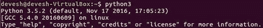

`python3` 命令用于 Linux 用户。Windows 用户应该输入 `python` 命令行来工作。

现在，真正的乐趣才刚刚开始！

当我们看到 `>>>` 提示符时，我们可以输入任何 Python 表达式或语句并立即看到结果（如下面的代码示例截图所示）：

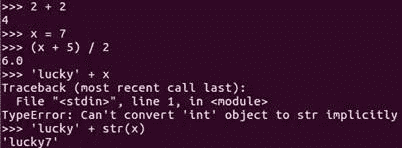

这非常实用，因为它意味着我们不必记住函数如何工作的每一个细节，类成员如何被调用，在什么情况下会引发哪些异常等等。当我们对某事不确定时，我们只需打开一个交互式外壳并查找答案。所以，让我们用一个简单的例子来讨论这个问题。

让我们假设我们正在开发一个使用 Python 的 `set` 数据类型的应用程序，并且我们不确定会引发什么异常。当我们尝试将一个集合添加到自身时，我们可能需要查阅文档，但直接在交互式外壳中创建一个集合并尝试将其添加到自身会更快捷、更简单：

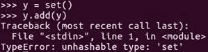

立即，系统告诉我们将一个集合添加到自身会引发 `TypeError` 异常。有时，在交互式外壳中快速进行实验是我们获取所需信息的最快方式，但文档也很不错。

幸运的是，Python 有一个非常好的文档系统，我们可以通过调用 `help` 函数直接从交互式外壳中访问它。我们可以将任何对象作为 `help` 函数的参数传递，它将为我们打印出该对象的文档。所以，如果我们想了解 `functools.wraps`，我们只需使用以下两个命令将其传递给 help 并阅读所有相关信息（参考以下截图）：

```py
import functools 
help(functools.wraps) 

```

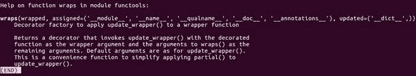

`help` 函数也可以使用以下代码代替对象本身来读取对象的名称：

```py
help('collections.defaultdict') 

```

这种格式可以节省我们在交互式外壳中输入 `import` 语句的时间：

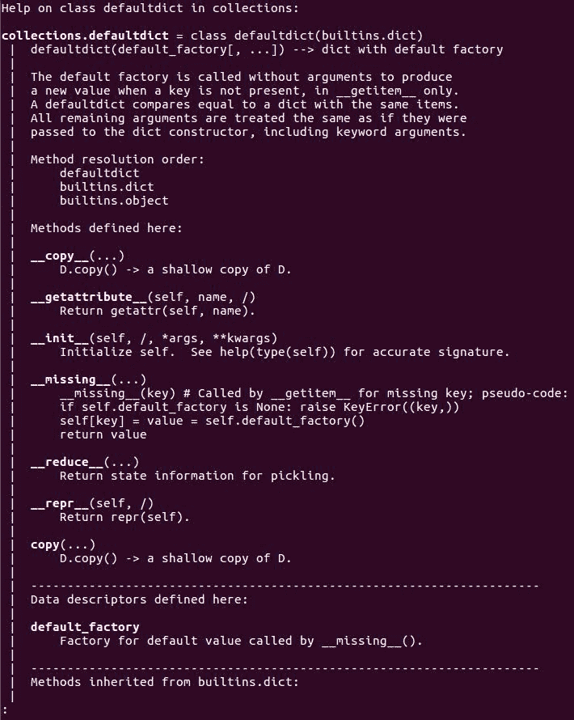

不同之处在于`help`参数是一个字符串，而不是一个评估为我们感兴趣的对象的表达式。

# 使用 pip 安装包

在本节中，我们将探讨使用 Python 包管理器来安装和管理第三方代码，现在，我们将回到操作系统命令行。我们将看到如何轻松地从 Python 包索引中安装第三方代码。

虽然 Python 自带了电池（即已经安装的标准库包含了许多非常有用的功能），但仍然有许多事情它做不到。不过，很可能某个人在某处已经为我们发明了轮子，如果这样的话，我们很可能在 Python 包索引中找到它。

# 包的 pip 工具

从 Python 3.4 版本开始，Python 通过名为`pip`的工具进行安装，它可以与 Python 包索引接口，自动查找、下载和安装 Python 包。如果你已经知道你想要安装的包名，并且你有权限写入 Python 的库目录，那么这个相对简单的命令就可以将其完全安装并准备好使用。

在这种情况下，我们安装了一个名为`banknumber`的包，该包检查某个人的银行账号是否是有效的银行账号或只是一个随机数。为此，只需添加`python3 -m pip install banknumber`命令并按*Enter*；我们就会得到以下截图所示的信息：

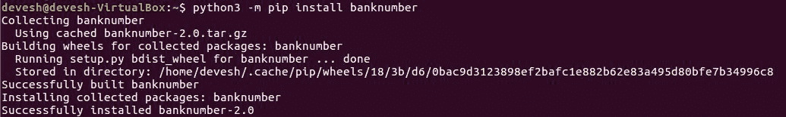

如果我们没有权限访问 Python 的库目录，不必担心。Python 会寻找第二个用户特定的库目录，由于那个库目录属于我们，我们总是能够在那里安装包。

要告诉 pip 我们将要安装到个人库目录中，只需在`install`命令后直接添加`--user`即可。在下面的截图里，我们正在将`requests`包安装到我们的个人目录中：

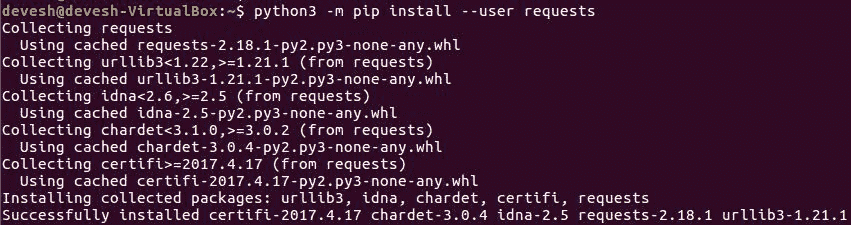

# 管理已安装的包

`pip`工具不仅能安装包，还能提供以下功能：

+   使用`-m pip list`命令查看当前已安装的包列表：

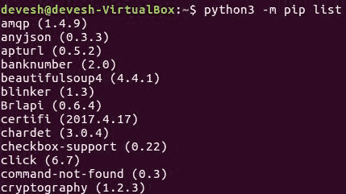

+   使用`-m pip install --upgrade`命令升级当前已安装的包到最新版本：

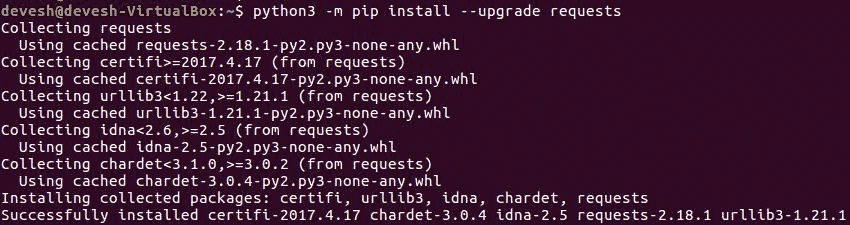

+   使用`-m pip uninstall`命令卸载我们不再需要的包。例如，如果我们想卸载`banknumber`包，我们可以通过以下命令来完成，如截图所示：

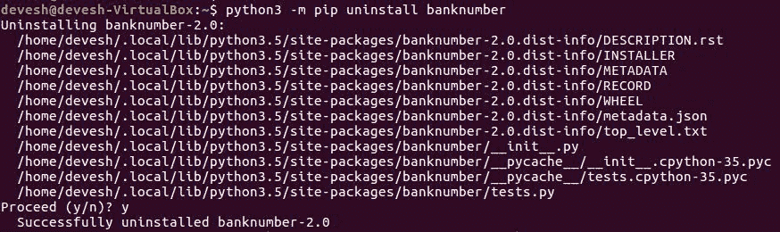

简而言之，这是一个适用于 Python 包的完整跨平台管理工具。

一些 Python 包要求我们能够编译用 C 编程语言编写的扩展才能安装，但幸运的是这种情况越来越少了。通常，如果需要编译的扩展，pip 将能够自动找到并安装适当的预编译版本。大多数可用的包都是纯 Python，不需要编译。

pip 工具有许多更多优秀的选项和命令行开关，但我们迄今为止所看到的已经很好地覆盖了常见情况。如果您想进一步了解，pip 的 `help` 命令将提供详细信息。例如，考虑以下命令：

```py
pip help install  

```

上述命令打印出有关 `pip install` 选项的所有可能信息：

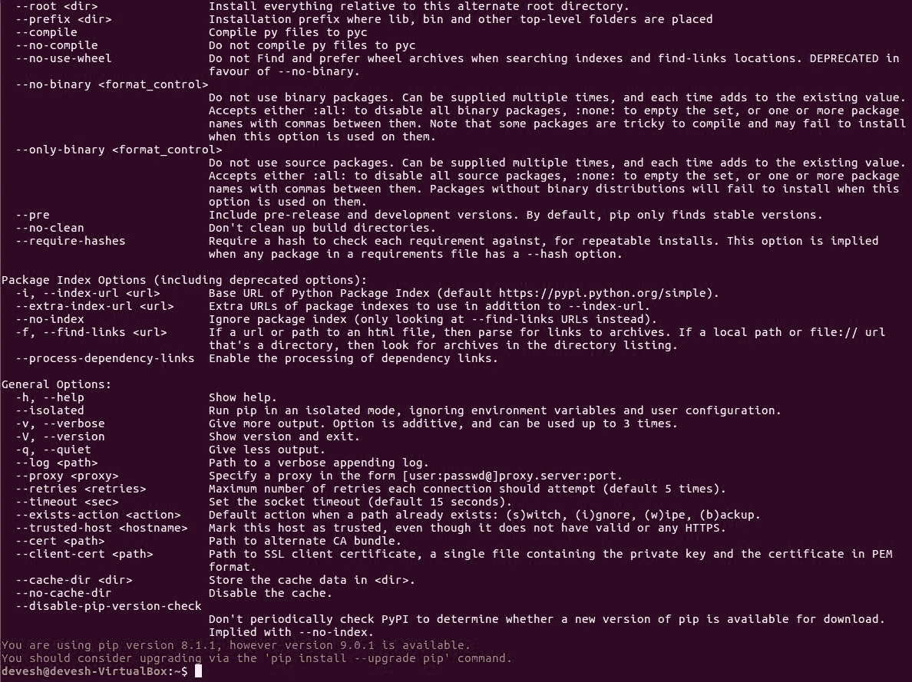

那么，既然我们已经知道了如何使用 `pip` 安装第三方包，我们该如何去寻找最初要安装的包呢？

# 在 Python 包索引中查找包

之前，我们讨论了从 Python 包索引中安装包，但如果我们没有需要安装的特定包怎么办？如果我们只需要一个库来帮助我们完成任务，但不知道具体需要哪个呢？嗯，正如本节标题所暗示的，Python 包索引实际上是一个包索引，它根据多个参数对包进行分类。索引方便地托管在 [`pypi.python.org/pypi`](https://pypi.python.org/pypi)。我们可以通过多种方式搜索可用的包。让我们详细讨论一下。

# 使用关键字

可能，访问索引最有用的方法就是简单地输入关键字到搜索框，看看它会输出什么。

如果我们要求搜索 `asyncio`，我们会得到一系列与 `asyncio` 有关的包名。当然，这些名称是链接到每个包在索引中的详细描述，我们可以使用这些描述来决定哪个包最适合我们的需求。

有另一种访问索引的方法，这种方法通常与关键字搜索一样有用，有时甚至更有用。

# 使用包索引

Python 包索引支持通过类别浏览其**包索引**。

您可以通过点击菜单中的“浏览包”链接开始浏览，这将带您到不同类别的列表。从那里，您可以点击它们来选择一个或多个类别，如果列表足够短，您将看到属于您所选所有类别的包列表。

如果您没有获得包列表，那是因为列表会如此之长，以至于对您没有任何帮助，您应该选择更多类别来缩小范围。如果在您选择的过程中某个类别从列表中消失，这意味着没有任何包能够在您所选的所有类别中运行。

Python 不仅是用英语编写的或被喜欢这种语言的人使用，而且一些包也提供了对其他语言的良好支持。这个列表是找到它们的好方法，而关键字搜索可能无法捕捉到这种细节。

# 使用 pip 搜索包索引

如果我们不希望打开浏览器去搜索索引，我们也可以通过命令行使用 `pip` 来完成，如下面的命令所示：

```py
$ python3 -m pip search asyncio   

```

此命令执行了我们在网页界面中之前所做的相同搜索：

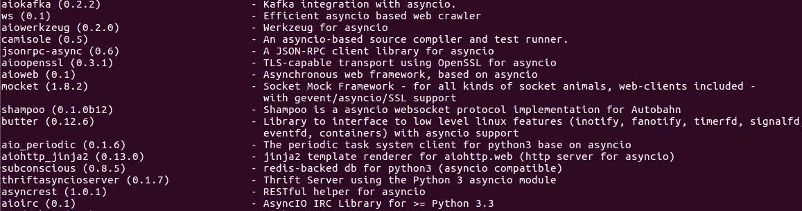

以这种方式操作通常更快；但如您在先前的截图中所见，它只提供了每个包的名称和简要描述。这对于快速提醒包名称非常完美，但对于更深入的研究则不太适用。

# Python 包索引的合法性和许可证

最后，关于合法性和许可证的简要说明！

Python 包索引中的绝大多数包都受到开源机构（**Open Source Institute**，**OSI**）认证的开源许可证的约束。这意味着基本上它们可以自由地作为其他开源项目的一部分被使用和分发。

在大多数情况下，许可证比这更宽松，允许我们将软件作为我们项目的一部分使用，即使我们不开源我们的代码。

大多数并不意味着全部，然而一些包不在 OSI 认证的许可证之下，而一些 OSI 许可证的包在封闭源代码项目中不可用。

因此，如果您打算分发您的软件，请花点时间确保许可证与您的目标一致。

# 摘要

在本章中，我们学习了如何安装 Python 并到达一个可以开始编写真实代码的位置。我们探讨了如何在命令行窗口中运行 Python 以及如何用它来进行实验和计算。我们还研究了如何充分利用 Python 的命令行及其广泛的 `help` 库。

我们学习了如何使用 `pip` 安装、卸载和升级包。我们还对如何通过 Python 包索引找到第三方代码以帮助我们推进项目有了相当的了解。

在下一章中，我们将逐步学习如何创建和使用我们自己的 Python 代码包。
