# 第八章：元编程

在上一章中，我们讨论了异步 I/O 和协程。在本章中，我们将注意力转向元编程和可编程语法。我们将讨论 Python 允许我们控制或更改语法元素意义的各种方法，并有益地使用这些特性。

我们将探讨 Python 的另一个可编程语法特性，它与函数装饰器很好地结合在一起。我们还将讨论类装饰器以及它们与函数装饰器的相似之处和不同之处。然后我们将看到使用元类以不同方式程序化修改类的方法。接下来，我们将转向一个不那么神秘的课题，讨论上下文管理器。最后，当我们查看描述符时，我们将探讨另一种编程 Python 基本操作语义的方法。

元编程是一个总称，用于描述程序使用程序代码或直接从程序代码构建的数据结构作为数据来操作的技术。Python 有许多不同的特性，可以被认为是元编程。

在本章中，我们将涵盖以下主题：

+   使用函数装饰器

+   函数注解

+   类装饰器

+   元类

+   上下文管理器

+   描述符

# 使用函数装饰器

在本节中，我们将探讨最普遍的**函数装饰器**之一。我们将看到如何构建一个装饰器，如何使用它，以及它是如何工作的。

装饰器的基本定义很简单。它只是一个接受另一个函数作为输入，对其进行一些操作，然后返回其操作结果的函数，如下所示：

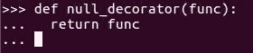

返回值替换了原始输入函数，因此装饰器可以做出的更改可能是相当剧烈的。一个完全不进行任何更改的装饰器是一个接受一个参数并立即返回它的函数。

# 在函数装饰器中使用@语法

Python 有一种特殊的语法来将装饰器应用于函数，使用`@`语法。使用这种语法，我们只需写一个`@`符号，后跟一个评估为装饰器函数的表达式。我们将它放在我们想要装饰的函数定义之前的行上，如下面的代码示例所示：

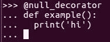

这种语法意味着一旦我们完成函数的定义，我们就调用装饰器函数，然后将装饰器的返回值赋给原本将包含函数的变量，如下所示：

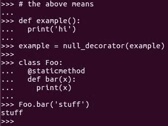

# 全局装饰器 - @staticmethod

Python 在全局命名空间中包含了一些装饰器，并在标准库中包含了一个不断增长的装饰器列表。最常用的全局装饰器是 `@staticmethod`。它使得类成员函数可以通过类而不是实例来调用，就像其他语言中的 `@staticmethod` 装饰器一样。以下截图展示了 `@staticmethod` 的代码示例：

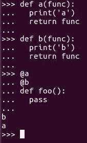

还可以在 `def` 前使用多个 `@` 行；这样，多个装饰器将被调用。最接近 `def` 的装饰器将首先被调用，然后其返回值将传递给下一个最接近的装饰器，依此类推。最终，最顶层装饰器的返回值将被分配给包含作用域中函数的名称，如下面的代码示例所示：

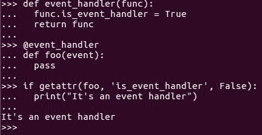

# 属性

装饰器最常见的一个用途——实际上，这就是它们被称为装饰器的原因——是向函数对象添加属性。这些属性可以被程序其他部分的代码用来区分装饰过的函数和未装饰的函数。

添加属性很容易。在装饰器内部，将一个属性分配给函数，就像我们为任何其他对象做的那样，然后返回它。然后，在代码的其他地方，检查该属性并根据需要进行响应。

这一切都很不错，而且通常非常有用，但我们还可以用装饰器做更多的事情。例如，我们可以在调用函数前后包裹一个执行某些计算的包装器。

# 在包装器中包裹函数

要在包装器中包裹一个函数，首先我们希望函数在装饰器内部找到包装器（参考以下代码示例）。如果你之前没有见过，它看起来就是这样——`wrapper` 函数的定义实际上位于 `@ints_only` 内部。所以当 `@ints_only` 被调用时，它定义并返回 `wrapper` 函数。

每次调用 `@ints_only` 时，它都会定义一个新的 `wrapper` 函数。

当一个函数在另一个函数内部定义时，包含函数的局部变量仍然对内部函数可用。参考以下代码示例：

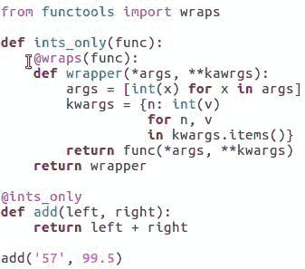

在前面的例子中，`wrapper` 对函数参数进行了一些操作，然后调用被包装的函数并返回其结果。我们在前面的例子中导入了并使用了名为 `@wraps` 的装饰器。

`@wraps` 装饰器的工作非常直接；它使包装器看起来像被包装的函数，以便于 `pydoc` 等工具使用。然而，`@wraps` 接受一个参数。

如果装饰器总是只接受一个参数，并且这个参数是它被应用到的函数，那么它将如何工作？让我们来看看。

# `@wraps` 装饰器

关键是 `@` 符号后面不是跟一个装饰器的名字；它后面跟着一个表达式，这个表达式会评估为一个装饰器。所以，wraps 实际上不是一个装饰器。严格来说，它是一个返回装饰器的函数。

当 Python 评估函数调用表达式时，`@wraps` 返回一个装饰器函数，然后将其应用于我们的包装器。

# 唯一函数

如果我们要修改我们的 `@ints_only` 装饰器，以便我们可以指定一个可以应用于所有参数的任意函数，它看起来就像前面的例子。所以现在我们有一个名为 `only` 的函数，它返回一个装饰器，然后装饰器再返回一个包装器。这个包装器调用原始函数。

这可能看起来效率极低，但实际上，唯一的开销来自于调用包装器。每次我们调用函数时，外层的两层代码在函数定义时只会运行一次。所以这就是使用函数装饰器和体验我们可以用它们做什么的方法。

# 函数注释

在本节中，我们将探讨如何将元数据与函数关联起来，而不仅仅是与我们在第四章“基本最佳实践”中讨论的文档字符串关联。在前一节中，我们的一个示例是一个自动将所有装饰函数的参数通过适配器传递的装饰器。

这很酷，但如果我们想对每个参数进行不同的处理怎么办？

当然，我们可以向包装器传递一大堆适配器，但随着我们开始处理接受更多参数的函数，这会变得丑陋而笨拙。我们真正想做的就是直接将元数据附加到函数的参数上。幸运的是，这正是函数注释的作用。

# 函数注释语法

以下代码示例展示了 Python 的函数注释语法：

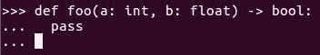

为了将一个值与参数关联起来，我们在参数名后放一个冒号（`:`），然后写一个表达式。这个表达式在定义函数时会被评估，并将结果与参数名一起存储。

我们还可以通过在函数参数列表后写一个 `->` 箭头符号，然后是一个表达式来注释函数的返回值，这个表达式在定义函数时也会被评估。结果会与单词 `return` 一起存储。因为 `return` 是一个关键字，所以它不会与参数名冲突。

# 访问注释数据

所有注释都存储在一个名为 `__annotations__` 的字典中，这是函数本身的属性：

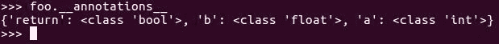

如前述代码示例所示，注释不是类型声明，尽管它们当然可以用作这种目的，并且它们与某些其他语言中使用的类型语法相似，如下所示：

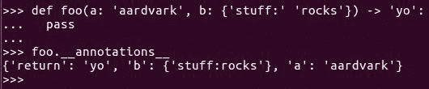

它们是任意表达式，这意味着可以在`__annotations__`字典中存储任意值。它们对 Python 本身没有增加任何意义，除了应该存储这些值。话虽如此，定义参数和返回类型是函数注解的常见用途。

# `@no_type_check`装饰器

如果你使用的是一个假设注解是类型声明的工具，但你希望将它们用于其他目的，请使用标准的`@no_type_check`装饰器来免除你的函数进行此类处理，如下所示：

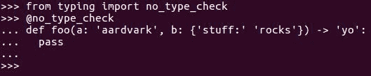

通常情况下，这并不是必需的，因为大多数使用注解的工具都有一种识别它们的方法。装饰器是为了保护那些情况模糊的边缘情况。

# 将注解作为函数装饰器的输入

注解与装饰器很好地结合在一起，因为注解值是向装饰器提供输入的好方法，而装饰器生成的包装器是放置赋予注解意义代码的好地方。

例如，让我们重写上一节中的装饰器示例。我们将只接受关键字参数，以保持示例相对简单：

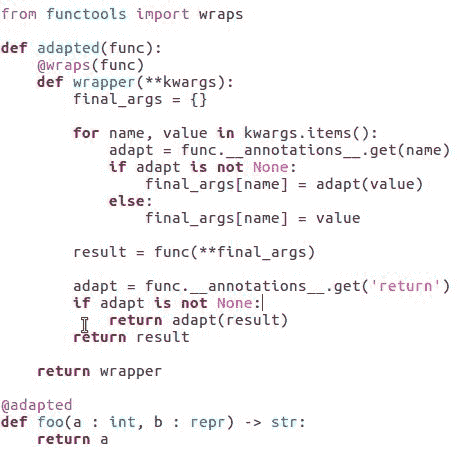

因此，`adapted`装饰器将函数封装在一个`wrapper`中。这个`wrapper`只接受关键字参数，这意味着即使原始函数可以接受位置参数，它们也必须通过名称指定。

一旦函数被包装，`wrapper`也会在函数的参数注解中查找适配器，并在将参数传递给实际函数之前应用它们。

一旦函数返回，包装器会检查是否存在返回值适配器；如果找到，它会在最终返回之前将适配器应用于返回值。

当我们考虑这里发生的事情的影响时，它们相当令人印象深刻。我们实际上修改了向函数传递参数或返回值的意义。

# 关键字参数

让我们看看另一个例子（参考以下示例）。有时，一个方法的一个或多个参数不需要任何处理，除了将它们分配给 self 的一个属性。我们能否使用装饰器和注解来使这种情况自动发生？当然可以。

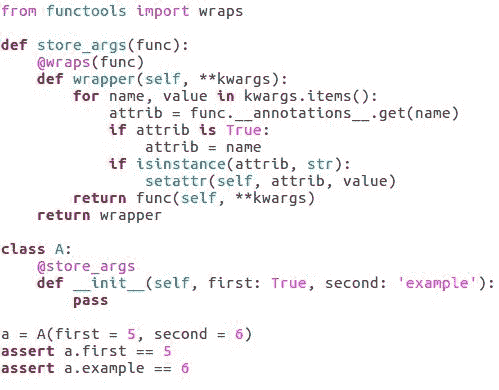

假设一个参数被注解为一个字符串，那么分配给该参数的值将被分配给 self 的一个属性，使用字符串作为属性名。如果参数被注解为 true，则属性将具有与参数相同的名称。如果没有注解，或者注解既不是字符串也不是 true，则不会发生任何操作。

再次，为了简单起见，让我们限制自己只使用关键字参数。正如前一个示例中所示，注解简化了代码库中所有类型的代码操作。在这里，我们基本上使用了与上一个示例相同的技巧，但我们用它们做了完全不同的事情。

我们一直将装饰器视为函数注解的主要消费者，但这并不一定是事实。任何使用函数对象的代码都可能被编写为从注解中受益。这意味着，在任何我们传递函数作为回调的地方，我们都有可能使用函数注解数据来使代码更智能地处理函数。

以下列表中展示了一些可能性：

+   事件处理器可以用处理器想要接收的值的名称进行注解

+   依赖注入可以以类似的方式自动化

+   基于约束的系统可以提供可以应用于每个参数的约束

+   概率推理系统可以用先验概率分布进行注解

+   参数可以用适当的用户界面元素进行注解，以便显示，以便用户输入该参数的值

# 检查包签名函数

在我们结束本节之前，我想指出一个可能对未来有帮助的事情。我们之前使用的示例装饰器都是限于关键字参数以保持简单：

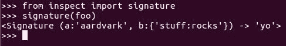

然而，如果你发现自己想要做类似的事情，同时还要处理各种参数，`inspect` 包的 `signature` 函数将显著简化这个过程。

因此，函数注解是向函数添加元数据的好方法；然而，它们可能会以各种方式影响后续对函数的处理。

# 类装饰器

在本节中，我们将探讨类装饰器，它们在概念上与函数装饰器相似，但打开了不同的途径。

类装饰器的工作方式与函数装饰器基本相同。类装饰器接收类作为其唯一的参数，它返回的任何内容都将替换那个类。这在下图中得到了说明：


返回值不必是相同的类，甚至根本不需要是类，但它应该是具有意义的东西。当它绑定到类的名称时，装饰器返回空值通常是没有用的。

类似于函数装饰器，类装饰器可以修改类的属性或用包装代码包围整个类。然而，修改类的属性实际上与修改源代码中的类是相同的。这意味着与函数不同，类装饰器实际上可以改变装饰代码的结构，而不仅仅是包装它。

# 修改类属性

修改类属性很简单；我们只需使用内置的`getattr`、`setattr`和`delattr`函数，如下面的代码示例所示：

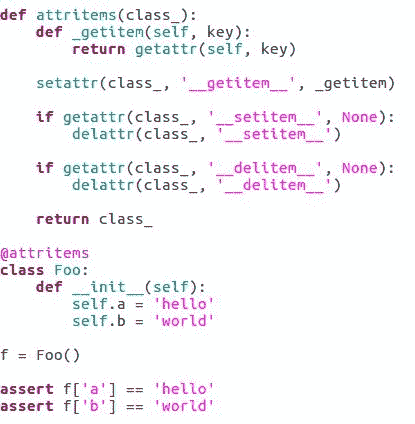

在前面的例子中，我们看到一个简单的类装饰器，它使装饰类的属性可以通过`[]`语法读取；同时，它确保类不允许你通过`[]`语法设置或删除值。虽然通过装饰器重写类可以是一个强大的技术，但它并不复杂或令人惊讶，所以对此没有太多可说的。

我们也可以完全封装类。这种技术的一个常见用途是它有助于用`factory`函数替换类。使用`factory`函数作为创建类实例的接口，让我们可以选择何时返回现有对象，如果有一个我们认为更合适的接口，而不是实际创建一个新实例。

# 工厂函数

调用一个`factory`函数意味着*给我这些参数的正确对象，而不是给我这些参数的新对象*。让我们看看一个用工厂函数替换类对象的示例类装饰器。

对于这个类的实例，我们将假设任何使用相同参数创建的两个实例实际上应该是同一个对象，如下所示：

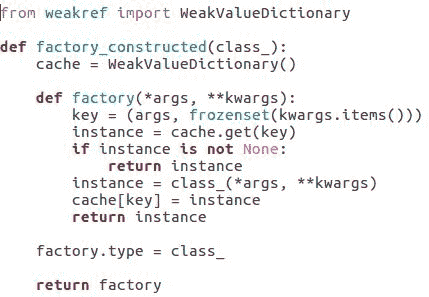

在前面的例子中，我们使用了`WeakValueDictionary`来跟踪类的现有实例以及与之构造的参数。

这与类装饰器本身没有关系；相反，我们这样做是因为我们不希望缓存阻止实例被垃圾回收。这是一个好的实践！

每当我们创建一个`factory`函数时，它会跟踪它创建的实例。在这个例子中，我们还展示了一个好的实践，即我们决定将类本身作为`factory`函数的属性。这意味着如果真的需要，`factory`函数外部的代码仍然可以访问类对象。

# 工厂构造函数

那么，让我们看看我们的工厂装饰器在实际中的应用。参考以下截图：

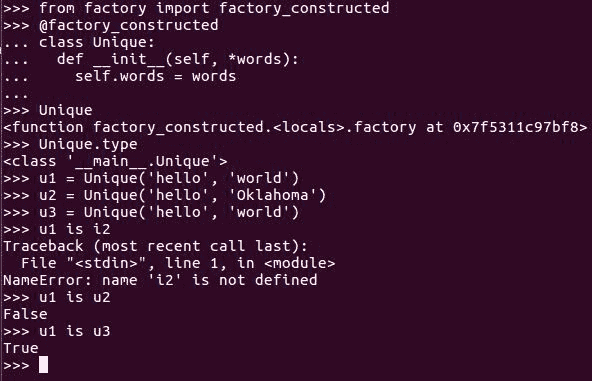

注意，名为`Unique`的东西实际上是创建给`Unique`类的`factory`函数，而不是`Unique`类本身。实际的类最终被命名为`Unique.type`。此外，注意`u1`和`u3`不仅相等，而且是同一个对象；而`u2`，它使用不同的参数创建，是不同的。

# 类定义

现在我们将看看一些真正疯狂的事情。我们用于定义类的语法相当通用；它可以用来表示各种不同的数据结构。那么，为什么不用类装饰器将类定义转换为各种类型的对象呢？

通过这样做，我们可以实现一种侧向装饰性编程范式。以我们的示例（接下来将要提到的那个）为例，假设我们想要连接到一个 sqlite 数据库，并在它不存在的情况下创建一些表。我们可以利用 Python 的类语法来方便地表达这个想法：

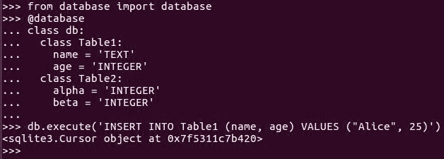

我们希望使用方式类似于以下代码示例，其中类结构和属性提供了构建和配置数据库连接所需的信息。最终结果应该是一个`connection`对象，我们可以使用它来根据 Python 数据库 API 发出查询。

这个例子忽略了或以简单方式处理了许多细节，但它捕捉了基本概念。Python 在评估这些语句时自动创建的类对象，用于向名为`@database`的装饰器提供结构化数据输入，然后被丢弃。

以下代码示例展示了`@database`装饰器：

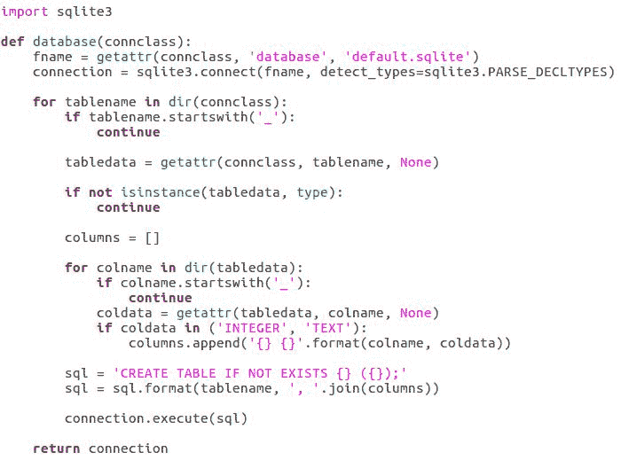

`@database`装饰器返回一个打开的 Python 数据库 API 连接对象，而不是任何类型的类。

# 元类

在本节中，我们将探讨元类，它从一开始就影响类对象的创建。

类似于类装饰器，元类是我们用来调整类基本意义的一种工具。在概念上，它们非常不同。类装饰器接受一个已经创建的类，并以某种方式对其进行转换。另一方面，元类可以影响类的创建方式、行为方式，甚至影响从修改后的类继承的类的创建和行为。

要理解元类，首先我们必须掌握一个概念，即类是对象，而且不仅仅是对象，它们是另一个名为`type`的类的实例。每次我们创建一个新的类时，我们都会创建一个`type`的实例，除非该类有一个元类，如下所示：

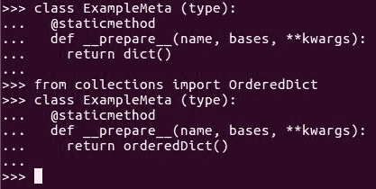

如果我们创建的元类被指定或从其祖先继承了一个元类，那么新类是元类的一个实例，而不是`type`的直接实例。

这听起来我们可以通过提供一个不寻常的元类来完全改变类的行为，但实际上所有元类都必须类似于`type`，否则 Python 无法正确使用它们。大多数情况下，元类实际上是`type`的子类，这使得事情变得简单。

# 我们可以用元类做什么？

首先，我们可以在`class`块内的代码被评估之前，为每个类的元类实例运行代码。我们通过将元类设置为`__prepare__`方法来实现这一点，这应该是一个类方法或静态方法，因为它将在实例创建之前被调用。

# `__prepare__`方法

`__prepare__` 方法会传递新类的名称、其父类列表以及用户提供的任何关键字参数。它可以执行我们想要的任何操作，但它应该返回一个字典或类似的对象，可以用来存储类的属性（参考前面的示例）。

我们可以在 `__prepare__` 内部预先分配属性字典的值，这样我们实际上可以在类存在之前就分配属性。这带我们来到了元类可以轻松控制的第二件事——**类的命名空间**。

在我们之前的示例中，我们从 `__prepare__` 返回了一个 `dict()` 实例，因此这个元类的实例在代码评估期间使用正常字典来存储它们的属性；然而，我们可以从 `__prepare__` 返回任何类似字典的对象。例如，如果我们想跟踪属性创建的顺序，我们可以返回 `OrderedDict`，或者如果我们想所有属性都有一个默认值，我们可以返回 `DefaultDict`。

我们甚至可以使用 `WeakValueDictionary`，如果出于某种原因，我们希望类在评估期间不保护其属性不被垃圾回收。当然，`WeakValueDictionary` 是一个存在于标准库中的类似字典的类。

我们还可以从 `__prepare__` 返回一个自定义的类似字典的类，这几乎可以做任何事情。如果我们想要一个在代码评估时忽略属性名称大小写的类，我们可以做到这一点。

# `__new__` 方法

我之所以一直说 *在代码被评估时*，是有原因的。在调用 `__prepare__` 之后，类块内的代码会被执行，并使用 `__prepare__` 返回的字典作为其命名空间，如下所示：

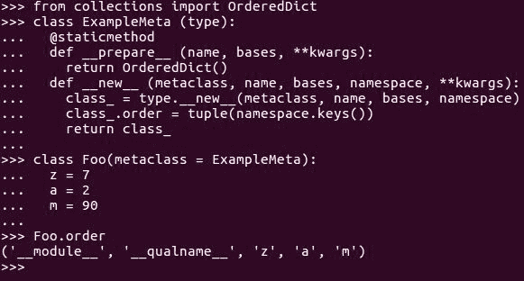

然而，之后会调用元类的 `__new__` 方法。`__new__` 需要做的一件事是调用 `type.__new__` 来实际分配和初始化一块内存以包含类数据，而 `type.__new__` 做的一件事是将我们传递给对象命名空间的任何内容转换为正常的 `dict`。

这意味着如果我们想保留 `namespace` 对象知道的特殊信息，我们需要将其存储在我们可以稍后找到的地方。

我们可以对类的内部进行任何我们想要的更改，如下面的代码示例所示：

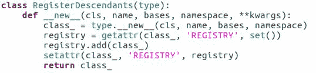

一旦我们在元类的 `__new__` 方法中创建了类对象，我们就可以像在类装饰器中一样编程地添加、删除、替换或包装类内容。我们也可以返回实际上根本不是类对象的东西，就像我们可以在类装饰器中做的那样。

除了多写一点之外，区别在于具有元类的类的子类也会继承那个元类，而类装饰器则不会继承。

这意味着，使用元类，我们可以使我们的非同寻常的行为可继承。

在这个例子中，你了解到任何从最初应用元类的类派生的类都可以找到所有其他也从该祖先派生的类。

# 上下文管理器

在本节中，我们将探讨可能是 Python 最常用的可编程语义元素——上下文管理器。

上下文管理器是代码片段，可以插入到 Python 的 `with` 语句中。一个 `with` 语句包含一个代码块，上下文管理器能够在该代码块执行前后运行自己的代码，以及保证无论代码块中发生什么都会运行的代码。

Python 标准库大量使用了上下文管理器：

+   `open` 文件可以用作上下文管理器，这保证了文件将在代码块结束时关闭：

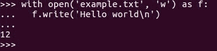

+   `lock` 对象可以用作上下文管理器，在这种情况下，它们在代码块开始前获取锁，并在代码块执行完毕后释放锁：

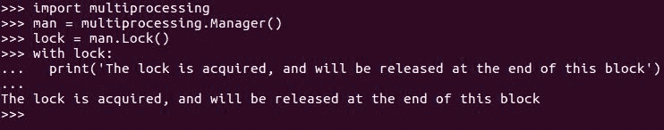

+   SQLite 数据库连接可以用作上下文管理器，允许它们在代码块结束时自动提交或回滚事务：

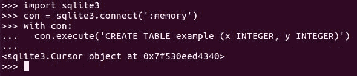

还有其他示例。我们已经在前面的示例中看到了上下文管理器是多么有用。它们通过组合设置和清理来简化代码，并通过保证它们将运行清理代码来改进代码。

# 将上下文管理器定义为生成器

那么，我们如何编写自己的上下文管理器呢？有两种方法。

最简单的方法是在生成器函数上使用 `@contextlib.contextmanager` 装饰器，如下面的示例所示：

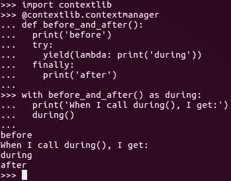

以这种方式创建上下文管理器时，我们可以将其编写为一整段代码。我们可以将 `yield` 语句视为 `with` 语句包含的整个代码块的代理。

如果这个块引发异常，它将把上下文管理器代码视为如果 `yield` 语句负责引发那个异常，因此我们可以用 `try` 语句包裹它来处理可能发生的任何异常。

当我们使用文件打开作为上下文管理器的示例时，我们看到了 `with` 语句的 `as` 子句（请参阅 `open` 文件的代码示例）；它允许我们将上下文管理器返回的值赋给 `with` 块内可访问的变量。如果我们从上下文管理器代码中产生一个值，那么这个值将通过 `as` 赋值。

在前面的示例中，我们产生一个打印单词 `during` 的函数，以便 `with` 语句的整个结果按顺序打印 `before`、`during` 和 `after`。

# 将上下文管理器行为添加到类中

我们还可以通过向对象添加`__enter__`和`__exit__`方法来编写上下文管理器。任何正确实现这些方法的对象都可以用作上下文管理器，这就是为什么像打开文件和数据库连接这样的对象能够作为上下文管理器额外工作。

# 基于同步协程的上下文管理器

以下是一个示例，其中我们创建了一个字典的专用版本，它可以作为上下文管理器使用：

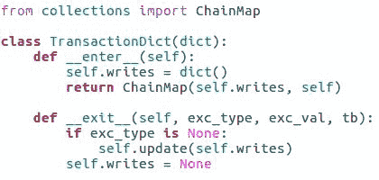

在`with`块的作用域内，我们可以通过从`__enter__`返回的对象读取和写入数据，但这些更改只会应用于主字典。如果块退出而没有引发异常，则内部方法的返回值将由`with`语句用于通过`as`子句分配的值。

参考以下代码示例，变量`trans`包含`ChainMap`实例。`ChainMap`对象是具有父字典的字典。如果在`ChainMap`中查找`'a'`失败，它会尝试在其父字典中查找相同的键。

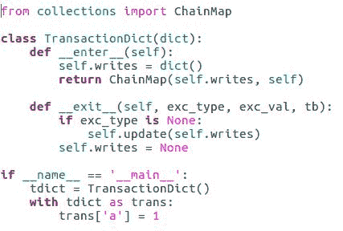

`__exit__`方法需要接受指定类型`exc_type`、`exc_val`和`tb`的参数，如果在`with`块中引发异常。如果没有引发异常，所有这些参数都将包含`None`。如果引发异常，我们需要决定上下文管理器是否以及如何处理它们。

在我们前面的示例中，我们决定根据是否引发异常来应用更改到主字典；否则，我们会忽略异常。如果我们想让 Python 考虑异常已被处理，我们可以从`__exit__`方法返回`true`。

这在功能上等同于使用`try-except`语句捕获函数。还有基于类的上下文管理器的另一种变体，它支持基于异步协程的上下文管理。

# 基于异步协程的上下文管理器

对于异步协议，`__enter__`和`__exit__`方法被替换为`__aenter__`和`__aexit__`协程方法，上下文管理器通过`async with`语句调用，如下所示：

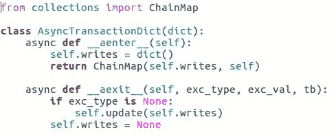

这个小小的改动让我们能够使`__enter__`和`__exit__`方法调用其他协程，等待从网络传入数据，并在基于`asyncio`的程序中表现得很好。

# 描述符

在本节中，我们将探讨一种最后一种改变基于 Python 语法的语义的方法，即使用描述符。读取和写入变量是编程中最基本的部分之一。Python 的描述符允许我们改变其工作方式。

描述符是一个存储在类中的对象，它控制了对于该类的实例来说获取、设置和删除特定单个属性的含义。如果我们想要对多个属性有这种控制，我们只需为每个我们想要控制的属性向类中添加一个描述符。

# 使用`@property`创建描述符

Python 的内置`@property`装饰器提供了一种简单的方式来创建描述符。让我们考虑一个示例（参考以下代码示例）来阐述这一点：

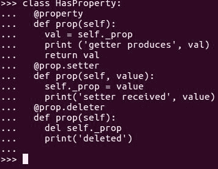

在前面的代码示例中，我们编写的第一个`prop`方法告诉 Python 如何确定一个名为`prop`的属性的值，在这种情况下，这仅仅意味着从另一个属性中获取它并打印其值。

后两个`prop`方法被装饰以将它们转换为`prop`属性的`setter`和`deleter`。这意味着将值分配给一个属性实际上意味着调用`setter`方法，而删除一个属性实际上意味着调用`deleter`方法。

这两种方法对于属性都是可选的。省略它们会使属性描述的属性成为只读属性。

# 将描述符作为类编写

属性简化了常见情况下描述符的构建，但也有一些用例需要我们创建属性无法很好地处理的描述符。例如，如果我们计划创建一个表示远程数据的类，并且希望其属性从远程源推送和拉取数据，我们可以使用属性来实现，但最终我们会反复编写非常相似的代码来实现每个属性。

最好有一个`RemoteResource`描述符类，并仅向我们的本地存根类添加大量实例。让我们使用`RemoteResource`描述符作为示例继续这样做；参考以下代码示例：

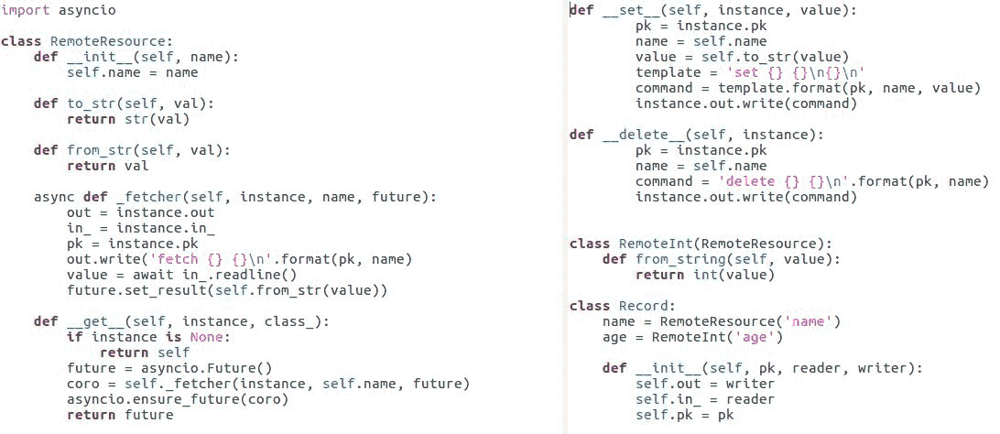

实际上，与网络交互需要相当多的代码，所以能够避免反复重复它是件好事。

在前面的示例中，我们拥有的`RemoteResource`类有`__get__`、`__set__`和`__delete__`方法，这些方法决定了当由该类的实例控制的属性被访问时会发生什么。

+   `__get__`方法可能令人惊讶地接受两个参数——通过该参数访问属性实例和通过该参数访问属性的类。这样做是为了我们可以处理`instance`属性访问和`class`属性访问。

    +   当访问一个`class`属性时，`instance`参数是`None`。在我们的情况下，我们只是返回了描述符，以防有人试图将属性作为类成员而不是实例成员来访问，这在很多情况下是一个合理的默认值。

+   `__set__`方法接收一个实例和值作为参数，在概念上表示将该实例的控制属性设置为该值。与`__get__`不同，它不支持设置`class`属性，因此实例永远不会是`None`，我们也不需要`class_parameter`。

+   `__delete__`方法只是传递一个实例，表示从该实例中删除控制属性。

没有任何描述符方法被告知它们代表哪个属性。假设它们的`self`参数会以某种方式指定这一点。

在我们的代码（在先前的代码示例中），我们选择将必要的信息传递给描述符的构造函数，并将其存储为`self`的一个属性。但在其他情况下，我们可能会使用`self`或`selfs ID`作为字典中的键来存储描述符的每个实例状态，或者将实例作为存储在`self`中的字典的键，如下面的代码示例所示：

```py
class Record:
    name = RemoteResource('name')
    age = RemoteInt('age')
    def __init__(self, pk, reader, writer):
        self.out = writer
        self.in = reader
        self.pk = pk

```

尽管如此，我们并不能仅仅将每个实例的数据存储为`self`的属性。描述符是类的属性，而不是实例的属性，因此它们的`self`值被包含它们的类的所有实例共享。无论如何，我们可以控制获取、设置或删除实例属性的含义。

一旦我们有了`RemoteResource`类，创建具有远程属性的类就变得容易了，正如前面图像中显示的`Record`类所示。

# 摘要

在本章中，我们看到了几种改变 Python 代码含义和执行方式的其他方法，使我们能够使语言符合我们的特殊需求。

我们看到了函数装饰器如何使用函数作为操作的数据输入。我们考察了函数注解，特别是它们与函数装饰器的交互。我们看到了类装饰器是如何像函数装饰器一样工作的，但由于它们操作的是类，所以可能性非常不同。我们看到了如何使用装饰器修改类、包装它们或甚至用装饰器替换它们。我们讨论了如何使用元类来影响类对象的构建，以及如何通过将其作为类元类的一部分来使异常行为可继承。我们考察了上下文管理器，包括同步和异步的上下文管理器。我们看到了上下文管理器是如何工作的，并学习了如何为我们自己的同步或异步代码创建上下文管理器。我们看到了如何使用`property`函数创建简单的描述符，以及如何创建更复杂的描述符作为类。

在下一章中，我们将探讨自动化单元测试——测试一组可能显著提高编写程序过程的技术。
