# 第十章：响应式编程

在上一章中，你学习了单元测试和`unittest.mock`包。在本章中，你将掌握响应式编程的概念，然后了解 RxPY 响应式编程框架。我们将巩固你对响应式编程的概念理解，并从头开始构建一个非常基础的响应式编程系统。

在本章中，我们将涵盖以下主题：

+   响应式编程是什么意思？

+   构建简单的响应式编程框架

+   使用**Python 的响应式扩展**（**RxPY**）

# 响应式编程的概念

我可以以很多不同的和有效的方式来定义响应式编程。这取决于视角和焦点。哪一种定义最好？在本节中，我们将介绍几种定义。

也许，响应式编程最基本、至少在实现响应式编程系统时需要考虑的定义是它是一种事件处理发布/订阅模型。以下图表说明了基本的响应式事件处理：

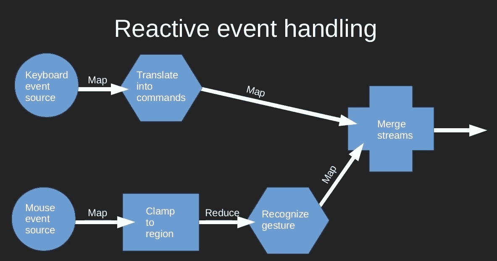

在传统的响应式编程命名法中，有**可观察对象**和**观察者**，它们分别封装了事件发布者和事件订阅者的行为。在一个响应式编程系统中，一切，或者至少尽可能多的事物，都是一个可观察对象或观察者。到目前为止，一切都很顺利，但仅仅依靠发布/订阅模型本身并不那么令人兴奋。

当我们认识到可观察对象在概念上与列表非常相似时，响应式编程才真正发挥其优势，这意味着函数式编程工具，如 map 和 reduce，有强大的类似功能可以应用于可观察对象。因此，响应式编程的第二种定义是它是一种**事件驱动的函数式**编程。

比如说，我们可以取两个可观察对象，对一个中的对象应用一个函数，将结果与另一个合并，然后将合并序列减少到一个新值，这是一个强大的想法。我们可以提前描述我们想要执行的所有操作，每当根可观察对象之一产生新值时，它将通过我们的整个处理链级联，而无需我们进一步的努力。

函数式编程操作大多是状态无关的，当它们不是状态无关时，状态至少是容易定义和保持的。这意味着我们的以事件驱动为主、状态无关的响应式编程系统非常适合异步或并行执行。因此，我们对响应式编程的第三种定义是它是一种编写高性能异步或并行代码的系统化方法。

那么，什么是响应式编程呢？让我们把这些定义放在一起。响应式编程是一种事件驱动的范式，其中事件源可以对其应用功能操作符以创建新的事件源。这是可取的，因为它导致程序在异步或并行执行环境中表现良好。

# 构建一个简单的响应式编程框架

您已经从理论上理解了响应式编程的含义。现在，我们将非常具体地构建一个简单的响应式编程系统，然后构建一个演示，以便我们可以观察其运行情况。形式化响应式编程的根源在于静态类型语言，尤其是 C#。对于我们这种基于动态类型语言的用户来说，这并不重要，但它确实意味着这些想法的标准表述与类型、模板、接口和匿名函数紧密交织。在这里，我们将稍微不那么 Pythonic，也许会稍微多一些 C#风格。话虽如此，让我们继续编码。

# 观察者

可以说，响应式编程系统中最基本的元素是观察者接口。如何通知一个对象序列中的下一个项目正在观察它的定义是可用的。在下面的代码示例中，我们从一个抽象基类开始，这是 Python 中与 C#接口最接近的等价物：

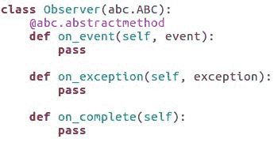

我们的`Observer`类根本不定义任何功能，只定义方法名称和签名，并保证从它继承的类必须实现至少`on_event`方法。为了实现完整的功能，它们还必须实现`on_exception`和`on_complete`，但这不是必需的。

因此，意图是`Observer`类将为序列中的每个元素调用一次其`on_event`方法，如果观察者在观察它时序列终止，则随后调用其`on_complete`方法。如果出现意外情况，将调用`on_exception`方法代替。

为了使`Observer`类有用，还必须有一个`Observable`类。那么，让我们看看这个类的开头。

# 可观察对象

与`Observer`类似，`Observable`也是一个抽象基类，尽管在这种情况下，我们提供了所有功能的有意义默认实现。

在下面的代码示例中展示的`subscribe`方法，是`Observer`类连接到`Observable`类的方式，将自己注册为`Observable`类发出的事件的消费者：

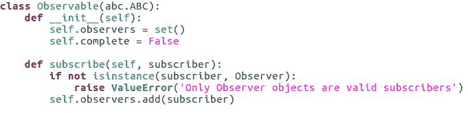

# 发射事件

有三种方法负责处理事件的发射。具体如下：

+   用于发送正常事件的一个

+   用于发送异常的一个

+   用于发送“此序列已结束”事件的一个

这些在下面的代码示例中展示：

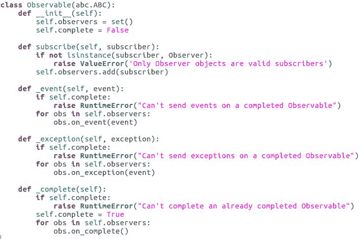

在每种情况下，它们都会进行一些错误检查，然后循环遍历已注册的观察者并调用适当的方法。这些方法以单个下划线（`_`）为前缀命名，表明它们不是`Observable`类的公共接口的一部分。它们是帮助子类更容易编写的辅助工具。

这不可能是一个完整的响应式编程系统，对吧？是的，也不是。它从根本上说是完整的，但它缺乏许多改进，并且绝对还没有准备好进入生产环境。不过，它将很好地作为我们的演示程序的脊梁，所以让我们继续吧。

# 构建可观察序列

对于我们的演示，我们将创建一个程序，打印出大致代表我们可能在动物园中听到的声音的消息。动物将被表示为可观察的，它们在随机的时间间隔内发出事件，代表声音。我们将使用合并和映射来组合和修改事件序列，最后打印出结果序列。

因此，首先，我们有我们的`Animal`类，它是一个可观察者，以及`AnimalEvent`辅助类。`Animal`类包含一些基本信息和一个协程，该协程将异步运行，并偶尔向`Animal`类的观察者发送事件，如下面的代码示例所示：

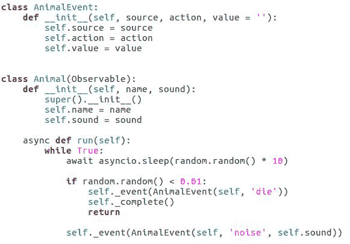

通过查看前面的代码，我们可以看到动物实际上是一系列噪音事件，然后是一个掷骰子的事件，紧接着是序列的完成。

我们希望某些动物能够发出响亮的声音。我们不会将这种能力添加到`Animal`类中，而是将在事件序列上创建一个映射，用响亮的声音事件替换随机选择的噪音事件。

这个映射既是观察者，因此它可以订阅事件序列，同时也是一个可观察者，因为修改后的事件序列仍然是一个事件序列，如果另一个可观察者无法订阅它，那么它就没有什么用处。

这就是我们在对可观察序列应用操作符以创建新的可观察序列时，任何响应式编程系统所发生的根本性事件。然而，在几乎所有情况下，一个真实的响应式系统都为我们提供了一个更快、更简单、通常也更有效的方法来做这件事。

确实创建一个既是观察者又是可观察者的类是非常罕见的！

# 展示一系列动物事件

在我们开始组合事物之前，我们还需要一个显示动物事件流的方法。对于这个任务，另一个观察者是一个明显的选择，并且正如你将在下面的代码示例中看到的那样，这实际上非常简单：

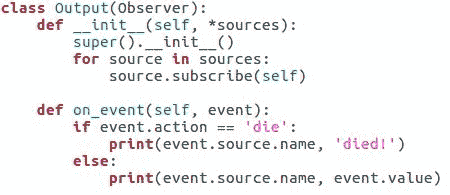

新观察者的代码与我们之前看到的类似；我们需要的只是一个构造函数和一个适当的`on_event`方法。

# 组合可观察序列

现在我们已经拥有了所有部件，我们该如何将它们组合起来以实现我们的目标呢？嗯，首先我们创建我们的动物对象，然后使用`SometimesLoud`和`Output`类来创建我们的修改后的复合序列，并像以下`animals.py`代码示例中所示那样显示它：

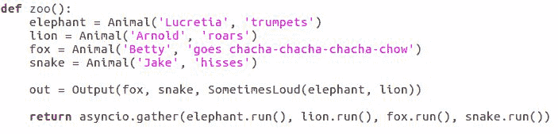

然后，我们需要通过`asyncio`调度每个动物的运行方法以进行异步执行，这在以下示例中是隐式发生的，当我们把它们作为参数一起传递到`__main__.py`文件中时：

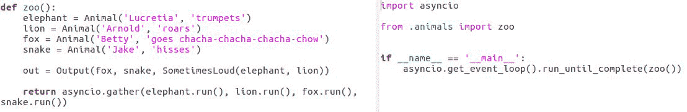

我们的`__main__.py`文件实际上运行了`asyncio`事件循环。所以，现在我们只需坐下来，观察我们想象中的动物园的伪混乱，如下面的输出窗口所示：

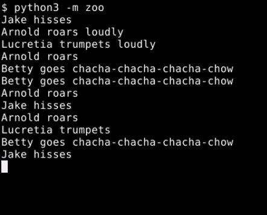

你注意到我们的程序的核心被简化为一行代码了吗？

当然，我们有一个整个文件是关于这个框架的，但这可以重用。我们还有`SometimesLoud`和`Output`类，但它们存在的唯一原因是我们可以看到这个程序每个步骤中确切发生了什么。

在一个真实系统中，`Output`和`SometimesLoud`将使用内置功能将函数映射到序列上，正如我们将在下一节中看到的。所有这些都让我们只剩下一行代码，这行代码组合了多个可观察序列和转换，并定义了程序的大部分行为。这一行代码展示了响应式编程的力量。

# 使用 Python 的响应式扩展（RxPY）

现在我们已经对响应式编程有了基本的了解，让我们看看更广泛使用的响应式编程框架之一，称为**响应式扩展**，通常简称为**ReactiveX**，或者简单地称为**Rx**。

Rx 不是 Python 标准安装的一部分，因此我们需要使用`pip`来安装它。没问题；这只是一个命令，如果你更喜欢将安装到 Python 系统库而不是用户库，或者你正在使用由`--user`命令创建的虚拟环境中，如下所示：

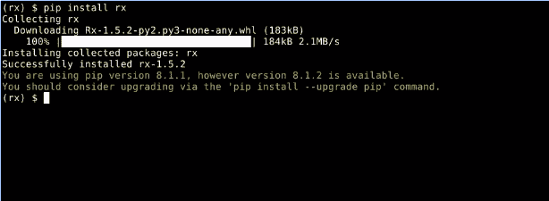

一旦我们安装了 Rx，我们就可以继续进行有趣的部分。

# 将我们的动物园演示转换为 Rx

就像我们上一节中的示例一样，Rx 提供了`Observer`和`Observable`类，并且它们包含相同的基本功能。

最明显的区别是 Rx 的`Observable`类有许多工厂方法，可以用来构建特殊用途的可观察对象，特别是基于一个或多个其他可观察序列生成序列的可观察对象。换句话说，我们将使用的大多数操作符和操作都是`Observable`类的方法。

让我们花点时间重写上一节中的演示，并在 Rx 中看看这意味着什么。

`AnimalEvent`类可以保持不变，因为它只是一个数据结构，并不知道谁在使用它以及用于什么。我们的`Animal`类变化很大。运行协程方法消失了，取而代之的是稍微简单一点的`generate_event`方法（参考下面的代码示例）：

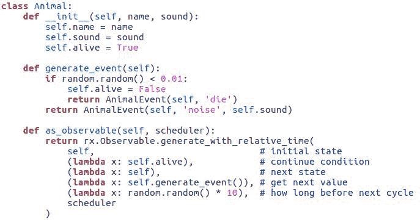

顺便说一下，那个名字并不重要；它只是我选择的一个合理的名字，因为它描述了该方法的功能。

如前述代码所示，`generate_event`方法本身并不包含旧运行协程方法的所有功能。它知道如何发出事件，但不知道如何等待一段时间后再做。这就是`as_observable`方法发挥作用的地方。

# 可观察的工厂方法

`as_observable`方法使用`Observable`类的工厂方法之一来创建一个可观察的序列。这个序列在功能上是一个生成器，尽管它并没有作为生成器实现，因为 Rx 可移植到的不是每种语言都存在这个概念。

因此，我们不是提供一个真正的生成器，而是提供一个状态变量，在这个例子中是动物实例，以及它可以调用的函数来检查序列是否继续，更新状态，获取序列中的下一个值，或者确定在产生下一个值之前要等待多长时间。工厂方法还接受一个调度器对象，我们将在本节稍后讨论。所以，在这段代码中，我们要求的是一个产生动物事件的可观察序列，这些事件在 0 到 10 秒的随机间隔内。现在，`Animal`类可能比以前简单一些；没有太大的区别。

然而，让我们看看`SometimesLoud`和`Output`类发生了什么（参考下面的代码示例）；它们不再是类，只是函数，并且要简单得多：

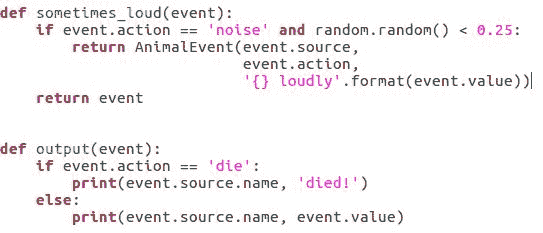

`sometimes_loud`函数接收一个事件并返回一个事件，我们将用它将一个事件的可观察序列映射到一个新的序列中，就像在函数式编程环境中预期的那样。`output`函数接收一个事件并返回 none，这在函数式系统中对`side_effect`的预期也是一样的。

# 解释事件的可观察序列

现在，我们有了我们的可观察工厂方法和一个用于接收和返回事件的函数；我们需要做什么来把它们全部组合起来？首先，我们将创建一个`asyncio`调度器。接下来是更有趣的部分，我们将告诉计算机如何组合和处理这些可观察序列。

# 创建一个 asyncio 调度器

我们可以使用一个简单的命令创建一个`asyncio`调度器，如下所示：

```py
scheduler = rx.concurrency.AsyncIOScheduler ()  

```

这是一个专门与`asyncio`事件循环集成的 Rx 调度器。Rx 包含许多不同的调度器实现，它们与 Python 中可用的各种事件循环集成，以及一个使用 Python 线程来实现调度的实现。

不论我们使用哪个调度器，调度器的任务将是决定我们事件管道中基于时间的元素何时发生。这意味着在这个例子中，调度器将决定我们的动物可观察对象何时产生新值。

在创建调度器之后，我们创建动物对象及其事件的可观察序列。动物对象是容易的部分，如下所示：

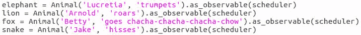

# 组合和处理可观察序列

对于组合和处理可观察序列，我们有三个步骤要遵循。这些解释如下：

+   首先，我们将大象和狮子序列合并成一个单一的组合序列，并通过我们的`sometimes_loud`函数处理该序列以创建一个新的序列，我们称之为`louder`，如下面的代码示例所示：

```py
      louder = rx.Observable.merge(elephant,
      lion).select(sometimes_loud) 

```

在该行中使用的`select`方法在函数式编程环境中是 map 函数的直接等价物。

+   接下来，我们将`louder`序列与剩余的动物序列合并，并告诉系统，每当新值到达合并序列的前端时，它应该调用该值上的输出函数：

```py
      out = rx.Observable.merge(fox, snake, louder)
      .do_action(on_next = output) 

```

在本例中使用的`do_action`方法与 map 不等价，因为它不转换序列；它只是在序列的每个元素上执行一个操作。

`do_action`方法用于副作用。

+   最后，如以下所示，我们订阅了输出可观察序列上的`on_completed`事件，这与将所有事件流合并为一个序列的序列相同，因为`do_action`操作返回其输入序列不变：

```py
      done = asyncio.Future() 
      out.subscribe(on_completed = (lambda:
      done.set_result(True))) 
      return done 

```

当序列完成时，我们在`done`未来上设置一个结果值。由于我们在`main.py`文件中使用了该特性作为运行直到完成的边界，设置其结果值将终止`asyncio`事件循环，我们的程序结束。

本节中`animals.py`文件的完整代码列表如下：

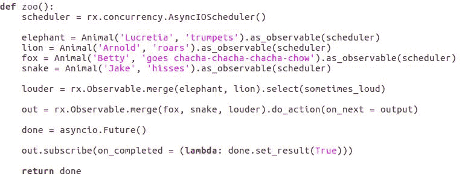

# 杂项可观察工厂方法

我们刚刚完成的工作演示了`Observable`的`merge`、`merge.select`和`generate_with_relative_time`工厂方法，但这只是冰山一角。

有如此多的可观察工厂（以下图像是其中的一部分）的样本，仅简要描述每个就需要比我们拥有的时间还要多：

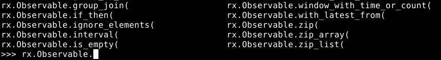

每个方法都为我们提供了一种构建可观察对象的有用方式，通常是基于一个或多个其他可观察对象，但并不总是如此。

Python 的交互式外壳和 `help` 函数是我们的朋友。通过在 `Observable` 类中探索，我们可以学到很多东西。同时，我们将讨论一些我们尚未看到的非常好的 observable 工厂方法。

# Observable.create 方法

在这个列表的第一位是以下代码示例中显示的 `Observable.create`。这是创建完全自定义 observable 的推荐方法：

```py
rx.Observable.create((lambda obs: obs.on_next('Hi!'))) 

```

`create` 方法以可调用为参数，并在观察者订阅 observable 时调用该可调用。

在前面的代码示例中，我们创建了一个当观察者订阅时说 `Hi!` 的 observable，然后不再产生其他值；这不是最有用的序列，但它有助于说明这个想法。

我们可以从基本框架中构建一个具有任何所需行为的 observable，而无需对 observable 类进行子类化，也无需重新实现，可能不正确地实现保持 observables 在异步或并行环境中同步和正常工作的内部机制。

# Observable.select_many 方法

接下来是 `Observable.select_many`。这次，让我们看看 Python 的 `help` 函数可以显示什么，使用以下命令：

```py
help(rx.Observable.select_many)  

```

这应该给出以下描述：

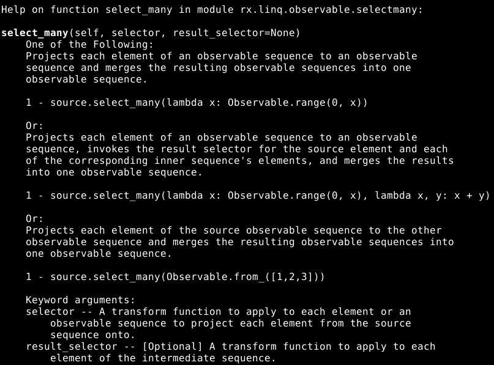

这个 observable 工厂方法是 select 的一个更通用版本。在这里，select 对序列的每个成员应用一个函数，从函数的返回值创建一个新的序列，而 `select_many` 期望一个返回 observable 序列的函数并将这些序列连接起来。

这意味着 `select_many` 应用函数可以通过返回一个空序列来从序列中删除元素，也可以通过返回包含多个元素的序列来插入值。

与 select 类似，添加到结果中的值也不一定是传递给函数的相同值，因此 `select_many` 可以产生比输入序列包含更多或更少的值的序列，并且值可以按我们的选择确定。

# Empty, return_value, 和 from_iterable 工厂方法

使用 `empty` 和 `return_value` 工厂方法分别可以轻松创建空序列和只有一个值的序列。这些可以通过两个命令来展示，分别用它们的帮助页面进行说明。

```py
help (rx.Observable.empty) 

```

此命令将带我们到以下帮助页面：

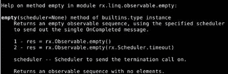

类似地，在 `return_value` 的情况下，我们可以使用以下命令：

```py
help (rx.Observable.return_value)  

```

我们将获得以下帮助页面，解释如何使用该方法：

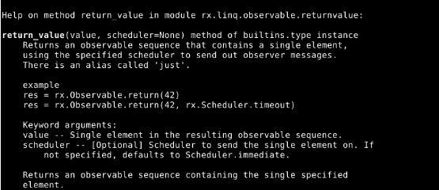

类似地，使用 `of` 或 `from_iterable` 工厂方法可以轻松构建任何已知对象序列的 observable 序列。

# Where 工厂方法

虽然我们可以使用 `select_many` 从可观察序列中移除不需要的事件，但使用 `where` 方法会更简单。让我们看看 `where` 方法的帮助信息：

```py
help (rx.Observable.where)  

```

此方法将一个可调用对象应用于输入可观察序列的每个元素，并返回一个只包含那些可调用对象返回 true 的元素的观察序列。以下图像显示了帮助描述：

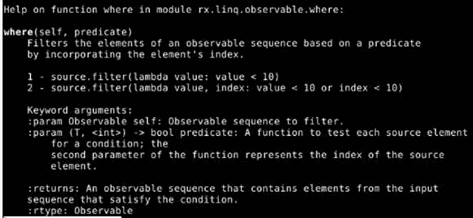

现在我们已经看到，有基本的方法来添加和删除可观察序列，那么关于处理它们呢？我们本可以使用 `select` 和 `select_many` 来完成所有的处理，但 Rx 为我们提供了许多更多的方法，例如 `min`、`max`、`average`、`distinct`、`slice` 和 `zip`，仅举几个我们可用的工具。我强烈建议您更详细地研究 Rx 框架。

# 摘要

在本章中，我们讨论了响应式编程是什么，并实现了一个基本的响应式框架，并使用它来实现一个演示程序，以帮助我们掌握这些概念。我们研究了 Python 的响应式扩展，并使用它们重新实现了我们的动物园演示。最后，我们探讨了 Rx 框架的一些更广泛的可能性。

在下一章中，我们将探讨微服务，它们是非常小的服务器进程，旨在协同工作以产生所需的结果。
