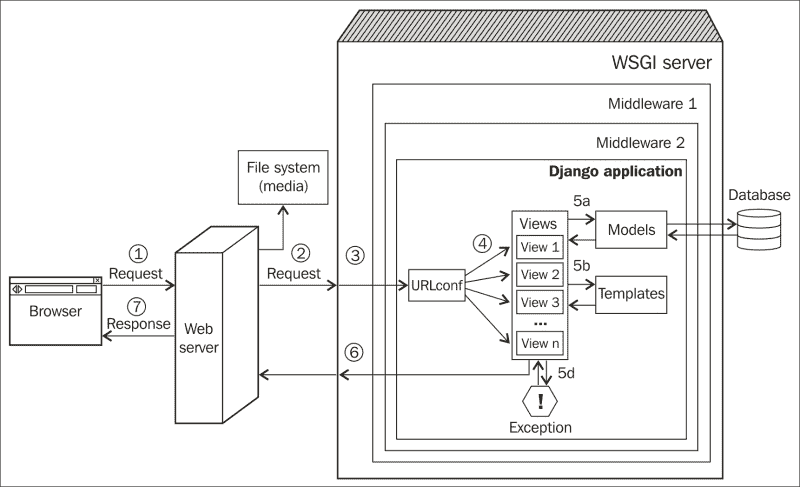

# 第一章：Django 和模式

在本章中，我们将讨论以下主题：

+   为什么选择 Django？

+   Django 的故事

+   Django 的工作原理

+   什么是模式？

+   知名的模式集合

+   Django 中的模式

根据盖博伟的“世界初创企业报告”，2013 年全球有超过 136,000 家互联网公司，仅美国就有超过 60,000 家。其中，87 家美国公司的估值超过 10 亿美元。另一项研究表明，在 27 个国家的 12,000 名 18 至 30 岁的人中，超过三分之二看到了成为企业家的机会。

这种数字初创企业的繁荣主要归功于初创企业的工具和技术变得廉价和普遍。现在，创建一个完整的网络应用所需的时间比以前少得多，这要归功于强大的框架。

即使是第一次编程的人也可以轻松学习创建网络应用，因为它的学习曲线很平缓。然而，很快他们会一遍又一遍地解决其他人一直在面对的相同问题。这就是理解模式可以真正帮助节省时间的地方。

# 为什么选择 Django？

每个网络应用都是不同的，就像手工制作的家具一样。你很少会找到一个完全符合你需求的大规模生产的产品。即使你从一个基本需求开始，比如一个博客或一个社交网络，你的需求会慢慢增长，你很容易最终得到很多临时解决方案粗制滥造地贴在一个曾经简单的模板解决方案上。

这就是为什么像 Django 或 Rails 这样的网络框架变得极其受欢迎。框架可以加快开发速度，并且内置了所有最佳实践。然而，它们也足够灵活，可以让你获得足够的工具来完成工作。如今，网络框架是无处不在的，大多数编程语言都至少有一个类似 Django 的端到端框架。

Python 可能比大多数编程语言都有更多的网络框架。快速浏览 Python 包索引（PyPi）会发现有惊人的 13021 个与框架相关的包。对于 Django 来说，总共有 5467 个包。

Python 维基列出了超过 54 个活跃的网络框架，其中最受欢迎的是 Django、Flask、Pyramid 和 Zope。Python 的框架也具有广泛的多样性。紧凑的`Bottle`微型网络框架只有一个 Python 文件，没有依赖性，但却能够出人意料地创建一个简单的网络应用。

尽管有这么多的选择，Django 已经成为了绝大多数人的首选。[Djangosites.org](http://Djangosites.org)列出了超过 4700 个使用 Django 编写的网站，包括著名的成功案例，如 Instagram、Pinterest 和 Disqus。

正如官方描述所说，Django（[`djangoproject.com`](https://djangoproject.com)）是一个高级的 Python 网络框架，鼓励快速开发和清晰的实用设计。换句话说，它是一个完整的网络框架，就像 Python 一样，内置了所有必要的功能。

开箱即用的管理界面是 Django 的独特功能之一，对于早期数据输入和测试非常有帮助。Django 的文档因为非常适合开源项目而受到赞扬。

最后，Django 在几个高流量网站上经过了实战测试。它在安全方面有着异常的关注，可以防范常见攻击，如跨站脚本（XSS）和跨站请求伪造（CSRF）。

尽管理论上你可以使用 Django 构建任何类型的网络应用，但它可能并不适合每种情况。例如，要构建基于实时聊天的网络界面，你可能会想使用 Tornado，而你的网络应用的其余部分仍然可以使用 Django 完成。选择合适的工具来完成工作。

一些内置功能，比如管理界面，如果你习惯于其他网络框架，可能会听起来有些奇怪。为了理解 Django 的设计，让我们找出它是如何诞生的。

# Django 的故事

当你看着埃及金字塔时，你可能会认为这样简单而简约的设计一定是相当明显的。事实上，它们是 4000 年建筑演变的产物。阶梯金字塔，最初（而且笨重）的设计，有六个尺寸递减的矩形块。经过几次建筑和工程改进，直到现代、玻璃化和持久的石灰石结构被发明出来。

看着 Django，你可能会有类似的感觉。如此优雅地构建，一定是毫无瑕疵地构想出来的。相反，它是在一个想象得到的最高压力环境中的重写和快速迭代的结果 - 一个新闻编辑室！

2003 年秋天，两名程序员 Adrian Holovaty 和 Simon Willison 在劳伦斯报纸 Journal-World 工作，致力于在堪萨斯州创建几个当地新闻网站。这些网站，包括[LJWorld.com](http://LJWorld.com)，[Lawrence.com](http://Lawrence.com)和[KUsports.com](http://KUsports.com) - 像大多数新闻网站一样，不仅是充满文本、照片和视频的内容驱动门户，而且还不断试图满足劳伦斯社区的需求，例如当地商业目录、活动日历、分类广告等。

## 一个框架诞生了

当然，这意味着对 Simon、Adrian 和后来加入他们团队的 Jacob Kaplan Moss 来说，有很多工作；有很短的截止日期，有时只有几个小时的通知。由于当时 Python 的网络开发还处于早期阶段，他们不得不大部分从头开始编写网络应用程序。因此，为了节省宝贵的时间，他们逐渐将常见的模块和工具重构为名为“The CMS”的东西。

最终，内容管理部分被分拆成一个名为 Ellington CMS 的独立项目，后来成为一个成功的商业 CMS 产品。剩下的“CMS”是一个干净的基础框架，通用到足以用来构建任何类型的网络应用程序。

2005 年 7 月，这个网页开发框架以 Django（发音为 Jang-Oh）的形式发布，采用了开源的**伯克利软件分发**（**BSD**）许可证。它以传奇爵士吉他手 Django Reinhardt 的名字命名。剩下的，就像他们说的那样，就成了历史。

## 去除魔法

由于它作为内部工具的起源谦逊，Django 有很多劳伦斯 Journal-World 特有的怪癖。为了使 Django 真正通用，一个名为“去除劳伦斯”的努力已经在进行中。

然而，Django 开发人员必须进行的最重要的重构工作被称为“去除魔法”。这个雄心勃勃的项目涉及清理 Django 多年来积累的所有瑕疵，包括很多魔法（隐含功能的非正式术语），并用更自然和明确的 Python 代码替换它们。例如，模型类曾经是从一个名为`django.models.*`的魔法模块导入的，而不是直接从它们定义的`models.py`模块导入。

当时，Django 有大约十万行代码，这是 API 的重大重写。2006 年 5 月 1 日，这些变化，几乎相当于一本小书的大小，被整合到 Django 的开发版本主干中，并作为 Django 0.95 版本发布。这是迈向 Django 1.0 里程碑的重要一步。

## Django 不断变得更好

每年，全球各地都会举行名为**DjangoCons**的会议，供 Django 开发人员相互交流。他们有一个可爱的传统，即在“为什么 Django 糟糕”上发表半幽默的主题演讲。这可能是 Django 社区的成员，或者是在竞争的网络框架上工作的人，或者只是任何知名人士。

多年来，令人惊讶的是 Django 开发人员如何积极地接受这些批评，并在随后的版本中加以缓解。以下是对应于 Django 曾经的缺点的改进的简要总结以及它们所解决的版本：

+   新的表单处理库（Django 0.96）

+   将管理界面与模型解耦（Django 1.0）

+   多数据库支持（Django 1.2）

+   更好地管理静态文件（Django 1.3）

+   更好的时区支持（Django 1.4）

+   可定制的用户模型（Django 1.5）

+   更好的事务处理（Django 1.6）

+   内置数据库迁移（Django 1.7）

随着时间的推移，Django 已成为公共领域中最符合 Python 习惯的代码库之一。Django 源代码也是学习 Python web 框架架构的好地方。

## Django 是如何工作的？

要真正欣赏 Django，您需要窥探一下内部，看看其中的各种组成部分。这既可以启发，也可能令人不知所措。如果您已经熟悉这一点，您可能想跳过本节。

典型 Django 应用程序中的 Web 请求是如何处理的

上述图显示了来自访问者浏览器的 Web 请求到达您的 Django 应用程序并返回的简化旅程。编号路径如下：

1.  浏览器将请求（基本上是一串字节）发送到您的 Web 服务器。

1.  您的 Web 服务器（比如 Nginx）将请求交给 WSGI 服务器（比如 uWSGI），或者直接从文件系统中提供文件（比如 CSS 文件）。

1.  与 web 服务器不同，WSGI 服务器可以运行 Python 应用程序。请求填充了一个名为`environ`的 Python 字典，并且可以通过多层中间件，最终到达您的 Django 应用程序。

1.  应用程序的`urls.py`中包含的 URLconf 根据请求的 URL 选择一个视图来处理请求。请求已经转换为`HttpRequest`——一个 Python 对象。

1.  所选视图通常会执行以下一项或多项操作：

5a. 通过模型与数据库进行交谈

5b. 使用模板呈现 HTML 或任何其他格式化响应

5c. 返回纯文本响应（未显示）

5d. 引发异常

1.  `HttpResponse`对象在离开 Django 应用程序时被渲染为一个字符串。

1.  用户浏览器中看到了一个精美的网页。

尽管省略了某些细节，但这种表示应该有助于您欣赏 Django 的高级架构。它还展示了关键组件（如模型、视图和模板）所扮演的角色。Django 的许多组件都基于几种众所周知的设计模式。

# 什么是模式？ 

“蓝图”、“脚手架”和“维护”之间有什么共同之处？这些软件开发术语都是从建筑施工和建筑领域借来的。然而，最有影响力的术语之一来自于 1977 年奥地利著名建筑师克里斯托弗·亚历山大及其团队（包括 Murray Silverstein、Sara Ishikawa 等人）撰写的一部关于建筑和城市规划的专著。

“模式”这个术语在他们的开创性作品《模式语言：城镇、建筑、建筑》（五卷系列中的第二卷）之后开始流行，该作品基于一个惊人的洞察力，即用户对他们的建筑了解比任何建筑师都要多。模式指的是日常问题及其提议但经过时间考验的解决方案。

在书中，克里斯托弗·亚历山大（Christopher Alexander）指出：“每个模式描述了一个在我们的环境中反复出现的问题，然后以这样一种方式描述了这个问题的核心解决方案，以至于您可以一百万次使用这个解决方案，而不必重复两次。”

例如，光之翼模式描述了人们更喜欢有更多自然光线的建筑，并建议安排建筑物以由翼组成。这些翼应该是长而窄的，绝不超过 25 英尺宽。下次你在一所古老大学的长长明亮的走廊上散步时，要感谢这种模式。

他们的书包含了 253 种这样的实用模式，从房间设计到整个城市的设计。最重要的是，这些模式中的每一个都给了一个抽象问题一个名称，并共同形成了一个“模式语言”。

还记得当你第一次遇到“ déjà vu”这个词吗？你可能会想“哇，我从来不知道有一个词来描述那种经历。”同样，建筑师不仅能够在他们的环境中识别模式，而且最终还能以一种同行能够理解的方式来命名它们。

在软件世界中，术语“设计模式”指的是软件设计中常见问题的一般可重复解决方案。它是开发人员可以使用的最佳实践的正式化。就像在建筑世界一样，模式语言已被证明对于向其他程序员传达解决设计问题的某种方式非常有帮助。

有几种设计模式的集合，但有些比其他的影响力更大。

## 四人帮模式

早期研究和记录设计模式的努力之一是一本名为《设计模式：可复用面向对象软件的元素》的书，作者是 Erich Gamma、Richard Helm、Ralph Johnson 和 John Vlissides，后来被称为四人帮（GoF）。这本书影响深远，以至于许多人认为书中的 23 种设计模式对软件工程本身是基本的。

实际上，这些模式主要是针对面向对象编程语言编写的，并且它在 C++和 Smalltalk 中有代码示例。正如我们将很快看到的，许多这些模式在其他具有更好高阶抽象的编程语言中甚至可能不需要。

这 23 种模式已经被广泛分类为以下类型：

+   创建模式：这些包括抽象工厂、生成器模式、工厂方法、原型模式和单例模式

+   结构模式：这些包括适配器模式、桥接模式、组合模式、装饰器模式、外观模式、享元模式和代理模式

+   行为模式：这些包括责任链模式、命令模式、解释器模式、迭代器模式、中介者模式、备忘录模式、观察者模式、状态模式、策略模式、模板模式和访问者模式

虽然详细解释每种模式超出了本书的范围，但在 Django 本身中识别一些这些模式是很有趣的：

| GoF 模式 | Django 组件 | 解释 |
| --- | --- | --- |
| 命令模式 | HttpRequest | 这将请求封装在一个对象中 |
| 观察者模式 | 信号 | 当一个对象改变状态时，所有监听器都会被通知并自动更新 |
| 模板方法 | 基于类的通用视图 | 可以通过子类化重新定义算法的步骤而不改变算法的结构 |

虽然这些模式大多是对研究 Django 内部感兴趣的人来说，Django 本身可以归类的模式是一个常见的问题。

## Django 是 MVC 吗？

模型-视图-控制器（MVC）是 70 年代由施乐 PARC 发明的一种架构模式。作为构建 Smalltalk 用户界面的框架，它在《Gang of Four》一书中早早地被提及。

今天，MVC 是 Web 应用程序框架中非常流行的模式。初学者经常问这样的问题：Django 是一个 MVC 框架吗？

答案既是肯定的，也是否定的。MVC 模式倡导将表示层与应用程序逻辑解耦。例如，在设计在线游戏网站 API 时，您可能会将游戏的高分榜呈现为 HTML、XML 或逗号分隔（CSV）文件。但是，其底层模型类将独立设计，不受数据最终呈现方式的影响。

MVC 对模型、视图和控制器的功能非常严格。然而，Django 对 Web 应用程序采取了更加实用的观点。由于 HTTP 协议的性质，对 Web 页面的每个请求都是独立的。Django 的框架被设计成一个处理每个请求并准备响应的管道。

Django 将其称为**模型-模板-视图**（**MTV**）架构。数据库接口类（模型）、请求处理类（视图）和最终呈现的模板语言（模板）之间存在关注点的分离。

如果将此与经典的 MVC 进行比较——“模型”可与 Django 的模型相媲美，“视图”通常是 Django 的模板，“控制器”是处理传入的 HTTP 请求并将其路由到正确视图函数的框架本身。

如果这还没有让您困惑，Django 更倾向于将处理每个 URL 的回调函数命名为“视图”函数。不幸的是，这与 MVC 模式中“视图”的概念无关。

## Fowler 的模式

2002 年，Martin Fowler 写了《企业应用架构模式》，描述了他在构建企业应用程序时经常遇到的 40 多种模式。

与 GoF 书不同，Fowler 的书是关于架构模式的。因此，它们以更高的抽象级别描述模式，并且在很大程度上与编程语言无关。

Fowler 的模式组织如下：

+   **领域逻辑模式**：包括领域模型、事务脚本、服务层和表模块

+   **数据源架构模式**：包括行数据网关、表数据网关、数据映射器和活动记录

+   **对象关系行为模式**：包括身份映射、工作单元和延迟加载

+   **对象关系结构模式**：包括外键映射、映射、依赖映射、关联表映射、标识字段、序列化 LOB、嵌入值、继承映射器、单表继承、具体表继承和类表继承

+   **对象关系元数据映射模式**：包括查询对象、元数据映射和存储库

+   **Web 演示模式**：包括页面控制器、前端控制器、模型视图控制器、转换视图、模板视图、应用程序控制器和两步视图

+   **分发模式**：包括数据传输对象和远程外观

+   **离线并发模式**：包括粗粒度锁、隐式锁、乐观离线锁和悲观离线锁

+   **会话状态模式**：包括数据库会话状态、客户端会话状态和服务器会话状态

+   **基本模式**：包括映射器、网关、层超类型、注册表、值对象、分离接口、货币、插件、特殊情况、服务存根和记录集

几乎所有这些模式在设计 Django 应用程序时都会很有用。事实上，Fowler 的网站[`martinfowler.com/eaaCatalog/`](http://martinfowler.com/eaaCatalog/)上有这些模式的优秀目录。我强烈建议您查看一下。

Django 还实现了许多这些模式。以下表格列出了其中的一些：

| Fowler 模式 | Django 组件 | 解释 |
| --- | --- | --- |
| 活动记录 | Django 模型 | 封装数据库访问，并在该数据上添加领域逻辑 |
| 类表继承 | 模型继承 | 层次结构中的每个实体都映射到一个单独的表中 |
| 身份字段 | ID 字段 | 在对象中保存数据库 ID 字段以维护身份 |
| 模板视图 | Django 模板 | 通过在 HTML 中嵌入标记呈现为 HTML |

## 还有更多的模式吗？

是的，当然。模式一直在不断被发现。就像生物一样，有些会变异并形成新的模式：例如，MVC 的变体，如**模型-视图-呈现者**（**MVP**）、**分层模型-视图-控制器**（**HMVC**）或**模型视图视图模型**（**MVVM**）。

模式也随着时间的推移而发展，因为对已知问题的更好解决方案被识别出来。例如，单例模式曾经被认为是一种设计模式，但现在被认为是一种反模式，因为它引入了共享状态，类似于使用全局变量。**反模式**可以被定义为常常被重新发明的，但是一个糟糕的解决方案。

一些其他众所周知的模式目录书籍包括 Buschmann、Meunier、Rohnert、Sommerlad 和 Sta 的*面向模式的软件架构*（称为**POSA**）；Hohpe 和 Woolf 的*企业集成模式*；以及 Duyne、Landay 和 Hong 的*网站设计：为打造以客户为中心的网页体验而编织的模式、原则和流程*。

# 本书中的模式

本书将涵盖 Django 特定的设计和架构模式，这对 Django 开发人员很有用。接下来的章节将描述每个模式将如何呈现。

**模式名称**

标题是模式名称。如果是一个众所周知的模式，就使用常用的名称；否则，选择一个简洁的、自我描述的名称。名称很重要，因为它有助于建立模式词汇。所有模式都将包括以下部分：

**问题**：这简要提到了问题。

**解决方案**：这总结了提出的解决方案。

**问题详情**：这详细阐述了问题的背景，并可能给出一个例子。

**解决方案详情**：这以一般术语解释了解决方案，并提供了一个 Django 实现的示例。

## 对模式的批评

尽管它们几乎被普遍使用，但模式也有它们的批评。最常见的反对意见如下：

+   **模式弥补了缺失的语言特性**：Peter Norvig 发现《设计模式》中的 23 个模式中有 16 个在 Lisp 中是“不可见或更简单的”。考虑到 Python 的内省能力和一级函数，这对 Python 来说也可能是这样。

+   **模式重复最佳实践**：许多模式本质上是对最佳实践的形式化，比如关注点分离，可能看起来是多余的。

+   **模式可能导致过度工程化**：实现模式可能比更简单的解决方案效率低且过度。

## 如何使用模式

虽然之前的一些批评是相当合理的，但它们是基于模式被误用的情况。以下是一些建议，可以帮助你了解如何最好地使用设计模式：

+   如果你的语言支持直接解决方案，就不要实现模式

+   不要试图用模式的术语来适配一切

+   只有在你的上下文中它是最优雅的解决方案时才使用模式

+   不要害怕创建新的模式

# 最佳实践

除了设计模式，可能还有一种推荐的解决问题的方法。在 Django 中，与 Python 一样，可能有几种解决问题的方法，但其中一种是惯用的方法。

## Python 之禅和 Django 的设计哲学

一般来说，Python 社区使用术语“Pythonic”来描述一段惯用的代码。它通常指的是《Python 之禅》中阐述的原则。这本书像一首诗一样写成，对于描述这样一个模糊的概念非常有用。

### 提示

尝试在 Python 提示符中输入`import this`来查看《Python 之禅》。

此外，Django 开发人员在设计框架时已经清晰地记录了他们的设计理念，网址为[`docs.djangoproject.com/en/dev/misc/design-philosophies/`](https://docs.djangoproject.com/en/dev/misc/design-philosophies/)。

虽然该文档描述了 Django 设计背后的思维过程，但对于使用 Django 构建应用程序的开发人员也是有用的。某些原则，如“不要重复自己”（DRY）、“松耦合”和“紧凑性”可以帮助您编写更易维护和成熟的 Django 应用程序。

本书建议的 Django 或 Python 最佳实践将以以下方式格式化：

### 提示

最佳实践：

在 settings.py 中使用 BASE_DIR，并避免硬编码目录名称。

# 摘要

在本章中，我们探讨了人们为什么选择 Django 而不是其他 Web 框架，它有趣的历史以及它的工作原理。我们还研究了设计模式、流行的模式集合和最佳实践。

在下一章中，我们将看一下 Django 项目开始阶段的前几个步骤，比如收集需求、创建模型和设置项目。
