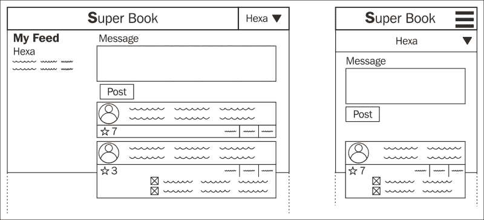

# 第二章：应用程序设计

在本章中，我们将涵盖以下主题：

+   收集需求

+   创建概念文件

+   HTML 模拟

+   如何将项目分成应用程序

+   是写一个新应用程序还是重用现有的应用程序

+   项目开始前的最佳实践

+   为什么选择 Python 3？

+   开始 SuperBook 项目

许多新手开发人员在开始新项目时会立即开始编写代码。往往会导致错误的假设、未使用的功能和浪费时间。即使在时间紧迫的项目中，花一些时间与客户一起了解核心需求，都能产生令人难以置信的结果。管理需求是值得学习的关键技能。

# 如何收集需求

| | *创新不是说 YES，而是说 NO，除了最关键的功能之外。* | |
| --- | --- | --- |
| | --*史蒂夫·乔布斯* |

通过花几天时间与客户仔细倾听他们的需求并设定正确的期望，我挽救了几个注定失败的项目。只带着一支铅笔和纸（或它们的数字化等价物），这个过程非常简单但有效。在收集需求时要记住以下一些关键点：

1.  直接与应用程序所有者交谈，即使他们不懂技术。

1.  确保你充分倾听他们的需求并记录下来。

1.  不要使用“模型”等技术术语。保持简单，使用终端用户友好的术语，如“用户资料”。

1.  设定正确的期望。如果某事在技术上不可行或困难，确保立即告诉他们。

1.  尽可能多地进行素描。人类天生是视觉动物。网站更是如此。使用粗线和简笔画。不需要完美。

1.  分解流程，如用户注册。任何多步功能都需要用箭头连接的框来绘制。

1.  最后，以用户故事的形式或任何易于理解的形式逐个处理功能列表。

1.  在将功能优先级划分为高、中、低桶时要积极参与。

1.  在接受新功能时要非常保守。

1.  会后，与所有人分享你的笔记，以避免误解。

第一次会议会很长（可能是一整天的研讨会或几个小时的会议）。后来，当这些会议变得频繁时，你可以将它们缩短到 30 分钟或一个小时。

所有这一切的产出将是一个一页的写作和几张粗糙的素描。

在这本书中，我们自愿承担了一个崇高的项目，为超级英雄建立一个名为 SuperBook 的社交网络。根据我们与一群随机选择的超级英雄讨论的简单草图如下所示：



SuperBook 网站的响应式设计草图。显示了桌面（左）和智能手机（右）布局。

# 你是一个讲故事的人吗？

那么这个一页的写作是什么？这是一个简单的文件，解释了使用该网站的感受。在我参与的几乎所有项目中，当有新成员加入团队时，他们通常不会浏览每一份文件。如果他们找到一个简短的单页文件，快速告诉他们网站的意图，他们会感到高兴。

你可以随意称呼这个文件——概念文件、市场需求文件、客户体验文档，甚至是史诗脆弱故事日志™（专利申请中）。这真的无关紧要。

文件应该侧重于用户体验，而不是技术或实施细节。要简短有趣。事实上，Joel Spolsky 在记录需求方面的第一条规则是“要幽默”。

如果可能的话，写一篇关于典型用户（在营销术语中称为“角色”）的文章，他们面临的问题以及 Web 应用程序如何解决它。想象他们如何向朋友解释这种体验。试着捕捉这一点。

这是 SuperBook 项目的概念文件：

### 注

**SuperBook 概念**

以下采访是在我们的网站 SuperBook 在未来推出后进行的。在采访之前进行了 30 分钟的用户测试。

**请介绍一下自己。**

我的名字是阿克塞尔。我是一只灰松鼠，住在纽约市中心。不过，每个人都叫我橡子。我爸爸，著名的嘻哈明星 T.贝瑞，过去常常叫我那个。我想我从来没有唱歌好到可以接手家族生意。

事实上，在我早期，我有点偷窃癖。你知道，我对坚果过敏。其他兄弟们很容易就能在公园里生活。我不得不 improvisation——咖啡馆、电影院、游乐园等等。我也非常仔细地阅读标签。

**好的，橡子。你为什么认为你被选中进行用户测试？**

可能是因为我曾在纽约星报上被介绍为一个不太知名的超级英雄。我猜人们觉得一个松鼠能用 MacBook 很有趣（采访者：这次采访是通过聊天进行的）。另外，我有一个松鼠一样的注意力。 

**根据你看到的，你对 SuperBook 有什么看法？**

我认为这是一个很棒的主意。我的意思是，人们经常看到超级英雄。然而，没有人关心他们。大多数都是孤独和反社会的。SuperBook 可以改变这一点。

**你认为 Superbook 有什么不同？**

它是为像我们这样的人从零开始构建的。我的意思是，当你想要使用你的秘密身份时，没有“工作和教育”的废话。虽然我没有，但我能理解为什么有人会有一个。

**你能简要告诉我们你注意到的一些特点吗？**

当然，我认为这是一个相当不错的社交网络，你可以：

+   用任何用户名注册（不再需要“输入你的真实姓名”了，愚蠢的要求）

+   粉丝可以关注别人，而不必把他们添加为“朋友”

+   发布帖子，对其进行评论，并重新分享

+   给另一个用户发送私人帖子

一切都很容易。弄清楚它并不需要超人的努力。

**谢谢你的时间，橡子。**

# HTML 模型

在构建 Web 应用程序的早期，工具如 Photoshop 和 Flash 被广泛使用来获得像素完美的模型。它们几乎不再被推荐或使用。

在智能手机、平板电脑、笔记本电脑和其他平台上提供本地和一致的体验现在被认为比获得像素完美的外观更重要。事实上，大多数网页设计师直接在 HTML 上创建布局。

创建 HTML 模型比以前快得多，也更容易。如果你的网页设计师不可用，开发人员可以使用 CSS 框架，如 Bootstrap 或 ZURB Foundation 框架来创建相当不错的模型。

创建模型的目标是创建网站的真实预览。它不应该只关注细节和修饰，使其看起来比草图更接近最终产品，而且还应该增加交互性。用一些简单的 JavaScript 驱动的交互性，让你的静态 HTML 变得生动起来。

一个好的模型可以用不到总体开发工作量的 20%来提供 80%的客户体验。

# 设计应用程序

当你对需要构建的东西有一个相当好的想法时，你可以开始考虑在 Django 中的实现。再一次，开始编码是很诱人的。然而，当你花几分钟思考设计时，你会发现解决设计问题的许多不同方法。

你也可以首先开始设计测试，这是**测试驱动设计**（TDD）方法论所倡导的。我们将在测试章节中看到更多 TDD 方法的应用。

无论你采取哪种方法，最好停下来思考一下——“我可以用哪些不同的方式来实现这个？有什么权衡？在我们的情境中哪些因素更重要？最后，哪种方法是最好的？”

有经验的 Django 开发人员以不同的方式看待整个项目。遵循 DRY 原则（有时是因为他们变懒了），他们会想——“我以前见过这个功能吗？例如，可以使用`django-all-auth`这样的第三方包来实现社交登录功能吗？”

如果他们必须自己编写应用程序，他们会开始考虑各种设计模式，希望能够设计出优雅的设计。然而，他们首先需要将项目在顶层分解为应用程序。

## 将项目分成应用

Django 应用程序称为*项目*。一个项目由多个应用程序或*应用*组成。应用是提供一组功能的 Python 包。

理想情况下，每个应用都必须是可重用的。您可以创建尽可能多的应用。永远不要害怕添加更多的应用或将现有的应用重构为多个应用。一个典型的 Django 项目包含 15-20 个应用。

在这个阶段做出的一个重要决定是是否使用第三方 Django 应用程序还是从头开始构建一个。第三方应用程序是现成的应用程序，不是由您构建的。大多数包都可以快速安装和设置。您可以在几分钟内开始使用它们。

另一方面，编写自己的应用通常意味着自己设计和实现模型、视图、测试用例等。Django 不会区分这两种类型的应用。

## 重用还是自己编写？

Django 最大的优势之一是庞大的第三方应用生态系统。在撰写本文时，[djangopackages.com](http://djangopackages.com)列出了 2600 多个包。您可能会发现您的公司或个人库甚至更多。一旦您的项目被分成应用程序，并且您知道需要哪种类型的应用程序，您将需要为每个应用程序做出决定——是编写还是重用现有的应用程序。

安装和使用现成的应用可能听起来更容易。然而，事实并不像听起来那么简单。让我们来看看我们项目中一些第三方身份验证应用，并列出我们在撰写本文时为 SuperBook 未使用它们的原因：

+   **为我们的需求过度设计**: 我们觉得支持任何社交登录的`python-social-auth`是不必要的

+   **太具体**: 使用`django-facebook`将意味着将我们的身份验证与特定网站提供的身份验证绑定在一起

+   **Python 依赖**: `django-allauth`的要求之一是`python-openid`，这个包目前没有得到积极维护或批准。

+   **非 Python 依赖**: 一些包可能具有非 Python 依赖项，例如 Redis 或 Node.js，这会增加部署的开销

+   **不可重用**: 我们自己的许多应用程序之所以没有被使用，是因为它们不太容易重用，或者没有被编写成可重用的

这些包都不是坏的。它们只是暂时不符合我们的需求。它们可能对不同的项目有用。在我们的情况下，内置的 Django `auth`应用程序已经足够好了。

另一方面，您可能会因以下一些原因而更喜欢使用第三方应用程序：

+   **太难做到正确**: 您的模型实例需要形成一个树吗？使用`django-mptt`进行数据库高效实现

+   **最佳或推荐的应用程序**: 这会随时间而改变，但像`django-redis`这样的包是最推荐的用例

+   **缺少功能**: 许多人认为`django-model-utils`和`django-extensions`等包应该是框架的一部分

+   **最小依赖**: 这在我的书中总是很好的。

那么，您是应该重用应用程序并节省时间，还是编写一个新的自定义应用程序？我建议您在沙盒中尝试第三方应用程序。如果您是一名中级 Django 开发人员，那么下一节将告诉您如何在沙盒中尝试包。 

### 我的应用沙盒

不时地，您会看到一些博客文章列出了“必备的 Django 包”。然而，决定一个包是否适合您的项目的最佳方法是原型设计。

即使您已经为开发创建了 Python 虚拟环境，尝试所有这些软件包然后将它们丢弃可能会污染您的环境。因此，我通常会创建一个名为“sandbox”的单独虚拟环境，纯粹用于尝试这些应用程序。然后，我构建一个小项目来了解使用起来有多容易。

稍后，如果我对应用程序的试用感到满意，我会使用 Git 等版本控制工具在我的项目中创建一个分支来集成该应用程序。然后，我会在分支中继续编码和运行测试，直到必要的功能被添加。最后，这个分支将被审查并合并回主线（有时称为`master`）分支。

## 哪些软件包成功了？

为了说明这个过程，我们的 SuperBook 项目可以大致分为以下应用程序（不是完整的列表）：

+   **身份验证**（内置`django.auth`）：这个应用程序处理用户注册、登录和注销

+   **账户**（自定义）：这个应用程序提供额外的用户个人资料信息

+   **帖子**（自定义）：这个应用程序提供帖子和评论功能

+   **Pows**（自定义）：这个应用程序跟踪任何项目获得多少“pows”（点赞或喜欢）

+   **Bootstrap forms**（crispy-forms）：这个应用程序处理表单布局和样式

在这里，一个应用程序被标记为从头开始构建（标记为“自定义”）或我们将使用的第三方 Django 应用程序。随着项目的进展，这些选择可能会改变。但是，这已经足够好了。

# 在开始项目之前

在准备开发环境时，请确保以下内容已经就位：

+   **一个新的 Python 虚拟环境**：Python 3 包括`venv`模块，或者您可以安装`virtualenv`。它们都可以防止污染全局 Python 库。

+   **版本控制**：始终使用 Git 或 Mercurial 等版本控制工具。它们是救命稻草。您还可以更加自信和无畏地进行更改。

+   **选择一个项目模板**：Django 的默认项目模板不是唯一的选择。根据您的需求，尝试其他模板，如`twoscoops`（[`github.com/twoscoops/django-twoscoops-project`](https://github.com/twoscoops/django-twoscoops-project)）或`edge`（[`github.com/arocks/edge`](https://github.com/arocks/edge)）。

+   **部署流水线**：我通常会稍后再担心这个问题，但是拥有一个简单的部署流程有助于早期展示进展。我更喜欢 Fabric 或 Ansible。

# SuperBook-您的任务，如果您选择接受

本书认为通过示例演示 Django 设计模式和最佳实践的实际和务实的方法。为了保持一致，我们所有的例子都将围绕构建一个名为 SuperBook 的社交网络项目。

SuperBook 专注于被忽视的超能力人群的利基市场。您是一个开发团队中的开发人员，团队中还有其他开发人员、网页设计师、市场经理和项目经理。

该项目将在撰写时的最新版本的 Python（版本 3.4）和 Django（版本 1.7）中构建。由于选择 Python 3 可能是一个有争议的话题，它值得更详细的解释。

## 为什么选择 Python 3？

尽管 Python 3 的开发始于 2006 年，但它的第一个版本 Python 3.0 是在 2008 年 12 月 3 日发布的。不向后兼容版本的主要原因是——将所有字符串切换为 Unicode，增加迭代器的使用，清理弃用的特性，如旧式类，以及一些新的语法添加，如`nonlocal`语句。

Django 社区对 Python 3 的反应相当复杂。尽管 2 和 3 版本之间的语言变化很小（并且随着时间的推移减少），但迁移整个 Django 代码库是一项重大的工作。

2 月 13 日，Django 1.5 成为第一个支持 Python 3 的版本。开发人员已经明确表示，未来 Django 将使用 Python 3 编写，并旨在向后兼容 Python 2。

对于本书来说，Python 3 是理想的，原因如下：

+   **更好的语法**：这修复了很多丑陋的语法，比如`izip`，`xrange`和`__unicode__`，用更清晰、更直接的`zip`，`range`和`__str__`。

+   **充分的第三方支持**：在前 200 个第三方库中，超过 80％支持 Python 3。

+   **没有遗留代码**：我们正在创建一个新项目，而不是处理需要支持旧版本的遗留代码。

+   **现代平台的默认设置**：这已经是 Arch Linux 中的默认 Python 解释器。Ubuntu 和 Fedora 计划在将来的版本中完成切换。

+   **它很容易**：从 Django 开发的角度来看，几乎没有什么变化，而且可以在几分钟内学会所有变化。

最后一点很重要。即使你使用 Python 2，这本书也会对你有所帮助。阅读附录 A 以了解这些变化。你只需要做最小的调整来回溯示例代码。

## 启动项目

本节包含了 SuperBook 项目的安装说明，其中包含了本书中使用的所有示例代码。请查看项目的 README 文件以获取最新的安装说明。建议您首先创建一个名为`superbook`的新目录，其中包含虚拟环境和项目源代码。

理想情况下，每个 Django 项目都应该在自己单独的虚拟环境中。这样可以轻松安装、更新和删除软件包，而不会影响其他应用程序。在 Python 3.4 中，建议使用内置的`venv`模块，因为它默认还会安装`pip`：

```py
$ python3 -m venv sbenv
$ source sbenv/bin/activate
$ export PATH="`pwd`/sbenv/local/bin:$PATH"

```

这些命令应该在大多数基于 Unix 的操作系统中都能工作。有关其他操作系统的安装说明或详细步骤，请参阅 Github 存储库中的 README 文件：[`github.com/DjangoPatternsBook/superbook`](https://github.com/DjangoPatternsBook/superbook)。在第一行中，我们将 Python 3.4 可执行文件称为`python3`；请确认这对于您的操作系统和发行版是否正确。

在某些情况下，最后一个导出命令可能不是必需的。如果运行`pip freeze`列出的是系统包而不是空的，那么你需要输入这行。

### 提示

在开始 Django 项目之前，请创建一个新的虚拟环境。

接下来，从 GitHub 克隆示例项目并安装依赖项：

```py
$ git clone https://github.com/DjangoPatternsBook/superbook.git
$ cd superbook
$ pip install -r requirements.txt

```

如果你想看一下完成的 SuperBook 网站，只需运行`migrate`并启动测试服务器：

```py
$ cd final
$ python manage.py migrate
$ python manage.py createsuperuser
$ python manage.py runserver

```

在 Django 1.7 中，`migrate`命令已经取代了`syncdb`命令。我们还需要显式调用`createsuperuser`命令来创建一个超级用户，以便我们可以访问管理员。

你可以访问`http://127.0.0.1:8000`或终端中指示的 URL，并随意在网站上玩耍。

# 总结

初学者经常低估了良好的需求收集过程的重要性。与此同时，重要的是不要被细节所困扰，因为编程本质上是一个探索过程。最成功的项目在开发之前花费适当的时间进行准备和规划，以获得最大的收益。

我们讨论了设计应用程序的许多方面，比如创建交互式模型或将其分成可重用的组件，称为应用程序。我们还讨论了设置我们的示例项目 SuperBook 的步骤。

在下一章中，我们将详细了解 Django 的每个组件，并学习围绕它们的设计模式和最佳实践。
