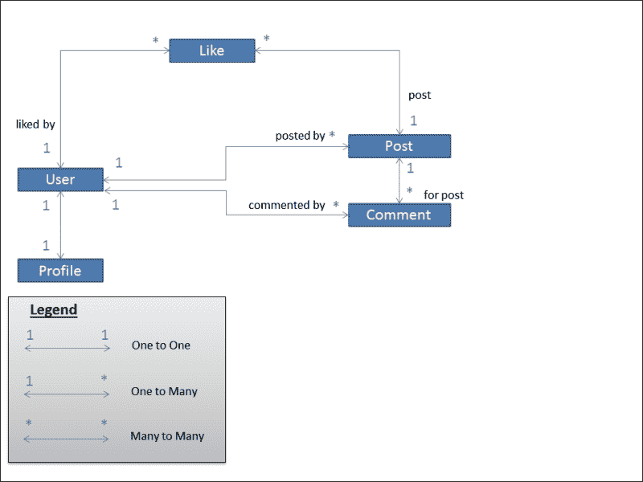

# 第三章：模型

在本章中，我们将讨论以下主题：

+   模型的重要性

+   类图

+   模型结构模式

+   模型行为模式

+   迁移

# M 比 V 和 C 更大

在 Django 中，模型是提供与数据库打交道的面向对象方式的类。通常，每个类都指的是一个数据库表，每个属性都指的是一个数据库列。你可以使用自动生成的 API 对这些表进行查询。

模型可以成为许多其他组件的基础。一旦你有了一个模型，你就可以快速地派生模型管理员、模型表单和各种通用视图。在每种情况下，你都需要写一两行代码，这样它就不会显得太神奇。

此外，模型的使用范围比你想象的要广。这是因为 Django 可以以多种方式运行。Django 的一些入口点如下：

+   熟悉的 Web 请求-响应流程

+   Django 交互式 shell

+   管理命令

+   测试脚本

+   诸如 Celery 之类的异步任务队列

在几乎所有这些情况下，模型模块都会被导入（作为`django.setup()`的一部分）。因此，最好让你的模型摆脱任何不必要的依赖，或者导入其他 Django 组件，如视图。

简而言之，正确设计你的模型非常重要。现在让我们开始 SuperBook 模型设计。

### 注意

**午餐袋**

*作者注：SuperBook 项目的进展将出现在这样的一个框中。你可以跳过这个框，但你会错过在 Web 应用项目中工作的见解、经验和戏剧。

史蒂夫与他的客户**超级英雄情报和监控**或**S.H.I.M**。简称，度过了一个波澜起伏的第一周。办公室非常 futurist，但要做任何事情都需要一百个批准和签字。

作为首席 Django 开发人员，史蒂夫在两天内完成了设置一个中型开发服务器，托管了四台虚拟机。第二天早上，机器本身已经消失了。附近一个洗衣机大小的机器人说，它被带到了法证部门，因为未经批准的软件安装。

然而，CTO 哈特非常乐意帮忙。他要求机器在一个小时内归还，并保持所有安装完好。他还发送了对 SuperBook 项目的预批准，以避免将来出现任何类似的障碍。

那天下午，史蒂夫和他一起吃了午餐。哈特穿着米色西装外套和浅蓝色牛仔裤，准时到达。尽管比大多数人高，头发光秃秃的，他看起来很酷，很平易近人。他问史蒂夫是否看过上世纪六十年代尝试建立超级英雄数据库的尝试。

"哦，是哨兵项目，对吧？"史蒂夫说。 "我看过。数据库似乎被设计为实体-属性-值模型，我认为这是一种反模式。也许他们当时对超级英雄的属性知之甚少。"哈特几乎在最后一句话上略显不悦。他声音稍微低了一些，说："你说得对，我没看过。而且，他们只给了我两天的时间来设计整个东西。我相信当时确实有一个核弹在某个地方滴答作响。"

史蒂夫张大了嘴，他的三明治在嘴里僵住了。哈特微笑着说："当然不是我的最佳作品。一旦超过了大约十亿条目，我们花了几天时间才能对那该死的数据库进行任何分析。SuperBook 会在短短几秒钟内完成，对吧？"

史蒂夫微弱地点了点头。他从未想象过第一次会有大约十亿个超级英雄。

# 模型搜索

这是对 SuperBook 中模型的第一次识别。典型的早期尝试，我们只表示了基本模型及其关系，以类图的形式：



让我们暂时忘记模型，用我们建模的对象来谈论。每个用户都有一个个人资料。用户可以发表多条评论或多篇文章。**喜欢**可以与单个用户/帖子组合相关联。

建议绘制类图来描述您的模型。在这个阶段可能会缺少一些属性，但您可以稍后详细说明。一旦整个项目在图表中表示出来，就会更容易分离应用程序。

以下是创建此表示形式的一些提示：

+   方框表示实体，这些实体将成为模型。

+   您的写作中的名词通常最终成为实体。

+   箭头是双向的，代表 Django 中三种关系类型之一：一对一，一对多（使用外键实现），和多对多。

+   在**实体-关系模型**（**ER 模型**）的模型中定义了表示一对多关系的字段。换句话说，星号是声明外键的地方。

类图可以映射到以下 Django 代码（将分布在几个应用程序中）：

```py
class Profile(models.Model):
    user = models.OneToOneField(User)

class Post(models.Model):
    posted_by = models.ForeignKey(User)

class Comment(models.Model):
    commented_by = models.ForeignKey(User)
    for_post = models.ForeignKey(Post)

class Like(models.Model):
    liked_by = models.ForeignKey(User)
    post = models.ForeignKey(Post)
```

稍后，我们将不直接引用`User`，而是使用更一般的`settings.AUTH_USER_MODEL`。

## 将 models.py 拆分为多个文件

与 Django 的大多数组件一样，可以将大型的`models.py`文件拆分为包内的多个文件。**包**被实现为一个目录，其中可以包含多个文件，其中一个必须是一个名为`__init__.py`的特殊命名文件。

可以在包级别公开的所有定义都必须在`__init__.py`中以全局范围定义。例如，如果我们将`models.py`拆分为单独的类，放在`models`子目录内的相应文件中，如`postable.py`，`post.py`和`comment.py`，那么`__init__.py`包将如下所示：

```py
from postable import Postable
from post import Post
from comment import Comment
```

现在您可以像以前一样导入`models.Post`。

`__init__.py`包中的任何其他代码在导入包时都会运行。因此，这是任何包级别初始化代码的理想位置。

# 结构模式

本节包含几种设计模式，可以帮助您设计和构造模型。

## 模式 - 规范化模型

**问题**：按设计，模型实例具有导致数据不一致的重复数据。

**解决方案**：通过规范化将模型分解为较小的模型。使用这些模型之间的逻辑关系连接这些模型。

### 问题细节

想象一下，如果有人以以下方式设计我们的 Post 表（省略某些列）：

| 超级英雄名称 | 消息 | 发布于 |
| --- | --- | --- |
| 阿尔法队长 | 是否已发布？ | 2012/07/07 07:15 |
| 英语教授 | 应该是'Is'而不是'Has'。 | 2012/07/07 07:17 |
| 阿尔法队长 | 是否已发布？ | 2012/07/07 07:18 |
| 阿尔法队长 | 是否已发布？ | 2012/07/07 07:19 |

我希望您注意到了最后一行中不一致的超级英雄命名（以及队长一贯的缺乏耐心）。

如果我们看第一列，我们不确定哪种拼写是正确的—*Captain Temper*还是*Capt. Temper*。这是我们希望通过规范化消除的数据冗余。

### 解决方案细节

在我们查看完全规范化的解决方案之前，让我们简要介绍一下 Django 模型的数据库规范化的概念。

#### 规范化的三个步骤

规范化有助于您高效地存储数据。一旦您的模型完全规范化，它们将不会有冗余数据，每个模型应该只包含与其逻辑相关的数据。

举个快速的例子，如果我们要规范化 Post 表，以便我们可以明确地引用发布该消息的超级英雄，那么我们需要将用户详细信息隔离在一个单独的表中。Django 已经默认创建了用户表。因此，您只需要在第一列中引用发布消息的用户的 ID，如下表所示：

| 用户 ID | 消息 | 发布于 |
| --- | --- | --- |
| 12 | 是否已发布？ | 2012/07/07 07:15 |
| 8 | 应该是'Is'而不是'Has'。 | 2012/07/07 07:17 |
| 12 | 这个帖子发出来了吗？ | 2012/07/07 07:18 |
| 12 | 这个帖子发出来了吗？ | 2012/07/07 07:19 |

现在，不仅清楚地知道有三条消息是由同一用户（具有任意用户 ID）发布的，而且我们还可以通过查找用户表找到该用户的正确姓名。

通常，您将设计您的模型以达到其完全规范化的形式，然后出于性能原因选择性地对其进行去规范化。在数据库中，**正常形式**是一组可应用于表以确保其规范化的准则。通常的正常形式有第一、第二和第三正常形式，尽管它们可以达到第五正常形式。

在下一个示例中，我们将规范化一个表并创建相应的 Django 模型。想象一个名为*'Sightings'*的电子表格，列出了第一次有人发现超级英雄使用力量或超人能力的时间。每个条目都提到已知的起源、超能力和第一次目击的位置，包括纬度和经度。

| 名字 | 起源 | 力量 | 第一次使用地点（纬度、经度、国家、时间） |
| --- | --- | --- | --- |
| 突袭 | 外星人 | 冻结飞行 | +40.75, -73.99; 美国; 2014/07/03 23:12+34.05, -118.24; 美国; 2013/03/12 11:30 |
| 十六进制 | 科学家 | 念力飞行 | +35.68, +139.73; 日本; 2010/02/17 20:15+31.23, +121.45; 中国; 2010/02/19 20:30 |
| 旅行者 | 亿万富翁 | 时空旅行 | +43.62, +1.45, 法国; 2010/11/10 08:20 |

前面的地理数据已从[`www.golombek.com/locations.html`](http://www.golombek.com/locations.html)中提取。

##### 第一正常形式（1NF）

要符合第一正常形式，表必须具有：

+   没有具有多个值的属性（单元格）

+   定义为单列或一组列（复合键）的主键

让我们尝试将我们的电子表格转换为数据库表。显然，我们的*'Power'*列违反了第一条规则。

这里更新的表满足了第一正常形式。主键（用*标记）是*'Name'*和*'Power'*的组合，对于每一行来说应该是唯一的。

| 名字* | 起源 | 力量* | 纬度 | 经度 | 国家 | 时间 |
| --- | --- | --- | --- | --- | --- | --- |
| 突袭 | 外星人 | 冻结 | +40.75170 | -73.99420 | 美国 | 2014/07/03 23:12 |
| 突袭 | 外星人 | 飞行 | +40.75170 | -73.99420 | 美国 | 2013/03/12 11:30 |
| 十六进制 | 科学家 | 念力 | +35.68330 | +139.73330 | 日本 | 2010/02/17 20:15 |
| 十六进制 | 科学家 | 飞行 | +35.68330 | +139.73330 | 日本 | 2010/02/19 20:30 |
| 旅行者 | 亿万富翁 | 时空旅行 | +43.61670 | +1.45000 | 法国 | 2010/11/10 08:20 |

##### 第二正常形式或 2NF

第二正常形式必须满足第一正常形式的所有条件。此外，它必须满足所有非主键列都必须依赖于整个主键的条件。

在前面的表中，注意*'Origin'*只取决于超级英雄，即*'Name'*。我们谈论的*Power*无关紧要。因此，*Origin*并不完全依赖于复合主键—*Name*和*Power*。

让我们将起源信息提取到一个名为*'Origins'*的单独表中，如下所示：

| 名字* | 起源 |
| --- | --- |
| 突袭 | 外星人 |
| 十六进制 | 科学家 |
| 旅行者 | 亿万富翁 |

现在，我们更新为符合第二正常形式的*Sightings*表如下：

| 名字* | 力量* | 纬度 | 经度 | 国家 | 时间 |
| --- | --- | --- | --- | --- | --- |
| 突袭 | 冻结 | +40.75170 | -73.99420 | 美国 | 2014/07/03 23:12 |
| 突袭 | 飞行 | +40.75170 | -73.99420 | 美国 | 2013/03/12 11:30 |
| 十六进制 | 念力 | +35.68330 | +139.73330 | 日本 | 2010/02/17 20:15 |
| 十六进制 | 飞行 | +35.68330 | +139.73330 | 日本 | 2010/02/19 20:30 |
| 旅行者 | 时空旅行 | +43.61670 | +1.45000 | 法国 | 2010/11/10 08:20 |

##### 第三正常形式或 3NF

在第三范式中，表必须满足第二范式，并且还必须满足所有非主键列必须直接依赖于整个主键并且彼此独立的条件。

想一下*国家*列。根据*纬度*和*经度*，您可以很容易地推导出*国家*列。尽管超级能力出现的国家取决于*名称*-*能力*复合主键，但它只间接依赖于它们。

因此，让我们将位置细节分离到一个单独的国家表中，如下所示：

| 位置 ID | 纬度* | 经度* | 国家 |
| --- | --- | --- | --- |
| 1 | +40.75170 | -73.99420 | 美国 |
| 2 | +35.68330 | +139.73330 | 日本 |
| 3 | +43.61670 | +1.45000 | 法国 |

现在我们的*Sightings*表在第三范式中看起来像这样：

| 用户 ID* | 能力* | 位置 ID | 时间 |
| --- | --- | --- | --- |
| 2 | 冰冻 | 1 | 2014/07/03 23:12 |
| 2 | 飞行 | 1 | 2013/03/12 11:30 |
| 4 | 念力 | 2 | 2010/02/17 20:15 |
| 4 | 飞行 | 2 | 2010/02/19 20:30 |
| 7 | 时间旅行 | 3 | 2010/11/10 08:20 |

与以前一样，我们已经用对应的*用户 ID*替换了超级英雄的名字，这可以用来引用用户表。

##### Django 模型

现在我们可以看一下这些规范化表如何表示为 Django 模型。Django 不直接支持复合键。这里使用的解决方案是应用代理键，并在`Meta`类中指定`unique_together`属性：

```py
class Origin(models.Model):
    superhero = models.ForeignKey(settings.AUTH_USER_MODEL)
    origin = models.CharField(max_length=100)
```

```py
class Location(models.Model):
    latitude = models.FloatField()
    longitude = models.FloatField()
    country = models.CharField(max_length=100)
```

```py
    class Meta:
        unique_together = ("latitude", "longitude")
```

```py
class Sighting(models.Model):
    superhero = models.ForeignKey(settings.AUTH_USER_MODEL)
    power = models.CharField(max_length=100)
    location = models.ForeignKey(Location)
    sighted_on = models.DateTimeField()
```

```py
    class Meta:
        unique_together = ("superhero", "power")
```

#### 性能和去规范化

规范化可能会对性能产生不利影响。随着模型数量的增加，回答查询所需的连接数量也会增加。例如，要找到在美国具有冰冻能力的超级英雄数量，您将需要连接四个表。在规范化之前，可以通过查询单个表找到任何信息。

您应该设计您的模型以保持数据规范化。这将保持数据完整性。但是，如果您的网站面临可扩展性问题，那么您可以有选择地从这些模型中派生数据，以创建去规范化的数据。

### 提示

最佳实践

设计时规范化，优化时去规范化。

例如，如果在某个特定国家中计算目击事件是非常常见的，那么将其作为`Location`模型的一个附加字段。现在，您可以使用 Django 的 ORM 包括其他查询，而不是使用缓存值。

但是，您需要在每次添加或删除一个目击事件时更新这个计数。您需要将这个计算添加到*Sighting*的`save`方法中，添加一个信号处理程序，或者甚至使用异步作业进行计算。

如果您有一个跨多个表的复杂查询，比如按国家统计超能力的数量，那么您需要创建一个单独的去规范化表。与以前一样，每当规范化模型中的数据发生更改时，我们都需要更新这个去规范化表。

去规范化在大型网站中非常常见，因为它是速度和空间之间的权衡。如今，空间是廉价的，但速度对用户体验至关重要。因此，如果您的查询响应时间过长，那么您可能需要考虑去规范化。

#### 我们是否总是要规范化？

过度规范化并不一定是件好事。有时，它可能会引入一个不必要的表，从而使更新和查找变得复杂。

例如，您的*用户*模型可能有几个字段用于他们的家庭地址。严格来说，您可以将这些字段规范化为一个*地址*模型。但是，在许多情况下，引入一个额外的表到数据库中可能是不必要的。

与其追求最规范化的设计，不如在重构之前仔细权衡每个规范化的机会并考虑权衡。

## 模式-模型混合

**问题**：不同的模型具有相同的字段和/或重复的方法，违反了 DRY 原则。

**解决方案**：将常见字段和方法提取到各种可重用的模型混合中。

### 问题细节

在设计模型时，您可能会发现某些共享模型类之间共享的常见属性或行为。例如，“帖子”和“评论”模型需要跟踪其“创建”日期和“修改”日期。手动复制字段及其关联方法并不是一种非常 DRY 的方法。

由于 Django 模型是类，因此可以使用面向对象的方法，如组合和继承。但是，组合（通过具有包含共享类实例的属性）将需要额外的间接级别来访问字段。

继承可能会变得棘手。我们可以为“帖子”和“评论”使用一个共同的基类。但是，在 Django 中有三种继承方式：**具体**，**抽象**和**代理**。

具体继承通过从基类派生，就像在 Python 类中通常做的那样。但是，在 Django 中，这个基类将被映射到一个单独的表中。每次访问基本字段时，都需要隐式连接。这会导致性能恶化。

代理继承只能向父类添加新行为。您不能添加新字段。因此，对于这种情况，它并不是非常有用。

最后，我们剩下了抽象继承。

### 解决方案细节

抽象基类是用于在模型之间共享数据和行为的优雅解决方案。当您定义一个抽象类时，它不会在数据库中创建任何相应的表。相反，这些字段将在派生的非抽象类中创建。

访问抽象基类字段不需要`JOIN`语句。由于这些优势，大多数 Django 项目使用抽象基类来实现常见字段或方法。

抽象模型的局限性如下：

+   它们不能有来自另一个模型的外键或多对多字段

+   它们不能被实例化或保存

+   它们不能直接在查询中使用，因为它没有一个管理器

以下是如何最初设计帖子和评论类的抽象基类：

```py
class Postable(models.Model):
    created = models.DateTimeField(auto_now_add=True)
    modified = models.DateTimeField(auto_now=True)
    message = models.TextField(max_length=500)

    class Meta:
        abstract = True

class Post(Postable):
    ...

class Comment(Postable):
    ...
```

要将模型转换为抽象基类，您需要在其内部`Meta`类中提到`abstract = True`。在这里，`Postable`是一个抽象基类。但是，它并不是非常可重用的。

实际上，如果有一个只有“创建”和“修改”字段的类，那么我们可以在几乎任何需要时间戳的模型中重用该时间戳功能。在这种情况下，我们通常定义一个模型混合。

#### 模型混合

模型混合是可以添加为模型的父类的抽象类。Python 支持多重继承，不像其他语言如 Java。因此，您可以为模型列出任意数量的父类。

混合类应该是正交的并且易于组合。将混合类放入基类列表中，它们应该可以工作。在这方面，它们更类似于组合而不是继承的行为。

较小的混合类更好。每当混合类变得庞大并违反单一责任原则时，考虑将其重构为较小的类。让混合类只做一件事，并且做得很好。

在我们之前的示例中，用于更新“创建”和“修改”时间的模型混合可以很容易地被分解，如下面的代码所示：

```py
class TimeStampedModel(models.Model):
    created = models.DateTimeField(auto_now_add=True)
    modified = models.DateTimeField(auto_now =True)

    class Meta:
        abstract = True

class Postable(TimeStampedModel):
    message = models.TextField(max_length=500)
    ... 

    class Meta:
        abstract = True

class Post(Postable):
    ...

class Comment(Postable):
    ...
```

现在我们有两个基类。但是，功能明显分开。混合类可以分离到自己的模块中，并在其他上下文中重用。

## 模式 - 用户配置文件

**问题**：每个网站存储不同的用户配置文件详细信息。但是，Django 内置的`User`模型是用于身份验证详细信息的。

**解决方案**：创建一个用户配置文件类，与用户模型有一对一的关系。

### 问题细节

Django 提供了一个相当不错的`User`模型。您可以在创建超级用户或登录到管理界面时使用它。它有一些基本字段，如全名，用户名和电子邮件。

然而，大多数现实世界的项目都会保存更多关于用户的信息，比如他们的地址、喜欢的电影，或者他们的超能力。从 Django 1.5 开始，默认的`User`模型可以被扩展或替换。然而，官方文档强烈建议即使在自定义用户模型中也只存储认证数据（毕竟它属于`auth`应用）。

某些项目需要多种类型的用户。例如，SuperBook 可以被超级英雄和非超级英雄使用。根据用户类型，可能会有共同的字段和一些特殊的字段。

### 解决方案细节

官方推荐的解决方案是创建一个用户配置模型。它应该与用户模型有一对一的关系。所有额外的用户信息都存储在这个模型中：

```py
class Profile(models.Model):
    user = models.OneToOneField(settings.AUTH_USER_MODEL,
                                primary_key=True)
```

建议您将`primary_key`显式设置为`True`，以防止一些数据库后端（如 PostgreSQL）中的并发问题。模型的其余部分可以包含任何其他用户详细信息，例如出生日期、喜欢的颜色等。

在设计配置模型时，建议所有配置详细字段都必须是可空的或包含默认值。直观地，我们可以理解用户在注册时无法填写所有配置详细信息。此外，我们还将确保信号处理程序在创建配置实例时也不传递任何初始参数。

#### 信号

理想情况下，每次创建用户模型实例时，都必须创建一个相应的用户配置实例。这通常是使用信号来完成的。

例如，我们可以监听用户模型的`post_save`信号，使用以下信号处理程序：

```py
# signals.py
from django.db.models.signals import post_save
from django.dispatch import receiver
from django.conf import settings 
from . import models

@receiver(post_save, sender=settings.AUTH_USER_MODEL)
def create_profile_handler(sender, instance, created, **kwargs):
    if not created:
        return
    # Create the profile object, only if it is newly created
    profile = models.Profile(user=instance)
    profile.save()
```

请注意，配置模型除了用户实例之外，没有传递任何额外的初始参数。

以前，没有特定的位置来初始化信号代码。通常它们被导入或实现在`models.py`中（这是不可靠的）。然而，随着 Django 1.7 中的应用加载重构，应用初始化代码的位置得到了明确定义。

首先，为您的应用创建一个`__init__.py`包，以提及您的应用的`ProfileConfig`：

```py
default_app_config = "profiles.apps.ProfileConfig"
```

接下来，在`app.py`中对`ProfileConfig`方法进行子类化，并在`ready`方法中设置信号：

```py
# app.py
from django.apps import AppConfig

class ProfileConfig(AppConfig):
    name = "profiles"
    verbose_name = 'User Profiles'

    def ready(self):
        from . import signals
```

设置好信号后，访问`user.profile`应该会返回一个`Profile`对象给所有用户，甚至是新创建的用户。

#### 管理员

现在，用户的详细信息将在管理员中的两个不同位置：通常用户管理员页面中的认证详细信息和同一用户的额外配置详细信息在单独的配置管理员页面中。这变得非常繁琐。

为了方便起见，可以通过定义自定义的`UserAdmin`将配置管理员内联到默认的用户管理员中：

```py
# admin.py
from django.contrib import admin
from .models import Profile
from django.contrib.auth.models import User

class UserProfileInline(admin.StackedInline):
    model = Profile

class UserAdmin(admin.UserAdmin):
    inlines = [UserProfileInline]

admin.site.unregister(User)
admin.site.register(User, UserAdmin)
```

#### 多种配置类型

假设您的应用程序需要几种不同类型的用户配置。需要有一个字段来跟踪用户拥有的配置类型。配置数据本身需要存储在单独的模型或统一的模型中。

建议使用聚合配置方法，因为它可以灵活地更改配置类型而不会丢失配置详细信息，并且可以最小化复杂性。在这种方法中，配置模型包含来自所有配置类型的所有配置字段的超集。

例如，SuperBook 将需要一个`SuperHero`类型的配置和一个`Ordinary`（非超级英雄）配置。可以使用单一统一的配置模型来实现如下：

```py
class BaseProfile(models.Model):
    USER_TYPES = (
        (0, 'Ordinary'),
        (1, 'SuperHero'),
    )
    user = models.OneToOneField(settings.AUTH_USER_MODEL,
                                primary_key=True)
    user_type = models.IntegerField(max_length=1, null=True,
                                    choices=USER_TYPES)
    bio = models.CharField(max_length=200, blank=True, null=True)

    def __str__(self):
        return "{}: {:.20}". format(self.user, self.bio or "")

    class Meta:
        abstract = True

class SuperHeroProfile(models.Model):
    origin = models.CharField(max_length=100, blank=True, null=True)

    class Meta:
        abstract = True

class OrdinaryProfile(models.Model):
    address = models.CharField(max_length=200, blank=True, null=True)

    class Meta:
        abstract = True

class Profile(SuperHeroProfile, OrdinaryProfile, BaseProfile):
    pass
```

我们将配置详细信息分组到几个抽象基类中以分离关注点。`BaseProfile`类包含所有用户类型无关的公共配置详细信息。它还有一个`user_type`字段，用于跟踪用户的活动配置。

`SuperHeroProfile`类和`OrdinaryProfile`类包含特定于超级英雄和非英雄用户的配置详细信息。最后，`profile`类从所有这些基类派生，以创建配置详细信息的超集。

在使用这种方法时需要注意的一些细节如下：

+   属于类或其抽象基类的所有配置文件字段必须是可空的或具有默认值。

+   这种方法可能会消耗更多的数据库空间，但提供了巨大的灵活性。

+   配置文件类型的活动和非活动字段需要在模型之外进行管理。比如，编辑配置文件的表单必须根据当前活动用户类型显示适当的字段。

## 模式 - 服务对象

**问题**：模型可能会变得庞大且难以管理。随着模型的功能变得多样化，测试和维护变得更加困难。

**解决方案**：将一组相关方法重构为专门的`Service`对象。

### 问题细节

对于 Django 初学者来说，经常听到的一句话是“模型臃肿，视图薄”。理想情况下，您的视图除了呈现逻辑之外不应包含任何其他内容。

然而，随着时间的推移，无法放置在其他位置的代码片段往往会进入模型。很快，模型就成了代码的垃圾场。

一些表明您的模型可以使用`Service`对象的迹象如下：

1.  与外部服务的交互，例如使用 Web 服务检查用户是否有资格获得`SuperHero`配置文件。

1.  不涉及数据库的辅助任务，例如为用户生成短网址或随机验证码。

1.  涉及没有数据库状态的短暂对象，例如为 AJAX 调用创建 JSON 响应。

1.  涉及多个实例的长时间运行任务，例如 Celery 任务。

Django 中的模型遵循 Active Record 模式。理想情况下，它们封装了应用程序逻辑和数据库访问。但是，要保持应用程序逻辑最小化。

在测试过程中，如果我们发现自己在不使用数据库的情况下不必要地模拟数据库，那么我们需要考虑拆分模型类。在这种情况下，建议使用`Service`对象。

### 解决方案细节

服务对象是封装“服务”或与系统交互的普通 Python 对象（POPOs）。它们通常保存在名为`services.py`或`utils.py`的单独文件中。

例如，有时将检查 Web 服务转储到模型方法中，如下所示：

```py
class Profile(models.Model):
    ...

    def is_superhero(self):
        url = "http://api.herocheck.com/?q={0}".format(
              self.user.username)
        return webclient.get(url)
```

可以将此方法重构为使用服务对象，如下所示：

```py
from .services import SuperHeroWebAPI

    def is_superhero(self):
        return SuperHeroWebAPI.is_hero(self.user.username)
```

现在可以在`services.py`中定义服务对象，如下所示：

```py
API_URL = "http://api.herocheck.com/?q={0}"

class SuperHeroWebAPI:
    ...
    @staticmethod
    def is_hero(username):
        url =API_URL.format(username)
        return webclient.get(url)
```

在大多数情况下，`Service`对象的方法是无状态的，即它们仅基于函数参数执行操作，而不使用任何类属性。因此，最好明确将它们标记为静态方法（就像我们为`is_hero`所做的那样）。

考虑将业务逻辑或领域逻辑从模型中重构到服务对象中。这样，您也可以在 Django 应用程序之外使用它们。

假设有一个业务原因，根据用户名将某些用户列入黑名单，以防止他们成为超级英雄类型。我们的服务对象可以很容易地修改以支持这一点：

```py
class SuperHeroWebAPI:
    ...
    @staticmethod
    def is_hero(username):
        blacklist = set(["syndrome", "kcka$$", "superfake"])
        url =API_URL.format(username)
        return username not in blacklist and webclient.get(url)
```

理想情况下，服务对象是自包含的。这使它们易于在没有模拟的情况下进行测试，比如数据库。它们也可以很容易地被重用。

在 Django 中，使用诸如 Celery 之类的任务队列异步执行耗时服务。通常，`Service`对象操作作为 Celery 任务运行。此类任务可以定期运行或延迟运行。

# 检索模式

本节包含处理访问模型属性或对其执行查询的设计模式。

## 模式 - 属性字段

**问题**：模型具有实现为方法的属性。但是，这些属性不应持久存储到数据库中。

**解决方案**：对这些方法使用 property 装饰器。

### 问题细节

模型字段存储每个实例的属性，例如名字、姓氏、生日等。它们也存储在数据库中。但是，我们还需要访问一些派生属性，例如全名或年龄。

它们可以很容易地从数据库字段中计算出来，因此不需要单独存储。在某些情况下，它们只是一个条件检查，比如基于年龄、会员积分和活跃状态的优惠资格。

实现这一点的一个直接方法是定义函数，比如`get_age`，类似于以下内容：

```py
class BaseProfile(models.Model):
    birthdate = models.DateField()
    #...
    def get_age(self):
        today = datetime.date.today()
        return (today.year - self.birthdate.year) - int(
            (today.month, today.day) <
            (self.birthdate.month, self.birthdate.day))
```

调用`profile.get_age()`将返回用户的年龄，通过计算根据月份和日期调整的年份差。

然而，调用`profile.age`更可读（和 Pythonic）。

### 解决方案细节

Python 类可以使用`property`装饰器将函数视为属性。Django 模型也可以使用它。在前面的例子中，用以下内容替换函数定义行：

```py
    @property
    def age(self):
```

现在，我们可以通过`profile.age`访问用户的年龄。注意函数的名称也被缩短了。

属性的一个重要缺点是它对 ORM 是不可见的，就像模型方法一样。你不能在`QuerySet`对象中使用它。例如，这样是行不通的，`Profile.objects.exclude(age__lt=18)`。

也许定义一个属性来隐藏内部类的细节是一个好主意。这在正式上被称为**迪米特法则**。简单来说，这个法则规定你只能访问自己的直接成员或者“只使用一个点”。

例如，与其访问`profile.birthdate.year`，最好定义一个`profile.birthyear`属性。这样可以帮助隐藏`birthdate`字段的底层结构。

### 提示

**最佳实践**

遵循迪米特法则，在访问属性时只使用一个点。

这个法则的一个不良副作用是它会导致模型中创建几个包装属性。这可能会使模型变得臃肿并且难以维护。在合适的地方使用这个法则来改进你的模型 API 并减少耦合是更可读（和 Pythonic）的。

#### 缓存属性

每次调用属性时，我们都在重新计算一个函数。如果这是一个昂贵的计算，我们可能希望缓存结果。这样，下次访问属性时，将返回缓存的值。

```py
from django.utils.functional import cached_property
    #...
    @cached_property
    def full_name(self):
        # Expensive operation e.g. external service call
        return "{0} {1}".format(self.firstname, self.lastname)
```

缓存的值将作为 Python 实例的一部分保存。只要实例存在，就会返回相同的值。

作为一种保险机制，你可能希望强制执行昂贵操作以确保不返回陈旧的值。在这种情况下，设置一个关键字参数，比如`cached=False`来防止返回缓存的值。

## 模式 - 自定义模型管理器

**问题**：模型上的某些查询在整个代码中被定义和访问，违反了 DRY 原则。

**解决方案**：定义自定义管理器来为常见查询提供有意义的名称。

### 问题细节

每个 Django 模型都有一个名为`objects`的默认管理器。调用`objects.all()`，将返回数据库中该模型的所有条目。通常，我们只对所有条目的一个子集感兴趣。

我们应用各种过滤器来找到我们需要的条目集。选择它们的标准通常是我们的核心业务逻辑。例如，我们可以通过以下代码找到对公众可访问的帖子：

```py
public = Posts.objects.filter(privacy="public")
```

这个标准可能会在未来发生变化。比如，我们可能还想检查帖子是否被标记为编辑。这个变化可能看起来像这样：

```py
public = Posts.objects.filter(privacy=POST_PRIVACY.Public,
         draft=False)
```

然而，这个变化需要在需要公共帖子的每个地方进行。这可能会变得非常令人沮丧。需要有一个地方来定义这样的常用查询，而不是“重复自己”。

### 解决方案细节

`QuerySets`是一个非常强大的抽象。它们只在需要时进行延迟评估。因此，通过方法链接（一种流畅接口的形式）构建更长的`QuerySets`不会影响性能。

事实上，随着应用更多的过滤，结果数据集会变小。这通常会减少结果的内存消耗。

模型管理器是模型获取其`QuerySet`对象的便捷接口。换句话说，它们帮助你使用 Django 的 ORM 来访问底层数据库。事实上，管理器实际上是围绕`QuerySet`对象实现的非常薄的包装器。注意相同的接口：

```py
>>> Post.objects.filter(posted_by__username="a")
[<Post: a: Hello World>, <Post: a: This is Private!>]

>>> Post.objects.get_queryset().filter(posted_by__username="a")
[<Post: a: Hello World>, <Post: a: This is Private!>]

```

Django 创建的默认管理器`objects`有几个方法，比如`all`、`filter`或`exclude`，它们返回`QuerySets`。然而，它们只是对数据库的低级 API。

自定义管理器用于创建特定领域的高级 API。这不仅更易读，而且不受实现细节的影响。因此，你能够在更高层次上工作，与你的领域紧密建模。

我们之前的公共帖子示例可以很容易地转换为自定义管理器，如下所示：

```py
# managers.py
from django.db.models.query import QuerySet

class PostQuerySet(QuerySet):
    def public_posts(self):
        return self.filter(privacy="public")

PostManager = PostQuerySet.as_manager
```

这个方便的快捷方式用于从`QuerySet`对象创建自定义管理器，出现在 Django 1.7 中。与以往的方法不同，这个`PostManager`对象可以像默认的`objects`管理器一样进行链式操作。

有时候，用我们的自定义管理器替换默认的`objects`管理器是有意义的，就像下面的代码所示：

```py
from .managers import PostManager
class Post(Postable):
    ...
    objects = PostManager()
```

通过这样做，我们的代码可以更简化地访问`public_posts`如下：

```py
public = Post.objects.public_posts()
```

由于返回的值是一个`QuerySet`，它们可以进一步过滤：

```py
public_apology = Post.objects.public_posts().filter(
                  message_startswith="Sorry")
```

`QuerySets`有几个有趣的属性。在接下来的几节中，我们可以看一下涉及组合`QuerySets`的一些常见模式。

#### 对 QuerySets 进行集合操作

忠于它们的名字（或名字的后半部分），`QuerySets`支持许多（数学）集合操作。为了举例说明，考虑包含用户对象的两个`QuerySets`：

```py
>>> q1 = User.objects.filter(username__in=["a", "b", "c"])
[<User: a>, <User: b>, <User: c>]
>>> q2 = User.objects.filter(username__in=["c", "d"])
[<User: c>, <User: d>]

```

你可以对它们执行的一些集合操作如下：

+   **并集**：这将组合并移除重复项。使用`q1` | `q2`得到[`<User: a>`, `<User: b>`, `<User: c>`, `<User: d>`]

+   **交集**：这找到共同的项目。使用`q1`和`q2`得到[`<User: c>`]

+   **差集**：这将从第一个集合中移除第二个集合中的元素。没有逻辑运算符。而是使用`q1.exclude(pk__in=q2)`得到[`<User: a>`, `<User: b>`]

使用`Q`对象也可以执行相同的操作：

```py
from django.db.models import Q

# Union
>>> User.objects.filter(Q(username__in=["a", "b", "c"]) | Q(username__in=["c", "d"]))
[<User: a>, <User: b>, <User: c>, <User: d>]

# Intersection
>>> User.objects.filter(Q(username__in=["a", "b", "c"]) & Q(username__in=["c", "d"]))
[<User: c>]

# Difference
>>> User.objects.filter(Q(username__in=["a", "b", "c"]) & ~Q(username__in=["c", "d"]))
[<User: a>, <User: b>]
```

请注意，差异是使用`&`（AND）和`~`（Negation）实现的。`Q`对象非常强大，可以用来构建非常复杂的查询。

然而，`Set`的类比并不完美。`QuerySets`与数学集合不同，是有序的。因此，在这方面它们更接近于 Python 的列表数据结构。

#### 链式多个 QuerySets

到目前为止，我们已经组合了属于同一基类的相同类型的`QuerySets`。然而，我们可能需要组合来自不同模型的`QuerySets`并对它们执行操作。

例如，用户的活动时间线包含了他们所有的帖子和评论，按照时间顺序排列。以前的组合`QuerySets`的方法不起作用。一个天真的解决方案是将它们转换为列表，连接并对它们进行排序，就像这样：

```py
>>>recent = list(posts)+list(comments)
>>>sorted(recent, key=lambda e: e.modified, reverse=True)[:3]
[<Post: user: Post1>, <Comment: user: Comment1>, <Post: user: Post0>] 

```

不幸的是，这个操作已经评估了惰性的`QuerySets`对象。两个列表的组合内存使用可能会很大。此外，将大型的`QuerySets`转换为列表可能会相当慢。

一个更好的解决方案使用迭代器来减少内存消耗。使用`itertools.chain`方法来组合多个`QuerySets`如下：

```py
>>> from itertools import chain
>>> recent = chain(posts, comments)
>>> sorted(recent, key=lambda e: e.modified, reverse=True)[:3]

```

一旦评估了`QuerySet`，命中数据库的成本可能会相当高。因此，通过只执行将返回未评估的`QuerySets`的操作，尽可能地延迟它是很重要的。

### 提示

尽可能保持`QuerySets`未评估。

# 迁移

迁移帮助你自信地对模型进行更改。在 Django 1.7 中引入的迁移是开发工作流程中必不可少且易于使用的部分。

新的工作流程基本上如下：

1.  第一次定义模型类时，你需要运行：

```py
python manage.py makemigrations <app_label>

```

1.  这将在`app/migrations`文件夹中创建迁移脚本。

1.  在相同（开发）环境中运行以下命令：

```py
python manage.py migrate <app_label>

```

这将把模型更改应用到数据库中。有时会有关于处理默认值、重命名等问题的提问。

1.  将迁移脚本传播到其他环境。通常情况下，您的版本控制工具，例如 Git，会处理这个问题。当最新的源代码被检出时，新的迁移脚本也会出现。

1.  在这些环境中运行以下命令以应用模型更改：

```py
python manage.py migrate <app_label>

```

1.  无论何时您对模型类进行更改，都要重复步骤 1-5。

如果在命令中省略了应用标签，Django 将会在每个应用中找到未应用的更改并进行迁移。

# 总结

模型设计很难做到完美。然而，对于 Django 开发来说，这是基础性的。在本章中，我们看了几种处理模型时常见的模式。在每种情况下，我们都看了提议解决方案的影响以及各种权衡。

在下一章中，我们将研究在处理视图和 URL 配置时遇到的常见设计模式。
