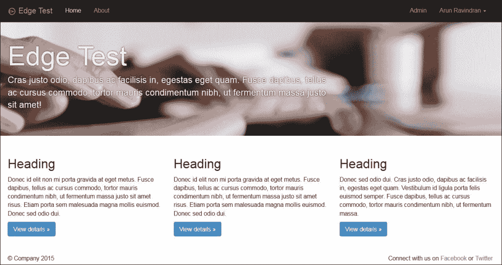
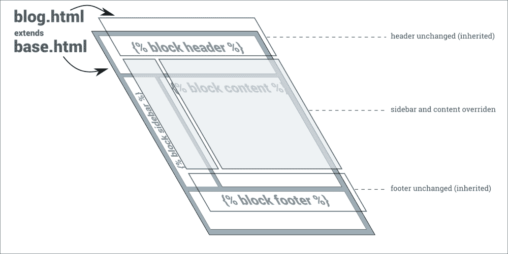

# 第五章：模板

在本章中，我们将讨论以下主题：

+   Django 模板语言的特性

+   组织模板

+   Bootstrap

+   模板继承树模式

+   活动链接模式

# 了解 Django 的模板语言特性

是时候谈谈 MTV 三人组中的第三个伙伴-模板了。您的团队可能有设计师负责设计模板。或者您可能自己设计它们。无论哪种方式，您都需要非常熟悉它们。毕竟，它们直接面向您的用户。

让我们从快速介绍 Django 的模板语言特性开始。

## 变量

每个模板都有一组上下文变量。与 Python 的字符串`format()`方法的单花括号`{variable}`语法类似，Django 使用双花括号`{{ variable }}`语法。让我们看看它们的比较：

+   在纯 Python 中，语法是`<h1>{title}</h1>`。例如：

```py
>>> "<h1>{title}</h1>".format(title="SuperBook")
'<h1>SuperBook</h1>'

```

+   在 Django 模板中的等效语法是`<h1>{{ title }}</h1>`。

+   使用相同的上下文进行渲染将产生相同的输出，如下所示：

```py
>>> from django.template import Template, Context
>>> Template("<h1>{{ title }}</h1>").render(Context({"title": "SuperBook"}))
'<h1>SuperBook</h1>'

```

## 属性

在 Django 模板中，点是一个多功能运算符。有三种不同的操作-属性查找、字典查找或列表索引查找（按顺序）。

+   首先，在 Python 中，让我们定义上下文变量和类：

```py
>>> class DrOct:
 arms = 4
 def speak(self):
 return "You have a train to catch."
>>> mydict = {"key":"value"}
>>> mylist = [10, 20, 30]

```

让我们来看看 Python 对三种查找的语法：

```py
>>> "Dr. Oct has {0} arms and says: {1}".format(DrOct().arms, DrOct().speak())
'Dr. Oct has 4 arms and says: You have a train to catch.'
>>> mydict["key"]
 'value'
>>> mylist[1]
 20

```

+   在 Django 的模板等价物中，如下所示：

```py
Dr. Oct has {{ s.arms }} arms and says: {{ s.speak }}
{{ mydict.key }}
{{ mylist.1 }}

```

### 注意

注意`speak`，一个除了`self`之外不带参数的方法，在这里被当作属性对待。

## 过滤器

有时，变量需要被修改。基本上，您想要在这些变量上调用函数。Django 使用管道语法`{{ var|method1|method2:"arg" }}`，而不是链接函数调用，例如`var.method1().method2(arg)`，这类似于 Unix 过滤器。但是，这种语法只适用于内置或自定义的过滤器。

另一个限制是过滤器无法访问模板上下文。它只能使用传递给它的数据及其参数。因此，它主要用于更改模板上下文中的变量。

+   在 Python 中运行以下命令：

```py
>>> title="SuperBook"
>>> title.upper()[:5]
 'SUPER'

```

+   它的 Django 模板等价物：

```py
{{ title|upper|slice:':5' }}"

```

## 标签

编程语言不仅可以显示变量。Django 的模板语言具有许多熟悉的语法形式，如`if`和`for`。它们应该以标签语法编写，如``。几种特定于模板的形式，如`include`和`block`，也是以标签语法编写的。

+   在 Python 中运行以下命令：

```py
>>> if 1==1:
...     print(" Date is {0} ".format(time.strftime("%d-%m-%Y")))
 Date is 31-08-2014

```

+   它对应的 Django 模板形式：

```py
 Date is  

```

## 哲学-不要发明一种编程语言

初学者经常问的一个问题是如何在模板中执行数值计算，比如找到百分比。作为设计哲学，模板系统故意不允许以下操作：

+   变量赋值

+   高级逻辑

这个决定是为了防止您在模板中添加业务逻辑。根据我们对 PHP 或类似 ASP 语言的经验，混合逻辑和表现可能会成为维护的噩梦。但是，您可以编写自定义模板标签（很快会介绍），以执行任何计算，特别是与表现相关的计算。

### 提示

**最佳实践**

将业务逻辑从模板中剥离出来。

# 组织模板

`startproject`命令创建的默认项目布局未定义模板的位置。这很容易解决。在项目的根目录中创建一个名为`templates`的目录。在您的`settings.py`中添加`TEMPLATE_DIRS`变量：

```py
BASE_DIR = os.path.dirname(os.path.dirname(__file__))
TEMPLATE_DIRS = [os.path.join(BASE_DIR, 'templates')]
```

就是这样。例如，您可以添加一个名为`about.html`的模板，并在`urls.py`文件中引用它，如下所示：

```py
urlpatterns = patterns(
    '',
    url(r'^about/$', TemplateView.as_view(template_name='about.html'),
        name='about'),
```

您的模板也可以位于应用程序中。在您的`app`目录内创建一个`templates`目录是存储特定于应用程序的模板的理想选择。

以下是一些组织模板的良好实践：

+   将所有特定于应用程序的模板放在`app`的模板目录中的单独目录中，例如`projroot/app/templates/app/template.html`—注意路径中`app`出现了两次

+   为您的模板使用`.html`扩展名

+   为要包含的模板添加下划线，例如`_navbar.html`

## 对其他模板语言的支持

从 Django 1.8 开始，将支持多个模板引擎。将内置支持 Django 模板语言（前面讨论过的标准模板语言）和 Jinja2。在许多基准测试中，Jinja2 比 Django 模板要快得多。

预计将有一个额外的`TEMPLATES`设置用于指定模板引擎和所有与模板相关的设置。`TEMPLATE_DIRS`设置将很快被弃用。

### 注

**乐观夫人**

几个星期以来，史蒂夫的办公室角落第一次充满了疯狂的活动。随着更多的新成员加入，现在的五人团队包括布拉德、埃文、雅各布、苏和史蒂夫。就像一个超级英雄团队一样，他们的能力深厚而惊人地平衡。

布拉德和埃文是编码大师。埃文着迷于细节，布拉德是大局观的人。雅各布在发现边缘情况方面的才能使他成为测试的完美人选。苏负责营销和设计。

事实上，整个设计本来应该由一家前卫的设计机构完成。他们花了一个月时间制作了一份抽象、生动、色彩斑斓的概念，受到了管理层的喜爱。他们又花了两个星期的时间从他们的 Photoshop 模型中制作出一个 HTML 版本。然而，由于在移动设备上表现迟缓和笨拙，最终被抛弃了。

史蒂夫对现在被广泛称为“独角兽呕吐物”设计的失败感到失望。哈特曾经打电话给他，非常担心没有任何可见的进展向管理层展示。他以严肃的口吻提醒史蒂夫：“我们已经耗尽了项目的缓冲时间。我们不能承受任何最后一刻的意外。”

苏自加入以来一直异常安静，那时她提到她一直在使用 Twitter 的 Bootstrap 进行模拟设计。苏是团队中的增长黑客——一个热衷于编码和创意营销的人。

她承认自己只有基本的 HTML 技能。然而，她的模型设计非常全面，对其他当代社交网络的用户来说看起来很熟悉。最重要的是，它是响应式的，并且在从平板电脑到手机等各种设备上都能完美运行。

管理层一致同意苏的设计，除了一个名叫乐观夫人的人。一个星期五的下午，她冲进苏的办公室，开始质疑从背景颜色到鼠标指针大小的一切。苏试图以令人惊讶的镇定和冷静向她解释。

一个小时后，当史蒂夫决定介入时，乐观夫人正在争论为什么个人资料图片必须是圆形而不是方形。“但是这样的全站更改永远不会及时完成，”他说。乐观夫人转移了目光，对他微笑。突然间，史蒂夫感到一股幸福和希望的波涌上涌。这让他感到非常宽慰和振奋。他听到自己愉快地同意她想要的一切。

后来，史蒂夫得知乐观夫人是一位可以影响易受影响的心灵的次要心灵感应者。他的团队喜欢在最轻微的场合提到后一事实。

# 使用 Bootstrap

如今几乎没有人从头开始建立整个网站。Twitter 的 Bootstrap 或 Zurb 的 Foundation 等 CSS 框架是具有网格系统、出色的排版和预设样式的简单起点。它们大多使用响应式网页设计，使您的网站适合移动设备。



使用 Edge 项目骨架构建的使用 vanilla Bootstrap Version 3.0.2 的网站

我们将使用 Bootstrap，但其他 CSS 框架的步骤也类似。有三种方法可以在您的网站中包含 Bootstrap：

+   **找到一个项目骨架**：如果您还没有开始项目，那么找到一个已经包含 Bootstrap 的项目骨架是一个很好的选择。例如，像`edge`（由我亲自创建）这样的项目骨架可以在运行`startproject`时用作初始结构，如下所示：

```py
$ django-admin.py startproject --template=https://github.com/arocks/edge/archive/master.zip --extension=py,md,html myproj

```

或者，您可以使用支持 Bootstrap 的`cookiecutter`模板之一。

+   **使用包**：如果您已经开始了项目，最简单的选择就是使用一个包，比如`django-frontend-skeleton`或`django-bootstrap-toolkit`。

+   **手动复制**：前面提到的选项都不能保证它们的 Bootstrap 版本是最新的。Bootstrap 发布频率如此之高，以至于包作者很难及时更新他们的文件。因此，如果您想使用最新版本的 Bootstrap，最好的选择是从[`getbootstrap.com`](http://getbootstrap.com)自己下载。一定要阅读发布说明，以检查您的模板是否需要由于向后不兼容性而进行更改。

将包含`css`、`js`和`fonts`目录的`dist`目录复制到您的项目根目录下的`static`目录中。确保在您的`settings.py`中为`STATICFILES_DIRS`设置了这个路径：

```py
STATICFILES_DIRS = [os.path.join(BASE_DIR, "static")]
```

现在您可以在您的模板中包含 Bootstrap 资源，如下所示：

```py

  <head>
    <link href="" rel="stylesheet">
```

## 但它们看起来都一样！

Bootstrap 可能是一个快速入门的好方法。然而，有时开发人员会变懒，不去改变默认外观。这会给您的用户留下不好的印象，他们可能会觉得您网站的外观有点太熟悉和无趣。

Bootstrap 带有大量选项来改善其视觉吸引力。有一个名为`variables.less`的文件，其中包含了从主品牌颜色到默认字体等几个变量，如下所示：

```py
@brand-primary:         #428bca;
@brand-success:         #5cb85c;
@brand-info:            #5bc0de;
@brand-warning:         #f0ad4e;
@brand-danger:          #d9534f;

@font-family-sans-serif:  "Helvetica Neue", Helvetica, Arial, sans-serif;
@font-family-serif:       Georgia, "Times New Roman", Times, serif;
@font-family-monospace:   Menlo, Monaco, Consolas, "Courier New", monospace;
@font-family-base:        @font-family-sans-serif;
```

Bootstrap 文档解释了如何设置构建系统（包括 LESS 编译器）来将这些文件编译成样式表。或者非常方便的是，您可以访问 Bootstrap 网站的“自定义”区域，在那里在线生成您定制的样式表。

由于 Bootstrap 周围有庞大的社区，还有一些网站，比如[bootswatch.com](http://bootswatch.com)，它们有主题样式表，可以直接替换您的`bootstrap.min.css`。

另一种方法是覆盖 Bootstrap 样式。如果您发现在不同的 Bootstrap 版本之间升级自定义的 Bootstrap 样式表非常乏味，那么这是一个推荐的方法。在这种方法中，您可以在一个单独的 CSS（或 LESS）文件中添加站点范围的样式，并在标准 Bootstrap 样式表之后包含它。因此，您可以只需对站点范围的样式表进行最小的更改，就可以简单地升级 Bootstrap 文件。

最后但同样重要的是，您可以通过用更有意义的名称替换结构名称（例如'row'或'column-md-4'替换为'wrapper'或'sidebar'）来使您的 CSS 类更有意义。您可以通过几行 LESS 代码来实现这一点，如下所示：

```py
.wrapper {
  .make-row();
}
.sidebar {
  .make-md-column(4);
}
```

这是可能的，因为有一个叫做 mixin 的功能（听起来很熟悉吧？）。有了 Less 源文件，Bootstrap 可以完全按照您的需求进行定制。

# 模板模式

Django 的模板语言非常简单。然而，通过遵循一些优雅的模板设计模式，您可以节省大量时间。让我们来看看其中一些。

## 模式 - 模板继承树

**问题**：模板中有很多重复的内容在几个页面中。

**解决方案**：在可能的地方使用模板继承，并在其他地方包含片段。

### 问题细节

用户期望网站的页面遵循一致的结构。某些界面元素，如导航菜单、标题和页脚，在大多数 Web 应用程序中都会出现。然而，在每个模板中重复它们是很麻烦的。

大多数模板语言都有一个包含机制。另一个文件的内容，可能是一个模板，可以在调用它的位置包含进来。在一个大型项目中，这可能会变得乏味。

在每个模板中包含的片段的顺序大多是相同的。顺序很重要，很难检查错误。理想情况下，我们应该能够创建一个'基础'结构。新页面应该扩展此基础，以指定仅更改或扩展基础内容。

### 解决方案详情

Django 模板具有强大的扩展机制。类似于编程中的类，模板可以通过继承进行扩展。但是，为了使其工作，基础本身必须按照以下块的结构进行组织：



`base.html`模板通常是整个站点的基本结构。该模板通常是格式良好的 HTML（即，具有前言和匹配的闭合标签），其中有几个用``标记标记的占位符。例如，一个最小的`base.html`文件看起来像下面这样：

```py
<html>
<body>
<h1>Untitled</h1>


</body>
</html>
```

这里有两个块，`heading`和`content`，可以被覆盖。您可以扩展基础以创建可以覆盖这些块的特定页面。例如，这是一个`about`页面：

```py


<p> This is a simple About page </p>

About
```

请注意，我们不必重复结构。我们也可以按任何顺序提及块。渲染的结果将在`base.html`中定义的正确位置具有正确的块。

如果继承模板没有覆盖一个块，那么将使用其父级的内容。在前面的例子中，如果`about`模板没有标题，那么它将具有默认的标题'Untitled'。

继承模板可以进一步继承形成继承链。这种模式可以用来创建具有特定布局的页面的共同派生基础，例如，单列布局。还可以为站点的某个部分创建一个共同的基础模板，例如，博客页面。

通常，所有的继承链都可以追溯到一个共同的根，`base.html`；因此，这种模式被称为模板继承树。当然，这并不一定要严格遵循。错误页面`404.html`和`500.html`通常不会被继承，并且会被剥离大部分标签，以防止进一步的错误。

## 模式-活动链接

**问题**：导航栏是大多数页面中的常见组件。但是，活动链接需要反映用户当前所在的页面。

**解决方案**：通过设置上下文变量或基于请求路径，有条件地更改活动链接标记。

### 问题详情

在导航栏中实现活动链接的天真方式是在每个页面中手动设置它。然而，这既不符合 DRY 原则，也不是绝对可靠的。

### 解决方案详情

有几种解决方案可以确定活动链接。除了基于 JavaScript 的方法之外，它们主要可以分为仅模板和基于自定义标签的解决方案。

#### 仅模板解决方案

通过在包含导航模板的同时提及`active_link`变量，这种解决方案既简单又易于实现。

在每个模板中，您需要包含以下行（或继承它）：

```py

```

`_navbar.html`文件包含了带有一组检查活动链接变量的导航菜单：

```py
{# _navbar.html #}
<ul class="nav nav-pills">
  <li class="active"><a href="">Link 1</a></li>
  <li class="active"><a href="">Link 2</a></li>
  <li class="active"><a href="">Link 3</a></li>
</ul>
```

#### 自定义标签

Django 模板提供了一个多功能的内置标签集。创建自定义标签非常容易。由于自定义标签位于应用程序内部，因此在应用程序内创建一个`templatetags`目录。该目录必须是一个包，因此它应该有一个（空的）`__init__.py`文件。

接下来，在一个适当命名的 Python 文件中编写您的自定义模板。例如，对于这个活动链接模式，我们可以创建一个名为`nav.py`的文件，其中包含以下内容：

```py
# app/templatetags/nav.py
from django.core.urlresolvers import resolve
from django.template import Library

register = Library()
@register.simple_tag
def active_nav(request, url):
    url_name = resolve(request.path).url_name
    if url_name == url:
        return "active"
    return ""
```

该文件定义了一个名为`active_nav`的自定义标签。它从请求参数中检索 URL 的路径组件（比如`/about/`—参见第四章，“视图和 URL”中对 URL 路径的详细解释）。然后，使用`resolve()`函数来查找路径对应的 URL 模式名称（在`urls.py`中定义）。最后，只有当模式名称匹配预期的模式名称时，它才返回字符串`"active"`。

在模板中调用这个自定义标签的语法是``。注意，请求需要在每个使用该标签的页面中传递。

在多个视图中包含一个变量可能会变得繁琐。相反，我们可以在`settings.py`的`TEMPLATE_CONTEXT_PROCESSORS`中添加一个内置的上下文处理器，这样请求将在整个站点中以`request`变量的形式存在。

```py
# settings.py
from django.conf import global_settings
TEMPLATE_CONTEXT_PROCESSORS = \
    global_settings.TEMPLATE_CONTEXT_PROCESSORS + (
        'django.core.context_processors.request',
    )
```

现在，唯一剩下的就是在模板中使用这个自定义标签来设置活动属性：

```py
{# base.html #}

<ul class="nav nav-pills">
  <li class=><a href="">Active 1</a></li>
  <li class=><a href="">Active 2</a></li>
  <li class=><a href="">Active 3</a></li>
</ul>
```

# 总结

在本章中，我们看了 Django 模板语言的特性。由于在 Django 中很容易更改模板语言，许多人可能会考虑替换它。然而，在寻找替代方案之前，了解内置模板语言的设计哲学是很重要的。

在下一章中，我们将探讨 Django 的一个杀手功能，即管理界面，以及我们如何对其进行定制。
