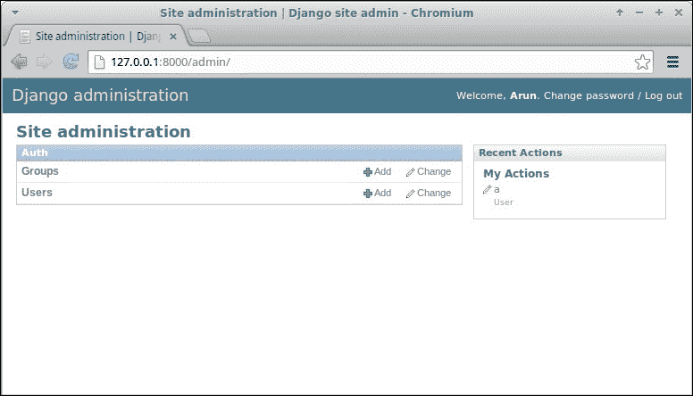

# 第六章：管理员界面

在本章中，我们将讨论以下主题：

+   自定义管理员

+   增强管理员模型

+   管理员最佳实践

+   功能标志

Django 备受瞩目的管理员界面使其脱颖而出。它是一个内置应用程序，可以自动生成用户界面以添加和修改站点的内容。对许多人来说，管理员是 Django 的杀手应用程序，自动化了为项目中的模型创建管理员界面这一乏味任务。

管理员使您的团队能够同时添加内容并继续开发。一旦您的模型准备好并应用了迁移，您只需要添加一两行代码来创建其管理员界面。让我们看看如何做到。

# 使用管理员界面

在 Django 1.7 中，默认情况下启用了管理员界面。创建项目后，当您导航到`http://127.0.0.1:8000/admin/`时，您将能够看到登录页面。

如果您输入超级用户凭据（或任何员工用户的凭据），您将登录到管理员界面，如下面的屏幕截图所示：



然而，除非您定义相应的`ModelAdmin`类，否则您的模型在这里将不可见。这通常在您的应用程序的`admin.py`中定义如下：

```py
from django.contrib import admin
from . import models

admin.site.register(models.SuperHero)
```

这里，register 的第二个参数，一个`ModelAdmin`类，已被省略。因此，我们将为 Post 模型获得一个默认的管理员界面。让我们看看如何创建和自定义这个`ModelAdmin`类。

### 注意

**信标**

“在喝咖啡吗？”角落里传来一个声音。苏差点把咖啡洒出来。一个穿着紧身红蓝色服装的高个子男人双手叉腰微笑着站在那里。他胸前的标志大大地写着“显而易见船长”。

“哦，天哪，”苏在用餐巾擦咖啡渍时说道。“抱歉，我想我吓到你了，”显而易见船长说。“有什么紧急情况吗？”

“她不知道这是显而易见的吗？”一个平静的女声从上方传来。苏抬头看到一个阴影般的人物从开放的大厅缓缓降下。她的脸部被她那几缕灰色的头发部分遮挡住。“嗨，海克萨！”船长说。“但是，超级书上的消息是什么？”

很快，他们都来到了史蒂夫的办公室，盯着他的屏幕。“看，我告诉过你，首页上没有信标，”埃文说。“我们还在开发这个功能。”“等等，”史蒂夫说。“让我用一个非员工账户登录。”

几秒钟后，页面刷新了，一个动画的红色信标显眼地出现在顶部。“那就是我说的信标！”显而易见船长惊叫道。“等一下，”史蒂夫说。他打开了当天早些时候部署的新功能的源文件。一眼看到信标功能分支代码就清楚了出了什么问题：

```py
    if switch_is_active(request, 'beacon') and not request.user.is_staff():
        # Display the beacon
```

“对不起，各位，”史蒂夫说。“出现了逻辑错误。我们不是只为员工打开了这个功能，而是不小心为所有人打开了这个功能，除了员工。现在已经关闭了。对于任何混淆，我们深表歉意。”

“所以，没有紧急情况吗？”船长失望地说。海克萨把手搭在他肩上说：“恐怕没有，船长。”突然，传来一声巨响，所有人都跑到了走廊。一个人显然是从天花板到地板的玻璃墙中间降落在办公室里。他甩掉了碎玻璃，站了起来。“对不起，我尽快赶过来了，”他说，“我来晚了吗？”海克萨笑了。“不，闪电。一直在等你加入，”她说。

# 增强管理员模型

管理员应用程序足够聪明，可以自动从您的模型中推断出很多东西。但是，有时推断出的信息可以得到改进。这通常涉及向模型本身添加属性或方法（而不是在`ModelAdmin`类中）。

让我们首先看一个增强模型以获得更好展示的示例，包括管理员界面：

```py
# models.py
class SuperHero(models.Model):
    name = models.CharField(max_length=100)
    added_on = models.DateTimeField(auto_now_add=True)

    def __str__(self):
        return "{0} - {1:%Y-%m-%d %H:%M:%S}".format(self.name,
                                                    self.added_on)

    def get_absolute_url(self):
        return reverse('superhero.views.details', args=[self.id])

    class Meta:
        ordering = ["-added_on"]
        verbose_name = "superhero"
        verbose_name_plural = "superheroes"
```

让我们看看管理员如何使用所有这些非字段属性：

+   `__str__()`: 如果没有这个，超级英雄条目列表将看起来非常无聊。每个条目都会简单地显示为`<SuperHero: SuperHero object>`。尽量在其`str`表示中包含对象的唯一信息（或 Python 2.x 代码中的`unicode`表示），比如它的名称或版本。任何有助于管理员明确识别对象的信息都会有所帮助。

+   `get_absolute_url()`: 如果您喜欢在网站上的管理视图和对象的详细视图之间切换，那么这个属性非常方便。如果定义了这个方法，那么在对象的编辑页面的右上方将出现一个标有“**在网站上查看**”的按钮。

+   `ordering`: 如果没有这个元选项，您的条目可以以从数据库返回的任何顺序出现。可以想象，如果您有大量对象，这对管理员来说并不有趣。通常希望首先看到新条目，因此按日期的逆向时间顺序排序是常见的。

+   `verbose_name`: 如果省略了这个属性，您的模型名称将从驼峰式转换为小驼峰式。在这种情况下，“超级英雄”看起来很奇怪，因此最好明确指定用户可读名称在管理界面中的显示方式。

+   `verbose_name_plural`: 再次，省略此选项会导致有趣的结果。由于 Django 只是在单词前加上's'，超级英雄的复数将显示为“superheros”（甚至在管理前页）。因此，在这里正确定义它会更好。

建议您不仅为管理界面定义先前的`Meta`属性和方法，还为更好地在 shell、日志文件等中表示。

当然，通过创建`ModelAdmin`类，可以进一步改进管理中的表示，如下所示：

```py
# admin.py
class SuperHeroAdmin(admin.ModelAdmin):
    list_display = ('name', 'added_on')
    search_fields = ["name"]
    ordering = ["name"]

admin.site.register(models.SuperHero, SuperHeroAdmin)
```

让我们更仔细地看看这些选项：

+   `list_display`: 此选项以表格形式显示模型实例。它不使用模型的`__str__`表示，而是将每个字段作为单独的可排序列显示。如果您希望查看模型的多个属性，这是理想的选择。

+   `search_fields`: 此选项在列表上方显示一个搜索框。输入的任何搜索词都将针对所述字段进行搜索。因此，只能在这里提到文本字段，如`CharField`或`TextField`。

+   `ordering`: 这个选项优先于模型的默认排序。如果您在管理屏幕中更喜欢不同的排序方式，这将非常有用。

增强模型的管理页面

上述截图显示了以下插图：

+   插图 1：没有`str`或`Meta`属性

+   插图 2：带有增强模型`meta`属性

+   插图 3：带有自定义`ModelAdmin`

在这里，我们只提到了一些常用的管理选项子集。某些类型的网站会大量使用管理界面。在这种情况下，强烈建议您阅读并了解 Django 文档中的管理部分。

## 并非每个人都应该成为管理员

由于管理界面很容易创建，人们往往滥用它们。一些人仅仅通过打开他们的“工作人员”标志就给予早期用户管理员访问权限。很快，这些用户开始提出功能请求，误以为管理界面是实际应用程序界面。

不幸的是，这并不是管理界面的用途。正如标志所示，它是一个内部工具，供工作人员输入内容使用。它已经准备好投入生产，但并不真正面向您网站的最终用户。

最好将管理用于简单的数据输入。例如，在我审查过的一个项目中，每个老师都被设置为 Django 应用程序管理大学课程的管理员。这是一个糟糕的决定，因为管理界面让老师感到困惑。

安排课程的工作流程涉及检查其他教师和学生的日程安排。使用管理界面使他们直接查看数据库。对于管理员如何修改数据，几乎没有任何控制。

因此，尽量将具有管理访问权限的人数保持得尽可能少。除非是简单的数据输入，例如添加文章内容，否则请谨慎通过管理进行更改。

### 提示

**最佳实践**

不要将管理访问权限授予最终用户。

确保您的所有管理员都了解通过管理进行更改可能导致的数据不一致性。如果可能的话，手动记录或使用应用程序，例如`django-audit-loglog`，可以记录未来参考所做的管理更改。

在大学示例中，我们为教师创建了一个单独的界面，例如课程构建器。只有当用户具有教师配置文件时，这些工具才会可见和可访问。

基本上，纠正大多数管理界面的误用涉及为某些用户组创建更强大的工具。但是，不要采取简单（错误的）路径，授予他们管理访问权限。

# 管理界面自定义

开箱即用的管理界面非常有用。不幸的是，大多数人认为很难更改 Django 管理界面，因此将其保持原样。实际上，管理界面是非常可定制的，只需付出最少的努力即可大幅改变其外观。

## 更改标题

许多管理界面的用户可能会被标题“Django administration”困惑。更改为一些自定义的内容，例如“MySite admin”或者“SuperBook Secret Area”可能更有帮助。

这种更改非常容易。只需将以下行添加到站点的`urls.py`中：

```py
admin.site.site_header = "SuperBook Secret Area"
```

## 更改基础和样式表

几乎每个管理页面都是从名为`admin/base_site.html`的通用基础模板扩展而来。这意味着只要稍微了解 HTML 和 CSS，您就可以进行各种自定义，改变管理界面的外观和感觉。

只需在任何`templates`目录中创建一个名为`admin`的目录。然后，从 Django 源目录中复制`base_site.html`文件，并根据需要进行修改。如果您不知道模板的位置，请在 Django shell 中运行以下命令：

```py
>>> from os.path import join
>>> from django.contrib import admin
>>> print(join(admin.__path__[0], "templates", "admin"))
/home/arun/env/sbenv/lib/python3.4/site-packages/django/contrib/admin/templates/admin

```

最后一行是所有管理模板的位置。您可以覆盖或扩展这些模板中的任何一个。有关扩展模板的示例，请参考下一节。

关于自定义管理基础模板的示例，您可以将整个管理界面的字体更改为来自 Google Fonts 的“Special Elite”，这对于赋予一种模拟严肃的外观非常有用。您需要在模板目录之一中添加一个`admin/base_site.html`文件，内容如下：

```py



    <link href='http://fonts.googleapis.com/css?family=Special+Elite' rel='stylesheet' type='text/css'>
    <style type="text/css">
     body, td, th, input {
       font-family: 'Special Elite', cursive;
     }
    </style>

```

这将添加一个额外的样式表，用于覆盖与字体相关的样式，并将应用于每个管理页面。

### 为所见即所得编辑添加富文本编辑器

有时，您需要在管理界面中包含 JavaScript 代码。常见的要求是为您的`TextField`使用 HTML 编辑器，例如`CKEditor`。

在 Django 中有几种实现这一点的方法，例如在`ModelAdmin`类上使用`Media`内部类。但是，我发现扩展管理`change_form`模板是最方便的方法。

例如，如果您有一个名为`Posts`的应用程序，则需要在`templates/admin/posts/`目录中创建一个名为`change_form.html`的文件。如果需要为该应用程序中任何模型的`message`字段显示`CKEditor`（也可以是任何 JavaScript 编辑器，但我更喜欢这个），则文件的内容可以如下所示：

```py



  {{ block.super }}
  <script src="img/ckeditor.js"></script>
  <script>
   CKEDITOR.replace("id_message", {
     toolbar: [
     [ 'Bold', 'Italic', '-', 'NumberedList', 'BulletedList'],],
     width: 600,
   });
  </script>
  <style type="text/css">
   .cke { clear: both; }
  </style>

```

突出显示的部分是我们希望从普通文本框改为富文本编辑器的表单元素自动生成的`ID`。这些脚本和样式已添加到页脚块，以便在更改之前在 DOM 中创建表单元素。

## 基于 Bootstrap 的管理

总的来说，管理界面设计得相当不错。然而，它是在 2006 年设计的，大部分看起来也是这样。它没有移动 UI 或其他今天已经成为标准的美化功能。

毫不奇怪，对管理自定义的最常见请求是是否可以与 Bootstrap 集成。有几个包可以做到这一点，比如 `django-admin-bootstrapped` 或 `djangosuit`。

这些包提供了现成的基于 Bootstrap 主题的模板，易于安装和部署。基于 Bootstrap，它们是响应式的，并带有各种小部件和组件。

## 完全改版

也有人尝试完全重新构想管理界面。**Grappelli** 是一个非常受欢迎的皮肤，它通过自动完成查找和可折叠的内联等新功能扩展了 Django 管理。使用 `django-admin-tools`，您可以获得可定制的仪表板和菜单栏。

已经有人尝试完全重写管理界面，比如 `django-admin2` 和 `nexus`，但没有获得任何重大的采用。甚至有一个名为 `AdminNext` 的官方提案来改进整个管理应用。考虑到现有管理的规模、复杂性和受欢迎程度，任何这样的努力都预计需要大量的时间。

# 保护管理

您网站的管理界面可以访问几乎所有存储的数据。因此，不要轻易留下象征性的门。事实上，当你导航到 `http://example.com/admin/` 时，你会看到蓝色的登录界面，这是运行 Django 的人的一个明显迹象。

在生产中，建议将此位置更改为不太明显的位置。只需在根 `urls.py` 中更改这一行即可：

```py
    url(r'^secretarea/', include(admin.site.urls)),
```

一个稍微更复杂的方法是在默认位置使用一个虚拟的管理站点或者蜜罐（参见 `django-admin-honeypot` 包）。然而，最好的选择是在管理区域使用 HTTPS，因为普通的 HTTP 会将所有数据以明文形式发送到网络上。

查看您的 Web 服务器文档，了解如何为管理请求设置 HTTPS。在 Nginx 上，设置这个很容易，涉及指定 SSL 证书的位置。最后，将所有管理页面的 HTTP 请求重定向到 HTTPS，这样你就可以更加安心地睡觉了。

以下模式不仅限于管理界面，但仍然包括在本章中，因为它经常在管理中受到控制。

## 模式 - 功能标志

**问题**：向用户发布新功能和在生产环境中部署相应的代码应该是独立的。

**解决方案**：使用功能标志在部署后选择性地启用或禁用功能。

### 问题细节

今天，频繁地将错误修复和新功能推向生产是很常见的。其中许多变化并不为用户所注意。然而，在可用性或性能方面有重大影响的新功能应该以分阶段的方式推出。换句话说，部署应该与发布分离。

简化的发布流程在部署后立即激活新功能。这可能会导致从用户问题（淹没您的支持资源）到性能问题（导致停机时间）等灾难性的结果。

因此，在大型网站中，重要的是将新功能的部署与在生产环境中激活它们分开。即使它们被激活，有时也只能被一小部分用户看到。这个小组可以是员工或一小部分客户用于试用目的。

### 解决方案细节

许多网站使用**功能标志**来控制新功能的激活。功能标志是代码中的开关，用于确定是否应向某些客户提供某项功能。

几个 Django 包提供了功能标志，如`gargoyle`和`django-waffle`。这些包将站点的功能标志存储在数据库中。它们可以通过管理界面或管理命令激活或停用。因此，每个环境（生产、测试、开发等）都可以拥有自己激活的功能集。

功能标志最初是在 Flickr 中记录的（请参阅[`code.flickr.net/2009/12/02/flipping-out/`](http://code.flickr.net/2009/12/02/flipping-out/)）。他们管理了一个没有任何分支的代码库，也就是说，所有东西都被检入主线。他们还将这些代码部署到生产环境中多次。如果他们发现新功能在生产环境中出现故障或增加了数据库的负载，那么他们只需通过关闭该功能标志来禁用它。

功能标志可以用于各种其他情况（以下示例使用`django-waffle`）：

+   **试验**：功能标志也可以有条件地对某些用户进行激活。这些可以是您自己的员工或某些早期采用者，如下所示：

```py
    def my_view(request):
        if flag_is_active(request, 'flag_name'):
            # Behavior if flag is active.
```

网站可以同时运行几个这样的试验，因此不同的用户可能会有不同的用户体验。在更广泛的部署之前，会从这些受控测试中收集指标和反馈。

+   **A/B 测试**：这与试验非常相似，只是在受控实验中随机选择用户。这在网页设计中很常见，用于确定哪些更改可以提高转化率。以下是编写这样一个视图的方法：

```py
    def my_view(request):
        if sample_is_active(request, 'design_name'):
            # Behavior for test sample.
```

+   **性能测试**：有时很难衡量某项功能对服务器性能的影响。在这种情况下，最好先仅为小部分用户激活该标志。如果性能在预期范围内，可以逐渐增加激活的百分比。

+   **限制外部性**：我们还可以使用功能标志作为反映其服务可用性的站点范围功能开关。例如，外部服务（如 Amazon S3）的停机可能导致用户在执行上传照片等操作时面临错误消息。

当外部服务长时间停机时，可以停用功能标志，从而禁用上传按钮和/或显示有关停机的更有帮助的消息。这个简单的功能节省了用户的时间，并提供了更好的用户体验：

```py
    def my_view(request):
        if switch_is_active('s3_down'):
            # Disable uploads and show it is downtime
```

这种方法的主要缺点是代码中充斥着条件检查。但是，可以通过定期的代码清理来控制这一点，以删除对已完全接受的功能的检查，并清除永久停用的功能。

# 总结

在本章中，我们探讨了 Django 内置的管理应用程序。我们发现它不仅可以直接使用，而且还可以进行各种自定义以改善其外观和功能。

在下一章中，我们将探讨如何通过考虑各种模式和常见用例来更有效地使用 Django 中的表单。
