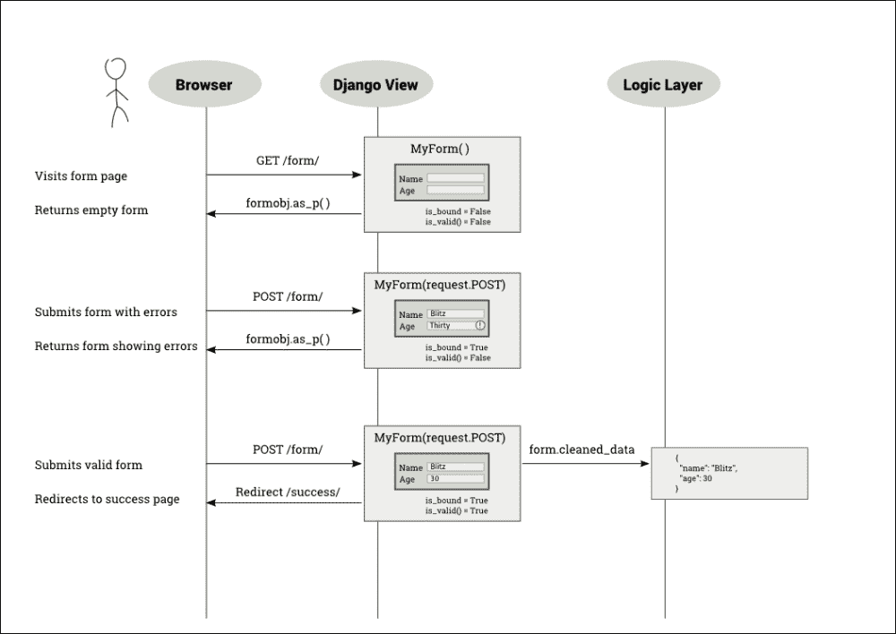
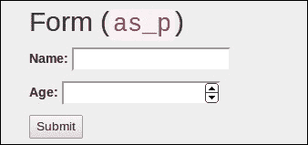
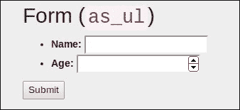
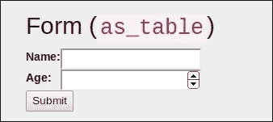
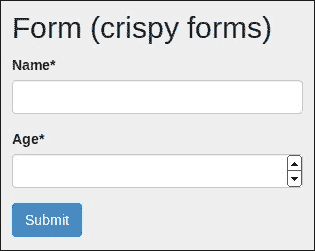

# 第七章：表单

在本章中，我们将讨论以下主题：

+   表单工作流程

+   不受信任的输入

+   使用基于类的视图处理表单

+   使用 CRUD 视图

让我们把 Django 表单放在一边，谈谈一般的网络表单。表单不仅仅是一长串的、乏味的页面，上面有几个你必须填写的项目。表单无处不在。我们每天都在使用它们。表单驱动着从谷歌的搜索框到 Facebook 的**赞**按钮的一切。

在处理表单时，Django 会抽象出大部分繁重的工作，例如验证或呈现。它还实现了各种安全最佳实践。然而，由于它们可能处于多种状态之一，表单也是混淆的常见来源。让我们更仔细地研究它们。

# 表单的工作原理

理解表单可能有些棘手，因为与它们的交互需要多个请求-响应周期。在最简单的情况下，您需要呈现一个空表单，用户填写正确并提交它。在其他情况下，他们输入了一些无效数据，表单需要重新提交，直到整个表单有效为止。

因此，表单经历了几种状态：

+   **空表单**：这种表单在 Django 中称为未绑定表单

+   填充表单：在 Django 中，这种表单称为绑定表单

+   **提交的带有错误的表单**：这种表单称为绑定表单，但不是有效的表单

+   **提交的没有错误的表单**：这种表单在 Django 中称为绑定和有效的表单

请注意，用户永远不会看到表单处于最后状态。他们不必这样做。提交有效的表单应该将用户带到成功页面。

## Django 中的表单

Django 的`form`类包含每个字段的状态，通过总结它们到一个级别，还包括表单本身的状态。表单有两个重要的状态属性，如下所示：

+   `is_bound`：如果返回 false，则它是一个未绑定的表单，也就是说，一个带有空或默认字段值的新表单。如果为 true，则表单是绑定的，也就是说，至少有一个字段已经设置了用户输入。

+   `is_valid()`: 如果返回 true，则绑定表单中的每个字段都有有效数据。如果为 false，则至少一个字段中有一些无效数据或者表单未绑定。

例如，假设您需要一个简单的表单，接受用户的姓名和年龄。表单类可以定义如下：

```py
# forms.py
from django import forms

class PersonDetailsForm(forms.Form):
    name = forms.CharField(max_length=100)
    age = forms.IntegerField()
```

这个类可以以绑定或未绑定的方式初始化，如下面的代码所示：

```py
>>> f = PersonDetailsForm()
>>> print(f.as_p())
<p><label for="id_name">Name:</label> <input id="id_name" maxlength="100" name="name" type="text" /></p>
<p><label for="id_age">Age:</label> <input id="id_age" name="age" type="number" /></p>

>>> f.is_bound
 False

>>> g = PersonDetailsForm({"name": "Blitz", "age": "30"})
>>> print(g.as_p())
<p><label for="id_name">Name:</label> <input id="id_name" maxlength="100" name="name" type="text" value="Blitz" /></p>
<p><label for="id_age">Age:</label> <input id="id_age" name="age" type="number" value="30" /></p>

>>> g.is_bound
 True

```

请注意 HTML 表示如何更改以包括带有其中的绑定数据的值属性。

表单只能在创建表单对象时绑定，也就是在构造函数中。用户输入是如何进入包含每个表单字段值的类似字典的对象中的呢？

要了解这一点，您需要了解用户如何与表单交互。在下图中，用户打开人员详细信息表单，首先填写不正确，然后提交，然后使用有效信息重新提交：



如前图所示，当用户提交表单时，视图可调用获取`request.POST`中的所有表单数据（`QueryDict`的实例）。表单使用这个类似字典的对象进行初始化，因为它的行为类似于字典并且具有一些额外的功能。

表单可以定义为以两种不同的方式发送表单数据：`GET`或`POST`。使用`METHOD="GET"`定义的表单将表单数据编码在 URL 本身中，例如，当您提交 Google 搜索时，您的 URL 将具有您的表单输入，即搜索字符串可见地嵌入其中，例如`?q=Cat+Pictures`。`GET`方法用于幂等表单，它不会对世界的状态进行任何持久性更改（或者更严谨地说，多次处理表单的效果与一次处理它的效果相同）。在大多数情况下，这意味着它仅用于检索数据。

然而，绝大多数的表单都是用`METHOD="POST"`定义的。在这种情况下，表单数据会随着 HTTP 请求的主体一起发送，用户看不到。它们用于任何涉及副作用的事情，比如存储或更新数据。

取决于您定义的表单类型，当用户提交表单时，视图将在`request.GET`或`request.POST`中接收表单数据。如前所述，它们中的任何一个都将像字典一样。因此，您可以将其传递给您的表单类构造函数以获取一个绑定的`form`对象。

### 注

**入侵**

史蒂夫蜷缩着，沉沉地在他的大三座沙发上打呼噜。在过去的几个星期里，他一直在办公室呆了超过 12 个小时，今晚也不例外。他的手机放在地毯上发出了哔哔声。起初，他还在睡梦中说了些什么，然后，它一次又一次地响，声音越来越紧急。

第五声响起时，史蒂夫惊醒了。他疯狂地在沙发上四处搜寻，最终找到了他的手机。屏幕上显示着一个色彩鲜艳的条形图。每根条都似乎触及了高线，除了一根。他拿出笔记本电脑，登录了 SuperBook 服务器。网站正常，日志中也没有任何异常活动。然而，外部服务看起来并不太好。

电话那头似乎响了很久，直到一个嘶哑的声音回答道：“喂，史蒂夫？”半个小时后，雅各布终于把问题追溯到了一个无响应的超级英雄验证服务。“那不是运行在 Sauron 上吗？”史蒂夫问道。有一瞬间的犹豫。“恐怕是的，”雅各布回答道。

史蒂夫感到一阵恶心。Sauron 是他们对抗网络攻击和其他可能攻击的第一道防线。当他向任务控制团队发出警报时，已经是凌晨三点了。雅各布一直在和他聊天。他运行了所有可用的诊断工具。没有任何安全漏洞的迹象。

史蒂夫试图让自己冷静下来。他安慰自己也许只是暂时超载，应该休息一下。然而，他知道雅各布不会停止，直到找到问题所在。他也知道 Sauron 不会出现暂时超载的情况。感到极度疲惫，他又睡了过去。

第二天早上，史蒂夫手持一个百吉饼匆匆赶往办公楼时，听到了一阵震耳欲聋的轰鸣声。他转过身，看到一艘巨大的飞船朝他飞来。本能地，他躲到了篱笆后面。在另一边，他听到几个沉重的金属物体落到地面上的声音。就在这时，他的手机响了。是雅各布。有什么东西靠近了他。史蒂夫抬头一看，看到了一个将近 10 英尺高的机器人，橙色和黑色相间，直指他的头上，看起来像是一把武器。

他的手机还在响。他冲到开阔地，差点被周围喷射的子弹击中。他接了电话。“嘿，史蒂夫，猜猜，我终于找到真相了。”“我迫不及待想知道，”史蒂夫说。

“记得我们用 UserHoller 的表单小部件收集客户反馈吗？显然，他们的数据并不那么干净。我的意思是有几个严重的漏洞。嘿，有很多背景噪音。那是电视吗？”史蒂夫朝着一个大大的标志牌扑去，上面写着“安全集结点”。“别理它。告诉我发生了什么事，”他尖叫道。

“好的。所以，当我们的管理员打开他们的反馈页面时，他的笔记本电脑一定被感染了。这个蠕虫可能会传播到他有权限访问的其他系统，特别是 Sauron。我必须说，雅各布，这是一次非常有针对性的攻击。了解我们安全系统的人设计了这个。我有一种不祥的预感，有可怕的事情即将发生。”

在草坪上，一个机器人抓起了一辆 SUV，朝着史蒂夫扔去。他举起手，闭上眼睛。金属的旋转质量在他上方几英尺处冻结了下来。 “重要电话？”Hexa 问道，她放下了车。“是的，请帮我离开这里，”史蒂夫恳求道。

## 为什么数据需要清理？

最终，您需要从表单中获取“清理后的数据”。这是否意味着用户输入的值不干净？是的，有两个原因。

首先，来自外部世界的任何东西最初都不应该被信任。恶意用户可以通过一个表单输入各种各样的漏洞，从而破坏您网站的安全性。因此，任何表单数据在使用之前都必须经过清理。

### 提示

**最佳实践**

永远不要相信用户输入。

其次，`request.POST`或`request.GET`中的字段值只是字符串。即使您的表单字段可以定义为整数（比如年龄）或日期（比如生日），浏览器也会将它们作为字符串发送到您的视图。无论如何，您都希望在使用之前将它们转换为适当的 Python 类型。`form`类在清理时会自动为您执行此转换。

让我们看看这个实际操作：

```py
>>> fill = {"name": "Blitz", "age": "30"}

>>> g = PersonDetailsForm(fill)

>>> g.is_valid()
 True

>>> g.cleaned_data
 {'age': 30, 'name': 'Blitz'}

>>> type(g.cleaned_data["age"])
 int
```

年龄值作为字符串（可能来自`request.POST`）传递给表单类。验证后，清理数据包含整数形式的年龄。这正是你所期望的。表单试图抽象出字符串传递的事实，并为您提供可以使用的干净的 Python 对象。

# 显示表单

Django 表单还可以帮助您创建表单的 HTML 表示。它们支持三种不同的表示形式：`as_p`（作为段落标签），`as_ul`（作为无序列表项）和`as_table`（作为，不出所料，表格）。

这些表示形式的模板代码、生成的 HTML 代码和浏览器渲染已经总结在下表中：

| 模板 | 代码 | 浏览器中的输出 |
| --- | --- | --- |
| `{{ form.as_p }}` |

```py
<p><label for="id_name"> Name:</label>
<input class="textinput textInput form-control" id="id_name" maxlength="100" name="name" type="text" /></p>
<p><label for="id_age">Age:</label> <input class="numberinput form-control" id="id_age" name="age" type="number" /></p>
```

|  |
| --- |
| `{{ form.as_ul }}` |

```py
<li><label for="id_name">Name:</label> <input class="textinput textInput form-control" id="id_name" maxlength="100" name="name" type="text" /></li>
<li><label for="id_age">Age:</label> <input class="numberinput form-control" id="id_age" name="age" type="number" /></li>
```

|  |
| --- |
| `{{ form.as_table }}` |

```py
<tr><th><label for="id_name">Name:</label></th><td><input class="textinput textInput form-control" id="id_name" maxlength="100" name="name" type="text" /></td></tr>
<tr><th><label for="id_age">Age:</label></th><td><input class="numberinput form-control" id="id_age" name="age" type="number" /></td></tr>
```

|  |
| --- |

请注意，HTML 表示仅提供表单字段。这样可以更容易地在单个 HTML 表单中包含多个 Django 表单。但是，这也意味着模板设计者需要为每个表单编写相当多的样板代码，如下面的代码所示：

```py
<form method="post">
  
  <table>{{ form.as_table }}</table>
  <input type="submit" value="Submit" />
</form>
```

请注意，为了使 HTML 表示完整，您需要添加周围的`form`标签，CSRF 令牌，`table`或`ul`标签和**submit**按钮。

## 时间变得简洁

在模板中为每个表单编写如此多的样板代码可能会让人感到厌烦。`django-crispy-forms`包使得编写表单模板代码更加简洁（在长度上）。它将所有的演示和布局都移到了 Django 表单本身。这样，您可以编写更多的 Python 代码，而不是 HTML。

下表显示了脆弱的表单模板标记生成了一个更完整的表单，并且外观更符合 Bootstrap 样式：

| 模板 | 代码 | 浏览器中的输出 |
| --- | --- | --- |
| `` |

```py
<form method="post">
<input type='hidden' name='csrfmiddlewaretoken' value='...' />
<div id="div_id_name" class="form-group">
<label for="id_name" class="control-label  requiredField">
Name<span class="asteriskField">*</span></label>
<div class="controls ">
<input class="textinput textInput form-control form-control" id="id_name" maxlength="100" name="name" type="text" /> </div></div> ...
```

（为简洁起见截断了 HTML）|  |

那么，如何获得更清晰的表单？您需要安装`django-crispy-forms`包并将其添加到`INSTALLED_APPS`中。如果您使用 Bootstrap 3，则需要在设置中提到这一点：

```py
CRISPY_TEMPLATE_PACK = "bootstrap3"
```

表单初始化将需要提及`FormHelper`类型的辅助属性。下面的代码旨在尽量简化，并使用默认布局：

```py
from crispy_forms.helper import FormHelper
from crispy_forms.layout import Submit

class PersonDetailsForm(forms.Form):
    name = forms.CharField(max_length=100)
    age = forms.IntegerField()

    def __init__(self, *args, **kwargs):
        super().__init__(*args, **kwargs)
        self.helper = FormHelper(self)
        self.helper.layout.append(Submit('submit', 'Submit'))
```

# 理解 CSRF

因此，您一定会注意到表单模板中有一个名为**CSRF**令牌的东西。它是针对您的表单的**跨站请求伪造**（CSRF）攻击的安全机制。

它通过注入一个名为 CSRF 令牌的服务器生成的随机字符串来工作，该令牌对用户的会话是唯一的。每次提交表单时，必须有一个包含此令牌的隐藏字段。此令牌确保表单是由原始站点为用户生成的，而不是攻击者创建的具有类似字段的伪造表单。

不建议为使用`GET`方法的表单使用 CSRF 令牌，因为`GET`操作不应更改服务器状态。此外，通过`GET`提交的表单将在 URL 中公开 CSRF 令牌。由于 URL 有更高的被记录或被窥视的风险，最好在使用`POST`方法的表单中使用 CSRF。

# 使用基于类的视图进行表单处理

我们可以通过对基于类的视图本身进行子类化来实质上处理表单：

```py
class ClassBasedFormView(generic.View):
    template_name = 'form.html'

    def get(self, request):
        form = PersonDetailsForm()
        return render(request, self.template_name, {'form': form})

    def post(self, request):
        form = PersonDetailsForm(request.POST)
        if form.is_valid():
            # Success! We can use form.cleaned_data now
            return redirect('success')
        else:
            # Invalid form! Reshow the form with error highlighted
            return render(request, self.template_name,
                          {'form': form})
```

将此代码与我们之前看到的序列图进行比较。这三种情况已经分别处理。

每个表单都应遵循**Post/Redirect/Get**（**PRG**）模式。如果提交的表单被发现有效，则必须发出重定向。这可以防止重复的表单提交。

但是，这不是一个非常 DRY 的代码。表单类名称和模板名称属性已被重复。使用诸如`FormView`之类的通用基于类的视图可以减少表单处理的冗余。以下代码将以更少的代码行数为您提供与以前相同的功能：

```py
from django.core.urlresolvers import reverse_lazy

class GenericFormView(generic.FormView):
    template_name = 'form.html'
    form_class = PersonDetailsForm
    success_url = reverse_lazy("success")
```

在这种情况下，我们需要使用`reverse_lazy`，因为在导入视图文件时，URL 模式尚未加载。

# 表单模式

让我们看一些处理表单时常见的模式。

## 模式 - 动态表单生成

**问题**：动态添加表单字段或更改已声明的表单字段。

**解决方案**：在表单初始化期间添加或更改字段。

### 问题细节

通常以声明式样式定义表单，其中表单字段列为类字段。但是，有时我们事先不知道这些字段的数量或类型。这需要动态生成表单。这种模式有时被称为**动态表单**或**运行时表单生成**。

想象一个航班乘客登机系统，允许将经济舱机票升级到头等舱。如果还有头等舱座位，需要为用户提供一个额外的选项，询问他们是否想要头等舱。但是，这个可选字段不能被声明，因为它不会显示给所有用户。这种动态表单可以通过这种模式处理。

### 解决方案细节

每个表单实例都有一个名为`fields`的属性，它是一个保存所有表单字段的字典。这可以在运行时进行修改。在表单初始化期间可以添加或更改字段。

例如，如果我们需要在用户详细信息表单中添加一个复选框，只有在表单初始化时命名为"`upgrade`"的关键字参数为 true 时，我们可以实现如下：

```py
class PersonDetailsForm(forms.Form):
    name = forms.CharField(max_length=100)
    age = forms.IntegerField()

    def __init__(self, *args, **kwargs):
        upgrade = kwargs.pop("upgrade", False)
        super().__init__(*args, **kwargs)

        # Show first class option?
        if upgrade:
            self.fields["first_class"] = forms.BooleanField(
                label="Fly First Class?")
```

现在，我们只需要传递`PersonDetailsForm(upgrade=True)`关键字参数，就可以使一个额外的布尔输入字段（复选框）出现。

### 注意

请注意，在调用`super`之前，新引入的关键字参数必须被移除或弹出，以避免`unexpected keyword`错误。

如果我们在这个例子中使用`FormView`类，则需要通过覆盖视图类的`get_form_kwargs`方法传递关键字参数，如下面的代码所示：

```py
class PersonDetailsEdit(generic.FormView):
    ...

    def get_form_kwargs(self):
        kwargs = super().get_form_kwargs()
        kwargs["upgrade"] = True
        return kwargs
```

此模式可用于在运行时更改字段的任何属性，例如其小部件或帮助文本。它也适用于模型表单。

在许多情况下，看似需要动态表单的需求可以使用 Django 表单集来解决。当需要在页面中重复一个表单时，可以使用表单集。表单集的典型用例是在设计类似数据网格的视图时，逐行添加元素。这样，您不需要创建具有任意行数的动态表单。您只需要为行创建一个表单，并使用`formset_factory`函数创建多行。

## 模式 - 基于用户的表单

**问题**：根据已登录用户的情况自定义表单。

**解决方案**：将已登录用户作为关键字参数传递给表单的初始化程序。

### 问题细节

根据用户的不同，表单可以以不同的方式呈现。某些用户可能不需要填写所有字段，而另一些用户可能需要添加额外的信息。在某些情况下，您可能需要对用户的资格进行一些检查，例如验证他们是否是某个组的成员，以确定应该如何构建表单。

### 解决方案细节

正如您可能已经注意到的，您可以使用动态表单生成模式中提供的解决方案来解决这个问题。您只需要将`request.user`作为关键字参数传递给表单。但是，我们也可以使用`django-braces`包中的 mixin 来实现更简洁和更可重用的解决方案。

与前面的例子一样，我们需要向用户显示一个额外的复选框。但是，只有当用户是 VIP 组的成员时才会显示。让我们看看如何使用`django-braces`中的表单 mixin`UserKwargModelFormMixin`简化了`PersonDetailsForm`：

```py
from braces.forms import UserKwargModelFormMixin

class PersonDetailsForm(UserKwargModelFormMixin, forms.Form):
    ...

    def __init__(self, *args, **kwargs):
        super().__init__(*args, **kwargs)

        # Are you a member of the VIP group?
        if self.user.groups.filter(name="VIP").exists():
            self.fields["first_class"] = forms.BooleanField(
                label="Fly First Class?")
```

请注意，mixin 通过弹出`user`关键字参数自动使`self.user`可用。

与表单 mixin 对应的是一个名为`UserFormKwargsMixin`的视图 mixin，需要将其添加到视图中，以及`LoginRequiredMixin`以确保只有已登录用户才能访问此视图：

```py
class VIPCheckFormView(LoginRequiredMixin, UserFormKwargsMixin, generic.FormView):

   form_class = PersonDetailsForm
    ...
```

现在，`user`参数将自动传递给`PersonDetailsForm`表单。

请查看`django-braces`中的其他表单 mixin，例如`FormValidMessageMixin`，这些都是常见表单使用模式的现成解决方案。

## 模式-单个视图中的多个表单操作

**问题**：在单个视图或页面中处理多个表单操作。

**解决方案**：表单可以使用单独的视图来处理表单提交，或者单个视图可以根据`Submit`按钮的名称来识别表单。

### 问题细节

Django 相对简单地将多个具有相同操作的表单组合在一起，例如一个单独的提交按钮。然而，大多数网页需要在同一页上显示多个操作。例如，您可能希望用户在同一页上通过两个不同的表单订阅或取消订阅通讯。

然而，Django 的`FormView`设计为每个视图场景处理一个表单。许多其他通用的基于类的视图也有这种假设。

### 解决方案细节

处理多个表单有两种方法：单独视图和单一视图。让我们先看看第一种方法。

#### 针对不同操作的单独视图

这是一个非常直接的方法，每个表单都指定不同的视图作为它们的操作。例如，订阅和取消订阅表单。可以有两个单独的视图类来处理它们各自表单的`POST`方法。

#### 相同视图用于不同操作

也许您会发现拆分视图以处理表单是不必要的，或者您会发现在一个公共视图中处理逻辑相关的表单更加优雅。无论哪种方式，我们都可以解决通用基于类的视图的限制，以处理多个表单。

在使用相同的视图类处理多个表单时，挑战在于识别哪个表单发出了`POST`操作。在这里，我们利用了`Submit`按钮的名称和值也会被提交的事实。如果`Submit`按钮在各个表单中具有唯一的名称，那么在处理过程中就可以识别表单。

在这里，我们使用 crispy forms 定义一个订阅表单，以便我们也可以命名`submit`按钮：

```py
class SubscribeForm(forms.Form):
    email = forms.EmailField()

    def __init__(self, *args, **kwargs):
        super().__init__(*args, **kwargs)
        self.helper = FormHelper(self)
        self.helper.layout.append(Submit('subscribe_butn', 'Subscribe'))
```

`UnSubscribeForm`取消订阅表单类的定义方式完全相同（因此被省略），只是其`Submit`按钮的名称为`unsubscribe_butn`。

由于`FormView`设计为单个表单，我们将使用一个更简单的基于类的视图，比如`TemplateView`，作为我们视图的基础。让我们来看看视图定义和`get`方法：

```py
from .forms import SubscribeForm, UnSubscribeForm

class NewsletterView(generic.TemplateView):
    subcribe_form_class = SubscribeForm
    unsubcribe_form_class = UnSubscribeForm
    template_name = "newsletter.html"

    def get(self, request, *args, **kwargs):
        kwargs.setdefault("subscribe_form", self.subcribe_form_class())
        kwargs.setdefault("unsubscribe_form", self.unsubcribe_form_class())
        return super().get(request, *args, **kwargs)
```

`TemplateView` 类的关键字参数方便地插入到模板上下文中。我们只有在它们不存在时才创建任一表单的实例，借助 `setdefault` 字典方法的帮助。我们很快就会看到原因。

接下来，我们将看一下 `POST` 方法，它处理来自任一表单的提交：

```py
    def post(self, request, *args, **kwargs):
        form_args = {
            'data': self.request.POST,
            'files': self.request.FILES,
        }
        if "subscribe_butn" in request.POST:
            form = self.subcribe_form_class(**form_args)
            if not form.is_valid():
                return self.get(request,
                                   subscribe_form=form)
            return redirect("success_form1")
        elif "unsubscribe_butn" in request.POST:
            form = self.unsubcribe_form_class(**form_args)
            if not form.is_valid():
                return self.get(request,
                                   unsubscribe_form=form)
            return redirect("success_form2")
        return super().get(request)
```

首先，表单关键字参数，如 `data` 和 `files`，在 `form_args` 字典中填充。接下来，在 `request.POST` 中检查第一个表单的 `Submit` 按钮是否存在。如果找到按钮的名称，则实例化第一个表单。

如果表单未通过验证，则返回由第一个表单实例创建的 `GET` 方法创建的响应。同样，我们查找第二个表单的提交按钮，以检查是否提交了第二个表单。

在同一个视图中实现相同表单的实例可以通过表单前缀以相同的方式实现。您可以使用前缀参数实例化一个表单，例如 `SubscribeForm(prefix="offers")`。这样的实例将使用给定的参数为其所有表单字段添加前缀，有效地像表单命名空间一样工作。

## 模式 - CRUD 视图

**问题**：为模型创建 CRUD 接口的样板代码是重复的。

**解决方案**：使用通用基于类的编辑视图。

### 问题细节

在大多数 Web 应用程序中，大约 80% 的时间用于编写、创建、读取、更新和删除（CRUD）与数据库的接口。例如，Twitter 本质上涉及创建和阅读彼此的推文。在这里，推文将是正在被操作和存储的数据库对象。

从头开始编写这样的接口可能会变得乏味。如果可以从模型类自动创建 CRUD 接口，这种模式就可以很容易地管理。

### 解决方案细节

Django 通过一组四个通用的基于类的视图简化了创建 CRUD 视图的过程。它们可以映射到它们对应的操作，如下所示：

+   `CreateView`：此视图显示一个空白表单以创建一个新对象

+   `DetailView`：此视图通过从数据库中读取显示对象的详细信息

+   `UpdateView`：此视图允许通过预填充表单更新对象的详细信息

+   `DeleteView`：此视图显示确认页面，并在批准后删除对象

让我们看一个简单的例子。我们有一个包含重要日期的模型，这对于使用我们的网站的每个人都很重要。我们需要构建简单的 CRUD 接口，以便任何人都可以查看和修改这些日期。让我们看看 `ImportantDate` 模型本身：

```py
# models.py
class ImportantDate(models.Model):
    date = models.DateField()
    desc = models.CharField(max_length=100)

    def get_absolute_url(self):
        return reverse('impdate_detail', args=[str(self.pk)])
```

`get_absolute_url()` 方法被 `CreateView` 和 `UpdateView` 类使用，用于在成功创建或更新对象后重定向。它已经路由到对象的 `DetailView`。

CRUD 视图本身足够简单，可以自解释，如下面的代码所示：

```py
# views.py
from django.core.urlresolvers import reverse_lazyfrom . import forms

class ImpDateDetail(generic.DetailView):
    model = models.ImportantDate

class ImpDateCreate(generic.CreateView):
    model = models.ImportantDate
    form_class = forms.ImportantDateForm

class ImpDateUpdate(generic.UpdateView):
    model = models.ImportantDate
    form_class = forms.ImportantDateForm

class ImpDateDelete(generic.DeleteView):
    model = models.ImportantDate
    success_url = reverse_lazy("impdate_list")
```

在这些通用视图中，模型类是唯一必须提及的成员。然而，在 `DeleteView` 的情况下，还需要提及 `success_url` 函数。这是因为在删除后，不能再使用 `get_absolute_url` 来找出要重定向用户的位置。

定义 `form_class` 属性不是强制性的。如果省略，将创建一个与指定模型对应的 `ModelForm` 方法。然而，我们希望创建自己的模型表单以利用 crispy forms，如下面的代码所示：

```py
# forms.py
from django import forms
from . import models
from crispy_forms.helper import FormHelper
from crispy_forms.layout import Submit
class ImportantDateForm(forms.ModelForm):
    class Meta:
        model = models.ImportantDate
        fields = ["date", "desc"]

    def __init__(self, *args, **kwargs):
        super().__init__(*args, **kwargs)

        self.helper = FormHelper(self)
        self.helper.layout.append(Submit('save', 'Save'))
```

由于 crispy forms，我们在模板中几乎不需要太多的 HTML 标记来构建这些 CRUD 表单。

### 注意

请注意，明确提及 `ModelForm` 方法的字段是最佳实践，并且很快将在未来的版本中成为强制性的。

默认情况下，模板路径基于视图类和模型名称。为简洁起见，我们在这里省略了模板源。请注意，我们可以在 `CreateView` 和 `UpdateView` 中使用相同的表单。

最后，我们来看看 `urls.py`，在那里一切都被连接在一起：

```py
url(r'^impdates/create/$',
    pviews.ImpDateCreate.as_view(), name="impdate_create"),
url(r'^impdates/(?P<pk>\d+)/$',
    pviews.ImpDateDetail.as_view(), name="impdate_detail"),
url(r'^impdates/(?P<pk>\d+)/update/$',
    pviews.ImpDateUpdate.as_view(), name="impdate_update"),
url(r'^impdates/(?P<pk>\d+)/delete/$',
    pviews.ImpDateDelete.as_view(), name="impdate_delete"),
```

Django 通用视图是创建模型的 CRUD 视图的绝佳方式。只需几行代码，您就可以获得经过充分测试的模型表单和视图，而不是自己进行乏味的任务。

# 总结

在这一章中，我们看了网页表单是如何工作的，以及它们如何在 Django 中使用表单类进行抽象。我们还研究了在处理表单时节省时间的各种技术和模式。

在下一章中，我们将系统地探讨如何处理遗留的 Django 代码库，并如何增强它以满足不断发展的客户需求。
