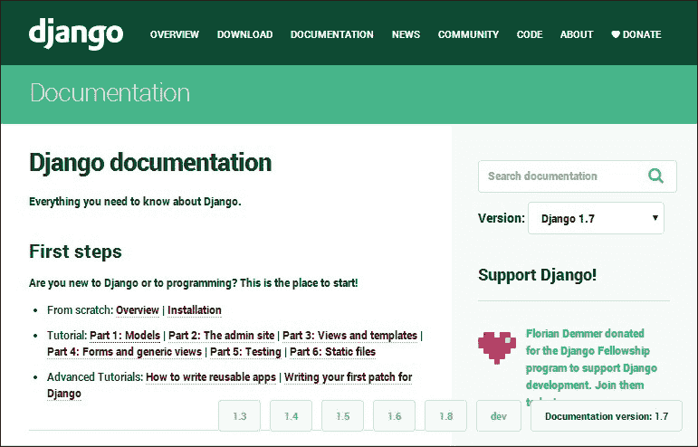
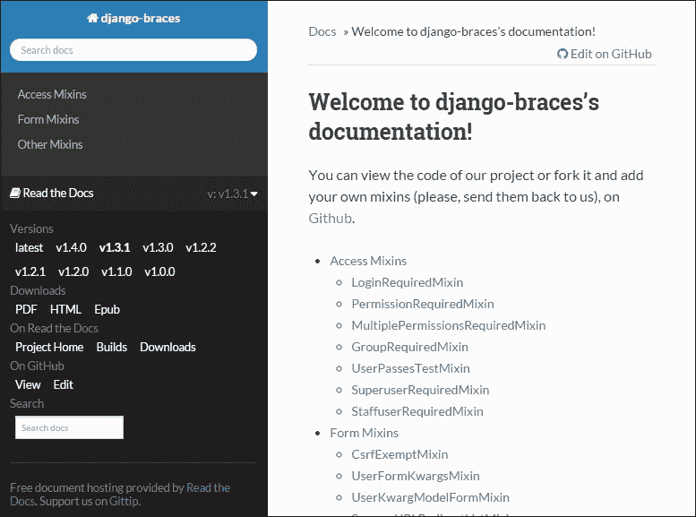
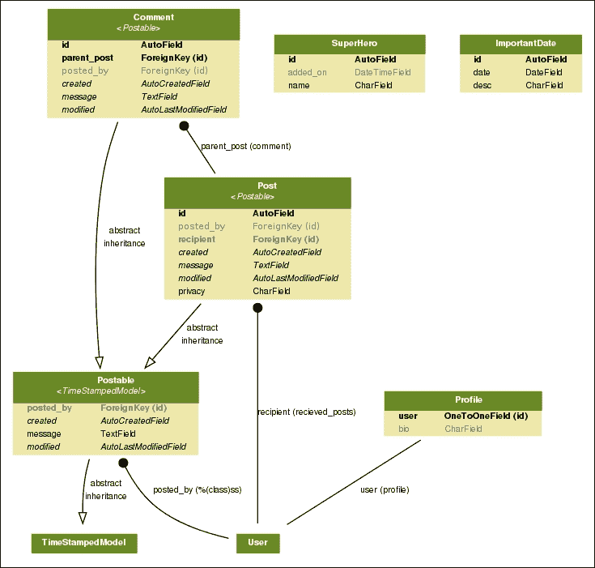

# 第八章：处理遗留代码

在本章中，我们将讨论以下主题：

+   阅读 Django 代码库

+   发现相关文档

+   增量更改与完全重写

+   在更改代码之前编写测试

+   遗留数据库集成

当你被要求加入一个项目时，听起来很令人兴奋。可能会有强大的新工具和尖端技术等着你。然而，很多时候，你被要求与现有的、可能是古老的代码库一起工作。

公平地说，Django 并没有存在那么长时间。然而，为旧版本的 Django 编写的项目有足够的不同之处，引起了担忧。有时，仅有整个源代码和文档可能是不够的。

如果要求重新创建环境，那么您可能需要在本地或网络上处理操作系统配置、数据库设置和运行服务。这个谜团有太多的部分，让你想知道如何开始和从哪里开始。

了解代码中使用的 Django 版本是关键信息。随着 Django 的发展，从默认项目结构到推荐的最佳实践，一切都发生了变化。因此，确定使用的 Django 版本是理解它的重要部分。

### 注意

**交接**

坐在培训室里那些极短的豆袋上，SuperBook 团队耐心等待着哈特。他召集了一个紧急的上线会议。没有人理解“紧急”的部分，因为上线至少还有 3 个月的时间。

欧康夫人匆匆忙忙地拿着一个大设计师咖啡杯，一手拿着一堆看起来像项目时间表的印刷品。她不抬头地说：“我们迟到了，所以我会直奔主题。鉴于上周的袭击，董事会决定立即加快 SuperBook 项目，并将截止日期定为下个月底。有问题吗？”

“是的，”布拉德说，“哈特在哪里？”欧康夫人犹豫了一下，回答说：“嗯，他辞职了。作为 IT 安全主管，他对周界被突破负有道德责任。”显然受到震惊的史蒂夫摇了摇头。“对不起，”她继续说道，“但我被指派负责 SuperBook，并确保我们没有障碍来满足新的截止日期。”

有一阵集体的抱怨声。欧康夫人毫不畏惧，拿起其中一张纸开始说：“这里写着，远程存档模块是未完成状态中最重要的项目。我相信伊万正在处理这个。”

“没错，”远处的伊万说。“快了，”他对其他人微笑着，他们的注意力转向了他。欧康夫人从眼镜的边缘上方凝视着，微笑得几乎太客气了。“考虑到我们在 Sentinel 代码库中已经有一个经过充分测试和运行良好的 Archiver，我建议你利用它，而不是创建另一个多余的系统。”

“但是，”史蒂夫打断道，“这几乎不是多余的。我们可以改进传统的存档程序，不是吗？”“如果没有坏，就不要修理”，欧康夫人简洁地回答道。他说：“他正在努力，”布拉德几乎大声喊道，“他已经完成了所有的工作，那怎么办？”

“伊万，你到目前为止完成了多少工作？”欧康夫人有点不耐烦地问道。“大约 12%”，他辩解地回答道。每个人都不可思议地看着他。“什么？那是最难的 12%”，他补充道。

欧康夫人以同样的模式继续了会议的其余部分。每个人的工作都被重新排列，以适应新的截止日期。当她拿起她的文件准备离开时，她停顿了一下，摘下了眼镜。

“我知道你们都在想什么...真的。但你们需要知道，我们对截止日期别无选择。我现在能告诉你们的就是，全世界都指望着你们在那个日期之前完成，无论如何。”她戴上眼镜，离开了房间。

“我肯定会带上我的锡纸帽，”伊万大声对自己说。

# 查找 Django 版本

理想情况下，每个项目都会在根目录下有一个`requirements.txt`或`setup.py`文件，并且它将包含用于该项目的 Django 的确切版本。让我们寻找类似于这样的一行：

```py
Django==1.5.9
```

请注意，版本号是精确指定的（而不是`Django>=1.5.9`），这被称为**固定**。固定每个软件包被认为是一个很好的做法，因为它减少了意外，并使您的构建更加确定。

不幸的是，有些真实世界的代码库中`requirements.txt`文件没有被更新，甚至完全丢失。在这种情况下，您需要探测各种迹象来找出确切的版本。

## 激活虚拟环境

在大多数情况下，Django 项目将部署在虚拟环境中。一旦找到项目的虚拟环境，您可以通过跳转到该目录并运行操作系统的激活脚本来激活它。对于 Linux，命令如下：

```py
$ source venv_path/bin/activate

```

一旦虚拟环境激活，启动 Python shell 并查询 Django 版本如下：

```py
$ python
>>> import django
>>> print(django.get_version())
1.5.9

```

在这种情况下使用的 Django 版本是 1.5.9 版本。

或者，您可以在项目中运行`manage.py`脚本以获得类似的输出：

```py
$ python manage.py --version
1.5.9

```

但是，如果传统项目源快照以未部署的形式发送给您，则此选项将不可用。如果虚拟环境（和包）也包括在内，那么您可以轻松地在 Django 目录的`__init__.py`文件中找到版本号（以元组形式）。例如：

```py
$ cd envs/foo_env/lib/python2.7/site-packages/django 
$ cat __init__.py
VERSION = (1, 5, 9, 'final', 0)
...

```

如果所有这些方法都失败了，那么您将需要查看过去 Django 版本的发布说明，以确定可识别的更改（例如，`AUTH_PROFILE_MODULE`设置自 1.5 版本以来已被弃用），并将其与您的传统代码进行匹配。一旦确定了正确的 Django 版本，那么您就可以继续分析代码。

# 文件在哪里？这不是 PHP

其中最难适应的一个想法，特别是如果您来自 PHP 或 ASP.NET 世界，那就是源文件不位于您的 Web 服务器的文档根目录中，通常命名为`wwwroot`或`public_html`。此外，代码的目录结构与网站的 URL 结构之间没有直接关系。

实际上，您会发现您的 Django 网站的源代码存储在一个隐蔽的路径中，比如`/opt/webapps/my-django-app`。为什么会这样呢？在许多很好的理由中，将机密数据移出公共 webroot 通常更安全。这样，网络爬虫就不会意外地进入您的源代码目录。

正如您在第十一章中所读到的，*生产就绪*，源代码的位置可以通过检查您的 Web 服务器的配置文件来找到。在这里，您将找到环境变量`DJANGO_SETTINGS_MODULE`设置为模块路径，或者它将将请求传递给配置为指向您的`project.wsgi`文件的 WSGI 服务器。

# 从 urls.py 开始

即使您可以访问 Django 网站的整个源代码，弄清楚它在各种应用程序中的工作方式可能令人望而生畏。通常最好从根`urls.py` `URLconf`文件开始，因为它实际上是将每个请求与相应视图联系起来的地图。

对于普通的 Python 程序，我经常从执行的开始开始阅读，比如从顶级主模块或`__main__`检查成语开始的地方。在 Django 应用程序的情况下，我通常从`urls.py`开始，因为根据站点具有的各种 URL 模式来跟踪执行流程更容易。

在 Linux 中，您可以使用以下`find`命令来定位`settings.py`文件和指定根`urls.py`的相应行：

```py
$ find . -iname settings.py -exec grep -H 'ROOT_URLCONF' {} \;
./projectname/settings.py:ROOT_URLCONF = 'projectname.urls'

$ ls projectname/urls.py
projectname/urls.py

```

# 在代码中跳转

有时阅读代码感觉像在浏览没有超链接的网页。当您遇到在其他地方定义的函数或变量时，您将需要跳转到包含该定义的文件。只要告诉 IDE 要跟踪项目的哪些文件，一些 IDE 就可以自动为您执行此操作。

如果您使用 Emacs 或 Vim，那么您可以创建一个 TAGS 文件以快速在文件之间导航。转到项目根目录并运行一个名为**Exuberant Ctags**的工具，如下所示：

```py
find . -iname "*.py" -print | etags -

```

这将创建一个名为 TAGS 的文件，其中包含位置信息，其中定义了诸如类和函数之类的每个句法单元。在 Emacs 中，您可以使用`M-.`命令找到标签的定义，其中您的光标（或在 Emacs 中称为点）所在的位置。

虽然对于大型代码库来说，使用标签文件非常快速，但它相当基本，并不知道虚拟环境（大多数定义可能位于其中）。一个很好的替代方案是在 Emacs 中使用`elpy`包。它可以配置为检测虚拟环境。使用相同的`M-.`命令跳转到句法元素的定义。但是，搜索不限于标签文件。因此，您甚至可以无缝地跳转到 Django 源代码中的类定义。

# 理解代码库

很少能找到具有良好文档的遗留代码。即使您有文档，文档可能与代码不同步，这可能会导致进一步的问题。通常，理解应用程序功能的最佳指南是可执行的测试用例和代码本身。

官方的 Django 文档已经按版本在[`docs.djangoproject.com`](https://docs.djangoproject.com)上组织。在任何页面上，您都可以使用页面底部右侧的选择器快速切换到 Django 先前版本的相应页面：



同样，托管在[readthedocs.org](http://readthedocs.org)上的任何 Django 包的文档也可以追溯到其先前的版本。例如，您可以通过单击页面左下角的选择器选择`django-braces`的文档，一直回到 v1.0.0：



## 创建大图

大多数人发现，如果向他们展示一个高层次的图表，他们更容易理解一个应用程序。虽然理想情况下，这是由了解应用程序工作原理的人创建的，但也有工具可以创建非常有帮助的 Django 应用程序的高层次描述。

`graph_models`管理命令可以生成应用程序中所有模型的图形概述，该命令由`django-command-extensions`包提供。如下图所示，可以一目了然地理解模型类及其关系：



SuperBook 项目中使用的模型类通过箭头连接，指示它们的关系

实际上，这个可视化是使用 PyGraphviz 创建的。对于甚至中等复杂的项目，这可能会变得非常庞大。因此，如果应用程序被逻辑分组并分别可视化，可能会更容易。

### 注意

**PyGraphviz 安装和使用**

如果您发现安装 PyGraphviz 具有挑战性，那么不用担心，您并不孤单。最近，我在 Ubuntu 上安装时遇到了许多问题，从 Python 3 不兼容到文档不完整。为了节省您的时间，我列出了对我有效的步骤来达到一个可用的设置。

在 Ubuntu 上，您需要安装以下软件包才能安装 PyGraphviz：

```py
$ sudo apt-get install python3.4-dev graphviz libgraphviz-dev pkg-config
```

现在激活您的虚拟环境并运行 pip 从 GitHub 直接安装 PyGraphviz 的开发版本，该版本支持 Python 3：

```py
$ pip install git+http://github.com/pygraphviz/pygraphviz.git#egg=pygraphviz
```

接下来，安装`django-extensions`并将其添加到您的`INSTALLED_APPS`中。现在，您已经准备好了。

以下是一个示例用法，用于创建仅包含两个应用程序的 GraphViz dot 文件，并将其转换为 PNG 图像以进行查看：

```py
$ python manage.py graph_models app1 app2 > models.dot
$ dot -Tpng models.dot -o models.png
```

# 渐进式更改还是完全重写？

通常情况下，你会被应用所有者交付遗留代码，并怀着真诚的希望，希望大部分代码可以立即或经过一些小的调整后就可以使用。然而，阅读和理解庞大而经常过时的代码库并不是一件容易的工作。毫不奇怪，大多数程序员更愿意从事全新的开发工作。

在最好的情况下，遗留代码应该易于测试，有良好的文档记录，并且灵活适应现代环境，以便您可以立即开始进行渐进式更改。在最坏的情况下，您可能会建议放弃现有代码，进行完全重写。或者，通常决定采取的是短期方法，即继续进行渐进式更改，并且可能正在进行完全重新实现的长期并行努力。

在做出此类决定时，一个通用的经验法则是——如果重写应用程序和维护应用程序的成本低于随时间维护旧应用程序的成本，那么建议进行重写。必须考虑所有因素，例如让新程序员熟悉所需时间、维护过时硬件的成本等。

有时，应用领域的复杂性成为重写的巨大障碍，因为在构建旧代码过程中学到的许多知识都会丢失。通常，对遗留代码的依赖表明应用设计不佳，例如未能将业务规则从应用逻辑中外部化。

您可能进行的最糟糕的重写形式可能是转换，或者是机械地将一种语言转换为另一种语言，而不利用现有的最佳实践。换句话说，您失去了通过消除多年的混乱来现代化代码库的机会。

代码应被视为一种负债而不是一种资产。尽管这听起来可能有些违反直觉，但如果您可以用更少的代码实现业务目标，您的生产力将大大提高。拥有更少的代码需要测试、调试和维护，不仅可以减少持续成本，还可以使您的组织更具敏捷性和灵活性以应对变化。

### 提示

代码是一种负债而不是一种资产。更少的代码更易维护。

无论您是在添加功能还是精简代码，都不应在没有测试的情况下触碰工作中的遗留代码。

# 在进行任何更改之前编写测试

在《与遗留代码有效工作》一书中，迈克尔·费瑟斯将遗留代码定义为简单的没有测试的代码。他解释说，有了测试，可以轻松快速地修改代码的行为并进行验证。在没有测试的情况下，无法判断更改是否使代码变得更好还是更糟。

通常情况下，我们对遗留代码了解不足，无法自信地编写测试。迈克尔建议编写保留和记录现有行为的测试，这些测试称为表征测试。

与通常的编写测试的方法不同，在编写表征测试时，您将首先编写一个带有虚拟输出（例如*X*）的失败测试，因为您不知道预期结果。当测试工具出现错误时，例如“**预期输出为 X，但得到了 Y**”，然后您将更改测试以期望*Y*。现在测试将通过，并且它成为了代码现有行为的记录。

请注意，我们可能记录有错误的行为。毕竟，这是陌生的代码。然而，在开始更改代码之前，编写这些测试是必要的。稍后，当我们更了解规格和代码时，我们可以修复这些错误并更新我们的测试（不一定按照这个顺序）。

## 编写测试的逐步过程

在更改代码之前编写测试类似于在修复旧建筑之前搭建脚手架。它提供了一个结构框架，帮助您自信地进行修复。

您可能希望以以下步骤逐步进行这个过程：

1.  确定您需要进行更改的区域。编写着重于这个区域的表征测试，直到您满意地捕捉到它的行为。

1.  看看你需要做出的改变，并为这些改变编写具体的测试用例。更喜欢较小的单元测试而不是较大和较慢的集成测试。

1.  引入增量更改并进行锁步测试。如果测试失败，那么尝试分析是否是预期的。不要害怕甚至打破表征测试，如果该行为是打算更改的。

如果您的代码周围有一套良好的测试，那么您可以快速找到更改代码的影响。

另一方面，如果你决定通过放弃代码而不是数据来重写，那么 Django 可以帮助你很多。

# 遗留数据库

Django 文档中有一个完整的遗留数据库部分，这是正确的，因为你会经常遇到它们。数据比代码更重要，而数据库是大多数企业数据的存储库。

您可以通过将其数据库结构导入 Django 来现代化使用其他语言或框架编写的遗留应用程序。作为一个直接的优势，您可以使用 Django 管理界面来查看和更改您的遗留数据。

Django 通过`inspectdb`管理命令使这变得容易，如下所示：

```py
$ python manage.py inspectdb > models.py

```

如果在设置配置为使用遗留数据库的情况下运行此命令，它可以自动生成 Python 代码，该代码将放入您的模型文件中。

如果您正在使用这种方法来集成到遗留数据库中，以下是一些最佳实践：

+   事先了解 Django ORM 的限制。目前，不支持多列（复合）主键和 NoSQL 数据库。

+   不要忘记手动清理生成的模型，例如删除冗余的`ID`字段，因为 Django 会自动创建它们。

+   外键关系可能需要手动定义。在一些数据库中，自动生成的模型将它们作为整数字段（后缀为`_id`）。

+   将模型组织到单独的应用程序中。稍后，将更容易在适当的文件夹中添加视图、表单和测试。

+   请记住，运行迁移将在遗留数据库中创建 Django 的管理表（`django_*`和`auth_*`）。

在理想的世界中，您的自动生成的模型将立即开始工作，但在实践中，这需要大量的试验和错误。有时，Django 推断的数据类型可能与您的期望不符。在其他情况下，您可能希望向模型添加额外的元信息，如`unique_together`。

最终，你应该能够在熟悉的 Django 管理界面中看到那个老化的 PHP 应用程序中锁定的所有数据。我相信这会让你微笑。

# 总结

在本章中，我们讨论了理解遗留代码的各种技术。阅读代码经常是被低估的技能。但我们需要明智地重用好的工作代码，而不是重复造轮子。在本章和本书的其余部分，我们强调编写测试用例作为编码的一个组成部分的重要性。

在下一章中，我们将讨论编写测试用例和随之而来的经常令人沮丧的调试任务。
