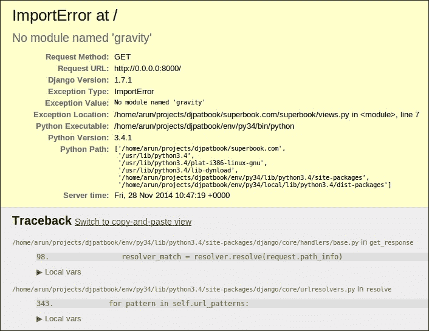
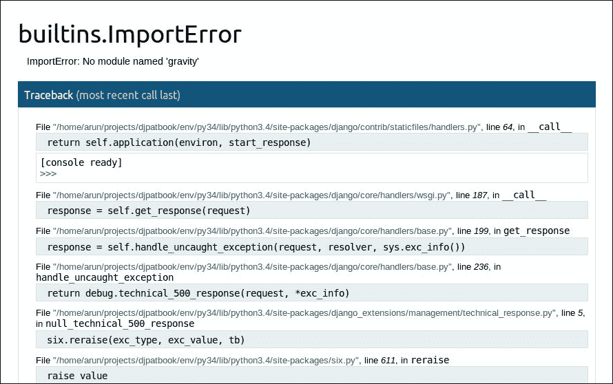
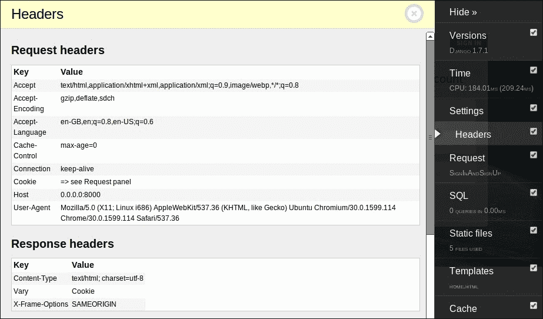
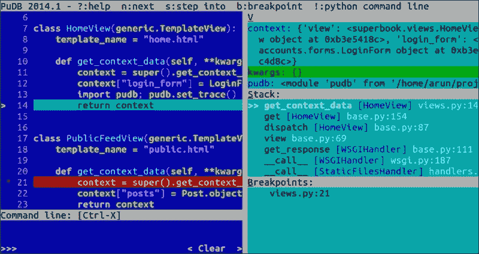

# 第九章：测试和调试

在本章中，我们将讨论以下主题：

+   测试驱动开发

+   编写测试的注意事项

+   模拟

+   调试

+   日志

每个程序员至少都考虑过跳过编写测试。在 Django 中，默认的应用程序布局具有一个带有一些占位内容的`tests.py`模块。这是一个提醒，需要测试。然而，我们经常会有跳过它的诱惑。

在 Django 中，编写测试与编写代码非常相似。实际上，它几乎就是代码。因此，编写测试的过程可能看起来像是编写代码的两倍（甚至更多）。有时，我们在时间上承受如此大的压力，以至于在试图让事情正常运行时，花时间编写测试似乎是荒谬的。

然而，最终，如果您希望其他人使用您的代码，跳过测试是毫无意义的。想象一下，您发明了一种电动剃须刀，并试图向朋友出售，说它对您来说效果很好，但您没有进行适当的测试。作为您的好朋友，他或她可能会同意，但是想象一下，如果您告诉这个情况给一个陌生人，那将是多么可怕。

# 为什么要编写测试？

软件中的测试检查它是否按预期工作。没有测试，您可能能够说您的代码有效，但您将无法证明它是否正确工作。

此外，重要的是要记住，在 Python 中省略单元测试可能是危险的，因为它具有鸭子类型的特性。与 Haskell 等语言不同，类型检查无法在编译时严格执行。在 Python 开发中，单元测试在运行时（尽管在单独的执行中）是必不可少的。

编写测试可能是一种令人谦卑的经历。测试将指出您的错误，并且您将有机会进行早期的调整。事实上，有些人主张在编写代码之前先编写测试。

# 测试驱动开发

**测试驱动开发（TDD）**是一种软件开发形式，您首先编写测试，运行测试（最初会失败），然后编写使测试通过所需的最少代码。这可能听起来有违直觉。为什么我们需要在知道我们还没有编写任何代码并且确定它会因此失败时编写测试呢？

然而，请再次看一看。我们最终确实会编写仅满足这些测试的代码。这意味着这些测试不是普通的测试，它们更像是规范。它们告诉你可以期待什么。这些测试或规范将直接来自您的客户的用户故事。您只需编写足够的代码使其正常工作。

测试驱动开发的过程与科学方法有许多相似之处，这是现代科学的基础。在科学方法中，重要的是首先提出假设，收集数据，然后进行可重复和可验证的实验来证明或证伪你的假设。

我的建议是，一旦您熟悉为项目编写测试，就尝试 TDD。初学者可能会发现很难构建一个检查代码应该如何行为的测试用例。出于同样的原因，我不建议探索性编程使用 TDD。

# 编写测试用例

有不同类型的测试。但是，至少程序员需要了解单元测试，因为他们必须能够编写它们。单元测试检查应用程序的最小可测试部分。集成测试检查这些部分是否与彼此良好地配合。

这里的关键词是单元。一次只测试一个单元。让我们看一个简单的测试用例的例子：

```py
# tests.py
from django.test import TestCase
from django.core.urlresolvers import resolve
from .views import HomeView
class HomePageOpenTestCase(TestCase):
    def test_home_page_resolves(self):
        view = resolve('/')
        self.assertEqual(view.func.__name__,
                         HomeView.as_view().__name__)
```

这是一个简单的测试，检查当用户访问我们网站域的根目录时，他们是否被正确地带到主页视图。像大多数好的测试一样，它有一个长而自描述的名称。该测试简单地使用 Django 的`resolve（）`函数将视图可调用匹配到`/`根位置的视图函数，通过它们的名称。

更重要的是要注意这个测试中没有做什么。我们没有尝试检索页面的 HTML 内容或检查其状态代码。我们限制自己只测试一个单元，即`resolve()`函数，它将 URL 路径映射到视图函数。

假设此测试位于项目的`app1`中，可以使用以下命令运行测试：

```py
$ ./manage.py test app1
Creating test database for alias 'default'...
.
-----------------------------------------------------------------
Ran 1 test in 0.088s

OK
Destroying test database for alias 'default'...
```

此命令将运行`app1`应用程序或包中的所有测试。默认的测试运行程序将在此包中的所有模块中查找与模式`test*.py`匹配的测试。

Django 现在使用 Python 提供的标准`unittest`模块，而不是捆绑自己的模块。您可以通过从`django.test.TestCase`继承来编写`testcase`类。该类通常具有以下命名约定的方法：

+   `test*`：任何以`test`开头的方法都将作为测试方法执行。它不带参数，也不返回任何值。测试将按字母顺序运行。

+   `setUp`（可选）：此方法将在每个测试方法运行之前运行。它可用于创建公共对象或执行其他初始化任务，使测试用例处于已知状态。

+   `tearDown`（可选）：此方法将在测试方法之后运行，无论测试是否通过。通常在此执行清理任务。

测试用例是逻辑上组织测试方法的一种方式，所有这些方法都测试一个场景。当所有测试方法都通过（即不引发任何异常）时，测试用例被视为通过。如果其中任何一个失败，则测试用例失败。

## assert 方法

每个测试方法通常调用`assert*()`方法来检查测试的某些预期结果。在我们的第一个示例中，我们使用`assertEqual()`来检查函数名称是否与预期函数匹配。

与`assertEqual()`类似，Python 3 的`unittest`库提供了超过 32 个断言方法。Django 通过超过 19 个特定于框架的断言方法进一步扩展了它。您必须根据您期望的最终结果选择最合适的方法，以便获得最有帮助的错误消息。

让我们通过查看具有以下`setUp()`方法的示例`testcase`来看看为什么：

```py
def setUp(self):
    self.l1 = [1, 2]
    self.l2 = [1, 0]
```

我们的测试是断言`l1`和`l2`是否相等（鉴于它们的值，它应该失败）。让我们看看几种等效的方法来实现这一点：

| 测试断言语句 | 测试输出的外观（省略不重要的行） |
| --- | --- |

|

```py
assert self.l1 == self.l2
```

|

```py
assert self.l1 == self.l2
AssertionError
```

|

|

```py
self.assertEqual(self.l1, self.l2)
```

|

```py
AssertionError: Lists differ: [1, 2] != [1, 0]
First differing element 1:
2
0
```

|

|

```py
self.assertListEqual( self.l1, self.l2)
```

|

```py
AssertionError: Lists differ: [1, 2] != [1, 0]

First differing element 1:
2
0
```

|

|

```py
self.assertListEqual(self.l1, None)
```

|

```py
AssertionError: Second sequence is not a list: None
```

|

第一条语句使用了 Python 内置的`assert`关键字。请注意，它抛出的错误最不有帮助。您无法推断出`self.l1`和`self.l2`变量中的值或类型。这主要是我们需要使用`assert*()`方法的原因。

接下来，`assertEqual()`抛出的异常非常有帮助，它告诉您正在比较两个列表，甚至告诉您它们开始有差异的位置。这与更专门的`assertListEqual()`函数抛出的异常完全相同。这是因为，正如文档所告诉您的那样，如果`assertEqual()`给出两个列表进行比较，那么它会将其交给`assertListEqual()`。

尽管如最后一个示例所证明的那样，对于测试来说，始终最好使用最具体的`assert*`方法。由于第二个参数不是列表，错误明确告诉您期望的是列表。

### 提示

在测试中使用最具体的`assert*`方法。

因此，您需要熟悉所有的`assert`方法，并选择最具体的方法来评估您期望的结果。这也适用于当您检查应用程序是否没有执行不应该执行的操作时，即负面测试用例。您可以分别使用`assertRaises`和`assertWarns`来检查异常或警告。

## 编写更好的测试用例

我们已经看到，最好的测试用例一次测试一小部分代码。它们还需要快速。程序员需要在每次提交到源代码控制之前至少运行一次测试。即使延迟几秒钟也可能会诱使程序员跳过运行测试（这不是一件好事）。

以下是一个好的测试用例的一些特点（当然，这是一个主观的术语），以易于记忆的助记符“**F.I.R.S.T**”形式的类测试用例：

1.  **快速**：测试越快，运行次数越多。理想情况下，您的测试应该在几秒钟内完成。

1.  **独立**：每个测试用例必须独立于其他测试用例，并且可以以任何顺序运行。

1.  **可重复**：结果在每次运行测试时必须相同。理想情况下，所有随机和变化因素都必须在运行测试之前得到控制或设置为已知值。

1.  **小型**：测试用例必须尽可能简短，以提高速度和易于理解。

1.  **透明**：避免棘手的实现或模糊的测试用例。

此外，确保您的测试是自动的。消除任何手动步骤，无论多么小。自动化测试更有可能成为团队工作流程的一部分，并且更容易用于工具化目的。

也许，编写测试用例时更重要的是要记住的一些不要做的事情：

+   **不要（重新）测试框架**：Django 经过了充分的测试。不要检查 URL 查找、模板渲染和其他与框架相关的功能。

+   **不要测试实现细节**：测试接口，留下较小的实现细节。这样以后重构会更容易，而不会破坏测试。

+   **测试模型最多，模板最少**：模板应该具有最少的业务逻辑，并且更改频率更高。

+   **避免 HTML 输出验证**：测试视图使用其上下文变量的输出，而不是其 HTML 渲染的输出。

+   **避免在单元测试中使用 Web 测试客户端**：Web 测试客户端调用多个组件，因此更适合集成测试。

+   **避免与外部系统交互**：如果可能的话，对其进行模拟。数据库是一个例外，因为测试数据库是内存中的，而且非常快。

当然，您可以（也应该）在有充分理由的情况下打破规则（就像我在我的第一个例子中所做的那样）。最终，您在编写测试时越有创意，就越早发现错误，您的应用程序就会越好。

# 模拟

大多数现实项目的各个组件之间存在各种相互依赖关系。在测试一个组件时，其结果不能受到其他组件行为的影响。例如，您的应用程序可能调用一个可能在网络连接方面不可靠或响应速度慢的外部网络服务。

模拟对象通过具有相同接口来模拟这些依赖关系，但它们会对方法调用做出预先设定的响应。在测试中使用模拟对象后，您可以断言是否调用了某个特定方法，并验证预期的交互是否发生。

以*模式：服务对象*（见第三章，*模型*）中提到的超级英雄资格测试为例。我们将使用 Python 3 的`unittest.mock`库在测试中模拟对服务对象方法的调用：

```py
# profiles/tests.py
from django.test import TestCase
from unittest.mock import patch
from django.contrib.auth.models import User

class TestSuperHeroCheck(TestCase):
    def test_checks_superhero_service_obj(self):
        with patch("profiles.models.SuperHeroWebAPI") as ws:
            ws.is_hero.return_value = True
            u = User.objects.create_user(username="t")
            r = u.profile.is_superhero()
        ws.is_hero.assert_called_with('t')
        self.assertTrue(r)
```

在这里，我们在`with`语句中使用`patch()`作为上下文管理器。由于配置文件模型的`is_superhero()`方法将调用`SuperHeroWebAPI.is_hero()`类方法，我们需要在`models`模块内对其进行模拟。我们还将硬编码此方法的返回值为`True`。

最后两个断言检查方法是否使用正确的参数进行了调用，以及`is_hero()`是否返回了`True`。由于`SuperHeroWebAPI`类的所有方法都已被模拟，这两个断言都将通过。

模拟对象来自一个称为**测试替身**的家族，其中包括存根、伪造等。就像电影替身代替真正的演员一样，这些测试替身在测试时代替真实对象使用。虽然它们之间没有明确的界限，但模拟对象是可以测试行为的对象，而存根只是占位符实现。

# 模式 - 测试固件和工厂

**问题**：测试一个组件需要在测试之前创建各种先决对象。在每个测试方法中显式创建它们会变得重复。

**解决方案**：利用工厂或固件来创建测试数据对象。

## 问题细节

在运行每个测试之前，Django 会将数据库重置为其初始状态，就像运行迁移后的状态一样。大多数测试都需要创建一些初始对象来设置状态。通常情况下，不同的初始对象不会为不同的场景创建，而是通常创建一组通用的初始对象。

在大型测试套件中，这可能很快变得难以管理。这些初始对象的种类繁多，很难阅读和理解。这会导致测试数据本身中难以找到的错误！

作为一个常见的问题，有几种方法可以减少混乱并编写更清晰的测试用例。

## 解决方案细节

我们将首先看一下 Django 文档中提供的解决方案 - 测试固件。在这里，测试固件是一个包含一组数据的文件，可以导入到数据库中，使其达到已知状态。通常情况下，它们是从同一数据库中导出的 YAML 或 JSON 文件，当时数据库中有一些数据。

例如，考虑以下使用测试固件的测试用例：

```py
from django.test import TestCase

class PostTestCase(TestCase):
    fixtures = ['posts']

    def setUp(self):
        # Create additional common objects
        pass

    def test_some_post_functionality(self):
        # By now fixtures and setUp() objects are loaded
        pass
```

在每个测试用例中调用`setUp()`之前，指定的固件`posts`会被加载。粗略地说，固件将在固件目录中搜索具有某些已知扩展名的文件，例如`app/fixtures/posts.json`。

然而，固件存在许多问题。固件是数据库的静态快照。它们依赖于模式，并且每当模型更改时都必须更改。当测试用例的断言更改时，它们也可能需要更新。手动更新一个包含多个相关对象的大型固件文件并不是一件简单的事情。

出于所有这些原因，许多人认为使用固件是一种反模式。建议您改用工厂。工厂类创建特定类的对象，可以在测试中使用。这是一种 DRY 的方式来创建初始测试对象。

让我们使用模型的`objects.create`方法来创建一个简单的工厂：

```py
from django.test import TestCase
from .models import Post

class PostFactory:
    def make_post(self):
        return Post.objects.create(message="")

class PostTestCase(TestCase):

    def setUp(self):
        self.blank_message = PostFactory().makePost()

    def test_some_post_functionality(self):
        pass
```

与使用固件相比，初始对象的创建和测试用例都在一个地方。固件将静态数据原样加载到数据库中，而不调用模型定义的`save()`方法。由于工厂对象是动态生成的，它们更有可能通过应用程序的自定义验证。

然而，编写这种工厂类本身存在很多样板代码。基于 thoughtbot 的`factory_girl`，`factory_boy`包提供了一个声明性的语法来创建对象工厂。

将先前的代码重写为使用`factory_boy`，我们得到以下结果：

```py
import factory
from django.test import TestCase
from .models import Post

class PostFactory(factory.Factory):
    class Meta:
        model = Post
    message = ""

class PostTestCase(TestCase):

    def setUp(self):
        self.blank_message = PostFactory.create()
        self.silly_message = PostFactory.create(message="silly")

    def test_post_title_was_set(self):
        self.assertEqual(self.blank_message.message, "")
        self.assertEqual(self.silly_message.message, "silly")
```

注意在声明性方式下编写的`factory`类变得多么清晰。属性的值不必是静态的。您可以具有顺序、随机或计算的属性值。如果您希望使用更真实的占位符数据，例如美国地址，那么请使用`django-faker`包。

总之，我建议大多数需要初始测试对象的项目使用工厂，特别是`factory_boy`。尽管人们可能仍然希望使用固件来存储静态数据，例如国家列表或 T 恤尺寸，因为它们很少改变。

### 注意

**可怕的预测**

在宣布了不可能的最后期限之后，整个团队似乎突然没有时间了。他们从 4 周的 Scrum 冲刺变成了 1 周的冲刺。史蒂夫把他们日历上的每次会议都取消了，除了“今天与史蒂夫的 30 分钟补充会议”。如果他需要与某人交谈，他更喜欢一对一的讨论。

在 Madam O 的坚持下，30 分钟的会议在 S.H.I.M.总部下面 20 层的隔音大厅举行。周一，团队站在一个灰色金属表面的大圆桌周围。史蒂夫笨拙地站在桌子前，用手掌做了一个僵硬的挥动手势。

尽管每个人都曾见过全息图像活跃起来，但每次看到它们都让他们惊叹不已。这个圆盘几乎分成了数百个金属方块，并像未来模型城市中的迷你摩天大楼一样升起。他们花了一秒钟才意识到他们正在看一个 3D 柱状图。

“我们的燃尽图似乎显示出放缓的迹象。我猜这是我们最近用户测试的结果，这是一件好事。但是……”史蒂夫的脸上似乎带着压抑打喷嚏的表情。他小心翼翼地用食指在空中轻轻一弹，图表顺利地向右延伸。

按照目前的速度，预测显示我们最好也要推迟上线几天。我做了一些分析，发现我们在开发的后期发现了一些关键的错误。如果我们能早点发现它们，我们就可以节省很多时间和精力。我想让你们集思广益，想出一些……”

史蒂夫捂住嘴，打了一个响亮的喷嚏。全息图将这解释为放大图表中一个特别无聊的部分的迹象。史蒂夫咒骂着关掉了它。他借了一张餐巾纸，开始用普通的笔记下每个人的建议。

史蒂夫最喜欢的建议之一是编写一个编码清单，列出最常见的错误，比如忘记应用迁移。他还喜欢在开发过程中早期让用户参与并提供反馈的想法。他还记下了一些不寻常的想法，比如为连续集成服务器的状态发布推特。

会议结束时，史蒂夫注意到埃文不见了。“埃文在哪里？”他问。“不知道，”布拉德看起来很困惑地说，“刚才还在这。”

# 学习更多关于测试

多年来，Django 的默认测试运行器已经有了很大的改进。然而，像`py.test`和`nose`这样的测试运行器在功能上仍然更胜一筹。它们使你的测试更容易编写和运行。更好的是，它们与你现有的测试用例兼容。

你可能也对知道你的代码有多少百分比是由测试覆盖的感兴趣。这被称为**代码覆盖**，`coverage.py`是一个非常流行的工具，可以找出这一点。

今天的大多数项目往往使用了大量的 JavaScript 功能。为它们编写测试通常需要一个类似浏览器的环境来执行。Selenium 是一个用于执行此类测试的出色的浏览器自动化工具。

尽管在本书的范围之外详细讨论 Django 中的测试，我强烈建议你了解更多关于它的知识。

如果没有别的，我想通过这一部分传达的两个主要观点是，首先，编写测试，其次，一旦你对编写测试有信心，就要练习 TDD。

# 调试

尽管进行了最严格的测试，悲哀的现实是，我们仍然不得不处理错误。Django 尽最大努力在报告错误时提供帮助。然而，要识别问题的根本原因需要很多技巧。

幸运的是，通过正确的工具和技术，我们不仅可以识别错误，还可以深入了解代码的运行时行为。让我们来看看其中一些工具。

## Django 调试页面

如果您在开发中遇到任何异常，即`DEBUG=True`时，那么您可能已经看到了类似以下截图的错误页面：



由于它经常出现，大多数开发人员倾向于忽略此页面中的丰富信息。以下是一些要查看的地方：

+   **异常详细信息**：显然，您需要非常仔细地阅读异常告诉您的内容。

+   **异常位置**：这是 Python 认为错误发生的位置。在 Django 中，这可能是错误的根本原因，也可能不是。

+   **回溯**：这是错误发生时的调用堆栈。导致错误的行将在最后。导致它的嵌套调用将在其上方。不要忘记单击“**Local vars**”箭头以检查异常发生时变量的值。

+   **请求信息**：这是一个表格（未在截图中显示），显示上下文变量、元信息和项目设置。在此处检查请求中的格式错误。

### 更好的调试页面

通常，您可能希望在默认的 Django 错误页面中获得更多的交互性。`django-extensions`软件包附带了出色的 Werkzeug 调试器，提供了这个功能。在相同异常的以下截图中，请注意在调用堆栈的每个级别上都有一个完全交互式的 Python 解释器：



要启用此功能，除了将`django_extensions`添加到您的`INSTALLED_APPS`中，您还需要按照以下方式运行测试服务器：

```py
$ python manage.py runserver_plus
```

尽管调试信息减少了，但我发现 Werkzeug 调试器比默认错误页面更有用。

# 打印函数

在代码中到处添加`print()`函数进行调试可能听起来很原始，但对许多程序员来说，这是首选的技术。

通常，在发生异常的行之前添加`print()`函数。它可以用于打印导致异常的各行中变量的状态。您可以通过在达到某一行时打印某些内容来跟踪执行路径。

在开发中，打印输出通常会出现在运行测试服务器的控制台窗口中。而在生产中，这些打印输出可能会出现在服务器日志文件中，从而增加运行时开销。

无论如何，在生产中使用它都不是一个好的调试技术。即使您这样做，也应该从提交到源代码控制中的`print`函数中删除。

# 日志记录

包括前一部分的主要原因是说 - 您应该用 Python 的`logging`模块中的日志函数来替换`print()`函数。日志记录比打印有几个优点：它具有时间戳，明确定义的紧急程度（例如，INFO，DEBUG），而且您以后不必从代码中删除它们。

日志记录对于专业的 Web 开发至关重要。您的生产堆栈中的几个应用程序，如 Web 服务器和数据库，已经使用日志。调试可能会带您到所有这些日志，以追溯导致错误的事件。您的应用程序遵循相同的最佳实践并采用日志记录以记录错误、警告和信息消息是合适的。

与普遍看法不同，使用记录器并不涉及太多工作。当然，设置稍微复杂，但这仅仅是对整个项目的一次性努力。而且，大多数项目模板（例如`edge`模板）已经为您做到了这一点。

一旦您在`settings.py`中配置了`LOGGING`变量，像这样向现有代码添加记录器就非常容易：

```py
# views.py
import logging
logger = logging.getLogger(__name__)

def complicated_view():
    logger.debug("Entered the complicated_view()!")
```

`logging`模块提供了各种级别的日志消息，以便您可以轻松过滤掉不太紧急的消息。日志输出也可以以各种方式格式化，并路由到许多位置，例如标准输出或日志文件。阅读 Python 的`logging`模块文档以了解更多信息。

# Django Debug Toolbar

Django Debug Toolbar 不仅是调试的必不可少的工具，还可以跟踪每个请求和响应的详细信息。工具栏不仅在异常发生时出现，而且始终出现在呈现的页面中。

最初，它会出现在浏览器窗口右侧的可点击图形上。单击后，工具栏将作为一个深色半透明的侧边栏出现，并带有几个标题：



每个标题都包含有关页面的详细信息，从执行的 SQL 查询数量到用于呈现页面的模板。由于当`DEBUG`设置为 False 时，工具栏会消失，因此它基本上只能作为开发工具使用。

# Python 调试器 pdb

在调试过程中，您可能需要在 Django 应用程序执行中间停止以检查其状态。实现这一点的简单方法是在所需位置使用简单的`assert False`行引发异常。

如果您想要从那一行开始逐步执行，可以使用交互式调试器，例如 Python 的`pdb`。只需在想要停止执行的位置插入以下行并切换到`pdb`：

```py
import pdb; pdb.set_trace()
```

一旦输入`pdb`，您将在控制台窗口中看到一个命令行界面，带有`(Pdb)`提示。与此同时，您的浏览器窗口不会显示任何内容，因为请求尚未完成处理。

pdb 命令行界面非常强大。它允许您逐行查看代码，通过打印它们来检查变量，或执行甚至可以更改运行状态的任意代码。该界面与 GNU 调试器 GDB 非常相似。

# 其他调试器

有几种可替换`pdb`的工具。它们通常具有更好的界面。以下是一些基于控制台的调试器：

+   `ipdb`：像 IPython 一样，它具有自动完成、语法着色的代码等。

+   `pudb`：像旧的 Turbo C IDE 一样，它将代码和变量并排显示。

+   `IPython`：这不是一个调试器。您可以通过添加`from IPython import embed; embed()`行在代码中的任何位置获取完整的 IPython shell。

PuDB 是我首选的 pdb 替代品。它非常直观，即使是初学者也可以轻松使用这个界面。与 pdb 一样，只需插入以下代码来中断程序的执行：

```py
import pudb; pudb.set_trace()
```

执行此行时，将启动全屏调试器，如下所示：



按下`?`键以获取有关可以使用的完整键列表的帮助。

此外，还有几种图形调试器，其中一些是独立的，例如`winpdb`，另一些是集成到 IDE 中的，例如 PyCharm，PyDev 和 Komodo。我建议您尝试其中几种，直到找到适合您工作流程的调试器。

# 调试 Django 模板

项目的模板中可能有非常复杂的逻辑。在创建模板时出现细微错误可能导致难以找到的错误。我们需要在`settings.py`中将`TEMPLATE_DEBUG`设置为`True`（除了`DEBUG`），以便 Django 在模板出现错误时显示更好的错误页面。

有几种粗糙的调试模板的方法，例如插入感兴趣的变量，如`{{ variable }}`，或者如果要转储所有变量，可以使用内置的`debug`标签，如下所示（在一个方便的可点击文本区域内）：

```py
<textarea onclick="this.focus();this.select()" style="width: 100%;"> 
   
  
  
</textarea>
```

更好的选择是使用前面提到的 Django Debug Toolbar。它不仅告诉您上下文变量的值，还显示模板的继承树。

然而，您可能希望在模板的中间暂停以检查状态（比如在循环内）。调试器对于这种情况非常完美。事实上，可以使用前面提到的任何一个 Python 调试器来为您的模板使用自定义模板标签。

这是一个简单的模板标签的实现。在`templatetag`包目录下创建以下文件：

```py
# templatetags/debug.py
import pudb as dbg              # Change to any *db
from django.template import Library, Node

register = Library()

class PdbNode(Node):

    def render(self, context):
        dbg.set_trace()         # Debugger will stop here
        return ''

@register.tag
def pdb(parser, token):
    return PdbNode()
```

在您的模板中，加载模板标签库，将`pdb`标签插入到需要执行暂停的地方，并进入调试器：

```py



    {# Some place you want to break #}
    

```

在调试器中，您可以检查任何东西，包括使用`context`字典的上下文变量：

```py
>>> print(context["item"])
Item0
```

如果您需要更多类似的模板标签用于调试和内省，我建议您查看`django-template-debug`包。

# 摘要

在本章中，我们看了 Django 中测试的动机和概念。我们还发现了编写测试用例时应遵循的各种最佳实践。在调试部分，我们熟悉了在 Django 代码和模板中查找错误的各种调试工具和技术。

在下一章中，我们将通过了解各种安全问题以及如何减少各种恶意攻击威胁，使代码更接近生产代码。
