# 第二章：Discuss - 一个 Hacker News 克隆

在本章中，我们将创建一个类似 Hacker News 或 Reddit 的 Web 应用程序，用户可以分享和讨论网络内容的链接。我们将称该应用程序为*Discuss*。为了保持简单，我们将模拟 Hacker News 的极简外观，它只有文本，界面非常简单。另一方面，Reddit 的外观要丰富得多，并且有许多额外的功能，我们不会将这些功能添加到我们的网站上。

以下是本章我们将涵盖的大纲：

+   允许用户提交他们自己的内容

+   允许用户对其他用户提交的内容进行投票

+   基于简单算法对用户提交的内容进行排名

+   防止垃圾邮件发送者滥用我们的网站使用验证码

# 章节代码包

如果您已经开发了一些 Django 应用程序，您可能会知道，对于大多数应用程序，当您开始时所做的大部分代码和配置都是相同的。您以相同的方式设置数据库，也许会更改**数据库**（**DB**）名称和用户/密码对，设置媒体、静态 URL 和根路径，然后使用内置的`auth contrib`应用程序和提供的视图添加用户身份验证，只创建足够简单的模板，以便在开始时完成工作。

在每一章的开始，为您介绍基本设置将会非常无聊，无论是对您来说阅读还是对我来说写作都是如此。相反，我提供了我称之为**代码包**。这些是`zip`文件，其中包含已经设置好的 Django 应用程序，这样我们就可以直接跳到代码的有趣部分，而不必一遍又一遍地进行繁琐的设置过程。

别担心，我不会跳过我们尚未看过的新 Django 功能。每个代码包都包含已在以前的章节中向您解释过的代码。例如，本章的代码包包含一个 Django 应用程序，其中已经设置好了用户注册、登录和注销视图、模板和 URL。这是我们在上一章中已经详细讨论过的内容。

要使用这些代码包，您需要下载它们，解压缩到项目根目录中，并为它们创建一个虚拟环境。然后，您需要运行以下命令，在您的新虚拟环境中安装 Django：

```py
> pip install django
> python manage.py migrate

```

完成所有这些步骤后，您将准备好开始处理应用程序的有趣部分。在接下来的所有章节中，我已经为您提供了代码包的链接，并假设您已经提取并设置了虚拟环境。

### 提示

如果您不确定如何使用代码包，每个 ZIP 文件中都有一个`Readme.txt`。您应该阅读这个文件，以了解如何开始使用代码包。

# 要求

对于任何复杂的应用程序，在我们开始编码之前知道我们需要处理的功能总是一个好主意。让我们看看我们希望在本章中创建的内容。

我们希望拥有一个基于 Django 的链接分享和讨论网站，就像 Hacker News 一样。该网站应该有用户帐户，允许用户分享链接，有一个页面列出这些链接，允许用户投票和评论这些链接。

此外，我们希望对滥发垃圾邮件和恶意用户采取防范措施，如果不加以控制，他们会降低我们网站的内容质量。

以列表形式，这是我们希望我们的应用程序提供的功能：

+   用户注册和身份验证（已在代码包中提供）

+   用户提交的链接

+   对其他用户提交的链接进行投票

+   对提交进行评论并回复其他用户的评论

+   一种算法，根据一些因素对提交的链接进行排名，包括该链接的投票数、评论数和提交的时间

+   阻止垃圾邮件发送者创建脚本，可以自动向我们的网站提交洪水般的内容

# 开始

到目前为止，如果您按照本章开头给出的说明进行操作，您应该已经准备好测试应用程序了。让我们看看目前的情况。通过从应用程序文件夹中的终端运行以下命令来启动应用程序。在运行此命令之前，您需要确保您的虚拟环境已激活：

```py
> python manage.py runserver

```

在浏览器中打开`http://127.0.0.1:8000`，你应该会看到以下基本页面：

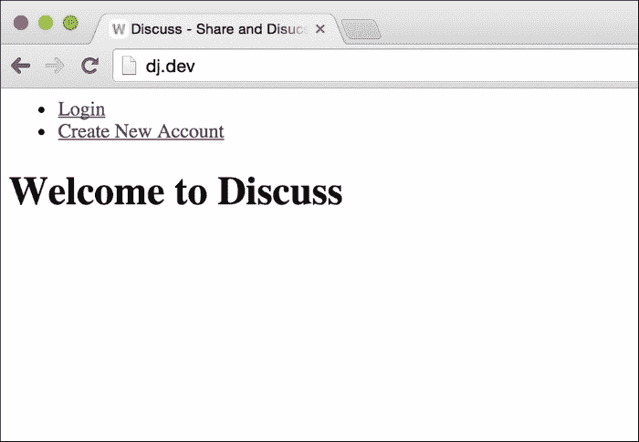

如您所见，我们有**登录**和**创建新帐户**的链接。您应该继续创建一个新帐户。使用此帐户登录，您将看到两个链接被**注销**链接替换。这是我们将来要使用的基本应用程序设置。您应该确保您能够在这一点上使用应用程序，因为所有进一步的开发都将建立在此基础之上。

# 链接提交

让我们看看我们想要与链接提交相关的功能。这只是我们在本章开头看到的功能列表的一部分：

+   用户提交的链接

+   对其他用户提交的链接进行投票

+   对提交进行评论并回复其他用户的评论

让我们考虑一下我们需要实现这个的模型。首先，我们需要一个模型来保存有关单个提交的信息，比如标题、URL、谁提交了链接以及何时提交的信息。接下来，我们需要一种方式来跟踪用户对提交的投票。这可以通过从提交模型到`User`模型的`ManyToMany`字段来实现。这样，每当用户对提交进行投票时，我们只需将他们添加到相关对象的集合中，如果他们决定撤回他们的投票，我们就将他们移除。

评论作为一个功能是独立于链接提交的，因为它可以作为一个链接到提交模型的单独模型来实现。我们将在下一节中讨论评论。现在，我们将集中在链接提交上。

首先，让我们在我们的项目中为链接提交相关的功能创建一个新的应用程序。在 CLI 中运行以下命令：

```py
> python manage.py startapp links

```

然后，将我们新创建的应用程序添加到`INSTALLED_APPS`设置变量中。现在我们准备好编写代码了。

让我们从模型开始。这是`Link model`的代码。这段代码应该在`links/models.py`中：

```py
from django.contrib.auth.models import User
from django.db import models

class Link(models.Model):
    title = models.CharField(max_length=100)
    url = models.URLField()

    submitted_by = models.ForeignKey(User)
    upvotes = models.ManyToManyField(User, related_name='votes')

    submitted_on = models.DateTimeField(auto_now_add=True, editable=False)
```

请注意，我们必须为`upvotes`字段设置`related_name`。如果我们没有这样做，当我们尝试运行我们的应用程序时，我们将从 Django 那里得到一个错误。Django 会抱怨在`Link`模型中有两个与`User`模型的关系，都试图创建一个名为`link`的反向关系。为了解决这个问题，我们通过`upvotes`字段明确地命名了从`User`模型到`Link`模型的反向关系。`User`模型现在应该有一个名为`votes`的属性，可以用来获取用户已经投票的提交的列表。

保存了这段代码后，您需要进行迁移并运行迁移，以便 Django 为新模型创建数据库表。为此，请输入以下命令：

```py
> python manage.py makemigrations
> python manage.py migrate

```

接下来，让我们来处理模板和视图。我们将为视图定制我们在上一章中看到的通用`CreateView`。将这段代码放在`links/views.py`中：

```py
from django.contrib.auth.decorators import login_required
from django.core.urlresolvers import reverse
from django.http.response import HttpResponseRedirect
from django.utils.decorators import method_decorator
from django.views.generic import CreateView

from links.models import Link

class NewSubmissionView(CreateView):
    model = Link
    fields = (
        'title', 'url'
    )

    template_name = 'new_submission.html'

    @method_decorator(login_required)
    def dispatch(self, *args, **kwargs):
        return super(NewSubmissionView, self).dispatch(*args, **kwargs)

    def form_valid(self, form):
        new_link = form.save(commit=False)
        new_link.submitted_by = self.request.user
        new_link.save()

        self.object = new_link
        return HttpResponseRedirect(self.get_success_url())

    def get_success_url(self):
        return reverse('home')
```

这应该看起来很熟悉，对于我们在上一章中已经创建的`CreateView`子类。然而，仔细看！这一次，我们不定义一个自定义表单类。相反，我们只是指向模型——在这种情况下是`Link`——`CreateView`会自动为我们创建一个模型表单。这就是内置的 Django 通用视图的强大之处。它们为您提供多种选项，以便根据您需要进行多少定制来获得您想要的内容。

我们定义了`model`和`fields`属性。`model`属性不言自明。`fields`属性在这里的含义与`ModelForm`子类中的含义相同。它告诉 Django 我们希望进行编辑的字段。在我们的`link`模型中，标题和提交 URL 是我们希望用户控制的唯二字段，因此我们将它们放入字段列表中。

这里还要注意的一件重要的事情是`form_valid`函数。请注意，它没有任何对`super`的调用。与我们以前的代码不同，在那里我们总是调用父类方法来覆盖的方法，但在这里我们不这样做。这是因为`CreateView`的`form_valid`调用了表单的`save()`方法。这将尝试保存新的链接对象，而不给我们设置其`submitted_by`字段的机会。由于`submitted_by`字段是必需的，不能为`null`，因此对象将不会被保存，我们将不得不处理数据库异常。

因此，我们选择不调用父类的`form_valid`方法，而是自己编写了代码。为此，我需要知道基本方法的作用。因此，我查阅了它的文档[`docs.djangoproject.com/en/1.9/ref/class-based-views/mixins-editing/#django.views.generic.edit.ModelFormMixin.form_valid`](https://docs.djangoproject.com/en/1.9/ref/class-based-views/mixins-editing/#django.views.generic.edit.ModelFormMixin.form_valid)：

> *"保存表单实例，为视图设置当前对象，并重定向到 get_success_url()."*

如果您查看我们的`form_valid`函数的代码，您会发现我们做了完全相同的事情。如果您遇到类似情况，Django 文档是澄清事情的最佳资源。它拥有我使用过的所有开源项目中遇到的最好的文档之一。

最后，我们需要链接提交功能的模板和 URL 配置。在`links`目录中创建一个名为`templates`的新文件夹，并将此代码保存在名为`new_submission.html`的文件中：

```py



    <h1>New Submission</h1>
    <form action="" method="post">
        {{ form.as_p }}
        <input type="submit" value="Submit" />
    </form>

```

在`discuss/urls.py`中，导入新视图：

```py
from links.views import NewSubmissionView
```

为此视图创建新的 URL 配置：

```py
url(r'^new-submission/$', NewSubmissionView.as_view(), name='new-submission'),
```

就是这样。我们需要编写的所有代码以实现基本的链接提交流程都已经完成。但是，为了能够测试它，我们需要为用户提供一些访问这个新视图的方式。在我们的`base.html`模板中的导航栏似乎是放置此链接的好地方。更改项目根目录中`templates`目录中`base.html`中`nav` HTML 标签的代码以匹配以下代码：

```py
<nav>
    <ul>
        
        <li><a href="">Submit New Link</a></li>
        <li><a href="">Logout</a></li>
        
        <li><a href="">Login</a></li>
        <li><a href="">Create New Account</a></li>
        
    </ul>
</nav>
```

要测试它，运行开发服务器并打开主页。您将在顶部导航菜单中看到**提交新链接**选项。单击它，您将看到一个类似以下页面的页面。填写数据并单击提交。如果您填写的数据没有错误，您应该会被重定向到主页。

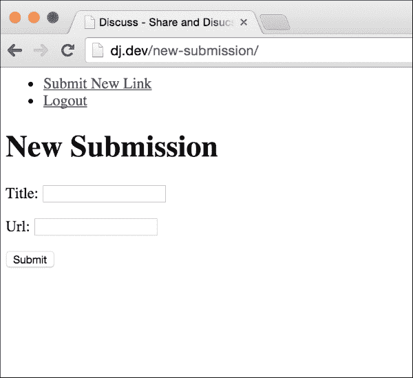

虽然这样可以工作，但这并不是最好的用户体验。在不给用户任何关于他们的链接是否提交成功的反馈的情况下将用户重定向到主页是不好的。让我们下一步来修复这个问题。我们将为提交创建一个详细页面，如果用户成功提交了新链接，我们将把他们带到详细页面。

让我们从视图开始。我们将使用 Django 提供的`DetailView`通用视图。在您的`links/views.py`文件中，导入`DetailView`：

```py
from django.views.generic import DetailView

```

为我们的提交详细视图创建子类：

```py
class SubmissionDetailView(DetailView):
    model = Link
    template_name = 'submission_detail.html'
```

在`links/templates`目录中创建`submission_detail.html`模板，并放入以下 Django 模板代码：

```py



    <h1><a href="{{ object.url }}" target="_blank">{{ object.title }}</a></h1>
    <p>submitted by: <b>{{ object.submitted_by.username }}</b></p>
    <p>submitted on: <b>{{ object.submitted_on }}</b></p>

```

通过首先导入它，在`discuss/urls.py`中为此视图配置 URL：

```py
from links.views import SubmissionDetailView
```

然后，将其添加到`urlpatterns`列表的 URL 模式中：

```py
url(r'^submission/(?P<pk>\d+)/$', SubmissionDetailView.as_view(), name='submission-detail'),
```

最后，我们需要编辑`NewSubmissionView`的`get_success_url`方法，在成功创建新提交时将用户重定向到我们的新详细视图：

```py
def get_success_url(self):
    return reverse('submission-detail', kwargs={'pk': self.object.pk})
```

就是这样。现在当你创建一个新的提交时，你应该会看到你的新提交的详细页面：

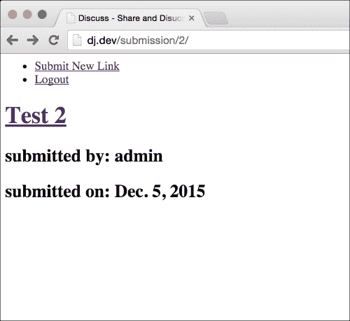

现在链接提交已经完成，让我们来看看实现评论功能。

# 评论

我们希望我们已登录的用户能够对提交进行评论。我们也希望用户能够回复其他用户的评论。为了实现这一点，我们的`comment`模型需要能够跟踪它所在的提交，并且还需要有一个链接到它的父评论（如果它是在回复其他用户的评论时创建的）。

如果你曾经在互联网上使用过论坛，我们的评论部分的工作方式应该很熟悉。我对所有这些论坛的抱怨是它们允许这种层次结构的评论永无止境地延续下去。然后你最终会看到 10 级深的评论，延伸到屏幕之外：

```py
Comment 1
    Comment 2
        Comment 3
            Comment 4
                Comment 5
                    Comment 6
                        Comment 7
                            Comment 8
                                Comment 9
                                    Comment 10
```

虽然有许多解决这个问题的方法，最简单的可能是在一定级别之后切断嵌套回复。在我们的情况下，没有评论可以回复`评论 2`。相反，它们必须全部回复`评论 1`或父提交。这将使实现更容易，我们稍后会看到。

根据我们迄今为止的讨论，我们知道我们的评论模型将需要外键到我们的提交模型，还需要自己引用自己以便引用父评论。这种自我引用，或者正如 Django 文档所称的递归关系，是我在使用 Django 创建 Web 应用的五年（甚至更长）中可能只用过一次的东西。这并不是经常需要的东西，但有时会产生优雅的解决方案，就像你将在这里看到的。

为了简化事情，我们将首先实现对链接提交的评论，然后再添加处理对评论的回复的代码。让我们从模型开始。将以下内容添加到`links/models.py`中：

```py
class Comment(models.Model):
    body = models.TextField()

    commented_on = models.ForeignKey(Link)
    in_reply_to = models.ForeignKey('self', null=True)

    commented_by = models.ForeignKey(User)
    created_on = models.DateTimeField(auto_now_add=True, editable=False)
```

这里的`in_reply_to`字段是递归外键，允许我们创建评论和回复的层次结构。正如你所看到的，创建递归外键是通过给模型名称`self`而不是像通常情况下使用模型名称来实现的。

创建并运行迁移以将此模型添加到我们的数据库中：

```py
> python manage.py makemigrations
> python manage.py migrate

```

接下来，让我们考虑视图和模板。由于我们现在只实现对提交的评论，因此在提交详细页面上也能看到创建新评论的表单是有意义的。让我们首先创建表单。创建一个新的`links/forms.py`文件，并添加以下代码：

```py
from django import forms

from links.models import Comment

class CommentModelForm(forms.ModelForm):
    link_pk = forms.IntegerField(widget=forms.HiddenInput)

    class Meta:
        model = Comment
        fields = ('body',)
```

我们将为`Comment`模型创建一个简单的模型表单，并添加一个额外的字段，用于跟踪评论需要关联的链接。为了使表单可用于我们的提交详细模板，通过在文件顶部添加以下内容将表单导入`links/views.py`中：

```py
from links.forms import CommentModelForm
```

我们还将添加代码来显示提交的评论在详细页面上。因此，我们需要在视图文件中导入`Comment`模型。在导入表单的行之后，添加另一行代码导入模型：

```py
from links.models import Comment
```

为了能够显示与提交相关的评论以及创建新提交的表单，我们需要在提交详细页面的模板上下文中使这两个内容可用。为此，在`SubmissionDetailView`中添加一个`get_context_data`方法：

```py
def get_context_data(self, **kwargs):
    ctx = super(SubmissionDetailView, self).get_context_data(**kwargs)

    submission_comments = Comment.objects.filter(commented_on=self.object)
    ctx['comments'] = submission_comments

    ctx['comment_form'] = CommentModelForm(initial={'link_pk': self.object.pk})

    return ctx
```

我们将在一会儿传递给`CommentModelForm`的初始属性。我们还需要创建一个视图，用于提交新评论表单。以下是你需要添加到`links/views.py`中的代码：

```py
class NewCommentView(CreateView):
    form_class = CommentModelForm
    http_method_names = ('post',)
    template_name = 'comment.html'

    @method_decorator(login_required)
    def dispatch(self, *args, **kwargs):
        return super(NewCommentView, self).dispatch(*args, **kwargs)

    def form_valid(self, form):
        parent_link = Link.objects.get(pk=form.cleaned_data['link_pk'])

        new_comment = form.save(commit=False)
        new_comment.commented_on = parent_link
        new_comment.commented_by = self.request.user

        new_comment.save()

        return HttpResponseRedirect(reverse('submission-detail', kwargs={'pk': parent_link.pk}))

    def get_initial(self):
        initial_data = super(NewCommentView, self).get_initial()
        initial_data['link_pk'] = self.request.GET['link_pk']

    def get_context_data(self, **kwargs):
        ctx = super(NewCommentView, self).get_context_data(**kwargs)
        ctx['submission'] = Link.objects.get(pk=self.request.GET['link_pk'])

        return ctx
```

即使我们在提交详细页面上显示表单，但是如果用户在提交表单时输入不正确的数据，比如按下带有空主体的提交按钮，我们需要一个模板，可以再次显示表单以及错误。在`links/templates`中创建`comment.html`模板：

```py



    <h1>New Comment</h1>
    <p>
        <b>You are commenting on</b>
        <a href">{{ submission.title }}</a>
    </p>

    <form action="" method="post">
        {{ form.as_p }}
        <input type="submit" value="Post Comment" />
    </form>

```

您应该已经了解`CreateView`子类的大部分代码是做什么的。新的一点是`get_inital`方法。我们稍后会详细看一下。现在，让我们让评论功能运行起来。

让我们将新视图添加到`discuss/urls.py`中。首先，导入视图：

```py
from links.views import NewCommentView
```

然后，将其添加到 URL 模式中：

```py
url(r'new-comment/$', NewCommentView.as_view(), name='new-comment'),
```

最后，将`links/templates/submission_detail.html`更改为以下内容：

```py



    <h1><a href="{{ object.url }}" target="_blank">{{ object.title }}</a></h1>
    <p>submitted by: <b>{{ object.submitted_by.username }}</b></p>
    <p>submitted on: <b>{{ object.submitted_on }}</b></p>

    <p>
        <b>New Comment</b>
        <form action="?link_pk={{ object.pk }}" method="post">
            {{ comment_form.as_p }}
            <input type="submit" value="Comment" />
        </form>
    </p>

    <p>
        <b>Comments</b>
        <ul>
            
            <li>{{ comment.body }}</li>
            
        </ul>
    </p>

```

如果您注意到我们模板中的表单操作 URL，您将看到我们已将`link_pk` GET 参数添加到其中。如果您回顾一下您为`NewCommentView`编写的代码，您将看到我们在`get_context_data`和`get_inital`函数中使用此参数值来获取用户正在评论的`Link`对象。

### 提示

我将保存`get_initial`方法的描述，直到下一节，当我们开始添加对评论的回复时。

让我们看看我们到目前为止做了什么。使用`runserver`命令启动应用程序，在浏览器中打开主页，然后登录。由于我们还没有任何访问旧提交的方式，我们需要创建一个新的提交。这样做，您将看到新的详细页面。它应该类似于以下截图：

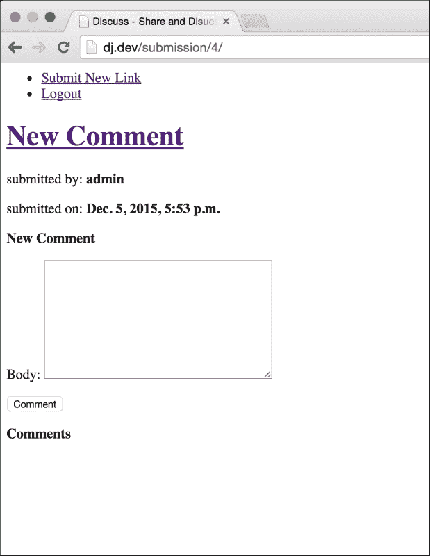

添加评论，它应该出现在同一页上。以下是添加了一些评论的截图：

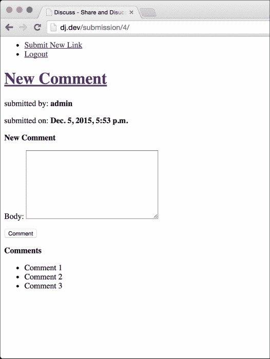

如果您将正文留空并按下**评论**按钮，您应该会看到您之前创建的评论模板，并带有错误消息：

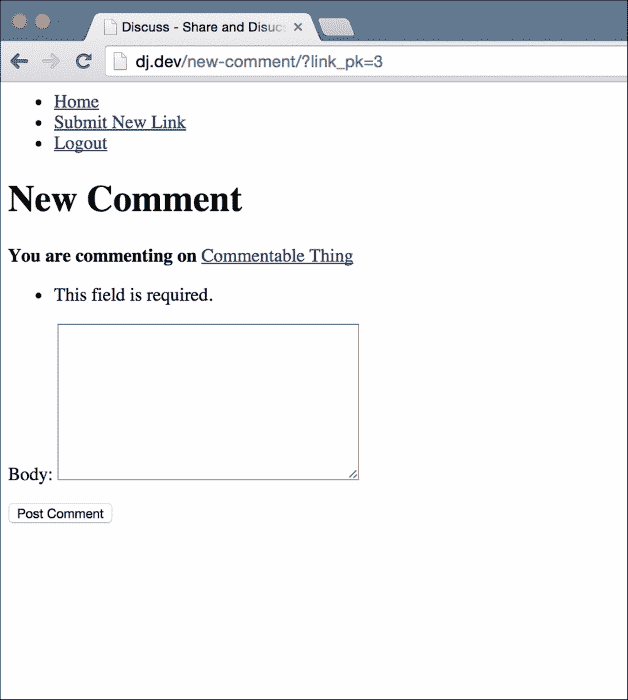

有了基本的提交评论功能，让我们看看如何实现对评论的回复。正如我们已经看到的，我们的评论模型有一个字段来指示它是作为对另一条评论的回复而发表的。因此，为了将评论存储为对另一条评论的回复，我们所要做的就是正确设置`in_reply_to`字段。让我们首先修改我们的`Comment`模型表单，以接受除了`link_pk`之外，还有一个`parent_comment_pk`，以指示新评论是否是对哪条（如果有的话）评论的回复。在`CommentModelForm`中添加这个字段，就在`link_pk`字段之后：

```py
parent_comment_pk = forms.IntegerField(widget=forms.HiddenInput, required=False)
```

现在我们需要一个地方向用户显示一个表单，以便他发表回复。我们可以在提交详情页面上显示每条评论一个表单，但对于有多条评论的提交，这样做会使页面看起来非常凌乱。在实际项目中，我们可能会使用 JavaScript 在用户点击评论旁边的回复链接并提交时动态生成一个表单。然而，现在我们更专注于 Django 后端，因此我们将想出另一种不涉及大量前端工作的方法。

第三种方式，我们将在这里使用，是在每条评论旁边放一个小链接，让用户转到一个单独的页面，在那里他们可以记录他们的回复。以下是该页面的视图。将其放在`links/views.py`中：

```py
class NewCommentReplyView(CreateView):
    form_class = CommentModelForm
    template_name = 'comment_reply.html'

    @method_decorator(login_required)
    def dispatch(self, *args, **kwargs):
        return super(NewCommentReplyView, self).dispatch(*args, **kwargs)

    def get_context_data(self, **kwargs):
        ctx = super(NewCommentReplyView, self).get_context_data(**kwargs)
        ctx['parent_comment'] = Comment.objects.get(pk=self.request.GET['parent_comment_pk'])

        return ctx

    def get_initial(self):
        initial_data = super(NewCommentReplyView, self).get_initial()

        link_pk = self.request.GET['link_pk']
        initial_data['link_pk'] = link_pk

        parent_comment_pk = self.request.GET['parent_comment_pk']
        initial_data['parent_comment_pk'] = parent_comment_pk

        return initial_data

    def form_valid(self, form):
        parent_link = Link.objects.get(pk=form.cleaned_data['link_pk'])
        parent_comment = Comment.objects.get(pk=form.cleaned_data['parent_comment_pk'])

        new_comment = form.save(commit=False)
        new_comment.commented_on = parent_link
        new_comment.in_reply_to = parent_comment
        new_comment.commented_by = self.request.user

        new_comment.save()

        return HttpResponseRedirect(reverse('submission-detail', kwargs={'pk': parent_link.pk}))
```

到目前为止，您应该已经多次使用了`CreateView`，对它应该感到舒适。这里唯一新的部分是`get_initial`方法，我们之前在`NewCommentView`中也使用过。在 Django 中，每个表单都可以有一些初始数据。这是在表单未绑定时显示的数据。表单的绑定性是一个重要的概念。我花了一段时间才理解它，但它非常简单。在 Django 中，表单基本上有两个功能。它可以在网页的 HTML 代码中显示，或者可以验证一些数据。

如果您在初始化表单类的实例时传入了一些数据来验证它，那么表单就是绑定的。假设您有一个名为`SomeForm`的`form`类，其中有两个字段，名称和城市。假设您初始化了一个没有任何数据的表单对象：

```py
form = SomeForm()
```

您已经创建了一个未绑定的表单实例。表单没有与之关联的任何数据，因此无法验证任何内容。但是，可以通过在模板中调用`{{ form.as_p }}`来在网页上显示它（前提是它通过上下文传递到模板）。它将呈现为一个具有两个空字段的表单：`name`和`city`。

现在假设您在初始化表单时传入了一些数据：

```py
form = SomeForm({'name': 'Jibran', 'city': 'Dubai'})
```

这将创建一个绑定的表单实例。您可以在此表单对象上调用`is_valid()`，它将验证传递的数据。您还可以像以前一样在 HTML 模板中呈现表单。但是，这次，它将使用您在此处传递的值呈现具有两个字段值的表单。如果由于某种原因，您传递的值未经验证（例如，如果您将城市字段的值留空），则表单将在包含无效数据的字段旁边显示适当的错误消息。

这就是绑定和未绑定表单的概念。现在让我们看看表单中的初始数据是用来做什么的。您可以通过将其传递给初始关键字参数来在初始化实例时将初始数据传递给表单：

```py
form = SomeForm(initial={'name': 'Jibran'})
```

表单仍然是未绑定的，因为您没有传入数据属性（这是构造函数的第一个非关键字参数），但是如果现在呈现它，名称字段将具有值`'Jibran'`，而城市字段仍将为空。

当我第一次了解初始数据时遇到的困惑是为什么需要它。我可以只传递与数据参数相同的数据字典，表单仍然只会收到一个字段的值。这样做的问题在于，当您使用一些数据初始化表单时，它将自动尝试验证该数据。假设城市字段是必填字段，如果您尝试在网页上呈现表单，它将在城市字段旁边显示一个错误，指出这是一个必填字段。初始数据参数允许您为表单字段提供值，而不触发该数据的验证。

在我们的情况下，`CreateView`调用`get_initial`方法以获取用作表单初始数据的字典。我们使用将在 URL 参数中传递的提交 ID 和父评论 ID 来创建`link_pk`和`parent_comment_pk`表单字段的初始值。这样，当我们的表单在 HTML 网页上呈现时，它将已经具有这两个字段的值。查看`form_valid`方法，然后从表单的`cleaned_data`属性中提取这两个值，并用它来获取提交和父评论以关联回复。

`get_context_data`方法只是将父评论对象添加到上下文中。我们在模板中使用它来告诉用户他们正在回复哪条评论。让我们来看看模板，您需要在`links/templates/comment_reply.html`中创建它：

```py



    <h1>Reply to comment</h1>
    <p>
        <b>You are replying to:</b>
        <i>{{ parent_comment.body }}</i>
    </p>

    <form action="" method="post">
        {{ form.as_p }}
        <input type="submit" value="Submit Reply" />
    </form>

```

这里没有什么花哨的。请注意我们如何在视图的`get_context_data`方法中使用了`parent_comment`对象。确保用户始终获得有关他们即将采取的操作的相关信息是良好的 UI 实践。

在`discuss/urls.py`中导入我们的新视图：

```py
from links.views import NewCommentReplyView
```

将此模式添加到 URL 模式列表中：

```py
url(r'new-comment-reply/$', NewCommentReplyView.as_view(), name='new-comment-reply'),
```

最后，我们需要给用户一个链接来到达这个页面。正如我们之前讨论的那样，在提交详细信息页面的每条评论旁边放置一个名为**回复**的链接。为此，请注意`links/templates/submission_detail.html`中的以下行：

```py
<li>{{ comment.body }}</li>
```

将其更改为以下内容：

```py
<li>{{ comment.body }} (<a href="?link_pk={{ object.pk }}&parent_comment_pk={{ comment.pk }}">Reply</a>)</li>
```

请注意，我们在创建 URL 时使用 GET 参数传递提交 ID 和父评论 ID。我们在提交页面上的评论表单中也是这样做的。这是在创建 Django 应用程序时经常使用的常见技术。这些是我们在评论回复视图中使用的相同 URL 参数，用于填充表单的初始数据并访问父评论对象。

让我们试一试。在提交详细页面的评论中，点击**回复**。如果您关闭了旧的提交详细页面，您可以创建一个新的提交并添加一些评论。点击`回复`链接，您将看到一个新页面，上面有评论正文的表单。在这里输入一些文本，然后点击`提交`按钮。记住您输入的文本。我们将在接下来的几个步骤中寻找它。在我的测试中，我输入了**回复评论 1**。让我们看看我们的提交详细页面是如何显示我们的新回复评论的：

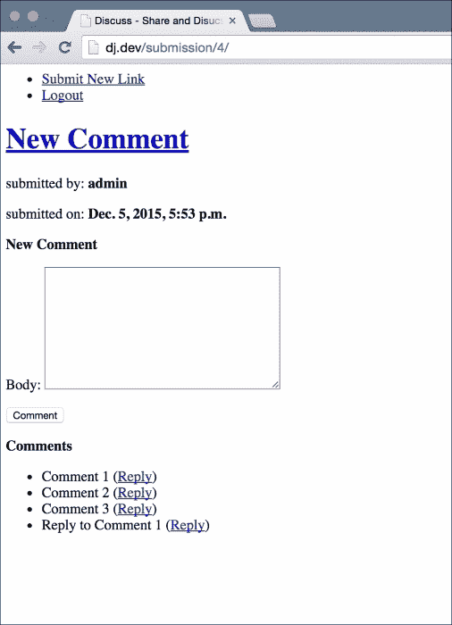

看起来好像起作用了。但是，如果您仔细看，您会注意到我们做的回复（在我的情况下，**回复评论 1**文本）显示在评论列表的末尾。它应该显示在**评论 1**之后，并且最好向右缩进一点，以表示层次结构。让我们来修复这个问题。首先，在`links/views.py`文件的`SubmissionDetailView`的`get_context_data`方法中，注意这一行：

```py
submission_comments = Comment.objects.filter(commented_on=self.object)
```

将其更改为以下内容：

```py
submission_comments = Comment.objects.filter(commented_on=self.object, in_reply_to__isnull=True)
```

我们在这里做的是只包括没有父评论的评论。我们通过只获取`in_reply_to`字段设置为`NULL`的评论来实现这一点。如果您保存此更改并刷新提交详细页面，您会注意到您的回复评论已经消失了。让我们把它带回来。修改`link/templates/submission_detail.html`并更改显示评论的段落（循环遍历评论列表的段落）以匹配以下内容：

```py
<p>
    <b>Comments</b>
    <ul>
        
        <li>
            {{ comment.body }} (<a href="?link_pk={{ object.pk }}&parent_comment_pk={{ comment.pk }}">Reply</a>)
            
            <ul>
                
                <li>{{ reply.body }}</li>
                
            </ul>
            
        </li>
        
    </ul>
</p>
```

这里的新部分在`if`标签之间。首先，我们使用由外键自身创建的反向关系来查看此评论是否有任何其他指向它的评论。我们知道指向这条评论的唯一评论将是对这条评论的回复。如果有的话，我们将创建一个新列表，并打印每个回复的正文。由于我们已经决定只允许对第一级评论进行回复，我们不会创建任何链接让用户回复这些回复。一旦您保存了这些更改，让我们看看我们的提交详细页面现在是什么样子的：

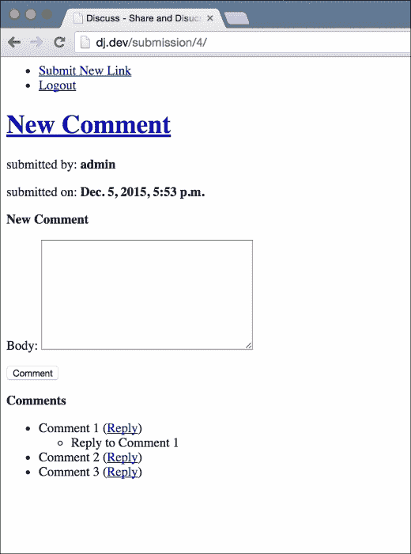

这更像是！我们现在有了一个完整的链接提交和评论系统。太棒了！现在让我们继续其他功能。

# 投票

我们需要允许用户对提交进行投票。为了保持简单，我们只允许`upvotes`。用户可以表示他们喜欢一个提交。没有办法表示不赞成。这样可以保持代码和用户界面的简单。我们还希望确保一个用户只能对一个提交进行一次`upvote`，并且如果他们改变主意或者错误地对一个提交进行了`upvote`，他们可以取消他们的`upvotes`。

如果您再看一下`Link`模型，您会看到我们已经有了一个`upvotes`字段，它是与`User`模型的**机器到机器**（**M2M**）关联。这是我们需要允许并跟踪用户的`upvotes`的唯一数据库条目。为了给提交投票，用户将点击提交旁边的一个链接。到目前为止，我们能够在没有列出所有提交的页面的情况下进行。现在创建一个是个好主意，这样我们就可以访问和投票各种提交。我们不能每次想测试某些东西时都创建新的提交。

首先，在`links/views.py`中创建此视图。首先从`django.views.generic`导入`TemplateView`：

```py
class HomeView(TemplateView):
    template_name = 'home.html'

    def get_context_data(self, **kwargs):
        ctx = super(HomeView, self).get_context_data(**kwargs)
        ctx['submissions'] = Link.objects.all()

        return ctx
```

接下来，将模板更改为`template/home.html`如下：

```py



    <h1>Welcome to Discuss</h1>
    <h2>Submissions</h2>
    <ul>
        
        <li>
            <a href="{{ submission.url }}" target="_blank">{{ submission.title }}</a>
            <i><a href="">Comments</a></i>
        </li>
        
    </ul>

```

在`discuss/urls.py`的顶部导入我们的新`HomeView`，并注意`discuss/urls.py`中的主页 URL 配置：

```py
url(r'^$', TemplateView.as_view(template_name='home.html'), name='home'),
```

将前面的代码更改为：

```py
url(r'^$', HomeView.as_view(), name='home'),
```

最后，在导航栏中为我们的用户提供一个方便的链接到主页。在`base.html`模板（在项目根目录的`templates`目录中）中，将这个作为导航列表的第一个列表元素添加到用户认证条件之外：

```py
<li><a href="">Home</a></li>
```

就是这样。这段代码中没有什么新东西。它很容易理解，你现在应该对这里发生的事情有一个清晰的想法。让我们看看最终结果。如果你现在通过浏览器打开我们应用的主页，浏览到`http://127.0.0.1:8000`，你应该会看到类似以下截图的内容。当然，你的页面不会和这个一样，因为你会添加自己的测试内容：

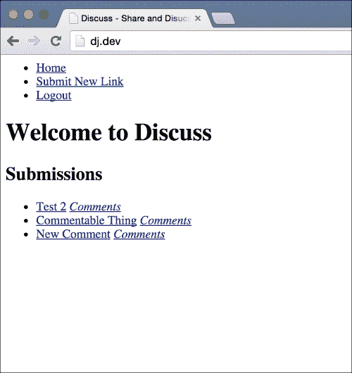

你会看到一个提交列表。如果你点击任何一个，你会在新标签页中看到该提交的链接。你还会看到每个提交旁边有一个**评论**链接。点击这个链接会带你到提交的详细页面。

让我们稍微谈谈我们将如何实现投票功能。我们在`Link`模型中创建的 M2M `upvotes`字段应该给你一些提示。每当用户给一个提交投票，我们就将他们添加到这个关系中。由于 M2M 关系确保如果我们多次添加相同的对象，它不会创建一个新记录，我们很容易确保一个用户只能对一个提交投票一次。

让我们创建一个视图，将已登录用户添加到提交的投票者列表中，然后将他们带回到主页。我们还将在主页上为每个提交添加一个链接，让用户使用这个新视图对提交进行投票。

在`links/views.py`中，从`django.views.generic`中导入`View`通用视图类，然后创建这个视图：

```py
class UpvoteSubmissionView(View):
    def get(self, request, link_pk, **kwargs):
        link = Link.objects.get(pk=link_pk)
        link.upvotes.add(request.user)

        return HttpResponseRedirect(reverse('home'))
```

接下来，在`discuss/urls.py`中导入这个新视图，并将其添加到 URL 模式中：

```py
url(r'^upvote/(?P<link_pk>\d+)/$', UpvoteSubmissionView.as_view(), name='upvote-submission'),
```

在`templates/home.html`中，在提交标题链接上方添加**投票**链接：

```py
<a href="">Upvote</a>
```

打开主页，你会看到每个提交标题旁边有一个**投票**链接。点击链接应该会带你回到主页。它应该看起来类似以下截图：

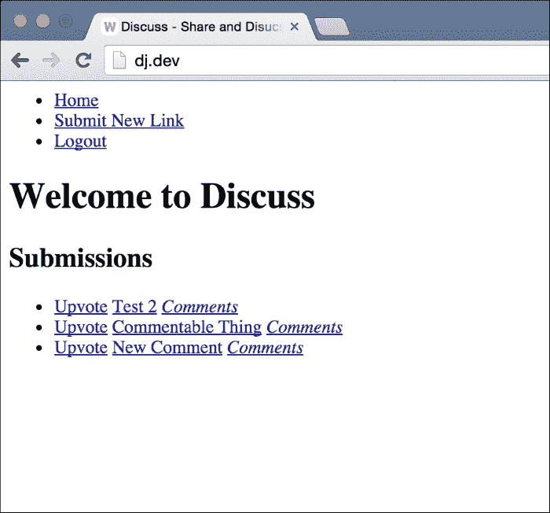

如果你给一个链接投票，它会立即带你回到主页，而没有任何提示表明你的投票已经记录下来。这个问题的解决方法很简单。将刚刚添加到主页模板的**投票**链接 HTML 行更改为以下内容：

```py

  Upvoted

  <a href="">Upvote</a>

```

如果你再次打开主页，你会看到已经投票的提交旁边有一个简单的**已投票**文本，而不是之前看到的链接。我们还应该允许用户取消对提交的投票。首先，在`links/views.py`中创建一个新的视图：

```py
class RemoveUpvoteFromSubmissionView(View):
    def get(self, request, link_pk, **kwargs):
        link = Link.objects.get(pk=link_pk)
        link.upvotes.remove(request.user)

        return HttpResponseRedirect(reverse('home'))
```

这几乎与我们创建的用于记录新投票的视图相同。唯一的区别是这里我们使用相关管理器的移除方法。接下来，我们需要将其添加到`discuss/urls.py`的 URL 文件中。在这里导入我们的新视图，并添加以下 URL 配置：

```py
url(r'^upvote/(?P<link_pk>\d+)/remove/$', RemoveUpvoteFromSubmissionView.as_view(), name='remove-upvote'),
```

最后，让我们将之前在主页上添加的**已投票**标签更改为一个链接，以取消投票。在你的`templates/home.html`文件中，注意以下几行：

```py

  Upvoted

```

将它们更改为以下内容：

```py

  <a href="">Remove Upvote</a>
      
```

就是这样！现在当你访问主页时，你会看到所有你已经投票的提交旁边的**取消投票**链接。点击链接，你将被重定向回主页，你的投票将被取消。你应该再次看到该提交的**投票**链接，因为你可以再次投票。

# 提交排名

我们列表中的下一个功能是使用智能算法对提交进行排名。让我们看看我们的功能描述需要什么：

### 提示

一种算法，用于根据一些因素的数量，包括该链接的投票数、评论数和提交的年龄，以某种定义的顺序对提交的链接进行排名

我们的数据库中有所有这些信息。我们需要创建一个算法，利用所有这些信息给每个提交一个排名。然后，我们只需使用这个排名对提交进行排序，并按排序顺序显示它们。为了保持简单，让我们使用以下算法：

```py
rank = number of votes + number of comments – number of days since submission
```

看起来很简单，除了可能是自提交以来的天数计算。然而，Python 标准库中的`datetime`模块让我们轻而易举地做到了这一点。在 Python 中，如果你减去两个`datetime`对象，你会得到一个`timedelta`对象。这个对象表示两个`datetime`对象之间的时间差。它有一个名为`days`的属性，这个属性保存了两个日期之间的天数。我们将从`datetime.datetime.now()`得到的日期减去提交的`submitted_on`字段，并使用结果`timedelta`对象的`days`属性。

让我们将这个算法插入到我们的主页视图中，这样我们的提交将按照它们的排名列出。将`links/views.py`中的`HomeView`更改为以下代码：

```py
class HomeView(TemplateView):
    template_name = 'home.html'

    def get_context_data(self, **kwargs):
        ctx = super(HomeView, self).get_context_data(**kwargs)

        now = timezone.now()
        submissions = Link.objects.all()
        for submission in submissions:
            num_votes = submission.upvotes.count()
            num_comments = submission.comment_set.count()

            date_diff = now - submission.submitted_on
            number_of_days_since_submission = date_diff.days

            submission.rank = num_votes + num_comments - number_of_days_since_submission

        sorted_submissions = sorted(submissions, key=lambda x: x.rank, reverse=True)
        ctx['submissions'] = sorted_submissions

        return ctx
```

您还需要使用以下方式从 Django 实用程序中导入`timezone`模块：

```py
from django.utils import timezone
```

这是因为 Django 使用了所谓的`timezone`感知`datetimes`。有关此内容的更多详细信息，请阅读 Django 关于`timezone`感知的文档[`docs.djangoproject.com/en/stable/topics/i18n/timezones/#naive-and-aware-datetime-objects`](https://docs.djangoproject.com/en/stable/topics/i18n/timezones/#naive-and-aware-datetime-objects)。

这段新代码可能看起来有点复杂，但相信我，它非常简单。让我们一行一行地看一下。我们首先使用`timezone.now()`函数获取当前日期时间。接下来，我们获取我们想要在主页上显示的所有提交，并开始循环遍历它们。

在循环中，我们首先使用`count()`方法计算提交的投票数和评论数，这是您之前在 Django `querysets`上看到的。这里唯一不同的是，我们将其用于`RelatedManager`对象返回的查询集，用于多对多的 upvotes 字段和与评论模型的反向关系。

如前所述，我们然后使用 Python 日期算术计算自提交以来的天数。最后，我们计算并分配提交的排名给对象。

循环结束后，我们的每个`Link`对象都有一个`rank`属性，保存了它的最终排名。然后我们使用 Python 内置的`sorted`函数对这个列表进行排序。当你在 Python 和 Django 中经常使用列表时，`sorted`函数是你会经常使用的东西。你应该通过阅读文档来熟悉它的语法和特性[`docs.python.org/3/library/functions.html#sorted`](https://docs.python.org/3/library/functions.html#sorted)。相信我，慢慢阅读这份文档并完全理解它是非常值得的。我使用`sorted`内置函数的次数已经数不清了。它是不可或缺的。

最后，我们将排序后的提交列表分配给`submissions`上下文变量。因为我们已经在主页模板中使用了这个变量，所以我们不需要改变`HomeView`之外的任何东西。如果你现在打开主页，你会看到提交的排序顺序已经改变，现在反映了我们的新算法。

这是一个很好的地方，可以反映 Django 使用的模型-视图-模板架构提供的模块化的好处。正如你所看到的，我们添加了一个相当重要的功能，但我们从未改变过主页的 URL 或模板。因为这些是独立的模块，我们只改变了视图代码，其他一切仍然可以与我们的新的和改进的排序顺序一起工作。

# 垃圾邮件保护

我们想要在我们的应用程序中拥有的最后一个功能是垃圾邮件保护。我们希望用户能够在我们的网站上发布内容，但我们希望防止垃圾邮件滥用。垃圾邮件，你可能知道，是指恶意的互联网用户在网站上发布不当或无关的内容。通常，垃圾邮件发送者使用专门针对允许用户提交内容的网站创建的脚本，比如我们的网页应用程序。虽然我们不能轻易地阻止垃圾邮件发送者手动向我们的网站提交垃圾邮件内容，但我们可以确保他们无法使用脚本一键生成大量垃圾邮件。通常情况下，如果垃圾邮件发送者无法在网站上使用他们的脚本，他们会转向更容易的目标。

我想让你从这个功能中学到的重要概念不是如何实现垃圾邮件保护。这是你根据自己项目的需求来决定的事情。我将在这里展示如何使用其他开发人员创建的开源 Django 应用程序来为您自己的 Django 项目添加功能。这是一个你应该熟悉的重要概念。大多数情况下，如果你在开发网页应用程序时寻找解决问题的方法，搜索互联网会找到许多其他程序员开发的开源应用程序，用于解决相同的问题。你可以找到解决各种问题的应用程序，从提供新类型的表单字段（例如，使用 JavaScript 日历的日历表单字段）到提供完整的基于 Django 的论坛应用程序，你可以轻松集成到你的 Django 网站中，并为用户提供易于使用和外观良好的论坛。

我们将使用谷歌的`ReCaptcha`服务来为我们提供一个阻止垃圾邮件的机制。你可以在[`www.google.com/recaptcha`](https://www.google.com/recaptcha)了解更多关于这项服务。你还需要在这里注册一个账户并创建一个 API 密钥。它会要求一个标签，我设置为**讨论 Django 蓝图**，一个域，我设置为`127.0.0.1`。`所有者`字段应该有你的电子邮件地址。一旦你提交了这个表单，你将看到一个屏幕，显示你的公钥和私钥。保持这个页面打开，因为我们一会儿会用到这些值。

接下来，我们需要找到一个 Django 应用程序，允许我们使用 ReCaptcha 服务。谷歌搜索引导我到[`github.com/praekelt/django-recaptcha`](https://github.com/praekelt/django-recaptcha)。这似乎是一个维护良好且简单的解决方案。为了使用它，我们首先必须在我们的虚拟环境中安装它。在命令行上，确保你的虚拟环境是激活的。然后，使用以下`pip`命令安装这个软件包：

```py
> pip install django-recaptcha

```

这将安装该软件包。接下来，在`discuss/settings.py`文件中将`captcha`添加到`INSTALLED_APPS`列表中。还要在设置文件中添加`RECAPTCHA_PUBLIC_KEY`和`RECAPTCHA_PRIVATE_KEY`变量。将它们的值设置为我之前要求你保持打开的 Google ReCaptcha API 密钥页面上给你的适当密钥。**站点密钥**是公钥，**秘密密钥**是私钥。最后，在你的`settings.py`文件中，设置以下变量：

```py
NOCAPTCHA = True
```

设置完成了。我们准备在我们的表单中使用`ReCaptcha`。为了演示，我只会将它添加到你在提交详细页面上看到的评论表单中。打开`links/forms.py`并在顶部添加这个导入：

```py
from captcha.fields import ReCaptchaField
```

然后，将这个字段添加到`CommentModelForm`中：

```py
captcha = ReCaptchaField()
```

就是这样！你已经成功地将 Google 的`ReCaptcha`添加到你的网站上！让我们试试看。打开任何提交的详细页面，现在，在我们之前用于评论的正文字段下面，你会看到 Google 的`ReCaptcha`框：

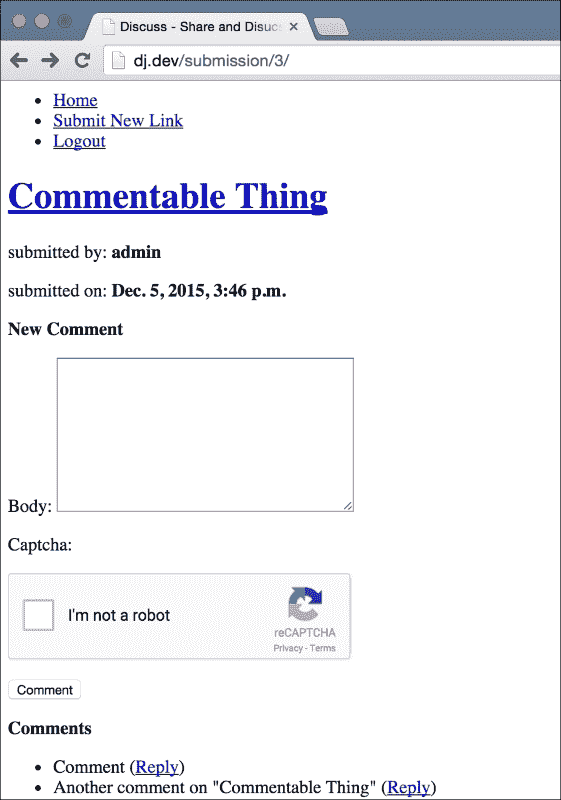

现在，如果您在不选择**我不是机器人复选框**的情况下提交表单，您将被带到评论表单页面，并显示错误消息，指出需要填写验证码字段。在选择此框之前，您将无法提交评论。

从将`ReCaptcha`添加到我们的网站中，我们可以得出两个要点。首先，请注意，我们使用另一位程序员贡献的开源代码轻松地添加了一个相对复杂的功能。其次，请注意，由于 Django 提供的模块化和模板与代码之间的分离，我们只需将`ReCaptcha`小部件添加到表单中即可。我们甚至不需要更改视图代码或模板。一切都很顺利。

# 总结

这是一个非常有趣的章节。您学到了更多关于 Django 提供的内置通用视图，并详细了解了`ModelForms`以及我们如何自定义它们。我们找出了 Django 遵循的模块化 MVC 模式和第三方开源 Django 应用程序的一些好处，以及我们如何将它们包含在我们的项目中。

您还学到了如何在我们的表单上传递数据，即使它们放在不同的页面上，以及如何创建一个显示在两个页面上的表单（评论表单），同时确保数据在两者之间同步。

总的来说，我们最终创建的应用程序既有趣又是一个完整的产品。
