# 第三章：Djagios - Django 中的 Nagios 克隆

在本章中，我们将创建一个类似于**Nagios**的服务器状态监控解决方案。如果您从未听说过 Nagios，那是可以理解的，因为它不是在 Web 开发人员的日常对话中经常出现的东西。简而言之，Nagios 可以在一个屏幕上告诉您服务器的状态（可以达到数千台）。您可以根据条件配置警报，例如，如果某个关键服务器变得无响应，这样您就可以在用户开始注意到任何服务降级之前解决问题。Nagios 是一个令人惊叹的软件，被全球数百万组织使用。

本章的目标是创建一个类似的东西，尽管非常简单。我们的 Nagios 克隆品，创意地命名为**Djagios**，将允许用户设置监视其服务器的简单统计信息。我们将允许监视以下内容：

+   系统负载

+   磁盘使用情况

我们还将开发一个网页，用户可以在其中以漂亮的表格格式查看这些数据。用户还将看到他们的服务器的概述，以及这些系统上是否有任何活动警报。

以下是本章我们将要研究的一些内容：

+   Django 管理命令以及如何创建自定义命令

+   使用 Django shell 快速测试代码的小片段

+   Django 模型字段的复杂验证

+   内置通用视图的稍微复杂的用法

+   创建一个 API 端点以接受来自外部来源的数据

+   使用简单的共享密钥保护这些 API 端点

+   使用简单工具测试 API 端点

# 代码包

本章的代码包已经设置了一个基本的 Django 应用程序，并配置了一个 SQLite 数据库。但是，代码包中没有太多代码，因为本章不需要用户帐户或任何其他预先存在的设置。您可以解压缩代码包，创建一个新的虚拟环境，激活它，并从代码文件夹中运行以下命令以启动和运行：

```py
> pip install django
> python manage.py migrate

```

# 要求

在我们开始编写代码之前，让我们谈谈我们对最终产品的期望。如前所述，我们希望创建一个服务器监控解决方案。它将具体做什么？我们如何实现所需的功能？

由于我们对 Djagios 的灵感来自 Nagios，让我们看看 Nagios 是如何工作的。虽然 Nagios 是一个庞大的应用程序，具有可以理解的复杂编程，但它最终是一个客户端-服务器应用程序。服务器，也就是另一台计算机，包含 Nagios 安装。客户端，也就是您想要监视的系统，运行小型插件脚本来收集数据并将其推送到服务器。服务器接收这些数据点，并根据其配置情况发送警报（如果需要）。它还存储这些数据点，并可以以简单的表格布局显示它们，让您立即了解基础架构中所有计算机系统的概况。

我们将创建类似的东西。我们的服务器将是一个 Django 应用程序，将使用 HTTP 端点接受数据点。该应用程序还将包括一个网页，其中所有这些数据点将显示在客户端旁边。我们的客户端将是简单的 shell 脚本，用于将数据上传到我们的服务器。

### 注意

在本章的其余部分，我将把 Django 应用程序称为**服务器**，将您想要监视的系统称为**节点**。这些是您在编程生涯中会遇到的许多其他项目中常用的术语，它们在这些其他项目中通常意味着类似的东西。

与其一次性开发所有这些东西，我们将采取渐进式的方法。我们首先创建模型来存储我们的数据点。接下来，我们不会直接转向创建 HTTP 端点来接受数据点和客户端插件脚本，而是采取更简单的方法，想出一种方法来生成一些虚假数据进行测试。最后，我们将创建网页来向用户显示客户端节点的最新状态和触发的警报。

通过使用虚假数据进行测试，我们可以确信我们的状态页面和警报系统正常工作。然后我们可以继续下一步，即创建 HTTP 端点以从客户端和客户端插件脚本收集数据点。

在现实世界的项目中，逐步构建软件系统通常是完成项目的最佳方式。创建简单的功能并对其进行广泛测试，以确保其正常工作。一旦您对其正确性有信心，就添加更多功能并重复测试阶段。这种方式类似于建造高楼。如果您确信基础牢固，您可以一次建造一层，而不必担心整个建筑会倒在您头上。

# 模型

我们记录数据点需要记录什么信息？我们肯定需要记录发送数据的节点的名称。我们还需要记录获取数据点的时间，以便我们可以找出节点的最新状态。当然，我们需要知道数据点的类型和值。数据点的类型只是我们正在测量的数量的名称，例如 CPU 使用率，内存使用率，正常运行时间等。

目前，我认为这些是我们需要测量的所有东西：

+   节点名称

+   日期和时间

+   类型

+   价值

在考虑我们模型中需要哪些字段时，我想到了另一种方法。它涉及为每种数据点类型创建不同的模型，因此我们可以有名为`SystemLoad`，`MemoryUsage`，`DiskUsage`，`Uptime`等的 Django 模型。然而，一旦我进一步考虑了一下，我发现这样做将非常限制，因为现在每当我们想要测量新的东西时，我们都需要定义一个新的模型。在我们的模型中添加数据点的类型作为另一个字段，可以在记录新类型的信息方面给我们很大的灵活性。

后面您将看到这两种方法的利弊。

让我们在项目中开始一个新的 Django 应用程序。在命令行中，输入以下内容，确保您的虚拟环境已激活，并且您在项目文件夹中：

```py
> python manage.py startapp data_collector

```

将这个新应用程序添加到`djagios/settings.py`中的`INSTALLED_APPS`列表中，然后将我们的数据点模型添加到`data_collector/models.py`中：

```py
class DataPoint(models.Model):
    node_name = models.CharField(max_length=250)
    datetime = models.DateTimeField(auto_now_add=True)

    data_type = models.CharField(max_length=100)
    data_value = models.FloatField()
```

保存文件，然后运行迁移以将其添加到我们的数据库中：

```py
> python manage.py makemigrations data_collector
> python manage.py migrate

```

虽然模型非常简单，但有一件事情你应该知道。为了保持简单，我决定仅存储数字值；因此，`data_value`字段是`FloatField`类型。如果这是一个现实世界的项目，您可能会有一系列要求，这些要求将决定您是否可以做出相同的妥协。例如，您可能还必须记录文本值，例如，您可能正在运行的某些服务的状态。对于 Djagios，我们只接受数字值，因为我们想要测量的所有统计数据都只是数字。

# 虚假数据生成

在进行下一步，即创建状态页面之前，我们应该想出一种方法来生成一些虚假数据。这将在创建状态页面并在途中调试任何问题时帮助我们。没有任何数据，我们可能会花时间创建完美的状态页面，只是后来发现当我们添加数据时，其中的某些方面，如设计或数据布局方案，不起作用。

## Django 管理命令

Django 有一个非常有用的功能，叫做管理命令。它允许我们创建可以与我们编写的 Django 应用程序代码以及我们的模型进行交互的 Python 脚本。

我们不能只编写一个简单的 Python 脚本来导入我们的模型，原因是 Django，像所有的 Web 框架一样，有许多依赖项，并且需要进行复杂的设置，以确保在使用其功能之前一切都配置正确。例如，访问数据库取决于 Django 知道设置文件在哪里，因为它包含数据库的配置。不知道如何读取数据库，就无法查询模型。

让我们进行一个小测试。确保您的虚拟环境已激活，并且您在项目目录中。接下来，通过输入以下内容启动 Python shell：

```py
> python

```

这将启动一个新的 Python 交互式 shell，在这里您可以输入 Python 语句并立即执行它们。您会知道您在 Python shell 中，因为您的提示符将更改为`>>>`。现在，让我们尝试在这个 shell 中导入我们的`DataPoint`模型：

```py
>>> from data_collector.models import DataPoint

```

按下*Enter*，您可能会对打印的巨大错误消息感到惊讶。不用担心，您不需要阅读所有内容。最重要的部分是最后一行。它将类似于这样（尽管可能会在不同的 Django 版本之间略有变化）：

```py
django.core.exceptions.ImproperlyConfigured: Requested setting DEFAULT_INDEX_TABLESPACE, but settings are not configured. You must either define the environment variable DJANGO_SETTINGS_MODULE or call settings.configure() before accessing settings.
```

看起来令人生畏，但让我们分部分来看。冒号`:`之前的第一部分是异常名称。在这里，Django 引发了`ImproperlyConfigured`异常。然后有一句话告诉您请求了某个设置，但设置尚未配置。最后一句是关于如何解决此问题的有用消息。

虽然您可以按照错误消息中列出的步骤并使您的脚本在 Django 之外运行，但使用管理命令几乎总是最佳选择。使用管理命令，您无需手动设置 Django。在运行脚本之前，它会自动为您完成，并且您可以避免担心设置环境变量，如`DJANGO_SETTINGS_MODULE`或调用`settings.configure()`。

要创建一个新的管理命令，我们首先必须创建两个新的 Python 模块来保存我们的命令脚本。从项目根目录的命令行中输入以下内容：

```py
> mkdir -p data_collector/management/commands
> touch data_collector/management/__init__.py
> touch data_collector/management/commands/__init__.py

```

这些命令的作用是在`data_collector`模块文件夹下创建一个名为`management`的模块，然后在`management`模块中创建另一个名为`commands`的模块。我们首先创建模块的文件夹，然后创建空的`__init__.py`文件，以便 Python 将这些文件夹识别为模块。

接下来，让我们尝试创建一个简单的管理命令，只需打印出我们数据库中目前为止的数据点列表。创建一个新的`data_collector/management/commands/sample_data.py`文件，并给它以下内容：

```py
from django.core.management import BaseCommand

from data_collector.models import DataPoint

class Command(BaseCommand):
    def handle(self, *args, **options):
        print('All data points:')
        print(DataPoint.objects.all())
```

保存此文件，然后返回到命令提示符。然后运行以下命令：

```py
> python manage.py sample_data

```

您应该看到以下输出：

```py
All data points:
[]
```

就是这样。这就是创建 Django 管理命令的全部内容。正如您所看到的，我们能够在命令行上运行脚本时使用我们的`DataPoint`模型的方法，而不是作为 HTTP 响应视图的一部分运行。关于 Django 管理命令的一些注意事项如下：

+   您的命令与包含命令的文件的名称相同。

+   为了成为有效的管理命令，源文件应始终定义一个`Command`类，它将是`BaseCommand`的基类。

+   Django 将调用您的`Command`类的`handle`方法。这个方法是您想要从脚本提供的任何功能的起点。

接下来，当我们修改`sample_data.py`命令以实际添加示例数据时，我们将看一下`*args`和`**options`参数。如果您想进一步了解 Django 管理命令的信息，您应该查看[`docs.djangoproject.com/en/stable/howto/custom-management-commands/`](https://docs.djangoproject.com/en/stable/howto/custom-management-commands/)上的文档。

让我们修改我们的命令类来添加虚假数据。这是修改后的`Command`类代码：

```py
class Command(BaseCommand):
    def add_arguments(self, parser):
        parser.add_argument('node_name', type=str)
        parser.add_argument('data_type', type=str)
        parser.add_argument('data_value', type=float)

    def handle(self, *args, **options):
        node_name = options['node_name']
        data_type = options['data_type']
        data_value = options['data_value']

        new_data_point = DataPoint(node_name=node_name, data_type=data_type, data_value=data_value)
        new_data_point.save()

        print('All data points:')
        print(DataPoint.objects.all())
```

这里有一些新东西。让我们首先看一下`add_arguments`方法。大多数管理命令需要参数才能做一些有用的事情。由于我们正在向数据库添加示例数据，我们的命令将需要添加的值。这些值以参数的形式提供给命令行。如果你没有太多使用命令行的经验，参数就是在命令名称后面输入的所有东西。例如，让我们看一下我们用来在项目中创建新的 Django 应用程序的命令：

```py
> python manage.py startapp APP_NAME

```

在这里，我们使用了`startapp` Django 管理命令，这是一个内置命令，而应用程序名称是应用程序的参数。

我们希望我们的自定义命令接受三个参数：节点名称、数据类型和数据点的值。在`add_arguments`方法中，我们告诉 Django 为这个命令需要和解析三个参数。

`handle`方法的`options`参数是一个字典，保存了用户定义并传递给命令的所有参数。在`handle`方法中，我们只是将每个选项的值分配给一个变量。如果用户在调用命令时漏掉或添加了额外的参数，Django 将打印出一个错误消息，并告诉他们需要的参数是什么。例如，如果我现在调用命令而没有任何参数，会发生什么：

```py
> python manage.py sample_data
usage: manage.py sample_data [-h] [--version] [-v {0,1,2,3}]
                             [--settings SETTINGS] [--pythonpath PYTHONPATH]
                             [--traceback] [--no-color]
                             node_name data_type data_value
manage.py sample_data: error: the following arguments are required: node_name, data_type, data_value
```

如果用户忘记了如何使用管理命令，这是有用的信息。

现在我们有了变量中的参数值，我们创建一个新的数据点并保存它。最后，我们打印出数据库中所有的数据点。让我们现在尝试运行我们的命令，看看我们得到什么输出：

```py
> python manage.py sample_data web01 load 5
All data points:
[<DataPoint: DataPoint object>]
```

虽然命令成功创建了一个新的数据点，但输出并不是很有用。我们不知道这个数据点包含什么信息。让我们来修复这个问题。

## 更好的模型表示

每当 Django 打印出一个模型实例时，它首先尝试查看模型类是否定义了`__str__`方法。如果找到这个方法，它就使用它的输出；否则，它会退回到一个默认实现，只打印类名，就像我们在这里看到的那样。为了让 Django 打印出一个更有用的数据点模型表示，将这个`__str__`方法添加到我们的`DataPoint`模型类中：

```py
def __str__(self):
    return 'DataPoint for {}. {} = {}'.format(self.node_name, self.data_type, self.data_value)
```

让我们现在再次运行我们的`sample_data`命令，看看它的输出如何改变了：

```py
> python manage.py sample_data web01 load 1.0
All data points:
[<DataPoint: DataPoint for web01\. load = 5.0>, <DataPoint: DataPoint for web01\. load = 1.0]
```

好了。现在我们看到我们添加的数据点已经正确保存到数据库中。继续创建更多的数据点。使用尽可能多的不同节点名称，但尝试将数据类型限制为**load**或**disk_usage**中的一个，因为我们稍后将创建特定于这些数据类型的代码。这是我为参考添加到数据库的示例数据：

| 节点名称 | 数据类型 | 数据值 |
| --- | --- | --- |
| `web01` | `load` | `5.0` |
| `web01` | `load` | `1.0` |
| `web01` | `load` | `1.5` |
| `web01` | `disk_usage` | `0.5` |
| `web02` | `load` | `7.0` |
| `web02` | `load` | `9.0` |
| `web02` | `disk_usage` | `0.85` |
| `dbmaster` | `disk_usage` | `0.8` |
| `dbmaster` | `disk_usage` | `0.95` |

现在我们有了一种添加示例数据并将其添加到数据库中的方法，让我们创建一个状态页面，向用户展示所有这些数据。

# 状态页面

我们的状态页面需要以一种视图显示用户完整基础设施的状态。为此，表感觉像是一个合适的设计组件。由于对用户最重要的信息将是他们服务器的最新状态，我们的状态页面将需要仅显示每个节点的一行表，并且仅列出我们在数据库中为该节点拥有的每种不同数据类型的最新值。

对于我添加到数据库中的示例数据，我们理想情况下希望状态页面上有一个类似这样的表：

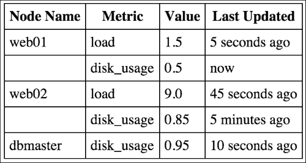

正如你所看到的，我们只提到每个节点一次，并且将不同的数据类型分组，这样所有关于节点的信息都显示在一个地方，用户不必在表中搜索他们要找的内容。作为一个奖励，我们还以一种好看的方式显示最后更新的时间，而不仅仅是显示最新数据点的时间。

如果你认为像这样以一种好看和整合的方式显示我们的数据点不会简单，恐怕你是对的。我们可以使用`DataPoint.objects.all()`从数据库中获取所有数据点，然后在我们的 Python 代码中对它们进行分组，但一旦我们数据库中的数据点数量增加，这种方法就会变得低效。对于服务器监控解决方案，拥有几百万数据点并不罕见。我们不能每次用户想要查看状态页面时都去获取和分组所有百万数据点。这将使加载页面变得难以忍受缓慢。

幸运的是，SQL——用于从数据库查询数据的语言——为我们提供了一些非常强大的结构，我们可以使用它们来获取我们想要的信息，而不必遍历我们数据点表中可能有的所有数据行。让我们想想我们需要什么。

首先，我们想知道我们数据库中的不同节点名称。对于每个节点名称，我们还需要知道可用的数据类型。在我们的示例中，虽然**web01**和**web02**都有**load**和**disk_usage**数据类型可用，但**dbmaster**节点只有**disk_usage**数据类型（或指标）的数据。对于这样的情况，SQL 语言为我们提供了一个`DISTINCT`查询子句。在我们的查询中添加`DISTINCT`指示数据库仅返回唯一行。也就是说，所有重复行只返回一次。这样，我们就可以获取我们数据库中所有不同节点和数据类型的列表，而无需遍历每条记录。

我们需要进行一些实验，以找出如何将 SQL 查询转换为我们可以在 Django ORM 中使用的内容。我们可以编写我们的视图代码，然后不断更改它以找出获取我们想要的数据的正确方法，但这非常麻烦。相反，Django 为我们提供了一个非常方便的 shell 来进行这些实验。

如果你还记得，本章的开头，我向你展示了为什么你不能只启动一个 Python shell 并导入模型。Django 抱怨在使用之前没有被正确设置。相反，Django 有自己的启动 Python shell 的方式，确保在开始使用 shell 之前满足了设置 Django 的所有依赖关系。要启动这个 shell，输入以下内容：

```py
> python manage.py shell

```

像之前一样，这会让你进入一个 Python shell，你可以通过改变的提示来告诉。现在，让我们尝试导入我们的`DataPoint`模型：

```py
>>> from data_collector.models import DataPoint

```

这次你不应该会得到任何错误。现在输入以下内容：

```py
>>
> DataPoint.objects.all()
[<DataPoint: DataPoint for web01\. load = 5.0>, <DataPoint: DataPoint for web01\. load = 1.0>, <DataPoint: DataPoint for web01\. load = 1.5>, <DataPoint: DataPoint for web02\. load = 7.0>, <DataPoint: DataPoint for web02\. load = 9.0>, <DataPoint: DataPoint for dbmaster. disk_usage = 0.8>, <DataPoint: DataPoint for dbmaster. disk_usage = 0.95>, <DataPoint: DataPoint for web01\. disk_usage = 0.5>, <DataPoint: DataPoint for web02\. disk_usage = 0.85>]

```

正如你所看到的，你可以查询模型并立即看到查询的输出。Django shell 是 Django 中最有用的组件之一，你经常会发现自己在 shell 中进行实验，以找出在编写最终代码之前正确的做法。

所以，回到我们从数据库中获取不同节点名称和数据类型的问题。如果你在 Django 文档中搜索**distinct**关键字，你应该会在结果中看到这个链接：

[`docs.djangoproject.com/en/stable/ref/models/querysets/#distinct`](https://docs.djangoproject.com/en/stable/ref/models/querysets/#distinct)。

如果您阅读文档中的内容，您应该会发现这正是我们需要使用`DISTINCT`子句的原因。但是我们如何使用它呢？让我们在 shell 中尝试一下：

```py
>>> DataPoint.objects.all().distinct()
[<DataPoint: DataPoint for web01\. load = 5.0>, <DataPoint: DataPoint for web01\. load = 1.0>, <DataPoint: DataPoint for web01\. load = 1.5>, <DataPoint: DataPoint for web02\. load = 7.0>, <DataPoint: DataPoint for web02\. load = 9.0>, <DataPoint: DataPoint for dbmaster. disk_usage = 0.8>, <DataPoint: DataPoint for dbmaster. disk_usage = 0.95>, <DataPoint: DataPoint for web01\. disk_usage = 0.5>, <DataPoint: DataPoint for web02\. disk_usage = 0.85>]

```

嗯？这没有改变任何东西。为什么？让我们想想这里发生了什么。我们要求 Django 查询数据库中的所有数据点，然后仅返回每个重复数据的一行。如果您熟悉 SQL，不同的子句通过比较您选择的数据行中的每个字段来工作。但是，由于默认情况下，Django 在查询模型时会选择数据库表中的所有行，因此 SQL 查询看到的数据也包括主键，这根据定义对于每一行都是唯一的。这就是为什么我们看到所有数据，即使我们使用了不同的子句。

为了使用不同的子句，我们需要限制我们要求数据库返回给我们的数据中的字段。对于我们特定的用例，我们只需要知道节点名称和数据类型的唯一对。Django ORM 提供了另一个方法`values`，我们可以使用它来限制 Django 选择的字段。让我们首先尝试一下没有不同子句，看看返回什么数据：

```py
>>> DataPoint.objects.all().values('node_name', 'data_type')
[{'data_type': u'load', 'node_name': u'web01'}, {'data_type': u'load', 'node_name': u'web01'}, {'data_type': u'load', 'node_name': u'web01'}, {'data_type': u'load', 'node_name': u'web02'}, {'data_type': u'load', 'node_name': u'web02'}, {'data_type': u'disk_usage', 'node_name': u'dbmaster'}, {'data_type': u'disk_usage', 'node_name': u'dbmaster'}, {'data_type': u'disk_usage', 'node_name': u'web01'}, {'data_type': u'disk_usage', 'node_name': u'web02'}]

```

这似乎起了作用。现在我们的数据只包括我们想要运行不同查询的两个字段。让我们也添加不同的子句，看看我们得到了什么：

```py
>>> DataPoint.objects.all().values('node_name', 'data_type').distinct()
[{'data_type': u'load', 'node_name': u'web01'}, {'data_type': u'load', 'node_name': u'web02'}, {'data_type': u'disk_usage', 'node_name': u'dbmaster'}, {'data_type': u'disk_usage', 'node_name': u'web01'}, {'data_type': u'disk_usage', 'node_name': u'web02'}]

```

哇！这似乎起了作用。现在我们的 Django ORM 查询只返回唯一的节点名称和数据类型对，这正是我们需要的。

重要的一点要注意的是，当我们在 ORM 查询中添加了`values`方法后，返回的数据不再是我们的`DataPoint`模型类。相反，它是只包含我们要求的字段值的字典。因此，您在模型上定义的任何函数都无法在这些字典上访问。如果您仔细想想，这是显而易见的，因为没有完整的字段，Django 无法填充模型对象。即使您在`values`方法参数中列出了所有模型字段，它仍然只会返回字典，而不是模型对象。

现在我们已经弄清楚了如何以我们想要的格式获取数据，而无需循环遍历我们数据库中的每一行数据，让我们为我们的状态页面创建模板、视图和 URL 配置。从视图代码开始，将`data_collector/views.py`更改为以下内容：

```py
from django.views.generic import TemplateView

from data_collector.models import DataPoint

class StatusView(TemplateView):
    template_name = 'status.html'

    def get_context_data(self, **kwargs):
        ctx = super(StatusView, self).get_context_data(**kwargs)

        nodes_and_data_types = DataPoint.objects.all().values('node_name', 'data_type').distinct()

        status_data_dict = dict()
        for node_and_data_type_pair in nodes_and_data_types:
            node_name = node_and_data_type_pair['node_name']
            data_type = node_and_data_type_pair['data_type']

            data_point_map = status_data_dict.setdefault(node_name, dict())
            data_point_map[data_type] = DataPoint.objects.filter(
                node_name=node_name, data_type=data_type
            ).latest('datetime')

        ctx['status_data_dict'] = status_data_dict

        return ctx
```

这有点复杂，所以让我们分成几部分。首先，我们使用之前想出的查询获取节点名称和数据类型对的列表。我们将查询的结果存储在`nodes_and_data_types`中，类似于以下内容：

```py
[{'data_type': u'load', 'node_name': u'web01'}, {'data_type': u'load', 'node_name': u'web02'}, {'data_type': u'disk_usage', 'node_name': u'dbmaster'}, {
'data_type': u'disk_usage', 'node_name': u'web01'}, {'data_type': u'disk_usage', 'node_name': u'web02'}]
```

正如我们之前看到的，这是我们数据库中所有唯一的节点名称和数据类型对的列表。因此，由于我们的**dbmaster**节点没有任何**load**数据类型的数据，您在此列表中找不到该对。稍后我会解释为什么运行不同的查询有助于我们减少对数据库的负载。

接下来，我们循环遍历每对；这是您在代码中看到的 for 循环。对于每个节点名称和数据类型对，我们运行一个查询，以获取最新的数据点。首先，我们筛选出我们感兴趣的数据点，即与我们指定的节点名称和数据类型匹配的数据点。然后，我们调用`latest`方法并获取最近更新的数据点。

`latest`方法接受一个字段的名称，使用该字段对查询进行排序，然后根据该排序返回数据的最后一行。应该注意的是，`latest`可以与任何可以排序的字段类型一起使用，包括数字，而不仅仅是日期时间字段。

我想指出这里使用了`setdefault`。在字典上调用`setdefault`可以确保如果提供的键在字典中不存在，那么第二个参数传递的值将被设置为该键的值。这是一个非常有用的模式，我和很多 Python 程序员在创建字典时使用，其中所有的键都需要具有相同类型的值-在这种情况下是一个字典。

这使我们可以忽略键以前不存在于字典中的情况。如果不使用`setdefault`，我们首先必须检查键是否存在。如果存在，我们将修改它。如果不存在，我们将创建一个新的字典，修改它，然后将其分配给`status_data_dict`。

`setdefault`方法也返回给定键的值，无论它是否必须将其设置为默认值。我们在代码中将其保存在`data_point_map`变量中。

最后，我们将`status_data_dict`字典添加到上下文中并返回它。我们将在我们的模板中看到如何处理这些数据并向用户显示它。我之前说过我会解释不同的查询是如何帮助我们减少数据库负载的。让我们看一个例子。假设我们的基础设施中有相同的三个节点，我们在样本数据中看到了：**web01**，**web02**和**dbmaster**。假设我们已经运行了一整天的监控，每分钟收集所有三个节点的负载和磁盘使用情况的统计数据。做一下计算，我们应该有以下结果：

节点数 x 数据类型数 x 小时数 x60：

```py
3 x 2 x 24 x 60 = 8640

```

因此，我们的数据库有 8,640 个数据点对象。现在，有了我们在视图中的代码，我们只需要从数据库中检索六个数据点对象，就可以向用户显示一个更新的状态页面，再加上一个不同的查询。如果我们必须获取所有数据点，我们将不得不从数据库中传输所有这些 8,640 个数据点的数据，然后只使用其中的六个。

对于模板，创建一个名为`templates`的文件夹在`data_collector`目录中。然后，在模板文件夹中创建一个名为`status.html`的文件，并给它以下内容：

```py





<h1>Status</h1>

<table>
    <tbody>
        <tr>
            <th>Node Name</th>
            <th>Metric</th>
            <th>Value</th>
            <th>Last Updated</th>
        </tr>

        
            
            <tr>
                <td>{{ node_name }}</td>
                <td>{{ data_type }}</td>
                <td>{{ data_point.data_value }}</td>
                <td>{{ data_point.datetime|naturaltime }}</td>
            </tr>
            
        
    </tbody>
</table>

```

这里不应该有太多意外。忽略`load humanize`行，我们的模板只是使用我们在视图中生成的数据字典创建一个表。两个嵌套的`for`循环可能看起来有点复杂，但看一下我们正在循环的数据应该会让事情变得清晰：

```py
{u'dbmaster': {u'disk_usage': <DataPoint: DataPoint for dbmaster. disk_usage = 0.95>},
 u'web01': {u'disk_usage': <DataPoint: DataPoint for web01\. disk_usage = 0.5>,
            u'load': <DataPoint: DataPoint for web01\. load = 1.5>},
 u'web02': {u'disk_usage': <DataPoint: DataPoint for web02\. disk_usage = 0.85>,
            u'load': <DataPoint: DataPoint for web02\. load = 9.0>}}
```

第一个 for 循环获取节点名称和将数据类型映射到最新数据点的字典。然后内部 for 循环遍历数据类型和该类型的最新数据点，并生成表行。我们使用`forloop.first`标志仅在内部循环第一次运行时打印节点名称。Django 在模板中提供了一些与 for 循环相关的其他有用的标志。查看文档[`docs.djangoproject.com/en/stable/ref/templates/builtins/#for`](https://docs.djangoproject.com/en/stable/ref/templates/builtins/#for)。

当我们打印数据点的`datetime`字段时，我们使用`naturaltime`过滤器。这个过滤器是 Django 提供的 humanize 模板标签的一部分，这就是为什么我们需要在模板的开头使用`load humanize`行。`naturaltime`模板过滤器以易于人类理解的格式输出日期时间值，例如，两秒前，一小时前，20 分钟前等等。在你加载`humanize`模板标签之前，你需要将`django.contrib.humanize`添加到`djagios/settings.py`的`INSTALLED_APPS`列表中。

完成我们的状态页面的最后一步是将其添加到 URL 配置中。由于状态页面是用户最常想要从监控系统中看到的页面，让我们把它作为主页。让`djagios/urls.py`中的 URL 配置文件包含以下内容：

```py
from django.conf.urls import url

from data_collector.views import StatusView

urlpatterns = [
    url(r'^$', StatusView.as_view(), name='status'),
]
```

就是这样。运行开发服务器：

```py
> python manage.py runserver

```

访问`http://127.0.0.1:8000`上的状态页面。如果您迄今为止已经按照步骤进行操作，您应该会看到一个类似以下页面的状态页面。当然，您的页面将显示来自您的数据库的数据：

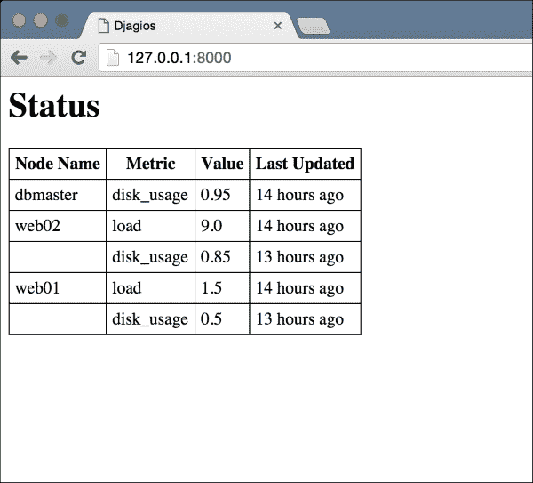

# 警报

现在我们已经有了一个基本的状态页面，让我们谈谈允许用户配置一些警报条件。目前，我们将通过在状态页面上以红色显示该节点的信息来通知用户任何警报条件。

首先，我们需要弄清楚我们希望用户设置什么样的警报。从那里，我们可以弄清楚技术细节。所以，让我们考虑一下。鉴于我们记录的所有数据类型都具有数值数值，用户应该能够设置阈值是有意义的。例如，他们可以设置警报，如果任何节点的系统负载超过 1.0，或者如果节点的磁盘使用率超过 80%。

此外，也许我们的用户不希望为每个节点设置相同的警报条件。数据库节点预计会处理大量的系统负载，因此也许我们的用户希望为数据库节点设置单独的警报条件。最后，如果他们正在对一些节点进行维护，他们可能希望停止一些警报的触发。

从所有这些来看，似乎我们的警报需要具有以下字段：

+   触发的数据类型

+   触发的最大值

+   触发的最小值

+   触发的节点名称

+   如果警报当前处于活动状态

其中，数据类型和活动状态是必填字段，不应为空。节点名称可以是空字符串，在这种情况下，将检查每个节点的警报条件。如果节点名称不是空字符串，则将检查名称与提供的字符串完全匹配的节点。

至于最大值和最小值，其中一个是必需的。这样用户可以仅设置最大值的警报，而不必关心数据点的最小值。这将需要在模型中进行手动验证。

## 模型

让我们看看模型。为了保持简单，我们将使用`data_collector`应用程序，而不是为警报创建一个新的应用程序。以下是我们的`Alert`模型的代码。将其放在`data_collector/models.py`中的`DataPoint`模型代码之后：

```py
class Alert(models.Model):
    data_type = models.CharField(max_length=100)
    min_value = models.FloatField(null=True, blank=True)
    max_value = models.FloatField(null=True, blank=True)
    node_name = models.CharField(max_length=250, blank=True)

    is_active = models.BooleanField(default=True)

    def save(self, *args, **kwargs):
        if self.min_value is None and self.max_value is None:
            raise models.exceptions.ValidationError('Both min and max value can not be empty for an alert')

        super(Alert, self).save(*args, **kwargs)
```

由于我们对最小和最大字段的特殊要求，我们不得不重写`save`方法。您可能已经注意到，我们的自定义`save`方法如果未设置最小和最大值，则会引发错误。由于没有办法使用正常的 Django 字段配置表达这种条件，我们不得不重写`save`方法并在这里添加我们的自定义逻辑。如果您有一些依赖于多个字段的自定义验证要求，这在 Django 中是一种非常常见的做法。

还有一件事要注意，那就是对最小和最大`FloatField`的`blank=True`参数。这是必需的，以便从该模型构建的任何模型表单（稍后我们将用于`create`和`update`视图）允许这些字段的空值。

创建并运行迁移以将其添加到您的数据库中。

```py
> python manage.py makemigrations data_collector
> python manage.py migrate data_collector

```

## 管理视图

用户将需要一些视图来管理警报。他们将需要页面来查看系统中定义的所有警报，创建新警报和编辑现有警报的页面，以及删除不再需要的警报的某种方式。所有这些都可以使用 Django 提供的通用视图和一些模板来实现。让我们开始吧！

首先，让我们先看看列表视图。将其添加到`data_collector/views.py`中：

```py
class AlertListView(ListView):
    template_name = 'alerts_list.html'
    model = Alert
```

记得从`django.views.generic`中导入`ListView`和从`data_collector.models`中导入`Alert`。接下来，在`data_collector/templates`中创建`alerts_list.html`模板文件，并给它以下内容：

```py



<h1>Defined Alerts</h1>


<table>
    <tr>
        <th>Data Type</th>
        <th>Min Value</th>
        <th>Max Value</th>
        <th>Node Name</th>
        <th>Is Active</th>
    </tr>

    
    <tr>
        <td>{{ alert.data_type }}</td>
        <td>{{ alert.min_value }}</td>
        <td>{{ alert.max_value }}</td>
        <td>{{ alert.node_name }}</td>
        <td>{{ alert.is_active }}</td>
    </tr>
    
</table>

<i>No alerts defined</i>


```

最后，编辑`djagios/urls.py`。导入新视图，然后将其添加到 URL 模式中：

```py
url(r'^alerts/$', AlertListView.as_view(), name='alerts-list'),
```

要测试它，打开`http://127.0.0.1:8000/alerts/`。你应该会看到**没有定义警报**的消息。列表视图非常基本。`ListVew`通用视图使用指定模型的所有对象渲染模板，提供`object_list`模板上下文变量中的对象列表。接下来，让我们看看创建新警报的视图。

在`data_collector/view.py`文件中，首先导入以下内容：

```py
from django.core.urlresolvers import reverse
from django.views.generic import CreateView
```

然后添加这个视图类：

```py
class NewAlertView(CreateView):
    template_name = 'create_or_update_alert.html'
    model = Alert
    fields = [
        'data_type', 'min_value', 'max_value', 'node_name', 'is_active'
    ]

    def get_success_url(self):
        return reverse('alerts-list')
```

在视图代码中没有新内容。模板代码也非常简单。将这段代码放入`data_collector/templates/create_or_update_alert.html`中：

```py




<h1>Update Alert</h1>

<h1>New Alert</h1>


<form action="" method="post">
    {{ form.as_p }}
    <input type="submit" value="UpdateCreate" />
    <a href="">Cancel</a>
</form>

```

和以前的章节一样，我们使用`object`上下文变量来决定这个模板是从`CreateView`还是`UpdateView`中使用的，并根据此更改一些元素。否则，它非常直接了当。让我们也看看`UpdateView`的代码：

```py
class EditAlertView(UpdateView):
    template_name = 'create_or_update_alert.html'
    model = Alert
    fields = [
        'data_type', 'min_value', 'max_value', 'node_name', 'is_active'
    ]

    def get_success_url(self):
        return reverse('alerts-list')
```

这几乎是前一个创建视图的完全相同的副本。确保你已经导入了`UpdateView`通用视图。我们仍然需要将这两个视图添加到我们的 URL 配置中。在`djagios/urls.py`文件中，导入`NewAlertView`和`EditAlertView`，并添加这些模式：

```py
url(r'^alerts/new/$', NewAlertView.as_view(), name='alerts-new'),
url(r'^alerts/(?P<pk>\d+)/edit/$', EditAlertView.as_view(), name='alerts-edit'),
```

在我们测试这些视图之前，我们应该添加链接，让用户可以到达这些视图。修改`alerts_list.html`模板以匹配这段代码：

```py



<h1>Defined Alerts</h1>


<table>
    <tr>
        <th>Data Type</th>
        <th>Min Value</th>
        <th>Max Value</th>
        <th>Node Name</th>
        <th>Is Active</th>
    </tr>

    
    <tr>
        <td>{{ alert.data_type }}</td>
        <td>{{ alert.min_value }}</td>
        <td>{{ alert.max_value }}</td>
        <td>{{ alert.node_name }}</td>
        <td>{{ alert.is_active }}</td>
        <td><a href="">Edit</a></td>
    </tr>
    
</table>

<i>No alerts defined</i>

<p><a href="">Add New Alert</a></p>

```

已添加了两行新的高亮显示的行。现在，让我们看看我们的警报列表页面是什么样子的。和以前一样，在浏览器中打开`http://127.0.0.1:8000/alerts/`。你应该会看到以下页面：

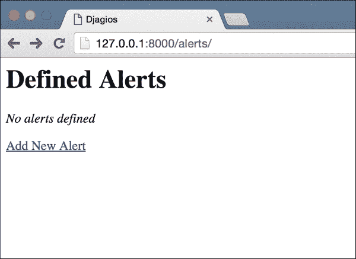

点击**添加新警报**链接，你应该会看到创建警报的表单。填写一些示例数据，然后点击**创建**按钮。如果你的表单没有任何错误，你应该会回到警报列表视图，并且你的屏幕现在应该列出新的警报，如下面的截图所示：

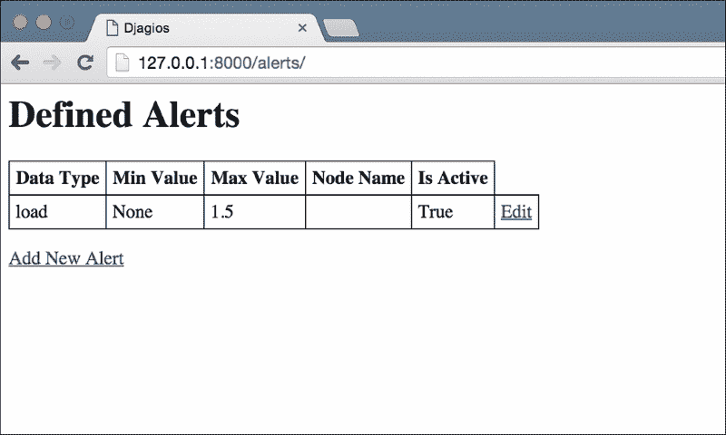

现在剩下的就是允许用户删除他们的警报的选项。为此，创建一个从通用`DeleteView`继承的视图，记得首先从`django.views.generic`中导入`DeleteView`。以下是你应该放入`data_collector/view.py`中的代码：

```py
class DeleteAlertView(DeleteView):
    template_name = 'delete_alert.html'
    model = Alert

    def get_success_url(self):
        return reverse('alerts-list')
```

创建一个新的`data_collector/templates/delete_alert.html`模板：

```py



<h1>Delete alert?</h1>
<p>Are you sure you want to delete this alert?</p>
<form action="" method="post">
    {{ form.as_p }}
    <input type="submit" value="Delete" />
    <a href="">Cancel</a>
</form>

```

接下来，在`djagios/urls.py`中导入`DeleteAlertView`，并添加这个新的模式：

```py
url(r'^alerts/(?P<pk>\d+)/delete/$', DeleteAlertView.as_view(), name='alerts-delete'),
```

最后，让我们从警报列表页面添加一个链接到删除视图。编辑`alerts_list.html`模板，在**编辑**链接后面添加这一行：

```py
<td><a href="">Delete</a></td>
```

现在当你打开警报列表视图时，你应该会看到一个**删除**链接。你的屏幕应该看起来类似于以下截图：

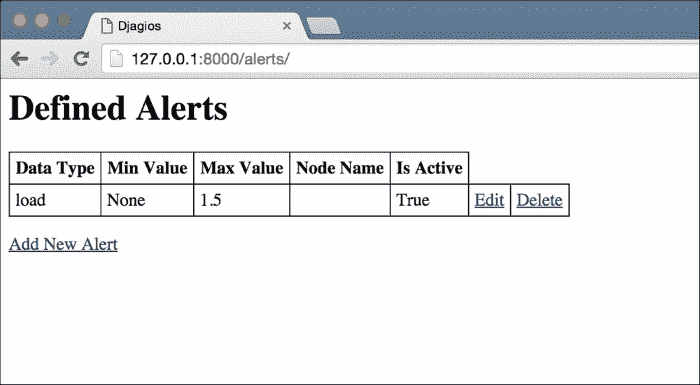

如果你点击**删除**链接，你应该会看到一个确认页面。如果你确认删除，你会发现你的警报将从列表页面消失。这些是我们需要管理警报的所有视图。让我们继续检测警报条件并在状态页面显示它们。

# 在状态页面显示触发的警报

正如我之前所说，我们希望我们的用户在状态页面上看到任何触发警报的节点都被突出显示。假设他们定义了一个警报，当任何节点的磁盘使用率超过`0.85`时触发，而我们对**dbmaster**磁盘使用率的最新数据点的值为`0.9`。当用户访问状态页面时，我们希望显示**dbmaster**节点的磁盘使用情况的行以红色突出显示，以便用户立即意识到警报并能够采取措施纠正这一情况。

将`data_collector/view.py`中的`StatusView`更改为匹配以下代码。更改的部分已经高亮显示：

```py
class StatusView(TemplateView):
    template_name = 'status.html'

    def get_context_data(self, **kwargs):
        ctx = super(StatusView, self).get_context_data(**kwargs)

        alerts = Alert.objects.filter(is_active=True)

        nodes_and_data_types = DataPoint.objects.all().values('node_name', 'data_type').distinct()

        status_data_dict = dict()
        for node_and_data_type_pair in nodes_and_data_types:
            node_name = node_and_data_type_pair['node_name']
            data_type = node_and_data_type_pair['data_type']

            latest_data_point = DataPoint.objects.filter(node_name=node_name, data_type=data_type).latest('datetime')
 latest_data_point.has_alert = self.does_have_alert(latest_data_point, alerts)

            data_point_map = status_data_dict.setdefault(node_name, dict())
            data_point_map[data_type] = latest_data_point

        ctx['status_data_dict'] = status_data_dict

        return ctx

    def does_have_alert(self, data_point, alerts):
 for alert in alerts:
 if alert.node_name and data_point.node_name != alert.node_name:
 continue

 if alert.data_type != data_point.data_type:
 continue

 if alert.min_value is not None and data_point.data_value < alert.min_value:
 return True
 if alert.max_value is not None and data_point.data_value > alert.max_value:
 return True

 return False

```

我们在这里所做的是，对于我们检索到的每个数据点，检查它是否触发了任何警报。我们通过比较每个警报中的最小值和最大值与数据点值来做到这一点，但只有当数据点数据类型和节点名称与警报中的匹配时。如果数据点值超出了警报范围，我们将标记数据点为触发了警报。

这是我在许多项目中经常使用的另一种技术。由于模型只是 Python 对象，你可以在运行时向它们附加额外的信息。不需要在`DataPoint`类上定义`has_alert`。只需在需要时将其添加到对象中。不过要小心。这样做并不是一个好的编程实践，因为试图理解`DataPoint`类的人将不知道`has_alert`属性甚至存在，除非他们查看视图类的代码。由于我们只在视图和模板中使用这个属性，对我们来说是可以的。但是，如果我们传递`DataPoint`对象并且更多的代码开始使用这个属性，最好还是在类本身上定义它，这样查看类代码的人就会知道它的存在。

我们还需要修改`status.html`模板，以利用我们已经添加到数据点的`has_alert`属性。将其更改为以下代码。与之前一样，修改的部分已经被突出显示：

```py





<h1>Status</h1>

<table>
    <tbody>
        <tr>
            <th>Node Name</th>
            <th>Metric</th>
            <th>Value</th>
            <th>Last Updated</th>
        </tr>

        
            
            <tr class="has-alert">
                <td>{{ node_name }}</td>
                <td>{{ data_type }}</td>
                <td>{{ data_point.data_value }}</td>
                <td>{{ data_point.datetime|naturaltime }}</td>
            </tr>
            
        
    </tbody>
</table>

<style type="text/css" media="all">
 tr.has-alert td:not(:first-child) {
 color: red;
 }
</style>

```

就是这样。为了测试它，你需要创建一些在你的数据库中由`DataPoints`触发的`Alert`对象。对于我使用的示例数据，我创建了一个数据类型为**disk_usage**，最大值为 0.5 的`Alert`对象。创建警报后，我的状态屏幕突出显示了触发警报的节点。你的屏幕会显示类似的内容：

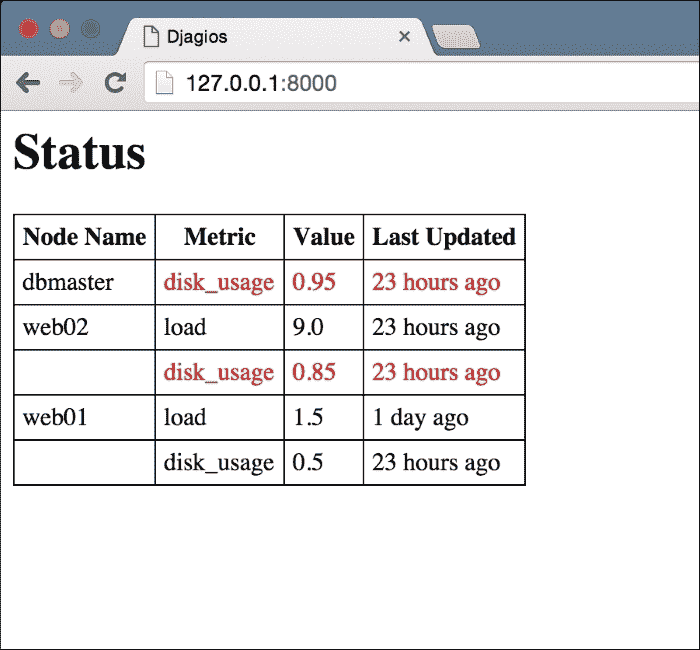

为了测试我们的突出显示代码是否正确工作，我添加了另一个**dbmaster**磁盘使用率指标的数据点，使用以下命令：

```py
> python manage.py sample_data dbmaster disk_usage 0.2

```

刷新状态页面后，**dbmaster**节点的警报条件消失了。你应该进行类似的测试来亲自看看。

就是这样！虽然很辛苦，但我们的监控工具现在开始成形了。我们有一个显示最新节点状态的状态页面，突出显示任何有警报的节点。一旦警报条件解决，突出显示就会消失。我们也有一个页面来管理我们的警报。总的来说，我们可以说应用程序的用户界面部分几乎已经完成了。一个相当有帮助的东西是一个导航栏。在`templates/base.html`的`body`标签开始后添加这个：

```py
<ul>
    <li><a href="">Home</a></li>
    <li><a href="">Alerts</a></li>
</ul>
```

刷新状态页面，你应该会看到页面顶部有一个简单的导航菜单。

# 接受来自远程系统的数据

现在用户可以看到他们基础设施的状态并管理警报了，是时候继续下一步了：从真实来源获取数据，而不是使用 Django 管理命令输入示例数据。

为此，我们将创建一个接受来自远程系统的 API 端点。API 端点只是一个不需要渲染模板的 Django 视图的花哨名称。API 端点的响应通常要么只是一个 200 OK 状态，要么是一个 JSON 响应。API 端点不是为人类用户使用的。相反，它们是为不同的软件系统连接在一起并共享信息而设计的。

我们需要创建的 API 端点将是一个简单的视图，接受一个带有创建新`DataPoint`对象所需信息的 POST 请求。为了确保恶意用户不能用随机数据垃圾邮件式地填充我们的数据库，我们还将在 API 端点中添加一个简单的身份验证机制，以便它只接受来自授权来源的数据。

要创建一个 API 端点，我们将使用`django.view.generic.View`类，只实现 POST 处理程序。为了解析请求数据，我们将动态创建一个模型表单。编辑`data_collector/views.py`并添加以下代码：

```py
from django.forms.models import modelform_factory
from django.http.response import HttpResponse
from django.http.response import HttpResponseBadRequest
from django.http.response import HttpResponseForbidden
from django.views.generic import View

class RecordDataApiView(View):
    def post(self, request, *args, **kwargs):
        # Check if the secret key matches
        if request.META.get('HTTP_AUTH_SECRET') != 'supersecretkey':
            return HttpResponseForbidden('Auth key incorrect')

        form_class = modelform_factory(DataPoint, fields=['node_name', 'data_type', 'data_value'])
        form = form_class(request.POST)
        if form.is_valid():
            form.save()
            return HttpResponse()
        else:
            return HttpResponseBadRequest()
```

这里有一些新的东西需要我们注意。首先，我们使用了请求对象的`META`属性来访问请求。如果您了解 HTTP 协议的工作原理，您应该熟悉头部。如果不了解，可以在[`www.jmarshall.com/easy/http/`](https://www.jmarshall.com/easy/http/)找到一个很好的解释。详细解释头部超出了本书的范围，但简单地说，头部是客户端在 HTTP 请求中添加的额外信息。在下一节中，当我们测试 API 视图时，我们将看到如何添加它们。

Django 会自动规范化所有头部名称并将它们添加到`META`字典中。在这里，我们使用自定义头部**Auth-Secret**来确保只有拥有我们秘钥的客户端才能使用这个视图。

### 注意

有关 META 字典中的内容以及其构造方式的更多信息，请参阅 Django 文档[`docs.djangoproject.com/en/stable/ref/request-response/#django.http.HttpRequest.META`](https://docs.djangoproject.com/en/stable/ref/request-response/#django.http.HttpRequest.META)。

接下来，我们需要看的是`modelform_factory`函数。这是 Django 提供的一个很好的小函数，它返回给定模型的`ModelForm`子类。您可以使用此函数的参数对模型表单进行一定程度的自定义。在这里，我们限制了可以编辑的字段数量。为什么首先使用模型表单呢？

我们从 API 端点中想要的是创建新的`DataPoint`模型的方法。模型表单正好提供了我们需要做到这一点的功能，而且它们还为我们处理了数据验证。我们本可以在`forms.py`文件中创建一个单独的模型表单类，然后像以前一样在视图中使用它，但我们没有这样做的两个原因。

首先，这是我们的代码中唯一使用模型表单的地方，用于`DataPoint`方法。如果我们需要在其他地方也使用它，那么在单个地方定义模型表单将是最佳的编程实践。然而，由于我们不需要，在需要时动态定义模型表单就可以了。

其次，我们不需要对模型表单类进行任何自定义。如果我们想要，比如，像之前所做的那样覆盖`save`方法，我们将被迫定义类而不是使用`modelform_factory`方法。

获取模型表单类之后，我们可以像使用任何模型表单类一样使用它，要么创建新的数据点，要么返回指示数据验证失败的响应。要使我们的新端点通过 URL 可用，请在`djagios/urls.py`中导入以下内容：

```py
from django.views.decorators.csrf import csrf_exempt
from data_collector.views import RecordDataApiView
```

然后，添加此 URL 模式：

```py
url(r'^record/$', csrf_exempt(RecordDataApiView.as_view()), name='record-data'),
```

使用`csrf_exempt`装饰器是因为默认情况下，Django 对 POST 请求使用 CSRF 保护。然而，这通常用于 Web 表单，而不是 API 端点。因此，我们必须禁用它，否则 Django 不会允许我们的 POST 请求成功。现在，让我们看看如何测试我们的新视图。

### 提示

您可以在[`docs.djangoproject.com/en/stable/ref/csrf/`](https://docs.djangoproject.com/en/stable/ref/csrf/)获取有关 Django 提供的 CSRF 保护的更多信息。

## 测试 API 端点

您不能简单地在浏览器中测试此 API 端点，因为它是一个 POST 请求，而且没有模板可以在浏览器中呈现一个表单。但是，有很多很好的工具可用于进行手动的 POST 请求。我建议您使用的是 Postman。它是一个 Google Chrome 应用，因此您不需要安装任何依赖项。只要您的计算机上安装了 Google Chrome，您就可以从[`www.getpostman.com/`](https://www.getpostman.com/)获取 Postman。安装后，启动它，您应该看到一个类似以下屏幕的界面。如果您的 Postman 界面不完全相同，不要担心。可能是您下载的版本更新了。Postman 的主要部分应该是相同的。

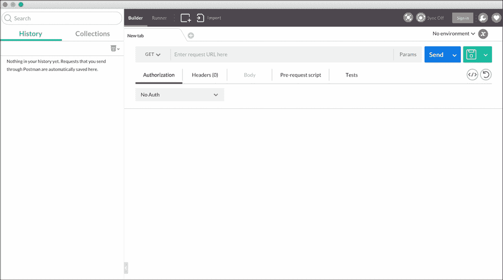

使用 Postman 很简单。我将逐步为您讲解整个过程，包括每个步骤的图像，以便清楚地说明我的意思。在这个过程结束时，我们应该能够使用我们的 API 端点生成一个新的数据点。

顺便说一句，如果您使用的是 Linux 或 Unix 操作系统，如 Ubuntu 或 Mac OS X，并且更习惯使用命令行，您可以使用`curl`实用程序来进行 POST 请求。对于更简单的请求，它通常更快。要使用`curl`进行与我在 Postman 中演示的相同请求，请在命令提示符上键入以下内容：

```py
> c
url http://127.0.0.1:8000/record/ -H 'Auth-Secret: supersecretkey' -d node_name=web01 -d data_type=disk_usage -d data_value=0.2

```

要使用 Postman 进行此请求，请执行以下步骤：

1.  选择请求类型。我们要进行 POST 请求，因此从下拉菜单中选择 POST：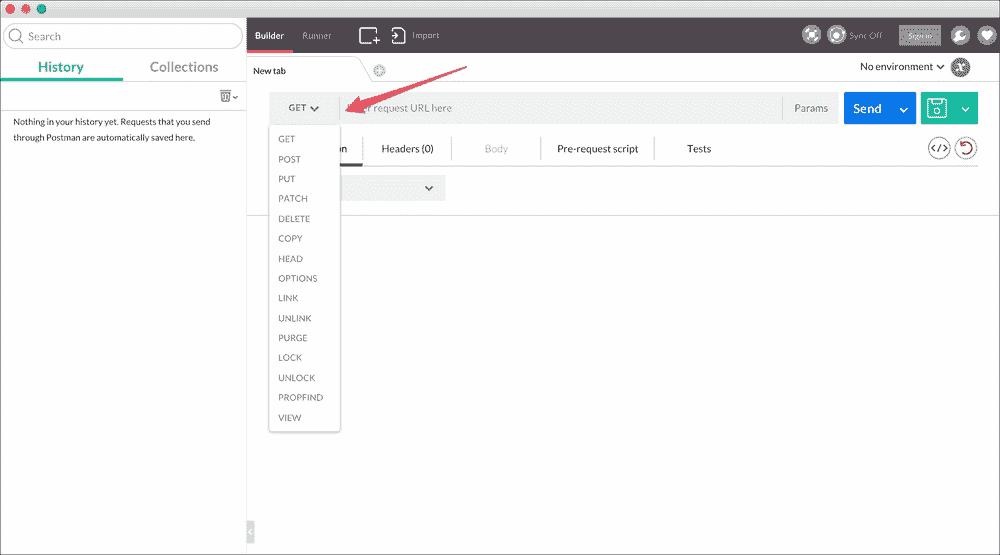

1.  输入您要发出请求的 URL。在我们的情况下，它是`http://127.0.0.1:8000/record/`：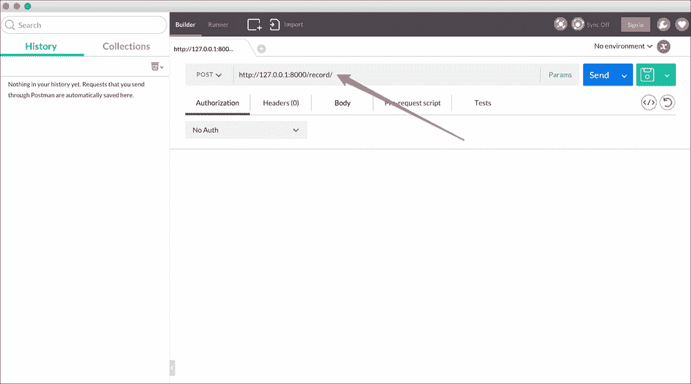

1.  添加我们的自定义身份验证标头。打开**标头**选项卡，并添加值为**supersecretkey**的**Auth-Secret**标头：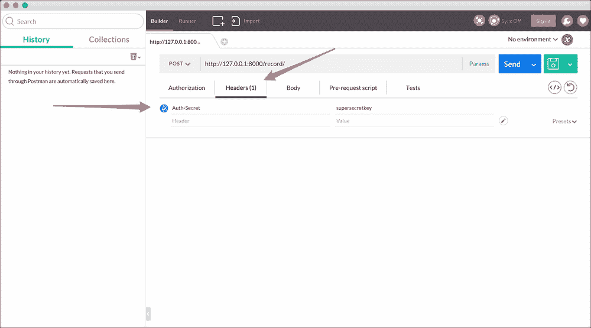

1.  最后，将我们的 POST 参数添加到**Body**部分。我使用的示例数据如下：

+   node_name: `web01`

+   data_type: `disk_usage`

+   data_value: `0.72`

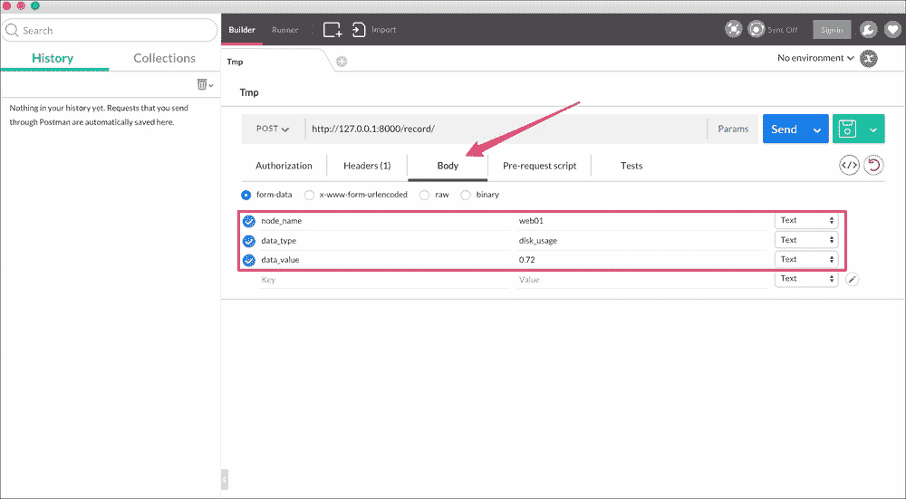

就是这样。我们的请求现在已经设置好了。单击 URL 文本框旁边的**发送**按钮，您应该在参数体下方看到一个空的响应。要确认请求是否正常工作，请查看响应的状态代码。它应该是**200 OK**：

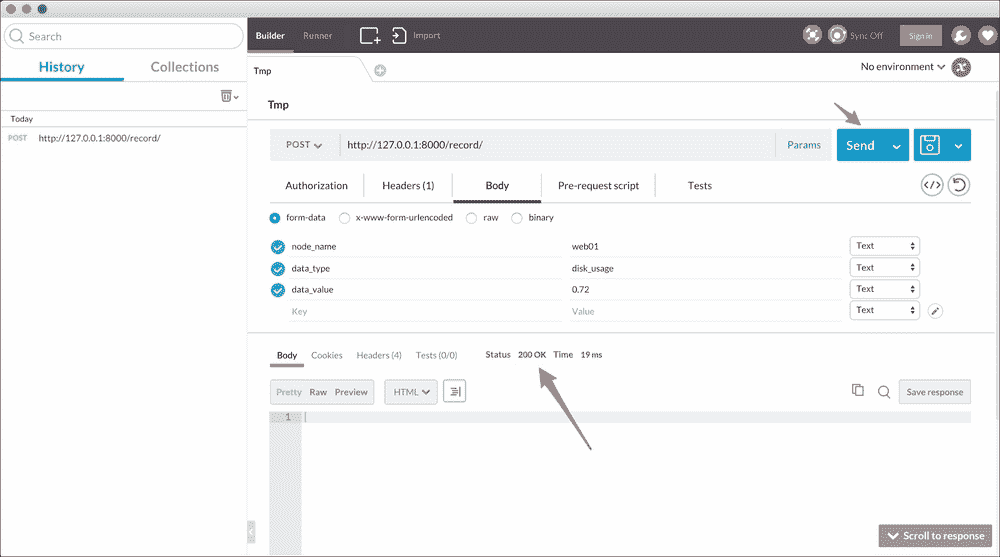

打开我们应用程序的状态页面`http://127.0.0.1:8000/`，您应该看到最新的数据点值显示在那里。就是这样，我们完成了！

### 注意

正如本节开头所解释的那样，您还可以使用诸如`curl`之类的命令行工具来上传数据到 API。使用这样的工具，您可以编写 shell 脚本，自动从计算机系统更新 Web 应用程序的真实数据。这也是 Nagios 和许多数据监控工具的运行方式。服务器有 API 端点来监听数据，然后简单的脚本从客户节点收集并上传数据到服务器。

# 摘要

这是一个相当苛刻的章节，你学到了很多新信息。

首先，我们看了 Django 管理命令。它们是 Django 的一个重要特性。您运行的所有 Django 命令，例如`python manage.py startapp`，也是管理命令，因此您应该已经知道它们可以有多么强大。在更大的项目中，您几乎总是有一些管理命令来自动化您的任务。

我们还看了 Django 如何使用我们模型类上的`__str__`方法创建模型的字符串表示。它不仅在控制台打印时使用。每当您尝试将模型对象用作字符串时，甚至在模板中，Django 都会使用这个表示，因此拥有一个可以立即为您提供有关对象的所有重要信息的良好格式非常重要。

本章还介绍了高级查询方法，特别是`distinct`和`values`方法，允许您发出更复杂的 SQL 查询，以从数据库中获取您想要的数据格式。然而，这只是个开始。在以后的章节中，我们可能需要使用更复杂的查询方法。您可能需要查看 Django 文档中关于`queryset`方法的更多信息，网址为[`docs.djangoproject.com/en/stable/ref/models/querysets/`](https://docs.djangoproject.com/en/stable/ref/models/querysets/)。

除了以我们想要的格式从数据库中获取数据之外，我们还研究了如何准备一个相当复杂的数据结构，以便将所有必需的信息传递给模板，然后看到如何在我们的模板中使用该数据结构。

通常，您需要确保通过复杂的数据验证规则才能将数据保存到数据库。在本章中，我们看到了如何通过覆盖模型类的`save`方法来实现这一点。

最后，您学会了如何创建简单的 API 端点以及如何使用`curl`或 Postman 对其进行测试。总的来说，这是一个介绍了许多新概念的重要章节，这些概念将在以后的章节中使用。
