# 第四章：汽车租赁应用程序

对于本章，我们的假想客户是一家汽车租赁公司。他们希望我们创建一个网站，供他们的客户访问，查看可用的汽车库存，并最终预订其中一辆汽车。客户还希望有一个管理面板，他们可以在其中管理库存和预订请求。

我们将在（鼓声）Django 中创建这个 Web 应用程序！您现在应该对 Django 有足够的信心，以至于 Web 应用程序的前端对我们来说不是挑战。本章的重点将放在定制 Django 内置的**admin**应用程序上，以满足我们客户的要求。大多数情况下，当您需要为创建的 Web 应用程序创建管理面板时，您可以通过定制 Django admin 来做几乎您需要的一切。有时候，要求足够复杂，您需要创建一个自定义管理面板，但这很少见。因此，我们在这里获得的知识将对您的 Web 开发职业非常有用。

本章的主要要点如下：

+   定制 Django admin 模型表单

+   向管理对象列表页面添加自定义过滤器

+   覆盖和定制 Django admin 模板

# 代码包

正如我所提到的，到目前为止，您应该已经牢牢掌握了创建基本 Web 应用程序的组件，包括视图、模板、模型和 URL 配置，因此我们在本章不会讨论 Web 应用程序的这些部分。因此，本章的代码包比以前的要大得多。我已经创建了所有的模型和一些视图、模板和 URL。我们将主要关注如何驯服 Django admin 应用程序以满足我们的需求。

我想不出一个花哨的名字来为这个项目命名，所以我只是把项目称为*carrental*。像往常一样，创建一个新的虚拟环境，在这个环境中安装 Django，并运行迁移命令来初始化数据库。对于这个项目，我们需要安装另一个 Python 包，Pillow，这是一个用于 Python 的图像处理库。要安装它，请在虚拟环境激活时运行以下命令：

```py
> pip install Pillow

```

这可能需要一两分钟，因为可能需要进行一些编译。安装 Pillow 要复杂一些，因为它依赖于第三方库。如果安装命令对您失败了，请查看[`pillow.readthedocs.org/en/3.0.x/installation.html`](https://pillow.readthedocs.org/en/3.0.x/installation.html)上有关安装 Pillow 的文档。该页面有每个操作系统的逐步指南，按照那里的指南，您应该能够轻松安装 Pillow。只需记住，您需要该库来运行和处理汽车租赁应用程序。

安装了 Pillow 后，使用`runserver`命令运行开发服务器，并在`http://127.0.0.1:8000`上打开 Web 应用程序。您应该会看到以下页面：

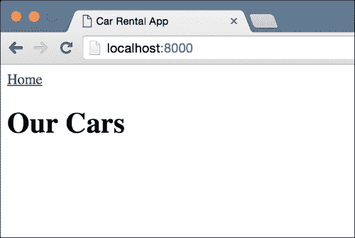

# 固定装置

我们的数据库是空的，但现在我们没有任何视图来向我们的数据库添加对象。我们可以像上一章那样创建一个管理命令，但有一个更简单的方法。我已经向数据库添加了三个`Car`对象，然后创建了这些数据的转储，您可以加载。这样的数据转储称为固定装置。我们将稍后讨论固定装置；现在让我们看看如何使用它们来加载我们的数据库中的数据。

在命令行上，在虚拟环境激活的情况下，在项目根目录中运行此命令：

```py
> python manage.py loaddata frontend/fixtures/initial.json
Installed 3 object(s) from 1 fixture(s)

```

刷新网页，现在您应该看到一个类似于这样的网页：

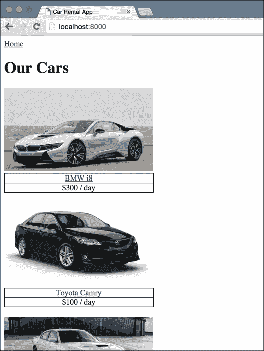

现在我们的数据库中有三辆汽车。您应该玩一会儿这个应用程序。它为每辆汽车都有一个详细页面，并允许您从详细页面提交预订请求。

### 注意

如果您尝试使用预订表单，请注意开始和结束日期需要采用 YYYY-MM-DD 格式。例如，2016-12-22 是表单接受的有效日期格式。

要了解更多关于固定装置的信息，请查看 Django 文档[`docs.djangoproject.com/en/stable/howto/initial-data/`](https://docs.djangoproject.com/en/stable/howto/initial-data/)。固定装置是 Django 的一个功能，它允许你使用多种格式将数据库中的数据转储到简单的文本文件中。最常用的格式是 JSON。一旦你有了一个固定装置文件，你就可以使用它来填充你的数据库，就像我们在这里使用`loaddata`命令一样。

在我们继续进行管理定制之前，我想谈谈我在这个应用程序的模型中使用的一些新东西。你应该看一下`frontend/models.py`，看看我们的模型是如何配置的，然后阅读下面的信息，解释了这些新概念。

# 图片和文件字段

我想花一分钟介绍一下`ImageField`模型字段。这是我们第一次看到它，使用它与其他模型字段有些不同。这是我们使用这个字段的`Car`模型：

```py
class Car(models.Model):
    name = models.CharField(max_length=100)
    image = models.ImageField(upload_to='car_images')
    description = models.TextField()
    daily_rent = models.IntegerField()

    is_available = models.BooleanField()

    def get_absolute_url(self):
        return reverse('car-details', kwargs={'pk': self.pk})
```

### 注意

这一部分关于`ImageField`的所有信息也适用于`FileField`。

`ImageField`与我们查看过的所有其他数据库模型字段都有一些特殊之处。首先，它需要 Pillow 图像处理库才能工作，这就是为什么我们在本章的开头安装它的原因。如果我们在没有安装 Pillow 的情况下尝试运行我们的应用程序，Django 会抱怨并且不会启动开发服务器。

其次，`ImageField`是少数几个依赖于在使用之前进行一些设置的 Django 数据库模型字段之一。如果你看一下`carrental/settings.py`文件的末尾，你会看到我已经设置了`MEDIA_ROOT`和`MEDIA_URL`变量。

最后，你可以看到我们传递了一个`upload_to`参数给`ImageField`并将其设置为`car_images`。`FileField`和`ImageField`数据库模型字段都需要这个参数。这个参数是相对于配置的`MEDIA_ROOT`的文件夹名称，任何通过 Image/File 字段上传到你的应用程序的文件都将被保存在这里。这是一个我花了一些时间才弄明白的概念，所以我会进一步解释一下。

你应该看到我已经将`MEDIA_ROOT`设置为项目根目录中的`media`文件夹。如果你看一下`media`文件夹，你应该会看到另一个名为`car_images`的文件夹。这与我们传递给`upload_to`参数的名称相同。这就是我说`upload_to`参数是相对于配置的媒体根目录的文件夹名称时的意思。

### 提示

当我开始使用 Django 时，我有一些困难理解`MEDIA_ROOT`和`STATIC_ROOT`之间的区别。简而言之，`MEDIA_ROOT`是站点用户上传的所有文件所在的位置。这些文件是使用表单和 Image/File 字段上传的。

`STATIC_ROOT`是你放置与你的 Web 应用程序相关的静态文件的位置。这些包括 CSS 文件、JavaScript 文件和任何其他作为静态文件提供的文件。这与你的 Web 应用程序的 Django 部分无关；这些文件是原样提供给用户的，通常通过诸如 nginx 之类的 Web 服务器。

现在你已经配置好了一切，那么如何使用`ImageField`上传文件呢？嗯，Django 支持几种不同的方法来做这个。在我们的代码中，我们将使用`ModelForm`，它会为我们处理所有的细节。还有其他方法。如果你想了解更多细节，你应该查看处理文件上传的 Django 文档。它非常全面，列出了处理文件上传的所有不同方式。你可以在[`docs.djangoproject.com/en/stable/topics/http/file-uploads/`](https://docs.djangoproject.com/en/stable/topics/http/file-uploads/)上查看。

# 获取绝对 URL

我们在`Car`模型中第一次看到的另一件事是`get_absolute_url`。实现上没有什么特别之处。它只是一个返回 URL 的类方法，它使用`reverse`函数和对象的主键构建 URL。这并不是什么新鲜事。自第一章以来，我们一直在为详细页面创建这样的 URL。这里有趣的是 Django 对模型类上的`get_absolute_url`方法赋予了特殊意义。Django 有许多地方会自动使用`get_absolute_url`方法的返回值，如果该方法存在于模型对象上。例如，`CreateView`通用方法会使用它。如果您没有在视图类上提供`success_url`属性和自定义的`get_success_url`方法，Django 将尝试从新创建的对象上的`get_absolute_url`方法获取重定向的 URL，如果该方法在模型类中定义了。

Django 还在管理员应用程序中使用此方法，我们稍后会看到。如果您感兴趣，可以查看其文档：

[`docs.djangoproject.com/en/stable/ref/models/instances/#get-absolute-url/`](https://docs.djangoproject.com/en/stable/ref/models/instances/#get-absolute-url/)。

# Django 管理员应用程序

现在我们已经看了代码包中使用的新功能，让我们继续讨论本章的主题——Django**管理员**应用程序。管理员应用程序很可能是 Django 比其他类似的 Web 框架更受欢迎的主要原因之一。它体现了 Django“电池包含”的本质。通过最小的配置，管理员应用程序提供了一个功能齐全且非常定制的 CMS，足以与 WordPress 和 Drupal 等大型名称媲美。

在本章中，您将学习如何轻松配置和自定义管理员，以获得您在 Web 应用程序的管理员面板中所需的大部分功能。让我们首先解决我们虚构客户的最紧迫问题，即汽车租赁业主的能力来添加和编辑汽车详情。

当您启动一个新应用程序时，Django 默认会在应用程序文件夹中创建一个`admin.py`文件。更改我们项目中的`frontend/admin.py`文件以匹配此内容：

```py
from django.contrib import admin
from frontend.models import Car
admin.site.register(Car)
```

就是这样。真的！总共只有三行代码，您就可以编辑和添加`Car`对象到您的数据库中。这就是 Django 的强大之处，就在这三行代码中。让我们来测试一下。在浏览器中，访问`http://127.0.0.1:8000/admin`，您应该会看到类似以下页面：

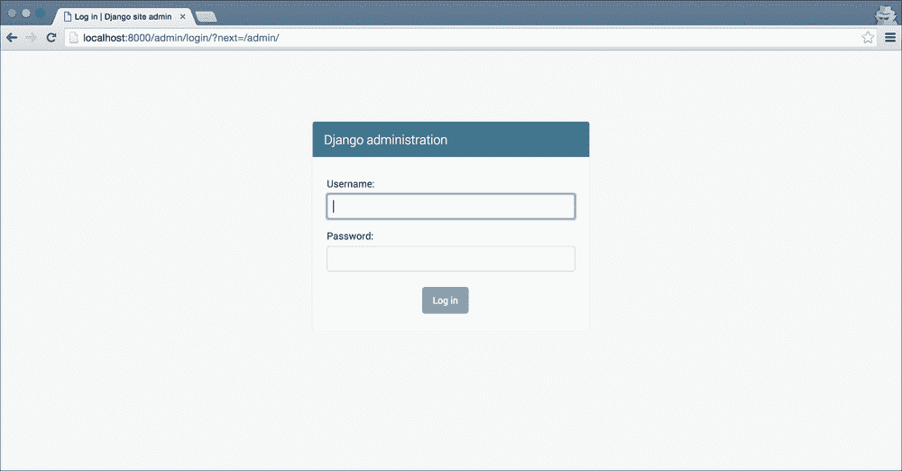

### 提示

如果您的管理员看起来略有不同，不要担心。Django 偶尔会更新管理员的主题，取决于您使用的 Django 版本，您的管理员可能看起来略有不同。但是，所有功能都会在那里，几乎总是具有相同的界面布局。

哎呀，有一件事我们忘了。我们没有创建一个可以登录的用户。这很容易解决。在命令行中，激活虚拟环境后运行以下命令：

```py
> python manage.py createsuperuser

```

跟着提示创建一个新用户。创建用户后，使用该用户登录到管理员。登录后，您应该会看到类似于以下内容：

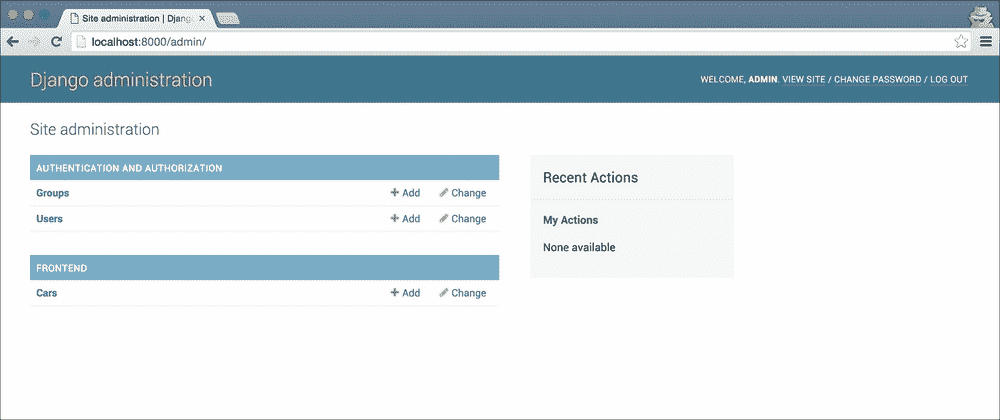

在这个屏幕上需要注意的几件事。首先，Django 默认会添加链接来管理**组**和**用户**。其次，我们配置在管理员中显示的任何模型都会按其应用程序名称进行分组。因此，管理**Cars**的链接显示在定义模型的应用程序标签**Frontend**下。

### 提示

如果您仔细观察，您可能会注意到管理员列出了我们`Car`模型的复数名称。它是如何知道复数名称的呢？嗯，它只是在我们模型名称的前面添加了一个's'。在很多情况下，这并不适用，例如，如果我们有一个名为`Bus`的模型。对于这种情况，Django 允许我们配置模型的复数名称。

让我们尝试编辑我们数据库中的一辆汽车。单击**Cars**链接，您应该会看到类似以下的屏幕：

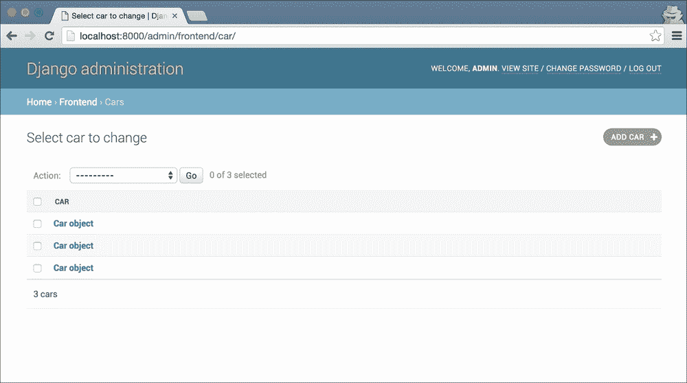

列表看起来并不是很有用。我们不知道哪个汽车对象是哪个。我们稍后会解决这个问题。现在，只需单击列表中的顶部汽车对象，您应该会看到一个页面，您可以在该页面上编辑该对象的详细信息：

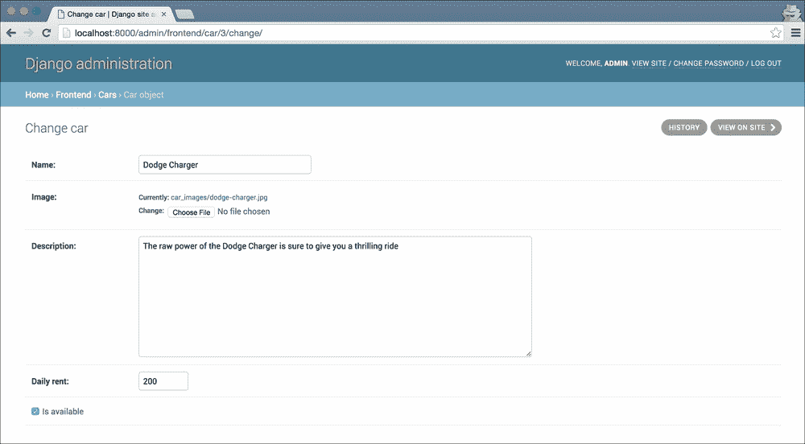

### 注意

Django 管理员文档将此列表称为更改列表。在本章中，我将称其为列表视图。

让我们更改汽车的名称。我将**Dodge Charger**更改为**My New Car Name**。更改名称后，滚动到页面底部，然后单击保存。为了确保我们的更改确实已保存，打开我们应用程序的主页`http://127.0.0.1:8000/`，您会看到您编辑的汽车将显示新名称。

让我们尝试更复杂的事情——添加一辆新汽车！单击屏幕右侧的**ADD CAR**按钮，然后根据需要填写详细信息。只需确保选择`is_available`复选框；否则，新汽车将不会显示在主页上。我填写了如下截图所示的表单：

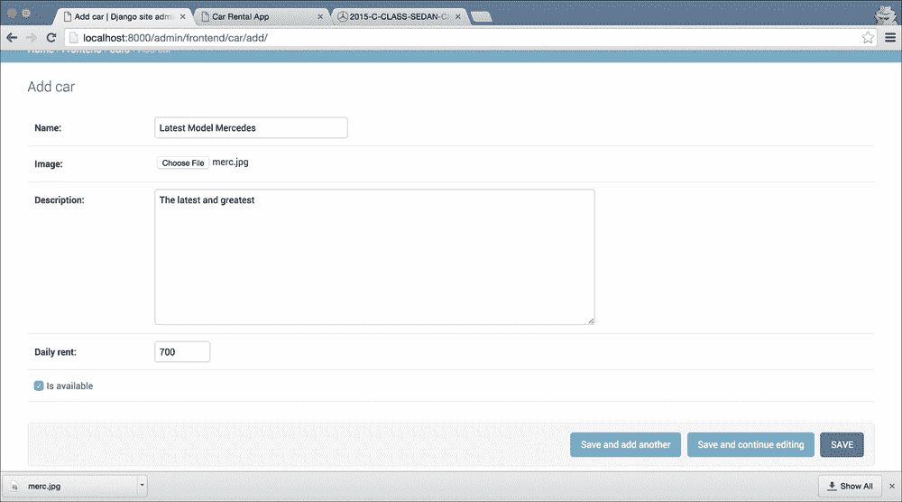

我还从 Google Images 下载了一辆汽车的图片，并将其选中为**Image**字段。单击保存按钮，然后再次访问主页。您添加的新汽车应该会显示在列表的末尾：

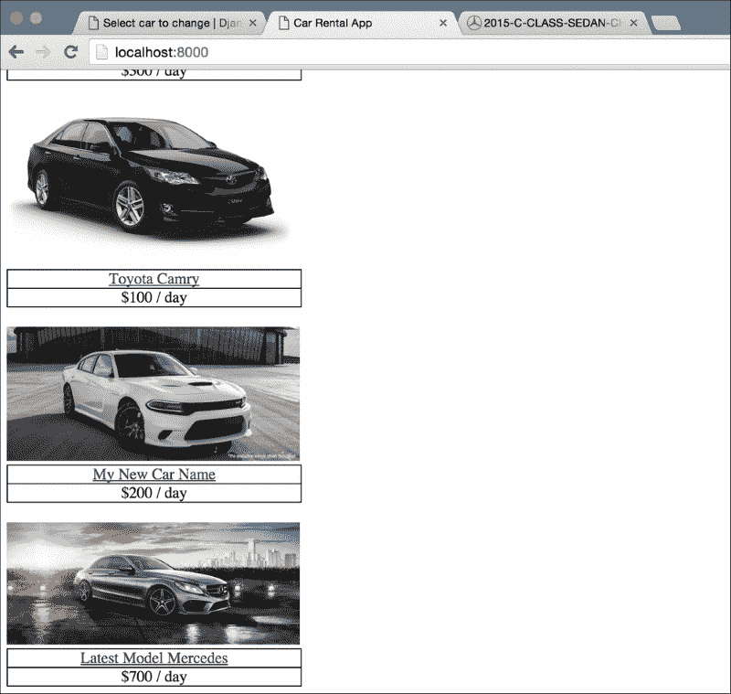

正如我在本节开始时提到的，Django 管理员的强大是 Django 流行的主要原因之一。到目前为止，您应该明白为什么了。在三行代码中，我们有了一个完整且可用的内容管理系统，尽管不太美观，但客户可以用它来编辑和添加汽车到他们的网站。

然而，在其当前形式下，管理员看起来像是一个快速的黑客工作。客户可能不会对此感到满意。他们甚至在打开编辑页面之前都看不到他们即将编辑的汽车是哪辆。让我们首先解决这个问题。稍后我们会回到刚刚为管理员编写的代码。

# 显示汽车名称

在上一章中，我们看到了模型类上的`__str__`方法。我还说过，Django 在需要显示模型的字符串表示时会使用这个方法。嗯，这正是 Django 管理员在`Car`模型的列表视图中所做的：它显示了它的字符串表示。让我们通过将字符串表示更改为用户可以理解的内容来使列表更加用户友好。在`frontend/models.py`文件中，向`Car`模型类添加这个`__str__`方法：

```py
def __str__(self):
    return self.name
```

让我们看看现在`Car`对象的列表是什么样子的：

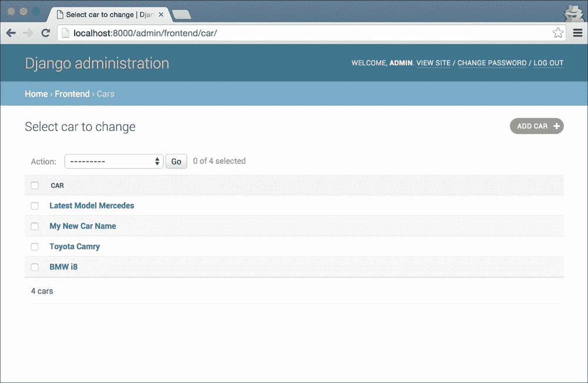

这是一个更好的用户体验，因为用户现在可以看到他们即将编辑的汽车是哪一辆。

# 预订管理

让我们暂时保持汽车管理员部分不变，转而进入`Booking`模型的管理员。每当网站访问者通过汽车详情页面上的**立即预订**表单提交时，我们都会创建一个新的`Booking`模型记录。我们需要一种方法来允许客户查看这些预订询问，根据一些标准对其进行筛选，并接受或拒绝它们。让我们看看如何做到这一点。首先，让我们确保我们的`Booking`模型显示为管理员面板中的一个项目。为此，请在`frontend/admin.py`文件中添加以下两行：

```py
from frontend.models import Booking
admin.site.register(Booking)
```

如果你现在查看 URL 为`http://127.0.0.1:8000/admin/`的管理员面板，你应该会看到`Booking`模型已经被添加为一个链接。打开链接，你应该会看到一个类似于我们之前看到的`Car`模型的列表页面。如果你提交了任何预订请求，它们应该会显示在列表中。这不够美观，但至少它能用。让我们把它做得更好。首先，我们需要给管理员更多关于每个预订询问的信息。如果我们能显示客户的姓名、预订开始和结束日期，以及预订是否已经被批准，那就太好了。

虽然我们可以再次使用`__str__`方法来创建一个包含所有这些信息的字符串，但是在一个列中显示这么多信息并不美观。此外，我们将错过 Django 管理员为每个模型列表页面提供的排序功能。

让我们看看如何在列表视图中显示我们模型的多个字段。在此过程中，你还将更多地了解管理员内部是如何工作的。

## 幕后一瞥

如果你花一分钟思考一下，我们只用几行代码就能实现的成就，你可能会对 Django 管理员的强大感到惊讶。这种力量是如何实现的呢？嗯，这个问题的答案非常复杂。即使我自己还没有完全理解管理员应用是如何工作的。这是一个非常复杂的编程部分。

### 注意

尽管管理员应用非常复杂，但它仍然是 Python 代码。如果你感到有冒险精神，或者只是某一天感到无聊，试着查看管理员应用的源代码。它在`VIRTUAL_ENV/lib/python3.5/site-packages/django/contrib/admin`文件夹中。用你为项目创建的虚拟环境的文件夹替换`VIRTUAL_ENV`。

管理员系统的主要组件之一是`ModelAdmin`类。就像`models.Model`类允许我们使用非常简单的类定义来定义复杂的数据库模型一样，`ModelAdmin`类允许我们非常详细地定制模型的管理员界面。让我们看看如何使用它来向我们的预订询问列表添加额外的字段。修改`frontend/admin.py`文件以匹配以下内容：

```py
from django.contrib import admin

from frontend.models import Car
from frontend.models import Booking

class BookingModelAdmin(admin.ModelAdmin):
    list_display = ['customer_name', 'booking_start_date', 'booking_end_date', 'is_approved']

admin.site.register(Car)
admin.site.register(Booking, BookingModelAdmin)
```

现在，如果你打开`Booking`模型的管理员列表页面，你应该会看到类似于这样的东西，所有重要的字段都显示出来：

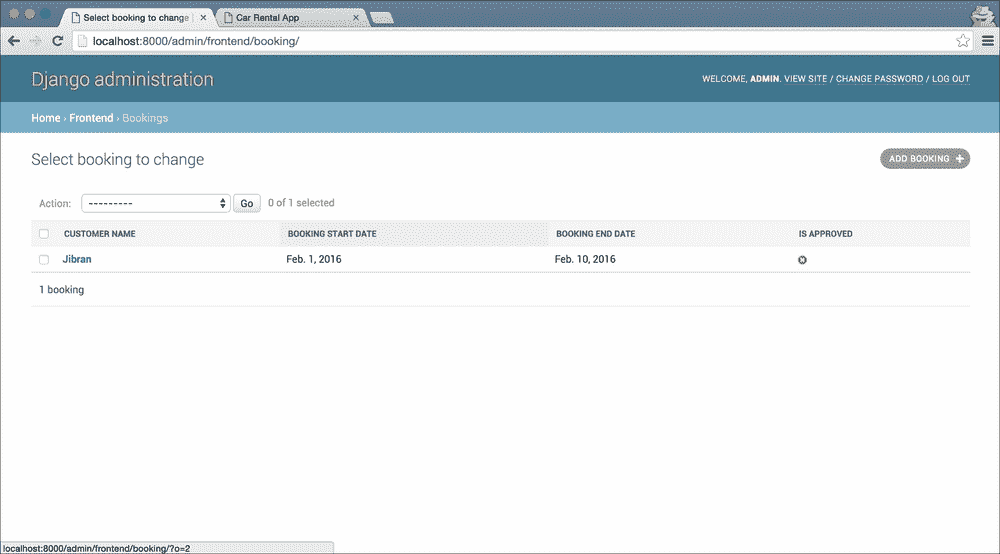

这为用户提供了一个非常好的表格视图。客户现在可以看到所有相关的细节，并且可以根据自己的需求对表格进行排序。Django 还很贴心地以一种好看的格式显示日期值。让我们看看我们在这里做了什么。

我们首先创建了一个名为`BookingModelAdmin`的`ModelAdmin`子类。然后，我们使用`list_display`属性配置我们想在列表页面显示的字段。最后，我们需要将我们的`ModelAdmin`类与`Booking`模型类关联起来，以便管理员可以根据我们的要求自定义自己。我们使用以下方法来做到这一点：

```py
admin.site.register(Booking, BookingModelAdmin)
```

如果你看一下我们如何注册`Car`模型，它看起来与`Booking`模型类似：

```py
admin.site.register(Car)
```

这是因为它是同样的东西。如果你没有提供自定义的`ModelAdmin`子类，Django 会使用默认选项，这就是我们在`Car`模型中看到的。

# 改善用户体验

虽然我们通过在列表页面上显示相关字段来改进了基本的管理员界面，但我们可以做得更多。让我们看看管理员可能想要为网站收到的预订询问采取的一些操作：

+   只查看已批准的预订询问或尚未批准的预订询问

+   通过客户姓名搜索预订

+   快速批准或不批准预订询问

+   选择多个预订询问对象，并向客户发送关于他们批准/不批准的电子邮件

## 过滤对象

对于我们的第一个功能，我们希望允许用户对显示的对象进行筛选。页面上应该有一个筛选器，允许他们只查看已批准或未批准的预订。为此，Django 管理在`ModelAdmin`子类上提供了`list_filter`属性。`list_filter`属性包含一个可以进行筛选的字段列表。在我们的`BookingModelAdmin`类中，添加以下`list_filter`属性：

```py
list_filter = ['is_approved']
```

就是这样。一旦您将这行添加到`BookingModelAdmin`中，打开预订列表页面；在右侧，您应该看到一个新的侧边栏，您可以选择要查看的预订——只有已批准的或未批准的，或两者都有。它应该看起来类似于以下的屏幕截图：

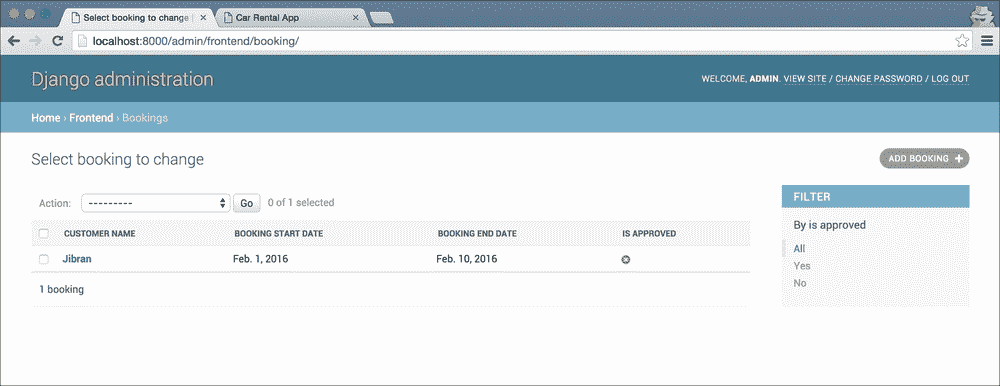

## 搜索对象

就像 Django 管理内置了对过滤器的支持一样，它还提供了一种易于使用的添加搜索的方法。我们希望客户能够通过客户名称字段搜索预订。为此，请将`search_fields`属性添加到`BookingModelAdmin`类中：

```py
search_fields = ['customer_name']
```

就是这样。一旦您添加了这个属性，您应该在预订对象列表的顶部看到一个搜索框。输入一些示例查询，看看它是如何工作的。如果您有多个要进行搜索的字段，也可以将其添加到`search_fields`列表中。

如果列表中有多个字段名称，Django 将进行 OR 搜索。这只是意味着对于给定的搜索，具有至少一个匹配字段值的所有记录都将显示。

## 快速编辑

我们列表中的第三个功能是允许管理员快速标记预订为批准/未批准。Django 管理提供了另一个内置功能，我们可以配置以获得我们需要的功能。在您的`BookingModelAdmin`类中，添加`list_editable`属性：

```py
list_editable = ['is_approved']
```

如果您现在打开预订列表页面，您会注意到在以前的`is_approved`列中显示的图标已经被替换为复选框和**保存**按钮添加到列表的末尾。您可以选择要批准的预订的复选框，并取消选择要不批准的预订，并单击**保存**。然后 Django 将一次保存您对多个对象的更改。

到目前为止，我们的预订列表页面看起来类似于以下的屏幕截图：

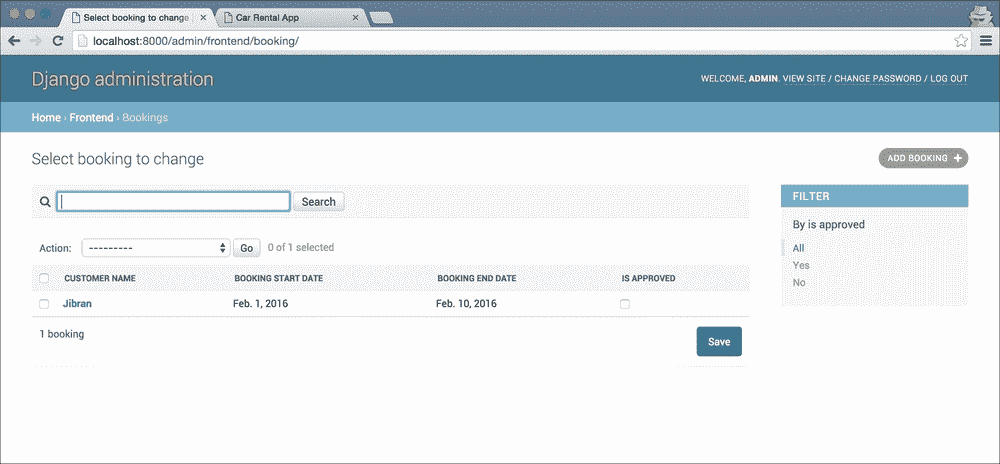

## 管理操作

我们功能列表中的最后一项是允许用户选择多个预订查询对象，并向每个包含预订批准状态的`Booking`对象的`customer_email`发送电子邮件。目前，我们将只是在控制台上打印出电子邮件来测试这个功能。我们将在后面的章节中查看如何从 Django 发送电子邮件。

到目前为止，我们在 Django 管理中所做的大部分编辑都是基于每个对象的。您选择一个对象，编辑它，然后保存它，然后重新开始。除了最后一个功能（快速编辑）之外，我们一直在逐个编辑对象。然而，有时您希望能够对多个对象执行常见操作，就像我们在电子邮件功能中所需的那样。为了实现这样的功能，Django 管理提供了**管理操作**。

管理操作是`ModelAdmin`类上的方法，它们接收用户选择的对象列表。然后，这些方法可以对这些对象执行一些操作，然后将用户返回到更改列表页面。

### 注意

实际上，我稍微简化了一下。管理操作不需要是`ModelAdmin`上的方法。它们也可以是独立的函数。然而，通常最好的编程实践是在使用它们的`ModelAdmin`中声明它们，所以我们将在这里这样做。您可以在[`docs.djangoproject.com/en/stable/ref/contrib/admin/actions/`](https://docs.djangoproject.com/en/stable/ref/contrib/admin/actions/)的管理操作文档中找到更多详细信息。

Django 管理员默认提供了一个操作：删除。如果你打开预订列表顶部的**操作**下拉菜单，你应该会看到这个菜单：

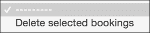

要定义管理员操作，首先需要在`ModelAdmin`类上创建一个方法，然后将方法的名称添加到类的`actions`属性中。`actions`属性是一个列表，就像我们到目前为止看到的所有其他属性一样。修改`BookingModelAdmin`以匹配以下代码：

```py
class BookingModelAdmin(admin.ModelAdmin):
    list_display = ['customer_name', 'booking_start_date', 'booking_end_date', 'is_approved']
    list_filter = ['is_approved']
    list_editable = ['is_approved']
    search_fields = ['customer_name']

    actions = ['email_customers']

    def email_customers(self, request, queryset):
        for booking in queryset:
            if booking.is_approved:
                email_body = """Dear {},
    We are pleased to inform you that your booking has been approved.
Thanks
""".format(booking.customer_name)
            else:
                email_body = """Dear {},
    Unfortunately we do not have the capacity right now to accept your booking.
Thanks
""".format(booking.customer_name)

            print(email_body)
```

让我们在查看代码功能之前先试一下。刷新 Booking 模型的`changelist`页面，查看**操作**下拉菜单。应该会有一个新选项，**给顾客发送邮件**：

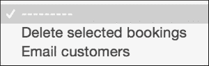

要测试它，从列表中选择一些预订对象，从下拉菜单中选择**给顾客发送邮件**操作，然后单击下拉菜单旁边的**Go**按钮。页面加载后，查看控制台。你应该会看到类似于这里显示的内容：

```py
Dear Jibran,
    We are pleased to inform you that your booking has been approved.
Thanks

[18/Jan/2016 09:58:05] "POST /admin/frontend/booking/ HTTP/1.1" 302 0
```

让我们看看我们在这里做了什么。正如我之前所说，管理员操作只是`ModelAdmin`类上的一个方法，接受`request`对象和`queryset`作为参数，然后对`queryset`执行所需的操作。在这里，我们为每个预订对象创建了一个电子邮件正文，并将其打印到控制台。

## UX 改进

虽然系统现在已经足够好让我们的客户使用，但肯定还有改进的空间。首先，用户没有得到任何关于**给顾客发送邮件**操作是否执行的反馈。让我们先解决这个问题。在`email_customers`方法的末尾添加这一行：

```py
self.message_user(request, 'Emails were send successfully')
```

再次尝试使用电子邮件操作。现在页面重新加载后，你会看到一个很好的成功消息，向用户保证他们想要的操作已经完成。在用户体验方面的小改进在帮助用户导航和成功使用产品方面可以走很长的路。

其次，让我们来看看如何命名这个操作。对于这个操作，Django 提供了一个相当不错的名称——**给顾客发送邮件**。这个名称简单明了。然而，它并不像应该的那样清晰。它没有向用户传达正在发送的电子邮件是什么。在一个更大的系统中，客户可能会发送多种类型的电子邮件，我们的操作名称应该清楚地说明我们在谈论哪一封电子邮件。

为了改变管理员操作的名称，我们需要给方法添加一个名为`short_description`的属性。由于在 Python 中方法也是对象，所以这很容易实现。修改`BookingModelAdmin`类以匹配以下代码。需要添加的新行已经标出：

```py
class BookingModelAdmin(admin.ModelAdmin):
    list_display = ['customer_name', 'booking_start_date', 'booking_end_date', 'is_approved']
    list_filter = ['is_approved']
    list_editable = ['is_approved']
    search_fields = ['customer_name']

    actions = ['email_customers']

    def email_customers(self, request, queryset):
        for booking in queryset:
            if booking.is_approved:
                email_body = """Dear {},
    We are pleased to inform you that your booking has been approved.
Thanks
""".format(booking.customer_name)
            else:
                email_body = """Dear {},
    Unfortunately we do not have the capacity right now to accept your booking.
Thanks
""".format(booking.customer_name)

            print(email_body)

        self.message_user(request, 'Emails were send successfully')
    email_customers.short_description = 'Send email about booking status to customers'

```

请注意，新的行（最后一行）不是函数体的一部分。它与函数定义的缩进级别相同，实际上是类的一部分，而不是函数的一部分。刷新列表页面，再次查看操作下拉菜单：

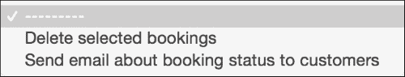

# 总结

这一章可能是本书中编写的代码最少的一章。然而，我们在这里构建的功能可能比大多数章节中构建的功能更复杂。我在本章的开头说过，Django 框架受欢迎的原因之一是管理员应用程序。我希望到现在为止你同意我的观点。

不到 20 行代码，我们就能够创建一个与大多数 CMS 系统相媲美的系统，而且仍然更符合我们客户的需求。与大多数 CMS 系统不同，我们不将`Car`和`Booking`对象视为页面或节点。在我们的系统中，它们是一流的对象，每个对象都有自己的字段和独特的功能。然而，就客户而言，管理员的工作方式与大多数 CMS 一样，可能更容易，因为没有像大多数 CMS 解决方案中那样有额外的字段。

我们几乎只是开始了解定制管理员的表面。管理员提供了许多功能，适用于管理面板所需的大多数场景。通过在`ModelAdmin`上更改一些设置，所有这些功能都很容易使用。在我开发的所有 Django 应用程序中，我只需要创建定制的管理面板一次。Django 管理员是如此可定制，您只需配置它以满足您的需求。

我强烈建议您查看 Django 管理员的文档[https://docs.djangoproject.com/en/stable/ref/contrib/admin/]。如果您需要为您的 Web 应用程序创建管理项目，请检查管理员是否提供您想要的功能。往往情况是如此，并且可以节省大量精力。
