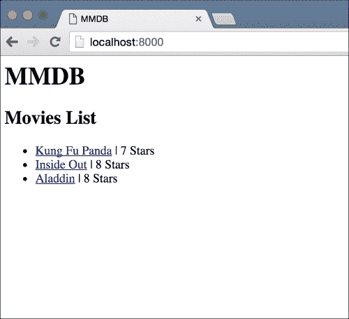
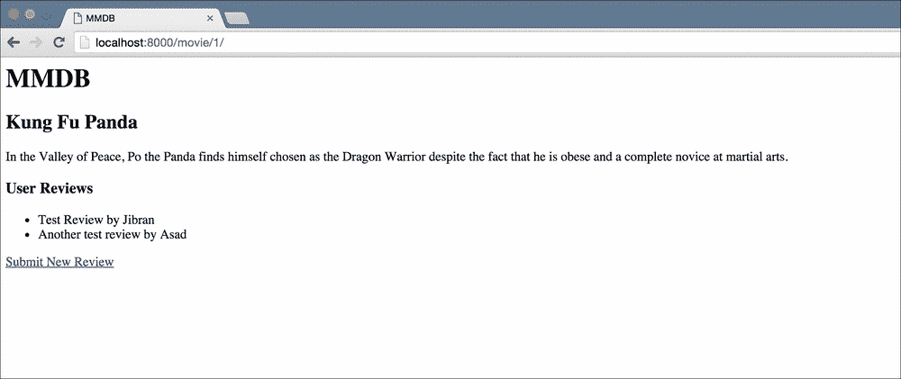
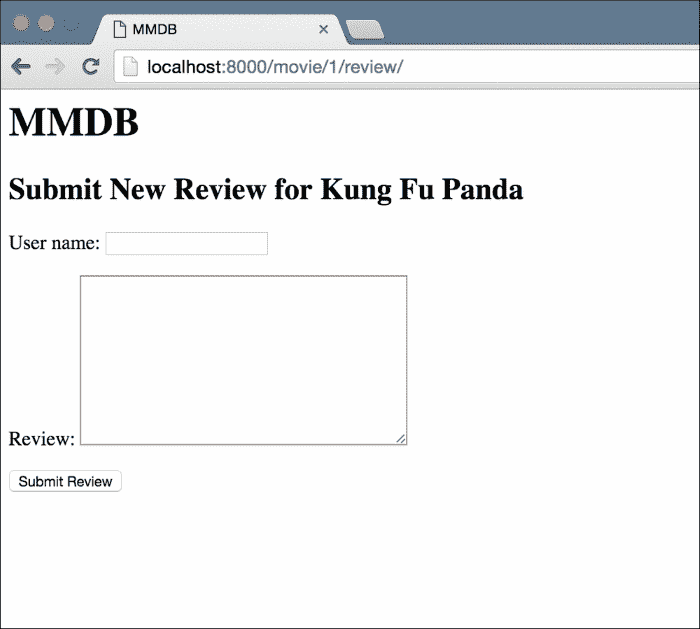
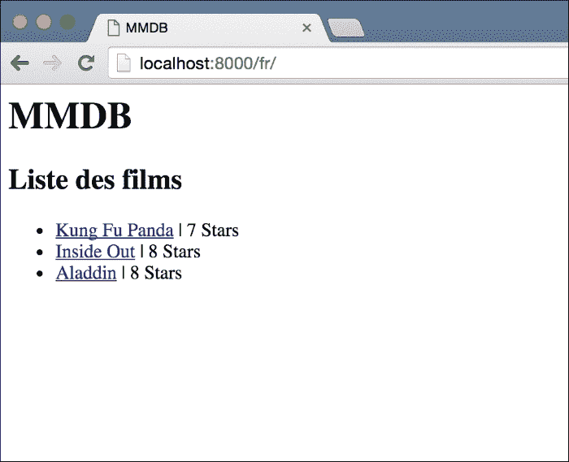
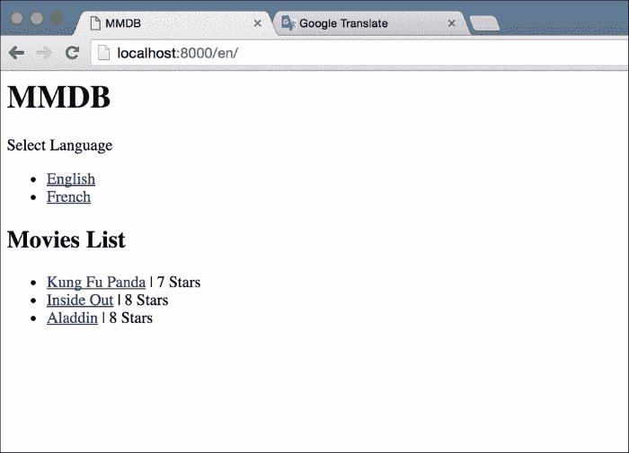
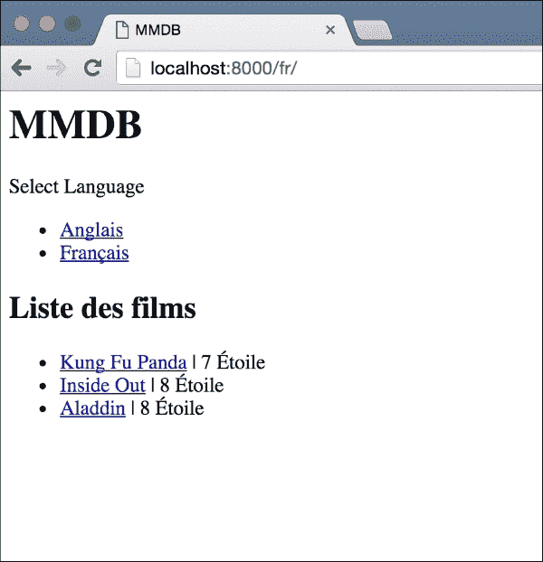
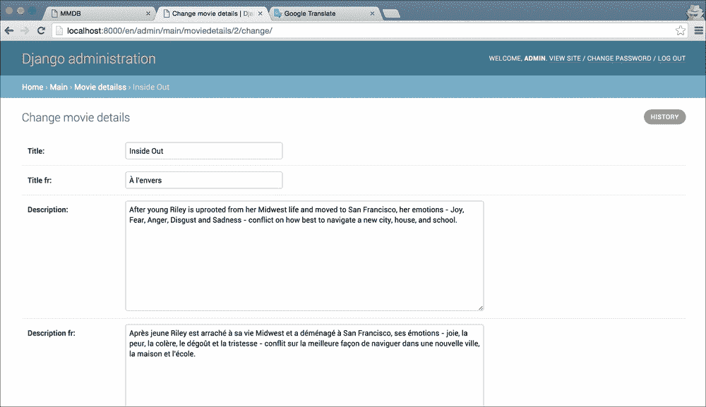
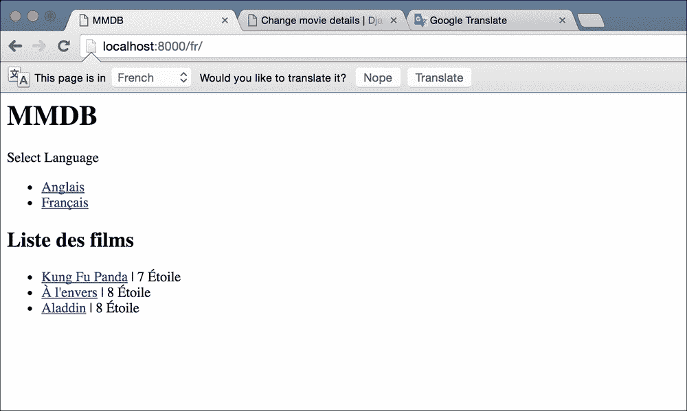

# 第五章：多语言电影数据库

互联网可能是世界上增长最快的现象。廉价的互联网手机进一步加速了这种增长，据一些估计，今天世界上有 40%的人口可以接入互联网。我们开发的任何网络应用都可以真正成为全球性的。然而，英语用户只占互联网用户的大约 30%。如果你的网站只有英文，你就错过了一个巨大的受众。

为了解决这个问题，近年来已经做出了许多努力，使网站也能够为非英语用户提供访问。Django 本身包括可靠的方法，将网站内容翻译成多种语言。

然而，翻译内容只是过程的第一部分。语言并不是世界各地不同之间唯一的不同之处。货币代码、时区和数字格式只是一些例子。将这些适应到用户所在地的过程称为**本地化**。你经常会看到这个缩写为**l10n**。这是本地化的第一个`l`，然后是一个数字`10`，后面是最后一个`n`。`10`指的是两者之间的字符数！你可能也会遇到国际化（**i18n**）这个术语。国际化是确保你的应用在多个地区都能正常运行，不会出现错误。例如，确保你从用户那里接受的任何输入可以是多种语言，而不仅仅是你开发应用的那种语言。

在本章中，我们将制作一个受到非常有用的**IMDB**（**互联网电影数据库**）网站启发的应用程序。如果你从未听说过它，它是一个提供有关电影的大量信息的网络应用程序，无论是新的还是旧的。我们将创建一个类似于 IMDB 的应用程序，提供一些非常基本的功能。由于我们的应用程序是多语言的（顺便说一句，IMDB 也是），我将把它称为**多语言电影数据库**（**MMDB**）。

本章的代码包含了一个工作的非本地化应用程序副本。我们的工作是为法国用户添加本地化和国际化，以便其能够正常使用。

# 要求

让我们来看看本章结束时我们想要实现的目标：

+   了解 Django 提供的所有功能，以允许本地化

+   将网站内容翻译成法语

+   给用户选择他们想要在网站中使用的语言的能力

+   在多次访问中保持用户的语言偏好

+   翻译模型的内容

在我们开始之前，有一件事我想提一下。由于我们是第一次学习这些东西，我们将从一个已经存在的 Django 应用程序开始。然而，与大多数真实项目相比，我们的应用程序非常小。对于更大的应用程序，在完成项目后添加本地化通常更加困难。

在开始项目时考虑本地化需求并在首次开发应用程序时将这些功能纳入其中总是一个好主意，而不是在应用程序开发后的后期阶段这样做。

# 启动项目

和往常一样，一旦你下载了代码包，解压它。然后，为这个项目创建一个新的虚拟环境并安装 Django。最后，激活它并在项目根目录中运行迁移命令。这应该为项目设置数据库，并让你可以启动应用程序。现在你需要创建一个新的超级用户，这样你就可以添加一些测试数据。在项目根目录中（虚拟环境处于活动状态），运行以下命令：

```py
> python manage.py createsuperuser

```

回答问题，您将获得一个新用户。现在，使用`runserver`命令运行应用程序，然后访问`http://127.0.0.1:8000/admin/`，并向数据库添加一些电影详细对象。一旦您添加了一些测试数据，访问应用程序的主页，您应该看到类似以下屏幕截图的内容：



您应该花一些时间来探索这个应用程序。您可以在页面上查看特定电影的详细信息，如下面的屏幕截图所示：



最后，您可以点击**提交新评论**链接，转到下一页，并为电影创建一个新的评论，如下面的屏幕截图所示：



这就是我们整个应用程序。在本章的其余部分，我们将探讨如何向这个项目添加 l10n 和 i18n。我们对核心产品功能几乎没有或没有做任何更改。

# 翻译我们的静态内容

我们想要做的第一件事是翻译网站上的所有静态内容。这包括在前面三个屏幕中看到的所有标题、链接和表单标签。为了翻译模板中使用的字符串，Django 为我们提供了一个`trans`模板标签。让我们先看看如何在简单的上下文中使用它，然后我会详细介绍它的工作原理。这是一个稍微长一点的部分，因为我们将在这里做很多构成 Django 翻译功能基础的事情。

### 提示

如果您不理解某些内容，请不要惊慌。只需按照说明进行。我将深入介绍每一步，但首先我想向您展示翻译是如何完成的。

打开`main/templates/movies_list.html`，并将`h2`标签中的`Movies List`替换为以下内容：

```py

```

在文件的第二行后面的`extends`标签之后，添加以下`load`标签：

```py

```

这是我们现在需要对模板进行的所有更改。我将在稍后解释这两行的作用，但首先我想完成整个翻译过程，这样您就可以看到整个过程而不仅仅是一小部分。

接下来，让我们从项目根目录运行以下命令：

```py
> python manage.py makemessages -l fr
CommandError: Unable to find a locale path to store translations for file main/__init__.py

```

如果您运行这个命令，您也应该看到与我一样的错误，即找不到区域设置路径。我们会在演示结束后解释区域设置路径是什么。现在，在`main`文件夹中创建一个名为`locale`的新文件夹，然后再次运行该命令：

```py
>mkdir main/locale
> python manage.py makemessages -l fr
processing locale fr

```

这次命令成功了。如果您查看您创建的`locale`文件夹，您会看到它下面创建了一个全新的文件夹层次结构。`makemessages`命令所做的是在`main/locale/fr/LC_MESSAGES/django.po`文件中创建了一个`django.po`文件。如果您打开这个文件，您应该能够了解一些关于它的目的。文件的最后三行应该如下所示：

```py
#: main/templates/movies_list.html:5
msgid "Movies List"
msgstr ""
```

加上这个文件的路径(`locale/fr/LC_MESSAGES/django.po`)和这三行，您应该能够理解这个文件将包含我们之前用`trans`标签标记的字符串的法语翻译。在`msgstr`旁边放在引号中的任何内容都将替换网站的法语翻译中的原始字符串。

我使用 Google 翻译来翻译`Movies List`字符串，它给了我翻译为 Liste des films。将这个翻译放在`msgstr`旁边的引号中。现在，`django.po`文件的最后三行应该与以下内容匹配：

```py
#: main/templates/movies_list.html:5
msgid "Movies List"
msgstr "Liste des films"
```

接下来，从项目根目录运行以下命令：

```py
> python manage.py compilemessages -l fr
processing file django.po in /Users/asadjb/Programming/Personal/DjangoBluePrints/mmdb/mmdb/main/locale/fr/LC_MESSAGES

```

如果您现在查看`LC_MESSAGES`文件夹，您会看到一个新的`django.mo`文件已经被创建。这是我们的`django.po`文件的编译版本，我们将翻译的字符串放入其中。出于性能考虑，Django 翻译需要将文件编译成二进制格式，然后才能获取字符串的翻译。

接下来，打开`mmdb/settings.py`并找到`MIDDLEWARE_CLASSES`列表。编辑它，使得`django.middleware.locale.LocaleMiddleware`字符串出现在已安装的`SessionMiddleware`和`CommonMiddleware`之间。位置很重要。列表现在应该如下所示：

```py
MIDDLEWARE_CLASSES = [
    'django.middleware.security.SecurityMiddleware',
    'django.contrib.sessions.middleware.SessionMiddleware',
 'django.middleware.locale.LocaleMiddleware',
    'django.middleware.common.CommonMiddleware',
    'django.middleware.csrf.CsrfViewMiddleware',
    'django.contrib.auth.middleware.AuthenticationMiddleware',
    'django.contrib.auth.middleware.SessionAuthenticationMiddleware',
    'django.contrib.messages.middleware.MessageMiddleware',
    'django.middleware.clickjacking.XFrameOptionsMiddleware',
]
```

接下来，在设置文件中添加一个`LANGUAGES`变量，并给它以下值：

```py
LANGUAGES = (
    ('en', 'English'),
    ('fr', 'French')
)
```

默认情况下，Django 支持更多的语言列表。对于我们的项目，我们希望将用户限制在这两个选项中。这就是`LANGUAGES`列表的作用。

最后一步是修改`mmdb/urls.py`文件。首先，从`django.conf.urls.i18n`导入`i18n_patterns`。接下来，更改`urlpatterns`变量，以便`i18n_patterns`函数包装所有我们的 URL 定义，如下面的代码所示：

```py
urlpatterns = i18n_patterns(
url(r'^$', MoviesListView.as_view(), name='movies-list'),
url(r'^movie/(?P<pk>\d+)/$', MovieDetailsView.as_view(), name='movie-details'),
url(r'^movie/(?P<movie_pk>\d+)/review/$', NewReviewView.as_view(), name='new-review'),

url(r'^admin/', admin.site.urls),
)
```

完成这些后，让我们测试一下，看看我们的辛勤工作得到了什么。首先，打开`http://127.0.0.1:8000`。您应该会看到与之前相同的主页，但是如果您注意地址栏，您会注意到浏览器位于`http://127.0.0.1:8000/en/`而不是我们输入的内容。我们将在下一步详细了解为什么会发生这种情况，但简而言之，我们打开了主页而没有指定语言，Django 将我们重定向到了站点的默认语言，我们之前指定为英语。

将 URL 更改为`http://127.0.0.1:8000/fr/`，您应该会再次看到相同的主页，但是这次，`Movies List`文本应该被我们说的法语翻译所替换，如下面的截图所示：



虽然这一切可能看起来像是为了翻译一个句子而做了很多工作，但请记住，您只需要做一次。既然基础已经建立，让我们看看现在翻译其他内容有多容易。让我们将单词`Stars`翻译成法语，`Etoiles`。打开`main/templates/movies_list.html`，并将单词`Stars`替换为以下内容：

```py

```

接下来，运行`makemessages`命令：

```py
> python manage.py makemessages -l fr

```

打开`main/locale/fr/LC_MESSAGES/django.po`文件。您应该会看到一个新的部分，用于我们标记为翻译的`Stars`字符串。添加翻译（`Étoile`）并保存文件。最后，运行`compilemessages`命令：

```py
> python manage.py compilemessages

```

再次访问`http://127.0.0.1:8000/fr/`，打开法语语言主页。您会看到单词`Stars`已被其法语翻译所替换。所需的工作量很小。您刚刚遵循的工作流程：标记一个或多个字符串进行翻译，制作消息，翻译新字符串，最后运行`compilemessages`，是大多数 Django 开发人员在翻译项目时遵循的工作流程。准备网站翻译所涉及的大部分工作都是我们之前所做的。让我们更仔细地看看我们到底做了什么来使我们的 Web 应用程序可翻译。

# 所有这些是如何工作的？

就像我在上一节开始时所承诺的那样，在看到 Django 翻译实际操作后，我们现在将更深入地了解我们所遵循的所有步骤以及每个步骤所做的事情。

我们做的第一件事是加载 i18n 模板标签库，它为我们提供了各种模板标签来翻译模板中的内容。最重要的，也可能是您最常使用的，是`trans`标签。`trans`标签接受一个字符串参数，并根据活动的语言输出该字符串的正确翻译。如果找不到翻译，将输出原始字符串。

您在模板中编写的几乎任何字符串最终都将被`trans`标签包装，然后在您的 Web 应用程序可用的各种语言中进行翻译。有某些情况下`trans`标签无法使用。例如，如果您必须将某些上下文变量的值添加到已翻译的字符串中，则`trans`标签无法做到这一点。对于这些情况，我们需要使用块翻译标签`blocktrans`。我们的应用程序不需要它，但您可以在 Django 文档中了解有关它的信息[`docs.djangoproject.com/es/stable/topics/i18n/translation/#blocktrans-template-tag`](https://docs.djangoproject.com/es/stable/topics/i18n/translation/#blocktrans-template-tag)。

我们的下一步是运行`make messages`命令。我们的第一次尝试没有成功，所以我们不得不在我们的`application`文件夹中创建一个`locale`目录。做完这些后，我们运行了该命令，并创建了一个带有`.po`扩展名的消息文件。该命令的作用是遍历项目中的每个文件，并提取您标记为翻译的字符串。标记字符串的一种方法是使用`trans`标签进行包装。还有其他方法，我们稍后会看到。

`make messages`命令提取字符串后，需要创建文件并将提取的字符串存储在这些文件中。Django 在确定每个提取的字符串应放入哪个文件时遵循一组规则。对于从应用程序文件中提取的字符串，Django 首先尝试在该应用程序的文件夹中找到`locale`目录。如果找到该文件夹，它将在其中创建适当的层次结构（`fr/LC_MESSAGES`目录）并将消息文件放在那里。

如果未找到`locale`文件夹，Django 将查看`LOCALE_PATHS`设置变量的值。这应该是一个目录位置列表。Django 从此路径列表中选择第一个目录，并将消息文件放在那里。在我们的情况下，我们没有设置`LOCALE_PATHS`，这就是为什么 Django 会引发错误，找不到我们主要应用程序文件夹中的 locale 目录。

让我们稍微谈谈消息文件的格式。这是我们当前消息文件的样子：

```py
# SOME DESCRIPTIVE TITLE.
# Copyright (C) YEAR THE PACKAGE'S COPYRIGHT HOLDER
# This file is distributed under the same license as the PACKAGE package.
# FIRST AUTHOR <EMAIL@ADDRESS>, YEAR.
#
#, fuzzy
msgid ""
msgstr ""
"Project-Id-Version: PACKAGE VERSION\n"
"Report-Msgid-Bugs-To: \n"
"POT-Creation-Date: 2016-02-15 21:25+0000\n"
"PO-Revision-Date: YEAR-MO-DA HO:MI+ZONE\n"
"Last-Translator: FULL NAME <EMAIL@ADDRESS>\n"
"Language-Team: LANGUAGE <LL@li.org>\n"
"Language: \n"
"MIME-Version: 1.0\n"
"Content-Type: text/plain; charset=UTF-8\n"
"Content-Transfer-Encoding: 8bit\n"
"Plural-Forms: nplurals=2; plural=(n > 1);\n"

#: main/templates/movies_list.html:6
msgid "Movies List"
msgstr "Liste des films"

#: main/templates/movies_list.html:10
msgid "Stars"
msgstr "Étoile"
```

以`#`开头的行是注释。然后是一对空的`msgid`和`msgstr`。然后是关于此消息文件的一些元数据。之后，我们得到了主要部分。消息文件，忽略元数据和第一对（在模糊注释之前的那一对），只是一系列`msgid`和`msgstr`对。`msgid`对是您标记为翻译的字符串，`msgstr`是该字符串的翻译。翻译应用程序的常规方法是首先标记所有字符串以进行翻译，然后生成消息文件，最后将其提供给翻译人员。然后翻译人员将带有填充翻译的文件返回给您。使用简单文本文件的好处是，翻译人员不需要使用任何特殊软件。如果他可以访问简单的文本编辑器，他就可以翻译消息文件。

一旦我们翻译了消息文件中的字符串，我们需要在 Django 能够使用这些翻译之前运行编译消息命令。如前所述，编译命令将文本消息文件转换为二进制文件。二进制文件格式对 Django 来说读取速度更快，在具有数百或数千个可翻译字符串的项目中，这些性能优势会非常快速地累积起来。编译消息文件的输出是一个`.mo`文件，与`.po`文件在同一个文件夹中。

一旦我们完成并编译了翻译，我们需要设置一些 Django 配置。我们首先要做的是将`LocaleMiddleware`添加到应用程序使用的中间件列表中。`LocaleMiddleware`的工作是允许用户根据一些请求参数选择站点的语言。您可以在文档中阅读有关语言确定方式的详细信息[`docs.djangoproject.com/es/stable/topics/i18n/translation/#how-django-discovers-language-preference`](https://docs.djangoproject.com/es/stable/topics/i18n/translation/#how-django-discovers-language-preference)。我们稍后会回到这个问题，讨论它如何通过示例确定语言。

然后我们需要定义两个设置变量，`LANGUAGES`和`LANGUAGE`。`LANGUAGE`已经在代码包中定义了，所以我们只设置了`LANGUAGES`变量。`LANGUAGES`是 Django 可以为站点提供翻译的语言选择列表。默认情况下，这是一个包含 Django 可以翻译的所有语言的巨大列表。然而，对于大多数项目，您希望用户仅限于使用站点的少数语言。通过为`LANGUAGES`列表提供我们自己的值，我们确保 Django 不会为除定义的语言之外的任何语言提供页面。

`LANGAUGE`变量定义了要使用的默认语言。如果您记得，当我们打开主页时没有任何语言代码（`http://127.0.0.1:8000/`），**英语**语言会被默认选择。`LANGUAGE`变量决定了站点的默认语言是什么。

使应用程序可翻译的下一步是修改`url.py`文件。我们将 URL 配置的简单列表替换为`i18n_patterns`函数。这个函数允许我们匹配在 URL 前面加上语言代码的 URL。对于每个进来的请求，这个函数会尝试匹配我们在其中包装的模式，然后从 URL 路径中移除语言代码。这有点复杂，所以让我们看一个例子。

假设我们有以下的 URL 模式：

```py
url(r'^example/$', View.as_view(), name='example')
```

这将匹配`DOMAIN.COM/example/`，但如果我们尝试`DOMAIN.com/en/example/`，模式将不会匹配，因为`/en/`部分不是正则表达式的一部分。然而，一旦我们将其包装在`i18n_patterns`中，它将匹配第二个示例。这是因为`i18n_patterns`函数会移除语言代码，然后尝试匹配我们在其中包装的模式。

在一些应用程序中，您不希望所有的 URL 都匹配语言前缀。一些 URL，比如 API 端点，不会根据语言而改变。在这种情况下，您可以将`i18n_patterns`和普通的 URL 模式列表结合在一起：

```py
urlpatterns = i18n_patterns(url(r'^example/$', ExampleView.as_view(), name='example')) + [url(r'^api/$', ApiView.as_view(), name='api')]
```

这样，您可以创建一些混合了翻译和非翻译视图的应用程序。

添加了`i18n_urlpatterns`后，我们已经完成了 Django 需要的基本国际化配置，我们可以访问我们用法语编写的页面并查看翻译版本。

我要解释的最后一件事是`LocaleMiddleware`。区域设置中间件是 Django 的一部分，允许用户使用 URL 中的语言代码来决定使用哪种语言。因此，即使是`i18n_patterns`根据语言代码匹配模式，中间件也会为每个请求激活正确的语言。除了在 URL 路径中使用语言前缀之外，`LocaleMiddleware`还提供了其他几种选择语言的方式：

+   一个会话变量

+   一个 cookie 值

+   用户浏览器发送的`Accept-Language`头

+   如果一切都失败了，就会使用`LANGUAGE`设置变量的默认语言

这是我们如何使我们的应用程序适应可翻译的概述。然而，我们还没有完成。

# 让用户决定使用哪种语言

虽然这不是 Django 的一部分，但几乎所有国际化的项目都使用这种模式；因此我认为您了解这一点很重要。大多数具有多种语言选项的网站都会向用户提供一个菜单，让他们选择要以哪种语言查看网站。让我们创建一个。修改`templates/base.html`模板以匹配以下内容：

```py


<html>
<head>
<meta http-equiv="content-type" content="text/html; charset=utf-8" />

<title>MMDB</title>
</head>
<body>
<h1>MMDB</h1>
<div>
<span>Select Language</span>
<ul>
 
 
 <li><a href="">{{ lang_name }}</a></li>
 
</ul>
</div>
    
    
</body>
</html>
```

新部分已经突出显示。我们首先导入 i18n 模板库。然后，我们创建一个新的`div`元素来保存我们的语言选择列表。接下来，为了将语言选择作为模板的一部分，我们使用`get_available_languages`模板标签，并将选择分配给`available_languages`变量。

接下来，我们根据语言选择创建一个链接列表。`get_available_languages`的返回值是我们在`LANGUAGES`变量的设置文件中设置的元组。

在我们的链接列表中，我们需要一种方法来获取每种语言的 URL。Django 在这方面表现出色，它与国际化功能和框架的其他部分深度集成。如果您启用了国际化并反转 URL，它会自动获取正确的语言前缀。

然而，我们不能在这里对 URL 进行反转，因为那样会创建当前活动语言的 URL。因此，我们的语言切换链接列表实际上只会指向当前语言。相反，我们必须暂时切换到我们想要创建链接的语言，然后生成 URL。我们使用`language`标签来实现这一点。在`language`标签之间，我们传递的语言参数会被激活。因此，我们反转的 URL 正好符合我们的要求。

最后要注意的是我们反转的 URL。对于我们的应用程序，`movies-list` URL 是主页，因此我们反转它。对于大多数应用程序，您将做同样的事情，并反转主页 URL，以便切换语言时将用户带到指定语言的主页。

### 提示

有一种高级的方法可以让用户保持在当前页面并切换语言。一种方法是在每个页面上生成链接，而不是在`base.html`中，就像我们在这里做的一样。这样，由于您知道模板将呈现的 URL，您可以反转适当的 URL。然而，这样做的缺点是需要重复很多次。您可以在 Google 上搜索`Django reverse current URL in another language`，并获得一些其他建议。我还没有找到一个好的方法来使用，但您可以决定是否认为其中一个建议的选项符合您的需求。

一旦您进行了更改，通过访问`http://127.0.0.1:8000/en/`再次打开电影列表页面，您现在应该在顶部看到语言切换链接。参考以下截图：



您可以尝试切换语言，看到页面上的字符串立即反映出变化。

# 保持用户选择

让我们尝试一个实验。将语言切换为法语，然后关闭浏览器窗口。再次打开浏览器并访问`http://127.0.0.1:8000/`。注意 URL 中没有语言前缀。您将被重定向到该网站的英语版本。如果一旦您选择了要使用的语言，它能够在访问时保持不变，那不是很好吗？

Django 提供了这样一个功能，您只需添加一些代码来使用它。如果您记得`LocaleMiddleware`确定当前请求的语言所采取的步骤列表，那么在查看 URL 前缀之后的第二步是查看会话。如果我们可以将语言选择放入会话字典中，Django 将在随后的访问中自动为用户选择正确的语言。

在哪里放置更新会话字典的代码是正确的位置？如果您考虑一下，每当用户更改其语言选择时，我们都会将其重定向到主页。因为他们在语言偏好更改时总是访问主页，让我们把我们的代码放在那里。修改`MoviesListView`以匹配以下代码：

```py
class MoviesListView(ListView):
    model = MovieDetails
    template_name = 'movies_list.html'

    def get(self, request, *args, **kwargs):
        current_language = get_language()
        request.session[LANGUAGE_SESSION_KEY] = current_language

        return super(MoviesListView, self).get(request, *args, **kwargs)
```

您还需要导入`get_language`和`LANGUAGE_SESSION_KEY`。将其放在`main/views.py`的顶部：

```py
from django.utils.translation import LANGUAGE_SESSION_KEY
from django.utils.translation import get_language
```

现在，再次访问网站并将语言更改为法语。接下来，关闭浏览器窗口，然后再次打开。打开`http://127.0.0.1:8000/`，并注意不要在 URL 中添加语言前缀，您应该被重定向到法语页面。

让我们看看这里发生了什么。在 URL 中没有语言代码的情况下，`LocaleMiddleware`会查看会话，看看保存语言选择的键是否有任何值。如果有，中间件会将其设置为请求的语言。我们通过首先使用`get_language`方法获取当前活动的语言，然后将其放入会话中，将用户的语言选择放入会话中。中间件使用的键名称存储在`LANGUAGE_SESSION_KEY`常量中，因此我们使用它来设置语言选择。

正确设置会话后，用户下次访问网站时，如果没有语言前缀，中间件会在会话中找到他们的选择并使用它。

# 翻译我们的模型

我们要看的最后一件事是如何翻译我们的模型数据。打开网站并切换到法语。您的主页应该类似于以下截图：



您会注意到，即使静态内容——我们自己放在模板中的内容——已被翻译，电影的动态名称却没有被翻译。虽然这对一些网站来说是可以接受的，但您的模型数据也应该被翻译，以便真正国际化。Django 默认没有任何内置方法来实现这一点，但这很容易。

### 提示

我将要向您展示的是 Django `modeltranslation`库已经提供的内容。我在一个大型项目中使用过它，效果非常好，所以如果您想跳过这一部分，可以直接使用该库。但是，了解如何在没有任何外部帮助的情况下实现它也是很好的。

您可以在[`github.com/deschler/django-modeltranslation`](https://github.com/deschler/django-modeltranslation)找到该库。

我们需要的是一种方法来为我们模型中的每个文本字段存储多种语言。您可以想出一种方案，在其中使用某种分隔符将字符串的英文和法文翻译存储在同一个字段中，然后在显示模型时将两者分开。

另一种实现相同结果的方法是为每种语言添加一个额外的字段。对于我们当前的示例，这意味着为每个要翻译的字段添加一个额外的字段。

这两种方法都有其利弊。第一种方法难以维护；随着需要翻译的语言不止一种，数据格式变得难以维护。

第二种方法添加了数据库字段，这可能并非总是可能的。此外，它需要根本性地改变数据访问方式。但是，如果您有选择，我总是建议选择结果更清晰易懂的代码，这种情况下意味着为每种语言添加额外字段。

对于我们的`MovieDetails`模型，这意味着为标题和描述字段各添加一个额外的字段来存储法语翻译。编辑您的`main/models.py`文件，使`MovieDetails`模型与以下代码匹配：

```py
class MovieDetails(models.Model):
    title = models.CharField(max_length=500)
    title_fr = models.CharField(max_length=500)

    description = models.TextField()
    description_fr = models.TextField()

    stars = models.PositiveSmallIntegerField()

    def __str__(self):
        return self.title
```

接下来，创建并运行迁移以将这些新字段添加到数据库中：

```py
> python manage.py makemigrations
You are trying to add a non-nullable field 'description_fr' to moviedetails without a default; we can't do that (the database needs something to populate existing rows).
Please select a fix:
 1) Provide a one-off default now (will be set on all existing rows)
 2) Quit, and let me add a default in models.py
Select an option: 1
Please enter the default value now, as valid Python
The datetime and django.utils.timezone modules are available, so you can do e.g. timezone.now()
>>> ''
You are trying to add a non-nullable field 'title_fr' to moviedetails without a default; we can't do that (the database needs something to populate existing rows).
Please select a fix:
 1) Provide a one-off default now (will be set on all existing rows)
 2) Quit, and let me add a default in models.py
Select an option: 1
Please enter the default value now, as valid Python
The datetime and django.utils.timezone modules are available, so you can do e.g. timezone.now()
>>> ''
Migrations for 'main':
 0002_auto_20160216_2300.py:
 - Add field description_fr to moviedetails
 - Add field title_fr to moviedetails
 - Alter field movie on moviereview

```

如你在前面的 CLI 会话中所看到的，当我创建迁移时，我被要求为新字段提供默认值。我只输入了空字符串。我们可以稍后从管理员中修复这个值。

最后，运行新的迁移：

```py
> python manage.py migrate
Operations to perform:
 Apply all migrations: admin, contenttypes, main, auth, sessions
Running migrations:
 Rendering model states... DONE
 Applying main.0002_auto_20160216_2300... OK

```

完成后，打开管理员，查看数据库中一个对象的编辑页面。它应该看起来类似于以下截图：



在前面的截图中，你可以看到管理员添加了两个新字段。我使用 Google 翻译翻译了这些字段的英文值，并填写了法语语言字段的值。点击**保存**。现在，我们的模型在英语值旁边有了法语语言数据；但如何显示它们呢？

你可以在模板代码中放置一些 `if/else` 条件来决定使用哪种语言字段。然而，这很快就会变得混乱。现在，我们的模型只有两个被翻译的字段，但想象一下一个有 10 个这样字段的模型。你会有多少条件？我们只讨论支持一种语言。最后，我们只需要修改两个模板，列表视图和详细视图。在一个真实的、更复杂的应用程序中，你的模型可能会被用在一百个不同的地方。`if/else` 方法很快就变得难以维护。

相反，我们将给我们的模型方法，以智能地返回正确的字段值，取决于当前的语言。让我们再次修改我们的 `main/models.py` 文件。首先，在顶部导入 `get_language` 方法：

```py
from django.utils.translation import get_language
```

接下来，再次修改 `MovieDetails` 模型，并添加这三个新方法（在代码中突出显示）：

```py
class MovieDetails(models.Model):
    title = models.CharField(max_length=500)
    title_fr = models.CharField(max_length=500)

    description = models.TextField()
    description_fr = models.TextField()

    stars = models.PositiveSmallIntegerField()

 def get_title(self):
 return self._get_translated_field('title')

 def get_description(self):
 return self._get_translated_field('description')

 def _get_translated_field(self, field_name):
 original_field_name = field_name

 lang_code = get_language()

 if lang_code != 'en':
 field_name = '{}_{}'.format(field_name, lang_code)
 field_value = getattr(self, field_name)

 if field_value:
 return field_value
 else:
 return getattr(self, original_field_name)

    def __str__(self):
        return self.title
```

新方法中没有任何 Django 特定的内容。主要的工作是 `_get_translated_field` 方法。给定一个字段名，它查看当前的语言，如果语言不是英语，就将语言代码附加到字段名。然后从对象中获取新字段名的值。如果值为空，因为我们没有翻译该字段，它遵循 Django 的约定，只返回原始未翻译字段的值。

现在，修改 `main/templates/movies_list.html` 来使用这些新方法：

```py




<h2></h2>

<ul>
    
<li><a href="">{{ movie.get_title }}</a> | {{ movie.stars }} </li>
    
</ul>

```

唯一的改变是，现在不再直接使用 `movie.title` 的值，而是使用 `movie.get_title`。这是这种方法的一个主要缺点。现在在你的项目中，无论何处你需要 `title` 或 `description` 的值，你都必须使用 `get_title` 和 `get_description` 方法，而不是直接使用字段值。

### 注意

保存字段也是一样的。你必须弄清楚要写入哪个字段名，这取决于激活的语言。虽然这两者都不复杂，但它们确实给整个过程增加了一些不便。然而，这就是你为这种功能付出的代价。

我之前提到的 `django-modeltranslation` 包对这个问题有一个很好的解决方案。它使用模型中的代码来自动决定每当你访问任何字段时应该返回哪种语言。所以，你不再使用 `obj.get_title()`，而是直接写 `obj.title`，就可以得到当前激活语言的正确字段。对于你的项目，你可能需要研究一下这个。我在本章中没有使用这个，因为我想给你一个使用基本的 Django 的方法，并向你展示一种自己处理事情的可能方式，而不是依赖第三方库。

再次打开网站的法语版本，你会看到我们翻译的一个对象应该有标题的翻译版本，而其他的则只显示未翻译的版本：



对于详情模板做同样的事情应该很简单，留给你来完成！

# 总结

虽然这是一个相对较小的章节，但我们看到的信息将在您的网络开发职业生涯中派上用场。虽然并非您开发的所有网站都需要被翻译成多种语言，但一些最重要的网站会需要。当您有机会参与这样的项目时，您将拥有如何创建一个真正国际化的网络应用程序的信息。

我们只是初步了解了 Django 国际化和本地化的可能性。当您开始一个需要这些功能的项目时，请务必查阅文档。

我们现在已经完成了简单的仅使用 Django 的应用程序。在学习了 Django 的基础知识之后，下一章将让我们开始开发一个更复杂的网络应用程序——一个涉及使用强大的 Elasticsearch 进行搜索的应用程序！
