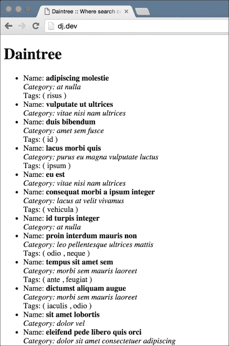
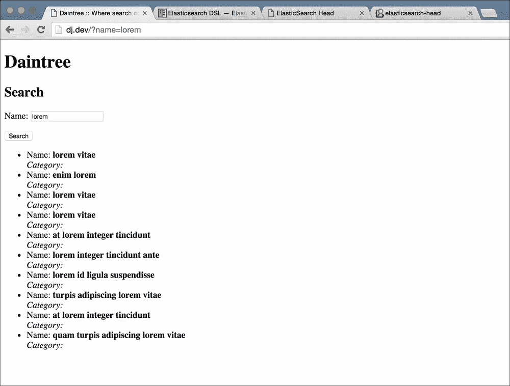
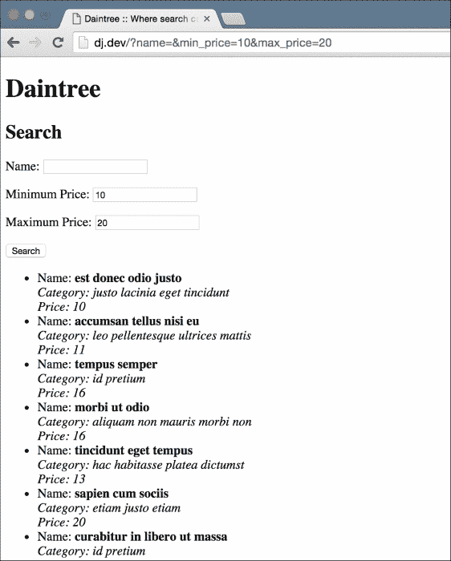
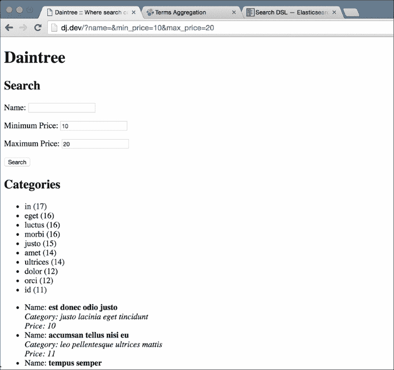
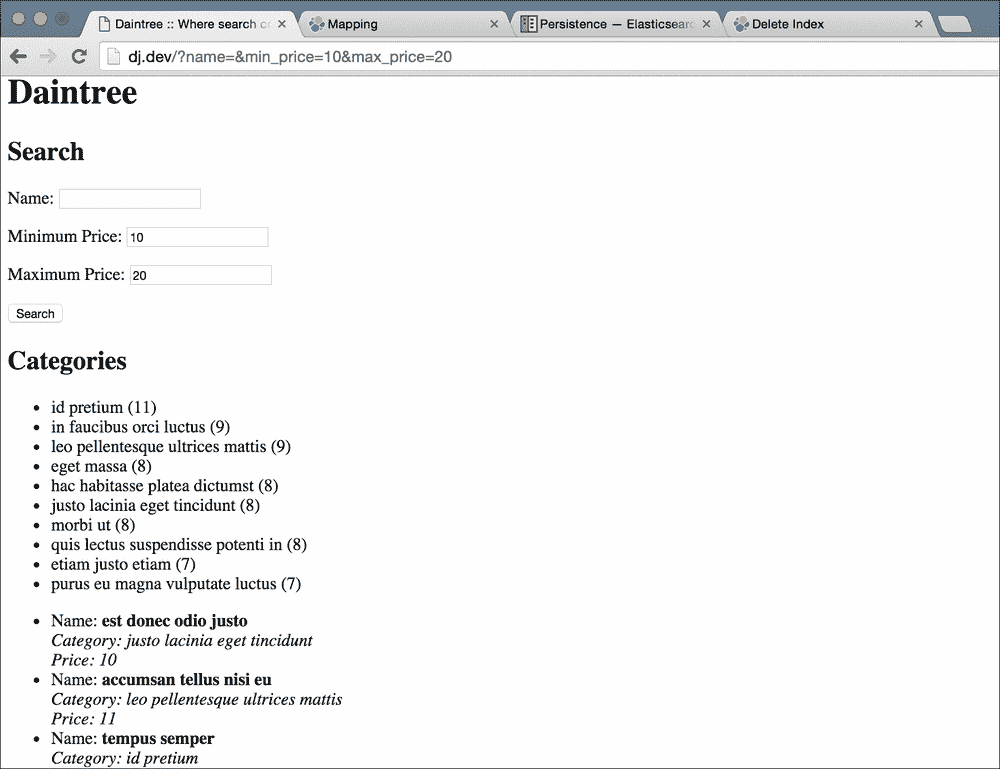
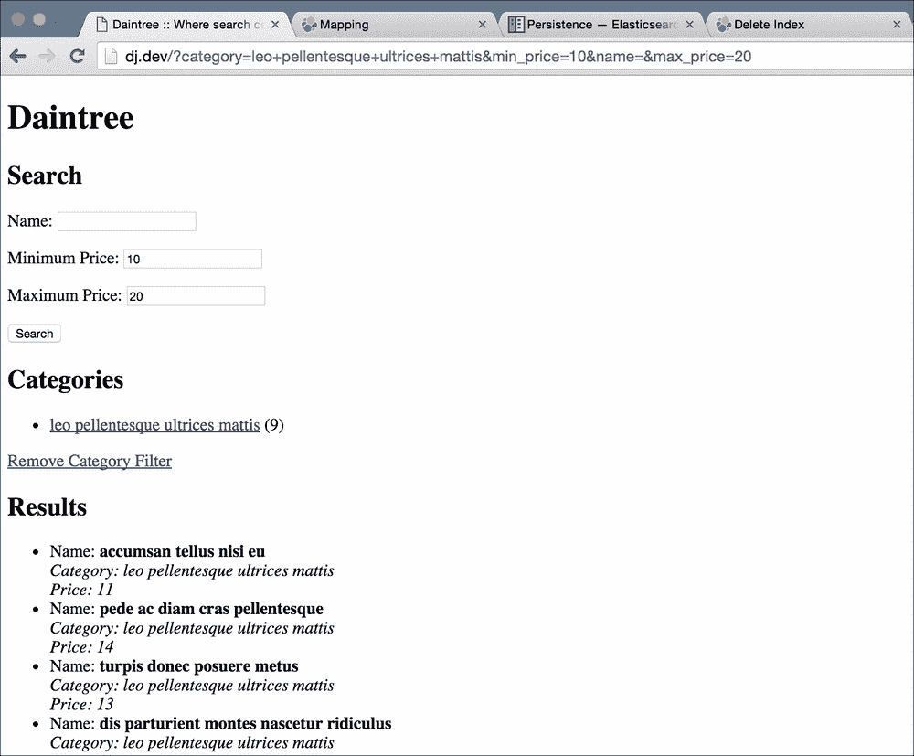

# 第六章：戴恩特里 - 电子商务网站

在前几章中，我们创建了一些稳健的网络应用。它们很简单，但具有足够的功能，可以在真实项目中使用。通过一些前端工作，我们的应用很可能可以部署在互联网上，并解决真实问题。现在是时候看一些更复杂的东西了。

我相信你已经使用过，或者至少听说过，电子商务领域的一些大名鼎鼎的公司，比如亚马逊和阿里巴巴。虽然这些网站非常复杂，但在内部，一个基本的电子商务网站是相当简单的。电子商务网站也是许多客户想要创建的东西，因此了解如何制作一个好的电子商务网站对你的职业生涯将非常有用。

一个基本的电子商务网站有一个主要目的：帮助用户从在线商店找到并购买产品。Django 可以单独用于快速构建电子商务网站，使用数据库查询来允许跨产品范围进行搜索，但这并不适合扩展。数据库被设计为快速保存和检索数据行，但它们并不是为了跨整个数据集（或子集）进行搜索而进行优化的。一旦您的网站流量开始增加，您会发现搜索速度会迅速下降。除此之外，还有一些很难用数据库构建的功能。

相反，我们将使用**搜索服务器**。搜索服务器非常类似于数据库。您可以给它一些数据来存储，然后以后可以检索它。它还具有专门为帮助您向应用程序添加搜索而构建的功能。您可能会想，如果搜索服务器可以像数据库一样存储我们的数据，那么我们不是可以摆脱数据库吗？我们可以，但通常不建议这样做。为什么？因为搜索服务器是为不同的用例而设计的。虽然它可以存储您的数据，但数据库提供了许多关于存储的保证，搜索服务器通常不提供。例如，一个好的数据库（如 MySQL 或 PostgreSQL）会保证，如果您尝试保存某些内容并且数据库返回成功的响应，那么在发生崩溃、停电或其他问题时，您的数据不会丢失。这被称为耐久性。搜索服务器不提供此保证，因为这不是它们的设计目的。通常最好将我们的数据保存在数据库中，并使用搜索服务器来搜索我们的数据。

在本章中，我们将使用**Elasticsearch**，这是最受欢迎、可能也是最易于使用的搜索服务器之一。它也是开源的，可以免费使用。所以让我们开始吧。这将是一个令人兴奋的章节！

# 代码包

本章的代码包含了一个基本的网络应用程序，其中包含了一个简单电子商务网站的模型和视图。现在还没有搜索，只有一个列出所有可用产品的页面。我还提供了一个数据转储，其中包含大约 1,000 个产品，这样我们的数据库就有一些可以玩耍的数据。与往常一样，下载代码包，创建一个新的虚拟环境，安装 Django，运行迁移命令，然后发出`run server`命令来启动开发服务器。你现在应该已经掌握了如何在没有任何指导的情况下做这些事情。

要加载测试数据，请在迁移命令之后运行以下命令：

```py
> python manage.py loaddata main/fixtures/initial.json

```

这应该会用一千个样品产品填满你的数据库，并为我们提供足够的数据来玩耍。

# 探索 Elasticsearch

在我们将 Elasticsearch 与 Django 应用程序集成之前，让我们花点时间来探索 Elasticsearch。我们将研究如何将数据导入其中，并使用搜索功能来获取我们想要的结果。我们不会详细讨论搜索，因为我们将在构建应用程序的搜索页面时再进行研究，但我们将对 Elasticsearch 的工作原理和它对我们有用的地方进行基本概述。

首先，从[`www.elastic.co/downloads/elasticsearch`](https://www.elastic.co/downloads/elasticsearch)下载最新版本的 Elasticsearch。你需要在系统上安装 Java 才能运行 Elasticsearch，所以如果你还没有安装，就去安装吧。你可以从[`java.com/en/download/`](https://java.com/en/download/)获取 Java。下载完 Elasticsearch 后，将压缩存档中的文件提取到一个文件夹中，打开一个新的终端会话，并`cd`到这个文件夹。接下来，`cd`进入`bin`文件夹，并运行以下命令：

```py
> ./elasticsearch
.
.
.
[2016-03-06 17:53:53,091][INFO ][http                     ] [Marvin Flumm] publish_address {127.0.0.1:9200}, bound_addresses {[fe80::1]:9200}, {[::1]:9200}, {127.0.0.1:9200}
[2016-03-06 17:53:53,092][INFO ][node                     ] [Marvin Flumm] started
[2016-03-06 17:53:53,121][INFO ][gateway                  ] [Marvin Flumm] recovered [0] indices into cluster_state
```

运行 Elasticsearch 二进制文件应该会产生大量的输出，它会与我粘贴的内容不同。然而，你应该仍然能看到输出的最后出现两条消息**started**和**recovered [0] indices into cluster_state**。这意味着 Elasticsearch 现在正在你的系统上运行。这并不难！当然，在生产环境中运行 Elasticsearch 会有些不同，Elasticsearch 文档提供了大量关于如何为几种不同的用例部署它的信息。

在本章中，我们只涵盖了 Elasticsearch 的基础知识，因为我们的重点是查看 Django 和 Elasticsearch 之间的集成，但如果你发现自己陷入困境或需要解答一些问题，可以查看文档——它真的非常广泛和详尽。你可以在[`www.elastic.co/guide/en/elasticsearch/reference/current/index.html`](https://www.elastic.co/guide/en/elasticsearch/reference/current/index.html)找到它。如果你真的想花时间学习 Elasticsearch，还有一本书式指南可供参考，地址是[`www.elastic.co/guide/en/elasticsearch/guide/current/index.html`](https://www.elastic.co/guide/en/elasticsearch/guide/current/index.html)。

## Elasticsearch 的第一步

既然我们已经运行了 Elasticsearch，我们可以用它做些什么呢？首先，你需要知道 Elasticsearch 通过一个简单的 HTTP API 公开其功能。因此，你不需要任何特殊的库来与其通信。大多数编程语言，包括 Python，都包含了进行 HTTP 请求的手段。然而，有一些库提供了另一层对 HTTP 的抽象，并使得与 Elasticsearch 的工作更加容易。我们稍后会详细介绍这些。

现在，让我们在浏览器中打开这个 URL：

```py
http://localhost:9200/?pretty
```

这应该会给你一个类似于这样的输出：

```py
{
  "name" : "Marvin Flumm",
  "cluster_name" : "elasticsearch",
  "version" : {
    "number" : "2.2.0",
    "build_hash" : "8ff36d139e16f8720f2947ef62c8167a888992fe",
    "build_timestamp" : "2016-01-27T13:32:39Z",
    "build_snapshot" : false,
    "lucene_version" : "5.4.1"
  },
  "tagline" : "You Know, for Search"
}
```

虽然大部分值都会不同，但响应的结构应该大致相同。这个简单的测试让我们知道 Elasticsearch 在我们的系统上正常工作。

现在我们将快速浏览一下，我们将插入、检索和搜索一些产品。我不会详细介绍，但如果你感兴趣，你应该查看我之前提到的 Elasticsearch 文档。

### 注意

在本节中，你需要在你的机器上安装一个工作的 curl 命令行实用程序的副本才能执行这些步骤。它应该默认在 Linux 和 Unix 平台上，包括 Mac OS X 上可用。如果你在 Windows 上，你可以从[`curl.haxx.se/download.html`](https://curl.haxx.se/download.html)获取一个副本。

打开一个新的终端窗口，因为我们当前的窗口中已经运行了 Elasticsearch。接下来，输入以下内容：

```py
> curl -XPUT http://localhost:9200/daintree/products/1 -d '{"name": "Django Blueprints", "category": "Book", "price": 50, "tags": ["django", "python", "web applications"]}'
{"_index":"daintree","_type":"products","_id":"1","_version":1,"_shards":{"total":2,"successful":1,"failed":0},"created":true}      
                                                > curl -XPUT http://localhost:9200/daintree/products/2 -d '{"name": "Elasticsearch Guide", "category": "Book", "price": 100, "tags": ["elasticsearch", "java", "search"]}'
{"_index":"daintree","_type":"products","_id":"2","_version":1,"_shards":{"total":2,"successful":1,"failed":0},"created":true}
```

大多数 Elasticsearch API 接受 JSON 对象。在这里，我们要求 Elasticsearch 将两个文档，id 为 1 和 2，放入其存储中。这可能看起来很复杂，但让我解释一下这里发生了什么。

在数据库服务器中，你有数据库、表和行。你的数据库就像一个命名空间，所有的表都驻留在其中。表定义了你想要存储的数据的整体形状，每一行都是这些数据的一个单元。Elasticsearch 有一种稍微不同的处理数据的方式。

在数据库的位置，Elasticsearch 有一个索引。表被称为文档类型，并且存在于索引内。最后，行，或者正如 Elasticsearch 所称的那样，文档存储在文档类型内。在我们之前的例子中，我们告诉 Elasticsearch 在**daintree**索引中的**products**文档类型中`PUT`一个 Id 为**1**的文档。我们在这里没有做的一件事是定义文档结构。这是因为 Elasticsearch 不需要固定的结构。它会动态更新表的结构（文档类型），当你插入新的文档时。

让我们尝试检索我们插入的第一个文档。运行这个命令：

```py
> curl -XGET 'http://localhost:9200/daintree/products/1?pretty=true'
{
  "_index" : "daintree",
  "_type" : "products",
  "_id" : "1",
  "_version" : 1,
  "found" : true,
  "_source" : {
    "name" : "Django Blueprints",
    "category" : "Book",
    "price" : 50,
    "tags" : [ "django", "python", "web applications" ]
  }
}
```

正如你可能猜到的那样，Elasticsearch 的 API 非常简单和直观。当我们想要插入一个文档时，我们使用`PUT` HTTP 请求。当我们想要检索一个文档时，我们使用`GET` HTTP 请求类型，并且我们给出了与插入文档时相同的路径。我们得到的信息比我们插入的要多一些。我们的文档在`_source`字段中，其余字段是 Elasticsearch 与每个文档存储的元数据。

现在我们来看看搜索的主角——搜索！让我们看看如何对标题中包含 Django 的书进行简单搜索。运行以下命令：

```py
> curl -XGET 'http://localhost:9200/daintree/products/_search?q=name:Django&pretty'
{
  "took" : 4,
  "timed_out" : false,
  "_shards" : {
    "total" : 5,
    "successful" : 5,
    "failed" : 0
  },
  "hits" : {
    "total" : 1,
    "max_score" : 0.19178301,
    "hits" : [ {
      "_index" : "daintree",
      "_type" : "products",
      "_id" : "1",
      "_score" : 0.19178301,
      "_source" : {
        "name" : "Django Blueprints",
        "category" : "Book",
        "price" : 50,
        "tags" : [ "django", "python", "web applications" ]
      }
    } ]
  }
}
```

结果是你对这次搜索的预期。Elasticsearch 只返回了一个包含 Django 一词的文档，并跳过了其他的。这被称为 lite 搜索或查询字符串搜索，因为我们的查询作为查询字符串参数的一部分发送。然而，对于具有多个参数的复杂查询，这种方法很快变得难以使用。对于这些查询，Elasticsearch 提供了完整的查询 DSL，它使用 JSON 来指定查询。让我们看看如何使用查询 DSL 进行相同的搜索：

```py
> curl -XGET 'http://localhost:9200/daintree/products/_search?pretty' -d '{"query": {"match": {"name": "Django"}}}'
{
  "took" : 3,
  "timed_out" : false,
  "_shards" : {
    "total" : 5,
    "successful" : 5,
    "failed" : 0
  },
  "hits" : {
    "total" : 1,
    "max_score" : 0.19178301,
    "hits" : [ {
      "_index" : "daintree",
      "_type" : "products",
      "_id" : "1",
      "_score" : 0.19178301,
      "_source" : {
        "name" : "Django Blueprints",
        "category" : "Book",
        "price" : 50,
        "tags" : [ "django", "python", "web applications" ]
      }
    } ]
  }
}
```

这一次，我们不再传递查询参数，而是发送一个带有 GET 请求的主体。主体是我们希望执行的 JSON 查询。我不会解释查询 DSL，因为它有很多功能，非常强大，需要另一本书来正确解释它。事实上，已经有几本书完全解释了 DSL。然而，对于像这样的简单用法，你可以很容易地猜到发生了什么。如果你想了解更多细节，我再次建议查看 Elasticsearch 文档。

# 从 Python 中搜索

现在我们已经基本了解了如何使用 Elasticsearch 来插入和搜索我们的文档，让我们看看如何从 Python 中做同样的事情。我们可以使用 Python 中的 Elasticsearch 的 HTTP API 并查询文档，但有更好的方法。有许多库提供了对 Elasticsearch 的 HTTP API 的抽象。在底层，它们只是简单地使用 HTTP API，但它们提供的抽象使我们更容易与 Elasticsearch 通信。我们将在这里使用的库是`elasticsearch_dsl`。确保你的虚拟环境已激活，并使用`pip`安装它：

```py
> pip install elasticsearch_dsl

```

接下来，让我们启动一个 Django shell，这样我们就可以玩耍并弄清楚如何使用它：

```py
> python manage.py shell
> from elasticsearch_dsl import Search
> from elasticsearch_dsl.connections import connections
> connections.create_connection(hosts=['localhost:9200'])
<Elasticsearch([{u'host': u'localhost', u'port': 9200}])>
> Search(index='daintree').query('match', name='django').execute().to_dict()
{u'_shards': {u'failed': 0, u'successful': 5, u'total': 5},
 u'hits': {u'hits': [{u'_id': u'1',
    u'_index': u'daintree',
    u'_score': 0.19178301,
    u'_source': {u'category': u'Book',
     u'name': u'Django Blueprints',
     u'price': 50,
     u'tags': [u'django', u'python', u'web applications']},
    u'_type': u'products'}],
  u'max_score': 0.19178301,
  u'total': 1},
 u'timed_out': False,
 u'took': 2}
```

让我们来看看每一行。前两行只是导入库。第三行很重要。它使用`create_connection`方法来定义一个默认连接。这是每当我们尝试使用这个库进行搜索时使用的连接，使用默认设置。

接下来，我们执行搜索并打印结果。这是重要的部分。这一行代码做了几件事情，让我们来分解一下。首先，我们构建了一个`Search`对象，传入了我们之前创建的`daintree`索引的索引名称。由于我们没有传入自定义的 Elasticsearch 连接，它使用了我们之前定义的默认连接。

接下来，我们在`Search`对象上使用`query`方法。这种语法很简单。第一个参数是我们想要使用的查询类型的名称。就像我们使用`curl`一样，我们使用`match`查询类型。查询方法的所有其他参数都需要是关键字参数，这些参数将是查询的元素。在这里，这生成了与我们之前使用`curl`示例相同的查询：

```py
{
    "query": {
        "match": {
            "name": "django"
        }
    }
}
```

在`Search`对象中添加查询后，我们需要显式执行它。这是通过`execute`方法完成的。最后，为了查看响应，我们使用响应的辅助`to_dict`方法，该方法打印出 Elasticsearch 对我们的搜索做出的响应；在这种情况下，它类似于我们之前使用`curl`时得到的内容。

现在我们已经看到了如何搜索，下一步将是看看如何向我们的 Elasticsearch 索引添加数据。在我们这样做之前，我们需要了解 Elasticsearch 映射。

# 映射

我之前提到过，Elasticsearch 不需要为文档类型定义数据结构。但是，Elasticsearch 在内部会弄清楚我们插入的数据的结构。我们有能力手动定义这个结构，但不一定需要这样做。当 Elasticsearch 使用自己猜测的数据结构时，它被称为使用文档类型的动态映射。让我们看看 Elasticsearch 为我们的`product`文档类型猜测了什么。使用命令行，使用 curl 发出以下请求：

```py
> curl 'http://localhost:9200/daintree/products/_mapping?pretty'
{
  "daintree" : {
    "mappings" : {
      "products" : {
        "properties" : {
          "category" : {
            "type" : "string"
          },
          "name" : {
            "type" : "string"
          },
          "price" : {
            "type" : "long"
          },
          "tags" : {
            "type" : "string"
          }
        }
      }
    }
  }
}
```

Elasticsearch 已经相当准确地猜测了我们的文档结构。正如您所看到的，它正确猜测了所有字段的类型。但是，如果您注意到 tags 字段的类型，您会发现它是一个字符串。如果您查看我们之前检索到的文档，您会发现 tags 字段是一个字符串数组。这是怎么回事？

嗯，在 Elasticsearch 中，数组没有任何特殊的映射。每个字段可以有一个或多个值；因此，每个字段都可以是一个数组，而无需将其映射为这样。这种情况的一个重要含义是，Elasticsearch 中的数组只能具有一种数据类型。因此，您不能有一个同时包含日期值和字符串的数组。如果您尝试插入这样的内容，Elasticsearch 将只是将日期存储为字符串。

您可能会想知道，如果 Elasticsearch 足够智能，可以弄清楚我们的数据结构，那么为什么我们要关心映射呢？嗯，我们使用的用于与`Elasticsearch`一起工作的库`elasticsearch_dsl`需要定义自定义映射才能将文档插入索引。

在将数据插入索引时，明确指定要插入的数据类型也是一个好主意。您可以在设置自定义映射时设置许多选项，例如定义字段为整数。这样，即使您插入值“123”，Elasticsearch 也会在插入文档之前将其转换为整数，并在无法转换时引发错误。这提供了数据验证。有某些类型的数据，例如日期格式与 Elasticsearch 默认使用的格式不同，只有在设置了自定义映射时才能正确索引。

## 定义映射

要使用`elasticsearch_dsl`定义映射，我们创建一个`DocType`子类。这类似于定义 Django 数据库模型的方式。创建一个新的`main/es_docs.py`文件，并键入以下代码：

```py
from elasticsearch_dsl import DocType
from elasticsearch_dsl import Long
from elasticsearch_dsl import String

class ESProduct(DocType):
    name = String(required=True)
    description = String()
    price = Long(required=True)

    category = String(required=True)
    tags = String(multi=True)

    class Meta:
        doc_type = 'products'
```

这里不应该有任何意外，因为语法非常简单易懂。我喜欢在我的文档类型类的开头添加 ES，以区分 ES 文档类型类和同名的 Django 模型。请注意，我们明确指定了文档类型名称。如果我们没有这样做，`elasticsearch_dsl`将根据类名自动提出一个名称——`ESProduct`。但是，由于我们只是想为现有的文档类型定义映射，因此我们在`Meta`类中设置了`doc_type`属性。

注意我们的数据类型与我们之前在询问 Elasticsearch 关于映射时看到的数据类型是一样的。这是有原因的。您不能更改现有字段的数据类型。否则，现有文档将具有错误的数据类型，搜索将返回不一致的结果。虽然这个映射已经存在于我们的 Elasticsearch 中，让我们看看如何使用这个类来定义一个新的文档类型映射。再次打开 Django shell，输入以下内容：

```py
> python manage.py shell
> from elasticsearch_dsl.connections import connections
> from main.es_docs import ESProduct
> connections.create_connection()
<Elasticsearch([{}])>
> ESProduct.init(index='daintree')
```

我们使用`ESProduct.init(index='daintree')`方法在 Elasticsearch 中创建映射。由于我们的映射已经存在并且完全相同，这个函数没有改变任何东西。但是，如果我们正在创建一个新的映射，这个函数将配置 Elasticsearch 与新的文档类型。

请注意，这次我们没有向`connections.create_connection()`方法传递任何参数，这意味着它使用了默认的主机列表，假设默认端口 9200 上运行的本地实例 Elasticsearch。由于我们的 Elasticsearch 在同一端口上本地运行，我们可以跳过`create_connection()`方法的主机参数。

# 从 Python 将文档插入 Elasticsearch

现在我们有了一个`DocType`子类，并且已经看到了如何创建映射，剩下的就是插入文档到 Elasticsearch。本节假设您已经加载了我提供的代码片段的 fixtures 数据。

再次打开 Django shell 并输入以下命令：

```py
> python manage.py shell
> from elasticsearch_dsl.connections import connections
> from main.es_docs import ESProduct
> from main.models import Product
> connections.create_connection()
<Elasticsearch([{}])>
> p = Product.objects.get(pk=200)
> esp = ESProduct(meta={'id':p.pk}, name=p.name, description=p.description, price=p.price, category=p.category.name)
> for tag in p.tags.all():
>     esp.tags.append(tag.name)
>
> esp.save(index='daintree')
True
```

### 注意

注意在 for 循环体之后的空行。在 shell 中，这个空行是必需的，告诉交互式 shell 循环体已经结束，可以继续执行循环。

直到我们从数据库中获取 ID 为`200`的产品为止，一切都应该很正常。我只是随机选择了一个 ID，因为我知道在加载我提供的 fixtures 后，您的数据库中将存在 ID 为`200`的产品。

接下来，我们创建一个新的`ESProduct`实例，并从我们的 Django 模型中分配值。ID 字段需要使用特殊的 meta 关键字参数分配一个值，因为它是 Elasticsearch 文档的元数据，而不是文档主体的一部分。如果我们没有提供 ID，Elasticsearch 将自动生成一个随机的 ID。我们明确指定它，以便我们可以将我们的数据库模型与我们的 Elasticsearch 文档联系起来。

接下来，我们循环遍历我们的`Product`对象中的所有标签，并将其附加到我们的`ESProduct`对象中的`tags`字段。我们不需要将`tags`字段的值设置为空数组。当我们定义`tags`字段时，我们向构造函数传递了`multi=True`参数。对于`elasticsearch_dsl`字段，多字段具有默认的空值，即一个空列表。因此，在我们的循环中，我们确信`esp.tags`是一个我们可以附加的列表。

在我们使用正确的值设置了`ESProduct`模型实例之后，我们调用 save 方法，传递要插入的索引名称。一旦保存调用返回，Elasticsearch 将保存我们的新数据。我们可以使用`curl`来检索这个新文档：

```py
> curl 'http://localhost:9200/daintree/products/_search?pretty'

```

在这个命令的输出中，您现在应该看到三个产品，而不是我们最初插入的两个。

## 将所有数据导入 Elasticsearch

我们不能一直从控制台向 Elasticsearch 插入数据。我们需要一种自动化的方法。正如我们之前所看到的，Django 管理命令是创建一个脚本的完美方式。创建将保存我们命令文件的文件夹，`main/management/commands`，在`main/management`和`main/management/commands`中创建一个空的`__init__.py`文件，并将以下代码添加到`main/management/commands/index_all_data.py`中：

```py
import elasticsearch_dsl
import elasticsearch_dsl.connections

from django.core.management import BaseCommand

from main.models import Product
from main.es_docs import ESProduct

class Command(BaseCommand):
    help = "Index all data to Elasticsearch"

    def handle(self, *args, **options):
        elasticsearch_dsl.connections.connections.create_connection()

        for product in Product.objects.all():
            esp = ESProduct(meta={'id': product.pk}, name=product.name, description=product.description,
                            price=product.price, category=product.category.name)
            for tag in product.tags.all():
                esp.tags.append(tag.name)

            esp.save(index='daintree')
```

这里没有什么新的。我们只是循环遍历数据库中的所有产品对象，并将它们添加到 Elasticsearch 中。运行如下：

```py
> python manage.py index_all_data
```

它将成功运行而不输出任何内容，现在您应该在 Elasticsearch 中拥有所有文档。为了确认这一点，我们可以从 Elasticsearch 获取我们的`daintree`索引的统计信息。从您的 shell 运行以下命令：

```py
> curl 'localhost:9200/daintree/_stats?pretty=1'
```

这应该输出有关`daintree`索引的大量数据。您需要向上滚动，您会找到总文档数。它应该类似于这样：

```py
.
.
.
"total" : {
        "docs" : {
          "count" : 1000,
          "deleted" : 0
        },
.
.
.
```

如您所见，我们的所有数据现在都已被索引。接下来，我们将使用 Elasticsearch 在我们的主页上添加搜索。

# 添加搜索

如果您现在查看我们的主页，它应该是从我们的数据库中随机选择的 50 个产品的列表。您可以在`http://127.0.0.1:8000`打开它，它应该看起来类似于这样：



我们想要做的是在这个页面上添加一个基本的搜索表单。表单将只是一个接受搜索词的字段和执行搜索的按钮。搜索词将在我们产品列表的名称字段上执行搜索。

让我们创建一个简单的 Django 表单并将其添加到我们的页面上。创建一个新的`main/forms.py`文件，并添加以下代码：

```py
from django import forms

class SearchForm(forms.Form):
    name = forms.CharField(required=False)
```

接下来，我们需要在主页上显示我们的搜索表单。在`home.html`模板中添加以下内容，就在`content`块的开头标签之后：

```py
<h2>Search</h2>
<form action="" method="get">
    {{ form.as_p }}
    <input type="submit" value="Search" />
</form>
```

最后，我们需要修改我们的`HomeView`，以便它使用用户的查询来生成结果列表，而不是从数据库中获取 50 个随机的结果。更改`main/view.py`以匹配以下代码：

```py
import random

from django.shortcuts import render
from django.template.response import RequestContext
from django.views.generic import View

from elasticsearch_dsl import Search
from elasticsearch_dsl.connections import connections

from main.forms import SearchForm

class HomeView(View):
    def get(self, request):
        form = SearchForm(request.GET)

        ctx = {
            "form": form
        }

        if form.is_valid():
            connections.create_connection()

            name_query = form.cleaned_data["name"]
            s = Search(index="daintree").query("match", name=name_query)
            result = s.execute()

            ctx["products"] = result.hits

        return render(request, "home.html", ctx)
```

首先让我们测试一下，然后我会解释这段代码的作用。在字段中输入搜索词并点击**搜索**按钮。由于我们的示例数据在所有字段中都有通常的`Lorem Ipsum`文本，因此搜索一个词如`lorem`。您应该会看到类似于这样的东西：



尝试使用一些不同的搜索词来玩耍，看看它的反应。如果您输入的内容在我们的产品列表中找不到，您应该会看到一个空页面。我们将更改它，以便用户看到一条消息，告诉他们他们的搜索查询没有结果。此外，类别名称已经消失了。这是因为`product.category.name`模板中使用的属性名称与我们的 Elasticsearch 文档包含的内容不同。虽然我们的 Elasticsearch 文档中大多数字段名称与我们的 Django 模型中的字段名称相同，但类别名称需要以不同的方式访问，因为它不再是外键，而是一个简单的字符串。在`main/templates/home.html`中，请注意以下行：

```py
<i>Category: {{ product.category.name }}</i> <br />
```

将其更改为以下内容：

```py
<i>Category: {{ product.category }}</i> <br />
```

我们的产品的类别名称将重新出现。

如果您进行了一些实验，您会注意到如果您将字段留空并单击**搜索**按钮，您将不会收到任何结果。这是因为如果您给匹配查询一个空字符串进行匹配，它会返回零结果。我们可以通过查询用户是否指定了搜索词来解决这个问题。从视图代码中删除这行：

```py
s = Search(index="daintree").query("match", name=name_query)
```

将其替换为以下条件：

```py
if name_query:
    s = Search(index="daintree").query("match", name=name_query)
else:
    s = Search(index="daintree")
```

这样，如果用户没有输入任何查询，我们要求 Elasticsearch 进行没有指定查询的搜索，Elasticsearch 只返回它拥有的前十个文档。这类似于如果我们使用数据库，执行`Product.objects.all()[:10]`。

现在，让我们更改我们的模板，以便如果没有结果，用户会看到一个漂亮的消息来解释，而不是一个空页面，用户可能会认为这是我们应用程序中的一个错误。更改我们的`main/templates/home.html`模板中的``循环，并将其替换为以下内容：

```py
                                             
    
    <li>
        Name: <b>{{ product.name }}</b> <br />
        <i>Category: {{ product.category.name }}</i> <br />
        
            Tags: (
            
                {{ tag.name }}
                
                ,
                
            
            )
        
    </li>
    

    No results found. Please try another search term

```

现在，如果您输入一个没有结果的搜索词，您应该会看到一条消息，而不是一个空页面。

现在，表单和模板代码应该很容易让您理解。最有趣的是视图代码。让我们看看发生魔术的`get`方法：

```py
def get(self, request):
        form = SearchForm(request.GET)

        ctx = {
            "form": form
        }

        if form.is_valid():
            connections.create_connection()

            name_query = form.cleaned_data.get("name")
            if name_query:
                s = Search(index="daintree").query("match", name=name_query)
            else:
                s = Search(index="daintree")
            result = s.execute()

            ctx["products"] = result.hits

        return render(request, "home.html", ctx)
```

首几行只是用请求中的 GET 参数实例化表单。我们还将它添加到稍后传递给模板的上下文字典中。然后，我们检查表单是否有效。如果有效，我们首先使用`elasticsearch_dsl`库中的`create_connection()`方法。我们需要在这里这样做，因为如果没有这样做，我们以后将无法进行搜索。

### 注意

你们中的一些人可能会说，在我们的视图代码中配置 Elasticsearch 连接的方法感觉像是糟糕的代码。我同意！以后，我们会解决这个问题，不用担心。

设置好 Elasticsearch 连接后，我们检查用户是否实际输入了一些搜索词。如果他们输入了，我们就创建`Search`对象并将我们的查询添加到其中。我们指定我们需要`match`查询类型，并且我们希望获取`name`字段中包含用户输入的查询词的文档。如果用户没有输入任何搜索查询，我们需要将我们的搜索对象`s`设置为默认搜索。如前所述，我们这样做是因为如果查询词为空，Elasticsearch 会返回一个空的结果列表。

最后，我们执行搜索并将结果存储在`result`变量中。然后，我们从`result`变量的`hits`参数中提取结果，并将其分配给上下文字典中的`products`键。

最后，我们只需使用我们准备好的上下文字典来呈现模板。正如你所看到的，使用 Elasticsearch 与 Django 并不是非常复杂的事情。`elasticsearch_dsl`库特别使这变得非常简单。

## 配置管理

在前面的代码中，我们在视图代码中使用`connections.create_connection()`方法来设置我们的 Elasticsearch 连接。由于几个原因，这是一个不好的做法。首先，你必须记住在每个想要使用 Search 对象的视图中初始化连接。我们的示例只有一个视图，所以我们没有遇到这个问题。但是，想象一下，如果你有三个使用 Elasticsearch 的视图。现在你的`create_connection()`方法调用必须在这三个视图中都有，因为你永远不知道用户会以什么顺序访问网站，哪个视图会首先运行。

其次，更重要的是，如果你需要改变连接配置的方式——也许是改变 Elasticsearch 服务器的地址或设置其他连接参数——你需要在所有初始化连接的地方进行更改。

由于这些原因，将初始化外部连接的代码放在一个地方总是一个好主意。Django 为我们提供了一个很好的方法来使用`AppConfig`对象来做到这一点。

当 Django 启动时，它将导入`settings.INSTALLED_APPS`列表中列出的所有应用程序。对于每个应用程序，它将检查应用程序的`__init__.py`是否定义了`default_app_config`变量。这个变量需要是一个字符串，其中包含指向`AppConfig`类的子类的 Python 路径。

如果定义了`default_app_config`变量，Django 将使用指向的子类作为该应用程序的配置选项。如果没有，Django 将创建一个通用的`AppConfig`对象并使用它。

`AppConfig`子类有一些有趣的用途，比如为应用程序设置详细名称和获取应用程序中定义的模型。对于我们的情况，`AppConfig`子类可以定义一个`ready()`方法，Django 在首次导入应用程序时将调用该方法一次。我们可以在这里设置我们的 Elasticsearch 连接，然后只需在整个应用程序中使用`Search`对象，而不需要关心连接是否已配置。现在让我们来做这个。

首先，编辑`main/apps.py`文件并更改代码以匹配以下内容：

```py
from __future__ import unicode_literals

from django.apps import AppConfig

from elasticsearch_dsl.connections import connections

class MainConfig(AppConfig):
    name = 'main'

    def ready(self):
        connections.create_connection()
```

接下来，打开`main/__init__.py`并添加以下行：

```py
default_app_config = "main.apps.MainConfig"
```

最后，从`main/views.py`中删除导入：

```py
from elasticsearch_dsl.connections import connections
```

从`HomeView`的`get`方法中删除`connections.create_connection()`方法调用。

再次打开主页并进行几次搜索。您会发现即使在我们的视图中没有`create_connection()`方法调用，搜索也能正常工作。如果您想了解有关`AppConfig`的更多信息，我建议您查看 Django 文档[`docs.djangoproject.com/en/stable/ref/applications/`](https://docs.djangoproject.com/en/stable/ref/applications/)。

## 更多搜索选项

虽然我们的基本搜索很有用，但我们的用户肯定也需要一些按价格范围搜索的方法。让我们看看如何将其添加到我们的搜索表单中。我们将使用`range` Elasticsearch 查询类型来添加此功能。首先，让我们更改`main/forms.py`以添加我们需要的两个字段-最低价格和最高价格：

```py
from django import forms

class SearchForm(forms.Form):
    name = forms.CharField(required=False)
    min_price = forms.IntegerField(required=False, label="Minimum Price")
    max_price = forms.IntegerField(required=False, label="Maximum Price")
```

接下来，更改`HomeView`代码以接受并使用我们搜索查询中的这些新字段：

```py
class HomeView(View):
    def get(self, request):
        form = SearchForm(request.GET)

        ctx = {
            "form": form
        }

        if form.is_valid():
            name_query = form.cleaned_data.get("name")
            if name_query:
                s = Search(index="daintree").query("match", name=name_query)
            else:
                s = Search(index="daintree")

            min_price = form.cleaned_data.get("min_price")
            max_price = form.cleaned_data.get("max_price")
            if min_price is not None or max_price is not None:
                price_query = dict()

                if min_price is not None:
                    price_query["gte"] = min_price

                if max_price is not None:
                    price_query["lte"] = max_price

                s = s.query("range", price=price_query)

            result = s.execute()

            ctx["products"] = result.hits

        return render(request, "home.html", ctx)
```

在视图中，我们首先检查用户是否为最低价格或最高价格提供了值。如果用户没有为任何字段输入任何值，那么添加空查询就没有意义。

如果用户为两个价格范围字段中的任何一个输入了值，我们首先实例化一个空字典（稍后我们将看到为什么需要字典）。然后，根据用户在两个价格范围字段中输入数据的情况，我们向字典添加大于或等于和小于或等于子句。最后，我们添加一个范围查询，将我们创建的字典作为字段名称关键字参数的值传递，`price`在我们的情况下。以下是相关的代码行：

```py
s = s.query("range", price=price_query)
```

我们在这里需要一个字典而不是在上一个示例中需要的原因是因为一些 Elasticsearch 查询不仅仅有一个选项。在范围查询的情况下，Elasticsearch 支持`gte`和`lte`选项。但是，我们正在使用的库`elasticsearch_dsl`只能接受任何查询类型的一个参数，并且此参数需要作为字段名称的关键参数传递，我们的情况下是`price`。因此，我们创建一个字典，然后将其传递给我们的范围查询。

现在您应该在我们的主页上看到这两个字段，并且能够使用它们进行查询。您会注意到我们没有向用户提供有关产品价格的任何反馈。它没有显示在任何地方。因此，我们无法确认搜索是否实际起作用。让我们现在添加它。更改`main/templates/home.html`以在我们显示产品类别的下方添加这行：

```py
<i>Price: {{ product.price }}</i> <br />
```

现在，如果您查看主页，它将为您显示每个产品的价格，并且您会感到它提供了更好的用户体验。此外，您现在还可以测试最低和最高价格搜索代码。到目前为止，我们的主页看起来是这样的：



到目前为止，我们在 Elasticsearch 中还没有做任何数据库无法轻松完成的事情。我们可以使用 Django ORM 构建所有这些查询，并且它将起到相同的作用。也许我们获得了一些性能优势，但在我们的应用程序操作的小规模中，这些收益几乎可以忽略不计。接下来，我们将添加一个使用仅仅数据库很难创建的功能，并且我们将看到 Elasticsearch 如何使它变得更容易。

# 聚合和过滤器

如果您曾经使用过亚马逊（或任何其他大型电子商务网站），您可能会记得在搜索结果的左侧，这些网站提供了一个用户可以轻松选择和浏览搜索结果的过滤器列表。这些过滤器是根据显示的结果动态生成的，选择一个过滤器会进一步缩小搜索结果。通过截图更容易理解我的意思。在亚马逊上，如果您进行搜索，您会在屏幕左侧看到类似于以下内容：


如果您选择这里列出的任何选项，您将进一步细化您的搜索，并只看到与该选项相关的结果。它们还为用户提供了即时反馈，让他们一目了然地知道如果他们选择其中一个可用选项，他们可以期望看到多少结果。

我们想在我们的应用程序中实现类似的功能。Elasticsearch 提供了一个名为聚合的功能来帮助我们做到这一点。让我们先看看什么是聚合。

聚合提供了一种获取有关我们搜索结果的统计信息的方法。有两种类型的聚合可用于获取有关搜索结果的两种不同类型的数据：bucket 聚合和度量聚合。

Bucket 聚合类似于`GROUP BY SQL`查询。它们根据某些维度将文档聚合到组或桶中，并为这些组中的每个计算一些指标。最简单的聚合是`terms`聚合。您给它一个字段名，对于该字段的每个唯一值，Elasticsearch 返回包含该值的字段的文档计数。

例如，假设您的索引中有五个文档：

```py
{"name": "Book 1", "category": "web"}
{"name": "Book 2", "category": "django"}
{"name": "Book 3", "category": "java"}
{"name": "Book 4", "category": "web"}
{"name": "Book 5", "category": "django"}
```

如果我们根据类别字段对这些数据运行 terms 聚合，我们将得到返回结果，这些结果给出了每个类别中书籍的数量：web 中有两本，Django 中有两本，Java 中有一本。

首先，我们将为产品列表中的类别添加聚合，并允许用户根据这些类别筛选他们的搜索。

## 类别聚合

第一步是向我们的搜索对象添加一个聚合，并将来自此聚合的结果传递给我们的模板。更改`main/views.py`中的`HomeView`以匹配以下代码：

```py
class HomeView(View):
    def get(self, request):
        form = SearchForm(request.GET)

        ctx = {
            "form": form
        }

        if form.is_valid():
            name_query = form.cleaned_data.get("name")
            if name_query:
                s = Search(index="daintree").query("match", name=name_query)
            else:
                s = Search(index="daintree")

            min_price = form.cleaned_data.get("min_price")
            max_price = form.cleaned_data.get("max_price")
            if min_price is not None or max_price is not None:
                price_query = dict()

                if min_price is not None:
                    price_query["gte"] = min_price

                if max_price is not None:
                    price_query["lte"] = max_price

                s = s.query("range", price=price_query)

            # Add aggregations
 s.aggs.bucket("categories", "terms", field="category")

            result = s.execute()

            ctx["products"] = result.hits
 ctx["aggregations"] = result.aggregations

        return render(request, "home.html", ctx)
```

我已经突出显示了新代码，只有两行。第一行如下：

```py
s.aggs.bucket("categories", "terms", field="category")
```

这一行向我们的搜索对象添加了一个 bucket 类型的聚合。在 Elasticsearch 中，每个聚合都需要一个名称，并且聚合结果与响应中的此名称相关联。我们给我们的聚合起名为`categories`。方法的下一个参数是我们想要的聚合类型。因为我们想要计算每个不同类别术语的文档数量，所以我们使用`terms`聚合。正如我们将在后面看到的，Elasticsearch 有许多不同的聚合类型，几乎可以满足您能想到的所有用例。在第二个参数之后，所有关键字参数都是聚合定义的一部分。每种类型的聚合需要不同的参数。`terms`聚合只需要要聚合的字段的名称，这在我们的文档中是`category`。

下一行如下：

```py
ctx["aggregations"] = result.aggregations
```

这一行将我们的聚合结果添加到我们的模板上下文中，我们将在模板中使用它进行渲染。聚合结果的格式类似于这样：

```py
{
    "categories": {
        "buckets": [
            {
                "key": "CATEGORY 1",
                "doc_count": 10
            },

            {
                "key": "CATEGORY 2",
                "doc_count": 50
            },

            .
            .
            .
        ]
    }
}
```

顶层字典包含我们添加的每个聚合的键，与我们添加的名称相同。在我们的情况下，名称是`categories`。每个键的值是该聚合的结果。对于 bucket 聚合，就像我们使用的`terms`一样，结果是一个桶的列表。每个桶都有一个键，这是一个不同的类别名称，以及具有该类别的文档数量。

让我们首先在模板中显示这些数据。更改`main/templates/home.html`以匹配以下代码：

```py



<h2>Search</h2>
<form action="" method="get">
    {{ form.as_p }}
    <input type="submit" value="Search" />
</form>


<h2>Categories</h2>
<ul>

 <li>{{ bucket.key }} ({{ bucket.doc_count }})</li>

</ul>


<ul>
    
        
        <li>
            Name: <b>{{ product.name }}</b> <br />
            <i>Category: {{ product.category }}</i> <br />
            <i>Price: {{ product.price }}</i> <br />
            
                Tags: (
                
                    {{ tag.name }}
                    
                    ,
                    
                
                )
            
        </li>
        
    
        No results found. Please try another search term
    
</ul>

```

再次，我已经突出显示了新代码。看到了前面输出的格式，这个新代码对你来说应该很简单。我们只是循环遍历每个桶项，并在这里显示类别的名称和具有该类别的文档数量。

让我们来看看结果。在浏览器中打开主页并进行搜索；您应该会看到类似于这样的结果：



现在我们有一个显示的类别列表。但等等，这是什么？如果你仔细看，你会发现没有一个类别名称是有意义的（除了它们是拉丁文）。我们看到的类别都不符合我们的产品类别。为什么呢？

这里发生的是 Elasticsearch 获取了我们的类别列表，将它们分解成单个单词，然后进行了聚合。例如，如果三个产品的类别是*web development*、*django development*和*web applications*，这个聚合将给我们以下结果：

+   网络（2）

+   开发（2）

+   django（1）

+   应用程序（1）

然而，这对我们的用例没有用。我们的类别名称应该被视为一个单位，而不是分解成单个单词。此外，当我们索引数据时，我们从未要求 Elasticsearch 做任何这样的事情。那么发生了什么？要理解这一点，我们需要了解 Elasticsearch 如何处理文本数据。

## 全文搜索和分析

Elasticsearch 基于 Lucene，这是一个非常强大的库，用于创建全文搜索应用程序。全文搜索有点像在自己的文档上使用 Google。您一生中可能已经使用过类似 Microsoft Word 这样的文字处理器中的查找功能，或者在网页上几次。这种搜索方法称为精确匹配。例如，您有一段文本，就像从《一千零一夜故事》的序言中摘取的这段：

> *《一千零一夜故事》中的女主人公沙赫拉萨德（Scheherazadè）与世界上伟大的讲故事者一样，就像佩内洛普（Penelope）与织工一样。拖延是她艺术的基础；尽管她完成的任务是辉煌而令人难忘的，但她的发明量远远超过了质量——在长时间的表演中，本来可以更简短地完成的任务——这使她成为戏剧性兴趣的人物。*

如果您使用精确匹配搜索术语`memorable quantity`，它将不会显示任何结果。这是因为在这段文本中没有找到确切的术语`memorable quantity`。

然而，全文搜索会返回这段文本，因为即使确切术语`memorable quantity`在文本中没有出现，但`memorable`和`quantity`这两个词确实出现在文本中。即使搜索`memorable Django`，这段文本仍然会返回，因为`memorable`这个词仍然出现在文本中，即使`Django`没有。这就是大多数用户期望在网络上进行搜索的方式，特别是在电子商务网站上。

如果您在我们的网站上搜索`Django web development`图书，但我们没有确切标题的书，但我们有一本名为`Django Blueprints`的书，用户会期望在搜索结果中看到它。

这就是当您使用全文搜索时 Elasticsearch 所做的。它会将您的搜索词分解成单词，然后使用这些单词来查找包含这些词的搜索结果。但是，为了做到这一点，Elasticsearch 还需要在索引文档时分解您的文档，以便以后可以更快地进行搜索。这个过程称为分析文档，并且默认情况下对所有字符串字段在索引时间进行。

这就是为什么当我们为我们的类别字段获取聚合时，我们得到的是单个单词，而不是结果中完整的类别名称。虽然全文搜索在大多数搜索情况下非常有用，例如我们拥有的名称查询搜索，但在类别名称等情况下，它实际上给我们带来了意想不到的结果。

正如我之前提到的，导致 Elasticsearch 分解（这个技术术语称为标记化）的分析过程是在索引时间完成的。为了确保我们的类别名称不被分析，我们需要更改我们的`ESProduct DocType`子类并重新索引所有数据。

首先，让我们在`main/es_docs.py`中更改我们的`ESProduct`类。注意以下行：

```py
category = String(required=True)
```

将其更改如下：

```py
category = String(required=True, index="not_analyzed")
```

然而，如果我们现在尝试更新映射，我们将遇到问题。Elasticsearch 只能为字段创建映射，而不能更新它们。这是因为如果允许在索引中有一些数据之后更改字段的映射，旧数据可能再也不符合新的映射了。

要删除我们现有的 Elasticsearch 索引，请在命令行中运行以下命令：

```py
> curl -XDELETE 'localhost:9200/daintree'
{"acknowledged":true}
```

接下来，我们想要创建我们的新索引并添加`ESProduct`映射。我们可以像以前一样从 Python shell 中创建索引。相反，让我们修改我们的`index_all_data`命令，在运行时自动创建索引。更改`main/management/commands/index_all_data.py`中的代码以匹配以下内容：

```py
import elasticsearch_dsl
import elasticsearch_dsl.connections

from django.core.management import BaseCommand

from main.models import Product
from main.es_docs import ESProduct

class Command(BaseCommand):
    help = "Index all data to Elasticsearch"

    def handle(self, *args, **options):
        elasticsearch_dsl.connections.connections.create_connection()
        ESProduct.init(index='daintree')

        for product in Product.objects.all():
            esp = ESProduct(meta={'id': product.pk}, name=product.name, description=product.description,
                            price=product.price, category=product.category.name)
            for tag in product.tags.all():
                esp.tags.append(tag.name)

            esp.save(index='daintree')
```

我已经突出显示了更改，只是添加了一行调用`ESProduct.init`方法。最后，让我们运行我们的命令：

```py
> python manage.py index_all_data

```

运行命令后，让我们确保我们的新映射被正确插入。让我们通过在命令行中运行以下命令来查看 Elasticsearch 现在有什么映射：

```py
> curl "localhost:9200/_mapping?pretty=1"
{
  "daintree" : {
    "mappings" : {
      "products" : {
        "properties" : {
          "category" : {
            "type" : "string",
            "index" : "not_analyzed"
          },
          "description" : {
            "type" : "string"
          },
          "name" : {
            "type" : "string"
          },
          "price" : {
            "type" : "long"
          },
          "tags" : {
            "type" : "string"
          }
        }
      }
    }
  }
}
```

如果您查看`category`字段的映射，现在它不再被分析。让我们再试一次最后的搜索，看看这是否解决了我们的类别聚合问题。现在你应该看到类似于这样的东西：



如您所见，我们不再将我们的类别名称拆分为单独的单词。相反，我们得到了一个唯一类别名称的列表，这正是我们从一开始想要的。现在让我们让我们的用户能够选择其中一个类别，将他们的搜索限制为所选的类别。

# 使用聚合进行搜索

我们希望用户交互是这样的：用户打开搜索页面或进行搜索并看到类别链接列表。然后用户点击其中一个链接，只看到来自这些类别的产品，并应用用户之前的搜索。因此，如果用户搜索价格在 100 到 200 之间的产品，然后点击一个类别链接，新的搜索应该只显示来自该类别的产品，同时仍然应用价格过滤。

为了实现这一点，我们需要一种方法来创建类别链接，以便保留当前搜索。我们可以将类别作为另一个 GET 参数传递给`HomeView`。因此，我们需要获取当前的 GET 参数（构成当前搜索）并将我们的类别名称添加到其末尾作为另一个参数。

不幸的是，Django 没有内置的方法来实现这一点。有许多解决方案。您可以构建一个自定义模板标签，将参数添加到当前 URL 的末尾，或者您可以在模板中使用一些 if 条件将类别名称添加到 URL 的末尾。还有另一种方法，我更喜欢，因为它更清晰。我们将在 Python 代码中生成 URL，而不是在模板中生成 URL，我们有很多实用程序来处理 URL GET 参数，只需将类别列表与 URL 一起传递到模板中显示。

让我们更改`main/views.py`的代码以匹配以下内容：

```py
import random

from django.core.urlresolvers import reverse
from django.shortcuts import render
from django.template.response import RequestContext
from django.views.generic import View
from elasticsearch_dsl import Search
from elasticsearch_dsl.connections import connections

from main.forms import SearchForm

class HomeView(View):
    def get(self, request):
        form = SearchForm(request.GET)

        ctx = {
            "form": form
        }

        if form.is_valid():
            name_query = form.cleaned_data.get("name")
            if name_query:
                s = Search(index="daintree").query("match", name=name_query)
            else:
                s = Search(index="daintree")

            min_price = form.cleaned_data.get("min_price")
            max_price = form.cleaned_data.get("max_price")
            if min_price is not None or max_price is not None:
                price_query = dict()

                if min_price is not None:
                    price_query["gte"] = min_price

                if max_price is not None:
                    price_query["lte"] = max_price

                s = s.query("range", price=price_query)

            # Add aggregations
            s.aggs.bucket("categories", "terms", field="category")

            if request.GET.get("category"):
 s = s.query("match", category=request.GET["category"])

            result = s.execute()

            ctx["products"] = result.hits

            category_aggregations = list()
 for bucket in result.aggregations.categories.buckets:
 category_name = bucket.key
 doc_count = bucket.doc_count

 category_url_params = request.GET.copy()
 category_url_params["category"] = category_name
 category_url = "{}?{}".format(reverse("home"), category_url_params.urlencode())

 category_aggregations.append({
 "name": category_name,
 "doc_count": doc_count,
 "url": category_url
 })

 ctx["category_aggs"] = category_aggregations

        return render(request, "home.html", ctx)
```

我已经突出显示了我们添加的新代码。首先，我们从 Django 导入了`reverse`方法。接下来，在进行搜索查询时，我们检查用户是否选择了一个类别（通过查看类别查询参数）。如果用户确实选择了某些内容，我们将其添加到我们的搜索中作为对类别字段的`match`查询。

更重要的部分接下来，我们要为类别链接构建 URL。我们循环遍历聚合结果中的每个桶。对于每个桶，我们提取类别名称和文档计数。然后，我们复制请求的 GET 参数。我们复制是因为我们想要通过添加我们的类别名称来修改参数，但`request.GET dict`是不可变的，不能被改变。如果你尝试改变`request.GET`中的内容，你会得到一个异常。所以我们复制一份，并在其中添加当前桶的类别名称。

接下来，我们为使用该类别进行搜索创建一个 URL。首先，我们要反转主页的 URL，然后添加查询参数——我们通过复制当前请求参数并添加我们的类别名称而得到的参数。

最后，我们将所有这些信息添加到一个列表中，然后传递给模板。我们的模板也需要改变以适应这种新的数据格式。以下是`main/templates/home.html`的新代码：

```py



<h2>Search</h2>
<form action="" method="get">
    {{ form.as_p }}
    <input type="submit" value="Search" />
</form>


<h2>Categories</h2>
<ul>

 <li>
 <a href="{{ agg.url }}">{{ agg.name }}</a> ({{ agg.doc_count }})
 </li>

</ul>


<h2>Results</h2>
<ul>
    
        
        <li>
            Name: <b>{{ product.name }}</b> <br />
            <i>Category: {{ product.category }}</i> <br />
            <i>Price: {{ product.price }}</i> <br />
            
                Tags: (
                
                    {{ tag.name }}
                    
                    ,
                    
                
                )
            
        </li>
        
    
        No results found. Please try another search term
    
</ul>

```

我已经突出显示了代码更改。鉴于我们现在已经格式化了我们的类别过滤器，我们所做的应该是清楚的。一个不相关的小改变是添加了`<h2>` `Results </h2>`。那是因为我之前忘记添加它，后来才意识到聚合过滤器和结果之间没有分隔符。所以我在这里添加了它。

你应该尝试玩一下类别过滤器。选择其中一个显示的类别，你应该只能看到该类别的产品。你的屏幕应该看起来类似于这样：


我想要添加的最后一个功能是取消类别过滤器的方法。如果你仔细想想，我们只需要删除类别查询参数来取消类别过滤器，这样我们就会得到只包括搜索表单参数的原始查询。这样做非常简单，让我们来看一下。

在`main/views.py`中，在`get() HomeView`方法的`render()`调用之前，添加以下代码：

```py
if "category" in request.GET:
    remove_category_search_params = request.GET.copy()
    del remove_category_search_params["category"]
    remove_category_url = "{}?{}".format(reverse("home"), remove_category_search_params.urlencode())
    ctx["remove_category_url"] = remove_category_url
```

在`main/templates/home.html`中，在类别`ul`标签结束后添加以下内容：

```py

<a href="{{ remove_category_url }}">Remove Category Filter</a>

```

就是这样。现在尝试使用搜索，选择一个类别。你应该会看到一个**删除类别过滤器**链接，你可以用它来删除任何类别搜索条件。它应该看起来类似于这样：



你可能已经注意到的一件事是，当选择了任何类别后，我们就不再看到其他类别了。这是因为 Elasticsearch 的聚合默认是限定于主查询的。因此，任何术语聚合只会计算已经存在于主查询结果中的文档。当搜索包括类别查询时，我们拥有的类别聚合只能找到所选类别中的文档。要改变这种行为并显示所有类别，无论用户选择了什么，超出了本书的范围。然而，我会指引你正确的方向，通过一些工作，你应该能够自己实现这一点。看一下[`www.elastic.co/guide/en/elasticsearch/guide/current/_scoping_aggregations.html`](https://www.elastic.co/guide/en/elasticsearch/guide/current/_scoping_aggregations.html)。

# 摘要

哇！这是一个相当深奥的章节。我们看了很多东西，获得了很多知识。特别是在涉及到 Elasticsearch 的时候，我们很快地从 0 到 60，在前 10 页内就设置好并运行了搜索。

然而，我相信到现在你应该能够轻松掌握复杂的概念。我们首先看了如何在本地系统上启动 Elasticsearch。然后我们看了如何使用它的 HTTP API 轻松地与 Elasticsearch 进行交互。我们了解了 Elasticsearch 的基本概念，然后向我们的第一个索引插入了一些文档。

然后我们使用 HTTP API 来搜索这些文档并获取结果。一旦我们了解了 Elasticsearch 是什么以及它是如何工作的，我们就开始将其与我们的 Django 应用程序集成。

我们再次看到了使用 Django shell 快速测试库并找出如何处理各种任务的能力，就像我们在使用`elasticsearch_dsl`库对文档进行索引和搜索时所做的那样。然后我们创建了一个 Django 命令，基本上只是复制了我们之前在 Django shell 中所做的事情。

然后我们真正开始处理我们的搜索视图。我们将主页更改为使用 Elasticsearch 而不是数据库来显示我们的产品，并添加了对名称字段的基本搜索。接下来，我们看了如何从一个中央位置`AppConfig`管理我们应用的配置选项。我们还学习了如何使用`elasticsearch_dsl`来执行更复杂的查询，比如范围查询。

最后，我们了解了 Elasticsearch 聚合是什么，以及我们如何将它们整合到我们的应用程序中，为用户提供出色的搜索体验。总的来说，这是一个复杂的章节，完成后，你现在应该有信心去处理更大型和功能丰富的应用程序。
