# 第七章：表单梅森-你自己的猴子

在我们学习 Django 的旅程中，我们走了很远的路。我们从小步开始，学习设置数据库、基本视图和模板。然后我们转向更困难的东西，比如管理命令和 Django shell。这是我们旅程的最后一章，在这里我们将使用我们所学到的所有知识，并用它来创建迄今为止最复杂的应用程序之一。以一个轰轰烈烈的方式结束事情总是很有趣，这就是我们将在这里做的事情！

您可能听说过 SurveyMonkey（[www.surveymonkey.com](http://www.surveymonkey.com)）或 Wufoo（[www.wufoo.com](http://www.wufoo.com)）。如果没有，这些都是允许您创建自定义表单以从受众那里收集数据的网络应用程序。您可以使用这些网站上提供的控制面板设置表单，定义所有字段以及它们应该如何验证，并配置一些基本的东西，比如表单应该看起来像什么，应该使用什么主题等等。配置表单后，您将获得一个显示该表单的网页链接。

然后，您将此链接发送给预期的受众，他们填写表格，他们的回答将被保存。作为您的控制面板的一部分，您还可以获得一个网页，您可以在其中查看和过滤这些回答。

这些服务使得即使是最不懂计算机的人也能轻松创建在线调查，并从广泛的受众那里收集任何目的的数据。这似乎是一个很酷的服务，我们将在本章中复制它。这也将是我们创建的最复杂的应用程序，因为它要求我们深入了解 Django，并了解 Django 表单在幕后是如何工作的。在某种意义上，您将了解使 Django 运行的魔法。令人兴奋，不是吗！

# 代码包

本章没有代码包，因为我们即将要做的几乎所有东西都是新的。此外，在本章中我们也将进行大量的探索。这既有趣，又向您展示了解决一个艰巨项目的许多方法之一。

由于没有代码包可供使用，您需要自己启动项目。首先，像往常一样，为新项目创建一个新的虚拟环境。接下来，在激活环境的情况下，安装 Django 并运行以下命令：

```py
> django-admin.py startproject formmason

```

这将创建一个带有我们的新 Django 项目的`formmason`文件夹，准备让我们开始工作。使用`cd`命令进入此文件夹，并创建一个新的应用程序，我们将使用它来保存我们的视图、模型等等：

```py
> python manage.py startapp main

```

最后，在`formmason/settings.py`中将`main`应用程序添加到我们的`INSTALLED_APPS`列表中。完成后，我们准备开始了！

# 查看 Django 表单

由于我们的目标是允许用户根据数据库中存储的参数创建动态表单，因此一个很好的起点是看看 Django 表单在幕后是如何工作的，以及我们有哪些选项可以自定义它。首先，让我们创建一个基本表单。创建一个新的`main/forms.py`文件，并将以下代码添加到其中：

```py
from django import forms

class SampleForm(forms.Form):
    name = forms.CharField()
    age = forms.IntegerField()
    address = forms.CharField(required=False)
    gender = forms.ChoiceField(choices=(('M', 'Male'), ('F', 'Female')))
```

这是一个非常基本的表单。但是，它有各种我们可以查看的表单字段。让我们在 shell 中玩一下，您可以按照以下方式启动：

```py
> python manage.py shell

```

### 提示

我通常喜欢安装另一个叫做 ipython 的包。当您安装了 ipython 并启动 Django shell 时，您将获得增强版的基本 shell，具有许多很酷的功能，如自动完成和更好看的界面。我总是在任何 Django 项目中安装它，因为我几乎总是在项目开始时使用 shell 来玩耍。我强烈建议您在开始新的 Django 项目时也安装它。

在 shell 中导入我们的表单，如下所示：

```py
> from main.forms import SampleForm
```

在同一个 shell 中，输入以下内容：

```py
> form = SampleForm()
> form.fields
OrderedDict([('name', <django.forms.fields.CharField at 0x10fc79510>),
             ('age', <django.forms.fields.IntegerField at 0x10fc79490>),
             ('address', <django.forms.fields.CharField at 0x10fc79090>),
             ('gender', <django.forms.fields.ChoiceField at 0x10fc792d0>)])
```

第一行代码只是创建了我们表单类的一个实例。第二行才是开始有趣的地方。不过，我先解释一下`OrderedDict`数据结构。

顾名思义，`OrderedDict`是一个保持其元素插入顺序的字典。Python 中的普通字典没有固定的顺序。如果你向一个字典插入三个元素，键为`A`，`B`和`C`，然后你使用字典实例的`keys()`方法要求返回键，你得到它们的顺序是不确定的，这就是为什么普通内置字典被称为无序的。

相比之下，`OrderedDict`中的键是有序的，它来自`collections`库（Python 标准库的一部分）。因此，如果你使用`keys()`或`items()`方法迭代键，你总是会按照插入的顺序得到它们。

回到输出，你会发现打印的字典具有与我们创建`SampleForm`类时使用的字段名称相同的键。这些键的值是我们在表单中使用的`Field`子类（`CharField`，`IntegerField`等）。

让我们试一下。在 shell 中，输入以下内容并查看输出：

```py
> form.name
---------------------------------------------------------------------------
AttributeError                            Traceback (most recent call last)
<ipython-input-16-1174e5d9164a> in <module>()
----> 1 form.name

AttributeError: 'SampleForm' object has no attribute 'name'
```

看起来我们在`SampleForm`类上定义的`name`属性不再存在了。奇怪，对吧？

到目前为止，你已经了解了关于 Django 表单的两个事实。首先，表单实例的`fields`属性包含字段名称到`Field`类的映射。其次，在创建`SampleForm`类时定义的字段属性在实例上是不可访问的。

将这两个事实结合起来，我们可以得出一些关于 Django 在创建`SampleForm`类的实例时的做法。它会删除字段属性并将它们添加到`fields`字典中。创建表单实例后，查找定义在其上的字段的唯一方法是使用`fields`字典属性。

因此，如果我们想在类定义后向表单添加另一个字段，而且无法更改类本身的代码，我们可以将`Field`子类的实例添加到表单实例的`fields`属性中。让我们试一试，看看这是否有效。

### 注意

当我说 Django 在创建`SampleForm`类的实例时会删除字段属性时，我有点撒谎。实际上，`SampleForm`类也删除了它的字段属性。如果你在 shell 中输入`SampleForm.name`，你会得到类似的`AttributeError`。然而，这些信息与我们当前的任务无关，而且发生这种情况的原因很复杂，所以我不会在本书中详细介绍。如果你想了解所有细节，请查看`django.forms.Form`类的源代码。

## 向 SampleForm 实例添加额外字段

我们现在将进行一个实验。我们将使用一些有效的测试数据创建`SampleForm`的实例，然后我们将在实例的`fields`属性上添加另一个字段。然后我们将调用`is_valid()`方法，看看我们的表单实例在验证先前提供的数据时是否考虑了动态添加的字段。让我们看看会发生什么。在 Django shell 中，输入以下命令：

```py
> from main.forms import SampleForm
> test_data = {'name': 'Jibran', 'age': 27, 'gender': 'M'}
> form = SampleForm(test_data)
> from django import forms
> form.fields['country'] = forms.CharField()
> form.is_valid()
False
> form.errors
{'country': [u'This field is required.']}
```

不错！看起来我们的想法奏效了。尽管我们在`SampleForm`实例化并提供数据后添加了`country`字段，但表单验证确实考虑了我们的新字段。由于`country`字段不是`test_data`字典的一部分，并且该字段是必需的，表单验证失败，并且`errors`列表包含了适当的错误。

现在我们有了一种实现目标的技术，让我们创建一些视图和模板来呈现动态表单。

# 生成动态表单

在我们开始编写代码之前，我们必须决定一个数据格式来指定我们动态表单的结构。**JSON**是当前网络上最受欢迎的，如果不是最受欢迎的数据存储和交换格式之一。你可能已经知道 JSON 是什么，它是如何工作的，以及它是什么样子。不过，如果你不知道，这里有一个快速介绍。

JSON 代表 JavaScript 对象表示法。它使用与 JavaScript 用于声明对象相同的格式。对于我们 Python 程序员来说，最大的好处是它几乎与 Python 中的字典声明语法完全相同。假设我们想要存储有关用户的一些详细信息。在 JSON 中，这些信息看起来是这样的：

```py
{
    "name": "Jibran",
    "age": 27,
    "country": "Pakistan"
}
```

正如你所看到的，我们甚至可以将其复制粘贴到我们的 Python 代码中，它将是一个有效的字典定义，这使得我们很容易使用。

JSON 相对于其他数据存储/交换格式有许多优点：

+   它只是文本，所以不需要专门的工具来查看和解析它。

+   解析 JSON 非常容易，大多数语言都有用于此的库。Python 自带了一个标准库来解析 JSON。

+   这个格式很容易手写。

+   它可以以多种方式存储，而无需进行任何特殊处理。我们稍后将利用这一事实将 JSON 存储在我们的数据库中作为一个简单的文本字段。

现在你已经了解了一些关于 JSON 的知识，让我们看看如何使用它。我们将存储有关如何构建动态表单的信息。然后我们将使用 Python 标准库`json`将 JSON 字符串转换为 Python 字典，然后我们将迭代并创建我们的表单。

### 注意

在本节中，我们将硬编码我们用来生成表单的 JSON。稍后，我们将允许用户从我们为他们制作的控制面板中创建和存储 JSON 到数据库中。

我们将看看如何在 JSON 中定义表单字段，并从此模式生成动态表单。我们还将创建一个 HTML 表单来渲染我们的表单，以便我们可以测试一切是否符合预期。

让我们看看一个用于收集有关人们基本人口统计信息的简单表单的格式：

```py
{
    "name": "string",
    "age": "number",
    "city": "string",
    "country": "string",
    "time_lived_in_current_city": "string"
}
```

这是我们在本节中将使用的示例 JSON，用于生成和显示我们的动态表单。这个结构是一个简单的带有字符串值的字典。我们必须编写代码来解析这个字典，并根据这些信息创建一个 Django 表单。

## 从 JSON 生成表单

我们需要做的第一件事是将我们的视图获取的 JSON 数据转换为 Python 字典，以便我们可以对其进行迭代。Python 自带了`json`模块作为标准库的一部分，它将为我们处理解析。你可以在[`docs.python.org/3/library/json.html`](https://docs.python.org/3/library/json.html)阅读它的文档。不过，它非常简单易用，所以让我们直接开始吧。

打开`main/views.py`并添加以下代码：

```py
import json

from django import forms
from django.views.generic import FormView

class CustomFormView(FormView):
    template_name = "custom_form.html"

    def get_form(self):
        form_structure_json = """{
"name": "string",
"age": "number",
"city": "string",
"country": "string",
"time_lived_in_current_city": "string"
}"""
        form_structure = json.loads(form_structure_json)

        custom_form = forms.Form(**self.get_form_kwargs())
        for key, value in form_structure.items():
            field_class = self.get_field_class_from_type(value)
            if field_class is not None:
                custom_form.fields[key] = field_class()
            else:
                raise TypeError("Invalid field type {}".format(value))

        return custom_form

    def get_field_class_from_type(self, value_type):
        if value_type == "string":
            return forms.CharField
        elif value_type == "number":
            return forms.IntegerField
        else:
            return None
```

这里有几件事情需要解释。不过，让我们先让视图工作起来，看看它是否符合我们的要求。然后我会解释这段代码的作用。接下来，让我们创建`main/templates/custom_form.html`模板。你需要先在`main/`文件夹下创建`templates`文件夹。将这段代码放在那里：

```py
<html>
<head>
    <meta http-equiv="content-type" content="text/html; charset=utf-8" />

    <title>Custom Form Demo</title>
</head>

<body>
    <h1>Custom Form</h1>
    <form action="" method="post">
        {{ form.as_p }}
        <input type="submit" value="Submit" />
    </form>
</body>
</html>
```

最后，在`formmason/urls.py`中放入以下代码以包含我们的新视图：

```py
from django.conf.urls import url

from main.views import CustomFormView

urlpatterns = [
    url(r'^$', CustomFormView.as_view(), name='custom-form'),
]
```

就这些了。要测试它，使用`runserver`命令运行开发服务器，然后在任何浏览器中打开`http://127.0.0.1:8000`。你应该会看到一个类似这样的屏幕：

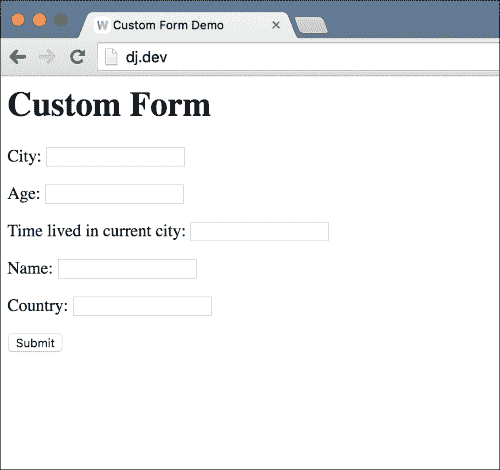

尝试提交一个不完整的表单，页面应该呈现出正确的错误消息。尝试完成表单并提交。现在你应该看到一个错误页面，显示`ImproperlyConfigured: No URL to redirect to. Provide a success_url`错误。这个错误来自我们使用的`FormView`通用视图。当表单有效时，它期望`success_url`被定义，以便用户可以被重定向到它。我们没有任何地方可以重定向用户，所以我们现在会忽略这个。让我们看看代码，看看我们在这里做了什么。

### 提示

这个例子也突出了通用视图的强大之处。通过重新定义一个函数`get_form`，我们能够使用`FormView`的所有功能，而这个表单是动态生成的。由于 Django 通用视图是以模块化为目的设计的，视图的其余部分并不关心表单是如何创建的，只要`get_form`方法返回一个有效的表单。

我们的`CustomFormView`的`get_form`方法中发生了大部分操作，所以让我们从那里开始。代码的第一行定义了我们将用来生成表单的 JSON 数据结构。正如我之前提到的，这些数据最终将来自数据库后端；然而，出于测试目的，我们现在将其硬编码。接下来，我们使用`json.loads`方法将 JSON 字符串转换为 Python 对象。这个转换过程非常直观。我们拥有的 JSON 字符串是一个带有`name`、`age`、`city`、`country`和`time_lived_in_current_city`键的字典。我们从`json.loads`得到的 Python 对象也是一个带有相同键/值对的字典。你也可以在你的 JSON 字符串中有数组，并且加载它会给你一个 Python 列表。JSON 支持嵌套对象，所以你可以有一个字典数组或一个值为数组的字典。

接下来，我们创建了基础`django.forms.Form`类的一个实例。正如我们之前的实验中看到的，我们可以取一个 Django 表单的实例并向其添加字段。我们不是创建一个空的表单类并使用它，而是直接使用 Django 的基础`Form`类。对于表单类的构造函数，我们传递了`self.get_form_kwargs()`接收到的任何内容。这个方法是 Django `FormView`类的一部分，根据请求类型创建正确的关键字参数传递给`Form`类。例如，如果请求是 POST/PUT 请求，`get_form_kwargs()`将返回一个包含`data`关键字参数的字典，以便我们可以使用表单来验证并对数据采取进一步的操作。

接下来发生有趣的事情，当我们循环遍历我们自定义字段数据的项目列表时。我们从 JSON 加载的数据上使用`items()`方法返回一个列表，如下所示：

```py
[('name', 'string'), ('age', 'number'), ('city', 'string'), ('country', 'string'), ('time_lived_in_city', 'string')]
```

我们循环遍历这个列表，将这些项目对分配给`for`循环中的变量`key`和`value`。然后我们将这些值传递给`get_field_class_from_type`方法，该方法决定使用哪个可用的表单字段类来处理传递的数据类型。该方法的代码是一个简单的`if/else`，如果传递了无效的类型，则返回一个字段类或`None`。

我们使用这个方法的返回值，这是一个类，并将其实例分配给表单的`fields`属性字典。*请注意，我们分配的是字段类的实例，而不是类本身*。字段的名称是我们的 JSON 字典中的键。我们还进行了一些基本的错误处理，如果我们在 JSON 数据字典中找不到匹配的字段类，则引发`TypeError`。

最后，我们返回我们定制的表单类。从那里开始，Django `FormView`接管并且要么呈现表单，如果需要的话带有错误，要么如果用户提交的表单数据有效，就重定向用户到成功的 URL。因为我们没有定义任何成功的 URL，所以当我们提交一个有效的表单时会出现错误。

就是这样。这就是我们需要创建动态生成表单的所有代码。我们可以添加一些其他功能，比如自定义验证或支持具有有限选择集的选择字段的高级功能，但我会把这些作为一个有趣的项目留给你自己去尝试。

接下来，让我们看看如何在数据库中存储定义我们自定义表单的 JSON 数据。我们将为其创建一个模型，并允许用户从管理面板创建具有不同字段的多个表单。

# 我们的 JSON 模型

正如我之前提到的，使用 JSON 作为表单定义格式的最大好处之一是它只使用简单的文本数据来编码复杂对象的定义。虽然一些数据库，如 PostgreSQL，有一个用于 JSON 的列类型，但其他数据库没有。然而，因为我们处理的是简单的文本数据，我们不需要一个！我们可以将我们的 JSON 数据存储在一个简单的`TextField`中，然后在需要时对数据进行编码和解码为 Python 字典。事实上，Django 社区中有许多人已经处理过这个问题，并为我们开源了他们的解决方案供我们使用。

我过去使用过的一个这样的包是`django-jsonfield`。你可以在[`github.com/bradjasper/django-jsonfield`](https://github.com/bradjasper/django-jsonfield)找到它，我们将在我们的项目中使用它。首先，在命令行中输入以下命令来安装所需的包。确保首先激活虚拟环境，以便它安装在正确的位置。

```py
> pip install jsonfield

```

安装了这个包后，我们可以为我们的表单创建一个模型。打开`main/models.py`并将其更改为以下代码：

```py
from __future__ import unicode_literals

from django.db import models

from jsonfield import JSONField

class FormSchema(models.Model):
    title = models.CharField(max_length=100)
    schema = JSONField()
```

保存文件，然后创建和运行迁移，以便 Django 为我们的新模型创建表。在命令行中运行以下命令：

```py
> python manage.py makemigrations main
Migrations for 'main':
  0001_initial.py:
    - Create model FormSchema
> python manage.py migrate
Operations to perform:
  Apply all migrations: sessions, contenttypes, admin, main, auth
Running migrations:
  Rendering model states... DONE
  Applying contenttypes.0001_initial... OK
  Applying auth.0001_initial... OK
  Applying admin.0001_initial... OK
  Applying admin.0002_logentry_remove_auto_add... OK
  Applying contenttypes.0002_remove_content_type_name... OK
  Applying auth.0002_alter_permission_name_max_length... OK
  Applying auth.0003_alter_user_email_max_length... OK
  Applying auth.0004_alter_user_username_opts... OK
  Applying auth.0005_alter_user_last_login_null... OK
  Applying auth.0006_require_contenttypes_0002... OK
  Applying auth.0007_alter_validators_add_error_messages... OK
  Applying sessions.0001_initial... OK
```

迁移完成后，让我们看看如何使用这个模型。我喜欢从在 Django shell 中进行一些实验开始，而不是直接编写视图的代码。输入以下内容打开它：

```py
> python manage.py shell
```

然后输入以下内容来测试我们的新模型：

```py
> from main.models import FormSchema
> fs = FormSchema()
> fs.title = 'My First Form'
> fs.schema = {'name': 'string', 'age': 'number', 'city': 'string', 'country': 'string', 'time_lived_in_current_city': 'string'}
> fs.save()
> FormSchema.objects.get(pk=1).schema
{u'age': u'number',
 u'city': u'string',
 u'country': u'string',
 u'name': u'string',
 u'time_lived_in_current_city': u'string'}
```

我们现在所做的对你来说应该很简单理解。这里要注意的重要事情是我们分配给`schema`字段的值。我们没有使用 JSON 数据的字符串表示，而是简单地分配了一个 Python 字典。我们在模型中使用的`JSONField`类在保存到数据库时会把 Python 字典转换为 JSON 字符串。

反之亦然。注意，在我们的 shell 会话的最后一行中，我们直接访问了模式字段，并得到了一个 Python 字典，而不是实际保存在数据库中的字符串 JSON 数据。这使得我们对 JSON 的处理对我们来说是透明的。

### 提示

你可能会想知道为什么我要求你在本章中进行实验并在 shell 中玩耍，而在之前的章节中，我直接向你展示了相关的视图/模型/模板代码。

就像我在本章开头提到的，本章是关于向你展示如何自己找到解决方案，而不是我牵着你的手直接向你展示最终结果。

我认识的所有优秀的 Django 开发者都有一种类似的方法来为他们所工作的项目开发解决方案。他们会进行一些实验，并通过这样做找到解决问题的方法。不过，每个人的实验方式都不同。有些人，比如我，经常使用 Django shell。其他人在视图和模型中编写测试代码。其他人可能创建简单的 Django 管理命令来做同样的事情。然而，每个人都经历了同样的过程。

我们发现一个需要解决的问题，我们稍微研究一下，然后尝试各种解决方法，最后选择我们最喜欢的方法。您最终会开发出一种您感到舒适的方法。与此同时，我将带您了解我的方法，如果您喜欢，可以使用这个方法。

现在我们的数据库中有一个`FormSchema`对象，让我们创建一个视图，可以使用这个对象来生成一个表单。在`main/views.py`中，首先在顶部导入我们的新模型：

```py
from main.models import FormSchema
```

然后将我们的`CustomFormView`中的`get_form`方法更改为匹配这个：

```py
def get_form(self):
    form_structure = FormSchema.objects.get(pk=1).schema

    custom_form = forms.Form(**self.get_form_kwargs())
    for key, value in form_structure.items():
        field_class = self.get_field_class_from_type(value)
        if field_class is not None:
            custom_form.fields[key] = field_class()
        else:
            raise TypeError("Invalid field type {}".format(value))

    return custom_form
```

我已经突出显示了新行。我们已经删除了我们使用的硬编码 JSON 字符串，并将数据库对象的`schema`字段的值分配给了`form_structure`变量。其余代码保持不变。尝试再次打开应用程序的主页。您会发现前端保持不变。交互也将保持不变。您可以尝试提交无效或不完整的数据，它将像以前一样显示错误。尝试提交有效的表单仍将导致有关未定义成功 URL 的错误。

接下来，让我们为我们的用户创建一个更好的前端。我们将创建一个列表视图，用户可以在该视图中看到站点上所有可用表单的列表，以及一个表单视图，显示实际的表单并处理交互。

# 创建更好的用户界面

我们将在这里做的事情并不复杂。您应该很容易跟上，所以我将给您写代码并留下解释，因为我们在之前的章节中已经做过这些很多次了。

首先，在项目根目录中创建一个`templates`目录。接下来，在我们的`formmason/settings.py`文件中的`TEMPLATES`配置变量的`DIRS`列表中添加它。`settings.py`文件已经配置了一个`TEMPLATES`变量，所以请继续用这里看到的值替换这个字典中的`DIRS`列表：

```py
TEMPLATES = [
    {
        'BACKEND': 'django.template.backends.django.DjangoTemplates',
        'DIRS': [
            os.path.join(BASE_DIR, 'templates'),
        ],
        'APP_DIRS': True,
        'OPTIONS': {
            'context_processors': [
                'django.template.context_processors.debug',
                'django.template.context_processors.request',
                'django.contrib.auth.context_processors.auth',
                'django.contrib.messages.context_processors.messages',
            ],
        },
    },
]
```

接下来，在您刚刚创建的新的`templates`目录中创建一个`base.html`模板，并将以下代码放入其中：

```py
<html>
<head>
    <meta http-equiv="content-type" content="text/html; charset=utf-8" />

    <title>Form Mason</title>
</head>

<body>
    <a href="">Home</a>
    
    
</body>
</html>
```

修改`main/templates/custom_form.html`以匹配这个：

```py



    <h1>Custom Form</h1>
    <form action="" method="post">
        {{ form.as_p }}
        <input type="submit" value="Submit" />
    </form>

```

将`main/views.py`更改为以下内容：

```py
from django import forms
from django.views.generic import FormView
from django.views.generic import ListView

from main.models import FormSchema

class HomePageView(ListView):
    model = FormSchema
    template_name = "home.html"

class CustomFormView(FormView):
    template_name = "custom_form.html"

    def get_form(self):
        form_structure = FormSchema.objects.get(pk=self.kwargs["form_pk"]).schema

        custom_form = forms.Form(**self.get_form_kwargs())
        for key, value in form_structure.items():
            field_class = self.get_field_class_from_type(value)
            if field_class is not None:
                custom_form.fields[key] = field_class()
            else:
                raise TypeError("Invalid field type {}".format(value))

        return custom_form

    def get_field_class_from_type(self, value_type):
        if value_type == "string":
            return forms.CharField
        elif value_type == "number":
            return forms.IntegerField
        else:
            return None
```

在`main/templates/home.html`中创建一个新的主页模板，并给出以下代码：

```py



    <h1>Available Forms</h1>
    
    <ul>
        
        <li><a href="">{{ form.title }}</a></li>
        
    </ul>
    

```

最后，将`formmason/urls.py`更改为匹配这个：

```py
from django.conf.urls import url

from main.views import CustomFormView
from main.views import HomePageView

urlpatterns = [
    url(r'^$', HomePageView.as_view(), name='home'),
    url(r'^form/(?P<form_pk>\d+)/$', CustomFormView.as_view(), name='custom-form'),
]
```

完成所有这些后，再次打开应用程序的主页`http://127.0.0.1:8000`，您应该会看到一个类似于这样的页面：

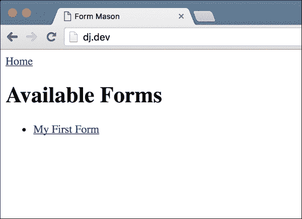

单击表单链接应该将您带到之前的相同表单页面；唯一的区别是现在它是在 URL `http://127.0.0.1:8000/form/1/` 上提供的。

就像我说的，所有这些都是我们在过去几章中反复做过的基本事情。可能新的一件事是我们在`CustomFormView.get_form`方法中使用了`self.kwargs['form_pk']`。以下是相关行：

```py
form_structure = FormSchema.objects.get(pk=self.kwargs["form_pk"]).schema
```

对于 Django 提供的任何通用视图（除了基本的`View`类），`self.kwargs`是与 URL 模式匹配的所有命名参数的字典。如果您查看我们的`formmason/urls.py`文件，我们定义了自定义表单页面的 URL 如下：

```py
url(r'^form/(?P<form_pk>\d+)/$', CustomFormView.as_view(), name='custom-form')
```

在我们的视图中，URL 的正则表达式模式中定义的`form_pk`参数在`self.kwargs`中可用。同样，URL 模式中的任何非关键字参数都可以在`self.args`中使用。

现在我们有了一个可用的用户界面，我们将继续将表单响应存储在我们的数据库中，并为我们的客户提供一个页面来查看这些响应。

# 保存响应

我们希望保存用户填写我们动态表单之一的响应。由于动态表单的数据也是动态的，我们需要在数据库中存储未知数量的字段及其值。正如我们已经看到的，JSON 是存储这种数据的合理方式。让我们在`main/models.py`中创建一个新模型来存储响应：

```py
class FormResponse(models.Model):
    form = models.ForeignKey(FormSchema)
    response = JSONField()
```

接下来，创建并运行迁移以将这个新模型添加到我们的数据库中：

```py
> python manage.py makemigrations main
Migrations for 'main':
  0002_formresponse.py:
    - Create model FormResponse
> python manage.py migrate main
Operations to perform:
  Apply all migrations: main
Running migrations:
  Rendering model states... DONE
  Applying main.0002_formresponse... OK
```

现在我们有了我们的模型，我们需要将我们表单的有效响应保存到这个模型中。`CustomFormView`的`form_valid`方法是添加此逻辑的正确位置。首先，我们需要在`main/views.py`文件的顶部从 Django 和我们的新模型中导入一些东西：

```py
from django.core.urlresolvers import reverse
from django.http.response import HttpResponseRedirect

from main.models import FormResponse
```

然后，在`CustomFormView`类中添加一个`form_valid`方法，其中包含以下代码：

```py
def form_valid(self, form):
    custom_form = FormSchema.objects.get(pk=self.kwargs["form_pk"])
    user_response = form.cleaned_data

    form_response = FormResponse(form=custom_form, response=user_response)
    form_response.save()

    return HttpResponseRedirect(reverse('home'))
```

就是这样。现在尝试提交我们之前创建的自定义表单，如果数据有效，您应该在响应保存后被重定向到主页。目前，我们无法在前端看到这些响应；但是，我们可以使用 Django shell 来确保我们的数据已经保存。使用以下命令启动 shell：

```py
> python manage.py shell

```

然后使用以下代码行来查看保存的响应：

```py
> from main.models import FormResponse
> FormResponse.objects.all()[0].response
{u'age': 27,
 u'city': u'Dubai',
 u'country': u'UAE',
 u'name': u'Jibran',
 u'time_lived_in_current_city': u'3 years'}

```

当保存表单时，您应该看到输入的数据。现在让我们创建一个屏幕，让我们的客户可以看到他们定制表单的响应。

# 显示响应

本节中的代码非常简单，对您来说应该没有任何意外。首先，在`main/views.py`中创建视图：

```py
class FormResponsesListView(ListView):
    template_name = "form_responses.html"

    def get_context_data(self, **kwargs):
        ctx = super(FormResponsesListView, self).get_context_data(**kwargs)
        ctx["form"] = self.get_form()

        return ctx

    def get_queryset(self):
        form = self.get_form()
        return FormResponse.objects.filter(form=form)

    def get_form(self):
        return FormSchema.objects.get(pk=self.kwargs["form_pk"])
```

接下来，创建`main/templates/form_responses.html`模板：

```py



<h1>Responses for {{ form.title }}</h1>

<ul>
    
    <li>{{ response.response }}</li>
    
</ul>


```

在`formmason/urls.py`中，导入我们的新视图：

```py
from main.views import FormResponsesListView
```

将此 URL 模式添加到`urlpatterns`列表中：

```py
url(r'^form/(?P<form_pk>\d+)/responses/$', FormResponsesListView.as_view(), name='form-responses'),
```

最后，编辑`main/templates/home.html`以添加到这个新视图的链接：

```py



    <h1>Available Forms</h1>
    
    <ul>
        
        <li>
            <a href="">{{ form.title }}</a><br />
 <a href="">See Responses</a>
        </li>
        
    </ul>
    

```

新的代码行已经突出显示。在进行所有这些更改后，打开主页，您应该看到现有表单链接旁边的**查看响应**链接，用于新视图：

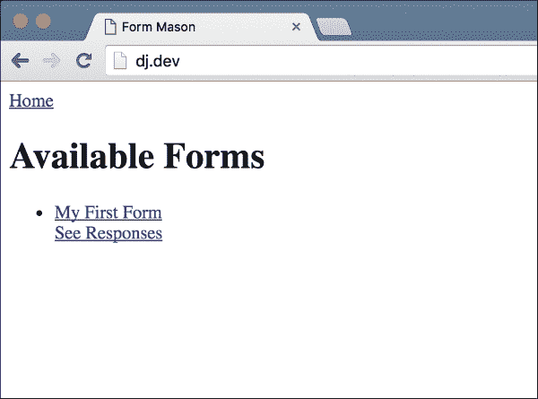

单击链接应该会带您到以下页面：

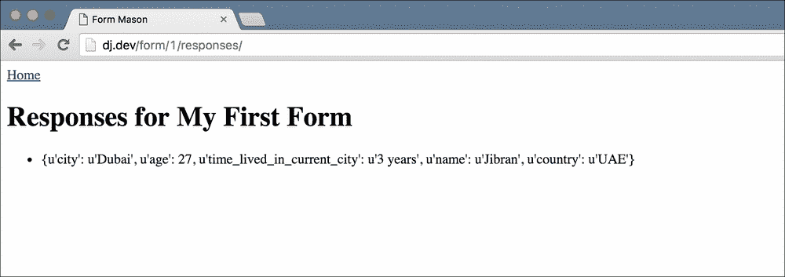

虽然它可以完成工作，但它非常粗糙。我们可以做得更好。让我们改进一下。

## 改进的响应列表

我们希望以表格的形式显示响应，字段名称作为标题，字段的响应值显示在它们的下方。让我们首先修改我们的视图代码。在`main/views.py`中，首先导入`TemplateView`，因为我们将不再使用`ListView`作为`FormResponsesListView`的基类：

```py
from django.views.generic import TemplateView
```

接下来，修改`FormResponsesListView`以匹配以下代码：

```py
class FormResponsesListView(TemplateView):
    template_name = "form_responses.html"

    def get_context_data(self, **kwargs):
        ctx = super(FormResponsesListView, self).get_context_data(**kwargs)

        form = self.get_form()
        schema = form.schema
        form_fields = schema.keys()
        ctx["headers"] = form_fields
        ctx["form"] = form

        responses = self.get_queryset()
        responses_list = list()
        for response in responses:
            response_values = list()
            response_data = response.response

            for field_name in form_fields:
                if field_name in response_data:
                    response_values.append(response_data[field_name])
                else:
                    response_values.append('')
            responses_list.append(response_values)

        ctx["object_list"] = responses_list

        return ctx

    def get_queryset(self):
        form = self.get_form()
        return FormResponse.objects.filter(form=form)

    def get_form(self):
        return FormSchema.objects.get(pk=self.kwargs["form_pk"])
```

这里的主要更改在`get_context_data`方法中。我们还将基类从`ListView`更改为`TemplateView`。让我们看看我们在`get_context_data`方法中做了什么。

首先，我们使用 JSON 表单模式中的`keys`方法来创建字段标题的列表，该模式保存在`FormSchema`模型中。我们将这个列表传递给模板中的`headers`上下文变量。

稍微复杂的部分接下来。我们循环遍历数据库中的每个`FormResponse`对象。对于每个响应对象，我们然后循环遍历表单字段名称，并从响应数据中获取该属性。我们这样做是因为在 Django 模板中，没有办法使用变量键名从字典中获取值。我们可以创建一个自定义模板标签；但是，那会增加不必要的复杂性。相反，我们在视图中做同样的事情，这样更容易。对于每个响应对象，我们创建一个与字段标题顺序相同的值列表。然后，我们将这个字段值列表添加到我们的响应列表中。当我们查看我们的模板时，我们的数据结构方式变得清晰。

最后，我们将响应列表分配给`object_list`模板上下文变量并返回上下文。接下来，让我们修改`main/templates/form_responses.html`模板以匹配以下内容：

```py



<h1>Responses for {{ form.title }}</h1>

<table border="1px">
    <tr>
        
        <th>{{ field_name }}</th>
        
    </tr>
    
    <tr>
        
        <td>{{ field_value }}</td>
        
    </tr>
    
</table>


```

如果您理解了我们在视图中的数据结构方式，那么模板应该很容易理解。这是我们现在需要做的所有更改。

如果您再次打开响应页面，您现在应该看到一个整齐排列的表格，如下截图所示：

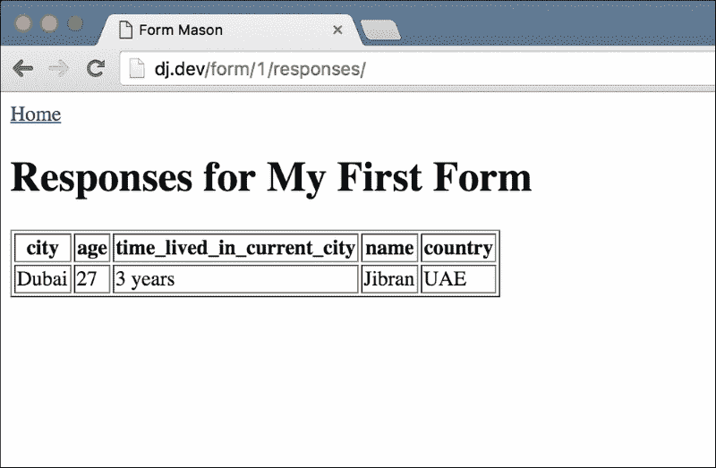

到目前为止，我们已经创建了一个页面来列出可用的表单，一个页面来提交动态表单的数据，以及一个页面来显示这些响应。我们的应用程序几乎完成了。然而，我们仍然缺少一个页面，允许客户创建自定义表单。让我们接下来解决这个问题。

# 设计表单创建界面

我们希望为用户提供一个友好的界面，以编辑他们动态表单的结构。理想的界面应该是允许用户在网页上进行拖放操作，并使用简单的点击和输入操作设置这些字段的属性。然而，创建这样的界面是一个重大的工作，需要一个前端开发人员和设计师团队来创建用户友好的界面。

不幸的是，我们无法创建这样的界面，因为这样的界面更多的是一个前端项目，而不是与 Django 相关的项目。然而，如果你愿意，这是一个很好的练习，如果你想提高你的前端技能。

对于这个项目，我们将创建一个简单的 Django 表单，用户可以手动输入 JSON 来定义他们的表单结构。我们将提供基本的验证和编辑功能。所以让我们从创建我们的表单开始。更改`main/forms.py`文件以匹配以下代码：

```py
import json

from django import forms

class NewDynamicFormForm(forms.Form):
    form_pk = forms.CharField(widget=forms.HiddenInput(), required=False)
    title = forms.CharField()
    schema = forms.CharField(widget=forms.Textarea())

    def clean_schema(self):
        schema = self.cleaned_data["schema"]
        try:
            schema = json.loads(schema)
        except:
            raise forms.ValidationError("Invalid JSON. Please submit valid JSON for the schema")

        return schema
```

表单本身非常简单。然而，我们需要仔细研究`clean_schema`方法。当在 Django 表单上调用`is_valid()`方法时，它经过了几个步骤。确切的细节可以在文档中找到[https://docs.djangoproject.com/en/stable/ref/forms/validation/]。然而，一个很好的近似值是 Django 在表单类上调用两种不同类型的清理方法。首先，它查找每个字段定义在表单上的`clean_<fieldname>`方法。这个方法应该返回字段的清理值，然后存储在表单的`cleaned_data`字典中。接下来，Django 在表单类上调用`clean`方法。这个方法用于清理相互依赖的字段的数据，因为依赖的清理不应该在单独的`clean_<fieldname>`方法中完成。`clean`方法应该返回一个字典，它将完全替换表单的`cleaned_data`字典。

任何一种清理方法都可以引发`forms.ValidationError`异常，如果数据不符合预期的格式。如果在`clean_<fieldname>`方法中引发`ValidationError`，则错误与该字段绑定，并在表单呈现时显示在其旁边。如果错误是在一般的`clean`方法中引发的，错误将显示在表单错误列表中，在表单字段在 HTML 中开始之前显示。

由于我们希望确保用户在模式字段中输入的数据是有效的 JSON，我们在用户输入的数据上使用`json.loads`，如果调用失败则引发异常。一个重要的事情要注意的是，如果我们的`clean_schema`调用成功，我们将返回模式的修改版本。这是因为在我们的模型中，我们需要保存一个 Python 字典而不是一个 JSON 字符串。当保存到数据库时，我们的`JSONField`模型字段处理了从 Python 对象到 JSON 字符串的必要转换。

另一个需要注意的是`clean_schema`方法没有给出任何参数。它必须从表单的`cleaned_data`字典中获取模式字段的值。有了我们创建的表单，让我们在`main/views.py`中添加一个视图来显示这个表单。首先，在顶部导入我们的新表单和`json`库：

```py
import json
from main.forms import NewDynamicFormForm
```

然后在视图中添加以下代码：

```py
class CreateEditFormView(FormView):
    form_class = NewDynamicFormForm
    template_name = "create_edit_form.html"

    def get_initial(self):
        if "form_pk" in self.kwargs:
            form = FormSchema.objects.get(pk=self.kwargs["form_pk"])
            initial = {
                "form_pk": form.pk,
                "title": form.title,
                "schema": json.dumps(form.schema)
            }
        else:
            initial = {}

        return initial

    def get_context_data(self, **kwargs):
        ctx = super(CreateEditFormView, self).get_context_data(**kwargs)
        if "form_pk" in self.kwargs:
            ctx["form_pk"] = self.kwargs["form_pk"]

        return ctx

    def form_valid(self, form):
        cleaned_data = form.cleaned_data

        if cleaned_data.get("form_pk"):
            old_form = FormSchema.objects.get(pk=cleaned_data["form_pk"])
            old_form.title = cleaned_data["title"]
            old_form.schema = cleaned_data["schema"]
            old_form.save()
        else:
            new_form = FormSchema(title=cleaned_data["title"], schema=cleaned_data["schema"])
            new_form.save()

        return HttpResponseRedirect(reverse("home"))
```

接下来，创建`main/templates/create_edit_form.html`文件，并将以下代码放入其中：

```py



<h1>Create/Edit Form</h1>


<form action="" method="post">

<form action="" method="post">


{{ form.as_p }}
<input type="submit" value="Create Form" />
</form>

```

最后，在我们的`formmason/urls.py`中导入这个新视图，并为它添加两个模式到`urlpatterns`文件。这是最终的`formmason/urls.py`文件：

```py
from django.conf.urls import url

from main.views import CreateEditFormView
from main.views import CustomFormView
from main.views import FormResponsesListView
from main.views import HomePageView

urlpatterns = [
    url(r'^$', HomePageView.as_view(), name='home'),
    url(r'^form/(?P<form_pk>\d+)/$', CustomFormView.as_view(), name='custom-form'),
    url(r'^form/(?P<form_pk>\d+)/responses/$', FormResponsesListView.as_view(), name='form-responses'),

    url(r'form/new/$', CreateEditFormView.as_view(), name='create-form'),
    url(r'form/(?P<form_pk>\d+)/edit/$', CreateEditFormView.as_view(), name='edit-form'),
]
```

我们两次使用相同的视图——一次作为创建视图，一次作为编辑视图。如果你看一下视图的代码，我们会根据 URL 中的`form_pk`关键字参数是否匹配来为表单提供来自`FormSchema`对象的初始数据。如果没有匹配，我们知道我们正在创建一个新表单，我们的初始数据字典是空的。需要注意的一点是，在初始数据中，我们使用`json.dumps(form.schema)`来为模式字段提供初始值。这与我们在表单的`clean_schema`方法中所做的相反。这是因为`form.schema`是一个 Python 对象；然而，我们的前端需要显示结构的 JSON。因此，我们使用`json.dumps`方法将 Python 对象转换为 JSON 字符串。

我们在视图的`form_valid`方法中处理两种情况——新表单创建和表单编辑。成功保存或创建我们的表单后，我们将用户重定向到主页。

我们需要做的最后一件事是在我们的基本模板和主页上添加链接来创建和编辑表单。首先，在`templates/base.html`中的**Home**链接后添加此链接：

```py
<a href="">Create New Form</a>
```

在`main/templates/home.html`中，在**查看响应**链接后添加这个：

```py
<br /><a href="">Edit Form</a>
```

就是这样。让我们来测试一下。首先打开主页`http://127.0.0.1:8000/`，你应该看到类似下面截图的内容：

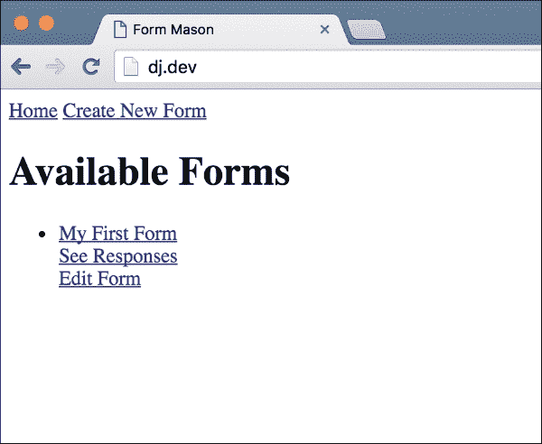

点击**编辑表单**按钮，你应该看到下面的页面：

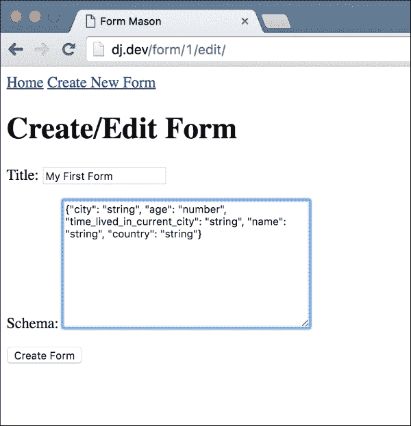

让我们将标题更改为新的内容，然后在**模式**字段中输入这个：

```py
{"years_of_experience": "number", "occupation": "string"}
```

点击**创建新表单**链接。这应该保存表单并将您带回主页。主页上的表单标题应该更改为您编辑的内容。点击链接查看表单，你应该看到类似这样的屏幕：

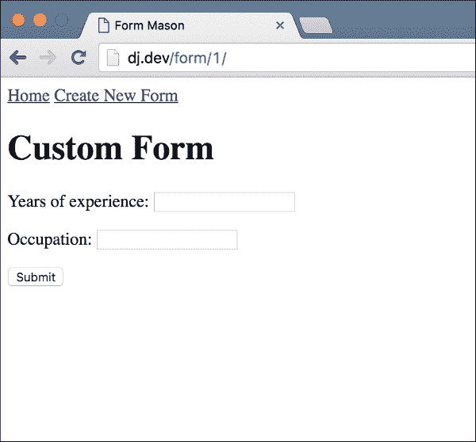

太棒了！我们的表单已经更改以匹配我们在编辑表单时输入的模式。让我们看看我们的响应页面是什么样子的。使用新的表单模式提交一些测试数据，然后打开响应页面。你应该看到类似这样的内容：

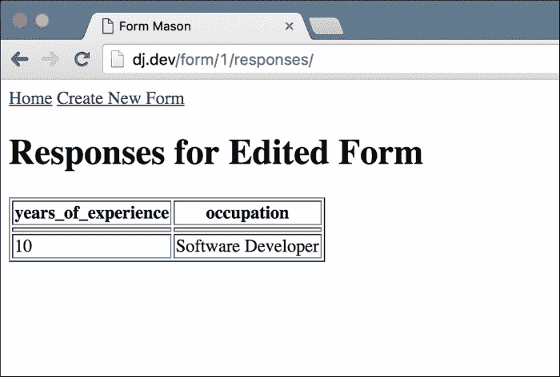

这个页面按预期工作，无需更改任何代码。你会发现以前的响应不再可见；然而，在最新的响应上方似乎有一些空单元格。我们将在接下来解决这个问题和其他一些小问题。然而，我们的应用程序除了需要做一些小修复外已经完成了。

你也应该在页面顶部使用**创建新表单**链接来创建一个新表单并进行测试。它应该按预期工作。

# 小修复

我在最后一节工作时注意到了三个小错误，我想要修复。首先，如果你仔细看表单提交页面（用户可以在自定义表单中输入数据的页面），你会注意到顶部的标题是**自定义表单**。这是我们的第一个测试，当我们的表单模式是在硬编码的 JSON 字符串中定义的，并且没有标题。由于我们的表单模型现在有一个标题字段，编辑`main/templates/custom_form.html`并更改`h1`标签以匹配以下内容：

```py
<h1>{{ form_schema.title }}</h1>
```

接下来，在`main/views.py`中编辑`CustomFormView`并将`this get_context_data`方法添加到类中：

```py
def get_context_data(self, **kwargs):
    ctx = super(CustomFormView, self).get_context_data(**kwargs)

    form_schema = FormSchema.objects.get(pk=self.kwargs["form_pk"])
    ctx["form_schema"] = form_schema

    return ctx
```

再次查看表单详细页面。这次，标题应该反映表单标题，如下面的截图所示：

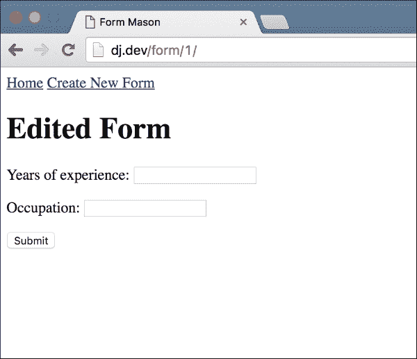

我注意到的下一个错误是在表单编辑页面上。现在，无论你是创建新表单还是编辑现有表单，标题总是说`创建/编辑表单`，**提交**按钮总是说**创建新表单**。让我们修改我们的`main/templates/create_edit_form.html`模板，明确告诉用户他们正在执行什么操作。以下是模板的最终代码：

```py




    <h1>Edit Form</h1>

    <h1>Create Form</h1>



<form action="" method="post">

<form action="" method="post">

    {{ form.as_p }}
    
        <input type="submit" value="Save Form" />
    
        <input type="submit" value="Create Form" />
    
</form>

```

现在，如果你编辑一个现有表单或创建一个新表单，标题和按钮应该与该操作匹配：

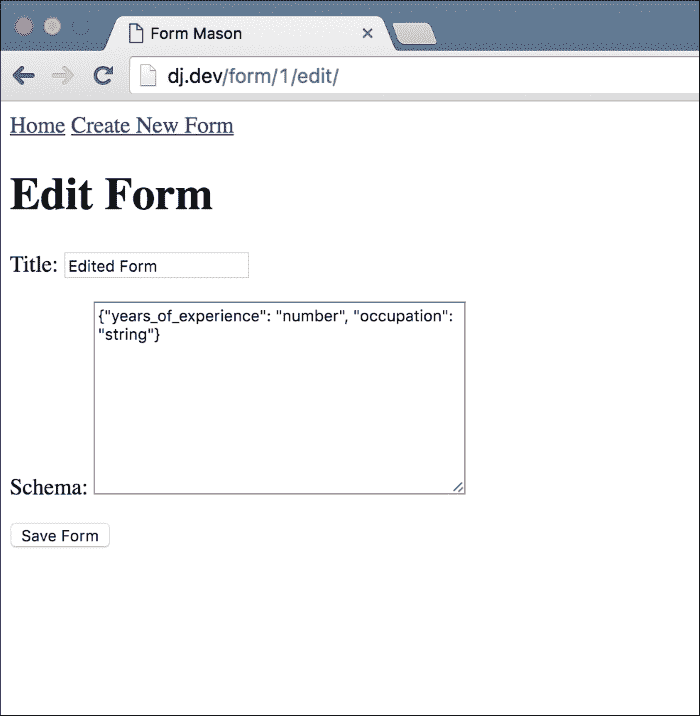

我看到的最后一个问题是在响应页面上。如果你编辑一个已经有响应的表单，并且新表单没有旧表单的任何字段，你会看到一些空的表格行。这是因为即使我们的视图代码不包括这些行的任何数据，它仍然包括一个空行。让我们通过修改`main/views.py`中`FormResponsesListView`的`get_context_data`方法来解决这个问题。找到这段代码：

```py
for field_name in form_fields:
    if field_name in response_data:
        response_values.append(response_data[field_name])
    else:
        response_values.append('')
responses_list.append(response_values)
```

将其更改为以下内容：

```py
for field_name in form_fields:
    if field_name in response_data:
        response_values.append(response_data[field_name])
    else:
        response_values.append('')
if any(response_values):
 responses_list.append(response_values)

```

最后两行，被标记的那些，是更改。`any`函数是一个内置的 Python 方法，如果给定列表中的任何值求值为`True`，则返回`True`。如果我们的`responses_list`包含所有空字符串，也就是说，如果我们的新表单结构没有与旧表单结构重叠的字段，`if`条件将失败，我们将不会在我们的响应列表中包含一个完全空的行。再次查看响应列表页面，你会发现空行现在已经消失了：

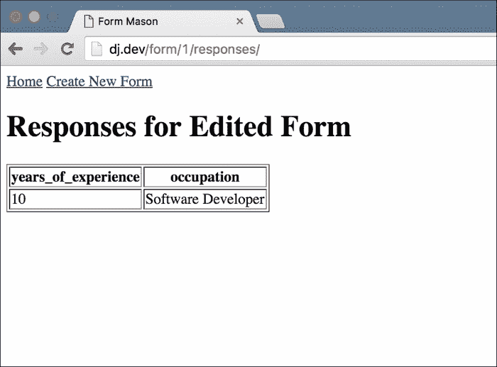

就是这样。我们最后一个，也是最雄心勃勃的应用程序已经完成。恭喜！你已经从我们在本书开头创建的简单博客中走了很长的路。现在你应该准备好应对任何网页应用项目了。

# 总结

本章更多的是关于探索而不是新概念。你学到的唯一重要的新概念是关于 Django 表单的内部工作原理，而这一部分不到五页。本章的其余部分是关于找到我们在路上遇到的问题的解决方案。

正如我在本章开头所说的，这是我们在书中创建的最复杂的应用程序。这也很可能是你在职业生涯初期创建的更复杂的应用程序之一。这并不是一个完美的产品；这更多是因为我们没有做任何前端工作，而不是 Django 后端功能的缺失。

虽然我们在本章对 Django 表单的了解将对你非常有价值，但我希望你从中主要学到的是解决问题的方法。我们发现了一个需要解决的问题，我们在 Django shell 中进行了实验，然后找到了解决方案。有时候情况会比这更复杂。你可能需要搜索互联网上的现有解决方案或向同事求助。然而，在找到似乎与你的问题相关的答案之后，你总是需要回到实验中，确保解决方案确实解决了你的问题。

我向你展示的在 Django shell 中玩耍的方式只是你可以选择尝试不同解决方案的众多方式之一。正如我之前提到的，每个人都有自己的技巧。有些人使用管理命令，有些人使用简单的 Python 脚本，有些人在视图中编写测试代码。最终，你会找到自己最喜欢的方式。

我希望你从本章中带走的另一件事是使用外部库来帮助解决我们的问题。当我们需要一种方法来在数据库中存储 JSON 时，我们使用了`jsonfield`库，这是作为开源软件可用的，而不是自己定制的解决方案。这有利有弊。好处是，如果你找到一个广泛使用的包，比如`jsonfield`，你将得到一个经过许多人测试的解决方案。由于经过测试，该库将比你或任何人自己想出的东西稳定得多。使用外部内容的缺点是你无法控制项目的发展方向，在某些项目中，你将不得不仔细检查外部库的代码，以确保它符合项目可能对外部代码使用的任何规定。

然而，就我个人而言，我更喜欢每次都使用经过验证的第三方库，而不是自己创建东西。对我来说，优点通常大于缺点。

就是这样！这是我们从一个简单的博客开始的史诗般旅程的最后一章！我们已经走了很长的路；然而，我相信你作为一名 Django 网络开发者的旅程才刚刚开始。你还有许多令人期待的事情，我祝你在这个旅程中一切顺利。希望你和我写作时一样享受阅读这本书。一路顺风！
