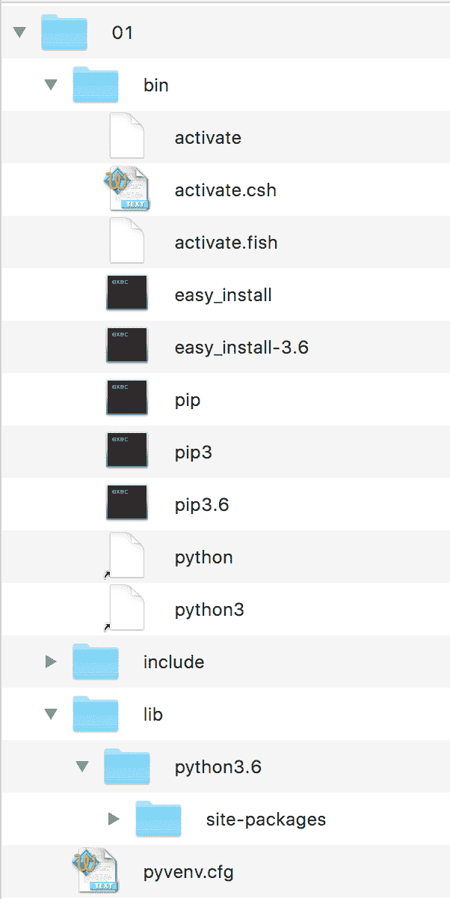
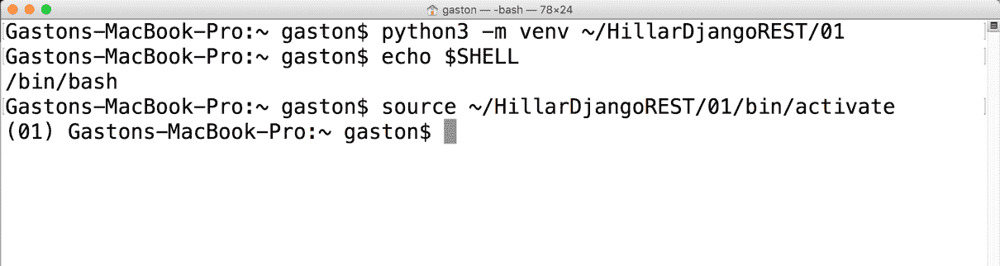
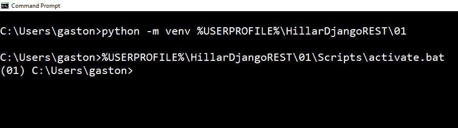
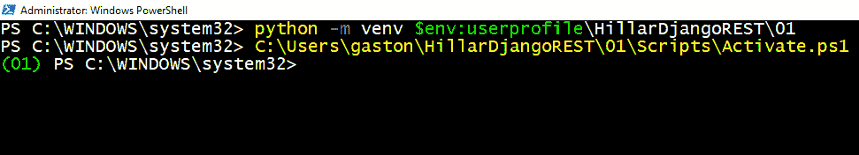
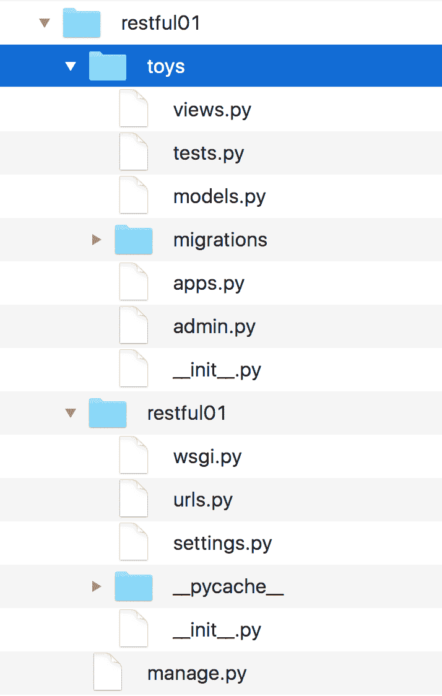
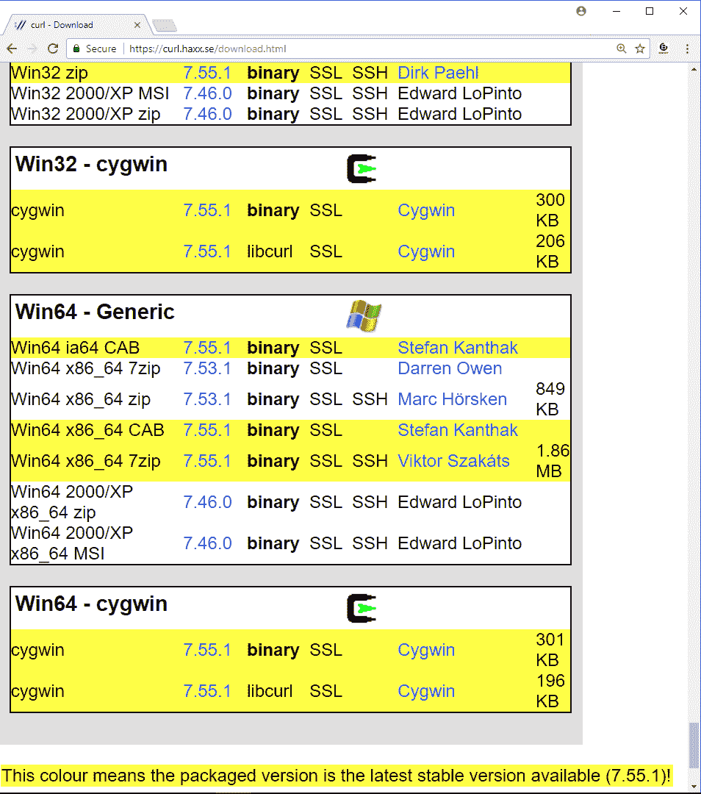
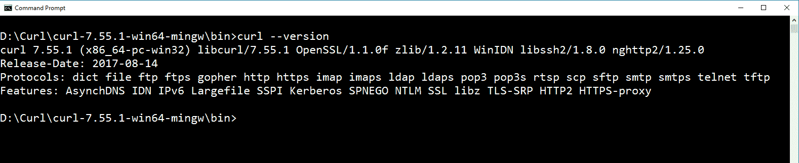
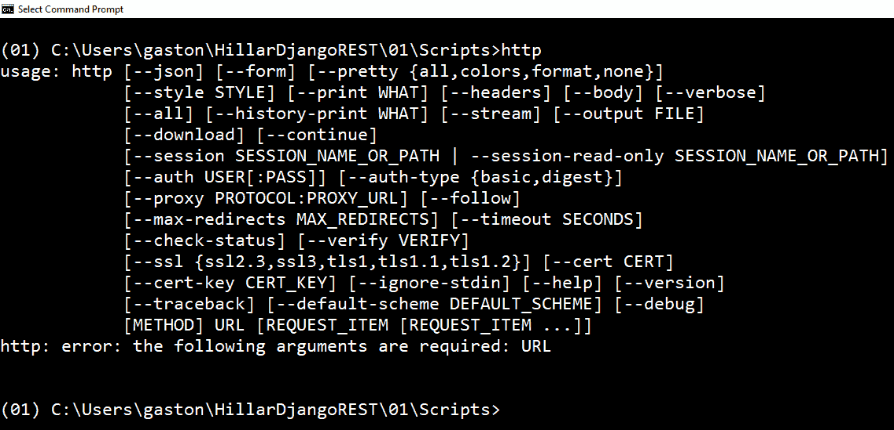
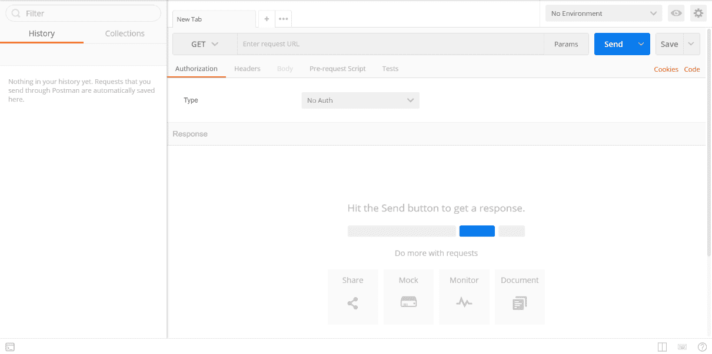
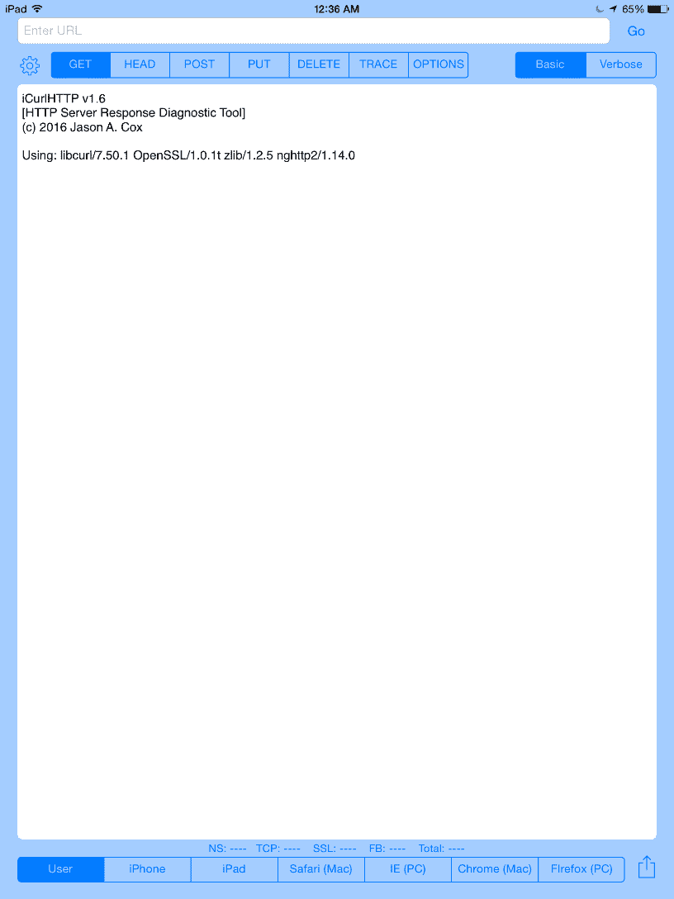

# 第一章：安装所需的软件和工具

在本章中，我们将开始使用 Python 和其最受欢迎的 Web 框架 Django 来创建 RESTful Web 服务的旅程。Python 是最受欢迎和最灵活的编程语言之一。有成千上万的 Python 包，允许您将 Python 的能力扩展到您能想象到的任何领域。您可以使用 Django 和包轻松构建简单和复杂的 RESTful Web 服务，这些服务可以在您喜欢的平台上运行。

我们将利用您现有的 Python 和其所有包的知识来编写您 RESTful Web 服务及其生态系统的不同部分。我们将使用面向对象特性来创建易于维护、理解和重用的代码。我们不需要学习另一种编程语言，我们可以使用我们已知并喜爱的语言：Python。

在本章中，我们将安装和配置用于使用 Django 和 Django REST 框架创建 RESTful Web 服务的环境和所需的软件和工具。我们将学习 Linux、macOS 和 Windows 中的必要步骤。我们将了解以下内容：

+   使用 Python 3.x 和 PEP 405 创建虚拟环境

+   理解虚拟环境的目录结构

+   激活虚拟环境

+   关闭虚拟环境

+   在隔离环境中安装 Django 和 Django REST 框架

+   使用 Django 创建应用

+   理解 Django 文件夹、文件和配置

+   安装 Curl

+   安装 HTTPie

+   安装 Postman REST 客户端

+   安装 Stoplight

+   安装 iCurlHTTP

# 使用 Python 3.x 和 PEP 405 创建虚拟环境

在本书中，我们将使用不同的包和库来创建 RESTful Web 服务，因此使用 Python 虚拟环境是方便的。Python 3.3 引入了轻量级虚拟环境，并在 Python 3.4 中得到了改进。我们将使用这些虚拟环境，因此您需要 Python 3.4 或更高版本。您可以在[`www.python.org/dev/peps/pep-0405`](https://www.python.org/dev/peps/pep-0405)上阅读有关 PEP 405 Python 虚拟环境的更多信息，该 PEP 引入了 `venv` 模块。本书中的所有示例都在 Linux、macOS 和 Windows 上的 Python 3.6.2 上进行了测试。

如果您决定使用流行的第三方虚拟环境构建工具 `virtualenv` ([`pypi.python.org/pypi/virtualenv`](https://pypi.python.org/pypi/virtualenv)) 或您 Python IDE 提供的虚拟环境选项，您只需确保在需要时使用适当的机制激活您的虚拟环境，而不是遵循使用 Python 内置的 `venv` 模块生成的虚拟环境的激活步骤。

我们使用`venv`创建的每个虚拟环境都是一个隔离的环境，并且它将在其 site 目录（文件夹）中拥有自己独立的一组已安装的 Python 包。当我们使用 Python 3.4 及更高版本中的`venv`创建虚拟环境时，`pip`将包含在新的虚拟环境中。在 Python 3.3 中，创建虚拟环境后需要手动安装`pip`。请注意，提供的指令与 Python 3.4 或更高版本兼容，包括 Python 3.6.2。

为了创建一个轻量级的虚拟环境，第一步是选择用于它的目标文件夹或目录。以下是在示例中我们将使用的 Linux 和 macOS 的路径。

虚拟环境的目标文件夹将是我们主目录中的`HillarDjangoREST/01`文件夹。例如，如果我们的 macOS 或 Linux 中的主目录是`/Users/gaston`，虚拟环境将在`/Users/gaston/HillarDjangoREST/01`中创建。您可以在每个命令中将指定的路径替换为您想要的路径：

```py
    ~/HillarDjangoREST/01
```

以下是在示例中我们将使用的 Windows 的路径。虚拟环境的目标文件夹将是我们用户配置文件中的`HillarDjangoREST\01`文件夹。例如，如果我们的用户配置文件是`C:\Users\gaston`，虚拟环境将在`C:\Users\gaston\HillarDjangoREST\01`中创建。您可以在每个命令中将指定的路径替换为您想要的路径：

```py
    %USERPROFILE%\HillarDjangoREST\01
```

在 Windows PowerShell 中，之前的路径如下：

```py
    $env:userprofile\HillarDjangoREST\01
```

现在，我们将使用`venv`创建一个新的虚拟环境。为了做到这一点，我们必须使用`-m`选项，后跟`venv`模块名称和所需的路径，以便 Python 将此模块作为脚本运行并创建指定路径中的虚拟环境。根据我们创建虚拟环境的平台，指令可能会有所不同。

在 Linux 或 macOS 中打开终端并执行以下命令以创建虚拟环境：

```py
    python3 -m venv ~/HillarDjangoREST/01
```

在 Windows 中，在命令提示符中执行以下命令以创建虚拟环境：

```py
    python -m venv %USERPROFILE%\HillarDjangoREST\01
```

如果您想使用 Windows PowerShell，请执行以下命令以创建虚拟环境：

```py
    python -m venv $env:userprofile\HillarDjangoREST\01
```

之前的所有命令都不会产生任何输出。脚本创建了指定的目标文件夹，并通过调用`ensurepip`安装了`pip`，因为我们没有指定`--without-pip`选项。

# 理解虚拟环境的目录结构

指定的目标文件夹有一个新的目录树，其中包含 Python 可执行文件和其他指示它是 PEP405 虚拟环境的文件。

在虚拟环境的根目录中，`pyenv.cfg` 配置文件指定了虚拟环境的不同选项，其存在表明我们位于虚拟环境的根文件夹中。在 Linux 和 macOS 上，该文件夹将包含以下主要子文件夹：`bin`、`include`、`lib`、`lib/python3.6` 和 `lib/python3.6/site-packages`。在 Windows 上，文件夹将包含以下主要子文件夹：`Include`、`Lib`、`Lib\site-packages` 和 `Scripts`。每个平台上的虚拟环境目录树结构与这些平台上的 Python 安装布局相同。

以下图显示了在 macOS 和 Linux 平台上为 `01` 虚拟环境生成的目录树中的文件夹和文件：



以下图显示了为 Windows 平台虚拟环境生成的目录树中的主要文件夹：


激活虚拟环境后，我们将安装第三方软件包到虚拟环境中，模块将位于 `lib/python3.6/site-packages` 或 `Lib\site-packages` 文件夹中，具体取决于平台。可执行文件将被复制到 `bin` 或 `Scripts` 文件夹中，具体取决于平台。我们安装的软件包不会更改其他虚拟环境或我们的基础 Python 环境。

# 激活虚拟环境

现在我们已经创建了一个虚拟环境，我们将运行一个特定平台的脚本以激活它。激活虚拟环境后，我们将安装仅在此虚拟环境中可用的软件包。这样，我们将在一个隔离的环境中工作，其中我们安装的所有软件包都不会影响我们的主要 Python 环境。

注意，如果您的终端会话中没有启动除默认 shell 之外的其他 shell，则此命令的结果将是准确的。如果您有疑问，请检查您的终端配置和首选项。在 Linux 或 macOS 的终端中运行以下命令：

```py
    echo $SHELL
```

该命令将显示您在终端中使用的 shell 名称。在 macOS 上，默认为 `/bin/bash`，这意味着您正在使用 `bash` shell。根据 shell 的不同，您必须在 Linux 或 macOS 上运行不同的命令来激活虚拟环境。

如果您的终端配置为在 Linux 或 macOS 上使用 `bash` shell，请运行以下命令以激活虚拟环境。该命令也适用于 `zsh` shell：

```py
    source ~/HillarDjangoREST/01/bin/activate
```

如果您的终端配置为使用 `csh` 或 `tcsh` shell，请运行以下命令以激活虚拟环境：

```py
    source ~/HillarDjangoREST/01/bin/activate.csh
```

如果您的终端配置为使用 `fish` shell，请运行以下命令以激活虚拟环境：

```py
    source ~/HillarDjangoREST/01/bin/activate.fish
```

激活虚拟环境后，命令提示符将显示括号内的虚拟环境根文件夹名称作为默认提示的前缀，以提醒我们我们正在虚拟环境中工作。在这种情况下，我们将看到命令提示符的前缀为`(01)`，因为激活的虚拟环境的根文件夹是`01`。

以下截图显示了在 macOS Sierra 终端中使用`bash`外壳执行之前显示的命令后激活的虚拟环境：



如前一个截图所示，提示从

`Gastons-MacBook-Pro:~ gaston$` 在激活虚拟环境后变为 `(01) Gastons-MacBook-Pro:~ gaston$`。

在 Windows 中，您可以在命令提示符中运行批处理文件或 Windows PowerShell 脚本以激活虚拟环境。

如果您更喜欢命令提示符，请在 Windows 命令行中运行以下命令以激活虚拟环境：

```py
    %USERPROFILE%\HillarDjangoREST\01\Scripts\activate.bat
```

以下截图显示了在执行之前显示的命令后激活的 Windows 10 命令提示符中的虚拟环境：



如前一个截图所示，激活虚拟环境后，提示从`C:\Users\gaston`变为`(01) C:\Users\gaston`。

如果您更喜欢 Windows PowerShell，请启动它并运行以下命令以激活虚拟环境。请注意，您必须在 Windows PowerShell 中启用脚本执行才能运行脚本：

```py
    cd $env:USERPROFILE
    HillarDjangoREST\01\Scripts\Activate.ps1
```

如果您收到类似于以下行号的错误，这意味着您没有启用脚本执行：

```py
    C:\Users\gaston\HillarDjangoREST\01\Scripts\Activate.ps1 : File C:\Users\gaston\HillarDjangoREST\01\Scripts\Activate.ps1 cannot be loaded because running scripts is disabled on this system. For more information, see about_Execution_Policies at
    http://go.microsoft.com/fwlink/?LinkID=135170.
    At line:1 char:1
    + C:\Users\gaston\HillarDjangoREST\01\Scripts\Activate.ps1
    + ~~~~~~~~~~~~~~~~~~~~~~~~~~~~~~~~~~~~~~~~~~~~~~~~~~~~~~~~
        + CategoryInfo          : SecurityError: (:) [], PSSecurityException
        + FullyQualifiedErrorId : UnauthorizedAccess

```

Windows PowerShell 的默认执行策略是`Restricted`。此策略允许执行单个命令，但不会运行脚本。因此，如果您想使用 Windows PowerShell，您必须更改策略以允许执行脚本。确保您了解允许您运行未签名脚本的 Windows PowerShell 执行策略的风险非常重要。有关不同策略的更多信息，请查看以下网页：[`docs.microsoft.com/en-us/powershell/module/microsoft.powershell.core/about/about_execution_policies?view=powershell-6`](https://docs.microsoft.com/en-us/powershell/module/microsoft.powershell.core/about/about_execution_policies?view=powershell-6)。

以下截图显示了在 Windows 10 PowerShell 中执行之前显示的命令后激活的虚拟环境：



# 关闭虚拟环境

使用前面解释的过程生成的虚拟环境取消激活非常简单。取消激活将删除在环境变量中做出的所有更改，并将提示符变回默认消息。一旦取消激活虚拟环境，您将回到默认的 Python 环境。

在 macOS 或 Linux 中，只需键入 `deactivate` 并按 *Enter*。

在 Windows 命令提示符中，您必须在 `Scripts` 文件夹中运行的 `deactivate.bat` 批处理文件。在我们的示例中，此文件的完整路径为 `%USERPROFILE%\HillarDjangoREST\01\Scripts\deactivate.bat`。

在 Windows PowerShell 中，您必须在 `Scripts` 文件夹中运行 `Deactivate.ps1` 脚本。在我们的示例中，此文件的完整路径为 `$env:userprofile\HillarDjangoREST\01\Scripts\Deactivate.ps1`。请记住，您必须在 Windows PowerShell 中启用脚本执行才能运行此脚本。

下一段落的说明假设我们创建的虚拟环境已激活。

# 在隔离环境中安装 Django 和 Django REST 框架

我们已创建并激活了一个轻量级的虚拟环境。现在是时候运行许多命令了，这些命令对 Linux、macOS 或 Windows 都是一样的。

首先，运行以下命令以安装 Django 网络框架：

```py
pip install django==1.11.5
```

输出的最后几行将指示 `django` 包已成功安装。此过程还将安装提供世界时区定义的 `pytz` 包。请注意，您可能还会看到有关升级 `pip` 的通知。以下几行显示了成功 `pip` 安装生成的输出最后四行的示例：

```py
Collecting django
Collecting pytz (from django)
Installing collected packages: pytz, django
Successfully installed django-1.11.5 pytz-2017.2
```

现在我们已经安装了 Django 网络框架，我们可以安装 Django REST 框架。Django REST 框架建立在 Django 之上，为我们提供了一个强大且灵活的工具包来构建 RESTful 网络服务。我们只需运行以下命令来安装此包：

```py
pip install djangorestframework==3.6.4
```

输出的最后几行将指示 `djangorestframework` 包已成功安装，如下所示：

```py
Collecting djangorestframework
Installing collected packages: djangorestframework
Successfully installed djangorestframework-3.6.4  
```

在遵循前面的步骤之后，我们将在我们的虚拟环境中安装 Django REST 框架 3.6.4 和 Django 1.11.5。在接下来的章节中，我们将根据需要安装额外的包。

# 使用 Django 创建一个应用

现在，我们将使用 Django 创建我们的第一个应用，并分析 Django 创建的目录结构。首先，转到虚拟环境的根文件夹：`01`。

在 Linux 或 macOS 中，输入以下命令：

```py
cd ~/HillarDjangoREST/01
```

如果您更喜欢命令提示符，请在 Windows 命令行中运行以下命令：

```py
cd /d %USERPROFILE%\HillarDjangoREST\01
```

如果您更喜欢 Windows PowerShell，请在 Windows PowerShell 中运行以下命令：

```py
cd /d $env:USERPROFILE\HillarDjangoREST\01  
```

在 Linux 或 macOS 中，运行以下命令以创建一个名为 `restful01` 的新 Django 项目。该命令不会产生任何输出：

```py
python bin/django-admin.py startproject restful01  
```

在 Windows 中，无论是在命令提示符还是 PowerShell 中，运行以下命令以创建一个名为 `restful01` 的新 Django 项目。命令不会产生任何输出：

```py
python Scripts\django-admin.py startproject restful01  
```

之前的命令创建了一个包含其他子文件夹和 Python 文件的 `restful01` 文件夹。现在，转到最近创建的 `restful01` 文件夹。在任何平台上只需执行以下命令：

```py
cd restful01
```

然后，运行以下命令以在 `restful01` Django 项目中创建一个名为 `toys` 的新 Django 应用。命令不会产生任何输出：

```py
python manage.py startapp toys
```

之前的命令创建了一个新的 `restful01/toys` 子文件夹，包含以下文件：

+   `views.py`

+   `tests.py`

+   `models.py`

+   `apps.py`

+   `admin.py`

+   `__init__.py`

此外，`restful01/toys` 文件夹将包含一个名为 `migrations` 的子文件夹，其中包含一个 `__init__.py` Python 脚本。以下图表显示了目录树中的文件夹和文件，从 `restful01` 文件夹开始，包含两个子文件夹 - `toys` 和 `restful01`：



# 理解 Django 文件夹、文件和配置

在我们创建第一个 Django 项目和 Django 应用之后，会有许多新的文件夹和文件。首先，使用您喜欢的编辑器或 IDE 检查位于 `restful01/toys` 文件夹内的 `apps.py` 文件中的 Python 代码（在 Windows 中为 `restful01\toys`）。以下几行显示了该文件的代码：

```py
from django.apps import AppConfig 

class ToysConfig(AppConfig): 
    name = 'toys' 
```

代码将 `ToysConfig` 类声明为 `django.apps.AppConfig` 类的子类，该类代表 Django 应用及其配置。`ToysConfig` 类仅定义了 `name` 类属性并将其值设置为 `'toys'`。

现在，我们必须将 `toys.apps.ToysConfig` 添加到配置 `restful01` Django 项目的 `restful01/settings.py` 文件中的已安装应用之一。我通过以下方式构建了之前的字符串：应用名称 + `.apps.` + 类名称，即 `toys` + `.apps.` + `ToysConfig`。此外，我们还需要添加 `rest_framework` 应用，以便我们能够使用 Django REST 框架。

`restful01/settings.py` 文件是一个 Python 模块，其中包含模块级变量，这些变量定义了 `restful01` 项目的 Django 配置。我们将对此 Django 设置文件进行一些更改。打开 `restful01/settings.py` 文件，找到指定已安装应用的字符串列表的突出显示行。以下代码显示了 `settings.py` 文件的第一个几行。请注意，文件中还有更多代码：

```py
""" 
Django settings for restful01 project. 

Generated by 'django-admin startproject' using Django 1.11.5\. 

For more information on this file, see 
https://docs.djangoproject.com/en/1.11/topics/settings/ 

For the full list of settings and their values, see 
https://docs.djangoproject.com/en/1.11/ref/settings/ 
""" 

import os 

# Build paths inside the project like this: os.path.join(BASE_DIR, ...) 
BASE_DIR = os.path.dirname(os.path.dirname(os.path.abspath(__file__))) 

# Quick-start development settings - unsuitable for production 
# See https://docs.djangoproject.com/en/1.11/howto/deployment/checklist/ 

# SECURITY WARNING: keep the secret key used in production secret! 
SECRET_KEY = '+uyg(tmn%eo+fpg+fcwmm&x(2x0gml8)=cs@$nijab%)y$a*xe' 

# SECURITY WARNING: don't run with debug turned on in production! 
DEBUG = True 

ALLOWED_HOSTS = [] 

# Application definition 

INSTALLED_APPS = [ 
    'django.contrib.admin', 
    'django.contrib.auth', 
    'django.contrib.contenttypes', 
    'django.contrib.sessions', 
    'django.contrib.messages', 
    'django.contrib.staticfiles', 
] 
```

将以下两个字符串添加到 `INSTALLED_APPS` 字符串列表中，并将更改保存到 `restful01/settings.py` 文件中：

+   `'rest_framework'`

+   `'toys.apps.ToysConfig'`

以下几行显示了声明 `INSTALLED_APPS` 字符串列表的新代码，其中突出显示了添加的行，并带有注释以了解每个添加的字符串的含义。示例代码文件包含在 `hillar_django_restful_01` 文件夹中：

```py
INSTALLED_APPS = [ 
    'django.contrib.admin', 
    'django.contrib.auth', 
    'django.contrib.contenttypes', 
    'django.contrib.sessions', 
    'django.contrib.messages', 
    'django.contrib.staticfiles', 
    # Django REST framework 
    'rest_framework', 
    # Toys application 
    'toys.apps.ToysConfig', 
] 
```

这样，我们就将 Django REST 框架和`toys`应用程序添加到了我们的初始 Django 项目`restful01`中。

# 安装工具

现在，我们将暂时放下 Django，我们将安装许多我们将用于与本书中开发的 RESTful Web 服务交互的工具。

我们将在本书中使用的以下不同类型的工具来编写和发送 HTTP 请求以及可视化响应：

+   命令行工具

+   图形用户界面工具

+   Python 代码

+   网络浏览器

+   JavaScript 代码

您可以使用任何允许您编写和发送 HTTP 请求的其他应用程序。有许多在平板电脑和智能手机上运行的应用程序可以帮助您完成这项任务。然而，我们将专注于在 Django 中构建 RESTful Web 服务时最有用的工具。

# 安装 Curl

我们将开始安装命令行工具。命令行工具的一个关键优势是，一旦我们第一次构建了 HTTP 请求，我们就可以轻松地再次运行它们，而无需使用鼠标或触摸屏幕来运行请求。我们还可以轻松地构建带有批处理请求的脚本并运行它们。

与任何命令行工具一样，与 GUI 工具相比，执行第一次请求可能需要更多时间，但一旦我们执行了许多请求，它就会变得更容易，我们可以轻松地重用我们过去编写的命令来编写新的请求。

**Curl**，也称为**cURL**，是一个非常流行的开源命令行工具和库，它允许我们轻松地传输数据。我们可以使用`curl`命令行工具轻松地编写和发送 HTTP 请求并检查它们的响应。

在 Linux 或 macOS 中，您可以在终端中打开一个终端并开始使用命令行`curl`。

在 Windows 中，您有两个选择。您可以在命令提示符中使用`curl`，或者您可以选择将 curl 作为 Cygwin 包安装选项的一部分进行安装，并从 Cygwin 终端执行它。您可以在[`cygwin.com/install.html`](http://cygwin.com/install.html)上了解更多关于 Cygwin 终端及其安装过程的信息。Windows Powershell 包括一个`curl`别名，它调用`Invoke-WebRequest`命令，因此，如果您想使用 Windows Powershell 与 curl 一起工作，则必须删除`curl`别名。

如果您想在命令提示符中使用`curl`命令，您只需下载并解压`curl`下载页面上的最新版本：[`curl.haxx.se/download.html`](https://curl.haxx.se/download.html)。请确保您下载包含 SSL 和 SSH 的版本。

以下截图显示了 Windows 中可用的下载内容。Win64 - Generic 部分包括我们可以在命令提示符或 Windows Powershell 中运行的版本。

`Win64 x86_64.7zip`文件提供了带有 SSL 和 SSH 支持的`curl`版本 7.55.1 的二进制版本：



在解压缩您下载的 `.7zip` 或 `.zip` 文件后，您可以将包含 `curl.exe` 的文件夹添加到您的路径中。例如，如果您解压缩了 `Win64 x86_64.7zip` 文件，您将在 `bin` 文件夹中找到 `curl.exe`。以下截图显示了在 Windows 10 命令提示符中执行 `curl --version` 的结果。`--version` 选项使 curl 显示其版本以及它支持的所有库、协议和功能：



# 安装 HTTPie

现在，我们将安装 HTTPie，这是一个用 Python 编写的命令行 HTTP 客户端，它使得发送 HTTP 请求变得容易，并且使用的语法比 curl 更简单。默认情况下，HTTPie 显示彩色输出，并使用多行来显示响应细节。在某些情况下，HTTPie 使理解响应比 curl 工具更容易。然而，HTTPie 作为命令行工具的一个重大缺点是它比 curl 加载时间更长，因此，如果您想编写包含太多命令的脚本，您必须评估是否使用 HTTPie 有意义。

我们只需要确保在刚刚创建并激活的虚拟环境中运行以下命令。这样，我们只为虚拟环境安装 HTTPie。

在终端、命令提示符或 Windows PowerShell 中运行以下命令以安装 `httpie` 包：

```py
pip install --upgrade httpie
```

输出的最后几行将指示 `httpie` 包已成功安装：

```py
    Collecting httpie
    Collecting colorama>=0.2.4 (from httpie)
    Collecting requests>=2.11.0 (from httpie)
    Collecting Pygments>=2.1.3 (from httpie)
    Collecting idna<2.7,>=2.5 (from requests>=2.11.0->httpie)
    Collecting urllib3<1.23,>=1.21.1 (from requests>=2.11.0->httpie)
    Collecting chardet<3.1.0,>=3.0.2 (from requests>=2.11.0->httpie)
    Collecting certifi>=2017.4.17 (from requests>=2.11.0->httpie)
    Installing collected packages: colorama, idna, urllib3, chardet, certifi, requests, Pygments, httpie
    Successfully installed Pygments-2.2.0 certifi-2017.7.27.1 chardet-3.0.4 colorama-0.3.9 httpie-0.9.9 idna-2.6 requests-2.18.4 urllib3-1.22

```

如果你忘记了如何激活为我们这个示例创建的虚拟环境，请阅读本章中的 *激活虚拟环境* 部分。

现在，我们将能够使用 `http` 命令轻松地编写和发送 HTTP 请求到我们用 Django 构建的未来的 RESTful Web 服务。以下截图显示了在 Windows 10 命令提示符中执行 `http` 的结果。HTTPie 显示了有效的选项，并指出需要 URL：



# 安装 Postman REST 客户端

到目前为止，我们已经安装了两个基于终端或命令行的工具来编写和发送 HTTP 请求到我们的 Django 开发服务器：cURL 和 HTTPie。现在，我们将开始安装 **图形用户界面**（**GUI**）工具。

Postman 是一个非常流行的 API 测试套件图形用户界面（GUI）工具，它允许我们轻松地编写和发送 HTTP 请求，以及其他功能。Postman 作为独立应用程序在 Linux、macOS 和 Windows 上可用。您可以从以下网址下载 *Postman* 应用程序的版本：[`www.getpostman.com`](https://www.getpostman.com)。

您可以免费下载并安装 Postman，以编写并发送 HTTP 请求到本书中我们将构建的 RESTful Web 服务。您只需在 Postman 上注册即可。在我们的示例中，我们不会使用 Postman Pro 或 Postman Enterprise 提供的任何付费功能。所有说明都适用于 Postman 5.2.1 或更高版本。

以下截图显示了 Postman 中的 HTTP GET 请求构建器：



# 安装 Stoplight

Stoplight 是一个非常有用的 GUI 工具，专注于帮助架构师和开发者建模复杂的 API。如果我们需要用多种不同的编程语言消费我们的 RESTful Web 服务，我们将发现 Stoplight 非常有帮助。Stoplight 提供了一个 HTTP 请求生成器，允许我们编写和发送请求，并生成在不同编程语言中（如 JavaScript、Swift、C#、PHP、Node 和 Go 等）执行它们的必要代码。

Stoplight 提供网页版，也作为独立应用程序在 Linux、macOS 和 Windows 上可用。您可以从以下网址下载 Stoplight 的版本：[`stoplight.io/`](http://stoplight.io/)。

以下截图显示了 Stoplight 中的 HTTP GET 请求构建器，底部有代码生成：


# 安装 iCurlHTTP

我们也可以使用可以在移动设备上编写和发送 HTTP 请求的应用程序来与我们的 RESTful Web 服务一起工作。例如，我们可以在 iPad 和 iPhone 等 iOS 设备上使用 iCurlHTTP 应用程序：[`itunes.apple.com/us/app/icurlhttp/id611943891`](https://itunes.apple.com/us/app/icurlhttp/id611943891)。在 Android 设备上，我们可以使用*HTTP Request*应用程序：[`play.google.com/store/apps/details?id=air.http.request&hl=en`](https://play.google.com/store/apps/details?id=air.http.request&hl=en)。

以下截图显示了在 iPad Pro 上运行的 iCurlHTTP 应用程序的用户界面：



在撰写本文时，允许您编写和发送 HTTP 请求的移动应用程序并不提供您在 Postman 或命令行工具中可以找到的所有功能。

# 测试你的知识

让我们看看你是否能正确回答以下问题：

1.  在我们激活虚拟环境后，我们使用`pip`安装的所有包都可用：

    1.  对于运行 Python 的计算机或设备上的所有可用虚拟环境

    1.  仅适用于激活的虚拟环境

    1.  对于当前用户创建的所有虚拟环境

1.  HTTPie 是一个：

    1.  用 Python 编写的命令行 HTTP 服务器，使其轻松创建 RESTful Web 服务器

    1.  命令行实用程序，允许我们对 SQLite 数据库运行查询

    1.  用 Python 编写的命令行 HTTP 客户端，使其轻松编写和发送 HTTP 请求

1.  以下哪个命令在 Django 中创建了一个名为`books`的新应用程序？

    1.  `django startapp books`

    1.  `python django.py startapp books`

    1.  `python manage.py startapp books`

1.  在 Django 中，以下哪个类的子类代表 Django 应用及其配置？

    1.  `django.apps.AppConfig`

    1.  `django.application.configuration`

    1.  `django.config.App`

1.  以下哪个字符串必须添加到`settings.py`文件中的`INSTALLED_APPS`字符串列表中，以启用 Django REST 框架？

    1.  `'rest_framework'`

    1.  `'django_rest_framework'`

    1.  `'Django_REST_framework'`

正确答案包含在附录的*解决方案*中。

# 摘要

在本章中，我们学习了在 Python 中使用轻量级虚拟环境的优势，并使用 Django 和 Django REST 框架设置了一个虚拟环境。我们使用 Django 创建了一个应用，初步了解了 Django 的文件夹、文件和配置，并对 Django REST 框架进行了必要的更改以激活它。

然后，我们介绍了并安装了我们将用于与我们在接下来的章节中设计、编码、测试和运行的 RESTful Web 服务交互的命令行和 GUI 工具。

现在我们已经准备好了环境，可以开始使用 Django REST 框架工作了，我们将定义我们第一个 RESTful Web 服务的需求，并处理模型、迁移、序列化和反序列化，这些是我们将在下一章讨论的主题。
