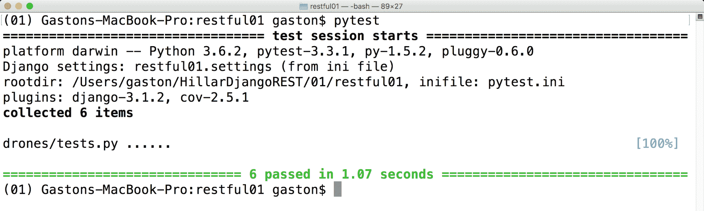
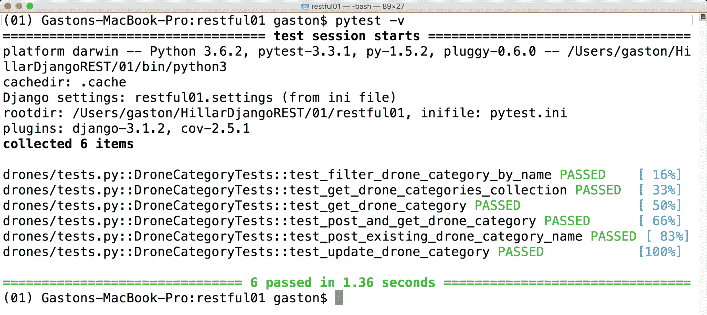
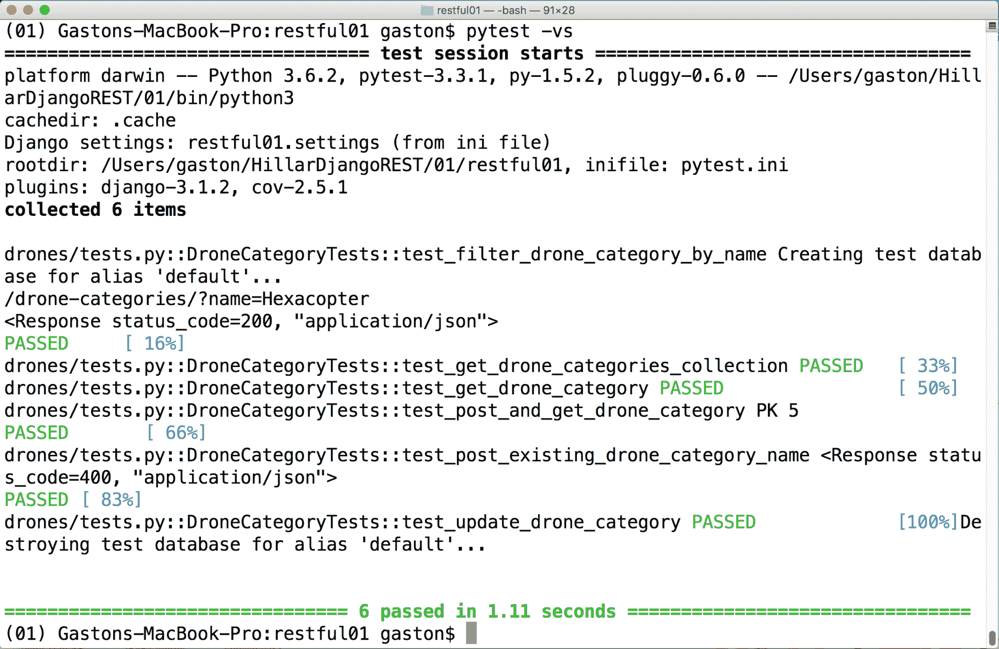
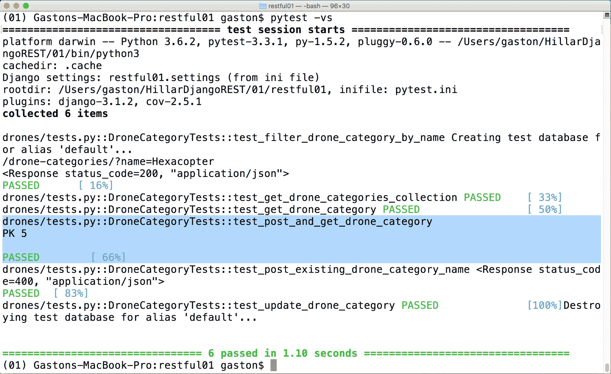
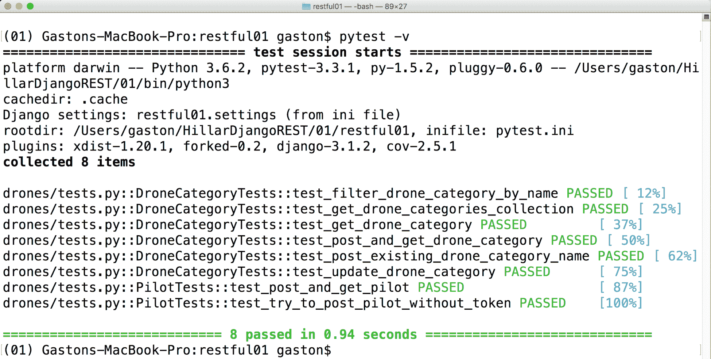

# 第八章：自动化测试

在本章中，我们将为我们的 RESTful Web 服务添加一些自动化测试，并在测试数据库中执行这些测试。我们不会涵盖我们应该为我们的复杂 RESTful Web 服务编写的所有测试。然而，我们将遵循第一步，并了解以下内容：

+   准备使用 pytest 进行单元测试

+   为 RESTful Web 服务编写单元测试

+   使用 pytest 发现和运行单元测试

+   编写新的单元测试以改进测试代码覆盖率

+   运行新的单元测试

# 准备使用 pytest 进行单元测试

到目前为止，我们一直在编写代码为我们的 RESTful Web 服务添加功能，并为 Django REST 框架配置许多设置。我们使用命令行和 GUI 工具来了解所有组件是如何协同工作的，以及检查各种 HTTP 请求的结果。现在，我们将编写单元测试，以确保我们的 RESTful Web 服务按预期工作。在我们开始编写单元测试之前，有必要在我们的虚拟环境中安装许多额外的包。确保你关闭 Django 的开发服务器。记住，你只需在终端中按*Ctrl* + *C*，或者转到正在运行的命令提示符窗口。首先，我们将对代码进行一些修改，以便与我们的 RESTful Web 服务的单个版本一起工作。

这样做，我们就可以更容易地专注于示例中单个版本的测试。替换`restful01/restful01`文件夹中的`urls.py`文件中的代码，具体来说，是`restful01/restful01/urls.py`文件。该文件定义了根 URL 配置，因此我们只想包含我们网络服务第一版本的 URL 模式。示例代码文件包含在`hillar_django_restful_10_01`文件夹中的`restful01/restful01/urls.py`文件中：

```py
from django.conf.urls import url, include 

urlpatterns = [ 
    url(r'^', include('drones.urls')), 
    url(r'^api-auth/', include('rest_framework.urls')) 
]
```

我们将在我们的虚拟环境中安装以下 Python 包：

+   `pytest`：这是一个非常流行的 Python 单元测试框架，它使测试变得简单，并减少了样板代码

+   `pytest-django`：这个`pytest`插件允许我们轻松地在 Django 测试中使用和配置`pytest`提供的功能

注意，我们不会使用 Django 的`manage.pytest`命令。我们将使用`pytest`。然而，如果你不想使用`pytest`，你将学到的大部分内容可以轻松地适应任何其他测试框架。实际上，如果你的代码与`nose`兼容，你可以选择使用最常见但略过时的配置来测试 Django REST 框架。如今，`pytest`是 Python 首选的单元测试框架。

运行以下命令来安装`pytest`包：

```py
pip install pytest
```

输出的最后几行将指示`pytest`包及其所需包已成功安装：

```py
Installing collected packages: attrs, pluggy, six, py, pytest Running setup.py install for pluggy ... doneSuccessfully installed attrs-17.3.0 pluggy-0.6.0 py-1.5.2 pytest-3.3.1 six-1.11.0
```

我们只需运行以下命令来安装`pytest-django`包：

```py
pip install pytest-django
```

输出的最后几行将指示`pytest-django`包已成功安装：

```py
Installing collected packages: pytest-django
Successfully installed pytest-django-3.1.2
```

现在，转到包含`manage.py`文件的`restful01`文件夹，创建一个名为`pytest.ini`的新文件。在这个新文件中写入以下代码。以下行显示了此文件的代码，指定了 Django 设置模块（`restful01.settings`）和`pytest`将用于定位 Python 文件、声明测试的模式。示例的代码文件包含在`hillar_django_restful_10_01`文件夹中的`restful01/pytest.ini`文件中：

```py
[pytest] 
DJANGO_SETTINGS_MODULE = restful01.settings 
python_files = tests.py test_*.py *_tests.py 
```

每次我们执行 pytest 来运行测试时，测试运行器将检查以下内容以找到测试定义：

+   命名为`tests.py`的 Python 文件

+   以`test_`前缀开始的 Python 文件

+   以`_tests`后缀结尾的 Python 文件

在第九章，*应用节流规则和版本管理*中，我们为我们的 RESTful Web Service 配置了节流规则。我们希望在考虑节流规则的情况下运行我们的测试。实际上，我们应该编写测试来确保节流规则正常工作。我们将多次运行请求，因此，我们为节流规则使用的低值可能会使所有测试所需的请求复杂化。因此，我们将增加节流规则的值以简化我们的测试样本。打开声明 Django 项目`restful01`配置的模块级变量的`restful01/restful01/settings.py`文件。我们将对此 Django 设置文件进行一些修改。替换`REST_FRAMEWORK`字典中包含的突出显示行的代码。以下行显示了`REST_FRAMEWORK`字典的新声明。示例的代码文件包含在`hillar_django_restful_10_01`文件夹中的`restful01/restful01/settings.py`文件中：

```py
REST_FRAMEWORK = { 
    'DEFAULT_PAGINATION_CLASS': 
    'drones.custompagination.LimitOffsetPaginationWithUpperBound', 
    'PAGE_SIZE': 4, 
    'DEFAULT_FILTER_BACKENDS': ( 
        'django_filters.rest_framework.DjangoFilterBackend', 
        'rest_framework.filters.OrderingFilter', 
        'rest_framework.filters.SearchFilter', 
        ), 
    'DEFAULT_AUTHENTICATION_CLASSES': ( 
        'rest_framework.authentication.BasicAuthentication', 
        'rest_framework.authentication.SessionAuthentication', 
        ), 
    'DEFAULT_THROTTLE_CLASSES': ( 
        'rest_framework.throttling.AnonRateThrottle', 
        'rest_framework.throttling.UserRateThrottle', 
    ), 
    'DEFAULT_THROTTLE_RATES': { 
        'anon': '300/hour', 
        'user': '100/hour', 
        'drones': '200/hour', 
        'pilots': '150/hour', 
    } 
} 
```

我们增加了每个节流速率配置中每小时可以执行的请求数量。这样，我们将能够无问题地运行我们的测试。

在这种情况下，我们使用相同的设置文件来运行我们的测试，以避免运行额外的步骤和重复测试设置。然而，在大多数情况下，我们会为测试创建一个特定的 Django 配置文件。

# 为 RESTful Web Service 编写单元测试

现在，我们将编写与无人机类别类视图相关的第一轮单元测试：`DroneCategoryList`和`DroneCategoryDetail`。打开现有的`restful01/drones/tests.py`文件，并用以下行替换现有的代码，这些行声明了许多`import`语句和`DroneCategoryTests`类。示例的代码文件包含在`hillar_django_restful_10_01`文件夹中的`restful01/drones/tests.py`文件中：

```py
from django.utils.http import urlencode 
from django.core.urlresolvers import reverse 
from rest_framework import status 
from rest_framework.test import APITestCase 
from drones.models import DroneCategory 
from drones import views 

class DroneCategoryTests(APITestCase): 
    def post_drone_category(self, name): 
        url = reverse(views.DroneCategoryList.name) 
        data = {'name': name} 
        response = self.client.post(url, data, format='json') 
        return response 

    def test_post_and_get_drone_category(self): 
        """ 
        Ensure we can create a new DroneCategory and then retrieve it 
        """ 
        new_drone_category_name = 'Hexacopter' 
        response = self.post_drone_category(new_drone_category_name) 
        print("PK {0}".format(DroneCategory.objects.get().pk)) 
        assert response.status_code == status.HTTP_201_CREATED 
        assert DroneCategory.objects.count() == 1 
        assert DroneCategory.objects.get().name == new_drone_category_name 
```

`DroneCategoryTests` 类是 `rest_framework.test.APITestCase` 超类的子类，并声明了一个接收新无人机类别所需 `name` 作为参数的 `post_drone_category` 方法。

此方法构建 URL 和数据字典，以组合并发送一个 HTTP `POST` 请求到与 `views.DroneCategoryList.name` 名称（`dronecategory-list`）关联的视图，并返回此请求生成的响应。

代码使用 `self.client` 属性来访问 `APIClient` 实例，这使得我们可以轻松地组合并发送 HTTP 请求来测试使用 Django REST 框架的 RESTful Web 服务。对于这个测试，代码使用构建的 `url`、`data` 字典和所需的数据格式 `'json'` 调用 `post` 方法。

许多测试方法将调用 `post_drone_category` 方法来创建一个新的无人机类别，然后组合并发送其他 HTTP 请求到 RESTful Web 服务。例如，我们需要一个无人机类别来发布一个新的无人机。

`test_post_and_get_drone_category` 方法测试我们是否可以创建一个新的 `DroneCategory` 并然后检索它。该方法调用 `post_drone_category` 方法，然后多次调用 `assert` 来检查以下预期的结果：

1.  响应的 `status_code` 属性等于 HTTP 201 已创建（`status.HTTP_201_CREATED`）

1.  从数据库中检索到的 `DroneCategory` 对象总数为 `1`

1.  获取的 `DroneCategory` 对象的 `name` 属性值等于传递给 `post_drone_category` 方法的参数 `new_drone_category_name` 变量

之前编写的测试确保我们可以通过 RESTful Web 服务创建一个新的无人机类别，它在数据库中持久化，序列化器按预期工作。无人机类别是一个非常简单的实体，因为它只有一个主键和一个名称。现在，我们将添加更多的测试方法，以便我们可以覆盖更多与无人机类别相关的场景。

将 `test_post_existing_drone_category_name` 方法添加到最近创建的 `DroneCategoryTests` 类中，位于 `restful01/drones/tests.py` 文件。示例代码文件包含在 `hillar_django_restful_10_01` 文件夹中，位于 `restful01/drones/tests.py` 文件：

```py
    def test_post_existing_drone_category_name(self): 
        """ 
        Ensure we cannot create a DroneCategory with an existing name 
        """ 
        url = reverse(views.DroneCategoryList.name) 
        new_drone_category_name = 'Duplicated Copter' 
        data = {'name': new_drone_category_name} 
        response1 = self.post_drone_category(new_drone_category_name) 
        assert response1.status_code == status.HTTP_201_CREATED 
        response2 = self.post_drone_category(new_drone_category_name) 
        print(response2) 
        assert response2.status_code == status.HTTP_400_BAD_REQUEST 
```

新方法测试无人机类别名称的唯一约束是否按预期工作，并且不允许我们创建具有相同名称的两个无人机类别。当我们第二次组合并发送具有重复无人机名称的 HTTP `POST` 请求时，我们必须收到 HTTP `400 Bad Request` 状态码（`status.HTTP_400_BAD_REQUEST`）。

将 `test_filter_drone_category_by_name` 方法添加到 `restful01/drones/tests.py` 文件中的 `DroneCategoryTests` 类。示例代码文件包含在 `hillar_django_restful_10_01` 文件夹中，位于 `restful01/drones/tests.py` 文件：

```py
    def test_filter_drone_category_by_name(self): 
        """ 
        Ensure we can filter a drone category by name 
        """ 
        drone_category_name1 = 'Hexacopter' 
        self.post_drone_category(drone_category_name1) 
        drone_caregory_name2 = 'Octocopter' 
        self.post_drone_category(drone_caregory_name2) 
        filter_by_name = { 'name' : drone_category_name1 } 
        url = '{0}?{1}'.format( 
            reverse(views.DroneCategoryList.name), 
            urlencode(filter_by_name)) 
        print(url) 
        response = self.client.get(url, format='json') 
        print(response) 
        assert response.status_code == status.HTTP_200_OK 
        # Make sure we receive only one element in the response 
        assert response.data['count'] == 1 
        assert response.data['results'][0]['name'] == 
        drone_category_name1 
```

新方法测试我们是否可以通过名称过滤无人机类别，因此检查了我们为 `DroneCategoryList` 类视图配置的过滤器字段的使用。代码创建了两个无人机类别，然后调用 `django.utils.http.urlencode` 函数从 `filter_by_name` 字典构建编码后的 URL。此字典将字段名称作为键，将字段所需的字符串作为值。在这种情况下，`drone_category_name1` 等于 `'Hexacopter'`，因此，保存到 `url` 变量的编码 URL 将是 `'name=Hexacopter'`。

在调用 `self.client.get` 并使用构建的 URL 获取过滤后的无人机类别列表后，该方法通过检查响应的 `data` 属性来验证响应 JSON 体内的数据。调用 `assert` 的第二行检查 `count` 的值是否等于 `1`，接下来的几行验证 `results` 数组中第一个元素的 `name` 键是否等于 `drone_category_name1` 变量中保存的值。代码易于阅读和理解。

将 `test_get_drone_categories_collection` 方法添加到 `restful01/drones/tests.py` 文件中的 `DroneCategoryTests` 类。示例代码文件包含在 `hillar_django_restful_10_01` 文件夹中，位于 `restful01/drones/tests.py` 文件内：

```py
    def test_get_drone_categories_collection(self): 
        """ 
        Ensure we can retrieve the drone categories collection 
        """ 
        new_drone_category_name = 'Super Copter' 
        self.post_drone_category(new_drone_category_name) 
        url = reverse(views.DroneCategoryList.name) 
        response = self.client.get(url, format='json') 
        assert response.status_code == status.HTTP_200_OK 
        # Make sure we receive only one element in the response 
        assert response.data['count'] == 1 
        assert response.data['results'][0]['name'] == 
        new_drone_category_name 
```

该方法测试我们是否可以检索无人机类别集合。首先，代码创建一个新的无人机类别，然后发送一个 HTTP `GET` 请求以检索无人机集合。调用 `assert` 的代码行检查结果是否只包含创建并持久化的无人机，并且其名称等于用于调用 `POST` 方法创建新无人机类别的名称。

将 `test_update_drone_category` 方法添加到 `restful01/drones/tests.py` 文件中的 `DroneCategoryTests` 类。示例代码文件包含在 `hillar_django_restful_10_01` 文件夹中，位于 `restful01/drones/tests.py` 文件内：

```py
    def test_update_drone_category(self): 
        """ 
        Ensure we can update a single field for a drone category 
        """ 
        drone_category_name = 'Category Initial Name' 
        response = self.post_drone_category(drone_category_name) 
        url = reverse( 
            views.DroneCategoryDetail.name,  
            None,  
            {response.data['pk']}) 
        updated_drone_category_name = 'Updated Name' 
        data = {'name': updated_drone_category_name} 
        patch_response = self.client.patch(url, data, format='json') 
        assert patch_response.status_code == status.HTTP_200_OK 
        assert patch_response.data['name'] == 
        updated_drone_category_name
```

新方法测试我们是否可以更新无人机类别的单个字段。首先，代码创建一个新的无人机类别，然后发送一个 HTTP `PATCH` 请求来更新先前持久化的无人机类别的名称字段。调用 `assert` 的代码行检查返回的状态码是否为 `HTTP 200 OK`，以及响应体中 `name` 键的值是否等于我们在 HTTP `PATCH` 请求中指定的新名称。

将 `test_get_drone_category` 方法添加到 `restful01/drones/tests.py` 文件中的 `DroneCategoryTests` 类。示例代码文件包含在 `hillar_django_restful_10_01` 文件夹中，位于 `restful01/drones/tests.py` 文件内：

```py
    def test_get_drone_category(self): 
        """ 
        Ensure we can get a single drone category by id 
        """ 
        drone_category_name = 'Easy to retrieve' 
        response = self.post_drone_category(drone_category_name) 
        url = reverse( 
            views.DroneCategoryDetail.name,  
            None,  
            {response.data['pk']}) 
        get_response = self.client.get(url, format='json') 
        assert get_response.status_code == status.HTTP_200_OK 
        assert get_response.data['name'] == drone_category_name 
```

新的方法测试我们是否可以通过 HTTP `GET` 请求检索单个类别。首先，代码创建一个新的无人机类别，然后发送 HTTP `GET` 请求以检索之前持久化的无人机类别。调用 `assert` 的行检查返回的状态码是否为 `HTTP 200 OK`，以及响应体中 `name` 键的值是否等于我们在创建无人机类别时在 HTTP `POST` 请求中指定的名称。

每个需要在数据库中满足特定条件的测试方法都必须执行所有必要的代码以生成所需的数据。例如，为了更新现有无人机类别的名称，在向其发送 HTTP `PATCH` 请求以更新之前，必须先创建一个新的无人机类别。Pytest 和 Django REST 框架将在没有来自先前执行测试方法的数据的情况下执行每个测试方法，也就是说，每个测试都将使用清除先前测试数据的数据库运行。

# 使用 pytest 发现和运行单元测试

现在，在虚拟环境激活的情况下，进入包含 `manage.py` 文件的 `restful01` 文件夹，并运行以下命令：

```py
pytest
```

`pytest` 命令和 Django REST 框架将执行以下操作：

1.  创建一个名为 `test_drones` 的干净测试数据库。

1.  运行数据库所需的全部迁移。

1.  根据在 `pytest.ini` 文件中指定的设置发现需要执行的测试。

1.  运行 `DroneCategoryTests` 类中以 `test_` 前缀开头的所有方法，并显示结果。我们在 `tests.py` 文件中声明了这个类，并且它与 `pytest.ini` 文件中 `python_files` 设置指定的模式相匹配。

1.  删除名为 `test_drones` 的测试数据库。

非常重要的是要知道，在处理我们的 RESTful Web 服务时，测试不会对我们一直在使用的数据库进行更改。注意，测试数据库的名称是 `test_drones`，而我们与 Django 开发服务器一起使用的数据库名称是 `drones`。

以下截图显示了使用 `pytest` 命令生成的示例输出：



输出指示测试运行器收集并执行了六个测试，并且所有测试都通过了。然而，输出没有显示通过测试的测试名称。因此，我们将再次使用 `-v` 选项运行 `pytest` 以增加输出详细程度。运行以下命令：

```py
pytest -v
```

以下截图显示了使用增加详细程度的 `pytest` 命令生成的示例输出：



我们启用了详细模式，因此新的输出显示了完整的测试名称。Pytest 为每个发现和执行的测试显示以下信息：定义它的 Python 文件、类名和方法，例如以下行：

```py
drones/tests.py::DroneCategoryTests::test_filter_drone_category_by_name PASSED [16%]
```

这条线表示在`drones/tests.py`模块中`DroneCategoryTests`类中声明的`test_filter_drone_category_by_name`测试方法已被执行、通过，并且其执行代表了发现的测试的 16%。

详细模式使得可以知道已经执行的具体测试。

一些测试方法包括对`print`函数的调用。默认情况下，pytest 捕获`stdout`和`stderr`，并且只为失败的测试显示捕获的内容。有时，在 pytest 运行测试时查看`print`函数的调用结果是有用的。我们将再次运行 pytest，使用`-s`选项与`-v`选项结合，以禁用捕获并增加详细程度。请注意，`-s`选项是一个快捷方式，等同于`-capture=no`选项。运行以下命令：

```py
pytest -vs
```

以下截图显示了之前命令的示例输出：



新的输出显示了每次调用`print`函数的结果。此外，我们还会注意到显示了两条由 Django 打印的消息，一条在第一个测试运行前的一行，另一条在最后一个测试执行完成后的一行：

```py
Creating test database for alias 'default'...Destroying test database for alias 'default'...
```

这些消息表明 Django 在运行第一个测试之前创建了测试数据库，并在所有测试执行完毕后删除了数据库。

在`DroneCategoryTests`类中声明的`test_filter_drone_category_by_name`测试方法有两个调用`print`函数：

```py
url = '{0}?{1}'.format( 
    reverse(views.DroneCategoryList.name), 
    urlencode(filter_by_name)) 
print(url) 
response = self.client.get(url, format='json') 
print(response) 
```

之前的输出显示了两次调用`print`函数的结果。首先，测试输出显示了`url`变量的值和组合的 URL，然后输出显示了调用`self.client.get`的响应作为字符串：

```py
drones/tests.py::DroneCategoryTests::test_filter_drone_category_by_name Creating test database for alias 'default'.../drone-categories/?name=Hexacopter<Response status_code=200, "application/json">PASSED     [ 16%]
```

在这种情况下，输出是清晰的。然而，正如你可能在前面的截图中所注意到的，其他打印语句生成的输出显示在执行测试方法名称的右侧，这并不那么清晰。因此，每当我们要为测试提供有用的输出时，始终确保我们从一个新行（`'n'`）开始，并为我们要显示的输出提供一些上下文。

现在，我们将替换`restful01/drones/tests.py`文件中`DroneCategoryTests`类的`test_post_and_get_drone_category`方法中调用`print`函数的行。示例代码文件包含在`hillar_django_restful_10_02`文件夹中，位于`restful01/drones/tests.py`文件。被替换的行被突出显示：

```py
    def test_post_and_get_drone_category(self): 
        """ 
        Ensure we can create a new DroneCategory and then retrieve it 
        """ 
        new_drone_category_name = 'Hexacopter' 
        response = self.post_drone_category(new_drone_category_name) 
        print("nPK {0}n".format(DroneCategory.objects.get().pk)) 
        assert response.status_code == status.HTTP_201_CREATED 
        assert DroneCategory.objects.count() == 1 
        assert DroneCategory.objects.get().name == 
        new_drone_category_name 
```

运行以下命令再次执行 pytest，并使用`-s`和`-v`选项结合：

```py
pytest -vs
```

以下截图显示了之前命令的示例输出：



在打印语句的调用中对输出添加新行之前和之后所做的编辑使得输出更容易阅读。生成的输出在之前的屏幕截图中被突出显示。在处理 `pytest` 时考虑这种格式非常重要。

# 编写新的单元测试以改进测试的代码覆盖率

我们的第一轮单元测试与无人机类别基于类的视图相关：`DroneCategoryList` 和 `DroneCategoryDetail`。现在，我们将编写第二轮与飞行员基于类的视图相关的单元测试：`PilotList` 和 `PilotDetail`。新的测试将更加复杂，因为我们必须处理认证请求。

在 *第八章*，*使用身份验证和权限保护 API*，我们为与 `Pilot` 模型一起工作的基于类的视图配置了身份验证和权限策略。我们覆盖了 `PilotDetail` 和 `PilotList` 类的 `authentication_classes` 和 `permission_classes` 类属性值。为了创建、读取、更新或删除飞行员，我们必须提供身份验证令牌。因此，我们将编写测试以确保未认证的请求无法执行与飞行员相关的操作。此外，我们还想确保带有令牌的认证请求可以创建新的飞行员并检索它。

打开 `restful01/drones/tests.py` 文件，在声明导入的最后一行之后、`DroneCategoryTests` 类声明之前添加以下行：

```py
from drones.models import Pilot 
from rest_framework.authtoken.models import Token 
from django.contrib.auth.models import User 
```

将以下代码添加到现有的 `restful01/drones/tests.py` 文件中，以创建新的 `PilotTests` 类。示例代码文件包含在 `hillar_django_restful_10_02` 文件夹中的 `restful01/drones/tests.py` 文件中：

```py
class PilotTests(APITestCase):    
    def post_pilot(self, name, gender, races_count): 
        url = reverse(views.PilotList.name) 
        print(url) 
        data = { 
            'name': name, 
            'gender': gender, 
            'races_count': races_count, 
            } 
        response = self.client.post(url, data, format='json') 
        return response 

    def create_user_and_set_token_credentials(self): 
        user = User.objects.create_user( 
            'user01', 'user01@example.com', 'user01P4ssw0rD') 
        token = Token.objects.create(user=user) 
        self.client.credentials( 
            HTTP_AUTHORIZATION='Token {0}'.format(token.key)) 

    def test_post_and_get_pilot(self): 
        """ 
        Ensure we can create a new Pilot and then retrieve it 
        Ensure we cannot retrieve the persisted pilot without a token 
        """ 
        self.create_user_and_set_token_credentials() 
        new_pilot_name = 'Gaston' 
        new_pilot_gender = Pilot.MALE 
        new_pilot_races_count = 5 
        response = self.post_pilot( 
            new_pilot_name, 
            new_pilot_gender, 
            new_pilot_races_count) 
        print("nPK {0}n".format(Pilot.objects.get().pk)) 
        assert response.status_code == status.HTTP_201_CREATED 
        assert Pilot.objects.count() == 1 
        saved_pilot = Pilot.objects.get() 
        assert saved_pilot.name == new_pilot_name 
        assert saved_pilot.gender == new_pilot_gender 
        assert saved_pilot.races_count == new_pilot_races_count 
        url = reverse( 
            views.PilotDetail.name,  
            None, 
            {saved_pilot.pk}) 
        authorized_get_response = self.client.get(url, format='json') 
        assert authorized_get_response.status_code == 
        status.HTTP_200_OK 
        assert authorized_get_response.data['name'] == new_pilot_name 
        # Clean up credentials 
        self.client.credentials() 
        unauthorized_get_response = self.client.get(url, format='json') 
        assert unauthorized_get_response.status_code == 
        status.HTTP_401_UNAUTHORIZED 
```

`PilotTests` 类是 `rest_framework.test.APITestCase` 超类的子类，并声明了 `post_pilot` 方法，该方法接收新飞行员所需的 `name` 和 `gender` 参数。

此方法构建 URL 和数据字典，以向与 `views.PilotList.name` 名称（`pilot-list`）关联的视图发送 HTTP `POST` 请求，并返回此请求生成的响应。

许多测试方法将调用 `post_pilot` 方法来创建新的飞行员，然后向 RESTful Web 服务发送其他 HTTP 请求。请注意，`post_pilot` 方法没有配置身份验证凭据，因此我们可以为未认证或认证用户调用此方法。我们已经知道未认证的用户不应能够发布飞行员，测试将调用此方法而不使用令牌，并确保没有飞行员被保存在数据库中。

`create_user_and_set_token_credentials` 方法执行以下操作：

+   使用 `User.objects.create_user` 方法创建 Django 用户。

+   使用 `Token.objects.create` 方法为之前创建的 Django 用户创建一个令牌。

+   将为 Django 用户生成的令牌作为`Authorization` HTTP 头键的值，并在令牌前加上`'Token '`字符串作为前缀。最后一行调用`self.client.credentials`方法将生成的 HTTP 头设置为`HTTP_AUTHORIZATION`命名参数的值。

记住，`self.client`属性允许我们访问`APIClient`实例。

每当测试想要使用令牌执行 HTTP 请求时，代码将调用`create_user_and_set_token_credentials`方法。为了清理保存在`self.client`中的`APIClient`实例配置的凭证，必须调用不带参数的`self.client.credentials()`方法。

`test_post_and_get_pilot`方法测试以下路径：

1.  我们可以通过带有适当认证令牌的 HTTP `POST`请求创建一个新的`Pilot`。

1.  我们可以通过带有适当认证令牌的 HTTP `GET`请求检索最近创建的`Pilot`。

1.  我们无法使用未经认证的 HTTP `GET`请求检索最近创建的`Pilot`。

代码调用了`create_user_and_set_token_credentials`方法，然后调用了`post_pilot`方法。接着，代码多次调用`assert`来检查以下预期的结果：

1.  响应的`status_code`属性等于 HTTP 201 已创建（`status.HTTP_201_CREATED`）。

1.  从数据库中检索到的`Pilot`对象总数为`1`。

1.  检索到的`Pilot`对象的`name`、`gender`和`races_count`属性值等于传递给`post_pilot`方法的参数值。

然后，代码使用构建的 URL 调用`self.client.get`来检索之前持久化的飞行员。这个请求将使用应用于 HTTP `POST`请求的相同凭证，因此新的请求通过有效的令牌进行认证。该方法通过检查响应的`data`属性来验证响应 JSON 体中包含的数据。代码两次调用`assert`来检查以下预期的结果：

1.  响应的`status_code`属性等于 HTTP 201 已创建（`status.HTTP_201_CREATED`）。

1.  响应体中`name`键的值等于我们在 HTTP `POST`请求中指定的`name`。

然后，代码不带参数调用`self.client.credentials`方法来清理凭证，并再次调用带有相同构建 URL 的`self.client.get`方法，这次没有令牌。最后，代码调用`assert`来检查响应的`status_code`属性是否等于 HTTP 401 未授权（`status.HTTP_401_UNAUTHORIZED`）。

之前编写的测试确保我们可以使用 RESTful Web Service 和配置的适当认证要求创建一个新的飞行员，飞行员被保存在数据库中，序列化器按预期工作。此外，未经认证的用户无法访问飞行员。

将 `test_try_to_post_pilot_without_token` 方法添加到最近创建的 `DroneCategoryTests` 类中，该类位于 `restful01/drones/tests.py` 文件中。示例代码文件包含在 `restful01/drones/tests.py` 文件中的 `hillar_django_restful_10_02` 文件夹内：

```py
    def test_try_to_post_pilot_without_token(self): 
        """ 
        Ensure we cannot create a pilot without a token 
        """ 
        new_pilot_name = 'Unauthorized Pilot' 
        new_pilot_gender = Pilot.MALE 
        new_pilot_races_count = 5 
        response = self.post_pilot( 
            new_pilot_name, 
            new_pilot_gender, 
            new_pilot_races_count) 
        print(response) 
        print(Pilot.objects.count()) 
        assert response.status_code == status.HTTP_401_UNAUTHORIZED 
        assert Pilot.objects.count() == 0
```

新方法测试了为 `PilotList` 类配置的权限和认证类组合不会使未经认证的 HTTP `POST` 请求能够创建飞行员。代码在未配置任何凭证的情况下调用 `post_pilot` 方法，因此请求未进行身份验证。然后，代码调用 `assert` 两次以检查以下预期结果：

1.  响应的 `status_code` 属性等于 HTTP 401 未授权 (`status.HTTP_401_UNAUTHORIZED`)

1.  从数据库中检索到的 `Pilot` 对象总数为 `0`，因为用于创建新飞行员的接收数据尚未处理

我们已经增加了测试覆盖的场景。我们应该编写更多与飞行员相关的测试。然而，通过提供的所有示例，您将拥有编写所有测试所需的信息，以确保使用 Django 和 Django REST 框架开发的每个 RESTful Web 服务的每个新版本都能按预期工作。

# 再次使用 pytest 运行单元测试

现在，在激活了虚拟环境的情况下，转到包含 `manage.py` 文件的 `restful01` 文件夹，并运行以下命令再次执行 `pytest`，使用 `-v` 选项以增加详细程度：

```py
pytest -v
```

在这种情况下，pytest 将运行 `DroneCategoryTests` 和 `PilotTests` 类中所有以 `test_` 前缀开头的方法，并显示结果。

以下截图显示了使用增加的详细程度执行新的 `pytest` 命令生成的示例输出：



我们再次启用了详细模式，因此输出显示了 `test_post_and_get_pilot` 和 `test_try_to_post_pilot_without_token` 测试方法通过的完整测试名称。

我们应该继续编写与飞行员、无人机类别、无人机和比赛相关的测试。确保我们的 RESTful Web 服务覆盖所有场景至关重要。自动化测试将使我们能够确保在部署到生产环境后，我们的 RESTful Web 服务的每个新版本都能按预期工作。

我们使用 Django、Django REST 框架和 Python 3.6 构建了 RESTful Web 服务。我们学习了从头开始设计 RESTful Web 服务，从需求开始，并运行了一些必要的测试以确保我们的 Web 服务按预期运行。我们学习了使用不同的命令行和 GUI 工具来简化我们的开发测试。我们了解了 Django REST 框架中包含的许多功能以及如何配置它们。

现在，我们准备好使用 Django 和 Django REST framework 创建 RESTful Web 服务了。我们肯定需要深入研究额外的功能、包和配置。我们肯定有一个很好的基础，用最灵活的编程语言：Python，来开发我们的下一个 RESTful Web 服务。

# 测试你的知识

让我们看看你是否能正确回答以下问题。

1.  在 `APITestCase` 子类中，`self.client` 是：

    1.  允许我们轻松组合和发送 HTTP 请求进行测试的 `APITestCase` 实例

    1.  允许我们轻松组合和发送 HTTP 请求进行测试的 `APITestClient` 实例

    1.  允许我们轻松组合和发送 HTTP 请求进行测试的 `APIClient` 实例

1.  以下哪行清理了 `APITestCase` 子类中方法的身份验证信息？

    1.  `self.client.credentials()`

    1.  `self.client.clean_credentials()`

    1.  `self.client.credentials = {}`

1.  在 `APITestCase` 子类中的方法中，以下哪个方法允许我们发起 HTTP POST 请求？

    1.  `http_post`

    1.  `make_http_post_request`

    1.  `post`

1.  在 `APITestCase` 子类中的方法中，以下哪个方法允许我们发起 HTTP GET 请求？

    1.  `http_get`

    1.  `make_http_get_request`

    1.  `get`

1.  在 `APITestCase` 子类中的方法中，以下哪个方法允许我们发起 HTTP PATCH 请求？

    1.  `http_patch`

    1.  `make_http_patch_request`

    1.  `patch`

正确答案包含在[附录](https://cdp.packtpub.com/django_restful_web_services__/wp-admin/post.php?post=44&action=edit#post_454)中，*解决方案*。

# 摘要

在本章中，我们学习了如何为我们的 RESTful Web 服务编写单元测试。我们安装了必要的包，并进行了适当的配置，以便与流行的 pytest 单元测试框架一起工作。然后，我们为与无人机类别相关的不同场景编写了第一轮单元测试。 

我们使用 pytest 命令的不同选项来发现和运行默认模式、增加详细模式和无捕获模式的单元测试。我们了解了如何将 pytest 与 Django REST framework 提供的测试类结合使用。

最后，我们为与飞行员相关的不同场景以及特定请求的令牌身份验证要求编写了额外的单元测试。我们能够继续添加我们 RESTful Web 服务的测试，使用我们所学的所有内容。

现在，轮到你了。你可以开始使用 Django、Django REST framework 和 Python 3.6 开发 RESTful Web 服务。
